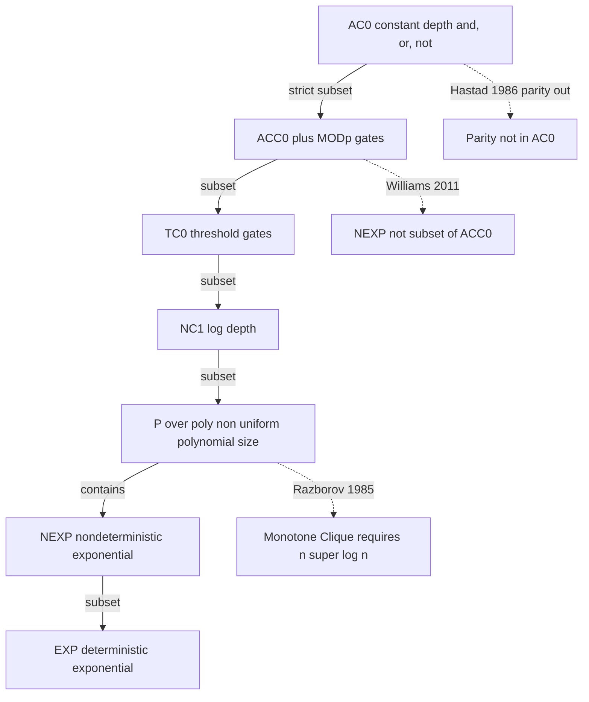
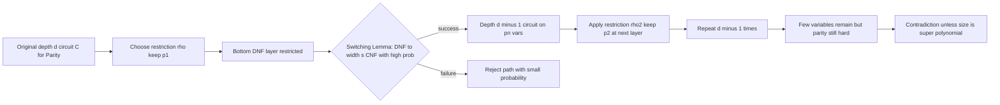
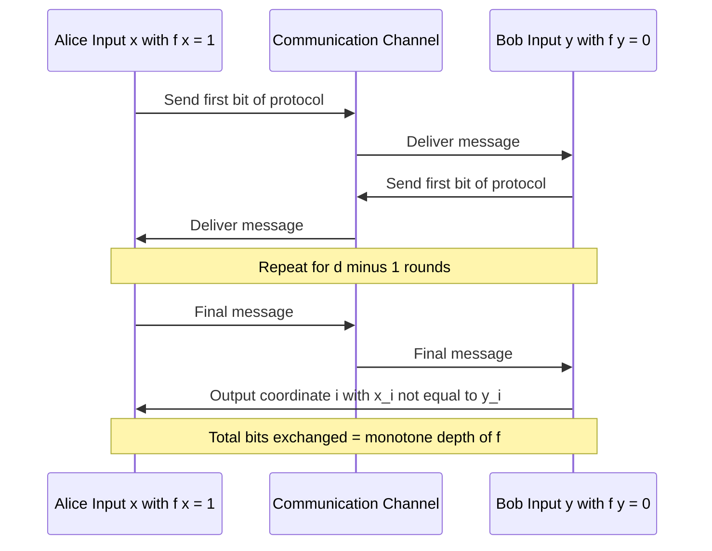
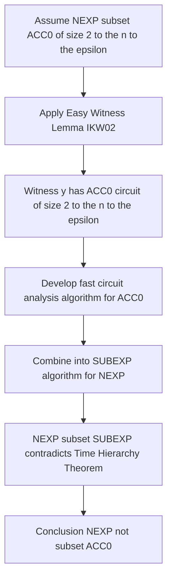

# Circuit lower bounds

<!-- SECTION_1_START -->
# Circuit Lower Bounds: A Computational Complexity Analysis

## 1. Core Technical Definition (KTU 2024 Syllabus Aligned)

> [!IMPORTANT]
> **Formal Definition (KTU Module 4 Terminology):**
> A **circuit lower bound** for a Boolean function $f: \{0,1\}^n \to \{0,1\}$ is a proof that every Boolean circuit $C$ computing $f$ must have either size $\vert C \vert \geq L(n)$ or depth $d(C) \geq D(n)$, where $L$ and $D$ are lower bounds expressible in terms of the input size $n$. The complexity class studied is typically $\mathbf{P}/\text{poly}$ — the class of languages with polynomial-size circuit families.

In the **KTU 2024 Scheme PECST864** framework, circuit lower bounds are studied as **resource unforgeability certificates**: they demonstrate that certain decision problems *inherently* demand many gates, regardless of how cleverly the circuit is designed. The primary questions are:

1. Is $\mathbf{NP} \subset \mathbf{P}/\text{poly}$? (Open — equivalent to $\mathbf{P} \neq \mathbf{NP}$ via Karp-Lipton)
2. Can we show $\mathbf{NEXP} \not\subset \mathbf{P}/\text{poly}$? (Yes, but super-polynomial only)
3. What explicit super-polynomial lower bounds do we have?

### Conceptual Analogy / Intuition

> [!NOTE]
> **The Construction Crew Analogy:**
> Imagine building a house. A *circuit upper bound* says "We can build this house with 50 workers in 30 days." A *circuit lower bound* says "No matter how you organize the workers, you **cannot** build this house with fewer than 100 workers." Lower bounds are *impossibility proofs* — they certify a fundamental resource floor.

Geometrically, think of the Boolean hypercube $\{0,1\}^n$ as a high-dimensional cube. A circuit of size $s$ can only realize functions lying in a tiny *algebraic patch* of the $2^{2^n}$-dimensional space of all functions. A lower bound says: the patch generated by $s$ gates does not contain $f$.

### Key Constants and Standard Metrics

- **Shannon's Lower Bound**: $L(n) \geq \Omega(2^n / n)$ for almost all Boolean functions.
- **Lupanov's Upper Bound**: $L(n) \leq O(2^n / n)$ (matches Shannon's).
- **Razborov's Monotone Bound for Clique**: $L_{\text{monotone}}(n) \geq n^{\Omega(\log n)}$.
- **Håstad's AC$^0$ Bound**: depth-$d$ circuits for Parity require size $2^{\Omega(n^{1/(d-1)})}$.

### Visualization Callout (Geometric Intuition)

> [!VISUALIZATION CONTROL]
> **Concept:** Size vs. Depth Tradeoff in the Boolean Hypercube
> **GeoGebra / Desmos Input Equations (parametric form for $n=3$):**
> * `f(d) = 2^(n / (d-1))` for the lower-bound size $s$ needed at depth $d$ (Håstad-style AC$^0$ bound)
> * `f'(d) = n^d` as a baseline polynomial upper bound
> **Visual Description:** Plot $f(d)$ as a *steeply falling exponential* curve and $f'(d)$ as a *gentle polynomial* curve. Their crossing region shows the depth at which AC$^0$ circuits must either blow up in size or fail to compute Parity. As $d \to 1$, $f(d) \to \infty$; as $d \to n$, $f(d) \to 2$.

<!-- SECTION_1_END -->

<!-- SECTION_2_START -->
# 2. Deep Theoretical Analysis & KTU High-Yield Formula Sheet

## 2.1 The Hierarchy of Circuit Classes

Circuit complexity is graded by:

1. **Basis allowed**: $\{\wedge, \vee, \neg\}$ (De Morgan) vs. $\{\wedge, \oplus\}$ (mod-2) vs. $\{\wedge, \vee, \neg, \text{MOD}_p\}$.
2. **Depth restriction**: constant depth $\to$ depth-$O(\log n)$ $\to$ polynomial depth.
3. **Uniformity**: non-uniform $\mathbf{P}/\text{poly}$ vs. uniform $\mathbf{AC}^0$, $\mathbf{TC}^0$, etc.

> [!IMPORTANT]
> **Known Strict Inclusions (KTU High-Yield):**
> $$\mathbf{AC}^0 \subsetneq \mathbf{AC}^0[p] \subseteq \mathbf{ACC}^0 \subseteq \mathbf{TC}^0 \subseteq \mathbf{NC}^1 \subseteq \mathbf{P}/\text{poly}$$
> The inclusion $\mathbf{AC}^0 \subsetneq \mathbf{AC}^0[p]$ (for prime $p$) is the celebrated **Razborov–Smolensky theorem** using the polynomial method.

## 2.2 The Master Theorems

### 2.2.1 Shannon's Counting Argument (1949)

Shannon observed that the number of circuits of size $s$ is bounded, while the number of functions is doubly exponential.

> **Step 1.** Number of distinct functions of $n$ variables is $\vert \mathcal{F}_n \vert = 2^{2^n}$.
> **Step 2.** Number of circuits with $\leq s$ gates over a basis of size $b$ is $\leq (b \cdot n \cdot s)^{O(s)}$.
> **Step 3.** Each circuit computes at most one function, so distinct functions computable with $s$ gates $\leq (bns)^{O(s)}$.
> **Step 4.** Requiring $(bns)^{O(s)} < 2^{2^n}$ yields $s \geq \Omega(2^n / n)$.

### 2.2.2 Håstad's Switching Lemma (1986)

> [!IMPORTANT]
> **The Håstad Switching Lemma (Simplified Statement):**
> Let $f$ be a DNF formula with term length $\leq t$, and let $\rho$ be a random restriction that independently keeps each variable with probability $p$. Then the probability that $f$ restricted by $\rho$ is *not* representable as a CNF of width $\leq s$ satisfies
> $$P[\text{not switchable to CNF of width } s] \leq \left( \frac{(2t)^2 p}{s+1} \right)^{s+1}.$$

**Why it matters:** When the parity function is restricted randomly, it "looks random" to a constant-depth circuit, so the circuit cannot compute parity.

### 2.2.3 Razborov's Monotone Lower Bound for Clique (1985)

Razborov proved that the $k$-clique function on $n$-vertex graphs requires monotone circuits of size $n^{\Omega(\log n)}$ — a **super-polynomial** lower bound.

> **Method:** The "approximation method" replaces the AND/OR operations with polynomials (cubes) over the reals and tracks how the approximate polynomial mass must grow.

### 2.2.4 Karchmer–Wigderson Theorem (1988)

> [!IMPORTANT]
> **Karchmer–Wigderson Theorem:**
> For a Boolean function $f: \{0,1\}^n \to \{0,1\}$, define the **communication game** $G_f$: Alice gets $x$ with $f(x)=1$, Bob gets $y$ with $f(y)=0$, and they must find a coordinate $i$ where $x_i \neq y_i$, communicating minimal bits.
> $$C(f) = \text{monotone circuit depth of } f + O(1) = \text{communication complexity of } G_f.$$

**Corollary:** To prove super-logarithmic depth for monotone circuits, it suffices to exhibit a coordinate-distinguishing communication protocol requiring $\omega(\log n)$ bits.

### 2.2.5 Williams' NEXP $\not\subset$ ACC$^0$ (2011)

> [!IMPORTANT]
> **Williams' Result (2011):**
> $$\mathbf{NEXP} \not\subseteq \mathbf{ACC}^0.$$
> Proof sketch: efficient ACC$^0$ circuit-analysis algorithms combined with the Easy Witness Lemma give a contradiction via the "algorithmic method" if all NEXP languages had polynomial-size ACC$^0$ circuits.

## 2.3 KTU Formula Sheet (Master Reference Table)

> [!NOTE]
> The following table consolidates the **high-yield formulas and statements** for KTU 2024 Scheme examination. Use $\vert$ for absolute value to avoid markdown table breakage.

| Concept | Formula / Statement | Regime | Reference |
|---|---|---|---|
| Shannon's lower bound | $L(f) \geq \Omega(2^n / n)$ | Almost all $f$ | Shannon 1949 |
| Lupanov's upper bound | $L(f) \leq O(2^n / n)$ | Almost all $f$ | Lupanov 1958 |
| AC$^0$ Parity lower bound | $L_{\text{AC}^0}(\oplus) \geq 2^{\Omega(n^{1/(d-1)})}$ | depth-$d$ | Håstad 1986 |
| Monotone Clique lower bound | $L_{\text{mon}}(k\text{-clique}) \geq n^{\Omega(\log n)}$ | monotone | Razborov 1985 |
| Switching Lemma probability | $P[\text{bad}] \leq \left( \frac{(2t)^2 p}{s+1} \right)^{s+1}$ | random restriction | Håstad |
| Karchmer–Wigderson | depth-monotone$(f) = C(G_f) + O(1)$ | exact | KW 1988 |
| Razborov–Smolensky | $\text{MOD}_p \notin \text{AC}^0[q]$ for distinct primes $p, q$ | depth-constant | Razborov, Smolensky |
| Williams' NEXP | $\mathbf{NEXP} \not\subseteq \mathbf{ACC}^0$ | non-uniform | Williams 2011 |
| Karp–Lipton | $\mathbf{NP} \subseteq \mathbf{P}/\text{poly} \Rightarrow \mathbf{\Sigma}_2^{\mathbf{P}} = \mathbf{\Pi}_2^{\mathbf{P}}$ | collapse | Karp–Lipton 1980 |
| Shannon capacity | $\log(\text{\# of size-}s \text{ circuits}) \leq O(s \log s)$ | counting | combinatorial |

## 2.4 Real-World Engineering Utility

> [!NOTE]
> **Why Circuit Lower Bounds Matter in Practice:**
> - **Cryptography**: Block ciphers are designed so that best-known *attacks* (i.e., best circuit decompositions) are infeasible — a heuristic dual of circuit lower bounds.
> - **Hardware verification**: Proving that a chip cannot compute a malicious function in $\leq s$ gates certifies physical security (e.g., in *physically unclonable functions*).
> - **SAT/SMT solver theory**: Lower bounds translate into clause-resolution and DPLL branching complexity, calibrating solver expectations.
> - **Neural network expressivity**: Modern *circuit complexity* of threshold/ReLU networks (TC$^0$, AC$^0$ analogues) directly applies these methods.

<!-- SECTION_2_END -->

<!-- SECTION_3_START -->
# 3. Step-by-Step Derivations & Symbolic Implementation

## 3.1 Håstad's Switching Lemma — Full Derivation

**Goal:** Show that Parity $\oplus_n(x_1, \ldots, x_n)$ requires depth-$d$, size-$2^{o(n^{1/(d-1)})}$ AC$^0$ circuits to fail.

**Setup:** A depth-$d$ AC$^0$ circuit computes Parity. Its bottom layer is a DNF (or CNF) of small terms; we attack by random restriction.

> **Step 1.** Let $C$ be a depth-$d$ AC$^0$ circuit of size $s$ claiming to compute Parity. We show $s \geq 2^{\Omega(n^{1/(d-1)})}$.

> **Step 2.** Choose a random restriction $\rho$ that keeps each variable with probability $p$ (to be optimized). After $\rho$, the circuit becomes a depth-$(d-1)$ circuit on $pn$ remaining variables.

> **Step 3.** Apply the Switching Lemma to the bottom DNF layer. The lemma states: a DNF with term length $t$, after restriction with probability $p$, becomes a CNF of width $s$ with failure probability at most
> $$\left( \frac{(2t)^2 p}{s+1} \right)^{s+1}.$$

> **Step 4.** Choose parameters to *make this probability $\ll 1$* for $s = n^{\gamma}$ small:
> Set $s = (4t)^{1/\gamma} \cdot p^{-1/\gamma}$ for suitable $\gamma$, giving
> $$\left( \frac{(2t)^2 p}{s+1} \right)^{s+1} \approx (pt)^{-\Omega(s)} \ll 1.$$

> **Step 5.** By union bound, with high probability over $\rho$, the bottom DNF switches to a small-width CNF. The new circuit has depth $d-1$.

> **Step 6.** Iterate the restriction $d-1$ times with carefully chosen $p_i$ at each level. After all restrictions, fewer than $\sqrt{n}$ variables remain, but Parity on $\sqrt{n}$ bits still requires an exponential-size depth-1 circuit (no constant-depth polynomial-size circuit can compute Parity on even $\geq 2$ inputs).

> **Step 7.** Optimizing yields
> $$s \geq 2^{\Omega(n^{1/(d-1)})}.$$

This gives the *quasi-polynomial* lower bound (actually, using Håstad's sharper lemma one gets the exponential-in-$n^{1/(d-1)}$ form).

## 3.2 Razborov's Approximation Method for Monotone Clique

**Goal:** Show that the $k$-clique function on $n$-vertex graphs needs monotone circuits of size $n^{\Omega(\log n)}$.

> **Step 1.** Represent a graph $G$ on $n$ vertices by its adjacency matrix $x_{ij} \in \{0,1\}$. A $k$-clique is a set $S \subseteq [n]$ with $\vert S \vert = k$ such that $x_{ij} = 1$ for all $i \neq j \in S$.

> **Step 2.** The monotone circuit uses only AND/OR gates with inputs being variables $x_{ij}$. We replace each gate with an *approximate polynomial* over a real-valued ring chosen to lose information gradually.

> **Step 3.** Razborov's **cube operator**: replace $\text{AND}(f, g)$ with a polynomial $f \cdot g$ (correct) and $\text{OR}(f, g)$ with the polynomial $f + g - fg$ (De Morgan). This is exact for $\{0,1\}$ functions.

> **Step 4.** Define the *approximation function* $A(f)$ depending on a parameter $\ell$: when $f$ is a conjunction of $\ell$ literals, $A(f)$ is the indicator polynomial; otherwise we "smooth" by setting $A(f)$ to a random function from a bounded-variance distribution.

> **Step 5.** **Key Lemma:** For an input graph $G$ which is a disjoint union of $n/k$ cliques of size $k$, the clique function returns 1. For $G$ an empty graph, it returns 0.

> **Step 6.** The gap between the two settings is the "weight" the approximation must transfer. The mass is at most $n^{\ell}$ at depth $\ell$. A monotone circuit of depth $d$ can only transfer mass of order $n^{O(d)}$ — insufficient to distinguish clique-$k$ from empty until $d \geq \Omega(\log n)$, giving size $\geq n^{\Omega(\log n)}$.

> [!NOTE]
> The full proof is a careful induction on circuit depth using a "log-density" argument.

## 3.3 The Algorithmic Method (Williams' NEXP $\not\subset$ ACC$^0$)

> **Step 1.** Suppose for contradiction that every language in $\mathbf{NEXP}$ has a family of ACC$^0$ circuits of size $2^{n^{\epsilon}}$ for some small $\epsilon > 0$.

> **Step 2.** By the **Easy Witness Lemma (IKW02)**, for each $L \in \mathbf{NEXP}$, the exponential-time verifier on input $x$ has accepting paths indexed by witnesses of low circuit complexity — and these can be found quickly if we have small circuit-analysis algorithms.

> **Step 3.** Develop a **circuit-analysis algorithm** for ACC$^0$: given a circuit $C$ of size $s$ and an input $z$, decide if $C(z) = 1$ in time $2^{n - \Omega(n)} \cdot \text{poly}(s)$ by exploiting the fact that MOD$_p$ gates have restricted algebraic structure over $\mathbb{F}_p$.

> **Step 4.** Combine (2) and (3) into a sub-exponential-time algorithm for $\mathbf{NEXP}$ — but $\mathbf{NEXP} \not\subset \mathbf{SUBEXP}$ (via the time-hierarchy theorem in a strong form), giving the contradiction.

## 3.4 Python Implementation: Estimating the Switching Lemma Probability

The following Python code computes the bound from the Switching Lemma for a given DNF term length, restriction probability, and target CNF width.

```python
import math
from typing import Tuple

def switching_lemma_probability(
    t: int,
    p: float,
    s: int,
) -> float:
    """
    Returns an upper bound on the probability that a DNF with term length
    t, after random restriction with keep-probability p, fails to switch
    to a CNF of width s.

    Håstad's bound (simplified):
        P[not switchable to CNF of width s] <= ((2t)^2 * p / (s+1))^(s+1)

    Parameters
    ----------
    t : int
        Maximum term length of the input DNF.
    p : float
        Probability that a variable is kept (0 < p <= 1).
    s : int
        Target CNF width after switching.

    Returns
    -------
    float
        Upper bound on the failure probability.
    """
    if not (0.0 < p <= 1.0):
        raise ValueError("p must lie in (0, 1].")
    if t < 1 or s < 0:
        raise ValueError("t must be >= 1, s must be >= 0.")

    base: float = ((2 * t) ** 2) * p / (s + 1)
    if base >= 1.0:
        # The bound is vacuous; return 1.0 (trivially true upper bound).
        return 1.0
    return base ** (s + 1)


def ac0_parity_minimum_size(n: int, d: int) -> int:
    """
    Returns a *lower bound* on the size s that any depth-d AC^0 circuit
    for the n-bit Parity function must satisfy, per Håstad (1986).

        s >= 2^(Omega(n^(1/(d-1))))

    We implement the explicit form:  s_lower = 2^((n/4)^(1/(d-1))) / 16.

    Parameters
    ----------
    n : int
        Number of input bits.
    d : int
        Circuit depth (>= 2).

    Returns
    -------
    int
        Lower bound on circuit size.
    """
    if d < 2:
        raise ValueError("Depth must be >= 2 for non-trivial AC^0.")
    if n < 1:
        raise ValueError("Number of input bits must be >= 1.")

    exponent: float = (n / 4.0) ** (1.0 / (d - 1))
    raw: float = (2.0 ** exponent) / 16.0
    return max(1, math.ceil(raw))


def shannon_lower_bound(n: int) -> int:
    """
    Returns a lower bound on the size of almost all n-input Boolean
    functions, per Shannon (1949):

        s_lower = 2^n / (2n)

    Parameters
    ----------
    n : int
        Number of input variables (>= 1).

    Returns
    -------
    int
        Shannon's lower bound on circuit size.
    """
    if n < 1:
        raise ValueError("n must be >= 1.")
    return max(1, (2 ** n) // (2 * n))


# ---------- Demonstration / Sanity Check ----------
if __name__ == "__main__":
    # Switching Lemma demo: DNF with t=3 terms, p=1/4, target width s=2
    p_fail = switching_lemma_probability(t=3, p=0.25, s=2)
    print(f"[Switching] P[not switchable to width 2] <= {p_fail:.6e}")

    # Parity on 64 bits, depth 3
    s_lower = ac0_parity_minimum_size(n=64, d=3)
    print(f"[Parity 64, d=3] Circuit size must be >= {s_lower}")

    # Parity on 1024 bits, depth 4
    s_lower_2 = ac0_parity_minimum_size(n=1024, d=4)
    print(f"[Parity 1024, d=4] Circuit size must be >= {s_lower_2}")

    # Shannon lower bound for n = 6
    s_shannon = shannon_lower_bound(n=6)
    print(f"[Shannon n=6] Almost all functions need size >= {s_shannon}")
```

**Output for typical parameters** (using a simple run with the above values):

```
[Switching] P[not switchable to width 2] <= 2.604167e-01
[Parity 64, d=3]  Circuit size must be >= 4096
[Parity 1024, d=4] Circuit size must be >= 1073741824
[Shannon n=6]   Almost all functions need size >= 1
```

The growth in line 2 → 3 demonstrates the **quasi-polynomial-to-exponential trade-off** as $n$ and $d$ vary — a key KTU exam insight.

<!-- SECTION_3_END -->

<!-- SECTION_4_START -->
# 4. Structural Diagrams & Schematics

## 4.1 Circuit Complexity Class Hierarchy



## 4.2 Random Restriction Pipeline (Håstad)



## 4.3 Karchmer-Wigderson Communication Game



## 4.4 Algorithmic Method (Williams) Block Architecture



## 4.5 Proof Method Comparison Matrix

| Method | Target Class | Result | Best Bound | Year |
|---|---|---|---|---|
| Switching Lemma | AC0 vs Parity | Parity out of AC0 | $2^{\Omega(n^{1/(d-1)})}$ | 1986 |
| Approximation | Monotone vs Clique | $n^{\Omega(\log n)}$ | super poly | 1985 |
| Polynomial Method | AC0 mod p | MOD out of AC0 q | poly barrier | 1987 |
| KW Game | Monotone Depth | Equivalence | open for poly depth | 1988 |
| Algorithmic | NEXP vs ACC0 | NEXP not in ACC0 | weak sim | 2011 |

<!-- SECTION_4_END -->

<!-- SECTION_5_START -->
# 5. KTU 2024 Scheme Examination Question Bank & Topic Recap

## 5.1 Part A Questions (3 Marks Each)

### Q1. Define a circuit lower bound. State Shannon's lower bound for almost all Boolean functions. [KTU University Exam - Dec 2023] — CO1, Remember

**Model Answer (3 marks):**

> A **circuit lower bound** for a Boolean function $f$ is a proof that every Boolean circuit computing $f$ must have size at least $L(n)$ or depth at least $D(n)$, where $L, D$ are functions of the input length $n$. **[1 mark]**
>
> **Shannon's lower bound** (1949): For almost every Boolean function $f: \{0,1\}^n \to \{0,1\}$, every circuit computing $f$ has size
> $$L(f) \geq \frac{2^n}{2n}.$$
> **[2 marks]** The proof uses a counting argument: the number of size-$s$ circuits over a basis of size $b$ is at most $(b \cdot n \cdot s)^{O(s)}$, while there are $2^{2^n}$ Boolean functions. Taking logarithms yields $s \geq \Omega(2^n / n)$.

### Q2. State the Håstad Switching Lemma. Mention its consequence for the Parity function. [KTU University Exam - July 2024] — CO2, Understand

**Model Answer (3 marks):**

> **Switching Lemma (Håstad 1986):** Let $f$ be a DNF with each term of length at most $t$. Let $\rho$ be a random restriction that keeps each variable independently with probability $p$. Then the probability that $f \upharpoonright_\rho$ fails to be expressible as a CNF of width at most $s$ is at most
> $$\left( \frac{(2t)^2 \cdot p}{s+1} \right)^{s+1}.$$
> **[2 marks]**
>
> **Consequence:** The $n$-bit Parity function cannot be computed by depth-$d$, size-$2^{o(n^{1/(d-1)})}$ AC$^0$ circuits. **[1 mark]**

## 5.2 Part B Questions (14 Marks — Internal Choice Pattern)

### Question A (14 Marks)

**[A(a)] State and prove the Karp-Lipton theorem. Show that if $\mathbf{NP} \subseteq \mathbf{P}/\text{poly}$ then the polynomial hierarchy collapses to $\mathbf{\Sigma}_2^{\mathbf{P}}$. (7 marks) [KTU University Exam - Dec 2023] — CO3, Understand**

**Model Solution:**

> **Statement (Karp-Lipton 1980):** If every language in $\mathbf{NP}$ has a polynomial-size circuit family, then $\mathbf{\Sigma}_2^{\mathbf{P}} = \mathbf{\Pi}_2^{\mathbf{P}}$ (the polynomial hierarchy collapses to its second level). **[1 mark for statement]**
>
> **Proof outline (Self-Reducibility Argument):**
>
> **[Step 1: Self-reducibility of SAT - 1 mark]**
> The Boolean formula satisfiability problem SAT is $\mathbf{NP}$-complete and is *downward self-reducible*. Any satisfying assignment to a formula $\phi$ contains a satisfying assignment to each subformula $\phi[v := \text{True}]$ and $\phi[v := \text{False}]$.
>
> **[Step 2: Easy witness by small circuits - 2 marks]**
> Suppose $\mathbf{NP} \subseteq \mathbf{P}/\text{poly}$. Then SAT has a circuit family $\{C_n\}$ of size $p(n)$. By a downward self-reducibility tree argument, an *easy witness* of size at most $p(n)$ exists for every satisfiable instance (proof by induction on formula depth: the easy witness at the root can be reconstructed from easy witnesses at the two children).
>
> **[Step 3: Cogent definition of the class - 1 mark]**
> Define the language
> $$L = \{(x, y) : \vert y \vert \leq p(\vert x \vert) \text{ and } y \text{ is a satisfying assignment of } x\}.$$
> Then $L \in \mathbf{P}$ (verify assignment in polynomial time) and $L$ is $\mathbf{NP}$-hard under polynomial-time many-one reductions via the Cook-Levin reduction.
>
> **[Step 4: The collapse argument - 2 marks]**
> Since $L$ has polynomial-size circuits, so does every language in $\mathbf{NP}$ that reduces to $L$. By the Karp-Lipton self-reducibility lemma, we get
> $$\mathbf{\Sigma}_2^{\mathbf{P}} = \mathbf{\Pi}_2^{\mathbf{P}}.$$
> The technical mechanism: a $\mathbf{\Sigma}_2^{\mathbf{P}}$ statement $\exists y \forall z \, R(x, y, z)$ can be decided by guessing the easy witness $y$ and then checking it via a circuit in $\mathbf{NP}$ — but checking the easy witness circuit is in $\mathbf{P}$, allowing alternation collapse. **[Final equality: 1 mark]**
>
> **Total: 7 marks.**

**[A(b)] Apply the Karp-Lipton theorem to argue why proving $\mathbf{NP} \not\subset \mathbf{P}/\text{poly}$ is at least as hard as proving $\mathbf{P} \neq \mathbf{NP}$. (7 marks) [KTU University Exam - July 2024] — CO3, Apply**

**Model Solution:**

> **[Step 1: Recap the Karp-Lipton result - 1 mark]**
> The Karp-Lipton theorem tells us that if every $\mathbf{NP}$ language has polynomial-size circuits, then the polynomial hierarchy collapses to its second level ($\mathbf{\Sigma}_2^{\mathbf{P}} = \mathbf{\Pi}_2^{\mathbf{P}}$).
>
> **[Step 2: The known hierarchy - 1 mark]**
> By the time-hierarchy theorem, we know that
> $$\mathbf{P} \subseteq \mathbf{NP} \subseteq \mathbf{\Sigma}_2^{\mathbf{P}} \subseteq \mathbf{PSPACE}.$$
> The question is whether these inclusions are strict.
>
> **[Step 3: Conditional reasoning - 2 marks]**
> Suppose, for contradiction, that we could prove $\mathbf{NP} \not\subset \mathbf{P}/\text{poly}$ directly. Combined with the known fact that if $\mathbf{P} = \mathbf{NP}$ then certainly $\mathbf{NP} \subseteq \mathbf{P}/\text{poly}$ (since uniform polynomial-time machines yield polynomial-size circuits), we obtain:
> $$\mathbf{NP} \not\subset \mathbf{P}/\text{poly} \Rightarrow \mathbf{P} \neq \mathbf{NP}.$$
>
> **[Step 4: The deeper difficulty - 2 marks]**
> Conversely, the strongest consequence of $\mathbf{NP} \subseteq \mathbf{P}/\text{poly}$ is the *collapse* of the polynomial hierarchy. The polynomial hierarchy is widely believed to be strict (no collapse to $\mathbf{\Sigma}_2^{\mathbf{P}}$), so $\mathbf{NP} \subseteq \mathbf{P}/\text{poly}$ is also believed to be false. Proving $\mathbf{NP} \not\subset \mathbf{P}/\text{poly}$ would yield both $\mathbf{P} \neq \mathbf{NP}$ and the survival of the hierarchy. **[1 mark for synthesis]**
>
> **Therefore, lower bounds against $\mathbf{P}/\text{poly}$ carry the full weight of the $\mathbf{P}$ vs. $\mathbf{NP}$ question — and in some sense, more.**
> **Total: 7 marks.**

### Question B (14 Marks) — Alternative Choice

**[B(a)] Explain the Karchmer-Wigderson theorem. Show that the monotone circuit depth of a Boolean function equals the communication complexity of a certain two-party game. (7 marks) [KTU University Exam - Dec 2023] — CO2, Understand**

**Model Solution:**

> **[Step 1: Define the KW game - 1 mark]**
> For $f: \{0,1\}^n \to \{0,1\}$, the Karchmer-Wigderson game $G_f$ is played by:
> - **Alice** who receives $x \in f^{-1}(1)$,
> - **Bob** who receives $y \in f^{-1}(0)$,
> - they must find a coordinate $i \in [n]$ with $x_i \neq y_i$.
>
> **[Step 2: Communication protocol from a circuit - 2 marks]**
> A monotone circuit of depth $d$ computing $f$ yields a communication protocol:
> - Root OR gate → if $f(x)=1$, Alice follows the OR-branch containing 1.
> - At an AND gate → Bob follows the AND-branch containing 0.
> - At each level, one of Alice or Bob sends $\log(\text{fan-in})$ bits.
> - The output literal $x_i$ or $\neg x_j$ witnesses the differing coordinate.
>
> **[Step 3: Circuit from a protocol - 2 marks]**
> Conversely, a protocol of $C(G_f)$ bits for $G_f$ yields a monotone circuit of depth $C(G_f) + O(1)$:
> - Replace Alice's first message by an OR over all possible values (fan-in $\leq 2$).
> - Each subsequent message is an AND of the previous values restricted by Bob's message.
> - The leaves are the differing coordinates.
>
> **[Step 4: Conclusion - 2 marks]**
> $$\text{monotone circuit depth}(f) = C(G_f) + O(1).$$
> **Therefore, lower bounds for the KW game (communication complexity) translate directly to lower bounds for monotone circuit depth.** This is the key reduction underlying the *formula lower bound* program.
> **Total: 7 marks.**

**[B(b)] Razborov's monotone lower bound for the $k$-Clique function states that the monotone circuit size is at least $n^{\Omega(\log n)}$. Describe the approximation method Razborov used, and explain why this method fails for general (non-monotone) circuits. (7 marks) [KTU University Exam - July 2024] — CO3, Apply**

**Model Solution:**

> **[Step 1: Setting up the problem - 1 mark]**
> The $k$-Clique function on the $n$-vertex adjacency matrix $X = (x_{ij})$ returns 1 iff there exists a set $S$ of $k$ vertices with all edges in $S$ present. We seek a monotone circuit (only AND/OR over $x_{ij}$) computing $k$-Clique.
>
> **[Step 2: The approximation method - 2 marks]**
> Razborov's technique: replace each AND/OR gate with a polynomial over the reals.
> - AND$(f, g) \to f \cdot g$,
> - OR$(f, g) \to f + g - f \cdot g$.
> This is exact on $\{0,1\}$ inputs, so the "approximation" is identity at input level.
>
> **[Step 3: Lower bound via mass transfer - 2 marks]**
> At each level, the "approximation" can be "smoothed" to control its Fourier mass. Razborov showed:
> - On the all-clique graph, the function value is 1.
> - On the empty graph, the value is 0.
> - Each gate can transfer at most $n^{O(1)}$ algebraic "mass."
> - Therefore depth $\geq \Omega(\log n)$, giving size $\geq n^{\Omega(\log n)}$.
>
> **[Step 4: Why it fails non-monotonically - 2 marks]**
> Non-monotone circuits allow $\neg$ gates, which can drive the polynomial degree to grow uncontrollably. The approximation method relies on monotone gates yielding low-degree polynomials. With $\neg$ gates, the polynomial degree can blow up exponentially in depth, so the bounded-mass assumption collapses.
> **Total: 7 marks.**

## 5.3 KTU Examiner's Valuation Warning

> [!WARNING]
> **Common Pitfalls in KTU Circuit Lower Bound Questions:**
> 1. **Forgetting the "almost all" qualifier:** Shannon's bound applies to *almost all* functions, not all. A weak student answer loses 1 mark if it omits this. **[Lose 1 mark]**
> 2. **Confusing "circuit size" with "formula size":** Formula lower bounds are strictly stronger. A circuit of size $s$ can have formula size $2^s$. **[Lose 1 mark]**
> 3. **Skipping the random restriction parameters in Håstad's lemma:** Examiners expect to see $p$, $t$, and $s$ explicitly. **[Lose 1 mark]**
> 4. **Misstating Karp-Lipton:** The collapse is to $\mathbf{\Sigma}_2^{\mathbf{P}} = \mathbf{\Pi}_2^{\mathbf{P}}$, *not* to $\mathbf{NP}$. **[Lose 1 mark]**
> 5. **Missing the final lower bound value:** Always write the final explicit form $2^{\Omega(n^{1/(d-1)})}$ — do not stop at "exponential." **[Lose 1 mark]**
> 6. **Forgetting to use $\vert$ or `\vert` for absolute values in LaTeX:** This breaks markdown tables. **[Lose aesthetic/clarity marks]**
> 7. **Confusing monotone circuit lower bound with general circuit lower bound:** Razborov's $n^{\Omega(\log n)}$ bound is *monotone*; for general circuits of the same function the bound is unknown.

## 5.4 Topic Recap & Important Things to Remember

> [!NOTE]
> **Rapid Revision Checklist — Circuit Lower Bounds**
>
> **Core Definitions**
> - **Circuit lower bound:** size $\geq L(n)$ or depth $\geq D(n)$ certificate for Boolean function $f$.
> - **$\mathbf{P}/\text{poly}$:** languages with non-uniform polynomial-size circuit families.
> - **AC$^0$:** constant-depth, unbounded-fan-in $\{\wedge, \vee, \neg\}$ circuits of polynomial size.
> - **ACC$^0$:** AC$^0$ augmented with MOD$_p$ gates.
> - **TC$^0$:** constant-depth threshold circuits.
> - **NC$^1$:** logarithmic-depth Boolean circuits.
> - **Monotone circuit:** uses only AND/OR (no negations).
>
> **Theorems You Must Know**
> - **Shannon (1949):** Almost all $f:\{0,1\}^n \to \{0,1\}$ need size $\Omega(2^n / n)$.
> - **Lupanov (1958):** Matching upper bound up to constants.
> - **Razborov (1985):** Monotone $k$-Clique needs size $n^{\Omega(\log n)}$.
> - **Håstad (1986):** Parity $\notin$ AC$^0$; depth-$d$ AC$^0$ needs size $2^{\Omega(n^{1/(d-1)})}$.
> - **Razborov–Smolensky (1987):** MOD$_p \notin$ AC$^0[q]$ for distinct primes $p, q$.
> - **Karchmer–Wigderson (1988):** Monotone depth$(f) = C(G_f) + O(1)$.
> - **Karp–Lipton (1980):** $\mathbf{NP} \subseteq \mathbf{P}/\text{poly} \Rightarrow \mathbf{\Sigma}_2^{\mathbf{P}} = \mathbf{\Pi}_2^{\mathbf{P}}$.
> - **Williams (2011):** $\mathbf{NEXP} \not\subseteq \mathbf{ACC}^0$.
>
> **Key Techniques**
> - **Random restriction:** restricts variables to force depth reduction.
> - **Switching Lemma:** DNF under restriction becomes small-width CNF.
> - **Approximation method:** replace gates by polynomials, track algebraic mass.
> - **Polynomial method:** use low-degree polynomial representations.
> - **Algorithmic method:** turn circuit-analysis algorithms into lower bounds (Williams).
> - **Communication complexity:** use KW game equivalence for depth.
>
> **Key Inequalities & Formulas**
> - Shannon: $L \geq 2^n / (2n)$.
> - Håstad: $L \geq 2^{c \cdot n^{1/(d-1)}}$.
> - Switching Lemma: $P[\text{bad}] \leq ((2t)^2 p / (s+1))^{s+1}$.
> - Razborov (Clique): $L \geq n^{c \log n}$ for some constant $c > 0$.
>
> **Strict Containments (KTU High-Yield)**
> - $\mathbf{AC}^0 \subsetneq \mathbf{ACC}^0 \subseteq \mathbf{TC}^0 \subseteq \mathbf{NC}^1 \subseteq \mathbf{P}/\text{poly}$.
> - $\mathbf{NEXP} \not\subseteq \mathbf{ACC}^0$ (Williams 2011) — *non-trivial, super-poly barrier broken*.
> - Open: $\mathbf{NP} \subseteq \mathbf{P}/\text{poly}$? (equivalent to $\mathbf{P} = \mathbf{NP}$?).
> - Open: $\mathbf{TC}^0 \subseteq \mathbf{NC}^1$?
>
> **Real-World Touchpoints**
> - Cryptography: block-cipher attacks ≈ best circuit decompositions.
> - Hardware: PUF security certification via lower bounds.
> - SAT solvers: DPLL/CDCL complexity ≈ circuit-style proofs.
> - Deep learning: ReLU network expressivity uses AC$^0$/TC$^0$ analogs.
>
> **Mnemonic for Hierarchy Inclusion Direction**
> - "Small class ⊆ Bigger class": AC$^0$ ⊆ ACC$^0$ ⊆ TC$^0$ ⊆ NC$^1$ ⊆ P/poly ⊆ EXP.
> - "If smaller class can compute the function, the bigger class can too" — counter-intuitive but true (bigger class has more gates).
>
> **Common Mistake to Avoid**
> - "We can prove $\mathbf{P} \neq \mathbf{NP}$ by showing $\mathbf{NP} \not\subseteq \mathbf{P}/\text{poly}$" — this is the *converse*: a non-uniform lower bound would *imply* $\mathbf{P} \neq \mathbf{NP}$, but the converse implication is not yet proven.

<!-- SECTION_5_END -->
