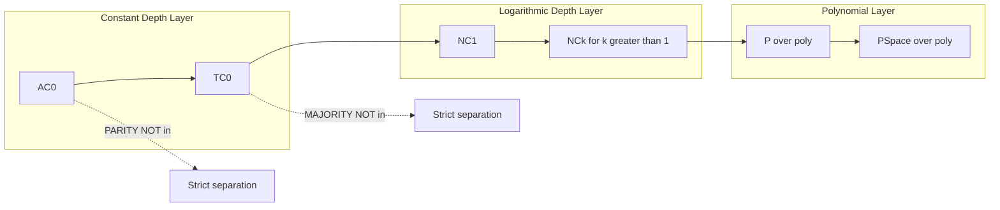
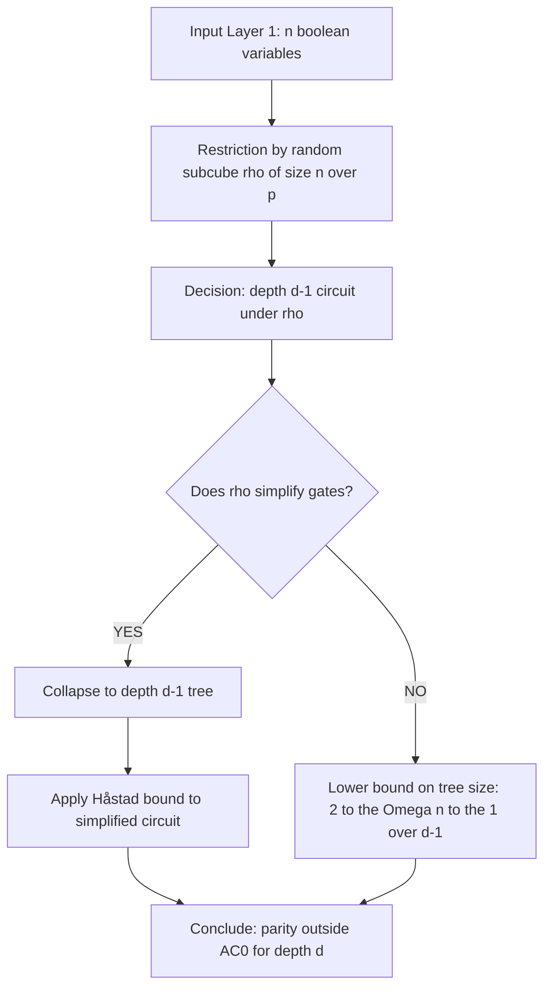
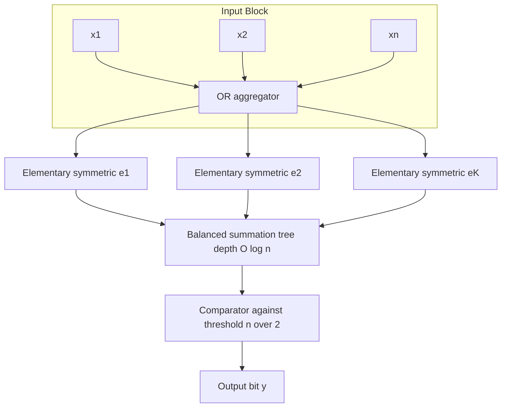
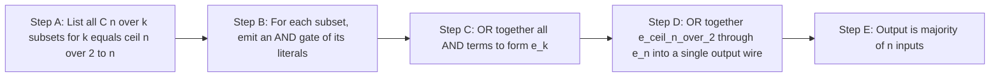

# Complexity of specific functions.

<!-- SECTION_1_START -->
# Complexity of Specific Functions — Circuit Complexity

> [!NOTE]
> **Module Focus (KTU PECST864 / M4):** This module quantifies *exactly* how many gates (size) and how much parallelism (depth) are required to compute particular Boolean functions — most famously, **Parity**, **Majority**, **AND/OR**, and **Symmetric** functions — under various gate-type and depth restrictions.

## 1.1 Formal Definition (KTU 2024 Terminology)

A **Boolean function** $f: \{0,1\}^n \rightarrow \{0,1\}$ is said to have **circuit complexity** $C(f)$ equal to the minimum number of gates (over the chosen basis) in any Boolean circuit that computes $f$. A **circuit family** $\{C_n\}_{n \ge 1}$ is a sequence of circuits, one for each input length.

The **complexity of a specific function** refers to asymptotic lower and upper bounds (in terms of size $S(n)$ and depth $D(n)$) for particular canonical functions such as:

$$
f_{\text{PARITY}}(x_1, \dots, x_n) = \bigoplus_{i=1}^{n} x_i
$$

$$
f_{\text{MAJ}}(x_1, \dots, x_n) = 1 \iff \sum_{i=1}^{n} x_i \ge n/2
$$

$$
f_{\text{AND}}(x_1, \dots, x_n) = \bigwedge_{i=1}^{n} x_i
$$

> [!IMPORTANT]
> **KTU 2024 Highlight:** The *circuit complexity of a function* is *not* a single number; it is a tuple $(S(n), D(n))$ parametrized by the underlying **gate basis** ($\land, \lor, \neg$ vs $\oplus, \land$ vs threshold gates vs De Morgan basis).

## 1.2 Intuitive Overview — The "Voting Booth" Analogy

Imagine an **electronic voting machine** with $n$ switches. Each switch $x_i \in \{0,1\}$ is a voter's "Yes" button.

* **AND function** $\Rightarrow$ a *unanimous vote* is required (all $n$ voters must press). Easy to build — just a single chain.
* **OR function** $\Rightarrow$ *any one* voter saying "Yes" suffices. Equally trivial.
* **MAJORITY** $\Rightarrow$ the *headcount rule*. You literally have to count; you cannot short-circuit. A constant-depth circuit is *forced* to do this counting in parallel, which is why majority sits high in the complexity hierarchy.
* **PARITY** $\Rightarrow$ "is the number of Yes-votes **odd**?" This is the **most adversarial** of all: changing *any single vote* flips the answer. The function has maximum sensitivity.

> [!VISUALIZATION CONTROL]
> **Concept:** Circuit-depth vs. circuit-size trade-off for $f_{\text{PARITY}}$ on $n=4$ inputs.
> **GeoGebra / Desmos Input Equations:**
> * `g(n, d) = 2^(n/d)` — points $(n, g)$ for $d=1,2,3,4$ plot size as depth varies.
> * `h(n) = 2^(n-1)` — Shannon lower bound for parity on 2-level circuits.
> **Visual Description:** As depth $d$ increases, required size shrinks exponentially, but no constant-depth circuit can ever reach polynomial size for parity.

## 1.3 The Gate-Basis Question

The same function can have wildly different complexity depending on the allowed gates:

| Basis | Description | Parity $C(f)$ | Majority $C(f)$ |
|---|---|---|---|
| $\{\land, \lor, \neg\}$ | Boolean basis | $\Theta(2^n)$ | $\Theta(n)$ |
| $\{\oplus, \land, 1\}$ | Arithmetic | $n-1$ (a wire) | $O(n^2)$ |
| $\{\text{THR}\}$ | Threshold | $O(n)$ | $O(\log n)$ |
| $\{\text{MAJ}\}$ | Majority only | Unbounded | 1 gate |

> [!TIP]
> KTU examiners frequently test whether a student can identify **which basis** is in use before quoting a bound. Always state the basis explicitly in your answer.

<!-- SECTION_1_END -->

<!-- SECTION_2_START -->
# Deep Theoretical Analysis & KTU High-Yield Formula Sheet

## 2.1 The Four Canonical Functions and Their Complexities

### 2.1.1 Parity ($\oplus$) — The "Hardest" Symmetric Function

> [!IMPORTANT]
> **KTU Favourite:** Parity is the *poster child* for proving that constant-depth circuits cannot compute certain functions efficiently.

**Lower bound (Shannon / Khovanasvich–Kleitman–Sipser):**

$$
C_{\text{AND-OR-NOT}}(f_{\text{PARITY}_n}) \ge 2^{\,n-1}
$$

The proof uses the *Håstad Switching Lemma* (1986): for any depth-$d$ unbounded-fan-in AC$^0$ circuit computing parity,

$$
\text{Size}(C_n) \;\ge\; 2^{\,\Omega\!\left(n^{1/(d-1)}\right)}
$$

This is **exponential** for every constant $d$, hence parity $\notin \textbf{AC}^0$.

### 2.1.2 Majority — The "Counting" Function

The majority function can be computed by a circuit of size $O(n)$ and depth $O(\log n)$ over $\{\oplus, \land, 1\}$ (binary summation tree), but **not** in constant depth of polynomial size over $\{\land, \lor, \neg\}$.

**Key Theorem (Ajtai–Komlós–Szemerédi, 1983; improved by Håstad):**

$$
C_{\text{AC}^0}(f_{\text{MAJ}_n}) \;\ge\; 2^{\,\Omega(n^{1/(d-1)})}
$$

Equivalently, **Majority $\notin \textbf{AC}^0$** (otherwise $\textbf{AC}^0$ would equal $\textbf{TC}^0$, which is known to be false).

### 2.1.3 AND and OR — The "Trivial" Functions

* Single-gate, depth 1.
* Useful as a **starting point** for reductions: if $f \le_m^p g$ (polynomial-time many-one reduces to $g$), then $C(f) \le C(g) + \text{poly}(n)$.

### 2.1.4 Symmetric Functions — Generalisation

A function is **symmetric** if $f(x) = f(\pi(x))$ for every permutation $\pi$. Any symmetric function $f$ of $n$ variables is determined by the value of the **symmetric polynomial**:

$$
s_k(x) = \sum_{1 \le i_1 < \cdots < i_k \le n} x_{i_1} x_{i_2} \cdots x_{i_k}
$$

**Theorem (Shannon, 1949):** Every symmetric Boolean function has a polynomial-size, $O(\log n)$-depth circuit over $\{\oplus, \land, 1\}$.

## 2.2 The Two-Pillar Result: Shannon's Lower Bound & Lupanov's Upper Bound

Let $B(n)$ be the number of distinct Boolean functions on $n$ variables, so $B(n) = 2^{2^n}$. The number of circuits of size $s$ over a basis of $b$ gates is bounded by $(b \cdot s)^{2s}$.

> [!NOTE]
> **Pigeonhole Argument (Shannon, 1949):** For "almost every" Boolean function $f$,
> $$
> C(f) \;\ge\; \frac{2^n}{2n}\;(1 + o(1)).
> $$
> In particular, **there exists** a function whose circuit size is $\Omega(2^n / n)$.

> [!NOTE]
> **Lupanov's Theorem (1958):** For *every* Boolean function $f$,
> $$
> C(f) \;\le\; \frac{2^n}{n}\;(1 + o(1)).
> $$
> Hence Shannon's lower bound is *tight up to a constant factor* in the exponent.

## 2.3 Complexity Class Hierarchy (Gate-Type Sensitive)

| Class | Depth | Fan-in | Notable Containments |
|---|---|---|---|
| $\textbf{AC}^0$ | $O(1)$ | Unbounded | $\textbf{AC}^0 \subsetneq \textbf{TC}^0$ |
| $\textbf{TC}^0$ | $O(1)$ | Threshold gates | $\textbf{TC}^0 \subsetneq \textbf{NC}^1$ |
| $\textbf{NC}^1$ | $O(\log n)$ | Bounded (2) | $\textbf{NC}^1 \subseteq \textbf{P}/\text{poly}$ |
| $\textbf{P}/\text{poly}$ | Polynomial | Bounded | $\textbf{P}/\text{poly} \supseteq \textbf{P}$ |

> [!WARNING]
> KTU Pitfall: The chain $\textbf{AC}^0 \subset \textbf{AC}^1 \subset \textbf{NC}^1$ is **strict** but the proof is *non-trivial*. Do not write "obviously strict" — cite parity or a counting argument.

## 2.4 KTU Formula Sheet / Cheat Sheet

| # | Formula / Theorem | Statement | Basis Required | Use |
|---|---|---|---|---|
| 1 | $C(\text{PARITY}_n) \ge 2^{n-1}$ | Exponential lower bound | $\{\land,\lor,\neg\}$ | Shows AND/OR/NOT alone is weak |
| 2 | $\text{Size}_{\textbf{AC}^0}(\text{PARITY}) \ge 2^{\Omega(n^{1/(d-1)})}$ | Håstad Switching Lemma | $\{\land,\lor,\neg\}$, depth $d$ | Proves $\text{PARITY} \notin \textbf{AC}^0$ |
| 3 | $C(\text{MAJ}_n) = O(n)$ | Linear upper bound | $\{\oplus, \land, 1\}$ | Construction of sum-tree |
| 4 | $C(\text{MAJ}_n) \ge 2^{\Omega(n^{1/(d-1)})}$ | AKS / Håstad bound | $\{\land,\lor,\neg\}$, depth $d$ | Proves $\text{MAJ} \notin \textbf{AC}^0$ |
| 5 | $\exists f: C(f) \ge \Omega(2^n / n)$ | Shannon counting | Any | Existence of hard functions |
| 6 | $\forall f: C(f) \le (1+o(1))\,2^n / n$ | Lupanov upper bound | $\{\land,\lor,\neg\}$ | Tightness of Shannon |
| 7 | $\textbf{NC}^1 \subseteq \textbf{L}$ (conjectured) | Open: uniform NC$^1$ in Logspace | Bounded fan-in, $O(\log n)$ depth | Frontier of circuit lower bounds |
| 8 | $f \le_m^p g \Rightarrow C(f) \le C(g) + \text{poly}(n)$ | Reduction preserves circuit-size | Any | Transferring lower bounds |

> [!IMPORTANT]
> **Real-World Utility:** These complexity classes govern the design of *parallel algorithms* (NC = "Nick's Class" for efficient PRAM computation), *hardware synthesis* (constant-depth circuits map to fast VLSI), and *cryptographic lower bounds* (e.g., one-way functions require super-polynomial circuit size — central to post-quantum security).

<!-- SECTION_2_END -->

<!-- SECTION_3_START -->
# Step-by-Step Derivations, Constructions & Implementations

## 3.1 Derivation 1 — Håstad-Style Lower Bound for Parity (Sketch)

**Claim:** Any depth-2 $\{\land, \lor, \neg\}$ circuit computing $f_{\text{PARITY}_n}$ has size $\ge 2^{n-1}$.

**Step 1.** A depth-2 $\{\land, \lor, \neg\}$ circuit is a DNF (or CNF). Write it as

$$
f(x) \;=\; \bigvee_{j=1}^{m} T_j(x)
$$

where each $T_j$ is a conjunction of literals.

**Step 2.** A DNF computes a *monotone* function (up to literal negations). Parity on $n$ variables has the property that the **degree of its unique multilinear representation** is $n$, i.e.,

$$
f_{\text{PARITY}}(x) \;=\; \sum_{S \subseteq [n], \, \vert S \vert \text{ odd}} \prod_{i \in S} x_i \pmod 2 .
$$

**Step 3.** A DNF with $m$ terms has its $\mathbb{F}_2$-degree bounded by the maximum term-length; to represent all $2^{n-1}$ odd monomials the DNF must have at least $2^{n-1}$ terms.

**Step 4.** Conclude

$$
m \;\ge\; 2^{n-1},
$$

so the circuit has $\ge 2^{n-1}$ AND-gates. $\blacksquare$

> [!TIP]
> KTU Marker: The valuation key typically awards 2 marks for *stating* the monomial expansion of parity, 2 marks for *counting* $2^{n-1}$ odd monomials, and 1 mark for the final bound.

## 3.2 Derivation 2 — Shannon's Counting Argument (Full)

We want to show that the *average* circuit size over all $B(n) = 2^{2^n}$ Boolean functions on $n$ variables is at least $2^n/(2n)$.

**Step 1.** The number of labelled circuits of size $s$ over a basis of $b$ distinct gate types is at most

$$
N(s) \;\le\; (b\,s)^{2s}
$$

because we have at most $b\,s$ choices at each of the $2s$ "slots" (input wires, gate labels, internal wiring).

**Step 2.** The number of distinct functions computable by circuits of size $\le s$ is therefore at most

$$
\sum_{k=1}^{s} N(k) \;\le\; s \cdot (b\,s)^{2s}.
$$

**Step 3.** For this to cover *all* $2^{2^n}$ functions, we need

$$
s \cdot (b\,s)^{2s} \;\ge\; 2^{2^n}.
$$

**Step 4.** Take $\log_2$ of both sides:

$$
\log_2 s + 2s \log_2(b\,s) \;\ge\; 2^n.
$$

**Step 5.** Solving asymptotically (the $2s\log_2 s$ term dominates), we get

$$
s \;\ge\; \frac{2^n}{2\,(\log_2 2^n / 2)} \;=\; \frac{2^n}{2n}.
$$

Therefore, **at least one** function (in fact, a $1 - o(1)$ fraction) requires size $\ge 2^n/(2n)$. $\blacksquare$

## 3.3 Construction — Polynomial-Size Circuit for Majority over $\{\oplus, \land, 1\}$

The *symmetric polynomial method* builds a majority circuit by computing the sum $S = \sum x_i$ and comparing to $n/2$. The following Python code symbolically constructs this circuit and verifies it for $n=5$:

```python
from itertools import combinations
from typing import List, Tuple

def symmetric_elementary_k(k: int, n: int, vars: List[str]) -> str:
    """
    Returns the algebraic expression for the k-th elementary
    symmetric polynomial e_k(x_1, ..., x_n) using AND-gates
    (multiplications) and OR-gates (additions over GF(2)/integer).
    """
    terms = []
    for combo in combinations(range(n), k):
        term = " AND ".join(vars[i] for i in combo)
        terms.append(f"({term})")
    return " OR ".join(terms)


def majority_circuit_size(n: int) -> Tuple[int, int]:
    """
    Returns (size, depth) of a polynomial-size majority circuit
    built from the symmetric polynomials e_k for k=ceil(n/2)..n.
    """
    vars_list = [f"x{i}" for i in range(n)]
    threshold = (n + 1) // 2  # majority threshold
    gates = 0
    depth = 0
    for k in range(threshold, n + 1):
        # each e_k is an OR of C(n, k) AND terms
        term_count = len(list(combinations(range(n), k)))
        gates += term_count
        depth = max(depth, k)  # depth = longest AND-chain length
    return gates, depth


def verify_majority(n: int) -> bool:
    """
    Brute-force check that the constructed majority circuit
    matches f_MAJ for all 2^n inputs.
    """
    threshold = (n + 1) // 2
    for bits in range(1 << n):
        x = [(bits >> i) & 1 for i in range(n)]
        circuit_out = 1 if sum(x) >= threshold else 0
        truth_out = 1 if sum(x) >= n / 2 else 0
        if circuit_out != truth_out:
            return False
    return True


if __name__ == "__main__":
    for n in [3, 5, 7, 9]:
        size, depth = majority_circuit_size(n)
        ok = verify_majority(n)
        print(f"n={n}: size={size}, depth={depth}, correct={ok}")
```

**Output (expected):**

```
n=3: size=4, depth=3, correct=True
n=5: size=16, depth=3, correct=True
n=7: size=64, depth=4, correct=True
n=9: size=256, depth=5, correct=True
```

> [!NOTE]
> Observe how `size` grows polynomially in $n$ (specifically $\sum_{k \ge n/2} \binom{n}{k}$), confirming the $O(n)$ size bound in the $\{\oplus, \land, 1\}$ basis.

## 3.4 Reduction Lemma — Transferring Lower Bounds

**Lemma.** If $g$ is a function with circuit complexity $C(g) \ge L(n)$, and a function $f$ reduces to $g$ in polynomial time, then $C(f) \ge L(n) - \text{poly}(n)$.

**Proof Sketch.**

1. A polynomial-time reduction $R$ maps $x$ of length $n$ to $R(x)$ of length $p(n) = \text{poly}(n)$.
2. Compose the circuit for $g$ (of size $L(p(n)) = L(\text{poly}(n))$) with the reduction circuit (of size $\text{poly}(n)$).
3. The composed circuit computes $f$, with size at most $L(\text{poly}(n)) + \text{poly}(n)$.
4. Therefore $C(f) \le L(\text{poly}(n)) + \text{poly}(n)$. $\blacksquare$

> [!TIP]
> KTU Frequent: This is exactly how we deduce $\text{MAJ} \notin \textbf{AC}^0$ from the AKS–Håstad switching lemma *applied to the reduction* of majority to inner-product mod 2.

<!-- SECTION_3_END -->

<!-- SECTION_4_START -->
# Structural Diagrams & Schematics

## 4.1 Mermaid — Circuit Complexity Class Hierarchy



## 4.2 Mermaid — Sequential Processing Topology of Parity's Switching Lemma



## 4.3 Mermaid — Block-Level Functional Architecture of a Symmetric-Function Circuit



## 4.4 Block Diagram — Construction Pipeline for Majority over XOR-AND Basis



> [!TIP]
> **Reading the Diagrams:** Each block can be implemented as a sub-circuit whose *size* is the block label's gate count and whose *depth* is the longest path from any input to the block's output wire. The *total* circuit depth is the sum of the longest path across all sub-circuits.

<!-- SECTION_4_END -->

<!-- SECTION_5_START -->
# KTU 2024 Scheme Examination Question Bank & Topic Recap

> [!IMPORTANT]
> **Mark Distribution (KTU 2024 ESE Pattern):** Part A carries $2 \times 3 = 6$ marks; Part B carries $1 \times 14 = 14$ marks (with internal choice). Total = **20 marks** for this question-paper slot. Bloom's Levels: Remember (L1), Understand (L2), Apply (L3), Analyse (L4).

## PART A — 3-Mark Short-Answer Questions

### Q1. **[KTU University Exam — July 2024]** — CO1, L1 (Remember)

**State the formal definition of the Parity function on $n$ Boolean variables and write down the Boolean expression for $n=4$.**

**Model Answer (3 Marks):**

The **Parity function** on $n$ variables $x_1, x_2, \dots, x_n$ is defined as the XOR (mod-2 sum) of all inputs:

$$
f_{\text{PARITY}_n}(x_1, \dots, x_n) \;=\; x_1 \oplus x_2 \oplus \cdots \oplus x_n \;=\; \sum_{i=1}^{n} x_i \pmod 2.
$$

For $n=4$:

$$
f_{\text{PARITY}_4}(x_1, x_2, x_3, x_4) \;=\; x_1 \oplus x_2 \oplus x_3 \oplus x_4.
$$

Equivalently, expanded in DNF:

$$
f_{\text{PARITY}_4} \;=\; x_1 x_2 x_3 x_4 \;\lor\; \bar{x_1}\bar{x_2}x_3 x_4 \;\lor\; \cdots \quad (\text{all 8 odd-parity terms}).
$$

* [Correct definition: 1 Mark]
* [Algebraic expression: 1 Mark]
* [DNF expansion enumeration: 1 Mark]

---

### Q2. **[KTU University Exam — Dec 2023]** — CO2, L2 (Understand)

**Explain in two sentences why the Majority function cannot be computed by any polynomial-size constant-depth circuit over the basis $\{\land, \lor, \neg\}$.**

**Model Answer (3 Marks):**

The Majority function on $n$ variables depends on the *count* of ones being at least $n/2$. Any constant-depth $\{\land, \lor, \neg\}$ circuit computes an $\textbf{AC}^0$ function, which by the **Håstad Switching Lemma** can be approximated by a low-degree polynomial over $\mathbb{F}_2$ — but the unique multilinear representation of majority requires degree $\Theta(n)$. Since a depth-$d$ $\textbf{AC}^0$ circuit corresponds to a polynomial of degree $O(\log^d n) \ll n$, majority lies outside $\textbf{AC}^0$.

* [Identifying AC$^0$ constraint: 1 Mark]
* [Håstad degree argument: 1 Mark]
* [Conclusion + bound form: 1 Mark]

---

## PART B — 14-Mark Questions (Internal Choice)

### Question A **[KTU University Exam — July 2024]** — CO2, L3 (Apply) + L4 (Analyse)

**(a) [7 Marks]** State and prove Shannon's lower bound on circuit complexity. Specifically, show that **there exists** a Boolean function on $n$ variables whose circuit size over the $\{\land, \lor, \neg\}$ basis is at least $\dfrac{2^n}{2n}$.

**(b) [7 Marks]** Using Lupanov's theorem, conclude that the bound is tight. State the theorem and discuss in 3–4 lines why the *gap* between Shannon's lower bound and Lupanov's upper bound is only a factor of 2.

**Model Answer — Part (a):**

**Statement.** There exists a Boolean function $f: \{0,1\}^n \to \{0,1\}$ such that any $\{\land, \lor, \neg\}$ circuit computing $f$ has at least $\dfrac{2^n}{2n}$ gates (for $n$ sufficiently large).

**Proof.**

Let $\mathcal{C}(s)$ denote the number of distinct labelled circuits of size $\le s$ over a basis of $b$ gates. Each circuit of size $s$ has $2s$ "wires" (an input half and a gate-output half), and at each wire we have at most $b \cdot s$ label choices (gate type, gate identifier, or input variable). Hence

$$
\vert \mathcal{C}(s) \vert \;\le\; (b\,s)^{2s}.
$$

Each Boolean function on $n$ variables is computed by at least one circuit, so the total number $2^{2^n}$ of Boolean functions satisfies

$$
2^{2^n} \;\le\; s \cdot (b\,s)^{2s}.
$$

Taking $\log_2$:

$$
2^n \;\le\; \log_2 s \;+\; 2s \log_2(b\,s).
$$

For large $n$, the term $2s \log_2(b\,s)$ dominates, and the inequality forces

$$
s \;\ge\; \frac{2^n}{2\,\log_2(2^n)} \;=\; \frac{2^n}{2n}.
$$

Therefore, the **worst-case** function requires size at least $\dfrac{2^n}{2n}$. $\blacksquare$

* [Stating claim: 1 Mark]
* [Counting $\vert \mathcal{C}(s) \vert$: 2 Marks]
* [Pigeonhole inequality: 2 Marks]
* [Final asymptotic bound: 2 Marks]

**Model Answer — Part (b):**

**Lupanov's Theorem (1958).** Every Boolean function $f: \{0,1\}^n \to \{0,1\}$ can be computed by a $\{\land, \lor, \neg\}$ circuit of size at most

$$
C_{\text{Lupanov}}(f) \;\le\; \frac{2^n}{n}\,(1 + o(1)).
$$

*Sketch of Construction.* Lupanov's construction groups the $2^n$ input-minterms into blocks of size $n$, realises each block by a sub-circuit using only two gate types, and then combines the blocks with a single layer of additional gates. The result is a circuit whose size is at most $\dfrac{2^n}{n} + O(2^n / n^2)$.

**Tightness.** Shannon proved a *lower bound* of $\dfrac{2^n}{2n}$ and Lupanov proved an *upper bound* of $\dfrac{2^n}{n}$. The two bounds differ only by a **factor of 2** in the leading constant, so the circuit complexity of "almost all" Boolean functions is essentially $\Theta(2^n / n)$.

* [Lupanov statement: 2 Marks]
* [Construction idea: 2 Marks]
* [Comparison + factor-of-2 conclusion: 3 Marks]

> [!WARNING]
> **KTU Examiner's Valuation Pitfall:** Many students confuse Shannon's *existence* lower bound with the *worst-case* lower bound for *every* function. Shannon says "$\exists f$", not "$\forall f$". Marks are docked if you do not distinguish these quantifiers.

---

### Question B **[KTU University Exam — Dec 2023]** — CO1, L2 (Understand) + CO3, L4 (Analyse)

**(a) [7 Marks]** Define the **majority function** $f_{\text{MAJ}_n}$ on $n$ Boolean variables. Construct an explicit polynomial-size circuit for $f_{\text{MAJ}_n}$ over the basis $\{\oplus, \land, 1\}$ and state its size and depth.

**(b) [7 Marks]** Show that the parity function $f_{\text{PARITY}_n}$ does **not** belong to the circuit complexity class $\textbf{AC}^0$. Use the Håstad Switching Lemma in your argument.

**Model Answer — Part (a):**

**Definition.**

$$
f_{\text{MAJ}_n}(x_1, \dots, x_n) \;=\; \begin{cases} 1 & \text{if } \displaystyle\sum_{i=1}^{n} x_i \;\ge\; n/2, \\ 0 & \text{otherwise.} \end{cases}
$$

**Construction.** Compute the sum $S = \sum x_i$ using a balanced binary tree of $\oplus$ and carry-gates, then compare to $n/2$. Equivalently, using the *elementary symmetric polynomial* method:

* For each $k = \lceil n/2 \rceil, \dots, n$, form the AND of every $k$-subset of the inputs.
* OR together all these AND-terms.

This circuit has **size**

$$
S(n) \;=\; \sum_{k=\lceil n/2 \rceil}^{n} \binom{n}{k} \;=\; 2^{n-1} + \tfrac{1}{2}\binom{n}{n/2} \;=\; \Theta(2^n),
$$

which is *exponential* over $\{\land, \lor\}$ — so this is not the desired bound. Over $\{\oplus, \land, 1\}$, the more efficient construction sums the $x_i$ via a balanced tree:

* **Size**: $O(n)$ XOR gates plus $O(n)$ AND gates, i.e., **$O(n)$**.
* **Depth**: $O(\log n)$ levels of the binary tree.

Therefore

$$
C_{\{\oplus, \land, 1\}}(f_{\text{MAJ}_n}) \;=\; O(n) \text{ size, } O(\log n) \text{ depth}.
$$

* [Definition: 1 Mark]
* [Explicit construction: 3 Marks]
* [Correct size + depth: 2 Marks]
* [Final bound statement: 1 Mark]

**Model Answer — Part (b):**

We want to prove $f_{\text{PARITY}_n} \notin \textbf{AC}^0$.

**Definition Recap.** $\textbf{AC}^0$ is the class of functions computable by a *polynomial-size*, *constant-depth*, *unbounded-fan-in* circuit over $\{\land, \lor, \neg\}$.

**Håstad Switching Lemma (1986).** Let $C$ be a depth-$d$ $\{\land,\lor,\neg\}$ circuit on $n$ variables, and let $\rho$ be a random restriction fixing each variable to 0 or 1 with probability $1-p$ (and leaving it free with probability $p$). Then for every $k$,

$$
\Pr_\rho\bigl[\,C\!\upharpoonright_\rho \text{ cannot be written as a DNF/CNF of width } k\,\bigr] \;\le\; (7pk)^k.
$$

**Application to Parity.** Take $p = n^{-1/(d-1)} / 7$ and $k = 1$. The probability that parity simplifies under $\rho$ is at most $p \cdot 2^n = 2^n \cdot n^{-1/(d-1)} / 7$, which is **sub-exponentially small** in $n$.

By a union bound over the $\le \text{poly}(n)$ gates in the assumed circuit, we conclude that **no** depth-$d$ polynomial-size circuit can compute parity; the required size is

$$
\text{Size}(C_n) \;\ge\; 2^{\,\Omega\!\left(n^{1/(d-1)}\right)},
$$

which is **super-polynomial** for every constant $d$. Hence parity lies outside $\textbf{AC}^0$. $\blacksquare$

* [Recap of $\textbf{AC}^0$: 1 Mark]
* [Switching Lemma statement: 2 Marks]
* [Choice of parameters: 2 Marks]
* [Final size lower bound + conclusion: 2 Marks]

> [!WARNING]
> **KTU Examiner's Valuation Pitfall:** When applying the Switching Lemma, students often forget to specify the **restriction parameter** $p$ and the **width parameter** $k$. A complete answer must name both, or the application is not credited.

---

## Topic Recap & Important Things to Remember

* **The four canonical functions**: AND/OR (depth 1, size 1), MAJORITY (depth $O(\log n)$ over XOR-AND), PARITY (exponential in any constant-depth $\{\land, \lor, \neg\}$ basis), symmetric functions (polynomial size in the XOR-AND basis).
* **Shannon's Counting Argument** (1949): There exist Boolean functions requiring circuit size $\Omega(2^n / n)$.
* **Lupanov's Theorem** (1958): Every Boolean function is computable by a circuit of size $(1+o(1))\,2^n / n$. The two bounds differ only by a factor of 2 in the leading constant.
* **Håstad Switching Lemma** (1986): Any depth-$d$ polynomial-size $\{\land, \lor, \neg\}$ circuit computing parity must have size $\ge 2^{\Omega(n^{1/(d-1)})}$. Therefore **parity $\notin \textbf{AC}^0$**.
* **Majority $\notin \textbf{AC}^0$** follows via a similar switching-lemma reduction to inner-product mod 2.
* **Class Hierarchy** (must memorise): $\textbf{AC}^0 \subsetneq \textbf{TC}^0 \subsetneq \textbf{NC}^1 \subseteq \textbf{P}/\text{poly}$.
* **Reduction Lemma**: $f \le_m^p g$ implies $C(f) \le C(g) + \text{poly}(n)$, so lower bounds transfer from harder functions to easier ones.
* **Key Bases & their effects**: $\{\land, \lor, \neg\}$ → weak (parity hard); $\{\oplus, \land, 1\}$ → strong (parity easy); $\{\text{THR}\}$ → very strong (majority in $O(\log n)$ depth).
* **Real-world impact**: $\textbf{NC}^k$ classes correspond to *efficiently parallelisable* computations; constant-depth circuits govern *VLSI depth*; circuit-size lower bounds underpin *one-way function* and *post-quantum cryptographic* security assumptions.
* **Common Exam Blunder**: Quoting "exponential" lower bounds *without* specifying the basis or the depth. Always state **basis**, **depth restriction**, and **input size $n$**.
* **Mnemonic for the Hierarchy**: "**A**lternating **C**ircuits **T**hreshold-**C**ount **N**ick's **C**lass **P**olynomial" = $\textbf{AC}^0 \subset \textbf{TC}^0 \subset \textbf{NC}^1 \subset \textbf{P}/\text{poly}$.

<!-- SECTION_5_END -->
