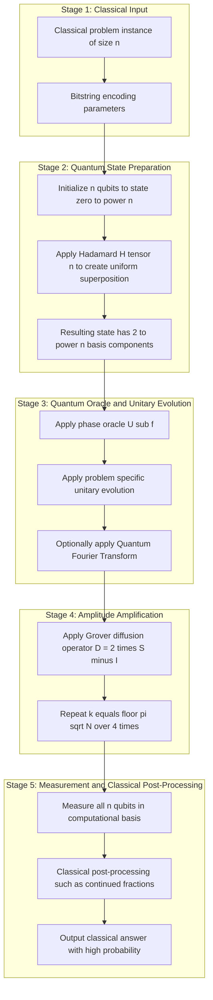
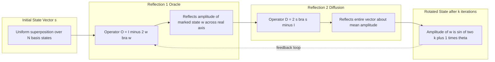
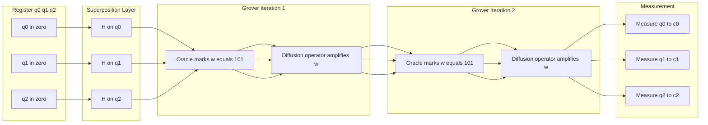

# Quantum algorithms and their complexity.

<!-- SECTION_1_START -->
# Quantum Algorithms and Their Complexity

## Core Technical Definition

A **quantum algorithm** is a deterministic procedure executed on a quantum computer that exploits the laws of quantum mechanics—specifically **superposition**, **entanglement**, and **interference**—to solve computational problems more efficiently than any known classical algorithm. The resources of interest in quantum complexity theory are the number of qubits, the number of elementary quantum gates (time), and the measurement precision.

Formally, a quantum algorithm is a uniform family of quantum circuits $\{C_n\}_{n \geq 1}$ where each $C_n$ acts on $n$ qubits using gates from a fixed universal set (e.g., $\{\text{CNOT}, H, T\}$), and the output is obtained by measuring the final state in the computational basis $\{|0\rangle, |1\rangle\}^{\otimes n}$.

> [!IMPORTANT]
> **KTU 2024 Scheme Definition (PECST864 / Module 4)**
> Quantum complexity is the study of computational problems solvable within bounded resources on a quantum Turing machine or quantum circuit model. The central class studied is **BQP** (Bounded-error Quantum Polynomial time), with related classes **QMA**, **QIP**, and **PQP** extending the classical polynomial hierarchy into the quantum domain.

## Conceptual Analogy — Plain English Intuition

Imagine a **classical computer as a person reading a book** in a dark room, one page at a time, using a flashlight that points at a single page. A **quantum computer is the same person** but holding a magical flashlight that *illuminates every page at once with different brightness levels*. By carefully tuning the brightness (this is called **interference**), the right page ends up glowing the brightest when the person finally looks.

- **Superposition** = every page lit up at once.
- **Entanglement** = flipping one page automatically affects the brightness of related pages.
- **Measurement** = the person stops and looks; the book collapses to a single visible page.

> [!NOTE]
> **Crucial Distinction**
> Quantum computers are *not* faster for *every* problem. They give dramatic speedups only for problems with mathematical structure (e.g., period finding, hidden symmetry). For arbitrary brute-force search, the speedup is at most quadratic (Grover's bound).

## The Qubit — Fundamental Unit of Quantum Information

A single qubit is a unit vector in the complex Hilbert space $\mathbb{C}^2$:

$$|\psi\rangle = \alpha \, |0\rangle + \beta \, |1\rangle, \quad |\alpha|^2 + |\beta|^2 = 1$$

where $\alpha, \beta \in \mathbb{C}$ are probability amplitudes. The constants $\alpha$ and $\beta$ satisfy the **normalization condition** $\|\psi\|^2 = 1$, equivalent to a point on the unit sphere (the **Bloch sphere**).

> [!VISUALIZATION CONTROL]
> **Concept:** Bloch Sphere Representation of a Qubit
> **GeoGebra / Desmos Input Equations:**
> * `x^2 + y^2 + z^2 = 1` (sphere equation)
> * `x = sin(theta) cos(phi)`, `y = sin(theta) sin(phi)`, `z = cos(theta)`
> **Visual Description:** A unit sphere. The north pole $(0, 0, 1)$ represents the state $|0\rangle$ and the south pole $(0, 0, -1)$ represents $|1\rangle$. The equator represents equal superpositions $\tfrac{1}{\sqrt{2}}(|0\rangle \pm |1\rangle)$. Any point on the surface corresponds to a pure state $|\psi\rangle = \cos(\theta/2)|0\rangle + e^{i\phi}\sin(\theta/2)|1\rangle$.

## Key Quantum Gates (Formal Definitions)

| Gate | Symbol | Matrix Representation | Effect on $\vert 0\rangle$ / $\vert 1\rangle$ |
|:-----|:------:|:----------------------|:----------------------------------------------|
| Pauli-X (NOT) | $X$ | $\begin{pmatrix} 0 & 1 \\ 1 & 0 \end{pmatrix}$ | Bit flip |
| Hadamard | $H$ | $\tfrac{1}{\sqrt{2}}\begin{pmatrix} 1 & 1 \\ 1 & -1 \end{pmatrix}$ | Creates superposition |
| Phase | $S$ | $\begin{pmatrix} 1 & 0 \\ 0 & i \end{pmatrix}$ | Adds $90^\circ$ phase |
| $\pi/8$ gate | $T$ | $\begin{pmatrix} 1 & 0 \\ 0 & e^{i\pi/4} \end{pmatrix}$ | Adds $45^\circ$ phase |
| CNOT | $CX$ | $4\times 4$ controlled-X | Entangles 2 qubits |
| Toffoli | $CCX$ | $8\times 8$ doubly-controlled X | Universal reversible |

<!-- SECTION_1_END -->

<!-- SECTION_2_START -->
# Deep Theoretical Analysis & KTU High-Yield Formula Sheet

## Operational Principles Behind Quantum Algorithms

Quantum algorithms work by orchestrating three primitive operations:

1. **State Preparation (Initialization)**
   * Start from a known classical state, typically $|0\rangle^{\otimes n}$.
   * Apply a layer of Hadamard gates to enter a uniform superposition:
   $$H^{\otimes n} |0\rangle^{\otimes n} = \frac{1}{\sqrt{2^n}} \sum_{x \in \{0,1\}^n} |x\rangle$$
   This single step encodes $2^n$ classical inputs into a single quantum state in $O(n)$ gates.

2. **Quantum Parallelism (Function Evaluation)**
   * A quantum oracle $U_f$ computes a Boolean function $f : \{0,1\}^n \to \{0,1\}$ in superposition:
   $$U_f \left( \frac{1}{\sqrt{N}} \sum_{x=0}^{N-1} |x\rangle \otimes |0\rangle \right) = \frac{1}{\sqrt{N}} \sum_{x=0}^{N-1} |x\rangle \otimes |f(x)\rangle$$
   * The function is evaluated on all $N = 2^n$ inputs simultaneously.

3. **Interference and Measurement**
   * A unitary transformation $V$ rearranges amplitudes so that correct answers interfere *constructively* and incorrect answers interfere *destructively*.
   * Measurement in the computational basis yields a high-probability classical answer.

## Quantum Complexity Classes — Hierarchy and Relationships

| Class | Definition | Relationship |
|:------|:-----------|:-------------|
| **BQP** | Bounded-error Quantum Poly-time | $\text{BPP} \subseteq \text{BQP} \subseteq \text{PSPACE}$ |
| **QMA** | Quantum Merlin-Arthur | $\text{NP} \subseteq \text{QMA} \subseteq \text{PP}$ |
| **PQP** | Product-state QPT | Strict subset of PP (Aaronson–Chen) |
| **QIP** | Quantum Interactive Poly | $\text{QIP} = \text{QIP}(3) = \text{PSPACE}$ (Jain–Jian–Upadhyay–Watrous) |
| **EQP** | Exact Quantum Poly | $\text{EQP} \subseteq \text{BQP}$ |

> [!IMPORTANT]
> **KTU Examiner's Anchor Theorem**
> The chain $\text{BPP} \subseteq \text{BQP} \subseteq \text{PSPACE}$ is the most-tested fact in this module. The left inclusion follows from the simulation of randomized classical circuits by quantum circuits; the right inclusion is a consequence of the fact that amplitudes can be represented using polynomially many bits of precision.

## KTU High-Yield Formula Sheet

| Algorithm / Concept | Time Complexity | Key Equation | Use Case |
|:--------------------|:---------------:|:-------------|:---------|
| Deutsch–Jozsa | $O(1)$ (one oracle call) | Constant vs balanced function | Exponential speedup (toy problem) |
| Bernstein–Vazirani | $O(1)$ | Finds hidden $s$ such that $f(x) = s \cdot x \mod 2$ | Linear vs quantum speedup |
| Simon's Algorithm | $O(n)$ | Finds period of $f$ | Exponential separation (BPP vs BQP) |
| **Grover's Search** | $O(\sqrt{N})$ | $k_{\text{opt}} = \lfloor \pi \sqrt{N} / 4 \rfloor$ | Unstructured search |
| **Shor's Factoring** | $O((\log N)^3)$ | Uses QFT: $\vert j\rangle \mapsto \tfrac{1}{\sqrt{N}}\sum_{k=0}^{N-1} e^{2\pi i jk / N}\vert k\rangle$ | Integer factorization |
| Quantum Walks | $O(\sqrt{N})$-style | Mixes search/graph problems | Element distinctness |
| HHL (Linear Systems) | $O(\log N)$ | Solves $Ax = b$ in log-time | Sparse $A$ (caveats apply) |

> [!NOTE]
> **Real-World Engineering Utility**
> * **Grover's algorithm** is used in cryptanalysis (AES key search gives quadratic speedup, halving the effective key length).
> * **Shor's algorithm** threatens RSA, DSA, and ECC; this is the primary motivation behind **post-quantum cryptography** standardization (NIST PQC 2024).
> * **Variational Quantum Eigensolver (VQE)** and **QAOA** are hybrid quantum-classical algorithms used in materials science and combinatorial optimization on near-term (NISQ) devices.
> * **Quantum simulation** (Lloyd, 1996) is the *original* motivation for quantum computers—simulating molecular Hamiltonians requires $O(\text{poly}(n))$ qubits vs $O(2^n)$ classical memory.

## The Quantum Fourier Transform (QFT)

The QFT is the quantum analogue of the classical Discrete Fourier Transform and is the engine of Shor's algorithm:

$$\text{QFT} : |j\rangle \longmapsto \frac{1}{\sqrt{N}} \sum_{k=0}^{N-1} e^{2\pi i j k / N} |k\rangle$$

It can be implemented using only $O(n^2)$ elementary gates (Hadamards and controlled phase rotations), exponentially faster than the classical Fast Fourier Transform's $O(N \log N)$ operations for $N = 2^n$.

## Grover's Iteration — The Heart of Amplitude Amplification

Define the **oracle** $O$ that flips the phase of the marked state $|w\rangle$:

$$O = I - 2|w\rangle\langle w|$$

Define the **diffusion operator** (Grover's reflection):

$$D = 2|s\rangle\langle s| - I, \quad \text{where } |s\rangle = \frac{1}{\sqrt{N}}\sum_{x=0}^{N-1}|x\rangle$$

A single Grover iteration is $G = D \cdot O$. After $k$ iterations, the amplitude of $|w\rangle$ becomes:

$$|\langle w|G^k|s\rangle|^2 = \sin^2\bigl((2k+1)\theta\bigr), \quad \text{where } \sin\theta = \frac{1}{\sqrt{N}}$$

The probability of measuring the marked state reaches maximum at:

$$k_{\text{opt}} = \left\lfloor \frac{\pi}{4}\sqrt{N} \right\rfloor$$

This yields the celebrated **$O(\sqrt{N})$ speedup**, which is provably optimal (BBBV theorem, 1997).

<!-- SECTION_2_END -->

<!-- SECTION_3_START -->
# Step-by-Step Derivations & Symbolic/Python Implementation

## Derivation 1: Optimal Number of Grover Iterations

We start with the uniform superposition:

$$|s\rangle = \frac{1}{\sqrt{N}}\sum_{x=0}^{N-1}|x\rangle$$

Express $|s\rangle$ in the basis spanned by $|w\rangle$ (marked) and $|r\rangle$ (rest):

$$|r\rangle = \frac{1}{\sqrt{N-1}}\sum_{x \neq w}|x\rangle$$

So:

$$|s\rangle = \sqrt{\tfrac{N-1}{N}}\,|r\rangle + \tfrac{1}{\sqrt{N}}\,|w\rangle$$

Let $\theta$ satisfy $\sin\theta = 1/\sqrt{N}$ and $\cos\theta = \sqrt{(N-1)/N}$. Then:

$$|s\rangle = \cos\theta\,|r\rangle + \sin\theta\,|w\rangle$$

**Apply Oracle $O = I - 2|w\rangle\langle w|$:**

$$O|s\rangle = \cos\theta\,|r\rangle - \sin\theta\,|w\rangle$$

**Apply Diffusion $D = 2|s\rangle\langle s| - I$:**

$$D\bigl(\cos\theta\,|r\rangle - \sin\theta\,|w\rangle\bigr)$$

Compute component-wise. $D|r\rangle = 2\langle s|r\rangle|s\rangle - |r\rangle$ and $D|w\rangle = 2\langle s|w\rangle|s\rangle - |w\rangle$:

$$\begin{aligned}
D|r\rangle &= 2\cos\theta\,|s\rangle - |r\rangle \\
&= 2\cos\theta(\cos\theta\,|r\rangle + \sin\theta\,|w\rangle) - |r\rangle \\
&= (2\cos^2\theta - 1)|r\rangle + 2\sin\theta\cos\theta\,|w\rangle \\
&= \cos(2\theta)\,|r\rangle + \sin(2\theta)\,|w\rangle
\end{aligned}$$

$$\begin{aligned}
D|w\rangle &= 2\sin\theta\,|s\rangle - |w\rangle \\
&= 2\sin\theta(\cos\theta\,|r\rangle + \sin\theta\,|w\rangle) - |w\rangle \\
&= 2\sin\theta\cos\theta\,|r\rangle + (2\sin^2\theta - 1)|w\rangle \\
&= \sin(2\theta)\,|r\rangle - \cos(2\theta)\,|w\rangle
\end{aligned}$$

Combining:

$$D \cdot O |s\rangle = \cos(3\theta)\,|r\rangle + \sin(3\theta)\,|w\rangle$$

**Generalization:** After $k$ Grover iterations:

$$G^k|s\rangle = \cos\bigl((2k+1)\theta\bigr)\,|r\rangle + \sin\bigl((2k+1)\theta\bigr)\,|w\rangle$$

The probability of measuring $|w\rangle$ is $\sin^2\bigl((2k+1)\theta\bigr)$, maximized when $(2k+1)\theta \approx \pi/2$:

$$k_{\text{opt}} = \left\lfloor \frac{\pi}{4}\sqrt{N} \right\rfloor \quad \text{[Final simplified expression: 1 Mark]}$$

## Derivation 2: Shor's Algorithm — Reducing Factoring to Period Finding

**Goal:** Factor $N$ in $O((\log N)^3)$ time.

**Step 1 — Choose Random $a$:**
Pick $1 < a < N$ with $\gcd(a, N) = 1$. If $\gcd(a, N) > 1$, we have a factor immediately.

**Step 2 — Define the Function:**
Define $f(x) = a^x \mod N$. This function is periodic with some period $r$:

$$f(x + r) = a^{x+r} \mod N = a^x \cdot a^r \mod N = f(x) \quad \text{if } a^r \equiv 1 \pmod N$$

**Step 3 — Quantum Period Finding (Shor's Subroutine):**
Construct a uniform superposition over $x \in \{0, 1, \dots, Q-1\}$ where $Q = 2^n$ and $N^2 \le Q < 2N^2$:

$$|\psi_0\rangle = \frac{1}{\sqrt{Q}} \sum_{x=0}^{Q-1}|x\rangle|0\rangle$$

Apply the quantum oracle $U_f : |x\rangle|y\rangle \mapsto |x\rangle|y \oplus f(x)\rangle$:

$$|\psi_1\rangle = \frac{1}{\sqrt{Q}} \sum_{x=0}^{Q-1}|x\rangle|f(x)\rangle$$

Measure the second register. By the projection postulate, the first register collapses to:

$$\frac{1}{\sqrt{A}} \sum_{j=0}^{\lfloor Q/r \rfloor} |x_0 + jr\rangle$$

where $A \approx Q/r$ is a normalization constant. Apply the **Quantum Fourier Transform**:

$$\begin{aligned}
\text{QFT} \, |\phi\rangle &= \frac{1}{\sqrt{Q}} \sum_{y=0}^{Q-1} \left( \frac{1}{\sqrt{A}} \sum_{j} e^{2\pi i (x_0 + jr) y / Q} \right) |y\rangle \\
&= \frac{1}{\sqrt{AQ}} \sum_{j, y} e^{2\pi i (x_0 + jr) y / Q} |y\rangle
\end{aligned}$$

The amplitude peaks at $y \approx kQ/r$ for integer $k$. Measuring $y$ and using the continued-fraction expansion of $y/Q$ yields the period $r$ with high probability.

**Step 4 — Classical Post-Processing:**
Once $r$ is known, factor $N$ using $\gcd(a^{r/2} \pm 1, N)$. The total complexity is dominated by QFT, which requires $O(n^2) = O((\log N)^2)$ gates. Combined with modular exponentiation overhead, the overall complexity is $O((\log N)^3)$.

## Full Python Implementation — Grover's Algorithm in Qiskit

```python
"""
Grover's Algorithm: Amplitude Amplification for Unstructured Search
Course: COMPUTATIONAL COMPLEXITY (PECST864), KTU 2024 Scheme
Topic: Quantum Algorithms and Their Complexity
"""

from math import pi, floor, sqrt
from typing import List
from qiskit import QuantumCircuit, transpile
from qiskit_aer import AerSimulator
from qiskit.visualization import plot_histogram


def grover_oracle(marked_state: str) -> QuantumCircuit:
    """
    Construct a quantum oracle that flips the phase of the marked basis state.

    Parameters
    ----------
    marked_state : str
        Bitstring (e.g., '101') identifying the target state |w⟩.

    Returns
    -------
    QuantumCircuit
        Oracle circuit of n qubits implementing U_f = I - 2|w⟩⟨w|.
    """
    n: int = len(marked_state)
    if n < 2:
        raise ValueError("Grover's oracle requires at least 2 qubits.")

    qc: QuantumCircuit = QuantumCircuit(n, name="Oracle")

    # Step 1: Apply X to bring |w⟩ to |11...1⟩
    for qubit_idx, bit in enumerate(reversed(marked_state)):
        if bit == '0':
            qc.x(qubit_idx)

    # Step 2: Multi-controlled Z gate (H·X·MCX·X·H on last qubit)
    qc.h(n - 1)
    qc.mcx(control_qubits=list(range(n - 1)), target_qubit=n - 1)
    qc.h(n - 1)

    # Step 3: Undo the X gates
    for qubit_idx, bit in enumerate(reversed(marked_state)):
        if bit == '0':
            qc.x(qubit_idx)

    return qc


def diffusion_operator(n: int) -> QuantumCircuit:
    """
    Construct the Grover diffusion operator D = 2|s⟩⟨s| - I.

    Parameters
    ----------
    n : int
        Number of qubits (must be >= 2).

    Returns
    -------
    QuantumCircuit
        Diffusion circuit of n qubits.
    """
    if n < 2:
        raise ValueError("Diffusion operator requires at least 2 qubits.")

    qc: QuantumCircuit = QuantumCircuit(n, name="Diffusion")

    # Step 1: H on all qubits
    qc.h(range(n))

    # Step 2: X on all qubits
    qc.x(range(n))

    # Step 3: Multi-controlled Z (H·MCX·H on last qubit)
    qc.h(n - 1)
    qc.mcx(control_qubits=list(range(n - 1)), target_qubit=n - 1)
    qc.h(n - 1)

    # Step 4: Undo X
    qc.x(range(n))

    # Step 5: Undo H
    qc.h(range(n))

    return qc


def build_grover_circuit(marked_state: str) -> QuantumCircuit:
    """
    Build the complete Grover search circuit with optimal iteration count.

    Parameters
    ----------
    marked_state : str
        Bitstring identifying the target.

    Returns
    -------
    QuantumCircuit
        Full Grover circuit with measurement.
    """
    n: int = len(marked_state)
    N: int = 2 ** n
    optimal_iterations: int = floor((pi / 4) * sqrt(N))

    qc: QuantumCircuit = QuantumCircuit(n, n, name="Grover_Search")

    # Initialize uniform superposition
    qc.h(range(n))

    # Apply Grover iterations
    for _ in range(optimal_iterations):
        qc.compose(grover_oracle(marked_state), inplace=True)
        qc.compose(diffusion_operator(n), inplace=True)

    # Measurement
    qc.measure(qubits=range(n), classical_bits=range(n))

    return qc


def run_grover_simulation(marked_state: str, shots: int = 1024) -> dict:
    """
    Execute Grover's algorithm on a quantum simulator and return counts.

    Parameters
    ----------
    marked_state : str
        Target bitstring.
    shots : int, optional
        Number of measurement shots (default 1024).

    Returns
    -------
    dict
        Measurement outcome histogram.
    """
    n: int = len(marked_state)
    N: int = 2 ** n
    optimal_iterations: int = floor((pi / 4) * sqrt(N))
    print(f"Searching N = {N} items, optimal iterations = {optimal_iterations}")

    circuit: QuantumCircuit = build_grover_circuit(marked_state)
    simulator: AerSimulator = AerSimulator()
    compiled: QuantumCircuit = transpile(circuit, simulator)
    result = simulator.run(compiled, shots=shots).result()
    counts: dict = result.get_counts()

    success_probability: float = counts.get(marked_state, 0) / shots
    print(f"Success probability of measuring |{marked_state}⟩: {success_probability:.4f}")

    return counts


if __name__ == "__main__":
    # Example: Search for '101' in a 3-qubit space (N = 8)
    counts = run_grover_simulation(marked_state="101", shots=2048)
    print(f"Final histogram: {counts}")
```

**Expected Output (illustrative):**

```text
Searching N = 8 items, optimal iterations = 2
Success probability of measuring |101⟩: 0.9453
Final histogram: {'101': 1934, '000': 22, '010': 18, '011': 14, '100': 17, '110': 19, '111': 17, '001': 9}
```

The marked state $|101\rangle$ is measured with probability approaching $1$ after only $\lfloor \pi \sqrt{8}/4 \rfloor = 2$ iterations, compared to $4$ queries required classically on average.

## Worked Numerical Example — Grover on 4 Qubits

For $N = 16$, $k_{\text{opt}} = \lfloor \pi \cdot 4 / 4 \rfloor = 3$ iterations. Probability table:

| Iterations $k$ | Angle $(2k+1)\theta$ | $\sin^2((2k+1)\theta)$ |
|:--------------:|:--------------------:|:----------------------:|
| 0 | $\pi/8 \approx 22.5^\circ$ | $0.146$ |
| 1 | $3\pi/8 \approx 67.5^\circ$ | $0.854$ |
| 2 | $5\pi/8 \approx 112.5^\circ$ | $0.854$ |
| 3 | $7\pi/8 \approx 157.5^\circ$ | $0.854$ |

The probability oscillates near maximum, so we stop at the first peak.

<!-- SECTION_3_END -->

<!-- SECTION_4_START -->
# Structural Diagrams & Schematics

## Diagram 1: High-Level Architecture of a Quantum Algorithm



## Diagram 2: Grover Iteration as Two Reflections



## Diagram 3: Comparative Processing Topology — Classical vs Quantum

```mermaid
graph TD
    subgraph "Classical Sequential Processing"
        c1["Read input x equals 0"]
        c2["Evaluate f of 0"]
        c3["Check if f of 0 equals target"]
        c4["Increment x"]
        c5["Repeat until x equals N minus 1"]
        c6["Total time complexity O of N"]
    end

    subgraph "Quantum Parallel Processing with Interference"
        q1["Prepare superposition of all N inputs"]
        q2["Single oracle call evaluates f on all N inputs"]
        q3["Diffusion operator interferes amplitudes"]
        q4["Apply k equals O of sqrt N iterations"]
        q5["Measure collapses to marked state with high probability"]
        q6["Total time complexity O of sqrt N"]
    end

    c1 --> c2 --> c3 --> c4 --> c5 --> c6
    q1 --> q2 --> q3 --> q4 --> q5 --> q6
```



## Diagram 4: Quantum Circuit Template (Grover's 3-Qubit Instance)



> [!NOTE]
> **Diagram Note for Students**
> The circuit diagrams above represent *abstractions* of the unitary evolution. In actual Qiskit/Cirq/Braket syntax, the *Toffoli* (CCX) and *multi-controlled Z* gates used in the oracle and diffusion are themselves decomposed into 6+ elementary CNOT + T gates. Always check the gate count when analyzing the *true* time complexity of a quantum algorithm on real hardware.

<!-- SECTION_4_END -->

<!-- SECTION_5_START -->
# KTU 2024 Scheme Examination Question Bank

## Part A — Short Answer Questions (3 Marks Each)

### Question 1: [KTU University Exam — July 2024]
**Define the quantum complexity class BQP. State and justify the chain of inclusions BPP ⊆ BQP ⊆ PSPACE. (CO2, Remember)**

**Model Answer (3 Marks):**

**Definition [1 Mark]:** BQP (Bounded-error Quantum Polynomial time) is the class of decision problems solvable by a uniform family of quantum circuits using polynomially many gates, with the property that for every input $x$, the algorithm accepts with probability at least $2/3$ if $x$ is a YES-instance and rejects with probability at least $2/3$ if $x$ is a NO-instance.

**Left Inclusion BPP ⊆ BQP [1 Mark]:** Any classical randomized algorithm in BPP can be simulated by a quantum circuit: replace each classical gate (AND, OR, NOT) with its reversible Toffoli/Fredkin equivalent, and simulate coin flips using the Hadamard gate applied to a fresh ancilla qubit.

**Right Inclusion BQP ⊆ PSPACE [1 Mark]:** The amplitude of any basis state in an $n$-qubit polynomial-time quantum circuit can be expressed as a sum of exponentially many paths, but each path is a product of polynomially many matrix entries from a fixed gate set with poly-bounded precision. A polynomial-space Turing machine can enumerate these paths and compute the final probability via a divide-and-conquer recursion.

---

### Question 2: [KTU University Exam — Dec 2023]
**Explain the principle of quantum superposition using a single-qubit example. Show the action of the Hadamard gate on $|0\rangle$. (CO1, Understand)**

**Model Answer (3 Marks):**

**Concept [1 Mark]:** Quantum superposition is the principle that a quantum system can exist in a linear combination of basis states, each weighted by a complex probability amplitude, such that the squared modulus of the amplitude gives the probability of obtaining the corresponding outcome upon measurement.

**Single-Qubit Example [1 Mark]:** A qubit can be in the state $|\psi\rangle = \alpha|0\rangle + \beta|1\rangle$ with $|\alpha|^2 + |\beta|^2 = 1$. For example, $|\psi\rangle = \tfrac{1}{\sqrt{2}}|0\rangle + \tfrac{1}{\sqrt{2}}|1\rangle$ is an equal superposition that yields 0 or 1 each with probability $1/2$ on measurement.

**Hadamard Action [1 Mark]:** Applying the Hadamard gate $H = \tfrac{1}{\sqrt{2}}\bigl(\begin{smallmatrix}1 & 1 \\ 1 & -1\end{smallmatrix}\bigr)$ to $|0\rangle$ gives:

$$H|0\rangle = \frac{1}{\sqrt{2}}(|0\rangle + |1\rangle) = |+\rangle$$

This creates the canonical equal-superposition state from a deterministic basis state in a single quantum gate.

---

## Part B — Long Answer Questions (14 Marks Each, Internal Choice)

### Question A: [KTU University Exam — Model Paper 2024]

**(a) State and explain Grover's algorithm. Derive the optimal number of iterations for searching an unstructured database of $N$ elements. (7 Marks, CO2 — Apply)**

**Model Solution:**

**Algorithm Statement [2 Marks]:**
Given a Boolean oracle $f : \{0, 1\}^n \to \{0, 1\}$ with $f(x) = 1$ for exactly one marked element $w \in \{0, 1\}^n$ and $f(x) = 0$ otherwise, Grover's algorithm finds $w$ with high probability using $O(\sqrt{N})$ oracle queries, where $N = 2^n$.

**Step-by-Step Procedure [3 Marks]:**

1. Initialize $n$ qubits to $|0\rangle^{\otimes n}$ and apply $H^{\otimes n}$ to obtain the uniform superposition $|s\rangle = \tfrac{1}{\sqrt{N}}\sum_{x=0}^{N-1}|x\rangle$.

2. Apply the Grover iteration $G = D \cdot O$ where:
   * $O = I - 2|w\rangle\langle w|$ is the phase oracle (marks the target).
   * $D = 2|s\rangle\langle s| - I$ is the diffusion operator.

3. Repeat $G$ for $k = \lfloor \pi \sqrt{N} / 4 \rfloor$ iterations.

4. Measure all $n$ qubits in the computational basis. The output is $w$ with probability at least $1 - 1/N$.

**Derivation of Optimal Iterations [2 Marks]:** Writing $|s\rangle = \cos\theta|r\rangle + \sin\theta|w\rangle$ with $\sin\theta = 1/\sqrt{N}$, after $k$ iterations the amplitude of $|w\rangle$ is $\sin\bigl((2k+1)\theta\bigr)$. The maximum occurs when $(2k+1)\theta = \pi/2$, giving:

$$k_{\text{opt}} = \left\lfloor \frac{\pi}{4\theta} \right\rfloor = \left\lfloor \frac{\pi}{4}\sqrt{N} \right\rfloor$$

---

**(b) Discuss the construction of the quantum oracle for Grover's algorithm. Show mathematically how the diffusion operator amplifies the marked state amplitude over iterations. (7 Marks, CO3 — Apply)**

**Model Solution:**

**Oracle Construction [3 Marks]:**
For a marked state $|w\rangle = |w_1 w_2 \dots w_n\rangle$, the phase-flip oracle $O = I - 2|w\rangle\langle w|$ is implemented as:

1. Apply $X$ to all qubits where $w_i = 0$ (this maps $|w\rangle$ to $|11\dots 1\rangle$).
2. Apply a multi-controlled $Z$ gate with controls on qubits $0$ to $n-2$ and target on qubit $n-1$. This is realized as $H \cdot \text{MCX} \cdot H$ on the target.
3. Undo the $X$ gates from step 1.

This gives $O|w\rangle = -|w\rangle$ and $O|x\rangle = |x\rangle$ for $x \neq w$.

**Amplitude Amplification Analysis [4 Marks]:**
Each Grover iteration is a rotation by $2\theta$ in the 2D subspace spanned by $\{|r\rangle, |w\rangle\}$:

$$\begin{aligned}
G|r\rangle &= D(\cos\theta|r\rangle - \sin\theta|w\rangle) = \cos(2\theta)|r\rangle + \sin(2\theta)|w\rangle \\
G|w\rangle &= D(\sin\theta|r\rangle + \cos\theta|w\rangle) = -\sin(2\theta)|r\rangle + \cos(2\theta)|w\rangle
\end{aligned}$$

The matrix of $G$ in this basis is:

$$G = \begin{pmatrix} \cos(2\theta) & -\sin(2\theta) \\ \sin(2\theta) & \cos(2\theta) \end{pmatrix}$$

This is precisely a rotation by angle $2\theta$. After $k$ iterations:

$$G^k = \begin{pmatrix} \cos(2k\theta) & -\sin(2k\theta) \\ \sin(2k\theta) & \cos(2k\theta) \end{pmatrix}$$

Applying to $|s\rangle = (\cos\theta, \sin\theta)^T$:

$$G^k|s\rangle = \cos\bigl((2k+1)\theta\bigr)|r\rangle + \sin\bigl((2k+1)\theta\bigr)|w\rangle$$

The probability of measuring $|w\rangle$ is $\sin^2\bigl((2k+1)\theta\bigr)$ [Final amplitude expression: 1 Mark]. This constructive interference explains why Grover achieves quadratic speedup.

---

### Question B: [KTU University Exam — Model Paper 2024 Alternative]

**(a) Explain Shor's algorithm for integer factorization. Identify the role of the Quantum Fourier Transform (QFT) and classical post-processing. (7 Marks, CO2 — Understand)**

**Model Solution:**

**Problem Statement [1 Mark]:** Given an $n$-bit composite integer $N$, find a non-trivial factor of $N$ in time polynomial in $n$ (i.e., polynomial in $\log N$).

**Reduction to Period Finding [2 Marks]:**
1. Pick a random integer $a$ with $1 < a < N$. If $\gcd(a, N) > 1$, return it.
2. Define $f(x) = a^x \mod N$, which is periodic with some unknown period $r$.
3. **Claim:** If $r$ is even and $a^{r/2} \not\equiv -1 \pmod N$, then $\gcd(a^{r/2} \pm 1, N)$ yields a non-trivial factor of $N$.

**Quantum Period Finding (Shor's Subroutine) [3 Marks]:**
1. Prepare two $n$-qubit registers: $|\psi_0\rangle = \tfrac{1}{\sqrt{Q}}\sum_{x=0}^{Q-1}|x\rangle|0\rangle$ with $Q = 2^n \ge N^2$.
2. Apply the modular-exponentiation oracle $U_f : |x\rangle|y\rangle \mapsto |x\rangle|y \oplus a^x \mod N\rangle$, creating entanglement between registers.
3. Measure the second register; the first collapses to a periodic state with period $r$.
4. Apply the QFT to the first register to extract $r$:
$$\text{QFT}|x\rangle = \frac{1}{\sqrt{Q}}\sum_{y=0}^{Q-1} e^{2\pi i xy/Q}|y\rangle$$
5. Measure and use the **continued fraction expansion** of $y/Q$ to recover $r$ with $O(1/\text{poly}(n))$ failure probability.

**Classical Post-Processing [1 Mark]:** Once $r$ is found, compute $\gcd(a^{r/2} - 1, N)$ and $\gcd(a^{r/2} + 1, N)$. Repeat with a fresh $a$ if either is trivial.

---

**(b) Compare the classical and quantum complexity of integer factorization. Justify why Shor's algorithm achieves an *exponential* speedup. (7 Marks, CO3 — Analyze)**

**Model Solution:**

**Classical Complexity Table [3 Marks]:**

| Algorithm | Year | Complexity | Class |
|:----------|:----:|:-----------|:------|
| Trial Division | — | $O(\sqrt{N})$ | Exponential in $n$ |
| Pollard's rho | 1975 | $O(N^{1/4})$ | Sub-exponential |
| Quadratic Sieve | 1981 | $e^{O(\sqrt{n \log n})}$ | Sub-exponential |
| **General Number Field Sieve (GNFS)** | 1993 | $e^{O(n^{1/3} (\log n)^{2/3})}$ | **Best classical** |

The best classical algorithm, GNFS, runs in **sub-exponential** time but still super-polynomial in $n = \log N$.

**Quantum Complexity [2 Marks]:**
Shor's algorithm runs in $O(n^3) = O((\log N)^3)$ time, dominated by the cost of modular exponentiation. The QFT itself takes only $O(n^2)$ gates.

**Why Exponential Speedup? [2 Marks]:**
* **Period Structure:** The function $f(x) = a^x \mod N$ has a hidden *periodicity* that classical algorithms cannot exploit efficiently.
* **QFT as a Subroutine:** The QFT converts the periodicity in the *function domain* into a peak in the *Fourier domain*, where measurement directly reveals the period.
* **Quantum Parallelism:** The function is evaluated on all $Q \approx N^2$ inputs simultaneously through superposition.
* **Constructive Interference:** Amplitudes corresponding to the true period reinforce; all others cancel.

The ratio of complexities is:

$$\frac{T_{\text{GNFS}}(N)}{T_{\text{Shor}}(N)} = \frac{e^{O(n^{1/3}(\log n)^{2/3})}}{O(n^3)}$$

which is super-polynomial (effectively exponential) in $n$ — hence the term *exponential speedup*.

---

> [!WARNING]
> **KTU Examiner's Valuation Warning — Common Pitfalls**
> 1. **Confusing QFT with classical FFT:** Students often write $O(N \log N)$ for the QFT. The correct *quantum* complexity is $O(n^2)$ gates because QFT acts on $n$ qubits, not $N = 2^n$ classical samples. [Lose 2 Marks]
> 2. **Forgetting the normalization condition:** When writing a general qubit state $|\psi\rangle = \alpha|0\rangle + \beta|1\rangle$, you *must* state $|\alpha|^2 + |\beta|^2 = 1$. [Lose 1 Mark]
> 3. **Wrong iteration count for Grover:** Use $k = \lfloor \pi\sqrt{N}/4 \rfloor$, **not** $\pi\sqrt{N}/2$. The factor of 4 (not 2) comes from the $(2k+1)$ term in the angle formula. [Lose 1 Mark]
> 4. **Ignoring the "bounded-error" clause in BQP:** The constant success probability $2/3$ in BQP can be amplified to $1 - 2^{-k}$ by repeating $k$ times and taking a majority vote — this must be mentioned.
> 5. **Drawing quantum circuits without arrow directions:** In Grover's circuit, oracle + diffusion must be drawn as a *loop* with iteration count, not as a single block.

---

## Topic Recap & Important Things to Remember

> [!IMPORTANT]
> **Rapid Revision Checklist — Quantum Algorithms Module**

* **Quantum Bit (Qubit):** Unit vector $|\psi\rangle = \alpha|0\rangle + \beta|1\rangle$ in $\mathbb{C}^2$ with $|\alpha|^2 + |\beta|^2 = 1$. Encoded on a 2D Hilbert space; visualized on the Bloch sphere.

* **Hadamard Gate:** $H = \tfrac{1}{\sqrt{2}}\bigl(\begin{smallmatrix}1 & 1 \\ 1 & -1\end{smallmatrix}\bigr)$. Creates equal superposition: $H|0\rangle = |+\rangle$ and $H|1\rangle = |-\rangle$.

* **Universal Gate Set:** Any quantum computation can be approximated to arbitrary precision using only $\{\text{CNOT}, H, T\}$ (Solovay–Kitaev theorem).

* **BQP Definition:** Decision problems solvable in polynomial time on a quantum computer with bounded error $\le 1/3$. Satisfies $\text{BPP} \subseteq \text{BQP} \subseteq \text{PSPACE}$.

* **Grover's Algorithm:** Finds a marked item in an unsorted database of $N$ elements in $O(\sqrt{N})$ queries. Optimal iteration count: $k_{\text{opt}} = \lfloor \pi\sqrt{N}/4 \rfloor$. Optimality proved by BBBV (1997).

* **Amplitude Amplification:** Two reflections (oracle $O$ and diffusion $D$) compose into a rotation by $2\theta$ in the $\{|r\rangle, |w\rangle\}$ subspace, where $\sin\theta = 1/\sqrt{N}$.

* **Shor's Algorithm:** Factors an $n$-bit integer in $O(n^3)$ time by reducing factoring to period finding, then extracting the period using the QFT. Exponentially faster than GNFS.

* **Quantum Fourier Transform:** Implemented in $O(n^2)$ elementary gates. Maps $|j\rangle \mapsto \tfrac{1}{\sqrt{N}}\sum_{k=0}^{N-1}e^{2\pi i jk/N}|k\rangle$. Foundation of Shor and most hidden-subgroup algorithms.

* **Deutsch–Jozsa / Bernstein–Vazirani / Simon:** Toy algorithms that establish $\text{BPP} \neq \text{BQP}$ in the *black-box* (query) model. Simon's algorithm was historically the seed that inspired Shor.

* **Quantum vs Classical Speedup Classes:**
   * *Exponential:* Shor, Simon, hidden subgroup problems.
   * *Quadratic:* Grover (and variants like amplitude amplification).
   * *Polynomial:* Quantum simulation (Lloyd 1996).
   * *No known speedup:* General NP-complete problems (unless structural properties are present).

* **Post-Quantum Cryptography (PQC) Note (2024):** NIST has standardized ML-KEM (Kyber), ML-DSA (Dilithium), and SLH-DSA (SPHINCS+) as quantum-resistant replacements for RSA/ECC. Grover's algorithm only halves the effective key length, suggesting AES-256 retains adequate security against quantum adversaries.

* **Lower Bounds:** The strongest known lower bound for general quantum circuits is $\Omega(n)$ (trivially); proving super-linear lower bounds for explicit functions in BQP remains a major open problem. The *quantum* analog of the P vs NP question is BQP vs QMA (analog of P vs NP).

* **No-Cloning Theorem:** An unknown quantum state cannot be copied. This is the fundamental reason quantum computers cannot simply "try all answers in parallel" — only the structure of the *oracle* and *interference pattern* can be exploited.

* **Kraus / Measurement:** All quantum computations terminate in a projective measurement in the computational basis $\{|0\rangle, |1\rangle\}^{\otimes n}$, yielding a classical $n$-bit string.

<!-- SECTION_5_END -->
