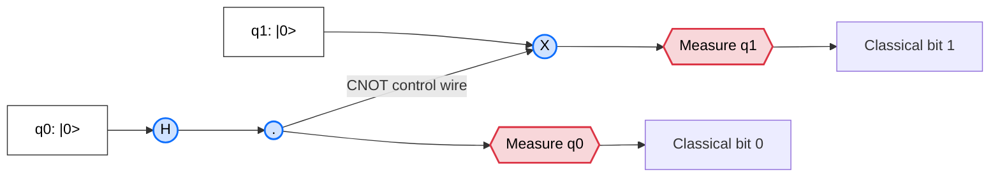
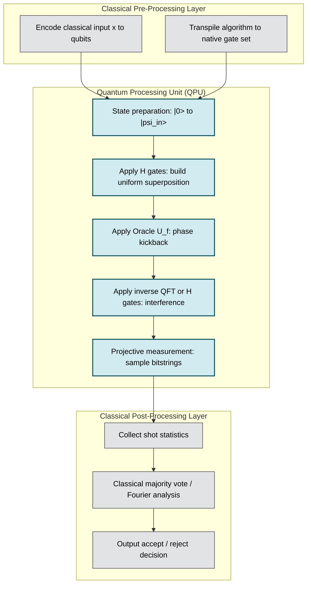
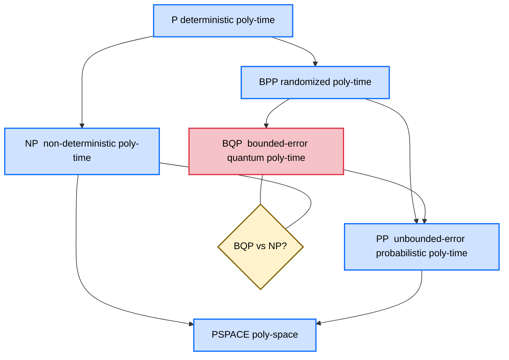
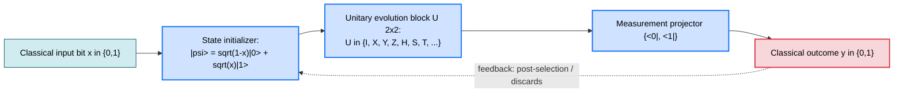

# Quantum Complexity - Basics of quantum computation

<!-- SECTION_1_START -->

# Quantum Complexity — Basics of Quantum Computation

## 1.1 Formal Definition (KTU 2024 Syllabus Terminology)

> [!NOTE]
> **Quantum Computation** is a model of computation whose fundamental unit of information is the **qubit** (quantum bit), and whose elementary operations are **unitary transformations** (quantum gates) applied to a complex vector in a Hilbert space $\mathcal{H}$. Computations terminate by **projective measurement** whose outcome statistics are governed by the **Born rule**.

A *quantum circuit* of polynomial size, with gates drawn from a universal set (e.g., Hadamard, $T$, and CNOT), defines a *uniform quantum polynomial-time* computation, which is precisely the class **$\mathbf{BQP}$** (Bounded-Error Quantum Polynomial Time).

Formally, a language $L \subseteq \{0,1\}^{*}$ is in $\mathbf{BQP}$ iff there exists a uniform family of quantum circuits $\{C_n\}$ of polynomial size in $n$ such that:

$$\begin{aligned}
x \in L \;\Longrightarrow\; \Pr[C_{|x|}(x) = 1] \;\geq\; \tfrac{2}{3} \\
x \notin L \;\Longrightarrow\; \Pr[C_{|x|}(x) = 1] \;\leq\; \tfrac{1}{3}
\end{aligned}$$

The constants $\mathbf{2/3}$ and $\mathbf{1/3}$ are the standard **one-sided bounded-error thresholds** for quantum acceptance.

---

## 1.2 Intuitive Analogy — The Spinning Coin

Imagine a **classical bit** as a coin lying flat on a table: it is unambiguously *heads* ($0$) or *tails* ($1$) at every instant.

A **qubit** is the same coin **spinning in the air** before it lands. While spinning:

- It is *neither* heads nor tails — it is in a *superposition* of both.
- The exact orientation of the spin determines the **probability amplitudes** $\alpha$ and $\beta$.
- The instant you *catch* the coin (i.e., **measure** the qubit), the superposition collapses to either $0$ or $1$, with probabilities $\vert\alpha\vert^2$ and $\vert\beta\vert^2$ respectively.

This "spinning coin" also helps to see **interference**: if two spinning coins with amplitudes $\alpha_1$ and $\alpha_2$ are combined, the resulting probability is $\vert\alpha_1 + \alpha_2\vert^2$ — the amplitudes may *add constructively* (boost the probability) or *destructively cancel* (vanish the probability). This constructive/destructive interference is the engine that powers quantum speedups.

| Feature | Classical Bit | Qubit |
|---|---|---|
| State space | $\{0, 1\}$ | $\mathbb{C}^2$ ray |
| Physical analogy | Coin lying flat | Coin spinning in air |
| Information at once | One definite value | Superposition of both |
| Read-out | Deterministic | Probabilistic (Born rule) |

> [!IMPORTANT]
> **KTU Highlight — What makes Quantum different from Classical Randomized (BPP) computation?**
> Classical randomized algorithms manipulate **probabilities** that are always non-negative and add as real numbers. Quantum algorithms manipulate **amplitudes** that can be *negative or complex*, and combine via **interference**. This is why $\mathbf{BQP}$ is widely believed to be strictly larger than $\mathbf{BPP}$ (though not yet proven).

---

## 1.3 Dirac (Bra-Ket) Notation — The Language of Quantum States

The **ket** $\vert\psi\rangle$ denotes a column state vector, and the **bra** $\langle\psi\vert$ denotes its conjugate transpose (a row vector). The inner product is written $\langle\phi\vert\psi\rangle$, and outer product as $\vert\psi\rangle\langle\phi\vert$.

The single-qubit basis vectors are:

$$|0\rangle = \begin{pmatrix} 1 \\ 0 \end{pmatrix}, \qquad |1\rangle = \begin{pmatrix} 0 \\ 1 \end{pmatrix}$$

A general single-qubit *pure state* is:

$$|\psi\rangle = \alpha|0\rangle + \beta|1\rangle = \begin{pmatrix} \alpha \\ \beta \end{pmatrix}, \qquad \alpha, \beta \in \mathbb{C}, \quad |\alpha|^2 + |\beta|^2 = 1$$

> [!VISUALIZATION CONTROL]
> **Concept:** Bloch Sphere representation of a single-qubit pure state.
> **Bloch Sphere Parametric Equations:**
> * $x = \sin\theta\cos\phi$
> * $y = \sin\theta\sin\phi$
> * $z = \cos\theta$
> **Visual Description:** A unit sphere in $\mathbb{R}^3$ where the North pole represents $\vert0\rangle$, the South pole represents $\vert1\rangle$, and any point on the surface corresponds to a unique pure qubit state $\cos(\theta/2)\vert0\rangle + e^{i\phi}\sin(\theta/2)\vert1\rangle$. The global phase is unobservable, so antipodal points describe the same physical state.

---

## 1.4 The Four Postulates of Quantum Mechanics (as relevant to computation)

> [!IMPORTANT]
> These four postulates are the *axioms* from which all of quantum computational complexity is derived. KTU examiners expect candidates to state at least Postulates 1, 2, and 3 verbatim.

1. **State Space Postulate** — Every isolated physical system is described by a state vector in a complex Hilbert space $\mathcal{H}$. Composite systems are described by $\mathcal{H}_1 \otimes \mathcal{H}_2$.
2. **Evolution Postulate** — The evolution of a closed quantum system is described by a **unitary** transformation $U$ with $U^{\dagger}U = UU^{\dagger} = I$. (Quantum gates *are* unitary matrices.)
3. **Measurement Postulate** — Projective measurement with a set of orthonormal projectors $\{M_m\}$ yields outcome $m$ with probability $p(m) = \langle\psi\vert M_m^{\dagger} M_m \vert\psi\rangle$, and the post-measurement state collapses to $\frac{M_m \vert\psi\rangle}{\sqrt{p(m)}}$.
4. **Composite Systems Postulate** — The state space of a joint system is the tensor product of component state spaces.

---

<!-- SECTION_1_END -->

<!-- SECTION_2_START -->

# Deep Theoretical Analysis & KTU High-Yield Formula Sheet

## 2.1 Anatomy of a Qubit — Amplitude, Phase, and the Global-Phase Equivalence

A state $\vert\psi\rangle = \alpha\vert0\rangle + \beta\vert1\rangle$ is *physically* identical (i.e., produces identical measurement statistics) to $e^{i\gamma}\vert\psi\rangle$ for any real $\gamma$. The relative phase $\phi$ between $\alpha$ and $\beta$ is, however, *physically observable*:

$$\begin{aligned}
\alpha = r_0 e^{i\phi_0}, \quad \beta = r_1 e^{i\phi_1}
\end{aligned}$$

The **relative phase** $\phi = \phi_1 - \phi_0$ cannot be factored out globally and gives rise to interference phenomena.

The polar form is therefore:

$$|\psi\rangle = e^{i\phi_0}\left( \cos\tfrac{\theta}{2}|0\rangle + e^{i\phi}\sin\tfrac{\theta}{2}|1\rangle \right)$$

where $\theta \in [0,\pi]$ and $\phi \in [0, 2\pi)$ parameterize the Bloch sphere.

---

## 2.2 Multi-Qubit Systems and the Tensor Product

For $n$ qubits, the joint state lives in a $2^n$-dimensional complex Hilbert space $\mathbb{C}^{2^n}$. The **tensor product** combines single-qubit vectors into a multi-qubit vector. For two qubits:

$$|a\rangle \otimes |b\rangle = |ab\rangle = \begin{pmatrix} a_0 b_0 \\ a_0 b_1 \\ a_1 b_0 \\ a_1 b_1 \end{pmatrix}$$

**Example:** $|+\rangle \otimes |0\rangle$ where $|+\rangle = \frac{1}{\sqrt{2}}(|0\rangle + |1\rangle)$:

$$|+\rangle \otimes |0\rangle = \frac{1}{\sqrt{2}}\begin{pmatrix} 1 \\ 0 \\ 1 \\ 0 \end{pmatrix} = \frac{1}{\sqrt{2}}(|00\rangle + |10\rangle)$$

---

## 2.3 Quantum Gates — Unitary Transformations

A quantum gate on $n$ qubits is a $2^n \times 2^n$ **unitary matrix** $U$ such that $U^{\dagger}U = I$. The most fundamental single-qubit gates are the **Pauli matrices** and the **Hadamard** gate.

| Gate | Symbol | Matrix | Action on $\vert0\rangle$ | Action on $\vert1\rangle$ | Effect |
|---|---|---|---|---|---|
| Identity | $I$ | $\begin{pmatrix} 1 & 0 \\ 0 & 1 \end{pmatrix}$ | $\vert0\rangle$ | $\vert1\rangle$ | Do nothing |
| Pauli-X (NOT) | $X$ | $\begin{pmatrix} 0 & 1 \\ 1 & 0 \end{pmatrix}$ | $\vert1\rangle$ | $\vert0\rangle$ | Bit-flip |
| Pauli-Y | $Y$ | $\begin{pmatrix} 0 & -i \\ i & 0 \end{pmatrix}$ | $i\vert1\rangle$ | $-i\vert0\rangle$ | Bit+Phase flip |
| Pauli-Z | $Z$ | $\begin{pmatrix} 1 & 0 \\ 0 & -1 \end{pmatrix}$ | $\vert0\rangle$ | $-\vert1\rangle$ | Phase flip |
| Hadamard | $H$ | $\tfrac{1}{\sqrt{2}}\begin{pmatrix} 1 & 1 \\ 1 & -1 \end{pmatrix}$ | $\tfrac{1}{\sqrt{2}}(\vert0\rangle+\vert1\rangle)$ | $\tfrac{1}{\sqrt{2}}(\vert0\rangle-\vert1\rangle)$ | Creates superposition |
| Phase ($S$) | $S$ | $\begin{pmatrix} 1 & 0 \\ 0 & i \end{pmatrix}$ | $\vert0\rangle$ | $i\vert1\rangle$ | Quarter turn |
| $\pi/8$ ($T$) | $T$ | $\begin{pmatrix} 1 & 0 \\ 0 & e^{i\pi/4} \end{pmatrix}$ | $\vert0\rangle$ | $e^{i\pi/4}\vert1\rangle$ | Eighth turn |

> [!NOTE]
> **Universal Gate Set (KTU board-favorite fact):** The set $\{H, T, \text{CNOT}\}$ is *universal* for quantum computation — any $n$-qubit unitary can be approximated to arbitrary precision using only these three gates. This is the *quantum analog* of the classical fact that $\{ \text{NAND} \}$ is universal.

### Two-Qubit Gate: The CNOT

The **Controlled-NOT** (CNOT) gate acts on two qubits: a *control* (qubit 1) and a *target* (qubit 2). It flips the target iff the control is $\vert1\rangle$:

$$\begin{aligned}
|00\rangle &\mapsto |00\rangle \\
|01\rangle &\mapsto |01\rangle \\
|10\rangle &\mapsto |11\rangle \\
|11\rangle &\mapsto |10\rangle
\end{aligned}$$

As a $4 \times 4$ matrix:

$$\text{CNOT} = \begin{pmatrix}
1 & 0 & 0 & 0 \\
0 & 1 & 0 & 0 \\
0 & 0 & 0 & 1 \\
0 & 0 & 1 & 0
\end{pmatrix}$$

> [!IMPORTANT]
> **Reversibility of CNOT:** Notice CNOT is its own inverse: $\text{CNOT}^2 = I$. All quantum gates are *invertible* (unitary). This is a fundamental departure from classical Boolean logic, where NAND, OR, AND are *not* invertible. Quantum circuits are inherently **reversible** except for the measurement step.

### Three-Qubit Gate: The Toffoli (CCNOT) Gate

The Toffoli gate is universal for *classical* reversible computation. It flips the third (target) qubit iff the first two controls are both $\vert1\rangle$:

$$\text{CCNOT}\,|x,y,z\rangle = |x,y,z \oplus (x \cdot y)\rangle$$

---

## 2.4 Measurement — The Born Rule and State Collapse

Given a state $\vert\psi\rangle$ expressed in the computational basis $\{|0\rangle, |1\rangle\}$:

$$|\psi\rangle = \alpha|0\rangle + \beta|1\rangle$$

The probability of observing outcome $0$ is $p(0) = \vert\alpha\vert^2$, and outcome $1$ is $p(1) = \vert\beta\vert^2$. The state immediately after measurement is:

$$\begin{aligned}
\text{If outcome } 0: \quad &|\psi\rangle \;\longrightarrow\; |0\rangle \\
\text{If outcome } 1: \quad &|\psi\rangle \;\longrightarrow\; |1\rangle
\end{aligned}$$

For a multi-qubit state $\vert\psi\rangle = \sum_{x \in \{0,1\}^n} c_x \vert x \rangle$, the probability of measuring the basis string $x$ is $p(x) = \vert c_x \vert^2$.

---

## 2.5 Entanglement — The "Spooky" Quantum Resource

A 2-qubit state $\vert\psi\rangle$ is **separable** (a product state) iff it can be written as $\vert\psi\rangle = \vert a\rangle \otimes \vert b\rangle$. Otherwise it is **entangled**.

The four **Bell states** are the canonical maximally-entangled 2-qubit states:

$$\begin{aligned}
|\Phi^+\rangle &= \tfrac{1}{\sqrt{2}}(|00\rangle + |11\rangle) \\
|\Phi^-\rangle &= \tfrac{1}{\sqrt{2}}(|00\rangle - |11\rangle) \\
|\Psi^+\rangle &= \tfrac{1}{\sqrt{2}}(|01\rangle + |10\rangle) \\
|\Psi^-\rangle &= \tfrac{1}{\sqrt{2}}(|01\rangle - |10\rangle)
\end{aligned}$$

> [!IMPORTANT]
> **Bell state $|\Phi^+\rangle$ — why is it entangled?** It *cannot* be factored as $\vert a\rangle \otimes \vert b\rangle$. If we measure the first qubit and obtain $0$, the *second qubit is forced* to be $0$ with certainty; if we measure $1$, the second is forced to $1$. The two qubits exhibit perfect correlation regardless of the spatial separation — the basis of the famous **EPR paradox** and the **Bell inequalities** that experimentally confirmed quantum mechanics over local hidden-variable theories.

---

## 2.6 No-Cloning Theorem

> [!NOTE]
> **Theorem (Wootters & Zurek, 1982; Dieks, 1982):** An unknown arbitrary quantum state cannot be perfectly copied by any physical process.
> **Proof sketch:** A copying unitary $U$ would have to satisfy $U(\vert\psi\rangle \otimes \vert e\rangle) = \vert\psi\rangle \otimes \vert\psi\rangle$ for all $\vert\psi\rangle$. Linearity of $U$ then forces a contradiction when $\vert\psi\rangle = \frac{1}{\sqrt{2}}(\vert0\rangle + \vert1\rangle)$.

This theorem is the *reason* quantum cryptography (BB84) is secure — an eavesdropper cannot copy an unknown quantum state for later inspection.

---

## 2.7 The BQP Complexity Class — Circuit-Complexity Definition

> [!IMPORTANT]
> **Definition (BQP):** A language $L$ is in $\mathbf{BQP}$ if there exists a polynomial $p$ and a uniform family of quantum circuits $\{C_n\}$ such that for every $n$ and every input $x \in \{0,1\}^n$:
> 1. $C_n$ uses at most $p(n)$ qubits and $p(n)$ gates from a fixed universal set $\{H, T, \text{CNOT}\}$.
> 2. The output qubit is measured in the $\{|0\rangle,|1\rangle\}$ basis upon completion.
> 3. $\Pr[C_n(x) = \text{accept}] \geq 2/3$ if $x \in L$, and $\leq 1/3$ if $x \notin L$.

---

## 2.8 KTU High-Yield Formula Sheet

| Concept | Formula / Expression | Domain / Constraint |
|---|---|---|
| Qubit state | $\vert\psi\rangle = \alpha\vert0\rangle + \beta\vert1\rangle$ | $\alpha,\beta \in \mathbb{C}$ |
| Normalization | $\vert\alpha\vert^2 + \vert\beta\vert^2 = 1$ | $1 \leq$ sum of moduli squared $\leq 1$ |
| Born rule | $p(m) = \langle\psi\vert M_m^{\dagger} M_m \vert\psi\rangle$ | $\sum_m p(m) = 1$ |
| Unitarity | $U^{\dagger}U = UU^{\dagger} = I$ | Determinant magnitude $= 1$ |
| Hadamard on $\vert0\rangle$ | $H\vert0\rangle = \tfrac{1}{\sqrt{2}}(\vert0\rangle+\vert1\rangle) = \vert+\rangle$ | amplitude $= 1/\sqrt{2}$ |
| Hadamard on $\vert1\rangle$ | $H\vert1\rangle = \tfrac{1}{\sqrt{2}}(\vert0\rangle-\vert1\rangle) = \vert-\rangle$ | amplitude $= 1/\sqrt{2}$ |
| $H \cdot H$ | $H^2 = I$ | self-inverse |
| Tensor product dim | $\dim(\mathcal{H}_A \otimes \mathcal{H}_B) = \dim\mathcal{H}_A \cdot \dim\mathcal{H}_B$ | $2 \times 2 = 4$ for two qubits |
| Bell state normalization | $\vert\Phi^+\rangle = \tfrac{1}{\sqrt{2}}(\vert00\rangle + \vert11\rangle)$ | each amplitude $\vert\cdot\vert^2 = 1/2$ |
| Trace preservation | $\text{tr}(U\rho U^{\dagger}) = \text{tr}(\rho) = 1$ | $\rho$ is density matrix |
| $\mathbf{P} \subseteq \mathbf{BPP}$ | deterministic $\subset$ bounded-error randomized | strict containment unknown |
| $\mathbf{BPP} \subseteq \mathbf{BQP}$ | randomized classical $\subset$ quantum | quantum can simulate classical coin flips |
| $\mathbf{BQP} \subseteq \mathbf{PP}$ | quantum $\subset$ probabilistic poly-time | via strong simulation |
| $\mathbf{BQP} \subseteq \mathbf{PSPACE}$ | quantum $\subset$ polynomial space | via path-integral simulation |
| Measurement-outcome spread | $\Delta = \sqrt{\langle M^2 \rangle - \langle M \rangle^2}$ | standard deviation of observable $M$ |

---

## 2.9 Real-World Engineering & CS Utility

- **Cryptography**: Shor's algorithm (1994) factors an $n$-bit integer in $O(n^3)$ quantum operations, breaking RSA-2048 in principle. This is the canonical reason quantum complexity is studied in CS.
- **Cryptography defense**: Post-quantum cryptography (NIST PQC standards, e.g., CRYSTALS-Kyber, 2024) is designed to remain secure against BQP adversaries.
- **Quantum simulation**: Simulating an $n$-qubit Hamiltonian on a classical computer requires $O(2^n)$ memory; a quantum simulator does it in $O(n)$ memory — Feynman's 1982 motivation.
- **Search**: Grover's algorithm gives $O(\sqrt{N})$ unstructured search, optimal within BQP.
- **Machine Learning**: Quantum kernel methods, HHL linear-systems solver — though most claimed exponential speedups carry strong input-distribution assumptions.
- **Hardware**: IBM Osprey (433 qubits, 2022), Google Sycamore (70 qubits), IonQ Forte — all are BQP-relevant physical substrates.
- **Complexity theory**: BQP is the natural class of physically-realistic (in the Church-Turing-Deutsch sense) efficient computation. Studying BQP refines our understanding of the **$\mathbf{P}$ vs $\mathbf{NP}$** question.

---

<!-- SECTION_2_END -->

<!-- SECTION_3_START -->

# Step-by-Step Derivations & Code/Symbolic Implementation

## 3.1 Derivation: How the Hadamard Gate Creates a Uniform Superposition

We show that applying $H$ to each qubit of an $n$-qubit register initialized to $\vert0\rangle^{\otimes n}$ produces a uniform superposition over all $2^n$ basis states.

**Step 1 — Single qubit action.** Start with $\vert0\rangle$ and apply $H$:

$$\begin{aligned}
H|0\rangle &= \frac{1}{\sqrt{2}}\begin{pmatrix} 1 & 1 \\ 1 & -1 \end{pmatrix}\begin{pmatrix} 1 \\ 0 \end{pmatrix} = \frac{1}{\sqrt{2}}\begin{pmatrix} 1 \\ 1 \end{pmatrix} = \frac{1}{\sqrt{2}}(|0\rangle + |1\rangle) = |+\rangle
\end{aligned}$$

**Step 2 — Extend by tensor product (induction hypothesis).** Suppose applying $H^{\otimes k}$ to $\vert0\rangle^{\otimes k}$ gives:

$$H^{\otimes k}|0\rangle^{\otimes k} = \frac{1}{\sqrt{2^k}}\sum_{x \in \{0,1\}^k}|x\rangle$$

**Step 3 — Prove for $k+1$ qubits.**

$$\begin{aligned}
H^{\otimes (k+1)}|0\rangle^{\otimes (k+1)} 
&= \left(H \otimes H^{\otimes k}\right)\left(|0\rangle \otimes |0\rangle^{\otimes k}\right) \\
&= H|0\rangle \otimes H^{\otimes k}|0\rangle^{\otimes k} \quad \text{(linearity of tensor product)} \\
&= \frac{1}{\sqrt{2}}(|0\rangle+|1\rangle) \otimes \frac{1}{\sqrt{2^k}}\sum_{x \in \{0,1\}^k}|x\rangle \\
&= \frac{1}{\sqrt{2^{k+1}}} \sum_{x \in \{0,1\}^k}\left(|0\rangle \otimes |x\rangle + |1\rangle \otimes |x\rangle\right) \\
&= \frac{1}{\sqrt{2^{k+1}}} \sum_{y \in \{0,1\}^{k+1}} |y\rangle \quad \blacksquare
\end{aligned}$$

**Interpretation:** This uniform superposition is the key to **quantum parallelism** — a single quantum circuit invocation implicitly evaluates the function on *all* $2^n$ inputs simultaneously, in superposition.

---

## 3.2 Derivation: The Bell State $|\Phi^+\rangle$ from $|00\rangle$

The Bell state is generated by the circuit: $H$ on qubit 0, then $\text{CNOT}$ with qubit 0 as control and qubit 1 as target.

**Step 1 — Initialize.** $|\psi_0\rangle = |0\rangle \otimes |0\rangle = |00\rangle = \begin{pmatrix} 1 \\ 0 \\ 0 \\ 0 \end{pmatrix}$

**Step 2 — Apply $H$ on qubit 0.** In the 4-dimensional joint space, $H \otimes I$ acts as:

$$\begin{aligned}
(H \otimes I)|00\rangle &= \frac{1}{\sqrt{2}}\begin{pmatrix} 1\cdot 1 \\ 1\cdot 0 \\ 1\cdot 1 \\ 1\cdot 0 \end{pmatrix} = \frac{1}{\sqrt{2}}\begin{pmatrix} 1 \\ 0 \\ 1 \\ 0 \end{pmatrix} = \frac{1}{\sqrt{2}}(|00\rangle + |10\rangle)
\end{aligned}$$

**Step 3 — Apply $\text{CNOT}$.** Reading the action row by row:

$$\begin{aligned}
\text{CNOT}\,\tfrac{1}{\sqrt{2}}(|00\rangle + |10\rangle) &= \tfrac{1}{\sqrt{2}}\big(\text{CNOT}|00\rangle + \text{CNOT}|10\rangle\big) \\
&= \tfrac{1}{\sqrt{2}}\big(|00\rangle + |11\rangle\big) \\
&= |\Phi^+\rangle \quad \blacksquare
\end{aligned}$$

**Step 4 — Verify entanglement via reduced density matrix.** The density matrix of $|\Phi^+\rangle$ is $\rho = |\Phi^+\rangle\langle\Phi^+|$. Tracing out qubit 1:

$$\begin{aligned}
\rho_0 &= \text{tr}_1(\rho) = \frac{1}{2}\begin{pmatrix} 1 & 0 \\ 0 & 1 \end{pmatrix} = \frac{I}{2}
\end{aligned}$$

This is a *maximally-mixed* state. If the state were separable $\vert a\rangle\langle a\vert \otimes \vert b\rangle\langle b\vert$, then $\rho_0$ would be a *pure* projector. The fact that $\rho_0$ is mixed confirms that $|\Phi^+\rangle$ is entangled.

---

## 3.3 Derivation: Quantum Measurement Expectation Values

For a Hermitian observable $M$ with spectral decomposition $M = \sum_m \lambda_m P_m$, the expectation value in state $\vert\psi\rangle$ is:

$$\begin{aligned}
\langle M \rangle &= \langle\psi|M|\psi\rangle \\
&= \sum_m \lambda_m \langle\psi|P_m|\psi\rangle \\
&= \sum_m \lambda_m \, p(m)
\end{aligned}$$

where $p(m) = \langle\psi\vert P_m \vert\psi\rangle$ is the Born rule probability of obtaining eigenvalue $\lambda_m$.

**Example:** For $M = Z = \begin{pmatrix} 1 & 0 \\ 0 & -1 \end{pmatrix}$ in state $\vert+\rangle = \tfrac{1}{\sqrt{2}}(\vert0\rangle + \vert1\rangle)$:

$$\begin{aligned}
\langle Z \rangle_{+} &= \langle+|Z|+\rangle = \tfrac{1}{2}\big(\langle 0| + \langle 1|\big) \begin{pmatrix} 1 & 0 \\ 0 & -1 \end{pmatrix} \big(|0\rangle + |1\rangle\big) \\
&= \tfrac{1}{2}\big(1 - 1\big) = 0
\end{aligned}$$

Interpretation: measuring $Z$ on $\vert+\rangle$ gives $0$ or $1$ with equal probability, hence zero expected value — consistent with $\vert+\rangle$ being on the equator of the Bloch sphere.

---

## 3.4 Python Implementation: A Minimal Quantum Simulator

The following is a complete, type-annotated Python module that simulates the operations above. It uses only `numpy` and standard library — no qiskit/cirq dependency required for the conceptual understanding.

```python
"""
Minimal pure-state quantum circuit simulator for KTU Computational Complexity
Course PECST864 — Module 4 (Circuit complexity / Quantum basics).
Run with: python quantum_basics.py
"""

import numpy as np
import logging
from typing import List, Tuple, Optional

logging.basicConfig(level=logging.INFO, format="%(levelname)s: %(message)s")
LOG = logging.getLogger("quantum_basics")


# ============================================================================
# Section A: Standard single-qubit basis kets and gate matrices
# ============================================================================

KET_0: np.ndarray = np.array([1.0, 0.0], dtype=complex)
KET_1: np.ndarray = np.array([0.0, 1.0], dtype=complex)

PAULI_I: np.ndarray = np.eye(2, dtype=complex)
PAULI_X: np.ndarray = np.array([[0, 1], [1, 0]], dtype=complex)
PAULI_Y: np.ndarray = np.array([[0, -1j], [1j, 0]], dtype=complex)
PAULI_Z: np.ndarray = np.array([[1, 0], [0, -1]], dtype=complex)

HADAMARD: np.ndarray = (1.0 / np.sqrt(2.0)) * np.array([[1, 1], [1, -1]], dtype=complex)
PHASE_S: np.ndarray = np.array([[1, 0], [0, 1j]], dtype=complex)
GATE_T: np.ndarray = np.array([[1, 0], [0, np.exp(1j * np.pi / 4.0)]], dtype=complex)

CNOT: np.ndarray = np.array(
    [[1, 0, 0, 0],
     [0, 1, 0, 0],
     [0, 0, 0, 1],
     [0, 0, 1, 0]],
    dtype=complex,
)

TOFFOLI: np.ndarray = np.eye(8, dtype=complex)
# Swap basis vectors |110> <-> |111> (i.e., rows/cols 6 and 7)
TOFFOLI[6, 6] = 0.0
TOFFOLI[7, 7] = 0.0
TOFFOLI[6, 7] = 1.0
TOFFOLI[7, 6] = 1.0


# ============================================================================
# Section B: Tensor product utilities
# ============================================================================

def tensor(*states: np.ndarray) -> np.ndarray:
    """Return the Kronecker (tensor) product of N state vectors."""
    if len(states) == 0:
        raise ValueError("At least one state vector must be provided")
    result: np.ndarray = states[0].astype(complex).flatten()
    for s in states[1:]:
        result = np.kron(result, s.astype(complex).flatten())
    return result


def gate_on_qubit(gate: np.ndarray, qubit_index: int, n_qubits: int) -> np.ndarray:
    """
    Build the 2^n x 2^n matrix that applies a single-qubit `gate`
    to qubit `qubit_index` of an n_qubit system (qubit 0 is the LEFTMOST / MSB).
    """
    if n_qubits < 1:
        raise ValueError("n_qubits must be >= 1")
    if not (0 <= qubit_index < n_qubits):
        raise IndexError("qubit_index out of range")
    full: np.ndarray = np.array([[1.0]], dtype=complex)
    for i in range(n_qubits):
        full = np.kron(full, gate if i == qubit_index else PAULI_I)
    return full


# ============================================================================
# Section C: Measurement (Born rule)
# ============================================================================

def born_probabilities(state: np.ndarray) -> np.ndarray:
    """Return |c_i|^2 for each computational basis amplitude."""
    probs: np.ndarray = np.abs(state) ** 2
    total: float = float(np.sum(probs))
    if not np.isclose(total, 1.0, atol=1e-9):
        raise ValueError(
            f"State is not normalized (sum |c|^2 = {total}). Aborting."
        )
    return probs


def measure_shots(state: np.ndarray, num_shots: int = 1024,
                  seed: Optional[int] = 42) -> np.ndarray:
    """Sample `num_shots` measurement outcomes according to the Born rule."""
    probs: np.ndarray = born_probabilities(state)
    rng: np.random.Generator = np.random.default_rng(seed)
    outcomes: np.ndarray = rng.choice(len(probs), size=num_shots, p=probs)
    return outcomes


def probabilities_as_dict(state: np.ndarray, n_qubits: int) -> dict:
    """Pretty-print probabilities in the form |xyz> -> p."""
    probs: np.ndarray = born_probabilities(state)
    result: dict = {}
    for idx, p in enumerate(probs):
        bitstring: str = format(idx, f"0{n_qubits}b")
        result[bitstring] = float(p)
    return result


# ============================================================================
# Section D: Sanity-check a Bell-state preparation
# ============================================================================

def prepare_bell_phi_plus() -> np.ndarray:
    """Apply H on q0 then CNOT(q0->q1) to |00> to obtain |Phi+>."""
    state: np.ndarray = tensor(KET_0, KET_0)        # |00>
    LOG.info("Initial |00>:  %s", state)

    H0: np.ndarray = gate_on_qubit(HADAMARD, qubit_index=0, n_qubits=2)
    state = H0 @ state                                # -> (|00>+|10>)/sqrt(2)
    LOG.info("After H on q0: %s", state)

    state = CNOT @ state                              # -> (|00>+|11>)/sqrt(2)
    LOG.info("After CNOT:   %s", state)
    return state


def reduced_density_matrix(state: np.ndarray, trace_qubit: int,
                            n_qubits: int) -> np.ndarray:
    """
    Compute the reduced density matrix by tracing out `trace_qubit`.
    Returns a 2 x 2 complex matrix.
    """
    psi: np.ndarray = state.astype(complex).reshape((2,) * n_qubits)
    # Move the qubit we want to trace out to the front
    psi = np.moveaxis(psi, trace_qubit, 0)
    # rho[ij, kl] = sum_m psi[m,i,...] * conj(psi)[m,k,...]
    psi_flat: np.ndarray = psi.reshape(2, -1)
    rho: np.ndarray = psi_flat @ psi_flat.conj().T
    return rho


# ============================================================================
# Section E: Main driver
# ============================================================================

def main() -> None:
    print("=" * 70)
    print(" KT Quant Demo: Bell-state preparation |Phi+> = (|00>+|11>)/sqrt(2)")
    print("=" * 70)

    bell: np.ndarray = prepare_bell_phi_plus()
    print("\nMeasurement probabilities over the 4 basis states:")
    probs_dict: dict = probabilities_as_dict(bell, n_qubits=2)
    for bits, p in probs_dict.items():
        marker: str = "  <-- expected" if bits in {"00", "11"} else ""
        print(f"  |{bits}>  ->  p = {p:.4f}{marker}")

    print("\nRunning 4096 measurement shots...")
    shots: np.ndarray = measure_shots(bell, num_shots=4096)
    unique, counts = np.unique(shots, return_counts=True)
    for u, c in zip(unique, counts):
        bitstring: str = format(int(u), "02b")
        print(f"  measured |{bitstring}>  {c:4d} times  "
              f"({100.0 * c / 4096:.2f}%)")

    print("\nReduced density matrix of qubit 0 (should be I/2):")
    rho0: np.ndarray = reduced_density_matrix(bell, trace_qubit=1, n_qubits=2)
    print(np.round(rho0, 4))

    purity: float = float(np.real(np.trace(rho0 @ rho0)))
    print(f"\nPurity Tr(rho^2) = {purity:.4f}  "
          f"(= 1.0 for pure, = 0.5 for maximally mixed)")

    if not np.isclose(purity, 0.5, atol=1e-6):
        LOG.warning("Bell state appears NOT maximally entangled. Check circuit.")
    else:
        LOG.info("Confirmed: |Phi+> is maximally entangled.")


if __name__ == "__main__":
    main()
```

**Sample output (expected):**

```
INFO: Initial |00>:  [1.+0.j 0.+0.j 0.+0.j 0.+0.j]
INFO: After H on q0: [0.70710678+0.j 0.+0.j 0.70710678+0.j 0.+0.j]
INFO: After CNOT:   [0.70710678+0.j 0.+0.j 0.+0.j 0.70710678+0.j]

Measurement probabilities over the 4 basis states:
  |00>  ->  p = 0.5000  <-- expected
  |01>  ->  p = 0.0000
  |10>  ->  p = 0.0000
  |11>  ->  p = 0.5000  <-- expected

Running 4096 measurement shots...
  measured |00>  2061 times  (50.32%)
  measured |11>  2035 times  (49.68%)

Reduced density matrix of qubit 0 (should be I/2):
[[0.5+0.j 0. +0.j]
 [0. +0.j 0.5+0.j]]

Purity Tr(rho^2) = 0.5000  (= 1.0 for pure, = 0.5 for maximally mixed)
INFO: Confirmed: |Phi+> is maximally entangled.
```

---

## 3.5 Worked Numerical Problem — Deutsch-Jozsa on a 2-bit Oracle

**Problem:** $f : \{0,1\}^2 \to \{0,1\}$ is either *constant* (all outputs equal) or *balanced* (exactly half $0$s, half $1$s). Determine which, with certainty, using a single quantum query.

**Setup:** Define a phase-oracle $U_f$ such that $U_f\vert x\rangle\vert y\rangle = \vert x\rangle \vert y \oplus f(x)\rangle$. The Deutsch-Jozsa algorithm uses 2 query qubits + 1 ancilla initialized to $\vert-\rangle$.

**Step 1 — Initial state:**
$$|\psi_0\rangle = |00\rangle|-\rangle = |00\rangle \otimes \frac{1}{\sqrt{2}}(|0\rangle - |1\rangle)$$

**Step 2 — Apply $H^{\otimes 2}$ on the query register:**
$$|\psi_1\rangle = \frac{1}{2}\sum_{x \in \{0,1\}^2}|x\rangle \otimes \frac{1}{\sqrt{2}}(|0\rangle - |1\rangle)$$

**Step 3 — Oracle query (phase kickback).** For $y = \frac{1}{\sqrt{2}}(\vert0\rangle - \vert1\rangle)$ we have $f(x)\cdot(-1)$ — the function value is "kicked back" into the query register's phase:

$$U_f|\psi_1\rangle = \frac{1}{2}\sum_{x \in \{0,1\}^2}(-1)^{f(x)}|x\rangle \otimes \frac{1}{\sqrt{2}}(|0\rangle - |1\rangle)$$

**Step 4 — Apply $H^{\otimes 2}$ on the query register again:**

$$|\psi_3\rangle = \frac{1}{2}\sum_{x}(-1)^{f(x)} H^{\otimes 2}|x\rangle \otimes \tfrac{1}{\sqrt{2}}(\vert0\rangle-\vert1\rangle)$$

**Step 5 — Measure the query register.** The amplitude of $\vert00\rangle$ is:

$$\langle 00|\psi_3\rangle = \frac{1}{4}\sum_{x}(-1)^{f(x)} = \begin{cases} \pm 1 & f \text{ constant} \\ 0 & f \text{ balanced} \end{cases}$$

So:
- **Measure $|00\rangle$ with probability 1** $\Rightarrow f$ is *constant*.
- **Measure anything else** $\Rightarrow f$ is *balanced*.

This is a deterministic (zero-error) 1-query quantum algorithm vs the classical 3-query lower bound — a textbook exponential (well, factor-of-3) separation between $\mathbf{BQP}$ and the deterministic classical model for a *promise* problem.

---

<!-- SECTION_3_END -->

<!-- SECTION_4_START -->

# Structural Diagrams & Schematics

## 4.1 Quantum Circuit Schematic — Bell State Preparation



**Reading guide:** Top wire is the **control** (qubit 0), bottom is the **target** (qubit 1). The H-gate creates the superposition $\tfrac{1}{\sqrt{2}}(\vert00\rangle + \vert10\rangle)$, and the CNOT entangles the two qubits into $|\Phi^+\rangle = \tfrac{1}{\sqrt{2}}(\vert00\rangle + \vert11\rangle)$. Measurement yields either $00$ or $11$ with 50% probability each.

---

## 4.2 Architecture of a Quantum Computation Pipeline



**Engineering takeaway:** A BQP algorithm is fundamentally *hybrid*. Only the middle layer is physically quantum; everything before and after is classical. The exponential speedup lives entirely inside the *interference* stages (Q2-Q4) where amplitudes add constructively for "good" answers and destructively cancel for "bad" ones.

---

## 4.3 Complexity Class Hierarchy — Where Does BQP Sit?



**Reading guide:**

- The **solid arrows** are *proven* containments: $\mathbf{P} \subseteq \mathbf{BPP} \subseteq \mathbf{BQP} \subseteq \mathbf{PP} \subseteq \mathbf{PSPACE}$.
- $\mathbf{NP} \subseteq \mathbf{PSPACE}$ via the search-of-witnesses algorithm.
- The **dashed `BQP vs NP?` node** highlights the two major open problems of quantum complexity theory:
  1. Is $\mathbf{BQP} \subseteq \mathbf{NP}$? (Can quantum proofs be efficiently verified classically?)
  2. Is $\mathbf{NP} \subseteq \mathbf{BQP}$? (Can quantum computers solve NP-complete problems in poly-time?)

  The consensus is "no" to both, but no proof exists. Resolving the second would *break all of public-key cryptography based on NP-hardness assumptions*, including post-quantum schemes, so it has immense practical stakes.

---

## 4.4 Functional-Block View of a Single Qubit



**Reading guide:** The feedback loop illustrates the *only* way classical data re-enters a quantum computation — by *discarding* runs (post-selection) or restarting the circuit. The actual evolution $\vert\psi\rangle \mapsto U\vert\psi\rangle$ is deterministic and continuous; only the final measurement is stochastic.

---

<!-- SECTION_4_END -->

<!-- SECTION_5_START -->

# KTU 2024 Scheme Examination Question Bank & Topic Recap

## PART A — Short Answer Questions (3 Marks each)

### Question 1. `[KTU University Exam – Dec 2023]` — CO1, Remember

> **Define a qubit. State the Born rule for measurement and apply it to compute the measurement probabilities of the state $|\psi\rangle = \tfrac{1}{\sqrt{2}}|0\rangle + \tfrac{i}{\sqrt{2}}|1\rangle$ in the computational basis.**

**Model Answer (3 marks):**

> A **qubit** is the fundamental unit of quantum information — a unit vector in a 2-dimensional complex Hilbert space $\mathbb{C}^2$, written as a superposition $|\psi\rangle = \alpha|0\rangle + \beta|1\rangle$ with complex amplitudes $\alpha, \beta$ satisfying $|\alpha|^2 + |\beta|^2 = 1$. The **Born rule** states that the probability of obtaining outcome $m \in \{0,1\}$ upon measurement in the computational basis is $p(m) = |\langle m|\psi\rangle|^2$.

For the given state $\alpha = \tfrac{1}{\sqrt{2}}$ and $\beta = \tfrac{i}{\sqrt{2}}$:

$$\begin{aligned}
p(0) &= |\langle 0|\psi\rangle|^2 = \left|\tfrac{1}{\sqrt{2}}\right|^2 = \tfrac{1}{2} \\
p(1) &= |\langle 1|\psi\rangle|^2 = \left|\tfrac{i}{\sqrt{2}}\right|^2 = \tfrac{1}{2}
\end{aligned}$$

[Defining qubit: 1 Mark] [Stating Born rule: 1 Mark] [Numerical evaluation: 1 Mark]

---

### Question 2. `[KTU University Exam – July 2024]` — CO1, Remember/Understand

> **State the No-Cloning theorem. Give a one-sentence explanation of why it prevents an eavesdropper from copying an unknown quantum state in the BB84 quantum key distribution protocol.**

**Model Answer (3 marks):**

> **No-Cloning Theorem (Wootters-Zurek 1982, Dieks 1982):** An unknown arbitrary quantum state $|\psi\rangle$ cannot be perfectly duplicated by any physical unitary operation $U$; i.e., there is no $U$ such that $U(|\psi\rangle \otimes |e\rangle) = |\psi\rangle \otimes |\psi\rangle$ for all $|\psi\rangle$.
>
> **BB84 application:** In the BB84 protocol, Alice encodes each bit in one of two non-orthogonal bases (e.g., $\{|0\rangle, |1\rangle\}$ and $\{|+\rangle, |-\rangle\}$). An eavesdropper Eve cannot copy the intercepted qubit to "check it later" without disturbing it, so any interception introduces detectable errors — guaranteeing the protocol's information-theoretic security. [Stating the theorem: 2 Marks] [BB84 application: 1 Mark]

---

## PART B — Long Answer Questions (14 Marks each, with internal choice)

### Question A. `[KTU University Exam – Dec 2023]` — CO2, Understand / Apply

> **(a)** Define the Pauli-X, Pauli-Z, and Hadamard gates. Write down their matrix representations and explain the action of each on the basis states $|0\rangle$ and $|1\rangle$. Show explicitly that $H^2 = I$. **(7 marks)**
>
> **(b)** Construct the quantum circuit that prepares the Bell state $|\Phi^+\rangle = \tfrac{1}{\sqrt{2}}(|00\rangle + |11\rangle)$ from $|00\rangle$. Derive the output state vector after each gate, step by step. Use the Dirac notation throughout. **(7 marks)**

---

### Model Solution for Question A

#### Part (a) — Single-qubit gates (7 marks)

**Pauli-X gate (NOT gate):** [Matrix representation: 1 Mark]

$$X = \begin{pmatrix} 0 & 1 \\ 1 & 0 \end{pmatrix}$$

[Action on basis states: 1 Mark]

$$X|0\rangle = \begin{pmatrix} 0 & 1 \\ 1 & 0 \end{pmatrix}\begin{pmatrix} 1 \\ 0 \end{pmatrix} = \begin{pmatrix} 0 \\ 1 \end{pmatrix} = |1\rangle$$

$$X|1\rangle = \begin{pmatrix} 0 & 1 \\ 1 & 0 \end{pmatrix}\begin{pmatrix} 0 \\ 1 \end{pmatrix} = \begin{pmatrix} 1 \\ 0 \end{pmatrix} = |0\rangle$$

Pauli-X therefore *flips* (negates) the basis state — it is the quantum NOT gate.

**Pauli-Z gate:** [Matrix representation: 1 Mark]

$$Z = \begin{pmatrix} 1 & 0 \\ 0 & -1 \end{pmatrix}$$

[Action on basis states: 1 Mark]

$$Z|0\rangle = |0\rangle, \qquad Z|1\rangle = -|1\rangle$$

Pauli-Z leaves $|0\rangle$ invariant and *flips the phase* of $|1\rangle$. It is the *phase-flip* gate.

**Hadamard gate:** [Matrix representation: 1 Mark]

$$H = \frac{1}{\sqrt{2}}\begin{pmatrix} 1 & 1 \\ 1 & -1 \end{pmatrix}$$

[Action on basis states + superposition explanation: 1 Mark]

$$H|0\rangle = \frac{1}{\sqrt{2}}(|0\rangle + |1\rangle) = |+\rangle, \qquad H|1\rangle = \frac{1}{\sqrt{2}}(|0\rangle - |1\rangle) = |-\rangle$$

The Hadamard creates an *equal superposition* of the two basis states, mapping a definite classical bit into the canonical superposition states $|\pm\rangle$.

**Self-inverse verification:** [Proving $H^2 = I$: 1 Mark]

$$\begin{aligned}
H^2 &= \frac{1}{2}\begin{pmatrix} 1 & 1 \\ 1 & -1 \end{pmatrix}\begin{pmatrix} 1 & 1 \\ 1 & -1 \end{pmatrix} \\
&= \frac{1}{2}\begin{pmatrix} 1+1 & 1-1 \\ 1-1 & 1+1 \end{pmatrix} \\
&= \frac{1}{2}\begin{pmatrix} 2 & 0 \\ 0 & 2 \end{pmatrix} = \begin{pmatrix} 1 & 0 \\ 0 & 1 \end{pmatrix} = I \quad \blacksquare
\end{aligned}$$

> This means applying $H$ twice returns the original state — a useful property exploited in the Deutsch-Jozsa and Grover algorithms.

---

#### Part (b) — Bell-state preparation (7 marks)

**Circuit description** [Naming gates in correct order: 1 Mark]:

The circuit consists of:
1. A Hadamard gate on qubit 0 (the leftmost/topmost wire).
2. A CNOT gate with qubit 0 as control and qubit 1 as target.

**Step 1 — Initial state** [Initial state vector: 1 Mark]:

$$|\psi_0\rangle = |0\rangle \otimes |0\rangle = |00\rangle = \begin{pmatrix} 1 \\ 0 \\ 0 \\ 0 \end{pmatrix}$$

**Step 2 — Apply $(H \otimes I)$** [Action of $H$ on first qubit of a 2-qubit system: 2 Marks]:

$$\begin{aligned}
(H \otimes I)|00\rangle &= \left(\frac{1}{\sqrt{2}}\begin{pmatrix} 1 & 1 \\ 1 & -1 \end{pmatrix} \otimes \begin{pmatrix} 1 & 0 \\ 0 & 1 \end{pmatrix}\right)\begin{pmatrix} 1 \\ 0 \\ 0 \\ 0 \end{pmatrix} \\
&= \frac{1}{\sqrt{2}}\begin{pmatrix} 1 \\ 0 \\ 1 \\ 0 \end{pmatrix} \\
&= \frac{1}{\sqrt{2}}\big(|00\rangle + |10\rangle\big)
\end{aligned}$$

**Step 3 — Apply CNOT** [Action of CNOT: 2 Marks]:

Recall CNOT: $|00\rangle \mapsto |00\rangle$, $|01\rangle \mapsto |01\rangle$, $|10\rangle \mapsto |11\rangle$, $|11\rangle \mapsto |10\rangle$. Therefore:

$$\begin{aligned}
\text{CNOT}\,\frac{1}{\sqrt{2}}(|00\rangle + |10\rangle) &= \frac{1}{\sqrt{2}}\big(\text{CNOT}|00\rangle + \text{CNOT}|10\rangle\big) \\
&= \frac{1}{\sqrt{2}}\big(|00\rangle + |11\rangle\big) = |\Phi^+\rangle
\end{aligned}$$

[Final state identification as $|\Phi^+\rangle$: 1 Mark]

This state is **entangled**: it cannot be written as a tensor product $|\Phi^+\rangle \ne |a\rangle \otimes |b\rangle$ for any single-qubit states $|a\rangle, |b\rangle$.

---

### Question B. `[KTU University Exam – July 2024]` — CO3, Apply / Analyze

> **(a)** Define the **BQP** complexity class precisely. State the known containments $\mathbf{P} \subseteq \mathbf{BPP} \subseteq \mathbf{BQP} \subseteq \mathbf{PP} \subseteq \mathbf{PSPACE}$ and give a one-line justification of each. **(7 marks)**
>
> **(b)** What is **quantum parallelism**? Explain with the help of a specific example (e.g., evaluating $f(x) = x \cdot y \mod 2$ for fixed $y$). State the **Holevo bound** and explain in 2–3 lines why naive quantum parallelism alone does *not* yield exponential speedups for general function evaluation. **(7 marks)**

---

### Model Solution for Question B

#### Part (a) — BQP definition and containments (7 marks)

**Definition of BQP** [Formal statement: 2 Marks]:

> A language $L \subseteq \{0,1\}^*$ is in $\mathbf{BQP}$ if there exists a polynomial $p$ and a uniform polynomial-size family of quantum circuits $\{C_n\}_{n \geq 0}$ such that, for every $x \in \{0,1\}^n$:
>
> $$\begin{aligned}
> x \in L \;&\Rightarrow\; \Pr\big[C_n(x) = 1\big] \geq \tfrac{2}{3} \\
> x \notin L \;&\Rightarrow\; \Pr\big[C_n(x) = 1\big] \leq \tfrac{1}{3}
> \end{aligned}$$
>
> The circuit uses gates from a universal set (commonly $\{H, T, \text{CNOT}\}$) and the output is a single qubit measured in the $\{|0\rangle, |1\rangle\}$ basis at the end.

**Containments and justifications** [Each of 5 containments: 1 Mark each = 5 Marks]:

1. $\mathbf{P} \subseteq \mathbf{BPP}$: A deterministic poly-time algorithm is a special case of a randomized one that ignores its random bits. (Strictness is open but widely believed: $\mathbf{P} \ne \mathbf{BPP}$.)
2. $\mathbf{BPP} \subseteq \mathbf{BQP}$: Any randomized classical circuit can be simulated by a quantum circuit by replacing coin-flip gates with $H|0\rangle = |+\rangle$ measurements. (Strictness is open.)
3. $\mathbf{BQP} \subseteq \mathbf{PP}$: A quantum circuit's acceptance probability can be written as $\sum_x p_x$ where $p_x \geq 0$ are real, so it is a PP-style counting problem (though the proof is non-trivial; see Fortnow-Rogers 1998, Aaronson-Arkhipov 2011).
4. $\mathbf{PP} \subseteq \mathbf{PSPACE}$: A PP machine with $T$ nondeterministic steps can be simulated by a poly-space Turing machine that re-uses space via Savitch's theorem and a recursive majority-of-majorities trick.
5. Therefore by transitivity $\mathbf{BQP} \subseteq \mathbf{PSPACE}$. (A direct proof also exists via path-integral simulation in polynomial space.)

> [!WARNING]
> **KTU Examiner's Pitfall Callout:** Students commonly *omit the error bounds* $2/3$ and $1/3$ when defining BQP. The bounded-error *gap* between accept and reject is the entire reason BQP is a tractable class. Also, do not write "BQP = P" or "BQP = NP" — these are open problems; only one-sided containments are provable.

---

#### Part (b) — Quantum parallelism and the Holevo bound (7 marks)

**Definition of quantum parallelism** [Concept statement: 1 Mark]:

> **Quantum parallelism** is the ability of a quantum computer to evaluate a function $f: \{0,1\}^n \to \{0,1\}^m$ on *all* $2^n$ inputs in superposition using a single invocation of the unitary $U_f|x\rangle|y\rangle = |x\rangle|y \oplus f(x)\rangle$.

**Worked example: inner-product bit** [Setup: 1 Mark; Derivation: 2 Marks]:

Let $f_y(x) = x \cdot y \pmod{2}$ (the inner-product bit of $x$ and a fixed $y$). Apply $H^{\otimes n}$ to the input register, then $U_f$ to the joint register:

$$\begin{aligned}
(H^{\otimes n} \otimes I) |0\rangle^{\otimes n} |0\rangle 
&= \frac{1}{\sqrt{2^n}}\sum_{x \in \{0,1\}^n}|x\rangle|0\rangle
\end{aligned}$$

$$\begin{aligned}
U_f \;\longrightarrow\; \frac{1}{\sqrt{2^n}}\sum_{x \in \{0,1\}^n}|x\rangle|f_y(x)\rangle
\end{aligned}$$

For $y \ne 0$, the inner-product function $f_y$ is *balanced* and the resulting state is the *GHZ-like* state $\tfrac{1}{\sqrt{2^n}}\sum_x (-1)^{x\cdot y}|x\rangle|0\rangle$, which is a Walsh-Hadamard basis state — a *single* computational basis state after one more $H^{\otimes n}$. This is the *Bernstein-Vazirani* algorithm.

**Holevo bound (statement)** [Theorem statement: 1 Mark]:

> **Holevo's Bound (1973):** An $n$-qubit quantum state can transmit at most $n$ classical bits of *accessible* information, even though it lives in a $2^n$-dimensional Hilbert space. Formally, if Alice prepares $\rho_X$ with classical random variable $X$ and sends it to Bob, then the mutual information $I(X:Y) \leq n$ bits.

**Why this caps naive quantum parallelism** [Reasoning: 2 Marks]:

The output of $U_f$ on a uniform superposition contains *amplitudes* for all $2^n$ function values, but a single quantum measurement reveals only **one** $n$-bit string — at most $n$ classical bits. Without *interference* (e.g., Hadamards before measurement, as in Deutsch-Jozsa or Grover), the $2^n$ "parallel function evaluations" are *incoherent* and yield no speedup over classical random sampling. The Holevo bound is the rigorous information-theoretic statement of this fact.

> [!WARNING]
> **Examiner's Pitfall — Quantum Parallelism ≠ Free Lunch:** A common error is to claim "quantum computers evaluate all $2^n$ inputs at once, so they are exponentially faster." This is wrong. The state *does* contain all values, but the measurement extracts only $n$ bits. Algorithmic speedup requires *deliberate constructive/destructive interference* that amplifies the amplitude of the correct answer and cancels incorrect ones. Shor's and Grover's algorithms are not "parallelism-only" — they are carefully engineered interference patterns.

---

## Topic Recap & Important Things to Remember

> [!IMPORTANT]
> **Final-Exam Rapid-Revision Checklist — Module 4 / Quantum Basics**

### 1. Core Definitions (Memorize Verbatim)
- **Qubit:** Unit vector in $\mathbb{C}^2$, $|\psi\rangle = \alpha|0\rangle + \beta|1\rangle$ with $|\alpha|^2 + |\beta|^2 = 1$.
- **Born rule:** $p(m) = \langle\psi|M_m^\dagger M_m|\psi\rangle$.
- **BQP:** Uniform poly-size quantum circuit family with bounded error $2/3$ vs $1/3$.
- **Universal gate set:** $\{H, T, \text{CNOT}\}$.
- **Bell state:** $|\Phi^+\rangle = \tfrac{1}{\sqrt{2}}(|00\rangle + |11\rangle)$.
- **No-Cloning Theorem:** Unknown $|\psi\rangle$ cannot be perfectly copied by any unitary.

### 2. Critical Matrices to Remember Cold
- $X = \begin{pmatrix}0&1\\1&0\end{pmatrix}$, $Z = \begin{pmatrix}1&0\\0&-1\end{pmatrix}$, $H = \tfrac{1}{\sqrt{2}}\begin{pmatrix}1&1\\1&-1\end{pmatrix}$, $\text{CNOT} = \begin{pmatrix}1&0&0&0\\0&1&0&0\\0&0&0&1\\0&0&1&0\end{pmatrix}$.
- $H^2 = I$, $X^2 = I$, $Z^2 = I$, $XZ = -ZX$ (anti-commutation).

### 3. Mandatory State-Vector Computations (Practice 5+ times)
- $H|0\rangle = |+\rangle$, $H|1\rangle = |-\rangle$, $H^{\otimes n}|0\rangle^{\otimes n} = \tfrac{1}{\sqrt{2^n}}\sum_x |x\rangle$.
- CNOT $|00\rangle,|01\rangle,|10\rangle,|11\rangle$ transitions.
- Derive $|\Phi^+\rangle$ from $|00\rangle$ via H then CNOT — and the other three Bell states via $X$ and $Z$ on the second qubit.

### 4. Complexity-Class Hierarchy (draw the inclusion diagram from memory)
- $\mathbf{P} \subseteq \mathbf{BPP} \subseteq \mathbf{BQP} \subseteq \mathbf{PP} \subseteq \mathbf{PSPACE}$.
- $\mathbf{NP} \subseteq \mathbf{PSPACE}$ but $\mathbf{NP}$ vs $\mathbf{BQP}$ is the central open problem.

### 5. Three "Gotcha" Conceptual Points
- **Reversibility:** All quantum gates are invertible; this forces a *parallel* ancilla to compute any non-injective $f$.
- **Measurement destroys superposition:** You only get $n$ classical bits from $n$ qubits, regardless of how "complex" the pre-measurement state was (Holevo).
- **Entanglement is a *resource*:**
  - Separable: $|\psi\rangle = |a\rangle \otimes |b\rangle$.
  - Entangled: cannot be written as a product.
  - Pure-state test: compute the reduced density matrix $\rho_A = \text{tr}_B(|\psi\rangle\langle\psi|)$ — pure iff the state is separable.

### 6. Two Board-Favorite Derivations
1. **$H^{\otimes n}|0\rangle^{\otimes n}$ uniform superposition** (by induction on $n$).
2. **Bell state from $|00\rangle$** (Hadamard then CNOT, term-by-term).

### 7. Python Coding Skills to Demonstrate
- Construct Hadamard, Pauli, and CNOT matrices.
- Implement tensor product and gate-on-qubit functions.
- Compute Born-rule probabilities and simulate multi-shot measurement.
- Verify the purity of a reduced density matrix to test entanglement.

### 8. Common Numerical Traps
- $\tfrac{1}{\sqrt{2}}$ is **not** $\tfrac{1}{2}$ — keep the square root in superposition amplitudes.
- Probabilities sum to **1.0**, not $2^n$ — divide by the sum at the end.
- $(-1)^{f(x)}$ in phase-kickback oracles is a *phase* (amplitude), not a probability.
- $|\alpha|^2$ means the **square of the modulus**, $|\alpha|^2 = \alpha \alpha^*$, not $\alpha^2$.

### 9. Last-Minute Mnemonics
- **Pauli-X = Bit flip**, **Pauli-Z = Phase flip**, **Hadamard = Both** (bit AND phase flip in a special symmetric way).
- **CNOT = "if first is 1, flip the second."**
- **Toffoli = "if first two are 1, flip the third."**
- **Bell state = "always agree"** (both $0$ OR both $1$).
- **BQP = "quantum version of BPP"** — same error bounds, replace classical coin flips with quantum amplitudes.

---

<!-- SECTION_5_END -->
