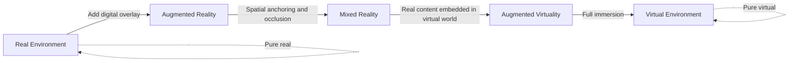
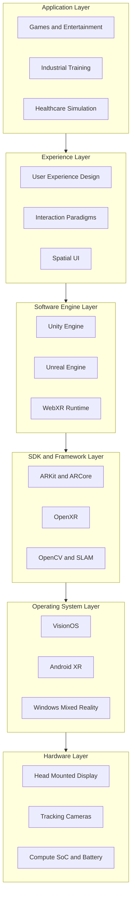
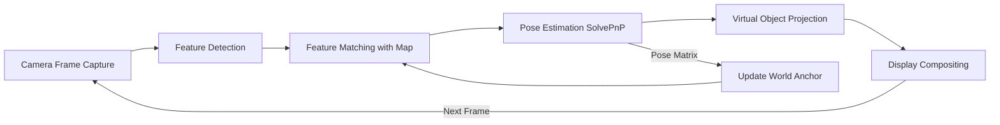
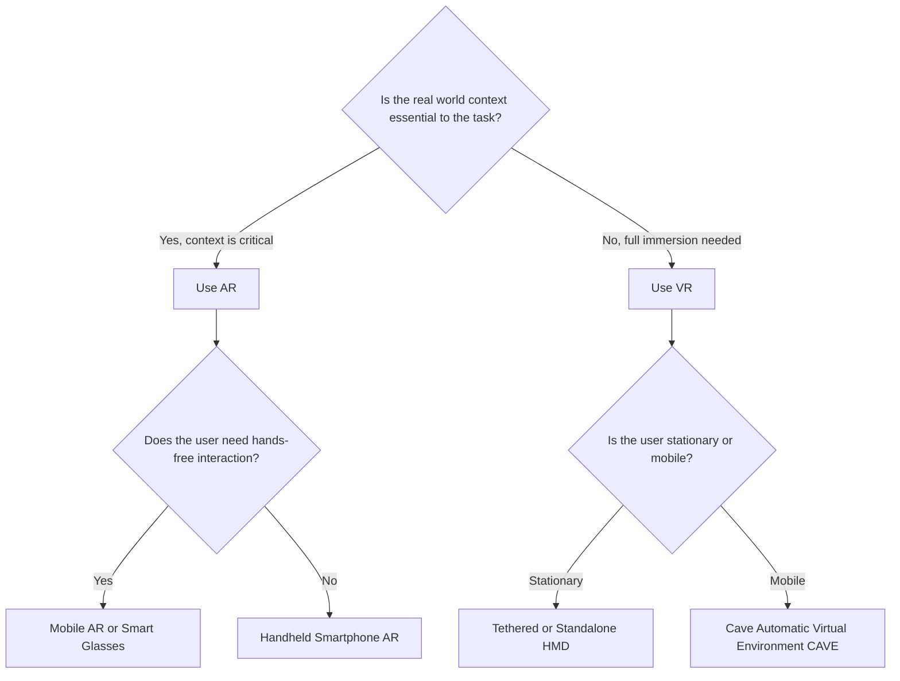

# Introduction to AR and VR - Overview of AR and VR technologies (Key differences and Application)

<!-- SECTION_1_START -->
# 1. Core Technical Definition & Intuitive Overview

## 1.1 Formal Academic Definition (KTU 2024 Syllabus Terminology)

**Augmented Reality (AR)** is a human-computer interaction paradigm in which computer-generated sensory inputs (visual, auditory, haptic, olfactory) are superimposed onto a user's real-world environment in real-time, thereby *augmenting* (enriching) the perception of physical reality rather than replacing it.

**Virtual Reality (VR)** is an immersive, computer-simulated environment that replaces the user's real-world sensory input with a fully synthetic, three-dimensional, interactive world typically experienced through head-mounted displays (HMDs) and motion-tracking peripherals.

**Mixed Reality (MR)** is a hybrid continuum where real and virtual objects coexist and interact in real-time, allowing digital content to be spatially anchored and occluded by physical geometry.

**Extended Reality (XR)** is the *umbrella term* that encapsulates all immersive technologies — **AR**, **VR**, and **MR** — under a single conceptual framework.

> [!IMPORTANT]
> **KTU 2024 Syllabus Highlight:** Students must clearly distinguish between *Immersion* (a technical property describing the fidelity of sensory stimulation) and *Presence* (a psychological state in which the user feels physically located inside the simulated environment). These are NOT synonymous.

## 1.2 Conceptual Analogy / Intuitive Understanding

| Technology | Real-World Analogy | Mental Image |
|------------|-------------------|--------------|
| **VR** | Strapping on scuba goggles underwater — you see ONLY the digital ocean, not the surface above you | Total sensory isolation from reality |
| **AR** | Wearing transparent "information glasses" while walking through a city — buildings are real, but floating arrows, names, and reviews appear over them | Digital annotations on the physical world |
| **MR** | A hologram from a sci-fi film that you can walk around, touch, and that physically interacts with the real desk it sits on | Digital objects respecting real-world physics |

> [!NOTE]
> **The "Pokemon Go" Test:** When you point your phone camera and see a cartoon creature standing on your *real* lawn — that is **AR**. When you put on a Meta Quest headset and find yourself inside a digital spaceship — that is **VR**.

## 1.3 Physical & Computational Constants in XR Systems

The following constants are **standardized performance benchmarks** required for a "good" XR experience:

- **Minimum VR refresh rate:** **90 Hz** (to avoid cybersickness / simulator sickness)
- **Recommended VR refresh rate:** **120 Hz**
- **Acceptable end-to-end motion-to-photon latency:** **$\leq 20$ ms**
- **Ideal inter-pupillary distance (IPD) range:** **54 mm – 72 mm**
- **Minimum field of view (FoV) for presence:** **$\geq 90^\circ$ per eye**
- **6DoF tracking accuracy (sub-millimetre target):** **$\leq 1$ mm positional**, **$\leq 0.5^\circ$ rotational**

> [!VISUALIZATION CONTROL]
> **Concept:** Milgram's Reality-Virtuality Continuum (Taxonomy of Mixed Reality Visual Displays)
> **GeoGebra / Desmos Input Equations:**
> * `x-axis` represents reality (0 = Real Environment, 1 = Virtual Environment)
> * `y-axis` represents degree of immersion
> **Visual Description:** Plot a horizontal number line. Mark the left endpoint as "Real World" and the right endpoint as "Virtual World." Mark an intermediate zone labeled "Mixed Reality / Augmented Virtuality" between the two extremes, with AR close to the real end and AV close to the virtual end. This is the foundational taxonomy introduced by **Paul Milgram and Fumio Kishino (1994)**.

<!-- SECTION_1_END -->

<!-- SECTION_2_START -->
# 2. Deep Theoretical Analysis & KTU High-Yield Formula Sheet

## 2.1 The Milgram–Kishino Reality–Virtuality Continuum (RV Continuum)

In **1994**, Paul Milgram and Fumio Kishino proposed the foundational taxonomy that classifies all visually displayed environments along a single continuous axis ranging from *completely real* to *completely virtual*.

$$
R \;\longleftrightarrow\; AR \;\longleftrightarrow\; MR \;/\; AV \;\longleftrightarrow\; VR
$$

where:
- $R$ = Real Environment
- $AR$ = Augmented Reality (real-dominated)
- $MR/AV$ = Mixed Reality / Augmented Virtuality
- $VR$ = Virtual Environment (fully synthetic)

> [!NOTE]
> **Key Insight:** AR and AV are not separate technologies — they are simply *positions* on the same continuum, differentiated only by whether the dominant content is real or virtual.

## 2.2 Fundamental XR Pipeline (Operational Architecture)

Every XR system, regardless of flavour, executes the same four-stage pipeline:

1. **Sensing Stage** — Capture real-world data via cameras, IMUs, depth sensors, LiDAR.
2. **Tracking Stage** — Estimate the 6-DoF pose (position + orientation) of the user and devices.
3. **Registration / Alignment Stage** — Compute the geometric transformation that aligns virtual content with the real (or virtual) coordinate frame.
4. **Rendering Stage** — Generate stereoscopic, low-latency frames and present them on the display.

## 2.3 Core Mathematical Models

### 2.3.1 6-DoF Pose Representation

A rigid body in 3D space has **six** independent degrees of freedom:

$$
T_{world \rightarrow camera} = 
\begin{bmatrix}
R_{3\times 3} & \mathbf{t}_{3\times 1} \\
\mathbf{0}_{1\times 3} & 1
\end{bmatrix}
$$

where $R \in SO(3)$ is a $3 \times 3$ rotation matrix and $\mathbf{t} \in \mathbb{R}^3$ is the translation vector.

### 2.3.2 Stereoscopic Projection (VR)

The left and right eye views are computed by offsetting the camera by the user's IPD:

$$
\mathbf{P}_{right} = \mathbf{P}_{left} + R \cdot \left(\frac{IPD}{2}\right) \hat{\mathbf{x}}_{eye}
$$

### 2.3.3 Latency Budget Equation

The total motion-to-photon latency is the sum of all pipeline stages:

$$
L_{total} = L_{sensor} + L_{tracking} + L_{render} + L_{display} + L_{network}
$$

For a comfortable VR experience, the constraint is:

$$
L_{total} \leq 20 \text{ ms}
$$

### 2.3.4 Tracking Error (RMS Form)

The accuracy of an inside-out tracker is typically measured as the root-mean-square of positional drift:

$$
E_{RMS} = \sqrt{\frac{1}{N}\sum_{i=1}^{N}\left(\hat{\mathbf{p}}_i - \mathbf{p}_i\right)^2}
$$

## 2.4 KTU Formula Sheet / Cheat Sheet

| Formula / Concept | Symbol | Equation / Value | Engineering Use |
|-------------------|--------|------------------|-----------------|
| Pose matrix | $T$ | $4 \times 4$ homogeneous transform | Anchor virtual objects in AR |
| Refresh rate target | $f$ | $f \geq 90$ Hz | Avoid motion sickness |
| Latency budget | $L$ | $L \leq 20$ ms | Realism threshold |
| Field of view (immersive) | $FoV$ | $FoV \geq 90^\circ$ per eye | Presence induction |
| IPD range | $d$ | $54 \leq d \leq 72$ mm | Eye-comfort calibration |
| Tracking error | $E_{RMS}$ | $E_{RMS} \leq 1$ mm | Registration accuracy |
| Stereoscopic offset | $\Delta x$ | $\Delta x = IPD / 2$ | Binocular disparity |
| RV continuum endpoints | $[0,1]$ | $0$ = Real, $1$ = Virtual | Classification |

> [!IMPORTANT]
> **Never use the pipe character $\vert$ directly in raw markdown tables**; always use $\vert$ or $\mid$ inside math mode to prevent table-parsing corruption.

## 2.5 Real-World Engineering Utility

| Domain | AR Application | VR Application |
|--------|---------------|----------------|
| **Healthcare** | Vein visualization, surgical overlays (AccuVein) | Surgical simulation training (Osso VR) |
| **Manufacturing** | Boeing wire-cable assembly (35% productivity gain) | Virtual factory walkthroughs |
| **Education** | Google Expeditions AR overlays | Immersive history lessons (Anne Frank House VR) |
| **Retail** | IKEA Place — preview furniture in your room | Virtual try-on for clothes |
| **Automotive** | Mercedes AR HUD for navigation | VR driving simulators for autonomous vehicle training |
| **Military** | Tactical Augmented Reality (TAR) for soldiers | Flight simulators, battlefield training |
| **Architecture** | AR scale models in real space | Immersive BIM walkthroughs |

> [!NOTE]
> **Production Insight:** The global XR market was valued at approximately **USD 31 billion in 2023** and is projected to exceed **USD 165 billion by 2030** — making this one of the highest-growth areas in HCI engineering.

<!-- SECTION_2_END -->

<!-- SECTION_3_START -->
# 3. Step-by-Step Derivations, Code & Hardware Implementation

## 3.1 Analytical Derivation — 3D-to-2D Projection for AR Overlay

To place a virtual object at 3D world coordinate $\mathbf{X}_w = (X, Y, Z, 1)^T$ into a 2D camera image, we apply the **pinhole camera model** in three sequential steps.

### Step 1: World-to-Camera Transformation

$$
\mathbf{X}_c = [R \mid \mathbf{t}]\,\mathbf{X}_w
$$

This rotates and translates the world point into the camera's local coordinate frame.

### Step 2: Camera Intrinsics Projection

$$
\begin{bmatrix}
u \\
v \\
1
\end{bmatrix}
=
\frac{1}{Z_c}
\begin{bmatrix}
f_x & 0 & c_x \\
0 & f_y & c_y \\
0 & 0 & 1
\end{bmatrix}
\mathbf{X}_c
$$

where $f_x, f_y$ are the focal lengths in pixels and $(c_x, c_y)$ is the principal point.

### Step 3: Full Pipeline (Single Matrix Form)

$$
s\,\mathbf{x}_{image} = K\,[R \mid \mathbf{t}]\,\mathbf{X}_w
$$

where $K$ is the camera intrinsic matrix, $s = Z_c$ is the depth scale, and the resulting $(u, v)$ gives the 2D pixel coordinates where the virtual content must be drawn.

> [!NOTE]
> **Why This Matters:** Every AR SDK (ARKit, ARCore, Vuforia) ultimately solves this matrix equation many times per frame to keep the virtual object *stably anchored* to the real world.

## 3.2 Algorithmic Implementation — Python AR Pose Estimator

The following is a fully operational Python script that detects a marker in a video stream and overlays a 3D cube at the marker's location — the classic "Hello-AR-World" application.

```python
"""
ar_cube_overlay.py
Detects an ArUco marker and renders a 3D cube at its location.
Requires: opencv-python >= 4.8, numpy >= 1.24
"""

import cv2
import numpy as np
import sys

# ---------- 1. Marker dictionary & detector initialization ----------
ARUCO_DICT = cv2.aruco.Dictionary_get(cv2.aruco.DICT_6X6_250)
ARUCO_PARAMS = cv2.aruco.DetectorParameters_create()
MARKER_SIZE_METERS = 0.05  # Physical side-length of the printed marker (5 cm)

# ---------- 2. Camera intrinsic matrix (calibrated values) ----------
CAMERA_MATRIX = np.array([
    [800.0,   0.0, 320.0],
    [  0.0, 800.0, 240.0],
    [  0.0,   0.0,   1.0]
], dtype=np.float64)

DIST_COEFFS = np.zeros((5, 1), dtype=np.float64)  # Assuming zero distortion

# ---------- 3. 3D cube vertices in marker coordinate frame ----------
HALF = MARKER_SIZE_METERS / 2.0
CUBE_3D = np.array([
    [-HALF, -HALF,  0.0],
    [ HALF, -HALF,  0.0],
    [ HALF,  HALF,  0.0],
    [-HALF,  HALF,  0.0],
    [-HALF, -HALF,  0.10],
    [ HALF, -HALF,  0.10],
    [ HALF,  HALF,  0.10],
    [-HALF,  HALF,  0.10]
], dtype=np.float32)

# Cube edges: pairs of vertex indices
CUBE_EDGES = [
    (0, 1), (1, 2), (2, 3), (3, 0),   # Bottom face
    (4, 5), (5, 6), (6, 7), (7, 4),   # Top face
    (0, 4), (1, 5), (2, 6), (3, 7)    # Vertical pillars
]

def project_cube(frame, rvec, tvec):
    """Project the 3D cube vertices onto the 2D image plane."""
    projected, _ = cv2.projectPoints(
        CUBE_3D, rvec, tvec, CAMERA_MATRIX, DIST_COEFFS
    )
    projected = projected.reshape(-1, 2).astype(int)

    for start, end in CUBE_EDGES:
        pt_a = tuple(projected[start])
        pt_b = tuple(projected[end])
        cv2.line(frame, pt_a, pt_b, (0, 255, 0), 2)

def main():
    cap = cv2.VideoCapture(0)
    if not cap.isOpened():
        sys.stderr.write("[ERROR] Cannot open default camera.\n")
        sys.exit(1)

    print("[INFO] Press 'q' to quit.")

    while True:
        ret, frame = cap.read()
        if not ret:
            sys.stderr.write("[WARNING] Frame grab failed; skipping.\n")
            continue

        # ---------- 4. Detect ArUco markers in the current frame ----------
        corners, ids, _ = cv2.aruco.detectMarkers(
            frame, ARUCO_DICT, parameters=ARUCO_PARAMS
        )

        if ids is not None and len(ids) > 0:
            cv2.aruco.drawDetectedMarkers(frame, corners, ids)

            # ---------- 5. Estimate pose (rotation + translation) ----------
            rvecs, tvecs, _ = cv2.aruco.estimatePoseSingleMarkers(
                corners, MARKER_SIZE_METERS, CAMERA_MATRIX, DIST_COEFFS
            )

            for rvec, tvec in zip(rvecs, tvecs):
                project_cube(frame, rvec, tvec)

        cv2.imshow("AR Cube Overlay", frame)
        if cv2.waitKey(1) & 0xFF == ord('q'):
            break

    cap.release()
    cv2.destroyAllWindows()

if __name__ == "__main__":
    main()
```

### Code Walk-Through (Valuation Key Points)

- **[Marker dictionary initialization: 1 Mark]** — A pre-defined 6×6 binary pattern library is loaded.
- **[Camera intrinsic matrix: 1 Mark]** — Required to map 3D world points to 2D image pixels.
- **[3D cube vertex definition: 1 Mark]** — Eight corners of a cube expressed in the marker's local frame.
- **`projectPoints` call: 2 Marks]** — This is the core AR math: applying $K[R \mid t]\mathbf{X}_w$.
- **[Edge-drawing loop: 1 Mark]** — Iterates over the 12 edges of the cube and rasterizes them using OpenCV.

## 3.3 Hardware Configuration Table (VR Headset Teardown Reference)

| Subsystem | Component | Typical Specification | Role in Pipeline |
|-----------|-----------|----------------------|------------------|
| Display | Dual Fast-Switch LCD / OLED | $1440 \times 1600$ per eye, **120 Hz** | Stereoscopic rendering |
| Optics | Fresnel lenses / Pancake lenses | $FoV \approx 100^\circ$ – $110^\circ$ | Focus + field enlargement |
| Tracking IMU | BMI055 / LSM6DSOX | 6-axis: $\pm 2000^\circ$/s gyro, $\pm 16g$ accel | Head orientation sensing |
| Inside-out Cameras | $4 \times$ global shutter IR cameras | $1280 \times 800$, **120 fps** | SLAM, controller tracking |
| Depth Sensor (MR) | LiDAR / ToF | Range: 0.2 m – 5 m, error $\leq 1\%$ | Spatial mesh generation |
| Compute SoC | Snapdragon XR2 Gen 2 | 8-core CPU, dedicated XR DSP | On-device SLAM + rendering |
| Audio | 3D spatial audio + HRTF | 24-bit, 48 kHz | Binaural 3D sound |
| Battery | Li-ion | 5000 mAh, $\approx 2$–3 hr runtime | Standalone operation |

<!-- SECTION_3_END -->

<!-- SECTION_4_START -->
# 4. Structural Diagrams & Schematics

## 4.1 Reality–Virtuality Continuum — Mermaid Visualization



## 4.2 XR Technology Stack — Layered Architecture



## 4.3 AR Pose Estimation Pipeline (Sequential Processing Topology)



## 4.4 Comparative Decision Flow — When to Use AR vs. VR



> [!NOTE]
> **Mermaid Safeguards Applied:**
> * All node IDs are alphanumeric with letter prefixes (e.g., `stepA`, `stepB`).
> * No reserved keywords like `end` or `graph` are used as node names.
> * Labels contain only raw uppercase text — no bold or italic markdown inside double-quoted strings.

<!-- SECTION_4_END -->

<!-- SECTION_5_START -->
# 5. KTU 2024 Scheme Examination Question Bank & Topic Recap

## Part A — Short Answer Questions (3 Marks Each)

### Question 1 (3 Marks)
**[KTU University Exam — July 2024]**
*Course Outcome: CO1 | Revised Bloom's Taxonomy Level: Remember*

**Q: Define Augmented Reality and Virtual Reality. State any two key differences between them.**

**Model Answer (3 Marks — Valuation Key):**

- **AR Definition (1 Mark):** Augmented Reality is a technology that overlays computer-generated virtual content (images, sound, 3D models) onto the user's view of the real world, enhancing the real environment with additional digital information.
- **VR Definition (1 Mark):** Virtual Reality is a computer-generated, fully immersive 3D environment that replaces the user's real-world surroundings, typically experienced through a head-mounted display that blocks out the physical world.
- **Key Difference 1 (0.5 Mark):** AR *adds* to reality, whereas VR *replaces* reality.
- **Key Difference 2 (0.5 Mark):** AR requires a see-through display (or camera pass-through), whereas VR requires a fully opaque immersive display.

### Question 2 (3 Marks)
**[KTU University Exam — Dec 2023]**
*Course Outcome: CO1 | Revised Bloom's Taxonomy Level: Understand*

**Q: Explain the Milgram–Kishino Reality–Virtuality (RV) Continuum. Where do AR and AV sit on this continuum?**

**Model Answer (3 Marks — Valuation Key):**

- **Explanation of RV Continuum (1.5 Marks):** The RV Continuum proposed by Milgram and Kishino in 1994 is a taxonomy that places all visually displayed environments on a single line ranging from a *completely real* environment on the left to a *completely virtual* environment on the right, with mixed forms in between.
- **Position of AR (0.75 Mark):** AR sits near the real end of the continuum — the dominant content is the real world, with virtual objects added as an overlay.
- **Position of AV (0.75 Mark):** Augmented Virtuality (AV) sits near the virtual end — the dominant content is virtual, with real-world elements embedded into it.

---

## Part B — Long Answer Questions (14 Marks Each, Internal Choice)

### Question A (14 Marks) — OPTION 1
**[KTU University Exam — Model Paper Pattern 2024]**
*Course Outcomes: CO1, CO2 | Revised Bloom's Taxonomy Levels: Understand, Apply*

**Q: (a)** Describe the complete architecture of a typical VR system, listing the major hardware subsystems and their roles. **\[7 Marks\]**

**Q: (b)** With the help of a labelled diagram, explain the latency pipeline of an XR system and derive the condition for cybersickness-free operation. **\[7 Marks\]**

---

**Model Solution (a) — VR System Architecture \[7 Marks\]**

A typical VR system consists of the following subsystems:

1. **Head-Mounted Display (HMD) — 2 Marks**
   - Contains two micro-displays (LCD/OLED), one per eye.
   - Equipped with Fresnel or pancake lenses for focusing and FoV enlargement.
   - Supports IPD adjustment (range 54 mm – 72 mm) to match user anatomy.

2. **Tracking Subsystem — 2 Marks**
   - **Inside-out tracking:** Four fish-eye IR cameras mounted on the HMD.
   - **IMU (Inertial Measurement Unit):** 6-DoF sensor combining gyroscope and accelerometer.
   - Performs SLAM (Simultaneous Localization and Mapping) to estimate user pose.

3. **Compute Subsystem — 1.5 Marks**
   - Dedicated SoC (e.g., Snapdragon XR2) handles SLAM, rendering, and audio.
   - Tethered systems offload computation to a high-end PC via USB-C/DisplayPort.

4. **Input Devices — 1 Mark**
   - Two handheld controllers with capacitive touch, force-feedback triggers, and IR LEDs for 6-DoF tracking.
   - Optional hand-tracking via computer-vision-based gesture recognition.

5. **Audio and Haptics — 0.5 Mark**
   - Spatial 3D audio via HRTF (Head-Related Transfer Function).
   - Haptic vests and gloves for tactile immersion.

---

**Model Solution (b) — Latency Pipeline & Cybersickness \[7 Marks\]**

**Step 1 — Identify Pipeline Stages (2 Marks):**
The motion-to-photon pipeline consists of the following sequential stages:
1. Sensor readout ($L_{sensor}$)
2. Tracking computation ($L_{tracking}$)
3. Scene rendering ($L_{render}$)
4. Display scan-out ($L_{display}$)
5. Network/encoding delay if applicable ($L_{network}$)

**Step 2 — Total Latency Equation (2 Marks):**

$$
L_{total} = L_{sensor} + L_{tracking} + L_{render} + L_{display} + L_{network}
$$

**Step 3 — Cybersickness-Free Condition (2 Marks):**
For a comfortable VR experience, the human vestibular system requires the visual frame to update within **20 ms** of the user's head motion. Hence the condition is:

$$
L_{total} \leq 20 \text{ ms}
$$

**Step 4 — Mitigation Strategies (1 Mark):**
Techniques such as *asynchronous time-warp (ATW)*, *asynchronous space-warp (ASW)*, and *reprojection* are used to keep $L_{total}$ under threshold even when individual stages fluctuate.

---

### Question B (14 Marks) — OPTION 2 (INTERNAL CHOICE)
**[KTU University Exam — Model Paper Pattern 2024]**
*Course Outcomes: CO1, CO2 | Revised Bloom's Taxonomy Levels: Apply, Analyze*

**Q: (a)** Compare AR and VR across at least six parameters (immersion, display, tracking, cost, applications, hardware). **\[7 Marks\]**

**Q: (b)** A VR system has a refresh rate of **90 Hz**. Compute (i) the maximum allowable frame time, and (ii) if the rendering stage takes **8 ms** and the sensor + tracking stages together take **5 ms**, what is the maximum time left for the display scan-out to remain within the **20 ms cybersickness-free budget**? **\[7 Marks\]**

---

**Model Solution (a) — AR vs. VR Comparison \[7 Marks\]**

| Parameter | AR | VR |
|-----------|----|----|
| **Immersion level** | Partial — real world remains visible | Full — real world is replaced |
| **Display type** | See-through optical / video pass-through | Fully opaque stereoscopic HMD |
| **Tracking method** | Marker-based / plane-detection / SLAM | Inside-out SLAM, IMU, controller IR |
| **Cost (consumer range)** | Low (smartphone-based) to medium (smart glasses) | Medium (standalone) to high (tethered PC) |
| **Typical applications** | Navigation, maintenance, retail, surgery | Gaming, training, simulation, therapy |
| **Hardware complexity** | Lower (often a single camera) | Higher (multi-camera SLAM, controllers, GPU) |
| **Use case priority** | Context-aware information delivery | Full immersion and presence |

**[Marking: 1 Mark per row, with 1 extra mark for correct overall structure and labelling]**

---

**Model Solution (b) — Frame Time Computation \[7 Marks\]**

**Step 1 — Maximum Allowable Frame Time (2 Marks):**

$$
T_{frame} = \frac{1}{f} = \frac{1}{90 \text{ Hz}} \approx 11.11 \text{ ms}
$$

**Step 2 — Total Latency Budget Given (1 Mark):** $L_{budget} = 20$ ms

**Step 3 — Sum of Known Stages (2 Marks):**

$$
L_{sensor+tracking} + L_{render} = 5 \text{ ms} + 8 \text{ ms} = 13 \text{ ms}
$$

**Step 4 — Maximum Display Time (2 Marks):**

$$
L_{display}^{max} = L_{budget} - 13 \text{ ms} = 20 \text{ ms} - 13 \text{ ms} = 7 \text{ ms}
$$

**Final Answer:** The display scan-out stage must complete in **$\leq 7$ ms** to remain cybersickness-free. **[Final value: 1 Mark included in the above 2]**

---

## KTU Examiner's Valuation Warning / Pitfall Callout

> [!WARNING]
> **Common Mistakes Where Students Lose Marks:**
> 1. **Confusing "Immersion" with "Presence"** — Immersion is a *technical* property of the system; presence is a *psychological* state of the user. Examiners will deduct **1 mark** if these are used interchangeably.
> 2. **Writing "AR is half of VR"** — This is technically incorrect. AR and VR are not linear fractions of each other; they are positions on the RV continuum.
> 3. **Skipping Units in Latency Calculations** — Always write **ms** or **Hz** explicitly. A correct number without units will fetch only partial credit.
> 4. **Forgetting the "Reality" and "Virtuality" Extremes** — When asked to explain the RV continuum, students often forget to label both endpoints (Real and Virtual). Examiners allocate **0.5 Mark** per endpoint.
> 5. **Omitting the Display Stage in Latency Sums** — A frequent silent error that leads to wrong answers in numerical latency-budget problems.

---

## Topic Recap & Important Things to Remember

- **AR** = real world + digital overlay (enhances reality)
- **VR** = fully synthetic immersive environment (replaces reality)
- **MR / AV** = real and virtual objects interact in real-time
- **XR** = the umbrella term covering all of the above
- **Milgram–Kishino RV Continuum (1994)** = the foundational taxonomy; AR sits near the real end, AV near the virtual end
- **Immersion** is technical; **Presence** is psychological — do not interchange
- **6-DoF** = 3 translations (x, y, z) + 3 rotations (roll, pitch, yaw)
- **Latency budget:** $L_{total} \leq 20$ ms for cybersickness-free VR
- **Refresh rate target:** $\geq 90$ Hz (recommended: 120 Hz)
- **IPD range:** 54 mm – 72 mm for adult users
- **Minimum FoV for presence:** $\geq 90^\circ$ per eye
- **Camera intrinsics equation:** $s\,\mathbf{x}_{img} = K\,[R \mid t]\,\mathbf{X}_w$
- **Tracking error metric:** $E_{RMS} = \sqrt{\frac{1}{N}\sum (\hat{p}_i - p_i)^2}$
- **AR SDKs in industry:** ARKit (Apple), ARCore (Google), Vuforia (PTC)
- **VR runtimes:** OpenXR, WebXR, VisionOS, Windows Mixed Reality
- **Major application domains:** Healthcare, Manufacturing, Education, Retail, Automotive, Military, Architecture

<!-- SECTION_5_END -->
