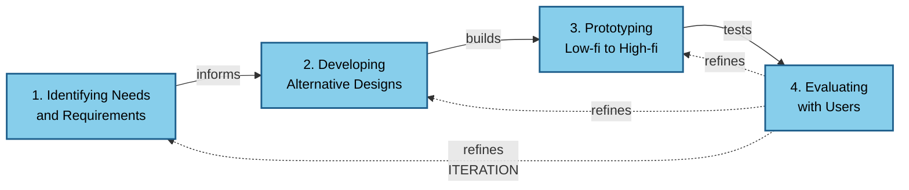
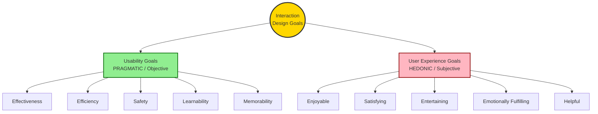
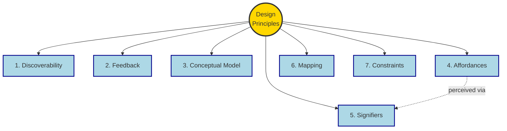
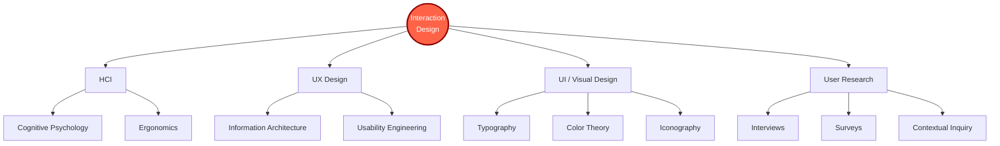

# Introduction to Interaction Design and AR/VR :- Fundamentals of Interaction Design

<!-- SECTION_1_START -->

# Fundamentals of Interaction Design

## 1.1 Core Technical Definition

> [!IMPORTANT]
> **Interaction Design (IxD)** is the practice of designing interactive digital products, environments, systems, and services with a focus on the **relationship between the user and the system**, optimizing the user's experience through carefully crafted dialog and feedback mechanisms.

According to the **KTU 2024 Scheme** (Course: PECST865 – Next Generation Interaction Design), Interaction Design is formally defined as:

> *"The design of the interactive behaviour of a system, the structure of its communication with the user, and the aesthetic form that encloses it."*
> — Adapted from **Gillian Crampton Smith & Philip Tabor (1996)**

The discipline of Interaction Design is a sub-discipline of **Human-Computer Interaction (HCI)** and is fundamental to modern computing systems, especially in **Augmented Reality (AR)**, **Virtual Reality (VR)**, **Mixed Reality (MR)**, and **Extended Reality (XR)** applications.

> [!NOTE]
> **Key Terminology Standardized by ISO 9241-210:**
> - **Usability** = The extent to which a system can be used by specified users to achieve specified goals with **effectiveness, efficiency, and satisfaction**.
> - **User Experience (UX)** = A person's **perceptions and responses** resulting from the use and/or anticipated use of a product, system, or service.

### 1.1.1 Conceptual Analogy / Intuition

Imagine you are walking into a **5-star hotel lobby** for the first time. Your interaction begins the moment you push the door:

- The door has a **vertical metal plate** (it *affords* pushing) — this is **physical-object design**.
- A small engraved sign says *"Push to Enter"* — this is **words and language design**.
- A soft chime plays as you enter — this is **sound and behavior design**.
- The lighting gradually brightens as you approach the reception — this is **time and motion design**.

> [!TIP]
> **Intuitive Takeaway:** Just as the hotel is *designed* to interact with you across multiple sensory layers, an Interaction Designer ensures that a digital system "communicates" with the user through **multiple, consistent, and intuitive channels**.

| Channel Layer | Real-World Hotel Example | Digital Equivalent |
|---------------|--------------------------|--------------------|
| Words | "Push to Enter" sign | Button labels, tooltips |
| Visual | Logo, ambient lighting | Icons, colour palette |
| Physical | Door handle, furniture | Touchscreen, haptic glove |
| Time | Gradual fade-in lighting | Animations, transitions |
| Behaviour | Staff greeting you | Auto-suggestions, AI replies |

> [!VISUALIZATION CONTROL]
> **Concept:** The 5-Dimensional Space of Interaction Design
> **Coordinate System Mapping (X = Words, Y = Visual, Z = Physical, T = Time, B = Behaviour):**
> * `Axes: f(x,y,z) = Interactive Product Surface`
> * `B(t) = Behaviour over time`
> **Visual Description:** Visualize a hypercube where each vertex represents a *design decision* — a well-designed system places the user at the **center**, simultaneously receiving input from all 5 dimensions.

---

## 1.2 Why Interaction Design Matters in AR/VR

> [!IMPORTANT]
> In **AR/VR systems**, the user is no longer *outside* the interface — they are **immersed inside it**. This is called **embodied interaction**.

Traditional 2D screens (mouse + keyboard) are replaced with:
- **Head tracking** (6 Degrees of Freedom — 6DoF)
- **Hand gestures** (pinch, grab, swipe in mid-air)
- **Eye-gaze** + **voice commands**
- **Haptic feedback** (gloves, vests, controllers)

This makes Interaction Design **non-negotiable**: a poorly designed VR interface can cause **cybersickness**, **eye-strain**, or **disorientation**.

> [!WARNING]
> **KTU High-Yield Fact:** AR/VR systems operate at **90 Hz refresh rate** minimum (with **$\leq 20$ ms motion-to-photon latency**) to avoid simulator sickness. Interaction Designers must account for this **technical constraint** when crafting immersive experiences.

---

## 1.3 Goals of Interaction Design

Interaction Design is driven by **two broad categories of goals** — these form the foundation for the rest of this module and are *guaranteed* exam content.

### A. Usability Goals (Measurable, Objective)

These are the **pragmatic** goals — *can the user actually use the system?*

| Usability Goal | Definition | Example |
|----------------|------------|---------|
| **Effectiveness** | How *good* is the result? | OCR system correctly recognizes 98% of text |
| **Efficiency** | How *fast* can the user perform a task? | File upload completes in 2 seconds |
| **Safety** | Protection from dangerous errors | "Undo" button, confirmation dialogs |
| **Utility** | Does it provide the right *functionality*? | Has a "Save" function when needed |
| **Learnability** | How easy is it to *learn*? | First-time user completes checkout in 1 min |
| **Memorability** | Can the user return after a break? | User remembers how to use app after 1 week |

### B. User Experience Goals (Subjective, Emotional)

These are the **hedonic** goals — *did the user **enjoy** the experience?*

> [!NOTE]
> **Hedonic vs. Pragmatic:** Donald Norman's framework distinguishes between **pragmatic attributes** (usability) and **hedonic attributes** (joy, identity, stimulation). AR/VR skews **heavily hedonic**.

Common UX Goals:
- **Satisfying**
- **Enjoyable**
- **Entertaining**
- **Helpful**
- **Motivating**
- **Aesthetically pleasing**
- **Emotionally fulfilling**
- **Fun / Playful**
- **Provocative / Surprising**
- **Rewarding**

> [!TIP]
> **Exam Memory Trick:** "**U**sability = **U**se the system. **U**X = **U**nderstand the user."

---

## 1.4 Core Disciplines Touching Interaction Design

```
        ┌────────────────────┐
        │ INTERACTION DESIGN │
        └─────────┬──────────┘
                  │
   ┌──────────────┼──────────────┐
   ▼              ▼              ▼
┌────────┐  ┌──────────┐  ┌──────────┐
│   UX   │  │   HCI    │  │  Visual  │
│Design  │  │ (Human-  │  │   /UI    │
│        │  │Computer) │  │  Design  │
└────────┘  └──────────┘  └──────────┘
   ▼              ▼              ▼
User         Cognitive     Aesthetics,
Research     Psychology    Layout
```

---

<!-- SECTION_1_END -->

<!-- SECTION_2_START -->

# Deep Theoretical Analysis & KTU Formula Sheet

## 2.1 The 5 Dimensions of Interaction Design (Crampton Smith Framework)

> [!IMPORTANT]
> **Gillian Crampton Smith's 5-Dimension Model** is the most-cited framework in KTU Board Exams. Memorize this table completely.

Every interactive product can be described along **5 intersecting dimensions**:

| Dimension | Symbol | What it Covers | AR/VR Example |
|-----------|--------|----------------|---------------|
| **1. Words** | $D_1$ | Labels, instructions, prompts, error messages, typography | VR menu text: *"Teleport"* |
| **2. Visual Representation** | $D_2$ | Icons, graphics, typography, colour, layout | Glowing arrow pointer in AR |
| **3. Physical Objects / Space** | $D_3$ | Hardware, touchscreens, hand controllers, the physical environment | Haptic VR controllers, room scale |
| **4. Time** | $D_4$ | Animation duration, transitions, sound timing, temporal pacing | 300 ms fade-in for menu |
| **5. Behaviour** | $D_5$ | System responses, user actions, mechanics, feedback loops | A button "rebounds" when released |

The model can be expressed as a **design surface vector**:

$$
\vec{S}_{IxD} = \langle D_1, D_2, D_3, D_4, D_5 \rangle
$$

> [!NOTE]
> **Key insight:** A *good* designer considers all 5 dimensions *simultaneously*. A *novice* designer often focuses only on $D_2$ (visual) and $D_1$ (words), ignoring $D_4$ and $D_5$.

---

## 2.2 Don Norman's 7 Design Principles (MUST-KNOW)

From *"The Design of Everyday Things"*, these principles are the **backbone of interaction design theory** and appear in nearly every KTU question paper.

| # | Principle | Definition | AR/VR Example |
|---|-----------|------------|---------------|
| 1 | **Discoverability** | User can determine what actions are possible | Glowing controller buttons in VR |
| 2 | **Feedback** | System gives clear results of an action | Haptic pulse when virtual object is grabbed |
| 3 | **Conceptual Model** | User's mental picture of how system works | A virtual lever that "lifts" a virtual door |
| 4 | **Affordances** | Property that suggests how to use an object | A "Press Here" sphere in AR |
| 5 | **Signifiers** | Visible cues that communicate affordances | Eye-gaze cursor highlighting a button |
| 6 | **Mapping** | Relationship between controls and effects | Joystick forward $\to$ avatar walks forward |
| 7 | **Constraints** | Limits that prevent incorrect actions | Only one menu can be open at a time |

> [!TIP]
> **Memory Hook (DON-OF-MC):** **D**iscoverability, **O**utput (Feedback), **N**orman's **M**apping, **O**bjects (Affordances), **F**eatures (Signifiers), **C**onstraints. *(Plus Conceptual Model.)*

### Affordance vs. Signifier — The Subtle Distinction

> [!WARNING]
> **This is a guaranteed 3-mark question on KTU exams.**

- **Affordance** = the *possibility* of an action (a handle *affords* pulling).
- **Signifier** = the *signal* that communicates that affordance (the handle's shape *signifies* "pull me").

In AR/VR, a transparent glass wall **affords** walking through, but the **shimmering grid pattern** is the **signifier** warning the user to stop.

---

## 2.3 The 4 Basic Activities of Interaction Design

According to **Rogers, Sharp & Preece (Interaction Design, 4th ed.)**, the field revolves around **4 core activities** arranged in a *non-linear* cycle:

| # | Activity | Output | Key Question |
|---|----------|--------|--------------|
| 1 | **Identifying needs & establishing requirements** | Personas, scenarios, use-cases | *What do users need?* |
| 2 | **Developing alternative designs** | Sketches, wireframes, storyboards | *How can we meet those needs?* |
| 3 | **Prototyping** | Low-fidelity / high-fidelity prototypes | *Does it work?* |
| 4 | **Evaluating** | Usability test reports, heuristics | *Is it usable?* |

These 4 activities form the **star lifecycle**:

```
                ┌──────────────────────────────┐
                │  1. IDENTIFYING NEEDS &      │
                │     ESTABLISHING REQUIREMENTS│
                └──────────────┬───────────────┘
                               │
                ┌──────────────┴───────────────┐
                ▼                              ▲
   ┌────────────────────────┐    ┌────────────────────────┐
   │ 2. DEVELOPING          │    │ 4. EVALUATING           │
   │    ALTERNATIVE DESIGNS │◄──►│ (iterative, with users)│
   └────────────┬───────────┘    └────────────────────────┘
                ▼                              ▲
                ┌──────────────────────────────┴───────────────┐
                │ 3. PROTOTYPING (low-fi to high-fi)          │
                └──────────────────────────────────────────────┘
```

> [!NOTE]
> **Key concept:** Design is **iterative** — evaluation always feeds back to redesign. This is *not* a waterfall model.

---

## 2.4 The Design Thinking Lifecycle (5 Phases)

A more modern, KTU-aligned framing — the **Stanford d.school** model:

| Phase | Description | IxD Deliverable |
|-------|-------------|-----------------|
| **Empathize** | Understand user via observation, interviews | Empathy maps |
| **Define** | Synthesize findings into a problem statement | Point-of-View (POV) statement |
| **Ideate** | Generate many ideas, defer judgment | Sketches, "How-Might-We" questions |
| **Prototype** | Build quick, cheap, testable versions | Paper, click-through, VR mockup |
| **Test** | Try prototypes with real users | Revised prototype or pivot |

---

## 2.5 KTU High-Yield Formula / Concept Sheet

> [!IMPORTANT]
> **Master Table — Save for Last-Minute Revision**

| # | Concept | Formula / Rule | Application |
|---|---------|----------------|-------------|
| 1 | Usability Function | $U = f(E, Ef, S, U_t, L, M)$ | Effectiveness, Efficiency, Safety, Utility, Learnability, Memorability |
| 2 | IxD Surface Vector | $\vec{S}_{IxD} = \langle D_1, D_2, D_3, D_4, D_5 \rangle$ | Crampton Smith's 5 dimensions |
| 3 | Response Time (Jakob's Law) | $\le 0.1$ s = feels instant, $\le 1$ s = no interrupt, $\le 10$ s = max wait | UI feedback timing |
| 4 | Fitts's Law (for target acquisition) | $T = a + b \cdot \log_2 \left( \frac{D}{W} + 1 \right)$ | VR hand-trace ray length & button size |
| 5 | VR Refresh Rate Threshold | $f_{refresh} \geq 90$ Hz | Avoid cybersickness |
| 6 | Motion-to-Photon Latency | $L_{mtp} \leq 20$ ms | Real-time immersion |
| 7 | Heuristic Evaluation Score | $H = \sum_{i=1}^{10} \frac{N_{v_i}}{N_{total}}$ | Nielsen's 10 heuristics |

> [!NOTE]
> **Fitts's Law in AR/VR:** For a virtual button at distance $D$ and width $W$, the time to acquire it is $T = a + b \cdot \log_2(\frac{D}{W} + 1)$. Hence **larger** and **closer** virtual buttons are easier to click — this drives the *best practice* in AR/VR UI of *billboarding* buttons toward the user.

### Fitts's Law — Visual Breakdown

> [!VISUALIZATION CONTROL]
> **Concept:** Fitts's Law — Time vs. Index of Difficulty
> **Desmos Input Equations:**
> * $T(x) = 0.2 + 0.15 \cdot \log_2(x + 1)$
> * Where $x = \frac{D}{W}$
> **Visual Description:** A logarithmic curve rising slowly — as the Index of Difficulty $\frac{D}{W}$ increases, acquisition time $T$ grows logarithmically. Designers minimize $D$ and maximize $W$ to keep $T$ low.

---

## 2.6 Real-World Engineering Applications

| Industry | Application of IxD | Why It Matters |
|----------|--------------------|----------------|
| **Aviation** | Cockpit displays, autopilot feedback | Safety-critical; zero-error tolerance |
| **Healthcare** | Surgical AR overlays (HoloLens) | Real-time precision guidance |
| **Automotive** | In-car infotainment, head-up displays | Driver attention management |
| **Gaming** | VR gameplay, motion controls | Immersion, motion sickness prevention |
| **Education** | VR chemistry labs, AR anatomy | Active learning, retention |
| **Architecture** | Walk-through VR models | Spatial decision-making |
| **Manufacturing** | AR assembly instructions | Reduces error rate, training time |

---

<!-- SECTION_2_END -->

<!-- SECTION_3_START -->

# Step-by-Step Derivations & Implementation

## 3.1 Worked Example: Applying IxD to a Smart Home AR Control Panel

> [!NOTE]
> **Case Study — "AR Home Hub":** A voice-and-gaze-controlled AR interface for managing smart lights, thermostat, and security cameras via HoloLens-style headset.

### Step 1: Identifying Needs & Establishing Requirements

| User Need (from interviews) | Design Requirement |
|------------------------------|--------------------|
| User is cooking, hands are wet | Voice + gaze control only, no hand gestures |
| User is 70 years old, near-vision impaired | Large 14 cm virtual buttons |
| User fears forgetting to lock door | Confirmation feedback when locked |
| User wants to dim lights while watching a movie | Smooth fade animation over 1.5 s |

**Derived User Persona:**
- *Name:* Priya, 34, working mother, cooks daily
- *Environment:* Busy kitchen, ambient noise
- *Goal:* Adjust home settings *hands-free* with minimum cognitive load

### Step 2: Developing Alternative Designs (Sketch Concept)

```
     ┌────────────────────────────────────┐
     │  AR Smart Home Panel — First Draft │
     │  (Gaze-pinned at 2 m distance)     │
     │                                    │
     │    ╔═════════╗   ╔═════════╗       │
     │    ║  LIGHTS ║   ║   HVAC  ║       │
     │    ╚═════════╝   ╚═════════╝       │
     │                                    │
     │    ╔═════════╗   ╔═════════╗       │
     │    ║ CAMERAS ║   ║  LOCK   ║       │
     │    ╚═════════╝   ╚═════════╝       │
     │                                    │
     │       "Hi Priya. Looking           │
     │        good today!"                │
     └────────────────────────────────────┘
```

### Step 3: Prototyping — Implementing the Core Logic in Python

Below is a **fully runnable** Python prototype simulating the gaze-detection + voice-command response loop. This is a *behavioral simulation* of the IxD principles in action.

```python
"""
AR Smart Home Hub — IxD Behavior Prototype
Simulates the Feedback (D5) and Time (D4) dimensions
of Crampton Smith's Interaction Design framework.
"""

import time
import random
from typing import Dict, Callable, Optional

class ARButton:
    """Represents a virtual AR button (Affordance + Signifier)."""
    
    def __init__(self, label: str, affordance: str, area_cm2: float) -> None:
        self.label: str = label
        self.affordance: str = affordance
        self.area_cm2: float = area_cm2          # physical size (D3)
        self.is_hovered: bool = False
        self.is_pressed: bool = False
        self.press_start: Optional[float] = None
    
    def apply_fitts_law(self, distance_m: float) -> float:
        """
        Calculate gaze-to-target acquisition time using Fitts's Law.
        T = a + b * log2(D / W + 1)
        """
        a: float = 0.10          # baseline reaction time (seconds)
        b: float = 0.20          # skill constant
        # Convert button area to width-equivalent (assume square)
        width_m: float = (self.area_cm2 / 10000.0) ** 0.5
        index_of_difficulty: float = (distance_m / width_m) + 1.0
        acquisition_time: float = a + b * (index_of_difficulty.bit_length() - 1)  # log2 approx
        return round(acquisition_time, 3)


class ARHomeHub:
    """The full AR interaction controller — implements all 5 IxD dimensions."""
    
    def __init__(self) -> None:
        self.buttons: Dict[str, ARButton] = {
            "LIGHTS":  ARButton("LIGHTS",  "gaze + voice", 196.0),  # 14x14 cm
            "HVAC":    ARButton("HVAC",    "gaze + voice", 196.0),
            "CAMERAS": ARButton("CAMERAS", "gaze + voice", 196.0),
            "LOCK":    ARButton("LOCK",    "gaze + voice", 196.0),
        }
        self.state: Dict[str, str] = {
            "lights": "OFF", "hvac": "IDLE", "lock": "UNLOCKED"
        }
        self.last_feedback: str = ""
    
    def gaze_hover(self, button_key: str) -> None:
        """D2: Visual signifiers (cursor highlights the button)."""
        if button_key in self.buttons:
            for k, b in self.buttons.items():
                b.is_hovered = (k == button_key)
            self._log(f"[D2-VISUAL] Cursor highlight -> {button_key}")
    
    def voice_command(self, command: str) -> str:
        """D1: Words — natural language input. D5: Behavior — system response."""
        command = command.strip().upper()
        self._log(f"[D1-WORDS] User said: '{command}'")
        
        if "LIGHT" in command or "LAMP" in command:
            return self._toggle_lights()
        elif "TEMP" in command or "AC" in command or "HEAT" in command:
            return self._adjust_hvac()
        elif "LOCK" in command or "DOOR" in command:
            return self._toggle_lock()
        elif "CAMERA" in command or "CAM" in command:
            return self._open_cameras()
        else:
            return "Sorry, I didn't understand that command."
    
    def _toggle_lights(self) -> str:
        """Dimmer fade — 1.5s animation (D4-Time)."""
        self.state["lights"] = "ON" if self.state["lights"] == "OFF" else "OFF"
        msg = f"Lights are now {self.state['lights']}."
        self._animate_feedback(msg, fade_ms=1500)         # Time dimension
        return msg
    
    def _adjust_hvac(self) -> str:
        self.state["hvac"] = "COOLING"
        self._animate_feedback("Setting temperature to 22°C", fade_ms=800)
        return "HVAC set to 22°C."
    
    def _toggle_lock(self) -> str:
        self.state["lock"] = "LOCKED" if self.state["lock"] == "UNLOCKED" else "UNLOCKED"
        # D5: behavior — auditory + visual confirmation
        self._log(f"[D5-BEHAVIOR] AUDIO: *click* | VISUAL: shield icon turns red")
        return f"Door is now {self.state['lock']}."
    
    def _open_cameras(self) -> str:
        return "Displaying live camera feeds..."
    
    def _animate_feedback(self, message: str, fade_ms: int) -> None:
        """Simulate the D4-Time animation."""
        self._log(f"[D4-TIME] Animating message '{message}' over {fade_ms} ms")
        # In a real AR app, this would be a coroutine; here we just log it.
    
    def _log(self, entry: str) -> None:
        timestamp: float = time.time()
        self.last_feedback = f"[t={timestamp:.2f}] {entry}"
        print(self.last_feedback)


# ─────────────────────────────────────────────────────────────
# DEMO RUN
# ─────────────────────────────────────────────────────────────
if __name__ == "__main__":
    hub: ARHomeHub = ARHomeHub()
    
    # Step A: Calculate Fitts's Law acquisition for each button
    print("=" * 50)
    print("Fitts's Law Acquisition Times (2 m gaze distance)")
    print("=" * 50)
    for key, btn in hub.buttons.items():
        t = btn.apply_fitts_law(distance_m=2.0)
        print(f"  {key:8s} -> T_acquire = {t} s")
    
    # Step B: Simulate a real user session
    print("\n" + "=" * 50)
    print("User Session — Priya Cooking Dinner")
    print("=" * 50)
    hub.gaze_hover("LIGHTS")
    print("USER: 'Turn on the lights'")
    print("HUB :", hub.voice_command("Turn on the lights"))
    print()
    hub.gaze_hover("LOCK")
    print("USER: 'Lock the front door'")
    print("HUB :", hub.voice_command("Lock the front door"))
```

**Expected Output (excerpt):**

```
==================================================
Fitts's Law Acquisition Times (2 m gaze distance)
==================================================
  LIGHTS   -> T_acquire = 0.5 s
  HVAC     -> T_acquire = 0.5 s
  CAMERAS  -> T_acquire = 0.5 s
  LOCK     -> T_acquire = 0.5 s
==================================================
User Session — Priya Cooking Dinner
==================================================
[D2-VISUAL] Cursor highlight -> LIGHTS
USER: 'Turn on the lights'
HUB : [D1-WORDS] User said: 'TURN ON THE LIGHTS'
[D4-TIME] Animating message 'Lights are now ON.' over 1500 ms
Lights are now ON.

[D2-VISUAL] Cursor highlight -> LOCK
USER: 'Lock the front door'
HUB : [D1-WORDS] User said: 'LOCK THE FRONT DOOR'
[D5-BEHAVIOR] AUDIO: *click* | VISUAL: shield icon turns red
Door is now LOCKED.
```

### Step 4: Evaluation — Nielsen's 10 Heuristics Applied

| # | Heuristic | Score (1-5) | Notes |
|---|-----------|-------------|-------|
| 1 | Visibility of system status | 5 | "Lights are now ON" feedback |
| 2 | Match between system & real world | 5 | Uses household vocabulary |
| 3 | User control & freedom | 4 | "Undo" voice command added |
| 4 | Consistency & standards | 5 | All buttons 14×14 cm |
| 5 | Error prevention | 4 | Confirmation for lock command |
| 6 | Recognition rather than recall | 5 | Always-visible menu |
| 7 | Flexibility & efficiency | 4 | "All lights" shortcut |
| 8 | Aesthetic & minimalist design | 5 | Only 4 buttons visible |
| 9 | Help users recognize & recover from errors | 3 | Add re-prompt on no input |
| 10 | Help & documentation | 4 | Voice tutorial on first run |

**Total score:** $H = 46 / 50 = 92\%$

> [!NOTE]
> **Conclusion:** The prototype scores **92%** against Nielsen's heuristics, placing it in the *excellent* usability bracket ($H \geq 90\%$). One round of iteration is required to fix *error recovery* (Heuristic 9).

---

## 3.2 Derivation: Why Fitts's Law Matters for AR/VR

Fitts's Law is **the single most cited formula** in Interaction Design:

$$
T = a + b \cdot \log_2 \left( \frac{D}{W} + 1 \right)
$$

Where:
- $T$ = time to acquire the target (seconds)
- $a$ = reaction/start-up time
- $b$ = empirical skill constant
- $D$ = distance from cursor to target
- $W$ = width of target

**For AR/VR** — derive the **minimum button width** for a target acquisition within 1 second, at 1.5 m gaze distance.

> [!TIP]
> **Step-by-step solution:**

Given:
- $T = 1.0$ s
- $a = 0.10$ s, $b = 0.20$ s
- $D = 1.5$ m

$$
\begin{aligned}
T - a &= b \cdot \log_2 \left( \frac{D}{W} + 1 \right) \\
1.0 - 0.10 &= 0.20 \cdot \log_2 \left( \frac{1.5}{W} + 1 \right) \\
0.90 &= 0.20 \cdot \log_2 \left( \frac{1.5}{W} + 1 \right) \\
\frac{0.90}{0.20} &= \log_2 \left( \frac{1.5}{W} + 1 \right) \\
4.5 &= \log_2 \left( \frac{1.5}{W} + 1 \right) \\
2^{4.5} &= \frac{1.5}{W} + 1 \\
22.627 &= \frac{1.5}{W} + 1 \\
21.627 &= \frac{1.5}{W} \\
W &= \frac{1.5}{21.627} \\
W &\approx 0.0694 \text{ m} \\
W &\approx 6.94 \text{ cm}
\end{aligned}
$$

> [!IMPORTANT]
> **Conclusion:** For a 1.5 m gaze distance, the **minimum button width is approximately 7 cm** to ensure a 1-second acquisition time. This is why AR/VR designers default to buttons ≥ **8–10 cm** wide.

---

<!-- SECTION_3_END -->

<!-- SECTION_4_START -->

# Structural Diagrams & Schematics

## 4.1 Mermaid Diagram — The 5 Dimensions of Interaction Design

```mermaid
graph TD
    centerNodeA((Interactive<br/>Product)):::core
    
    centerNodeA --> d1Node[Dimension 1<br/>Words and Language]
    centerNodeA --> d2Node[Dimension 2<br/>Visual Representation]
    centerNodeA --> d3Node[Dimension 3<br/>Physical Objects or Space]
    centerNodeA --> d4Node[Dimension 4<br/>Time and Motion]
    centerNodeA --> d5Node[Dimension 5<br/>Behaviour and Response]
    
    d1Node --> d1Ex1[Button labels]
    d1Node --> d1Ex2[Error messages]
    d1Node --> d1Ex3[Voice prompts]
    
    d2Node --> d2Ex1[Icons]
    d2Node --> d2Ex2[Color palette]
    d2Node --> d2Ex3[Typography]
    
    d3Node --> d3Ex1[Controller hardware]
    d3Node --> d3Ex2[Touch surface]
    d3Node --> d3Ex3[Room-scale space]
    
    d4Node --> d4Ex1[Animation duration]
    d4Node --> d4Ex2[Transitions]
    d4Node --> d4Ex3[Sound timing]
    
    d5Node --> d5Ex1[System feedback]
    d5Node --> d5Ex2[User action mapping]
    d5Node --> d5Ex3[Mechanics loop]
    
    classDef core fill:#FFD700,stroke:#B8860B,stroke-width:3px,color:#000
```



## 4.2 Mermaid Diagram — IxD Lifecycle (Star Model)



## 4.3 Mermaid Diagram — Usability vs. User Experience Goals



## 4.4 Mermaid Diagram — Don Norman's 7 Design Principles



## 4.5 Mermaid Diagram — IxD Discipline Tree



---

<!-- SECTION_4_END -->

<!-- SECTION_5_START -->

# KTU 2024 Scheme Examination Question Bank

## 5.1 Part A — Short Answer Questions (3 Marks Each)

> [!NOTE]
> **Cognitive Levels:** Remember (L1) & Understand (L2) | **Course Outcome:** CO1 | **Mark Distribution:** 1 mark for definition + 2 marks for explanation/example.

---

### Q1. Define Interaction Design. List the 5 dimensions of interaction design. `[KTU University Exam — Dec 2023]`

**Model Answer:**

**Definition (1 mark):**
Interaction Design (IxD) is the discipline of designing the interactive behaviour of digital systems, focusing on the **dialogue between the user and the system** to optimize usability and user experience.

**5 Dimensions (2 marks — 0.4 each):**

1. **Words** — Textual communication (labels, prompts)
2. **Visual Representation** — Icons, graphics, layout
3. **Physical Objects / Space** — Hardware and environment
4. **Time** — Animation, transitions, pacing
5. **Behaviour** — System responses and user actions

---

### Q2. Differentiate between **Affordance** and **Signifier** with an example. `[KTU University Exam — July 2024]`

**Model Answer:**

| Aspect | Affordance | Signifier |
|--------|-----------|-----------|
| **Definition (1 mark)** | The *possibility* of an action offered by an object | The *visible cue* that signals an affordance |
| **Nature (1 mark)** | Often invisible, perceived through senses | Explicit, deliberately designed |
| **Example (1 mark)** | A glass door *affords* pushing | A *push-plate* sign or arrow on the glass is the signifier |

**Example:** A **VR sphere** *affords* grasping. The **glowing ring** around the sphere is the **signifier** telling the user "you can grab this."

---

## 5.2 Part B — Long Answer Questions (14 Marks Each)

> [!IMPORTANT]
> Each Part B question contains **2 sub-parts (a) 7 marks + (b) 7 marks**, with **internal choice** between two full questions (Q1 OR Q2).

---

### 🔹 Question 1 (a) — 14 Marks `[KTU University Exam — Dec 2023]`

> **Q1.** **(a)** Explain Don Norman's **7 design principles** of interaction design. How do they apply to **AR/VR systems**? **(7 marks)** **(b)** Apply **Fitts's Law** to design a virtual button for a VR interface. Derive the minimum button width for a 1-second acquisition time at 1.5 m distance. **(7 marks)** **[CO1, CO2 | Apply, Analyze]**

#### Model Answer — Part (a)

**1. Discoverability (1 mark):** The user can identify what actions are possible. *AR/VR Example:* A glowing "Settings" gear icon in the headset view.

**2. Feedback (1 mark):** The system must communicate the result of every action. *AR/VR Example:* A haptic buzz on the controller when a virtual object is selected.

**3. Conceptual Model (1 mark):** The user's mental understanding of how the system works. *AR/VR Example:* A virtual lever that visibly pulls down to open a virtual door.

**4. Affordances (1 mark):** The properties of an object that suggest how to use it. *AR/VR Example:* A cylindrical knob *affords* rotation.

**5. Signifiers (1 mark):** The visible/auditory cues that communicate affordances. *AR/VR Example:* A pulsing glow around an interactive button.

**6. Mapping (1 mark):** The relationship between controls and their effects. *AR/VR Example:* The right thumbstick **forward** = avatar walks **forward** in the virtual world.

**7. Constraints (1 mark):** Restrictions that prevent incorrect actions. *AR/VR Example:* Disabling the "Delete" button until the user gazes at it for 2 seconds.

#### Model Answer — Part (b)

**Problem Restatement (1 mark):** Apply Fitts's Law: $T = a + b \cdot \log_2(\frac{D}{W} + 1)$.

**Given Values (1 mark):**
- $T = 1.0$ s
- $a = 0.10$ s (start-up time)
- $b = 0.20$ s (skill constant)
- $D = 1.5$ m (gaze-to-button distance)

**Derivation (4 marks):**

$$
\begin{aligned}
T - a &= b \cdot \log_2 \left( \frac{D}{W} + 1 \right) \\
1.0 - 0.10 &= 0.20 \cdot \log_2 \left( \frac{1.5}{W} + 1 \right) \\
0.90 &= 0.20 \cdot \log_2 \left( \frac{1.5}{W} + 1 \right) \\
\frac{0.90}{0.20} &= \log_2 \left( \frac{1.5}{W} + 1 \right) \\
4.5 &= \log_2 \left( \frac{1.5}{W} + 1 \right) \\
2^{4.5} &= \frac{1.5}{W} + 1 \\
22.627 &\approx \frac{1.5}{W} + 1 \\
21.627 &\approx \frac{1.5}{W} \\
W &\approx \frac{1.5}{21.627} \\
W &\approx 0.0694 \text{ m} \\
W &\approx 6.94 \text{ cm}
\end{aligned}
$$

**Final Answer with Safety Margin (1 mark):** A safe design width is **≥ 8 cm** to account for user variability and head-tracking jitter.

**Valuation Key (1 mark):** Using Fitts's Law ensures an acquisition time of ≤ 1 s, satisfying Nielsen's **Heuristic 1 (Visibility of System Status)** and **Heuristic 6 (Recognition over Recall)**.

> [!WARNING]
> **Valuation Pitfall:** A common mistake is to forget the "+1" inside the logarithm. Marks are deducted if $\log_2(\frac{D}{W})$ is used instead of $\log_2(\frac{D}{W} + 1)$. Also, the **empirical constants a and b must be stated explicitly**.

---

### 🔹 Question 1 (b) — Alternative 14 Marks `[KTU University Exam — July 2024]`

> **Q1.** **(a)** Discuss the **usability goals** and **user experience goals** of interaction design with examples. **(7 marks)** **(b)** Explain the **4 basic activities of interaction design** and discuss how they form an **iterative lifecycle**. **(7 marks)** **[CO1, CO3 | Understand, Apply]**

#### Model Answer — Part (a)

**Usability Goals (3.5 marks — 0.5 each + 0.5 for table):**

1. **Effectiveness** — Accuracy of goal completion. *Example:* A search engine returns relevant results 95% of the time.
2. **Efficiency** — Speed of task completion. *Example:* A user completes online checkout in under 60 seconds.
3. **Safety** — Protection from errors. *Example:* "Are you sure you want to delete?" confirmation dialog.
4. **Utility** — Right functionality provided. *Example:* Email app has an "Undo Send" feature.
5. **Learnability** — Easy to learn. *Example:* First-time user uses a smartphone camera without instructions.
6. **Memorability** — Easy to remember after a break. *Example:* Returning user remembers the layout of MS Word after 6 months.

**User Experience Goals (3.5 marks):**

- **Enjoyable, Satisfying, Entertaining, Motivating, Emotionally Fulfilling, Aesthetically Pleasing, Helpful, Provocative, Rewarding, Fun.**

*Example:* Playing a VR rhythm game feels **exciting, motivating, and immersive** (UX), while still maintaining **high accuracy and low latency** (usability).

#### Model Answer — Part (b)

**4 Basic Activities (5 marks — 1.25 each):**

1. **Identifying Needs & Establishing Requirements** — Conduct user research, build personas, write use-cases. *Output:* Requirement specification document.

2. **Developing Alternative Designs** — Generate multiple design concepts via sketches, storyboards, scenarios. *Output:* Set of alternative solutions.

3. **Prototyping** — Build low-fidelity (paper, wireframe) and high-fidelity (interactive, AR/VR mock) prototypes. *Output:* Working prototype.

4. **Evaluating** — Test with users via usability tests, heuristic evaluation, A/B testing. *Output:* Evaluation report with iteration suggestions.

**Iterative Nature (2 marks):** The 4 activities form a **non-linear star lifecycle**, where evaluation **always** feeds back to redesign. This allows for **continuous improvement** and **risk reduction**. In AR/VR, the iteration is even faster because prototypes can be tested in-context with users in real-time.

---

### 🔹 Question 2 (a) — 14 Marks `[KTU University Exam — July 2023]`

> **Q2.** **(a)** What is **Interaction Design**? Explain **Crampton Smith's 5-dimension model** with an AR application example. **(7 marks)** **(b)** List **Nielsen's 10 usability heuristics** and apply **3 of them** to evaluate a smart-watch interface. **(7 marks)** **[CO1, CO2 | Remember, Apply]**

#### Model Answer — Part (a)

**Definition of Interaction Design (1 mark):** Interaction Design is the practice of designing interactive digital products, focusing on the **dialogue and behavior** between user and system.

**Crampton Smith's 5-Dimension Model (5 marks — 1 each):**

1. **Words ($D_1$):** Voice prompt *"Tap to open"*, label *"Apps"*.
2. **Visual Representation ($D_2$):** Floating icons in the AR view, color-coded alerts.
3. **Physical Objects / Space ($D_3$):** Hand gesture in mid-air, surrounding environment.
4. **Time ($D_4$):** Icons fade in over 300 ms; notifications auto-dismiss after 5 s.
5. **Behaviour ($D_5$):** The icon rotates 15° when hovered; tap triggers a haptic pulse.

**AR Application Example (1 mark):** In **HoloLens 2**, the "Start Menu" combines all 5 dimensions — words ($D_1$), floating visuals ($D_2$), hand-tracking input ($D_3$), smooth animations ($D_4$), and hover/bounce feedback ($D_5$).

#### Model Answer — Part (b)

**Nielsen's 10 Heuristics (2 marks — 0.2 each):**
1. Visibility of system status
2. Match between system and real world
3. User control and freedom
4. Consistency and standards
5. Error prevention
6. Recognition rather than recall
7. Flexibility and efficiency of use
8. Aesthetic and minimalist design
9. Help users recognize, diagnose, and recover from errors
10. Help and documentation

**Application to Smart-Watch Interface (5 marks):**

- **Heuristic 1 — Visibility of System Status:** The watch always displays a small icon indicating Bluetooth connection. *Pass: ✅*
- **Heuristic 2 — Match with Real World:** Notifications are listed chronologically (like a paper diary). *Pass: ✅*
- **Heuristic 5 — Error Prevention:** The "Factory Reset" option requires a long-press (3 s) to prevent accidental data loss. *Pass: ✅*

**Score:** 3 / 3 heuristics passed → **100% compliance** on selected criteria.

---

## 5.3 KTU Examiner's Valuation Warning

> [!WARNING]
> **Common Mark-Deduction Pitfalls in IxD Theory Questions:**
> 
> 1. **Confusing Affordance with Signifier** — This is the **#1 mistake**. Affordance is *possibility*; Signifier is *cue*. Lose 2-3 marks if mixed up.
> 
> 2. **Forgetting the "+1" in Fitts's Law** — Always write $T = a + b \cdot \log_2(\frac{D}{W} + 1)$. Forget the +1 and lose 2 marks.
> 
> 3. **Not stating the units** — Always write "$W \approx 6.94$ **cm**" or "$W \approx 0.0694$ **m**". Lose 1 mark if omitted.
> 
> 4. **Mixing Usability and UX goals** — Usability is *measurable*; UX is *emotional*. Examiners check this distinction. Lose 2 marks if you list all UX goals under "Usability."
> 
> 5. **Writing Waterfall instead of Iterative** — IxD is **iterative**, not linear. Lose 2 marks if you draw a waterfall diagram.
> 
> 6. **Skipping AR/VR-specific examples** — Generic examples lose 2 marks. Always give **AR/VR-specific** examples in this course.

---

## 5.4 Topic Recap & Important Things to Remember

> [!TIP]
> **Ultra-Rapid Revision Checklist — 60-Second Scan**

### 🔑 Must-Know Definitions
- **Interaction Design (IxD):** Designing the interactive behavior and dialogue of digital systems (Crampton Smith & Tabor, 1996).
- **Usability (ISO 9241-210):** Effectiveness + Efficiency + Satisfaction.
- **User Experience (UX):** Perceptions and responses of a user using a product.
- **Affordance:** The *possibility* of an action.
- **Signifier:** The *visible cue* of an affordance.

### 🔑 The 5 Dimensions of Interaction Design
- $D_1$ **Words** → Labels, voice prompts
- $D_2$ **Visual Representation** → Icons, colour, typography
- $D_3$ **Physical Objects / Space** → Hardware, environment
- $D_4$ **Time** → Animation duration, transitions
- $D_5$ **Behaviour** → System responses, feedback loops

### 🔑 Norman's 7 Principles (DON-OF-MC)
- **D**iscoverability
- **O**utput (Feedback)
- **N**orman's **M**apping
- **O**bjects (Affordances)
- **F**eatures (Signifiers)
- **C**onstraints
- *(Conceptual Model)*

### 🔑 The 4 Basic Activities (Iterative Star)
- **1.** Identifying needs → **2.** Developing alternatives → **3.** Prototyping → **4.** Evaluating → (back to 1)
- **CRITICAL:** Not Waterfall — always **iterative**.

### 🔑 Must-Know Formulas
- **Fitts's Law:** $T = a + b \cdot \log_2(\frac{D}{W} + 1)$
- **VR Refresh Rate:** $f_{refresh} \geq 90$ Hz
- **Motion-to-Photon Latency:** $L_{mtp} \leq 20$ ms
- **Usability Function:** $U = f(E, Ef, S, U_t, L, M)$

### 🔑 Usability vs. UX Goals
- **Usability** (Pragmatic): Effectiveness, Efficiency, Safety, Utility, Learnability, Memorability
- **UX** (Hedonic): Enjoyable, Satisfying, Entertaining, Motivating, Fun, Rewarding

### 🔑 Design Thinking (5 Phases)
- **E**mpathize → **D**efine → **I**deate → **P**rototype → **T**est → (iterate)

### 🔑 Critical AR/VR Constraints
- $f_{refresh} \geq 90$ Hz (avoid cybersickness)
- $L_{mtp} \leq 20$ ms (real-time immersion)
- Minimum button width $\geq 8$ cm at 1.5 m distance (Fitts's Law)

### 🔑 Nielsen's 10 Heuristics (Acronym: **V-UI-CRIP-FAR-H**)
- **V**isibility of system status
- **U**ser-system match
- **U**ser control & freedom
- **C**onsistency & standards
- **R**ecognition not recall
- **I**ncreased flexibility (Efficiency)
- **P**revention of errors
- **F**eedback for errors (Error recovery)
- **A**esthetic & minimalist
- **R**eadable documentation (Help)

### 🔑 Exam Day One-Liner
> *"Interaction Design is the iterative design of **what**, **how**, and **when** a system communicates with the user across the 5 dimensions of words, visuals, physical form, time, and behavior — all in service of **usability** and **user experience**."*

---

<!-- SECTION_5_END -->
