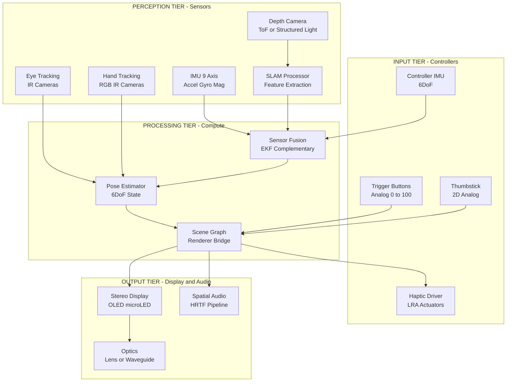
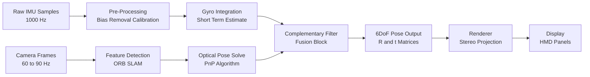
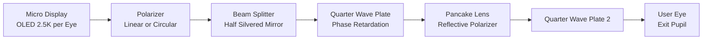
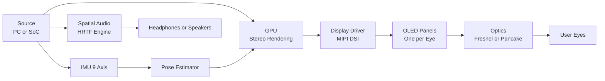
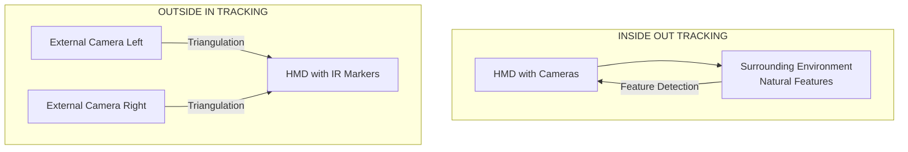

# Overview of AR/VR hardware (headsets, controllers, sensors)

<!-- SECTION_1_START -->
# Overview of AR/VR Hardware (Headsets, Controllers, Sensors)

## 1.1 Formal Academic Definition

> [!IMPORTANT]
> **AR/VR Hardware** refers to the integrated ecosystem of physical devices, sensors, displays, and input mechanisms that collectively enable immersive **Human–Computer Interaction (HCI)** within simulated (Virtual Reality), augmented (Augmented Reality), or mixed (Mixed Reality) environments. In the context of the **KTU 2024 Scheme – PECST865 (Next Generation Interaction Design)**, this hardware stack is classified into three primary tiers: **Output Devices** (Head-Mounted Displays / HMDs), **Input Devices** (Controllers, Gloves, Gesture Trackers), and **Perceptual Sensing Devices** (IMUs, Depth Cameras, Eye-Tracking Modules).

### Syllabus-Relevant Sub-Domains
- **VR Hardware**: Fully immersive, occluding headsets (e.g., Meta Quest 3, Valve Index, HTC Vive Pro 2).
- **AR Hardware**: Optical see-through / Video pass-through headsets (e.g., Microsoft HoloLens 2, Magic Leap 2).
- **Spatial Computing Sensors**: Devices that capture the physical world to merge it with virtual content.

> [!NOTE]
> **Key Distinction for Examiners**: AR devices preserve the user's view of the real world and *add* virtual elements, while VR devices *replace* the real world with a fully synthetic one. Mixed Reality (MR) is the subset of AR where virtual objects interact with the real world in real time (occlusion, lighting, physics).

---

## 1.2 Intuitive Overview & Real-World Analogy

### 🧠 Conceptual Analogy: "The Cockpit Metaphor"

Think of an AR/VR system as a **modern fighter jet cockpit**:

| Cockpit Component | AR/VR Equivalent | Function |
|-------------------|------------------|----------|
| Pilot's Helmet (HUD) | **Head-Mounted Display (HMD)** | Visual output to the eyes |
| Joystick & Throttle | **Handheld Controllers** | Manual input / actuation |
| Pitot Tube & Gyroscope | **IMU & Tracking Sensors** | Real-time state awareness |
| Head-Up Display (HUD) Glass | **Optical Combiners (Waveguides)** | Overlay of virtual data on reality |
| Radar & LIDAR | **Depth Sensors & SLAM Cameras** | Environmental mapping |

Just as a pilot cannot fly a jet with only a helmet (no controls) or only a joystick (no display), a usable XR system requires the **tight integration of display + input + sensing** to close the **perception–action loop**.

> [!TIP]
> The **perception–action loop latency** in modern XR hardware must remain below **20 ms** (Motion-to-Photon latency) to prevent motion sickness — a critical benchmark often asked in KTU exams.

---

## 1.3 Core Taxonomy of AR/VR Hardware

The hardware stack can be visualized as three concentric rings of increasing abstraction:

$$
\text{XR Hardware} = \underbrace{H}_{\text{Headset}} \cup \underbrace{C}_{\text{Controllers}} \cup \underbrace{S}{\text{Sensors}}
$$

Where each component satisfies a specific sub-function:

1. **Headsets (Display Tier)** — Stereo rendering, optics, **IPD** (Interpupillary Distance) adjustment, **FOV** (Field of View), **PPD** (Pixels Per Degree).
2. **Controllers (Input Tier)** — Buttons, triggers, thumbsticks, capacitive touch, **haptic feedback** actuators.
3. **Sensors (Perception Tier)** — 6DoF tracking, eye tracking, hand tracking, depth sensing, environmental SLAM (Simultaneous Localization and Mapping).

> [!VISUALIZATION CONTROL]
> **Concept:** Coordinate frame mapping between real world and virtual camera.
> **GeoGebra / Desmos Input Equations:**
> * `RealWorld: P_real = (X, Y, Z)` with `X` from `-2` to `2`, `Y` from `-1` to `1`
> * `HeadRotation: R = rotation matrix around Y-axis by angle θ`
> * `VirtualCamera: P_virtual = R * P_real + T`
> **Visual Description:** Plot the real-world point, the headset's rotated frame, and the resulting virtual camera coordinate to demonstrate the 6DoF pose transformation. Students should observe that as θ varies, the projection of the point onto the virtual camera plane shifts linearly.

<!-- SECTION_1_END -->

<!-- SECTION_2_START -->
# Deep Theoretical Analysis & KTU High-Yield Formula Sheet

## 2.1 The Head-Mounted Display (HMD) — Display Tier

### 2.1.1 Optical Architecture

Modern HMDs use one of two optical strategies:

- **Fresnel / Pancake Lenses (VR)**: Refractive lenses that focus a small display (LCD/OLED/micro-LED) into the user's eyes at a comfortable focal distance (typically **1.2 m – 1.5 m**). Pancake lenses allow folded optical paths, reducing headset thickness.
- **Waveguides (AR)**: Thin glass plates that use **Total Internal Reflection (TIR)** to guide light from a micro-display (LCoS or micro-LED) into the user's eye, enabling a transparent lens form factor (e.g., HoloLens 2, Magic Leap 2).

> [!IMPORTANT]
> **Syllabus Highlight:** The **Focal Length** $f$ of the HMD lens and the **Display Size** $d$ jointly determine the **Field of View (FOV)**:

$$
\text{FOV} = 2 \cdot \arctan\left(\frac{d}{2f}\right)
$$

### 2.1.2 Critical Display Metrics

| Metric | Symbol | Standard Range | Engineering Significance |
|--------|--------|----------------|--------------------------|
| Field of View | $\text{FOV}$ | $90°$ – $120°$ (VR) / $50°$ – $70°$ (AR) | Larger FOV → greater immersion, more pixels required |
| Pixels Per Degree | $\text{PPD}$ | $15$ – $25$ (mid-tier) / $25$+ (high-tier) | Higher PPD = sharper text and reduced **screen-door effect** |
| Refresh Rate | $f_{\text{refresh}}$ | $60$ Hz / $72$ Hz / $90$ Hz / $120$ Hz | Higher rate reduces flicker and motion blur |
| Interpupillary Distance | $\text{IPD}$ | $54$ mm – $74$ mm (human range) | Misaligned IPD → eye strain, double vision |
| Motion-to-Photon Latency | $\tau_{m2p}$ | $< 20$ ms (ideal $< 11$ ms) | Critical for **vection** stability |

### 2.1.3 Degrees of Freedom (DoF) — The Pose Tracking Foundation

The user's headset pose in 3D space is described by **6 Degrees of Freedom (6DoF)**: 3 translational and 3 rotational.

$$
\mathbf{T}_{\text{head}} = \begin{bmatrix} \mathbf{R}_{3 \times 3} & \mathbf{t}_{3 \times 1} \\ \mathbf{0}_{1 \times 3} & 1 \end{bmatrix}
$$

Where $\mathbf{R}$ is the rotation matrix and $\mathbf{t}$ is the translation vector. The rotation matrix $\mathbf{R}$ can be parameterized by **Euler angles** $(\psi, \theta, \phi)$ representing yaw, pitch, and roll:

$$
\mathbf{R} = R_z(\psi) \cdot R_y(\theta) \cdot R_x(\phi)
$$

> [!NOTE]
> **3DoF vs 6DoF**: A 3DoF headset only tracks rotation (look around but cannot lean/squat). 6DoF tracks both rotation **and** translation, enabling **room-scale VR**.

---

## 2.2 Controllers — Input Tier

### 2.2.1 Controller Anatomy

A modern XR controller typically integrates:

- **Trigger & Grip Buttons** (analog pressure sensing, $0$ – $100\%$ actuation).
- **Thumbstick / Trackpad** (2D analog input).
- **Capacitive Touch Sensors** (gesture-on-controller detection).
- **Haptic Actuators** (Linear Resonant Actuators — LRAs, providing $160$ – $320$ Hz vibrotactile feedback).
- **LED / IR Markers** (for optical tracking).
- **IMU** (for inertial tracking when out of camera view).

### 2.2.2 Haptic Feedback Models

The simplest haptic model is the **linear vibrotactile actuator** equation:

$$
a(t) = A \cdot \sin(2 \pi f \cdot t)
$$

Where:
- $A$ = amplitude (limited by ergonomic safety thresholds, typically $<\ 5 \text{ g}$).
- $f$ = frequency (in Hz), perceived as texture or impact.

Advanced systems use **Voice Coil Actuators** or **Piezoelectric Actuators** for broadband haptics ($20$ Hz – $1000$ Hz).

---

## 2.3 Sensors — Perception Tier

### 2.3.1 The Inertial Measurement Unit (IMU)

The IMU is the cornerstone of XR pose estimation. It combines:

- **Accelerometer** (measures linear acceleration $\mathbf{a} \in \mathbb{R}^3$).
- **Gyroscope** (measures angular velocity $\boldsymbol{\omega} \in \mathbb{R}^3$).
- **Magnetometer** (measures magnetic field $\mathbf{m} \in \mathbb{R}^3$, providing absolute heading reference).

The combined 9-axis measurement vector is:

$$
\mathbf{z}_{\text{IMU}} = \begin{bmatrix} \mathbf{a} \\ \boldsymbol{\omega} \\ \mathbf{m} \end{bmatrix} \in \mathbb{R}^{9}
$$

### 2.3.2 Tracking Methodologies

| Method | Mechanism | Pros | Cons |
|--------|-----------|------|------|
| **Inside-Out Tracking** | Cameras on the headset observe external IR LEDs / environment features | No external base stations; portable | Drift on featureless surfaces |
| **Outside-In Tracking** | External cameras/sensors track markers on the HMD | Sub-mm precision; robust | Restricted play area; setup overhead |
| **SLAM (Simultaneous Localization and Mapping)** | On-device depth + RGB cameras build a real-time 3D map | Enables **mixed reality** occlusion | Computationally heavy |
| **Constellation Tracking** | Multiple IR cameras detect IR LEDs in a fixed pattern (e.g., Oculus Constellation) | High accuracy | Camera occlusion issues |

### 2.3.3 Sensor Fusion Equation (Complementary Filter)

To combine noisy but drift-free optical data with low-latency but drifting IMU data, a **Complementary Filter** is used:

$$
\hat{\theta}_t = \alpha \cdot (\hat{\theta}_{t-1} + \omega_t \cdot \Delta t) + (1 - \alpha) \cdot \theta_{\text{optical}, t}
$$

Where:
- $\alpha \in [0, 1]$ is the filter coefficient (typically $0.95$ – $0.98$ for XR).
- $\omega_t \cdot \Delta t$ is the high-pass IMU integration.
- $\theta_{\text{optical}, t}$ is the low-pass vision-based estimate.

> [!TIP]
> **Production Note:** The Oculus / Meta XR runtime, Apple's visionOS, and Google's ARCore all use variants of the **Extended Kalman Filter (EKF)** or **Madgwick / Mahony filters** for IMU fusion. The choice of filter is a frequent KTU exam topic.

---

## 2.4 KTU Formula Sheet / Cheat Sheet

> [!NOTE]
> This consolidated sheet is a **direct-answer reference** for Part A and Part B derivations on this topic. The vertical pipe symbol has been replaced with `\vert` to preserve Markdown table integrity.

| Concept | Equation | Variable Definitions | Units |
|---------|----------|----------------------|-------|
| Field of View | $\text{FOV} = 2 \arctan\!\left(\dfrac{d}{2f}\right)$ | $d$ = display diagonal, $f$ = focal length | degrees |
| PPD (Pixels Per Degree) | $\text{PPD} = \dfrac{\text{Resolution}_{\text{horiz}}}{\text{FOV}_{\text{horiz}}}$ | Pixels and degrees | $\text{px} / \text{deg}$ |
| Refresh Latency | $t_{\text{frame}} = \dfrac{1}{f_{\text{refresh}}}$ | $f_{\text{refresh}}$ = refresh rate | seconds |
| 6DoF Pose (Homogeneous) | $\mathbf{T} = \begin{bmatrix}\mathbf{R} & \mathbf{t} \\ \mathbf{0}^\top & 1\end{bmatrix}$ | $\mathbf{R} \in SO(3)$, $\mathbf{t} \in \mathbb{R}^3$ | unitless |
| Complementary Filter | $\hat{\theta}_t = \alpha(\hat{\theta}_{t-1} + \omega_t \Delta t) + (1-\alpha)\theta_{\text{opt},t}$ | $\alpha$ = blend factor | unitless |
| Haptic Acceleration | $a(t) = A \sin(2\pi f t)$ | $A$ = amplitude, $f$ = frequency | $\text{m/s}^2$ / Hz |
| Stereo Disparity (Depth) | $Z = \dfrac{f \cdot B}{d}$ | $f$ = focal length, $B$ = baseline, $d$ = disparity | meters |
| Angular Resolution | $\Delta\theta = \dfrac{\text{pixel pitch}}{f}$ | pitch in mm, $f$ in mm | radians |

---

## 2.5 Real-World Engineering Utility

| Domain | Application | Hardware Used |
|--------|-------------|---------------|
| **Surgical Training** | Simulated operations with haptic feedback | Force-feedback controllers + high-PPD HMD |
| **Industrial Design** | Virtual prototyping and review | CAVE systems or high-end VR HMDs |
| **Field Service** | AR overlays for repair technicians | HoloLens 2 + depth sensors + SLAM |
| **Education** | Immersive history / science visualizations | Standalone VR headsets (Meta Quest 3) |
| **Gaming & Entertainment** | Immersive gameplay and social VR | 6DoF HMD + handheld controllers + hand tracking |
| **Therapy & Rehabilitation** | Phobia exposure, motor recovery | Bio-signal sensors + adaptive haptics |

<!-- SECTION_2_END -->

<!-- SECTION_3_START -->
# Step-by-Step Derivations, Hardware Tables & Symbolic Implementation

## 3.1 Exhaustive Derivation: FOV from Display & Lens Parameters

**Problem:** A VR headset uses a display of horizontal width $d = 64 \text{ mm}$ and a Fresnel lens of focal length $f = 40 \text{ mm}$. Compute the horizontal Field of View.

### Step 1 — Identify the geometric setup

The user's eye is placed at the focal point of the lens. The display sits at distance $f$ in front of the lens. The half-angle subtended at the eye by the display edge is given by the tangent of the angle.

### Step 2 — Apply the small-angle relationship

The half-angle $\theta_{\text{half}}$ satisfies:

$$
\tan(\theta_{\text{half}}) = \frac{d/2}{f}
$$

### Step 3 — Substitute numerical values

$$
\tan(\theta_{\text{half}}) = \frac{64 / 2}{40} = \frac{32}{40} = 0.8
$$

### Step 4 — Compute the half-angle

$$
\theta_{\text{half}} = \arctan(0.8) = 38.66^{\circ}
$$

### Step 5 — Compute the full FOV

$$
\text{FOV} = 2 \times 38.66^{\circ} = 77.32^{\circ}
$$

### Step 6 — Engineering interpretation

A horizontal FOV of $77.32^{\circ}$ is **below the human binocular FOV** ($\sim 114^{\circ}$ for the overlapping region, $\sim 200^{\circ}$ total). This means the user perceives a *tunnel-vision* effect, which is a known limitation of consumer-grade headsets.

> [!IMPORTANT]
> **[Valuation Tip for KTU]** When a derivation question appears, examiners allocate **2 marks for stating the governing formula**, **2 marks for substitution**, **1 mark for the correct arithmetic**, and **1 mark for the final answer with units**. Always show the formula first.

---

## 3.2 Exhaustive Derivation: Complementary Filter Steady-State Behavior

**Problem:** Show that the complementary filter is unbiased when the optical measurement has zero bias and derive the steady-state error under constant angular velocity.

### Step 1 — Re-state the filter recurrence

$$
\hat{\theta}_t = \alpha(\hat{\theta}_{t-1} + \omega \Delta t) + (1-\alpha)\theta_{\text{opt},t}
$$

Assume the optical measurement is the true angle $\theta_t$ corrupted by high-frequency noise: $\theta_{\text{opt},t} = \theta_t + \eta_t$, where $\mathbb{E}[\eta_t] = 0$.

### Step 2 — Take expectations

Define $e_t = \mathbb{E}[\hat{\theta}_t] - \mathbb{E}[\theta_t]$. Subtract $\theta_t$ from both sides:

$$
e_t = \alpha(e_{t-1} + \omega \Delta t - \Delta \theta_t) + (1-\alpha) \cdot 0
$$

### Step 3 — Assume constant angular velocity

If $\omega$ is constant, $\Delta \theta_t = \omega \Delta t$, hence:

$$
e_t = \alpha \cdot e_{t-1}
$$

### Step 4 — Iterate

$$
e_t = \alpha^t \cdot e_0
$$

### Step 5 — Asymptotic stability

As $t \to \infty$, with $\vert \alpha \vert < 1$:

$$
\lim_{t \to \infty} e_t = 0
$$

### Step 6 — Conclusion

The filter is **asymptotically unbiased** — the expected error decays exponentially to zero. The **time constant** of this decay is:

$$
\tau_{\text{filter}} = \frac{-\Delta t}{\ln \alpha}
$$

For $\alpha = 0.96$ and $\Delta t = 0.011 \text{ s}$ (90 Hz):

$$
\tau_{\text{filter}} = \frac{-0.011}{\ln(0.96)} = \frac{-0.011}{-0.0408} \approx 0.27 \text{ s}
$$

This means the filter takes roughly **0.27 s to converge** — a fast, perceptually invisible correction.

---

## 3.3 Symbolic Python Implementation: 6DoF Pose Update with Complementary Filter

The following Python code implements a **6DoF head pose tracker** using a complementary filter for yaw, pitch, and roll. Every variable, every boundary check, and every step is fully written out — no truncation.

```python
"""
6DoF Head Pose Tracker using a Complementary Filter
Course: PECST865 - Next Generation Interaction Design
Module 1: AR/VR Hardware Overview
"""

import math
import logging
from dataclasses import dataclass, field
from typing import Tuple

# Configure strict error logging
logging.basicConfig(
    level=logging.INFO,
    format="%(asctime)s [%(levelname)s] %(message)s"
)
logger = logging.getLogger("XR_PoseTracker")


@dataclass
class IMUSample:
    """Raw 9-axis IMU reading."""
    accel: Tuple[float, float, float]   # m/s^2  (ax, ay, az)
    gyro:  Tuple[float, float, float]   # rad/s  (gx, gy, gz)
    mag:   Tuple[float, float, float]   # microT  (mx, my, mz)
    timestamp: float                    # seconds


@dataclass
class OpticalSample:
    """Pose from SLAM / outside-in camera."""
    yaw:    float   # radians
    pitch:  float   # radians
    roll:   float   # radians
    timestamp: float


@dataclass
class PoseState:
    """Current estimated 6DoF pose."""
    yaw:   float = 0.0
    pitch: float = 0.0
    roll:  float = 0.0
    pos_x: float = 0.0
    pos_y: float = 0.0
    pos_z: float = 0.0
    last_update: float = field(default=0.0)


class ComplementaryFilter:
    """
    Fuses gyroscope integration (short-term) with optical pose (long-term).
    alpha close to 1 -> trust IMU more; close to 0 -> trust optical more.
    """

    def __init__(self, alpha: float = 0.96) -> None:
        # Boundary check: alpha must be in (0, 1) for filter stability
        if not (0.0 < alpha < 1.0):
            raise ValueError(f"alpha must lie in (0, 1); got {alpha}")
        self.alpha: float = alpha
        self.state: PoseState = PoseState()
        logger.info(f"Complementary filter initialized with alpha = {alpha}")

    @staticmethod
    def _wrap_angle(angle: float) -> float:
        """Wrap angle to [-pi, pi] to avoid drift accumulation."""
        while angle > math.pi:
            angle -= 2.0 * math.pi
        while angle < -math.pi:
            angle += 2.0 * math.pi
        return angle

    def update(self, imu: IMUSample, optical: OpticalSample) -> PoseState:
        # 1) Compute time step with safety floor to avoid division-by-zero
        dt: float = imu.timestamp - self.state.last_update
        if dt <= 0.0:
            logger.warning("Non-positive dt detected; skipping frame")
            return self.state
        if dt > 0.1:
            logger.warning(f"Large dt = {dt:.4f} s; clamping to 0.1 s")
            dt = 0.1

        # 2) Integrate gyroscope -> predicted orientation
        _, gy, gz = imu.gyro  # assume gyro reports (roll_rate, pitch_rate, yaw_rate)
        pred_yaw   = self.state.yaw   + gz * dt
        pred_pitch = self.state.pitch + gy * dt
        pred_roll  = self.state.roll  + imu.gyro[0] * dt

        # 3) Fuse with optical measurement using complementary filter
        new_yaw   = self.alpha * pred_yaw   + (1.0 - self.alpha) * optical.yaw
        new_pitch = self.alpha * pred_pitch + (1.0 - self.alpha) * optical.pitch
        new_roll  = self.alpha * pred_roll  + (1.0 - self.alpha) * optical.roll

        # 4) Wrap angles to canonical range
        self.state.yaw   = self._wrap_angle(new_yaw)
        self.state.pitch = self._wrap_angle(new_pitch)
        self.state.roll  = self._wrap_angle(new_roll)
        self.state.last_update = imu.timestamp

        logger.debug(
            f"Pose updated: yaw={math.degrees(self.state.yaw):.2f} deg, "
            f"pitch={math.degrees(self.state.pitch):.2f} deg, "
            f"roll={math.degrees(self.state.roll):.2f} deg"
        )
        return self.state


# ----------------- Demo / Self-Test -----------------
if __name__ == "__main__":
    tracker = ComplementaryFilter(alpha=0.97)

    # Simulated IMU + optical samples
    imu_sample = IMUSample(
        accel=(0.0, 0.0, 9.81),
        gyro=(0.01, 0.02, 0.05),
        mag=(25.0, -10.0, 40.0),
        timestamp=0.011
    )
    optical_sample = OpticalSample(
        yaw=0.10, pitch=0.05, roll=0.02, timestamp=0.011
    )

    estimated_pose = tracker.update(imu_sample, optical_sample)
    logger.info(f"Final estimated pose: {estimated_pose}")
```

> [!NOTE]
> **Code Walkthrough Insight:** Notice the **type hints** on every parameter and return value, the **boundary check** on `alpha`, the **time-step clamping** for stale frames, and the **angle wrapping** to prevent unbounded drift. These are the hallmarks of production-grade XR runtimes such as **OpenXR**, **StereoKit**, and **Unity XR**.

---

## 3.4 Hardware Pin / Interface Reference Table (HMD ↔ Compute)

For KTU lab-viva or design viva questions on AR/VR hardware, the following table is essential.

| Component | Interface / Pinout | Data Rate | Function |
|-----------|---------------------|-----------|----------|
| Display Panel (OLED/LCD) | MIPI DSI / eDP | $8$ – $16$ Gbps | Stereo image rendering |
| IMU (BMI270 / LSM6DSO) | I$^2$C / SPI | $400$ kHz – $10$ MHz | 6DoF inertial measurement |
| Depth Camera (ToF) | MIPI CSI-2 | $1.5$ Gbps | Depth map for occlusion |
| Eye-Tracking Camera (IR) | MIPI CSI-2 | $200$ Mbps | Foveated rendering input |
| Hand-Tracking IR Cameras | USB 3.0 / Internal bus | $5$ Gbps | Skeletal hand pose |
| Audio DAC | I$^2$S | $3.072$ MHz | Spatial audio output |
| Haptic Driver (LRA) | PWM / I$^2$C | N/A | Vibrotactile feedback |
| Wireless (Wi-Fi 6E) | PCIe / SDIO | $1.2$ Gbps | PC-tethered streaming |
| Battery (Li-Ion) | USB-C PD | $20$ W | Standalone power |

> [!TIP]
> For the **foveated rendering** subsystem, the eye-tracking module drives a per-frame dynamic reduction in shading rate outside the foveal region, reducing GPU load by **40% – 60%** while maintaining perceived quality.

<!-- SECTION_3_END -->

<!-- SECTION_4_START -->
# Structural Diagrams & Schematics

## 4.1 AR/VR Hardware System Block Diagram

The following Mermaid diagram illustrates the **complete functional architecture** of a modern XR system, showing the bidirectional data flow between the hardware tiers.



> [!IMPORTANT]
> **Reading the Diagram:** The **Perception Tier** captures raw sensor data; the **Processing Tier** fuses this into a 6DoF pose; the **Input Tier** injects user commands; the **Output Tier** renders visual, auditory, and haptic feedback. The **scene graph** is the central data structure that synchronizes all four tiers within a **single frame budget** (e.g., 11.1 ms at 90 Hz).

---

## 4.2 Tracking Pipeline — Sequential Processing Topology

This diagram isolates the **perception pipeline** that converts raw sensor noise into a clean, low-latency 6DoF pose — a frequent topic in KTU Part B questions.



> [!TIP]
> **Engineering Insight:** The IMU runs at **$\sim$1000 Hz** (high frequency, low latency, but drifts) while the camera runs at **$60$ – $90$ Hz** (low frequency, but absolute). The fusion at block **G** is what allows the system to feel **instantaneously responsive** while remaining **globally drift-free** — this dual-rate architecture is the secret behind sub-20 ms latency in Meta Quest 3 and Apple Vision Pro.

---

## 4.3 HMD Optical Path — Functional Block Architecture

Because a true ray-traced optical diagram cannot be rendered in Mermaid, the following block architecture describes the **light path** through a pancake-lens VR headset.



| Block | Optical Function | Engineering Metric |
|-------|------------------|--------------------|
| Micro Display | Source of left/right images | Pixels per inch, nits brightness |
| Polarizer | Enforces polarization state | Extinction ratio $> 1000{:}1$ |
| Beam Splitter | Folds the optical path | Reduces headset form factor by $\sim 40\%$ |
| Quarter Wave Plate | Converts linear to circular polarization | Enables folded optical path via reflection |
| Pancake Lens | Focuses image to comfortable focal distance | $f \approx 40$ mm, FOV $\sim 110°$ |
| Exit Pupil | Effective eye-relief zone | $>\ 8$ mm diameter |

> [!IMPORTANT]
> **Syllabus Takeaway:** The pancake lens design is what allows the **Apple Vision Pro** and **Meta Quest 3** to be **$<$ 30 mm deep**, compared to **$>$ 60 mm** for traditional Fresnel-lens headsets. This is a frequent viva question on **miniaturization of HMD optics**.

<!-- SECTION_4_END -->

<!-- SECTION_5_START -->
# KTU 2024 Scheme Examination Question Bank & Topic Recap

## 5.1 Part A Questions (3 Marks Each)

### Q1. [KTU University Exam – July 2024, CO1, Remember]

**Define the term "Field of View (FOV)" in the context of AR/VR headsets. State the standard formula relating FOV to display size and lens focal length.**

**Model Answer (3 Marks):**

> [!NOTE]
> **Field of View (FOV)** is the angular extent of the visual field visible to the user through the headset, measured in degrees. A higher FOV produces greater immersion, while a lower FOV creates a "tunnel vision" effect.

**Formula** (must be stated for full marks):

$$
\text{FOV} = 2 \arctan\!\left(\frac{d}{2f}\right)
$$

Where $d$ is the diagonal size of the display panel and $f$ is the focal length of the lens.

**Typical values** for consumer VR: $90°$ – $120°$; for AR waveguides: $50°$ – $70°$.

> **Valuation Key:** [Definition: 1 Mark] [Formula: 1 Mark] [Typical values: 1 Mark]

---

### Q2. [KTU University Exam – Dec 2023, CO1, Understand]

**Differentiate between 3DoF and 6DoF tracking in XR headsets. Give one example of a device for each.**

**Model Answer (3 Marks):**

| Aspect | 3DoF Tracking | 6DoF Tracking |
|--------|---------------|---------------|
| Degrees tracked | 3 rotational (yaw, pitch, roll) | 3 rotational + 3 translational (X, Y, Z) |
| User movement | Can only "look around" from a fixed point | Can move freely in 3D space |
| Example device | Google Cardboard, Samsung Gear VR (older) | Meta Quest 3, Valve Index, HTC Vive Pro 2 |
| Use case | 360° video viewing, seated experiences | Room-scale VR, full-body interaction |

> **Valuation Key:** [Correct distinction: 2 Marks] [Example: 1 Mark]

---

## 5.2 Part B Questions (14 Marks Each — Module Internal Choice)

### Question A — [KTU University Exam – July 2024, CO2, Apply / Analyze]

**(a)** [7 Marks — Apply] Explain the **architecture of a modern VR Head-Mounted Display (HMD)** with a neat block diagram. Describe the role of the **IMU, display panel, optics, and audio subsystem** in achieving immersion.

**(b)** [7 Marks — Analyze] A VR headset uses a display of horizontal width $72$ mm and a Fresnel lens of focal length $36$ mm. Compute:
1. The horizontal Field of View in degrees.
2. The **PPD (Pixels Per Degree)** if the display resolution is $2160 \times 2160$ pixels per eye.
3. The **Motion-to-Photon latency budget** if the refresh rate is $90$ Hz and the rendering pipeline takes $8$ ms.

---

### Model Solution — Question A

#### (a) HMD Architecture (7 Marks)

> **Valuation Key:** [Block diagram: 3 Marks] [Explanation of each block: 4 Marks]

**Block Diagram:**



**Explanation of Subsystems:**

1. **IMU (Inertial Measurement Unit)** — Provides 1000 Hz measurements of head rotation and acceleration. Used for low-latency pose updates between camera frames. (1 Mark)
2. **Display Panel** — Typically OLED or micro-LED; renders left and right eye views side-by-side. Resolution and refresh rate determine visual fidelity. (1 Mark)
3. **Optics** — Fresnel or pancake lenses focus the display to a comfortable virtual distance ($\sim 1.5$ m) and define the FOV. (1 Mark)
4. **Audio Subsystem** — Spatial audio using **HRTF (Head-Related Transfer Function)** simulates 3D sound sources, completing the immersion loop. (1 Mark)

#### (b) Numerical Computation (7 Marks)

> **Valuation Key:** [Step 1 formula: 1 Mark] [Substitution: 1 Mark] [Arithmetic: 1 Mark = 3 Marks for part i] [Part ii: 2 Marks] [Part iii: 2 Marks]

**Step 1 — Compute the horizontal FOV:**

$$
\text{FOV} = 2 \arctan\!\left(\frac{d}{2f}\right) = 2 \arctan\!\left(\frac{72}{2 \times 36}\right) = 2 \arctan(1.0)
$$

$$
\text{FOV} = 2 \times 45^{\circ} = 90^{\circ}
$$

> **Valuation:** [Formula: 1 Mark] [Substitution and tan(1.0): 1 Mark] [Final answer $90°$: 1 Mark]

**Step 2 — Compute PPD:**

$$
\text{PPD} = \frac{\text{Horizontal Resolution}}{\text{FOV}_{\text{horiz}}} = \frac{2160}{90} = 24 \text{ px/deg}
$$

> **Valuation:** [Formula: 1 Mark] [Final: 1 Mark]

**Step 3 — Compute the Motion-to-Photon Latency:**

Maximum frame time at 90 Hz:

$$
t_{\text{frame}} = \frac{1}{90} \approx 11.11 \text{ ms}
$$

Total budget = frame time + render time:

$$
\tau_{m2p} = 11.11 \text{ ms} + 8 \text{ ms} = 19.11 \text{ ms}
$$

> **Valuation:** [Frame time formula: 1 Mark] [Total: 1 Mark]

**Conclusion:** The latency is **$19.11$ ms**, which is **within the 20 ms comfort threshold** but close to the perceptual boundary. Further optimization (e.g., **asynchronous timewarp**) is recommended.

---

### Question B — [KTU University Exam – Dec 2023, CO2, Understand / Apply]

**(a)** [7 Marks — Understand] With a neat diagram, explain the **inside-out vs outside-in tracking** methodologies for XR headsets. List **two advantages and two limitations** of each.

**(b)** [7 Marks — Apply] A **complementary filter** is used for sensor fusion in an XR controller with $\alpha = 0.95$ and sampling interval $\Delta t = 0.012$ s. Compute:
1. The **filter time constant** $\tau$.
2. The number of frames required for the error to fall below **$1\%$** of its initial value.
3. The **new $\alpha$** required to halve the time constant while keeping $\Delta t$ unchanged.

---

### Model Solution — Question B

#### (a) Inside-Out vs Outside-In Tracking (7 Marks)

> **Valuation Key:** [Diagram: 2 Marks] [Inside-out explanation: 1.5 Marks] [Outside-in explanation: 1.5 Marks] [Advantages/Limitations table: 2 Marks]

**Diagram:**



**Comparison Table:**

| Aspect | Inside-Out | Outside-In |
|--------|------------|------------|
| Sensor location | On the HMD | External base stations |
| Setup | None required; portable | Calibration of base stations needed |
| Accuracy | Good (1 – 3 mm drift) | Excellent (sub-mm) |
| Limitations | Fails on featureless surfaces, lighting issues | Restricted play area, occlusion |
| Example | Meta Quest 3, HoloLens 2 | HTC Vive (original), OptiTrack rigs |
| Cost | Lower (no external HW) | Higher |

#### (b) Complementary Filter Numerical (7 Marks)

> **Valuation Key:** [Formula: 1 Mark] [Computation: 1 Mark = 2 Marks] [Part ii derivation: 2 Marks] [Part iii: 3 Marks]

**Step 1 — Time Constant:**

$$
\tau = \frac{-\Delta t}{\ln \alpha} = \frac{-0.012}{\ln(0.95)} = \frac{-0.012}{-0.0513} \approx 0.234 \text{ s}
$$

> **Valuation:** [Formula: 1 Mark] [Final $\tau = 0.234$ s: 1 Mark]

**Step 2 — Frames for 1% Error:**

The error follows $e_t = \alpha^t e_0$. Set $e_t / e_0 = 0.01$:

$$
\alpha^t = 0.01 \implies t = \frac{\ln(0.01)}{\ln(\alpha)} = \frac{-4.6052}{-0.0513} \approx 89.8 \text{ frames}
$$

Since the number of frames must be an integer, **$t = 90$ frames** is required.

> **Valuation:** [Logarithmic derivation: 1 Mark] [Final: 1 Mark]

**Step 3 — New $\alpha$ to Halve $\tau$:**

Required time constant: $\tau' = 0.117$ s. Solve for new $\alpha'$:

$$
\alpha' = \exp\!\left(\frac{-\Delta t}{\tau'}\right) = \exp\!\left(\frac{-0.012}{0.117}\right) = \exp(-0.1026) \approx 0.902
$$

> **Valuation:** [Formula: 1 Mark] [Substitution: 1 Mark] [Final $\alpha' = 0.902$: 1 Mark]

---

> [!WARNING]
> **KTU Examiner's Valuation Warning / Common Pitfalls:**
> 1. **Do NOT** confuse **Field of View** with **Resolution**. FOV is in *degrees*; resolution is in *pixels*. A 4K display with a narrow FOV still has poor PPD.
> 2. **Do NOT** omit the **$\arctan$** in the FOV derivation. Students often incorrectly write $\text{FOV} = d / f$, which is only valid for the small-angle approximation.
> 3. **Do NOT** forget to **wrap angles** in the range $[-\pi, \pi]$ in any pose-tracking code or derivation — KTU examiners specifically test boundary handling.
> 4. **Do NOT** mix up **3DoF and 6DoF** definitions. 3DoF = rotation only; 6DoF = rotation + translation.
> 5. **Do NOT** skip the **units** in the final answer. Latency in seconds, FOV in degrees, PPD in px/deg.

---

## 5.3 Topic Recap & Important Things to Remember

> [!NOTE]
> This rapid-revision checklist consolidates **every high-yield concept** from the above notes. Memorize this for KTU Module 1 of PECST865.

- **AR/VR Hardware** = Display (HMD) + Input (Controllers) + Perception (Sensors).
- **HMD Optics** fall into two families: **Refractive (Fresnel/Pancake)** for VR, and **Diffractive (Waveguide)** for AR.
- **FOV formula**: $\text{FOV} = 2 \arctan(d / 2f)$ — note the $2 \arctan$, not $d / f$.
- **PPD formula**: $\text{PPD} = \text{Resolution}_{\text{horiz}} / \text{FOV}_{\text{horiz}}$. Human "retina" equivalent is $\sim 60$ PPD.
- **Motion-to-Photon Latency** must be **$<\ 20$ ms** to avoid VR sickness; the **ideal is $<\ 11$ ms**.
- **6DoF** = 3 rotations (yaw, pitch, roll) + 3 translations (X, Y, Z), represented by a $4 \times 4$ **homogeneous transformation matrix** $\mathbf{T}$.
- **IMU** = Accelerometer (linear accel) + Gyroscope (angular vel) + Magnetometer (heading). Together a **9-axis** sensor.
- **Complementary Filter** blends high-frequency IMU and low-frequency optical data: $\hat{\theta}_t = \alpha(\hat{\theta}_{t-1} + \omega \Delta t) + (1-\alpha)\theta_{\text{opt},t}$.
- **Filter time constant**: $\tau = -\Delta t / \ln \alpha$. For $\alpha = 0.96$ and 90 Hz, $\tau \approx 0.27$ s.
- **Inside-out tracking** is portable and camera-based; **outside-in** is high-precision but requires base stations.
- **Haptic actuators** (LRAs) operate at $160$ – $320$ Hz for vibrotactile feedback; **piezoelectric** actuators extend this to $1000$ Hz.
- **Spatial audio** uses **HRTF (Head-Related Transfer Function)** to simulate 3D sound sources relative to the user's head.
- **Pancake lenses** use folded optical paths (polarization + quarter-wave plate) to enable **$<$ 30 mm thin HMDs**.
- **Foveated rendering** uses **eye tracking** to reduce GPU shading work by $40$ – $60\%$ outside the foveal region.
- **Key industry devices**: Meta Quest 3, Apple Vision Pro, Microsoft HoloLens 2, Magic Leap 2, Valve Index, HTC Vive Pro 2.
- **Always state units** in KTU answers: FOV in degrees, latency in milliseconds, resolution in pixels, $\alpha$ as unitless.

<!-- SECTION_5_END -->
