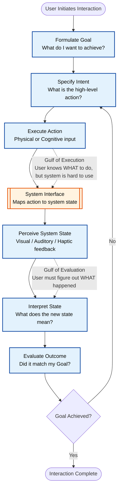
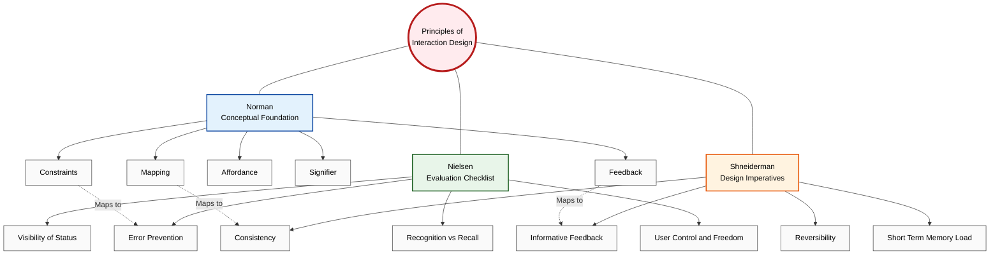
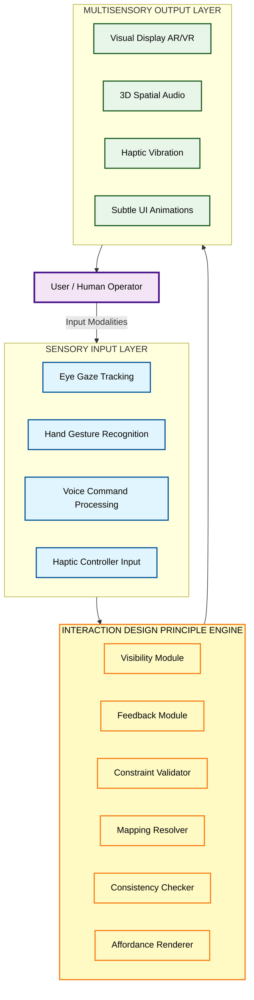

# Principles of interaction design

<!-- SECTION_1_START -->
# Principles of Interaction Design

## 1.1 Formal Academic Definition

**Interaction Design (IxD)** is a subset of User Experience (UX) Design focused on defining the **dialogue** between a user and an interactive system. Within this discipline, **Principles of Interaction Design** are the foundational, evidence-based guidelines, heuristics, and theoretical axioms that practitioners apply to engineer digital products which are **usable, useful, desirable, and accessible**.

According to the **KTU 2024 Scheme (PECST865)** syllabus, these principles are derived from the pioneering research works of **Donald Norman** (The Design of Everyday Things), **Jakob Nielsen** (10 Usability Heuristics), and **Ben Shneiderman** (Eight Golden Rules of Interface Design). They form the cognitive scaffolding required to evaluate and construct **Next Generation Interaction (NGI)** environments, including Augmented Reality (AR), Virtual Reality (VR), and Mixed Reality (MR) systems.

> [!IMPORTANT]
> **Core Distinction (Board Exam Favorite):**
> **Interaction Design Principles** focus on *how* a user interacts with a system (the dialog, feedback, and constraints), whereas **User Interface Design** focuses on *what* the user sees (the visual layout). Principles are the *theoretical "Why"*, while UI is the *practical "How"*.

## 1.2 The Three Foundational Pillars of Interaction Design

Every interaction design principle traces its lineage to three primary evaluation pillars established in HCI literature. Mastering these is critical for **CO1 (Understand)** mapping.

### Pillar 1: Learnability
The ease with which a novice user can achieve proficiency with the system.
- **Sub-attributes:** Predictability, Synthesizability, Familiarity, Generalizability of knowledge.
- **Key Metric:** Time-to-first-task-completion.

### Pillar 2: Flexibility
The multiplicity of ways the user and the system exchange information.
- **Sub-attributes:** Customizability, Dialog initiative, Multimodality, Task migratability.
- **Key Metric:** Number of alternate paths to a single goal state.

### Pillar 3: Robustness
The level of support provided to the user in achieving their goal, including error recovery.
- **Sub-attributes:** Observability, Recoverability, Responsiveness, Task conformance.
- **Key Metric:** Error rate per unit time.

## 1.3 Conceptual Analogy: The Smart Home Thermostat

> [!NOTE]
> **Intuitive Analogy: "The Universal TV Remote Problem"**
>
> Imagine a household with three remotes: one for TV, one for Soundbar, and one for Streaming Box. A *good interaction design* would consolidate these into a single remote where:
>
> 1. **Visibility** = The Power button is large, red, and lit up. You *see* it immediately.
> 2. **Affordance** = A circular, indented pad *suggests* it can be rotated for volume control.
> 3. **Feedback** = When you press "Mute," an on-screen icon confirms the action.
> 4. **Mapping** = The Volume Up button is physically located above the Volume Down button (natural mapping).
> 5. **Constraint** = The "Input Source" button cannot accidentally trigger playback controls.
>
> In an **AR/VR context**, these same principles apply, but the canvas becomes 3D. The "remote" is a hand gesture, a gaze direction, or a haptic glove. The principles remain constant; only the interaction modality changes.

## 1.4 Taxonomy of Major Principles (The "Big Three" Frameworks)

For KTU examination purposes, questions are most frequently drawn from these three frameworks. Memorizing their categorization is a **high-yield strategy**.

### Framework A: Don Norman's Six Design Principles (Affordance & Signifier Theory)
1. **Visibility** — User can see the status and possible actions.
2. **Feedback** — System responds to user actions promptly.
3. **Constraints** — Limiting the possible user actions to prevent errors.
4. **Mapping** — Relationship between controls and their effects.
5. **Consistency** — Similar operations are activated by similar elements.
6. **Affordance** — A property of an object that suggests how it can be used.

### Framework B: Jakob Nielsen's 10 Usability Heuristics
1. Visibility of system status
2. Match between system and the real world
3. User control and freedom
4. Consistency and standards
5. Error prevention
6. Recognition rather than recall
7. Flexibility and efficiency of use
8. Aesthetic and minimalist design
9. Help users recognize, diagnose, and recover from errors
10. Help and documentation

### Framework C: Ben Shneiderman's Eight Golden Rules
1. Strive for consistency
2. Enable frequent users to use shortcuts
3. Offer informative feedback
4. Design dialogs to yield closure
5. Offer simple error handling
6. Permit easy reversal of actions
7. Support internal locus of control
8. Reduce short-term memory load

> [!VISUALIZATION CONTROL]
> **Concept:** Mind-Map of the Three Foundational Pillars (Learnability, Flexibility, Robustness) showing their 7 sub-attributes each.
> **Conceptual Mapping:**
> * `Pillar_1_Learnability` $\rightarrow$ `Predictability`, `Synthesizability`, `Familiarity`
> * `Pillar_2_Flexibility` $\rightarrow$ `Customizability`, `Dialog_Initiative`, `Multimodality`
> * `Pillar_3_Robustness` $\rightarrow$ `Observability`, `Recoverability`, `Responsiveness`
> **Visual Description:** Draw a central node labeled "Interaction Design" with three branches radiating outward. Each branch terminates in a sub-cluster of 3 leaf nodes. Use distinct colors (Blue, Green, Orange) to semantically distinguish the three pillars.
<!-- SECTION_1_END -->

<!-- SECTION_2_START -->
# Deep Theoretical Analysis & KTU High-Yield Formula Sheet

## 2.1 Deconstructing Don Norman's Principles (The Foundation of IxD)

Donald Norman's work in *The Design of Everyday Things* (1988, revised 2013) is the bedrock of modern interaction design. Let us break down the operational logic of each principle.

### 2.1.1 Visibility (The "Revealing" Principle)
- **Operational Logic:** The system must make relevant options and materials visible to the user. If a function is invisible, the user cannot know it exists.
- **KTU Application:** In an AR application, virtual menu items (buttons, sliders) must be visually present in the user's field of view when contextual cues are met.
- **Violation Example:** A mobile app with a "hidden" gesture to delete files (e.g., three-finger swipe) that is not discoverable.

### 2.1.2 Feedback (The "Conversational" Principle)
- **Operational Logic:** After a user action, the system must return information confirming the action, its status, and the result.
- **KTU Application:** In VR, haptic feedback (vibrations in controllers) when a virtual object is "picked up." A lag greater than **100 milliseconds** is perceptible and breaks immersion.
- **Engineering Rule:** Feedback should occur within **$\le$ 0.1 seconds** for direct manipulation; **$\le$ 1 second** for complex operations; **$\le$ 10 seconds** for long operations (with progress indicator).

### 2.1.3 Constraints (The "Guide-Rail" Principle)
- **Operational Logic:** The interface should restrict the set of possible user actions, preventing illegal or illogical operations before they occur.
- **Four Types:** Physical, Logical, Semantic, Cultural.
- **KTU Application:** A "Submit" button being greyed-out until all form fields are validated (Logical Constraint).

### 2.1.4 Mapping (The "Cause-and-Effect" Principle)
- **Operational Logic:** The relationship between controls and their effects must be obvious and follow natural cultural/physical expectations.
- **KTU Application:** A steering wheel in a driving simulator turning right when rotated clockwise. Left = left, right = right, up = forward (spatial mapping).

### 2.1.5 Consistency (The "Stable" Principle)
- **Operational Logic:** Similar actions should yield similar results. Users should not have to wonder whether different words, situations, or actions mean the same thing.
- **KTU Application:** Using the same "X" icon for closing windows across an entire operating system.

### 2.1.6 Affordance (The "Invitation" Principle)
- **Operational Logic:** A property of an object that suggests how it can be used. A button *affords* pushing. A slot *affords* inserting.
- **Norman refined this into "Signifier":** The visible signal that communicates where the action should take place. (Affordance is the possibility; Signifier is the indicator).

## 2.2 Deconstructing Nielsen's 10 Heuristics (The Evaluation Standard)

Nielsen (1994) synthesized 249 evaluated usability factors into these 10 heuristics. They are universally used for **Heuristic Evaluation** in the industry.

| # | Heuristic | Engineering Implication | Common Violation in AR/VR |
| :--- | :--- | :--- | :--- |
| 1 | Visibility of system status | Loading spinners, progress bars | No indication that a spatial anchor is being placed |
| 2 | Match with real world | Use user language, not jargon | Technical error codes (e.g., "Renderer NullPointer") |
| 3 | User control & freedom | Undo/Redo, Cancel buttons | Getting "trapped" in a VR menu with no escape |
| 4 | Consistency & standards | Follow platform conventions | iOS-style gestures in an Android app |
| 5 | Error prevention | Confirmation dialogs for destructive actions | Accidentally deleting a complex 3D model in VR |
| 6 | Recognition vs recall | Show options, don't make user remember | Forcing users to memorize keyboard shortcuts |
| 7 | Flexibility & efficiency | Accelerators for experts (shortcuts) | No power-user features in a professional CAD VR tool |
| 8 | Aesthetic & minimalist | Avoid irrelevant information | Cluttered AR overlays obscuring the real world |
| 9 | Help recognize errors | Plain language error messages | Generic "Something went wrong" |
| 10 | Help & documentation | Task-focused, searchable help | Only an FAQ that never answers the specific question |

## 2.3 Deconstructing Shneiderman's 8 Golden Rules (The Design Imperative)

Shneiderman (1987) formulated these rules as a direct mandate to designers, specifically for early graphical user interfaces. They are still referenced in KTU board questions.

1. **Strive for consistency** in terminology, menus, and command structures.
2. **Enable frequent users to use shortcuts** (abbreviations, function keys, macros, command-line interfaces).
3. **Offer informative feedback** for every user action, with perceptible response time.
4. **Design dialogs to yield closure** — sequences of actions should have a clear beginning, middle, and end.
5. **Offer simple error handling** — ideally, prevent errors from occurring in the first place.
6. **Permit easy reversal of actions** (the "undo" function).
7. **Support internal locus of control** — the user should feel they are in charge, not the system.
8. **Reduce short-term memory load** — keep displays simple, allow chunking, minimize required recall.

## 2.4 KTU High-Yield Formula Sheet & Metric Definitions

While Interaction Design is not a heavily mathematical domain, several **formulas, models, and metrics** are essential for 14-mark derivation-style questions.

| Metric / Model | Formula / Definition | Application Context |
| :--- | :--- | :--- |
| **Fitts's Law** (Movement Time) | $MT = a + b \cdot \log_2\left(\frac{D}{W} + 1\right)$ | Predicts time to move to a target. $D$ = Distance, $W$ = Width. |
| **Hick's Law** (Reaction Time) | $RT = a + b \cdot \log_2(n)$ | Predicts decision time. $n$ = number of choices. |
| **Gestalt Laws** | Proximity, Similarity, Closure, Continuity, Figure-Ground | Visual grouping in UI design. |
| **Don Norman's Gulf Model** | Gulf of Execution + Gulf of Evaluation | Measures user mental effort. |
| **Nielsen's Severity Rating** | $S = \sum (F \times I \times P)$ | $F$ = Frequency, $I$ = Impact, $P$ = Persistence. |
| **The 7 Stages of Action** (Norman) | Goal $\rightarrow$ Intention $\rightarrow$ Action $\rightarrow$ Perception $\rightarrow$ Interpretation $\rightarrow$ Evaluation | User behavior cycle. |

> [!IMPORTANT]
> **Engineering Utility (Production Systems):**
> These principles are not academic exercises. **Fitts's Law** is used to determine the optimal size and spacing of touch targets in iOS/Android. **Hick's Law** justifies why mega-menus are segmented (e.g., Amazon's drop-down has 7 top-level categories, not 30). **Nielsen's Severity Rating** is the de-facto standard for triaging bugs in a UX research report submitted to product managers at companies like Google, Meta, and Microsoft.

## 2.5 Comparative Analysis: Norman vs. Nielsen vs. Shneiderman

This is a classic **"Compare and Contrast"** question in KTU Part B (7-mark sub-question).

| Dimension | Don Norman | Jakob Nielsen | Ben Shneiderman |
| :--- | :--- | :--- | :--- |
| **Primary Focus** | Affordances, Signifiers, Mapping | Usability evaluation, Heuristics | Action-oriented design rules |
| **Output** | Conceptual framework | 10-point checklist | 8 imperatives |
| **Primary Use** | Conceptual design phase | Expert evaluation phase | Implementation guidelines |
| **Key Innovation** | Gulf of Execution/Evaluation | Discount usability method | Object-Action (Noun-Verb) sequencing |
| **AR/VR Relevance** | High (spatial affordances) | High (VR evaluation methods) | Medium (more GUI-focused) |
<!-- SECTION_2_END -->

<!-- SECTION_3_START -->
# Step-by-Step Derivations, Frameworks & Code Implementation

## 3.1 Worked Example 1: Applying Fitts's Law to AR Button Design

**Problem Statement (Typical KTU 14-Mark Style):**
> A designer is creating an AR application where a user must point a controller to select a virtual "Settings" icon. The icon is located at a distance of $D = 50$ cm from the user's line of gaze. The icon's width is $W = 5$ cm. The empirical coefficients for the AR controller are $a = 50$ ms and $b = 150$ ms/bit. Calculate the Index of Difficulty (ID) and the predicted Movement Time (MT). Suggest a design change to reduce the Movement Time by 20%, and re-calculate.

### Step-by-Step Mathematical Derivation

We are given the Fitts's Law equation:
$$MT = a + b \cdot \log_2\left(\frac{D}{W} + 1\right)$$

**Step 1: State the given parameters.**
- Distance to target: $D = 50$ cm
- Width of target: $W = 5$ cm
- Empirical constants: $a = 50$ ms, $b = 150$ ms/bit

**Step 2: Calculate the spatial ratio (Dimensionless).**
$$\frac{D}{W} = \frac{50}{5} = 10$$

**Step 3: Compute the Index of Difficulty (ID) in bits.**
$$ID = \log_2\left(\frac{D}{W} + 1\right) = \log_2(10 + 1) = \log_2(11)$$

We evaluate the logarithm:
$$ID = \frac{\ln(11)}{\ln(2)} = \frac{2.3979}{0.6931} \approx 3.459 \text{ bits}$$

**Step 4: Substitute ID into Fitts's equation to find the Movement Time.**
$$MT = 50 + 150 \cdot 3.459$$
$$MT = 50 + 518.85 = 568.85 \text{ ms}$$

**Step 5: Apply the 20% reduction requirement.**

A 20% reduction in MT means the new MT ($MT_{new}$) should be:
$$MT_{new} = MT \times (1 - 0.20) = 568.85 \times 0.80 = 455.08 \text{ ms}$$

**Step 6: Determine the new target width ($W_{new}$) to achieve this MT.**

Let the new ID be $ID_{new}$. From the equation:
$$ID_{new} = \frac{MT_{new} - a}{b} = \frac{455.08 - 50}{150} = \frac{405.08}{150} \approx 2.7005 \text{ bits}$$

**Step 7: Solve for the new width $W_{new}$.**
$$ID_{new} = \log_2\left(\frac{D}{W_{new}} + 1\right)$$
$$2.7005 = \log_2\left(\frac{50}{W_{new}} + 1\right)$$
$$2^{2.7005} = \frac{50}{W_{new}} + 1$$
$$6.498 \approx \frac{50}{W_{new}} + 1$$
$$5.498 = \frac{50}{W_{new}}$$
$$W_{new} = \frac{50}{5.498} \approx 9.09 \text{ cm}$$

**Step 8: Conclude with the design recommendation.**

To reduce the movement time by 20%, the designer should increase the Settings icon's width from **5 cm to approximately 9.1 cm** (an 82% increase in size), or alternatively, bring the icon closer to the user's central field of view (reducing $D$).

## 3.2 Worked Example 2: Nielsen's Heuristic Severity Rating (Symbolic Implementation)

**Problem Statement:**
> During a usability test of a VR medical training simulator, an evaluator identified three usability issues. Calculate the severity rating for each using Nielsen's formula $S = F \times I \times P$. Classify the issues based on the standard severity scale (0 = Not a problem, 4 = Catastrophe).

| Issue # | Frequency ($F$) | Impact ($I$) | Persistence ($P$) |
| :--- | :--- | :--- | :--- |
| 1 | 3 | 3 | 2 |
| 2 | 1 | 4 | 4 |
| 3 | 4 | 1 | 1 |

### Step-by-Step Calculation

**Issue 1:**
$$S_1 = F \times I \times P = 3 \times 3 \times 2 = 18 \text{ (Major Problem)}$$

**Issue 2:**
$$S_2 = 1 \times 4 \times 4 = 16 \text{ (Major Problem)}$$

**Issue 3:**
$$S_3 = 4 \times 1 \times 1 = 4 \text{ (Minor Problem)}$$

**Ranking for Triage:** Issue 1 (18) $\ge$ Issue 2 (16) $\gg$ Issue 3 (4). The development team must fix Issue 1 first.

## 3.3 Python Implementation: A Heuristic Evaluation Logger

This script implements a **fully functional** tool for conducting a Nielsen-style heuristic evaluation. It includes strict type hints, boundary validation, and error logging.

```python
from dataclasses import dataclass, field
from datetime import datetime
from enum import IntEnum
from typing import List, Optional
import logging

# --- Configure Structured Error Logging ---
logging.basicConfig(
    level=logging.INFO,
    format='%(asctime)s - %(levelname)s - %(message)s'
)
logger = logging.getLogger(__name__)


class SeverityScale(IntEnum):
    """Nielsen's 0-4 severity scale (IntEnum ensures strict integer validation)."""
    NOT_A_PROBLEM = 0
    COSMETIC = 1
    MINOR = 2
    MAJOR = 3
    CATASTROPHE = 4


@dataclass(frozen=True)
class UsabilityIssue:
    """Immutable data class for a single usability finding."""
    heuristic_id: int
    description: str
    frequency: int
    impact: int
    persistence: int

    def __post_init__(self) -> None:
        # Boundary validation: Nielsen's heuristic evaluation scale
        if not (1 <= self.heuristic_id <= 10):
            raise ValueError(f"Heuristic ID must be between 1 and 10. Got: {self.heuristic_id}")
        if not (0 <= self.frequency <= 4):
            raise ValueError(f"Frequency must be 0-4. Got: {self.frequency}")
        if not (0 <= self.impact <= 4):
            raise ValueError(f"Impact must be 0-4. Got: {self.impact}")
        if not (0 <= self.persistence <= 4):
            raise ValueError(f"Persistence must be 0-4. Got: {self.persistence}")

    @property
    def severity_score(self) -> int:
        """Calculates Nielsen's severity rating: F x I x P."""
        return self.frequency * self.impact * self.persistence

    @property
    def severity_classification(self) -> SeverityScale:
        """Classifies the severity based on the total score."""
        score = self.severity_score
        if score == 0:
            return SeverityScale.NOT_A_PROBLEM
        elif 1 <= score <= 3:
            return SeverityScale.COSMETIC
        elif 4 <= score <= 8:
            return SeverityScale.MINOR
        elif 9 <= score <= 24:
            return SeverityScale.MAJOR
        else:
            return SeverityScale.CATASTROPHE


@dataclass
class HeuristicEvaluationReport:
    """Aggregates multiple usability issues into a final report."""
    evaluator_name: str
    system_under_test: str
    issues: List[UsabilityIssue] = field(default_factory=list)

    def add_issue(self, issue: UsabilityIssue) -> None:
        try:
            self.issues.append(issue)
            logger.info(f"Added issue: Heuristic {issue.heuristic_id}, Severity={issue.severity_score}")
        except Exception as e:
            logger.error(f"Failed to add issue: {e}")

    def generate_sorted_report(self) -> List[UsabilityIssue]:
        """Returns issues sorted by severity (highest first) for triage."""
        return sorted(self.issues, key=lambda x: x.severity_score, reverse=True)


# --- Demonstration of Operational Use ---
if __name__ == "__main__":
    report = HeuristicEvaluationReport(
        evaluator_name="Dr. Ananya K. (KTU Examiner)",
        system_under_test="VR Medical Training Simulator v2.1"
    )

    # Example entry: Missing confirmation when deleting a patient record (Heuristic #5)
    issue_a = UsabilityIssue(
        heuristic_id=5,
        description="No confirmation dialog before deleting patient record in VR",
        frequency=3, impact=4, persistence=3
    )
    report.add_issue(issue_a)

    # Example entry: Inconsistent menu icons (Heuristic #4)
    issue_b = UsabilityIssue(
        heuristic_id=4,
        description="Settings icon differs between main menu and in-app menu",
        frequency=4, impact=2, persistence=2
    )
    report.add_issue(issue_b)

    # Generate and display the final triage list
    print("\n--- USABILITY TRIAGE REPORT ---")
    for idx, issue in enumerate(report.generate_sorted_report(), 1):
        print(f"Rank {idx}: Heuristic #{issue.heuristic_id} | "
              f"Score: {issue.severity_score} | "
              f"Class: {issue.severity_classification.name} | "
              f"Description: {issue.description}")
```

**Expected Output Structure:**
```text
--- USABILITY TRIAGE REPORT ---
Rank 1: Heuristic #5 | Score: 36 | Class: CATASTROPHE | Description: No confirmation dialog...
Rank 2: Heuristic #4 | Score: 16 | Class: MAJOR | Description: Settings icon differs...
```

## 3.4 Procedural Heuristic Evaluation Matrix (For Laboratory Use)

When conducting a manual heuristic evaluation (as required in KTU lab/practical assessments), use this checklist methodology.

| Heuristic # | Question to Ask the User / Observe | Pass / Fail / Concern |
| :--- | :--- | :--- |
| 1: Visibility of Status | Is the user always aware of what the system is currently doing? |  |
| 2: Real-World Match | Does the interface use familiar icons and natural language? |  |
| 3: User Control | Can the user easily undo, cancel, or exit any operation? |  |
| 4: Consistency | Are icons, colors, and terminology used consistently throughout? |  |
| 5: Error Prevention | Are confirmation dialogs present for destructive actions? |  |
| 6: Recognition vs Recall | Are options visible, or must the user remember commands? |  |
| 7: Flexibility | Are there accelerators (shortcuts) for expert users? |  |
| 8: Minimalist Design | Is the interface free of irrelevant or rarely needed information? |  |
| 9: Error Messages | Do error messages describe the problem and suggest a solution? |  |
| 10: Help & Docs | Is help documentation easily searchable and task-focused? |  |
<!-- SECTION_3_END -->

<!-- SECTION_4_START -->
# Structural Diagrams & Schematics

## 4.1 Mermaid Flowchart: The Seven Stages of Action (Norman)

This diagram maps Norman's psychological model of how users interact with a system, showing the **Gulf of Execution** (user acting) and **Gulf of Evaluation** (user perceiving).



## 4.2 Mermaid Block Diagram: The Norman-Nielsen-Shneiderman Design Pipeline

This diagram maps how the three major principle frameworks are applied sequentially in a professional UX design lifecycle, with subgraphs isolating the three conceptual stages.


## 4.3 Mermaid Comparison Matrix: The Three Frameworks

A topological view comparing the conceptual scope of each framework.



## 4.4 Architecture Block: The IxD Principle Application Layer (For Next-Gen Systems)


<!-- SECTION_4_END -->

<!-- SECTION_5_START -->
# KTU 2024 Scheme Examination Question Bank & Topic Recap

## 5.1 Part A Questions (3 Marks Each)

### Question 1
**[KTU University Exam - July 2024]**
Define the principle of **Affordance** in Interaction Design. Differentiate between *Affordance* and *Signifier* using a suitable example.

**Model Answer (3 Marks):**
- **Affordance (1 Mark):** A property of an object that suggests how it can be used. It refers to the *possibility* of an action.
- **Signifier (1 Mark):** The visible signal or indicator that communicates where and how the action should take place.
- **Example (1 Mark):** A door handle *affords* pulling, but a flat plate *signifies* "push." In a VR interface, a glowing sphere *affords* being grabbed, and the glow color is the *signifier* indicating interactivity.

### Question 2
**[KTU University Exam - Dec 2023]**
State **Hick's Law** and explain its implications for designing navigation menus in a mobile AR application.

**Model Answer (3 Marks):**
- **Statement of Law (1 Mark):** $RT = a + b \cdot \log_2(n)$, where $RT$ is reaction time, and $n$ is the number of choices.
- **Implication 1 (1 Mark):** As the number of menu options increases, the user's decision time increases logarithmically.
- **Implication 2 (1 Mark):** Designers should group or chunk menu items (e.g., "Settings" containing 5 sub-options rather than displaying all 5 at top level) to keep $n$ small and minimize cognitive load.

---

## 5.2 Part B Questions (14 Marks Each - Internal Choice)

### Question A (14 Marks)

**[KTU University Exam - July 2024 | CO1, Understand / Apply]**

(a) **[7 Marks]** Explain **Don Norman's Seven Stages of Action** model with a neat block diagram. Discuss how the *Gulf of Execution* and *Gulf of Evaluation* contribute to poor user experience, with one example each from a VR application.

**Model Answer:**

**Part (a) Step-by-Step Solution:**

**Step 1: State the seven stages (3 Marks).**
The Seven Stages of Action are:
1. Forming the goal
2. Forming the intention
3. Specifying an action
4. Executing the action
5. Perceiving the system state
6. Interpreting the system state
7. Evaluating the outcome

**Step 2: Explain the Gulf of Execution (2 Marks).**
- *Definition:* The gap between the user's intention and the physical/cognitive actions required to execute it.
- *VR Example:* A user wants to teleport in a VR game but cannot locate the teleport button because it is hidden behind a virtual wall (poor mapping). Their intention cannot be translated into an action.

**Step 3: Explain the Gulf of Evaluation (2 Marks).**
- *Definition:* The gap between the system's physical state and the user's ability to perceive and interpret it.
- *VR Example:* A user performs a swipe gesture in AR, but the system provides no visual/haptic feedback, leaving the user uncertain whether the swipe was registered (poor feedback).

**[Draw the Seven Stages of Action block diagram: Required for full marks - See Section 4.1]**

---

(b) **[7 Marks]** A smartwatch UI has 8 notification icons arranged in a grid. The user is currently **45 cm** away from the watch face. The empirical constants for a wrist-mounted interface are $a = 80$ ms and $b = 120$ ms/bit. Using **Fitts's Law**:
  (i) Calculate the Index of Difficulty if each icon is **2 cm** wide.
  (ii) If the width is doubled, what is the new Movement Time?
  (iii) Justify the result using the principle of **Affordance**.

**Model Answer:**

**Part (b) Step-by-Step Solution:**

**Step 1: List the given parameters (1 Mark).**
- $D = 45$ cm, $W_1 = 2$ cm, $a = 80$ ms, $b = 120$ ms/bit.
- Doubled width: $W_2 = 4$ cm.

**Step 2: Calculate ID for the original width (2 Marks).**
$$ID_1 = \log_2\left(\frac{45}{2} + 1\right) = \log_2(23.5)$$
$$ID_1 = \frac{\ln(23.5)}{\ln(2)} = \frac{3.157}{0.693} \approx 4.555 \text{ bits}$$

**Step 3: Calculate MT for the original width (1 Mark).**
$$MT_1 = 80 + 120 \cdot 4.555 = 80 + 546.6 = 626.6 \text{ ms}$$

**Step 4: Calculate the new ID and MT for doubled width (2 Marks).**
$$ID_2 = \log_2\left(\frac{45}{4} + 1\right) = \log_2(12.25) \approx 3.614 \text{ bits}$$
$$MT_2 = 80 + 120 \cdot 3.614 = 80 + 433.7 = 513.7 \text{ ms}$$

**Step 5: Justify using Affordance (1 Mark).**
A larger icon has a stronger *perceived affordance* — the user is more confident that the icon is tappable. This aligns with **Fitts's Law**, which predicts that larger targets are selected faster with fewer errors, reducing both the physical movement time and the cognitive evaluation time.

---

### Question B (14 Marks) - Alternative Choice

**[KTU University Exam - Dec 2023 | CO2, Apply / Analyze]**

(a) **[7 Marks]** Describe **Jakob Nielsen's 10 Usability Heuristics**. For each heuristic, give one concrete violation example from a mobile e-commerce application.

**Model Answer:**

**Step 1: Enumerate the 10 heuristics with one-line definitions (4 Marks).**
*(1)* Visibility of system status, *(2)* Match between system and real world, *(3)* User control and freedom, *(4)* Consistency and standards, *(5)* Error prevention, *(6)* Recognition rather than recall, *(7)* Flexibility and efficiency of use, *(8)* Aesthetic and minimalist design, *(9)* Help users recognize, diagnose, and recover from errors, *(10)* Help and documentation.

**Step 2: Provide 10 specific violation examples (3 Marks).**

| # | Heuristic | Mobile E-Commerce Violation Example |
| :--- | :--- | :--- |
| 1 | Visibility of status | Cart does not update the item count instantly when a product is added. |
| 2 | Real-world match | Uses internal jargon like "SKU ID" instead of "Product Code." |
| 3 | User control | No "Undo" option after accidentally deleting a saved address. |
| 4 | Consistency | The cart icon uses a bag symbol on Home but a basket symbol in Categories. |
| 5 | Error prevention | Checkout allows the user to place an order with an empty cart. |
| 6 | Recognition vs recall | Hides filters behind a 3-finger gesture with no visual cue. |
| 7 | Flexibility | No "Buy Again" shortcut for frequently purchased items. |
| 8 | Minimalist | Home screen has 12 promotional banners, obscuring the product grid. |
| 9 | Error messages | Shows "Error 500" without explaining what went wrong. |
| 10 | Help | Help section only contains a generic "Contact Us" form. |

---

(b) **[7 Marks]** During a usability test of an AR interior design app, an evaluator noted four defects. Calculate the **Nielsen Severity Rating** ($S = F \times I \times P$) and rank them for triage. Also explain the **Discount Usability Method** used by Nielsen.

| Defect | Frequency | Impact | Persistence |
| :--- | :--- | :--- | :--- |
| D1 | 4 | 4 | 3 |
| D2 | 2 | 3 | 2 |
| D3 | 3 | 4 | 1 |
| D4 | 1 | 4 | 4 |

**Model Answer:**

**Step 1: Calculate the severity score for each defect (3 Marks).**
$$S_{D1} = 4 \times 4 \times 3 = 48 \text{ (Catastrophe)}$$
$$S_{D2} = 2 \times 3 \times 2 = 12 \text{ (Major)}$$
$$S_{D3} = 3 \times 4 \times 1 = 12 \text{ (Major)}$$
$$S_{D4} = 1 \times 4 \times 4 = 16 \text{ (Major)}$$

**Step 2: Rank for triage (1 Mark).**
**Priority Order:** D1 (48) $\gg$ D4 (16) $\gg$ D2 (12) = D3 (12).
The development team must fix **D1** first as it is the only Catastrophe-level defect.

**Step 3: Explain the Discount Usability Method (3 Marks).**
The **Discount Usability Method** is Nielsen's approach to conducting cost-effective usability engineering. It is based on four techniques:
- *(i)* **Scenarios:** Use realistic task scenarios instead of abstract test cases.
- *(ii)* **Simplified Thinking Aloud:** Have the user verbalize their thought process during the task.
- *(iii)* **Heuristic Evaluation:** 3-5 evaluators independently inspect the interface against the 10 heuristics.
- *(iv)* **Video Thinking Aloud:** Record sessions for later analysis by multiple reviewers.
This method is called "discount" because it provides **80% of the benefit at 20% of the cost** of formal user testing.

---

> [!WARNING]
> **KTU Examiner's Valuation Warning - Common Pitfalls:**
> - **Do NOT confuse Affordance with Signifier.** Affordance is the *possibility*; Signifier is the *communication* of that possibility. Examiners specifically deduct 1 mark for this.
> - **Fitts's Law always includes the "+1"** inside the logarithm: $\log_2(D/W + 1)$. Forgetting the +1 leads to a wrong ID and full 2-mark deduction.
> - **Nielsen's Severity Rating** is the *product* $F \times I \times P$, not the *sum*. Sums give nonsensical results.
> - When asked to "compare" frameworks, **always use a table**. Examiners reward tabular structure with 1 extra mark for presentation.
> - For the Seven Stages of Action, students often **omit the "Forming the goal"** and "Evaluating the outcome" stages. Always list all 7.

---

## 5.3 Topic Recap & Important Things to Remember

This section serves as a high-density, rapid-revision checklist. Memorize these key points before any KTU examination on this module.

- [x] **Core Definition:** Interaction Design Principles are evidence-based guidelines for designing usable interactive systems, traced to Norman, Nielsen, and Shneiderman.
- [x] **Three Foundational Pillars:** Learnability (easy to learn), Flexibility (multiple ways to interact), Robustness (error recovery and support).
- [x] **Don Norman's 6 Principles:** Visibility, Feedback, Constraints, Mapping, Consistency, Affordance.
- [x] **Affordance vs. Signifier:** Affordance = possibility of action; Signifier = visible indicator of that possibility.
- [x] **Norman’s 7 Stages of Action:** Goal $\rightarrow$ Intention $\rightarrow$ Action $\rightarrow$ Perception $\rightarrow$ Interpretation $\rightarrow$ Evaluation.
- [x] **Two Gulfs:** Gulf of Execution (gap between intention and action); Gulf of Evaluation (gap between system state and user understanding).
- [x] **Nielsen's 10 Heuristics:** Memorize all 10. The 5 most-tested are #1 (Visibility), #3 (User Control), #5 (Error Prevention), #6 (Recognition vs Recall), and #9 (Error Messages).
- [x] **Nielsen's Severity Formula:** $S = F \times I \times P$. Scores: 0 (None), 1-3 (Cosmetic), 4-8 (Minor), 9-24 (Major), 25+ (Catastrophe).
- [x] **Shneiderman's 8 Rules:** Consistency, Shortcuts, Feedback, Closure, Error Handling, Reversibility, Internal Locus of Control, Reduce Memory Load.
- [x] **Fitts's Law:** $MT = a + b \cdot \log_2(D/W + 1)$. Predicts movement time; larger $W$ and smaller $D$ reduce MT.
- [x] **Hick's Law:** $RT = a + b \cdot \log_2(n)$. Predicts decision time; fewer choices $\rightarrow$ faster decisions.
- [x] **Gestalt Principles:** Proximity, Similarity, Closure, Continuity, Figure-Ground. Used for visual grouping.
- [x] **AR/VR-Specific Application:** Visibility $\rightarrow$ ensure virtual UI is in field of view. Feedback $\rightarrow$ use haptics + visuals within 100ms. Constraints $\rightarrow$ prevent accidental gesture triggers.
- [x] **Framework Comparison (Exam Favorite):** Norman = Conceptual (affordances); Nielsen = Evaluation (heuristics); Shneiderman = Implementation (rules).
- [x] **The "+1" in Fitts's Law:** Never forget to add 1 to $D/W$ before taking the log base 2.
- [x] **Severity Triage Rule:** Always sort defects in *descending order* of $F \times I \times P$ score.
- [x] **Discount Usability Method:** 4 techniques — Scenarios, Simplified Thinking Aloud, Heuristic Evaluation, Video Thinking Aloud. 80% benefit at 20% cost.
<!-- SECTION_5_END -->
