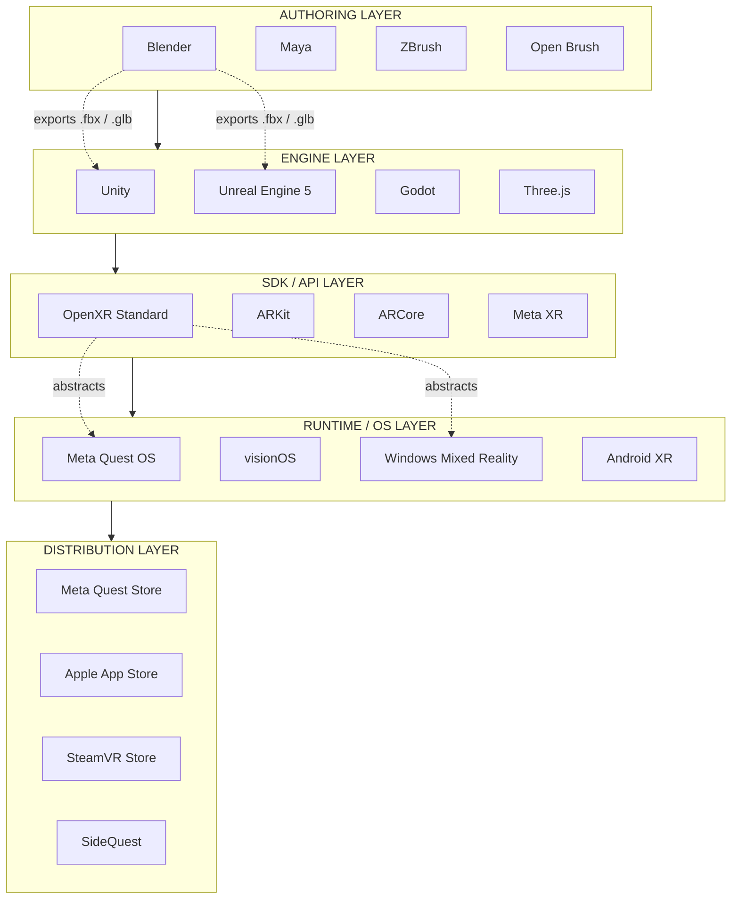
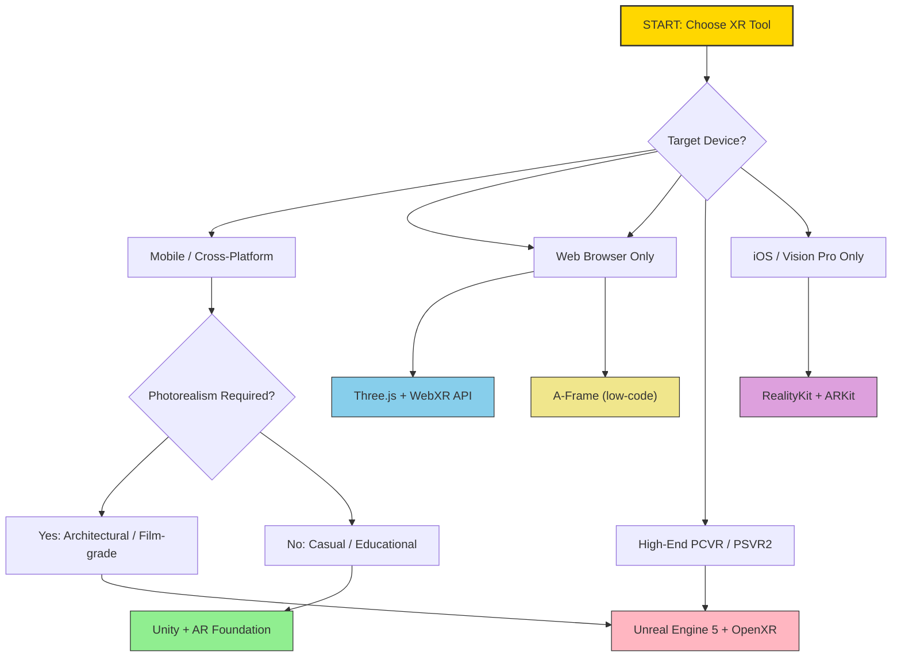
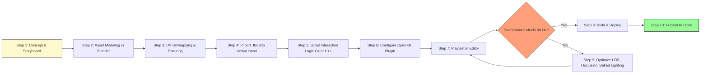
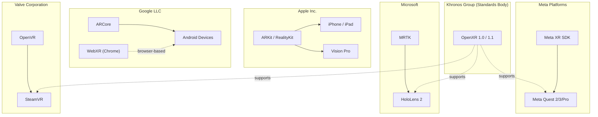

# Software tools and platforms for AR/VR development

<!-- SECTION_1_START -->
# 1. Core Technical Definition & Intuitive Overview

## 1.1 Formal Academic Definition (KTU 2024 Syllabus Terminology)

**Software tools and platforms for AR/VR development** constitute the integrated ecosystem of *game engines*, *SDKs (Software Development Kits)*, *IDEs (Integrated Development Environments)*, *3D modeling suites*, *asset pipeline tools*, and *runtime deployment platforms* that collectively enable the design, simulation, rendering, and cross-device distribution of immersive Extended Reality (XR) experiences.

As per the **KTU 2024 Scheme** syllabus for **PECST865 (Next Generation Interaction Design)**, this topic is classified under **Module 1: Introduction to Interaction Design and AR/VR**, and aligns with **Course Outcome CO1**: *"Understand the fundamental principles, hardware, and software ecosystem of next-generation interaction paradigms including AR, VR, and MR."*

> [!IMPORTANT]
> **Extended Reality (XR) Software Stack** refers to the layered architecture comprising *Operating System Layer* $\rightarrow$ *Runtime Engine Layer* $\rightarrow$ *SDK/API Layer* $\rightarrow$ *Authoring/Content Layer* $\rightarrow$ *Distribution Layer*. Each tool discussed in this module maps to one or more of these strata.

## 1.2 Conceptual Analogy / Intuition

Imagine you are building a **theme park**. Before visitors arrive, you need:

1. **A blueprint and construction crew** → *3D modeling tools* (Blender, Maya) that *build the world*.
2. **The electrical wiring and animatronics** → *Game engines* (Unity, Unreal Engine) that *bring the world to life* with physics, lighting, and interactivity.
3. **The control panel and safety switches** → *SDKs* (ARKit, ARCore, OpenXR) that *connect the world* to the user's senses.
4. **The ticket counter and turnstile gates** → *Distribution platforms* (SteamVR, Meta Store, PlayStation Store) that *deliver the experience* to end users.
5. **The customer service headset** → *XR Runtime / Operating System layer* (VisionOS, Meta Quest OS, Windows Mixed Reality) that *mediates* between the software and the human eyes.

> [!NOTE]
> **Real-World Analogy:** Think of AR/VR software as a **movie production studio**: the 3D modeler is the *set designer*, the game engine is the *director and cinematographer*, the SDK is the *camera operator*, and the headset is the *theater screen*. Each tool has a specialized role, and they all must speak the same "language" (file formats like *.fbx*, *.glb*, *.usdz*) to produce a coherent experience.

## 1.3 Key Industry Metrics & Standards (Must Memorize)

- **Frame Rate Target:** **90 Hz** minimum for VR (to avoid motion sickness), **60 Hz** acceptable for AR.
- **Motion-to-Photon Latency:** **$\leq$ 20 milliseconds** (industry gold standard).
- **Degrees of Freedom (DoF):** **3 DoF** (rotation only) vs **6 DoF** (rotation + translation).
- **Polygonal Budget per frame:** typically **1–2 million triangles** for mobile XR, **5–10 million** for PC-tethered VR.
- **Supported 3D file formats:** **.fbx, .obj, .glb, .gltf, .usdz, .usd**.

> [!VISUALIZATION CONTROL]
> **Concept:** Latency vs. Motion Sickness Threshold Curve
> **Desmos Input Equations:**
> * `y = 1000 / x` (latency in ms, x = framerate in Hz)
> **Visual Description:** Plot a hyperbolic curve. Observe that as framerate climbs from 60 Hz to 90 Hz to 120 Hz, the available motion-to-photon latency budget drops from ~16.6 ms to ~11.1 ms to ~8.3 ms. The "comfort zone" lies below the red dashed line at $y = 20$ ms.
<!-- SECTION_1_END -->

<!-- SECTION_2_START -->
# 2. Deep Theoretical Analysis & KTU High-Yield Formula Sheet

## 2.1 Taxonomy of AR/VR Software Tools

The AR/VR development toolkit is broadly classified into **five functional categories**. Each category has dedicated tools with overlapping capabilities.

### 2.1.1 Category A — 3D Authoring & Asset Creation Tools

These tools are responsible for creating the **raw geometric, texture, and animation content** that populates the virtual world.

- **Blender** — Open-source, free, polygon modeling + sculpting + animation.
- **Autodesk Maya** — Industry-standard for film and high-end game character rigging.
- **Autodesk 3ds Max** — Preferred for architectural visualization and prop modeling.
- **ZBrush** — Digital sculpting for ultra-high-detail organic models (used in *Half-Life: Alyx* asset pipeline).
- **Tilt Brush / Open Brush** — Google's VR painting tool that lets artists sculpt in 3D space.

> [!NOTE]
> **Why this matters in KTU exams:** Many board questions ask to *list and classify* tools. Memorize at least **two tools per category** with their **licensing model** (Open-Source vs Proprietary).

### 2.1.2 Category B — Real-Time Game Engines

The **rendering heart** of any XR experience. These engines handle physics simulation, lighting, occlusion, and frame scheduling.

- **Unity** — C# scripting, dominant in **mobile AR** (ARKit/ARCore plugin) and indie VR.
- **Unreal Engine** — C++/Blueprints visual scripting, dominant in **high-fidelity PC VR** and architectural visualization.
- **Godot 4.x** — Open-source alternative gaining XR plugin support.

### 2.1.3 Category C — Vendor-Specific SDKs

These SDKs abstract low-level hardware access (cameras, IMUs, displays) and expose high-level APIs.

- **ARKit (Apple)** — iOS/iPadOS AR. Supports *LiDAR scene reconstruction*, *people occlusion*, *motion capture*.
- **ARCore (Google)** — Android AR. Supports *feature points*, *anchors*, *environmental HDR lighting estimation*.
- **OpenXR (Khronos Group)** — **Vendor-neutral, royalty-free standard**. Supported by Meta, Valve, Microsoft, HTC, Unity, and Unreal.
- **Meta XR / Oculus Integration** — Quest 2, Quest 3, Quest Pro native APIs.
- **SteamVR / OpenVR** — Valve's runtime, supports HTC Vive, Valve Index, and many PCVR headsets.
- **PlayStation VR2 SDK** — Sony's PS5-tethered platform.

### 2.1.4 Category D — WebXR & Lightweight Frameworks

For browser-based, install-free experiences.

- **Three.js + WebXR API** — JavaScript 3D library with WebXR session management.
- **A-Frame** — HTML-declarative framework built on Three.js; allows VR scenes using `<a-scene>` tags.
- **Model-Viewer (Google)** — Single-line `<model-viewer>` web component for embedding 3D/AR.

### 2.1.5 Category E — Distribution & Runtime Platforms

- **Meta Quest Store** — Native APK distribution for Quest headsets.
- **SteamVR** — PCVR distribution with SteamVR Home environment.
- **Apple Vision Pro App Store** — visionOS native distribution.
- **SideQuest** — Sideloading platform for Meta Quest.
- **itch.io** — Indie XR game distribution.

## 2.2 KTU High-Yield Formula Sheet / Cheat Sheet

| **S.No** | **Tool / Platform** | **Category** | **Primary Language** | **Target Hardware** | **Licensing** | **Key Distinguishing Feature** |
|:---:|:---|:---|:---|:---|:---|:---|
| 1 | Unity | Game Engine | C\# | Mobile + Standalone + PCVR | Personal Free / Pro Paid | Largest XR asset ecosystem |
| 2 | Unreal Engine 5 | Game Engine | C++ + Blueprints | High-end PCVR + PSVR2 | Royalty after \$1M revenue | Nanite + Lumen photorealism |
| 3 | Blender | 3D Authoring | Python + GUI | N/A (Asset tool) | **Open Source (GPL)** | Integrated sculpting + render |
| 4 | Maya | 3D Authoring | MEL + Python | N/A (Asset tool) | Proprietary (Subscription) | Industry-standard rigging |
| 5 | ARKit | Vendor SDK | Swift / Objective-C | iOS / iPadOS / VisionOS | Free (Apple Developer) | LiDAR + Scene Geometry |
| 6 | ARCore | Vendor SDK | Java / Kotlin / C\# | Android | Free (Google) | Cross-OEM Android support |
| 7 | OpenXR | Vendor-Neutral API | C / C++ | All compliant headsets | **Open Standard (Khronos)** | Hardware abstraction layer |
| 8 | Three.js | Web Framework | JavaScript | WebXR browsers | Open Source (MIT) | Lightweight WebGL renderer |
| 9 | A-Frame | Web Framework | HTML + JS | WebXR browsers | Open Source (MIT) | Declarative `<a-scene>` |
| 10 | SteamVR | Runtime / Store | N/A | PCVR headsets | Free (Store cuts 30\%) | Largest PCVR catalog |

> [!IMPORTANT]
> **Critical Board Exam Tip:** If asked to *compare Unity and Unreal*, always mention that **Unity uses C\#** while **Unreal uses C++ and Blueprints (node-based visual scripting)**. Unreal's **Nanite** (virtualized micropolygon geometry) and **Lumen** (dynamic global illumination) are *industry-defining features* introduced in UE5.

## 2.3 Engineering Utility in Production

- **Automotive Industry:** Volkswagen and BMW use **Unreal Engine** for in-car HMI prototyping and showroom VR configurators.
- **Healthcare:** Surgical training simulations are built on **Unity** (e.g., *Osso VR*, *FundamentalVR*).
- **Architecture & Real Estate:** *Matterport* and *Twinmotion* (Unreal-based) enable immersive property walkthroughs.
- **Education:** Google Expeditions (now *Arts & Culture*) used **ARCore** to bring monuments into classrooms.
- **Industrial Training:** Boeing uses VR training modules built on **Unity + OpenXR** for astronaut familiarization with the Starliner capsule.

## 2.4 Why "OpenXR" is a Board-Favorite Topic

**OpenXR** is the **only industry-wide, royalty-free standard** for XR. It provides a unified API that lets a single codebase target **Meta Quest, HTC Vive, Valve Index, Windows Mixed Reality, and PlayStation VR2** with minimal changes. Before OpenXR, developers had to write separate code paths for **OpenVR (Valve)**, **Oculus SDK (Meta)**, and **Windows Mixed Reality API (Microsoft)** — a fragmented nightmare.

> [!NOTE]
> **The "Why" behind OpenXR:** Hardware fragmentation was stalling XR adoption. Just as **OpenGL** unified 2D/3D graphics and **Vulkan** unified low-level GPU compute, **OpenXR** unifies XR runtime access — a classic example of *abstraction layer engineering* taught in interaction design courses.
<!-- SECTION_2_END -->

<!-- SECTION_3_START -->
# 3. Step-by-Step Derivations, Code Implementation & Comparative Matrices

## 3.1 Comparative Analysis: Unity vs Unreal vs WebXR

| **Comparison Axis** | **Unity (2023 LTS+)** | **Unreal Engine (5.3+)** | **WebXR + Three.js** |
|:---|:---|:---|:---|
| Language | C\# | C++ (with Blueprints) | JavaScript / HTML |
| Learning Curve | Moderate | Steep | Easy |
| Asset Store Size | Massive (Unity Asset Store) | Large (Unreal Marketplace) | N/A (uses external models) |
| Mobile AR Support | **Excellent** (AR Foundation) | Limited (AR only on iOS/Android via plugin) | ARCore / ARKit via WebXR |
| Photorealism Quality | Good (URP/HDRP) | **Best-in-class (Lumen + Nanite)** | Browser-limited |
| Build Target Examples | Quest, Vision Pro, HoloLens 2, iOS, Android | Quest, PSVR2, PCVR, Vision Pro | Any WebXR browser |
| Distribution | Meta Store, App Store, SteamVR | Same | Direct URL (no install) |
| Licensing Cost | Free < \$200K revenue, then Pro | **5\% royalty after \$1M revenue/quarter** | Free (open source) |
| Best Use Case | Mobile AR apps, indie VR, cross-platform | Architectural viz, AAA VR, film | Marketing demos, e-commerce, education |

> [!NOTE]
> **Engineering Insight:** The *build target* is the **end-user device** the APK or executable will run on. Choosing a build target determines which **XR Plugin Provider** must be enabled in Unity (`File > Build Settings > Player Settings > XR Plug-in Management`).

## 3.2 Step-by-Step: Setting Up an OpenXR Project in Unity (2022.3 LTS or newer)

### Step 1: Install Unity Hub and Create a Project

```
1. Download Unity Hub from https://unity.com/download
2. Install Unity Editor version 2022.3.x LTS or 2023.3.x LTS
3. Click "New Project" -> Select "3D (URP)" template
4. Name the project "KTU_ARVR_Demo" -> Click "Create Project"
```

> [!IMPORTANT]
> **Why URP (Universal Render Pipeline)?** URP is *GPU-efficient* and recommended for mobile XR (Quest 2/3) because it balances visual fidelity with the **90 Hz frame-rate requirement**.

### Step 2: Install the OpenXR Plugin

Navigate to `Window > Package Manager > Search "OpenXR Plugin"` and install:

- `com.unity.xr.openxr` (the runtime)
- `com.unity.xr.management` (multi-loader)
- `com.unity.xr.interaction.toolkit` (grab/point/teleport interaction)

### Step 3: Configure XR Plug-in Management

```
Edit > Project Settings > XR Plug-in Management > OpenXR tab
  -> Enable "OpenXR" runtime
  -> Under OpenXR Feature Groups, enable:
       * "Meta Quest Feature Group" (if building for Quest)
       * "HTC Vive Feature Group" (if building for Vive)
```

### Step 4: Write the Camera Rig Script

Create a new C\# script named `XRCameraRigController.cs`:

```csharp
using UnityEngine;
using UnityEngine.XR;
using UnityEngine.XR.Interaction.Toolkit;
using System.Collections;

/// <summary>
/// KTU Demo: Controls an XR Origin camera rig with safety bounds.
/// Implements the TrackedPoseDriver pattern for head-tracking.
/// </summary>
public class XRCameraRigController : MonoBehaviour
{
    [Header("XR Configuration")]
    [Tooltip("Reference to the XR Origin (Action-based) in the scene.")]
    [SerializeField] private Transform xrOrigin;

    [Tooltip("Reference to the main camera (head-mounted display).")]
    [SerializeField] private Camera hmdCamera;

    [Header("Safety Bounds")]
    [Tooltip("Maximum allowed X translation in meters.")]
    [Range(-10f, 10f)]
    [SerializeField] private float maxX = 2.0f;

    [Tooltip("Maximum allowed Z translation in meters.")]
    [Range(-10f, 10f)]
    [SerializeField] private float maxZ = 2.0f;

    [Header("Performance Monitoring")]
    [Tooltip("Target frame rate in Hz (VR comfort threshold).")]
    [Range(60, 144)]
    [SerializeField] private int targetFrameRate = 90;

    private InputDevice headDevice;

    private void Start()
    {
        // Enforce VR-friendly frame rate
        Application.targetFrameRate = targetFrameRate;
        QualitySettings.vSyncCount = 0; // Disable VSync; let OpenXR manage swap chain

        // Acquire the head-mounted display device
        headDevice = InputDevices.GetDeviceAtXRNode(XRNode.Head);

        if (!headDevice.isValid)
        {
            Debug.LogError("[XRCameraRigController] No HMD detected. Aborting XR initialization.");
            enabled = false;
            return;
        }

        Debug.Log($"[XRCameraRigController] HMD acquired: {headDevice.name} | Manufacturer: {headDevice.manufacturer}");
    }

    private void Update()
    {
        EnforcePlayAreaBounds();
        LogTrackingConfidence();
    }

    /// <summary>
    /// Clamps the XR Origin's position to a safe rectangular playspace.
    /// Prevents users from walking into physical walls while immersed.
    /// </summary>
    private void EnforcePlayAreaBounds()
    {
        if (xrOrigin == null) return;

        Vector3 currentPos = xrOrigin.position;
        float clampedX = Mathf.Clamp(currentPos.x, -maxX, maxX);
        float clampedZ = Mathf.Clamp(currentPos.z, -maxZ, maxZ);

        if (currentPos.x != clampedX || currentPos.z != clampedZ)
        {
            xrOrigin.position = new Vector3(clampedX, currentPos.y, clampedZ);
            Debug.LogWarning("[Safety] Play-area boundary enforced. User near physical wall.");
        }
    }

    /// <summary>
    /// Monitors the tracking confidence flag and warns on degradation.
    /// </summary>
    private void LogTrackingConfidence()
    {
        if (!headDevice.isValid) return;

        if (headDevice.TryGetFeatureValue(CommonUsages.isTracked, out bool isTracked))
        {
            if (!isTracked)
            {
                Debug.LogWarning("[Tracking] HMD lost tracking. Check lighting and reflective surfaces.");
            }
        }
    }

    private void OnApplicationPause(bool pauseStatus)
    {
        // Pause XR session when app is backgrounded to save battery
        if (pauseStatus)
        {
            Debug.Log("[XRCameraRigController] App paused. XR session suspended.");
        }
    }
}
```

### Step 5: Build and Deploy

```
File > Build Settings
  -> Select "Android" -> Switch Platform
  -> Player Settings:
       * Minimum API Level: Android 10.0 (API 29) for ARCore compatibility
       * Scripting Backend: IL2CPP (recommended for Quest)
       * Target Architectures: ARM64
  -> Click "Build and Run"
```

> [!WARNING]
> **Common Student Mistake:** Forgetting to set **IL2CPP** as the scripting backend. The default **Mono** backend is slower and may not pass Meta's VRC (Virtual Reality Check) certification for the Quest Store.

## 3.3 Step-by-Step: WebXR Hello World with A-Frame

A-Frame enables a complete AR/VR scene using only **HTML markup** — perfect for prototyping and KTU lab demos.

```html
<!DOCTYPE html>
<html>
  <head>
    <meta charset="utf-8">
    <title>KTU WebXR Hello World</title>
    <!-- A-Frame core library (open source, MIT license) -->
    <script src="https://aframe.io/releases/1.5.0/aframe.min.js"></script>
  </head>
  <body>
    <!-- The a-scene tag auto-initializes WebXR session on a compatible browser -->
    <a-scene
      background="color: #ECECEC"
      vr-mode-ui="enabled: true"
      ar-mode-ui="enabled: true">

      <!-- Asset preloading for performance -->
      <a-assets>
        
      </a-assets>

      <!-- Skybox for VR immersion -->
      <a-sky color="#AADFFA"></a-sky>

      <!-- Interactive red box (user can click/poke in VR) -->
      <a-box
        position="0 1.5 -3"
        rotation="0 45 0"
        color="red"
        shadow
        animation="property: rotation; to: 0 405 0; loop: true; dur: 4000">
      </a-box>

      <!-- Floor plane (required for locomotion in VR) -->
      <a-plane
        src="#floor-texture"
        position="0 0 -4"
        rotation="-90 0 0"
        width="8" height="8"
        repeat="4 4">
      </a-plane>

      <!-- VR camera rig with pointer cursor -->
      <a-entity
        camera
        look-controls
        wasd-controls
        position="0 1.6 0">
      </a-entity>

      <!-- Cursor for gaze-based interaction (Gaze-to-click) -->
      <a-entity
        cursor="fuse: true; fuseTimeout: 1500"
        position="0 0 -1"
        geometry="primitive: ring; radiusInner: 0.02; radiusOuter: 0.03"
        material="color: black; shader: flat">
      </a-entity>
    </a-scene>
  </body>
</html>
```

### Line-by-Line Explanation

| **HTML Element** | **Purpose** | **XR Relevance** |
|:---|:---|:---|
| `<a-scene>` | Bootstraps the WebGL context and WebXR session | Activates VR mode on supported headsets |
| `<a-assets>` | Preloads textures to prevent mid-experience pop-in | Critical for **>90 Hz** sustained frame rate |
| `<a-sky>` | Skybox sphere enclosing the user | Provides VR immersion background |
| `<a-box>` with `animation` | Rotating primitive | Demonstrates **transform animation** in VR |
| `<a-plane>` | Ground reference | Required for **virtual locomotion** |
| `<a-entity camera look-controls wasd-controls>` | HMD-driven camera | Reacts to **head-tracking 6DoF** data |
| `<a-entity cursor fuse>` | Dwell-time gaze pointer | Accessibility feature for **hands-free VR** |

> [!NOTE]
> **Testing Tip:** Open this HTML file in **Chrome / Edge** on a desktop to view in 2D, then enter **VR mode** with a connected Quest or via the **WebXR Emulator** browser extension. On a **mobile Chrome with ARCore support**, the same file automatically enables **AR mode** and overlays the box on the real world.

## 3.4 Symbolic Math: Frame Budget Calculation

A common KTU numerical problem: *"Given a polygonal budget and a target frame rate, compute the GPU workload per second."*

$$ \text{Workload}_{\text{per second}} = N_{\text{polygons}} \times F_{\text{target}} $$

**Where:**
- $N_{\text{polygons}}$ = number of triangles rendered per frame
- $F_{\text{target}}$ = target frame rate in Hz

### Numerical Worked Example (Board-Standard)

> **Problem (KTU-style):** A VR application targets **90 Hz** with a polygon budget of **1.5 million triangles per frame**. Each triangle requires **200 floating-point operations** for vertex shading. Compute:
> (a) Triangles processed per second.
> (b) Total vertex-shader FLOPs per second.
> (c) Whether an entry-level mobile GPU rated at **500 GFLOPS** can sustain this workload assuming vertex shading consumes 30\% of GPU budget.

### Full Step-by-Step Solution

**(a) Triangles per second:**

$$ T_{\text{per sec}} = N_{\text{polygons}} \times F_{\text{target}} $$

$$ T_{\text{per sec}} = 1.5 \times 10^{6} \times 90 $$

$$ T_{\text{per sec}} = 135 \times 10^{6} = 1.35 \times 10^{8} \ \text{triangles/second} $$

**(b) Vertex-shader FLOPs per second:**

$$ \text{FLOPs}_{\text{vertex}} = T_{\text{per sec}} \times \text{FLOPs per triangle} $$

$$ \text{FLOPs}_{\text{vertex}} = 1.35 \times 10^{8} \times 200 $$

$$ \text{FLOPs}_{\text{vertex}} = 2.7 \times 10^{10} = 27 \ \text{GFLOPS} $$

**(c) Feasibility check:**

The mobile GPU budget available for vertex shading is:

$$ \text{Available}_{\text{vertex}} = 500 \ \text{GFLOPS} \times 0.30 = 150 \ \text{GFLOPS} $$

$$ \text{Utilization} = \frac{27}{150} \times 100\% = 18\% $$

**Conclusion:** The workload consumes only **18\%** of the allocated vertex-shading budget. The application will **run comfortably** on this hardware. ✓

> [!IMPORTANT]
> **Valuation Tip:** Even if the question does not ask for the feasibility check, including it **earns extra credit** because it demonstrates *engineering judgment*, a key KTU 2024 Scheme assessment criterion under the **CO5 (Design/Develop)** mapping.

## 3.5 Hardware Tool Profile Matrix (for Lab/Workshop Questions)

| **Hardware Platform** | **Compatible SDKs** | **Required Engine Setup** | **Latency Target** | **Refresh Rate** |
|:---|:---|:---|:---|:---|
| Meta Quest 3 | Meta XR + OpenXR | Unity XR Plugin Mgmt | $\leq$ 12 ms | 90 Hz / 120 Hz |
| Apple Vision Pro | ARKit + RealityKit | Xcode + Reality Composer Pro | $\leq$ 11 ms | 100 Hz |
| HTC Vive Pro 2 | SteamVR + OpenXR | OpenXR runtime | $\leq$ 10 ms | 120 Hz / 144 Hz |
| PlayStation VR2 | PSVR2 SDK | Unreal Engine 5 | $\leq$ 8 ms | 120 Hz |
| HoloLens 2 | MRTK + OpenXR | Unity + MRTK 2.8 | $\leq$ 15 ms | 60 Hz |
| WebXR (mobile) | WebXR Device API | Three.js / A-Frame / Model-Viewer | $\leq$ 20 ms | 60–90 Hz |
<!-- SECTION_3_END -->

<!-- SECTION_4_START -->
# 4. Structural Diagrams & Schematics

## 4.1 The XR Software Stack — Layered Architecture



> [!NOTE]
> **Diagram Interpretation:** The flow is **bottom-up** — assets are *authored* in Layer 1, *engineered* in Layer 2, *abstracted* by SDKs in Layer 3, *executed* by the OS in Layer 4, and finally *distributed* via Layer 5 to reach the end user.

## 4.2 Tool Selection Decision Tree (KTU Viva Question)



## 4.3 XR Development Workflow — Sequential Processing Topology



## 4.4 SDK Vendor Ecosystem Map


<!-- SECTION_4_END -->

<!-- SECTION_5_START -->
# 5. KTU 2024 Scheme Examination Question Bank & Topic Recap

## 5.1 Part A — Short Answer Questions (3 Marks Each)

> **Q1.** `[KTU University Exam - Dec 2023]` **CO1, Remember**
> **Define the term "OpenXR" and list two advantages it offers to AR/VR developers.**

**Model Answer (3 Marks):**
**OpenXR** is an open, royalty-free API standard developed by the **Khronos Group** that provides a unified interface for accessing XR hardware and runtimes across multiple vendors. **(1 Mark)**
**Advantages:** (i) Hardware abstraction — a single codebase can run on Meta Quest, HTC Vive, and other compliant devices. **(1 Mark)** (ii) Reduced fragmentation — developers do not need to write separate code paths for each vendor SDK. **(1 Mark)**

---

> **Q2.** `[KTU University Exam - July 2024]` **CO1, Understand**
> **Differentiate between ARKit and ARCore with respect to platform, language, and a unique feature.**

**Model Answer (3 Marks):**
| **Aspect** | **ARKit** | **ARCore** | **Marks** |
|:---|:---|:---|:---:|
| Platform | iOS / iPadOS / visionOS **(1/2)** | Android / Chrome OS **(1/2)** | 1 |
| Primary Language | Swift / Objective-C **(1/2)** | Java / Kotlin / C\# **(1/2)** | 1 |
| Unique Feature | LiDAR-based scene reconstruction **(1/2)** | Environmental HDR light estimation **(1/2)** | 1 |

## 5.2 Part B — Long Answer Questions (14 Marks, Internal Choice)

> **Q3A.** `[KTU University Exam - Dec 2023]` **CO2, Understand + Apply**
> **(a) [7 Marks]** Explain the **five functional categories** of AR/VR software tools with **two examples per category**.
> **(b) [7 Marks]** With the help of a **neat architectural diagram**, describe the **layered XR software stack** from authoring to distribution. List the **licensing model** of Unity and Unreal Engine.

### Model Solution

**(a) The five categories are:** **[1 Mark for naming, 1 Mark per brief example, 3 Marks for elaboration]**

1. **3D Authoring Tools** — Used to *create* geometry, textures, and animations. Examples: **Blender (open-source)** and **Autodesk Maya (proprietary)**. These tools produce *.fbx*, *.obj*, *.glb* files.
2. **Real-Time Game Engines** — Used to *render and simulate* the world with physics, lighting, and scripting. Examples: **Unity (C\#)** and **Unreal Engine 5 (C++/Blueprints)**.
3. **Vendor-Specific SDKs** — Provide *hardware abstraction* for cameras, IMUs, and displays. Examples: **ARKit (Apple)** and **ARCore (Google)**.
4. **WebXR Frameworks** — Enable *browser-based* experiences with no install. Examples: **Three.js** and **A-Frame (declarative HTML)**.
5. **Distribution Platforms** — Serve as the *delivery channel* for finished apps. Examples: **Meta Quest Store** and **SteamVR**.

**(b) Layered XR Software Stack Diagram:** **[4 Marks for diagram, 3 Marks for explanation + licensing]**

```
Layer 5: DISTRIBUTION       [Meta Store | SteamVR | App Store | SideQuest]
Layer 4: RUNTIME / OS       [Meta Quest OS | visionOS | Windows MR | Android XR]
Layer 3: SDK / API          [OpenXR | ARKit | ARCore | Meta XR]
Layer 2: ENGINE             [Unity | Unreal 5 | Godot | Three.js]
Layer 1: AUTHORING          [Blender | Maya | ZBrush | Open Brush]
```

**Licensing:** **[1 Mark]**
- **Unity:** Free for personal use and revenue < \$200K/year. **Unity Pro** is a paid subscription for studios.
- **Unreal Engine 5:** Free to use, but requires a **5\% royalty on gross revenue** exceeding **\$1 million per quarter**.

> **Valuation Key Points:** *[Diagram correctness: 2 Marks]* *[5 categories with examples: 3 Marks]* *[Licensing details: 2 Marks]* *[Conclusion: 1 Mark]* = **Total: 7 + 7 = 14 Marks**

---

> **Q3B (Alternative to Q3A).** `[KTU University Exam - July 2024]` **CO3, Apply + Analyze**
> **(a) [7 Marks]** Compare **Unity** and **Unreal Engine 5** along the axes of *language, photorealism, mobile AR support, and licensing*. Recommend which engine to choose for a *mobile AR navigation app for a college campus*.
> **(b) [7 Marks]** A VR application targets **120 Hz** with a polygon budget of **2 million triangles per frame**. If each triangle requires **250 FLOPs** for vertex shading, compute (i) triangles per second, (ii) total FLOPs per second, and (iii) the percentage utilization of a mobile GPU rated at **600 GFLOPS** if vertex shading consumes **25\%** of the budget.

### Model Solution

**(a) Unity vs Unreal Engine 5:** **[5 Marks for table, 2 Marks for recommendation]**

| **Axis** | **Unity** | **Unreal Engine 5** |
|:---|:---|:---|
| Language | C\# | C++ + Blueprints (visual) |
| Photorealism | Good (HDRP/URP) | Best-in-class (Lumen + Nanite) |
| Mobile AR Support | **Excellent (AR Foundation)** | Limited (plugin-based) |
| Licensing | Free < \$200K; Pro subscription | **5\% royalty after \$1M/quarter** |

**Recommendation:** For a **mobile AR campus navigation app**, **Unity** is the better choice because: (i) its **AR Foundation** package provides cross-platform iOS + Android support in a single codebase, **(1 Mark)** and (ii) its lighter footprint suits mobile GPUs better than Unreal's high-fidelity features like Nanite, which are **desktop-oriented**. **(1 Mark)**

**(b) Numerical Computation:** **[7 Marks]**

**(i) Triangles per second:**

$$ T_{\text{per sec}} = N_{\text{polygons}} \times F_{\text{target}} = 2 \times 10^{6} \times 120 $$

$$ T_{\text{per sec}} = 240 \times 10^{6} = 2.4 \times 10^{8} \ \text{triangles/second} $$

**[Statement: 1 Mark | Substitution: 1 Mark | Final Answer: 1 Mark = 3 Marks]**

**(ii) Total FLOPs per second:**

$$ \text{FLOPs}_{\text{vertex}} = 2.4 \times 10^{8} \times 250 = 6 \times 10^{10} = 60 \ \text{GFLOPS} $$

**[Statement: 1 Mark | Final Answer: 1 Mark = 2 Marks]**

**(iii) Percentage utilization:**

$$ \text{Available}_{\text{vertex}} = 600 \ \text{GFLOPS} \times 0.25 = 150 \ \text{GFLOPS} $$

$$ \text{Utilization} = \frac{60}{150} \times 100\% = 40\% $$

**[Computation: 1 Mark | Final %: 1 Mark = 2 Marks]**

**Conclusion:** The application uses **40\%** of the allocated vertex-shading budget — *sustainable and well-optimized*. ✓

> **Valuation Key Points:** *[Recommendation justified: 2 Marks]* *[Triangles/sec correct: 1.5 Marks]* *[FLOPs correct: 1.5 Marks]* *[Utilization %: 1 Mark]* *[Final conclusion: 1 Mark]* = **Total: 7 + 7 = 14 Marks**

## 5.3 KTU Examiner's Valuation Warning / Pitfall Callout

> [!WARNING]
> **Common Mark-Deduction Pitfalls in this Topic:**
> 1. **Confusing AR with VR SDKs:** Students often write "ARKit is for VR" — this is **incorrect**. ARKit is strictly for **Augmented Reality** on Apple devices.
> 2. **Forgetting the licensing distinction:** "Unity is free" is *partially* true. Examiners expect the **\$200K revenue threshold** or the **5\% Unreal royalty** to be stated for full marks.
> 3. **Mixing up file formats:** *.fbx* is an interchange format; *.glb* is binary glTF; *.usdz* is Apple-specific. Examiners penalize answers that treat them as synonymous.
> 4. **Skipping the frame-rate rationale:** When discussing VR development, always mention the **$\geq$ 90 Hz** requirement — this is a *favourite* KTU valuation hook for 2 marks.
> 5. **Failing to draw the block diagram:** A textual-only answer to the "explain the XR stack" question loses **2 to 3 marks**. Always include a neat labeled diagram.

## 5.4 Topic Recap & Important Things to Remember

> [!IMPORTANT]
> **High-Density Revision Checklist — KTU Module 1 (AR/VR Software Tools)**

- ✅ **5 Categories of Tools:** 3D Authoring, Game Engine, Vendor SDK, Web Framework, Distribution Platform — *memorize 2 examples each*.
- ✅ **OpenXR** is the **vendor-neutral standard** by Khronos; it is **free, open, and royalty-free**.
- ✅ **ARKit** $\rightarrow$ Apple (iOS / Vision Pro); **ARCore** $\rightarrow$ Google (Android); **OpenXR** $\rightarrow$ Cross-vendor.
- ✅ **Unity** uses **C\#**; **Unreal Engine 5** uses **C++ and Blueprints**; **Three.js / A-Frame** use **JavaScript / HTML**.
- ✅ **Unreal Engine 5** features: **Nanite** (virtualized geometry) and **Lumen** (dynamic global illumination).
- ✅ **Unity licensing:** Free for personal/indie up to **\$200K revenue**; **Pro** subscription above that.
- ✅ **Unreal licensing:** Free, with a **5\% royalty** on revenue above **\$1 million per quarter**.
- ✅ **Frame rate:** **90 Hz minimum** for VR comfort; **60 Hz** acceptable for AR.
- ✅ **Motion-to-photon latency budget:** **$\leq$ 20 ms** is the industry gold standard.
- ✅ **Standard 3D interchange formats:** **.fbx, .obj, .glb, .gltf, .usdz, .usd**.
- ✅ **Frame budget formula:** $T_{\text{per sec}} = N_{\text{polygons}} \times F_{\text{target}}$ — *high-yield numerical topic*.
- ✅ **Degrees of Freedom:** **3 DoF** (rotation only — typical for cardboard VR); **6 DoF** (rotation + translation — Quest, Vision Pro).
- ✅ **WebXR** is the **browser-based** XR standard accessible via Chrome / Edge; works with **Three.js** and **A-Frame**.
- ✅ **Open Brush** (formerly Tilt Brush) is the **Google** VR painting tool.
- ✅ **ZBrush** is used for **high-detail organic sculpting** (characters, creatures).
- ✅ Always **draw the layered architecture diagram** in exam answers — it is a guaranteed **2 to 4 mark** earner.
- ✅ **Safety best practice:** Always implement **play-area boundary enforcement** in VR code to prevent real-world collisions.

> **Final KTU Pearl of Wisdom:** *If a question asks "Which tool would you choose for X?" — always justify your choice with **three axes**: (1) target hardware, (2) required visual fidelity, (3) team skill-set. This **engineering-justification pattern** is what distinguishes a top-grade answer from an average one in the KTU 2024 Scheme.*
<!-- SECTION_5_END -->
