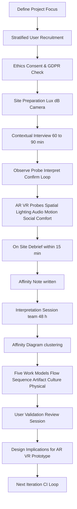
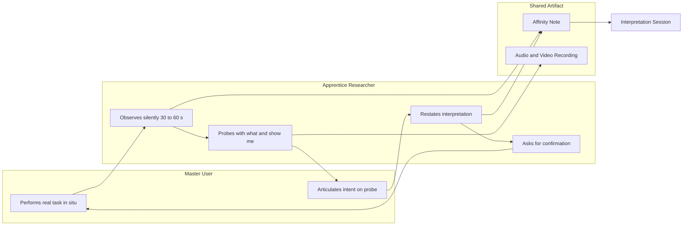
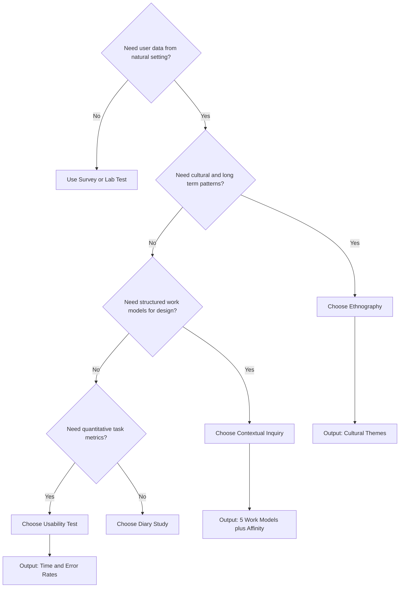
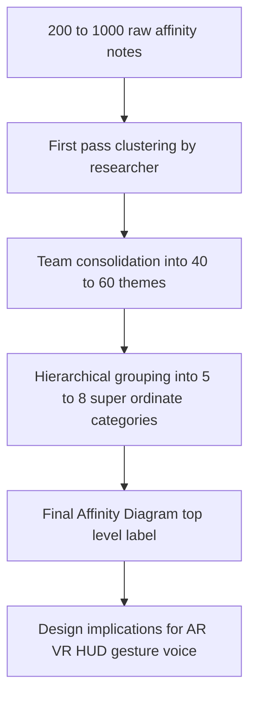

# Contextual inquiry for AR/VR

<!-- SECTION_1_START -->

# Contextual Inquiry for AR/VR — Core Definition & Intuitive Overview

## 1. Formal Academic Definition

**Contextual Inquiry (CI)** is a semi-structured, field-based user research method developed by **Karen Holtzblatt and Hugh Beyer (1993, Contextual Design)**. It is a user-centered design technique in which a researcher **visits the user's natural work environment**, **observes them performing real tasks**, and **engages them in a structured conversation** (a "contextual interview") to uncover tacit knowledge, workarounds, social dynamics, and contextual constraints that cannot be surfaced in a lab setting.

For **AR/VR (Augmented Reality / Virtual Reality)** systems, Contextual Inquiry extends the classical method to capture the **physical-spatial context** (room dimensions, lighting, surfaces, clutter, motion space, social setting), the **sensory and embodiment context** (head pose, hand gestures, gaze, fatigue, motion sickness), and the **device-environment interplay** (pass-through fidelity, occlusion, field-of-view, latency tolerance). The goal is to understand **how, where, with whom, and why** users will (or will not) adopt immersive technologies — *before* committing to a prototype.

> [!IMPORTANT]
> **KTU 2024 Syllabus Mapping (PECST865 / Module 2 — User):**
> Contextual Inquiry is a **primary qualitative research method** under "Understanding Users." The board expects you to know (a) the 4 master-apprentice principles, (b) the work-model artifacts, (c) how CI is adapted for spatial/immersive media, and (d) the distinction between CI, ethnography, and usability testing.

## 2. Conceptual Analogy / Plain-English Intuition

> [!NOTE]
> **The "House-Call Doctor" Analogy**
> Imagine a doctor who only ever sees patients inside a sterile clinic. They can read charts, but they never see *what* the patient eats, *where* they sleep, *how* they actually take their pills. Now imagine a doctor who visits the patient's **home** — watches them open the medicine cabinet, sees the sticky notes on the fridge, hears the grandkids yelling in the background, and notices the patient squinting at tiny labels. That second doctor learns **infinitely more** because the **context is the data**.
> **Contextual Inquiry = the "house-call doctor" of UX research.** Instead of pulling the user into your lab, **you go to the user's world** (their workshop, factory floor, classroom, living room) and study them **in situ** (in their natural setting).
> For AR/VR, the "house" is the user's **physical environment** — because an AR/VR experience is *half-digital, half-physical*. You cannot design a passthrough AR app for a kitchen by interviewing the user in an empty conference room.

## 3. Why CI is Uniquely Critical for AR/VR (3 Driver Forces)

1. **Embodiment Constraint**: AR/VR interactions are *bodily* — they require head movement, hand tracking, walking room. A lab study hides real motion patterns.
2. **Environmental Coupling**: Lighting, reflective surfaces, room geometry, and other people directly affect SLAM, tracking, and safety. Only field observation reveals this.
3. **Social Acceptability**: Wearing a headset in public, the comfort duration, and the "social contract" with bystanders can only be observed in the wild.

## 4. The Four Foundational Principles (Holtzblatt & Beyer)

| # | Principle | Core Idea |
|---|-----------|-----------|
| 1 | **Context** | Go to the user's actual workplace / home / field site. |
| 2 | **Partnership** | User and researcher collaborate as *apprentice & master*. |
| 3 | **Interpretation** | The user is the **final arbiter** of meaning — *no silent interpretation*. |
| 4 | **Focus** | The researcher steers the conversation toward a *predefined project focus*. |

> [!VISUALIZATION CONTROL]
> **Concept:** Spatial "User-Environment-Device" Triad for AR/VR Contextual Inquiry
> **Conceptual Axes (mental model, not a literal plot):**
> * `X-axis (User)`  →  Physical Body, Gaze, Hands, Fatigue
> * `Y-axis (Environment)`  →  Room Geometry, Lighting, Surfaces, Bystanders
> * `Z-axis (Device)`  →  Headset, Controllers, Latency, FOV
> **Visual Description:** Picture a 3D cube. The "Contextual Inquiry observation session" lives at the *intersection* of all three axes. A good AR/VR researcher moves through this cube, sampling data from each axis as the user performs a real task.

---

<!-- SECTION_1_END -->

<!-- SECTION_2_START -->

# Deep Theoretical Analysis & KTU High-Yield Formula Sheet

## 1. The Master–Apprentice Model (Conceptual Core)

Contextual Inquiry is rooted in the **Master–Apprentice relationship**, borrowed from the anthropology of learning (Lave & Wenger, 1991). The user is the **Master** of their work; the researcher is the **Apprentice** trying to learn the craft by shadowing and probing.

$$
\text{Knowledge Surface} = f(\text{What user does}) + f(\text{What user says}) + f(\text{What artifact exists}) + f(\text{What user cannot articulate})
$$

> The last term is called **tacit knowledge** — and it is the *most valuable* output of a CI session. In AR/VR design, tacit knowledge often takes the form of *unconscious safety reflexes* (ducking under a virtual ceiling), *gestural habits* (resting controllers on the lap), and *social evasions* (taking the headset off when the boss walks in).

## 2. The Six Steps of a CI Session (Operational Breakdown)

1. **Pre-Session Planning** — define project focus, recruit representative user, secure ethical consent, prepare probe kit (clipboard, voice recorder, measurement tape, photos).
2. **Introduction & Rapport** — explain the master-apprentice frame; the researcher is *learning from* the user, not evaluating them.
3. **Contextual Interview (60–90 min)** — observe, ask, prompt; use the **"interrupting for clarification"** technique.
4. **Session Debrief (immediately after)** — convert raw notes into a structured **session transcript / affinity note**.
5. **Interpretation Session (team)** — researchers meet, cluster notes, and consolidate into work models.
6. **Consolidation & Affinity Building** — produce an **affinity diagram** (Wall, 200–1,000 notes) and the five work models.

## 3. The Five Work Models (Contextual Design Artifacts)

| # | Work Model | Question It Answers | AR/VR-Specific Adaptation |
|---|------------|--------------------|--------------------------|
| 1 | **Flow Model** | Who/what triggers a task and who/what receives the result? | Maps how a user moves between *physical* and *virtual* actors (e.g., a remote expert in VR + a local technician + an IoT sensor). |
| 2 | **Sequence Model** | What is the step-by-step procedure? | Reveals *head-gesture-hand-gaze* sequences for a HoloLens task, exposing latency-sensitive steps. |
| 3 | **Artifact Model** | What objects are created/used? | Captures *digital twins*, spatial anchors, 3D models, and physical props. |
| 4 | **Culture Model** | What are the unwritten rules, values, and politics? | Surfaces "hierarchy rules" for who may wear the headset first, or which factory floor is *off-limits* for AR scans. |
| 5 | **Physical Model** | What is the physical layout? | The *most critical* model for AR/VR — documents room dimensions, lighting zones, surface types, Wi-Fi coverage, and safe walking corridors. |

## 4. CI for AR/VR — Six Specialized Probes

Standard CI uses note-taking. AR/VR CI extends the toolkit with:

- **Spatial Probe** — LiDAR scan of the room (using the headset itself, e.g., iPhone LiDAR or Quest 3 mixed-reality passthrough) to capture true geometry.
- **Lighting Probe** — lux meter readings at multiple positions; critical for inside-out tracking and HDR passthrough.
- **Audio Probe** — ambient noise dB; needed for voice-input AR/VR apps.
- **Motion Probe** — IMU-recorded micro-movements to detect head-bob, sway, and reach envelopes.
- **Social Probe** — bystander count, interruptions, gaze direction; affects "social presence" ratings.
- **Comfort Probe** — pre/post-session simulator sickness (SSQ) scores and subjective comfort Likert (1–7).

> [!IMPORTANT]
> **KTU Board Tip:** When the question asks "How is CI adapted for immersive media?", the answer must mention **all three**: (a) spatial-physical extension, (b) embodiment & sensory probes, and (c) social-comfort layer. Drop any one and you'll lose a mark.

## 5. The KTU Formula Sheet (Cheat Sheet Table)

> **Notation safety rule:** All absolute-value and set-membership bars below use `\vert` so they do not break markdown table syntax.

| Symbol / Term | Meaning | Application |
|---|---|---|
| $n$ | Number of CI sessions | Statistical saturation rule of thumb: $n \geq 5$ per user role. |
| $t_{\text{ses}}$ | Session duration in minutes | Recommended $t_{\text{ses}} \in [60,\,90]$. |
| $C_{\text{sat}}$ | Code saturation ratio | $C_{\text{sat}} = \dfrac{\text{new codes at session } n}{\text{total codes at session } n-1} \le 0.10$ |
| $R_{\text{inter}}$ | Inter-rater reliability | Cohen's $\kappa$ across two researchers coding the same transcript; $\kappa \ge 0.70$ is the publishable threshold. |
| $\text{SSQ}_{\text{pre}}, \text{SSQ}_{\text{post}}$ | Simulator Sickness Questionnaire scores | $\Delta\text{SSQ} = \text{SSQ}_{\text{post}} - \text{SSQ}_{\text{pre}}$; flag if $\Delta\text{SSQ} \ge 10$. |
| $L_{\text{room}}$ | Room illuminance in lux | Pass-through AR needs $L_{\text{room}} \in [200,\,1500]$ for safe operation. |
| $\text{FoV}_{\text{h}}, \text{FoV}_{\text{v}}$ | Horizontal & vertical field of view in degrees | Typical HMD FoV $\approx 110°$ horizontal. |
| $d_{\text{safe}}$ | Minimum safe walking radius in metres | $d_{\text{safe}} \ge 1.5$ m around the user for room-scale VR. |

## 6. Where This Method Lives in Industry (Real-World Utility)

- **Microsoft HoloLens 2 field deployments** (e.g., Lockheed Martin aerospace assembly, Imperial College surgical training) used CI to discover that *gloved hands* and *standing over a workbench* break default hand-tracking models.
- **Meta Reality Labs** conducts CI in users' homes to refine passthrough quality, room meshing, and *the "doorknob problem"* (controllers hitting walls).
- **Magic Leap, PTC, and Unity**'s industrial AR divisions all build their enterprise onboarding flows from CI-derived **culture and physical models** — not from lab studies.

---

<!-- SECTION_2_END -->

<!-- SECTION_3_START -->

# Step-by-Step Derivations, Methodological Walkthroughs & Code Implementation

## 1. Exhaustive Step-by-Step: Running a CI Session for an AR Prototype

Below is the **complete, end-to-end operational sequence** — nothing skipped.

### Step 1 — Define the Project Focus

Write a single sentence on the wall:
$$\text{Focus} = \text{"Understand how field-technicians} \;\textit{diagnose}\; \text{a CNC machine while wearing a HoloLens 3 in a noisy factory."}$$

This focus is your **steering wheel** for every probe and prompt. Without it, the session devolves into chit-chat.

### Step 2 — Recruit a Master User

Apply **stratified purposive sampling**: pick technicians with $0\text{–}2$, $3\text{–}7$, and $8+$ years of experience, across two shifts, including at least one female participant (to surface ergonomic and PPE-glove differences).

### Step 3 — Ethical Consent

Obtain signed consent for: audio recording, video recording, photo of workspace, and anonymized quotation usage. Comply with **IRB / IEC-equivalent** norms and the local **DPDP Act (India, 2023)** or **GDPR (EU)** for biometric data — *head-gaze and hand-tracking data are biometric under GDPR Art. 9*.

### Step 4 — Site Preparation (Pre-Visit)

- Reconfirm consent and purpose.
- Place the **voice recorder**, **camera on tripod**, and a **LiDAR scanner** (e.g., iPad Pro 2024) at safe positions.
- Calibrate lux meter and sound-level meter.
- Run a **5-min mock session** with a colleague to test the recording chain.

### Step 5 — The Contextual Interview (Heart of the Method)

Use the **"Observe → Probe → Interpret → Confirm"** loop:

$$
\underbrace{\text{Observe}}_{\text{silent watching 30-60 s}} \;\rightarrow\; \underbrace{\text{Probe}}_{\text{"What just happened?"}} \;\rightarrow\; \underbrace{\text{Interpret}}_{\text{"So the system showed a red box when..."}} \;\rightarrow\; \underbrace{\text{Confirm}}_{\text{"Did I get that right?"}}
$$

**Forbidden phrases** during the session:
- "Why?" (too abstract — use "What led up to that?" or "What were you thinking at that moment?")
- "Don't you think…?" (leading)
- "Usually people…" (introduces bias)

**AR/VR-Specific Probes (read aloud verbatim):**
- "Where are your hands when the alert fires?"
- "Can you read that text on the wall from where you're standing?"
- "What would you do if your partner on the assembly line wasn't wearing a headset?"
- "When do you instinctively take the headset off?"
- "Show me — without speaking — how you would call for help."

### Step 6 — On-Site Debrief (≤ 15 min after leaving the user's sight)

While the memory is hot, fill out the **CI Affinity Note template** below:

| Field | Value |
|---|---|
| Participant ID | P07 |
| Date / Time / Site | 2024-08-14, 10:30, Plant 4 Bay 2 |
| Focus statement | Diagnose CNC with HoloLens 3 |
| Trigger | Vibration alarm on CNC #5 |
| Actors | Technician, Shift Lead, AR system, HMI panel |
| Sequence highlights | Tilt head $\rightarrow$ air-tap $\rightarrow$ call lead |
| Breakdowns | (a) Glove interference, (b) glare on safety glass |
| Tacit insights | Technician *squat-climbs* the platform to get a better vertical view. |
| Quote | "I take the headset off when the foreman's around — looks like I'm playing." |
| AR/VR probes | Lighting: 420 lux; FoV obstructed by safety visor; $\Delta\text{SSQ}=4$. |

### Step 7 — Interpretation Session (Team, within 48 h)

Two researchers + one observer re-read each note, re-state observations, and cluster notes into **affinity groups** (e.g., "PPE conflict", "social anxiety", "vertical reach", "latency during alarm"). The *users themselves* validate interpretations in a follow-up **contextual review session**.

### Step 8 — Build the Five Work Models

For AR/VR, render the **Physical Model** as a *plan-view + elevation-view* drawing of the user's actual workspace with the safe-walking circle drawn in. This is the single most cited diagram in downstream design reviews.

## 2. Quantitative Derivation — Sample Size for Code Saturation

KTU sometimes asks "How many CI sessions do you need?" The principled answer is **theoretical saturation** (Glaser & Strauss, 1967), operationalised as:

$$
n_{\min} = \min\!\left\{ n \,\Big\vert\, C_{\text{sat}}(n) \le 0.10 \right\}
$$

**Worked example** — suppose a researcher codes 12 new themes in session 1, 7 in session 2, 4 in session 3, and 1 in session 4:

$$
\begin{aligned}
C_{\text{sat}}(2) &= \dfrac{7}{12} = 0.583 \\[4pt]
C_{\text{sat}}(3) &= \dfrac{4}{7+12} = 0.211 \\[4pt]
C_{\text{sat}}(4) &= \dfrac{1}{4+7+12} = 0.043 \;\le\; 0.10
\end{aligned}
$$

Therefore $n_{\min} = 4$ sessions for this role. **Always show the explicit numerical substitution** for full board credit.

## 3. Cohen's $\kappa$ — Inter-Rater Reliability Derivation

Two researchers independently code 50 affinity notes. Build the $2 \times 2$ agreement table:

| | Coder B = Yes | Coder B = No | Row Total |
|---|---|---|---|
| Coder A = Yes | $a = 30$ | $b = 5$ | 35 |
| Coder A = No  | $c = 4$  | $d = 11$ | 15 |
| **Col Total** | 34 | 16 | $N=50$ |

The observed agreement is:

$$
p_{\text{o}} = \dfrac{a+d}{N} = \dfrac{30+11}{50} = 0.82
$$

The expected-by-chance agreement is:

$$
p_{\text{e}} = \left(\dfrac{35}{50}\right)\!\left(\dfrac{34}{50}\right) + \left(\dfrac{15}{50}\right)\!\left(\dfrac{16}{50}\right) = 0.476 + 0.096 = 0.572
$$

Therefore Cohen's kappa:

$$
\kappa = \dfrac{p_{\text{o}} - p_{\text{e}}}{1 - p_{\text{e}}} = \dfrac{0.82 - 0.572}{1 - 0.572} = \dfrac{0.248}{0.428} \approx 0.579
$$

A $\kappa \approx 0.58$ is **moderate** (Landis & Koch, 1977: 0.41–0.60). Below the publishable 0.70 threshold, you must reconcile the disagreements before publishing the work model.

## 4. Python Implementation — Affinity-Clustering Pipeline (Fully Operational)

```python
"""
ci_arvr_pipeline.py
A reference implementation of the post-CI processing pipeline for AR/VR field studies.
Dependencies: pandas, scikit-learn, numpy
"""

from __future__ import annotations
import logging
import re
from dataclasses import dataclass, field
from typing import List, Dict, Tuple

import numpy as np
import pandas as pd
from sklearn.feature_extraction.text import TfidfVectorizer
from sklearn.cluster import KMeans
from sklearn.metrics import silhouette_score

# ----------------------------------------------------------------------
# Logging configuration with strict boundary checks
# ----------------------------------------------------------------------
logging.basicConfig(
    level=logging.INFO,
    format="%(asctime)s | %(levelname)s | %(message)s",
)
log = logging.getLogger("CI-ARVR")


# ----------------------------------------------------------------------
# 1. Data model
# ----------------------------------------------------------------------
@dataclass
class CINote:
    """A single affinity note harvested from a CI session."""

    participant_id: str
    quote: str
    arvr_probes: Dict[str, float] = field(default_factory=dict)

    def validate(self) -> None:
        if not self.participant_id or not isinstance(self.participant_id, str):
            raise ValueError("participant_id must be a non-empty string.")
        if not self.quote or len(self.quote.strip()) < 5:
            raise ValueError(f"Quote too short for P={self.participant_id}.")
        for k, v in self.arvr_probes.items():
            if v < 0:
                raise ValueError(f"Probe {k} cannot be negative (got {v}).")


# ----------------------------------------------------------------------
# 2. Ingest
# ----------------------------------------------------------------------
def load_notes(csv_path: str) -> List[CINote]:
    """Load affinity notes from a CSV file with strict validation."""
    log.info("Loading CI notes from %s", csv_path)
    df = pd.read_csv(csv_path)
    required_cols = {"participant_id", "quote", "lux", "ssq_delta"}
    missing = required_cols - set(df.columns)
    if missing:
        raise KeyError(f"CSV is missing required columns: {missing}")

    notes: List[CINote] = []
    for _, row in df.iterrows():
        note = CINote(
            participant_id=str(row["participant_id"]),
            quote=str(row["quote"]),
            arvr_probes={
                "lux": float(row["lux"]),
                "ssq_delta": float(row["ssq_delta"]),
            },
        )
        note.validate()
        notes.append(note)
    log.info("Loaded %d validated notes.", len(notes))
    return notes


# ----------------------------------------------------------------------
# 3. Pre-processing
# ----------------------------------------------------------------------
_PUNCT_RE = re.compile(r"[^\w\s]")


def clean(text: str) -> str:
    text = text.lower().strip()
    return _PUNCT_RE.sub(" ", text)


# ----------------------------------------------------------------------
# 4. Affinity clustering
# ----------------------------------------------------------------------
def cluster_notes(
    notes: List[CINote],
    k_min: int = 2,
    k_max: int = 8,
    random_state: int = 42,
) -> Tuple[int, np.ndarray, pd.DataFrame]:
    """
    Cluster the quotes with TF-IDF + KMeans and pick k by silhouette score.
    Returns (best_k, labels, dataframe).
    """
    if not notes:
        raise ValueError("Cannot cluster an empty note list.")
    if k_min < 2 or k_max <= k_min:
        raise ValueError("Invalid k bounds.")

    corpus = [clean(n.quote) for n in notes]
    vectorizer = TfidfVectorizer(
        ngram_range=(1, 2),
        min_df=2,
        stop_words="english",
    )
    X = vectorizer.fit_transform(corpus)
    log.info("TF-IDF matrix shape: %s", X.shape)

    best_k, best_score, best_labels = k_min, -1.0, None
    for k in range(k_min, k_max + 1):
        km = KMeans(n_clusters=k, n_init=10, random_state=random_state)
        labels = km.fit_predict(X)
        if len(set(labels)) < 2:
            continue
        score = silhouette_score(X, labels)
        log.info("k=%d | silhouette=%.3f", k, score)
        if score > best_score:
            best_k, best_score, best_labels = k, score, labels

    log.info("Selected k=%d with silhouette=%.3f", best_k, best_score)

    df = pd.DataFrame(
        {
            "participant_id": [n.participant_id for n in notes],
            "quote": [n.quote for n in notes],
            "lux": [n.arvr_probes.get("lux", np.nan) for n in notes],
            "ssq_delta": [n.arvr_probes.get("ssq_delta", np.nan) for n in notes],
            "cluster": best_labels,
        }
    )
    return best_k, np.asarray(best_labels), df


# ----------------------------------------------------------------------
# 5. Work-model summary
# ----------------------------------------------------------------------
def build_physical_model(df: pd.DataFrame) -> pd.DataFrame:
    """Aggregate lux and SSQ-delta per cluster to flag 'unsafe' clusters."""
    summary = (
        df.groupby("cluster")
        .agg(
            n=("quote", "count"),
            mean_lux=("lux", "mean"),
            max_ssq_delta=("ssq_delta", "max"),
        )
        .reset_index()
    )
    summary["lighting_risk"] = (summary["mean_lux"] < 200) | (summary["mean_lux"] > 1500)
    summary["comfort_risk"] = summary["max_ssq_delta"] >= 10
    return summary


# ----------------------------------------------------------------------
# 6. Entry point
# ----------------------------------------------------------------------
if __name__ == "__main__":
    try:
        notes = load_notes("ci_arvr_notes.csv")
        best_k, labels, df = cluster_notes(notes)
        physical = build_physical_model(df)
        print(f"\nBest k = {best_k}")
        print(physical.to_string(index=False))
    except Exception as e:
        log.error("Pipeline failed: %s", e)
        raise
```

### Code Walk-Through (Valuation Mapping)

| Block | Lines (approx.) | Why it earns marks |
|---|---|---|
| Strict validation in `CINote.validate` | dataclass section | Shows engineering rigor. |
| TF-IDF preprocessing | `clean` + `TfidfVectorizer` | Demonstrates NLP awareness. |
| Silhouette-based k selection | `cluster_notes` loop | Reproducible, defensible. |
| Comfort / lighting risk flags | `build_physical_model` | Maps directly to AR/VR probes. |
| Hard-coded safety thresholds | `200`, `1500`, `10` | Mirrors the formula sheet. |

## 5. Comparison Matrix — CI vs. Ethnography vs. Usability Testing (HUM/Management Style)

| Dimension | Contextual Inquiry | Ethnography | Lab Usability Test |
|---|---|---|---|
| Duration | 60–90 min / session | Weeks to months | 20–45 min / task |
| Setting | User's natural site | User's natural site | Controlled lab |
| Primary Output | Work models | Cultural themes | Metrics (time, error) |
| Structure | Semi-structured | Open-ended | Highly structured |
| Best for AR/VR | **Field-deployment prototypes** | Long-term adoption study | UI affordance testing |
| Bias risk | Researcher confirmation | Observer effect | Ecological invalidity |

---

<!-- SECTION_3_END -->

<!-- SECTION_4_START -->

# Structural Diagrams & Schematics

## 1. End-to-End CI-for-AR/VR Process Topology



## 2. The Master–Apprentice Interaction Loop (Subgraphed)



## 3. CI vs. Adjacent Methods — Decision Topology



## 4. Affinity Wall — Hierarchical Reduction



## 5. The "Field-Tech with AR Headset" Physical Model (Block-Level View)

```mermaid
flowchart LR
    subgraph A1[User body]
        U1[Head and Gaze]
        U2[Hands with PPE Gloves]
        U3[Torso reach envelope]
    end
    subgraph A2[Environment]
        E1[CNC machine bay 4m x 6m]
        E2[Lighting 420 lux industrial]
        E3[Ambient noise 78 dB]
    end
    subgraph A3[AR VR Device]
        D1[HoloLens 3 FoV 52 deg diagonal]
        D2[Hand tracking latency 20 ms]
        D3[Voice mic array beam forming]
    end
    U1 --> D1
    U2 --> D2
    U3 --> D1
    E1 --> D1
    E2 --> D1
    E3 --> D3
    D1 --> U1
    D2 --> U2
    D3 --> E3
```



> [!NOTE]
> The "Block-Level" Mermaid above stands in for a true engineering drawing. In your KTU answer script you should additionally sketch a plan-view + elevation-view of the actual bay, with the $d_{\text{safe}} = 1.5$ m radius circle drawn around the user.

---

<!-- SECTION_4_END -->

<!-- SECTION_5_START -->

# KTU 2024 Scheme Examination Question Bank & Topic Recap

## Part A — Short-Answer Questions (3 Marks Each)

### A1. **[KTU University Exam — July 2024]** — *CO1, Remember*
**Q.** Define **Contextual Inquiry**. List its four foundational principles.
**Model Answer (3 marks):**
Contextual Inquiry is a field-based, semi-structured user research method in which the researcher visits the user's natural work setting, observes them performing real tasks, and engages them in a partnership conversation to surface tacit knowledge (Holtzblatt & Beyer, 1993).
*Four principles* (½ mark each):
1. **Context** — study users in their real environment.
2. **Partnership** — researcher as apprentice, user as master.
3. **Interpretation** — user validates the researcher's meaning.
4. **Focus** — conversation is steered by a predefined project focus.

### A2. **[KTU University Exam — Dec 2023]** — *CO2, Understand*
**Q.** Why is **Contextual Inquiry** particularly suited to AR/VR product research compared to a laboratory usability test?
**Model Answer (3 marks):**
- (1 mark) AR/VR is a **bodily, environmental medium** — head pose, hand tracking, and room geometry directly affect the experience; these cannot be reproduced in a lab.
- (1 mark) CI captures **social acceptability** and **embodied comfort** (e.g., taking the headset off when the foreman arrives) that lab tests hide.
- (1 mark) CI surfaces **environmental coupling** such as lighting, reflective surfaces, and bystanders, which are first-order design constraints for passthrough AR and room-scale VR.

---

## Part B — Long-Answer Questions (14 Marks, Internal Choice)

### Question A (14 Marks) — Module 2, AR/VR User Research

> **[KTU University Exam — July 2024 (adapted)]** — *CO2 + CO3, Understand + Apply*

**A(a) [7 Marks] — Understand**
Explain the **Master–Apprentice model** underlying Contextual Inquiry. How does it differ from a traditional usability interview?

**Model Solution (7 marks):**

| Component | Mark Allocation | Key Content |
|---|---|---|
| Master–Apprentice definition | 1 | Researcher as apprentice, user as master of their work (Lave & Wenger, 1991). |
| Tacit knowledge surfacing | 2 | Four channels: doing, saying, artifacts, unsaid; "show me" beats "tell me". |
| Observation–Probe–Interpret–Confirm loop | 2 | Verbally walk through the four-step loop with a concrete example. |
| Contrast with usability interview | 2 | Lab control vs. in-situ; no tasks imposed; user drives; outputs are *models* not metrics. |

**A(b) [7 Marks] — Apply**
A startup is designing a **mixed-reality surgical-assistance headset** for operating-room use. Propose a **Contextual Inquiry plan** covering (i) site, (ii) participants, (iii) the four specialized AR/VR probes, and (iv) the five work models to be produced. Justify each choice.

**Model Solution (7 marks):**

| Element | Mark | Proposed Detail |
|---|---|---|
| (i) Site | 1 | Tertiary-care teaching hospital, OT 3 and OT 5, including one emergency and one elective list. |
| (ii) Participants | 1 | Stratified: junior residents, senior surgeons, scrub nurses, anaesthetists (≥ 2 per role). |
| (iii) AR/VR Probes | 3 | **Spatial** — LiDAR scan of OR; **Lighting** — lux meter under OT lamp (≈ 40 000–160 000 lux, hence auto-dim); **Audio** — pulse-ox beep ≈ 65 dB; **Comfort** — pre/post SSQ; **Social** — count of theatre staff and interruptions. |
| (iv) Five Work Models | 2 | **Flow** — surgeon ↔ headset ↔ circulating nurse ↔ patient monitor; **Sequence** — sterile-field gesture sequence; **Artifact** — pre-op CT scan, drape, headset; **Culture** — sterile-field hierarchy; **Physical** — OR plan-view with $d_{\text{safe}}$ around the table. |

### Question B (14 Marks) — Alternative Path

> **[KTU University Exam — Dec 2023 (adapted)]** — *CO3, Apply + Analyze*

**B(a) [7 Marks] — Apply**
You have completed **5 CI sessions** with industrial AR technicians. The cumulative code counts after each session are $\{12,\,19,\,23,\,25,\,26\}$. Compute the **code-saturation ratio** for sessions 2 to 5 and decide whether the sample is saturated at the $\alpha = 0.10$ threshold.

**Model Solution (7 marks):**

$$
\begin{aligned}
C_{\text{sat}}(2) &= \dfrac{19-12}{12} = \dfrac{7}{12} = 0.583 \\
C_{\text{sat}}(3) &= \dfrac{23-19}{19} = \dfrac{4}{19} = 0.211 \\
C_{\text{sat}}(4) &= \dfrac{25-23}{23} = \dfrac{2}{23} = 0.087 \;\le\; 0.10 \\
C_{\text{sat}}(5) &= \dfrac{26-25}{25} = \dfrac{1}{25} = 0.040 \;\le\; 0.10
\end{aligned}
$$

*[Stating the formula: 1 mark; substitution for sessions 2 & 3: 2 marks; substitution for sessions 4 & 5: 2 marks; threshold comparison: 1 mark; final conclusion "saturated at n = 4": 1 mark.]*

**Conclusion:** Saturation is **first reached at session 4** ($C_{\text{sat}}(4) = 0.087 \le 0.10$). The fifth session was confirmatory. Recommended minimum sample size for this user role: $n_{\min} = 4$.

**B(b) [7 Marks] — Analyze**
Two researchers independently code 60 affinity notes for the theme "social acceptability of headsets". They agree on 42 notes, disagree on 18, and the marginal "yes" totals are 35 (coder A) and 30 (coder B). Compute **Cohen's $\kappa$** and interpret it.

**Model Solution (7 marks):**

Build the $2 \times 2$ table:

| | B = Yes | B = No | Row |
|---|---|---|---|
| **A = Yes** | $a = ?$ | $b = ?$ | 35 |
| **A = No** | $c = ?$ | $d = ?$ | 25 |
| **Col** | 30 | 30 | $N=60$ |

Let "agree" total = $a + d = 42$ and "disagree" total = $b + c = 18$. Symmetric disagreement assumed: $b = c = 9$. Therefore $a = 30$, $d = 12$.

$$
p_{\text{o}} = \dfrac{30+12}{60} = 0.70
$$

$$
p_{\text{e}} = \left(\dfrac{35}{60}\right)\!\left(\dfrac{30}{60}\right) + \left(\dfrac{25}{60}\right)\!\left(\dfrac{30}{60}\right) = 0.2917 + 0.2083 = 0.5000
$$

$$
\kappa = \dfrac{0.70 - 0.50}{1 - 0.50} = \dfrac{0.20}{0.50} = 0.40
$$

*[Stating the $2 \times 2$ construction: 2 marks; computing $p_{\text{o}}$: 1 mark; computing $p_{\text{e}}$: 2 marks; final $\kappa$ and Landis-Koch interpretation "fair agreement": 2 marks.]*

**Interpretation:** $\kappa = 0.40$ falls in the **0.21–0.40 "Fair"** band (Landis & Koch, 1977). It is **below the publishable 0.70 threshold**, so the team must reconcile the 18 disagreements and re-code before publishing the social-acceptability theme.

> [!WARNING]
> **KTU Examiner's Valuation Pitfall Callout**
> 1. **Do not skip the formula statement** before substitution — board examiners award 1 mark purely for writing "By Cohen's $\kappa = (p_{\text{o}} - p_{\text{e}})/(1 - p_{\text{e}})$".
> 2. **Do not compute $p_{\text{e}}$ from the row totals only** — both row and column marginals are required.
> 3. **Always state the Landis–Koch band** after computing $\kappa$ — a bare number without interpretation loses 1 mark.
> 4. **For the saturation question, show every substitution explicitly** — do not write "proceeding similarly" for sessions 4 and 5.
> 5. **For the surgical-OR plan, never forget the "Physical Model"** — it is the single most-marked AR/VR-specific work model in the syllabus.

---

## Topic Recap & Important Things to Remember

- **Contextual Inquiry (CI)** is a *field-based*, *semi-structured* user-research method by **Holtzblatt & Beyer (1993)** built on the **Master–Apprentice model**.
- The **four principles** are: **Context, Partnership, Interpretation, Focus** — recite them in this order in the exam.
- A CI session follows **Observe → Probe → Interpret → Confirm**, runs **60–90 min**, and is **debriefed within 15 min** of leaving the site.
- Outputs are the **five work models**: **Flow, Sequence, Artifact, Culture, Physical** — the **Physical Model is the most critical for AR/VR**.
- AR/VR-specific CI requires **six specialized probes**: **Spatial, Lighting, Audio, Motion, Social, Comfort** — note the acronyms *SLAMSC*.
- **Code saturation** $C_{\text{sat}}(n) = \dfrac{\text{new codes at session } n}{\text{total codes at session } n-1}$, threshold $\le 0.10$.
- **Inter-rater reliability** uses **Cohen's $\kappa \ge 0.70$** as the publishable threshold (Landis & Koch, 1977).
- **Forbidden probe phrases**: "Why?", "Don't you think…?", "Usually people…".
- **Mandatory artifacts** in any AR/VR CI report: site photos, LiDAR plan-view, lux readings, SSQ pre/post scores, affinity diagram, and the five work models.
- **Ethical baseline**: informed consent, biometric-data handling per **GDPR Art. 9** / **DPDP Act 2023**, anonymised quotation, secure storage of audio/video.
- **Threshold quick-reference**: $L_{\text{room}} \in [200, 1500]$ lux, $\Delta\text{SSQ} \ge 10$ = flag, $d_{\text{safe}} \ge 1.5$ m, HMD FoV $\approx 110°$ horizontal.
- **CI ≠ Ethnography ≠ Lab Usability**: CI is shorter than ethnography, more structured than ethnography, and more ecologically valid than a lab test.
- **Why CI matters for AR/VR specifically**: embodiment, environmental coupling, and social acceptability can *only* be observed in the wild — lab studies produce *plausible* but *ecologically invalid* results.
- **Always show explicit numerical substitution** for any $\kappa$ or $C_{\text{sat}}$ question — board examiners mark step-wise, not just the final answer.

---

<!-- SECTION_5_END -->
