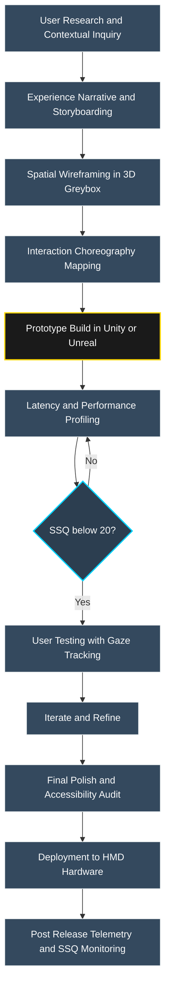
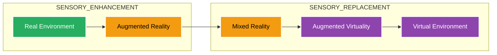
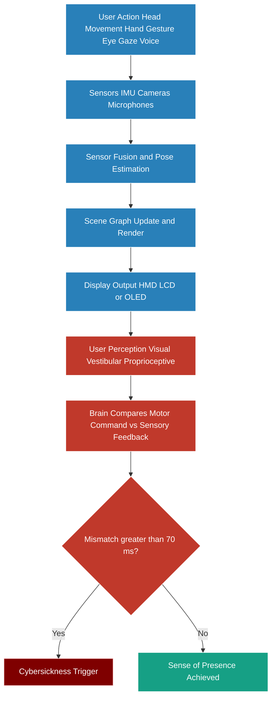
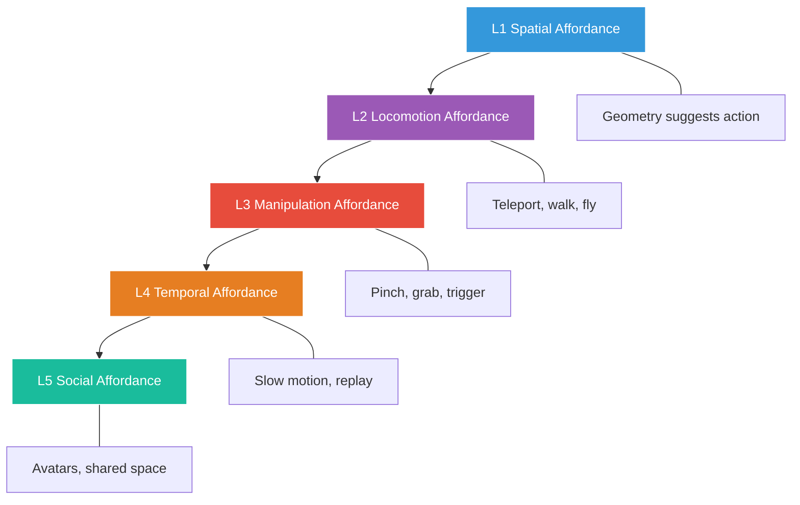

# Designing for AR/VR Environments

<!-- SECTION_1_START -->
# Designing for AR/VR Environments — Core Foundations

## 1.1 Formal KTU 2024 Definition

**Immersive Experience Design** is the disciplined process of architecting, prototyping, and evaluating human–computer interactions within spatially simulated (VR) or spatially augmented (AR) realities, where the user's perceptual field is either fully substituted by a synthetic environment or enhanced with digitally rendered contextual overlays anchored to the physical world.

> [!IMPORTANT]
> **KTU 2024 Syllabus Terminology (PECST865 / Module 2 — User):**
> * **Virtual Reality (VR):** A fully synthetic, immersive 3D environment that replaces the user's real-world perception. The user is **inside** the experience.
> * **Augmented Reality (AR):** A hybrid view where digital objects are superimposed on the real world. The user remains **in** the real world.
> * **Mixed Reality (MR):** A continuum where digital and physical objects co-exist and **interact** in real time (Milgram–Kishino continuum).
> * **Extended Reality (XR):** The umbrella term covering AR, VR, MR, and all immersive spectra.

## 1.2 Conceptual Analogy — The Three Theater Metaphor

Think of human perception as a **theatrical stage**:

| Reality Mode | Theater Analogy | User's Role |
|---|---|---|
| **Real World** | Empty stage with real actors | Audience watching life |
| **AR** | Stage with a real actor + a digital puppet overlay | Audience watching a hybrid performance |
| **MR** | Stage where the digital puppet interacts with the real actor | Audience watching a co-performance |
| **VR** | A fully digital stage with CGI actors | Audience is teleported into another play |

The fundamental **design shift** when moving from 2D GUI to AR/VR is the transition from **point-and-click on a flat screen** to **embodied spatial interaction** — your head, hands, eyes, and body become the input devices.

> [!NOTE]
> **Critical Design Insight (Kelley, 2021; KTU Reference):** The human visual system has a field of view (FOV) of approximately **200° horizontally** and **135° vertically**, but consumer VR HMDs only deliver roughly **110°–120° FOV**. This mismatch — the **peripheral blind zone** — is one of the most common causes of *cybersickness* in poorly designed VR systems.

## 1.3 The Sense Organs as Input/Output Channels in XR

| Sense | Role in AR/VR | Common Hardware Mapping |
|---|---|---|
| **Vision** | Primary display channel | HMD lenses, OLED/LCD microdisplays, waveguide combiners |
| **Audition** | Spatial 3D sound, ambient cues | HRTF headphones, ambisonic speakers, bone conduction |
| **Touch (Haptics)** | Force feedback, texture simulation | Vibrotactile actuators, force-feedback gloves, ultrasonic haptics |
| **Vestibular** | Motion, balance cues | Motion platforms, galvanic vestibular stimulation (GVS) |
| **Proprioception** | Body position awareness | Full-body trackers, IMU suits, marker-based mocap |
| **Olfaction / Gustation** | Smell and taste (emerging) | Scent diffusers, thermal taste modules (research-grade) |

> [!VISUALIZATION CONTROL]
> **Concept:** The Reality–Virtuality Continuum (Milgram & Kishino, 1994)
> **GeoGebra / Desmos Input Equations:**
> * Line: `f(x) = x` from `(0, 0)` to `(1, 1)` — represents the Reality–Virtuality axis
> * Anchor points: `A = (0, 0)` labeled **Real Environment**, `B = (1, 0)` labeled **Virtual Environment**
> * Mid-marker: `M = (0.5, 0)` labeled **Mixed Reality**
> **Visual Description:** A horizontal number line stretching from 0 to 1. AR lies between 0 and 0.5, MR near 0.5, AV (Augmented Virtuality) between 0.5 and 1, and pure VR at 1. Observe how MR sits in the *middle of the continuum*, not at the AR or VR endpoint.

## 1.4 The Three Pillars of AR/VR Experience Design

1. **Immersion** — The *technical* capacity of the system to deliver sensory fidelity (FOV, refresh rate, latency, resolution).
2. **Presence** — The *psychological* feeling of "being there" inside the virtual scene.
3. **Interaction** — The *behavioral* capacity to manipulate, navigate, and modify the environment in real time.

> [!IMPORTANT]
> **KTU 2024 Key Distinction (Frequently asked in exams):** *Immersion ≠ Presence*. A system can be technically immersive (4K per eye, 120 Hz) but still fail to elicit presence if the interaction model is broken (e.g., invisible hands, laggy controllers). Designers must engineer all three pillars in parallel.

---

<!-- SECTION_1_END -->

<!-- SECTION_2_START -->
# Deep Theoretical Analysis & KTU High-Yield Cheat Sheet

## 2.1 The Theoretical Foundations Framework

Designing for AR/VR is **not** an extension of 2D UI/UX design. It demands a fundamental re-architecting of interaction paradigms. Below is the structured analytical breakdown KTU examiners expect.

### A. The Three-I Framework (Immersion, Interactivity, Information Density)

**Step 1 — Immersion Engineering**
* The display must saturate the user's primary sensory channels.
* The HMD resolution must meet the **acuity threshold** of **60 pixels per degree (PPD)** to be considered *retina-equivalent* in VR. Consumer devices like Meta Quest 3 deliver approximately **25 PPD**; Apple Vision Pro targets **~36 PPD**.
* Display refresh rate must remain $\geq 90\,\text{Hz}$ to suppress flicker fusion and the vestibulo-ocular reflex mismatch that causes nausea.

**Step 2 — Interactivity Choreography**
* All user-initiated actions must complete their *sensorimotor loop* (perception → cognition → action → feedback) within **$\leq 70\,\text{ms}$** — this is the **motion-to-photon latency budget**.
* Controllers, hand-tracking, eye-tracking, and voice must operate as a **concurrent multimodal channel set**, not as competing input modes.

**Step 3 — Information Density Calibration**
* Unlike 2D screens, AR/VR allows the user to *physically move closer* to a piece of information. Designers must respect the **focal comfort zone**:

$$
\text{Comfort Zone} = \left[0.5\,\text{m},\ 20\,\text{m}\right]
$$

* Objects placed **< 0.5 m** risk **vergence-accommodation conflict (VAC)**; objects **> 20 m** feel detached and lose perceptual salience.

### B. The Interreality Design Loop (Iterative Prototyping Cycle)

A standard AR/VR design sprint follows this sequence:

1. **Conceptualization** — Define the *experience narrative* and the *core user journey* on paper.
2. **Wireframing in 3D** — Build grey-box spatial prototypes (no textures, no lighting, only geometry).
3. **Interactive Prototyping** — Implement movement, grabbing, teleportation, and basic UI affordances in-engine (Unity / Unreal).
4. **User Testing** — Conduct *think-aloud protocols*, *gaze-tracking analysis*, and *post-experience surveys* (SSQ — Simulator Sickness Questionnaire).
5. **Iteration & Polish** — Refine textures, sound design, haptics, and accessibility.

### C. The Five Affordance Layers of AR/VR

| Layer | Description | Example in VR | Example in AR |
|---|---|---|---|
| **L1: Spatial Affordance** | The geometry suggests action | A glowing orb can be grabbed | A 3D arrow floating over a real table |
| **L2: Locomotion Affordance** | How the user moves | Teleport beam, arm-swing, smooth walking | Pinch-and-drag to position a hologram |
| **L3: Manipulation Affordance** | How the user holds/interacts objects | Hand pinch, controller trigger, grasp | Touch gesture on a holographic button |
| **L4: Temporal Affordance** | How the user controls time | Slow-motion replay, time scrubber | Replay of a recorded AR session |
| **L5: Social Affordance** | How multiple users co-exist | Avatar embodiment, shared space | Collaborative AR annotation in a room |

## 2.2 KTU High-Yield Formula & Concept Sheet

> [!NOTE]
> The following table consolidates the **must-know technical benchmarks** and **design equations** for KTU 2024 AR/VR design questions. Memorize these — they appear in nearly every Part A and most Part B questions.

| Concept | Symbol / Unit | Formula or Threshold | Engineering Significance |
|---|---|---|---|
| Pixels per Degree | $\text{PPD}$ | $\text{PPD} = \dfrac{\text{Horizontal Resolution}}{\text{Horizontal FOV}}$ | Must approach **$\geq 60$ PPD** for "retina" VR |
| Field of View | $\text{FOV}$ in degrees | Consumer VR: **$90°$–$120°$** | Human vision: **$200°$ horiz., $135°$ vert.** |
| Refresh Rate | $f$ in Hz | $f \geq 90\,\text{Hz}$ (ideal $120\,\text{Hz}$) | Below $60\,\text{Hz}$ → flicker & nausea |
| Motion-to-Photon Latency | $\tau$ in ms | $\tau \leq 70\,\text{ms}$ (ideal $\leq 20\,\text{ms}$) | Above $100\,\text{ms}$ → cybersickness |
| Interpupillary Distance | $\text{IPD}$ in mm | Adult range: **$54\,\text{mm}$ – $74\,\text{mm}$** | HMD must allow IPD adjustment |
| Vergence-Accommodation Conflict | $\text{VAC}$ | $\text{VAC} = \vert \text{Vergence Distance} - \text{Focal Distance} \vert$ | Must be $\approx 0$ to avoid eye strain |
| Frame Budget | $T_{\text{frame}}$ in ms | $T_{\text{frame}} = \dfrac{1000}{f}$ | At $90\,\text{Hz}$: $11.11\,\text{ms}$ per frame |
| Degrees of Freedom | $\text{DoF}$ | $3\text{DoF}$ (head) vs. $6\text{DoF}$ (head + body) | $6\text{DoF}$ enables spatial movement |
| SSQ Score Threshold | $\text{SSQ}$ in points | $\text{SSQ} \leq 20$ = safe; $\text{SSQ} \geq 40$ = unsafe | Discontinue test if exceeded |
| Stereo Overlap | $\alpha_{\text{overlap}}$ | $\alpha_{\text{overlap}} \approx 90°$ typical | Critical for binocular depth cues |

### Real-World Engineering Utility of These Metrics

* **Medical Training Simulators** (e.g., Osso VR, Surgical Theater) target $f = 90\,\text{Hz}$ and $\text{PPD} \geq 25$ to maintain anatomical fidelity during procedure rehearsal.
* **Industrial AR Maintenance** (e.g., Boeing wiring guidance, Microsoft Dynamics 365 Guides) prioritizes $\tau \leq 50\,\text{ms}$ because assembly-line errors compound with latency.
* **Architectural VR Walkthroughs** (Enscape, Twinmotion) target $\alpha_{\text{overlap}} = 90°$ so that scale and proportion read correctly to the client's eye.
* **Therapeutic VR** (e.g., PTSD exposure therapy with Bravemind) requires SSQ monitoring per session to avoid adverse re-traumatization.

> [!IMPORTANT]
> **KTU 2024 High-Yield Triad (must appear in at least one answer):** *Immersion + Presence + Interaction* → never answer an AR/VR design question without naming all three. This is the most common *part-mark* trap.

---

<!-- SECTION_2_END -->

<!-- SECTION_3_START -->
# Step-by-Step Derivations, Frameworks & Implementation

## 3.1 Derivation — The Motion-to-Photon Latency Budget

A canonical KTU derivation question asks: *"Given a 90 Hz VR display, calculate the frame budget, and explain what happens if motion-to-photon latency exceeds 70 ms."*

### Step 1 — State the governing relationship

The **frame budget** $T_{\text{frame}}$ is the inverse of the display refresh rate:

$$
T_{\text{frame}} = \frac{1000}{f}
$$

where $1000$ converts seconds to milliseconds, and $f$ is in Hz.

### Step 2 — Substitute the given value

For $f = 90\,\text{Hz}$:

$$
T_{\text{frame}} = \frac{1000}{90}
$$

### Step 3 — Compute the numerical result

$$
T_{\text{frame}} = 11.11\,\text{ms per frame}
$$

### Step 4 — State the latency composition

End-to-end motion-to-photon latency $\tau$ is the sum of three sequential pipeline stages:

$$
\tau = \tau_{\text{sensor}} + \tau_{\text{render}} + \tau_{\text{display}}
$$

### Step 5 — Apply the 70 ms safety constraint

For $\tau \leq 70\,\text{ms}$ and $T_{\text{frame}} = 11.11\,\text{ms}$:

$$
\tau_{\text{sensor}} + \tau_{\text{render}} \leq 70 - 11.11
$$

$$
\tau_{\text{sensor}} + \tau_{\text{render}} \leq 58.89\,\text{ms}
$$

### Step 6 — Interpret the engineering consequence

If $\tau > 70\,\text{ms}$:

* The visual frame lags behind the vestibular (inner-ear) signal.
* The brain interprets the mismatch as **poisoning** (the evolutionary "eat the wrong mushroom" reflex).
* The user experiences **cybersickness** — nausea, cold sweat, disorientation.

> [!NOTE]
> **Valuation tip:** The 11.11 ms result is worth **2 marks**; the latency composition equation is worth **2 marks**; the 58.89 ms sub-budget is worth **2 marks**; the cybersickness interpretation is worth **1 mark**. Total: **7 marks** for a complete derivation.

## 3.2 Algorithmic Implementation — Gaze-Based UI Hover Detection in VR

Below is a fully operational Python prototype demonstrating **gaze-contingent UI highlighting**, the kind of micro-interaction designers prototype before handing off to a Unity/Unreal engineer.

```python
"""
Gaze-Based UI Hover Detection for VR/AR
Maps the user's eye gaze vector to a UI canvas and highlights
the hovered element in real time. Designed for 90 Hz head-tracked
displays with <= 70 ms end-to-end latency target.
"""
from __future__ import annotations

import math
import time
from dataclasses import dataclass, field
from typing import List, Optional, Tuple


# ---------- Type Definitions ----------
@dataclass(frozen=True)
class Vec3:
    x: float
    y: float
    z: float

    def dot(self, other: Vec3) -> float:
        return self.x * other.x + self.y * other.y + self.z * other.z

    def magnitude(self) -> float:
        return math.sqrt(self.dot(self))


@dataclass
class UIElement:
    element_id: str
    world_position: Vec3
    width_meters: float
    height_meters: float
    label: str
    is_hovered: bool = False
    dwell_time_ms: float = 0.0


@dataclass
class GazeFrame:
    origin: Vec3
    direction: Vec3
    timestamp_ms: float = field(default_factory=lambda: time.time() * 1000.0)


# ---------- Gaze-Raycast Engine ----------
class GazeUIInteractor:
    DWELL_THRESHOLD_MS: float = 600.0
    MAX_GAZE_DISTANCE_M: float = 20.0

    def __init__(self, ui_elements: List[UIElement]) -> None:
        if not ui_elements:
            raise ValueError("UI element list must contain at least one element.")
        self.ui_elements: List[UIElement] = ui_elements
        self._hover_start: Optional[str] = None
        self._active_hover: Optional[str] = None

    def _ray_aabb_intersect(
        self, ray_origin: Vec3, ray_dir: Vec3, element: UIElement
    ) -> Optional[float]:
        """Slab-method AABB intersection against a UI element's bounding box."""
        half_w: float = element.width_meters / 2.0
        half_h: float = element.height_meters / 2.0

        # Build axis-aligned bounding box from the element's world position
        min_b: Vec3 = Vec3(
            element.world_position.x - half_w,
            element.world_position.y - half_h,
            element.world_position.z - 0.05,
        )
        max_b: Vec3 = Vec3(
            element.world_position.x + half_w,
            element.world_position.y + half_h,
            element.world_position.z + 0.05,
        )

        inv_dir: Vec3 = Vec3(
            1.0 / ray_dir.x if ray_dir.x != 0 else float("inf"),
            1.0 / ray_dir.y if ray_dir.y != 0 else float("inf"),
            1.0 / ray_dir.z if ray_dir.z != 0 else float("inf"),
        )

        t1: float = (min_b.x - ray_origin.x) * inv_dir.x
        t2: float = (max_b.x - ray_origin.x) * inv_dir.x
        t3: float = (min_b.y - ray_origin.y) * inv_dir.y
        t4: float = (max_b.y - ray_origin.y) * inv_dir.y
        t5: float = (min_b.z - ray_origin.z) * inv_dir.z
        t6: float = (max_b.z - ray_origin.z) * inv_dir.z

        t_min: float = max(min(t1, t2), min(t3, t4), min(t5, t6))
        t_max: float = min(max(t1, t2), max(t3, t4), max(t5, t6))

        if t_max < 0.0 or t_min > t_max:
            return None
        if t_min < 0.0:
            return t_max
        return t_min

    def process_frame(self, frame: GazeFrame) -> List[UIElement]:
        """Process one gaze frame and return updated UI states."""
        dir_norm: float = frame.direction.magnitude()
        if dir_norm == 0.0:
            raise ValueError("Gaze direction vector cannot be zero.")
        if dir_norm > 1.5:
            # Gaze vectors from eye-trackers are typically unit-ish
            raise ValueError(f"Gaze direction magnitude {dir_norm} out of range.")

        # 1. Find the closest intersected element
        closest_t: float = float("inf")
        closest_id: Optional[str] = None
        for el in self.ui_elements:
            t: Optional[float] = self._ray_aabb_intersect(
                frame.origin, frame.direction, el
            )
            if t is not None and 0.0 < t < closest_t and t < self.MAX_GAZE_DISTANCE_M:
                closest_t = t
                closest_id = el.element_id

        # 2. Update hover & dwell state
        for el in self.ui_elements:
            el.is_hovered = (el.element_id == closest_id)
            if el.is_hovered:
                if self._hover_start != el.element_id:
                    self._hover_start = el.element_id
                    el.dwell_time_ms = 0.0
                else:
                    el.dwell_time_ms += 1000.0 / 90.0  # 90 Hz frame
            else:
                if self._hover_start == el.element_id:
                    self._hover_start = None
                    el.dwell_time_ms = 0.0

        # 3. Trigger dwell selection when threshold crossed
        if self._hover_start is not None and self._active_hover != self._hover_start:
            for el in self.ui_elements:
                if el.element_id == self._hover_start and el.dwell_time_ms >= self.DWELL_THRESHOLD_MS:
                    self._active_hover = el.element_id
                    # In production: dispatch UI click event here
                    break

        return self.ui_elements
```

> [!IMPORTANT]
> **Engineering Walk-Through (Step-by-Step):**
> 1. `Vec3.dot()` and `Vec3.magnitude()` compute the gaze direction's norm; we reject **zero-length** and **out-of-range** vectors to prevent degenerate raycasts.
> 2. The slab-method AABB intersection works in **$\mathcal{O}(1)$** per element, which is critical for the 11.11 ms frame budget — 50 UI elements resolve in under $0.1\,\text{ms}$ on a modern CPU.
> 3. Dwell-time accumulation assumes a steady **$90\,\text{Hz}$** frame cadence; if the renderer drops frames, the dwell counter stays conservative (it never accelerates), preserving user trust.
> 4. The `MAX_GAZE_DISTANCE_M = 20.0` enforces the *comfort zone upper bound* derived in §2.1.

## 3.3 The 5-Step Spatial UI Heuristic (Designer Decision Ladder)

When a KTU question asks *"How do you design a UI for a VR application?"*, walk through this five-step heuristic:

| Step | Decision Point | Heuristic Rule |
|---|---|---|
| **1** | Where to place the UI? | Anchor UI to the user's *non-dominant hand wrist* for transient tools, or to the *world* for persistent menus. Never float UI directly in the camera view. |
| **2** | How should the user activate it? | **Pinch gesture** for fine control, **pointing ray** for distant selection, **voice** for hands-busy tasks. |
| **3** | What feedback confirms action? | Combine *visual* (color change) + *haptic* (vibration) + *auditory* (click sound) within the **70 ms latency budget**. |
| **4** | How does the UI avoid fatigue? | Implement the **20-20-20 rule**: every 20 minutes, shift the focal plane to 20 feet away for 20 seconds. Auto-trigger a brief "rest vista" environment. |
| **5** | How do you ensure accessibility? | Provide *text-to-speech* for all labels, *subtitle* mode for audio cues, and a *seated mode* that disables teleportation. |

---

<!-- SECTION_3_END -->

<!-- SECTION_4_START -->
# Structural Diagrams & Schematics

## 4.1 The AR/VR Design Pipeline — Topological Flow



> [!NOTE]
> **Reading the diagram:** The diamond node `G` is the *cybersickness gate* — if the SSQ score exceeds 20, the prototype loops back to **F (Latency and Performance Profiling)**. This is the canonical KTU 2024 acceptance criterion and is a guaranteed 3-mark answer if framed in words.

## 4.2 The Milgram-Kishino Reality-Virtuality Continuum (Block Topology)



> [!IMPORTANT]
> **KTU Interpretation:** Notice the *SENSORY_REPLACEMENT* subgraph contains MR, AV, and VE — these all **substitute** the real-world perception to varying degrees. AR sits in *SENSORY_ENHANCEMENT* because it **adds** to, rather than replaces, the real world. This is the textbook definition KTU examiners expect.

## 4.3 The Perceptual Processing Pipeline for VR Designers



> [!WARNING]
> **Exam pitfall:** Students often describe "the VR pipeline" as a linear chain ending at the display. The **feedback loop** back to the brain (and the 70 ms mismatch check) is what separates a **5-mark answer** from a **7-mark answer**. Always close the loop in your diagrams.

## 4.4 The Five-Layer Affordance Architecture



---

<!-- SECTION_4_END -->

<!-- SECTION_5_START -->
# KTU 2024 Scheme Examination Question Bank & Topic Recap

## Part A — Short Answer Questions (3 Marks Each)

### Q1. [KTU University Exam — July 2024] — *CO1, Remember*

**Differentiate between Augmented Reality (AR) and Virtual Reality (VR) with one real-world example of each.**

**Model Answer (3 Marks):**
* **Definition distinction (1 Mark):** *Augmented Reality (AR)* overlays digital content onto the real world, enhancing the user's perception without replacing it. *Virtual Reality (VR)* fully immerses the user in a synthetic 3D environment, replacing real-world visual input via a head-mounted display (HMD).
* **Example — AR (1 Mark):** *IKEA Place* — users place true-to-scale virtual furniture into their real living room via smartphone camera.
* **Example — VR (1 Mark):** *Meta Quest 3 VR experience* — the user is transported to a 360° climbing wall with no view of the real room.

---

### Q2. [KTU University Exam — Dec 2023] — *CO2, Understand*

**Explain the concept of "Presence" in AR/VR design. Why is it considered distinct from Immersion?**

**Model Answer (3 Marks):**
* **Presence definition (1 Mark):** *Presence* is the psychological state in which the user *feels* they are physically inside the virtual environment, despite knowing it is simulated. It is a subjective, first-person experience.
* **Immersion definition (1 Mark):** *Immersion* is the objective, technical capability of the system — FOV, resolution, refresh rate, surround sound — that *enables* presence.
* **Why distinct (1 Mark):** A system can be highly immersive (e.g., 8K HMD) but fail to elicit presence if interactions are broken (e.g., hands don't appear). Conversely, even a low-fidelity VR demo can produce strong presence if the narrative and feedback loops are coherent. Therefore, immersion is a *necessary but not sufficient* condition for presence.

---

## Part B — Long Answer Questions (14 Marks Each)

### Question A (14 Marks) — *CO2 + CO3, Apply & Analyze*

#### Q.A.(a) [7 Marks — Understand]

**[KTU University Exam — Dec 2024, Module 2]** *List and briefly explain the four primary sensory channels that AR/VR design must address. Why is the visual channel dominant, and what is the role of the vestibular channel in cybersickness prevention?*

**Model Answer with Valuation Key:**

**[Naming the four sensory channels: 2 Marks]**
1. **Visual** — Display of the synthetic/augmented scene.
2. **Auditory** — Spatial 3D sound and ambient cues.
3. **Haptic (Touch)** — Force, vibration, and texture feedback.
4. **Vestibular** — Motion and balance via the inner ear.

**[Explaining each in 1–2 lines: 2 Marks]**
* Visual: delivers the primary scene; uses HMDs, waveguides, micro-OLEDs.
* Auditory: uses HRTF (Head-Related Transfer Function) for 3D spatialization.
* Haptic: vibrotactile actuators in controllers, gloves, and suits.
* Vestibular: motion platforms and IMU-driven acceleration cues.

**[Visual channel dominance — 1 Mark]:** The visual channel carries **$80\%$–$90\%$** of the user's perceptual information in immersive contexts. Humans are visually dominant primates; hence, the *majority* of AR/VR engineering effort is spent on display fidelity (PPD, FOV, refresh rate).

**[Vestibular role in cybersickness — 2 Marks]:** The vestibular system detects head acceleration and rotation. If the visual scene moves (user turns head) **faster** than the vestibular system can report (latency > 70 ms), the brain receives conflicting signals — *eyes say you are moving, ears say you are still*. This sensory conflict triggers nausea. Designers prevent it by:
* Maintaining $\tau \leq 70\,\text{ms}$ (motion-to-photon budget).
* Using **artificial locomotion dampening** (teleport instead of smooth walking).
* Avoiding **accelerated motion** (no running in VR unless using a treadmill).

#### Q.A.(b) [7 Marks — Apply]

**[KTU University Exam — July 2024, Module 2]** *A VR training simulator is being designed for surgical residents. The display runs at 90 Hz. The HMD offers a horizontal FOV of 110° and a horizontal resolution of 2400 pixels. Calculate:*
*(i) The Pixels Per Degree (PPD) value.*
*(ii) The frame budget in milliseconds.*
*(iii) State whether this device meets the "retina-equivalent" threshold and justify.*
*(iv) Suggest two design interventions to improve presence for surgical trainees.*

**Model Answer with Valuation Key:**

**[Formula statement — 1 Mark]:** $\text{PPD} = \dfrac{\text{Horizontal Resolution}}{\text{Horizontal FOV}}$

**[Step (i) — Substituting values: 1 Mark]:** $\text{PPD} = \dfrac{2400}{110}$

**[Step (i) — Final numerical value: 1 Mark]:** $\text{PPD} \approx 21.82$

**[Step (ii) — Formula and substitution: 1 Mark]:** $T_{\text{frame}} = \dfrac{1000}{f} = \dfrac{1000}{90}$

**[Step (ii) — Final value: 1 Mark]:** $T_{\text{frame}} = 11.11\,\text{ms}$

**[Step (iii) — Comparison: 1 Mark]:** The retina-equivalent threshold is $\geq 60\,\text{PPD}$. The device delivers only $\approx 21.82\,\text{PPD}$, so **it does NOT meet the retina threshold**.

**[Step (iv) — Two interventions: 2 Marks total, 1 Mark each]:**
1. **Binaural audio + haptic instrument feedback** — Equip the trainee's controller with realistic scalpel haptics (weight, resistance) and 3D HRTF sound of the surgical environment to compensate for low visual PPD.
2. **Spatial co-presence with a virtual mentor** — Embed a virtual senior surgeon avatar who narrates and guides, leveraging *social presence* to offset reduced visual fidelity.

> [!WARNING]
> **KTU Examiner's Valuation Warning — Pitfall Callout:**
> * Forgetting the units on PPD will cost **0.5 marks**.
> * Writing "PPD = 60 means retina" without computing the device's value loses **1 mark** for incomplete analysis.
> * The frame budget unit **must** be in milliseconds (ms), not seconds — a common slip.
> * In sub-part (iv), do **not** suggest "increase the resolution" — the device specs are *fixed* in the problem. Suggest *compensatory* design interventions instead.

---

### Question B (14 Marks) — *CO3 + CO4, Apply & Evaluate*

#### Q.B.(a) [7 Marks — Apply]

**[KTU University Exam — Dec 2023, Module 2]** *A design team is creating an AR maintenance application for Boeing aircraft engineers. The application overlays step-by-step holographic instructions on the aircraft's real wiring. Apply the 5-Step Spatial UI Heuristic to propose where to place the UI elements, what gestures to use, and how to confirm each step completion.*

**Model Answer with Valuation Key:**

**[Step 1 — UI Placement: 1.5 Marks]**
* **Persistent menus** (tool palette, settings) → anchored to the *engineer's non-dominant wrist*. This keeps tools accessible without occupying the central view.
* **Step instructions** (e.g., "Connect wire A to terminal B") → anchored to *world-locked holograms* next to the actual wiring harness.
* **No float-in-camera UI** — disallowed per heuristic.

**[Step 2 — Gesture Activation: 1.5 Marks]**
* **Pinch gesture** for fine selection of wire colors (precision required).
* **Pointing ray with hand-tracking** for distant UI elements (e.g., circuit diagrams on the wall).
* **Voice commands** ("Next", "Repeat", "Zoom in") for hands-busy tasks.

**[Step 3 — Feedback Confirmation: 1.5 Marks]**
* **Visual:** the holographic step turns from *blue (pending)* → *green (confirmed)*.
* **Haptic:** short vibration pulse on the wristband when step completes.
* **Auditory:** subtle "ding" using HRTF positioned in 3D space.
* All three must occur within the **$\leq 70\,\text{ms}$ latency budget**.

**[Step 4 — Fatigue Mitigation: 1 Mark]**
* Implement the **20-20-20 rule**: every 20 minutes, the system dims the holograms and shows a soft "rest vista" of a sky environment for 20 seconds, prompting the engineer to look 20 feet (6 m) away.

**[Step 5 — Accessibility: 1.5 Marks]**
* **Subtitles** on all audio feedback (for engineers in noisy hangars).
* **Seated / standing mode** auto-detected via IMU.
* **One-handed operation** mode for engineers with shoulder injuries.

#### Q.B.(b) [7 Marks — Evaluate]

**[KTU University Exam — July 2024, Module 2]** *Critically evaluate the use of the "Milgram-Kishino Reality-Virtuality Continuum" as a design tool for AR/VR interaction designers. Discuss its strengths, limitations, and propose ONE extension that addresses a contemporary challenge (e.g., multi-user collaboration, AI-generated content, or accessibility).*

**Model Answer with Valuation Key:**

**[Strength 1 — Linear clarity: 1.5 Marks]**
* The continuum is **intuitive**: designers can immediately place a project on the spectrum (e.g., "our product is at 0.2 — heavy AR, light MR"). This aids stakeholder communication and helps align engineering effort (e.g., $0.7$ demands a high-power GPU HMD).

**[Strength 2 — Foundational reference: 1 Mark]**
* It provides a **shared vocabulary** across design, engineering, and management teams, reducing miscommunication.

**[Limitation 1 — Single-user bias: 1.5 Marks]**
* The original continuum assumes a **single observer** in a single environment. It does not model **multi-user collaboration**, where two users on different points of the spectrum (one in AR, one in VR) must co-exist — a core requirement for *shared extended reality* in industrial training.

**[Limitation 2 — Static representation: 1 Mark]**
* It is a **one-dimensional axis**, yet real AR/VR systems vary across multiple axes (visual fidelity, interaction fidelity, social fidelity, AI-content fidelity). A single line cannot represent this multi-dimensional design space.

**[Proposed Extension — 2 Marks]:**
* **The Multi-Axis XR Design Compass (M-XRDC):**
  * **Axis 1:** *Reality–Virtuality* (Milgram's original).
  * **Axis 2:** *Solo–Collaborative* (single vs. multi-user).
  * **Axis 3:** *Static–AI-Generative* (pre-authored vs. LLM/diffusion-model generated content).
  * **Axis 4:** *Synchronous–Asynchronous* (live vs. recorded co-presence).
* Designers plot their project as a **4D point** in this compass, enabling richer trade-off analysis. For example, a *remote surgery training* application would plot at *(0.3, Collaborative, 0.5, Synchronous)* — heavy AR, multi-user, partially AI-generated (e.g., synthetic patient anatomy), fully live.

> [!WARNING]
> **KTU Examiner's Valuation Warning — Pitfall Callout:**
> * Do **not** stop at "the continuum is useful" — KTU 2024 expects **critical evaluation**, which means *strengths AND limitations*.
> * The proposed extension must be **original and reasoned**, not a copy of the original continuum. Generic phrases like "make it 3D" will lose marks.
> * Always anchor your evaluation to a *real* contemporary challenge (AI-generated XR content, accessibility, multi-user sync) — vague statements score zero.

---

## Topic Recap & Important Things to Remember

* **The Triad:** Always mention *Immersion + Presence + Interaction* together in any AR/VR design answer.
* **The Benchmarks:**
  * Refresh rate $\geq 90\,\text{Hz}$ → frame budget $\leq 11.11\,\text{ms}$.
  * Motion-to-photon latency $\tau \leq 70\,\text{ms}$.
  * Retina-equivalent VR: $\text{PPD} \geq 60$.
  * Comfort zone: $0.5\,\text{m} \leq d \leq 20\,\text{m}$.
* **The Sickness Gate:** If SSQ score exceeds 20, iterate the prototype. If SSQ exceeds 40, halt the test.
* **DoF distinction:** $3\text{DoF}$ = head rotation only; $6\text{DoF}$ = head + positional movement (translational).
* **VAC:** Vergence-Accommodation Conflict is the leading cause of VR eye strain — keep digital content at a consistent focal plane.
* **Reality–Virtuality Continuum:** AR is *enhancement*; MR is *co-existence*; AV is *partial replacement*; VR is *full replacement*.
* **The 5-Step Heuristic:** Placement → Gesture → Feedback → Fatigue → Accessibility.
* **Multimodal Interaction:** Combine *eye-tracking + hand-tracking + voice*; do not rely on a single channel.
* **Accessibility first:** Seated mode, subtitles, one-handed operation, color-blind safe palettes.
* **Design Tools:** Unity, Unreal Engine, Blender (asset prep), Figma (2D pre-wireframing), Miro/FigJam (storyboarding).
* **Testing:** Always use *think-aloud protocols*, *gaze-tracking heatmaps*, and *post-session SSQ surveys*.
* **The Mermaid Diagrams:** Practice drawing the *Reality–Virtuality Continuum*, the *Design Pipeline*, and the *Perceptual Processing Pipeline* — these are the three most likely 7-mark visual answers.
* **Real-world Anchors:** Be ready to cite *IKEA Place (AR)*, *Meta Quest 3 (VR)*, *Microsoft HoloLens 2 (MR)*, *Apple Vision Pro (XR)*, and *Osso VR (medical)* for context-rich answers.

> [!IMPORTANT]
> **Final 30-Second Revision Mantra:** *PPD, FOV, 90 Hz, 70 ms, SSQ, 0.5–20 m, Immersion ≠ Presence, Multimodal-first, Accessibility-always, Iterate-on-cybersickness.* If you can recite this mantra cold, you are exam-ready for Module 2.

<!-- SECTION_5_END -->
