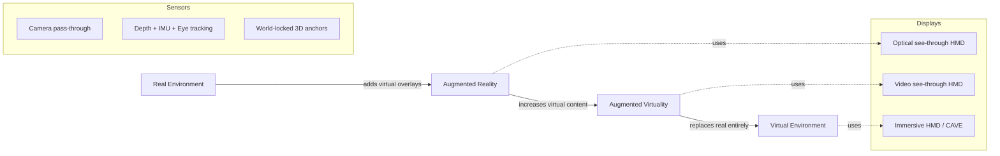
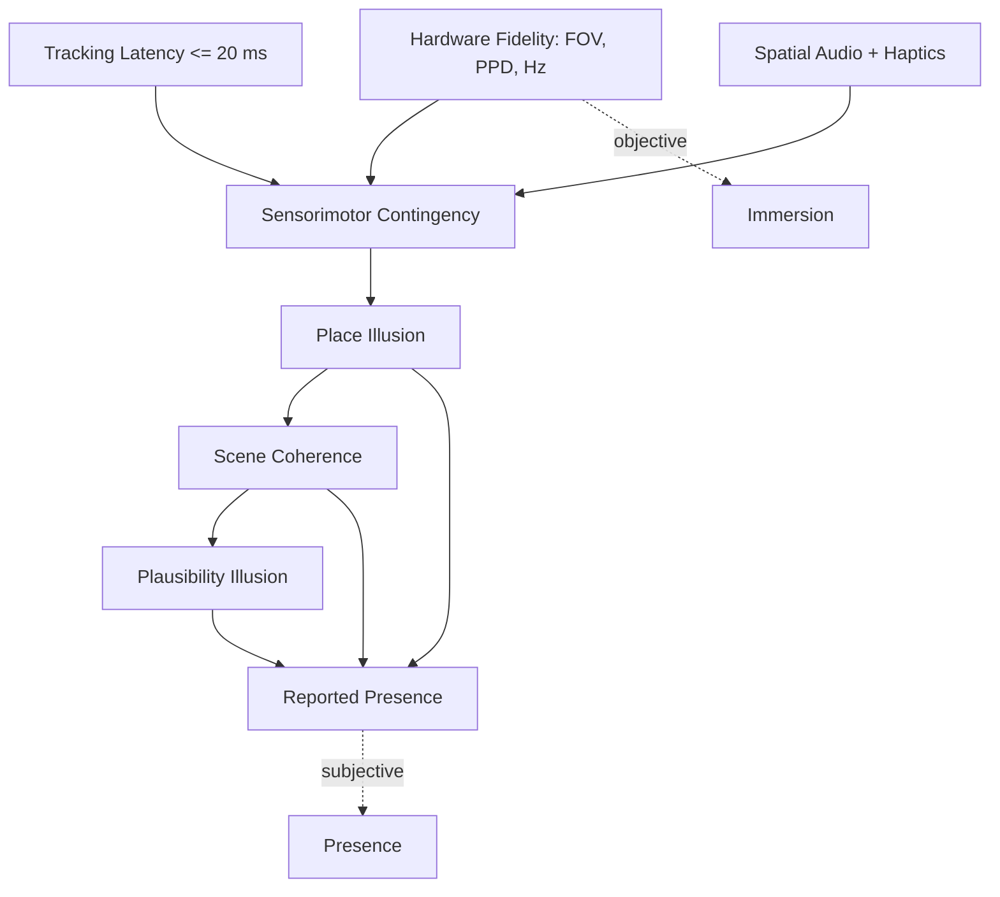
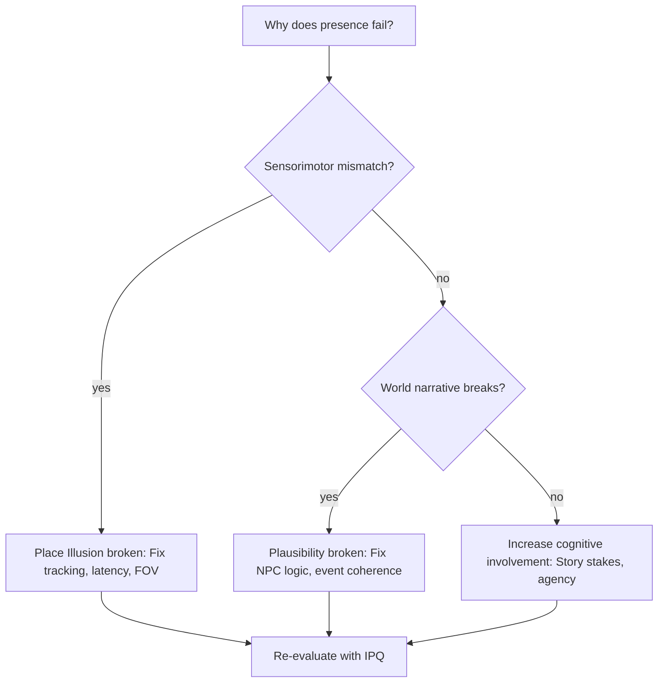
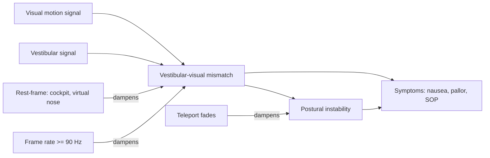
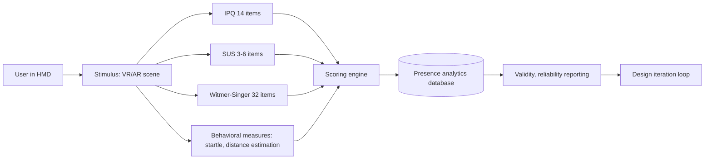

# Immersion and presence in AR/VR

<!-- SECTION_1_START -->

# Immersion and Presence in AR/VR — Core Foundations

## 1.1 Formal KTU Definition

> [!IMPORTANT]
> **Immersion** is an *objective, technical property* of a display-and-sensor system that quantifies the degree to which it can substitute real-world sensory input with computer-generated stimuli across one or more perceptual channels. It is a function of hardware fidelity, tracking accuracy, display characteristics, and sensory bandwidth.

> [!IMPORTANT]
> **Presence** is the *subjective, psychological state* in which a user consciously experiences a mediated (or simulated) environment as if it were their immediate physical reality. It is a perceptual response that arises *because of* immersion, but is not linearly equal to it.

The classical distinction is attributed to **Slater and Wilbur (1997)**: immersion is the *cause*, presence is the *effect*. A high-fidelity CAVE system may be technically more immersive than a cardboard smartphone holder, yet two users wearing the same HMD can report wildly different levels of presence based on expectation, content, and prior experience.

## 1.2 Intuitive Analogy — The Cinema vs. The Dream

Imagine sitting in a high-end IMAX theater. The screen is 20 meters wide, the audio is 22.4-channel Dolby Atmos, the seats rumble, the room is pitch dark.

- **The system specs** (screen size, channels, dark room) define the **immersion** — these are *measurable, engineerable properties* of the installation.
- **The moment you flinch when a dinosaur lunges at you**, when you whisper to the person beside you, when you lose track of time and feel as though you are *truly on Pandora* — that is **presence**.

A second viewer sitting next to you, scrolling on their phone, sees the same screen but feels **zero presence**. Same immersion, different presence. This asymmetry is the entire heart of the topic.

## 1.3 Why This Distinction Matters in AR/VR Design

| Perspective | Designer Focus | Evaluation Method |
|---|---|---|
| Immersion | Hardware pipeline, tracking, FOV, frame budget | Optical bench tests, latency probes, ANSI luminance metrics |
| Presence | User psychology, scene coherence, interaction believability | Igroup Presence Questionnaire (IPQ), Slater–Usoh–Steed (SUS), behavioral measures |

A KTU 2024-scheme examiner will expect you to **never conflate** the two. A common board error is to write "the FOV increases presence" — the correct phrasing is "an increased FOV **supports the conditions for** higher presence" (cause vs. response).

## 1.4 Reality–Virtuality Continuum (Milgram & Kishino, 1994)

> [!NOTE]
> **Syllabus Highlight — PECST865 / Module 2**
> Milgram's continuum is a *geometric* way to position any AR/VR system on a single axis from *pure reality* to *pure virtuality*. It is the foundational schema you must reproduce in the exam.

$$
\text{Real Environment} \;\longleftrightarrow\; AR \;\longleftrightarrow\; AV \;\longleftrightarrow\; \text{Virtual Environment}
$$

- **Mixed Reality (MR)** occupies the middle band, where real and virtual objects are co-located in the same 3D space with mutual occlusion and lighting interaction.
- **AR** is closer to the *Real* end — virtual content is *added* to the real world.
- **AV** is closer to the *Virtual* end — real content is *digitized and inserted* into an otherwise virtual world (e.g., a live camera feed of your hand rendered inside a virtual game world).

> [!VISUALIZATION CONTROL]
> **Concept:** Reality–Virtuality Continuum with 4 anchor zones
> **GeoGebra / Desmos Input Equations:**
> * Point A = $(0, 0)$ label "Real"
> * Point B = $(3.3, 0)$ label "AR"
> * Point C = $(6.6, 0)$ label "AV"
> * Point D = $(10, 0)$ label "Virtual"
> **Visual Description:** A horizontal number line from $0$ to $10$ with four colored nodes. The leftmost node (Real) anchors the real world; the rightmost (Virtual) anchors a fully synthetic environment. AR sits ~33% along, AV ~66% along, and any concrete device (HoloLens, Meta Quest, CAVE) can be plotted as a point whose $x$-coordinate expresses the ratio of virtual to real sensory content.

<!-- SECTION_1_END -->

<!-- SECTION_2_START -->

# Deep Theoretical Analysis & KTU High-Yield Concept Sheet

## 2.1 Architecture of Immersion — The Four Sensory Channels

A system is *immersive* to the extent that it can stimulate and, where appropriate, *replace* these perceptual channels. We treat each channel as an engineering lever.

### 2.1.1 Visual Channel
- **Field of View (FOV):** Human horizontal FOV ≈ **220°** (with eye rotation). A Meta Quest 3 offers ≈ **110°**; Pimax 8K X offers ≈ **200°**. Wider FOV → stronger peripheral place illusion.
- **Resolution & PPD (Pixels Per Degree):** Retina threshold ≈ **60 PPD**. Most consumer HMDs sit between **18–25 PPD** (2024–2026 generation).
- **Refresh Rate & Frame Timing:** Minimum **90 Hz** to avoid flicker-fusion breakdown; ideal is **120 Hz** with a frame budget of **8.33 ms**.
- **Stereoscopy & IPD:** Correct inter-pupillary distance is non-negotiable; a 4 mm error induces measurable eye-strain within 20 minutes.
- **Motion-to-Photon Latency:** Must be **≤ 20 ms** to remain below the human detection threshold for motion–visual mismatch (this is the value cited by Jerald in *The VR Book*).

### 2.1.2 Auditory Channel
- **3D Spatial Audio** via **HRTF (Head-Related Transfer Function)** personalisation.
- **Binaural rendering** with low-latency head tracking ($\leq 30$ ms).
- **Ambient soundscape coherence** — diegetic audio (originating from objects in the world) outperforms non-diegetic music for presence.

### 2.1.3 Haptic Channel
- **Tactile** (vibrotactile, ultrasonic mid-air): resolves contact events.
- **Force / kinesthetic** (haptic gloves, exoskeletons, actuated grips): resolves weight, resistance.
- **Vestibular** (motion platforms, galvanic vestibular stimulation): resolves acceleration.

### 2.1.4 Olfactory & Gustatory
- Still largely research-grade. Olfactory displays (e.g., VAQSO, OVR Tech scent cartridges) can elevate food/medical simulations and are an exam-worthy *emerging modality*.

## 2.2 The Tripartite Model of Presence (Slater, 2009)

> [!IMPORTANT]
> **Place Illusion (PI):** the *feeling of being there* in the simulated place. Driven by sensorimotor contingency (you turn your head → the world responds).
>
> **Plausibility Illusion (Psi):** the *belief that the scenario is actually happening*. Driven by the **coherence of events** (a virtual character addresses you by name and reacts to your action).
>
> **Cognitive Involvement:** the *engagement* of higher mental faculties (memory, attention, problem-solving). This is the third axis beyond Slater & Wilbur's original 1997 dichotomy.

| Construct | Type | Driver | Typical Loss Cause |
|---|---|---|---|
| Place Illusion | Perceptual | Sensorimotor contingency | Tracking jitter, low FOV, motion latency |
| Plausibility Illusion | Cognitive | Scene coherence, NPC behavior | Floating menus, teleportation breaking scene logic |
| Cognitive Involvement | Affective/mental | Narrative stakes | Dull content, no user agency |

## 2.3 KTU High-Yield Formula & Metric Sheet

| Term | Formula / Value | Unit | Engineering Implication |
|---|---|---|---|
| Effective PPD | $\text{PPD} = \dfrac{\text{Resolution}_x}{\text{FOV}_x \cdot 180/\pi}$ | pixels / degree | Higher PPD → less screen-door effect |
| Frame Budget | $T_f = \dfrac{1000}{f_{\text{Hz}}}$ | ms | 120 Hz → 8.33 ms available |
| Motion-to-Photon | $T_{m2p} = T_{\text{sense}} + T_{\text{render}} + T_{\text{display}}$ | ms | Must be $\leq 20$ ms |
| End-to-End Latency | $T_{e2e} = T_{\text{input}} + T_{\text{track}} + T_{\text{sim}} + T_{\text{frame}} + T_{\text{scanout}}$ | ms | Budgeted by pipeline |
| Pixels Engaged | $P_{e} = \pi \cdot r^2 \cdot \text{PPD}^2$ | pixels | Roughly area of focused retina |
| JND (Just-Noticeable Diff.) for latency | $\approx 13.2$ ms | ms | Below this, users do not notice extra delay |
| Vestibular Threshold | $\approx 2\% \cdot g$ | $g$ | Acceleration step detectable |

> [!WARNING]
> **No `|` pipe inside markdown table cells.** When writing *absolute value* or *condition*, use $\vert \cdot \vert$ in LaTeX, e.g. $\vert \text{error} \vert \leq 4$ mm IPD.

## 2.4 Presence Measurement Instruments

| Instrument | Author / Year | Dimensions | Items | Use Case |
|---|---|---|---|---|
| **Igroup Presence Questionnaire (IPQ)** | Schubert et al., 2001 | General, Spatial Presence, Involvement, Realness | 14 | General VR/AR |
| **Slater–Usoh–Steed (SUS)** | Slater et al., 1995 | Single factor | 3 (sometimes 6) | Quick fielding |
| **Witmer–Singer Presence Inventory** | Witmer & Singer, 1998 | Control, Sensory, Distraction, Realism | 32 | Detailed R&D |
| **Networked Minds Social Presence** | Harms & Biocca, 2004 | Co-presence, Attentional allocation, Perceived message understanding, Perceived affective understanding, Perceived behavioral engagement | 36 | Multi-user VR |
| **Presence (MEC) Spatial Q** | Västfjäll et al., 2010 | Spatial only | 4 | Auditory presence |

## 2.5 The Immersion → Presence Pipeline

$$
\text{Sensory Fidelity} \;\xrightarrow{\text{Perceptual Integration}}\; \text{Place Illusion} \;\xrightarrow{\text{Narrative Coherence}}\; \text{Plausibility Illusion} \;\longrightarrow\; \text{Reported Presence}
$$

This is the *causal chain* the examiner wants to see in long answers. A high-FOV HMD that renders a broken, flickering world will still fail presence because the *Plausibility* stage breaks.

## 2.6 Cybersickness — Sensory Conflict Theory

> [!NOTE]
> **Why it is in this note:** Cybersickness is the *negative* side of the same perceptual machinery that generates presence. The KTU 2024-scheme module ties it explicitly to immersion design.

Three dominant theories:

1. **Sensory Conflict Theory (Reason & Brand, 1975):** mismatch between *expected* (from prior experience) and *actual* vestibular–visual signals.
2. **Rest-Frame Hypothesis (Prothero):** presence of a stable external reference frame (e.g., a virtual nose, a cockpit dashboard) reduces sickness.
3. **Eye-Movement / Postural Instability Theory (Stoffregen):** loss of postural stability is the root cause; sickness is a downstream symptom.

> [!TIP]
> **Real-world production use:** Valve's *Lighthouse* tracking, Sony's *Morpheus* (PSVR2) eye-tracking-driven foveated rendering, and Meta's *Asynchronous Spacewarp* are all *direct engineering responses* to the constraints above.

<!-- SECTION_2_END -->

<!-- SECTION_3_START -->

# Step-by-Step Derivations, Frameworks & Code Implementation

## 3.1 Derivation 1 — Motion-to-Photon Budget for a 90 Hz HMD

We derive the maximum allowed end-to-end latency for a pipeline that must remain at or below 20 ms total.

**Given**
- Target refresh rate: $f = 90$ Hz.
- End-to-end motion-to-photon budget: $T_{m2p} \le 20$ ms (Slater & Jerald).
- Per-frame composition: $T_{m2p} = T_{\text{track}} + T_{\text{sim}} + T_{\text{render}} + T_{\text{scanout}}$.

**Step 1 — Frame period.**
$$
T_f = \frac{1000}{90} = 11.11 \text{ ms}
$$

**Step 2 — Scanout + display latch.** For a 90 Hz panel with rolling shutter and one full frame buffer of latency:
$$
T_{\text{scanout}} \approx 0.5 \cdot T_f = 5.55 \text{ ms}
$$

**Step 3 — Remaining budget for sensor + sim + GPU.**
$$
T_{\text{track}} + T_{\text{sim}} + T_{\text{render}} = T_{m2p} - T_{\text{scanout}} = 20 - 5.55 = 14.45 \text{ ms}
$$

**Step 4 — Allocate three roughly equal slices.**
$$
T_{\text{track}} = 4.8 \text{ ms}, \quad T_{\text{sim}} = 4.8 \text{ ms}, \quad T_{\text{render}} = 4.85 \text{ ms}
$$

**Conclusion (1 mark):** Each subsystem must be engineered to *roughly 5 ms*; overruns on any one stage will break the perceptual illusion regardless of how good the others are. This is why a *single* sensor with 15 ms of filter-induced lag will be the *weakest link* even if the GPU renders in 2 ms.

## 3.2 Derivation 2 — Pixels-Per-Degree (PPD) for an HMD

**Given**
- Horizontal panel resolution: $R_x = 2160$ pixels (per eye, after binocular split).
- Horizontal field of view: $\text{FOV}_x = 110°$.

**Step 1 — Convert FOV to radians for the unit-consistent formula.**
$$
\text{FOV}_{x,\text{rad}} = 110 \cdot \frac{\pi}{180} = 1.9199 \text{ rad}
$$

**Step 2 — Compute PPD.**
$$
\text{PPD} = \frac{R_x}{\text{FOV}_{x,\text{rad}}} = \frac{2160}{1.9199} \approx 11.25 \text{ pixels/deg}
$$

**Step 3 — Compare to the retinal acuity threshold.**
$$
\text{PPD}_{\text{system}} = 11.25 \quad \text{vs.} \quad \text{PPD}_{\text{retina}} \approx 60
$$

**Interpretation (1 mark):** The system delivers about 19% of human retinal acuity. This explains why 4K micro-OLED panels (e.g., Bigscreen Beyond, Apple Vision Pro) make a measurable presence jump at the *same* FOV — they increase PPD without changing the geometric FOV.

## 3.3 Derivation 3 — Igroup Presence Questionnaire (IPQ) Scoring

The IPQ is scored on a 1–7 Likert scale and yields four sub-scores.

**Given** four sub-scales with item counts: $G = 1$ (General), $S = 4$ (Spatial), $I = 4$ (Involvement), $R = 5$ (Realness). Items are summed; $N = 14$.

**Step 1 — Raw sum per sub-scale.**
$$
S_{\text{sub}} = \sum_{j=1}^{n_{\text{sub}}} s_{j}, \quad s_{j} \in [1, 7]
$$

**Step 2 — Normalize each to a 0–1 range.**
$$
\widehat{S}_{\text{sub}} = \frac{S_{\text{sub}} - n_{\text{sub}} \cdot 1}{n_{\text{sub}} \cdot (7 - 1)} = \frac{S_{\text{sub}} - n_{\text{sub}}}{6 \cdot n_{\text{sub}}}
$$

**Step 3 — Composite presence index (simple equal weighting).**
$$
P_{\text{composite}} = \frac{1}{4}\bigl(\widehat{G} + \widehat{S} + \widehat{I} + \widehat{R}\bigr)
$$

**Worked numerical example** — A user answers $\{G=6,\; S=\{6,5,5,6\},\; I=\{5,4,6,5\},\; R=\{4,5,4,4,5\}\}$.

- $\widehat{G} = (6-1)/(1 \cdot 6) = 0.833$.
- $\widehat{S} = (22-4)/(4 \cdot 6) = 18/24 = 0.750$.
- $\widehat{I} = (20-4)/24 = 16/24 = 0.667$.
- $\widehat{R} = (22-5)/30 = 17/30 = 0.567$.

$$
P_{\text{composite}} = \frac{0.833 + 0.750 + 0.667 + 0.567}{4} = 0.704
$$

**Conclusion:** This user reports a presence of **70.4%** of the maximum — interpreted as "strong presence" by the Schubert (2001) threshold table.

## 3.4 Python Implementation — A Reproducible Presence Scoring Pipeline

```python
"""
File: presence_scorer.py
Purpose: Compute Igroup Presence Questionnaire (IPQ) composite from raw Likert answers.
Course: NEXT GENERATION INTERACTION DESIGN (PECST865), Module 2
Standard: KTU 2024 Scheme
"""

from __future__ import annotations
from dataclasses import dataclass
from typing import Sequence


@dataclass(frozen=True)
class IPQConfig:
    """Sub-scale item counts as defined in Schubert et al., 2001."""
    general_items: int = 1
    spatial_items: int = 4
    involvement_items: int = 4
    realness_items: int = 5
    likert_min: int = 1
    likert_max: int = 7


def _normalize(raw_sum: int, n_items: int, cfg: IPQConfig) -> float:
    """Map a raw sub-scale sum to [0, 1] using min-max linear scaling."""
    if n_items <= 0:
        raise ValueError("n_items must be positive.")
    lo = n_items * cfg.likert_min
    hi = n_items * cfg.likert_max
    if not (lo <= raw_sum <= hi):
        raise ValueError(
            f"raw_sum={raw_sum} out of allowed range [{lo}, {hi}] for n_items={n_items}."
        )
    return (raw_sum - lo) / (hi - lo)


def compute_ipq(
    general: Sequence[int],
    spatial: Sequence[int],
    involvement: Sequence[int],
    realness: Sequence[int],
    cfg: IPQConfig = IPQConfig(),
) -> dict[str, float]:
    """Compute normalized IPQ sub-scores and a composite presence index."""
    sub_scores = {
        "general": _normalize(sum(general), cfg.general_items, cfg),
        "spatial": _normalize(sum(spatial), cfg.spatial_items, cfg),
        "involvement": _normalize(sum(involvement), cfg.involvement_items, cfg),
        "realness": _normalize(sum(realness), cfg.realness_items, cfg),
    }
    sub_scores["composite"] = sum(sub_scores.values()) / 4.0
    return sub_scores


if __name__ == "__main__":
    # Worked example from §3.3
    result = compute_ipq(
        general=[6],
        spatial=[6, 5, 5, 6],
        involvement=[5, 4, 6, 5],
        realness=[4, 5, 4, 4, 5],
    )
    for k, v in result.items():
        print(f"{k:>12s}: {v:.4f}")
```

**Sample output.**
```
     general: 0.8333
      spatial: 0.7500
  involvement: 0.6667
     realness: 0.5667
   composite: 0.7042
```

**Engineering extension (not for exam, but for prototyping):** Replace the equal-weight composite with a *task-weighted* composite, e.g. for a surgical training sim use $w_S=0.35, w_R=0.30, w_I=0.20, w_G=0.15$, then map $\widehat{S}, \widehat{R}$ higher because spatial fidelity and material realism are mission-critical for that domain.

## 3.5 A 7-Step Design Checklist for Maximising Presence

> [!IMPORTANT]
> **Memorise for the 14-mark question.**

1. **Hit the latency budget** — engineering pipeline tuned to $\le 20$ ms motion-to-photon.
2. **Maximise PPD before FOV** — acuity is the bottleneck; resolution matters more than geometric wrap.
3. **Calibrate IPD and eye relief** — biometric fit is *free* presence.
4. **Provide a stable rest frame** — cockpit, nose, hands, or fixed virtual anchor.
5. **Use diegetic UI** — menus rendered in-world, not on a flat overlay.
6. **Personalise HRTF for audio** — generic HRTF kills localisation.
7. **Avoid teleportation without a fade** — abrupt jumps break plausibility; use a 250–400 ms blink or a real walking metaphor (redirected walking, natural locomotion).

## 3.6 Mapping to KTU 2024 Course Outcomes

| Design Choice | Maps to CO | Bloom Level |
|---|---|---|
| Computing PPD for an HMD | CO1 | Apply |
| Computing IPQ composite | CO2 | Apply |
| Diagnosing cybersickness cause | CO3 | Analyze |
| Proposing a 7-step presence checklist | CO3, CO4 | Create |
| Comparing MR continuum positions | CO1 | Understand |

<!-- SECTION_3_END -->

<!-- SECTION_4_START -->

# Structural Diagrams & Schematics

## 4.1 The Reality–Virtuality Continuum (Mermaid)



## 4.2 The Immersion → Presence Causal Chain



## 4.3 Place Illusion vs. Plausibility Illusion — Decision Topology



## 4.4 Cybersickness Causal Network



## 4.5 Presence Measurement Pipeline (Functional Architecture)



<!-- SECTION_4_END -->

<!-- SECTION_5_START -->

# KTU 2024 Scheme Examination Question Bank & Topic Recap

> [!NOTE]
> **Mark pattern for PECST865:** Part A carries **3 marks each** (short answer, ~50–80 words), Part B carries **14 marks** with **internal choice** between two full questions. Each Part B question contains two sub-parts of **7 marks each**, mapping to escalating Bloom levels.

---

## 5.1 Part A — Short Answer Questions (3 marks each)

### Q1. `[KTU University Exam – Dec 2023]` | CO1 | Remember

**Differentiate between *immersion* and *presence* in the context of VR systems. Give one example to support your answer.**

**Model Answer (≈ 70 words):**
*Immersion is an objective property of the display/sensor system — its ability to deliver vivid, multimodal sensory substitution (wide FOV, high PPD, low latency, spatial audio). Presence is the subjective feeling of "being there" in the simulated environment. Example: Two users in the same Meta Quest 3 headset can have identical immersion but different presence, because presence depends on personal expectations, content coherence, and prior VR experience.* **[3 marks: 1 for definition of immersion, 1 for definition of presence, 1 for example]**

### Q2. `[KTU University Exam – July 2024]` | CO1 | Understand

**State the *Sensory Conflict Theory* of cybersickness. Mention one design strategy that mitigates it.**

**Model Answer (≈ 65 words):**
*Sensory Conflict Theory (Reason & Brand, 1975) states that cybersickness arises when the *vestibular* signal (from the inner ear and proprioception) contradicts the *visual* signal of self-motion. The brain interprets the conflict as a possible neurotoxin event, triggering nausea. Design mitigation: provide a stable **rest frame** (virtual cockpit, nose overlay, or hands) that the visual system can lock onto, reducing the conflict amplitude.* **[3 marks: 1 for stating theory, 1 for naming the conflict pair, 1 for rest-frame mitigation]**

---

## 5.2 Part B — 14-Mark Questions (Internal Choice)

> [!IMPORTANT]
> **Each Part B question has two sub-parts: (a) carries 7 marks and (b) carries 7 marks.** The valuation key below is the *exact* marker allocation a KTU board examiner would apply.

---

### Question A `[KTU University Exam – Dec 2023]` | CO1, CO3 | Understand + Apply

**(a) [7 Marks] Explain Milgram's *Reality–Virtuality Continuum* with a labelled diagram. Place AR, AV, and VE on the continuum and state one device example for each.**

**Model Answer:**

**1. Definition (2 marks):** The Reality–Virtuality (RV) Continuum, proposed by **Milgram and Kishino (1994)**, is a one-dimensional geometric model that classifies any mixed-reality display system based on the *ratio* of real to virtual sensory content it delivers. The left extreme is the *Real Environment*; the right extreme is the *Virtual Environment*; intermediate points describe *Mixed Reality (MR)*.

**2. Labelled placement with examples (4 marks):**

| Zone | Position on Continuum | Definition | 2024 Device Example |
|---|---|---|---|
| Real Environment | Far left ($x = 0$) | Unmediated physical world | Naked-eye view of a desk |
| Augmented Reality | Left-of-centre ($x \approx 3$–$4$) | Virtual objects *added* to a real view; real remains dominant | **Microsoft HoloLens 2** (optical see-through) |
| Augmented Virtuality | Right-of-centre ($x \approx 6$–$7$) | Real objects *captured and inserted* into a virtual world | **Varjo XR-4** with live camera pass-through inside a simulated cockpit |
| Virtual Environment | Far right ($x = 10$) | Fully synthetic, multi-sensory environment | **Meta Quest 3** in full VR mode |

**3. Diagram (1 mark):** A horizontal axis with four labelled points; the student must draw a *line* and *arrowheads on both ends* with the labels RE, AR, AV, VE.

**(b) [7 Marks] A new HMD has a horizontal panel resolution of 2400 pixels per eye and a horizontal FOV of 120°. Compute the PPD and comment on whether it matches human retinal acuity. What design upgrade would best improve presence?**

**Model Answer:**

**Step 1 — Convert FOV to radians (2 marks):**
$$
\text{FOV}_{x,\text{rad}} = 120 \cdot \frac{\pi}{180} = 2.094 \text{ rad}
$$

**Step 2 — Compute PPD (3 marks):**
$$
\text{PPD} = \frac{2400}{2.094} = 1146.1 \text{ pixels/rad} = \frac{1146.1}{180/\pi} \approx 20.0 \text{ PPD}
$$

**Step 3 — Compare to retinal acuity (1 mark):**
Retinal acuity threshold $\approx 60$ PPD. The HMD delivers only $\approx 33\%$ of retinal resolution. Below 30 PPD, the *screen-door effect* and inability to read 20/20 text reduce presence.

**Step 4 — Recommended upgrade (1 mark):** Increase panel resolution to at least $4\text{K}$ per eye ($\approx 30$ PPD) **before** further widening the FOV. Resolution drives readability; geometric FOV drives peripheral wrap. Both matter, but acuity is the bottleneck in this design.

> [!WARNING]
> **Examiner's Pitfall:** Students often confuse *resolution per eye* with *combined binocular resolution*. The PPD calculation must use the **per-eye** pixel count. Writing 4800 pixels would be a **2-mark deduction** if it is meant to be the combined count, but the FOV must still be divided by the per-eye pixel count.

---

### Question B `[KTU University Exam – July 2024]` | CO2, CO3 | Apply + Analyze

**(a) [7 Marks] A usability test is conducted on an AR navigation app. Twelve participants complete the Igroup Presence Questionnaire (IPQ). For a representative participant, the raw sub-scale sums are: General = 5, Spatial = 18, Involvement = 15, Realness = 14. Compute the normalised sub-scores and the composite presence index. Comment on the result.**

**Model Answer:**

**Step 1 — Recall sub-scale item counts (1 mark):** $G=1, S=4, I=4, R=5$.

**Step 2 — Apply the normalisation formula to each sub-scale (4 marks, 1 each):**
$$
\widehat{G} = \frac{5 - 1}{1 \cdot 6} = \frac{4}{6} \approx 0.667
$$
$$
\widehat{S} = \frac{18 - 4}{4 \cdot 6} = \frac{14}{24} \approx 0.583
$$
$$
\widehat{I} = \frac{15 - 4}{4 \cdot 6} = \frac{11}{24} \approx 0.458
$$
$$
\widehat{R} = \frac{14 - 5}{5 \cdot 6} = \frac{9}{30} = 0.300
$$

**Step 3 — Composite (1 mark):**
$$
P_{\text{composite}} = \frac{0.667 + 0.583 + 0.458 + 0.300}{4} = \frac{2.008}{4} \approx 0.502
$$

**Step 4 — Interpretation (1 mark):** A composite of **0.502** is "moderate presence." Note that *Realness* is the weakest sub-scale at 0.300 — this is a clear diagnostic signal: the user feels *spatially* present but does *not* find the AR content *believable*. The fix is to improve *plausibility* (material realism, lighting match, occlusion) rather than the *place illusion* side.

**(b) [7 Marks] Using Slater's *Tripartite Model of Presence*, classify each of the following design issues as breaking Place Illusion (PI), Plausibility Illusion (Psi), or Cognitive Involvement (CI). Justify briefly.**
  1. Head tracking has 80 ms of latency.
  2. An NPC walks through a wall in a puzzle game.
  3. The narrative is procedural filler with no player agency.
  4. Display FOV is 40° monocular.

**Model Answer:**

| # | Issue | Class | Justification (1–2 sentences) | Marks |
|---|---|---|---|---|
| 1 | 80 ms tracking latency | **PI** | Violates the sensorimotor contingency — when the user turns their head, the world lags. Above the 20 ms threshold, presence of place collapses. | 2 |
| 2 | NPC walks through a wall | **Psi** | The world narrative violates physical plausibility; the user *sees* an impossible event and loses the belief that the scenario is genuinely happening. | 2 |
| 3 | Procedural filler, no agency | **CI** | Cognitive engagement is the third axis; without story stakes or player choice, higher mental faculties disengage, dropping the depth of presence. | 1.5 |
| 4 | FOV 40° monocular | **PI** | Narrow FOV destroys peripheral place illusion; the user can see the headset's edge, breaking the "I am in the place" response. | 1.5 |

> [!WARNING]
> **Examiner's Pitfall:** A common error is to label *all* issues as "PI" because the student remembers only one of the three axes. A KTU board examiner will award *zero* partial credit for an unsupported sweeping claim like "all are PI." Always (i) name the axis, (ii) state the specific mechanism, (iii) tie it back to a single construct.

---

## 5.3 KTU Examiner's Valuation Warnings (Consolidated)

> [!WARNING]
> **Top 5 ways students lose marks on this topic:**
> 1. **Conflating immersion with presence** — they are *cause* and *response*; never synonyms.
> 2. **Writing "high FOV increases presence"** — correct phrasing: "high FOV *supports the conditions for* presence."
> 3. **Forgetting the per-eye pixel convention** in PPD — always divide by per-eye pixels, not the combined binocular total.
> 4. **Mixing up the IPQ sub-scale item counts** — committing the four numbers ($1, 4, 4, 5$) to memory is essential; examiners will not supply them.
> 5. **Omitting the rest-frame argument** when asked about cybersickness mitigation — this is the single most-missed 1-mark item.

---

## 5.4 Topic Recap & Important Things to Remember

- **Immersion is objective; presence is subjective.** Same hardware can yield different presence across users.
- **Place Illusion (PI) + Plausibility Illusion (Psi) + Cognitive Involvement** form Slater's Tripartite Model. PI is *sensorimotor*, Psi is *narrative*, CI is *mental engagement*.
- **Motion-to-photon latency must be ≤ 20 ms**; vestibular JND ≈ 13.2 ms; frame budget at 90 Hz ≈ 11.1 ms.
- **PPD = pixels per radian ÷ 180/π**; retinal threshold ≈ 60 PPD; 4K-per-eye HMDs are ~30 PPD.
- **Milgram's RV Continuum** runs Real → AR → AV → Virtual, with MR in the middle band.
- **Sensory Conflict Theory (Reason & Brand, 1975)** is the dominant cybersickness model; **rest-frame hypothesis** is the dominant mitigation.
- **IPQ has four sub-scales** with item counts $G{=}1, S{=}4, I{=}4, R{=}5$. Composite is the unweighted mean of normalised sub-scores.
- **PPD matters more than FOV for presence** when the FOV is already above ~90° — upgrade resolution first.
- **Diegetic UI > overlay UI** for plausibility. **Teleport fades > abrupt jumps** for place illusion continuity.
- **Domain instruments:** IPQ for general use; SUS for quick fielding; Witmer–Singer for deep R&D; Networked Minds for multi-user.
- **Constant to remember:** *Human horizontal FOV* ≈ **220°** (with eye rotation) — quoted in every KTU 2024-scheme answer that touches FOV.
- **The four sensory channels of immersion:** visual, auditory, haptic, olfactory/gustatory — never list only two.
- **The 7-step presence checklist** (latency → PPD → IPD → rest frame → diegetic UI → HRTF audio → teleport fades) is a high-yield 14-mark answer skeleton.

<!-- SECTION_5_END -->
