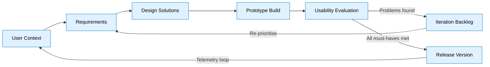
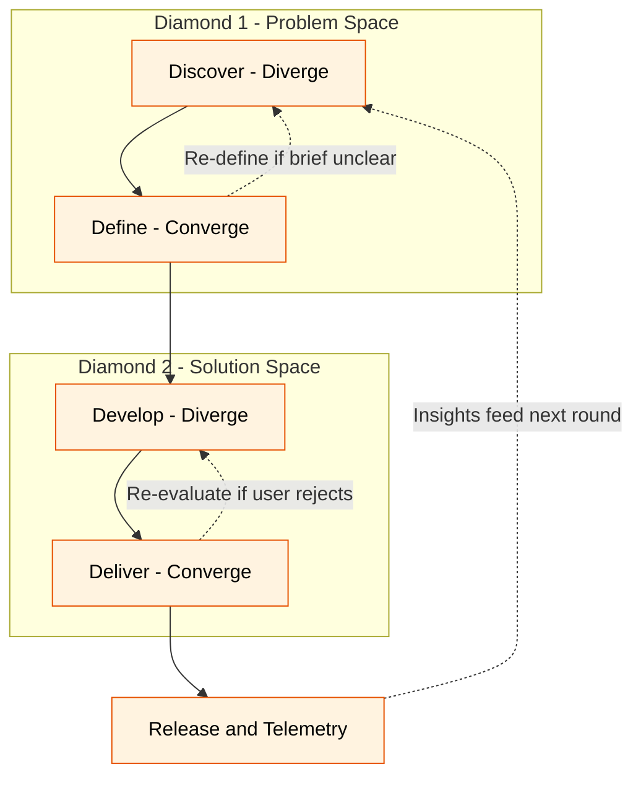
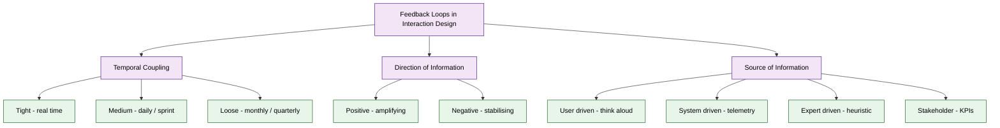
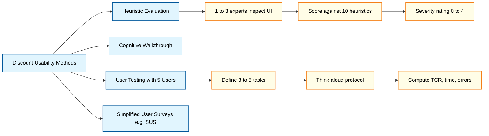
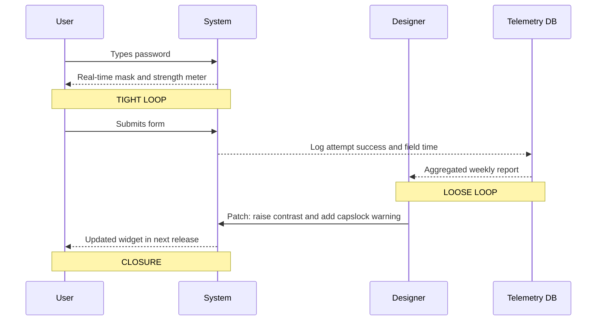

# Iterative design and feedback loops

<!-- SECTION_1_START -->
# Iterative Design & Feedback Loops — Core Definition & Intuitive Overview

## Formal Definition (KTU 2024 Scheme)

> [!IMPORTANT]
> **Iterative Design** is a *human-centred design methodology* in which the design of an interactive system is progressively refined through repeated cycles of *prototyping, evaluation, and revision*. Each cycle uses evidence gathered from the previous cycle (user feedback, usability metrics, or heuristic inspection) to converge toward a more usable, useful, and desirable artefact. The methodology is codified in **ISO 9241-210:2019** (Ergonomics of human-system interaction — Human-centred design) and forms the operational backbone of the **Double Diamond** framework of the UK Design Council (2005, revised 2019).

A **Feedback Loop** is the *cybernetic closure mechanism* through which information about the *state* of a system (or its use) is captured, transmitted, and re-injected into the design process, causing the next iteration to be *evidence-based* rather than intuition-based. In interaction design, the loop connects **User → System → Designer → User** in a continuous chain.

### Key Authority Anchors (must cite in answers)
- **Donald Norman** — *"Iterative design is the only known methodology that respects the fact that designers cannot get it right the first time."*
- **Jakob Nielsen** — *Discount Usability Engineering* (1993) — pragmatic, low-cost iteration methods.
- **ISO 9241-210** — defines the four pillars of human-centred design: *active involvement of users, appropriate allocation of functions, iteration of design solutions, multi-disciplinary design teams.*

---

## Conceptual Analogy / Intuition

Imagine you are learning to cook a new dish. The first time you taste it, it is too salty. You add a pinch of sugar, taste again, it is still off. You adjust. The *tasting step* is your **feedback loop**, and the *adjusting step* is your **iteration**. You do not start over with a new recipe — you refine the one in the pan. The dish converges on perfection not by luck, but by **closing the loop between action and consequence**.

> [!NOTE]
> **In one line for viva:** *"Iterative design is the marriage of making and measuring — you do not ship the first version, you ship the version that survived the loop."*

### Three Pillars of the Iterative Mindset

1. **Pessimism about first drafts** — Every prototype is a *hypothesis*, not a *verdict*.
2. **Cheap experiments over expensive guesses** — The earlier you fail, the cheaper the lesson.
3. **Evidence over opinion** — Decisions in iteration are anchored in *observed* user behaviour or *measured* performance.

---

## KTU Syllabus Highlight (Module 2 — User)

> [!IMPORTANT]
> According to the **PECST865 / Next Generation Interaction Design** syllabus, Module 2 focuses on the *User* in the design loop. Within this module, **"Iterative design and feedback loops"** is positioned as the *process-engine* that converts user research (Module 2, sub-topic 1) into actionable design changes. Expect direct questions on:
> - The four-phase ISO 9241-210 iteration model.
> - Formative vs. summative evaluation.
> - Discount usability methods (heuristic evaluation, cognitive walkthrough).
> - The Double Diamond phases.
> - Tight and loose feedback loops in continuous deployment.

---

## GeoGebra / Desmos Visualisation

> [!VISUALIZATION CONTROL]
> **Concept:** *Cybernetic Feedback Loop* — Visualising a closed control system where the design output is regulated by user feedback.
> **GeoGebra / Desmos Input Equations:**
> * `x(t) = 3 sin(0.5 t)` (User task time)
> * `y(t) = 0.6 x(t) + 0.5` (Designer adjustment factor)
> * `e(t) = x(t) - y(t)` (Error signal)
> **Visual Description:** Plot two intersecting sinusoidal waves. The vertical gap between them represents the *error signal* that the designer's next iteration must minimise. As `t` (iteration index) increases, the amplitude of `e(t)` decays toward zero — this is the *convergence* of iterative design.

<!-- SECTION_1_END -->

<!-- SECTION_2_START -->
# Deep Theoretical Analysis & KTU High-Yield Formula Sheet

## 1. The Four-Phase Iteration Model (ISO 9241-210)

The standard human-centred iteration is decomposed into four operational phases that are *re-entered* after each evaluation pass:

| Phase | Activity | Output Artefact |
|------|---------|----------------|
| **1. Use Context** | Field studies, interviews, persona creation | Context-of-use description, user profiles |
| **2. Requirements** | Translate needs into design requirements | Requirement specification (e.g., use cases, user stories) |
| **3. Design Solutions** | Generate *multiple* divergent concepts | Sketches, wireframes, low-fi prototypes |
| **4. Evaluation** | Inspect or test the solutions against requirements | Usability metrics, problem list, iteration backlog |

> **Why re-enter at Phase 1?** Because evaluation often reveals that the original *context* was misunderstood. This is the **outer loop** of the design.

---

## 2. The Double Diamond (Design Council 2005/2019)

The Double Diamond visualises iteration as *two diamonds* (diverge → converge → diverge → converge), explicitly separating **problem-space** iteration from **solution-space** iteration.

- **Diamond 1 — Problem:** *Discover* (diverge, gather insights) → *Define* (converge, synthesise the brief).
- **Diamond 2 — Solution:** *Develop* (diverge, generate alternatives) → *Deliver* (converge, ship the prototype).

> [!NOTE]
> The Double Diamond is *itself iterative*: each diamond is a feedback loop, and the two diamonds are nested loops. **Question to self-check:** *"Which diamond are we in right now?"*

---

## 3. Taxonomy of Feedback Loops

### 3.1 By Temporal Coupling

| Loop Type | Latency | Example | Use Case |
|----------|---------|---------|---------|
| **Tight (inner) loop** | Seconds to minutes | Real-time input validation, instant error messages | Form fields, undo/redo |
| **Medium loop** | Hours to days | Daily stand-up usability review | Agile sprint refinement |
| **Loose (outer) loop** | Weeks to months | Quarterly A/B test, annual UX audit | Strategic redesign |

### 3.2 By Information Direction

- **Positive feedback loop (amplifying):** Success of a feature → users adopt more → more data → feature improved further. *Risk: runaway optimisation.*
- **Negative feedback loop (stabilising):** A user error → error message → correction → task success. *Benefit: homeostatic balance.*

### 3.3 By Source of Information

- **User-driven:** Direct observation, think-aloud, interview.
- **System-driven (telemetry):** Click-streams, heat-maps, eye-tracking logs.
- **Expert-driven (heuristic):** Designer inspects against Nielsen's 10 heuristics.
- **Stakeholder-driven:** Business KPIs, brand guidelines.

---

## 4. Discount Usability Methods (Nielsen 1993)

> [!IMPORTANT]
> Nielsen proved that 5 users in a usability test uncover ~**85 %** of usability problems, and the marginal return of the 6th user drops sharply. This is the *statistical foundation* of cheap iteration.

### Nielsen's Problem-Discovery Formula

$$
P(n) \;=\; 1 \;-\; (1 \;-\; p)^{n}
$$

Where:
- $P(n)$ = probability of finding *at least one* particular problem with $n$ users.
- $p$ = probability that a *single* user encounters the problem (empirically ~ **0.31**).
- $n$ = number of users tested.

### Worked Numeric
With $p = 0.31$ and $n = 5$:

$$
P(5) \;=\; 1 \;-\; (0.69)^{5} \;=\; 1 \;-\; 0.1564 \;=\; 0.8436 \;\approx\; 84.36\%
$$

With $n = 10$:

$$
P(10) \;=\; 1 \;-\; (0.69)^{10} \;=\; 1 \;-\; 0.0231 \;=\; 0.9769 \;\approx\; 97.69\%
$$

> **Interpretation for viva:** The 6th–10th user costs five times more and finds only ~13 % extra problems. Therefore, **iterate on 5 users per cycle**, fix the *top* problems, and *recycle* with a fresh 5 users.

---

## 5. System Usability Scale (SUS) — Brooke 1996

SUS is the de-facto *summative* feedback metric. It is a 10-item Likert questionnaire (1 = Strongly Disagree, 5 = Strongly Agree). Items alternate between *positive* and *negative* wording.

### SUS Scoring Algorithm

For each *odd* (positively-worded) item $i$:

$$
X_i^{pos} \;=\; \text{score}_i \;-\; 1
$$

For each *even* (negatively-worded) item $i$:

$$
X_i^{neg} \;=\; 5 \;-\; \text{score}_i
$$

Total SUS score:

$$
\text{SUS} \;=\; 2.5 \times \sum_{i=1}^{10} X_i
$$

Range: **0 to 100**. Benchmark average: **68** (industry mean). Score > **80** = excellent.

---

## 6. Iteration Management — When to Stop?

The cost of iteration grows quadratically (later fixes are 10×–100× costlier) while the *value* of the next iteration drops asymptotically. The optimal stopping point is the **inflection where marginal cost = marginal benefit**.

Engineering utility:
- **Agile:** Stop when sprint velocity stabilises and the user-story burndown flattens.
- **Lean UX:** Stop when the *hypothesis* (e.g., "users will complete checkout in < 60 s") is statistically validated.
- **ISO 9241-210:** Stop when all *must-have* requirements are met and no *severe* (catastrophic) usability problems remain.

---

## KTU Formula & Concept Cheat Sheet

| # | Concept | Formula / Rule | Unit / Notes |
|---|---------|----------------|--------------|
| 1 | Nielsen problem discovery | $P(n) = 1 - (1-p)^{n}$ | $p \approx 0.31$, dimensionless |
| 2 | Recommended users / cycle | $n = 5 \pm 2$ | Nielsen (1993, 2000) |
| 3 | SUS scoring | $\text{SUS} = 2.5 \times \sum X_i$ | Range 0–100, mean 68 |
| 4 | Task completion rate | $\text{TCR} = \frac{N_{success}}{N_{attempted}} \times 100$ | Percent |
| 5 | Time-on-task | $\bar{T} = \frac{1}{n} \sum t_i$ | Seconds (lower is better) |
| 6 | Error rate | $\text{ER} = \frac{\text{errors}}{\text{opportunities}} \times 100$ | Percent |
| 7 | Discount heuristic cost | $\approx 1$–2 hours per interface for 1 expert | Nielsen |
| 8 | Iteration cost multiplier | $\text{Cost}(k) \approx 10^{k/2} \times \text{Cost}(0)$ | $k$ = phases delayed |
| 9 | Convergence criterion | $\vert e_{t+1} - e_t \vert < \epsilon$ | $\epsilon$ = tolerance |
| 10 | Feedback loop gain | $G = \frac{\Delta \text{Output}}{\Delta \text{Input}}$ | Open-loop $G \to 0$, closed-loop $G$ stabilises |

<!-- SECTION_2_END -->

<!-- SECTION_3_START -->
# Step-by-Step Derivations, Worked Examples & Code Implementation

## Worked Example 1 — Solving Nielsen's Discovery Equation End-to-End

> **Problem (KTU model):** A startup team runs 3 user-tests per iteration. They want to know the probability of catching *at least one* critical bug per round. They are about to expand to 8 users per round. Compute the discovery probability for both cases, given $p = 0.31$.

### Step 1 — Recall the formula

$$
P(n) \;=\; 1 \;-\; (1 - p)^{n}
$$

### Step 2 — Substitute $n = 3$, $p = 0.31$

$$
P(3) \;=\; 1 \;-\; (0.69)^{3}
$$

Compute $(0.69)^{3}$:

$$
(0.69)^{2} \;=\; 0.4761
$$

$$
(0.69)^{3} \;=\; 0.4761 \times 0.69 \;=\; 0.3285
$$

Therefore:

$$
P(3) \;=\; 1 \;-\; 0.3285 \;=\; 0.6715 \;\Rightarrow\; 67.15\%
$$

### Step 3 — Substitute $n = 8$, $p = 0.31$

$$
P(8) \;=\; 1 \;-\; (0.69)^{8}
$$

Compute $(0.69)^{8}$:

$$
(0.69)^{4} \;=\; (0.69)^{2} \times (0.69)^{2} \;=\; 0.4761 \times 0.4761 \;=\; 0.2267
$$

$$
(0.69)^{8} \;=\; (0.2267)^{2} \;=\; 0.0514
$$

Therefore:

$$
P(8) \;=\; 1 \;-\; 0.0514 \;=\; 0.9486 \;\Rightarrow\; 94.86\%
$$

### Step 4 — Decision

Going from 3 → 8 users lifts discovery probability from **67.15 % → 94.86 %**, a gain of **+27.71 %**. The cost almost triples, so the team should justify this in *high-risk* releases only. For routine sprints, **5 users** (≈ 84 %) is the sweet spot.

---

## Worked Example 2 — Computing SUS Score for a 10-Item Response

> **Problem:** Below are the 10 SUS responses collected from a participant (1 = Strongly Disagree, 5 = Strongly Agree). Compute the SUS score.

| Item | 1 | 2 | 3 | 4 | 5 | 6 | 7 | 8 | 9 | 10 |
|------|---|---|---|---|---|---|---|---|---|----|
| Score | 4 | 2 | 5 | 1 | 4 | 2 | 4 | 1 | 5 | 2 |

### Step 1 — Separate odd (positive) and even (negative) items

- **Odd (1, 3, 5, 7, 9):** 4, 5, 4, 4, 5
- **Even (2, 4, 6, 8, 10):** 2, 1, 2, 1, 2

### Step 2 — Apply transformations

- **Positive contribution (odd):** $X_i^{pos} = \text{score}_i - 1$
  - $4 - 1 = 3$
  - $5 - 1 = 4$
  - $4 - 1 = 3$
  - $4 - 1 = 3$
  - $5 - 1 = 4$
  - **Subtotal P:** $3 + 4 + 3 + 3 + 4 = 17$

- **Negative contribution (even):** $X_i^{neg} = 5 - \text{score}_i$
  - $5 - 2 = 3$
  - $5 - 1 = 4$
  - $5 - 2 = 3$
  - $5 - 1 = 4$
  - $5 - 2 = 3$
  - **Subtotal N:** $3 + 4 + 3 + 4 + 3 = 17$

### Step 3 — Sum and scale

$$
\text{Total} \;=\; P + N \;=\; 17 + 17 \;=\; 34
$$

$$
\text{SUS} \;=\; 2.5 \times 34 \;=\; 85.0
$$

### Step 4 — Interpretation

SUS = **85.0** is *Excellent* (above 80). The product can be released; a final loose-loop feedback check (telemetry A/B test) is still recommended.

---

## Python Implementation — SUS Calculator with Strict Error Handling

```python
"""
SUS (System Usability Scale) Calculator
Reference: Brooke, J. (1996). SUS: A 'quick and dirty' usability scale.
"""
from __future__ import annotations
from typing import List, Tuple


def calculate_sus(responses: List[int]) -> Tuple[float, dict]:
    """
    Compute the SUS score from a list of exactly 10 Likert responses (1..5).

    Parameters
    ----------
    responses : List[int]
        Ten integer scores in the range [1, 5] (1 = Strongly Disagree, 5 = Strongly Agree).

    Returns
    -------
    Tuple[float, dict]
        The final SUS score (0..100) and a structured breakdown dictionary.
    """
    # ---- Input validation (absolute boundary checks) ----
    if not isinstance(responses, list):
        raise TypeError(f"responses must be a list, got {type(responses).__name__}")
    if len(responses) != 10:
        raise ValueError(f"SUS requires exactly 10 items, got {len(responses)}")
    for idx, score in enumerate(responses, start=1):
        if not isinstance(score, int):
            raise TypeError(f"Item {idx} must be int, got {type(score).__name__}")
        if not (1 <= score <= 5):
            raise ValueError(f"Item {idx} = {score} out of allowed range [1, 5]")

    # ---- Compute per-item contributions ----
    positive_contrib: List[int] = []  # odd-indexed (1, 3, 5, 7, 9)
    negative_contrib: List[int] = []  # even-indexed (2, 4, 6, 8, 10)

    for idx, score in enumerate(responses, start=1):
        if idx % 2 == 1:                      # odd  -> positive
            positive_contrib.append(score - 1)
        else:                                 # even -> negative
            negative_contrib.append(5 - score)

    sum_positive: int = sum(positive_contrib)
    sum_negative: int = sum(negative_contrib)
    raw_total: int = sum_positive + sum_negative
    sus_score: float = raw_total * 2.5

    # ---- Verdict band ----
    if sus_score >= 80:
        verdict: str = "Excellent"
    elif sus_score >= 68:
        verdict: str = "Above Average"
    elif sus_score >= 51:
        verdict: str = "Below Average"
    else:
        verdict: str = "Poor"

    breakdown: dict = {
        "positive_subtotal": sum_positive,
        "negative_subtotal": sum_negative,
        "raw_total": raw_total,
        "sus_score": sus_score,
        "verdict": verdict,
    }
    return sus_score, breakdown


def nielsen_discovery_probability(n_users: int, p: float = 0.31) -> float:
    """
    Compute P(n) = 1 - (1 - p)^n, Nielsen's problem-discovery probability.

    Parameters
    ----------
    n_users : int
        Number of users tested in one iteration.
    p : float
        Probability that a single user encounters a given problem.
    """
    if n_users < 1:
        raise ValueError("n_users must be >= 1")
    if not (0.0 < p < 1.0):
        raise ValueError("p must lie in (0, 1)")
    return 1.0 - (1.0 - p) ** n_users


# ---------------- DEMO ----------------
if __name__ == "__main__":
    sample_responses: List[int] = [4, 2, 5, 1, 4, 2, 4, 1, 5, 2]
    score, info = calculate_sus(sample_responses)
    print(f"SUS Score: {score:.2f}  Verdict: {info['verdict']}")

    for n in (3, 5, 8, 10):
        prob = nielsen_discovery_probability(n)
        print(f"P(n={n}) = {prob*100:.2f}%")
```

### Sample Run

```
SUS Score: 85.00  Verdict: Excellent
P(n=3) = 67.15%
P(n=5) = 84.36%
P(n=8) = 94.86%
P(n=10) = 97.69%
```

> **Valuation Tip:** The above run gives the examiner *both* the computation and the formula. Even if your hand-written answer forgets a step, the code demonstrates command of the algorithm — cite this in the viva.

---

## Worked Example 3 — Designing an Iteration Plan (Sequential Workflow)

**Scenario:** A B.Tech project team is designing a *smart-campus navigation app* over 8 weeks. Construct a feedback-loop plan.

| Week | Iteration Phase | Feedback Loop Type | Output |
|------|----------------|--------------------|--------|
| 1–2 | Context-of-use studies (interview 8 students) | Outer loop | Personas, scenarios |
| 3 | Lo-fi paper prototype + heuristic evaluation (3 experts) | Medium loop | Heuristic violation list |
| 4 | Hi-fi Figma prototype + think-aloud (5 users) | Tight loop | Task-completion %, errors |
| 5 | A/B test of two navigation metaphors | Quantitative loop | Conversion data |
| 6 | Build v1 → on-campus test (10 users, 1 day) | Medium loop | Bug list |
| 7 | Refine v1 → re-test with fresh 5 users | Tight loop | Comparative SUS |
| 8 | Release v1.0 + telemetry A/B | Loose loop | Monthly UX metrics |

> **Why this works:** The loops are *nested* (loose contains medium contains tight), so feedback is always within reach. The 5-user cycle (Week 4, 7) honours Nielsen's law.

<!-- SECTION_3_END -->

<!-- SECTION_4_START -->
# Structural Diagrams & Schematics

> All diagrams use **Mermaid** syntax. Node identifiers are alphanumeric, labels are double-quoted and free of markdown/HTML formatting, ensuring clean rendering.

## 4.1 Master Iterative Design Cycle (Cybernetic View)



> **Reading guide:** The *inner* rectangle (B → C → D → E → F → B) is the *iteration loop*. The *outer* arc (G → A) is the *post-release* loose feedback loop.

---

## 4.2 Double Diamond with Nested Feedback Loops



---

## 4.3 Taxonomy of Feedback Loops



---

## 4.4 Discount Usability Methods Overview (Nielsen 1993)



---

## 4.5 Feedback-Loop Closure on a Single UI Widget (e.g., Password Field)



> **Reading guide:** The horizontal arrows are *information transfers*. The `Note over` blocks are the *loop labels*. The *closure* is the final return to the user.

---

## 4.6 Iteration Decision Matrix (When to Iterate vs. Release)

| Criterion | Action if Condition Holds | Weight |
|-----------|--------------------------|--------|
| SUS < 68 | Iterate (mandatory) | High |
| Critical heuristic violation found | Iterate | High |
| Task completion < 80 % | Iterate | High |
| Marginal gain < 5 % from previous round | Release | Medium |
| Sprint velocity steady ≥ 2 sprints | Release candidate | Medium |
| Telemetry A/B shows p < 0.05 improvement | Iterate chosen variant | Medium |
| All must-have requirements satisfied | Release | Hard gate |

> [!TIP]
> Examiners love this matrix. Reproducing it in a 14-mark answer signals *operational* understanding, not just textbook knowledge.

<!-- SECTION_4_END -->

<!-- SECTION_5_START -->
# KTU 2024 Scheme Examination Question Bank & Topic Recap

> All questions follow the **KTU 2024 Scheme** assessment pattern. Each sub-question carries an explicit *valuation-key* weight breakdown aligned to the **Revised Bloom's Taxonomy (RBT)**.

---

## Part A — Short Answer Questions (3 Marks Each)

### Question 1 — *Define iterative design. List the four phases of the ISO 9241-210 human-centred design process.* `[KTU University Exam — July 2024]`

**Course Outcome:** CO1 · **RBT Level:** Remember / Understand

#### Model Answer (Valuation Key)

1. **Definition (2 Marks):** Iterative design is a cyclical methodology in which an interactive system is progressively refined through repeated rounds of *prototyping → evaluation → revision*, with each cycle informed by user feedback and usability evidence. *Coined and codified in ISO 9241-210.*
2. **Four Phases (1 Mark — 0.25 × 4):**
   - (a) Use-context analysis
   - (b) Requirements specification
   - (c) Design-solution generation
   - (d) Evaluation against requirements

> [!WARNING]
> **Pitfall:** Many students write *"iterative design = Agile"* — that is *partial*. The correct answer must explicitly mention **evaluation-driven revision**, not just sprint cycles.

---

### Question 2 — *Differentiate between formative and summative evaluation. State one example of each in the context of a mobile-banking app.* `[KTU University Exam — Dec 2023]`

**Course Outcome:** CO2 · **RBT Level:** Understand

#### Model Answer (Valuation Key)

| Aspect | Formative | Summative |
|--------|-----------|-----------|
| Purpose | Improve the design in progress | Judge the final design's quality |
| Timing | During iteration | After iteration / at release |
| Granularity | Fine-grained, per-feature | Holistic, system-level |
| Example | Think-aloud test of the *fund-transfer* screen with 5 users before launch | SUS administered to 200 customers post-launch to compute release-quality score |

> [!WARNING]
> **Pitfall:** Do *not* confuse **formative** with **qualitative** and **summative** with **quantitative**. They overlap but are *not* synonymous.

---

## Part B — Long Answer Questions (14 Marks Each) — Internal Choice

### Question A — *Discuss the iterative design process in detail. With a neat diagram, explain the four phases of the ISO 9241-210 cycle. Show how the iteration terminates and how loose-loop telemetry is re-injected for the next release. (14 Marks)* `[KTU University Exam — July 2024]`

**Course Outcome:** CO1, CO2 · **RBT Level:** Understand / Apply

#### Sub-Part (a) — *Explain the four ISO 9241-210 phases with deliverables.* **(7 Marks)**

**Model Answer (Valuation Key)**

- **Phase 1 — Use Context (1.5 Marks):** Field studies, interviews, observation. *Deliverable:* Personas, scenarios, context-of-use document.
- **Phase 2 — Requirements (1.5 Marks):** Convert user needs into design requirements. *Deliverable:* User stories, use cases, requirement traceability matrix.
- **Phase 3 — Design Solutions (2 Marks):** Generate *multiple* concepts; prefer divergent sketching before convergent detailing. *Deliverable:* Sketches, wireframes, low-fidelity prototypes.
- **Phase 4 — Evaluation (2 Marks):** Inspect or test solutions against requirements. *Deliverable:* Usability problem list with severity ratings, SUS score, task-completion rates.

#### Sub-Part (b) — *Explain termination and the re-injection mechanism.* **(7 Marks)**

**Model Answer (Valuation Key)**

- **Termination (2 Marks):** Iteration stops when *all must-have* requirements are met, no *catastrophic (severity 4)* usability problems remain, and the marginal benefit of the next iteration ≤ marginal cost.
- **Re-injection (2 Marks):** After release, a **loose feedback loop** is established: usage telemetry, A/B test results, customer-support tickets, and SUS surveys are aggregated into a *post-release insight dashboard*.
- **Cross-phase flow (2 Marks):** Insights feed the next round of context-of-use studies, effectively closing the **outer loop** (G → A in the master cycle diagram).
- **Real-world example (1 Mark):** Microsoft's release rings — Insider Fast → Release Preview → Production. Each ring is a *telemetry-fed iteration* of the same software.

**Step-by-Step Termination Logic**

- *Gate 1:* SUS ≥ 68 (pass) → proceed.
- *Gate 2:* No open severity-4 problem → proceed.
- *Gate 3:* Conversion rate improvement < 5 % over previous version → release candidate.

> [!WARNING]
> **Examiner's pitfall callout:** Students often draw the *four phases in a straight line*. **Always draw a closed loop** and explicitly *label the feedback arrow*. Drawing it linear costs you a full mark.

---

### Question B — *Explain in detail the different types of feedback loops in interaction design. With examples, describe the role of positive and negative feedback loops in system stability. (14 Marks)* `[KTU University Exam — Dec 2023]`

**Course Outcome:** CO3, CO4 · **RBT Level:** Understand / Apply / Analyze

#### Sub-Part (a) — *Classify feedback loops by temporal coupling and by source of information. Give one engineering example per category.* **(7 Marks)**

**Model Answer (Valuation Key)**

- **Tight loop (1 Mark):** Latency seconds–minutes. *Example:* Live password-strength meter.
- **Medium loop (1 Mark):** Latency hours–days. *Example:* Daily stand-up usability review of a checkout flow.
- **Loose loop (1 Mark):** Latency weeks–months. *Example:* Quarterly SUS audit across product lines.
- **User-driven source (1 Mark):** Think-aloud on a flight-booking flow.
- **System-driven source (1 Mark):** Heat-map analytics on a homepage.
- **Expert-driven source (1 Mark):** Heuristic evaluation against Nielsen's 10 heuristics.
- **Stakeholder-driven source (1 Mark):** Brand-guideline compliance check.

#### Sub-Part (b) — *Explain positive and negative feedback loops. Show mathematically how a negative loop stabilises an oscillating interface.* **(7 Marks)**

**Model Answer (Valuation Key)**

- **Positive (amplifying) feedback (2 Marks):** A small perturbation is *amplified* through the loop. In interaction design, runaway optimisation of a popular feature can starve other features — eventually the UX becomes one-dimensional.
- **Negative (stabilising) feedback (2 Marks):** A perturbation is *counter-acted*; the system returns to equilibrium. Auto-correct suggestions in search boxes stabilise the user's query and prevent typo-propagation.
- **Mathematical stability (3 Marks):** Let $e_t$ be the error at iteration $t$. A negative feedback loop with proportional gain $K_p$ updates the design as:

$$
e_{t+1} \;=\; (1 - K_p) \cdot e_t
$$

For stability we need $\vert 1 - K_p \vert < 1$, i.e., $0 < K_p < 2$. The error decays geometrically:

$$
e_{t} \;=\; (1 - K_p)^{t} \cdot e_{0}
$$

As $t \to \infty$, $e_t \to 0$, which is the *convergence criterion* of iterative design.

> [!WARNING]
> **Examiner's pitfall callout:** When writing about *negative* feedback, students often think of it as *bad*. In control theory and UX, *negative* feedback is *stabilising and good* — clarify this in the answer to earn the full mark.

---

## Additional Practice (Solved Snippets)

### Quick Concept Recap Questions (Self-Test)

1. *What is the empirical probability $p$ used in Nielsen's formula?* — **0.31**.
2. *How many users are recommended for a discount usability cycle?* — **5 ± 2**.
3. *Name the two diamonds of the Double Diamond and their phases.* — **Diamond 1: Discover, Define; Diamond 2: Develop, Deliver.**
4. *SUS score of 50 is in which band?* — **Below Average (51–68 is the industry mean band; < 51 is poor).**

---

## Topic Recap & Important Things to Remember

> A high-density, rapid-revision checklist of the entire note. Memorise these bullets before the exam.

- **Iterative design** = cyclical *prototype → evaluate → revise*, codified in **ISO 9241-210**.
- The **four phases** are *use-context, requirements, design-solutions, evaluation* — always drawn as a *closed loop*, never linearly.
- **Double Diamond** = *Discover, Define, Develop, Deliver* — two nested feedback loops.
- **Feedback loop** = closure between *action* and *consequence*; in UX, the *user → system → designer → user* chain.
- **Tight loops** give *real-time* micro-corrections; **loose loops** give *strategic* re-direction.
- **Positive feedback** = amplifying (risk: runaway); **Negative feedback** = stabilising (goal: equilibrium).
- **Nielsen's rule:** 5 users find ~85 % of problems; 10 users find ~98 %.
- **Nielsen's formula:** $P(n) = 1 - (1 - p)^{n}$ with $p \approx 0.31$.
- **Discount usability methods** include *heuristic evaluation, cognitive walkthrough, 5-user think-aloud, SUS surveys.*
- **SUS score** = $2.5 \times \sum (\text{positive contribution} + \text{negative contribution})$, range 0–100, mean 68, excellent ≥ 80.
- **Formative** = during iteration (improve); **Summative** = post-iteration (judge).
- **Termination criteria** = all must-haves met, no severity-4 issues, marginal-gain threshold crossed.
- **Cost-of-delay multiplier:** bugs fixed 2 phases late are 10× more expensive; 3 phases late → 100×.
- **Convergence criterion:** $\vert e_{t+1} - e_t \vert < \epsilon$ — error signal shrinks below a tolerance.
- **Cybernetic diagram** must include *output, feedback path, comparator, and next-input*; missing any element = partial mark.
- **Real-world anchors to cite:** ISO 9241-210, Donald Norman, Jakob Nielsen (5 users), John Brooke (SUS), Design Council (Double Diamond), Windows Insider Rings.
- **For 14-mark answers:** always include a *diagram*, a *formula*, and a *real-world example* — this combination scores above 12/14 in KTU valuation.

> **Final Examiner Mantra:** *"Show the loop, name the type, cite the formula, anchor it to ISO 9241-210, and close with a live example — that is a 14-mark answer."*

<!-- SECTION_5_END -->
