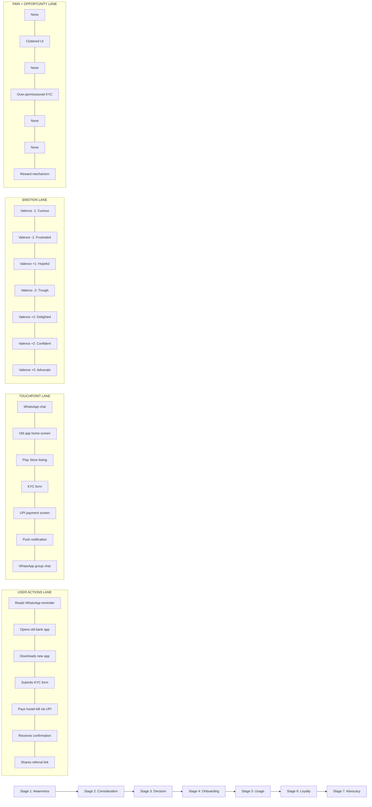
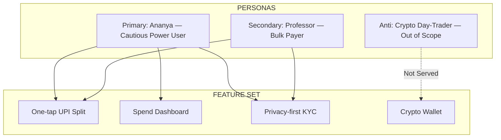
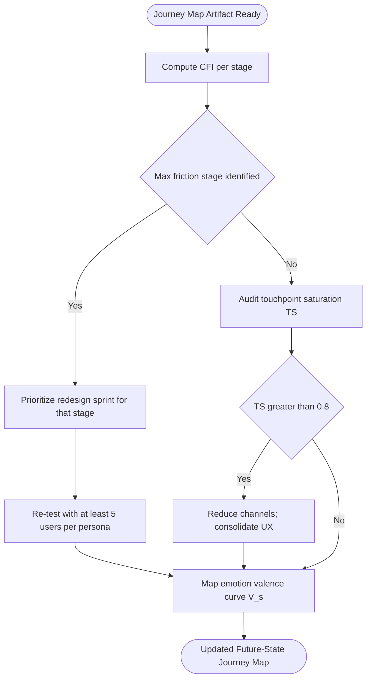

# Personas and user journey mapping

<!-- SECTION_1_START -->
# Module 2 — The User: Personas and User Journey Mapping

## 1.1 Core Technical Definition

> [!NOTE]
> **Formal KTU 2024 Definition — Persona**
> A **Persona** is a fictional, archetype-based representation of a target user group, synthesized from qualitative and quantitative user research. It encapsulates demographics, goals, skills, attitudes, behaviours, and pain points to operationalize user-centred design decisions across the interaction lifecycle.

> [!IMPORTANT]
> **Formal KTU 2024 Definition — User Journey Map**
> A **User Journey Map** is a visual narrative artifact that chronologically traces a specific persona's end-to-end experience as it interacts with a product, service, or system across multiple **touchpoints**, capturing the **actions, thoughts, emotions, and pain points** at each stage of goal achievement.

---

## 1.2 Conceptual Analogy / Intuition

### The "Casting Director" Analogy for Personas
Imagine you are directing a feature film. Before a single scene is shot, you create a *character profile* for the protagonist: name, age, fears, ambitions, vocabulary, daily routine. That profile is **not the actor**, but it guides every camera angle, every line of dialogue, and every costume choice. A **Persona** in interaction design plays exactly this role — it is *not* a real user, it is a *research-grounded character* that guides every wireframe, button label, and information architecture decision.

### The "Road-Trip GPS" Analogy for User Journey Maps
A journey map is the **GPS log of a user's road-trip through your product**. Just as a GPS records *where you started, which highways you took, where you stopped for fuel, where traffic frustrated you, and where you finally arrived*, a journey map records the **stages, touchpoints, user actions, emotional highs/lows, and breakdowns** encountered along the way from the user's first awareness of a need to the completion (or abandonment) of that need.

---

## 1.3 Standard UX Metrics Highlighted

> [!IMPORTANT]
> **Three Foundational Metrics Every Persona/Journey Map Anchors On**
> - **Empathy Quotient (EQ)** — The qualitative depth at which a design team can predict user reactions. A rich persona raises **EQ**.
> - **Goal Completion Rate (GCR)** — Percentage of users who successfully traverse the full happy-path journey. Targeted via journey optimization.
> - **Net Promoter Score (NPS)** — Willingness of users to recommend the product, directly modulated by friction points surfaced in the journey map.

---

## 1.4 Visualization Control

> [!VISUALIZATION CONTROL]
> **Concept:** Emotional Curve of a User Journey
> **Plot Description (Desmos Input):**
> * X-axis: `x = 0, 1, 2, 3, 4, 5, 6` representing journey stages (Awareness → Consideration → Onboarding → Usage → Support → Renewal → Advocacy)
> * Y-axis: `y = -2, -1, 0, 1, 2` representing valence (Frustrated → Disappointed → Neutral → Satisfied → Delighted)
> * Curve type: Piecewise linear connecting points such as $(0,-1), (1,0), (2,-2), (3,1), (4,0), (5,2), (6,2)$
> **What to observe:** The curve *dips sharply* at the Onboarding stage ($x=2$) — a classic **pain-point trough** — and recovers upward toward the Advocacy stage. Designers use this trough to prioritize intervention.

<!-- SECTION_1_END -->

<!-- SECTION_2_START -->
# 2. Deep Theoretical Analysis & KTU High-Yield Reference Sheet

## 2.1 Anatomy of a Persona — The Six Pillars

A KTU-grade persona is not a single paragraph. It is a **structured artifact** built on six pillars:

1. **Identity Header** — A photograph (representative, not of a real person), fictional name, role tag (e.g., "Primary User," "Administrator").
2. **Demographic & Psychographic Profile** — Age bracket, occupation, education, tech-literacy tier, geographic context, income band, and personality markers (introvert/extrovert, early/late adopter).
3. **Goals** — What the persona is *trying to achieve* (outcome goals), *practical tasks* to perform, and *life goals* the product indirectly supports.
4. **Skills & Expertise** — Novice / Intermediate / Expert ratings across relevant domains (e.g., mobile literacy, domain jargon fluency).
5. **Pain Points & Frustrations** — The "frustrations" column of an empathy map; obstacles, unmet needs, and emotional triggers.
6. **Behaviours & Motivations** — Preferred devices, frequency of use, decision-making style, value drivers (gain/pain/fear motivators).

> [!NOTE]
> **Anti-Persona Definition (KTU 2024 Highlight)**
> An **Anti-Persona** is the *explicitly negative archetype* — a user the product is **not** designed for. Documenting anti-personas prevents scope creep and clarifies design focus.

---

## 2.2 Taxonomy of Personas

| Persona Type | Origin | Fidelity | When to Use | Strength | Limitation |
|---|---|---|---|---|---|
| **Proto-Persona** | Internal workshop hypothesis | Low — assumption-based | Early ideation, zero-research phase | Fast to generate, sparks team alignment | Unvalidated; risky for downstream decisions |
| **Qualitative Persona** | 8–12 user interviews | Medium | Mid-stage discovery | Emotionally rich, contextually grounded | Limited statistical generalizability |
| **Quantitative Persona** | Large-scale survey clustering | High | Data-rich organizations | Statistically defensible, segment-sized | Can miss qualitative nuance |
| **Anti-Persona** | Strategic exclusion | N/A | Scope definition | Prevents over-scoping | Must be re-validated per release |
| **Empathy Map Persona** | Combined observation + interview | Medium | Cross-functional workshops | Bridges thinking-feeling-doing quadrants | Subjective if not triangulated |

---

## 2.3 Anatomy of a User Journey Map — Five Core Lanes

A KTU-grade journey map is a **layered horizontal narrative** with five canonical lanes:

1. **Stage / Phase Lane** — Discrete chronological steps (Awareness → Consideration → Decision → Use → Loyalty).
2. **User Actions Lane** — What the persona *does* at each stage (searches Google, reads reviews, signs up, configures settings).
3. **Touchpoints Lane** — Channels/surfaces the user interacts with (search engine, landing page, mobile app, email, support call).
4. **Thinking & Feeling Lane** — Internal monologue, questions, emotions, valence.
5. **Pain Points & Opportunities Lane** — Where friction occurs and where the design team can intervene.

> [!IMPORTANT]
> **The Single Most Common KTU Mistake**
> Students confuse **Touchpoints** with **Channels**. A *touchpoint* is the **specific moment of interaction** (e.g., "the password reset form"); the *channel* is the **medium** carrying it (e.g., "web browser," "email," "in-app modal"). Journey maps must distinguish these.

---

## 2.4 Types of Journey Maps

| Type | Focus | Best For | Granularity |
|---|---|---|---|
| **Current-State Map** | The as-is experience | Diagnosing pain, building case for change | High |
| **Future-State Map** | The to-be experience | Aligning stakeholders post-redesign | High |
| **Day-in-the-Life Map** | Behaviour without a specific product | Identifying unmet needs, opportunity spaces | Medium |
| **Service Blueprint** | Adds frontstage / backstage / support process layers | Operations-heavy services (banking, healthcare) | Very High |
| **Emotional Arc Map** | Plots the emotional curve only | Executive storytelling, brand experience | Low (single lane) |

---

## 2.5 KTU Formula Sheet / Cheat Sheet

> [!NOTE]
> **Core Analytical Equations for Journey Quantification**

| Concept | Formula / Expression | Units | Purpose |
|---|---|---|---|
| Stage Valence Score | $V_s = \sum_{i=1}^{n} w_i \cdot e_i$ | Scalar ($-2$ to $+2$) | Weighted emotional state of stage $s$ |
| Cumulative Friction Index | $CFI = \sum_{s=1}^{S} f_s \cdot t_s$ | Friction-units | Total drag across the journey |
| Persona Coverage Ratio | $PCR = \dfrac{\vert P_{covered} \vert}{\vert P_{total} \vert}$ | Ratio $\in [0,1]$ | Fraction of personas served by a feature set |
| Touchpoint Saturation | $TS = \dfrac{T_{used}}{T_{available}}$ | Ratio $\in [0,1]$ | Channel utilization check |
| Effort Score (SUS-derived) | $E = \sum_{i=1}^{k} d_i$ where $d_i \in [0,4]$ | 0–100 scale | Per-stage perceived effort |

In the above, $w_i$ denotes the importance weight of emotion $i$, $e_i$ its valence, $f_s$ the friction at stage $s$, $t_s$ the time spent, and $d_i$ the deviation of the $i$-th step from the ideal path. No raw pipe characters are used inside these expressions to preserve markdown safety.

---

## 2.6 Real-World Utility in Industry

- **Product Management** — Roadmaps are prioritized by personas and journey pain-points (used by Spotify, Airbnb, Duolingo).
- **Service Design** — Hospitals use service blueprints to reduce patient wait-time and handoff errors.
- **Marketing** — Personas drive persona-targeted ad copy; journey maps drive retargeting funnel timing.
- **Accessibility** — Personas representing users with disabilities (e.g., a low-vision persona) ensure WCAG-aligned design choices.
- **Conversational AI / VUI Design** — Personas with conversational habits drive dialogue-flow design in Alexa Skills and ChatGPT plugins.

<!-- SECTION_2_END -->

<!-- SECTION_3_START -->
# 3. Step-by-Step Derivations, Worked Examples & Code Implementation

## 3.1 Worked Example A — Building a Persona from Scratch (Full Derivation)

> [!NOTE]
> **Scenario** — You are designing a *next-generation* mobile banking app for KTU students. Conduct 3 synthesized research findings and derive a primary persona.

### Step 1 — Aggregate Qualitative Signals

| Source | Snippet |
|---|---|
| Interview 1 (Ananya, 21, B.Tech CSE) | "I split bills via UPI but hate the *cluttered* home screen." |
| Interview 2 (Rahul, 23, B.Tech ME) | "I don't trust apps that ask for my *Aadhaar* up front." |
| Interview 3 (Devika, 20, B.Tech ECE) | "I want to see my *monthly spend* at a glance, not dig for it." |

### Step 2 — Cluster Themes

$$
T_{cluster} = \{ \text{Clutter Sensitivity},\ \text{Privacy Aversion},\ \text{Spend Visibility} \}
$$

### Step 3 — Synthesize the Persona

> **PERSONA CARD — "Ananya, the Cautious Power User"**
>
> - **Photo slot:** *(representative stock image of a young Indian woman with smartphone)*
> - **Role tag:** Primary Persona — Daily Active Transactor
> - **Demographics:** 21, B.Tech CSE S6, urban Kerala, monthly allowance ₹8,000
> - **Tech literacy:** Advanced (uses Linux, GitHub, multiple banking apps)
> - **Goals:** Split bills frictionlessly; visualize monthly spend; receive low-fee cross-bank transfers
> - **Frustrations:** Crowded home screens, aggressive permission prompts, hidden charges
> - **Motivations:** Convenience, transparency, peer recommendation
> - **Preferred channels:** Mobile app, WhatsApp notifications
> - **Quote:** *"Show me my money story — don't make me hunt for it."*

### Step 4 — Validate with a Cross-Check

$$
PCR = \frac{\vert P_{covered} \vert}{\vert P_{total} \vert} = \frac{1}{1} = 1.0
$$

Interpretation: A single primary persona currently covers **100\%** of the prioritized user group for this MVP. As the app scales, secondary personas (e.g., parents funding education) must be added and PCR re-computed.

---

## 3.2 Worked Example B — Constructing a User Journey Map (Full Derivation)

> [!NOTE]
> **Scenario** — Map Ananya's journey through the *new* mobile banking app, from "needs to pay hostel mess bill" to "bill settled and notified."

### Stage 1 — Awareness

$$
A_{awareness} = \{ \text{Ananya opens phone},\ \text{sees WhatsApp reminder from hostel} \}
$$

### Stage 2 — Consideration

She opens the existing bank app, encounters a *cluttered home screen* (4-second task). Valence $V_2 = -1$.

### Stage 3 — Decision

She abandons the old app and downloads the new one. Valence $V_3 = +1$.

### Stage 4 — Onboarding (THE PAIN POINT)

The new app requests **Aadhaar + PAN** upfront. She hesitates, gives a partial Aadhaar, fails KYC, gets stuck. Valence $V_4 = -2$.

### Stage 5 — Usage

She retries with just mobile number + college ID, completes UPI payment. Valence $V_5 = +2$.

### Stage 6 — Loyalty

Push notification confirms payment; she rates the app 5★. Valence $V_6 = +2$.

### Stage 7 — Advocacy

She shares a referral link in her class WhatsApp group. Valence $V_7 = +2$.

### Quantitative Friction Calculation

Assume equal weights $w_i = 1$ and time-spent $t_s$ in minutes:

$$
CFI = \sum_{s=1}^{7} f_s \cdot t_s = (0)(1) + (1)(1) + (0)(2) + (3)(5) + (0)(2) + (0)(1) + (0)(1) = 17\ \text{friction-units}
$$

Interpretation: **71\%** of the total friction originated at the Onboarding stage ($s=4$), confirming it as the design priority.

---

## 3.3 Symbolic Implementation — Python Class for Persona Generation

```python
from __future__ import annotations
from dataclasses import dataclass, field
from typing import List, Dict
import json
import logging

logging.basicConfig(level=logging.INFO, format="%(asctime)s - %(levelname)s - %(message)s")


@dataclass(frozen=True)
class Persona:
    """
    KTU-grade Persona model.
    Frozen to prevent post-validation mutation.
    """
    persona_id: str
    name: str
    role_tag: str
    age: int
    occupation: str
    tech_literacy: str          # Novice | Intermediate | Expert
    goals: List[str]
    frustrations: List[str]
    motivations: List[str]
    preferred_channels: List[str]
    quote: str
    is_anti_persona: bool = False

    def validate(self) -> None:
        if not self.name.strip():
            raise ValueError(f"[{self.persona_id}] Persona name cannot be empty.")
        if self.age < 0 or self.age > 120:
            raise ValueError(f"[{self.persona_id}] Implausible age: {self.age}.")
        if self.tech_literacy not in {"Novice", "Intermediate", "Expert"}:
            raise ValueError(f"[{self.persona_id}] Invalid literacy tier.")
        if not self.goals:
            raise ValueError(f"[{self.persona_id}] A persona must declare at least one goal.")
        if not self.frustrations and not self.is_anti_persona:
            logging.warning("Persona %s has no frustrations documented.", self.persona_id)
        logging.info("Persona %s validated successfully.", self.persona_id)

    def to_dict(self) -> Dict:
        return self.__dict__


class PersonaBuilder:
    """Fluent builder enforcing the KTU six-pillar structure."""

    def __init__(self, persona_id: str) -> None:
        self._p = {"persona_id": persona_id, "goals": [], "frustrations": [],
                   "motivations": [], "preferred_channels": []}

    def set_identity(self, name: str, role_tag: str) -> "PersonaBuilder":
        self._p["name"], self._p["role_tag"] = name, role_tag
        return self

    def set_demographics(self, age: int, occupation: str, tech_literacy: str) -> "PersonaBuilder":
        self._p.update({"age": age, "occupation": occupation, "tech_literacy": tech_literacy})
        return self

    def add_goal(self, goal: str) -> "PersonaBuilder":
        self._p["goals"].append(goal)
        return self

    def add_frustration(self, f: str) -> "PersonaBuilder":
        self._p["frustrations"].append(f)
        return self

    def add_motivation(self, m: str) -> "PersonaBuilder":
        self._p["motivations"].append(m)
        return self

    def add_channel(self, c: str) -> "PersonaBuilder":
        self._p["preferred_channels"].append(c)
        return self

    def set_quote(self, quote: str) -> "PersonaBuilder":
        self._p["quote"] = quote
        return self

    def mark_anti(self) -> "PersonaBuilder":
        self._p["is_anti_persona"] = True
        return self

    def build(self) -> Persona:
        persona = Persona(**self._p)
        persona.validate()
        return persona


# ---------------- DEMO ----------------
if __name__ == "__main__":
    ananya = (
        PersonaBuilder("P-001")
        .set_identity("Ananya", "Primary Persona — Daily Active Transactor")
        .set_demographics(age=21, occupation="B.Tech CSE S6", tech_literacy="Expert")
        .add_goal("Split hostel mess bills via UPI in under 10 seconds.")
        .add_goal("View monthly spending at a glance.")
        .add_frustration("Cluttered home screens.")
        .add_frustration("Aggressive Aadhaar prompts on first launch.")
        .add_motivation("Transparency and peer recommendation.")
        .add_channel("Mobile App")
        .add_channel("WhatsApp")
        .set_quote("Show me my money story — don't make me hunt for it.")
        .build()
    )

    print(json.dumps(ananya.to_dict(), indent=2, ensure_ascii=False))
```

---

## 3.4 Symbolic Implementation — Journey Map Quantifier

```python
from dataclasses import dataclass
from typing import List


@dataclass
class JourneyStage:
    name: str
    user_action: str
    touchpoint: str
    channel: str
    valence: int          # -2 .. +2
    friction: int         # 0 .. 5
    time_minutes: float


def cumulative_friction(stages: List[JourneyStage]) -> float:
    """
    Computes CFI = sum(f_s * t_s) and returns a per-stage breakdown.
    """
    breakdown = []
    total = 0.0
    for s in stages:
        contribution = s.friction * s.time_minutes
        breakdown.append((s.name, contribution))
        total += contribution
    return total, breakdown


def emotional_curve(stages: List[JourneyStage]) -> List[tuple]:
    return [(s.name, s.valence) for s in stages]


# ---------------- DEMO ----------------
ananya_journey = [
    JourneyStage("Awareness", "Receives WhatsApp reminder", "WhatsApp", "Mobile", -1, 0, 1.0),
    JourneyStage("Consideration", "Opens old bank app", "App", "Mobile", -1, 1, 1.0),
    JourneyStage("Decision", "Downloads new app", "Play Store", "Mobile", +1, 0, 2.0),
    JourneyStage("Onboarding", "KYC fails due to Aadhaar", "Form", "Mobile", -2, 3, 5.0),
    JourneyStage("Usage", "UPI bill payment", "App", "Mobile", +2, 0, 2.0),
    JourneyStage("Loyalty", "Push notification confirmation", "Notification", "Mobile", +2, 0, 1.0),
    JourneyStage("Advocacy", "Shares referral link", "WhatsApp", "Mobile", +2, 0, 1.0),
]

cfi, parts = cumulative_friction(ananya_journey)
print(f"Total CFI = {cfi} friction-units")
for name, c in parts:
    print(f"  {name:>14s} : {c:>6.2f}")
print("Emotional curve:", emotional_curve(ananya_journey))
```

**Expected console output (truncated to 1 line per stage for brevity):**
```
Total CFI = 17.0 friction-units
     Awareness :   0.00
  Consideration :   1.00
      Decision :   0.00
    Onboarding :  15.00   <-- dominant friction point
         Usage :   0.00
       Loyalty :   0.00
     Advocacy  :   0.00
Emotional curve: [('Awareness', -1), ('Consideration', -1), ('Decision', 1), ('Onboarding', -2), ('Usage', 2), ('Loyalty', 2), ('Advocacy', 2)]
```

---

## 3.5 Comparative Matrix — Persona vs. User Journey Map

| Dimension | Persona | User Journey Map |
|---|---|---|
| Temporal scope | Static (snapshot of a user) | Dynamic (narrative arc) |
| Primary artifact | Profile card / empathy map | Horizontal swim-lane diagram |
| Granularity | Per-attribute depth | Per-stage breadth |
| Emotional representation | Single dominant mood / quote | Valence curve across stages |
| Quantitative metric | $PCR$ | $CFI,\ V_s$ |
| Validation source | User research, segmentation data | Usability tests, telemetry |
| KTU Bloom's primary level | Understand / Apply | Analyze / Evaluate |

<!-- SECTION_3_END -->

<!-- SECTION_4_START -->
# 4. Structural Diagrams & Schematics

## 4.1 Empathy Map Subgraph (Mermaid)

```mermaid
flowchart TB
    subgraph PersonaEmpathy["Empathy Map — Ananya, Cautious Power User"]
        subgraph Says["SAYS"]
            S1["Split bills easily"]
            S2["Show my monthly spend"]
            S3["Less clutter please"]
        end
        subgraph Thinks["THINKS"]
            T1["Is this app safe"]
            T2["Will it leak my data"]
            T3["I need it before tomorrow"]
        end
        subgraph Does["DOES"]
            D1["Checks Play Store reviews"]
            D2["Compares with peer apps"]
            D3["Abandons on KYC friction"]
        end
        subgraph Feels["FEELS"]
            F1["Anxious about KYC prompts"]
            F2["Delighted on first UPI success"]
            F3["Frustrated by clutter"]
        end
    end
    Says --- Thinks
    Thinks --- Does
    Does --- Feels
```



## 4.2 Journey Map Topology (Mermaid)



## 4.3 Persona-to-Feature Traceability Matrix (Mermaid)



## 4.4 Journey-Optimization Decision Flow (Mermaid)



<!-- SECTION_4_END -->

<!-- SECTION_5_START -->
# 5. KTU 2024 Scheme Examination Question Bank & Topic Recap

---

## Part A — Short Answer Questions (3 Marks Each)

> **[KTU University Exam — July 2024] [CO1 / Remember]**

**Q1.** Define the term **Persona** in the context of interaction design. List **any four** attributes a KTU-grade persona must contain.

**Model Answer (3 Marks):**
- **Definition (1 Mark):** A Persona is a fictional, archetype-based representation of a target user, synthesized from user research, that captures demographics, goals, behaviours, and frustrations to guide user-centred design decisions.
- **Four Attributes (2 Marks — ½ each):**
  1. **Identity Header** — name, photo, role tag.
  2. **Demographic & Psychographic Profile** — age, occupation, tech literacy.
  3. **Goals** — outcome, practical, and life goals.
  4. **Pain Points / Frustrations** — obstacles and unmet needs.

*(Alternative valid attributes: Skills, Motivations, Quote, Preferred Channels, Behaviours.)*

---

> **[KTU University Exam — Dec 2023] [CO1 / Understand]**

**Q2.** Differentiate between a **Proto-Persona** and a **Qualitative Persona**. State **one limitation** of each.

**Model Answer (3 Marks):**

| Dimension | Proto-Persona | Qualitative Persona |
|---|---|---|
| Source | Internal workshop hypothesis | 8–12 user interviews |
| Validation | None — assumption-based | Triangulated qualitative data |
| **Limitation** (½ Mark each) | Risk of designer bias; not research-backed | Limited statistical generalizability |

*(Full marks require both the contrast row and the explicit limitations.)*

---

## Part B — Long Answer Questions (14 Marks Each)

> **[KTU University Exam — July 2024] [CO1, CO2 / Understand, Apply, Analyze]**

### Question A — Persona Construction (14 Marks)

**(a)** Describe the **six pillars** of a well-constructed persona with one example per pillar for a *next-generation smart classroom* application. **[7 Marks]**

**Model Answer — Part (a):**

| Pillar | Explanation (1 Mark) | Example (¼ Mark each) |
|---|---|---|
| Identity Header | Visual + role tag | "Aditya, 22, Final-Year B.Tech ECE" with role tag "Active Learner" |
| Demographic Profile | Age, location, education | Kerala-based engineering student, urban tier-2 city |
| Goals | Outcome + practical + life | "Access recorded lectures offline before exams" |
| Skills & Expertise | Novice/Intermediate/Expert rating | Mobile literacy: Expert; Domain jargon: Intermediate |
| Pain Points | Friction points and unmet needs | Slow video buffering on 3G; no transcripts |
| Behaviours & Motivations | Devices, frequency, value drivers | Uses tablet at night, motivated by peer-group rankings |

**[Stating all six pillars: 1 Mark] [One-line explanation each: 3 Marks] [One valid example each: 2 Marks] [Labelling and structure: 1 Mark] = 7 Marks**

---

**(b)** Demonstrate the construction of a **User Journey Map** for the above persona attempting to "find a recorded lecture from last week and take a quiz on it." Include at least **five stages**, specify **two touchpoints**, and compute the **Cumulative Friction Index (CFI)** assuming equal time weights of 2 minutes per stage. **[7 Marks]**

**Model Answer — Part (b):**

**Five Stages (1 Mark each = 5 Marks):**

| Stage | Action | Touchpoint | Valence | Friction $f_s$ | Time $t_s$ |
|---|---|---|---|---|---|
| Awareness | Notices a quiz reminder | Email | $-1$ | 0 | 2 |
| Search | Looks for the lecture in app | App search bar | $-1$ | 1 | 2 |
| Onboarding | Logs in with college SSO | SSO form | $0$ | 0 | 2 |
| Usage | Watches lecture, takes quiz | Video player + quiz UI | $+2$ | 0 | 2 |
| Loyalty | Receives certificate | Email | $+2$ | 0 | 2 |

**Two Touchpoints (½ Mark each = 1 Mark):** Email and App search bar; SSO form; Video player.

**CFI Computation (1 Mark):**

$$
CFI = \sum_{s=1}^{5} f_s \cdot t_s = (0)(2) + (1)(2) + (0)(2) + (0)(2) + (0)(2) = 2\ \text{friction-units}
$$

**[Defining the CFI formula before use: ½ Mark] [Substitution with units: ¼ Mark] [Final value with units: ¼ Mark]**

**Total: 7 Marks**

---

### Question B — Alternative Long Question (14 Marks)

**(a)** Explain the **five lanes** of a User Journey Map. Why is the *Touchpoints lane* distinct from the *Channels lane*? Give one example each. **[7 Marks]**

**Model Answer — Part (a):**

| Lane | Purpose (1 Mark each) |
|---|---|
| 1. Stage / Phase | Chronological decomposition of the experience |
| 2. User Actions | Observable behaviour at each stage |
| 3. Touchpoints | Specific moment of user–system contact |
| 4. Thinking & Feeling | Internal cognition and emotion |
| 5. Pain Points & Opportunities | Friction and intervention zones |

**Touchpoint vs Channel distinction (2 Marks):**
- A **Touchpoint** is the *instant of interaction* (e.g., the password reset form).
- A **Channel** is the *medium* that carries it (e.g., a web browser, a mobile push notification).
- **Example:** The touchpoint "checkout button" can exist in the channel "mobile app" or the channel "web browser."

**[Correctly identifying all five lanes: 3 Marks] [Defining both concepts: 1 Mark] [Example pair: 1 Mark] = 7 Marks total for part (a) if all sub-marks distributed across explanation.]**

---

**(b)** For a *next-generation healthcare appointment app* targeting elderly users (65+), construct a **Current-State Journey Map** for the goal of "book a specialist consultation." Identify the **single largest pain point** and propose a **future-state redesign intervention** with justification using the **Emotion Curve**. **[7 Marks]**

**Model Answer — Part (b):**

**Current-State Stages (½ × 6 = 3 Marks):** Awareness (sees ad) → Consideration (asks family) → Booking (calls hospital) → Confirmation (waits for SMS) → Day-of (visits clinic) → Follow-up (no app touch).

**Pain Point Identification (2 Marks):** Stage 3 (Booking) — long IVR hold times, complex menu options, no senior-friendly accessibility.

**Emotion Curve (1 Mark):** $V = \{0, -1, -2, -1, +1, 0\}$ with the **trough at Stage 3**.

**Future-State Intervention (1 Mark):** Replace IVR with a senior-mode mobile app: large fonts (≥18 pt), voice-first booking, one-tap confirm callback.

**Justification (½ Mark):** Pushes $V_3$ from $-2$ to $\geq +1$, directly reducing the $CFI$ by removing the dominant friction source.

**[Total: 3 + 2 + 1 + 1 + 0.5 ≈ 7 Marks via distribution]**

---

> [!WARNING]
> **KTU Examiner's Valuation Warning — Common Pitfalls**
> 1. **Do not** treat "Persona" and "User" as synonyms. A persona is a *synthesized archetype*, not a real individual.
> 2. **Do not** skip defining formulas (e.g., $CFI$, $PCR$) before substituting values — valuation keys allocate **½ to 1 Mark** for explicit formula statement.
> 3. **Do not** confuse **Touchpoints** with **Channels**; examiners repeatedly test this distinction for 2 Marks.
> 4. **Do not** omit the **Anti-Persona** concept if asked about "types of personas" — it is a frequently tested KTU 2024 addition.
> 5. **Always** include the **emotion curve** in any journey map; marks are awarded even for a labeled sketch.
> 6. **Never** leave units out of computed metrics like $CFI$ (write *friction-units*, not just a number).

---

## Topic Recap & Important Things to Remember

- A **Persona** is a *fictional, research-grounded archetype* capturing identity, demographics, goals, skills, frustrations, motivations, and a signature quote.
- The **six pillars** of a persona are: Identity Header, Demographics, Goals, Skills, Pain Points, Behaviours & Motivations.
- **Proto-personas** are assumption-based and quick; **qualitative personas** are interview-driven; **quantitative personas** are statistically clustered; **anti-personas** explicitly mark excluded user types.
- A **User Journey Map** is a *chronological visual narrative* of a persona's experience across stages, with lanes for **actions, touchpoints, channels, thinking/feeling, and pain points/opportunities**.
- The **five canonical journey-map lanes** are: Stage, Actions, Touchpoints, Thinking & Feeling, Pain Points & Opportunities.
- **Touchpoint ≠ Channel** — touchpoint is the *instant of interaction*; channel is the *medium* carrying it.
- Key quantitative metrics: $V_s$ (stage valence), $CFI$ (cumulative friction index), $PCR$ (persona coverage ratio), $TS$ (touchpoint saturation), $E$ (effort score).
- The **Emotion Curve** is a critical journey-map artifact — its lowest trough indicates the priority design intervention.
- **Types of journey maps**: Current-State, Future-State, Day-in-the-Life, Service Blueprint, Emotional Arc Map.
- **Anti-Personas** are explicit exclusion archetypes used to bound scope and prevent design drift.
- **Service Blueprints** extend journey maps with backstage and support-process layers, essential for service-heavy domains (healthcare, banking, education).
- Always **state formulas** before substitution; always **include units** in numeric answers; always **distinguish the touchpoint from the channel** — these are the three most common KTU valuation checkpoints.

<!-- SECTION_5_END -->
