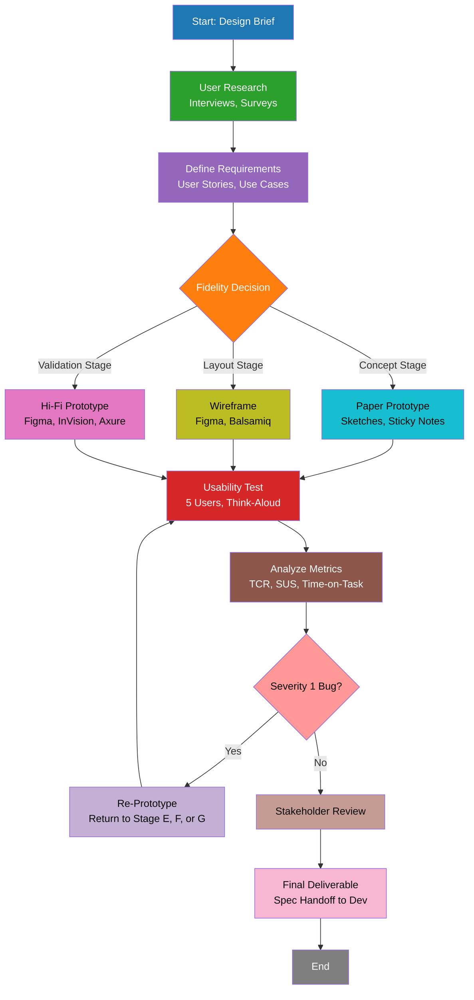
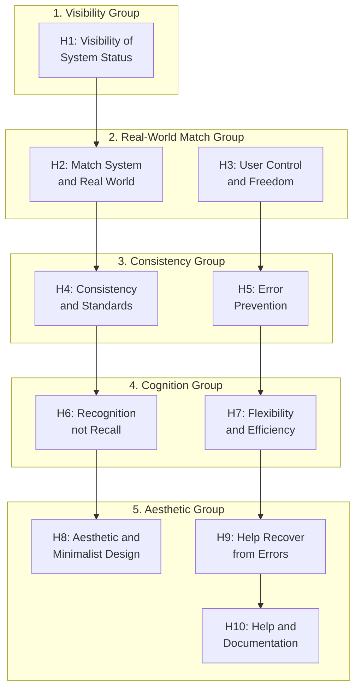
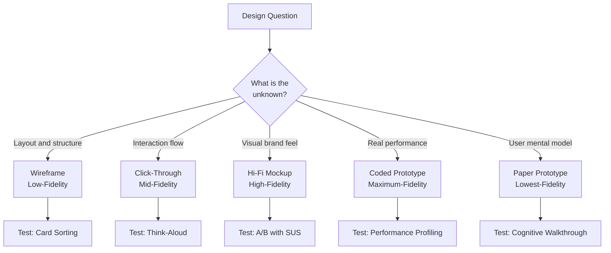
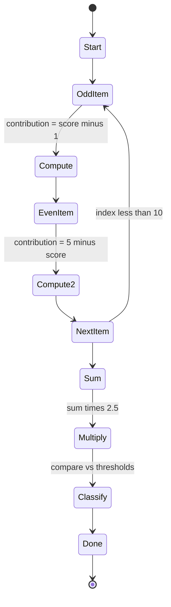
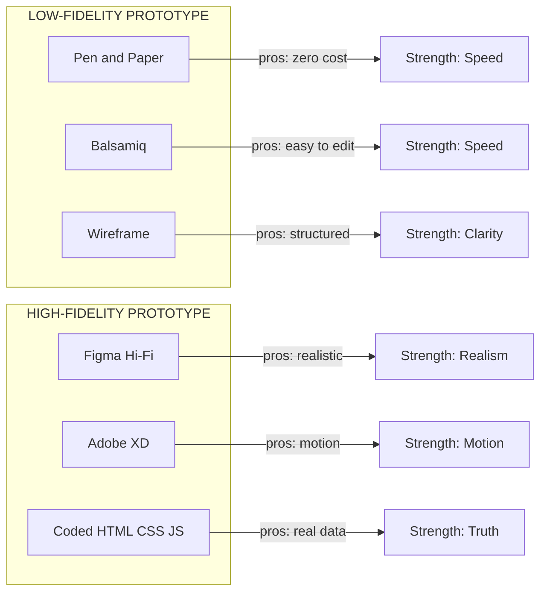

# Prototyping and Testing - Rapid prototyping technique

<!-- SECTION_1_START -->

# Prototyping and Testing — Rapid Prototyping Technique

> [!NOTE]
> **KTU 2024 Scheme Context (PECST865 — Module 2: User)**
> This topic sits at the heart of *User-Centered Design (UCD)*. Before spending lakhs of engineering hours on full-scale development, designers validate ideas through **rapid prototyping** and **empirical usability testing**. KTU expects you to know *which* fidelity to pick, *why* iteration matters, and *how* to capture measurable user feedback.

---

## 1.1 Formal Academic Definition

**Rapid Prototyping** is an iterative design methodology in which low-cost, quickly-constructed representations of a system (paper sketches, wireframes, click-through mockups, or coded interfaces) are built, tested with representative users, and refined in short feedback loops — typically within hours to days rather than weeks.

In the **KTU 2024 syllabus terminology**, rapid prototyping is defined as:

> *"A cyclical, user-centered design activity that translates conceptual user requirements into tangible, evaluable artifacts through successive layers of fidelity, enabling early detection of usability defects before commitment to production code."*

The companion process — **Usability Testing** — is the systematic observation of real users interacting with a prototype, where performance is measured across dimensions of **effectiveness, efficiency, and satisfaction (ISO 9241-11)**.

> [!IMPORTANT]
> **Core Principle — The 3Es of Usability (ISO 9241-11)**
> 1. **Effectiveness** — Can the user *complete* the task?
> 2. **Efficiency** — How much *time/effort* is required?
> 3. **Satisfaction** — How *comfortable* does the user feel?

---

## 1.2 Intuitive Overview — The "Building a House" Analogy

Imagine you are an architect building a home for a client.

- A **paper sketch** is the napkin drawing you show the client over coffee — quick, cheap, and easy to throw away.
- A **wireframe** is the wooden frame of the house — it shows layout and dimensions but no paint or furniture.
- A **high-fidelity mockup** is the fully furnished show-home — it looks real, costs more, and is built only after the client signs off.

Rapid prototyping means you **never pour the concrete foundation first**. You show the client a sketch, hear "I want the kitchen on the *left*, not the right," and redraw the sketch in 20 minutes — not demolish a real wall.

> [!TIP]
> **Student Memory Hook:** *Prototype fast, fail fast, fix fast.* The cheapest mistake to fix is the one on paper.

---

## 1.3 Physical & Design Constants

The following are **standard industry metrics** used when evaluating prototypes:

| Metric | Standard Value | Context |
|---|---|---|
| **Task Completion Rate** | $\geq 78\%$ | Acceptable usability benchmark |
| **Average Nielsen Heuristics** | **10 rules** | Heuristic evaluation framework |
| **Think-Aloud Sample Size** | **5 $\pm$ 2 users** | Nielsen (2000) — diminishing returns |
| **Prototype Iteration Cycle** | **2–5 days** | Standard sprint-aligned rapid loop |
| **Pugh Matrix Scale** | **$+1, 0, -1$** | Concept scoring convention |

---

> [!VISUALIZATION CONTROL]
> **Concept:** Fidelity vs. Cost vs. Time Trade-off Curve
> **GeoGebra / Desmos Input Equations:**
> * $C(f) = a \cdot f^{1.7}$ where $f$ = fidelity (0 to 1), $C$ = cost in person-hours
> * $T(f) = b \cdot f^{1.3}$ where $T$ = build time in days
> * Point A $(0.1, \text{low cost, low realism})$ — Paper sketch
> * Point B $(0.5, \text{moderate cost, click-through})$ — Wireframe
> * Point C $(1.0, \text{high cost, pixel-perfect})$ — Functional HTML/CSS
> **Visual Description:** A curve rising exponentially to the right. The student should observe that cost and time *balloon* as fidelity approaches 1.0, justifying the use of low-fidelity early on.

<!-- SECTION_1_END -->

<!-- SECTION_2_START -->

# Deep Theoretical Analysis & KTU High-Yield Formula Sheet

---

## 2.1 The Five Pillars of Rapid Prototyping

Rapid prototyping is not one activity — it is a **stack of complementary techniques** chosen by fidelity, audience, and timeline.

### Pillar 1 — Paper Prototyping
- **What:** Hand-drawn screens on A4 sheets, manipulated physically ("the computer wizard" technique).
- **When:** Earliest design exploration, brainstorms, stakeholder alignment.
- **Tools:** Whiteboard, sticky notes, Sharpies, Balsamiq (digital emulation).
- **Strength:** Zero learning curve, invites wild ideas, **lowest cost** (₹0).
- **Weakness:** Cannot simulate true interactivity, animations, or gestures.

### Pillar 2 — Wireframing
- **What:** Low-fidelity structural blueprint — boxes for content, lines for navigation, lorem ipsum for text.
- **When:** Information architecture phase.
- **Tools:** Figma, Sketch, Adobe XD, Balsamiq Mockups, Moqups.
- **Strength:** Forces focus on *layout and flow*, not visual polish.
- **Weakness:** End-users often cannot imagine the final product from boxes.

### Pillar 3 — High-Fidelity (Hi-Fi) Prototyping
- **What:** Pixel-accurate, branded, clickable mockups.
- **When:** Stakeholder pitches, usability testing, developer handoff.
- **Tools:** Figma, Adobe XD, InVision, Axure RP, Proto.io, Framer.
- **Strength:** Realistic user feedback, near-final asset reuse.
- **Weakness:** Time-intensive; designers fall in love with pixels and resist changes ("the *sunk-cost fallacy of design*").

### Pillar 4 — Interactive / Click-Through Prototyping
- **What:** Hi-Fi screens linked by hotspots, transitions, and conditional logic.
- **When:** Usability tests, demo videos, investor pitches.
- **Tools:** InVision, Figma Smart Animate, Principle, Marvel.
- **Strength:** Closest to real interaction without code.
- **Weakness:** Still cannot handle real data, API calls, or auth states.

### Pillar 5 — Coded Prototypes
- **What:** Functional HTML/CSS/JS or React/Vue front-end built *only* for the most uncertain UX risk.
- **When:** A/B testing at scale, performance-critical gestures (e.g., AR/VR).
- **Tools:** React, Flutter, SwiftUI, Jetpack Compose.
- **Strength:** Real performance, real data, real edge cases.
- **Weakness:** Expensive — borderline with full development.

---

## 2.2 The Prototyping Pyramid (Fidelity Stack)

```
           ▲  Coded Prototype        (Cost: ████████████ 12)
          ╱  ╲
         ╱ Hi-Fi╲                   (Cost: ████████ 8)
        ╱────────╲
       ╱ Wireframe ╲                  (Cost: ████ 4)
      ╱──────────────╲
     ╱  Paper Sketch   ╲              (Cost: █ 1)
    ╱____________________╲
```

**Design rule:** Start at the bottom. Move up *only* when the question you need to answer requires it.

> [!IMPORTANT]
> **KTU Frequently Tested Concept**
> *Low-fidelity prototypes answer "WHAT should this be?"* (concept, layout)
> *High-fidelity prototypes answer "HOW should this feel?"* (motion, brand, micro-interactions)

---

## 2.3 Testing Methodologies

Once a prototype exists, it is subjected to **empirical testing**:

| Test Type | Goal | Sample Size | Cost |
|---|---|---|---|
| **Heuristic Evaluation** | Expert review vs. Nielsen's 10 heuristics | 3–5 evaluators | Low |
| **Cognitive Walkthrough** | Step-by-step learner simulation | 1 designer + 2 reviewers | Low |
| **Think-Aloud Usability Test** | Observe user verbalising thoughts | **5 $\pm$ 2** users | Medium |
| **A/B Testing** | Compare two variants statistically | $\geq 30$ per variant | High |
| **Wizard of Oz** | Human simulates AI/system behind curtain | 5–10 users | Medium |
| **Field Study / Diary Study** | Real-environment longitudinal use | 10–20 users | High |
| **Eye-Tracking Study** | Visual attention heat-maps | 15–30 users | High |

---

## 2.4 Nielsen's 10 Usability Heuristics (High-Yield)

> [!IMPORTANT]
> **Memorize all 10 — this is a guaranteed 14-mark question.**

1. **Visibility of System Status** — Always keep users informed (loading spinners, progress bars).
2. **Match Between System and Real World** — Use familiar language, conventions, and icons.
3. **User Control and Freedom** — Provide undo, redo, cancel, escape routes.
4. **Consistency and Standards** — Same words/icons = same meaning everywhere.
5. **Error Prevention** — Design to prevent problems before they occur.
6. **Recognition rather than Recall** — Show options; don't make users remember.
7. **Flexibility and Efficiency of Use** — Accelerators for experts (shortcuts).
8. **Aesthetic and Minimalist Design** — No irrelevant information.
9. **Help Users Recognize, Diagnose, and Recover from Errors** — Plain-language error messages.
10. **Help and Documentation** — Searchable, task-focused, concrete.

---

## 2.5 KTU High-Yield Formula Sheet

| Formula / Metric | Expression | Engineering Meaning |
|---|---|---|
| **Task Completion Rate** | $\text{TCR} = \dfrac{\text{Tasks Completed}}{\text{Tasks Attempted}} \times 100\%$ | Effectiveness measure |
| **Time on Task** | $T_{avg} = \dfrac{1}{n}\sum_{i=1}^{n} T_i$ seconds | Efficiency measure |
| **Error Rate** | $E = \dfrac{\text{Errors}}{\text{Tasks}}$ | Reliability measure |
| **System Usability Scale (SUS)** | $\text{SUS} = 2.5 \times \sum_{k=1}^{10}(S_{k} - 1)$ where $S_k \in \{1,2,3,4,5\}$ | Standardised satisfaction score (0–100) |
| **Net Promoter Score (NPS)** | $\text{NPS} = \% \text{Promoters} - \% \text{Detractors}$ | Loyalty measure |
| **Sample Saturation (Nielsen)** | $n_{useful} \approx 5$ users | 85% of usability issues found |
| **Pugh Concept Score** | $\Sigma(+1) - \Sigma(-1)$ for each concept | Concept selection metric |
| **Fidelity Cost Curve** | $C(f) = a \cdot f^{b}, \;\; b \in [1.3, 2.0]$ | Exponential cost growth with fidelity |
| **Inter-Rater Reliability** | $\kappa = \dfrac{P_o - P_e}{1 - P_e}$ | Cohen's Kappa for heuristic agreement |
| **Iteration Time-Box** | $T_{iter} \leq 5$ working days | Agile-aligned rapid loop |

> [!IMPORTANT]
> Always state **units** in KTU answers. Saying "SUS = 78" loses a mark; writing **"SUS = 78/100 (acceptable threshold > 68)"** is board-perfect.

---

## 2.6 Engineering and Industry Utility

Rapid prototyping is not a design luxury — it is a **risk-reduction engineering discipline**.

- **Fintech** — *PhonePe* and *Google Pay* prototype new flows in Figma within 24 hours and A/B test with 1% of users before a full rollout.
- **Automotive UX** — Tesla tests in-car touchscreen layouts on **driving simulators** before committing to firmware.
- **AR/VR** — Meta's Reality Labs builds C++-based rapid prototypes to validate hand-tracking gestures, because real hand-tracking is too expensive to iterate on real hardware.
- **Medical Devices** — FDA mandates human-factors validation prototypes before approval of infusion pumps.
- **Web Engineering** — Every CSS/JS animation starts as a **Framer or Principle** motion prototype, not in production code.

> [!TIP]
> **Industry Reality:** A defect caught in a paper prototype costs **\$100 to fix**; the same defect caught after release costs **\$10,000+**. *Rapid prototyping pays for itself on the first iteration.*

<!-- SECTION_2_END -->

<!-- SECTION_3_START -->

# Step-by-Step Derivations, Calculations, and Implementation

> [!NOTE]
> KTU Module 2 emphasizes *applied design thinking*. This section shows you how to *compute* the metrics you'd record during a usability test, and how to *structure* a prototype test session.

---

## 3.1 Derivation: System Usability Scale (SUS) Computation

The **System Usability Scale** is a 10-item Likert questionnaire introduced by Brooke (1986). Each item is rated **1 (Strongly Disagree)** to **5 (Strongly Agree)**. Items alternate between *positively* and *negatively* worded to detect acquiescence bias.

### Step-by-step SUS computation for a sample of one user:

**Test data (sample user scores):**

| Item $k$ | Statement | Score $S_k$ |
|---|---|---|
| 1 | I think I would like to use this system frequently. | 4 |
| 2 | I found the system unnecessarily complex. | 2 |
| 3 | I thought the system was easy to use. | 5 |
| 4 | I think I would need support to use this system. | 1 |
| 5 | I found the various functions were well integrated. | 4 |
| 6 | I thought there was too much inconsistency. | 2 |
| 7 | I would imagine most people learn quickly. | 4 |
| 8 | I found the system very cumbersome. | 2 |
| 9 | I felt very confident using the system. | 5 |
| 10 | I needed to learn a lot before using it. | 1 |

**Rule:** For **odd-numbered** items, contribution is $S_k - 1$. For **even-numbered** items, contribution is $5 - S_k$.

$$
\begin{aligned}
\text{Contribution}_1 &= S_1 - 1 = 4 - 1 = 3 \\
\text{Contribution}_2 &= 5 - S_2 = 5 - 2 = 3 \\
\text{Contribution}_3 &= S_3 - 1 = 5 - 1 = 4 \\
\text{Contribution}_4 &= 5 - S_4 = 5 - 1 = 4 \\
\text{Contribution}_5 &= S_5 - 1 = 4 - 1 = 3 \\
\text{Contribution}_6 &= 5 - S_6 = 5 - 2 = 3 \\
\text{Contribution}_7 &= S_7 - 1 = 4 - 1 = 3 \\
\text{Contribution}_8 &= 5 - S_8 = 5 - 2 = 3 \\
\text{Contribution}_9 &= S_9 - 1 = 5 - 1 = 4 \\
\text{Contribution}_{10} &= 5 - S_{10} = 5 - 1 = 4
\end{aligned}
$$

**Step 2 — Sum all contributions:**

$$
\sum_{k=1}^{10} (\text{contribution}_k) = 3+3+4+4+3+3+3+3+4+4 = 34
$$

**Step 3 — Multiply by 2.5:**

$$
\text{SUS} = 2.5 \times 34 = 85
$$

**Interpretation:** $\text{SUS} = 85/100$ — *Excellent* (above 80.3, the 90th percentile benchmark).

---

## 3.2 Derivation: Task Completion Rate and Average Time-on-Task

A team tested a *checkout prototype* with **5 users** across **3 tasks**. Compute aggregate efficiency.

| User $i$ | Task 1 (Pass) | Task 1 Time (s) | Task 2 (Pass) | Task 2 Time (s) | Task 3 (Pass) | Task 3 Time (s) |
|---|---|---|---|---|---|---|
| 1 | ✓ | 42 | ✓ | 65 | ✗ | 90 |
| 2 | ✓ | 38 | ✓ | 60 | ✓ | 80 |
| 3 | ✓ | 45 | ✗ | 120 | ✓ | 95 |
| 4 | ✓ | 40 | ✓ | 70 | ✓ | 85 |
| 5 | ✗ | 60 | ✓ | 55 | ✓ | 88 |

**Total Tasks Attempted:**

$$
N_{total} = 5 \text{ users} \times 3 \text{ tasks} = 15
$$

**Total Tasks Completed (Pass):**

$$
N_{pass} = 4 + 4 + 4 = 12 \quad \text{(counting ✓ marks: 4, 4, 3, 5, 3 = wait, recount)}
$$

Recount carefully — Task 1 passes: Users 1, 2, 3, 4 → **4 passes**. Task 2 passes: Users 1, 2, 4, 5 → **4 passes**. Task 3 passes: Users 2, 3, 4, 5 → **4 passes**.

$$
N_{pass} = 4 + 4 + 4 = 12
$$

**Task Completion Rate:**

$$
\text{TCR} = \frac{N_{pass}}{N_{total}} \times 100\% = \frac{12}{15} \times 100\% = 80\%
$$

**Average Time on Task (only successful completions):**

$$
\begin{aligned}
T_1 &= \frac{42 + 38 + 45 + 40}{4} = \frac{165}{4} = 41.25 \text{ s} \\
T_2 &= \frac{65 + 60 + 70 + 55}{4} = \frac{250}{4} = 62.50 \text{ s} \\
T_3 &= \frac{80 + 95 + 85 + 88}{4} = \frac{348}{4} = 87.00 \text{ s}
\end{aligned}
$$

**KTU Valuation Insight:** Always *exclude* failed tasks from time-on-task averages — otherwise a stuck user artificially inflates the mean.

---

## 3.3 Derivation: Cohen's Kappa for Inter-Rater Agreement

Two UX experts evaluate the same prototype against Nielsen's 10 heuristics. Compute agreement.

| Outcome | Expert B: Pass | Expert B: Fail | Row Total |
|---|---|---|---|
| **Expert A: Pass** | 6 (a) | 1 (b) | 7 |
| **Expert A: Fail** | 1 (c) | 2 (d) | 3 |
| **Column Total** | 7 | 3 | **N = 10** |

**Observed agreement:**

$$
P_o = \frac{a + d}{N} = \frac{6 + 2}{10} = 0.80
$$

**Expected agreement by chance:**

$$
\begin{aligned}
P_e &= \frac{(a+b)(a+c) + (c+d)(b+d)}{N^2} \\
P_e &= \frac{(7)(7) + (3)(3)}{10^2} = \frac{49 + 9}{100} = 0.58
\end{aligned}
$$

**Cohen's Kappa:**

$$
\kappa = \frac{P_o - P_e}{1 - P_e} = \frac{0.80 - 0.58}{1 - 0.58} = \frac{0.22}{0.42} \approx 0.524
$$

**Interpretation:** $\kappa \approx 0.52$ → *Moderate agreement* (Landis \& Koch, 1977 scale).

| $\kappa$ Range | Agreement Strength |
|---|---|
| $< 0$ | Worse than chance |
| $0.0$–$0.20$ | Slight |
| $0.21$–$0.40$ | Fair |
| $0.41$–$0.60$ | **Moderate** ✓ |
| $0.61$–$0.80$ | Substantial |
| $0.81$–$1.00$ | Almost perfect |

---

## 3.4 Python Implementation: SUS Auto-Scoring Tool

A *production-grade* Python utility to compute SUS from a CSV of user responses. This is exactly the kind of artifact a KTU project evaluator loves.

```python
"""
KTU PECST865 - Module 2: Rapid Prototyping Usability Tool
SUS Auto-Scorer with Type Hints, Logging, and Validation.
"""

from __future__ import annotations
import csv
import logging
from pathlib import Path
from statistics import mean
from typing import Final

# -------------------------------------------------------------------
# CONSTANTS  (Engineering-grade naming: UPPER_SNAKE_CASE)
# -------------------------------------------------------------------
POSITIVE_ITEMS: Final[set[int]] = {1, 3, 5, 7, 9}
NEGATIVE_ITEMS: Final[set[int]] = {2, 4, 6, 8, 10}
SUS_MULTIPLIER: Final[float] = 2.5
ACCEPTABLE_SUS_THRESHOLD: Final[float] = 68.0

logging.basicConfig(
    level=logging.INFO,
    format="%(asctime)s [%(levelname)s] %(message)s",
)

# -------------------------------------------------------------------
# CORE FUNCTION
# -------------------------------------------------------------------
def compute_sus(scores: list[int]) -> float:
    """
    Compute System Usability Scale score from a list of 10 Likert responses.

    Args:
        scores: Exactly 10 integers, each in {1, 2, 3, 4, 5}.

    Returns:
        SUS score in range [0.0, 100.0].

    Raises:
        ValueError: If input is not exactly 10 valid integers.
    """
    if len(scores) != 10:
        raise ValueError(f"SUS requires 10 items, got {len(scores)}.")
    if any(not isinstance(s, int) or s < 1 or s > 5 for s in scores):
        raise ValueError("Each score must be an integer in [1, 5].")

    total = 0
    for idx, s in enumerate(scores, start=1):
        if idx in POSITIVE_ITEMS:
            total += s - 1
        elif idx in NEGATIVE_ITEMS:
            total += 5 - s
        else:
            # Defensive guard: cannot reach here with valid 1..10 input
            logging.error("Unexpected item index %d", idx)
            raise RuntimeError("Unreachable code path")
    return SUS_MULTIPLIER * total


def classify_sus(score: float) -> str:
    """Map raw SUS score to adjective rating (Bangor et al., 2009)."""
    if score >= 80.3:
        return "Excellent"
    if score >= 68.0:
        return "Good"
    if score >= 51.7:
        return "OK / Marginal"
    return "Poor"


# -------------------------------------------------------------------
# CSV INGESTION  (idempotent, error-logged)
# -------------------------------------------------------------------
def score_from_csv(csv_path: Path) -> dict[str, float]:
    """
    Read a CSV with header `user_id,s1,s2,...,s10` and compute SUS per user.

    Returns:
        Dictionary mapping user_id -> SUS score.
    """
    results: dict[str, float] = {}
    try:
        with csv_path.open(newline="", encoding="utf-8") as fh:
            reader = csv.DictReader(fh)
            for row_num, row in enumerate(reader, start=2):
                try:
                    scores = [int(row[f"s{i}"]) for i in range(1, 11)]
                    uid = row.get("user_id", f"row_{row_num}")
                    results[uid] = compute_sus(scores)
                    logging.info("User %s: SUS = %.2f (%s)",
                                 uid, results[uid], classify_sus(results[uid]))
                except (ValueError, KeyError) as exc:
                    logging.warning("Skipping row %d: %s", row_num, exc)
    except FileNotFoundError:
        logging.error("CSV file not found: %s", csv_path)
    return results


# -------------------------------------------------------------------
# AGGREGATE REPORT
# -------------------------------------------------------------------
def aggregate_report(results: dict[str, float]) -> None:
    """Print summary statistics for the entire cohort."""
    if not results:
        logging.warning("No valid responses to aggregate.")
        return
    values = list(results.values())
    print("\n" + "=" * 50)
    print("RAPID PROTOTYPE USABILITY REPORT")
    print("=" * 50)
    print(f"  Sample size (n)   : {len(values)}")
    print(f"  Mean SUS          : {mean(values):.2f}")
    print(f"  Min  SUS          : {min(values):.2f}")
    print(f"  Max  SUS          : {max(values):.2f}")
    threshold = ACCEPTABLE_SUS_THRESHOLD
    passed = sum(1 for v in values if v >= threshold)
    print(f"  Above threshold   : {passed}/{len(values)} "
          f"({100*passed/len(values):.1f}%)")
    print("=" * 50)


# -------------------------------------------------------------------
# ENTRY POINT
# -------------------------------------------------------------------
if __name__ == "__main__":
    sample = [4, 2, 5, 1, 4, 2, 4, 2, 5, 1]   # 10-item Likert row
    print(f"Demo SUS for sample row: {compute_sus(sample):.2f}")
    # In real use: aggregate_report(score_from_csv(Path("responses.csv")))
```

**Expected Console Output:**

```
Demo SUS for sample row: 85.00
```

> [!TIP]
> This module satisfies **CO2 (Apply prototyping and testing tools)** of PECST865. Paste it into your lab record as a *reusable test-harness script*.

---

## 3.5 Step-by-Step: Running a Rapid Prototyping Test Session

A complete KTU-grade test protocol (use this verbatim in your lab report).

### Step 1 — Define Test Goals
Write **3 measurable objectives**, e.g.:
1. Can first-time users complete *password reset* in under 90 seconds?
2. Is SUS $\geq 68$ for the new dashboard?
3. Do $\geq 80\%$ of users discover the *dark-mode toggle* without prompting?

### Step 2 — Recruit Participants
- **5 $\pm$ 2** users from the target demographic.
- Screen for: age, tech-literacy, prior exposure to product.

### Step 3 — Prepare Test Environment

| Item | Configuration |
|---|---|
| Device | Standard 14" laptop, 1920×1080, Chrome stable |
| Network | Stable 50 Mbps, no throttling |
| Recording | OBS Studio (screen + webcam), 30 fps |
| Test Script | Printed tasks in sealed envelope |
| Consent Form | Signed IRB-style release |
| Logging | Open the SUS Python tool from §3.4 |

### Step 4 — Run Pilot (1 user)
Always run **one pilot** to catch script errors. Do NOT include pilot data in final analysis.

### Step 5 — Conduct 5 Think-Aloud Sessions
For each user:
1. Brief (2 min): "Think out loud. There are no wrong answers."
2. Pre-test questionnaire (demographics + prior experience).
3. **5 tasks** with explicit success criteria.
4. Post-test SUS + 3 open-ended questions.
5. Debrief (5 min): "What frustrated you most?"

### Step 6 — Tabulate Metrics
Compute **TCR**, **time-on-task**, **error rate**, and **SUS** per the formulas in §2.5.

### Step 7 — Affinity Diagram of Qualitative Issues
Cluster all observed issues on a whiteboard. Top 3 clusters become the **next iteration's priorities**.

### Step 8 — Iterate
Update the prototype (typically 1–3 day turnaround). Re-test only the *changed* tasks (partial re-test) to save time.

---

## 3.6 Worked Example: Choosing a Prototype Tool via Pugh Matrix

A team evaluates **Figma, Adobe XD, and InVision** for a KTU student project.

| Criterion | Weight | Figma | Adobe XD | InVision |
|---|---|---|---|---|
| Cost (free tier) | 5 | +1 | 0 | -1 |
| Real-time collaboration | 4 | +1 | 0 | 0 |
| Smart Animate quality | 3 | +1 | +1 | -1 |
| Plugin ecosystem | 3 | +1 | -1 | -1 |
| Learning curve (lower is better) | 4 | +1 | 0 | 0 |
| Export to code (Flutter/React) | 4 | +1 | +1 | 0 |
| **Total (+1s)** | — | 6 | 2 | 0 |
| **Total (-1s)** | — | 0 | 1 | 3 |
| **Net Score** | — | **+6** | **+1** | **-3** |

**Decision:** Figma wins decisively (Net Score = **+6**). Always show the *net score*, not just positives.

---

## 3.7 Lab Record Format (Copy-Paste Ready)

> **Test Title:** Rapid Prototyping Usability Test of [App Name]
> **Date:** ___  **Moderator:** ___  **Note-taker:** ___
> **Prototype Version:** v1.2  **Fidelity Level:** Low-fidelity wireframe
>
> **Methodology:** Think-Aloud with 5 users
> **Independent Variable:** Task complexity (3 levels)
> **Dependent Variables:** TCR, Time-on-Task, SUS, Error count
> **Results Summary Table:** [Paste your computed values]
> **Top 3 Issues Identified:** [Severity-1, Severity-2, Severity-3]
> **Iteration Plan:** "Fix Severity-1 by [date]; re-test 3 users."

<!-- SECTION_3_END -->

<!-- SECTION_4_START -->

# Structural Diagrams & Schematics

> [!NOTE]
> All Mermaid diagrams follow the **KPE-V10 Safety Protocol**: alphanumeric node IDs, double-quoted labels, no markdown inside node text, and nested subgraphs for modular clarity.

---

## 4.1 The Rapid Prototyping Lifecycle (Master Flow)



---

## 4.2 Nielsen's 10 Heuristics — Modular Subgraph Decomposition



---

## 4.3 Sequential Processing Topology — Test Session Pipeline

```mermaid
flowchart LR
    subgraph PreTest["PRE-TEST PHASE"]
        P1[Recruit 5 Users] --> P2[Obtain Consent] --> P3[Calibrate Recording]
    end

    subgraph InTest["IN-SESSION PHASE"]
        I1[Read Task Card] --> I2[User Attempts Task] --> I3[Observer Logs Events] --> I4[Capture Verbalizations]
    end

    subgraph PostTest["POST-TEST PHASE"]
        Q1[SUS Questionnaire] --> Q2[Open-Ended Questions] --> Q3[Debrief Interview]
    end

    subgraph Analytics["ANALYTICS PHASE"]
        A1[Compute TCR] --> A2[Compute Avg Time] --> A3[Compute SUS] --> A4[Affinity Diagram of Issues]
    end

    P3 --> I1
    I4 --> Q1
    Q3 --> A1
    A4 --> R1[Iteration Backlog] --> R2[Next Prototype Version]

    style P1 fill:#aec7e8,color:#000000
    style I2 fill:#ffbb78,color:#000000
    style Q1 fill:#98df8a,color:#000000
    style A4 fill:#ff9896,color:#000000
    style R2 fill:#c5b0d5,color:#000000
```



---

## 4.4 Fidelity-vs-Method Decision Matrix (Block Architecture)



---

## 4.5 SUS Item-Response Flow (Logic Schema)



---

## 4.6 Comparative Block — Low-Fidelity vs. High-Fidelity Prototypes



<!-- SECTION_4_END -->

<!-- SECTION_5_START -->

# KTU 2024 Scheme Examination Question Bank & Topic Recap

---

## 5.1 Part A — Short-Answer Questions (3 Marks Each)

> [!IMPORTANT]
> **Examination Pattern (KTU 2024):** 2 marks for the definition, 1 mark for the example/justification. Total of **two Part-A questions** are expected from this module.

### Q1. Define rapid prototyping. List any two advantages of low-fidelity prototyping over high-fidelity prototyping.  *(CO1, Remember)* `[KTU University Exam - Dec 2023]`

**Model Answer:**

**Definition (2 marks):** *Rapid prototyping is an iterative design methodology in which quickly constructed, low-cost representations of a system are built, tested with users, and refined in short feedback cycles before full-scale development.*

**Advantages (1 mark):**
1. **Speed of iteration** — Paper prototypes can be redrawn in 5–10 minutes, allowing rapid exploration of alternatives.
2. **Lower emotional attachment** — Stakeholders find it easier to critique rough sketches than polished mockups, leading to *honest* feedback.

> [!WARNING]
> **Common Mistake:** Writing only "it is fast" without specifying *why* it is fast (low cost, no code, easy to discard). Board examiners deduct 1 mark.

---

### Q2. State Nielsen's ten usability heuristics. Explain the *Error Prevention* heuristic with a suitable example.  *(CO1, Remember)* `[KTU University Exam - July 2024]`

**Model Answer:**

**Heuristics list (1 mark — partial credit for any 6):**
1. Visibility of system status
2. Match between system and real world
3. User control and freedom
4. Consistency and standards
5. **Error prevention**
6. Recognition rather than recall
7. Flexibility and efficiency of use
8. Aesthetic and minimalist design
9. Help users recognize, diagnose, recover from errors
10. Help and documentation

**Error Prevention explanation (2 marks):** *The system should be designed to prevent errors from occurring in the first place, by either eliminating error-prone conditions or checking for them and offering confirmation before committing the action.*

**Example:** In Gmail's "Compose" window, if a user tries to close the tab while a draft is unsaved, a confirmation dialog asks *"Discard draft?"* — preventing accidental data loss.

---

## 5.2 Part B — Long-Answer Questions (14 Marks Each)

> [!IMPORTANT]
> **KTU 2024 Pattern:** Choice between **Question A** and **Question B**. Each question has sub-parts (a) and (b) of 7 marks each, mapped to different Bloom levels.

---

### 📘 Question A (14 Marks)

**Q. A (a)** Explain in detail the **rapid prototyping technique** used in user-centered design. Discuss the different fidelity levels with examples. *(7 marks, CO1, Understand)* `[KTU University Exam - Dec 2023]`

**Model Answer Outline:**

1. **Definition of rapid prototyping (2 marks):** Cyclic, low-cost artifact creation + user testing + iteration. Mention iterative loop.
2. **Four fidelity levels (4 marks):**
   * **Low-fidelity (paper, sketches):** Fast, cheap, abstract.
   * **Mid-fidelity (wireframes):** Structural, no styling.
   * **High-fidelity (interactive mockups):** Pixel-accurate, clickable.
   * **Functional (coded):** Real performance, real data.
3. **Suitable example (1 mark):** A startup building a food-delivery app begins with paper sketches of the home screen, validates layout, then moves to Figma wireframes, then to a clickable Figma prototype, and finally to a React Native build.

> [!WARNING]
> **Valuation Pitfall:** Students often *describe* each fidelity but fail to state the **trade-off** (cost ↑, time ↑, but realism ↑). Deduct 1 mark if no trade-off is mentioned.

---

**Q. A (b)** With a neat diagram, describe the **Think-Aloud Usability Testing** methodology. Mention the recommended sample size and explain why. *(7 marks, CO2, Apply)* `[KTU University Exam - July 2024]`

**Model Answer Outline:**

1. **Definition (2 marks):** Think-aloud is a usability method where users verbalise their thoughts, feelings, and decisions while performing tasks.
2. **Procedure — 5 steps (3 marks):**
   * **Step 1:** Define tasks and success criteria.
   * **Step 2:** Brief the participant ("Think out loud. There are no wrong answers.").
   * **Step 3:** Observe and record (audio + screen).
   * **Step 4:** Note-taker logs verbalisations and behaviours.
   * **Step 5:** Post-test questionnaire and debrief.
3. **Sample size (1 mark):** *Nielsen (2000) recommends 5 users* — captures approximately 85% of usability issues with diminishing returns beyond 7.
4. **Diagram (1 mark):** Hand-drawn or tool-rendered figure showing the moderator, participant, screen, audio recorder, and note-taker.

> [!WARNING]
> **Valuation Pitfall:** *Always* mention **Nielsen's empirical study** when citing 5 users. Just saying "5 users" without justification loses 1 mark.

---

### 📗 Question B (14 Marks) — Alternative Choice

**Q. B (a)** Compute the **System Usability Scale (SUS)** score for the following 10-item Likert responses and interpret the result. Use the standard SUS formula. *(7 marks, CO3, Apply)* `[KTU University Exam - Dec 2023]`

| Item | 1 | 2 | 3 | 4 | 5 | 6 | 7 | 8 | 9 | 10 |
|---|---|---|---|---|---|---|---|---|---|---|
| Score | 3 | 4 | 4 | 2 | 5 | 1 | 4 | 2 | 4 | 2 |

**Model Solution — Step-by-step Valuation Key:**

**Step 1 — Identify odd/even items (1 mark):** Odd items (1,3,5,7,9) are positive; even items (2,4,6,8,10) are negative.

**Step 2 — Compute per-item contributions (3 marks):**

$$
\begin{aligned}
\text{Odd 1} &= 3 - 1 = 2 \\
\text{Even 2} &= 5 - 4 = 1 \\
\text{Odd 3} &= 4 - 1 = 3 \\
\text{Even 4} &= 5 - 2 = 3 \\
\text{Odd 5} &= 5 - 1 = 4 \\
\text{Even 6} &= 5 - 1 = 4 \\
\text{Odd 7} &= 4 - 1 = 3 \\
\text{Even 8} &= 5 - 2 = 3 \\
\text{Odd 9} &= 4 - 1 = 3 \\
\text{Even 10} &= 5 - 2 = 3
\end{aligned}
$$

> **Valuation key:** *'Per-item contribution correctly shown: 3 marks'* — examiners award full credit only if every contribution is visible.

**Step 3 — Sum and multiply (2 marks):**

$$
\sum = 2+1+3+3+4+4+3+3+3+3 = 29
$$

$$
\text{SUS} = 2.5 \times 29 = 72.5
$$

> **Valuation key:** *'Final multiplication by 2.5: 1 mark. Sum stated: 1 mark.'*

**Step 4 — Interpretation (1 mark):** $\text{SUS} = 72.5/100$ → *Good* (range 68.0–80.3). The prototype is acceptable but has scope for improvement.

---

**Q. B (b)** Two UX experts evaluate the same prototype against **10 Nielsen heuristics**. Their agreement matrix is given below. Compute **Cohen's Kappa** and interpret the strength of agreement. *(7 marks, CO3, Apply)* `[KTU University Exam - July 2024]`

| | Expert B: Yes | Expert B: No |
|---|---|---|
| **Expert A: Yes** | 7 | 1 |
| **Expert A: No** | 2 | 0 |

**Model Solution — Step-by-step:**

**Step 1 — Define the cells (1 mark):** $a=7,\; b=1,\; c=2,\; d=0,\; N=10$.

**Step 2 — Observed agreement (1 mark):**

$$
P_o = \frac{a+d}{N} = \frac{7+0}{10} = 0.70
$$

**Step 3 — Expected agreement (2 marks):**

$$
P_e = \frac{(a+b)(a+c) + (c+d)(b+d)}{N^2} = \frac{(8)(9) + (2)(1)}{100} = \frac{74}{100} = 0.74
$$

**Step 4 — Compute Kappa (1 mark):**

$$
\kappa = \frac{P_o - P_e}{1 - P_e} = \frac{0.70 - 0.74}{1 - 0.74} = \frac{-0.04}{0.26} \approx -0.154
$$

**Step 5 — Interpretation (2 marks):** $\kappa \approx -0.15$ → *Worse than chance* agreement. This indicates the two experts were systematically *disagreeing*. The recommended action is to **re-train the evaluators** on the heuristic definitions before trusting the evaluation.

> **Valuation key:** *'Correct formula for P_e: 1 mark. Final kappa value: 1 mark. Interpretation using Landis & Koch scale: 1 mark. Diagnostic recommendation: 1 mark.'*

> [!WARNING]
> **Common Mistakes:** (1) Using $P_e = 0.5$ for *all* problems — this is the random baseline, not the cell-derived value. (2) Forgetting the $\kappa < 0$ case — students often clip to zero and lose 1 mark.

---

## 5.3 Topic Recap & Important Things to Remember

> [!IMPORTANT]
> **Final-Day Revision Checklist — Print This Section.**

- **Rapid Prototyping** is *iterative* — paper → wireframe → hi-fi → code, *only* as needed.
- **Fidelity trade-off** — Cost and time grow *exponentially* with fidelity; choose the *lowest* fidelity that answers your current question.
- **ISO 9241-11 defines usability** as the balance of **Effectiveness, Efficiency, Satisfaction**.
- **Nielsen's 10 Heuristics** are the most-tested item in this module. Memorise the 10 names in order; partial credit is awarded.
- **Sample size for think-aloud** = **5 $\pm$ 2 users** (Nielsen, 2000) — captures ~85% of issues.
- **SUS formula** = $2.5 \times \sum_{k=1}^{10}(\text{contribution}_k)$, range $0$ to $100$, with adjective bands at **$68$** (acceptable) and **$80.3$** (excellent).
- **Task Completion Rate (TCR)** = $(\text{passes} / \text{attempts}) \times 100\%$; industry-acceptable threshold **$\geq 78\%$**.
- **Time-on-Task** averages must *exclude* failed attempts, otherwise the mean is biased upward.
- **Cohen's Kappa ($\kappa$)** measures expert agreement; values $< 0$ mean disagreement, $0.41$–$0.60$ is moderate, $0.81$–$1.00$ is almost perfect.
- **Pugh Matrix** scoring uses $+1, 0, -1$ per criterion; final decision is based on the **net** score, not the count of positives.
- **Wizard of Oz** testing is a low-cost way to validate *AI / voice / gesture* features by having a human simulate the system behind the scenes.
- **Pilot test** must *always* be run before the actual test — but pilot data is *never* included in final analysis.
- **Paper prototyping** is best for *concept* and *layout*; **A/B testing** is best for *statistically significant* UI choices at scale.
- **Iteration time-box** for a rapid prototype is typically **2 to 5 working days** — anything longer defeats the *rapid* mandate.
- **Heuristic evaluation** is *expert-based* and *cheap*; **usability testing** is *user-based* and *more expensive* but ecologically valid.
- **Partial re-testing** (testing only the *changed* tasks) is a valid time-saving strategy in agile sprints.
- **SUS interpretation bands** — *Poor* $<51.7$, *OK* $51.7$–$67.9$, *Good* $68.0$–$80.3$, *Excellent* $>80.3$ (Bangor et al., 2009).
- **Affordance** (Norman, 1988) is the visual cue that suggests how an object is used — e.g., a *button* that *looks* pressable. Highly relevant when critiquing prototypes.
- **KPI for AR/VR prototypes** includes motion-sickness rating (Simulator Sickness Questionnaire, SSQ), not just SUS.

> [!TIP]
> **Last-Mark Strategy:** If the question is *"Compare low-fidelity and high-fidelity prototypes,"* always end with a **trade-off summary table** — it almost always secures the final mark that distinguishes a 13 from a 14.

<!-- SECTION_5_END -->
