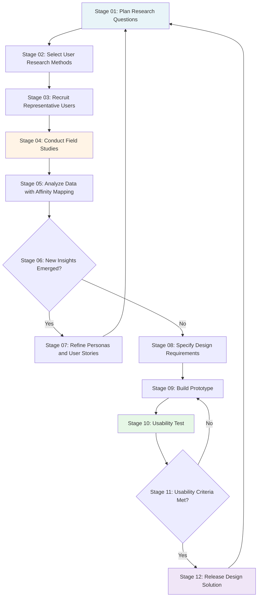
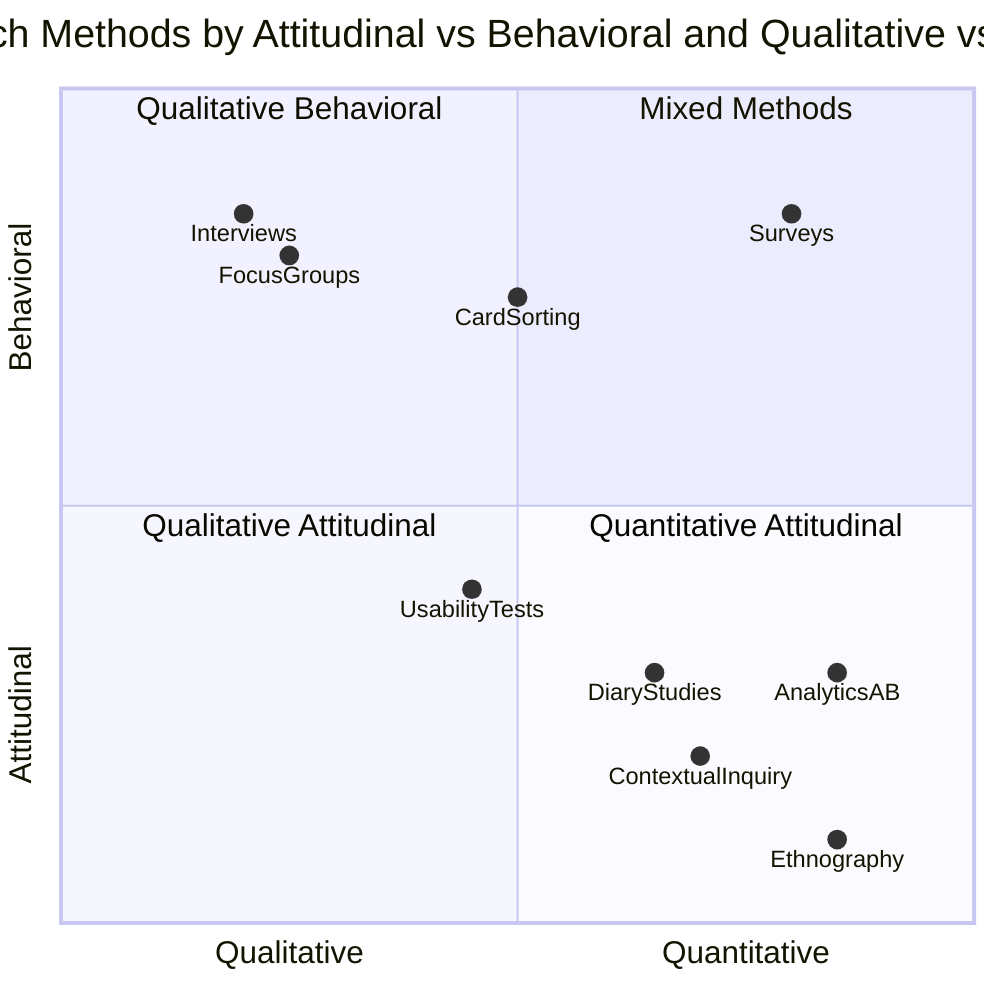
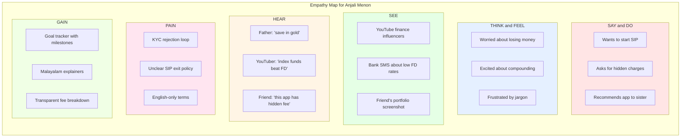
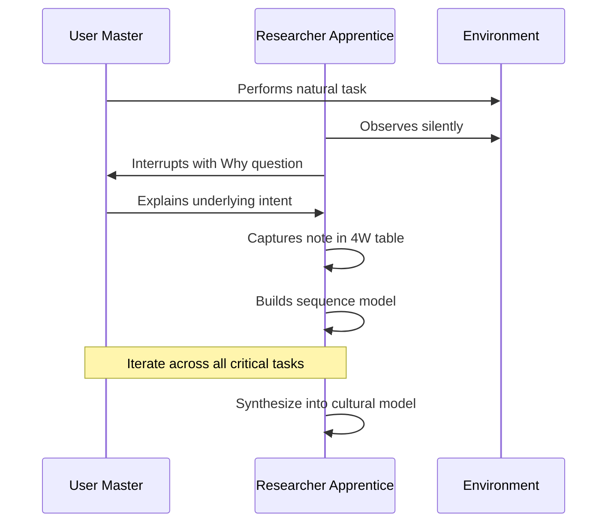
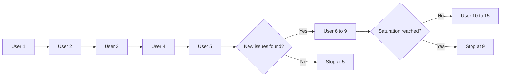

# User-Centered Design and Prototyping :- Understanding User Needs and Context - User research methods

<!-- SECTION_1_START -->
# User-Centered Design and Prototyping — Module 2: Understanding User Needs & Context

## 1. Core Technical Definition & Intuitive Overview

### 1.1 Formal Academic Definition

**User-Centered Design (UCD)** is a multidisciplinary design philosophy and iterative process framework in which the needs, wants, abilities, behaviors, and limitations of end-users are given extensive attention at each stage of the design lifecycle. As formalized in **ISO 9241-210:2019 (Ergonomics of human-system interaction — Part 210: Human-centred design for interactive systems)**, UCD is structured around four core activities:

1. **Understanding and specifying the context of use**
2. **Specifying the user requirements**
3. **Producing design solutions**
4. **Evaluating the design against requirements**

**User Research Methods** constitute the empirical toolkit used to execute Activity 1 and to inform Activity 2. They are systematic techniques for gathering qualitative and quantitative data about users, their goals, tasks, environments, and pain points — to inform evidence-based design decisions rather than assumptions.

> [!IMPORTANT]
> **KTU 2024 Syllabus Highlight — PECST865 Module 2**
> The module focuses on *translating user research insights into actionable design specifications*. The examiner typically expects students to demonstrate awareness of *which method fits which stage of the design funnel* (Discover → Define → Develop → Deliver).

---

### 1.2 Conceptual Analogy / Intuition

Imagine you are an **architect designing a kitchen** for someone you have never met.

- If you design it without ever asking the home cook, you will likely place the stove far from the refrigerator, the counter too low, and the lighting too dim — technically valid, practically useless.
- A **user-centered architect** would first **visit the home**, watch the family cook dinner (**observation**), ask the grandmother about her kneading habits (**interview**), hand them a journal to log what they struggled with this week (**diary study**), and then sketch a kitchen **prototype** for them to critique.

**User Research Methods are the architect's site visits.** They convert guesswork into grounded understanding.

> [!NOTE]
> **Key Principle — The Three Lenses of User Research**
> 1. **What users SAY** → Interviews, Surveys (stated needs — may be biased)
> 2. **What users DO** → Observation, Ethnography, Analytics (revealed needs — more reliable)
> 3. **What users CREATE** → Co-design workshops, Card sorting (synthesized needs — co-owned)

A senior HCI practitioner triangulates across all three lenses to overcome the well-known **say-do gap**.

---

### 1.3 Standard Metrics & Constants in UCD

The following quantitative anchors govern UCD evaluation (frequently tested in KTU):

| Metric | Symbol / Unit | Definition | Standard Threshold (Nielsen Norms) |
|---|---|---|---|
| **Task Success Rate** | $TSR$ (%) | Percentage of users who complete a task correctly | $\geq$ **78%** for acceptable usability |
| **Time on Task** | $T_{task}$ (sec) | Mean time to complete a defined task | Depends on complexity; baseline + comparison |
| **Error Rate** | $E_r$ (errors/user) | Average number of mistakes per user per task | $<$ **0.5** for critical tasks |
| **System Usability Scale** | $SUS$ (0–100) | Standardized 10-item Likert questionnaire | $\geq$ **68** = above average |
| **Net Promoter Score** | $NPS$ (-100 to +100) | Likelihood-to-recommend metric | $\geq$ **0** acceptable; $\geq$ **50** excellent |
| **Sample Saturation** | $n_{sat}$ | Number of participants until no new insights emerge | Typically **5–9** for qualitative (Nielsen, 2000) |
| **Efficiency Score** | $\eta = \frac{1}{T_{task}} \times 100$ | Inverse of mean task time | Higher is better |

> [!IMPORTANT]
> **Constant to Memorize:** Jakob Nielsen's **"5 users is enough"** rule for formative usability tests, because after the 5th user, you are observing the same usability problems repeatedly (diminishing returns).

---

### 1.4 GeoGebra / Desmos Integration (Context-of-Use Triangle)

User research operates within a classic **Context-of-Use Triangle**:

> [!VISUALIZATION CONTROL]
> **Concept:** Context-of-Use Triangle (User × Task × Environment)
> **GeoGebra / Desmos Input (Conceptual Coordinates):**
> * Point `A = (0, 0)` labeled `USER`
> * Point `B = (10, 0)` labeled `TASK`
> * Point `C = (5, 8.66)` labeled `ENVIRONMENT`
> **Visual Description:** A triangle with vertices USER, TASK, and ENVIRONMENT. Each side is a relationship (User-Task, User-Environment, Task-Environment). The DESIGN sits in the centroid — informed by all three sides. The student should observe that weakening any side destabilizes the design.

---
<!-- SECTION_1_END -->

<!-- SECTION_2_START -->
## 2. Deep Theoretical Analysis & KTU High-Yield Formula Sheet

### 2.1 The UCD Process — Operational Breakdown

UCD is **iterative**, not linear. Each loop refines understanding:

**Step 1 — Plan the User Research**
- Define research questions (e.g., *"What barriers prevent elderly users from completing online bill payments?"*)
- Choose methods aligned to the **research question type** (exploratory vs. evaluative).
- Recruit representative users using a **screener questionnaire**.

**Step 2 — Conduct Field Studies (Contextual Inquiry)**
- The 4W model: **Who** (user), **What** (task), **Where** (environment), **Why** (motivation).
- Use the **Master–Apprentice** model — the user is the master, the researcher is the apprentice.

**Step 3 — Analyze & Synthesize**
- Cluster observations into **affinity diagrams** (K-J Method).
- Build **personas** (fictional archetypal users) and **scenarios** (narratives of use).
- Construct **empathy maps** (Think, Feel, See, Hear, Say, Do, Pain, Gain).

**Step 4 — Specify Requirements**
- Translate insights into **user stories** in the format: *As a [persona], I want to [action], so that [outcome].*
- Prioritize via **MoSCoW** (Must, Should, Could, Won't).

**Step 5 — Validate via Prototyping**
- Build low-fidelity (paper, wireframe) → mid-fidelity (interactive mockup) → high-fidelity (functional) prototypes.
- Test with users in cycles.

> [!NOTE]
> **Why the loop matters in production:** Real-world UCD saves an estimated **$100 per usability issue caught in design vs. $10,000+ if caught post-release** (IBM Systems Sciences Institute). This is why UCD is mandated in ISO 9241-210 and regulated in medical device software (IEC 62366-1).

---

### 2.2 Classification of User Research Methods

User research methods divide along two principal axes: **Attitudinal vs. Behavioral** and **Qualitative vs. Quantitative**.

| Axis | Definition | Example Methods |
|---|---|---|
| **Attitudinal** | What users *say* they do | Interviews, Focus Groups, Surveys, Card Sorting |
| **Behavioral** | What users *actually* do | Observation, Ethnography, Diary Studies, Analytics, A/B Testing |

> [!TIP]
> **KTU-Most-Tested Pairing:** Be prepared to compare **Interviews (attitudinal/qualitative)** vs. **Surveys (attitudinal/quantitative)** and **Observation (behavioral/qualitative)** vs. **Analytics (behavioral/quantitative)**. Examiners love this 2×2 matrix.

---

### 2.3 The Six Primary User Research Methods — Detailed Profiles

#### Method 1 — Contextual Inquiry (CI)
- **Type:** Field interview + observation hybrid
- **Origin:** Hugh Beyer & Karen Holtzblatt (1998)
- **Procedure:** Researcher visits user's natural environment, observes work, then asks *"Why?"* questions.
- **Output:** Sequence-of-events models, cultural models, flow models, physical models.
- **When to use:** Early-stage discovery; complex enterprise workflows.

#### Method 2 — User Interviews
- **Type:** Semi-structured or unstructured qualitative
- **Sample size:** 5–15 per segment
- **Bias control:** Avoid leading questions; use the **"5 Whys"** technique.
- **Variant:** *Contextual Interview* (in-environment) vs. *Diary Interview* (retrospective).

#### Method 3 — Surveys & Questionnaires
- **Type:** Quantitative (mostly)
- **Scale types:** **Likert (1–5 or 1–7)**, **Semantic Differential**, **Net Promoter Score (NPS)**.
- **Sample size formula (finite population):**
$$n = \frac{N \cdot z^2 \cdot p(1-p)}{e^2 \cdot (N-1) + z^2 \cdot p(1-p)}$$
where $N$ = population, $z$ = confidence (1.96 for 95%), $p$ = 0.5 (max variance), $e$ = margin of error.

#### Method 4 — Ethnographic Observation
- **Type:** Long-term, immersive behavioral
- **Roles:** **Complete Participant** → **Participant-Observer** → **Observer-as-Participant** → **Complete Observer** (Gold's typology).
- **Output:** Thick descriptions, cultural models, work-practice findings.

#### Method 5 — Diary Studies
- **Type:** Longitudinal self-report (typically 1–4 weeks)
- **Tool:** Paper diary, mobile app, or SMS prompts.
- **Best for:** Infrequent events, contextual triggers, retrospective recall enhancement.

#### Method 6 — Card Sorting
- **Type:** Information architecture derivation
- **Variants:** **Open** (user creates categories) vs. **Closed** (user places into given categories).
- **Output:** Dendrogram (hierarchical cluster) and similarity matrix.

---

### 2.4 KTU High-Yield Formula Sheet — User Research Metrics

| Formula / Concept | Expression | Use Case |
|---|---|---|
| **Task Success Rate** | $TSR = \frac{N_{success}}{N_{total}} \times 100$ | Usability test outcomes |
| **Effectiveness Ratio** | $ER = \frac{\sum T_{success}}{\sum T_{all}}$ | Comparative efficiency |
| **Learnability Index** | $L = \frac{T_{first} - T_{final}}{T_{first}} \times 100$ | Improvement across sessions |
| **Saturation Curve Fit** | $n_{sat} = \text{smallest } n \text{ where } \frac{dI}{dn} < \epsilon$ | Stopping criterion for qual. research |
| **Cronbach's Alpha** | $\alpha = \frac{k}{k-1}\left(1 - \frac{\sum \sigma^2_{item}}{\sigma^2_{total}}\right)$ | Survey reliability ($\alpha \geq 0.7$ acceptable) |
| **SUS Score Normalization** | $SUS = \sum_{odd} (x_i - 1) + \sum_{even} (5 - x_i) \times 2.5$ | Standardized usability score (0–100) |
| **Persona Reach** | $PR = \frac{\sum P_i \cdot W_i}{\sum W_i}$ | Weighted persona coverage |
| **Efficiency Score** | $\eta = \frac{1}{T_{task}}$ | Inverse time-to-task |
| **Error Severity** | $ES = \frac{\sum (E_j \times S_j)}{N \cdot S_{max}}$ | Weighted error count |

> [!IMPORTANT]
> **KTU Pitfall:** Examiners commonly deduct marks if you confuse **TSR (correctness)** with **Efficiency (speed)**. They measure different qualities. TSR is binary per attempt; efficiency is continuous.

---

### 2.5 Engineering / Industry Utility

User research is **not optional** in modern engineering pipelines:

- **Medical Devices (FDA / IEC 62366-1):** Mandatory summative usability testing with representative users.
- **Automotive (ISO 15005 & ISO 26262):** HMI validation via user studies before driver-distraction certification.
- **Aviation (FAA Human Factors):** Formative testing required for cockpit interface certification.
- **Banking & FinTech:** KYC + accessibility audits (WCAG 2.2) require UCD-documented evidence.
- **Consumer Tech (Apple, Google, Microsoft):** Internal "Human Factors Labs" run continuous research.

> [!NOTE]
> **Production Reality:** At Google, every major product launch passes through at least **3 rounds of user research** (Foundational, Generative, Evaluative) with sample sizes of **5–20 per round** to satisfy the design-for-all mandate.

---
<!-- SECTION_2_END -->

<!-- SECTION_3_START -->
## 3. Step-by-Step Derivations, Frameworks & Comparative Analysis

### 3.1 Step-by-Step: Deriving the Minimum Sample Size for a Survey

**Problem:** You are designing a survey for a Kerala-based mobile payment app with **N = 50,000** active users. You want a **95% confidence level** and **$\pm 5\%$** margin of error. Find the minimum sample size.

**Step 1 — Identify the parameters.**
$$N = 50000, \quad z = 1.96, \quad p = 0.5, \quad e = 0.05$$

**Step 2 — Substitute into the formula.**
$$n = \frac{N \cdot z^2 \cdot p(1-p)}{e^2 \cdot (N-1) + z^2 \cdot p(1-p)}$$

**Step 3 — Compute the numerator.**
$$N \cdot z^2 \cdot p(1-p) = 50000 \times (1.96)^2 \times 0.5 \times 0.5$$
$$= 50000 \times 3.8416 \times 0.25$$
$$= 50000 \times 0.9604$$
$$= 48020$$

**Step 4 — Compute the denominator.**
$$e^2 \cdot (N-1) = (0.05)^2 \times 49999 = 0.0025 \times 49999 = 124.9975$$
$$z^2 \cdot p(1-p) = 3.8416 \times 0.25 = 0.9604$$
$$\text{Denominator} = 124.9975 + 0.9604 = 125.9579$$

**Step 5 — Divide.**
$$n = \frac{48020}{125.9579} \approx 381.27$$

**Step 6 — Round up (always).**
$$n_{min} = 382 \text{ respondents}$$

> [!IMPORTANT]
> **Result:** You need at least **382 responses** for statistically valid conclusions at 95% confidence. For qualitative interviews, this number is irrelevant — **saturation** is the criterion (typically 5–9 per persona segment).

---

### 3.2 Step-by-Step: Computing SUS Score from Raw Likert Ratings

The **System Usability Scale (SUS)** uses 10 items, alternating in tone. The standard 10-item instrument covers:
1. I think that I would like to use this system frequently.
2. I found the system unnecessarily complex. *(reverse scored)*
3. I thought the system was easy to use.
4. I think that I would need the support of a technical person. *(reverse scored)*
5. I found the various functions in the system were well integrated.
6. I thought there was too much inconsistency. *(reverse scored)*
7. I would imagine that most people would learn to use this system very quickly.
8. I found the system very cumbersome to use. *(reverse scored)*
9. I felt very confident using the system.
10. I needed to learn a lot of things before I could get going. *(reverse scored)*

**Worked Example — 5 users, raw scores per item:**

| Item | U1 | U2 | U3 | U4 | U5 |
|---|---|---|---|---|---|
| 1 (odd) | 4 | 5 | 4 | 3 | 5 |
| 2 (even) | 2 | 1 | 3 | 2 | 1 |
| 3 (odd) | 5 | 4 | 5 | 4 | 4 |
| 4 (even) | 2 | 1 | 1 | 3 | 2 |
| 5 (odd) | 4 | 3 | 4 | 5 | 4 |
| 6 (even) | 1 | 2 | 2 | 1 | 1 |
| 7 (odd) | 5 | 4 | 5 | 4 | 5 |
| 8 (even) | 2 | 1 | 2 | 2 | 1 |
| 9 (odd) | 4 | 5 | 4 | 5 | 4 |
| 10 (even) | 1 | 2 | 1 | 2 | 1 |

**Step 1 — Sum odd-item contributions (score - 1) per user.**

For U1: $(4-1) + (5-1) + (4-1) + (5-1) + (4-1) = 3 + 4 + 3 + 4 + 3 = 17$

For U2: $(5-1) + (4-1) + (3-1) + (4-1) + (5-1) = 4 + 3 + 2 + 3 + 4 = 16$

For U3: $(4-1) + (5-1) + (4-1) + (5-1) + (4-1) = 3 + 4 + 3 + 4 + 3 = 17$

For U4: $(3-1) + (4-1) + (5-1) + (4-1) + (5-1) = 2 + 3 + 4 + 3 + 4 = 16$

For U5: $(5-1) + (4-1) + (4-1) + (5-1) + (4-1) = 4 + 3 + 3 + 4 + 3 = 17$

**Step 2 — Sum even-item contributions (5 - score) per user.**

For U1: $(5-2) + (5-2) + (5-1) + (5-2) + (5-1) = 3 + 3 + 4 + 3 + 4 = 17$

For U2: $(5-1) + (5-1) + (5-2) + (5-1) + (5-2) = 4 + 4 + 3 + 4 + 3 = 18$

For U3: $(5-3) + (5-1) + (5-2) + (5-2) + (5-1) = 2 + 4 + 3 + 3 + 4 = 16$

For U4: $(5-2) + (5-3) + (5-1) + (5-2) + (5-2) = 3 + 2 + 4 + 3 + 3 = 15$

For U5: $(5-1) + (5-2) + (5-1) + (5-1) + (5-1) = 4 + 3 + 4 + 4 + 4 = 19$

**Step 3 — Total per user, then multiply by 2.5.**

| User | Odd | Even | Total | SUS = Total × 2.5 |
|---|---|---|---|---|
| U1 | 17 | 17 | 34 | **85.0** |
| U2 | 16 | 18 | 34 | **85.0** |
| U3 | 17 | 16 | 33 | **82.5** |
| U4 | 16 | 15 | 31 | **77.5** |
| U5 | 17 | 19 | 36 | **90.0** |

**Step 4 — Average SUS score.**
$$\overline{SUS} = \frac{85.0 + 85.0 + 82.5 + 77.5 + 90.0}{5} = \frac{420}{5} = 84.0$$

> [!NOTE]
> **Interpretation:** A SUS of **84.0** is in the **"Excellent"** band (top quartile). For reference, the global mean SUS is **68** (Bangor, Kortum & Miller, 2009).

---

### 3.3 Step-by-Step: Building an Affinity Diagram (KJ-Method)

**Step 1 — Record observations** (one fact per sticky note, raw data from interviews/observation).

**Step 2 — Cluster silently** without discussion — group notes that "feel" related.

**Step 3 — Label each cluster** with a **header note** (a synthesized insight).

**Step 4 — Form super-clusters** if patterns emerge across clusters.

**Step 5 — Translate** into design opportunities or user needs.

**Example Output (3 super-clusters from a Kerala bus-ticketing app study):**

| Super-Cluster | Cluster Header | Representative Quote |
|---|---|---|
| **Payment Friction** | "Users distrust entering card details" | *"What if the app stores my CVV? Risky."* |
| **Language Barrier** | "Malayalam toggle buried in settings" | *"I switched to English but the bus route stayed Malayalam."* |
| **Accessibility Gap** | "No support for elderly / low-vision users" | *"My mother can't read the small QR."* |

---

### 3.4 Comparative Analysis Matrix — Selecting the Right Method

The following decision matrix maps research goals to methods. This is **high-yield** for KTU essays.

| Research Goal | Best Method | Sample Size | Output Artifact | Bias Risk |
|---|---|---|---|---|
| Understand user goals, motivations | **Contextual Inquiry** | 5–15 | Workflow models | Observer effect |
| Quantify user satisfaction at scale | **Survey (SUS, NPS)** | 100+ (formula-derived) | Score distributions | Self-report bias |
| Test if a prototype works | **Usability Test** | 5–9 (Nielsen) | Task success metrics | Facilitator bias |
| Discover latent/cultural needs | **Ethnography** | 3–8 (longitudinal) | Cultural models | Hawthorne effect |
| Structure information architecture | **Card Sorting** | 15–30 | Dendrogram | Moderator bias |
| Track rare events over time | **Diary Study** | 10–30 (2–4 weeks) | Event logs | Compliance drop-off |
| Validate a design choice | **A/B Test** | 1000+ (power calc.) | Conversion delta | Novelty effect |
| Co-create design ideas | **Co-Design Workshop** | 6–12 per session | Sketches, prototypes | Dominant-voice bias |

---

### 3.5 Detailed Persona Construction — Worked Example

**Persona Template (Alan Cooper's Goal-Directed Design):**

| Field | Value |
|---|---|
| **Name** | Anjali Menon |
| **Photo / Archetype** | First-time digital investor, Kerala |
| **Demographics** | 28, B.Tech graduate, Ernakulam, ₹6 LPA |
| **Goals** | Build a ₹5L emergency fund in 3 years |
| **Frustrations** | Complex KYC forms; hidden charges |
| **Behaviors** | Researches on YouTube; trusts family referrals |
| **Quote** | *"I want SIPs that explain themselves."* |
| **Primary Scenario** | Sets up a monthly ₹2,000 SIP on the app |

> [!TIP]
> **KTU Validity Tip:** A good persona is **specific** (named, with a photo) but **representative** (based on real research with multiple users). Generic personas like *"User A, 25"* will lose you marks.

---
<!-- SECTION_3_END -->

<!-- SECTION_4_START -->
## 4. Structural Diagrams & Schematics

### 4.1 UCD Iterative Lifecycle (Mermaid Flowchart)

### 4.2 The 2×2 User Research Method Matrix (Mermaid Quadrant)

### 4.3 Empathy Map (Mermaid Block Diagram)

### 4.4 Contextual Inquiry Master-Apprentice Model (Mermaid Sequence)

### 4.5 Nielsen's Sample-Size Diminishing Returns (Conceptual Curve)

> [!NOTE]
> **Visual Interpretation:** After 5 users, you uncover ~85% of usability issues. After 15 users, ~95%. The curve flattens — additional users yield diminishing returns.

---
<!-- SECTION_4_END -->

<!-- SECTION_5_START -->
## 5. KTU 2024 Scheme Examination Question Bank & Topic Recap

### 5.1 Part A Questions (3 Marks Each)

#### Q1. [KTU University Exam — July 2024]
**Define User-Centered Design. List any four activities specified in ISO 9241-210.**

**Model Answer (3 Marks):**
- **Definition (1 Mark):** User-Centered Design (UCD) is a design philosophy in which the needs, wants, and limitations of end-users are given extensive attention at every stage of the design process.
- **Four ISO 9241-210 Activities (2 Marks — 0.5 each):**
  1. Understanding and specifying the **context of use**
  2. **Specifying the user requirements**
  3. Producing **design solutions**
  4. **Evaluating** the design against requirements for iteration

---

#### Q2. [KTU University Exam — Dec 2023]
**Differentiate between qualitative and quantitative user research methods with one example each.**

**Model Answer (3 Marks):**
- **Qualitative** (1.5 Marks): Non-numerical, exploratory; focuses on *why* and *how*. Yields rich, contextual insights but small samples. **Example:** Contextual Inquiry.
- **Quantitative** (1.5 Marks): Numerical, statistical; focuses on *how many* and *how often*. Yields generalizable metrics but shallow insight. **Example:** SUS Survey.
- *Bonus credit:* Mention that methods can be **mixed-method** (e.g., survey + interview) for triangulation.

---

### 5.2 Part B Questions (14 Marks — Internal Choice)

#### QUESTION A — [KTU University Exam — July 2024, Module 2]

**A) (7 Marks)** Explain in detail the **Contextual Inquiry** method of user research. Discuss its four key principles and the four models it produces.

**Model Solution — Part A:**

**(i) Definition (2 Marks):**
Contextual Inquiry, developed by Beyer and Holtzblatt (1998), is a user research method that combines **in-depth interviews with workplace observation**. The researcher visits the user's natural environment and studies work as it actually happens, rather than relying on abstracted reports.

**(ii) Four Key Principles (3 Marks — 0.75 each):**
1. **Context** — Go to the user's actual workplace. Data captured in situ is richer than recall.
2. **Partnership** — Researcher and user collaborate; the user is the *master* of their work, the researcher the *apprentice*.
3. **Interpretation** — The researcher shares evolving interpretations with the user for validation.
4. **Focus** — Each session has a defined focus, gradually building a complete picture.

**(iii) Four Output Models (2 Marks — 0.5 each):**
1. **Flow Model** — Communication, interaction, and information flow between people and systems.
2. **Sequence Model** — Chronological order of actions to complete a task.
3. **Artifact Model** — Physical objects and their structure (paper, screens, files).
4. **Cultural Model** — Shared assumptions, values, and constraints influencing work.

> [!WARNING]
> **Examiner Pitfall:** Students often confuse the *four principles* with the *four models*. These are **two different sets**. Naming the principles incorrectly as the models (e.g., writing "Context, Partnership, Interpretation, Focus" under "models") will cost you 2 marks immediately.

---

**B) (7 Marks)** Compare and contrast **User Interviews**, **Surveys**, and **Ethnography** across the dimensions of *data type, sample size, bias risk, and appropriate use stage*. Justify with one example application each.

**Model Solution — Part B:**

| Dimension | User Interviews | Surveys | Ethnography |
|---|---|---|---|
| **Data Type** (1.5 Marks) | Rich qualitative (narrative) | Structured quantitative (scores) | Immersive qualitative (cultural) |
| **Sample Size** (1.5 Marks) | 5–15 per segment | 100+ (formula-derived, e.g., 382) | 3–8 (longitudinal) |
| **Bias Risk** (1.5 Marks) | Facilitator bias; recall bias | Self-report bias; non-response bias | Hawthorne effect; observer effect |
| **Use Stage** (1.5 Marks) | Early discovery, mid-design validation | Baseline measurement, post-launch tracking | Early discovery of latent/cultural needs |

**Examples (1 Mark total — 0.33 each):**
- **Interview:** Discovering pain points of first-time mutual-fund investors.
- **Survey:** Measuring SUS scores across 1,000 banking app users to benchmark against industry norm.
- **Ethnography:** Spending two weeks with fisherfolk in coastal Kerala to understand informal credit practices before designing a microloan app.

---

#### QUESTION B — [KTU University Exam — Dec 2023, Module 2] — *Alternative Choice*

**A) (7 Marks)** Discuss the **affinity diagram (KJ-method)** for synthesizing user research data. Walk through the step-by-step procedure with an illustrative example for a smart-classroom interface.

**Model Solution — Part A:**

**Definition (1 Mark):**
The affinity diagram, based on the Kawakita-Jiro (KJ) method, is a **group synthesis technique** that organizes large volumes of qualitative observations into meaningful thematic clusters to surface latent patterns.

**Step-by-Step Procedure (4 Marks — 1 each major step):**
1. **Record** — Each observation/insight is written on a separate sticky note (one fact per note).
2. **Cluster Silently** — Team members group notes that "feel" related *without* discussion to avoid premature consensus.
3. **Label Clusters** — Each group is given a header note describing the common theme (an insight, not just a topic).
4. **Form Super-Clusters** — When 5–7 primary clusters emerge, look for higher-order relationships and group them.

**Illustrative Example — Smart-Classroom Interface (2 Marks):**

| Super-Cluster | Cluster Theme | Sample Observations |
|---|---|---|
| **Teacher Control Friction** | "Too many clicks to switch slides" | "I had to leave the desk to project" |
| **Student Engagement Gap** | "Quiet students never interact" | "Polls help but anonymous mode abused" |
| **Accessibility Concerns** | "Font too small on projector" | "Dyslexic student missed the handout" |

**Synthesis (Optional, for full credit):** Translate each super-cluster into a *design opportunity*:
- *Voice + remote control* for slide navigation
- *Equitable participation timer* in polls
- *Dynamic font scaling* based on projection distance

> [!WARNING]
> **Examiner Pitfall:** Writing "we group similar items" without enumerating the **silent** nature of the clustering (no discussion) loses 1 mark. The *silence* is what suppresses dominant-voice bias.

---

**B) (7 Marks)** Explain **Personas** and **User Journey Maps** as UCD artifacts. Construct a one-page persona and a corresponding 3-stage journey map for a senior citizen using a *Kerala State e-Health portal* for the first time.

**Model Solution — Part B:**

**Persona — Definition (1 Mark):**
A persona is a **fictional, research-grounded archetype** of a target user, representing a cluster of similar users. (Alan Cooper, Goal-Directed Design.)

**Sample Persona (2 Marks):**

| Field | Value |
|---|---|
| Name | Ramankutty Nair |
| Age | 68, retired schoolteacher, Thrissur |
| Tech Comfort | Low — uses WhatsApp voice notes only |
| Goals | Book a cardiology follow-up online without going to PHC |
| Frustrations | English-only forms, tiny CAPTCHA, no voice option |
| Quote | *"My grandson is busy. I need to do this myself."* |

**User Journey Map — Definition (1 Mark):**
A user journey map is a **visual narrative** of the user's interactions with a system across **time, touchpoints, and emotional states**, used to identify pain points and opportunities.

**3-Stage Journey Map (3 Marks — 1 per stage):**

| Stage | Touchpoint | Action | Emotion | Pain Point | Opportunity |
|---|---|---|---|---|---|
| **1. Awareness** | Google search "eHealth Kerala" | Reads government site | Curious but cautious | Site cluttered with PDF links | Provide a single, large "Book Appointment" button |
| **2. Booking** | Login + form | Enters patient ID, selects hospital, doctor | Frustrated, confused | ID mismatch, no Malayalam | Voice-guided form, Malayalam toggle at top |
| **3. Confirmation** | SMS arrives | Reads confirmation | Relieved, slightly proud | SMS lacks date in Malayalam calendar | Bilingual SMS with Malayalam date + voice call backup |

> [!WARNING]
> **Examiner Pitfall:** A persona is **not** a demographic profile alone. Without **goals, frustrations, behaviors, and a quote**, it scores zero. A journey map without **emotion column** is incomplete — emotion is what differentiates it from a plain task list.

---

### 5.3 KTU Examiner's Valuation Warning / Pitfall Summary

> [!WARNING]
> **Common Mark-Loss Patterns in Module 2 — User Research Methods:**
> 1. **Conflating attitudinal with behavioral** — Interviews = attitudinal; Observation = behavioral. Mixing them is a -2 mark error.
> 2. **Confusing qualitative sample size rules with quantitative** — Qualitative saturation is **5–9 per segment**, not the statistical 382 from the survey formula.
> 3. **Skipping the "Why this method" justification** — Examiners want a *reasoned choice*, not just a method list.
> 4. **Omitting the bias discussion** — Every method has a bias. State it explicitly: *observer effect*, *Hawthorne effect*, *social desirability bias*, *recall bias*, *non-response bias*.
> 5. **Confusing ISO 9241-210 with ISO 13407** — 9241-210 is the **current** standard; 13407 is the **deprecated predecessor**.
> 6. **Forgetting the "Three Lenses" triangulation** — Always state that best practice combines SAY + DO + CREATE data.
> 7. **Mistaking Nielsen's 5-user rule for all research** — The rule applies to **formative usability tests**, not surveys or ethnographic studies.

---

### 5.4 Topic Recap & Important Things to Remember

- **UCD (ISO 9241-210)** is structured around 4 activities: context-of-use → requirements → solutions → evaluation.
- The **three lenses of user research** are: SAY (interviews/surveys), DO (observation/analytics), CREATE (co-design/card sort).
- **Six primary methods:** Contextual Inquiry, Interviews, Surveys, Ethnography, Diary Studies, Card Sorting.
- **Contextual Inquiry** has *4 principles* (Context, Partnership, Interpretation, Focus) and produces *4 models* (Flow, Sequence, Artifact, Cultural) — do not confuse them.
- **Surveys** require a sample size formula — for $N = 50{,}000$, $z = 1.96$, $e = 0.05$, $p = 0.5$, the minimum is **382**.
- **SUS** is computed as $(sum_{odd} (x - 1) + sum_{even} (5 - x)) \times 2.5$; a score of $\geq 68$ is above average, $\geq 80$ is excellent.
- **Nielsen's sample size rule:** **5 users** in formative usability tests uncover ~85% of issues; 15 users uncover ~95%.
- **Personas** must be *specific, named, and goal-driven*; **journey maps** must include an *emotion* column.
- **Affinity diagrams (KJ-method)** cluster *silently* before labeling — silence prevents dominant-voice bias.
- **Bias vocabulary** to memorize: observer effect, Hawthorne effect, social desirability, recall bias, non-response, novelty effect, moderator bias.
- **Triangulation** (mixed methods) is the gold standard — combine qualitative depth with quantitative scale.
- **Privacy & Ethics:** User research mandates **informed consent**, anonymization, and the right to withdraw — mandated by IEC 62366-1 for medical devices and GDPR for EU users.
- **Saturation curve** dictates when to stop qualitative research — not statistical power.
- **Card sorting** is the canonical method for information architecture — output is a *dendrogram*.
- **Diary studies** capture *infrequent* events over 1–4 weeks — best complement to single-session observation.
- **MoSCoW prioritization** (Must/Should/Could/Won't) is the standard for translating research into requirements.
- **User story format:** *As a [persona], I want to [action], so that [outcome]* — the canonical handoff from research to design.

> [!IMPORTANT]
> **KTU 2024 Final Tip for Module 2:** When asked *which method to use*, always answer in three parts — **(1) research goal, (2) method, (3) justification + bias acknowledged**. This single discipline typically shifts a 6-mark answer to a 9-mark one.
<!-- SECTION_5_END -->
