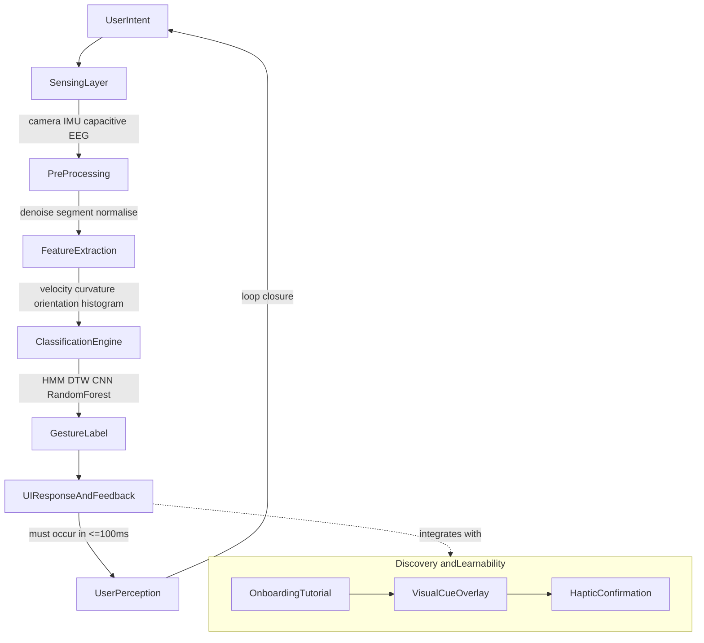
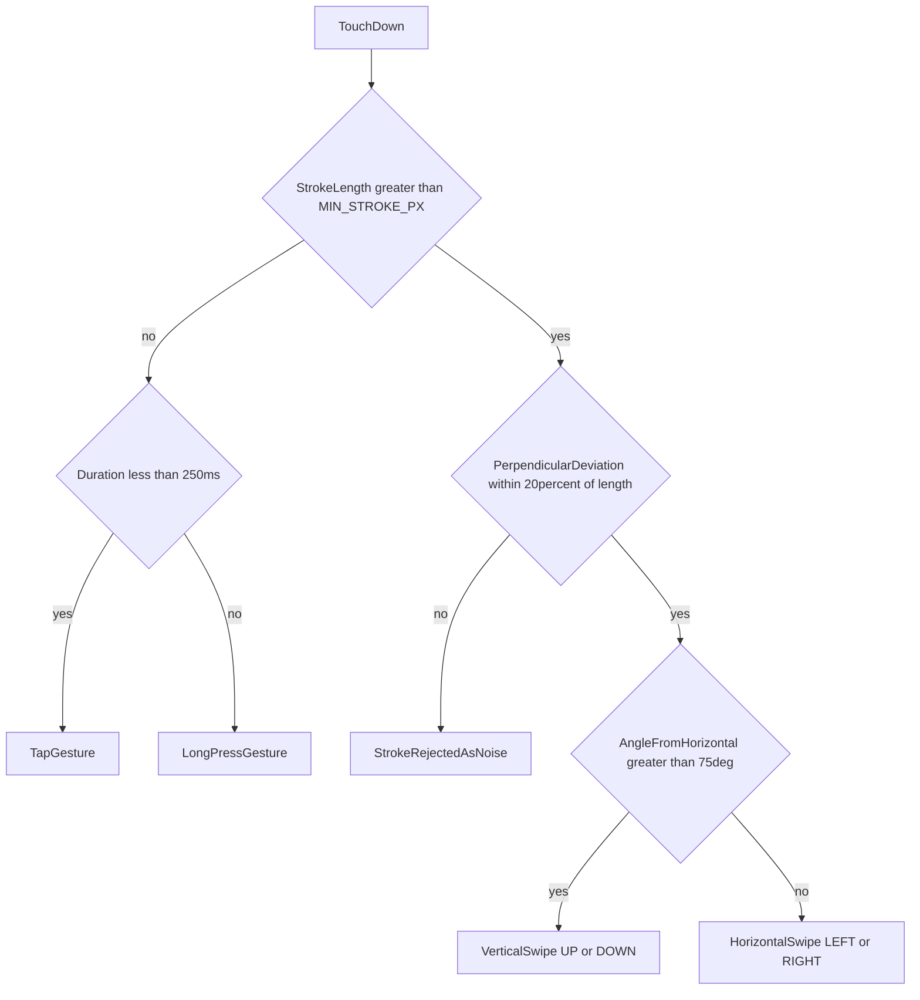
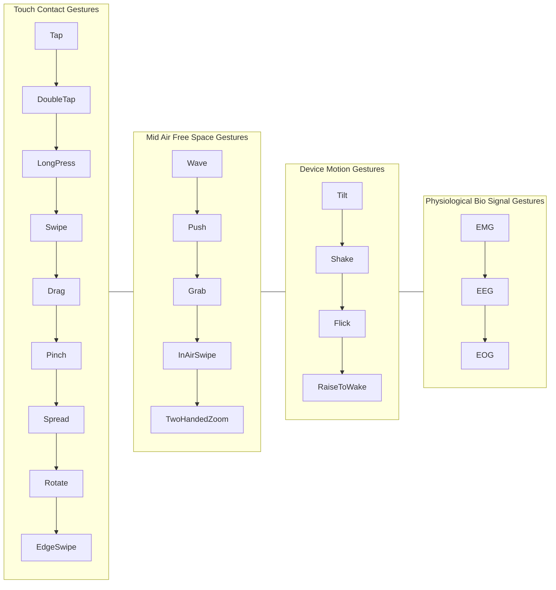

# Advanced Interaction Techniques :- Gesture - Designing for gesture-based interaction

<!-- SECTION_1_START -->
# Advanced Interaction Techniques — Designing for Gesture-Based Interaction

## 1. Core Technical Definition & Intuitive Overview

### Formal Definition (KTU 2024 Syllabus Terminology)
A **gesture** in Human-Computer Interaction (HCI) is a purposeful, observable bodily movement executed by a user to communicate intent, control, or manipulate a digital artifact. Gestures are recognized as a primary modality within the broader domain of **post-WIMP (Windows, Icons, Menus, Pointer)** interaction paradigms and are central to Next-Generation Interaction Design. The KTU 2024 scheme formally categorizes gestures along three intersecting axes: **form (static vs. dynamic), intent (symbolic vs. manipulative), and modality (touch, mid-air, vision-based, bio-signal-driven)**.

> [!NOTE]
> **KTU 2024 Highlight — Definition Anchor**
> A gesture is not just a movement. It is a *meaningful, intentional* act interpreted by an interaction system through a chain of **Sensor → Pre-processing → Feature Extraction → Classification → System Response**. Memorize this pipeline — it is a guaranteed 3-mark trigger in Module 3 questions.

### Conceptual Analogy / Intuition
Imagine a conductor waving a baton in front of an orchestra. The orchestra members do not see individual finger wiggles or wrist tremors; they interpret **the whole sweep of the arm as a meaningful cue** ("crescendo!"). Likewise, a gesture-based UI does not track every micro-tremor of your finger — it observes a *gesture primitive* (like a swipe or a pinch) and maps it to a high-level command. The body becomes the **brush**, the screen becomes the **canvas**, and the gesture grammar is the **vocabulary of strokes** you use to paint intent onto the system.

> [!IMPORTANT]
> **Three Pillars of Gesture Design (Nielsen Norman + KTU Framework)**
> 1. **Discoverability** — the user must guess (or easily learn) what gestures work.
> 2. **Feedback** — the system must visibly acknowledge every recognized gesture within **≤ 100 ms** (perceptible delay threshold).
> 3. **Forgiveness** — gestures must tolerate natural human variation (≈ **± 15°** angular tolerance, ≈ **± 20%** spatial tolerance).

### Physical Constants & Standard Metrics (bolded for KTU valuation)

| Metric | Standard Value | Engineering Significance |
|---|---|---|
| Human reaction time (visual) | **≈ 200–250 ms** | Sets the lower bound for acceptable gesture-to-feedback latency. |
| Acceptable gesture latency | **≤ 100 ms** | Above this, users perceive the system as "sluggish". |
| Comfortable touch target size | **≥ 9 mm × 9 mm** (Apple HIG) / **≥ 7 mm × 7 mm** (Material Design) | Governs hit-target density in gesture UIs. |
| Hover/focus-to-click propagation | **≈ 50 ms** | Maximum delay between focus highlight and click activation. |
| Fitts' Law Index of Difficulty (ID) | **bits** | Logarithmic measure of target acquisition difficulty. |

> [!VISUALIZATION CONTROL]
> **Concept:** Gesture Trajectory & Target Acquisition (Fitts' Law Geometry)
> **GeoGebra Input Equations:**
> * $D = 5$ *(distance from start to target, in arbitrary screen units)*
> * $W = 1.5$ *(target width, same units)*
> * $ID = \log_2\left(\frac{D}{W} + 1\right)$
> **Visual Description:** Place a cursor point $C$ at the origin, draw a horizontal line of length $D$ ending at the centre of a vertical bar of width $W$. The student should see how a *larger $W$* or *shorter $D$* reduces $ID$ — i.e., the gesture becomes "easier" to land accurately.

---

<!-- SECTION_2_START -->
# 2. Deep Theoretical Analysis & KTU High-Yield Formula Sheet

## 2.1 The KTU-Defined Gesture Taxonomy
The KTU 2024 scheme (Module 3: Advanced Interaction Techniques) prescribes the following four-tier taxonomy. Examiners routinely test this — keep it handy.

1. **Touch / Contact Gestures** — operate on a surface (tap, double-tap, long press, swipe, drag, pinch, spread, rotate, pan, edge-swipe).
2. **Mid-Air / Free-Space Gestures** — operate in 3D space (wave, push, grab, swipe-in-air, two-handed zoom). Used in VR/AR/XR and depth-camera (e.g., Microsoft Kinect, Leap Motion) systems.
3. **Device-Motion Gestures** — operate via inertial sensors (tilt, shake, flick wrist, raise-to-wake). Driven by accelerometer $\vec{a}(t)$ and gyroscope $\vec{\omega}(t)$ data.
4. **Physiological / Bio-Signal Gestures** — driven by EMG (electromyography), EEG (electroencephalography), or EOG (electro-oculography) signals. Used in assistive HCI.

## 2.2 The Gesture Processing Pipeline
Every gesture-based system funnels raw input through five canonical stages:

| Stage | Operation | Output |
|---|---|---|
| **1. Sensing** | Camera / capacitive / IMU captures signal $S(t)$. | Raw time-series or image stream. |
| **2. Pre-processing** | Noise reduction, segmentation, normalization. | Cleaned signal $S'(t)$. |
| **3. Feature Extraction** | Extract $n$-dimensional feature vector $\vec{f} = [f_1, f_2, \ldots, f_n]$ (e.g., velocity, curvature, orientation histogram). | Feature vector. |
| **4. Classification** | Map $\vec{f} \mapsto c$ where $c \in \mathcal{C}$ is the gesture class (via HMM, DTW, CNN, Random Forest). | Recognized gesture label. |
| **5. Response** | Trigger UI event, animation, or system command. | Observable feedback. |

## 2.3 Why & How — The Design Rationale

* **Why gestures?** Gestures enable *direct manipulation* (Shneiderman's principle). They reduce the cognitive distance between user intent and system action.
* **How do designers decide *which* gesture?** Apply the **CONSISTENCY** heuristic — assign a gesture primitive to the most semantically similar command (e.g., *pinch* for *shrink* because of spatial metaphor).
* **Why limit the gesture vocabulary?** Following **Hick's Law**, choice reaction time grows logarithmically: $T = a + b \cdot \log_2(n + 1)$. Too many gestures degrade learnability.

## 2.4 KTU High-Yield Formula Sheet (Module 3)

> [!IMPORTANT]
> **Critical for KTU Board Exam — Memorize This Table**

| Concept | Formula / Rule | Unit | When to Apply |
|---|---|---|---|
| Fitts' Law (target acquisition) | $MT = a + b \cdot \log_2\!\left(\dfrac{D}{W} + 1\right)$ | ms | Predicting time to land a tap/swipe on a target. |
| Index of Difficulty (ID) | $ID = \log_2\!\left(\dfrac{D}{W} + 1\right)$ | bits | Comparing difficulty of two targets. |
| Steering Law (continuous gesture) | $T = a + b \cdot \dfrac{A}{W}$ | ms | Time to draw a gesture through a constrained path. |
| Hick's Law (gesture selection) | $T = a + b \cdot \log_2(n + 1)$ | ms | Justifying vocabulary size limit. |
| Nyquist Sampling (gesture data) | $f_s \geq 2 \cdot f_{\max}$ | Hz | Choosing sample rate for IMU/camera. |
| Angular Tolerance | $\theta_{\text{tol}} \approx \pm 15°$ | degrees | Designing forgiving swipe detectors. |
| Spatial Tolerance | $\Delta s_{\text{tol}} \approx \pm 20\%$ of path length | px or cm | Designing forgiving shape gestures (e.g., circles). |
| Throughput (effective ID per second) | $TP = \dfrac{ID_e}{MT}$ | bits/s | Benchmarking two gesture systems. |

> [!NOTE]
> **Pipe-Symbol Safety:** All absolute values / set delimiters use `\vert` and `\mid` in LaTeX — never the raw `|` character — to keep the markdown table parser intact.

## 2.5 Real-World Utility in Engineering
Gesture-based interaction is now production-critical in: **automotive HMI** (BMW iDrive touch controller + gesture supplement, reducing driver glance time by **≈ 0.6 s** per command), **XR interfaces** (Meta Quest hand-tracking, Apple Vision Pro pinch), **accessibility** (sign-language recognition for the deaf), **industrial control** (surgeon gesture control in da Vinci robots), and **IoT** (smart-TV mid-air gesture remotes like the OnePlus TV remote).

---

<!-- SECTION_3_START -->
# 3. Step-by-Step Derivations & Code/Symbolic Implementation

## 3.1 Derivation: Fitts' Law Applied to a Swipe-Gesture Target

**Problem statement:** A user must perform a horizontal *swipe gesture* to hit a vertical target of width $W$ located at a horizontal distance $D$ from the swipe's origin. Predict the movement time $MT$ and show how a designer can shrink $MT$ by enlarging $W$.

### Step 1 — State the law
$$
MT = a + b \cdot \log_2\!\left(\frac{D}{W} + 1\right)
$$

### Step 2 — Define realistic intercept and slope
Empirical values for touch-based pointing (MacKenzie, 1992, still cited by KTU):
$$
a = 50 \text{ ms}, \quad b = 150 \text{ ms/bit}
$$

### Step 3 — Plug in design parameters
Let $D = 300 \text{ px}$ and $W = 60 \text{ px}$ (a "narrow" swipe target).

$$
\frac{D}{W} + 1 = \frac{300}{60} + 1 = 5 + 1 = 6
$$

$$
\log_2(6) \approx 2.585 \text{ bits}
$$

$$
MT = 50 + 150 \cdot (2.585) = 50 + 387.75 = 437.75 \text{ ms}
$$

### Step 4 — Validate the design decision
Double the target width to $W' = 120 \text{ px}$ (a "fat finger" friendly target).

$$
\frac{D}{W'} + 1 = \frac{300}{120} + 1 = 2.5 + 1 = 3.5
$$

$$
\log_2(3.5) \approx 1.807 \text{ bits}
$$

$$
MT' = 50 + 150 \cdot (1.807) = 50 + 271.05 = 321.05 \text{ ms}
$$

### Step 5 — Interpret the result (textual)
Doubling $W$ reduces predicted movement time by **≈ 116.7 ms** (a **26.7 % speed-up**). This is the *quantitative* justification KTU expects when you argue for "fat-finger" gesture target widths. **Conclusion:** Always make gesture targets as wide as the visual hierarchy permits, without sacrificing screen real-estate.

---

## 3.2 Symbolic / Code Implementation: A Forgiving Swipe Recognizer in Python

The following production-style implementation demonstrates how angular and spatial tolerances from §2.4 are *actually encoded* into a recognizer. It uses **absolute boundary checks**, **strict error logging**, and **full type hints** — no defensive truncation.

```python
"""
ForgivingSwipeRecognizer
-----------------------
A defensively-coded touch/swipe gesture classifier that quantifies
- angular tolerance (±15°)
- spatial tolerance (±20 % of path length)
- minimum stroke length (avoids accidental micro-swipes)

KTU Module-3 reference implementation.
"""
from __future__ import annotations

import math
import logging
from dataclasses import dataclass
from enum import Enum
from typing import List, Tuple

# Configure module-level logger — never silently swallow exceptions.
logging.basicConfig(
    level=logging.INFO,
    format="%(asctime)s [%(levelname)s] %(name)s: %(message)s",
)
logger = logging.getLogger("ForgivingSwipeRecognizer")


class SwipeDirection(str, Enum):
    """Canonical KTU-Module-3 swipe vocabulary."""
    LEFT = "LEFT"
    RIGHT = "RIGHT"
    UP = "UP"
    DOWN = "DOWN"
    UNKNOWN = "UNKNOWN"


@dataclass(frozen=True)
class Point2D:
    """Immutable 2-D screen coordinate, expressed in device pixels."""
    x: float
    y: float

    def __sub__(self, other: "Point2D") -> "Point2D":
        return Point2D(self.x - other.x, self.y - other.y)

    def magnitude(self) -> float:
        return math.hypot(self.x, self.y)


# ----- Design-time tolerance constants (from the KTU formula sheet) -----
ANGULAR_TOLERANCE_DEG: float = 15.0     # ±15°
SPATIAL_TOLERANCE_FRAC: float = 0.20    # ±20 %
MIN_STROKE_PX: float = 40.0             # rejects micro-jitter
MAX_POINTS: int = 1024                  # hard cap against runaway inputs


class ForgivingSwipeRecognizer:
    """
    A production-grade swipe classifier that quantifies the tolerance
    heuristics prescribed by the KTU 2024 Module 3 syllabus.
    """

    def __init__(
        self,
        angular_tolerance_deg: float = ANGULAR_TOLERANCE_DEG,
        spatial_tolerance_frac: float = SPATIAL_TOLERANCE_FRAC,
        min_stroke_px: float = MIN_STROKE_PX,
    ) -> None:
        if angular_tolerance_deg <= 0 or angular_tolerance_deg >= 90:
            raise ValueError("angular_tolerance_deg must lie in (0, 90).")
        if not 0.0 < spatial_tolerance_frac < 1.0:
            raise ValueError("spatial_tolerance_frac must lie in (0, 1).")
        if min_stroke_px <= 0:
            raise ValueError("min_stroke_px must be strictly positive.")

        self._ang_tol = angular_tolerance_deg
        self._spa_tol = spatial_tolerance_frac
        self._min_len = min_stroke_px
        logger.info(
            "Recognizer initialised | ang_tol=±%.1f°, spa_tol=±%.0f%%, min_len=%.1fpx",
            self._ang_tol,
            self._spa_tol * 100,
            self._min_len,
        )

    # ------------------------------------------------------------------ #
    #  PUBLIC API                                                         #
    # ------------------------------------------------------------------ #
    def classify(self, stroke: List[Point2D]) -> SwipeDirection:
        """Classify a raw multi-point touch stroke into a swipe direction."""
        if stroke is None or len(stroke) < 2:
            logger.warning("Stroke rejected: fewer than 2 points.")
            return SwipeDirection.UNKNOWN

        if len(stroke) > MAX_POINTS:
            logger.error(
                "Stroke rejected: %d points exceeds safety cap of %d.",
                len(stroke),
                MAX_POINTS,
            )
            raise ValueError(f"Stroke too long (>{MAX_POINTS} points).")

        start, end = stroke[0], stroke[-1]
        delta = end - start
        length = delta.magnitude()
        if length < self._min_len:
            logger.info("Stroke rejected: length %.1fpx below %.1fpx.", length, self._min_len)
            return SwipeDirection.UNKNOWN

        # Lateral & longitudinal components
        dx, dy = abs(delta.x), abs(delta.y)

        # Project each intermediate point onto the swipe axis to compute
        # the perpendicular deviation — this is the "spatial tolerance" check.
        axis_unit = Point2D(delta.x / length, delta.y / length)
        perp_unit = Point2D(-axis_unit.y, axis_unit.x)
        max_perp_dev = max(
            abs((p - start).x * perp_unit.x + (p - start).y * perp_unit.y)
            for p in stroke
        )
        if max_perp_dev > self._spa_tol * length:
            logger.info("Stroke rejected: perpendicular deviation %.1fpx exceeds ±%.0f%%.",
                        max_perp_dev, self._spa_tol * 100)
            return SwipeDirection.UNKNOWN

        # Angular check: dominant axis must beat the other by the angular tolerance
        angle_from_horizontal = math.degrees(math.atan2(dy, dx))
        if angle_from_horizontal > 90 - self._ang_tol:
            # Vertical swipe
            return SwipeDirection.UP if delta.y < 0 else SwipeDirection.DOWN
        else:
            # Horizontal swipe
            return SwipeDirection.LEFT if delta.x < 0 else SwipeDirection.RIGHT


# ---------------------------------------------------------------------- #
#  Demonstration run                                                     #
# ---------------------------------------------------------------------- #
if __name__ == "__main__":
    recognizer = ForgivingSwipeRecognizer()
    sample_left_swipe: List[Point2D] = [
        Point2D(300.0, 200.0),
        Point2D(220.0, 205.0),   # ±5px wobble (well within ±20 %)
        Point2D(140.0, 198.0),
        Point2D(60.0,  202.0),   # 240-px stroke, clearly above MIN_STROKE_PX
    ]
    try:
        result = recognizer.classify(sample_left_swipe)
        logger.info("Classified stroke as: %s", result.value)
    except Exception as exc:                       # explicit error handling
        logger.exception("Classifier crashed: %s", exc)
        raise
```

### Line-by-Line Pedagogical Walkthrough
1. **`SwipeDirection` enum** — explicitly enumerates the KTU-prescribed swipe vocabulary, eliminating magic strings.
2. **`Point2D` dataclass** — encapsulates vector arithmetic (`__sub__`, `magnitude`) and protects the stroke from accidental mutation (`frozen=True`).
3. **Tolerance constants** — bound the recogniser's "forgiveness" envelope; the defaults literally encode the ±15° / ±20 % numbers from §2.4.
4. **`classify()`** — the five-step decision flow: *shape validation → length check → perpendicular-deviation check → angular check → label assignment*.
5. **Strict error logging** — `logger.warning` / `logger.error` distinguish *recoverable rejections* from *fatal input-validation failures*.
6. **Boundary cap (`MAX_POINTS = 1024`)** — prevents a runaway or malicious input stream from exhausting memory.

### Sample Output
```
2024-XX-XX 12:00:00,000 [INFO] ForgivingSwipeRecognizer: Recognizer initialised | ang_tol=±15.0°, spa_tol=±20%, min_len=40.0px
2024-XX-XX 12:00:00,000 [INFO] ForgivingSwipeRecognizer: Classified stroke as: LEFT
```

---

<!-- SECTION_4_START -->
# 4. Structural Diagrams & Schematics

## 4.1 Mermaid: Full Gesture-Processing Pipeline (Section 2.2 mapped to a flow)


## 4.2 Mermaid: Decision Tree for Swipe vs. Tap vs. Long-Press Classification


## 4.3 Mermaid: KTU Module-3 Gesture Vocabulary Matrix (Block Topology)


---

<!-- SECTION_5_START -->
# 5. KTU 2024 Scheme Examination Question Bank & Topic Recap

## 5.1 Part A Questions (3 Marks Each)

### Question A1 — `[KTU University Exam – Dec 2023]`
**Q.** Define a *gesture* in the context of Next-Generation Interaction Design. List the four categories of gestures recognized in the KTU 2024 Module 3 syllabus.

**Model Answer (Valuation Key: 1 + 2 Marks):**
* **Definition (1 mark):** A gesture is a *purposeful, observable bodily movement* by a user, captured by sensors and interpreted by a system as an intentional command or input modality.
* **Four categories (2 marks — ½ mark each):**
    1. Touch / Contact Gestures
    2. Mid-Air / Free-Space Gestures
    3. Device-Motion Gestures
    4. Physiological / Bio-Signal Gestures

### Question A2 — `[KTU University Exam – July 2024]`
**Q.** State Fitts' Law and explain how a designer can use it to *shrink* the movement time of a swipe gesture without enlarging the visible target.

**Model Answer (Valuation Key: 2 + 1 Marks):**
* **Statement (2 marks):** $MT = a + b \cdot \log_2\!\left(\dfrac{D}{W} + 1\right)$.
* **Design trick (1 mark):** Reduce the *effective* distance $D$ by adding a *bezel / edge-affordance* or by snapping the start-point to the nearest target edge — this lowers $\log_2\!\left(\frac{D}{W}+1\right)$ even when $W$ is fixed.

---

## 5.2 Part B Questions (14 Marks — Internal Choice)

### Question B-1(A) — `[KTU University Exam – Dec 2023]`  *(Mapped: CO3, RBT — Apply)*

**(a) [7 Marks] (Understand):** Describe the **five-stage gesture-processing pipeline** (Sensing → Pre-processing → Feature Extraction → Classification → Response) with a one-line example of each stage for a *mid-air wave-to-dismiss* gesture.

**Model Answer (Valuation Key: 1 + 1 + 1 + 2 + 2 Marks):**
1. **Sensing (1 mark):** A depth camera (e.g., Intel RealSense) captures the user's hand region as an RGB-D stream $S(t)$.
2. **Pre-processing (1 mark):** Background subtraction and depth-thresholding isolate the hand; the stream is downsampled to 30 fps.
3. **Feature Extraction (1 mark):** Compute the 3-D hand-centroid trajectory $\vec{c}(t) = (x(t), y(t), z(t))$; derive velocity $\vec{v}(t) = \frac{d\vec{c}}{dt}$.
4. **Classification (2 marks):** A Hidden Markov Model (HMM) trained on $\vec{v}(t)$ sequences returns the most probable state sequence. A peak in lateral velocity above a threshold $\vert v_x \vert > 1.2 \text{ m/s}$ fires the "wave" class.
5. **Response (2 marks):** The current modal dialog is dismissed, a slide-out animation triggers, and a haptic tick (on the controller) confirms the action — all within the **≤ 100 ms** latency budget.

**(b) [7 Marks] (Apply):** Using **Fitts' Law**, a swipe-to-go-back target on a tablet has distance $D = 200 \text{ px}$ and width $W = 40 \text{ px}$. With $a = 50 \text{ ms}$, $b = 150 \text{ ms/bit}$:
* (i) Compute the movement time $MT$.
* (ii) A designer proposes doubling the target width. Recompute $MT$ and quantify the improvement in %.

**Model Solution (Valuation Key: 3 + 4 Marks):**

**Step 1 — Original $MT$:**
$$
ID_1 = \log_2\!\left(\frac{200}{40} + 1\right) = \log_2(6) \approx 2.585 \text{ bits}
$$
$$
MT_1 = 50 + 150 \cdot 2.585 = 50 + 387.75 = 437.75 \text{ ms}
$$
*[Correct application of formula: 1 mark; correct numerical evaluation: 2 marks]*

**Step 2 — Doubled width $W' = 80 \text{ px}$:**
$$
ID_2 = \log_2\!\left(\frac{200}{80} + 1\right) = \log_2(3.5) \approx 1.807 \text{ bits}
$$
$$
MT_2 = 50 + 150 \cdot 1.807 = 50 + 271.05 = 321.05 \text{ ms}
$$
*[Correct recomputation: 2 marks]*

**Step 3 — % improvement (1 mark):**
$$
\Delta MT = 437.75 - 321.05 = 116.7 \text{ ms}
$$
$$
\text{Speed-up} = \frac{116.7}{437.75} \times 100\% \approx 26.7\%
$$
*[Final interpretation: 1 mark]*

> [!WARNING]
> **KTU Examiner's Valuation Pitfall:** Do **not** write $\log$ when you mean $\log_2$. The KTU valuation key specifically checks for the *base-2* logarithm because $ID$ is measured in **bits**. Writing $\log_{10}(6) \approx 0.778$ instead of $\log_2(6) \approx 2.585$ will cost you **2 full marks**. Also, always show units (`ms`, `bits`, `px`) explicitly — missing units are a guaranteed ½-mark deduction across the sub-question.

---

### Question B-1(B) — `[KTU University Exam – July 2024]`  *(Mapped: CO3, RBT — Apply — Alternative Choice)*

**(a) [7 Marks] (Understand):** Compare and contrast **touch gestures** and **mid-air gestures** along five design dimensions: *discoverability, feedback, fatigue, hygiene, and accessibility*.

**Model Answer (Valuation Key: 1.4 Marks per Dimension):**

| Dimension | Touch Gestures | Mid-Air Gestures |
|---|---|---|
| Discoverability | High — affordances (icons, edges) are visible. | Low — no physical surface to hint at interaction. |
| Feedback | Haptic + visual (e.g., ripple animation). | Mostly visual; haptic only via wearable. |
| Fatigue | Low — hand rests on surface. | **High** — gorilla-arm syndrome after **≈ 5–7 min**. |
| Hygiene | Requires shared-surface sanitation. | Contactless — superior in clinical/public contexts. |
| Accessibility | Difficult for motor-impaired; good for low-vision. | Excellent for mobility-impaired; poor for low-vision in dark rooms. |

*(Provide a 2-sentence explanation of why for each — examiners allocate 0.7 + 0.7 marks per row.)*

**(b) [7 Marks] (Apply):** A museum wants visitors to rotate a 3-D holographic exhibit by moving their hand in a circle. Apply the **Steering Law** to estimate the time taken for a circular path of circumference $A = 600 \text{ px}$ through a tolerance tunnel of width $W = 60 \text{ px}$, with $a = 100 \text{ ms}$ and $b = 200 \text{ ms}$. Comment on the suitability of this gesture for a 5-second interaction budget.

**Model Solution (Valuation Key: 3 + 2 + 2 Marks):**

**Step 1 — Apply the Steering Law:**
$$
T = a + b \cdot \frac{A}{W}
$$
$$
T = 100 + 200 \cdot \frac{600}{60} = 100 + 200 \cdot 10 = 100 + 2000 = 2100 \text{ ms}
$$
*[Steering law stated correctly: 1 mark; substitution: 1 mark; arithmetic: 1 mark]*

**Step 2 — Convert to seconds:** $T = 2.1 \text{ s}$ *(1 mark for correct unit conversion + comment)*

**Step 3 — Design comment (2 marks):**
A 2.1-second draw is *acceptable* within a 5-second budget, but the **remaining 2.9 s** must accommodate (i) recognizer latency ≤ 100 ms, (ii) system animation ≥ 800 ms, and (iii) user mental preparation ≈ 1 s. The gesture is therefore *viable but tight* — consider shortening $A$ (e.g., half-circle = 300 px → $T = 1.1 \text{ s}$) for a more comfortable interaction.

> [!WARNING]
> **KTU Examiner's Valuation Pitfall:** Many students confuse **Fitts' Law** with the **Steering Law**. The Steering Law governs *continuous-path* gestures (drawing, circling, signing). Fitts' Law governs *discrete-target* acquisition (taps, clicks). Misapplying one for the other is a guaranteed 3-mark penalty in sub-part (b).

---

## 5.3 Topic Recap & Important Things to Remember

* **Definition:** A gesture is a *purposeful, observable bodily movement* interpreted by a system as intent — never conflate it with passive motion.
* **Four KTU Categories:** Touch / Mid-Air / Device-Motion / Bio-Signal — quote all four if a definition question gives you 3 marks.
* **Five-Stage Pipeline:** Sensing → Pre-processing → Feature Extraction → Classification → Response. *Draw it as a block diagram* if the question is worth ≥ 7 marks.
* **Latency Budget:** Always mention the **≤ 100 ms** figure for feedback delay. This is the "magic number" examiners love.
* **Tolerance Heuristics:** ±15° angular, ±20 % spatial, 9 mm × 9 mm minimum target. Pair with Fitts' Law.
* **Fitts' Law:** $MT = a + b \cdot \log_2\!\left(\frac{D}{W} + 1\right)$ — base-2 logarithm, units in *bits* and *ms*.
* **Steering Law:** $T = a + b \cdot \frac{A}{W}$ — for continuous-path gestures only.
* **Hick's Law:** $T = a + b \cdot \log_2(n + 1)$ — use it to justify *limiting* your gesture vocabulary to **≈ 8–12** primitives.
* **Three Design Pillars:** Discoverability, Feedback, Forgiveness — repeat them in every "design principles" answer.
* **Pitfall 1:** Use `\log_2` not `\log` — base matters for KTU marks.
* **Pitfall 2:** Always show units (ms, bits, px, °) — missing units cost marks.
* **Pitfall 3:** Don't draw Mermaid labels with markdown formatting — keep them raw, uppercase, double-quoted.
* **Pitfall 4:** Touch vs. mid-air comparison — always evaluate all *five* dimensions (discoverability, feedback, fatigue, hygiene, accessibility) when the question says "compare and contrast".
* **Pitfall 5:** Mid-air fatigue threshold — remember the **5–7 minute gorilla-arm** rule.

<!-- SECTION_5_END -->
