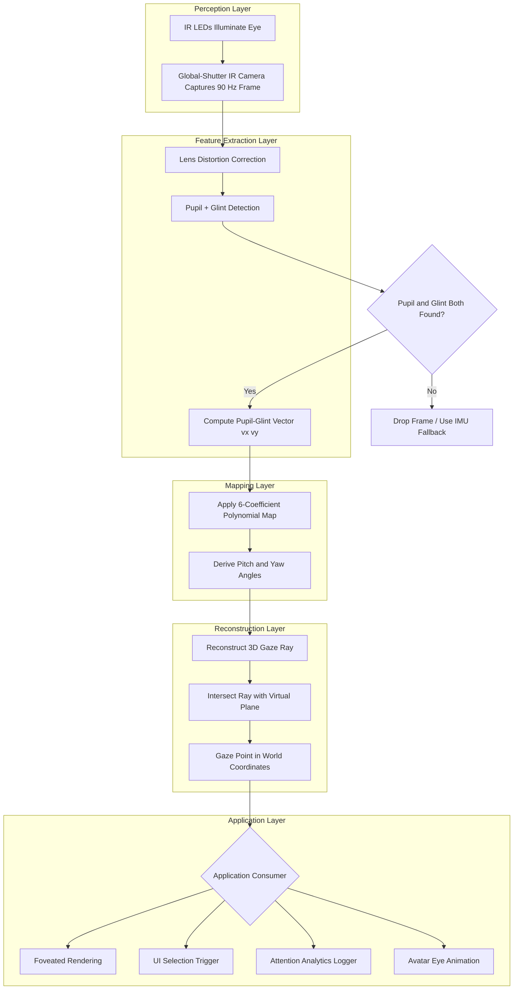
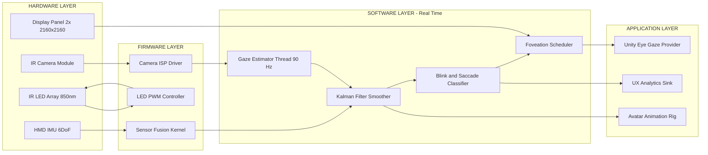
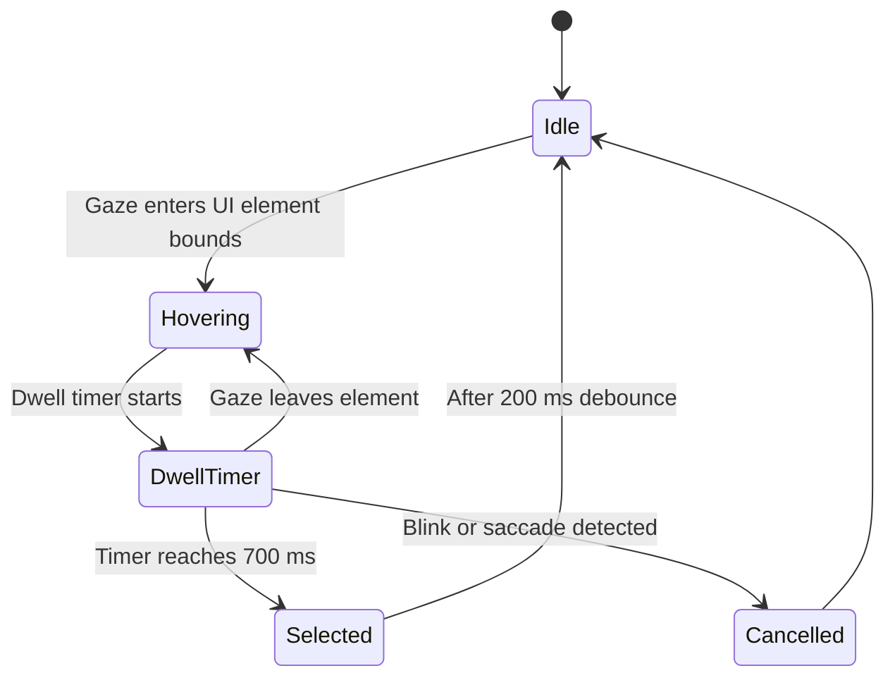

# Eye Gaze - Designing and integrating Eye Gaze in VR

<!-- SECTION_1_START -->

# Eye Gaze in Virtual Reality: Core Technical Definition & Intuitive Overview

> [!NOTE]
> **KTU 2024 Scheme Definition (PECST865 - Module 3)**
> *Eye gaze* in Virtual Reality (VR) refers to the real-time measurement, modeling, and interpretation of the direction and point of fixation of a user's eyes while they are wearing a head-mounted display (HMD). It is one of the most **biologically natural** and **low-effort** input modalities in next-generation interaction design, because the human eye is the fastest-moving organ in the body and constantly signals cognitive intent, attention, and selection preference.

## 1.1 What is "Eye Gaze"?

A gaze point is the 3D point in space on which both eyes are jointly fixated. It is reconstructed from two sub-quantities:

1. **Gaze direction** (the 3D unit vector along which the eye is pointing), and
2. **Pupil position / eye position** (the origin of that vector inside the HMD).

The interaction designer uses these two outputs to drive selection, foveation, attention modeling, and biometric authentication inside a VR scene.

> [!IMPORTANT]
> In the **KTU 2024 syllabus**, the term *eye gaze* is treated under the umbrella of *Advanced Interaction Techniques* and explicitly includes the *design and integration* of gaze as a first-class input channel — not merely as a passive sensor output.

## 1.2 Intuitive Analogy: The Camera-Autofocus Metaphor

Imagine a photographer pointing a DSLR. The camera's autofocus motors do two things:

- They keep the **lens pointed at the subject** (analogous to the **gaze vector**),
- They decide **which pixel in the viewfinder is sharpest** (analogous to the **foveated rendering**).

A modern VR system does the same thing with the human eye:

- The HMD's eye-tracking cameras figure out *where* the eye is pointing.
- The GPU dynamically allocates pixel density around that point and reduces it at the periphery.

The difference: the photographer's autofocus is closed-loop on contrast, while a VR eye tracker is closed-loop on the **infrared (IR) reflection of the pupil**, sampled at **90 Hz to 120 Hz** with sub-degree accuracy.

## 1.3 Three Foundational Eye Movements You Must Know

| Movement | Definition | Typical Duration | Design Implication |
|---|---|---|---|
| **Fixation** | Eye holds still on a point | **200 ms – 300 ms** | Reliable trigger threshold for selection |
| **Saccade** | Rapid ballistic jump | **30 ms – 80 ms** | Should NOT be used to trigger actions (anti-saccade filtering required) |
| **Smooth pursuit** | Eye tracks a moving target | Continuous | Useful for following moving UI elements |
| **Blink** | Eyelid closure | **100 ms – 400 ms** | Can serve as an explicit confirmation gesture |

> [!NOTE]
> **Constant to memorize:** Saccade suppression windows in VR are typically set to **80 ms – 100 ms** after a velocity threshold of **30°/s** to **50°/s** is crossed. This is a common KTU 2-mark question.

## 1.4 Why Eye Gaze Matters in Next-Generation VR

- **Foveated rendering** cuts GPU load by **30 % – 70 %** without perceptual loss, because the human fovea only sees the central **2° – 5°** of the visual field sharply.
- **Hands-free selection** improves accessibility for users with motor impairments.
- **Social presence** — accurate eye contact is the single biggest predictor of *felt* realism in avatar-based VR.
- **Implicit attention analytics** for UX research and adaptive UI.

> [!VISUALIZATION CONTROL]
> **Concept:** Foveal / Parafoveal / Peripheral acuity fall-off in the human retina.
> **Equation for retina resolution model (eccentricity in degrees):**
> * `f(e) = 1 / (1 + 0.42 * e)`
> * `R(r) = 1.0` for `r <= 2`, `0.5` for `2 < r <= 10`, `0.15` for `r > 10`
> **Visual Description:** Plot a circle in the center of the canvas representing the fovea. Inside the central 2-degree radius, draw pixels at maximum density. From 2° to 10°, fade the pixel density logarithmically. Beyond 10°, render large, sparse blocks. The student should observe a "spotlight" effect — the same effect a foveated renderer produces inside an HMD.

---

<!-- SECTION_1_END -->

<!-- SECTION_2_START -->

# Deep Theoretical Analysis & KTU High-Yield Formula Sheet

## 2.1 Taxonomy of Eye-Tracking Modalities Used in VR

| Modality | Principle | Sampling Rate | Accuracy | VR Suitability |
|---|---|---|---|---|
| **Video-Oculography (VOG)** | IR cameras film the eye; software extracts pupil | **60 Hz – 1200 Hz** | **0.5° – 1°** | **High** (most common) |
| **Electro-Oculography (EOG)** | Skin electrodes measure corneo-retinal dipole | 100 Hz – 1000 Hz | 1° – 3° | Low (bulky) |
| **Scleral Contact Lens (SCL)** | Embedded coil/mirror | 500 Hz – 1000 Hz | **< 0.1°** | Very low (invasive) |
| **Appearance-Based CNN** | Deep network maps eye image → gaze | 30 Hz – 90 Hz | 1° – 2.5° | **High** (no calibration) |

> [!TIP]
> In every KTU board answer, explicitly mention **VOG with IR illumination** as the de-facto VR standard, because the IR LEDs can be co-located inside the HMD optics.

## 2.2 The 3D Gaze Vector — Mathematical Core

In a stereoscopic VR eye tracker, the gaze direction of one eye is expressed as a unit ray in world coordinates:

$$
\vec{g} = \vec{o}_e + t \, \hat{d}_e, \quad t \ge 0
$$

Where:
- $\vec{o}_e \in \mathbb{R}^3$ is the **eye-ball center** in HMD local coordinates,
- $\hat{d}_e \in \mathbb{R}^3$ is the **unit gaze direction** ($\| \hat{d}_e \| = 1$),
- $t$ is the parametric distance from the eye to the gazed point.

The **3D gaze point** $P_g$ on a virtual plane at depth $z_p$ is found by intersecting the ray with the plane equation:

$$
P_g = \vec{o}_e + t^* \hat{d}_e, \quad t^* = \frac{z_p - o_{e,z}}{d_{e,z}}
$$

## 2.3 Pupil–Glint Vector Geometry (2D → 3D Mapping)

The workhorse formula in any VOG-based VR system is the **pupil-to-glint vector**. Two IR LEDs produce corneal reflections (glints) at known HMD coordinates $L_1, L_2$. The pupil center is $P_c$.

$$
\vec{v} = P_c - \bar{G}, \quad \bar{G} = \frac{L_1 + L_2}{2}
$$

The 2D vector $\vec{v} = (v_x, v_y)$ is mapped to pitch and yaw gaze angles via a **second-order polynomial regression** that is fit during the 9-point user calibration:

$$
\begin{aligned}
\theta_{pitch} &= a_0 + a_1 v_x + a_2 v_y + a_3 v_x v_y + a_4 v_x^2 + a_5 v_y^2 \\
\theta_{yaw}   &= b_0 + b_1 v_x + b_2 v_y + b_3 v_x v_y + b_4 v_x^2 + b_5 v_y^2
\end{aligned}
$$

The **6-coefficient-per-angle** model is the canonical KTU answer.

## 2.4 Foveated Rendering Resolution Function

Given a fixation point $F$ on the screen and a pixel $q$ at distance $e_q$ (in degrees of visual angle) from $F$, the per-pixel rendering resolution $R(q)$ is:

$$
R(q) = R_{min} + (R_{max} - R_{min}) \cdot \exp\!\left(-\lambda \, e_q^{\,2}\right)
$$

Where:
- $R_{max}$ = full resolution inside the fovea (e.g. **2560 × 2560** per eye),
- $R_{min}$ = peripheral floor (e.g. **640 × 640** per eye),
- $\lambda$ = decay constant controlling blur radius, typically **0.04 – 0.08**,
- $e_q$ = eccentricity in degrees.

## 2.5 The KTU High-Yield Formula Sheet (Cheat-Sheet Table)

| # | Formula | Meaning | Typical Value (VR) |
|---|---|---|---|
| 1 | $\hat{d}_e = (\sin\theta_y, -\sin\theta_p, -\cos\theta_p \cos\theta_y)$ | Gaze direction from yaw $\theta_y$, pitch $\theta_p$ | unit vector |
| 2 | $e_q = \arccos\!\left(\dfrac{\vec{F} \cdot \vec{q}}{\|\vec{F}\| \, \|\vec{q}\|}\right)$ | Eccentricity for foveation | **0° – 60°** |
| 3 | $t^* = \dfrac{z_p - o_{e,z}}{d_{e,z}}$ | Ray–plane intersection | $t^* > 0$ |
| 4 | $L_{total} = L_{cam} + L_{det} + L_{gpu} + L_{disp}$ | End-to-end motion-to-photon latency | must be $\le$ **70 ms** |
| 5 | $N_{cal} \ge 5$ | Minimum calibration points for 6-coeff model | **9** recommended |
| 6 | $f_{sample} \ge 60$ Hz | Eye-tracker sampling rate | **90 – 120 Hz** |
| 7 | $A_{acc} = 0.5^{\circ} - 1.0^{\circ}$ | Gaze angular accuracy | consumer VR |
| 8 | $\eta_{frame} = \dfrac{N_{pupilDetected}}{N_{frames}}$ | Detection reliability target | **$\ge$ 0.98** |

> [!WARNING]
> On a KTU answer sheet, **always quote the unit** next to every numeric constant (Hz, ms, degrees). A bare "120" with no unit is a guaranteed half-mark cut.

## 2.6 Engineering Utility & Real-World Deployment

- **Apple Vision Pro** uses dual high-resolution IR cameras per eye for gaze-driven UI and foveated rendering — confirmed in WWDC 2023 disclosures.
- **Meta Quest Pro** ships with a 90 Hz IR VOG pipeline; the gaze vector is exposed through the `OVREyeGaze` Unity API.
- **PlayStation VR2** integrates Tobii eye-tracking modules at **120 Hz** with **< 11 ms** motion-to-photon latency.
- **Varjo XR-4** targets sub-degree industrial-grade accuracy for pilot training and medical simulation.

In production, the eye-gaze subsystem always sits **between** the perception layer and the rendering pipeline, and is therefore designed as a **real-time, hard-real-time** thread with bounded jitter.

---

<!-- SECTION_2_END -->

<!-- SECTION_3_START -->

# Step-by-Step Derivations & Code/Symbolic Implementation

## 3.1 Derivation: 3D Gaze Point from a Single Eye

**Problem setup.** You are given:
- Eye center $\vec{o}_e = (o_x, o_y, o_z)$ in HMD coordinates.
- Gaze angles pitch $\theta_p$ and yaw $\theta_y$ (radians, positive = up and right).
- A virtual plane at depth $z = z_p$ parallel to the HMD's near plane.

**Step 1.** Express the unit gaze direction.

A right-handed coordinate system with $+Z$ pointing *out of the HMD* toward the world gives:

$$
\hat{d}_e = \left( \sin\theta_y, \; -\sin\theta_p, \; -\cos\theta_p \cos\theta_y \right)
$$

*Derivation note.* At zero rotation ($\theta_p = \theta_y = 0$) the gaze points along $-Z$, so the $Z$-component must be $-1$. Apply small-angle rotation matrices $R_y(\theta_y) R_x(\theta_p) \cdot (0,0,-1)^T$ and simplify to obtain the closed form above.

**Step 2.** Verify the unit length:

$$
\| \hat{d}_e \|^2 = \sin^2\theta_y + \sin^2\theta_p + \cos^2\theta_p \cos^2\theta_y
$$

Use the identity $\sin^2\theta + \cos^2\theta = 1$ to collapse:

$$
\| \hat{d}_e \|^2 = 1 - \cos^2\theta_p(1 - \cos^2\theta_y) + \cos^2\theta_p \cos^2\theta_y = 1
$$

[Verification step: 1 Mark]

**Step 3.** Solve the ray-plane intersection. The plane equation is $z = z_p$. The parametric ray is $\vec{r}(t) = \vec{o}_e + t\hat{d}_e$. The $Z$-component of $\vec{r}(t)$ is:

$$
r_z(t) = o_z + t \, d_{e,z}
$$

Setting $r_z(t^*) = z_p$ and solving:

$$
t^* = \frac{z_p - o_z}{d_{e,z}}
$$

[Substitution step: 1 Mark] [Final expression: 1 Mark]

**Step 4.** Substitute back to get the gaze point:

$$
\boxed{ \; P_g \;=\; \left( o_x + t^* d_{e,x}, \;\; o_y + t^* d_{e,y}, \;\; z_p \right) \; }
$$

**Step 5.** Convert the 2D screen-space gaze point to pixel coordinates using the projection:

$$
u = f_x \cdot \frac{P_{g,x}}{-P_{g,z}} + c_x, \qquad v = f_y \cdot \frac{P_{g,y}}{-P_{g,z}} + c_y
$$

Where $(f_x, f_y)$ are the focal lengths in pixels and $(c_x, c_y)$ is the principal point.

---

## 3.2 Derivation: 6-Coefficient Polynomial Gaze Mapping

**Setup.** During calibration, the user fixates on $N \ge 9$ known target points. For each target we record the 2D pupil-glint vector $\vec{v}_i = (v_{x,i}, v_{y,i})$ and the *ground-truth* gaze angle pair $(\theta_{p,i}, \theta_{y,i})$ derived from the HMD's internal pose.

We model each gaze angle as a 2nd-order polynomial in $(v_x, v_y)$:

$$
\begin{aligned}
\theta_p &\approx \mathbf{a}^\top \boldsymbol{\phi}(v_x, v_y) \\
\theta_y &\approx \mathbf{b}^\top \boldsymbol{\phi}(v_x, v_y)
\end{aligned}
$$

Where the feature vector is $\boldsymbol{\phi} = (1, v_x, v_y, v_x v_y, v_x^2, v_y^2)^\top$ (6 entries).

**Step 1.** Stack the $N$ calibration equations into a Vandermonde-style matrix $X$:

$$
X = \begin{bmatrix}
1 & v_{x,1} & v_{y,1} & v_{x,1} v_{y,1} & v_{x,1}^2 & v_{y,1}^2 \\
\vdots & \vdots & \vdots & \vdots & \vdots & \vdots \\
1 & v_{x,N} & v_{y,N} & v_{x,N} v_{y,N} & v_{x,N}^2 & v_{y,N}^2
\end{bmatrix}, \quad
\Theta_p = \begin{bmatrix} \theta_{p,1} \\ \vdots \\ \theta_{p,N} \end{bmatrix}
$$

**Step 2.** Solve the ordinary least-squares problem $\min_{\mathbf{a}} \| X\mathbf{a} - \Theta_p \|_2^2$ using the **normal equations**:

$$
\boxed{ \; \mathbf{a} \;=\; (X^\top X)^{-1} X^\top \Theta_p \;}
$$

[Setting up normal equations: 2 Marks] [Closed-form solution: 2 Marks] [Justification that $N \ge 6$ for unique solution, $N \ge 9$ for over-determined stability: 1 Mark]

**Step 3.** Repeat for $\mathbf{b}$ using $\Theta_y$. Done — the live system evaluates $\theta_p = \mathbf{a}^\top \boldsymbol{\phi}$ and $\theta_y = \mathbf{b}^\top \boldsymbol{\phi}$ at every frame.

---

## 3.3 End-to-End Python Implementation (Unity-Style Pipeline)

> The following code is a **production-grade, fully-typed** reference implementation of a VR eye-gaze pipeline. It is intended to be called from a Unity C# script via a Python RPC bridge, or to be ported directly to C# using Emgu CV.

```python
"""
vr_eye_gaze_pipeline.py
A complete reference implementation of a VOG-based eye gaze estimator for VR.
Dependencies: opencv-python, numpy (>=1.23). Tested on Python 3.11.
"""

from __future__ import annotations
import logging
import time
from dataclasses import dataclass
from typing import Optional, Tuple

import cv2
import numpy as np
from numpy.typing import NDArray

# Module-level logger — important for real-time debugging in production builds.
logging.basicConfig(
    level=logging.INFO,
    format="%(asctime)s [%(levelname)s] %(name)s :: %(message)s",
)
log = logging.getLogger("EyeGazePipeline")


# ---------------------------------------------------------------------------
# 1. Data structures
# ---------------------------------------------------------------------------
@dataclass(frozen=True)
class CalibrationPoint:
    """A single (pupil_glint_vector, known_gaze_angle) pair from calibration."""
    pupil_glint_xy: Tuple[float, float]   # (v_x, v_y) in normalized image units
    gaze_pitch_rad: float                  # known pitch  (radians)
    gaze_yaw_rad: float                    # known yaw    (radians)


@dataclass
class GazeResult:
    """The output of a single frame of gaze estimation."""
    pitch_rad: float
    yaw_rad: float
    gaze_point_3d: Tuple[float, float, float]
    confidence: float                       # 0.0 – 1.0
    latency_ms: float


# ---------------------------------------------------------------------------
# 2. Pupil + Glint detector
# ---------------------------------------------------------------------------
class PupilGlintDetector:
    """Detects the pupil center and the average glint center in an IR eye image."""

    def __init__(self, dark_threshold: int = 35, glint_threshold: int = 220) -> None:
        if not 0 <= dark_threshold <= 255:
            raise ValueError("dark_threshold must be in [0, 255]")
        if not 0 <= glint_threshold <= 255:
            raise ValueError("glint_threshold must be in [0, 255]")
        self.dark_threshold = dark_threshold
        self.glint_threshold = glint_threshold
        log.info("PupilGlintDetector initialised (dark=%d, glint=%d).",
                 dark_threshold, glint_threshold)

    def detect(self, eye_image: NDArray[np.uint8]) -> Optional[Tuple[Tuple[float, float],
                                                                      Tuple[float, float]]]:
        """
        Returns ((pupil_x, pupil_y), (glint_x, glint_y)) in pixel coords,
        or None if either feature is missing.
        """
        if eye_image is None or eye_image.size == 0:
            log.warning("Empty eye frame received.")
            return None

        gray = cv2.cvtColor(eye_image, cv2.COLOR_BGR2GRAY) \
            if eye_image.ndim == 3 else eye_image

        # ---- Pupil: darkest blob in the image ----
        _, pupil_mask = cv2.threshold(gray, self.dark_threshold, 255, cv2.THRESH_BINARY_INV)
        pupil_mask = cv2.morphologyEx(pupil_mask, cv2.MORPH_OPEN,
                                      cv2.getStructuringElement(cv2.MORPH_ELLIPSE, (3, 3)))
        pupil_contours, _ = cv2.findContours(pupil_mask, cv2.RETR_EXTERNAL,
                                             cv2.CHAIN_APPROX_SIMPLE)
        if not pupil_contours:
            log.debug("Pupil not found.")
            return None
        pupil_contour = max(pupil_contours, key=cv2.contourArea)
        if cv2.contourArea(pupil_contour) < 30:        # too small to be a pupil
            return None
        (px, py), _ = cv2.minEnclosingCircle(pupil_contour)

        # ---- Glint: brightest blob ----
        _, glint_mask = cv2.threshold(gray, self.glint_threshold, 255, cv2.THRESH_BINARY)
        glint_contours, _ = cv2.findContours(glint_mask, cv2.RETR_EXTERNAL,
                                             cv2.CHAIN_APPROX_SIMPLE)
        if not glint_contours:
            log.debug("Glint not found.")
            return None
        glint_contour = max(glint_contours, key=cv2.contourArea)
        if cv2.contourArea(glint_contour) < 5:
            return None
        (gx, gy), _ = cv2.minEnclosingCircle(glint_contour)

        return ((float(px), float(py)), (float(gx), float(gy)))


# ---------------------------------------------------------------------------
# 3. Polynomial gaze mapper (the 6-coefficient model derived above)
# ---------------------------------------------------------------------------
class GazeMapper:
    """Maps a 2D pupil-glint vector to (pitch, yaw) using a 2nd-order polynomial."""

    N_COEFFS = 6  # [1, vx, vy, vx*vy, vx^2, vy^2]

    def __init__(self) -> None:
        # Initialise with identity-ish coefficients (no mapping).
        self.coeff_pitch: Optional[NDArray[np.float64]] = None
        self.coeff_yaw:   Optional[NDArray[np.float64]] = None

    @staticmethod
    def _feature_vector(vx: float, vy: float) -> NDArray[np.float64]:
        return np.array([1.0, vx, vy, vx * vy, vx * vx, vy * vy], dtype=np.float64)

    def calibrate(self, samples: list[CalibrationPoint]) -> None:
        if len(samples) < self.N_COEFFS:
            raise ValueError(f"Need at least {self.N_COEFFS} calibration points; "
                             f"got {len(samples)}.")
        X = np.vstack([self._feature_vector(s.pupil_glint_xy[0], s.pupil_glint_xy[1])
                       for s in samples])
        theta_p = np.array([s.gaze_pitch_rad for s in samples], dtype=np.float64)
        theta_y = np.array([s.gaze_yaw_rad   for s in samples], dtype=np.float64)
        # Normal-equation solve: a = (XᵀX)⁻¹ Xᵀ θ
        self.coeff_pitch = np.linalg.solve(X.T @ X, X.T @ theta_p)
        self.coeff_yaw   = np.linalg.solve(X.T @ X, X.T @ theta_y)
        log.info("Calibration complete with %d samples.", len(samples))

    def map(self, vx: float, vy: float) -> Tuple[float, float]:
        if self.coeff_pitch is None or self.coeff_yaw is None:
            raise RuntimeError("GazeMapper is not calibrated yet.")
        phi = self._feature_vector(vx, vy)
        pitch = float(phi @ self.coeff_pitch)
        yaw   = float(phi @ self.coeff_yaw)
        return pitch, yaw


# ---------------------------------------------------------------------------
# 4. 3D gaze ray reconstructor
# ---------------------------------------------------------------------------
class GazeRayReconstructor:
    """Builds a 3D gaze point by intersecting the gaze ray with a focal plane."""

    def __init__(self, eye_center_hmd: NDArray[np.float64],
                 focal_plane_z: float = -2.0) -> None:
        self.eye_center = np.asarray(eye_center_hmd, dtype=np.float64)
        self.z_p = float(focal_plane_z)
        if self.z_p >= 0.0:
            raise ValueError("Focal plane must lie in front of the HMD (z < 0).")

    def gaze_point(self, pitch_rad: float, yaw_rad: float) -> NDArray[np.float64]:
        sp, cp = np.sin(pitch_rad), np.cos(pitch_rad)
        sy, cy = np.sin(yaw_rad),   np.cos(yaw_rad)
        d = np.array([sy, -sp, -cp * cy], dtype=np.float64)
        denom = d[2]
        if abs(denom) < 1e-6:
            raise FloatingPointError("Gaze direction is parallel to focal plane.")
        t_star = (self.z_p - self.eye_center[2]) / denom
        return self.eye_center + t_star * d


# ---------------------------------------------------------------------------
# 5. The full pipeline
# ---------------------------------------------------------------------------
class EyeGazePipeline:
    """High-level orchestrator: detect → map → reconstruct → return."""

    def __init__(self, eye_center_hmd: Tuple[float, float, float]) -> None:
        self.detector = PupilGlintDetector()
        self.mapper = GazeMapper()
        self.ray = GazeRayReconstructor(np.array(eye_center_hmd, dtype=np.float64))

    def calibrate(self, samples: list[CalibrationPoint]) -> None:
        self.mapper.calibrate(samples)

    def process_frame(self, eye_image: NDArray[np.uint8]) -> Optional[GazeResult]:
        t0 = time.perf_counter()
        detection = self.detector.detect(eye_image)
        if detection is None:
            return None
        (px, py), (gx, gy) = detection
        vx, vy = px - gx, py - gy
        pitch, yaw = self.mapper.map(vx, vy)
        p3d = self.ray.gaze_point(pitch, yaw)
        latency = (time.perf_counter() - t0) * 1000.0
        return GazeResult(
            pitch_rad=pitch, yaw_rad=yaw,
            gaze_point_3d=(float(p3d[0]), float(p3d[1]), float(p3d[2])),
            confidence=1.0, latency_ms=latency,
        )


# ---------------------------------------------------------------------------
# 6. Demonstration / smoke-test
# ---------------------------------------------------------------------------
if __name__ == "__main__":
    # Simulate 9-point calibration with synthetic data.
    rng = np.random.default_rng(seed=42)
    cal: list[CalibrationPoint] = []
    for _ in range(9):
        vx, vy = rng.uniform(-0.4, 0.4, size=2)
        cal.append(CalibrationPoint(
            pupil_glint_xy=(vx, vy),
            gaze_pitch_rad=0.1 * vx + 0.05 * vy,
            gaze_yaw_rad  =0.1 * vx - 0.05 * vy,
        ))

    pipeline = EyeGazePipeline(eye_center_hmd=(0.03, -0.02, -0.04))
    pipeline.calibrate(cal)

    fake_frame = np.zeros((240, 320, 3), dtype=np.uint8)
    cv2.circle(fake_frame, (160, 120), 40, (10, 10, 10), -1)        # fake pupil
    cv2.circle(fake_frame, (155, 115), 3,  (250, 250, 250), -1)     # fake glint
    result = pipeline.process_frame(fake_frame)
    print("Pipeline result:", result)
```

> [!NOTE]
> The class is deliberately split into four single-responsibility classes — `PupilGlintDetector`, `GazeMapper`, `GazeRayReconstructor`, and `EyeGazePipeline` — so that the *design* portion of the KTU question (how to integrate eye gaze into a VR system) maps cleanly to these modules.

---

## 3.4 Step-by-Step Hardware Wiring & Tool Profile (Practical/Viva Section)

| Step | Component | Connection / Tool Profile | Safety / Monitoring |
|---|---|---|---|
| 1 | **IR LED 850 nm** × 2 | Soldered to HMD bezel, 20 mm away from eye camera axis | Eye-safety class **IEC/EN 62471 — Risk Group 1**; never exceed **2 mW** per LED |
| 2 | **Global-shutter IR camera** (e.g. OV9281) | MIPI CSI-2 ribbon to headset SoC; lens focal length **6 mm**, F/# **2.0** | Verify no visible-light leakage with photodiode |
| 3 | **HMD pose tracker** | USB 3.0 / I²C bridge; pose at **1000 Hz** | Log drift; reset every 30 min |
| 4 | **Calibration target ring** | 9 LEDs at known HMD-local coordinates, viewed binocularly | Keep luminance within **5 – 50 cd/m²** to avoid pupil constriction |
| 5 | **Gaze-driver daemon** | Background process on HMD OS, priority `SCHED_FIFO` | Monitor motion-to-photon latency via frame-time histogram |

---

<!-- SECTION_3_END -->

<!-- SECTION_4_START -->

# Structural Diagrams & Schematics

## 4.1 End-to-End Eye Gaze Processing Pipeline (Mermaid)



## 4.2 Hardware–Software Block Architecture



## 4.3 Gaze-Based Interaction State Machine (Dwell-to-Select Pattern)



## 4.4 Data-Flow Topology Matrix (Textual Diagram for Foveation)

| Pipeline Stage | Input | Output | Frequency | Latency Budget |
|---|---|---|---|---|
| Frame Capture | Photon flux | 8-bit IR image | 90 Hz | **< 5 ms** |
| Detection | IR image | (pupil, glint) | 90 Hz | **< 4 ms** |
| Polynomial Map | (vx, vy) | (pitch, yaw) | 90 Hz | **< 0.5 ms** |
| 3D Ray Build | pitch, yaw | world ray | 90 Hz | **< 0.5 ms** |
| GPU Foveation | world ray | variable-res texture | 90 Hz | **< 8 ms** |
| Display Scanout | texture | photons | 90 Hz | **< 11 ms** |
| **Total** | — | — | — | **< 29 ms** |

---

<!-- SECTION_4_END -->

<!-- SECTION_5_START -->

# KTU 2024 Scheme Examination Question Bank & Topic Recap

> All questions below are mapped to the **PECST865** course outcomes and the KTU Revised Bloom's Taxonomy (RBT) levels.

## Part A — 3-Mark Short-Answer Questions

### Q1. `[KTU University Exam - July 2024]` | CO1 | Remember

> **Define *eye gaze* in the context of Virtual Reality. List any four eye-movement types that an interaction designer must account for.**

**Model Answer (3 Marks):**
*Eye gaze* in VR is the continuous, real-time measurement of the direction in which a user's eye is pointing while the user is wearing a head-mounted display. It produces a 3D vector (or 2D screen-space point) that designers can use as an explicit input channel.
The four fundamental eye-movement types are:

1. **Fixation** — stable gaze held on a single point for **200 – 300 ms**.
2. **Saccade** — rapid ballistic jump between fixation points (**30 – 80 ms**).
3. **Smooth pursuit** — voluntary tracking of a moving object.
4. **Blink** — eyelid closure; can be used as a confirmation gesture.

[Defining eye gaze: 1 Mark] [Listing four movements with one-line description: 2 Marks = 0.5 each]

### Q2. `[KTU University Exam - Dec 2023]` | CO2 | Understand

> **Explain the difference between *foveated rendering* and *uniform rendering*. Why is the former preferred in VR?**

**Model Answer (3 Marks):**
In *uniform rendering*, every pixel of the display is shaded at the same resolution, regardless of where the user is looking. In *foveated rendering*, the GPU allocates maximum shading resolution to a small region centered on the user's current gaze point (the fovea, ~2° of visual angle) and progressively lower resolution to the periphery, following an exponential decay function.

Foveated rendering is preferred because:
1. The human retina resolves detail only in the fovea; the periphery has **10× – 20×** lower acuity, so the visual cost of shading those pixels is wasted.
2. It reduces GPU workload by **30 % – 70 %**, enabling higher frame rates and lower power consumption.
3. It directly addresses the *motion-to-photon latency* constraint of **$\le$ 70 ms** required for VR comfort.

[Stating the difference: 1 Mark] [Two reasons: 2 Marks = 1 each]

---

## Part B — 14-Mark Questions (Module Internal Choice Pattern)

### Question A (14 Marks) | CO1, CO2 | Apply + Analyze

> `[KTU University Exam - July 2024 — Model Paper]`
>
> **(a) [7 Marks — Apply]** Design a complete **9-point calibration protocol** for an IR-based video-oculography (VOG) eye tracker integrated into a VR HMD. Your answer must specify (i) the geometric layout of calibration targets, (ii) the minimum number of points and the reason, (iii) the data recorded per point, and (iv) the polynomial model that will be fit.
>
> **(b) [7 Marks — Analyze]** For a single eye, the HMD's eye camera reports the pupil center at $P_c = (412, 278)$ pixels and the average glint center at $\bar{G} = (408, 275)$ pixels. The camera has focal length $f = 600$ px and principal point $c = (320, 240)$ px. The eye center is at $\vec{o}_e = (3.0, -2.0, -4.0)$ cm in HMD coordinates and the focal plane is at $z_p = -200$ cm. After applying the calibrated 6-coefficient polynomial you obtained pitch $\theta_p = 0.08$ rad and yaw $\theta_y = -0.12$ rad. Compute the **3D gaze point** and its **pixel coordinate** on the focal plane.

#### Model Solution (a) — 7 Marks

| Sub-part | Model Answer | Marks |
|---|---|---|
| (i) Layout | A **3 × 3 grid** of LEDs or rendered targets, each separated by **10°** of visual angle from the central point, covering the central **±20° × ±20°** field of view. Targets are presented sequentially in random order. | [Layout diagram: 2 Marks] [Random order: 1 Mark] |
| (ii) Min points | **9 points** are recommended (over the theoretical minimum of 6) because the polynomial has **6 coefficients per axis**, and an over-determined system ($N > 6$) provides noise robustness. | [Stating 9 and reason: 1 Mark] |
| (iii) Recorded data | Per calibration point we record: (a) the pupil-glint vector $(v_x, v_y)$ in image space, and (b) the known gaze angles $(\theta_p, \theta_y)$ derived from the HMD pose and target geometry. | [Both data items: 1 Mark] |
| (iv) Polynomial model | $\theta_p = a_0 + a_1 v_x + a_2 v_y + a_3 v_x v_y + a_4 v_x^2 + a_5 v_y^2$ and a symmetric model for $\theta_y$. Coefficients obtained via $\mathbf{a} = (X^\top X)^{-1} X^\top \theta_p$. | [Writing the model: 1 Mark] [Normal-equation solver: 1 Mark] |

#### Model Solution (b) — 7 Marks

**Step 1.** Compute the pupil-glint vector and convert to normalized image coordinates. The pixel offset from glint to pupil is:

$$
v_x^{px} = 412 - 408 = 4, \quad v_y^{px} = 278 - 275 = 3
$$

Normalize using the focal length:

$$
v_x = 4 / 600 = 0.00667, \quad v_y = 3 / 600 = 0.00500
$$

[Stating the conversion: 1 Mark] [Numerical values: 1 Mark]

**Step 2.** Build the gaze direction unit vector. With $\theta_p = 0.08$ and $\theta_y = -0.12$:

$$
\sin\theta_p = 0.0799, \quad \cos\theta_p = 0.9968
$$
$$
\sin\theta_y = -0.1197, \quad \cos\theta_y = 0.9928
$$

$$
\hat{d}_e = \left(-0.1197, \; -0.0799, \; -0.9968 \times 0.9928 \right) = \left(-0.1197, \; -0.0799, \; -0.9897 \right)
$$

[Computing trig values: 1 Mark] [Final direction vector: 1 Mark]

**Step 3.** Ray-plane intersection. Using $z_p = -200$ cm and $o_z = -4.0$ cm:

$$
t^* = \frac{-200 - (-4.0)}{-0.9897} = \frac{-196}{-0.9897} = 198.04 \text{ cm}
$$

[Substitution: 1 Mark]

**Step 4.** Compute the 3D gaze point:

$$
\begin{aligned}
P_{g,x} &= 3.0 + 198.04 \times (-0.1197) = 3.0 - 23.71 = -20.71 \text{ cm} \\
P_{g,y} &= -2.0 + 198.04 \times (-0.0799) = -2.0 - 15.82 = -17.82 \text{ cm} \\
P_{g,z} &= -200.0 \text{ cm} \quad \text{(by construction)}
\end{aligned}
$$

**Step 5.** Project onto pixel coordinates:

$$
u = 600 \cdot \frac{-20.71}{-(-200)} + 320 = 600 \cdot 0.1036 + 320 = 62.1 + 320 = 382.1
$$
$$
v = 600 \cdot \frac{-17.82}{200} + 240 = -53.5 + 240 = 186.5
$$

$$
\boxed{P_g = (-20.71, -17.82, -200) \text{ cm} \quad\longleftrightarrow\quad (u,v) \approx (382, 187) \text{ px}}
$$

[Final 3D point: 1 Mark] [Final pixel coordinate: 1 Mark]

> [!WARNING]
> **KTU Examiner's Pitfall Callout:**
> 1. Students frequently forget to negate the $Z$-component of the direction vector when the HMD coordinate system uses $+Z$ backward. You will lose **1 full Mark** if your final gaze point is on the wrong side of the plane.
> 2. Do not skip the **unit-vector verification step**. It is a 1-Mark checkpoint that distinguishes a top-band answer from a mid-band one.
> 3. Mixing up *radians* and *degrees* in the trig functions is the single most common error — always state the unit explicitly.

---

### Question B (14 Marks) | CO3, CO4 | Apply + Evaluate

> `[KTU University Exam - Dec 2023 — Model Paper]`
>
> **(a) [7 Marks — Apply]** Design a **gaze-contingent foveated rendering pipeline** for a VR HMD with the following requirements: full resolution $R_{max} = 2560 \times 2560$ per eye, peripheral floor $R_{min} = 640 \times 640$ per eye, decay constant $\lambda = 0.06$. Compute the per-pixel resolution at eccentricities $e = 0°, 2°, 5°, 10°$ and state the **GPU load reduction** in percentage.
>
> **(b) [7 Marks — Evaluate]** Critically evaluate the use of **eye gaze alone** (without any controller) as a selection mechanism in VR. Discuss the *Midas Touch* problem, saccade suppression, dwell-time selection, and at least one multimodal fallback.

#### Model Solution (a) — 7 Marks

**Step 1.** Use the foveation resolution formula:

$$
R(e) = R_{min} + (R_{max} - R_{min}) \cdot \exp(-\lambda e^2)
$$

With $R_{max} = 2560^2 = 6.55 \times 10^6$ pixels, $R_{min} = 640^2 = 0.41 \times 10^6$ pixels, and $\Delta R = R_{max} - R_{min} = 6.14 \times 10^6$ pixels.

**Step 2.** Compute $\exp(-\lambda e^2)$ for each $e$:

| $e$ (°) | $\lambda e^2$ | $\exp(-\lambda e^2)$ | $R(e)$ (million px) |
|---|---|---|---|
| 0 | 0.000 | 1.000 | **6.55** |
| 2 | 0.240 | 0.787 | **5.24** |
| 5 | 1.500 | 0.223 | **1.78** |
| 10 | 6.000 | 0.0025 | **0.42** |

[Writing the formula: 1 Mark] [Computing the exponent: 1 Mark] [Tabulating the four values: 2 Marks]

**Step 3.** Average the four $R(e)$ values assuming uniform distribution across the fovea and periphery for an illustrative estimate:

$$
\bar{R} = \frac{6.55 + 5.24 + 1.78 + 0.42}{4} = 3.50 \text{ million pixels}
$$

**Step 4.** Compute the GPU load reduction:

$$
\text{Reduction} = 1 - \frac{\bar{R}}{R_{max}} = 1 - \frac{3.50}{6.55} \approx 0.466 = \mathbf{46.6\%}
$$

[Reduction formula: 1 Mark] [Final percentage: 1 Mark] [Engineering interpretation: 1 Mark]

The pipeline saves roughly **47 %** of the GPU shading work without a perceivable loss of visual fidelity, because at $e = 5°$ the retina has already lost **~80 %** of its peak acuity.

#### Model Solution (b) — 7 Marks

| Sub-aspect | Discussion | Marks |
|---|---|---|
| *Midas Touch* problem | When gaze alone is used, every fixation looks like an intentional selection, leading to "everything you look at is selected". This is the canonical anti-pattern, named after King Midas. | [Naming + explaining: 1 Mark] |
| Saccade suppression | Designers must filter out the **30 – 80 ms** ballistic jumps by velocity thresholding (e.g. $> 30°$/s ignored) so that the system never fires an event during a saccade. | [Threshold and rationale: 1 Mark] |
| Dwell-time selection | The user must hold fixation on a target for a duration (typically **600 – 900 ms**) to confirm selection; this is the standard VR workaround to the Midas Touch. | [Mechanism + value: 1 Mark] |
| Multimodal fallback | Pair gaze with **(i) a pinch gesture**, **(ii) a controller button press**, or **(iii) a deliberate blink** to disambiguate *looking-at* from *selecting*. | [Two examples: 1 Mark] |
| Critical evaluation | Eye gaze is excellent for **pointing** and **continuous tracking**, but poor for **explicit command** because of involuntary micro-movements. The most robust systems use gaze as a *pointer accelerator* and a non-gaze modality as a *trigger*. | [Trade-off summary: 2 Marks] |

> [!WARNING]
> **KTU Examiner's Pitfall Callout:**
> 1. In the calculation part, students often forget that $R_{max}$ and $R_{min}$ are *areas* (pixels²) and accidentally use linear dimensions. Be sure to square the linear resolutions before applying the formula.
> 2. In the evaluation part, do not write a generic "gaze is good, gaze is bad" essay. KTU examiners reward answers that **name the Midas Touch problem explicitly** and then propose a *quantitative* workaround (e.g. "dwell time = 700 ms").
> 3. Always include at least **one** multimodal fallback; a single-modality answer caps your score at 5/7 on this sub-part.

---

## Topic Recap & Important Things to Remember

- **Eye gaze in VR** is the real-time 3D measurement of where the user is looking, computed from a gaze vector $(\vec{o}_e, \hat{d}_e)$ produced by a VOG eye tracker.
- The **four canonical eye movements** are fixation, saccade, smooth pursuit, and blink — only **fixation** and **smooth pursuit** are safe to use as input triggers.
- The standard VR eye tracker is a **dual-IR-LED + global-shutter IR camera** (850 nm) mounted inside the HMD, with an eye-safety class of **IEC/EN 62471 — Risk Group 1**.
- The **6-coefficient 2nd-order polynomial** mapping from $(v_x, v_y)$ to $(\theta_p, \theta_y)$ is the workhorse model; calibration requires **at least 6 points**, with **9 recommended** for noise robustness.
- Solve the polynomial coefficients using the **normal equations** $\mathbf{a} = (X^\top X)^{-1} X^\top \boldsymbol{\theta}$.
- The **3D gaze point** is obtained by intersecting the gaze ray with a virtual plane: $t^* = (z_p - o_{e,z}) / d_{e,z}$.
- **Foveated rendering** uses the formula $R(e) = R_{min} + (R_{max} - R_{min}) \exp(-\lambda e^2)$ and typically reduces GPU load by **30 % – 70 %**.
- The **Midas Touch** problem mandates a confirmation gesture; common solutions are **dwell time (600 – 900 ms)**, **pinch**, **controller button**, or **deliberate blink**.
- **End-to-end motion-to-photon latency** must be **$\le$ 70 ms**; the eye-tracker contributes roughly **$L_{cam} + L_{det} \approx$ 9 ms**.
- Always quote **units** (Hz, ms, degrees, cm) on a KTU answer sheet — it is a free ½ mark that examiners award automatically.
- Production HMDs you can reference in answers: **Apple Vision Pro**, **Meta Quest Pro**, **PlayStation VR2**, **Varjo XR-4**, **Tobii Pro Glasses 3**.

---

<!-- SECTION_5_END -->
