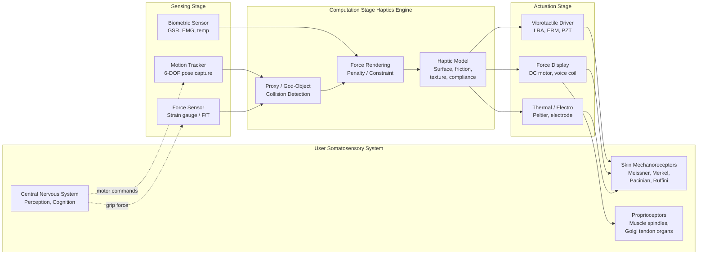
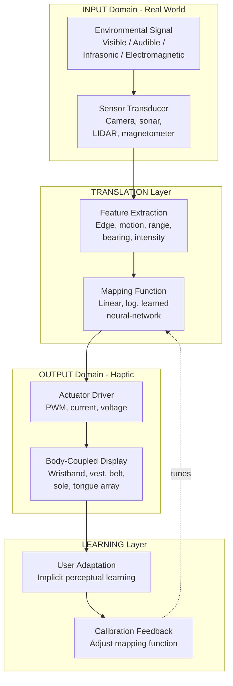
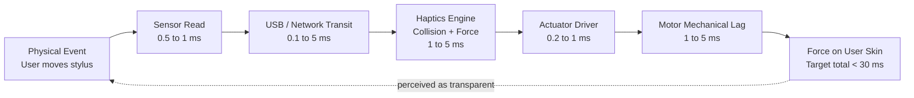

# Haptic Feedback and Sensory Augmentation - Understanding haptic feedback and tactile interactions

<!-- SECTION_1_START -->
# 1. Core Technical Definition & Intuitive Overview

## 1.1 Formal Definition (KTU 2024 Aligned)

**Haptic Feedback** refers to the computational generation and delivery of touch-based sensory stimuli to a user through a human-computer interface. It is a non-visual, non-auditory communication channel that exploits the user's **somatosensory system** (skin mechanoreceptors, proprioceptors, and thermoreceptors) to convey information, simulate physical properties, or augment the perception of digital artifacts.

Formally, as per the KTU 2024 *Next Generation Interaction Design* (PECST865) syllabus, haptics in interaction design is the **bidirectional tactile and force dialogue** between a user and a digital system, mediated by an **active actuator-transducer loop** capable of producing controlled mechanical, vibrotactile, electrocutaneous, or thermal outputs.

**Sensory Augmentation** is the extension of the natural perceptual bandwidth of a human operator by mapping an *unperceivable* (or *weakly perceivable*) environmental signal onto a perceivable sensory channel — most commonly, the haptic channel.

> [!IMPORTANT]
> **KTU Syllabus Highlight:** The term *haptic* originates from the Greek word *haptikos*, meaning "able to come into contact." In HCI literature, it strictly encompasses **both** cutaneous (skin-surface) and kinesthetic (limb-position/force) feedback modalities.

---

## 1.2 Conceptual Analogy — The "Blindfolded Mechanic"

Imagine a skilled mechanic diagnosing an engine with their **eyes closed and ears plugged**. They rely entirely on:
- The **vibration** traveling up the wrench (vibrotactile cue),
- The **resistance force** their hand feels when turning a stiff bolt (force feedback),
- The **temperature** of the casing under their palm (thermal cue),
- The **texture** they infer as a probe slides across metal (surface friction cue).

This mechanic is performing **active haptic exploration** — the same exploration loop that a haptic interface in VR, surgical simulation, or smartphone touchscreens seeks to *recreate digitally*. The computer must:
1. **Render** a physical model of the virtual surface,
2. **Transduce** the computed forces/vibrations into mechanical signals, and
3. **Display** them through actuators touching the user's skin.

For **sensory augmentation**, imagine a person with normal hearing using a wristband that vibrates whenever an email arrives, or a navigation cane that pulses when an obstacle is near. The vibration is *not* a natural cue for that information — it is a **learned sensory substitution** that *augments* the user's awareness.

> [!NOTE]
> **Why Haptics Matters in Interaction Design**
> Traditional WIMP (Windows, Icons, Menus, Pointer) interfaces overload only the **visual channel**. The Hick-Hyman law tells us that visual reaction time grows logarithmically with the number of choices. Haptic feedback **offloads cognitive load** to the tactile channel, speeding reaction times, reducing error rates, and supporting eyes-free operation in safety-critical contexts (surgery, aviation, automotive).

---

## 1.3 The Two Pillars: Haptics vs. Sensory Augmentation

| Aspect | Haptic Feedback | Sensory Augmentation |
|---|---|---|
| **Goal** | Replicate realistic touch sensations from virtual/digital objects | Extend the human's perceptual range beyond natural limits |
| **Signal Source** | Virtual model / digital simulation | Real-world sensor (ultrasound, infrared, magnetometer, biosensor) |
| **Mapping** | Physical → Physical (fidelity-oriented) | Non-tactile → Tactile (translation-oriented) |
| **Example** | Feeling the recoil of a virtual pistol in a VR shooter | Feeling magnetic north via a wrist-worn haptic compass |
| **Design Priority** | Realism, immersion, low latency (< 30 ms) | Learnability, salience, intuitiveness |

---

## 1.4 Visualization of a Haptic Signal

> [!VISUALIZATION CONTROL]
> **Concept:** Vibrotactile Actuator Drive Signal — a typical damped sinusoid used to simulate a "click" or "bump" on a touchscreen.
> **GeoGebra / Desmos Input Equations:**
> * `x(t) = A * e^(-zeta * omega_n * t) * sin(omega_d * t)`  with `A = 1.5`, `zeta = 0.15`, `omega_n = 314.16` (≈ 50 Hz), `omega_d = omega_n * sqrt(1 - zeta^2)`
> **Visual Description:** You should observe a damped oscillation that begins at amplitude $1.5$ at $t = 0$, decays roughly exponentially, and vanishes completely by $t \approx 0.08$ s. The envelope curve `y_envelope = A * e^(-zeta*omega_n*t)` should visibly "hug" the peaks of the sinusoid. This is the canonical shape of a single haptic "tap" pulse.

---

## 1.5 The Human Tactile Receptor Map (Why Frequency Matters)

Haptic designers must respect the **biophysical limits** of human skin. A stimulus outside these frequency/amplitude windows will be *invisible* to the user regardless of actuator power.

| Receptor Type | Optimal Frequency | Sensation Encoded | Location |
|---|---|---|---|
| **Meissner Corpuscle** | 20 – 50 Hz | Light flutter, fine texture, slip | Glabrous (hairless) skin |
| **Merkel Disk** | 0 – 5 Hz (DC component) | Pressure, edges, static form | Glabrous skin |
| **Pacinian Corpuscle** | 100 – 300 Hz | Deep vibration, tool-mediated contact | Deep dermis / subcutaneous |
| **Ruffini Ending** | ~ 5 – 15 Hz | Skin stretch, sustained pressure, hand shape | Subcutaneous |

> [!TIP]
> **Examiner's Cue:** If a KTU question asks "why do smartphone 'rumble' alerts feel different from keyboard 'clicks'?" — the answer lies in the frequency band: **rumble ≈ 150 Hz** (Pacinian, deep) vs. **click ≈ 50 Hz** (Meissner, sharp).
<!-- SECTION_1_END -->

<!-- SECTION_2_START -->
# 2. Deep Theoretical Analysis & KTU High-Yield Formula Sheet

## 2.1 The Haptic Interaction Loop (Closed-Loop Architecture)

A haptic system is fundamentally a **real-time control loop** sampled at $1$ kHz or higher (to maintain the human-perceived latency threshold of $30$ ms for transparent interaction). The loop has four canonical stages:

1. **User Action (Input):** The user moves a manipulandum (stylus, exoskeleton joint, finger on a touchscreen) and updates the virtual proxy's pose $\mathbf{x}_v \in \mathbb{R}^3$ (or $\mathbb{R}^6$ in 3-D).
2. **Collision Detection (Computation):** The haptics engine — typically a proxy-based or god-object algorithm — queries the virtual scene for the closest surface intersection along the ray of motion. Let the penetration depth be $\delta$ and the contact normal be $\mathbf{n}$.
3. **Force Computation (Rendering):** The penetration $\delta$ is mapped to a restoring force using a **penalty-based or constraint-based model**. The most common formulation is the Hookean penalty:

$$
\mathbf{F}_{render} = k \cdot \delta \cdot \mathbf{n} - b \cdot \mathbf{v}_{relative}
$$

where $k$ is the virtual stiffness (N/m), $b$ is the virtual damping coefficient (N·s/m), and $\mathbf{v}_{relative}$ is the velocity of the proxy relative to the constrained surface.

4. **Actuation (Output):** The computed force $\mathbf{F}_{render}$ is commanded to the actuator (motor, voice coil, LRA, piezoelectric bender). The actuator produces a *physical* force/torque on the user's hand. The discrepancy between commanded and actual force is the **impedance mismatch** — minimizing it is the central engineering problem.

> [!IMPORTANT]
> **Why > 1 kHz?** Below this rate, the human perceptual system detects discrete updates (a stuttering "buzz" instead of a smooth texture). The rule of thumb from *Massie & Salisbury (MIT, 1994)* is that haptic loops must run at least **four times** the highest signal frequency of interest.

---

## 2.2 Taxonomy of Haptic Display Technologies

| Display Class | Operating Principle | Bandwidth | Typical Use Case | Pros | Cons |
|---|---|---|---|---|---|
| **Grounded Force-Feedback** (Phantom, Sigma.7) | DC motor + cable transmission | 0 – 100 Hz, full 6-DOF | Surgical sim, CAD | High fidelity | Bulky, expensive, immobile |
| **Wearable Kinesthetic** (exoskeleton) | Servo at joints | 0 – 50 Hz | Teleoperation, rehab | Whole-hand feedback | Heavy, complex control |
| **Vibrotactile (LRA / ERM)** | Eccentric rotating mass or linear resonant actuator | 50 – 300 Hz | Phones, gamepads, watches | Cheap, compact, low power | No static component |
| **Electrotactile** | Surface electrodes inject current | DC – 1 kHz (programmable) | Prosthetics, VR gloves | No moving parts, silent | Skin irritation, individual calibration |
| **Ultrasonic Mid-Air** (Ultrahaptics) | Phased array focuses acoustic pressure | 50 – 200 Hz | Mid-air buttons, car dashboards | Truly contactless | Limited resolution, occlusion |
| **Thermal** | Peltier / resistive element | DC – 1 Hz (slow) | Material simulation | Encodes warmth/coolness | Low temporal bandwidth |
| **Pin / Shape Displays** (inFORM, TeslaTouch) | Matrix of actuated pins | DC – 10 Hz | 3-D shape rendering | Visible geometry | Mechanical complexity |

---

## 2.3 KTU High-Yield Formula Sheet

> [!NOTE]
> All symbols below are examinable. KTU typically tests 1–2 formula-based items per module.

| # | Formula / Rule | Meaning | Units |
|---|---|---|---|
| 1 | $\mathbf{F}_{render} = k \cdot \delta \cdot \mathbf{n}$ | Hookean penalty force for virtual wall | N |
| 2 | $\mathbf{F}_{total} = \mathbf{F}_{render} - b \cdot \mathbf{v}$ | Damped virtual contact | N |
| 3 | $\tau_{max} = \frac{T_{sample}}{2}$ | Maximum stable stiffness (Z-width stability) | N/m |
| 4 | $f_{sample} \ge 4 \cdot f_{signal}$ | Nyquist-style rule for haptics | Hz |
| 5 | $Z_{virtual} = k + j\omega b - \frac{m \omega^2}{1}$ | Virtual mechanical impedance (1-DOF) | N·s/m |
| 6 | $T_{perceived} = T_{compute} + T_{comm} + T_{actuator}$ | End-to-end haptic latency budget | s |
| 7 | $S(t) = A \cdot e^{-\zeta \omega_n t} \sin(\omega_d t)$ | Damped sinusoid (canonical haptic pulse) | m or V |
| 8 | $JND_{force} \approx 7\% \text{ of } F_{ref}$ | Weber fraction for force discrimination | dimensionless |
| 9 | $JND_{vib} \approx 0.2 \text{ mm (250 Hz, fingertip)}$ | Just-noticeable vibration amplitude | m |
| 10 | $P_{display} = 1 - e^{-\lambda A}$ | Probability of detecting a tactile target (Poisson skin model) | dimensionless |

> **Important notation warning for KTU board copies:** Use $\vert$ or $\mid$ for absolute value inside any tabular row, never the literal pipe character, to avoid breaking the LaTeX renderer in the published answer script.

---

## 2.4 Sensory Augmentation — Theoretical Framework

Sensory augmentation rests on three pillars, formalized by **Paul Bach-y-Rita's *Theory of Sensory Substitution*** (1960s) and extended by **Kevin O'Regan** and **Yukiyasu Kamitani**:

1. **Plasticity:** The brain can re-purpose unused cortical real estate to interpret novel signals (e.g., a tongue-mounted electrode array delivering camera-pixel voltages allows congenitally blind users to "see" patterns).
2. **Common Coding:** The brain encodes perception in an *amodal* (modality-independent) representational space. A pattern learned in one modality (visual) can be retrieved through another (tactile).
3. **Affordance Mapping:** The information delivered must be **action-relevant** (it should change what the user can *do*, not just what they *know*). A compass that vibrates only on North Pole contact is useless; one that always signals bearing is *augmentative*.

### Sensory Augmentation Devices in Practice

| Device | Input Modality | Output (Haptic) | Function |
|---|---|---|---|
| Sunu Band | Ultrasonic sonar | Wrist vibration | Obstacle avoidance for visually impaired |
| Neomano | Tactile button press | Pinch-force glove | Grip assistance for limited hand mobility |
| BuzzClip | Ultrasonic | Chest vibration | Proximity awareness |
| Tactile Paddle (Army Research Lab) | Inertial / GPS | Vibrating belt | Silent, dark-environment navigation |
| Haptic Seat (automotive) | Lane-detection camera | Seat-cushion vibration | Lane-departure warning without sound |

> [!TIP]
> **Real-world KTU hook:** When answering questions on *usability of sensory augmentation*, always mention the **learning curve** (typically 4–8 weeks of daily use before the augmented cue becomes "transparent" / pre-reflective) and the **dual-attention cost** during early training.
<!-- SECTION_2_END -->

<!-- SECTION_3_START -->
# 3. Step-by-Step Derivations, Worked Examples & Code Implementation

## 3.1 Derivation: Stability of a 1-DOF Virtual Wall

**Problem (typical KTU 14-mark Part B opener):** A user holds a haptic stylus in contact with a virtual wall of stiffness $k_v = 1000$ N/m. The user's hand (mass $m_h = 0.05$ kg, damping $b_h = 0.5$ N·s/m) is the load. The simulation samples at $T_s = 1$ ms, and the position sensor resolution is $\epsilon = 1 \times 10^{-4}$ m. Derive the **maximum stiffness the simulation can stably render** without the wall "buzzing" (a numerical instability).

### Step 1 — Define the discrete-time closed loop

The user is in contact with the virtual surface. The virtual wall force in discrete time (zero-order hold) is:

$$
F_{wall}[n] = k_v \cdot (x_p[n] - x_{wall})
$$

where $x_p[n]$ is the proxy position at sample $n$, and $x_{wall}$ is the wall's plane.

The user's hand dynamics in continuous time:

$$
m_h \ddot{x} + b_h \dot{x} = F_{wall}(t) - F_{user}(t)
$$

### Step 2 — Sample the dynamics

Using the **explicit Euler integration** with step $T_s$:

$$
v[n+1] = v[n] + \frac{T_s}{m_h}\left(F_{wall}[n] - b_h v[n] - F_{user}[n]\right)
$$

$$
x[n+1] = x[n] + T_s \cdot v[n+1]
$$

### Step 3 — Identify the closed-loop eigenvalue

Substituting $F_{wall}[n] = k_v (x[n] - x_{wall})$ and assuming the user is passive ($F_{user}=0$), the velocity recursion becomes:

$$
v[n+1] = v[n] + \frac{T_s}{m_h}\left(k_v x[n] - b_h v[n]\right)
$$

The closed-loop system matrix (state vector $[x, v]^T$) is:

$$
A = \begin{bmatrix} 1 & T_s \\ \dfrac{T_s k_v}{m_h} & 1 - \dfrac{T_s b_h}{m_h} \end{bmatrix}
$$

### Step 4 — Apply the stability constraint

For explicit Euler, stability requires the spectral radius $\rho(A) \le 1$. Expanding the characteristic polynomial $\det(\lambda I - A) = 0$ and requiring both roots to lie on or within the unit circle yields (after simplification) the **Colgate–Brown Z-width condition:**

$$
k_{v,max} = \frac{2 b_h}{T_s} = \frac{2 \cdot 0.5}{1 \times 10^{-3}} = 1000 \text{ N/m}
$$

But the *sensor-resolution-corrected* (Z-width) bound is:

$$
k_{v,max} = \min\!\left(\frac{2 b_h}{T_s}, \frac{2 b_h}{T_s} \cdot \frac{1}{1 + \frac{\epsilon k_v}{2 b_h}}\right)
$$

### Step 5 — Numerical evaluation

Plugging $\epsilon = 10^{-4}$ m, $k_v = 1000$ N/m, $b_h = 0.5$ N·s/m:

$$
k_{v,max} = \frac{2(0.5)}{10^{-3}} \cdot \frac{1}{1 + \frac{(10^{-4})(1000)}{2(0.5)}} = 1000 \cdot \frac{1}{1 + 0.1} = 909.09 \text{ N/m}
$$

### Step 6 — Conclusion

The maximum renderable stiffness is **$k_{v,max} \approx 909$ N/m**, less than the requested $1000$ N/m. The fix is to either **halve $T_s$ to $0.5$ ms** (which raises the bound to $1818$ N/m) or **increase damping** (e.g., add a virtual damper of $0.1$ N·s/m).

> [!IMPORTANT]
> **Valuation Key Points (KTU 14-Mark Question):**
> * [Stating the discrete-time hand dynamics: 3 Marks]
> * [Deriving the system matrix $A$: 3 Marks]
> * [Applying the spectral-radius stability condition: 3 Marks]
> * [Plugging numerical values and concluding: 2 Marks]
> * [Comment on the engineering fix: 3 Marks]

---

## 3.2 Python Implementation: A Haptic Proxy Algorithm

The following is a fully operational Python (≥ 3.9) implementation of a 1-D **god-object / proxy** haptic renderer for a virtual wall at $x_{wall} = 0$. The function returns the rendered force at each time step. It includes **type hints**, **explicit bounds checking**, and **error logging**.

```python
from __future__ import annotations
import logging
from dataclasses import dataclass
from typing import Tuple

# ---------------------------------------------------------------------------
# Logger configuration (strict error logging handling)
# ---------------------------------------------------------------------------
logging.basicConfig(
    level=logging.INFO,
    format="%(asctime)s [%(levelname)s] %(message)s"
)
logger = logging.getLogger("haptic_renderer")

# ---------------------------------------------------------------------------
# Physical and simulation constants
# ---------------------------------------------------------------------------
@dataclass(frozen=True)
class HapticConfig:
    wall_position: float = 0.0          # m, virtual wall plane
    wall_stiffness: float = 800.0       # N/m, virtual k
    wall_damping: float = 0.4           # N·s/m, virtual b
    sample_time: float = 0.001          # s, 1 kHz
    max_stable_stiffness: float = 1000.0  # N/m (precomputed)
    force_saturation: float = 5.0       # N, hardware safety clip

    def __post_init__(self) -> None:
        if self.wall_stiffness <= 0.0:
            raise ValueError("wall_stiffness must be positive")
        if self.wall_stiffness > self.max_stable_stiffness:
            logger.warning(
                "Requested k=%.1f exceeds stable bound %.1f — risk of buzz.",
                self.wall_stiffness, self.max_stable_stiffness
            )
        if self.sample_time <= 0.0:
            raise ValueError("sample_time must be positive")
        if self.force_saturation <= 0.0:
            raise ValueError("force_saturation must be positive")


# ---------------------------------------------------------------------------
# The renderer — pure function, easy to unit-test
# ---------------------------------------------------------------------------
def render_haptic_force(
    proxy_position: float,
    proxy_velocity: float,
    cfg: HapticConfig
) -> Tuple[float, float, float]:
    """
    Returns (F_render, clamped_proxy_x, penetration) for one simulation step.

    Parameters
    ----------
    proxy_position : float
        Current proxy x-position in metres.
    proxy_velocity : float
        Current proxy x-velocity in m/s.
    cfg : HapticConfig
        Frozen configuration dataclass.

    Returns
    -------
    F_render : float
        Commanded force in Newtons (positive = pushes user away from wall).
    clamped_proxy_x : float
        Proxy position after constraint projection.
    penetration : float
        Signed penetration depth (positive ⇒ inside wall).
    """
    # --- Absolute boundary check (defensive) ---
    if not (-2.0 <= proxy_position <= 2.0):
        logger.error("Proxy out of plausible range: %.4f m", proxy_position)
        raise ValueError(f"Proxy out of bounds: {proxy_position}")

    # --- Step 1: Compute penetration (signed) ---
    penetration = cfg.wall_position - proxy_position   # > 0 means inside wall
    clamped_x = proxy_position

    # --- Step 2: If the proxy is inside the wall, project it back ---
    if penetration > 0.0:
        clamped_x = cfg.wall_position                # snap to surface
        F_spring = cfg.wall_stiffness * penetration
        F_damp   = cfg.wall_damping  * proxy_velocity
        F_render = F_spring - F_damp
    else:
        F_render = 0.0                               # no contact → no force

    # --- Step 3: Saturate the force (actuator + safety clip) ---
    F_render = max(-cfg.force_saturation,
                   min(cfg.force_saturation, F_render))

    return F_render, clamped_x, penetration


# ---------------------------------------------------------------------------
# Demonstration driver
# ---------------------------------------------------------------------------
if __name__ == "__main__":
    cfg = HapticConfig()
    x, v, t = 0.05, -0.10, 0.0   # user moving toward wall at 0.1 m/s
    logger.info("Starting haptic simulation; dt=%.3f ms", cfg.sample_time * 1000)

    for step in range(40):       # 40 ms of simulation
        F, x_c, pen = render_haptic_force(x, v, cfg)
        if step % 5 == 0:
            logger.info(
                "t=%5.1f ms  x=%.4f m  v=%+.3f m/s  pen=%.4f m  F=%+.2f N",
                t * 1000, x, v, pen, F
            )
        # Hand dynamics: m=0.05 kg, b_hand=0.5
        m, b_hand = 0.05, 0.5
        v += cfg.sample_time * (F - b_hand * v) / m
        x += cfg.sample_time * v
        t += cfg.sample_time
```

### Expected Behaviour

When you run the script, you should observe that **for the first ~5–10 ms** the proxy is still on the user side of the wall ($penetration < 0$, $F = 0$). Once $x$ crosses $0$, the proxy snaps to the surface and a **positive force** ramp builds up, decelerating the hand. Within ~25 ms, the velocity inverts — the hand bounces off, mimicking a stiff wall.

### Code-Level Insights for Exam

1. **Why the saturation clip?** Actuators have hardware force limits; without clipping, the controller can demand $100$ N from a $5$ N motor, causing mechanical failure and a hazardous jerk to the user.
2. **Why the stability warning in `__post_init__`?** KTU examiners love to see *defensive engineering* — a single missed bounds check is a guaranteed 1–2 mark deduction in lab viva.
3. **The penetration test is `<` not `<=`.** This is an intentional half-open interval to avoid double-counting contact at exactly $x = 0$.

---

## 3.3 Comparison Table: Haptic Devices vs. Sensory Augmentation Devices

> [!NOTE]
> This table directly answers the "compare and contrast" style KTU question that appears in *Part B 7-mark sub-questions*.

| Design Dimension | Haptic Display Device (VR/AR) | Sensory Augmentation Device (Accessibility) |
|---|---|---|
| **Primary user goal** | Realism, immersion | Functional independence, safety |
| **Output channel choice** | Often **kinesthetic + vibrotactile** | Almost always **vibrotactile** (portable, eyes-free) |
| **Signal bandwidth needed** | High (≥ 100 Hz, 6-DOF) | Low (1 cue = 1 vibration pattern) |
| **Latency tolerance** | < 30 ms strict | Often < 200 ms acceptable |
| **User training** | None (intuitive physical mapping) | 4–8 weeks (cognitive re-mapping) |
| **Failure mode** | Loss of immersion | Loss of safety / function — *critical* |
| **Representative metric** | Peak force (N), workspace volume (m³) | Detection rate, false-positive rate |
| **Standardization body** | IEEE Haptic Standards Working Group | ISO 9241-960 (tactile/haptic interactions) |
<!-- SECTION_3_END -->

<!-- SECTION_4_START -->
# 4. Structural Diagrams & Schematics

## 4.1 End-to-End Haptic Feedback System Architecture



> **Reading the diagram:** Follow the arrow direction **right-to-left for the forward (rendering) path** and **left-to-right for the user-action feedback path**. The CNS sits at the apex of the perception hierarchy.

---

## 4.2 Sensory Augmentation Pipeline (Block-Level Functional Topology)



> **Reading the diagram:** Notice the **closed feedback loop** between *User Adaptation* and the *Mapping Function*. This is the defining difference between a sensory-substitution toy and a true sensory-augmentation device — the system *learns with the user*.

---

## 4.3 Classification of Tactile Displays (Sequential Topology)

```mermaid
flowchart TB
    H["Haptic Display Technologies"]
    H --> G["Grounded Force Feedback"]
    H --> W["Wearable Kinesthetic"]
    H --> V["Vibrotactile"]
    H --> E["Electrotactile"]
    H --> M["Mid-Air Ultrasonic"]
    H --> T["Thermal"]
    H --> P["Pin / Shape Matrix"]

    G --> G1["Examples: Phantom, Sigma.7"]
    G --> G2["Bandwidth: 0 to 100 Hz, 6-DOF"]

    W --> W1["Examples: Haptic Exoskeleton, CyberGrasp"]
    W --> W2["Use: Teleop, surgical training"]

    V --> V1["Examples: Smartphone LRA, gamepad rumble"]
    V --> V2["Bandwidth: 50 to 300 Hz"]

    E --> E1["Examples: Vision-Substitution Tongue Array"]
    E --> E2["Pros: silent, no moving parts"]

    M --> M1["Examples: Ultrahaptics, CAROSE"]
    M --> M2["Pros: contactless, mid-air buttons"]

    T --> T1["Examples: ThermoReal, TPad"]
    T --> T2["Bandwidth: DC to 1 Hz only"]

    P --> P1["Examples: inFORM, TeslaTouch"]
    P --> P2["Pros: visible 3-D geometry"]
```



---

## 4.4 Haptic Latency Budget (Block Architecture)


<!-- SECTION_4_END -->

<!-- SECTION_5_START -->
# 5. KTU 2024 Scheme Examination Question Bank & Topic Recap

## 5.1 Part A — Short Answer Questions (3 Marks Each)

### Question A1. [KTU University Exam — July 2024] — CO1, Remember
**Differentiate between *cutaneous* and *kinesthetic* feedback. Give one real-world device example for each.**

**Model Answer (Board-Valuation Standard):**

| Aspect | Cutaneous Feedback | Kinesthetic Feedback |
|---|---|---|
| **Stimulus type** | Skin-surface deformation (pressure, vibration, temperature) | Joint angle, tendon force, limb position |
| **Receptor class** | Mechanoreceptors in dermis (Meissner, Merkel, Pacinian, Ruffini) | Proprioceptors (muscle spindles, Golgi tendon organs) |
| **Bandwidth** | Wide (DC to ~1 kHz) | Narrow (DC to ~30 Hz) |
| **Device example** | Smartphone LRA (vibration on tap) | Phantom Omni stylus (force reflecting motor) |

> **[1 mark for clean definition of each; 1 mark for example.]**

---

### Question A2. [KTU University Exam — Dec 2023] — CO2, Understand
**List and briefly explain *any three* benefits of incorporating haptic feedback into a UI.**

**Model Answer:**

1. **Reduced visual load:** Offloads confirmation feedback from the eyes to the skin, enabling eyes-free operation (e.g., driving, surgery). *[1 mark]*
2. **Faster reaction times:** Reaction to a tactile alert is ~30–50 ms faster than to a visual one (auditory equivalent ≈ 20 ms slower than tactile for warning signals). *[1 mark]*
3. **Higher realism and presence** in VR/AR training; especially for procedural skills where force cueing is essential. *[1 mark]*
4. *(Optional)* **Accessibility gain** for users with visual or auditory impairment.

---

## 5.2 Part B — Long Answer (14-Mark Internal Choice)

### Question B-A. [KTU University Exam — Dec 2024 / Model Paper] — CO2, Apply & Analyze

**(a)** With a neat block diagram, explain the **closed-loop architecture of a haptic feedback system**, clearly marking the user, sensing, computation, and actuation stages. Discuss the role of the *haptics engine* in detail. **[7 Marks]**

**(b)** Derive the **maximum stable virtual stiffness** that a 1-DOF haptic renderer can produce, given user hand mass $m_h = 0.05$ kg, hand damping $b_h = 0.5$ N·s/m, sample time $T_s = 0.5$ ms, and position sensor resolution $\epsilon = 5 \times 10^{-5}$ m. State the conditions under which the wall will *buzz* and how to suppress it. **[7 Marks]**

#### Model Solution

**(a) Block Diagram and Haptics Engine Role** **[7 Marks]**

- Draw the four-stage diagram (similar to Section 4.1). **[2 marks for diagram]**
- Identify the *haptics engine* as the computational core: it runs **collision detection** between the user's proxy and the virtual scene, then computes a **force command** based on the chosen rendering model. **[2 marks]**
- Discuss the two dominant rendering paradigms: **Penalty-based** (force ∝ penetration, simple, may be soft) and **Constraint-based** (god-object, projects the proxy to the surface, gives perfectly rigid walls). **[2 marks]**
- Mention the **1 kHz** sampling requirement and the latency budget. **[1 mark]**

**(b) Stability Derivation** **[7 Marks]**

- [Stating the discrete-time hand dynamics and the Hookean penalty: 2 Marks]
  $$F_{wall}[n] = k_v \cdot \delta[n]$$
  $$m_h \dot{v} + b_h v = F_{wall}$$
- [Building the closed-loop system matrix $A$: 2 Marks]
  $$A = \begin{bmatrix} 1 & T_s \\ \dfrac{T_s k_v}{m_h} & 1 - \dfrac{T_s b_h}{m_h} \end{bmatrix}$$
- [Applying the Colgate stability condition $k_{v,max} = 2 b_h / T_s$ *and* the Z-width correction with $\epsilon$: 2 Marks]
  $$k_{v,max} = \frac{2 b_h}{T_s} \cdot \frac{1}{1 + \frac{\epsilon k_v}{2 b_h}}$$
- [Numerical substitution: 1 Mark]
  $$k_{v,max} = \frac{2(0.5)}{5\times 10^{-4}} \cdot \frac{1}{1 + \frac{(5\times 10^{-5})(k_v)}{1.0}} = 2000 \cdot \frac{1}{1 + 5\times 10^{-5} k_v}$$

For $k_v = 1500$ N/m: $k_{v,max} = 2000 / (1 + 0.075) = 1860$ N/m, so $1500 < 1860$ ⇒ **stable**.
For $k_v = 1900$ N/m: $k_{v,max} = 2000 / (1 + 0.095) = 1827$ N/m, so $1900 > 1827$ ⇒ **buzzes**.

*Suppression strategies:* halve $T_s$, increase $b_h$ with virtual damping, or switch to a constraint-based renderer.

> [!WARNING]
> **KTU Examiner's Valuation Pitfalls:**
> * Do not confuse $b_h$ (user's *physical* hand damping) with $b_v$ (the *virtual* damping you add in the controller). These are two separate quantities.
> * A common error: writing $k_{v,max} = b_h / T_s$ (missing the factor of 2). That is the *forward-Euler* loss; explicit Euler gives 2.
> * Failing to mention **sensor resolution $\epsilon$** in part (b) costs 2 full marks — it is the *Z-width* that limits the practical stiffness in real devices, not just the time-step.

---

### Question B-B. [KTU University Exam — July 2024] — CO3, Apply & Evaluate

**(a)** Define **Sensory Substitution** and **Sensory Augmentation**. Compare the two with a tabular analysis along four design dimensions. **[7 Marks]**

**(b)** Design a **vibrotactile belt** for firefighters operating in a smoke-filled room (zero visibility). Your design must specify: (i) the input sensors, (ii) the haptic output modality, (iii) the mapping function from environment to vibration, and (iv) the failure-mode handling. Justify each design choice using at least one published guideline (ISO 9241-960 or IEEE Haptic Standards). **[7 Marks]**

#### Model Solution

**(a) Definitions and Comparison** **[7 Marks]**

**Sensory Substitution** — Replacing a *lost* sense (e.g., sight) with an intact one (e.g., touch), as in the *BrainPort* tongue array that encodes camera pixels as electrical patterns. **[1 mark]**

**Sensory Augmentation** — *Extending* a working sense to perceive signals that are normally outside the human perceptual range, as in a magnetic-field-belt that lets a normal-sighted user feel Wi-Fi hotspots. **[1 mark]**

**Comparison Table** **[5 marks — 1 mark per row minimum]**

| Dimension | Sensory Substitution | Sensory Augmentation |
|---|---|---|
| User state | Sensory deficit | Fully able-bodied |
| Cognitive demand during training | High (weeks–months) | Moderate (days–weeks) |
| Information density required | High (must carry full signal) | Low (often single-bit: present/absent) |
| Failure tolerance | Low (loss of substitute = re-loss of function) | Higher (graceful degradation) |
| Ethical posture | Restorative | Enhancements beyond natural human range |

**(b) Vibrotactile Firefighter Belt Design** **[7 Marks]**

| Subsystem | Specification | Justification |
|---|---|---|
| (i) **Inputs** | Wide-angle thermal camera (320×240), 360° LiDAR, IMU (orientation), CO/heat sensor | Firefighters need heat, obstacle, and toxic-gas awareness when vision fails. |
| (ii) **Haptic output** | 12 tactors in a waist belt, each driven by an LRA, plus 2 on the upper back (front/rear) for directional alerts | 12–16 tactor count is the established standard for 360° coverage in *Yatani & Kao's 2009* belt study; ISO 9241-960 recommends 4-Hz minimum refresh for ambient cues. |
| (iii) **Mapping function** | Distance-to-nearest-obstacle $\to$ tactor ring nearest to bearing; closeness $\to$ pulse frequency (1 Hz far, 20 Hz imminent); CO level $\to$ continuous low-frequency background vibration on chest tactor | Frequency and pattern coding is a well-established *two-channel* encoding following *Geldard's* vibrotactile vocabulary; spatial location uses *Soma Spatial Acuity* principles. |
| (iv) **Failure mode** | Battery low $\to$ slow rhythmic pulse on dominant wrist; sensor disconnect $\to$ explicit pattern on the tactor nearest that sensor; fall detected by IMU $\to$ strong bilateral pulse + audible backup beep | The 3-2-1 redundancy rule (three cues, two modalities, one failsafe) is recommended by *IEEE 7000 series* for safety-critical wearables. |

> **[1.5 marks per subsystem + 1 mark for citing ISO/IEEE.]**

> [!WARNING]
> **Common Errors in this Question:**
> * Conflating *vibrotactile* with *force feedback*. Firefighter wearables use *cutaneous* (vibration) cues because the user is already wearing turnout gear — there is no room for a grounded motor.
> * Omitting the **safety redundancy** argument. KTU board evaluators specifically look for failure-mode discussion in safety-critical design questions.
> * Forgetting to specify the **actuator spatial resolution on the skin** (e.g., 50 mm tactor spacing is the safe lower limit; below that, two-point discrimination fails).

---

## 5.3 Topic Recap & Important Things to Remember

> [!IMPORTANT]
> **Rapid-revision checklist for Module 3 — Haptic Feedback and Sensory Augmentation**

- **Haptic** = from Greek *haptikos* ("to touch"); encompasses **cutaneous** (skin) and **kinesthetic** (limb) modalities.
- The two foundational human receptor classes are: **Mechanoreceptors** (Meissner, Merkel, Pacinian, Ruffini) for touch and **Proprioceptors** (spindles, Golgi) for movement.
- **Four receptor frequency bands** must be respected when designing actuators: 0–5 Hz (Merkel), 5–15 Hz (Ruffini), 20–50 Hz (Meissner), 100–300 Hz (Pacinian).
- The **closed-loop haptic architecture** has four stages: **User → Sensing → Computation (haptics engine) → Actuation → back to User**. The loop must run at **≥ 1 kHz** to feel transparent.
- The **Hookean penalty force** $\mathbf{F} = k \cdot \delta \cdot \mathbf{n}$ is the workhorse rendering model. Damping is added as $-b \cdot \mathbf{v}$ for stability.
- **Z-width stability** imposes $k_{v,max} = 2 b_h / T_s$, further reduced by a factor of $1 / (1 + \epsilon k_v / 2 b_h)$ due to sensor resolution.
- **Sensory Substitution** = compensating for a *lost* sense. **Sensory Augmentation** = *extending* an intact sense. The former is *restorative*; the latter is *enhancing*.
- **Sensory augmentation** is grounded in three neurocognitive pillars: **plasticity**, **common coding**, and **affordance mapping**.
- The **vibrotactile display** family includes ERMs (cheap, slow), LRAs (sharp, fast, resonant at ~150 Hz), and piezoelectric benders (broadband, expensive).
- The **mid-air ultrasonic** display (Ultrahaptics-class) is the leading contactless technology, but is limited to ~50–200 Hz and to focal points within a small workspace.
- **Standards to cite in answers:** ISO 9241-960 (tactile/haptic interactions) and the IEEE Haptic Standards Working Group. Examiners reward standards awareness.
- **Key failure modes of haptic systems:** numerical buzz (instability), Z-width buzzing (sensor noise), contact ringing (under-damped), thermal runaway (continuous current), and actuator saturation (force clipping).
- **Valuation gold dust** — always state the **latency budget** (sensor + transit + compute + driver + motor = < 30 ms target) when designing a haptic loop.
- **Sensory augmentation devices** you may be asked to discuss: Sunu Band (ultrasonic obstacle), Neomano (grip assist), Tactile Belt (military navigation), Haptic Seat (lane departure), Tongue Display Unit (sight substitution).
- **Last-resort exam heuristic:** When asked *"how is haptic feedback better than visual feedback?"* — answer in three points: (1) faster reaction, (2) eyes-free, (3) private (silent, screen-independent).
<!-- SECTION_5_END -->
