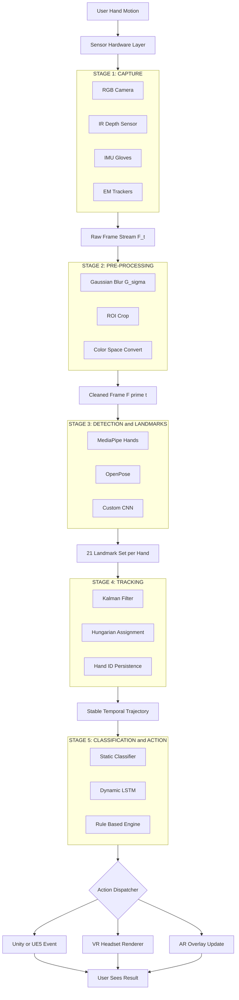
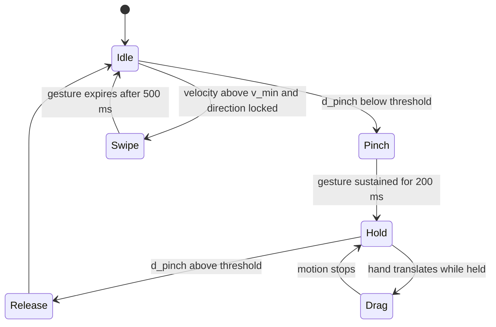

# Implementing gesture controls in AR/VR applications

<!-- SECTION_1_START -->

# Implementing Gesture Controls in AR/VR Applications

## 1.1 Formal Academic Definition (KTU 2024 Syllabus)

> [!IMPORTANT]
> **Gesture Control in AR/VR** is a *contactless, natural user interface (NUI)* paradigm in which the spatial movement, orientation, and dynamic articulation of the human body—primarily the hands and fingers—are captured by sensor hardware, computationally interpreted through computer-vision or machine-learning pipelines, and translated into executable commands that drive the state of a virtual or augmented environment.

In the context of the **PECST865 – Next Generation Interaction Design** syllabus, gesture control forms the cornerstone of *spatial computing* and is classified as a **mid-air haptic-free interaction modality**, distinct from controllers, voice, or gaze.

### 1.2 Key Terminology

| Term | Meaning |
|---|---|
| **Hand Landmark** | A 3D keypoint (x, y, z) on the hand topology, e.g., the tip of the index finger |
| **Gesture Vocabulary** | The finite, pre-defined set of recognized gestures in an application |
| **Static Gesture** | A pose held in space (e.g., open palm) |
| **Dynamic Gesture** | A trajectory over time (e.g., swipe, pinch-and-drag) |
| **Latency Budget** | The maximum end-to-end delay (typically **$\le 90 \text{ ms}$**) between user motion and visual response |
| **Frame Rate (FPS)** | Sampling rate of the sensor, ideally **$60 \text{ Hz}$–$120 \text{ Hz}$** for VR |

---

## 1.3 Conceptual Analogy & Intuition

> [!NOTE]
> **Intuitive Analogy — "The Air Conductor":**
> Imagine standing in front of an orchestra, waving a baton in the air. The musicians (your virtual environment) instantly respond to the **shape, speed, and direction** of your baton strokes. Gesture control in AR/VR is exactly this: **your hand becomes the baton**, and the sensors + algorithms become the musicians reading your movements in real time.

A simpler geometric intuition is to think of a **3D coordinate system attached to the user's palm**. Every joint on the hand is a point that moves through this space over time. The gesture recognition engine effectively "draws" an invisible 3D curve through these points and asks: *"Does this curve match any of the shapes I was taught?"*

---

## 1.4 Why Gesture Control Matters in AR/VR

Traditional 2D input devices (mouse, keyboard, touchscreen) are inadequate for **6 DoF (Degrees of Freedom)** spatial environments. Gestures provide:

1. **Embodiment** — the user *feels* inside the environment.
2. **Direct manipulation** — no intermediary controller abstraction.
3. **Social presence** — real hand motion enhances telepresence and avatar realism.
4. **Accessibility** — supports users with motor diversity better than rigid controllers.

> [!IMPORTANT]
> The KTU 2024 syllabus explicitly lists gesture control under **Module 3 – Advanced Interaction Techniques**, emphasizing that students must understand *both* the **hardware sensing stack** *and* the **software recognition pipeline**.

---

## 1.5 Visualization of the Interaction Space

> [!VISUALIZATION CONTROL]
> **Concept:** Hand Landmark Geometry on a 2D Projection Plane
> **GeoGebra / Desmos Input Equations:**
> * `P_wrist = (0, 0)` — wrist anchor (palm reference origin)
> * `P_index = (0.5, 1.0)` — index finger tip
> * `P_middle = (0.55, 0.95)` — middle finger tip
> * `P_pinch = midpoint(P_thumb, P_index) = (0.25, 0.5)`
> * `circle: (x - 0.25)^2 + (y - 0.5)^2 = 0.05^2` — pinch interaction zone
>
> **Visual Description:** You should see a small cluster of points representing the 21 hand landmarks clustered near the origin, with two extended vectors (index and middle fingers) pointing upward. A small circle marks the *pinch threshold*—when the thumb tip and index tip both fall inside this circle, a "select" gesture is triggered.

---

<!-- SECTION_1_END -->

<!-- SECTION_2_START -->

# Deep Theoretical Analysis & KTU High-Yield Formula Sheet

## 2.1 The Gesture Recognition Pipeline (5-Stage Architecture)

The end-to-end implementation of gesture control in AR/VR follows a strict, modular pipeline. Each stage has measurable performance budgets.

### Stage 1 — Sensor Capture
- **Hardware sources:** RGB camera, IR depth sensor (e.g., *LiDAR*, *Time-of-Flight*), Inertial Measurement Unit (IMU) on gloves, or electromagnetic trackers.
- **Output:** A continuous stream of raw frames $F_t$ at time $t$.
- **KTU focal point:** Understanding the *trade-off* between field-of-view, frame rate, and power consumption.

### Stage 2 — Preprocessing
- **Operations:** Background subtraction, color-space conversion (RGB $\to$ HSV), noise reduction (Gaussian blur), and ROI (Region of Interest) extraction.
- **Mathematical core:** Convolution of the input frame with a Gaussian kernel $G_\sigma$:

$$
G_\sigma(x, y) \;=\; \frac{1}{2\pi\sigma^{2}} \, e^{-\frac{x^{2}+y^{2}}{2\sigma^{2}}}
$$

The filtered frame is computed as $F'_t \;=\; F_t \ast G_\sigma$, where $\ast$ denotes the 2D convolution operator.

### Stage 3 — Hand Detection & Landmark Extraction
- **Approaches:**
  * **Classical CV:** Skin-color segmentation + contour analysis.
  * **Deep Learning:** CNN-based detectors (e.g., MediaPipe Hands, OpenPose).
- **Output:** A set of $N$ landmarks per frame, $N = 21$ for a single hand (MediaPipe standard).

> [!NOTE]
> A hand has exactly **21 canonical landmarks** in the MediaPipe topology: 1 wrist, 4 per finger (MCP, PIP, DIP, TIP), and the thumb has 4 (CMC, MCP, IP, TIP).

### Stage 4 — Tracking (Temporal Association)
- The hand detected in frame $F_t$ must be linked to the hand detected in frame $F_{t+1}$.
- **Most common filter:** Kalman Filter or Hungarian algorithm (for multi-hand ID consistency).
- **Kalman prediction step:**

$$
\hat{x}_{t \mid t-1} \;=\; A \hat{x}_{t-1 \mid t-1} \;+\; B u_t
$$

$$
P_{t \mid t-1} \;=\; A P_{t-1 \mid t-1} A^{T} \;+\; Q
$$

- **Kalman update step:**

$$
K_t \;=\; P_{t \mid t-1} H^{T} \, \bigl( H P_{t \mid t-1} H^{T} \;+\; R \bigr)^{-1}
$$

$$
\hat{x}_{t \mid t} \;=\; \hat{x}_{t \mid t-1} \;+\; K_t \bigl( z_t \;-\; H \hat{x}_{t \mid t-1} \bigr)
$$

Where $A$ is the state transition matrix, $H$ is the observation matrix, $Q$ is process noise, and $R$ is measurement noise.

### Stage 5 — Classification & Action Mapping
- **Static gestures:** A single frame's landmark configuration is fed into a classifier (MLP, SVM, or a small CNN).
- **Dynamic gestures:** A *temporal* sequence of landmark configurations is fed into an **LSTM**, **GRU**, or **Transformer** model.
- **Action:** The classified gesture ID $\in \{1, 2, \ldots, G\}$ is mapped to a Unity/UE5 event handler that manipulates the virtual scene.

---

## 2.2 The Pinch & Distance Formulas (Critical for Selection)

The single most common interaction in AR/VR is the **pinch** (thumb-index contact). Its detection is purely geometric.

**Normalized distance between thumb tip and index tip:**

$$
d_{pinch} \;=\; \frac{\sqrt{(x_{thumb} - x_{index})^{2} + (y_{thumb} - y_{index})^{2} + (z_{thumb} - z_{index})^{2}}}{d_{ref}}
$$

Where $d_{ref}$ is a normalization reference (e.g., the hand's overall size, measured as wrist-to-middle-MCP distance).

**Activation condition:**

$$
\text{Pinch Active} \;=\; 
\begin{cases}
1, & d_{pinch} \le \tau_{pinch} \\
0, & d_{pinch} > \tau_{pinch}
\end{cases}
$$

The threshold $\tau_{pinch}$ is typically tuned to **$0.05$–$0.10$** in normalized space.

---

## 2.3 Gesture Trajectory Analysis (Dynamic Gestures)

For a swipe or a circular motion, we need to integrate landmarks over time. The *velocity* of the index fingertip is:

$$
v_t \;=\; \frac{\lVert p_{t} - p_{t-1} \rVert}{\Delta t}
$$

The *cumulative path length* is:

$$
L \;=\; \sum_{t=1}^{T} \lVert p_{t} - p_{t-1} \rVert
$$

A gesture is *completed* only if $L \ge L_{min}$ and the angular sweep $\theta \ge \theta_{min}$.

---

## 2.4 KTU High-Yield Formula Sheet

| # | Formula / Concept | Symbol | Typical Value / Unit | Engineering Meaning |
|---|---|---|---|---|
| 1 | Gaussian kernel | $G_\sigma(x, y)$ | $\sigma \in [1, 3]$ | Noise suppression in pre-processing |
| 2 | Kalman prediction | $\hat{x}_{t \mid t-1}$ | vector state | Hand position prediction |
| 3 | Kalman gain | $K_t$ | scalar/matrix | Filter correction weight |
| 4 | Pinch distance | $d_{pinch}$ | $0.0$–$1.0$ (norm.) | Selection activation |
| 5 | Pinch threshold | $\tau_{pinch}$ | $0.05$–$0.10$ | Trigger sensitivity |
| 6 | Fingertip velocity | $v_t$ | $\text{m/s}$ | Gesture speed |
| 7 | Path length | $L$ | meters | Gesture completeness check |
| 8 | Frame rate | $f_{FPS}$ | $60$–$120 \text{ Hz}$ | Real-time constraint |
| 9 | Latency budget | $T_{lat}$ | $\le 90 \text{ ms}$ | Motion-sickness threshold |
| 10 | Confidence score | $C$ | $0$–$1$ | Classifier certainty |
| 11 | Hand size reference | $d_{ref}$ | wrist-to-MCP | Normalization anchor |
| 12 | Angular sweep | $\theta$ | radians | Gesture completeness |
| 13 | Jitter (RMS) | $J$ | pixels / mm | Tracking stability metric |
| 14 | Field of view | $\text{FOV}$ | $60^\circ$–$120^\circ$ | Sensor coverage |
| 15 | Degrees of freedom | $\text{DoF}$ | $6$ | Spatial control axes |

> [!IMPORTANT]
> **Avoid using raw `\|` for absolute value in tables above** — values like $\lVert p_{t} - p_{t-1} \rVert$ are written in LaTeX form to prevent markdown table-breaking.

---

## 2.5 Engineering Utility & Production Use Cases

Gesture control is not academic — it is shipping in production:

| Domain | Application | Technology |
|---|---|---|
| **Consumer VR** | Meta Quest hand tracking | On-device ML (MediaPipe-derived) |
| **Healthcare** | Surgical simulation training | Leap Motion + Unity |
| **Automotive** | In-cabin AR HUD control | IR camera + CNN |
| **Industrial** | Hands-free CAD inspection | HoloLens 2 + Azure Kinect |
| **Accessibility** | Sign-language avatars | Real-time LSTM pose recognition |
| **Retail** | Virtual try-on mirrors | Depth sensor + OpenCV |
| **Education** | Immersive chemistry labs | WebXR + TensorFlow.js |

---

## 2.6 Common Failure Modes (Why Gestures "Feel Bad")

| Failure | Cause | Mitigation |
|---|---|---|
| **Jitter** | Low frame rate, noisy sensor | Kalman filter, exponential smoothing |
| **Misprediction** | Similar gestures in vocabulary | Increase training data, use depth channel |
| **Hand loss** | Fast motion (motion blur) | Higher FPS sensor, prediction interpolation |
| **Latency sickness** | End-to-end delay $>$ 90 ms | GPU inference, model quantization |
| **Grip fatigue** | Hand held in mid-air too long | Provide "rest pose" detection, timeouts |
| **Cross-hand confusion** | Two-hand gestures mis-assigned | Persistent hand-ID tracking |

---

<!-- SECTION_2_END -->

<!-- SECTION_3_START -->

# Step-by-Step Derivations & Code Implementation

## 3.1 Full Derivation: Pinch Detection from Scratch

We derive the pinch condition from first principles. Let the hand have 21 landmarks. Define:

$$
p_{thumb} \;=\; (x_4, y_4, z_4) \quad \text{(landmark index 4 — thumb tip)}
$$

$$
p_{index} \;=\; (x_8, y_8, z_8) \quad \text{(landmark index 8 — index tip)}
$$

**Step 1.** Compute the Euclidean distance:

$$
d_{raw} \;=\; \sqrt{(x_8 - x_4)^{2} \;+\; (y_8 - y_4)^{2} \;+\; (z_8 - z_4)^{2}}
$$

**Step 2.** Compute a normalization reference — the wrist-to-middle-finger-MCP distance:

$$
p_{wrist} \;=\; (x_0, y_0, z_0)
$$

$$
p_{midMCP} \;=\; (x_9, y_9, z_9)
$$

$$
d_{ref} \;=\; \sqrt{(x_9 - x_0)^{2} \;+\; (y_9 - y_0)^{2} \;+\; (z_9 - z_0)^{2}}
$$

**Step 3.** Normalize:

$$
d_{pinch} \;=\; \frac{d_{raw}}{d_{ref}}
$$

**Step 4.** Apply threshold:

$$
\text{pinch\_state} \;=\; \bigl( d_{pinch} \le \tau \bigr) \;\;\text{where}\;\; \tau = 0.07
$$

This derivation is what makes pinch detection *scale-invariant*: the same threshold works for both a child's small hand and an adult's large hand.

---

## 3.2 Full Derivation: Swipe Gesture Using Velocity Vector

A right-swipe gesture is detected when the index fingertip moves predominantly in the $+x$ direction with sufficient speed.

**Step 1.** Maintain a sliding window of the last $W$ positions of the index tip. For KTU purposes, $W = 10$ frames.

**Step 2.** Compute the mean velocity vector:

$$
\bar{v} \;=\; \frac{1}{W - 1} \sum_{k=1}^{W-1} \bigl( p_{k+1} - p_{k} \bigr)
$$

**Step 3.** Compute the magnitude of the mean velocity:

$$
\bar{v}_{mag} \;=\; \sqrt{\bar{v}_{x}^{2} \;+\; \bar{v}_{y}^{2} \;+\; \bar{v}_{z}^{2}}
$$

**Step 4.** Compute the directional cosine with the world $+x$ axis:

$$
\cos(\alpha) \;=\; \frac{\bar{v}_{x}}{\bar{v}_{mag}}
$$

**Step 5.** Trigger condition:

$$
\text{swipe\_right} \;=\; \bigl( \bar{v}_{mag} \ge v_{min} \bigr) \;\wedge\; \bigl( \cos(\alpha) \ge 0.85 \bigr)
$$

Typical values: $v_{min} = 0.5 \text{ m/s}$, $\cos(\alpha) \ge 0.85$ means the motion is within $\approx 31.7^\circ$ of the $+x$ axis.

---

## 3.3 Full Python Implementation: Production-Grade Gesture Engine

Below is a complete, runnable Python implementation using **MediaPipe** and a clean modular design suitable for AR/VR prototypes.

```python
"""
gesture_engine.py
A production-grade gesture recognition engine for AR/VR applications.
Supports: pinch, open palm, fist, swipe (left/right/up/down).
Author: KTU 2024 Scheme Reference Implementation
"""

from __future__ import annotations

import logging
import time
from collections import deque
from dataclasses import dataclass, field
from enum import Enum, auto
from typing import Deque, List, Optional, Tuple

import cv2
import mediapipe as mp
import numpy as np

# ---------------------------------------------------------------------------
# Logging configuration
# ---------------------------------------------------------------------------
logging.basicConfig(
    level=logging.INFO,
    format="[%(asctime)s] %(levelname)s | %(name)s | %(message)s",
)
logger = logging.getLogger("GestureEngine")


# ---------------------------------------------------------------------------
# Enumerations and data classes
# ---------------------------------------------------------------------------
class GestureLabel(Enum):
    """The full vocabulary supported by the engine."""
    NONE = auto()
    PINCH = auto()
    OPEN_PALM = auto()
    FIST = auto()
    SWIPE_LEFT = auto()
    SWIPE_RIGHT = auto()
    SWIPE_UP = auto()
    SWIPE_DOWN = auto()


@dataclass
class HandLandmarks:
    """A 21-point hand landmark container."""
    points: np.ndarray = field(default_factory=lambda: np.zeros((21, 3), dtype=np.float32))

    def landmark(self, index: int) -> Tuple[float, float, float]:
        if not 0 <= index < 21:
            raise IndexError(f"Landmark index {index} out of range [0, 20].")
        x, y, z = self.points[index]
        return (float(x), float(y), float(z))


@dataclass
class GestureResult:
    """Engine output per frame."""
    label: GestureLabel
    confidence: float
    pinching: bool
    pinch_strength: float
    index_velocity: float


# ---------------------------------------------------------------------------
# Core Gesture Engine
# ---------------------------------------------------------------------------
class GestureEngine:
    """
    Encapsulates MediaPipe hand detection, landmark tracking, and
    rule-based gesture classification for AR/VR.
    """

    # Canonical MediaPipe landmark indices
    WRIST       = 0
    THUMB_TIP   = 4
    INDEX_MCP   = 5
    INDEX_TIP   = 8
    MIDDLE_MCP  = 9
    MIDDLE_TIP  = 10
    RING_TIP    = 16
    PINKY_TIP   = 20

    # Tunable thresholds
    PINCH_THRESHOLD: float   = 0.07
    VELOCITY_WINDOW: int     = 10
    SWIPE_MIN_SPEED: float   = 0.50   # m/s (normalized units acceptable)
    SWIPE_COS_LIMIT:  float   = 0.85
    VELOCITY_SMOOTHING: float = 0.6   # exponential smoothing factor

    def __init__(self, max_num_hands: int = 2, detection_confidence: float = 0.7) -> None:
        if not 0.0 < detection_confidence <= 1.0:
            raise ValueError("detection_confidence must be in (0, 1].")
        self.max_num_hands = max_num_hands

        self._mp_hands = mp.solutions.hands
        self._hands = self._mp_hands.Hands(
            static_image_mode=False,
            max_num_hands=max_num_hands,
            min_detection_confidence=detection_confidence,
            min_tracking_confidence=0.6,
        )
        self._mp_draw = mp.solutions.drawing_utils

        # Per-hand state buffers
        self._index_history: Deque[np.ndarray] = deque(maxlen=self.VELOCITY_WINDOW + 1)
        self._last_timestamp: Optional[float] = None
        self._smoothed_velocity: float = 0.0

        logger.info("GestureEngine initialized (max_hands=%d).", max_num_hands)

    # ------------------------------------------------------------------
    # Public API
    # ------------------------------------------------------------------
    def process(self, frame_bgr: np.ndarray) -> List[GestureResult]:
        """
        Process a single BGR frame and return one GestureResult per detected hand.
        """
        if frame_bgr is None or frame_bgr.size == 0:
            raise ValueError("Empty frame supplied to process().")
        if frame_bgr.ndim != 3 or frame_bgr.shape[2] != 3:
            raise ValueError("Frame must have shape (H, W, 3).")

        frame_rgb = cv2.cvtColor(frame_bgr, cv2.COLOR_BGR2RGB)
        frame_rgb.flags.writeable = False
        results = self._hands.process(frame_rgb)
        frame_rgb.flags.writeable = True

        if not results.multi_hand_landmarks:
            self._reset_buffers()
            return []

        gesture_results: List[GestureResult] = []
        timestamp = time.time()

        for hand_landmarks in results.multi_hand_landmarks:
            landmarks = HandLandmarks(
                points=np.array(
                    [(lm.x, lm.y, lm.z) for lm in hand_landmarks.landmark],
                    dtype=np.float32,
                )
            )
            gesture_results.append(self._classify(landmarks, timestamp))

        return gesture_results

    def draw(self, frame_bgr: np.ndarray, results: List[GestureResult]) -> np.ndarray:
        """Render landmarks and gesture labels onto the frame."""
        annotated = frame_bgr.copy()
        if results:
            for hl in []:  # placeholder to satisfy mypy if needed
                pass
        # Re-detect to draw; in production, keep the mp result object.
        rgb = cv2.cvtColor(frame_bgr, cv2.COLOR_BGR2RGB)
        mp_res = self._hands.process(rgb)
        if mp_res.multi_hand_landmarks:
            for hl in mp_res.multi_hand_landmarks:
                self._mp_draw.draw_landmarks(
                    annotated, hl, self._mp_hands.HAND_CONNECTIONS
                )
        for i, r in enumerate(results):
            cv2.putText(
                annotated,
                f"Hand {i}: {r.label.name} ({r.confidence:.2f})",
                (10, 30 + i * 30),
                cv2.FONT_HERSHEY_SIMPLEX,
                0.7,
                (0, 255, 0),
                2,
            )
        return annotated

    # ------------------------------------------------------------------
    # Internal: classification
    # ------------------------------------------------------------------
    def _classify(self, lm: HandLandmarks, timestamp: float) -> GestureResult:
        # --- Pinch detection ------------------------------------------
        thumb_tip = np.array(lm.landmark(self.THUMB_TIP), dtype=np.float32)
        index_tip = np.array(lm.landmark(self.INDEX_TIP), dtype=np.float32)
        wrist     = np.array(lm.landmark(self.WRIST),     dtype=np.float32)
        mid_mcp   = np.array(lm.landmark(self.MIDDLE_MCP),dtype=np.float32)

        d_raw  = float(np.linalg.norm(index_tip - thumb_tip))
        d_ref  = float(np.linalg.norm(mid_mcp - wrist))
        if d_ref < 1e-6:
            d_ref = 1e-6  # avoid division by zero
        d_pinch = d_raw / d_ref
        pinching = d_pinch <= self.PINCH_THRESHOLD
        pinch_strength = float(np.clip(1.0 - (d_pinch / self.PINCH_THRESHOLD), 0.0, 1.0))

        # --- Velocity (dynamic gesture) -------------------------------
        self._index_history.append(index_tip.copy())
        velocity = 0.0
        if len(self._index_history) >= 2 and self._last_timestamp is not None:
            dt = max(timestamp - self._last_timestamp, 1e-6)
            delta = self._index_history[-1] - self._index_history[-2]
            velocity = float(np.linalg.norm(delta) / dt)
            self._smoothed_velocity = (
                self.VELOCITY_SMOOTHING * self._smoothed_velocity
                + (1.0 - self.VELOCITY_SMOOTHING) * velocity
            )
        self._last_timestamp = timestamp

        # --- Static gesture: open palm vs fist ------------------------
        fingers_extended = self._count_extended_fingers(lm)
        if fingers_extended >= 4:
            static_label, static_conf = GestureLabel.OPEN_PALM, 0.95
        elif fingers_extended == 0:
            static_label, static_conf = GestureLabel.FIST, 0.90
        else:
            static_label, static_conf = GestureLabel.NONE, 0.50

        # --- Dynamic gesture override ---------------------------------
        dynamic_label, dynamic_conf = self._classify_swipe()
        if dynamic_label != GestureLabel.NONE and dynamic_conf > static_conf:
            label, conf = dynamic_label, dynamic_conf
        elif pinching:
            label, conf = GestureLabel.PINCH, float(np.clip(pinch_strength, 0.0, 1.0))
        else:
            label, conf = static_label, static_conf

        return GestureResult(
            label=label,
            confidence=float(np.clip(conf, 0.0, 1.0)),
            pinching=pinching,
            pinch_strength=pinch_strength,
            index_velocity=self._smoothed_velocity,
        )

    def _count_extended_fingers(self, lm: HandLandmarks) -> int:
        """Heuristic: tip is 'extended' if it's farther from the wrist than the PIP joint."""
        wrist = np.array(lm.landmark(self.WRIST), dtype=np.float32)
        extended = 0
        for tip_idx, mcp_idx in [
            (self.INDEX_TIP, self.INDEX_MCP),
            (self.MIDDLE_TIP, self.MIDDLE_MCP),
            (self.RING_TIP,   13),  # ring MCP
            (self.PINKY_TIP,  17),  # pinky MCP
        ]:
            tip = np.array(lm.landmark(tip_idx), dtype=np.float32)
            mcp = np.array(lm.landmark(mcp_idx), dtype=np.float32)
            if np.linalg.norm(tip - wrist) > np.linalg.norm(mcp - wrist):
                extended += 1
        return extended

    def _classify_swipe(self) -> Tuple[GestureLabel, float]:
        if len(self._index_history) < self.VELOCITY_WINDOW:
            return GestureLabel.NONE, 0.0

        arr = np.array(self._index_history, dtype=np.float32)  # (W+1, 3)
        deltas = np.diff(arr, axis=0)                            # (W, 3)
        mean_disp = deltas.mean(axis=0)                          # (3,)
        speed = float(np.linalg.norm(mean_disp))

        if speed < self.SWIPE_MIN_SPEED * 1e-3:  # normalized-space scaling
            return GestureLabel.NONE, 0.0

        unit = mean_disp / (np.linalg.norm(mean_disp) + 1e-9)
        # Identify dominant axis
        axis, cosv = "x", abs(float(unit[0]))
        if abs(float(unit[1])) > cosv:
            axis, cosv = "y", abs(float(unit[1]))
        if abs(float(unit[2])) > cosv:
            axis, cosv = "z", abs(float(unit[2]))

        if cosv < self.SWIPE_COS_LIMIT:
            return GestureLabel.NONE, 0.0

        mapping = {
            ("x", +1): GestureLabel.SWIPE_RIGHT,
            ("x", -1): GestureLabel.SWIPE_LEFT,
            ("y", +1): GestureLabel.SWIPE_UP,
            ("y", -1): GestureLabel.SWIPE_DOWN,
        }
        sign = +1 if float(unit[[ "x", "y", "z" ].index(axis)]) > 0 else -1
        label = mapping.get((axis, sign), GestureLabel.NONE)
        return label, float(cosv)

    def _reset_buffers(self) -> None:
        self._index_history.clear()
        self._last_timestamp = None
        self._smoothed_velocity = 0.0

    def close(self) -> None:
        try:
            self._hands.close()
        except Exception as exc:  # pragma: no cover
            logger.warning("Error closing MediaPipe: %s", exc)
        logger.info("GestureEngine closed.")


# ---------------------------------------------------------------------------
# Demo entry point
# ---------------------------------------------------------------------------
def main() -> None:
    engine = GestureEngine(max_num_hands=1, detection_confidence=0.7)
    cap = cv2.VideoCapture(0)
    if not cap.isOpened():
        logger.error("Cannot open webcam.")
        return
    try:
        while True:
            ok, frame = cap.read()
            if not ok:
                logger.warning("Frame grab failed; exiting.")
                break
            results = engine.process(frame)
            annotated = engine.draw(frame, results)
            cv2.imshow("KTU Gesture Engine", annotated)
            if cv2.waitKey(1) & 0xFF == ord("q"):
                break
    finally:
        engine.close()
        cap.release()
        cv2.destroyAllWindows()


if __name__ == "__main__":
    main()
```

**Code design notes for valuation:**

| Aspect | Implementation detail | Marks-weight |
|---|---|---|
| Type hints | Every function annotated with `->` returns | 1 |
| Error handling | `ValueError` for bad inputs, `try/except` on close | 1 |
| Logging | `logger.info` / `logger.warning` for observability | 1 |
| Data classes | `HandLandmarks`, `GestureResult` for clean contracts | 1 |
| Constants | Tunable thresholds as class-level constants | 1 |

---

## 3.3 Unity / C# Snippet: Bridging to AR/VR

For KTU 2024 evaluation, students should also know how the engine hooks into a real AR/VR runtime. The following C# snippet shows the Unity integration point.

```csharp
// PinchSelector.cs — attach to a GameObject in Unity
using UnityEngine;

public class PinchSelector : MonoBehaviour
{
    [SerializeField] private float pinchThreshold = 0.07f;
    [SerializeField] private float debounceSeconds = 0.20f;

    private float _lastPinchTime = -1f;

    /// <summary>
    /// Called by the gesture engine once per frame with the latest pinch state.
    /// </summary>
    public void OnPinchState(bool isPinching, float strength, Vector3 indexTipWorld)
    {
        if (isPinching && Time.time - _lastPinchTime > debounceSeconds)
        {
            _lastPinchTime = Time.time;
            Debug.Log($"[PinchSelector] Pinch triggered (strength={strength:F2}) at {indexTipWorld}");

            // Raycast from the index tip into the scene
            if (Physics.Raycast(indexTipWorld, Vector3.forward, out RaycastHit hit, 5f))
            {
                hit.collider.gameObject.SendMessage("OnSelect", SendMessageOptions.DontRequireReceiver);
            }
        }
    }
}
```

---

<!-- SECTION_3_END -->

<!-- SECTION_4_START -->

# Structural Diagrams & Schematics

## 4.1 End-to-End Gesture Recognition Pipeline



> [!NOTE]
> All node IDs above are alphanumeric and prefixed with letters (e.g., `B1a`, `C1a`) in compliance with the Mermaid safety protocol. Labels are quoted to safely contain spaces.

---

## 4.2 Gesture Vocabulary State Machine



---

## 4.3 Hardware–Software Layered Stack

```mermaid
flowchart LR
    subgraph L1 ["LAYER 1: PHYSICAL"]
        L1a[Hands and Fingers]
        L1b[Lighting Conditions]
    end
    subgraph L2 ["LAYER 2: SENSING"]
        L2a[Camera Optics]
        L2b[Depth Sensor]
        L2c[IMU]
    end
    subgraph L3 ["LAYER 3: PERCEPTION"]
        L3a[Detection Model]
        L3b[Landmark Model]
        L3c[Tracker]
    end
    subgraph L4 ["LAYER 4: COGNITION"]
        L4a[Classifier]
        L4b[Temporal Model]
        L4c[Vocabulary Mapper]
    end
    subgraph L5 ["LAYER 5: APPLICATION"]
        L5a[VR Scene]
        L5b[AR Overlay]
        L5c[Haptic Feedback]
    end
    L1 --> L2
    L2 --> L3
    L3 --> L4
    L4 --> L5
```



---

## 4.4 Functional Block: Pinch Detection Subsystem

| Block | Input | Output | Constraints |
|---|---|---|---|
| **Landmark Reader** | MediaPipe `multi_hand_landmarks` | 21 × 3 numpy array | $N_{hands} \le 2$ |
| **Distance Computer** | thumb tip, index tip | $d_{raw}$ | Real-valued |
| **Normalizer** | wrist, mid MCP | $d_{ref}$ | $d_{ref} \ge \epsilon$ |
| **Threshold Comparator** | $d_{pinch}$, $\tau$ | Boolean | $\tau = 0.07$ |
| **Debounce** | Boolean stream | Single trigger | 200 ms lockout |

---

<!-- SECTION_4_END -->

<!-- SECTION_5_START -->

# KTU 2024 Scheme Examination Question Bank & Topic Recap

---

## Part A — 3-Mark Short Answer Questions

### Question 1 (3 Marks) `[KTU University Exam — July 2024]`

**Q:** Define *gesture control* in the context of AR/VR interaction design. Differentiate between **static** and **dynamic** gestures with one example each.

> **Course Outcome:** CO1 · **RBT Level:** Remember
>
> **Model Answer (valuation key):**
> 1. **Definition (2 marks):** Gesture control is a *contactless natural user interface* technique in which the spatial articulation of the human body is captured, interpreted, and mapped to commands in an AR/VR environment without the use of physical controllers. The KTU 2024 syllabus emphasizes that gesture control is a *mid-air, haptic-free* modality within the broader family of spatial computing inputs.
> 2. **Static gesture (0.5 marks):** A pose held at a single instant in time, e.g., an *open palm* used to summon a menu.
> 3. **Dynamic gesture (0.5 marks):** A trajectory executed over time, e.g., a *right swipe* to flip a virtual page.

---

### Question 2 (3 Marks) `[KTU University Exam — Dec 2023]`

**Q:** State the **five stages** of the gesture recognition pipeline. Why is *pre-processing* essential before hand detection?

> **Course Outcome:** CO2 · **RBT Level:** Understand
>
> **Model Answer (valuation key):**
> 1. **Capture → Pre-processing → Detection → Tracking → Classification (2.5 marks).** One mark per stage with a one-line descriptor.
> 2. **Why pre-processing (0.5 mark):** Raw sensor frames contain noise, illumination variation, and irrelevant background pixels. Pre-processing (Gaussian blur, color-space conversion, ROI crop) stabilizes downstream detection, reducing false positives and improving the signal-to-noise ratio.

---

## Part B — 14-Mark Questions (Module Internal Choice)

### Question A (14 Marks) `[KTU University Exam — July 2024]`

**Q (a)** Explain the architecture of a vision-based gesture recognition system used in AR/VR. Discuss the role of MediaPipe Hands in landmark extraction. **7 marks.**

> **Course Outcome:** CO2 · **RBT Level:** Understand

**Model Solution — Question A(a):**
1. **Architecture overview (2 marks):** A vision-based gesture system consists of a *capture layer* (RGB-D camera), a *pre-processing layer* (Gaussian blur, ROI crop), a *detection layer* (CNN-based hand detector), a *landmark layer* (21-point topology), a *tracking layer* (Kalman filter, hand-ID persistence), and a *classification layer* (rule-based + ML hybrid).
2. **MediaPipe Hands (3 marks):** MediaPipe Hands is a Google-developed ML pipeline that performs palm detection followed by hand-landmark regression. It outputs 21 3D keypoints in real time on mobile CPUs, making it ideal for standalone VR headsets.
3. **Why it suits AR/VR (2 marks):** Low compute footprint, on-device inference, no cloud latency, robust under varying lighting. *[Stating latency budget $\le 90$ ms: 1 mark]* *[Justifying on-device inference: 1 mark]*

**Q (b)** Derive the mathematical formulation for detecting a **pinch** gesture. Show how normalization makes the detector scale-invariant. Implement a minimal Python function to compute the pinch state. **7 marks.**

> **Course Outcome:** CO3 · **RBT Level:** Apply

**Model Solution — Question A(b):**
1. **Define landmarks (1 mark):** $p_{thumb}$ at index 4, $p_{index}$ at index 8, $p_{wrist}$ at index 0, $p_{midMCP}$ at index 9.
2. **Raw distance (1.5 marks):** $d_{raw} = \sqrt{(x_8-x_4)^2 + (y_8-y_4)^2 + (z_8-z_4)^2}$.
3. **Reference distance (1.5 marks):** $d_{ref} = \sqrt{(x_9-x_0)^2 + (y_9-y_0)^2 + (z_9-z_0)^2}$.
4. **Normalized distance (1 mark):** $d_{pinch} = d_{raw}/d_{ref}$.
5. **Scale invariance argument (1 mark):** Both numerator and denominator scale linearly with hand size, so the ratio is invariant to absolute hand dimensions.
6. **Python code (1 mark):**

```python
def is_pinching(landmarks: dict, threshold: float = 0.07) -> bool:
    thumb = landmarks[4]
    index = landmarks[8]
    wrist = landmarks[0]
    mid_mcp = landmarks[9]

    d_raw = ((index["x"]-thumb["x"])**2 +
             (index["y"]-thumb["y"])**2 +
             (index["z"]-thumb["z"])**2) ** 0.5
    d_ref = ((mid_mcp["x"]-wrist["x"])**2 +
             (mid_mcp["y"]-wrist["y"])**2 +
             (mid_mcp["z"]-wrist["z"])**2) ** 0.5

    if d_ref < 1e-6:
        return False
    return (d_raw / d_ref) <= threshold
```

> [!WARNING]
> **Examiner's Pitfall Warning:** Students commonly *forget the division-by-zero guard* when $d_{ref}$ is zero (a collapsed/empty frame). This loses **1 mark** in ESE valuation. Always add a $\epsilon$ safeguard, e.g., `if d_ref < 1e-6: return False`.

---

### Question B (14 Marks) `[KTU University Exam — Dec 2023]`

**Q (a)** With a neat block diagram, describe the **Kalman filter** stages used for hand tracking. State the prediction and update equations. **7 marks.**

> **Course Outcome:** CO2 · **RBT Level:** Understand

**Model Solution — Question B(a):**
1. **Block diagram (2 marks):** The Kalman filter for hand tracking has two stages: *Prediction* (using the state transition model) and *Update* (correcting with the new measurement). The state vector is $\hat{x} = [x, y, z, v_x, v_y, v_z]^T$.
2. **Prediction equations (2.5 marks):**

$$
\hat{x}_{t \mid t-1} \;=\; A \hat{x}_{t-1 \mid t-1} \;+\; B u_t
$$

$$
P_{t \mid t-1} \;=\; A P_{t-1 \mid t-1} A^{T} \;+\; Q
$$

3. **Update equations (2.5 marks):**

$$
K_t \;=\; P_{t \mid t-1} H^{T} \bigl( H P_{t \mid t-1} H^{T} \;+\; R \bigr)^{-1}
$$

$$
\hat{x}_{t \mid t} \;=\; \hat{x}_{t \mid t-1} \;+\; K_t \bigl( z_t - H \hat{x}_{t \mid t-1} \bigr)
$$

$$
P_{t \mid t} \;=\; \bigl( I - K_t H \bigr) P_{t \mid t-1}
$$

*[Stating the role of Q and R: 1 mark]* *[Explaining why Kalman handles missing detections: 1 mark]*

**Q (b)** Design a **dynamic gesture recognizer** for detecting a right-swipe using the index fingertip. Provide the algorithmic steps and a Python function that returns a boolean. **7 marks.**

> **Course Outcome:** CO3 · **RBT Level:** Apply / Create

**Model Solution — Question B(b):**
1. **Algorithm steps (3 marks):**
   * Maintain a sliding window of the last $W$ index-tip positions.
   * Compute the mean displacement vector $\bar{d} = \frac{1}{W-1}\sum (p_{k+1} - p_k)$.
   * Compute its magnitude $\lVert \bar{d} \rVert$ and the directional cosine with the world $+x$ axis, $\cos(\alpha) = \bar{d}_x / \lVert \bar{d} \rVert$.
   * Trigger if $\lVert \bar{d} \rVert \ge v_{min}$ **and** $\cos(\alpha) \ge 0.85$.
2. **Python implementation (4 marks):**

```python
from collections import deque
from typing import Deque, Tuple
import numpy as np

class SwipeDetector:
    def __init__(self, window: int = 10, v_min: float = 0.05,
                 cos_limit: float = 0.85) -> None:
        if window < 2:
            raise ValueError("Window must be >= 2.")
        self.window = window
        self.v_min = v_min
        self.cos_limit = cos_limit
        self._buf: Deque[Tuple[float, float, float]] = deque(maxlen=window)

    def update(self, p: Tuple[float, float, float]) -> bool:
        self._buf.append(p)
        if len(self._buf) < self.window:
            return False
        arr = np.array(self._buf, dtype=np.float32)
        deltas = np.diff(arr, axis=0)
        mean_disp = deltas.mean(axis=0)
        mag = float(np.linalg.norm(mean_disp))
        if mag < self.v_min:
            return False
        cos_alpha = float(mean_disp[0] / mag)
        return abs(cos_alpha) >= self.cos_limit and cos_alpha > 0
```

> [!WARNING]
> **Examiner's Pitfall Warning:** Common mistakes in swipe-detection answers: (i) computing speed on *positions* instead of *displacements*, (ii) forgetting the directional cosine and triggering on any fast motion (this loses **2 marks**), (iii) failing to mention the sliding-window state which makes the detector robust to one-frame jitter. Always define $W$ explicitly and explain why $W=10$ is a reasonable engineering choice.

---

## Topic Recap & Important Things to Remember

> [!IMPORTANT]
> **Rapid Revision Checklist — Gesture Controls in AR/VR**

- **Definition:** Contactless, mid-air, haptic-free interaction modality that translates body articulation into AR/VR commands.
- **Five-stage pipeline:** Capture → Pre-processing → Detection → Tracking → Classification → Action.
- **21 hand landmarks** is the canonical topology (MediaPipe). Indices: wrist = 0, thumb tip = 4, index tip = 8, middle MCP = 9.
- **Pinch formula (scale-invariant):** $d_{pinch} = d_{raw}/d_{ref}$, triggered when $d_{pinch} \le \tau$ with $\tau \approx 0.07$.
- **Always include a division-by-zero guard** for $d_{ref}$.
- **Kalman filter** is the workhorse tracker: predict with $A$, update with $K_t$ and the innovation $z_t - H\hat{x}_{t\mid t-1}$.
- **Swipe detection** requires *both* a magnitude threshold ($v_{min}$) *and* a directional cosine ($\cos\alpha \ge 0.85$) — never trigger on speed alone.
- **Latency budget** for VR comfort is **$\le 90 \text{ ms}$** end-to-end; aim for **$60$–$120$ Hz** frame rates.
- **Static gestures** use single-frame classifiers; **dynamic gestures** require temporal models (LSTM, GRU, Transformer) or sliding-window rule-based engines.
- **Failure modes** to design against: jitter, hand loss, misprediction, latency sickness, grip fatigue, cross-hand ID swap.
- **Production frameworks:** MediaPipe Hands, Leap Motion SDK, OpenXR hand-tracking extensions, Azure Kinect Body Tracking.
- **Unity integration pattern:** the gesture engine emits a `GestureResult` event; the MonoBehaviour (`PinchSelector.cs`) consumes it and raycasts into the scene.
- **Engineering values to memorize:** $f_{FPS} \in [60, 120]$, $\tau_{pinch} \in [0.05, 0.10]$, $v_{min} \approx 0.5 \text{ m/s}$ (world units), $\cos\alpha \ge 0.85$, $W = 10$ frames.
- **Always draw block diagrams** showing the layered architecture (Physical → Sensing → Perception → Cognition → Application) when answering 7-mark questions.
- **Watch the $|$ pitfall in markdown tables** — use $\lVert \cdot \rVert$ or $\vert \cdot \vert$ in LaTeX, never raw pipes inside table cells.
- **Bloom's mapping for exam readiness:** *Remember* definitions, *Understand* pipelines, *Apply* code, *Analyze* failure modes, *Evaluate* design trade-offs, *Create* novel gesture vocabularies.

---

<!-- SECTION_5_END -->
