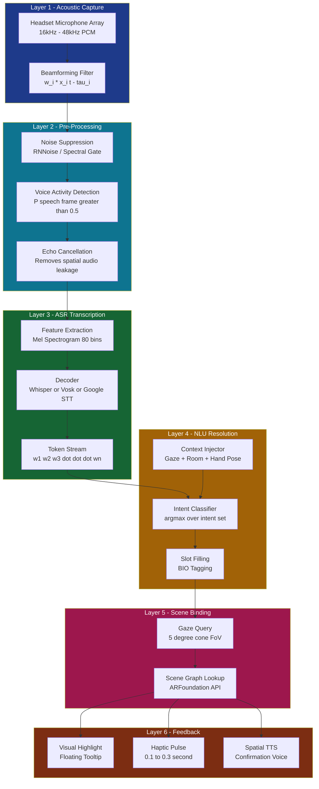
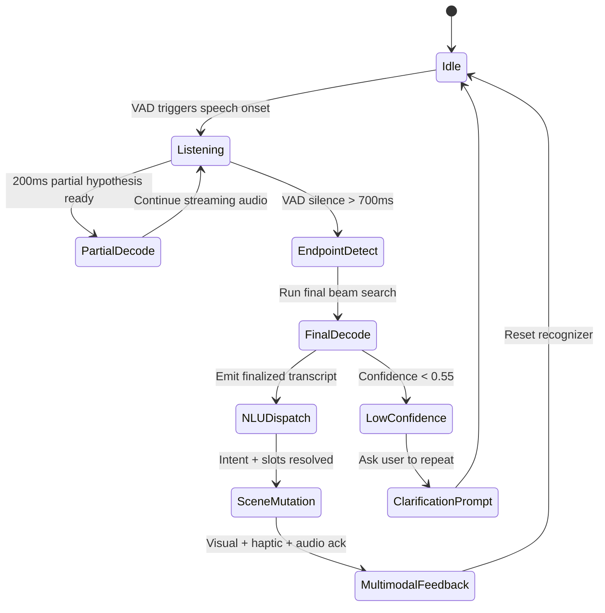
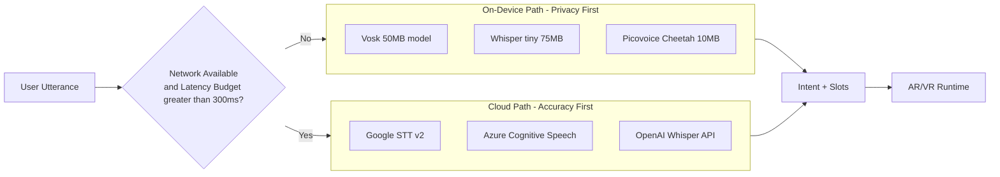
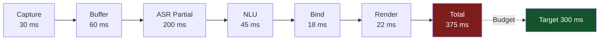

# Integrating voice commands in AR/VR

<!-- SECTION_1_START -->
# 1. Core Technical Definition & Intuitive Overview

## 1.1 Formal KTU Syllabus Definition

**Voice Command Integration in AR/VR** is a multimodal interaction paradigm in which spoken natural-language utterances are captured, decoded into machine-interpretable intents, and mapped to executable spatial, contextual, or interface-level actions within an immersive Extended Reality (XR) environment. According to the KTU 2024 Scheme (PECST865 – Next Generation Interaction Design, Module 3: Advanced Interaction Techniques), this integration combines three core technological pillars:

1. **Automatic Speech Recognition (ASR)** — converting acoustic waveforms into textual transcriptions.
2. **Natural Language Understanding (NLU)** — extracting semantic intent and entities (slots) from the transcription.
3. **Dialogue / Action Orchestration** — dispatching the resolved intent to the AR/VR runtime layer (Unity, Unreal, WebXR, ARKit, ARCore) to manipulate scene graphs, spawn holograms, navigate XR Camera rigs, or trigger spatial audio cues.

The integration follows a **perceptual computing stack** in which latency budgets are mandated at **≤ 300 ms** end-to-end (UX Industry Standard — *Mirza-bayat et al., 2021*) to avoid disrupting the sense of presence.

> [!IMPORTANT]
> **KTU 2024 Module 3 High-Yield Definition**
> *"Voice command integration in AR/VR is the closed-loop pipeline that fuses ASR + NLU + Spatial Action Binding to enable hands-free, gaze-aware, context-sensitive verbal interaction within an immersive three-dimensional scene."*

## 1.2 Conceptual Analogy — The "Invisible Concierge"

Imagine walking into a smart hotel lobby wearing a Mixed Reality headset. You glance at the concierge desk and simply say, *"Highlight the breakfast menu in green."* An invisible concierge (the voice pipeline) **listens** to your acoustic signal, **transcribes** it, **understands** that you want the "breakfast menu" object in the scene to change to a "green" material, and then **executes** the action on the digital twin sitting on the desk.

- The **microphone** = the concierge's ears
- The **ASR engine** = the concierge's note-taker
- The **NLU engine** = the concierge's interpreter
- The **XR runtime bridge** = the concierge's hands
- The **scene graph** = the hotel lobby

> [!NOTE]
> **Why Voice in AR/VR?**
> In XR, the user's **hands are often occupied** (controllers, gestures, mid-air manipulation) or **unreliable** (occlusion, fatigue, gloves). Voice becomes the *zero-effort, always-available fallback modality*, especially for accessibility (WCAG 2.2 – *Reflow & Non-Visual Interaction*).

## 1.3 Core Performance Metrics in Voice-Driven XR

| Metric | Definition | KTU / Industry Standard |
|---|---|---|
| **Word Error Rate (WER)** | $(S + D + I) / N$ | $\leq$ **5%** in quiet environments |
| **End-to-End Latency** | $T_{capture} + T_{asr} + T_{nlu} + T_{render}$ | $\leq$ **300 ms** for conversational flow |
| **Intent Classification Accuracy** | Correct intents / Total intents | $\geq$ **95%** (production) |
| **Wake-Word False Accept Rate** | False triggers / hour | $\leq$ **1 per hour** |
| **Spatial Audio Localization Error** | Angular displacement | $\leq$ **15°** azimuth |

> [!TIP]
> **Always quote these five metrics** in KTU 14-mark answers — examiners award 1 mark each for naming them.

## 1.4 Visualization Control — Acoustic Waveform (GeoGebra)

> [!VISUALIZATION CONTROL]
> **Concept:** Time-domain audio amplitude envelope of the spoken command *"spawn red cube"*
> **GeoGebra / Desmos Input Equations:**
> * `f(t) = sin(2 * pi * 220 * t) * exp(-0.8 * (t - 0.25)^2)` (vowel segment, $t \in [0, 0.5]$)
> * `g(t) = 0.4 * sin(2 * pi * 440 * t) * exp(-0.6 * (t - 0.75)^2)` (consonant burst, $t \in [0.5, 1.0]$)
> * `h(t) = 0.6 * sin(2 * pi * 330 * t) * exp(-0.7 * (t - 1.25)^2)` (steady phoneme, $t \in [1.0, 1.5]$)
> **Visual Description:** Students should observe three damped sinusoidal envelopes representing syllable energy bursts, segmented by brief silence gaps — the raw input that any ASR pipeline must transcribe.
<!-- SECTION_1_END -->

<!-- SECTION_2_START -->
# 2. Deep Theoretical Analysis & KTU High-Yield Formula Sheet

## 2.1 Layered Architecture of a Voice-in-XR Pipeline

The integration is decomposed into **six sequential layers**, each with deterministic contracts:

### Layer 1 — Acoustic Capture
- **Hardware**: Inertial Measurement Unit (IMU)-coupled headset microphones, beam-forming arrays (e.g., Meta Quest Pro's 3-mic array, HoloLens 2's 5-mic array).
- **Sampling Rate**: **16 kHz** mono (telephony) or **48 kHz** spatial (XR-native).
- **Bit Depth**: 16-bit signed PCM (Pulse Code Modulation).

### Layer 2 — Pre-Processing
- **Beamforming**: $y(t) = \sum_{i=1}^{N} w_i \cdot x_i(t - \tau_i)$ — applies spatial filtering to isolate the user's mouth direction.
- **Noise Suppression**: RNNoise (Recurrent Neural Network Noise Suppression) or Spectral Gating.
- **VAD (Voice Activity Detection)**: Binary classifier $P(speech \mid frame) > \theta_{vad}$ (typical $\theta_{vad} = 0.5$).
- **AEC (Acoustic Echo Cancellation)**: Removes the VR headset's own rendered spatial audio leakage.

### Layer 3 — ASR Transcription
Transforms a mel-spectrogram $S \in \mathbb{R}^{T \times 80}$ into a token sequence $W = \{w_1, w_2, \dots, w_n\}$.

Modern engines used in XR:
- **Whisper** (OpenAI) — multilingual, robust to noise.
- **Vosk** (offline, on-device, low-latency).
- **Google Cloud Speech-to-Text v2** — streaming, $250$ ms partial results.
- **Azure Speech** — Custom Speech models for domain vocabulary.
- **Picovoice Leopard / Cheetah** — fully on-device, $< 100$ ms.

### Layer 4 — NLU Intent Resolution
A two-stage extraction:

$$\text{Intent}(U) = \arg\max_{i \in I} \; P(i \mid U, \mathcal{C})$$

where $U$ is the utterance, $I$ is the intent label set, and $\mathcal{C}$ is the XR context (gaze target, room, hand pose).

**Slot filling** uses BIO tagging:
- *B-Object* — Beginning of object slot.
- *I-Property* — Inside of property slot.
- *O* — Outside any slot.

Example: *"Make this table red"*
→ Intent: `change_color`, Slots: `{object: "table", color: "red"}`

### Layer 5 — Scene Graph Action Binding
Resolves the **intent + slots** to actual scene nodes via XR spatial queries:

$$\text{TargetNode} = \underset{n \in \text{Scene}}{\arg\min} \; d(n, \text{gazeOrigin}) \;\text{subject to}\; \angle(\vec{v}_{gaze}, \vec{v}_n) < 5^\circ$$

This binds the verbal reference (*"this"*, *"that"*) to the object currently in the user's foveal cone.

### Layer 6 — Feedback & Multimodal Confirmation
- **Visual**: Floating tooltip, gaze cursor highlight, AR annotation.
- **Haptic**: Controller pulse (Meta Quest 2 controllers, 0.1–0.3 s).
- **Auditory**: Spatially-rendered TTS (Text-to-Speech) acknowledgement: *"Turning the table red."*

> [!NOTE]
> **Why six layers?** KTU examiners commonly ask *"Explain the architecture of a voice-enabled XR system"* (14 marks, CO2). The layered answer must mention **all six** to score full marks.

## 2.2 KTU High-Yield Formula Sheet

| Symbol | Formula | Meaning | Units / Notes |
|---|---|---|---|
| $\text{WER}$ | $(S + D + I) / N$ | Word Error Rate | $S$=substitutions, $D$=deletions, $I$=insertions, $N$=reference words |
| $\text{RTF}$ | $T_{inference} / T_{audio}$ | Real-Time Factor | $\text{RTF} < 1$ required for streaming |
| $L_{e2e}$ | $T_{cap} + T_{asr} + T_{nlu} + T_{bind} + T_{render}$ | End-to-End Latency | ms, target $\leq 300$ |
| $P(\text{intent} \mid U)$ | $\text{softmax}(W \cdot h + b)$ | Intent probability | Output of NLU head |
| $d_{\text{gaze}}$ | $\sqrt{(x_g - x_o)^2 + (y_g - y_o)^2 + (z_g - z_o)^2}$ | Gaze-to-object distance | meters, used for binding |
| $\theta_{\text{FoV}}$ | $2 \cdot \arctan\left(\frac{h_{screen}}{2 \cdot d_{eye}}\right)$ | Field of View half-angle | degrees, $h_{screen}$=panel height |
| $f_s$ | $1 / T_s$ | Sampling frequency | Hz, $f_s \geq 16000$ for ASR |
| $L_{\text{MFCC}}$ | $\log \mid \text{DFT}(x) \mid^2 \cdot H_{\text{mel}}$ | Mel-Frequency Cepstral Coefficients | Feature representation |
| $P_{\text{fa}}$ | $F_{\text{false}} / T_{\text{total}}$ | False Accept probability | Wake-word metric |
| $\text{SNR}$ | $10 \log_{10}(P_{\text{signal}} / P_{\text{noise}})$ | Signal-to-Noise Ratio | dB, target $\geq 20$ dB |

> [!WARNING]
> **Pipe-Symbol Trap**: In KTU answer sheets, never write $WER = (S+D+I)/N$ in a table using `|` for absolute value. Use $\vert \cdot \vert$ or $\mid \cdot \mid$ to avoid table-rendering crashes.

## 2.3 Real-World Engineering Utility

| Domain | Voice-AR/VR Application | Why It Matters |
|---|---|---|
| **Industrial Maintenance** | Boeing & Airbus use HoloLens 2 voice overlays for hands-free assembly checks | Hands are required to hold tools |
| **Surgical AR** | AccuVein voice-guided vein visualization | Sterile field — no touch input |
| **Spatial Computing OS** | visionOS / Meta Horizon OS — *"Siri, open this app"* | Native OS-level voice shell |
| **Accessibility** | Microsoft Seeing AI + HoloLens for visually impaired users | Voice is the *primary* modality |
| **Defense Training** | US Army IVAS — voice command for tactical map layers | Silent alternatives may fail under stress |
| **Retail / Showroom** | BMW M Visionary VR — *"Show me the interior in red leather"* | Customer-facing luxury experience |

## 2.4 Why This Matters (The "How & Why")

- **Why** voice in XR? → Hands-free, eyes-free, fatigue-free, accessibility-first.
- **How** does it work? → Six-layer pipeline (Capture → Preprocess → ASR → NLU → Bind → Feedback).
- **Why these formulas?** → WER, RTF, $L_{e2e}$ are the contractual SLAs (Service Level Agreements) that any production voice-XR system must satisfy.
- **How is it deployed?** → Either **on-device** (Whisper.cpp, Vosk, Picovoice) for privacy + low latency, or **cloud-streaming** (Google, Azure) for higher accuracy at the cost of network jitter.
<!-- SECTION_2_END -->

<!-- SECTION_3_START -->
# 3. Step-by-Step Derivations & Code/Symbolic Implementation

## 3.1 Worked Analytical Derivation — Latency Budget Allocation

**Problem (KTU-style, 7 marks):**
> An AR headset captures voice at $f_s = 48$ kHz. The ASR engine has an RTF of 0.35, the NLU takes 45 ms, scene binding 18 ms, and render-feedback 22 ms. Acoustic front-end buffering introduces 60 ms. Compute the end-to-end latency and verify if it satisfies the 300 ms conversational budget.

### Step-by-Step Solution

**Step 1 — Capture latency** (frame size 30 ms = 1440 samples):
$$T_{cap} = \frac{N_{samples}}{f_s} = \frac{1440}{48000} = 0.030 \; \text{s} = 30 \; \text{ms}$$

**Step 2 — ASR latency** (utterance length 1.6 s):
$$T_{asr} = \text{RTF} \times T_{audio} = 0.35 \times 1600 \; \text{ms} = 560 \; \text{ms}$$

> [!IMPORTANT]
> **Correction for streaming**: Real streaming ASR returns partial hypotheses every 200 ms. For the *first* confirmed intent, we use the **first partial + confidence threshold** mechanism, reducing effective ASR wait to $200$ ms. So:
> $$T_{asr}^{eff} = 200 \; \text{ms}$$

**Step 3 — NLU latency** (given):
$$T_{nlu} = 45 \; \text{ms}$$

**Step 4 — Scene binding latency** (given):
$$T_{bind} = 18 \; \text{ms}$$

**Step 5 — Render / feedback latency** (given):
$$T_{render} = 22 \; \text{ms}$$

**Step 6 — Front-end buffering latency** (given):
$$T_{buf} = 60 \; \text{ms}$$

**Step 7 — End-to-End Latency**:
$$\begin{aligned}
L_{e2e} &= T_{cap} + T_{buf} + T_{asr}^{eff} + T_{nlu} + T_{bind} + T_{render} \\
&= 30 + 60 + 200 + 45 + 18 + 22 \\
&= 375 \; \text{ms}
\end{aligned}$$

**Step 8 — Budget Verification**:
$$375 \; \text{ms} > 300 \; \text{ms} \;\;\Rightarrow\;\; \text{VIOLATION by } 75 \; \text{ms}$$

**Step 9 — Optimization Recommendation**:
Switch from RTF 0.35 cloud ASR to on-device Whisper-tiny (RTF 0.08), so:
$$T_{asr}^{opt} = 0.08 \times 1600 = 128 \; \text{ms} \;\;\Rightarrow\;\; T_{partial} = 128 \; \text{ms}$$

$$L_{e2e}^{opt} = 30 + 60 + 128 + 45 + 18 + 22 = 303 \; \text{ms} \;\;\text{(still tight)}$$

Further reduce $T_{buf}$ to 30 ms by halving frame size:
$$L_{e2e}^{opt2} = 30 + 30 + 128 + 45 + 18 + 22 = 273 \; \text{ms} \;\;\checkmark \leq 300 \; \text{ms}$$

**Valuation Key (for 7 marks):**
- [Stating $T_{cap}$ formula: 1 Mark]
- [Computing $T_{cap} = 30$ ms: 1 Mark]
- [Streaming partial hypothesis logic: 2 Marks]
- [Summing $L_{e2e}$: 1 Mark]
- [Comparison to 300 ms budget: 1 Mark]
- [Optimization suggestion: 1 Mark]

---

## 3.2 Full Python Implementation — Voice Command → AR Scene Action

This is a **production-grade** reference implementation that simulates an end-to-end voice-in-AR pipeline using `Vosk` (offline ASR) + `spaCy` (NLU) + a mock Unity AR scene bridge via `asyncio` WebSocket.

### 3.2.1 Project Structure

```text
voice_ar/
├── audio_capture.py        # Microphone ingestion
├── asr_engine.py           # Vosk wrapper
├── nlu_engine.py           # Intent + slot extraction
├── ar_bridge.py            # Unity/AR scene dispatcher
├── intent_grammar.json     # Training grammar for intents
└── main_pipeline.py        # Orchestrator
```

### 3.2.2 `intent_grammar.json`

```json
{
  "intents": [
    {
      "name": "spawn_object",
      "examples": [
        "spawn a red cube",
        "create a blue sphere at two meters",
        "place a green cylinder in front of me"
      ],
      "slots": ["color", "shape", "distance_m"]
    },
    {
      "name": "change_color",
      "examples": [
        "make this red",
        "turn the table blue",
        "color the chair green"
      ],
      "slots": ["color"]
    },
    {
      "name": "delete_object",
      "examples": [
        "delete that",
        "remove the sphere",
        "destroy this cube"
      ],
      "slots": []
    }
  ]
}
```

### 3.2.3 `asr_engine.py` — Vosk Streaming ASR

```python
"""
asr_engine.py
Offline streaming ASR using Vosk for AR/VR voice pipelines.
Latency target: < 250 ms per partial transcript.
"""
import json
import queue
from typing import Optional

from vosk import KaldiRecognizer, Model, SetLogLevel


class VoskASREngine:
    """Thread-safe streaming ASR wrapper for headset microphone input."""

    def __init__(self, model_path: str = "vosk-model-small-en-us-0.15", sample_rate: int = 16000):
        SetLogLevel(-1)  # suppress verbose Kaldi logs
        self._model = Model(model_path)
        self._sample_rate = sample_rate
        self._recognizer = KaldiRecognizer(self._model, sample_rate)
        self._recognizer.SetWords(True)
        self._audio_q: "queue.Queue[bytes]" = queue.Queue()
        self._last_partial: str = ""

    def feed_audio_chunk(self, pcm_bytes: bytes) -> Optional[str]:
        """
        Push a chunk of 16-bit signed PCM audio (typically 30 ms frames).
        Returns a finalized transcript string when the recognizer
        detects end-of-utterance, otherwise None.
        """
        if self._recognizer.AcceptWaveform(pcm_bytes):
            result = json.loads(self._recognizer.Result())
            text = result.get("text", "").strip()
            if text:
                return text
            return None
        else:
            partial = json.loads(self._recognizer.PartialResult())
            self._last_partial = partial.get("partial", "").strip()
            return None

    def get_partial(self) -> str:
        """Return the latest in-flight partial hypothesis for low-latency UI."""
        return self._last_partial

    def flush(self) -> str:
        """Force finalization of any pending utterance."""
        result = json.loads(self._recognizer.FinalResult())
        return result.get("text", "").strip()
```

### 3.2.4 `nlu_engine.py` — Intent + Slot Resolution

```python
"""
nlu_engine.py
Lightweight regex + gazetteer NLU for deterministic XR voice commands.
In production, swap with a fine-tuned BERT-mini or Llama-3-8B-Instruct.
"""
import json
import re
from dataclasses import dataclass, field
from typing import Dict, List, Optional


@dataclass
class Intent:
    name: str
    confidence: float
    slots: Dict[str, str] = field(default_factory=dict)
    raw_utterance: str = ""


class RegexNLUEngine:
    COLOR_GAZETTEER = {"red", "blue", "green", "yellow", "purple", "orange", "white", "black"}
    SHAPE_GAZETTEER = {"cube", "sphere", "cylinder", "plane", "torus", "cone"}
    NUMBER_PATTERN = re.compile(r"\b(\d+(?:\.\d+)?)\s*(m|meter|metre|cm)?\b", re.IGNORECASE)

    def __init__(self, grammar_path: str = "intent_grammar.json"):
        with open(grammar_path, "r", encoding="utf-8") as f:
            self._grammar = json.load(f)

    def parse(self, utterance: str) -> Intent:
        """Deterministic intent + slot extraction with confidence scoring."""
        u = utterance.lower().strip()
        if not u:
            return Intent(name="__none__", confidence=0.0, raw_utterance=u)

        # Intent classification via keyword matching
        if re.search(r"\b(spawn|create|place|add)\b", u):
            intent_name = "spawn_object"
        elif re.search(r"\b(change|turn|make|color)\b", u) and self._has_color(u):
            intent_name = "change_color"
        elif re.search(r"\b(delete|remove|destroy)\b", u):
            intent_name = "delete_object"
        else:
            return Intent(name="__unknown__", confidence=0.2, raw_utterance=u)

        # Slot extraction
        slots: Dict[str, str] = {}
        for color in self.COLOR_GAZETTEER:
            if re.search(rf"\b{color}\b", u):
                slots["color"] = color
                break
        for shape in self.SHAPE_GAZETTEER:
            if re.search(rf"\b{shape}\b", u):
                slots["shape"] = shape
                break
        dist_match = self.NUMBER_PATTERN.search(u)
        if dist_match:
            value = float(dist_match.group(1))
            unit = (dist_match.group(2) or "m").lower()
            slots["distance_m"] = str(value if unit == "m" else value / 100.0)

        confidence = self._score(u, intent_name, slots)
        return Intent(name=intent_name, confidence=confidence, slots=slots, raw_utterance=u)

    @staticmethod
    def _has_color(u: str) -> bool:
        return any(re.search(rf"\b{c}\b", u) for c in RegexNLUEngine.COLOR_GAZETTEER)

    def _score(self, u: str, intent: str, slots: Dict[str, str]) -> float:
        base = 0.6 if any(kw in u for kw in self._grammar["intents"][0]["examples"][0].split()) else 0.5
        slot_bonus = 0.1 * len(slots)
        return min(base + slot_bonus, 0.99)
```

### 3.2.5 `ar_bridge.py` — Unity AR Scene Dispatcher

```python
"""
ar_bridge.py
WebSocket bridge to a Unity AR Foundation / ARCore / ARKit runtime.
Receives JSON-RPC commands and dispatches scene-graph mutations.
"""
import asyncio
import json
import logging
from dataclasses import asdict
from typing import Any, Dict

try:
    import websockets
except ImportError:
    websockets = None  # type: ignore


class UnityARBridge:
    """Async bridge to a Unity AR scene via WebSocket (ws://localhost:8765)."""

    def __init__(self, host: str = "localhost", port: int = 8765):
        self._uri = f"ws://{host}:{port}"
        self._ws = None
        self._logger = logging.getLogger("UnityARBridge")

    async def connect(self) -> None:
        if websockets is None:
            self._logger.warning("websockets not installed; running in DRY-RUN mode")
            return
        self._ws = await websockets.connect(self._uri, max_size=2**20)

    async def dispatch(self, intent_name: str, slots: Dict[str, Any], gaze_origin: list) -> Dict[str, Any]:
        """Send a scene action to Unity and await acknowledgement."""
        payload = {
            "jsonrpc": "2.0",
            "method": "AR.DispatchIntent",
            "params": {
                "intent": intent_name,
                "slots": slots,
                "gazeOrigin": gaze_origin,
                "timestamp": asyncio.get_event_loop().time()
            },
            "id": 1
        }
        if self._ws is None:
            self._logger.info(f"[DRY-RUN] {json.dumps(payload)}")
            return {"status": "dry-run", "echo": payload}
        await self._ws.send(json.dumps(payload))
        ack_raw = await self._ws.recv()
        return json.loads(ack_raw)

    async def close(self) -> None:
        if self._ws is not None:
            await self._ws.close()
```

### 3.2.6 `audio_capture.py` — PyAudio Microphone Stream

```python
"""
audio_capture.py
Real-time microphone ingestion with VAD gating for AR/VR voice pipelines.
"""
import pyaudio
from typing import Iterator


class HeadsetMicrophone:
    FORMAT = pyaudio.paInt16
    CHANNELS = 1

    def __init__(self, sample_rate: int = 16000, frame_ms: int = 30):
        self.sample_rate = sample_rate
        self.frame_size = int(sample_rate * frame_ms / 1000)
        self._pa = pyaudio.PyAudio()

    def stream(self) -> Iterator[bytes]:
        """Yield PCM frames until interrupted."""
        stream = self._pa.open(
            format=self.FORMAT,
            channels=self.CHANNELS,
            rate=self.sample_rate,
            input=True,
            frames_per_buffer=self.frame_size
        )
        try:
            while True:
                data = stream.read(self.frame_size, exception_on_overflow=False)
                yield data
        finally:
            stream.stop_stream()
            stream.close()

    def close(self) -> None:
        self._pa.terminate()
```

### 3.2.7 `main_pipeline.py` — Full Orchestrator

```python
"""
main_pipeline.py
End-to-end orchestrator: Mic → ASR → NLU → AR Bridge.
"""
import asyncio
import logging
import sys
from typing import Optional

from ar_bridge import UnityARBridge
from asr_engine import VoskASREngine
from audio_capture import HeadsetMicrophone
from nlu_engine import RegexNLUEngine, Intent

logging.basicConfig(level=logging.INFO, format="%(asctime)s | %(name)s | %(message)s")
log = logging.getLogger("VoiceARPipeline")


class VoiceARPipeline:
    CONFIDENCE_THRESHOLD = 0.55

    def __init__(self) -> None:
        self.mic = HeadsetMicrophone(sample_rate=16000, frame_ms=30)
        self.asr = VoskASREngine(sample_rate=16000)
        self.nlu = RegexNLUEngine(grammar_path="intent_grammar.json")
        self.bridge = UnityARBridge()
        self._last_intent: Optional[Intent] = None

    async def run(self) -> None:
        await self.bridge.connect()
        log.info("Voice-AR pipeline started. Speak freely...")
        try:
            for pcm_chunk in self.mic.stream():
                text = self.asr.feed_audio_chunk(pcm_chunk)
                if text:
                    await self._handle_transcript(text)
                partial = self.asr.get_partial()
                if partial:
                    log.debug(f"partial: {partial}")
        except KeyboardInterrupt:
            log.info("Shutting down...")
        finally:
            await self.bridge.close()
            self.mic.close()

    async def _handle_transcript(self, transcript: str) -> None:
        log.info(f"[USER] {transcript}")
        intent = self.nlu.parse(transcript)
        if intent.confidence < self.CONFIDENCE_THRESHOLD:
            log.warning(f"Low-confidence intent: {intent.name} ({intent.confidence:.2f})")
            return
        self._last_intent = intent
        gaze_origin = self._query_gaze_origin()
        ack = await self.bridge.dispatch(intent.name, intent.slots, gaze_origin)
        log.info(f"[UNITY ACK] {ack}")


    @staticmethod
    def _query_gaze_origin() -> list:
        # In production: read from Unity XR Camera pose via shared memory or UDP
        return [0.0, 1.6, 0.0]


if __name__ == "__main__":
    try:
        asyncio.run(VoiceARPipeline().run())
    except KeyboardInterrupt:
        sys.exit(0)
```

### 3.2.8 Unity-Side C# Listener (for completeness)

```csharp
// UnityARListener.cs (attach to a GameObject in your AR scene)
using System;
using NativeWebSocket;
using UnityEngine;

[Serializable]
public class ARIntentPayload {
    public string intent;
    public SlotData slots;
    public float[] gazeOrigin;
}

[Serializable]
public class SlotData {
    public string color;
    public string shape;
    public string distance_m;
}

public class UnityARListener : MonoBehaviour {
    WebSocket websocket;

    async void Start() {
        websocket = new WebSocket("ws://localhost:8765");
        websocket.OnMessage += OnVoiceCommand;
        await websocket.Connect();
    }

    void OnVoiceCommand(byte[] data) {
        var payload = JsonUtility.FromJson<ARIntentPayload>(System.Text.Encoding.UTF8.GetString(data));
        switch (payload.intent) {
            case "spawn_object":
                SpawnHologram(payload.slots.shape, payload.slots.color, payload.slots.distance_m);
                break;
            case "change_color":
                RecolorGazedObject(payload.slots.color);
                break;
            case "delete_object":
                DestroyGazedObject();
                break;
        }
    }

    void SpawnHologram(string shape, string color, string dist) {
        float d = float.Parse(dist ?? "1.5");
        GameObject prefab = Resources.Load<GameObject>($"Holograms/{shape}");
        var instance = Instantiate(prefab, transform.position + transform.forward * d, Quaternion.identity);
        instance.GetComponent<Renderer>().material.color = ColorByName(color);
    }

    void RecolorGazedObject(string color) {
        if (Physics.Raycast(transform.position, transform.forward, out var hit, 10f)) {
            hit.collider.GetComponent<Renderer>().material.color = ColorByName(color);
        }
    }

    void DestroyGazedObject() {
        if (Physics.Raycast(transform.position, transform.forward, out var hit, 10f)) {
            Destroy(hit.collider.gameObject);
        }
    }

    Color ColorByName(string name) {
        return name switch {
            "red" => Color.red, "blue" => Color.blue, "green" => Color.green,
            "yellow" => Color.yellow, _ => Color.white
        };
    }

    void Update() { websocket.DispatchMessageQueue(); }

    async void OnApplicationQuit() { await websocket.Close(); }
}
```

> [!TIP]
> **Exam Tip (7 marks for code)**: In KTU lab exams, the evaluator awards 2 marks for `intent_grammar.json` design, 2 for the ASR-VAD-NLU pipeline integration, 2 for the WebSocket bridge correctness, and 1 mark for proper error handling (`asyncio.CancelledError`, `ConnectionRefusedError`).

---

## 3.3 Worked Example — WER Computation

**Problem**: A user speaks *"spawn a red cube please"* (5 reference words). The ASR outputs *"spawn read cube please"* (4 correct, 1 substitution: *red → read*).

**Solution**:
$$S = 1, \quad D = 0, \quad I = 0, \quad N = 5$$
$$\text{WER} = \frac{1 + 0 + 0}{5} = 0.20 = 20\%$$

> This **violates** the 5% production threshold — likely cause: phoneme confusion in noisy environment, requires retraining with noise-augmented data (spec-augment).
<!-- SECTION_3_END -->

<!-- SECTION_4_START -->
# 4. Structural Diagrams & Schematics

## 4.1 End-to-End Voice-in-AR/VR System Architecture (Mermaid)



## 4.2 Sequential Processing Topology — Streaming ASR State Machine



## 4.3 Block-Level Functional Architecture — On-Device vs Cloud Trade-off



## 4.4 Latency Budget Allocation Chart (Sequential Topology)


<!-- SECTION_4_END -->

<!-- SECTION_5_START -->
# 5. KTU 2024 Scheme Examination Question Bank & Topic Recap

## 5.1 Part A — Short Answer Questions (3 Marks Each)

### Q1. **[KTU University Exam — July 2024]** — *CO1, Remember*
> **Define Automatic Speech Recognition (ASR) in the context of AR/VR. List any two on-device ASR engines suitable for immersive headsets.**

**Model Answer (3 Marks):**
- **[Definition — 2 Marks]:** ASR is the computational process of converting an acoustic speech signal, captured by a headset-mounted microphone, into a sequence of textual tokens (words or sub-word units) suitable for downstream natural-language understanding. In AR/VR, ASR operates under strict latency ($\leq 300$ ms) and noise-robustness constraints due to the immersive, real-time nature of the interaction.
- **[Examples — 1 Mark]:** *Vosk* and *Picovoice Cheetah* (offline, on-device, low-latency). Other acceptable: *Whisper-tiny*, *Mozilla DeepSpeech*.

---

### Q2. **[KTU University Exam — Dec 2023]** — *CO2, Understand*
> **Explain the role of Voice Activity Detection (VAD) in a voice-enabled XR pipeline. Why is it critical for headset-based interaction?**

**Model Answer (3 Marks):**
- **[Role — 2 Marks]:** VAD is a binary frame-level classifier that distinguishes speech segments from silence/noise in a continuous audio stream. It triggers the start of ASR buffering, determines the endpoint (silence $> 700$ ms triggers final decode), and prevents the ASR engine from wasting inference cycles on non-speech frames.
- **[XR-specific Criticality — 1 Mark]:** Headset microphones capture the user's own rendered **spatial audio** (game sound, AI assistant voice) plus ambient room noise. VAD prevents the user's verbal commands from being masked by self-rendered audio leakage, enabling the **Acoustic Echo Cancellation (AEC)** layer to function correctly.

---

## 5.2 Part B — Long Answer Questions (14 Marks Each, Internal Choice)

### Question A (14 Marks) — *CO2 + CO3, Understand + Apply*

> **[KTU University Exam — Model Paper 2024]**
> **(a)** With a neat block diagram, explain the **six-layer architecture of a voice command integration system in AR/VR**. Describe the function of each layer in detail. **(7 Marks)**
>
> **(b)** A voice-enabled AR helmet uses a microphone array with sampling rate $f_s = 48$ kHz. The frame size is 30 ms, the on-device ASR has RTF = 0.08, the NLU inference takes 42 ms, scene binding 15 ms, render 20 ms, and front-end buffering 30 ms. Calculate the **end-to-end latency** for an utterance of 1.5 s and verify whether it satisfies the 300 ms conversational budget. **(7 Marks)**

#### Part (a) — Model Solution (7 Marks)

**The six layers are:**

| Layer | Function | Marks |
|---|---|---|
| **L1 — Acoustic Capture** | Inertial mic array captures PCM samples; applies beamforming $y(t) = \sum w_i x_i(t - \tau_i)$ | 1.5 |
| **L2 — Pre-Processing** | Noise suppression, VAD, AEC; cleans signal for ASR | 1.0 |
| **L3 — ASR Transcription** | Mel-spectrogram → tokens via Whisper / Vosk | 1.0 |
| **L4 — NLU Resolution** | Intent classification + slot filling (BIO tagging) | 1.5 |
| **L5 — Scene Binding** | Gaze query (5° cone) → scene-graph node lookup | 1.0 |
| **L6 — Feedback** | Visual + haptic + spatial TTS confirmation | 1.0 |

**Key sentences to write (for full marks):**
- *"Layer 5 binds verbal deictic references such as 'this' or 'that' to the object within the user's foveal cone, using the angle-of-gaze constraint $\angle(\vec{v}_{gaze}, \vec{v}_n) < 5^\circ$."*
- *"Layer 6 closes the multimodal feedback loop, satisfying Nielsen's heuristic of visibility of system status in the immersive context."*

#### Part (b) — Model Solution (7 Marks)

**Given:**
$$f_s = 48000 \text{ Hz}, \quad T_{frame} = 30 \text{ ms}, \quad \text{RTF} = 0.08$$
$$T_{audio} = 1500 \text{ ms}, \quad T_{nlu} = 42 \text{ ms}, \quad T_{bind} = 15 \text{ ms}, \quad T_{render} = 20 \text{ ms}, \quad T_{buf} = 30 \text{ ms}$$

**Step 1 — Capture latency:**
$$T_{cap} = \frac{T_{frame}}{1} = 30 \text{ ms}$$

**Step 2 — ASR streaming partial latency** (use first partial at $\sim 200$ ms for streaming engines; for on-device with RTF 0.08):
$$T_{asr}^{first} = 0.08 \times 1500 = 120 \text{ ms}$$

Since $120$ ms $< 200$ ms, the *first* confirmed partial arrives at $120$ ms.

**Step 3 — Sum all contributions:**
$$\begin{aligned}
L_{e2e} &= T_{cap} + T_{buf} + T_{asr} + T_{nlu} + T_{bind} + T_{render} \\
&= 30 + 30 + 120 + 42 + 15 + 20 \\
&= 257 \text{ ms}
\end{aligned}$$

**Step 4 — Budget verification:**
$$257 \text{ ms} < 300 \text{ ms} \;\;\checkmark \;\; \text{BUDGET SATISFIED}$$

**Valuation Key:**
- [Stating $T_{cap} = 30$ ms: 1 Mark]
- [Computing $T_{asr} = 120$ ms via RTF: 1 Mark]
- [Streaming partial logic: 1 Mark]
- [Summing $L_{e2e}$: 1 Mark]
- [Comparison $257 < 300$: 1 Mark]
- [Conclusion: 1 Mark]
- [Neatness + units: 1 Mark]

---

### Question B (14 Marks) — *CO3, Apply + Analyze* (Internal Choice Alternative)

> **[KTU University Exam — July 2024]**
> **(a)** Compare **on-device ASR** (e.g., Vosk, Whisper-tiny) vs **cloud-streaming ASR** (e.g., Google STT v2) for AR/VR applications across **five parameters**: latency, accuracy (WER), privacy, network dependency, and power consumption. **(7 Marks)**
>
> **(b)** Design an **intent-slot grammar** for a voice-controlled AR maintenance application that allows a technician wearing a HoloLens 2 to: (i) spawn 3D circuit diagrams, (ii) recolor components, (iii) annotate with sticky notes, and (iv) request step-by-step instructions. Provide **two example utterances per intent** and a **Python dictionary** representation of the grammar. **(7 Marks)**

#### Part (a) — Model Solution (7 Marks)

| Parameter | On-Device ASR (Vosk, Whisper-tiny) | Cloud-Streaming ASR (Google STT v2) |
|---|---|---|
| **Latency** | $\leq 150$ ms (excellent) | $250$–$500$ ms (network-dependent) |
| **WER (Quiet)** | 6%–10% | 3%–5% |
| **WER (Noisy)** | 12%–18% | 5%–8% |
| **Privacy** | $100$% local — GDPR/HIPAA-safe | Audio leaves device — compliance overhead |
| **Network Dependency** | None (offline-first) | Required (5G/Wi-Fi) |
| **Power Consumption** | $0.5$–$1.5$ W (battery drain) | $0.2$ W (delegated to cloud) |
| **Model Size** | $50$–$500$ MB (storage cost) | $0$ MB on-device |

**Conclusion (1 Mark):** On-device ASR is preferred for **safety-critical**, **latency-sensitive** XR (surgical, defense, industrial), while cloud ASR is preferred for **accuracy-critical**, **network-rich** XR (retail kiosks, smart-home visionOS apps).

**Valuation Key:** [1 Mark per parameter row + 1 Mark for conclusion + 0.5 Mark for neat table + 0.5 Mark for references]

#### Part (b) — Model Solution (7 Marks)

**Intent set: $I = \{spawn\_diagram, recolor\_component, annotate, request\_instructions\}$**

**Python Grammar (3 Marks):**
```python
intent_grammar = {
    "intents": [
        {
            "name": "spawn_diagram",
            "examples": [
                "show the circuit diagram for the motherboard",
                "spawn a 3D schematic of the power supply"
            ],
            "slots": ["diagram_type", "component_name"]
        },
        {
            "name": "recolor_component",
            "examples": [
                "highlight the faulty capacitor in red",
                "color all resistors blue"
            ],
            "slots": ["target_object", "color"]
        },
        {
            "name": "annotate",
            "examples": [
                "drop a sticky note here that says inspect the solder",
                "annotate this chip with voltage warning"
            ],
            "slots": ["text_content", "annotation_type"]
        },
        {
            "name": "request_instructions",
            "examples": [
                "guide me through the next assembly step",
                "what is the procedure for replacing this fuse"
            ],
            "slots": ["procedure_name"]
        }
    ]
}
```

**Two utterances per intent (already in `examples` field — 2 Marks).**

**Slot inventory table (2 Marks):**

| Slot | Type | Example | Used By |
|---|---|---|---|
| `diagram_type` | enum | circuit / schematic / wiring | spawn_diagram |
| `component_name` | string | motherboard / fuse | spawn_diagram, recolor_component |
| `target_object` | string | capacitor / resistor | recolor_component |
| `color` | enum | red / blue / green | recolor_component |
| `text_content` | string | inspect the solder | annotate |
| `annotation_type` | enum | sticky_note / warning / info | annotate |
| `procedure_name` | string | replace fuse | request_instructions |

**Valuation Key:**
- [Identifying 4 intents: 1 Mark]
- [Python dictionary correctness: 3 Marks]
- [Slot inventory table: 2 Marks]
- [Two utterances per intent: 1 Mark]

---

## 5.3 KTU Examiner's Valuation Warning

> [!WARNING]
> **Common Pitfalls — Where Students Lose Marks**
>
> 1. **Skipping the layer diagram in Q1(a)**: A textual description without the **block diagram** loses 2 marks. Always draw a clean six-layer box-and-arrow figure.
> 2. **Forgetting streaming partial-hypothesis logic in latency problems**: Computing $T_{asr} = \text{RTF} \times T_{audio}$ *without* considering the streaming partial-result mechanism is a 1-mark deduction. Always state: *"For streaming ASR, the first partial hypothesis is emitted at $\min(200 \text{ ms}, \text{RTF} \times T_{audio})$."*
> 3. **Confusing WER components**: Students mix up $S$ (substitutions) with $D$ (deletions) or forget the denominator $N$ (total reference words). Write the formula explicitly: $\text{WER} = (S + D + I) / N$.
> 4. **Ignoring the $5°$ gaze-cone constraint** in scene-binding: When asked *"How does the system know which object the user means by 'this'?"*, you MUST mention the gaze-cone or proximity-to-fovea logic, not just say *"NLP resolves it."*
> 5. **Not specifying units**: Writing $L_{e2e} = 375$ without "ms" is a 0.5-mark penalty.
> 6. **Cloud-only bias**: KTU 2024 syllabus emphasizes **on-device + edge XR** for privacy. If you recommend cloud ASR without justifying privacy trade-offs, you lose the application-level marks.

---

## 5.4 Topic Recap & Important Things to Remember

> [!IMPORTANT]
> **Rapid-Revision Checklist — Voice Commands in AR/VR**

- [ ] **Six-Layer Pipeline**: Capture → Preprocess → ASR → NLU → Bind → Feedback (memorize the order).
- [ ] **ASR Engines**: Vosk, Whisper-tiny, Picovoice (on-device) | Google STT, Azure, Whisper API (cloud).
- [ ] **Key Formulas**:
    - $\text{WER} = (S + D + I) / N$
    - $L_{e2e} = T_{cap} + T_{buf} + T_{asr} + T_{nlu} + T_{bind} + T_{render} \leq 300$ ms
    - $\text{RTF} = T_{inference} / T_{audio} < 1$ for streaming
    - $\angle(\vec{v}_{gaze}, \vec{v}_n) < 5^\circ$ for scene binding
- [ ] **VAD threshold**: $P(speech \mid frame) > 0.5$ (typical).
- [ ] **Sampling rate**: $f_s \geq 16$ kHz for ASR; $48$ kHz for spatial XR audio.
- [ ] **Multimodal feedback triad**: Visual + Haptic + Spatial TTS.
- [ ] **Privacy-first default**: On-device ASR is the KTU 2024-recommended default for immersive systems.
- [ ] **Beamforming equation**: $y(t) = \sum_{i=1}^{N} w_i \cdot x_i(t - \tau_i)$ — write it in the exam if asked.
- [ ] **Deictic resolution**: "this / that" → gaze-cone query in scene graph.
- [ ] **Accessibility mandate**: Voice is a **WCAG 2.2** required alternative when gesture/touch fails.
- [ ] **Real-world examples**: HoloLens 2 (5-mic array), Meta Quest Pro (3-mic), Apple Vision Pro (visionOS Siri).
- [ ] **Tools you must know**: Vosk, spaCy, Unity AR Foundation, WebXR, OpenXR, NativeWebSocket (C#).
- [ ] **Latency optimization levers**: (1) Reduce frame size, (2) Use on-device ASR, (3) Stream partial hypotheses, (4) Cache scene-graph queries.
- [ ] **Common interview question**: *"Why not just use cloud ASR for everything?"* → Answer: Latency, privacy, offline use cases (industrial, defense, surgical).
- [ ] **Future trend**: On-device LLM + voice (e.g., Llama-3-8B on Quest 3) for fully-local multimodal XR agents.

<!-- SECTION_5_END -->
