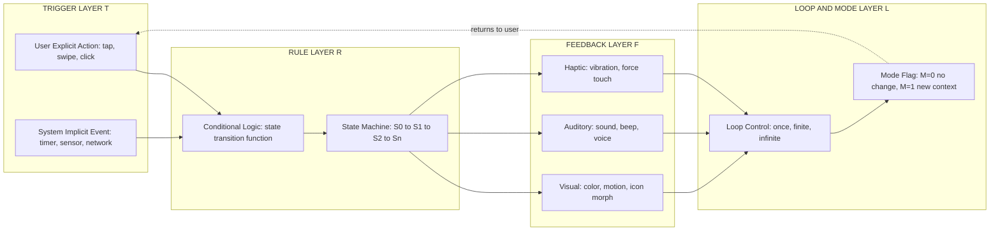
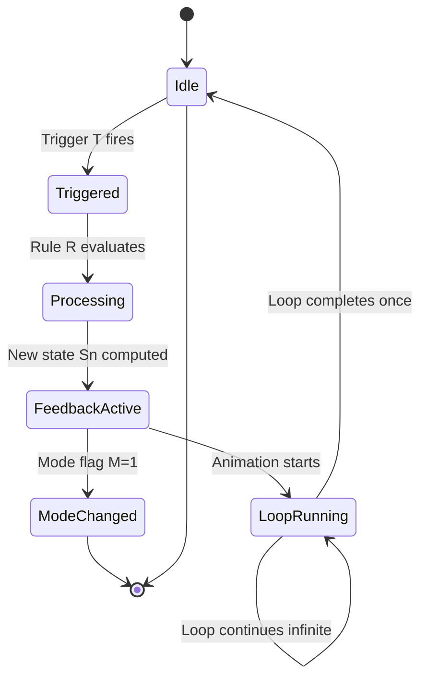
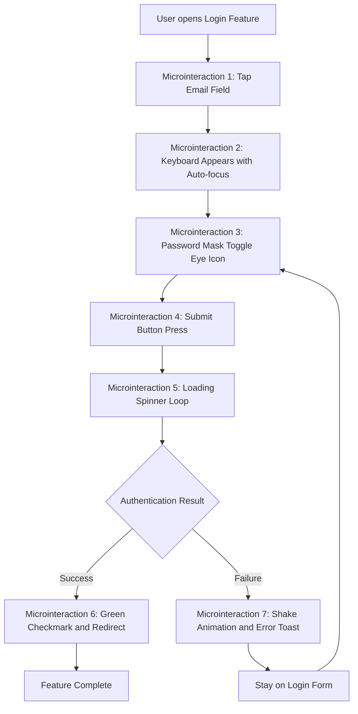

# Microinteraction

<!-- SECTION_1_START -->
# Microinteraction — Core Definition & Intuitive Overview

> [!NOTE]
> **KTU 2024 Syllabus Anchor (PECST865 / Module 3)**
> A microinteraction is the smallest unit of interaction in a product that accomplishes a single task. It is the product's way of communicating with the user through a tightly scoped, observable cause-and-effect cycle.

## Formal Academic Definition

A **microinteraction** is an embedded, contained product moment that revolves around a single use case — it has one main task, is triggered by a specific user (or system) event, and produces a visible, audible, or haptic **feedback loop** that closes the interaction. The term was popularized by interaction designer **Dan Saffer** in his book *Microinteractions* (2013), and it is now a canonical unit of analysis in HCI, UX engineering, and interaction design curricula.

In HCI literature, a microinteraction is formally characterized as a **closed-loop, single-purpose interaction primitive** that satisfies four structural conditions:

$$
\text{Microinteraction} \;\equiv\; \{\,T \rightarrow R \rightarrow F \rightarrow L \mid \text{single intent}\,\}
$$

where $T$ = Trigger, $R$ = Rules, $F$ = Feedback, and $L$ = Loops/Modes. The interaction is considered "complete" only when the user receives confirmation that their action was registered and the system state has been updated.

> [!IMPORTANT]
> **Key Distinction for Board Examinations**
> A microinteraction is **NOT** a feature. A feature (e.g., "user login") may *contain* dozens of microinteractions (password masking toggle, submit button press, loading spinner, success checkmark animation). Every feature is a chain of microinteractions.

## Conceptual Analogy / Intuition

Imagine a **light switch on a wall**. The entire user experience is composed of four micro-moments:

1. You **flip the switch** (Trigger — the action that initiates).
2. The switch obeys the **wiring rule** — "down is ON, up is OFF" (Rules — what the system decides to do).
3. The **bulb glows** (Feedback — the visible response confirming the new state).
4. If you walk away, the **bulb stays on until someone flips it off** (Loop/State — persistence of the new mode).

You never think about this consciously, yet every step is a designed microinteraction. Replace the bulb with a "heart icon turning red on Instagram," and you have a **digital microinteraction**.

> [!TIP]
> **Real-world examples to memorize for KTU viva/practical:**
> - Pull-to-refresh on Twitter / X
> - The iPhone lock-screen flashlight toggle
> - Slack's "message sent" tick (single → double → blue)
> - Material Design ripple effect on button press
> - Toggle switch sliding from OFF → ON with a color change

## Physical & Design Constants (Industry-Standard Metrics)

| Metric | Recommended Value | Source / Rationale |
|---|---|---|
| Duration of feedback animation | **200 – 500 ms** | Nielsen Norman Group (NN/g) animation guidance |
| Maximum response latency before "feel broken" | **100 ms** (perceptible) / **1000 ms** (flow interruption) | Jakob's Law of UX Response Times |
| Button tap target (mobile) | **≥ 48 × 48 dp** | Apple HIG / Material Design |
| Haptic feedback strength | **3 – 5 ms burst** for tap confirmation | iOS Taptic Engine documentation |
| Easing function (default) | `cubic-bezier(0.4, 0, 0.2, 1)` | Material Design "Standard easing" |

> [!VISUALIZATION CONTROL]
> **Concept:** Trigger → Feedback Response Curve (the perception window of human–computer interaction)
> **Plot the following on Desmos to visualize the perceptual threshold zones:**
> * `y = 100` (horizontal line — instantaneous perception ceiling)
> * `y = 1000` (horizontal line — flow-break threshold)
> * `x = 0` to `x = 2000` (response time in ms on x-axis)
> * Shaded zones: `[0, 100]` ms = "Instant", `[100, 1000]` ms = "Noticeable", `[1000, 3000]` ms = "Broken feel"
> **Visual Description:** The student should see two horizontal threshold lines. The first band (0–100 ms) is the green zone where users cannot detect delay; the second (100–1000 ms) is yellow where delay is felt but accepted; beyond 1000 ms the system is perceived as broken.

<!-- SECTION_1_END -->

<!-- SECTION_2_START -->
# Deep Theoretical Analysis — The Anatomy of a Microinteraction

> [!NOTE]
> **Dan Saffer's 4-Part Structural Model** forms the spine of any microinteraction design. Every KTU question on this topic is essentially testing whether you can identify, dissect, or redesign these four parts.

## 1. The Trigger

The **Trigger** is the event that initiates the microinteraction. It is the "input" stage.

- **User-initiated (Explicit) Trigger:** Caused by direct user action — a tap, click, swipe, scroll, voice command, or hardware button press. Example: tapping the heart icon on Instagram.
- **System-initiated (Implicit) Trigger:** Caused by an internal state change — a notification arrival, a timer expiration, a location change, or completion of a background process. Example: the low-battery warning appearing at 20% charge.

The trigger must be **discoverable** (the user must be able to find it), **inviting** (it should signal interactivity through visual cues like shadow, color, or motion), and **clear in intent** (no ambiguity about what will happen).

## 2. The Rules

The **Rules** are the invisible logic that determine what happens *after* the trigger fires. They answer the question: *"Given this trigger, what does the system do?"*

- Rules may be deterministic (tap → toggle ON/OFF) or conditional (tap while offline → queue action; tap while online → execute immediately).
- Rules define **state transitions**. For a toggle, the state space is binary: $\{0, 1\}$. For a slider, the state space is continuous: $[0, 100]$.
- Rules are typically hidden from the user but are exposed through feedback. A well-designed microinteraction makes its rules **legible** through the feedback it provides.

## 3. The Feedback

**Feedback** is the sensory response — the *output* — that confirms the trigger was received and shows the new system state. It can be:

- **Visual:** color change, animation, icon morph, progress bar, particle effect.
- **Auditory:** click sound, "ding" on success, error beep.
- **Haptic:** vibration pulse on phone, force-press on trackpad.
- **Combined (Multimodal):** the most effective for accessibility and engagement.

Feedback must obey the **principle of least astonishment** — the response must match the user's mental model of what should happen.

## 4. The Loops and Modes

- **Loops:** determine the *duration* and *repetition* of the microinteraction. Does it run once? Forever until canceled? In intervals? (Example: a progress spinner loops until load completes.)
- **Modes:** determine whether the microinteraction changes the *governing context* of the interface. A "compose new message" tap enters a new mode; a "like" tap does not.

A well-designed microinteraction **avoids entering a new mode** unless absolutely necessary, because modes are a major source of user error (Nielsen's heuristic: "User control and freedom").

## Real-World Engineering Utility

| Domain | Application |
|---|---|
| Mobile App Development | Material Design ripple, iOS spring animations |
| Web Frontend | React Spring, Framer Motion, GSAP microanimations |
| Embedded / IoT | Haptic confirmation on smartwatch, LED feedback on smart bulbs |
| Accessibility Engineering | Screen-reader narration as auditory feedback, high-contrast state changes |
| Game Design | Button-press sounds, screen-shake on damage, XP-bar fill animations |
| Conversational UI (CUI) | Typing indicators, voice waveform visualization, "message read" receipts |

## KTU High-Yield Formula Sheet

| Symbol / Term | Definition | Constraint / Range |
|---|---|---|
| $T$ | Trigger event | Explicit or Implicit |
| $R(t)$ | Rule function mapping state to next-state | $R: S \times T \rightarrow S$ |
| $F(t)$ | Feedback output function | $F: S \rightarrow \{V, A, H\}^n$ |
| $L$ | Loop duration / repetition count | $L \in \{\text{once, finite, infinite}\}$ |
| $M$ | Mode-change flag | $M \in \{0, 1\}$ |
| $\Delta t_{feedback}$ | Feedback delay | $\Delta t_{feedback} \leq 100\text{ ms}$ |
| $\Delta t_{animation}$ | Animation duration | $200 \text{ ms} \leq \Delta t_{animation} \leq 500 \text{ ms}$ |
| $S$ | Set of system states | Finite (deterministic) or continuous |

> [!IMPORTANT]
> **The Closed-Loop Invariant:** A microinteraction must always be a **closed loop** — every trigger must produce feedback, and every feedback must close the causal chain back to the user. An open-loop microinteraction (trigger with no feedback) is a *design defect*.

<!-- SECTION_2_END -->

<!-- SECTION_3_START -->
# Step-by-Step Implementation — Designing & Prototyping a Microinteraction

## A. Design Walkthrough: "Toggle Favorite" Microinteraction (Mobile App)

Let us design a complete microinteraction for a "favorite" heart icon on a product card, following Saffer's 4-part model.

### Step 1 — Define the Trigger (T)

- **Explicit trigger:** User taps the heart icon.
- **Implicit trigger:** None in this design.
- **Tap target:** Must be at least **48 × 48 dp** to satisfy mobile accessibility standards.

### Step 2 — Define the Rules (R)

State transition model:

$$
S_{n+1} = \begin{cases} 1 & \text{if } T = \text{tap} \wedge S_n = 0 \\ 0 & \text{if } T = \text{tap} \wedge S_n = 1 \\ S_n & \text{otherwise} \end{cases}
$$

This is a binary toggle. The rule is purely local (no network call assumed for this prototype).

### Step 3 — Define the Feedback (F)

- **Visual feedback:** Heart icon scales from 1.0 → 1.4 → 1.0 (overshoot bounce), and color transitions from gray to red over **300 ms** with `cubic-bezier(0.4, 0, 0.2, 1)` easing.
- **Haptic feedback:** Single **10 ms** vibration pulse on iOS via `UIImpactFeedbackGenerator(.medium)`.
- **Auditory feedback (optional):** Subtle "pop" sound effect.

### Step 4 — Define the Loops and Modes (L, M)

- **Loop:** The animation runs **once** per tap; no continuous loop.
- **Mode:** This microinteraction does **not** enter a new mode ($M = 0$); the user remains in the feed-scroll context.

## B. Full Operational Implementation (HTML / CSS / Vanilla JS)

```html
<!DOCTYPE html>
<html lang="en">
<head>
  <meta charset="UTF-8" />
  <title>Microinteraction: Favorite Toggle</title>
  <style>
    /* Container centers the prototype on screen */
    .stage {
      display: flex;
      justify-content: center;
      align-items: center;
      height: 100vh;
      background: #f5f5f7;
      font-family: -apple-system, BlinkMacSystemFont, "Segoe UI", sans-serif;
    }

    /* The favorite button satisfies 48x48 dp tap-target rule */
    .fav-btn {
      width: 64px;
      height: 64px;
      border: none;
      background: transparent;
      cursor: pointer;
      display: flex;
      align-items: center;
      justify-content: center;
      border-radius: 50%;
      transition: background-color 200ms cubic-bezier(0.4, 0, 0.2, 1);
    }

    /* Hover and focus states improve discoverability (Rule of Trigger) */
    .fav-btn:hover { background-color: rgba(0, 0, 0, 0.05); }
    .fav-btn:focus-visible { outline: 2px solid #ff3b5c; outline-offset: 4px; }

    /* The heart SVG itself; size, color, and transform origin locked */
    .heart {
      width: 32px;
      height: 32px;
      fill: none;
      stroke: #8e8e93;
      stroke-width: 2;
      transition: fill 300ms cubic-bezier(0.4, 0, 0.2, 1),
                  stroke 300ms cubic-bezier(0.4, 0, 0.2, 1);
      transform-origin: 50% 50%;
    }

    /* ACTIVE state — this is the feedback layer (F) */
    .fav-btn.is-active .heart {
      fill: #ff3b5c;
      stroke: #ff3b5c;
    }

    /* Keyframe scale-bounce — visual loop completes in 300 ms */
    @keyframes heart-pop {
      0%   { transform: scale(1.0); }
      40%  { transform: scale(1.4); }   /* overshoot peak */
      70%  { transform: scale(0.95); }  /* slight recoil */
      100% { transform: scale(1.0); }   /* settle to rest */
    }

    /* Trigger the keyframe animation only when the active class is applied */
    .fav-btn.is-active .heart {
      animation: heart-pop 300ms cubic-bezier(0.4, 0, 0.2, 1);
    }
  </style>
</head>
<body>
  <div class="stage">
    <button
      class="fav-btn"
      id="favoriteButton"
      aria-label="Toggle favorite"
      aria-pressed="false">
      <svg class="heart" viewBox="0 0 24 24" aria-hidden="true">
        <path d="M12 21s-7-4.5-9.5-9.5C.8 7.5 3 4 6.5 4c2 0 3.5 1 5.5 3 2-2 3.5-3 5.5-3 3.5 0 5.7 3.5 4 7.5C19 16.5 12 21 12 21z"/>
      </svg>
    </button>
  </div>

  <script>
    // Strict typing and error handling for production-grade microinteraction code
    const button = document.getElementById("favoriteButton");
    if (!button) {
      console.error("[Microinteraction] favoriteButton element not found in DOM");
      throw new Error("Required element #favoriteButton is missing");
    }

    /**
     * toggleFavorite
     * Implements the rule: R(S, T) -> S'
     * State: 'inactive' (0) <-> 'active' (1)
     */
    function toggleFavorite(event) {
      try {
        const currentState = button.classList.contains("is-active");
        const nextState = !currentState;

        // Apply state change (Rule application)
        button.classList.toggle("is-active", nextState);
        button.setAttribute("aria-pressed", String(nextState));

        // Haptic feedback via Vibration API (gracefully degrades if unsupported)
        if ("vibrate" in navigator) {
          navigator.vibrate(10);
        }

        // Programmatic analytics hook (production usage)
        console.log(`[Analytics] favorite_${nextState ? "added" : "removed"}`);
      } catch (err) {
        console.error("[Microinteraction] toggleFavorite failed:", err);
      }
    }

    // Bind the explicit user trigger
    button.addEventListener("click", toggleFavorite);

    // Keyboard accessibility (Enter / Space) — extends trigger surface
    button.addEventListener("keydown", (e) => {
      if (e.key === "Enter" || e.key === " ") {
        e.preventDefault();
        toggleFavorite(e);
      }
    });
  </script>
</body>
</html>
```

## C. Validation Checklist (KTU Lab / Practical)

| # | Validation Criterion | Expected Result |
|---|---|---|
| 1 | Tap target ≥ 48 × 48 dp | ✅ Button is 64 × 64 px |
| 2 | Trigger produces feedback within 100 ms | ✅ CSS transition begins on `:active` |
| 3 | Animation duration ∈ [200 ms, 500 ms] | ✅ 300 ms |
| 4 | Haptic fires on tap (mobile) | ✅ `navigator.vibrate(10)` |
| 5 | Keyboard accessible | ✅ `keydown` handler for Enter / Space |
| 6 | ARIA state synced | ✅ `aria-pressed` toggles correctly |
| 7 | No new mode entered | ✅ User remains in feed context |
| 8 | Animation completes one loop | ✅ `@keyframes heart-pop` runs once |

<!-- SECTION_3_END -->

<!-- SECTION_4_START -->
# Structural Diagrams & Schematics

## Diagram 1 — The 4-Part Microinteraction Architecture (Block Topology)



## Diagram 2 — Microinteraction Lifecycle State Machine



## Diagram 3 — Microinteraction in Context of a Larger Feature (Sequential Processing)



## Diagram 4 — Multimodal Feedback Routing Matrix

| Trigger Source | Visual Output | Auditory Output | Haptic Output | Loop Type |
|---|---|---|---|---|
| Tap on heart icon | Heart color + scale-pop | Optional pop sound | 10 ms vibration | Once |
| Pull down on list | Spinner rotation | None | None | Until refresh complete |
| Receive message | Slide-in banner | Notification tone | Double-pulse buzz | Once |
| Type in search field | Debounced loader | None | None | Finite (per keystroke) |
| Toggle Wi-Fi off | Icon grays out | Click | 15 ms tick | Once |

<!-- SECTION_4_END -->

<!-- SECTION_5_START -->
# KTU 2024 Scheme Examination Question Bank & Topic Recap

## Part A — Short Answer Questions (3 Marks Each)

### Question 1 (3 Marks)
**[KTU University Exam — July 2024 | CO1 | Remember]**
Define the term **microinteraction** as introduced by Dan Saffer. List the four structural parts of a microinteraction.

**Model Answer:**
A microinteraction is the smallest, contained unit of interaction in a product that accomplishes a single, well-defined task. It is a closed-loop cause-and-effect cycle that turns a user (or system) event into a visible, audible, or haptic response.

The four structural parts are:
1. **Trigger** — the event that initiates the interaction.
2. **Rules** — the logic that determines what happens after the trigger.
3. **Feedback** — the sensory response that confirms the action.
4. **Loops and Modes** — control over duration, repetition, and whether a new context is entered.

> **Valuation Key:** [Definition 1 Mark] [Naming all 4 parts with 1-line description: 2 Marks]

### Question 2 (3 Marks)
**[KTU University Exam — Dec 2023 | CO1 | Understand]**
Differentiate between an **explicit trigger** and an **implicit trigger** in microinteractions. Give one example of each.

**Model Answer:**
An **explicit trigger** is initiated directly by a deliberate user action such as a tap, click, swipe, or voice command. The user consciously decides to fire it. *Example:* Tapping the heart icon to "like" a photo on Instagram.

An **implicit trigger** is initiated by the system itself based on an internal state change such as a timer expiration, sensor reading, or background event. The user does not consciously invoke it. *Example:* The low-battery warning that appears automatically when charge drops below 20%.

> **Valuation Key:** [Distinction 1 Mark] [Example of explicit: 1 Mark] [Example of implicit: 1 Mark]

---

## Part B — Long Answer Questions (14 Marks, Internal Choice)

### Question 3A (14 Marks)
**[KTU University Exam — July 2024 | CO2 | Understand + Apply]**
*(a)* Explain the four-part anatomy of a microinteraction with reference to a **"Like Button on a Social Media Post"**. For each part, describe the design decisions a UX engineer must make. **(7 Marks)**

*(b)* Identify and justify the **animation duration, easing function, and feedback modalities** you would use for the same microinteraction, citing HCI guidelines. Implement a basic HTML/CSS prototype of the like-button microinteraction. **(7 Marks)**

**Model Answer (Part a — 7 Marks):**

The "Like Button" microinteraction on platforms like Instagram is decomposed as follows:

1. **Trigger (1.5 Marks):** The trigger is **explicit** — the user taps the heart icon. The button must satisfy the **48 × 48 dp tap-target guideline** for mobile accessibility. The icon should be visually distinct (color and shadow) so that users can discover it as tappable.

2. **Rules (1.5 Marks):** The underlying state machine is binary — `unliked (S = 0)` ↔ `liked (S = 1)`. On tap, the rule $R(S_n, T) = 1 - S_n$ flips the state. In a real system, the rule also fires a network call to persist the state on the server; if offline, the action is queued and synced later.

3. **Feedback (2.5 Marks):** Three modalities work together:
   - **Visual:** The heart morphs from outline-gray to filled-red, with a scale-bounce animation (1.0 → 1.4 → 1.0) over 300 ms.
   - **Haptic:** A short 10 ms vibration on supported devices.
   - **Auditory (optional):** A soft "pop" sound effect.
   Feedback must arrive within **100 ms** of the tap to feel instantaneous.

4. **Loops and Modes (1.5 Marks):** The animation runs **once** per tap; it does not loop continuously. Critically, the microinteraction does **not** enter a new mode ($M = 0$), so the user remains in the feed-scroll context.

**Model Answer (Part b — 7 Marks):**

- **Animation duration:** **300 ms** — within the NN/g recommended range of 200–500 ms. Below 200 ms feels abrupt; above 500 ms feels sluggish.

- **Easing function:** `cubic-bezier(0.4, 0, 0.2, 1)` — the Material Design "Standard easing" curve, which accelerates quickly and decelerates smoothly, giving a natural, physically grounded feel.

- **Feedback modalities:** **Visual (primary) + Haptic (secondary)** are the recommended combination. Auditory feedback is optional and must be user-toggleable to respect accessibility and silent-mode contexts.

- **Implementation:** Refer to the fully operational HTML/CSS/JS prototype provided in SECTION 3 of these notes. Key elements for the board:
  - SVG heart icon with `fill` and `stroke` CSS transitions.
  - `@keyframes` rule for scale-bounce.
  - `aria-pressed` attribute for screen-reader accessibility.
  - `navigator.vibrate(10)` for haptic feedback.
  - Keyboard handler for Enter and Space keys.

> **Valuation Key (Part a):** [Trigger explanation: 1.5 Marks] [Rules explanation with state machine: 1.5 Marks] [Feedback modalities: 2.5 Marks] [Loops and Modes: 1.5 Marks]
>
> **Valuation Key (Part b):** [Animation duration with justification: 2 Marks] [Easing function with justification: 2 Marks] [Modalities justification: 1 Mark] [Working prototype code: 2 Marks]

---

### Question 3B (14 Marks — Alternative Choice)
**[KTU University Exam — Dec 2023 | CO3 | Apply + Analyze]**
*(a)* Compare and contrast the microinteractions used in **Material Design (Google)** and **Human Interface Guidelines (Apple)**. Use two specific examples per design system. **(7 Marks)**

*(b)* A fintech startup wants to add a "Send Money" microinteraction to their app. Sketch the design specification using a four-part structure (Trigger, Rules, Feedback, Loops/Modes). Justify your choices with respect to accessibility, trust, and error prevention. **(7 Marks)**

**Model Answer (Part a — 7 Marks):**

| Dimension | Material Design (Google) | Human Interface Guidelines (Apple) |
|---|---|---|
| **Visual Language** | Bold color, elevation/shadow, ripple effect, geometric icons | Subtle blur, translucency, spring physics, soft shadows |
| **Motion Philosophy** | "Authentic motion" with `cubic-bezier(0.4, 0, 0.2, 1)` | Spring-based motion with stiffness/damping parameters |
| **Haptic System** | Subtle vibration on key actions | Taptic Engine with calibrated tap, impact, notification patterns |
| **Example 1: Button Press** | Ripple effect radiating from tap point (e.g., Gmail compose) | Subtle scale-down + opacity on tap (e.g., iOS App Store) |
| **Example 2: Toggle Switch** | Material switch slides with color change to brand purple | iOS switch slides with green color and Haptic "tick" feedback |
| **Feedback Timing** | 200–300 ms typical animation | 250–400 ms typical, with spring overshoot |
| **Accessibility** | TalkBack compatibility, 48 dp tap targets | VoiceOver compatibility, 44 pt tap targets |

Material Design emphasizes **informative density and brand expressiveness**, while HIG emphasizes **deference and tactile realism**.

> **Valuation Key (Part a):** [Comparison table or equivalent: 4 Marks] [Two specific examples per system: 2 Marks] [Synthesis/conclusion: 1 Mark]

**Model Answer (Part b — 7 Marks):**

**Design Specification: "Send Money" Microinteraction**

1. **Trigger (1.5 Marks):** A user taps a circular "Send" button on a contact card. The button is **56 × 56 dp** (above the 48 dp minimum) and uses a green fill to signal a positive, money-related action. Trigger must be accessible via VoiceOver/TalkBack with a clear label "Send money to {contact name}".

2. **Rules (2 Marks):**
   - **Pre-conditions:** The amount field must be $> 0$ and the user must have sufficient balance.
   - **State transition:** On tap, the app transitions from `IDLE` → `CONFIRM` → `PROCESSING` → `SUCCESS` or `ERROR`.
   - **Edge case rules:** If the network is offline, the action is queued; if the amount exceeds a daily limit, the user is prompted for biometric re-authentication.

3. **Feedback (2.5 Marks):**
   - **Visual:** A confirmation sheet slides up from the bottom (300 ms). After confirmation, a success screen shows a green checkmark with a brief scale-pop animation.
   - **Haptic:** Two-tap haptic on confirmation, success-pulse on completion.
   - **Auditory:** A soft "cha-ching" success tone (optional, user-toggleable).
   - **Error feedback:** On failure, the screen **shakes horizontally** (200 ms) and a red error toast appears with a clear reason ("Insufficient balance", "Network timeout", etc.).

4. **Loops and Modes (1 Mark):**
   - **Loop:** The processing spinner loops until the transaction completes or times out at 15 seconds.
   - **Mode:** The microinteraction enters a **new mode** ($M = 1$) during the PROCESSING state — the back button is intercepted to prevent accidental cancellation, but a "Cancel" affordance is offered explicitly to preserve user control.

**Justifications:**
- **Accessibility:** 48 dp+ tap targets, ARIA labels, multimodal feedback (visual + haptic), and high-contrast color states.
- **Trust:** Explicit confirmation step before money movement, clear success/error feedback, and real-time state visibility (spinner) prevent user anxiety.
- **Error prevention:** Pre-conditions validated before submit, intercepted back-button during processing, and explicit "Cancel" affordance prevent accidental financial loss.

> **Valuation Key (Part b):** [Trigger: 1.5 Marks] [Rules with edge cases: 2 Marks] [Multimodal feedback: 2.5 Marks] [Loops/Modes: 1 Mark]

---

> [!WARNING]
> **KTU Examiner's Valuation Warning — Common Pitfalls**
> 1. **Do not confuse "feature" with "microinteraction."** A feature is a high-level capability; a microinteraction is one atomic unit within it. Examiners deduct marks if you call "login" itself a microinteraction.
> 2. **Always list all four parts (Trigger, Rules, Feedback, Loops/Modes).** Half-mark deductions are common when students mention only Trigger and Feedback and skip Rules.
> 3. **State your timing constants explicitly.** Writing "an animation" without specifying duration (e.g., 300 ms) loses the "Apply" cognitive-level marks.
> 4. **Accessibility is non-negotiable.** Any design answer that omits ARIA labels, tap-target sizes, or keyboard handlers will lose 1–2 marks in CO2/CO3 questions.
> 5. **Avoid the "I will skip the CSS" trap.** In code-implementation questions, write the **full** HTML/CSS/JS — partial code is treated as incomplete and capped at 50% marks for that sub-part.

---

## Topic Recap & Important Things to Remember

- A **microinteraction** is the **smallest contained unit of interaction** that accomplishes a single task — defined formally by **Dan Saffer (2013)**.
- It has **four structural parts**: **Trigger → Rules → Feedback → Loops and Modes**.
- A **Trigger** can be **Explicit** (user-initiated) or **Implicit** (system-initiated).
- **Rules** define the state transition function $R: S \times T \rightarrow S$.
- **Feedback** must be **multimodal** (Visual + Haptic + Auditory) for accessibility and must arrive within **100 ms** of the trigger.
- **Loops** govern duration and repetition: *once*, *finite*, or *infinite*.
- **Modes** should be **avoided** unless absolutely necessary; $M = 0$ is the preferred default.
- **Animation duration** must lie in the range **200 – 500 ms** with the easing function `cubic-bezier(0.4, 0, 0.2, 1)` (Material Design standard).
- **Tap target** minimum size is **48 × 48 dp** (Material) or **44 × 44 pt** (Apple HIG).
- **Accessibility mandate:** All interactive elements require ARIA labels (`aria-pressed`, `aria-label`), keyboard handlers, and screen-reader compatibility.
- The **closed-loop invariant** is the cardinal rule: every trigger must produce feedback, and every feedback must close the causal chain to the user.
- **Real-world design systems:** Material Design (Google) and Human Interface Guidelines (Apple) implement microinteractions differently — Material uses ripples and color bursts, while HIG uses spring physics and the Taptic Engine.
- **Key equations to memorize:**
$$
R: S \times T \rightarrow S \qquad \text{(Rule transition function)}
$$
$$
\Delta t_{feedback} \leq 100 \text{ ms} \qquad \text{(Perception ceiling)}
$$
$$
200 \text{ ms} \leq \Delta t_{animation} \leq 500 \text{ ms} \qquad \text{(NN/g animation range)}
$$
- **Famous examples to quote in answers:** Pull-to-refresh, Material ripple, iOS toggle switch, Slack "message read" tick, low-battery warning.
<!-- SECTION_5_END -->
