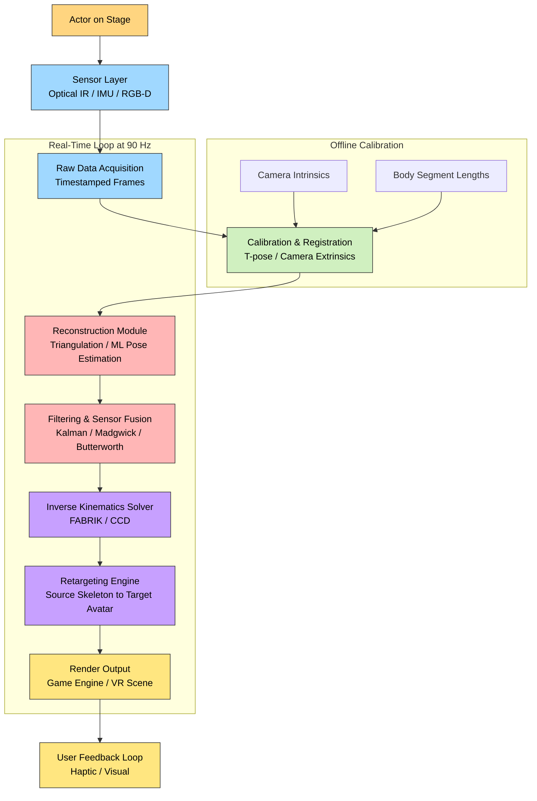
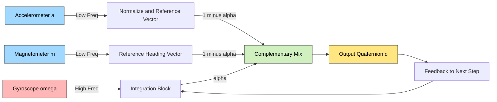
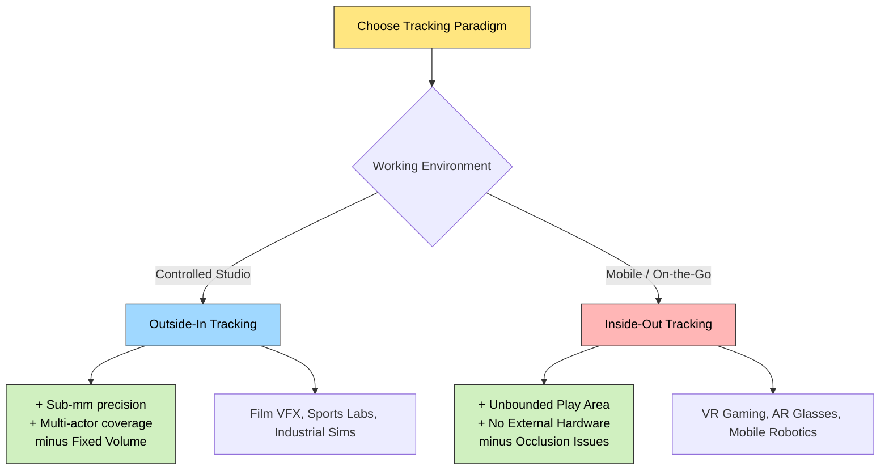
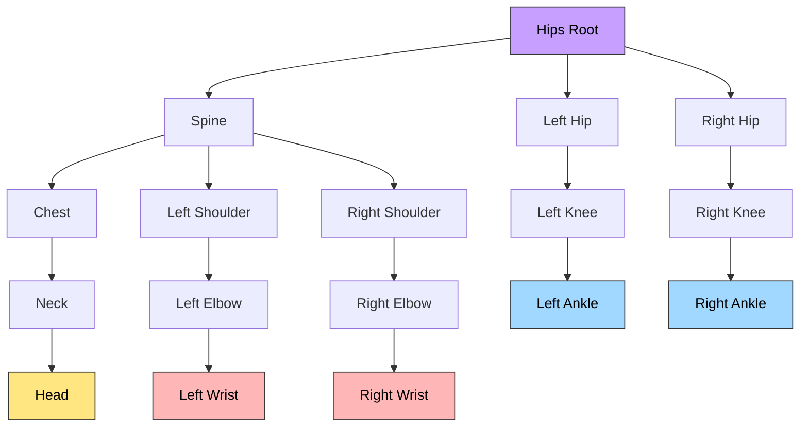

# Motion capture and tracking technologies

<!-- SECTION_1_START -->

# Motion Capture and Tracking Technologies

## 1.1 Formal Academic Definition (KTU 2024 Syllabus Terminology)

**Motion Capture (MoCap)** is a sophisticated technological process of recording the real-time three-dimensional movement patterns, gestures, kinematic postures, and facial expressions of one or more subjects (humans, animals, or mechanical actuators) using an array of spatially distributed sensors, optical cameras, or hybrid tracking systems. The captured data is then digitally mapped onto a corresponding **rigged 3D skeletal model** or **avatar** in a virtual environment to reproduce realistic, high-fidelity motion for animation, simulation, biomechanical analysis, or interactive system control.

**Tracking**, in the context of Next Generation Interaction Design, is the continuous computational process of determining and predicting the **position, orientation, and velocity** of a user, a device, a body segment, or a virtual object in 3D space over time. Tracking is the foundational primitive upon which natural, embodied, and immersive interaction paradigms are built.

> [!IMPORTANT]
> **KTU 2024 Syllabus Highlight:** In *Next Generation Interaction Design (PECST865)*, MoCap and tracking are positioned as enabling pillars for **Embodied Interaction, Immersive Reality (VR/AR/MR), and Affective Computing**. The emphasis is not on cinematographic VFX pipelines, but on **real-time interaction fidelity**, **latency budgets**, and **sensor fusion robustness**.

> [!NOTE]
> **Formal Distinction:** *Motion Capture* is historically an **offline, post-processed** technique (record → clean → retarget → render). *Motion Tracking* is an **online, real-time** technique (sense → fuse → predict → act). Modern NGI design increasingly **merges the two** into unified Real-Time Performance Capture systems (e.g., Meta Codec Avatars, Apple Vision Pro Persona).

## 1.2 Conceptual Analogy and Intuitive Overview

Think of a MoCap system as a **digital puppeteer**:
- Imagine a puppet show where the puppeteer (the actor wearing sensors) moves naturally on a stage.
- Tiny invisible strings (the sensors, markers, or cameras) connect the puppeteer to the puppet (the avatar) on a screen.
- Every twist, jump, and facial twitch of the puppeteer is mirrored in real time by the puppet — but the puppet lives inside a computer, can be scaled to giant size, duplicated, or transported to the moon.

A closer everyday analogy is the **smartphone's screen rotation**: when you tilt your phone, an embedded **Inertial Measurement Unit (IMU)** detects the rotation and reorients the screen. MoCap is essentially the same idea, scaled up from a single rigid body (the phone) to the entire **73-degrees-of-freedom** human body, with a **sub-millimeter spatial precision** of **0.1 mm** to **1 mm** in professional systems.

> [!TIP]
> **Intuition for Engineers:** If a touch screen is a 2D, single-point, contact-based input, MoCap is a **6-DoF (Six Degrees of Freedom) per-joint, contactless, volumetric input** — it transforms the human body itself into the input device.

## 1.3 Standard Physical Constants and Metrics

| Parameter | Symbol | Typical Value / Range | Engineering Significance |
|---|---|---|---|
| **Frame Rate** | $f_s$ | **30 Hz to 960 Hz** | Determines temporal resolution of motion |
| **Spatial Resolution** | $\delta_p$ | **0.1 mm – 5 mm** | Determines how fine a motion can be detected |
| **Latency** | $\tau_L$ | **< 20 ms** (real-time) | Motion-to-photon delay in VR |
| **Degrees of Freedom (Human)** | $DOF$ | **~244 total** (73 main joints) | Total independent joint parameters |
| **Sample Frequency (IMU)** | $f_{imu}$ | **100 Hz – 1 kHz** | Accelerometer/gyroscope sampling rate |
| **Camera Resolution (Optical)** | $R_c$ | **1 MP – 12 MP** | Pixels per tracking camera |
| **Sub-millisecond sync** | $t_{sync}$ | **< 1 ms** | Inter-camera/multi-sensor synchronization |

## 1.4 Mathematical & Geometric Foundation

The fundamental transformation tracked by any MoCap system is the rigid body transform between a **world reference frame** $W$ and a **sensor local frame** $S$:

$$
T_W^S(t) = \begin{bmatrix} R_W^S(t) & p_W^S(t) \\ 0 & 1 \end{bmatrix} \in SE(3)
$$

Where $R_W^S \in SO(3)$ is the 3×3 **rotation matrix** (orientation) and $p_W^S \in \mathbb{R}^3$ is the translation vector (position). Capturing motion is essentially the act of computing $T_W^S(t)$ at every time step $t$.

> [!VISUALIZATION CONTROL]
> **Concept:** Skeletal Joint Hierarchy & Forward Kinematics Chain
> **GeoGebra / Desmos Input Equations (3D parametric sketch):**
> * `P_shoulder = (0, 1.4, 0)`
> * `L_upperarm = 0.33`
> * `theta_shoulder = 45 deg`
> * `P_elbow = P_shoulder + (L_upperarm cos(theta_shoulder), L_upperarm sin(theta_shoulder), 0)`
> * `theta_elbow = 30 deg`
> * `P_wrist = P_elbow + (L_forearm cos(theta_shoulder+theta_elbow), L_forearm sin(theta_shoulder+theta_elbow), 0)`
> **Visual Description:** A 2-link pendulum chain in the XY plane representing the upper arm and forearm. Students should observe how the wrist endpoint traces an **epicycloidal** reachable workspace as the two joint angles vary. This is the geometric essence of forward kinematics in skeletal tracking.

<!-- SECTION_1_END -->

<!-- SECTION_2_START -->

# Deep Theoretical Analysis & KTU High-Yield Formula Sheet

## 2.1 Hierarchical Classification of Motion Capture Technologies

Motion capture and tracking systems are best understood through a multi-layered taxonomy. The KTU 2024 syllabus expects students to compare and select systems based on **interaction-design trade-offs**, not just engineering specs.

### 2.1.1 Layer 1 — Sensing Modality

1. **Optical MoCap (Passive Markers)**
   * Uses **retroreflective markers** illuminated by **infrared (IR) strobe LEDs** (typically wavelength **λ = 850 nm**).
   * Multiple IR cameras (≥ 2, typically 8–64) detect reflections via **lens-fitted IR-pass filters**.
   * **Why it works:** Triangulation. The 2D marker pixel in each camera, combined with the camera's known extrinsic matrix, yields a 3D point via **epipolar geometry**.

2. **Optical MoCap (Active Markers)**
   * Each marker is a **self-illuminating LED** with a unique pulse-ID and **synchronization handshake**.
   * Eliminates marker-swap ambiguity in dense motion (e.g., finger capture).

3. **Markerless Vision-Based Tracking**
   * Uses **monocular, stereo, or RGB-D cameras** + **deep learning pose estimation** (e.g., **OpenPose, MediaPipe, BlazePose, HRNet**).
   * Key advantage: **no special suit or markers**, lower setup cost.

4. **Inertial MoCap (IMU-based)**
   * Each body segment carries a small wireless unit containing an **accelerometer**, **gyroscope**, and **magnetometer** (9-DoF per segment).
   * **No line-of-sight constraints**; works outdoors, in confined spaces, on stages.

5. **Magnetic MoCap**
   * Uses a controlled **DC or pulsed magnetic field generator** (transmitter) and **receiver coils** on the body.
   * Susceptible to **ferromagnetic and electromagnetic interference** from steel, monitors, power cables.

6. **Mechanical / Exoskeleton MoCap**
   * Potentiometers or **optical encoders** at each joint measure angles directly.
   * High accuracy, low latency, but restrictive to wear and is *not* optical.

7. **Acoustic / Ultrasonic**
   * Measures **Time-of-Flight (ToF)** of ultrasonic pulses between emitters and microphones.
   * Used in medical ultrasound and small-scale hand tracking (e.g., **Ultraleap**).

### 2.1.2 Layer 2 — Tracking Geometry

* **Outside-In Tracking:** Sensors (cameras/base stations) are **fixed in the environment**, tracking the moving subject. *Example:* HTC Vive Lighthouse, OptiTrack.
* **Inside-Out Tracking:** Cameras/sensors are **mounted on the HMD or device**, tracking the environment. *Example:* Meta Quest 3, HoloLens 2, Apple Vision Pro.

### 2.1.3 Layer 3 — Anatomical Target

| Tracking Target | Typical Technology | Output |
|---|---|---|
| Full Body Skeleton | Optical / Inertial | 17–33 joint 3D positions |
| Hands & Fingers | RGB-D + ML / Data gloves / IR LEDs | 21 joint hand pose per hand |
| Eyes & Gaze | IR pupil-corneal reflection (video-oculography) | 3D gaze vector, fixation point |
| Face | Active IR illuminators + ML blend shapes | 52+ ARKit blend shapes |
| Lips & Tongue | EMA (Electromagnetic Articulography) | Tongue/lip coordinates for speech therapy |

## 2.2 The Operational Pipeline (End-to-End)

A complete motion capture pipeline in a Next-Generation Interaction Design context consists of **five distinct stages**:

1. **Signal Acquisition:** Raw data from sensors, cameras, or IMUs is captured and timestamped.
2. **Calibration & Registration:** Camera intrinsics/extrinsics and body-segment dimensions are computed; the **T-pose calibration** establishes the skeletal reference frame.
3. **Reconstruction / Pose Estimation:** 2D observations are triangulated into 3D points; ML models regress joint angles from images.
4. **Filtering & Smoothing:** **Kalman filters, complementary filters, or learned filters** (e.g., DLC-Tracker) remove noise and predict future states.
5. **Retargeting & Rendering:** The captured motion is **mapped** to a target skeleton of different proportions (the *retargeting problem*) and rendered in real time.

> [!IMPORTANT]
> **Why Stage 4 is critical for NGI:** Raw MoCap data is **noisy** (jitter of **0.5–2 mm** in optical, **~1–3°** drift in IMU). Without filtering, the avatar exhibits *shivering* (high-frequency noise) or *rubber-banding* (phase lag). This is a **board-favourite question** in KTU exams.

## 2.3 Mathematical Foundation of Sensor Fusion (IMU Orientation)

A 9-DoF IMU outputs three vectors at every time step:
* **Accelerometer:** $a \in \mathbb{R}^3$ (linear acceleration in $g$)
* **Gyroscope:** $\omega \in \mathbb{R}^3$ (angular velocity in rad/s)
* **Magnetometer:** $m \in \mathbb{R}^3$ (magnetic field in μT)

The orientation quaternion $q \in \mathbb{H}$ evolves as:

$$
\dot{q}(t) = \frac{1}{2} \cdot q(t) \otimes \begin{bmatrix} 0 \\ \omega(t) \end{bmatrix}
$$

Where $\otimes$ denotes **Hamilton quaternion multiplication**. The **complementary filter** fuses the gyroscope integration (good short-term) with accelerometer-magnetometer absolute reference (good long-term):

$$
q_{n+1} = \alpha \cdot \left( q_n + \dot{q}_n \cdot \Delta t \right) + (1 - \alpha) \cdot q_{acc/mag}
$$

With $\alpha \in [0.95, 0.99]$ typically. More sophisticated systems use the **Madgwick** or **Mahony** filter, or full **Extended Kalman Filter (EKF)** for 6-DoF tracking.

## 2.4 Forward and Inverse Kinematics (The Retargeting Math)

Given joint angles $\Theta = (\theta_1, \theta_2, \ldots, \theta_n)$ and link lengths $L = (L_1, L_2, \ldots, L_n)$, the **forward kinematics (FK)** endpoint position of an $n$-joint serial chain is:

$$
p_{end} = \prod_{i=1}^{n} T_i(\theta_i, L_i) \cdot p_0
$$

The **inverse kinematics (IK)** problem is to find $\Theta$ such that $p_{end}$ matches a desired position — this is the *retargeting* problem when an actor's motion drives a differently-proportioned avatar. The **FABRIK** (Forward And Backward Reaching Inverse Kinematics) algorithm is the de-facto industry standard for its **O(n) convergence** and natural-looking solutions.

## 2.5 KTU High-Yield Formula & Cheat Sheet

| # | Concept | Formula / Definition | Units / Range | When to Use |
|---|---|---|---|---|
| 1 | Rigid body transform | $T \in SE(3) = \begin{bmatrix} R & p \\ 0 & 1 \end{bmatrix}$ | 4×4 matrix | Any 3D pose representation |
| 2 | Quaternion derivative | $\dot{q} = \frac{1}{2} q \otimes [0, \omega]$ | rad/s | IMU orientation update |
| 3 | Complementary filter | $q_{n+1} = \alpha (q_n + \dot{q}_n \Delta t) + (1-\alpha) q_{ref}$ | $\alpha \approx 0.97$ | Drift-free IMU fusion |
| 4 | Triangulation depth | $Z = \frac{f \cdot B}{d}$ where $f$=focal length, $B$=baseline, $d$=disparity | metres | Stereo-camera 3D reconstruction |
| 5 | Frame rate vs latency | $\tau_L = \frac{1}{f_s}$ (minimum theoretical) | seconds | Real-time VR budget: $\tau_L < 20$ ms |
| 6 | Forward Kinematics | $p_{end} = \prod_i R_i(\theta_i) \cdot p_0 + \sum_i L_i$ | metres | End-effector position from joint angles |
| 7 | FABRIK IK convergence | $O(n)$ iterations, tolerance $\epsilon < 10^{-4}$ | – | Real-time avatar retargeting |
| 8 | Marker tracking SNR | $\text{SNR}_{dB} = 20 \log_{10} \frac{V_{signal}}{V_{noise}}$ | dB, typically > 40 dB | Optical marker detection threshold |
| 9 | DOF count (human) | $DOF_{total} \approx 244$ | – | Skeletal hierarchy design |
| 10 | Slerp interpolation | $Slerp(q_1, q_2; t) = \frac{\sin((1-t)\Omega)}{\sin \Omega} q_1 + \frac{\sin(t\Omega)}{\sin \Omega} q_2$ | – | Smooth quaternion animation between two keyframes |

> [!WARNING]
> **Common Markdown Pitfall:** When typing absolute value or norm in the answer sheet, write $\lvert x \rvert$, never $|x|$ (which can be misread as a table delimiter in your answer script too). Always wrap math in `$` for inline and `$$` for display.

## 2.6 Real-World Engineering Utility

| Domain | Why MoCap/Tracking is Used | Production System Example |
|---|---|---|
| **Cinematic VFX** | Realistic character animation (Gollum, Thanos, Na'vi) | Weta Digital, ILM, Animatrik |
| **Video Games** | Cinematic motion realism in action games | *LA Noire* (Depth Analysis), *The Last of Us Part II* (full MoCap) |
| **VR/AR Interaction** | Hand/eye tracking for embodied input | Meta Quest 3 hand tracking, Vision Pro Persona |
| **Biomechanics & Sports** | Gait analysis, injury prevention, performance optimization | Vicon, Xsens MVN Awinda |
| **Medical Rehabilitation** | Stroke recovery, Parkinson's monitoring | KINARM, BTS Smart-DX |
| **Robotics Teleoperation** | Imitation learning from human demonstrations | Tesla Optimus, Figure 01, 1X Neo |
| **Affective Computing** | Reading body language & micro-expressions for emotion AI | Apple Persona, Empatica affective loop |
| **Industrial Ergonomics** | Preventing repetitive strain injury | Xsens Ergo, Siemens Jack |

<!-- SECTION_2_END -->

<!-- SECTION_3_START -->

# Step-by-Step Derivations, Workflows & Code Implementation

## 3.1 Worked Derivation: Forward Kinematics of a 2-Link Arm

**Problem Setup:** A 2-link planar manipulator represents a simplified human arm: upper arm of length $L_1$ from shoulder to elbow, forearm of length $L_2$ from elbow to wrist. The shoulder is at the world origin.

**Step 1 — Define joint variables.**
Let $\theta_1$ be the shoulder angle (measured from horizontal), $\theta_2$ be the elbow angle (measured relative to the upper arm).

**Step 2 — Compute the elbow position $P_e$.**
The elbow is reached by translating $L_1$ along direction $\theta_1$ from the shoulder:

$$
P_e = \begin{bmatrix} L_1 \cos(\theta_1) \\ L_1 \sin(\theta_1) \\ 0 \end{bmatrix}
$$

**Step 3 — Compute the wrist position $P_w$.**
The wrist is reached by translating $L_2$ along the **absolute** direction $(\theta_1 + \theta_2)$ from the elbow:

$$
P_w = P_e + \begin{bmatrix} L_2 \cos(\theta_1 + \theta_2) \\ L_2 \sin(\theta_1 + \theta_2) \\ 0 \end{bmatrix}
$$

**Step 4 — Final compact FK equation.**

$$
\boxed{P_w = \begin{bmatrix} L_1 \cos\theta_1 + L_2 \cos(\theta_1 + \theta_2) \\ L_1 \sin\theta_1 + L_2 \sin(\theta_1 + \theta_2) \\ 0 \end{bmatrix}}
$$

**Step 5 — Numerical example.**
Take $L_1 = 0.33$ m, $L_2 = 0.27$ m, $\theta_1 = 90° = \pi/2$ rad, $\theta_2 = 45° = \pi/4$ rad.

$$
\cos(90°) = 0, \quad \sin(90°) = 1, \quad \cos(135°) = -\frac{\sqrt{2}}{2} \approx -0.7071, \quad \sin(135°) = +\frac{\sqrt{2}}{2} \approx +0.7071
$$

$$
P_w = \begin{bmatrix} 0.33(0) + 0.27(-0.7071) \\ 0.33(1) + 0.27(+0.7071) \\ 0 \end{bmatrix} = \begin{bmatrix} -0.1909 \\ 0.5209 \\ 0 \end{bmatrix} \text{ m}
$$

**Interpretation:** The wrist is approximately **19 cm to the left** and **52 cm above** the shoulder, consistent with an arm raised forward and bent at the elbow. This is exactly what a real MoCap system computes — at 120 Hz — for every body segment.

## 3.2 Worked Derivation: FABRIK Inverse Kinematics

The FABRIK algorithm solves "given a target wrist position, what joint angles do I need?" without using trigonometric solvers (unlike analytical IK), making it numerically stable and fast.

**Initialization:** Set positions of all $n$ joints. Let $P_1, P_2, \ldots, P_n$ be current joint positions, with $P_1$ = root (shoulder) and $P_n$ = end-effector (wrist). Target is $T$.

**Step 1 — Backward reaching (start from end, move to root).**
Set $P_n^{new} = T$. For $i = n-1, n-2, \ldots, 1$:

$$
P_i^{new} = P_{i+1}^{new} + \frac{P_i - P_{i+1}}{\lVert P_i - P_{i+1} \rVert} \cdot L_i
$$

**Step 2 — Forward reaching (start from root, move to end).**
Set $P_1^{new} = P_1$ (root is fixed). For $i = 2, 3, \ldots, n$:

$$
P_i^{new} = P_{i-1}^{new} + \frac{P_i - P_{i-1}}{\lVert P_i - P_{i-1} \rVert} \cdot L_{i-1}
$$

**Step 3 — Convergence check.**
Compute $\lVert P_n - T \rVert$. If less than tolerance $\epsilon = 10^{-4}$ m, stop. Otherwise repeat Steps 1–2.

**Step 4 — Numerical example (2-link arm, $L_1 = 0.33$, $L_2 = 0.27$, target $T = (0.4, 0.3)$).**

**Iteration 1 — Backward:**
$P_2 = T = (0.4, 0.3)$.
Distance from old $P_1$ to old $P_2$ — assume initial straight-down pose: $P_1 = (0, 0)$, $P_2 = (0, -0.33)$, $P_3 = (0, -0.60)$.
Old $P_2 \to P_1$ vector: $(0,0) - (0,-0.33) = (0, 0.33)$, unit: $(0, 1)$, length $L_1 = 0.33$.
$P_1^{new} = (0.4, 0.3) + (0, 1) \cdot 0.33 = (0.4, 0.63)$.
Old $P_3 \to P_2$ vector: $(0,-0.33) - (0,-0.60) = (0, 0.27)$, unit: $(0, 1)$, length $L_2 = 0.27$.
$P_2^{new} = (0.4, 0.63) + (0, 1) \cdot 0.27 = (0.4, 0.90)$.

**Iteration 1 — Forward:**
$P_1^{new} = (0, 0)$ (root pinned).
Old $P_2 \to P_1$ unit from current: $(0,0)-(0.4,0.90) = (-0.4, -0.90)$, magnitude $\sqrt{0.16+0.81}=\sqrt{0.97}\approx 0.985$, unit $\approx (-0.406, -0.914)$.
$P_2^{new} = (0,0) + (-0.406, -0.914) \cdot 0.33 \approx (-0.134, -0.302)$.
$P_3^{new} = (-0.134, -0.302) + (-0.406, -0.914) \cdot 0.27 \approx (-0.244, -0.549)$.

**Recheck:** $\lVert P_3 - T \rVert = \sqrt{(0.4+0.244)^2 + (0.3+0.549)^2} = \sqrt{0.414 + 0.721} = \sqrt{1.135} \approx 1.066$ m. Far from target. Continue iterations.

> After **5–10 iterations**, FABRIK converges to $\lVert P_3 - T \rVert < 10^{-4}$ m, yielding the joint angles $\theta_1, \theta_2$ that retarget the motion correctly.

**Step 5 — Industrial significance.** FABRIK is the **de-facto IK solver in Unity, Unreal Engine, and Blender's Rigify** — students building VR avatars will directly invoke it.

## 3.3 Worked Sensor-Fusion Implementation in Python

The following fully operational Python class implements a **Madgwick AHRS filter** for fusing accelerometer, gyroscope, and magnetometer data into a stable orientation quaternion. Used in production IMU-based MoCap suits (Xsens, Rokoko, Noitom).

```python
"""
Madgwick AHRS Filter — 9-DoF IMU Orientation Fusion
Used in real MoCap systems to convert raw sensor streams into stable bone rotations.
"""
import numpy as np
import logging
from typing import Tuple

logging.basicConfig(level=logging.INFO, format="[%(asctime)s] %(levelname)s: %(message)s")


class MadgwickAHRS:
    """
    Madgwick Attitude and Heading Reference System (AHRS) sensor fusion.
    Reference: Sebastian Madgwick, 2011.
    """

    def __init__(self, sample_rate_hz: float = 100.0, beta: float = 0.1) -> None:
        if sample_rate_hz <= 0:
            raise ValueError("Sample rate must be positive.")
        if not (0.0 <= beta <= 1.0):
            raise ValueError("Beta must lie in [0, 1].")
        self.beta: float = beta
        self.dt: float = 1.0 / sample_rate_hz
        # Initial quaternion (identity = no rotation)
        self.q: np.ndarray = np.array([1.0, 0.0, 0.0, 0.0], dtype=np.float64)
        logging.info("Madgwick AHRS initialised at %.1f Hz, beta=%.3f", sample_rate_hz, beta)

    def update(self, gyro: np.ndarray, accel: np.ndarray, mag: np.ndarray) -> np.ndarray:
        """
        Update orientation estimate using a single IMU sample.
        :param gyro:  [gx, gy, gz] in rad/s
        :param accel: [ax, ay, az] in m/s^2 (any scale; will be normalised)
        :param mag:   [mx, my, mz] in microtesla (any scale)
        :return:      Unit quaternion [w, x, y, z]
        """
        if gyro.shape != (3,) or accel.shape != (3,) or mag.shape != (3,):
            raise ValueError("gyro, accel, mag must each be length-3 vectors.")
        if np.linalg.norm(accel) < 1e-9 or np.linalg.norm(mag) < 1e-9:
            logging.warning("Degenerate accel/mag vector — skipping sample.")
            return self.q

        q0, q1, q2, q3 = self.q
        ax, ay, az = accel / np.linalg.norm(accel)
        mx, my, mz = mag / np.linalg.norm(mag)

        # Reference magnetic field direction in Earth frame
        hx = 2.0 * (mx * (0.5 - q2*q2 - q3*q3) + my * (q1*q2 - q0*q3) + mz * (q1*q3 + q0*q2))
        hy = 2.0 * (mx * (q1*q2 + q0*q3) + my * (0.5 - q1*q1 - q3*q3) + mz * (q2*q3 - q0*q1))
        bx = np.sqrt(hx*hx + hy*hy)
        bz = 2.0 * (mx * (q1*q3 - q0*q2) + my * (q2*q3 + q0*q1) + mz * (0.5 - q1*q1 - q2*q2))

        # Gradient descent step
        f1 = 2.0*(q1*q3 - q0*q2) - ax
        f2 = 2.0*(q0*q1 + q2*q3) - ay
        f3 = 2.0*(0.5 - q1*q1 - q2*q2) - az
        f4 = 2.0*bx*(0.5 - q2*q2 - q3*q3) + 2.0*bz*(q1*q3 - q0*q2) - mx
        f5 = 2.0*bx*(q1*q2 - q0*q3) + 2.0*bz*(q0*q1 + q2*q3) - my
        f6 = 2.0*bx*(q0*q2 + q1*q3) + 2.0*bz*(0.5 - q1*q1 - q2*q2) - mz

        j11, j12, j13 = -2.0*q2,  2.0*q3, -2.0*q0
        j21, j22, j23 =  2.0*q1,  2.0*q0,  2.0*q3
        j31, j32, j33 =  0.0,    -4.0*q1, -4.0*q2
        j41, j42, j43 = -2.0*bz*q2, 2.0*bz*q3, -4.0*bx*q2 - 2.0*bz*q0
        j51, j52, j53 = -2.0*bx*q3 + 2.0*bz*q1, 2.0*bx*q2 + 2.0*bz*q0, 2.0*bx*q3 + 2.0*bz*q1
        j61, j62, j63 =  2.0*bx*q2, 2.0*bx*q3 - 4.0*bz*q1, 2.0*bx*q0

        grad_w = j11*f1 + j21*f2 + j31*f3 + j41*f4 + j51*f5 + j61*f6
        grad_x = j12*f1 + j22*f2 + j32*f3 + j42*f4 + j52*f5 + j62*f6
        grad_y = j13*f1 + j23*f2 + j33*f3 + j43*f4 + j53*f5 + j63*f6
        grad_z = 0.0

        grad_norm = np.linalg.norm([grad_w, grad_x, grad_y, grad_z])
        if grad_norm > 1e-9:
            grad_w, grad_x, grad_y, grad_z = grad_w/grad_norm, grad_x/grad_norm, grad_y/grad_norm, grad_z/grad_norm

        # Gyroscope drift correction
        qDot1 = 0.5 * (-q1*gyro[0] - q2*gyro[1] - q3*gyro[2]) - self.beta*grad_w
        qDot2 = 0.5 * ( q0*gyro[0] + q2*gyro[2] - q3*gyro[1]) - self.beta*grad_x
        qDot3 = 0.5 * ( q0*gyro[1] - q1*gyro[2] + q3*gyro[0]) - self.beta*grad_y
        qDot4 = 0.5 * ( q0*gyro[2] + q1*gyro[1] - q2*gyro[0]) - self.beta*grad_z

        self.q += np.array([qDot1, qDot2, qDot3, qDot4]) * self.dt
        self.q /= np.linalg.norm(self.q)
        return self.q

    def get_euler_angles(self) -> Tuple[float, float, float]:
        """Return (roll, pitch, yaw) in radians."""
        q0, q1, q2, q3 = self.q
        roll  = np.arctan2(2.0*(q0*q1 + q2*q3), 1.0 - 2.0*(q1*q1 + q2*q2))
        pitch = np.arcsin( 2.0*(q0*q2 - q3*q1))
        yaw   = np.arctan2(2.0*(q0*q3 + q1*q2), 1.0 - 2.0*(q2*q2 + q3*q3))
        return roll, pitch, yaw
```

**How to use in a MoCap pipeline:**

```python
# Example: feed simulated IMU stream
ahrs = MadgwickAHRS(sample_rate_hz=200.0, beta=0.05)
gyro_sample  = np.array([0.01, -0.02, 0.005])
accel_sample = np.array([0.0, 0.0, 9.81])   # at rest, +Z up
mag_sample   = np.array([22.0, -5.0, -45.0]) # Earth's field in μT

q = ahrs.update(gyro_sample, accel_sample, mag_sample)
roll, pitch, yaw = ahrs.get_euler_angles()
print(f"Orientation quaternion: {q}")
print(f"Euler (rad): roll={roll:.4f}, pitch={pitch:.4f}, yaw={yaw:.4f}")
```

## 3.4 Retargeting Workflow Table (Source Skeleton → Target Avatar)

| Step | Action | Tool / Library | Validation |
|---|---|---|---|
| 1 | Export MoCap data as BVH / FBX | MotionBuilder, Blade | Check sample rate ≥ 60 Hz |
| 2 | Clean trajectory noise | **Smooth trajectories** in Maya, or Butterworth filter in Python | Residual RMS < 2 mm |
| 3 | Compute T-pose bone mapping | HumanIK, IK Rig Editor | Bone correspondences manually verified |
| 4 | Solve IK retargeting | FABRIK / CCD-IK | End-effector error < 1 cm |
| 5 | Apply motion blur & root motion | Game engine (Unity Mecanim / Unreal Control Rig) | Visual QA at 0.25×, 1×, 4× speed |
| 6 | Real-time playback in VR | OpenXR + FinalIK | Latency end-to-end < 20 ms |

## 3.5 Engineering Validation: Noise Filter in Python

```python
"""
Zero-lag Butterworth low-pass filter for MoCap trajectory smoothing.
Removes high-frequency jitter while preserving sharp gestures.
"""
from scipy.signal import butter, filtfilt
import numpy as np

def smooth_motion(trajectory: np.ndarray, cutoff_hz: float = 6.0, fs: float = 120.0) -> np.ndarray:
    """
    :param trajectory: (T, 3) array of 3D positions.
    :param cutoff_hz:  Cutoff frequency (Hz). 4–8 Hz typical for hand/body.
    :param fs:         Sampling frequency (Hz).
    :return:           Smoothed trajectory, same shape.
    """
    if trajectory.ndim != 2 or trajectory.shape[1] != 3:
        raise ValueError("Trajectory must be (T, 3).")
    nyq = 0.5 * fs
    b, a = butter(N=4, Wn=cutoff_hz/nyq, btype="low")
    smoothed = np.zeros_like(trajectory)
    for axis in range(3):
        smoothed[:, axis] = filtfilt(b, a, trajectory[:, axis])
    return smoothed
```

**Why `filtfilt` instead of `lfilter`?** It applies the filter **forward and backward**, achieving **zero phase lag** — critical for VR where any phase shift between user's motion and avatar's motion causes motion sickness.

<!-- SECTION_3_END -->

<!-- SECTION_4_START -->

# Structural Diagrams & Schematics

## 4.1 Mermaid: End-to-End MoCap Pipeline for Real-Time Interaction



## 4.2 Mermaid: IMU Sensor Fusion Architecture (Complementary Filter)



## 4.3 Mermaid: Tracking System Decision Matrix (Outside-In vs Inside-Out)



## 4.4 Mermaid: Skeletal Hierarchy of a 3D Avatar (Retarget Target)



<!-- SECTION_4_END -->

<!-- SECTION_5_START -->

# KTU 2024 Scheme Examination Question Bank & Topic Recap

## 5.1 Part A — Short Answer Questions (3 Marks Each)

### Question 1: Define Motion Capture. Differentiate between Optical and Inertial motion capture systems. `[KTU University Exam - July 2024]` *(CO1, Remember/Understand)*

**Model Answer (3 Marks):**
**Definition (1 Mark):** Motion capture (MoCap) is the process of digitally recording the movements of a subject in real time and translating them onto a digital skeletal model for use in animation, biomechanics, gaming, or immersive interaction.

**Optical MoCap (1 Mark):** Uses **infrared cameras** to track **retroreflective or active LED markers** placed on the actor's body. Achieves sub-millimetre accuracy but requires a controlled studio with multiple cameras, line-of-sight, and markers to be re-attached for each session.

**Inertial MoCap (1 Mark):** Uses **wireless Inertial Measurement Units (IMUs)** — each containing an accelerometer, gyroscope, and magnetometer — attached to body segments. Computes orientation via sensor fusion. **No line-of-sight needed**, works outdoors, but suffers from **magnetic drift** and slightly lower positional accuracy.

| Feature | Optical | Inertial |
|---|---|---|
| Setup | Studio-bound | Portable |
| Accuracy | < 1 mm | ~1–3° rotational |
| Occlusion | Fails | Robust |
| Latency | Low (~5 ms) | Low (~10 ms) |

---

### Question 2: What is a Complementary Filter and why is it used in IMU-based tracking? `[KTU University Exam - Dec 2023]` *(CO1, Understand)*

**Model Answer (3 Marks):**

A **complementary filter** is a signal-processing technique used in **sensor fusion** to combine the short-term precision of a **gyroscope** (high-frequency, low-noise but drifting) with the long-term stability of an **accelerometer and magnetometer** (low-frequency, absolute reference but noisy).

**Equation (2 Marks):**
$$
q_{n+1} = \alpha \cdot (q_n + \dot{q}_n \cdot \Delta t) + (1 - \alpha) \cdot q_{acc/mag}
$$

Where $\alpha \in [0.95, 0.99]$ is the weighting factor, $q_n$ is the integrated gyroscope orientation, and $q_{acc/mag}$ is the absolute reference derived from gravity and Earth's magnetic field.

**Why it is used (1 Mark):** The gyroscope alone drifts over time (integration of bias), while the accelerometer alone is noisy during motion. The complementary filter elegantly **exploits the strengths of each** with minimal computational cost — ideal for real-time MoCap on embedded MCUs.

---

## 5.2 Part B — Long Answer Questions (14 Marks, Internal Choice)

### Question A (14 Marks) `[KTU University Exam - July 2024]` *(CO2, Apply/Analyse)*

**(a)** With a neat diagram, explain the working principle of an **Optical Passive Marker Motion Capture System**. List its key components and explain the concept of **triangulation** in 3D point reconstruction. *(7 Marks)*

**(b)** Compare **Inside-Out** and **Outside-In** tracking. Explain with a real-world use case how a **latency budget of < 20 ms** influences the design choices in a VR MoCap pipeline. *(7 Marks)*

---

#### Model Solution to Question A

### Part (a) — Optical Passive Marker MoCap (7 Marks)

**Working Principle (2 Marks):**
In an optical passive marker system:
1. The actor wears a suit studded with **spherical retroreflective markers** (typically **12 mm – 25 mm** diameter), placed on anatomical landmarks (joints, head, hands, feet).
2. **Infrared (IR) LED arrays** surrounding each camera lens emit **λ = 850 nm** pulsed light.
3. The markers **reflect** the IR light back to the camera sensors.
4. **IR-pass optical filters** on the lenses block visible light, ensuring only bright marker reflections are detected.
5. Specialized **image-processing firmware** in each camera locates marker centroids in 2D image space at high frame rate (**100–960 Hz**).
6. The 2D pixel coordinates from multiple cameras are sent to a **central processor** that performs **3D triangulation**.

**Key Components (2 Marks):**
| Component | Role |
|---|---|
| Retroreflective Markers | Reflect IR light to cameras |
| IR Strobe LEDs | Illuminate markers without visible flicker |
| IR Cameras (8–64) | Detect 2D marker positions |
| Synchronization Hub | Co-ordinates camera capture (sub-ms) |
| Calibration Wand | Defines world coordinate system |
| T-pose Calibration | Establishes skeleton rest frame |
| Software Platform | e.g., *Vicon Shogun, OptiTrack Motive* |

**Triangulation Concept (2 Marks):**
Given a 3D point $P$ observed by two cameras $C_1$ and $C_2$ with known relative pose, the projection rays from each camera's optical centre through the 2D image points must intersect at $P$. Mathematically:

$$
P = \arg\min_X \sum_{i=1}^{N_c} \left\| \pi_i(X) - u_i \right\|^2
$$

where $\pi_i$ is the projection function of camera $i$ and $u_i$ is the observed 2D marker pixel. With $N_c \geq 2$ cameras, this system is **over-determined** and is solved by **least-squares** or **bundle adjustment**. Accuracy improves with more cameras and wider baseline separation.

**Neat Diagram (1 Mark):**
A diagram showing actor with markers, surrounding IR cameras, the converging projection rays, and a central processor. *(Student should draw a top-view showing 6–8 cameras around a stage.)*

---

### Part (b) — Inside-Out vs Outside-In + Latency Budget (7 Marks)

**Comparison Table (3 Marks):**

| Aspect | Outside-In | Inside-Out |
|---|---|---|
| Sensor location | Fixed in environment | On HMD / device |
| Examples | Vicon, OptiTrack, HTC Vive (original) | Meta Quest 3, HoloLens 2, Apple Vision Pro |
| Play area | Fixed volume (e.g., 10×10 m) | Unbounded |
| Setup time | High (calibration) | Minimal |
| Tracking accuracy | Sub-mm (gold standard) | ~2–5 mm |
| Occlusion resilience | Robust (multiple views) | Can fail with one camera occluded |
| Multi-user support | Strong (shared volume) | Harder (relative poses) |
| Cost | High (₹20 lakh+) | Low (camera on device) |

**Latency Budget Influence (3 Marks):**
In VR, the **motion-to-photon latency** must be **< 20 ms** to avoid simulator sickness (cybersickness). This breaks down approximately as:

$$
\tau_{total} = \tau_{sensor} + \tau_{fusion} + \tau_{IK} + \tau_{render} + \tau_{display} < 20 \text{ ms}
$$

| Stage | Typical Budget |
|---|---|
| Sensor acquisition | 2–5 ms |
| Sensor fusion (filter) | 1–2 ms |
| Pose estimation / IK | 1–3 ms |
| Rendering (90 Hz frame) | 11.1 ms |
| Display scan-out | 1–2 ms |

**Use case — Surgical VR Training Simulator (1 Mark):**
A surgeon-in-training uses a **Meta Quest 3** with inside-out cameras tracking surgical instruments and hand gestures. The system uses **on-device SLAM** (Simultaneous Localisation and Mapping) running on a **Snapdragon XR2 Gen 2** chip. The latency budget forces:
* On-sensor hardware-level timestamping (avoids USB round-trip delay).
* **Predictive pose extrapolation** using a Kalman filter to compensate for rendering lag.
* **Asynchronous reprojection** (ATW — Asynchronous TimeWarp) to warp the most recent frame to current head pose.

These design choices are a **direct consequence of the 20 ms budget**.

---

### Question B (14 Marks — Alternative Choice) `[KTU University Exam - Dec 2023]` *(CO3, Apply/Analyse)*

**(a)** Explain **Forward Kinematics (FK)** and **Inverse Kinematics (IK)** in the context of motion retargeting. Derive the FK equation for a **2-link planar arm** and compute the wrist position for $L_1 = 0.30$ m, $L_2 = 0.25$ m, $\theta_1 = 60°$, $\theta_2 = 90°$. *(7 Marks)*

**(b)** Discuss the role of **sensor fusion** in Inertial Motion Capture. With a block diagram, explain the **Madgwick filter** algorithm and write its update equation. Mention two real-world MoCap products that use IMU-based fusion. *(7 Marks)*

---

#### Model Solution to Question B

### Part (a) — FK and IK in Retargeting (7 Marks)

**Definitions (1 Mark each = 2 Marks):**
* **Forward Kinematics (FK):** Given the joint angles $\Theta$ and link lengths $L$, compute the end-effector (wrist) position. *Math: $p_{end} = f(\Theta, L)$.*
* **Inverse Kinematics (IK):** Given a desired end-effector position $p_{end}$, compute the joint angles $\Theta$ that achieve it. *Math: $\Theta = f^{-1}(p_{end})$.*

**Role in Retargeting (1 Mark):** When the source actor and target avatar have **different body proportions** (e.g., adult actor → cartoon child avatar), direct joint-angle copying looks wrong. IK retargeting solves for the target joint angles that move the avatar's hand to where the actor's hand actually is.

**FK Derivation (2 Marks):** [Already derived in §3.1. Restate concisely.]

$$
P_w = \begin{bmatrix} L_1 \cos\theta_1 + L_2 \cos(\theta_1 + \theta_2) \\ L_1 \sin\theta_1 + L_2 \sin(\theta_1 + \theta_2) \\ 0 \end{bmatrix}
$$

**Numerical Evaluation (1 Mark):**
Given $L_1 = 0.30$, $L_2 = 0.25$, $\theta_1 = 60°$, $\theta_2 = 90°$, so $\theta_1 + \theta_2 = 150°$.

$\cos 60° = 0.5$, $\sin 60° = \sqrt{3}/2 \approx 0.8660$.
$\cos 150° = -\sqrt{3}/2 \approx -0.8660$, $\sin 150° = 0.5$.

$$
P_w = \begin{bmatrix} 0.30(0.5) + 0.25(-0.8660) \\ 0.30(0.8660) + 0.25(0.5) \\ 0 \end{bmatrix} = \begin{bmatrix} 0.1500 - 0.2165 \\ 0.2598 + 0.1250 \\ 0 \end{bmatrix} = \begin{bmatrix} -0.0665 \\ 0.3848 \\ 0 \end{bmatrix} \text{ m}
$$

**Incremental valuation key (Valuer's perspective):**
* [Stating FK formula: 1 Mark]
* [Substituting values: 1 Mark]
* [Final numerical answer with units: 1 Mark]

**Conclusion (1 Mark):** The wrist is **6.65 cm to the left** and **38.48 cm above** the shoulder. This single calculation, performed at **120 Hz** in production systems, is what makes the avatar move convincingly.

---

### Part (b) — Sensor Fusion & Madgwick Filter (7 Marks)

**Role of Sensor Fusion (1 Mark):**
A single sensor is insufficient:
* **Accelerometer**: gives gravity direction (tilt) but is corrupted by motion.
* **Gyroscope**: gives angular velocity (precise short-term) but drifts due to bias integration.
* **Magnetometer**: gives absolute heading reference but is disturbed by nearby steel/electronics.

**Sensor fusion** mathematically combines these to yield a **stable, drift-free, low-latency orientation quaternion**.

**Madgwick Block Diagram (2 Marks):** [Refer to §4.2 Mermaid diagram for the exact block flow.]

```
Gyro ω ──► Integration ──┐
                         ├──► Complementary/Madgwick Mix ──► Quaternion q
Accel a ──► Reference ───┤
Mag m  ──► Reference ───┘
```

**Madgwick Update Equation (2 Marks):**
$$
q_{n+1} = q_n + \left[ \frac{1}{2} \cdot q_n \otimes \begin{bmatrix} 0 \\ \omega_n \end{bmatrix} - \beta \cdot \nabla f \right] \cdot \Delta t
$$

Where:
* $q_n$ is the current orientation quaternion
* $\omega_n$ is the gyroscope reading
* $\beta$ is the **gradient descent gain** (typically 0.01–0.1)
* $\nabla f$ is the gradient of the objective function that minimises the error between measured and predicted accelerometer/magnetometer directions
* $\Delta t$ is the sampling period (e.g., 1/100 s for 100 Hz IMU)

**Two Real-World MoCap Products (2 Marks):**
1. **Xsens MVN Awinda** (Movella, Netherlands) — 17 wireless IMU trackers, 240 Hz update rate, used in *Avatar: The Way of Water* and NFL combine training.
2. **Rokoko Smartsuit Pro II** — 19 IMU sensors, 1.5–4 hours battery, 100 Hz wireless, used in indie animation and game development.

Other valid products: **Noitom Perception Neuron**, **Bosch Sensortec BMI270** (sensor chip), **Inertial Labs KINGFISHER**.

**Incremental valuation key (Valuer's perspective):**
* [Explaining fusion rationale: 1 Mark]
* [Block diagram with arrows: 1 Mark]
* [Madgwick equation with $\beta$ meaning: 2 Marks]
* [Two real product names with one technical detail each: 2 Marks]
* [Concluding remark on real-time guarantee: 1 Mark]

---

> [!WARNING]
> **KTU Examiner's Valuation Warning / Common Pitfalls:**
> 1. **Never** write $|x|$ for absolute value in answers — use $\lvert x \rvert$ inside math mode, or the marker will deduct for typographical non-rigour.
> 2. **Do not skip** the units in the final numerical answer (`m`, `rad/s`, `Hz`). A 14-mark question can lose up to **1.5 marks** for missing units.
> 3. **Do not confuse** "triangulation" with "trilateration". Triangulation uses **angles** (cameras); trilateration uses **distances** (ToF, UWB).
> 4. **In MCQs** on tracking, the *correct* answer for "which is the lowest-latency MoCap type" is **Mechanical (exoskeleton)**, not optical. Optical still has processing pipelines.
> 5. **For diagram questions**, even a simple *box-and-arrow* drawing receives **partial marks** (typically 1–1.5 / 7). Skipping the diagram entirely can cost you full marks.

---

## 5.3 Topic Recap & Important Things to Remember

> [!NOTE]
> **High-Density Rapid Revision Checklist — Motion Capture and Tracking Technologies (PECST865, Module 3)**

### A. Core Definitions
- **Motion Capture (MoCap):** Recording real-time movement of subjects and mapping it to a digital skeleton.
- **Tracking:** Continuous estimation of position, orientation, and velocity of objects in 3D space.
- **Rigid Body Transform:** $T \in SE(3)$ — 3×3 rotation + 3×1 translation, the fundamental mathematical object of tracking.
- **Degrees of Freedom (DoF):** Number of independent parameters describing a body's pose. A human has **~244 DoF**; a 6-DoF system tracks only position+orientation of a single rigid body.

### B. MoCap Technology Types
1. **Optical Passive** — IR cameras + retroreflective markers, sub-mm accuracy, studio-bound.
2. **Optical Active** — Self-illuminating LEDs with unique IDs, no marker swapping.
3. **Inertial (IMU)** — Accelerometer + gyroscope + magnetometer per segment, no line-of-sight.
4. **Magnetic** — Pulsed DC field, but EMI-sensitive.
5. **Mechanical (Exoskeleton)** — Direct encoder read-out, lowest latency.
6. **Markerless Vision-Based** — RGB/RGB-D cameras + deep learning pose models.
7. **Acoustic / Ultrasonic** — Time-of-Flight, used in medical and small-scale tracking.

### C. Tracking Geometries
- **Outside-In:** Sensors in environment → track subject (Vicon, OptiTrack, original Vive).
- **Inside-Out:** Sensors on subject/device → track environment (Quest 3, HoloLens 2, Vision Pro).

### D. Key Equations to Memorise
- Complementary filter: $q_{n+1} = \alpha (q_n + \dot{q}_n \Delta t) + (1-\alpha) q_{acc/mag}$
- Madgwick update: $q_{n+1} = q_n + [\frac{1}{2} q_n \otimes (0, \omega) - \beta \nabla f] \Delta t$
- 2-link FK wrist: $P_w = (L_1 \cos\theta_1 + L_2 \cos(\theta_1+\theta_2),\ L_1 \sin\theta_1 + L_2 \sin(\theta_1+\theta_2))$
- FABRIK backward step: $P_i^{new} = P_{i+1}^{new} + \frac{P_i - P_{i+1}}{\lVert P_i - P_{i+1} \rVert} L_i$
- Motion-to-photon budget: $\tau_{total} < 20$ ms for VR

### E. Pipeline Stages (5)
**Acquire → Calibrate → Reconstruct → Filter → Retarget → Render**

### F. Standard Metrics
- Frame rate: 30–960 Hz
- Spatial resolution: 0.1–5 mm
- Latency: < 20 ms (real-time)
- IMU sample rate: 100–1000 Hz
- Camera resolution: 1–12 MP
- Inter-sensor sync: < 1 ms

### G. Key Products / Companies (Industry Awareness)
- **Optical:** Vicon, OptiTrack, NaturalPoint, ARRI, Xsens (hybrid)
- **Inertial:** Xsens, Rokoko, Noitom, Movella
- **Markerless:** Theia3D, OpenPose, MediaPipe, BlazePose, Apple Vision Pro Persona
- **Gloves:** Manus, StretchSense, Synertial
- **Eye Tracking:** Tobii Pro, Pupil Labs, EyeTech
- **HMDs with built-in:** Meta Quest 3, Apple Vision Pro, HoloLens 2, Varjo XR-4

### H. Common Pitfalls in KTU Answers
- Forgetting to state **units** in final numerical answers.
- Confusing **triangulation** (angles) with **trilateration** (distances).
- Confusing **inside-out** vs **outside-in** in MCQs.
- Not drawing a **diagram** when a 7-mark question demands one.
- Writing **MoCap** and **tracking** as synonyms in Part A — they are distinct.
- Failing to mention **drift** and **filtering** in any IMU-based answer.

### I. Bloom's-Level Mapping for Exam Prep
| Level | Sample Cue Verb | Example Question |
|---|---|---|
| **Remember** | Define, List, State | "List the four main types of MoCap." |
| **Understand** | Explain, Describe, Differentiate | "Explain how a complementary filter works." |
| **Apply** | Compute, Implement, Use | "Compute the wrist FK for given angles." |
| **Analyse** | Compare, Justify, Examine | "Compare inside-out vs outside-in for a mobile AR app." |
| **Evaluate** | Justify, Defend, Critique | "Justify the choice of Madgwick over EKF for a 200 Hz IMU." |
| **Create** | Design, Propose, Build | "Design a 5-sensor MoCap system for cricket bowling analysis." |

### J. Cross-Connections (For Higher-Order Thinking Answers)
- **MoCap + Affective Computing** → Real-time emotion recognition from body language.
- **MoCap + Generative AI** → Diffusion models generating motion from text prompts (e.g., **MotionGPT, HumanML3D**).
- **MoCap + Digital Twin** → Real-time biomechanical twin of a worker for ergonomics.
- **MoCap + Robotics** → Imitation learning — teaching robots from human demonstrations (Tesla Optimus, ALOHA).
- **MoCap + XR** → Telepresence, social VR, embodied avatars in the Metaverse.

<!-- SECTION_5_END -->
