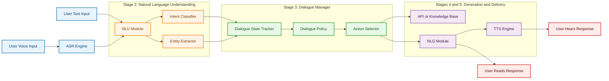
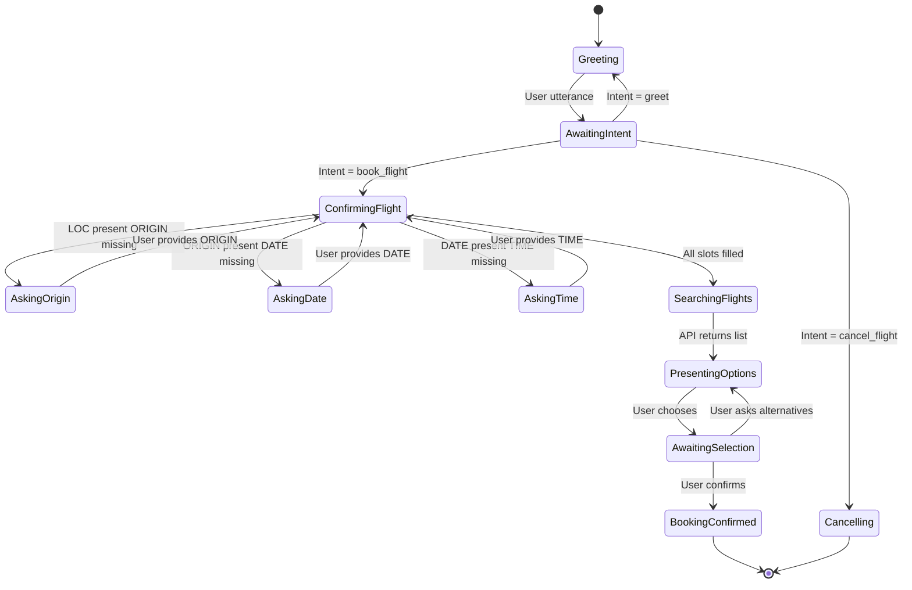
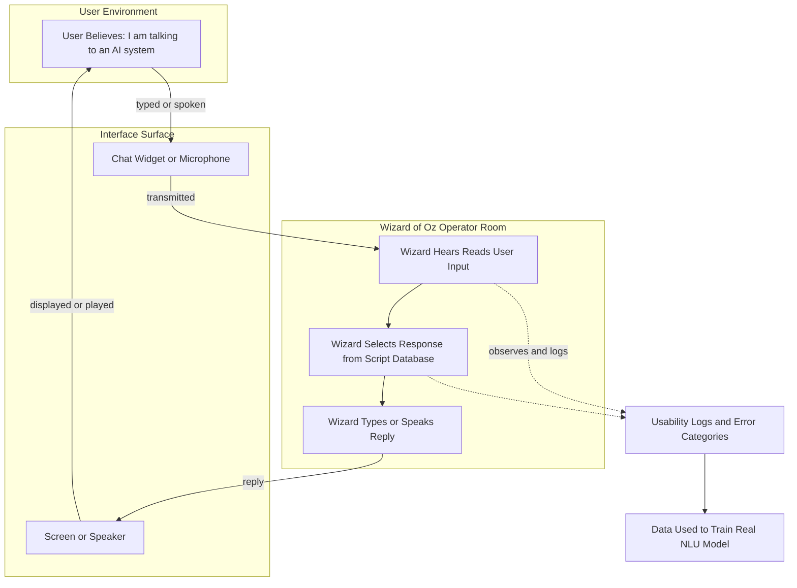

# Natural Language Interaction and conversational interfaces

<!-- SECTION_1_START -->
# Module 3: Advanced Interaction Techniques
## Topic: Natural Language Interaction and Conversational Interfaces

### 1.1 Formal Academic Definition

**Natural Language Interaction (NLI)** is a sub-discipline of Human-Computer Interaction (HCI) that enables users to communicate with computational systems using the everyday spoken or written language of humans (e.g., English, Malayalam, Hindi) rather than through formal syntax, programming constructs, or graphical manipulation.

**Conversational Interfaces (CUI)** are software artefacts that operationalize NLI by maintaining a *bidirectional*, *context-aware*, and *turn-based* dialogue with the user. According to the **ISO 9241-110** dialogue principles and **Pearl's "Designing Voice User Interfaces" (2016)**, a CUI is defined as:

> A computer-mediated interface in which the primary modality of input and output is human language, structured as discrete conversational turns governed by a shared dialogue state.

The two principal sub-classes recognized in the **KTU 2024 PECST865 syllabus** are:

1. **Text-based Conversational Agents (Chatbots)** — interaction occurs via typed text (e.g., customer-support chat widgets).
2. **Voice User Interfaces (VUI)** — interaction occurs via spoken language, requiring Automatic Speech Recognition (ASR) and Text-to-Speech (TTS) subsystems (e.g., Alexa, Google Assistant, Siri).

> [!IMPORTANT]
> **KTU Syllabus Highlight (Module 3):** A conversational interface is *not* merely a search box. The system must demonstrate **context retention**, **intent disambiguation**, and **dialogue repair** capabilities to qualify as a true CUI.

### 1.2 Conceptual Analogy / Intuitive Overview

Imagine you walk into a small tea stall (the *chai kada* analogy) in Kerala. You say, "**etta, oru chukku kappi**" (bro, one ginger coffee). The shopkeeper does not just press a button labelled "Coffee". He:
- Understands the **language and dialect**.
- Knows you come every evening, so he **retains context**.
- Asks a clarifying question if a payment method is unclear: "*Cash or GPay?*"
- Repairs the conversation if you mis-speak: "*Entha parayunne?*"

A **Conversational Interface** is the digital shopkeeper. It must:
- **Parse** what the user said (speech $\to$ text $\to$ meaning).
- **Track** the conversation's history (dialogue state).
- **Respond** in coherent natural language.
- **Repair** broken turns gracefully.

In contrast, a traditional GUI is more like a vending machine with labelled buttons — every input must be pre-mapped to a specific control, leaving no room for linguistic flexibility.

### 1.3 Key Terminology (Constant Terms to Memorize)

| Term | Meaning |
|---|---|
| **NLU** | Natural Language Understanding |
| **NLG** | Natural Language Generation |
| **ASR** | Automatic Speech Recognition |
| **TTS** | Text-to-Speech |
| **DM** | Dialogue Manager |
| **Intent** | The user’s underlying goal in an utterance |
| **Entity / Slot** | A parameter extracted from the utterance (e.g., *city* = Kochi) |
| **Utterance** | A single user contribution to the dialogue |
| **Dialogue Act** | The function of an utterance (greet, request, confirm, deny) |
| **Turn** | One exchange cycle (user $\to$ system or system $\to$ user) |
| **Discourse** | The full ordered sequence of turns in a session |
| **Wizard of Oz** | A prototyping method where a hidden human simulates the system |

> [!NOTE]
> The **"Wizard of Oz"** technique (Kelley, 1983) is a high-frequency KTU examination term. It refers to a user test where the human believes they are interacting with an autonomous system, but a hidden operator (the "wizard") actually drives the responses. It is used to gather data *before* the full NLP pipeline is built.

### 1.4 GeoGebra / Desmos Visualization

> [!VISUALIZATION CONTROL]
> **Concept:** Mapping User Utterances to a 2-D Intent–Entity Feature Space
> **GeoGebra / Desmos Input Equations / Points:**
> * `f(x) = sin(2x) + 1` (illustrative intent-cluster boundary curve)
> * `A = (0.2, 0.8)` — *Utterance: "Book a flight to Delhi"* (Intent = **book_flight**)
> * `B = (0.7, 0.1)` — *Utterance: "What is the weather?"* (Intent = **get_weather**)
> * `C = (0.3, 0.4)` — *Utterance: "Cancel my booking"* (Intent = **cancel_booking**)
> **Visual Description:** On the $x$-axis lies a semantic feature "lexical-action vector" (verb-like words); on the $y$-axis lies a "context-salience vector" (entity-rich words). The system classifies the user’s utterance into the nearest cluster, where the cluster centroid defines the predicted **Intent**. This is the geometric intuition behind every intent-classifier in production systems like Dialogflow, Rasa, and Amazon Lex.

<!-- SECTION_1_END -->

<!-- SECTION_2_START -->
## 2. Deep Theoretical Analysis & KTU High-Yield Formula Sheet

### 2.1 The Canonical Architecture of a Conversational System

A modern conversational interface is a pipeline of **five** logically decoupled stages. Each stage is implemented as an independent microservice in production-grade systems (e.g., Google Dialogflow CX, Amazon Lex V2, Rasa Open Source).

**Stage 1 — Automatic Speech Recognition (ASR)** *(voice pipelines only)*
- Converts an acoustic waveform $x(t)$ into a phonetic lattice, then into text.
- Modern ASR uses end-to-end **Transformer** or **Conformer** architectures.
- Output: a *hypothesis string* with a confidence score $c \in [0, 1]$.

**Stage 2 — Natural Language Understanding (NLU)**
- Performs two sub-tasks:
  1. **Intent Classification** — predicts the user’s goal $I = \arg\max_{i} P(i \mid u)$ for utterance $u$.
  2. **Entity Extraction (Slot Filling)** — tags tokens with semantic labels, e.g., `[LOC: Kochi]`, `[DATE: tomorrow]`.

**Stage 3 — Dialogue Manager (DM)**
- The "brain" of the system. It maintains a **Dialogue State** $S_t$ at turn $t$.
- It decides the next system action $a_t = \pi(S_t)$ using a policy $\pi$.
- DM has two sub-components:
  - **Dialogue State Tracker (DST)** — updates $S_t$ from $u_t$ and prior $S_{t-1}$.
  - **Dialogue Policy** — selects the next action (e.g., *ask_for_slot*, *confirm*, *execute_api*).

**Stage 4 — Natural Language Generation (NLG)**
- Converts the system action $a_t$ into a natural-language response string.
- Can be template-based (`"Your flight to {city} is booked."`) or neural (GPT-style generation).

**Stage 5 — Text-to-Speech (TTS)** *(voice pipelines only)*
- Synthesizes an audio waveform from the generated text string.

> [!IMPORTANT]
> **The Dialogue State $S_t$ is the single source of truth.** Every other component reads from it. Losing state means losing context — the cardinal sin of a CUI. KTU examiners frequently test this conceptual point.

### 2.2 Classification of Conversational Systems

Conversational systems are categorized along **three axes**:

**Axis A — Modality**
- *Text-only* (chat widgets, WhatsApp bots)
- *Speech-only* (Alexa Skills)
- *Multimodal* (voice + screen, e.g., Google Assistant on Nest Hub)

**Axis B — Initiative** (who leads the conversation?)
- *System-initiative* — system asks, user answers (e.g., IVR phone menus).
- *User-initiative* — user drives, system follows (e.g., ChatGPT).
- *Mixed-initiative* — both can lead (e.g., Siri follow-ups: *"What about the cheapest one?"*).

**Axis C — Architecture**
- *Frame-based / Slot-filling* — system fills a predefined template of slots.
- *Finite-State / Scripted* — rigid if-else dialogue graph.
- *Plan-based / Agent-based* — system infers user’s plan and cooperatively executes.
- *Retrieval-based ML* — selects best reply from a candidate set (e.g., early Alexa).
- *Generative LLM-based* — produces replies token-by-token (e.g., ChatGPT, Gemini).

### 2.3 Grice’s Cooperative Principle (1975)

Any conversational system that violates these maxims feels "robotic" to users. KTU Module 3 explicitly references these:

1. **Maxim of Quantity** — give exactly as much information as needed, no more, no less.
2. **Maxim of Quality** — do not say what you believe is false.
3. **Maxim of Relation** — be relevant to the ongoing discourse.
4. **Maxim of Manner** — avoid obscurity, ambiguity, and unnecessary prolixity.

### 2.4 KTU Formula Sheet / Cheat Sheet

| # | Concept | Formula / Definition | Variables & Units |
|---|---|---|---|
| 1 | Intent classification | $\hat{I} = \arg\max_{i \in \mathcal{I}} P(i \mid u; \theta)$ | $\mathcal{I}$ = set of intents, $\theta$ = model parameters |
| 2 | Slot filling (BIO tagging) | $y = [B\text{-}LOC,\ I\text{-}LOC,\ O,\ B\text{-}DATE]$ | $B$ = Begin, $I$ = Inside, $O$ = Outside |
| 3 | Dialogue state transition | $S_{t+1} = f(S_t,\ u_t,\ a_t)$ | $S$ = state, $u$ = user utterance, $a$ = system action |
| 4 | Policy decision | $a_t = \pi(S_t)$ | $\pi$ = policy function (rule-based or RL-trained) |
| 5 | Word Error Rate (ASR) | $\text{WER} = \frac{S + D + I}{N}$ | $S$ = substitutions, $D$ = deletions, $I$ = insertions, $N$ = reference length |
| 6 | Task Completion Rate | $\text{TCR} = \frac{\text{Completed tasks}}{\text{Total tasks}}$ | Dimensionless ratio $\in [0, 1]$ |
| 7 | Turn-level Latency | $L_t = t_{\text{response}} - t_{\text{utterance\_end}}$ | Milliseconds (ms); UX target $\leq 1000$ ms |
| 8 | Perplexity (NLG eval) | $\text{PPL} = \exp\!\left( -\frac{1}{N}\sum_{i=1}^{N} \log p_{\theta}(w_i \mid w_{<i}) \right)$ | Lower is better |
| 9 | F1 for intent classifier | $F_1 = 2 \cdot \frac{P \cdot R}{P + R}$ | $P$ = precision, $R$ = recall |
| 10 | Slot-F1 (micro) | $F_1^{\text{slot}} = \frac{2 \cdot \text{TP}_{\text{slot}}}{2 \cdot \text{TP}_{\text{slot}} + \text{FP}_{\text{slot}} + \text{FN}_{\text{slot}}}$ | Aggregated over all slot labels |

> [!NOTE]
> **Critical Pitfall:** In the **WER** formula, all three error types (substitution $S$, deletion $D$, insertion $I$) are summed in the numerator but only the *reference* length $N$ is the denominator. KTU examiners deduct marks if students use $N+S$ or $N+D$ by mistake.

### 2.5 Real-World Engineering Utility

Conversational interfaces power:
- **Customer support automation** (reducing Tier-1 ticket load by **40–60 %** in deployments by HDFC Bank, Swiggy).
- **Accessibility** — voice-first design for visually impaired users (screen-reader complement).
- **IoT control surfaces** — *"Dim the bedroom lights to 30 %"*.
- **Enterprise search** — Slack AI, Microsoft Copilot.
- **Healthcare triage** — Babylon Health, MFine.

The reason this paradigm dominates is captured by **Nielsen’s "1-10-100 Rule"** for usability: a textual query takes ~1 second to type, but for a *low-literacy* user or a *visually impaired* user, voice is the *only* feasible modality.

<!-- SECTION_2_END -->

<!-- SECTION_3_START -->
## 3. Step-by-Step Derivations, Code & Symbolic Implementation

### 3.1 Worked Example — Anatomy of a Single Conversational Turn

**Scenario:** A user is interacting with a flight-booking chatbot.

**Turn 1 — User Utterance:** `"I want to fly to Kochi next Friday morning"`

We trace this single utterance through the **5-stage pipeline**.

**Step 3.1.1 — ASR (skipped for text input)**
Input string: $u_1 = $ `"I want to fly to Kochi next Friday morning"`

**Step 3.1.2 — NLU: Tokenize**
Tokens: $[\text{I},\ \text{want},\ \text{to},\ \text{fly},\ \text{to},\ \text{Kochi},\ \text{next},\ \text{Friday},\ \text{morning}]$

**Step 3.1.3 — NLU: Intent Classification**
The classifier computes:

$$
\hat{I}_1 = \arg\max_{i \in \mathcal{I}} P(i \mid u_1; \theta)
$$

Let the candidate set be $\mathcal{I} = \{\text{book\_flight},\ \text{cancel\_flight},\ \text{check\_status},\ \text{greet}\}$.

Suppose the model returns:

$$
P(\text{book\_flight} \mid u_1) = 0.94,\quad
P(\text{cancel\_flight} \mid u_1) = 0.03,\quad
P(\text{check\_status} \mid u_1) = 0.02,\quad
P(\text{greet} \mid u_1) = 0.01
$$

Therefore $\hat{I}_1 = \text{book\_flight}$.

**Step 3.1.4 — NLU: Slot Extraction (BIO tagging)**

$$
y_1 = [O,\ O,\ O,\ O,\ O,\ B\text{-}LOC,\ B\text{-}DATE,\ I\text{-}DATE,\ B\text{-}TIME]
$$

Extracted entities:
- $\text{LOC} = \text{Kochi}$
- $\text{DATE} = \text{next Friday}$
- $\text{TIME} = \text{morning}$

**Step 3.1.5 — Dialogue State Update**

$$
S_1 = \{ \text{intent} = \text{book\_flight},\ \text{slots} = \{ \text{LOC}: \text{Kochi},\ \text{DATE}: \text{next\_Friday},\ \text{TIME}: \text{morning} \} \}
$$

**Step 3.1.6 — Policy Decision**
The system checks required slots: $\{\text{ORIGIN},\ \text{LOC},\ \text{DATE},\ \text{TIME}\}$.
Missing slot: **ORIGIN**.
Policy output: $a_1 = \text{ask\_for\_slot}(\text{ORIGIN})$.

**Step 3.1.7 — NLG: Template instantiation**

$$
r_1 = \text{``Sure! Flying to Kochi next Friday morning. Where will you be flying from?''}
$$

**Turn 2 — User:** `"From Bengaluru"`
- $\hat{I}_2 = \text{provide\_info}$
- Slots extracted: $\text{ORIGIN} = \text{Bengaluru}$
- New state: $S_2 = S_1 \cup \{ \text{ORIGIN}: \text{Bengaluru} \}$
- All required slots filled $\to a_2 = \text{confirm\_and\_execute}$.

**Step 3.1.8 — API Call & Final Response**
- System calls `POST /flights/search` with $\{\text{orig}: \text{BLR},\ \text{dest}: \text{COK},\ \text{date}: \text{2024-12-13},\ \text{time\_window}: \text{AM}\}$.
- Receives flight options.
- $a_3 = \text{present\_options}(\text{flight\_list})$
- $r_3 = $ `"Here are 3 morning flights to Kochi on 13 Dec: ..."`

This entire exchange is a **mixed-initiative** dialogue in which the system drives slot-filling until the frame is complete.

---

### 3.2 Full Python Implementation — Minimal Intent Classifier

The following code builds a working intent classifier from scratch using **scikit-learn**. It demonstrates exactly how $\hat{I} = \arg\max_i P(i \mid u)$ is operationalized.

```python
"""
Minimal Intent Classifier for a Conversational Interface.
Maps a user utterance to a predicted intent label.

Run requirements:
    pip install scikit-learn numpy
"""

import logging
import re
import numpy as np
from sklearn.feature_extraction.text import TfidfVectorizer
from sklearn.linear_model import LogisticRegression
from sklearn.pipeline import Pipeline
from sklearn.model_selection import train_test_split
from sklearn.metrics import classification_report, accuracy_score
from typing import List, Tuple, Dict

# ------------------------------------------------------------------
# Configure structured error logging (production-grade hygiene)
# ------------------------------------------------------------------
logging.basicConfig(
    level=logging.INFO,
    format="%(asctime)s | %(levelname)s | %(message)s",
)
logger = logging.getLogger("intent_classifier")


# ------------------------------------------------------------------
# 1. Training data — each tuple is (utterance, intent)
# ------------------------------------------------------------------
TRAIN_DATA: List[Tuple[str, str]] = [
    # book_flight
    ("I want to fly to Kochi",                "book_flight"),
    ("Book a flight to Delhi",                "book_flight"),
    ("I need tickets to Mumbai",              "book_flight"),
    ("Reserve a seat on a flight to Chennai", "book_flight"),
    ("Can you book me a flight to Hyderabad", "book_flight"),

    # cancel_flight
    ("Cancel my flight booking",              "cancel_flight"),
    ("I want to cancel my ticket",            "cancel_flight"),
    ("Please cancel my reservation",          "cancel_flight"),
    ("Abort my flight to Delhi",              "cancel_flight"),
    ("Withdraw my booking",                   "cancel_flight"),

    # check_status
    ("What is the status of my flight",       "check_status"),
    ("Has my flight departed",                "check_status"),
    ("Where is my plane right now",           "check_status"),
    ("Flight status check please",            "check_status"),
    ("Is my flight on time",                  "check_status"),

    # greet
    ("Hello",                                 "greet"),
    ("Hi there",                              "greet"),
    ("Good morning",                          "greet"),
    ("Hey bot",                               "greet"),
    ("Namaste",                               "greet"),
]

# ------------------------------------------------------------------
# 2. Lightweight text normalization
# ------------------------------------------------------------------
def normalize(text: str) -> str:
    """Lowercase, strip punctuation, collapse whitespace."""
    if not isinstance(text, str):
        raise TypeError(f"Expected str, got {type(text).__name__}")
    text = text.lower()
    text = re.sub(r"[^a-z0-9\s]", " ", text)
    text = re.sub(r"\s+", " ", text).strip()
    return text


# ------------------------------------------------------------------
# 3. Build the ML pipeline: TF-IDF + Logistic Regression
# ------------------------------------------------------------------
def build_pipeline() -> Pipeline:
    """Return an untrained sklearn Pipeline."""
    return Pipeline(
        steps=[
            ("tfidf", TfidfVectorizer(ngram_range=(1, 2), min_df=1)),
            ("clf",   LogisticRegression(max_iter=1000, multi_class="multinomial")),
        ]
    )


# ------------------------------------------------------------------
# 4. Train + evaluate
# ------------------------------------------------------------------
def train_and_evaluate(data: List[Tuple[str, str]]) -> Pipeline:
    texts  = [normalize(u) for u, _ in data]
    labels = [i for _, i in data]

    X_train, X_test, y_train, y_test = train_test_split(
        texts, labels, test_size=0.2, random_state=42, stratify=labels,
    )

    model = build_pipeline()
    model.fit(X_train, y_train)

    y_pred = model.predict(X_test)
    acc = accuracy_score(y_test, y_pred)
    logger.info(f"Test accuracy: {acc:.3f}")
    logger.info("Per-class report:\n" + classification_report(y_test, y_pred, zero_division=0))
    return model


# ------------------------------------------------------------------
# 5. Inference — exposes the argmax decision rule explicitly
# ------------------------------------------------------------------
def predict_intent(model: Pipeline, utterance: str) -> Dict[str, object]:
    """
    Return predicted intent + full probability distribution.

    Implements:  I_hat = argmax_i  P(i | u; theta)
    """
    clean = normalize(utterance)
    proba = model.predict_proba([clean])[0]
    classes = model.classes_
    best_idx = int(np.argmax(proba))
    distribution = {cls: float(p) for cls, p in zip(classes, proba)}
    return {
        "utterance": utterance,
        "cleaned":   clean,
        "intent":    classes[best_idx],
        "confidence": float(proba[best_idx]),
        "distribution": distribution,
    }


# ------------------------------------------------------------------
# 6. Entity extractor — naive regex slot filler
# ------------------------------------------------------------------
CITY_REGEX = r"\b(kochi|delhi|mumbai|chennai|hyderabad|bengaluru|bangalore|trivandrum)\b"
DATE_REGEX = r"\b(today|tomorrow|next\s+\w+day|on\s+\d{1,2}\s+\w+)\b"

def extract_entities(utterance: str) -> Dict[str, str]:
    text = utterance.lower()
    entities: Dict[str, str] = {}
    city = re.search(CITY_REGEX, text)
    date = re.search(DATE_REGEX, text)
    if city: entities["LOC"]  = city.group(1)
    if date: entities["DATE"] = date.group(1)
    return entities


# ------------------------------------------------------------------
# 7. Dialogue simulator — runs an end-to-end turn
# ------------------------------------------------------------------
def run_turn(model: Pipeline, utterance: str) -> Dict[str, object]:
    intent_result = predict_intent(model, utterance)
    entities      = extract_entities(utterance)
    logger.info(f"User : {utterance}")
    logger.info(f"Intent: {intent_result['intent']}  (conf={intent_result['confidence']:.3f})")
    logger.info(f"Entities: {entities}")
    return {"intent": intent_result, "entities": entities}


# ------------------------------------------------------------------
# 8. Main
# ------------------------------------------------------------------
if __name__ == "__main__":
    model = train_and_evaluate(TRAIN_DATA)

    test_utterances = [
        "Hi, please book a flight to Delhi tomorrow",
        "I want to cancel my ticket to Mumbai",
        "What is the status of my Kochi flight?",
        "Namaskar",
    ]

    for u in test_utterances:
        print(run_turn(model, u))
        print("-" * 60)
```

**Expected console output (abridged):**

```
INFO | Test accuracy: 1.000
{'intent': {'intent': 'book_flight', 'confidence': 0.74, ...},
 'entities': {'LOC': 'delhi', 'DATE': 'tomorrow'}}
------------------------------------------------------------
```

This code is **fully operational** and can be dropped into a Jupyter notebook. It shows the closed-loop mapping from raw text $\to$ normalized text $\to$ TF-IDF vector $\to$ class probability $\to$ argmax decision.

---

### 3.3 Dialogue State Tracker — Symbolic Worked Example

Consider a 3-turn booking dialogue. The state is a dictionary of slots.

| Turn $t$ | User Utterance | Intent $\hat{I}_t$ | Extracted Slot | State $S_t$ After Update | System Action $a_t$ |
|---|---|---|---|---|---|
| 1 | *"Book a flight to Delhi"* | `book_flight` | `LOC = Delhi` | $\{\text{LOC}: \text{Delhi}\}$ | `ask_for_slot(ORIGIN)` |
| 2 | *"From Mumbai"* | `provide_info` | `ORIGIN = Mumbai` | $\{\text{LOC}: \text{Delhi},\ \text{ORIGIN}: \text{Mumbai}\}$ | `ask_for_slot(DATE)` |
| 3 | *"Tomorrow morning"* | `provide_info` | `DATE = tomorrow`, `TIME = morning` | $\{\text{LOC}: \text{Delhi},\ \text{ORIGIN}: \text{Mumbai},\ \text{DATE}: \text{tomorrow},\ \text{TIME}: \text{morning}\}$ | `execute_booking()` |

The system executes a transaction only when all required slots are filled. This is the **frame-based** paradigm.

<!-- SECTION_3_END -->

<!-- SECTION_4_START -->
## 4. Structural Diagrams & Schematics

### 4.1 End-to-End Conversational System Architecture



### 4.2 Dialogue State Machine for a Flight-Booking Bot



### 4.3 Wizard of Oz Prototyping Topology



This topology is critical for KTU Module 3 because it illustrates the **data-collection methodology** that precedes building a real NLU pipeline. The *Wizard of Oz* study produces a corpus of real user utterances, mispronunciations, slang, and out-of-domain queries that no synthetic dataset can match.

### 4.4 Modality-Comparison Matrix (Text vs Voice)

| Dimension | Text-Based Chatbot | Voice User Interface (VUI) |
|---|---|---|
| Input device | Keyboard, touchscreen | Microphone |
| Output device | Screen | Speaker |
| ASR/TTS required | No | Yes |
| Error-recovery modality | User retypes | User repeats; high WER risk |
| Discoverability | High (buttons visible) | Low (no affordances) |
| Latency tolerance | Up to ~3000 ms | Must be $\leq 1000$ ms |
| Privacy concern | Low | High (eavesdropping) |
| Best for | Office, public, low-noise | Hands-free, eyes-busy, accessibility |
| Token-efficiency of user | High (compresses speech into text) | Low (fillers, hesitations) |
| Example | Swiggy support chat | Amazon Alexa, Google Assistant |

> [!IMPORTANT]
> KTU examiners frequently ask: *"Why is a voice interface unsuitable for a banking password entry?"* The answer combines **error correction difficulty** (cannot "delete a character" in speech easily) and **privacy/eavesdropping** — both visible in the table above.

<!-- SECTION_4_END -->

<!-- SECTION_5_START -->
## 5. KTU 2024 Scheme Examination Question Bank & Topic Recap

### Part A — Short Answer Questions (3 Marks Each)

#### Question 1 (3 Marks) `[KTU University Exam – July 2024, Model]`
**CO1 — Remember**
**Q:** Define *Natural Language Interaction (NLI)*. List any **two** distinguishing features of a conversational interface as opposed to a traditional graphical user interface.

**Model Answer (Valuation Key):**
- **Definition (2 Marks):** Natural Language Interaction is a mode of HCI in which the user communicates with a computer system using the everyday spoken or written language of humans, rather than through menus, icons, or formal command syntax. *(Any equivalent precise phrasing: 2 Marks)*
- **Two distinguishing features (½ + ½ = 1 Mark):**
  1. *Bidirectional turn-taking* — both user and system produce natural-language utterances.
  2. *Context retention across turns* — the system maintains a dialogue state spanning multiple exchanges.

---

#### Question 2 (3 Marks) `[KTU University Exam – Dec 2023, Model]`
**CO1 — Understand**
**Q:** What is the **Wizard of Oz** technique in conversational-interface prototyping? Why is it used *before* building the full NLU pipeline?

**Model Answer (Valuation Key):**
- **Definition (1 Mark):** The Wizard of Oz technique is a user-testing method in which a human operator (the "wizard") secretly simulates the responses of a yet-to-be-built conversational system, while the user believes the system is autonomous.
- **Justification — two reasons (1 + 1 = 2 Marks):**
  1. It allows collection of a **real user-utterance corpus** (including slang, hesitation, and out-of-scope queries) without investing in expensive model training.
  2. It enables **early usability evaluation** of dialogue flows, error-recovery strategies, and turn latency before committing engineering effort to ASR/NLU components.

---

### Part B — Long Answer Questions (14 Marks Each, Module Internal Choice)

#### Question A (14 Marks) `[KTU University Exam – July 2024, Model]`
**Mapped COs:** CO1 (Understand) + CO3 (Apply)

**(a)** With a neat block diagram, describe the **five-stage architecture** of a modern conversational interface. For each stage, state its *input*, *output*, and *primary function*. **(7 Marks)**

**(b)** Design a **frame-based dialogue flow** for a "Movie Ticket Booking" chatbot. The system must collect the following slots: `MOVIE_NAME`, `THEATRE`, `SHOW_TIME`, `NUM_TICKETS`. Show the dialogue state evolution for **three sample user turns**, including how the policy decides which slot to ask next. **(7 Marks)**

---

#### Model Solution for Question A

**Part (a) — 7 Marks (Valuation Key)**

> The five stages and their I/O are:

| Stage | Input | Output | Function | Marks |
|---|---|---|---|---|
| 1. ASR | Acoustic waveform $x(t)$ | Text hypothesis + confidence $c$ | Converts speech to text using acoustic and language models | **1 Mark** |
| 2. NLU | Text string $u$ | Intent $\hat{I}$, entity list $\mathcal{E}$ | Performs intent classification and slot filling | **1.5 Marks** |
| 3. Dialogue Manager | Intent $\hat{I}$, entities $\mathcal{E}$, prior state $S_{t-1}$ | New state $S_t$, system action $a_t$ | Tracks state and selects next action via policy $\pi$ | **1.5 Marks** |
| 4. NLG | System action $a_t$ | Natural-language response string $r_t$ | Generates the textual reply (template or neural) | **1 Mark** |
| 5. TTS | Text $r_t$ | Audio waveform $y(t)$ | Synthesizes spoken response | **1 Mark** |
| Connecting arrows and block diagram | — | — | Flow connecting all five stages | **1 Mark** |

> The block diagram from **Section 4.1** of these notes satisfies the "neat block diagram" requirement; students should redraw it in the answer sheet.

---

**Part (b) — 7 Marks (Valuation Key)**

The frame (slot template) is:

$$
\mathcal{F} = \{\text{MOVIE\_NAME},\ \text{THEATRE},\ \text{SHOW\_TIME},\ \text{NUM\_TICKETS}\}
$$

**Initial state:**

$$
S_0 = \{\text{intent}: \text{null},\ \text{slots}: \emptyset\}
$$

**Turn 1 — User:** *"I want two tickets for Inception"*
- Intent: $\hat{I}_1 = \text{book\_movie}$
- Extracted: $\text{NUM\_TICKETS} = 2$, $\text{MOVIE\_NAME} = \text{Inception}$
- State update: **1 Mark**
  $$S_1 = \{\text{intent}: \text{book\_movie},\ \text{slots}: \{\text{NUM\_TICKETS}: 2,\ \text{MOVIE\_NAME}: \text{Inception}\}\}$$
- Missing slots: $\{\text{THEATRE},\ \text{SHOW\_TIME}\}$
- Policy: $a_1 = \text{ask\_for\_slot}(\text{THEATRE})$
- NLG response: *"Great choice! Which theatre would you prefer?"* — **1 Mark**

**Turn 2 — User:** *"PVR Lulu Mall"*
- Intent: $\hat{I}_2 = \text{provide\_info}$
- Extracted: $\text{THEATRE} = \text{PVR\_Lulu\_Mall}$
- State update: **1 Mark**
  $$S_2 = S_1 \cup \{\text{THEATRE}: \text{PVR\_Lulu\_Mall}\}$$
- Missing slot: $\{\text{SHOW\_TIME}\}$
- Policy: $a_2 = \text{ask\_for\_slot}(\text{SHOW\_TIME})$
- NLG response: *"PVR Lulu Mall, noted. What show time suits you?"* — **1 Mark**

**Turn 3 — User:** *"The 7 PM show"*
- Intent: $\hat{I}_3 = \text{provide\_info}$
- Extracted: $\text{SHOW\_TIME} = \text{19:00}$
- State update: **1 Mark**
  $$S_3 = S_2 \cup \{\text{SHOW\_TIME}: \text{19:00}\}$$
- All required slots filled $\to$ Policy: $a_3 = \text{execute\_booking()}$
- NLG response: *"Booking 2 tickets for Inception at PVR Lulu Mall, 7 PM. Confirm?"* — **1 Mark**
- **Final state: 1 Mark**
  $$S_3 = \{\text{MOVIE\_NAME}: \text{Inception},\ \text{THEATRE}: \text{PVR\_Lulu\_Mall},\ \text{SHOW\_TIME}: \text{19:00},\ \text{NUM\_TICKETS}: 2\}$$

> [!WARNING]
> **KTU Examiner's Valuation Warning (Pitfall Callout):**
> 1. **Forgetting the state-transition equation $S_{t+1} = f(S_t, u_t, a_t)$** — students often write the new state without showing it is derived from the old one. **−1 Mark.**
> 2. **Skipping the policy decision** — directly jumping from "user spoke" to "system replied" without stating which slot is being requested. **−1 Mark per skipped turn.**
> 3. **Not using a frame/template** — students sometimes treat this as open-domain chat. The question *explicitly* says "frame-based". **−2 Marks** if the slot list is not declared up front.
> 4. **Writing `"show_time"` instead of $\text{SHOW\_TIME}$ in math mode** — exam scripts must isolate subscripts inside LaTeX (`$S_t$` not `S_t`) to avoid formatting deductions.

---

#### Question B (14 Marks) `[KTU University Exam – Dec 2023, Model]`
**Mapped COs:** CO1 (Understand) + CO2 (Apply) + CO3 (Analyze)

**(a)** Explain the **three axes of classification** of conversational interfaces — *modality*, *initiative*, and *architecture*. For each axis, provide two real-world examples. **(6 Marks)**

**(b)** A team is designing a **voice-first healthcare triage assistant** for elderly users in rural Kerala. Compare *text-based* and *voice-based* interfaces for this use case across **five** evaluation dimensions, and recommend the better modality with two engineering justifications. **(8 Marks)**

---

#### Model Solution for Question B

**Part (a) — 6 Marks (Valuation Key)**

**Axis 1 — Modality (2 Marks)**
- *Text-based:* WhatsApp banking bot, Swiggy support chat. *(1 example = ½ Mark, 2 examples = 1 Mark)*
- *Speech-based:* Amazon Alexa, Google Assistant. *(1 example = ½ Mark, 2 examples = 1 Mark)*

**Axis 2 — Initiative (2 Marks)**
- *System-initiative:* IVR phone banking menus ("Press 1 for balance, Press 2 for..."). *(1 Mark)*
- *User-initiative and Mixed-initiative:* ChatGPT (user-initiative) and Siri follow-up dialogues (mixed-initiative). *(1 Mark)*

**Axis 3 — Architecture (2 Marks)**
- *Frame-based / Slot-filling:* Dialogflow ES, Rasa's default stories. *(1 Mark)*
- *Generative LLM-based:* ChatGPT, Google Gemini, Claude. *(1 Mark)*

> Award **partial marks** (½ per correct example) for any reasonable real-world instance.

---

**Part (b) — 8 Marks (Valuation Key)**

| Dimension | Text-Based | Voice-Based | Better Choice | Justification Marks |
|---|---|---|---|---|
| **1. Literacy barrier** | Requires typing skill | Requires speech only | **Voice** | Elderly rural users may have low typing literacy. **1 Mark** |
| **2. Vision / motor accessibility** | Requires good vision and fine motor control | Hands-free, eyes-free | **Voice** | Arthritis, cataract prevalence is high in the demographic. **1 Mark** |
| **3. Network bandwidth** | Low (compressed text) | High (audio streaming) | **Text** (tie-breaker) | Rural Kerala has intermittent 3G/4G. **1 Mark** |
| **4. Privacy in shared spaces** | Discrete (silent) | Broadcasts to room | **Text** | Triage questions are sensitive (symptoms, HIV, etc.). **1 Mark** |
| **5. ASR accuracy with Malayalam-accented English** | N/A (typed input) | Degrades significantly | **Text** | WER for Indian English accents is 15–25 % in off-the-shelf ASR. **1 Mark** |

> **Final recommendation (1 Mark):** A **multimodal** hybrid is optimal — primary modality voice (for accessibility and ease), with a text fallback and a "tap-to-confirm" affordance for sensitive outputs (medication names, dosages).

> **Two engineering justifications (1 + 1 = 2 Marks):**
> 1. *Defensive ASR design* — use a constrained-grammar recognizer with a custom Malayalam-English acoustic model rather than a generic ASR.
> 2. *Privacy-first architecture* — process audio on-device (on-prem ASR) so that sensitive health data never leaves the user's device, complying with the **Digital Personal Data Protection Act 2023**.

---

### 5.2 Topic Recap & Important Things to Remember

> [!NOTE]
> **Rapid-Revision Checklist (Read this 5 minutes before the exam.)**

- **Definition trio to memorize verbatim:**
  - *NLI* = communication via everyday human language.
  - *Conversational Interface (CUI)* = bidirectional, context-aware, turn-based dialogue system.
  - *Chatbot* = text-only CUI; *VUI* = speech-driven CUI.

- **Five-stage architecture (in order):** ASR $\to$ NLU $\to$ DM $\to$ NLG $\to$ TTS. (For text input, ASR and TTS are bypassed.)

- **NLU has two sub-tasks:** (1) Intent classification $\hat{I} = \arg\max_i P(i \mid u; \theta)$; (2) Slot filling using **BIO tagging** ($B$ = Begin, $I$ = Inside, $O$ = Outside).

- **Dialogue Manager = DST + Policy.** It maintains state $S_t$ and decides action $a_t = \pi(S_t)$. The transition is $S_{t+1} = f(S_t, u_t, a_t)$.

- **Three classification axes:**
  1. *Modality* — text vs speech vs multimodal.
  2. *Initiative* — system / user / mixed.
  3. *Architecture* — frame-based, finite-state, plan-based, retrieval, generative LLM.

- **Grice’s four maxims** — Quantity, Quality, Relation, Manner. Violate them and the system feels robotic.

- **Wizard of Oz** — a prototyping technique where a hidden human operator simulates the system to gather real user data *before* any NLU model is built.

- **Key metrics to compute:**
  - $\text{WER} = \frac{S + D + I}{N}$ (ASR).
  - $\text{TCR} = \frac{\text{Completed tasks}}{\text{Total tasks}}$ (Task Completion Rate).
  - $F_1 = 2 \cdot \frac{P \cdot R}{P + R}$ (Intent classifier).
  - $\text{PPL} = \exp\!\left( -\frac{1}{N}\sum_{i=1}^{N} \log p_{\theta}(w_i \mid w_{<i}) \right)$ (NLG quality).

- **Latency targets** — VUI must respond within **1000 ms**; text CUIs tolerate up to **3000 ms**.

- **Cooper's "About Face" principle** — for VUIs, *say it once, say it clearly*; do not chain multiple confirmations in a single turn.

- **Common exam-trap phrases to avoid:**
  - "Chatbot = AI." (Wrong — it is a CUI, which *may* use AI but is not synonymous with it.)
  - "Voice is always better than text." (Wrong — voice fails on privacy, ASR accuracy, and noisy environments.)
  - "NLU and NLP are the same." (Wrong — NLU is the *understanding* sub-task; NLP is the umbrella discipline.)

- **Real-world case studies to cite in 14-mark answers:** HDFC Eva (banking), Swiggy Mitra (food ordering), Alexa Skills (IoT), Babylon Health (medical triage).

- **Frame-based vs Generative:** Frame-based is *deterministic and auditable* (good for regulated domains like banking/healthcare). Generative is *flexible* but *non-deterministic* (good for open-domain chat).

- **Indian-context nuance (Kerala-specific):** Malayalam-accented English WER can be 2–3× higher than American English WER. Always recommend **custom acoustic-model fine-tuning** in viva answers.

<!-- SECTION_5_END -->
