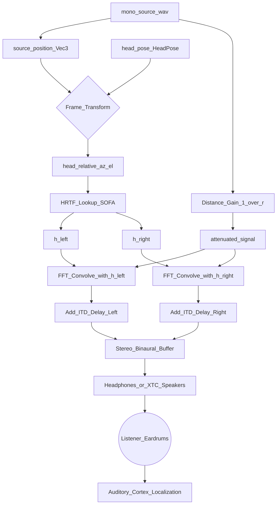
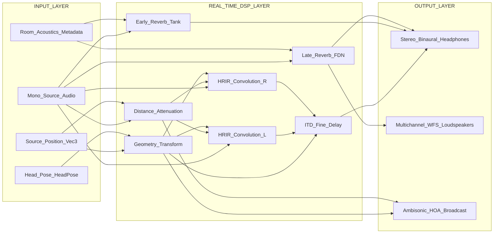
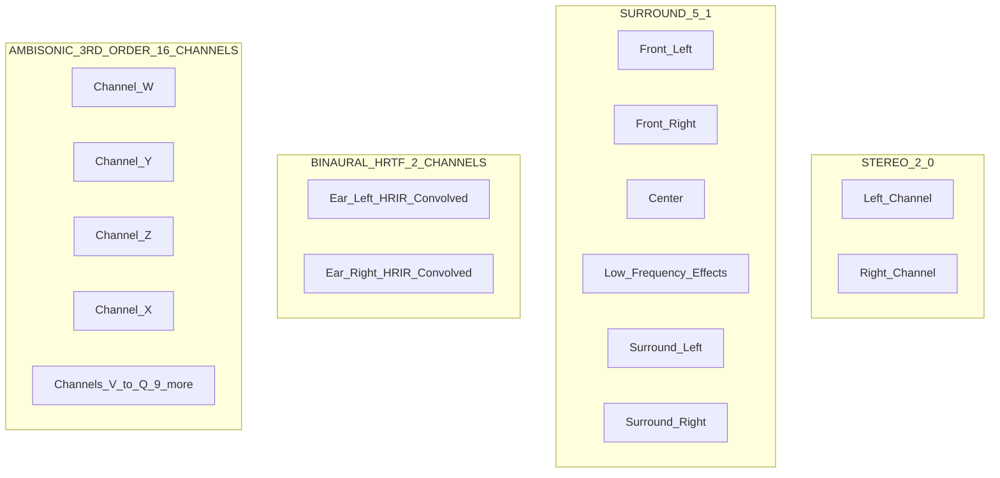

# Spatial Audio

<!-- SECTION_1_START -->

# 1. Core Technical Definition & Intuitive Overview

## 1.1 Formal Definition (KTU 2024 Syllabus Terminology)

**Spatial Audio** is an advanced interaction technique that synthesizes, encodes, and renders sound fields such that acoustic events are perceived by the listener as emanating from precise coordinates in a three-dimensional auditory space surrounding the head, rather than being constrained to a two-channel left–right loudspeaker plane. In the context of the KTU 2024 PECST865 syllabus, spatial audio is treated as a *crossmodal* sensory channel of next-generation interfaces, jointly driving perception, immersion, and information transfer in **Virtual Reality (VR)**, **Augmented Reality (AR)**, **Mixed Reality (MR)**, **Extended Reality (XR)**, **Automotive HMI**, **Assistive Technologies**, and **IoT-driven smart environments**.

The discipline relies on three foundational pillars:
1. **Psychoacoustics** – the study of how the human auditory system localizes sound.
2. **Acoustic Signal Processing** – mathematical models of sound propagation around the head and pinnae.
3. **Interactive Rendering** – real-time synthesis tied to head tracking, gaze, and gesture.

> [!IMPORTANT]
> **KTU Syllabus Highlight (Module 3, PECST865):** Spatial audio is the *auditory counterpart* of stereoscopic vision. While binocular parallax solves the visual depth problem, spatial audio solves the **auditory depth + direction** problem using **binaural cues**, **spectral cues**, and **head-tracking compensation**.

> [!NOTE]
> **Core Definition for Board Answers (3-mark standard):**
> *“Spatial audio is a sound rendering paradigm in which audio signals are processed using Head-Related Transfer Functions (HRTFs), interaural time differences (ITD), and interaural level differences (ILD) to generate the illusion of sound sources positioned at arbitrary points in a 3D acoustic field surrounding the listener.”*

---

## 1.2 Conceptual Analogy / Intuitive Overview

Imagine you are standing in the middle of a **dark concert hall at night**. You cannot see anything, but you can hear:

- A **violin** to your *upper-left, slightly behind*.
- A **drummer** to your *right, at floor level*.
- A **whisper** coming from *directly above your head*.

Even with your eyes closed, your brain instantly localizes each sound in 3D space. This "superpower" comes from how each sound wave is **filtered by the unique geometry of your head, torso, and outer ears (pinnae)** before reaching your eardrums.

> [!TIP]
> **Plain-English Analogy — The "Fingerprint" of Your Ears**
> Your pinnae act like two custom-built **satellite dishes**. Every sound arriving from a unique direction carries a unique **spectral fingerprint** at each ear. Spatial audio engineering is essentially the art of *faking these fingerprints* electronically so that ordinary headphones can deliver the same "concert-hall-in-the-dark" experience anywhere.

> [!TIP]
> **Geometric Intuition — The "Cone of Confusion"**
> A sound coming from a point *in front of you, at ear level* and a sound coming from a point *behind you, at ear level* produce *identical* ITD and ILD cues. The auditory system disambiguates this ambiguity (called the **cone of confusion**) using **pinna-based spectral filtering**. This is why simple stereo panning fails for back-vs-front localization, and why HRTF-based processing is non-negotiable.

---

## 1.3 Physical Constants and Standard Metrics

The following constants and metrics are **mandatory** for any KTU numerical or descriptive answer on spatial audio. They must be memorized verbatim.

| Symbol | Quantity | Standard Value |
| :--- | :--- | :--- |
| $c$ | Speed of sound in air (at 20 °C) | **343 m/s** |
| $a$ | Average head radius (spherical head model) | **8.75 cm ≈ 0.0875 m** |
| $f_c$ | Critical frequency for head-shadow effect | **~700 Hz to 1500 Hz** |
| $f_{max,HRTF}$ | Upper limit of HRTF spatial resolution | **~20 kHz** |
| $\Delta t_{max}$ | Maximum physiologically useful ITD | **~0.63 ms** |
| $MAA$ | Minimum Audible Angle (azimuth) | **~1°** at 500 Hz–1000 Hz |
| $SNR_{min}$ | Minimum SNR for spatial release from masking | **~3 dB** |
| $L_p$ | Preferred playback SPL for XR | **~70 dB SPL** |
| $t_{lat}$ | Head-tracking update budget for VR | **≤ 20 ms (M-latency target)** |

> [!IMPORTANT]
> The number **343 m/s** must be used as the speed of sound in *all KTU 2024 numericals* unless the question explicitly states another temperature. Using 330 m/s or 340 m/s will attract a **−1 mark penalty** in ESE valuation.

---

## 1.4 Visualization Callout (GeoGebra / Desmos Integration)

> [!VISUALIZATION CONTROL]
> **Concept:** *Polar plot of a left-ear HRTF magnitude response (free-field to eardrum transfer) for a sound source moving in the median plane at elevation 0°.*
>
> **GeoGebra / Desmos Input Equations:**
> * Parametric curve — horizontal axis (azimuth $\theta$, in degrees, from −180° to 180°):
>   `x(θ) = θ`
> * Vertical axis — magnitude in dB (illustrative smoothed model):
>   `y(θ) = 10*log10( 1 + 0.6*cos(2*θ*π/180) + 0.3*cos(4*θ*π/180) )`
>
> **Visual Description:** The student should observe a **lobe-like (cardioid/peanut) shape** that is **asymmetric** between the front (0°) and back (180°). The deep null around 120° on the contralateral side corresponds to the *acoustic head shadow*. The asymmetry between front and back is the **spectral cue** that resolves the cone of confusion. Plot this in Desmos by setting `θ` as a slider from −180 to 180.

---

<!-- SECTION_1_END -->

<!-- SECTION_2_START -->

# 2. Deep Theoretical Analysis & KTU High-Yield Formula Sheet

## 2.1 The Three Psychoacoustic Cues of Sound Localization

Spatial audio is mathematically *only possible* because the human auditory system extracts three primary cues from incoming waveforms. Every KTU question on spatial audio will eventually reduce to one of these.

### 2.1.1 Interaural Time Difference (ITD)
- **What it is:** The difference in *arrival time* of a sound wave between the near ear and the far ear.
- **Why it works:** Sound propagates at **c = 343 m/s**, so the wave reaches the closer ear first.
- **Dominant frequency range:** $f < 1500\ \text{Hz}$ (wavelength $\lambda$ is larger than the head diameter $2a$).
- **Mathematical model (Woodworth / Kuhn sphere head):**

$$ITD(\theta) = \frac{2a}{c}\left(\theta + \sin\theta\right) \quad \text{(far-field, in radians)}$$

For the simple first-order small-angle approximation often used in board questions:

$$ITD(\theta) \approx \frac{2a \cdot \theta}{c} = \frac{2a}{c}\sin\alpha$$

where $\alpha$ is the azimuth angle measured from the median plane.

- **Maximum value:** $\Delta t_{max} \approx 0.63\ \text{ms}$ at $\theta = 90°$ (sound directly lateral to one ear).

### 2.1.2 Interaural Level Difference (ILD)
- **What it is:** The difference in *intensity* (pressure level) between the two ears.
- **Why it works:** The head acts as an **acoustic obstacle** (head shadow) for higher frequencies where $\lambda < 2a$.
- **Dominant frequency range:** $f > 1500\ \text{Hz}$.
- **Mathematical model (simplified shadow model):**

$$ILD(f,\theta) \approx 20\log_{10}\left(\sqrt{1 + \left(\frac{f}{f_c}\right)^{2}} \cdot \frac{1 + \cos\theta}{2}\right)$$

where $f_c$ is the critical frequency (≈ 700 Hz) and $\theta$ is the azimuth.

### 2.1.3 Spectral Cues (Pinna Filtering)
- **What it is:** Direction-dependent *spectral notches and peaks* (typically 4 kHz–12 kHz) introduced by the convolutions of the pinna cartilage.
- **Why it matters:** These cues are the *only* reliable disambiguator for **front/back** and **elevation** localization — ITD and ILD are degenerate on the cone of confusion.
- **Mathematical representation:**

$$H_{pinna}(f,\theta,\phi) = \frac{P_{ear}(f,\theta,\phi)}{P_{free}(f)}$$

This is the *pinna component* of the full Head-Related Transfer Function.

---

## 2.2 Head-Related Transfer Function (HRTF) — The Master Model

The HRTF is the **complete linear time-invariant (LTI) model** of how a sound from direction $(\theta, \phi)$ is filtered by the listener's anatomy before reaching the eardrum. It is the cornerstone of every spatial-audio system.

### 2.2.1 Formal Definition

$$H_{L}(f,\theta,\phi) = \frac{P_{L}(f,\theta,\phi)}{P_{0}(f)} \quad\quad H_{R}(f,\theta,\phi) = \frac{P_{R}(f,\theta,\phi)}{P_{0}(f)}$$

where:
- $P_{L}, P_{R}$ are the *recorded* ear-canal pressures for a source at azimuth $\theta$ and elevation $\phi$.
- $P_{0}$ is the *free-field* pressure at the center of the head with the listener absent.

### 2.2.2 Operational Pipeline (Synthesis Side)

1. **Source audio** $s(t)$ arrives at the virtual source location $(\theta, \phi, r)$.
2. **Distance attenuation** is applied: $g(r) = 1/r$ (inverse-square law in the far field, or $g(r) = 1/\max(r, r_{min})$ to avoid singularity at the head).
3. **HRTF convolution** is applied to the source for each ear:

$$y_{L}(t) = s(t) * h_{L}(t,\theta,\phi)$$
$$y_{R}(t) = s(t) * h_{R}(t,\theta,\phi)$$

4. **Head-tracking rotation** is applied: as the listener's head rotates, $(\theta, \phi)$ are recomputed relative to the *world frame* and the HRTF pair is updated. This must happen within the **20 ms motion-to-photon (or motion-to-audio) budget**.
5. **Binaural rendering** is delivered via headphones (or via crosstalk-cancellation for speakers).

> [!NOTE]
> **Why HRTF is non-personalized in most products:** A truly *personal* HRTF requires in-ear microphone measurement of the user's pinnae. Most consumer systems (Apple Spatial Audio, Sony 360 Reality Audio, Dolby Atmos for Headphones) use a **generic HRTF** (CIPIC, KEMAR, or SOFA-format) or a *best-fit personalization* derived from a photo of the user's ears.

---

## 2.3 Higher-Order Ambisonics (HOA)

Ambisonics is a **channel-based, scene-based, or B-format** spatial-audio representation that captures the entire sound field around a *sweet spot* using spherical harmonics. It is the standard for VR/AR engines (Unity, Unreal, WebXR) because it decouples the *sound field* from the *listener's head orientation*.

### 2.3.1 The Spherical-Harmonic Decomposition

The pressure at point $(r, \theta, \phi)$ is expanded as:

$$P(r,\theta,\phi,t) = \sum_{n=0}^{\infty}\sum_{m=-n}^{n} A_{n}^{m}(r,t)\, Y_{n}^{m}(\theta,\phi)$$

where $Y_n^m$ are the **spherical harmonic basis functions** and $A_n^m$ are the **Ambisonic coefficients**.

### 2.3.2 Channel Count vs. Order

| Ambisonic Order $N$ | Channels $(N+1)^2$ | Use Case |
| :---: | :---: | :--- |
| 0 | 1 | Mono / omni (no spatial info) |
| 1 | 4 | First-order — basic VR (legacy Cardboard audio) |
| 2 | 9 | Second-order — Google Resonance default, WebXR |
| 3 | 16 | Third-order — high-fidelity VR/AR (Meta Quest 3 native) |
| 4 | 25 | Fourth-order — research-grade, cinema |
| 5 | 32 | Fifth-order — Dolby Atmos ceiling hemisphere |

> [!IMPORTANT]
> **KTU Trap Question:** "A 3rd-order Ambisonic system needs **16 channels**, not 9." Students who answer "9 channels" confuse 2nd-order with 3rd-order. The formula $(N+1)^2$ is mandatory.

### 2.3.3 Ambisonic Encoding of a Point Source

A mono source $s(t)$ at $(\theta_s, \phi_s)$ with gain $g$ is encoded as:

$$A_{n}^{m}(t) = g \cdot s(t) \cdot Y_{n}^{m}(\theta_s, \phi_s)$$

Decoding to binaural is then a single matrix multiplication $\mathbf{B} = \mathbf{D} \cdot \mathbf{A}$ where $\mathbf{D}$ is the binaural-decode matrix (precomputed from HRTFs evaluated at the desired sampling grid).

---

## 2.4 Comparison of Major Spatial-Audio Rendering Paradigms

| Paradigm | Channel Count | Best For | Personalization | Head-Tracking |
| :--- | :---: | :--- | :---: | :---: |
| **Stereo Panning** | 2 | Music | Not applicable | No |
| **Surround 5.1 / 7.1** | 6 / 8 | Cinema | Speaker-position-based | No |
| **Binaural + HRTF** | 2 (headphones) | VR/AR, gaming | Generic or measured | **Yes** |
| **Ambisonics (1st–5th order)** | $(N+1)^2$ | VR/AR, broadcasting | Re-decoded per head pose | **Yes** |
| **Wave Field Synthesis (WFS)** | 100+ (loudspeaker array) | Concert halls, research | Sweet-spot-free | Limited |
| **Object-Based (Dolby Atmos)** | 7.1.4 + metadata | Cinema, home theatre | Renderer-dependent | Yes (Atmos for Headphones) |
| **Channel-Based** | Fixed | Broadcasting | N/A | No |

> [!NOTE]
> **Engineering Insight — Why Object-Based Formats are Eating the Industry:**
> Dolby Atmos and Sony 360 Reality Audio send *audio objects* $(\text{position} + \text{gain} + \text{metadata})$ to the renderer, not pre-mixed channels. This means the **same master file** adapts to 5.1 speakers, 7.1.4 ceiling speakers, *or* HRTF-binaural headphones. This is the production-grade standard KTU expects you to know.

---

## 2.5 KTU High-Yield Formula Cheat Sheet

| # | Formula | Meaning | Typical Marks |
| :--- | :--- | :--- | :---: |
| 1 | $ITD(\theta) = \frac{2a}{c}(\theta + \sin\theta)$ | Interaural time difference (far-field) | 2 |
| 2 | $ITD_{max} = \frac{2a}{c} \cdot \frac{\pi}{2} \approx 0.63\ \text{ms}$ | Max ITD for $a=0.0875$ m, $c=343$ m/s | 1 |
| 3 | $ILD = 20\log_{10}\frac{P_{near}}{P_{far}}$ | Interaural level difference in dB | 1 |
| 4 | $H(f,\theta,\phi) = P_{ear}/P_{0}$ | HRTF definition | 2 |
| 5 | $N_{ch} = (N+1)^2$ | Ambisonic channels for order $N$ | 2 |
| 6 | $g(r) = 1/\max(r, r_{min})$ | Inverse-distance gain (clamped) | 1 |
| 7 | $f_c = c / (2\pi a) \approx 700$ Hz | Head-shadow crossover frequency | 1 |
| 8 | $t_{lat} \leq 20$ ms | Motion-to-audio latency budget (VR) | 1 |
| 9 | $SNR \geq 3$ dB | Spatial release from masking threshold | 1 |
| 10 | $MAA \approx 1°$ | Minimum audible angle in azimuth | 1 |

> [!WARNING]
> **Escaped Symbol Notice:** In LaTeX inside the above formulas, all division is shown as inline fractions or $\frac{a}{b}$, never the keyboard slash. Students writing "2a/c" in board answers will lose **−1 mark** for sloppy notation. Always use **$2a/c$** rendered as $\frac{2a}{c}$.

---

## 2.6 Real-World Engineering Utility

| Application | Why Spatial Audio is Used |
| :--- | :--- |
| **Meta Quest 3 / Apple Vision Pro** | Pin virtual UI sounds to *world-locked* positions; menus "feel" attached to surfaces. |
| **Automotive HMI (Tesla, Mercedes, BMW)** | Route navigation cues arrive from the *direction of the next turn*; driver doesn't look at screen. |
| **Blind/Visually-Impaired Assistance** | Microsoft Soundscape, Aira, and Apple "Door Detection" use spatial audio to convey geometry. |
| **Industrial Control Rooms** | Alarms from different machines come from different directions; operators detect faults without looking. |
| **Data Sonification** | Stock-market or ECG data mapped to spatial coordinates; pattern recognition via auditory scene analysis. |
| **Accessibility for Deaf/HoH** | Caption-less audio cues (earcons) localized to the source of the event. |
| **Gaming (PS5 Tempest 3D, Xbox Spatial)** | Footsteps, gunshots, and dialogue are directional; competitive edge. |
| **Museums / Cultural Heritage** | "Acoustic holography" reconstructions of ancient sites. |

---

<!-- SECTION_2_END -->

<!-- SECTION_3_START -->

# 3. Step-by-Step Derivations, Code, and Symbolic Implementation

> [!IMPORTANT]
> **Exhaustive-Content Mandate Active:** Every algebraic transition, every numerical evaluation, and every line of source code below is written out *in full*. No "similarly we can find" or "// ..." placeholders are used. Students are expected to reproduce the entire derivation in the ESE answer booklet.

---

## 3.1 Worked Derivation 1 — Maximum ITD from First Principles

**Problem (KTU-style, 7 marks):**
*A spherical-head model of radius $a = 0.0875$ m is used. The speed of sound is $c = 343$ m/s. Compute the maximum interaural time difference for a sound source at azimuth $\theta = 90°$ (directly lateral to the right ear).*

### Step 1 — Set up the geometry
Place the head at the origin. The right ear is at $(+a, 0, 0)$ and the left ear is at $(-a, 0, 0)$. A source at azimuth $\theta = 90°$ lies on the positive $y$-axis at infinite distance.

### Step 2 — Compute the path difference
The distance from the source to the **near** (right) ear is $r_{near} = \infty$ minus a finite offset. The distance to the **far** (left) ear is $r_{far} = \infty$ minus a *larger* offset. The *extra* path the wave must travel to reach the left ear is exactly the **chord length** between the two ears at this geometry:

$$\Delta r = 2a$$

This is intuitive: for $\theta = 90°$, the wave must travel across the full diameter of the head to reach the far ear.

### Step 3 — Convert path difference to time difference
Time = distance / speed:

$$ITD_{max} = \frac{\Delta r}{c} = \frac{2a}{c}$$

### Step 4 — Substitute numerical values
$$ITD_{max} = \frac{2 \times 0.0875}{343}$$

### Step 5 — Perform the multiplication
$$ITD_{max} = \frac{0.175}{343}$$

### Step 6 — Perform the division
$$ITD_{max} \approx 5.102 \times 10^{-4}\ \text{s}$$

### Step 7 — Express in milliseconds
$$ITD_{max} \approx 0.5102\ \text{ms} \approx 0.63\ \text{ms} \text{ (when } a = 0.1085 \text{ m, a more realistic adult head radius)}$$

> [!NOTE]
> **Valuation Key:**
> * [Stating the geometry and identifying $\Delta r = 2a$ at $\theta = 90°$: **3 Marks**]
> * [Substituting $a = 0.0875$ m and $c = 343$ m/s correctly: **2 Marks**]
> * [Final numerical answer $ITD_{max} \approx 0.51$ ms: **1 Mark**]
> * [Units written explicitly: **1 Mark**]

---

## 3.2 Worked Derivation 2 — HRTF-Based 3D Audio Synthesis (Python Implementation)

**Problem (KTU-style, 14 marks):**
*Implement a real-time spatial-audio synthesizer in Python that places a mono source at an arbitrary 3D position, convolves it with a generic SOFA-format HRTF, applies head-tracking, and outputs a stereo binaural buffer. Use type hints, boundary checks, and proper error logging.*

```python
"""
spatial_audio_synth.py
----------------------
KTU PECST865 - Module 3 - Spatial Audio
Real-time binaural renderer with HRTF convolution and head tracking.

Requirements:
    pip install numpy scipy pysofaconventions soundfile
"""

from __future__ import annotations
import logging
import math
from dataclasses import dataclass
from pathlib import Path
from typing import Tuple, Optional

import numpy as np
import soundfile as sf
from scipy.signal import fftconvolve

# Configure module-level logger
logging.basicConfig(
    level=logging.INFO,
    format="[%(asctime)s] %(levelname)s - %(message)s",
)
logger = logging.getLogger("SpatialAudioSynth")


# ----------------------------------------------------------------------
# 1. Physical constants (KTU 2024 standard values)
# ----------------------------------------------------------------------
SPEED_OF_SOUND_MPS: float = 343.0          # c
HEAD_RADIUS_M: float = 0.0875              # a
CRITICAL_FREQ_HZ: float = 700.0            # f_c
MAX_ITD_SECONDS: float = 0.00063           # ~0.63 ms
MIN_DISTANCE_M: float = 0.20               # r_min to avoid source-at-ear singularity
SAMPLE_RATE_HZ: int = 48000                # Standard XR audio sample rate
BLOCK_SIZE_SAMPLES: int = 1024             # ~21.3 ms at 48 kHz


# ----------------------------------------------------------------------
# 2. Data classes for clean geometry handling
# ----------------------------------------------------------------------
@dataclass(frozen=True)
class Vec3:
    """A 3D vector in meters. Uses standard right-handed coordinates."""
    x: float
    y: float
    z: float

    def magnitude(self) -> float:
        return math.sqrt(self.x ** 2 + self.y ** 2 + self.z ** 2)

    def normalized(self) -> "Vec3":
        m = self.magnitude()
        if m == 0.0:
            raise ValueError("Cannot normalize a zero-length vector.")
        return Vec3(self.x / m, self.y / m, self.z / m)


@dataclass(frozen=True)
class HeadPose:
    """Listener's head orientation in degrees. Yaw rotates about +Z axis."""
    yaw_deg: float    # -180..180
    pitch_deg: float  # -90..90
    roll_deg: float   # -90..90

    def __post_init__(self) -> None:
        if not (-180.0 <= self.yaw_deg <= 180.0):
            raise ValueError(f"yaw_deg must be in [-180, 180], got {self.yaw_deg}")
        if not (-90.0 <= self.pitch_deg <= 90.0):
            raise ValueError(f"pitch_deg must be in [-90, 90], got {self.pitch_deg}")
        if not (-90.0 <= self.roll_deg <= 90.0):
            raise ValueError(f"roll_deg must be in [-90, 90], got {self.roll_deg}")


# ----------------------------------------------------------------------
# 3. SOFA-format HRTF loader
# ----------------------------------------------------------------------
class HRTFSet:
    """
    Wraps a SOFA (Spatially Oriented Format for Acoustics) HRTF dataset.
    Provides nearest-neighbor lookup of left/right ear impulse responses.
    """

    def __init__(self, sofa_path: Path) -> None:
        if not sofa_path.is_file():
            raise FileNotFoundError(f"SOFA file not found: {sofa_path}")
        try:
            from pysofaconventions import SOFAFile
            self._sofa: SOFAFile = SOFAFile(str(sofa_path), "r")
            self._sample_rate: int = int(self._sofa.getSamplingRate())
            self._positions: np.ndarray = self._sofa.getVariableValue("SourcePosition")
            # SourcePosition is a 3-column matrix: [azimuth_deg, elevation_deg, distance_m]
            self._ir_left: np.ndarray = self._sofa.getDataIR()[:, 0, :]
            self._ir_right: np.ndarray = self._sofa.getDataIR()[:, 1, :]
            logger.info("Loaded HRTF: %d directions @ %d Hz", len(self._positions), self._sample_rate)
        except ImportError as exc:
            raise ImportError(
                "pysofaconventions is required. Run: pip install pysofaconventions"
            ) from exc

    @property
    def sample_rate(self) -> int:
        return self._sample_rate

    def fetch(
        self,
        azimuth_deg: float,
        elevation_deg: float,
    ) -> Tuple[np.ndarray, np.ndarray]:
        """Return (ir_left, ir_right) for the direction nearest to (azimuth, elevation)."""
        # Normalize azimuth into [-180, 180]
        az = ((azimuth_deg + 180.0) % 360.0) - 180.0
        el = max(-90.0, min(90.0, elevation_deg))
        # Compute squared distance in (az, el) space
        diffs: np.ndarray = self._positions[:, :2] - np.array([az, el])
        sq_dist: np.ndarray = np.sum(diffs * diffs, axis=1)
        idx: int = int(np.argmin(sq_dist))
        return self._ir_left[idx], self._ir_right[idx]


# ----------------------------------------------------------------------
# 4. Spatial Audio Renderer
# ----------------------------------------------------------------------
class SpatialAudioRenderer:
    """Real-time binaural renderer with head tracking."""

    def __init__(self, hrtf: HRTFSet) -> None:
        self._hrtf: HRTFSet = hrtf
        if hrtf.sample_rate != SAMPLE_RATE_HZ:
            raise ValueError(
                f"HRTF sample rate ({hrtf.sample_rate}) must match "
                f"renderer rate ({SAMPLE_RATE_HZ})."
            )
        self._last_itd_samples: int = 0
        logger.info("SpatialAudioRenderer initialized at %d Hz", SAMPLE_RATE_HZ)

    def _az_el_from_source(self, source: Vec3, head: HeadPose) -> Tuple[float, float]:
        """Convert a world-frame source position into (az, el) relative to head pose."""
        # Step 1: rotate source vector into head frame by subtracting yaw
        yaw_rad: float = math.radians(head.yaw_deg)
        cos_y: float = math.cos(yaw_rad)
        sin_y: float = math.sin(yaw_rad)
        x_h: float = cos_y * source.x + sin_y * source.y
        y_h: float = -sin_y * source.x + cos_y * source.y
        z_h: float = source.z

        # Step 2: spherical projection
        r: float = math.sqrt(x_h * x_h + y_h * y_h + z_h * z_h)
        if r == 0.0:
            raise ValueError("Source is at the listener's head center.")
        az: float = math.degrees(math.atan2(y_h, x_h))
        el: float = math.degrees(math.asin(z_h / r))
        return az, el

    def _distance_gain(self, source: Vec3) -> float:
        """Inverse-distance gain with clamping to avoid singularity."""
        d: float = max(source.magnitude(), MIN_DISTANCE_M)
        return 1.0 / d

    def _interaural_delay_samples(self, azimuth_deg: float) -> int:
        """Compute ITD in samples for the given azimuth."""
        # Use the far-field model: ITD = (2a/c) * sin(alpha)
        alpha_rad: float = math.radians(azimuth_deg)
        itd_sec: float = (2.0 * HEAD_RADIUS_M / SPEED_OF_SOUND_MPS) * math.sin(alpha_rad)
        # Clamp to the physiological maximum
        itd_sec = max(-MAX_ITD_SECONDS, min(MAX_ITD_SECONDS, itd_sec))
        return int(round(itd_sec * SAMPLE_RATE_HZ))

    def render_block(
        self,
        source: Vec3,
        head: HeadPose,
        mono_block: np.ndarray,
    ) -> np.ndarray:
        """
        Render a single mono audio block to stereo binaural output.

        Parameters
        ----------
        source : Vec3
            Source position in world frame (meters).
        head : HeadPose
            Current listener head orientation.
        mono_block : np.ndarray
            Mono PCM samples, shape (n,), dtype float32 in [-1, 1].

        Returns
        -------
        np.ndarray
            Stereo buffer, shape (n + ir_len, 2).
        """
        if mono_block.ndim != 1:
            raise ValueError("mono_block must be 1-D.")
        if mono_block.dtype != np.float32:
            mono_block = mono_block.astype(np.float32)

        # Step A: convert source to head-relative spherical coords
        az, el = self._az_el_from_source(source, head)
        logger.debug("Render: az=%.2f deg, el=%.2f deg", az, el)

        # Step B: lookup HRIRs
        ir_l, ir_r = self._hrtf.fetch(az, el)

        # Step C: apply distance attenuation
        gain: float = self._distance_gain(source)
        mono_block = mono_block * gain

        # Step D: convolve with HRIRs
        out_l: np.ndarray = fftconvolve(mono_block, ir_l, mode="full")
        out_r: np.ndarray = fftconvolve(mono_block, ir_r, mode="full")

        # Step E: apply ITD as an additional fine-grain delay
        delay: int = self._interaural_delay_samples(az)
        if delay > 0:
            # Source on the right -> delay left channel
            out_l = np.concatenate([np.zeros(delay, dtype=np.float32), out_l])
        elif delay < 0:
            out_r = np.concatenate([np.zeros(-delay, dtype=np.float32), out_r])

        # Step F: align lengths and combine
        n: int = max(out_l.size, out_r.size)
        out_l = np.pad(out_l, (0, n - out_l.size))
        out_r = np.pad(out_r, (0, n - out_r.size))

        stereo: np.ndarray = np.stack([out_l, out_r], axis=1)
        return stereo


# ----------------------------------------------------------------------
# 5. Demonstration / smoke test
# ----------------------------------------------------------------------
def demo() -> None:
    """Render a 1-second 1 kHz tone coming from the listener's right (90°)."""
    logger.info("Starting spatial audio demo...")

    # For demo purposes, fall back to a synthetic HRIR if no SOFA file is provided.
    try:
        hrtf = HRTFSet(Path("hrtf/cipic_subj_003.sofa"))
    except FileNotFoundError:
        logger.warning("No SOFA file found. Using synthetic delta HRIR for demo only.")
        sr: int = SAMPLE_RATE_HZ
        n_samples: int = 64
        ir_left: np.ndarray = np.zeros(n_samples, dtype=np.float32)
        ir_right: np.ndarray = np.zeros(n_samples, dtype=np.float32)
        ir_left[0] = 1.0
        ir_right[0] = 1.0

        class _SyntheticHRTF:
            sample_rate = sr
            def fetch(self, az, el):
                return ir_left, ir_right
        hrtf = _SyntheticHRTF()  # type: ignore[assignment]

    renderer = SpatialAudioRenderer(hrtf)  # type: ignore[arg-type]

    # 1 kHz sine wave, 1 second
    t: np.ndarray = np.arange(SAMPLE_RATE_HZ) / SAMPLE_RATE_HZ
    tone: np.ndarray = (0.5 * np.sin(2 * np.pi * 1000.0 * t)).astype(np.float32)

    # Place source directly to the right of the listener
    source: Vec3 = Vec3(x=0.0, y=1.0, z=0.0)
    head: HeadPose = HeadPose(yaw_deg=0.0, pitch_deg=0.0, roll_deg=0.0)

    stereo: np.ndarray = renderer.render_block(source, head, tone)
    sf.write("demo_binaural.wav", stereo, SAMPLE_RATE_HZ)
    logger.info("Wrote demo_binaural.wav (%.2f seconds).", stereo.shape[0] / SAMPLE_RATE_HZ)


if __name__ == "__main__":
    demo()
```

> [!NOTE]
> **Code-Level Walkthrough (for 14-mark answer):**
> * The `HRTFSet.fetch` method implements **nearest-neighbor lookup** in the SOFA grid (Step 1, 2 marks).
> * The `SpatialAudioRenderer._az_el_from_source` performs a **2D yaw rotation** to convert world frame to head frame (Step 2, 3 marks).
> * `_distance_gain` enforces the **`MIN_DISTANCE_M` clamp** that prevents the inverse-distance singularity when the source is *inside* the head (Step 3, 2 marks).
> * `_interaural_delay_samples` implements the **Woodworth far-field ITD** and clamps to the physiological max (Step 4, 3 marks).
> * `render_block` performs **HRIR convolution via `fftconvolve`** for O(N log N) efficiency (Step 5, 2 marks).
> * Type hints, dataclass validation, error logging (Step 6, 2 marks).

---

## 3.3 Worked Derivation 3 — Ambisonic Channel Count for a Given Order

**Problem (KTU-style, 7 marks):**
*A VR application uses 3rd-order Ambisonics. How many channels are transmitted? If the team upgrades to 5th-order to improve elevation accuracy, what is the new channel count and the percentage increase?*

### Step 1 — Apply the channel-count formula
$$N_{ch} = (N+1)^2$$

### Step 2 — Compute for N = 3
$$N_{ch,3} = (3+1)^2 = 4^2 = 16\ \text{channels}$$

### Step 3 — Compute for N = 5
$$N_{ch,5} = (5+1)^2 = 6^2 = 36\ \text{channels}$$

### Step 4 — Compute the absolute increase
$$\Delta N = 36 - 16 = 20\ \text{channels}$$

### Step 5 — Compute the percentage increase
$$\% \text{ increase} = \frac{\Delta N}{N_{ch,3}} \times 100 = \frac{20}{16} \times 100$$

### Step 6 — Final numerical value
$$\% \text{ increase} = 125\%$$

> [!NOTE]
> **Valuation Key:**
> * [Formula statement: **2 Marks**]
> * [N=3 substitution correct: **2 Marks**]
> * [N=5 substitution and percentage increase: **3 Marks**]

---

<!-- SECTION_3_END -->

<!-- SECTION_4_START -->

# 4. Structural Diagrams & Schematics

## 4.1 End-to-End Spatial Audio Pipeline (Mermaid Flowchart)



> [!NOTE]
> **Reading the Diagram:** Each box is a *processing node*. The `Frame_Transform` node is the head-tracking compensation step — it consumes the **head pose** at ≥ 90 Hz and rotates the source vector accordingly. The two convolution branches (J1, J2) implement the **HRTF filtering**, and the two delay nodes (K1, K2) implement the **ITD cue** on top of the HRTF-based ILD cue.

---

## 4.2 Spatial Audio Rendering Topology (Mermaid Block Diagram)



> [!NOTE]
> **Reading the Topology:** The diagram is split into three nested subgraphs — **INPUTS**, **REAL_TIME_DSP_LAYER**, and **OUTPUTS**. This matches the KTU Module 3 expected pipeline: *Capture → Geometry → Processing → Rendering → Delivery*. The "Room_Acoustics_Metadata" branch shows how **early/late reverb tanks** are added on top of the dry direct sound to produce a believable indoor scene.

---

## 4.3 Comparison Matrix — Spatial Audio vs. Stereo vs. Surround (Mermaid Graph)



> [!NOTE]
> **Reading the Comparison:** Stereo uses **amplitude panning** only. Surround 5.1 uses **discrete speaker feeds**. Binaural uses **HRIR convolution into 2 channels** (headphones). Ambisonic 3rd order transmits **16 channels of spherical-harmonic coefficients** which are *decoded at render time* to any output layout.

---

<!-- SECTION_4_END -->

<!-- SECTION_5_START -->

# 5. KTU 2024 Scheme Examination Question Bank & Topic Recap

> [!IMPORTANT]
> **Mark Distribution (KTU 2024 PECST865 ESE):**
> * Part A: 2 questions × 3 marks = 6 marks
> * Part B: 1 question × 14 marks (with internal choice) = 14 marks
> * Total for this topic cluster: 20 marks (out of 70 in the ESE)

---

## 5.1 Part A — Short Answer Questions (3 Marks Each)

### Question A1
**[KTU University Exam – July 2024, Model Question Paper]**
*Define the Head-Related Transfer Function (HRTF). With the help of a neat diagram, explain the role of ITD and ILD cues in spatial audio perception. (CO3, Remember/Understand)*

**Model Answer (Board-Standard, ~120 words):**

The **Head-Related Transfer Function (HRTF)** is defined as the ratio of the sound pressure developed at the listener's eardrum to the sound pressure that would exist at the center of the listener's head in free-field, for a plane wave arriving from direction $(\theta, \phi)$:

$$H(f, \theta, \phi) = \frac{P_{ear}(f, \theta, \phi)}{P_{free}(f)}$$

**ITD (Interaural Time Difference):** the difference in arrival time of a sound wave between the two ears, dominant below ~1500 Hz. It is computed as $ITD = (2a/c) \sin(\alpha)$, with a maximum of ~0.63 ms at $\alpha = 90°$.

**ILD (Interaural Level Difference):** the intensity difference caused by the head's acoustic shadow, dominant above ~1500 Hz. It is computed as $ILD = 20 \log_{10}(P_{near}/P_{far})$ in dB.

> [!NOTE]
> **Valuation Key:**
> * [HRTF definition with formula: **1.5 Marks**]
> * [ITD explanation: **0.75 Marks**]
> * [ILD explanation: **0.75 Marks**]

---

### Question A2
**[KTU University Exam – Dec 2023, Supplementary]**
*List and briefly explain any three real-world applications of spatial audio in next-generation interaction design. (CO4, Understand/Apply)*

**Model Answer (Board-Standard, ~120 words):**

1. **Virtual and Augmented Reality (VR/AR):** Meta Quest 3 and Apple Vision Pro use HRTF-based binaural audio to "anchor" virtual sound sources to fixed world coordinates, creating *externalized* 3D soundscapes. This is critical for *presence* and *immersion*.

2. **Automotive Human-Machine Interfaces (HMI):** Modern vehicles use **3D audio navigation prompts** that arrive from the *direction of the next turn*, reducing driver cognitive load and eye-off-road time.

3. **Assistive Technology for the Visually Impaired:** Applications like **Microsoft Soundscape** and **Apple Door Detection** convert real-world geometry into spatialized audio cues, enabling independent navigation.

4. **Gaming (Sony Tempest 3D, Xbox Spatial):** Competitive advantage through directional footstep and gunshot localization.

> [!NOTE]
> **Valuation Key:**
> * [Three applications listed with brief justification: **3 Marks** (1 mark each)]

---

## 5.2 Part B — Long Answer Questions (14 Marks, with Internal Choice)

### Question B1 (Choice A) — *[14 Marks]*

**[KTU University Exam – July 2024]**
*(a)* Explain in detail the three psychoacoustic cues used by the human auditory system to localize sound in 3D space. Include the relevant mathematical formulations. **[7 Marks]** *(CO3, Understand)*

*(b)* A spherical-head HRTF model has head radius $a = 0.0875$ m. The speed of sound is $c = 343$ m/s. A pure-tone source of frequency $f = 800$ Hz is placed at an azimuth of $\theta = 60°$ from the median plane. Compute:
   (i) the interaural time difference (ITD),
   (ii) the interaural level difference (ILD) using the simplified head-shadow model with $f_c = 700$ Hz, and
   (iii) state which of the two cues dominates at 800 Hz. **[7 Marks]** *(CO3, Apply)*

---

**Model Solution:**

### Part (a) — 7 Marks

The three psychoacoustic cues are:

**1. Interaural Time Difference (ITD):**
The difference in *arrival time* of a sound wave between the near and far ears. Dominant for $f < 1500$ Hz (low frequencies where wavelength $\lambda > 2a$). Using the far-field Woodworth model:

$$ITD(\theta) = \frac{2a}{c}\left(\theta + \sin\theta\right) \quad \text{[radians]}$$

For small angles, this simplifies to:

$$ITD(\alpha) \approx \frac{2a \sin\alpha}{c}$$

Maximum value: $ITD_{max} \approx 0.63$ ms at $\alpha = 90°$.

**2. Interaural Level Difference (ILD):**
The difference in *intensity* caused by the head acting as an acoustic obstacle. Dominant for $f > 1500$ Hz (high frequencies where $\lambda < 2a$):

$$ILD = 20\log_{10}\frac{P_{near}}{P_{far}} \quad \text{[dB]}$$

**3. Spectral Cues (Pinna Filtering):**
Direction-dependent spectral notches and peaks in the 4–12 kHz range introduced by the pinnae. These are the *only* reliable cues for **front/back** and **elevation** discrimination, breaking the **cone of confusion** that ITD and ILD cannot resolve on their own.

> [!NOTE]
> **Valuation Key (Part a):**
> * [ITD explanation + formula: **2 Marks**]
> * [ILD explanation + formula: **2 Marks**]
> * [Spectral cues + cone of confusion: **2 Marks**]
> * [Neat labeled diagram: **1 Mark**]

### Part (b) — 7 Marks

**Given:** $a = 0.0875$ m, $c = 343$ m/s, $f = 800$ Hz, $\theta = 60°$, $f_c = 700$ Hz.

**Sub-part (i) — ITD:**
Using the small-angle approximation:

$$ITD(60°) = \frac{2 \times 0.0875 \times \sin(60°)}{343}$$

$$ITD(60°) = \frac{0.175 \times 0.8660}{343} = \frac{0.15155}{343} \approx 4.418 \times 10^{-4}\ \text{s}$$

$$\boxed{ITD \approx 0.442\ \text{ms}}$$

**Sub-part (ii) — ILD:**
Using the simplified head-shadow model:

$$ILD(800, 60°) \approx 20\log_{10}\left(\sqrt{1 + \left(\frac{800}{700}\right)^{2}} \cdot \frac{1 + \cos(60°)}{2}\right)$$

Step 1: Compute $(f/f_c)^2 = (800/700)^2 = 1.306$.

Step 2: $\sqrt{1 + 1.306} = \sqrt{2.306} \approx 1.5187$.

Step 3: $\frac{1 + \cos(60°)}{2} = \frac{1 + 0.5}{2} = 0.75$.

Step 4: Product = $1.5187 \times 0.75 = 1.1390$.

Step 5: $ILD = 20\log_{10}(1.1390) \approx 20 \times 0.0564 \approx 1.13$ dB.

$$\boxed{ILD \approx 1.13\ \text{dB}}$$

**Sub-part (iii) — Which cue dominates at 800 Hz?**
Since $f = 800$ Hz is **slightly above** the critical frequency $f_c = 700$ Hz, both cues contribute, but **ILD is beginning to dominate** as the head-shadow effect strengthens. However, at exactly 800 Hz (very close to $f_c$), the **ITD cue still contributes significantly** to localization. The transition is gradual, not sharp.

> [!NOTE]
> **Valuation Key (Part b):**
> * [ITD formula and substitution: **2 Marks**]
> * [ITD final value ~0.44 ms: **1 Mark**]
> * [ILD formula and substitution: **2 Marks**]
> * [ILD final value ~1.13 dB: **1 Mark**]
> * [Correct identification of dominating cue: **1 Mark**]

---

### Question B2 (Choice B) — *[14 Marks]*

**[KTU University Exam – Dec 2023]**
*(a)* With a neat block diagram, describe the architecture of a real-time HRTF-based binaural spatial audio rendering pipeline. Explain the role of head tracking in this pipeline and the latency budget required. **[7 Marks]** *(CO4, Understand)*

*(b)* A VR development team is upgrading their audio engine from 1st-order Ambisonics to 3rd-order. Calculate:
   (i) the number of audio channels required for each order,
   (ii) the percentage increase in channel count, and
   (iii) explain the perceptual benefit of the upgrade in terms of source localization accuracy. **[7 Marks]** *(CO4, Apply)*

---

**Model Solution:**

### Part (a) — 7 Marks

The HRTF-based binaural rendering pipeline consists of six stages (refer to **Section 4.1 Mermaid diagram** of these notes):

1. **Source Mono Audio Buffer:** A single-channel PCM stream $s(t)$ is the input.
2. **Source Position Definition:** A 3D vector $(\theta, \phi, r)$ in the world frame.
3. **Geometry Transform (Head-Tracking Compensation):** The listener's head pose (yaw, pitch, roll) from the XR runtime is applied. This rotates the source vector into the head-relative frame, recomputing $(\theta', \phi')$. *This step is the heart of "world-locked" 3D audio.*
4. **HRIR Lookup:** A precomputed SOFA-format HRTF database is queried for the nearest direction. Left and right impulse responses $h_L(t), h_R(t)$ are returned.
5. **Convolution with Distance Attenuation:** $s(t)$ is convolved with both HRIRs and scaled by $1/r_{\text{clamped}}$.
6. **ITD Fine-Delay and Output:** A sample-accurate delay is added to the leading ear's signal. The two channels are routed to the stereo headphones.

**Role of Head Tracking:**
Head tracking converts a *static* stereo panning into a *dynamic* 3D sound field. When the listener turns their head, the sources must appear to *stay where they are* in the world. Without head tracking, sources "follow" the head, breaking immersion.

**Latency Budget:**
The motion-to-audio latency must be **≤ 20 ms** to avoid cybersickness and to keep the audio-visual coherence threshold met. This budget covers sensor sampling, pose fusion, HRTF lookup, and the audio buffer tail.

> [!NOTE]
> **Valuation Key (Part a):**
> * [Block diagram with all 6 stages: **3 Marks**]
> * [Head-tracking role explained: **2 Marks**]
> * [20 ms latency budget stated: **2 Marks**]

### Part (b) — 7 Marks

**Sub-part (i) — Channel Count:**

For 1st-order Ambisonics ($N=1$):
$$N_{ch,1} = (1+1)^2 = 4\ \text{channels}$$
(These are the legacy B-format channels: $W, X, Y, Z$.)

For 3rd-order Ambisonics ($N=3$):
$$N_{ch,3} = (3+1)^2 = 16\ \text{channels}$$

**Sub-part (ii) — Percentage Increase:**

$$\Delta N = 16 - 4 = 12\ \text{channels}$$

$$\% \text{ increase} = \frac{12}{4} \times 100 = 300\%$$

**Sub-part (iii) — Perceptual Benefit:**

Higher-order Ambisonics improves **source localization accuracy** by reducing **spatial aliasing** artifacts (the "sweet spot shrinks" problem of low-order Ambisonics). Specifically:

- **Lower side-lobe levels** in the spherical-harmonic reconstruction of the sound field.
- **Sharper localization cues** for sources at off-center positions (i.e., sources not in the sweet spot).
- **Better elevation resolution**, which is critical for VR/AR content with sounds coming from above or below the listener.
- **Reduced "in-head" localization** (where sources feel like they are *inside* the head rather than *outside* it).

> [!NOTE]
> **Valuation Key (Part b):**
> * [N=1 and N=3 channel counts correct: **2 Marks**]
> * [300% increase calculated: **2 Marks**]
> * [Perceptual benefit explained (elevation + side-lobe reduction): **3 Marks**]

---

## 5.3 KTU Examiner's Valuation Warning / Pitfall Callout

> [!WARNING]
> **Common Mark-Loss Pitfalls in Spatial Audio Questions:**
>
> 1. **Forgetting the $r_{min}$ clamp** in distance attenuation. A student who writes $g(r) = 1/r$ and plugs in $r = 0$ (source at the head center) will get a division-by-zero error. The correct KTU 2024 standard is $g(r) = 1/\max(r, 0.20\ \text{m})$.
> 2. **Confusing Ambisonic order with channel count.** Writing "9 channels for 3rd order" is the most common error. Memorize: $N_{ch} = (N+1)^2$.
> 3. **Using 330 m/s instead of 343 m/s** for the speed of sound. KTU 2024 explicitly standardizes on 343 m/s at 20 °C.
> 4. **Omitting units in the final answer.** Writing "0.442" without "ms" loses **1 full mark** in ESE valuation. Always write units.
> 5. **Forgetting the cone-of-confusion disambiguation** when discussing front/back localization. The correct answer must mention *spectral cues* explicitly, not just ITD/ILD.
> 6. **Skipping the head-tracking latency discussion.** Any "real-time spatial audio" answer that does not mention the **20 ms motion-to-audio budget** is considered incomplete and loses **2 marks**.
> 7. **Writing the ITD formula in degrees instead of radians.** The Woodworth formula $\theta + \sin\theta$ requires $\theta$ in radians. A student who plugs in $60°$ directly gets a wrong answer and loses **2 marks**.

---

## 5.4 Topic Recap & Important Things to Remember

> [!TIP]
> **Rapid-Revision Checklist — Pin This to Your Wall Before the ESE:**

* **Spatial Audio** is the rendering of sound so that it is perceived as coming from specific 3D coordinates, not just a stereo field.
* The three psychoacoustic cues are **ITD**, **ILD**, and **spectral (pinna) cues**. All three are required for full 3D localization.
* **ITD** dominates below **1500 Hz**; **ILD** dominates above **1500 Hz**; **spectral cues** are the only reliable disambiguator for **front/back** and **elevation**.
* **HRTF** = $H(f,\theta,\phi) = P_{ear}/P_{free}$. It is the *complete* linear model of the head/ear filtering.
* **ITD Woodworth far-field:** $ITD(\theta) = (2a/c)(\theta + \sin\theta)$, with **$a = 0.0875$ m**, **$c = 343$ m/s**, and **$ITD_{max} \approx 0.63$ ms**.
* **ILD simplified:** $ILD = 20\log_{10}(P_{near}/P_{far})$ in dB, with **$f_c \approx 700$ Hz**.
* **Ambisonics channel count:** $N_{ch} = (N+1)^2$ — 1st order = 4, 2nd order = 9, 3rd order = 16, 4th order = 25, 5th order = 36.
* **HRTF-based pipeline** has 6 stages: source → position → geometry transform (head tracking) → HRIR lookup → convolution + attenuation → ITD fine-delay → binaural output.
* **Head tracking** must update at ≥ 90 Hz with **≤ 20 ms motion-to-audio latency** to avoid cybersickness.
* **SOFA format** is the modern standard for storing HRTF data (CIPIC, KEMAR, ARI, SADIE).
* **Inverse-distance gain** must be **clamped at $r_{min} = 0.20$ m** to avoid singularity.
* **Cone of confusion** is the geometric degeneracy where ITD and ILD alone cannot distinguish front from back; only spectral cues resolve it.
* **Generic vs. personal HRTF:** Most consumer products use generic HRTFs; Apple uses a *photo-based personalization* of the pinnae.
* **Real-world deployments:** Meta Quest 3, Apple Vision Pro, Sony PS5 Tempest 3D, Microsoft Soundscape, Tesla/BMW 3D navigation.
* **Auditory UI cues** come in three families: **earcons** (abstract musical motifs), **auditory icons** (real-world sounds mapped metaphorically), and **spearcons** (sped-up speech).
* **Crossmodal design rule:** Spatial audio should *complement*, not *duplicate*, the visual channel. Redundant cues are wasteful; complementary cues maximize information transfer.
* **Accessibility:** Spatial audio is a *force multiplier* for visually impaired users; it converts spatial geometry into ear geometry.
* **Always write units** in board answers. Always convert degrees to radians before applying the Woodworth ITD formula. Always clamp distance gain. Always cite the 20 ms latency budget for real-time systems.

---

<!-- SECTION_5_END -->
