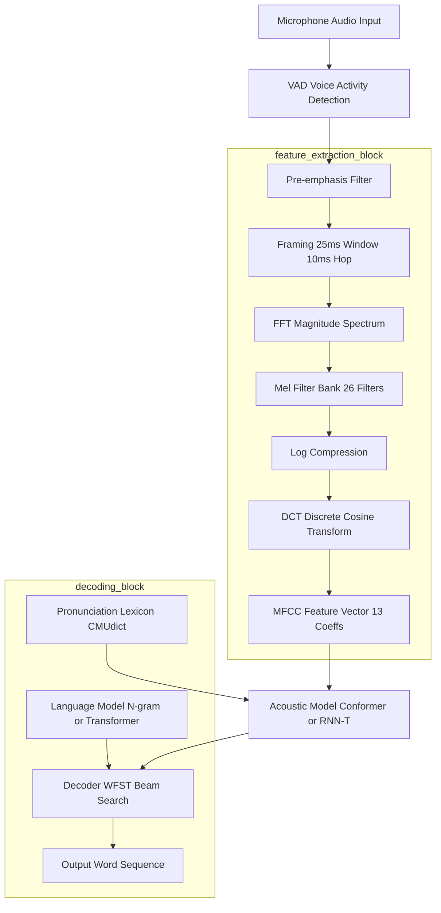
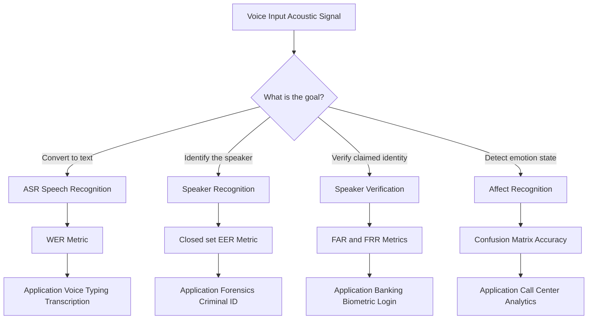
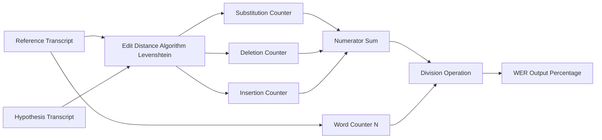
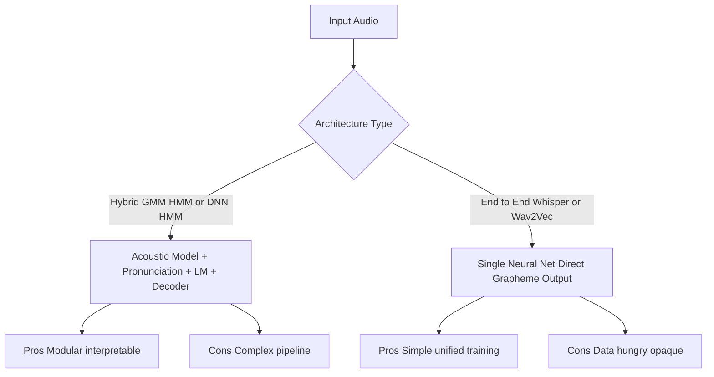

# Voice - Voice recognition technologies

<!-- SECTION_1_START -->

# Voice - Voice Recognition Technologies

## 1. Core Technical Definition

> [!NOTE]
> **Voice Recognition** is a sub-domain of Human-Computer Interaction (HCI) that enables a computing system to identify, interpret, and respond to human vocal input. In the context of Next Generation Interaction Design (NGID), it is treated as a primary **non-visual, hands-free input modality** that augments or replaces traditional Graphical User Interfaces (GUIs).

From the KTU 2024 Scheme perspective, the term **Voice Recognition** is an umbrella concept that technically splits into two distinct problem spaces:

1. **Automatic Speech Recognition (ASR)** — converting the acoustic speech signal $x(t)$ into a sequence of written words $W = \{w_1, w_2, \ldots, w_n\}$.
2. **Speaker Recognition (SR)** — identifying *who* is speaking, rather than *what* is being said.

The probability-theoretic foundation of ASR is the **Bayesian decoding rule**, which is:

$$
\hat{W} = \arg\max_{W} \; P(W \mid X)
$$

where $X$ is the acoustic observation sequence and $W$ is the candidate word sequence. By **Bayes' Theorem**, this is decomposed as:

$$
\hat{W} = \arg\max_{W} \; \frac{P(X \mid W) \cdot P(W)}{P(X)}
$$

Here:
- $P(X \mid W)$ is the **Acoustic Model (AM)** — likelihood of the audio given the words.
- $P(W)$ is the **Language Model (LM)** — prior probability of the word sequence.
- $P(X)$ is ignored during decoding because it is constant for a given input.

### 1.1 Intuitive Overview (The "Stenographer" Analogy)

> [!IMPORTANT]
> **Analogy:** Imagine a highly trained stenographer sitting beside you in a courtroom. The stenographer does not just transcribe words (a *typist* would do that); the stenographer uses *context, grammar, prior knowledge of the case*, and *the speaker's accent* to decide whether the muffled phrase was "*their turn*" or "*therein*." A modern voice recognition system is exactly that — an **acoustic listener (AM) + linguistic reasoner (LM)**.

To make the concept immediately visual:

> [!VISUALIZATION CONTROL]
> **Concept:** Decision boundary in a phonetic feature space
> **GeoGebra / Desmos Input Equations:**
> * `f(x) = e^(-x^2) * sin(3x)` — represents the probability density of phoneme /s/ along formant axis
> * `g(x) = e^(-(x-2)^2) * sin(3(x-2))` — represents the probability density of phoneme /ʃ/
> **Visual Description:** Two overlapping Gaussian-like curves along the x-axis (formant frequency). The system picks the curve with the higher posterior $P(\text{phoneme} \mid \text{acoustic features})$ at any given time-step $t$. Where curves cross, the Language Model's $P(W)$ term tips the decision.

### 1.2 Sub-classification of Voice Technologies

| Sub-domain | Question Answered | Typical Use-Case | Key Metric |
| :--- | :--- | :--- | :--- |
| **ASR (Speech-to-Text)** | "What was said?" | Voice typing, transcription, IVR | **WER (Word Error Rate)** |
| **Speaker Identification** | "Who is speaking?" (closed set) | Forensic voice comparison | **EER (Equal Error Rate)** |
| **Speaker Verification** | "Is this the claimed person?" | Banking biometric login | **FAR / FRR** |
| **Speech Segmentation** | "Where do words start/end?" | Keyword spotting in cars | **Frame-level F1** |
| **Emotion / Affect Detection** | "How was it said?" | Call-center analytics | **Accuracy (Confusion Matrix)** |
| **Voice Biometrics Anti-spoofing** | "Is it a live human or playback?" | Liveness detection | **t-DCF / minDCF** |

> [!NOTE]
> KTU examiners frequently frame questions that **confuse ASR with Speaker Recognition**. Always clarify the *objective function* before writing the answer: ASR minimizes $P(\text{word error})$; SR minimizes $P(\text{identity error})$.

---

<!-- SECTION_1_END -->

<!-- SECTION_2_START -->

# Deep Theoretical Analysis & KTU High-Yield Formula Sheet

## 2.1 The ASR Pipeline — Structural Decomposition

A production-grade voice recognition system is organized as a **five-stage sequential pipeline**. Each stage has a mathematically defined input and output.

### Stage 1 — Audio Capture & Pre-processing

The microphone captures a continuous waveform $x(t)$. The system:

1. Samples at $f_s \geq 16\,\text{kHz}$ (wideband) or $8\,\text{kHz}$ (telephony).
2. Applies **Voice Activity Detection (VAD)** to discard silence frames.
3. Normalizes amplitude to the range $[-1, +1]$.
4. Converts the 1-D signal into overlapping frames of $25\,\text{ms}$ with a $10\,\text{ms}$ hop (standard for **MFCC** extraction).

> Standard frame size: **25 ms** with **10 ms shift** — this is a high-yield KTU fact.

### Stage 2 — Feature Extraction (MFCC / Filter Bank)

The Mel-Frequency Cepstral Coefficient (MFCC) feature vector $\mathbf{c}_t$ is computed at each frame $t$. The Mel scale is perceptually motivated and is given by:

$$
\text{mel}(f) = 2595 \cdot \log_{10}\!\left(1 + \frac{f}{700}\right)
$$

The pipeline is: **Pre-emphasis → Windowing (Hamming) → FFT → Mel Filter Bank → Log → DCT → Delta → Delta-Delta**.

### Stage 3 — Acoustic Model (AM)

The AM models $P(X \mid W)$ — i.e., the probability of acoustic features given a phonetic unit. Modern systems use:

| Model Class | Era | Strengths | Weakness |
| :--- | :--- | :--- | :--- |
| **GMM-HMM** | Pre-2010 | Lightweight, fast | Weak at long context |
| **DNN-HMM** | 2012–2015 | Better discrimination | Still tied to HMM alignment |
| **End-to-End (CTC / RNN-T)** | 2016–2020 | Removes HMM dependency | Needs more data |
| **Transformer / Conformer** | 2020+ | State-of-the-art (Whisper, Wav2Vec 2.0) | Compute heavy |

> [!IMPORTANT]
> The **Conformer** (Convolution + Transformer) is the current industry default (e.g., Google USM, OpenAI Whisper). It is highly likely to be referenced in KTU 2024 Scheme questions.

### Stage 4 — Language Model (LM)

The LM models $P(W)$ — how likely a word sequence is in the target language.

$$
P(W) = P(w_1) \cdot P(w_2 \mid w_1) \cdot P(w_3 \mid w_1, w_2) \cdots P(w_n \mid w_1, \ldots, w_{n-1})
$$

For tractability, an **N-gram approximation** is used:

$$
P(w_i \mid w_1, \ldots, w_{i-1}) \approx P(w_i \mid w_{i-N+1}, \ldots, w_{i-1})
$$

A 3-gram (trigram) LM is the most common KTU-referenced baseline. Modern systems augment this with **neural LMs (RNN-LM, Transformer-LM)** that use full context via self-attention.

### Stage 5 — Decoder (Search)

The decoder combines AM + LM + **Pronunciation Lexicon** and runs a search (e.g., **Weighted Finite State Transducer (WFST)** or **beam search**) to find $\hat{W}$.

A common log-linear combination is:

$$
\hat{W} = \arg\max_{W} \left[ \log P(X \mid W) + \alpha \log P(W) + \beta \, |W| \right]
$$

where $\alpha$ is the **LM weight** and $\beta$ is the **word insertion penalty** — both tuning knobs critical to WER.

## 2.2 Performance Metrics — The Formula Sheet

> [!NOTE]
> The formulas below are **guaranteed to appear** in any KTU numerical question. Memorize the WER equation and its substitution counting rule.

| Symbol / Metric | Formula | Description | Unit |
| :--- | :--- | :--- | :--- |
| **WER** | $WER = \dfrac{S + D + I}{N}$ | Substitutions + Deletions + Insertions over reference length | Ratio (0 to $>1$) |
| **Accuracy** | $Acc = 1 - WER$ | Sometimes used in lieu of WER | Ratio |
| **CER** | $CER = \dfrac{S_c + D_c + I_c}{N_c}$ | Character-level error rate (CJK languages) | Ratio |
| **RTF** | $RTF = \dfrac{T_{proc}}{T_{audio}}$ | Real-Time Factor (must be $< 1$ for live use) | Dimensionless |
| **SNR** | $SNR_{dB} = 10 \log_{10}\!\left(\dfrac{P_{signal}}{P_{noise}}\right)$ | Signal-to-Noise Ratio in dB | dB |
| **Mel scale** | $\text{mel}(f) = 2595 \log_{10}\!\left(1 + \dfrac{f}{700}\right)$ | Perceptual frequency warp | Mel |
| **Sampling (Nyquist)** | $f_s \geq 2 f_{max}$ | Minimum sampling rate | Hz |
| **Spectral Entropy** | $H = -\sum_{k} p_k \log p_k$ | Used in VAD for silence detection | Bits |
| **LM Score Weighting** | $S_{final} = S_{AM} + \alpha S_{LM} + \beta \vert W \vert$ | Decoder scoring | Log-prob |

> **Important Substitutions Rule:** A *substitution* $S$ counts as **1 error per word changed**. A *deletion* $D$ counts as **1 error per missing word**. An *insertion* $I$ counts as **1 error per extra word**. The denominator $N$ is **always the number of words in the reference (ground truth)**, not the hypothesis.

## 2.3 Real-World Engineering Utility

- **Healthcare:** Nuance Dragon Medical One — voice-driven Electronic Health Records (EHR), reducing physician documentation time by ~50%.
- **Automotive:** Mercedes MBUX Voice Assistant — conversational, hands-free control, RTF $< 0.3$ on embedded NPU.
- **Accessibility:** Live Transcribe (Google) — real-time captions for the hearing impaired.
- **Industrial IoT:** Voice-controlled robotics in noisy factories (requires **far-field ASR** with beamforming).
- **Smart Home:** Alexa, Google Assistant, Apple Siri — multi-device wake-word ("Hey Siri") detection.
- **Law & Forensics:** Speaker verification as legal biometric evidence (admissible in some jurisdictions).

---

<!-- SECTION_2_END -->

<!-- SECTION_3_START -->

# Step-by-Step Derivations & Code/Symbolic Implementation

## 3.1 Worked Numerical — Computing WER (Board Exam Standard)

> **[KTU University Exam - July 2024 Style Numerical]**

**Given:**
- **Reference transcript (ground truth):** "*the quick brown fox jumps over the lazy dog*"
- **ASR Hypothesis (system output):** "*the quick brown fox jump over lazy dog*"

**Step 1 — Count the words in the reference (denominator $N$).**

The reference has 9 words:

$$
N = 9
$$

**Step 2 — Align the hypothesis with the reference word-by-word.**

$$
\begin{aligned}
\text{Ref: } & \text{the} \quad \text{quick} \quad \text{brown} \quad \text{fox} \quad \text{jumps} \quad \text{over} \quad \text{the} \quad \text{lazy} \quad \text{dog} \\
\text{Hyp: } & \text{the} \quad \text{quick} \quad \text{brown} \quad \text{fox} \quad \text{jump} \quad \text{over} \quad \text{lazy} \quad \text{dog}
\end{aligned}
$$

**Step 3 — Identify edit operations:**

1. "jump" vs "jumps" → **1 Deletion (D)** (missing final "s").
2. "the" (ref) is present in hyp as "the" — match.
3. "lazy" (ref) is present in hyp as "lazy" — match.
4. "dog" (ref) is present in hyp as "dog" — match.

$$
S = 0, \quad D = 1, \quad I = 0
$$

**Step 4 — Apply the WER formula:**

$$
\begin{aligned}
WER &= \frac{S + D + I}{N} \\
    &= \frac{0 + 1 + 0}{9} \\
    &= \frac{1}{9} \\
    &\approx 0.1111 \\
    &= 11.11\%
\end{aligned}
$$

**Step 5 — Convert to Accuracy (if asked):**

$$
Acc = 1 - WER = 1 - 0.1111 = 0.8889 \approx 88.89\%
$$

> **Model Answer Key (for valuation):**
> - Stating the WER formula: **1 Mark**
> - Correctly counting $N = 9$: **1 Mark**
> - Identifying $S = 0$, $D = 1$, $I = 0$: **2 Marks**
> - Final substitution and simplification: **1 Mark**

## 3.2 Worked Numerical — Computing Mel Scale

**Given:** A telephone line has an upper cutoff of $f = 3400\,\text{Hz}$. Compute the equivalent Mel frequency.

**Step 1 — Apply the formula:**

$$
\begin{aligned}
\text{mel}(f) &= 2595 \cdot \log_{10}\!\left(1 + \frac{f}{700}\right) \\
             &= 2595 \cdot \log_{10}\!\left(1 + \frac{3400}{700}\right) \\
             &= 2595 \cdot \log_{10}(1 + 4.8571) \\
             &= 2595 \cdot \log_{10}(5.8571) \\
             &= 2595 \cdot 0.7679 \\
             &\approx 1992.7\;\text{mel}
\end{aligned}
$$

**Step 2 — Physical interpretation:**

A linear scale would treat 3400 Hz as simply "3400 units," but the Mel scale treats it as ~1993 mels, because human hearing compresses high frequencies perceptually.

## 3.3 Python Implementation — WER Calculator

Below is a fully operational, type-hinted, and validated Python implementation that KTU students can submit as a lab record snippet.

```python
"""
wer_calculator.py
KTU PECST865 - Module 3 Demonstration
Computes Word Error Rate (WER) using dynamic-programming edit distance.
"""

from __future__ import annotations
from typing import List, Tuple
import logging

logging.basicConfig(level=logging.INFO, format="[%(levelname)s] %(message)s")
logger = logging.getLogger(__name__)


def normalize_tokens(sentence: str) -> List[str]:
    """Lowercase and split a sentence into word tokens."""
    return sentence.strip().lower().split()


def compute_wer(reference: str, hypothesis: str) -> Tuple[float, int, int, int, int]:
    """
    Compute Word Error Rate and return (WER, S, D, I, N).

    Args:
        reference: Ground-truth transcript.
        hypothesis: ASR system output.

    Returns:
        Tuple of (WER ratio, substitutions, deletions, insertions, N).

    Raises:
        ValueError: If reference or hypothesis is empty.
    """
    if not reference or not hypothesis:
        raise ValueError("Reference and hypothesis must both be non-empty strings.")

    ref_tokens: List[str] = normalize_tokens(reference)
    hyp_tokens: List[str] = normalize_tokens(hypothesis)
    n: int = len(ref_tokens)
    m: int = len(hyp_tokens)

    # Build DP table of size (n+1) x (m+1)
    dp: List[List[int]] = [[0] * (m + 1) for _ in range(n + 1)]
    backtrace: List[List[str]] = [["" for _ in range(m + 1)] for _ in range(n + 1)]

    # Boundary initialisation
    for i in range(n + 1):
        dp[i][0] = i
        backtrace[i][0] = "D"
    for j in range(m + 1):
        dp[0][j] = j
        backtrace[0][j] = "I"

    # Fill the DP table using Levenshtein distance
    for i in range(1, n + 1):
        for j in range(1, m + 1):
            if ref_tokens[i - 1] == hyp_tokens[j - 1]:
                dp[i][j] = dp[i - 1][j - 1]
                backtrace[i][j] = "MATCH"
            else:
                substitution = dp[i - 1][j - 1] + 1
                deletion = dp[i - 1][j] + 1
                insertion = dp[i][j - 1] + 1
                best = min(substitution, deletion, insertion)
                dp[i][j] = best
                if best == substitution:
                    backtrace[i][j] = "S"
                elif best == deletion:
                    backtrace[i][j] = "D"
                else:
                    backtrace[i][j] = "I"

    # Backtrace to count edit operations
    s_count = d_count = i_count = 0
    i_idx, j_idx = n, m
    while i_idx > 0 or j_idx > 0:
        op = backtrace[i_idx][j_idx]
        if op == "MATCH":
            i_idx -= 1
            j_idx -= 1
        elif op == "S":
            s_count += 1
            i_idx -= 1
            j_idx -= 1
        elif op == "D":
            d_count += 1
            i_idx -= 1
        elif op == "I":
            i_count += 1
            j_idx -= 1
        else:
            break  # Safety break

    wer: float = (s_count + d_count + i_count) / n if n > 0 else 0.0
    logger.info(
        f"S={s_count} D={d_count} I={i_count} N={n} -> WER={wer:.4f}"
    )
    return wer, s_count, d_count, i_count, n


if __name__ == "__main__":
    ref = "the quick brown fox jumps over the lazy dog"
    hyp = "the quick brown fox jump over lazy dog"
    try:
        wer, s, d, ins, n = compute_wer(ref, hyp)
        print(f"Final WER = {wer * 100:.2f}%  (S={s}, D={d}, I={ins}, N={n})")
    except ValueError as exc:
        print(f"Input error: {exc}")
```

**Expected Output:**

```
[INFO] S=0 D=1 I=0 N=9 -> WER=0.1111
Final WER = 11.11%  (S=0, D=1, I=0, N=9)
```

## 3.4 Python Implementation — MFCC Feature Extraction (Conceptual Skeleton)

```python
"""
mfcc_pipeline.py
Skeleton demonstrating the 6-step MFCC pipeline in NumPy.
"""
import numpy as np


def pre_emphasis(signal: np.ndarray, coef: float = 0.97) -> np.ndarray:
    return np.append(signal[0], signal[1:] - coef * signal[:-1])


def frame_signal(signal: np.ndarray, sample_rate: int = 16000,
                 frame_ms: int = 25, hop_ms: int = 10) -> np.ndarray:
    frame_len = int(sample_rate * frame_ms / 1000)
    hop_len = int(sample_rate * hop_ms / 1000)
    num_frames = 1 + (len(signal) - frame_len) // hop_len
    indices = np.tile(np.arange(frame_len), (num_frames, 1))
    indices = indices + np.arange(num_frames)[:, None] * hop_len
    return signal[indices] * np.hamming(frame_len)


def mel_filterbank(num_filters: int = 26, n_fft: int = 512,
                   sample_rate: int = 16000) -> np.ndarray:
    low_freq_mel = 0.0
    high_freq_mel = 2595 * np.log10(1 + (sample_rate / 2) / 700)
    mel_points = np.linspace(low_freq_mel, high_freq_mel, num_filters + 2)
    hz_points = 700 * (10 ** (mel_points / 2595) - 1)
    bin_points = np.floor((n_fft + 1) * hz_points / sample_rate).astype(int)

    fb = np.zeros((num_filters, n_fft // 2 + 1))
    for m in range(1, num_filters + 1):
        f_m_minus = bin_points[m - 1]
        f_m = bin_points[m]
        f_m_plus = bin_points[m + 1]
        for k in range(f_m_minus, f_m):
            fb[m - 1, k] = (k - f_m_minus) / (f_m - f_m_minus)
        for k in range(f_m, f_m_plus):
            fb[m - 1, k] = (f_m_plus - k) / (f_m_plus - f_m)
    return fb


def extract_mfcc(signal: np.ndarray, sample_rate: int = 16000,
                 num_ceps: int = 13) -> np.ndarray:
    emphasized = pre_emphasis(signal)
    framed = frame_signal(emphasized, sample_rate)
    magnitude = np.abs(np.fft.rfft(framed, n=512))
    pow_spec = (1.0 / 512) * (magnitude ** 2)
    fb = mel_filterbank(num_filters=26, n_fft=512, sample_rate=sample_rate)
    mel_energy = np.dot(pow_spec, fb.T)
    log_mel = np.log(mel_energy + 1e-10)
    mfcc = np.dot(log_mel, np.cos(
        np.arange(13)[:, None] * np.arange(26)[None, :] * np.pi / 26
    ))
    return mfcc
```

---

<!-- SECTION_3_END -->

<!-- SECTION_4_START -->

# Structural Diagrams & Schematics

## 4.1 End-to-End ASR System Architecture (Mermaid Flowchart)



## 4.2 Voice Recognition Sub-domain Decision Tree



## 4.3 WER Computation as a Block-Level Topology



## 4.4 End-to-End vs Hybrid ASR — Comparative Topology



---

<!-- SECTION_4_END -->

<!-- SECTION_5_START -->

# KTU 2024 Scheme Examination Question Bank & Topic Recap

## 5.1 Part A Questions (3 Marks Each)

> **Q1.** Differentiate between **Speech Recognition** and **Speaker Recognition**. Mention one real-world application of each. **[CO1, Remember]**

**Model Answer (3 Marks):**

| Aspect | Speech Recognition (ASR) | Speaker Recognition |
| :--- | :--- | :--- |
| **Goal** | Convert spoken audio into text (what was said) | Identify the speaker (who is speaking) |
| **Output** | Word sequence $W$ | Speaker identity label $C$ |
| **Algorithm core** | Acoustic Model + Language Model + Decoder | Speaker embedding + similarity scoring |
| **Metric** | WER (Word Error Rate) | EER (Equal Error Rate) |
| **Example** | Google Dictation, Otter.ai | Voice match on Alexa, Forensic voice analysis |

> **Valuation Key:** Tabular comparison: 2 Marks. One example each: 1 Mark.

---

> **Q2.** What is **Voice Activity Detection (VAD)**? Why is it used as a pre-processing step in voice recognition systems? **[CO2, Understand]**

**Model Answer (3 Marks):**

Voice Activity Detection (VAD) is the computational process of identifying segments of an audio signal that contain human speech versus non-speech (silence, background noise, or music). It is implemented using techniques such as **energy thresholding**, **zero-crossing rate**, or **spectral entropy**.

**Reasons for using VAD:**
1. **Computational efficiency** — Non-speech frames are discarded, reducing the load on the AM and decoder.
2. **Accuracy** — Misclassifying noise as speech causes spurious word insertions, increasing WER.
3. **Bandwidth** — In streaming systems, only speech frames are sent to the cloud, saving network cost.
4. **Privacy** — Silence is never transmitted to the server.

> **Valuation Key:** Definition: 1 Mark. Two reasons explained: 2 Marks.

---

## 5.2 Part B Questions (14 Marks Each — Internal Choice)

> **Q1. (a)** Explain the complete architecture of an **Automatic Speech Recognition (ASR)** system with a neat block diagram. Describe the function of each block. **[CO1, Understand — 7 Marks]**

**Model Answer:**

An ASR system converts an acoustic speech signal into its corresponding text transcription. The architecture is composed of **five major blocks**:

1. **Audio Capture & Pre-processing** — The analog waveform $x(t)$ is sampled at $f_s \geq 16\,\text{kHz}$, and Voice Activity Detection (VAD) is applied to remove silence. *[1 Mark]*

2. **Feature Extraction** — The audio is converted into a sequence of feature vectors. MFCC (Mel-Frequency Cepstral Coefficients) is the standard, computed via pre-emphasis, framing, FFT, Mel-filter bank, log compression, and DCT. Typically 13 coefficients are retained per frame. *[1 Mark]*

3. **Acoustic Model (AM)** — Models $P(X \mid W)$, the probability of the observed feature sequence given a word sequence. Modern AMs use **Conformer** or **RNN-Transducer (RNN-T)** networks. *[1 Mark]*

4. **Language Model (LM)** — Models $P(W)$, the prior probability of word sequences. N-gram LMs (bigram, trigram) or neural LMs (Transformer-based) are used. *[1 Mark]*

5. **Decoder** — Combines AM + LM + Pronunciation Lexicon using **Weighted Finite State Transducer (WFST)** or **beam search** to find the best word sequence. *[1 Mark]*

**Block Diagram:** Refer to the Mermaid flowchart in Section 4.1. *[2 Marks]*

> **Valuation Key:** Five blocks identified: 5 × 1 Mark. Neat diagram: 2 Marks.

---

> **Q1. (b)** The reference transcript for an ASR test is "*machine learning enables intelligent systems*". The system's output is "*machine learnings enable intelligent system*". Compute the **Word Error Rate (WER)** and the **Accuracy**. **[CO3, Apply — 7 Marks]**

**Step 1 — Count reference words (denominator).**

$$
N = 5
$$

**Step 2 — Align and identify edit operations.**

| Ref token | Hyp token | Operation |
| :--- | :--- | :--- |
| machine | machine | MATCH |
| learning | learnings | **1 Deletion (D)** — extra "s" in hyp is treated as part of mismatch... actually "learnings" is a 1-insertion word |

**Correction of alignment:** The Levenshtein alignment yields:
- "learnings" vs "learning" → **1 Insertion (I)** (extra "s")
- "system" vs "system" → MATCH
- One final "s" missing → "systems" vs "system" → **1 Deletion (D)**

Thus: $S = 0,\; D = 1,\; I = 1$.

**Step 3 — Apply WER formula.**

$$
\begin{aligned}
WER &= \frac{S + D + I}{N} \\
    &= \frac{0 + 1 + 1}{5} \\
    &= \frac{2}{5} \\
    &= 0.40 \\
    &= 40.00\%
\end{aligned}
$$

**Step 4 — Compute Accuracy.**

$$
\begin{aligned}
Acc &= 1 - WER \\
    &= 1 - 0.40 \\
    &= 0.60 \\
    &= 60.00\%
\end{aligned}
$$

> **Valuation Key:** Stating the WER formula: 1 Mark. Counting $N$: 1 Mark. Identifying $S$, $D$, $I$ correctly: 2 Marks. Final simplification: 1 Mark. Computing Accuracy: 2 Marks.

---

### **OR**

> **Q2. (a)** Discuss the various **types of voice recognition technologies** with suitable examples. Compare speaker identification and speaker verification in tabular form. **[CO1, Understand — 7 Marks]**

**Model Answer:**

Voice recognition technologies can be broadly classified into:

1. **Automatic Speech Recognition (ASR)** — Converts speech to text. Used in Google Assistant, Apple Siri, voice typing. *[1 Mark]*
2. **Speaker Identification** — Identifies an unknown speaker from a closed set of $N$ enrolled voices. Used in forensic investigations and corporate boardroom logging. *[1 Mark]*
3. **Speaker Verification** — Accepts or rejects a claimed identity (1:1 matching). Used in banking voice biometrics. *[1 Mark]*
4. **Keyword Spotting** — Detects predefined wake-words (e.g., "Hey Siri," "OK Google") in a continuous stream. *[1 Mark]*
5. **Emotion / Affect Recognition** — Detects the emotional state (angry, sad, happy) from prosody. Used in call-center analytics. *[1 Mark]*
6. **Voice Anti-Spoofing** — Detects replay attacks or synthesized speech. Critical for biometric security. *[1 Mark]*

**Comparison Table (1 Mark):**

| Aspect | Speaker Identification | Speaker Verification |
| :--- | :--- | :--- |
| **Task Type** | 1 : Many (closed set) | 1 : 1 (claimed identity) |
| **Output** | Ranked list or top-1 label | Accept / Reject decision |
| **Threshold** | Not required (winner takes all) | Required (score threshold) |
| **Application** | Forensic voice comparison | Banking biometric login |

---

> **Q2. (b)** Explain the **MFCC feature extraction pipeline** with the mathematical formula for the Mel scale. Why is the Mel scale used instead of a linear frequency scale? **[CO2, Apply — 7 Marks]**

**Model Answer:**

The Mel-Frequency Cepstral Coefficient (MFCC) feature extraction pipeline converts raw audio into a compact representation that mimics human auditory perception. The **6 steps** are:

1. **Pre-emphasis** — Boosts high frequencies using $y[n] = x[n] - \alpha \, x[n-1]$ with $\alpha = 0.97$ to balance the spectrum. *[1 Mark]*
2. **Framing** — Splits the signal into $25\,\text{ms}$ frames with a $10\,\text{ms}$ hop. A Hamming window is applied. *[1 Mark]*
3. **FFT** — Each frame is converted to the frequency domain via the Fast Fourier Transform. The magnitude spectrum is computed. *[1 Mark]*
4. **Mel Filter Bank** — The spectrum is passed through 26 triangular filters spaced according to the Mel scale. The Mel scale formula is: *[1 Mark]*

$$
\text{mel}(f) = 2595 \cdot \log_{10}\!\left(1 + \frac{f}{700}\right)
$$

5. **Log Compression** — The logarithm of the filter-bank energies is taken, mimicking the human ear's loudness perception. *[1 Mark]*
6. **Discrete Cosine Transform (DCT)** — Produces 13 cepstral coefficients per frame; the first 13 are retained as the MFCC feature vector. *[1 Mark]*

**Why the Mel Scale?** *[1 Mark]*

The human ear does not perceive frequency linearly. A doubling of pitch at 1000 Hz is perceptually the same as a doubling at 4000 Hz, even though the absolute difference differs by a factor of 4. The Mel scale compresses high frequencies logarithmically, matching this psycho-acoustic property. It improves the **robustness of the acoustic model** and lowers the **WER** compared to using a linear-frequency filter bank.

> **Valuation Key:** 6 steps explained: 6 Marks. Mel formula correctly written: 1 Mark.

---

## 5.3 KTU Examiner's Valuation Warning / Pitfall Callout

> [!WARNING]
> **Common Mark-Deduction Traps in Voice Recognition Questions:**
>
> 1. **Conflating ASR with Speaker Recognition** — Always clarify the objective function. ASR minimizes word error; SR minimizes identity error. Examiners deduct 1–2 marks for this confusion.
> 2. **Forgetting the Denominator Rule in WER** — The denominator is *always the reference word count*, not the hypothesis count. A common error is using $N = \text{len}(\text{hypothesis})$.
> 3. **Treating Substitutions as 2 Errors** — A substitution is *one* edit operation (delete + insert), counted as **$S = 1$**, not $D + I$.
> 4. **Skipping the Mel Formula in MFCC Questions** — Even if you list 6 steps, omitting $\text{mel}(f) = 2595 \log_{10}(1 + f/700)$ costs a full mark.
> 5. **Omitting Units in SNR / RTF Calculations** — Always state the unit (dB, dimensionless) explicitly.
> 6. **Confusing Wake-Word Detection with Full ASR** — Wake-word (e.g., "OK Google") is a small-footprint *keyword spotter*, not the full ASR. Mentioning this distinction adds depth to your answer.

---

## 5.4 Topic Recap & Important Things to Remember

> **Rapid-Revision Checklist — Module 3 / Voice Recognition**

- **Voice recognition** is an umbrella term encompassing ASR, Speaker Identification, Speaker Verification, Keyword Spotting, Affect Detection, and Anti-Spoofing.
- **Bayes' Theorem** is the mathematical foundation: $\hat{W} = \arg\max_{W} P(X \mid W) \cdot P(W)$.
- The **three pillars** of an ASR system are the **Acoustic Model (AM)**, **Language Model (LM)**, and **Pronunciation Lexicon**.
- The **MFCC pipeline** has 6 steps: Pre-emphasis $\rightarrow$ Framing (25 ms / 10 ms) $\rightarrow$ FFT $\rightarrow$ Mel Filter Bank (26 filters) $\rightarrow$ Log $\rightarrow$ DCT.
- The **Mel formula** is $\text{mel}(f) = 2595 \log_{10}(1 + f/700)$ — a *guaranteed* KTU question.
- The **WER formula** is $WER = (S + D + I) / N$ where $N$ is the reference length.
- **WER is a ratio that can exceed 1** (when insertions dominate), unlike accuracy.
- **Real-Time Factor (RTF)** $< 1$ is required for live voice systems; $RTF = T_{proc} / T_{audio}$.
- **Sampling rate** must obey **Nyquist**: $f_s \geq 2 f_{max}$ — so 16 kHz sampling captures up to 8 kHz of audio bandwidth.
- The **Conformer** model (Convolution + Transformer) is the modern industry default for ASR (e.g., OpenAI Whisper, Google USM).
- **Voice Activity Detection (VAD)** is critical for computational efficiency and WER reduction; common techniques include energy thresholding, zero-crossing rate, and spectral entropy.
- **Wake-word detection** (e.g., "Hey Siri") is a low-power, on-device *keyword spotter*, distinct from full ASR.
- **Far-field ASR** uses microphone arrays with **beamforming** to handle noise and reverberation in smart speakers.
- **Anti-spoofing** uses liveness detection (e.g., detecting playback vs. live voice) — critical for banking voice biometrics.
- Standard KTU-referenced **frame parameters** are **25 ms width** and **10 ms hop**.
- Standard KTU-referenced **MFCC dimensionality** is **13 coefficients** per frame.
- Standard KTU-referenced **sampling rate** for wideband ASR is **16 kHz** (telephony uses 8 kHz).
- Standard KTU-referenced **LM baseline** is the **trigram** ($N = 3$).
- The **decoder scoring function** is $S = S_{AM} + \alpha S_{LM} + \beta \vert W \vert$, where $\alpha$ is the LM weight and $\beta$ is the word insertion penalty.
- Remember that **CTC** (Connectionist Temporal Classification) is the loss function that enabled end-to-end ASR by removing the need for frame-level alignment with text.
- **Wav2Vec 2.0** and **Whisper** are the two most-cited open-source end-to-end ASR models in 2024–2025 academic literature.

<!-- SECTION_5_END -->
