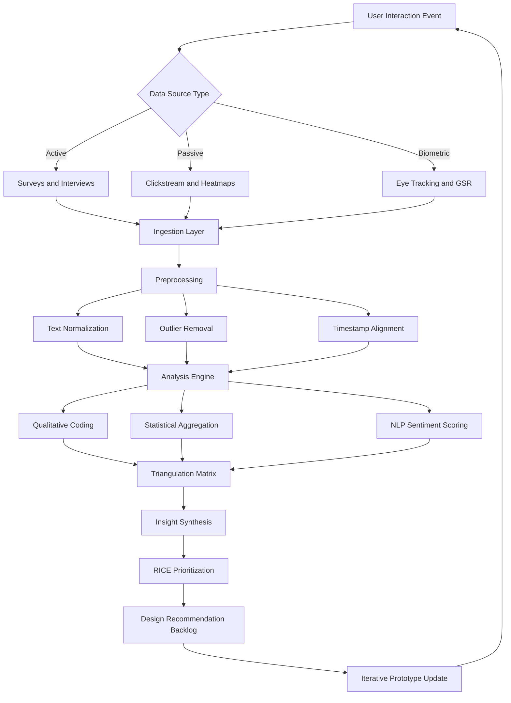
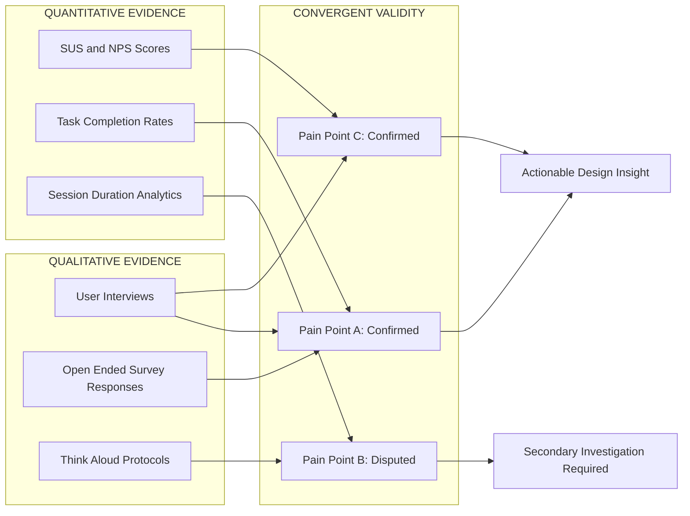
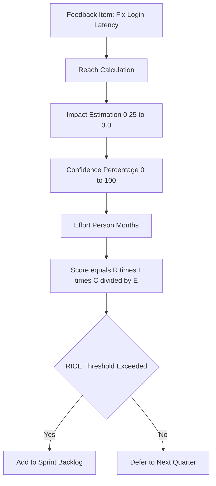
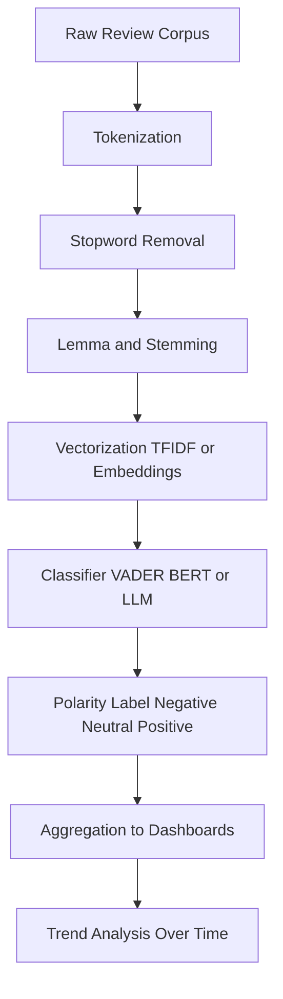

# Analyzing user feedback

<!-- SECTION_1_START -->
# 1. Core Technical Definition & Intuitive Overview

## Formal Academic Definition
**User Feedback Analysis** in the context of Next Generation Interaction Design (NGID) is the systematic and rigorous process of collecting, processing, categorizing, and interpreting qualitative and quantitative responses obtained from end-users regarding their interaction experiences with a digital product, system, or interface. It is a critical phase of the **User-Centered Design (UCD)** lifecycle and a cornerstone of the **Double Diamond** model's "Develop" and "Deliver" phases.

In KTU 2024 Scheme terminology, user feedback analysis is positioned as an **implementation-evaluation** activity, where raw user signals are transformed into **actionable design insights (ADIs)** that inform iterative prototyping, A/B testing refinements, and post-deployment optimization loops.

> [!IMPORTANT]
> **KTU Syllabus Highlight (PECST865 / M4):** User feedback analysis bridges the gap between *empirical usability data* (what users actually do) and *attitudinal data* (what users say they prefer). Mastering both dimensions is mandatory for full marks in Module 4.

## Conceptual Analogy / Intuition
Think of user feedback analysis like a **doctor diagnosing a patient**. A patient (the user) walks into a clinic (the product) feeling some discomfort (usability issues, confusion, or delight). The doctor (the designer/researcher) doesn't just rely on the patient's verbal complaint ("My head hurts")—the doctor also runs blood tests, takes X-rays, and measures vital signs (analytics, heatmaps, click-stream data). Only by combining the **subjective narrative** (qualitative feedback) with the **objective metrics** (quantitative feedback) can the doctor prescribe the right medicine (redesign or feature improvement).

If the doctor only listens to words, they might miss a hidden fracture. If they only look at X-rays, they might miss the emotional anxiety causing the pain. **Comprehensive feedback analysis does both.**

## Key Terminology Snapshot
- **Affective Feedback**: Emotional responses (e.g., joy, frustration, trust).
- **Behavioral Feedback**: Actions users take, often captured passively (e.g., clicks, scrolls, dwell time).
- **Cognitive Feedback**: Mental-model alignment (e.g., perceived usefulness, learnability).
- **Net Promoter Score (NPS)**: A widely-used loyalty metric ranging from **-100 to +100**.
- **System Usability Scale (SUS)**: A standardized 10-item Likert questionnaire yielding a score from **0 to 100**.
- **Sentiment Polarity**: A normalized value typically in the range **[-1, +1]**.

> [!NOTE]
> **Core Definition Callout:** User feedback analysis is NOT merely "reading reviews." It is a **structured, repeatable, and statistically validatable** engineering discipline that converts raw human signals into measurable design decisions.

> [!VISUALIZATION CONTROL]
> **Concept:** Sentiment Polarity Distribution on a Number Line
> **GeoGebra / Desmos Input Equations:**
> * `x = -1` (Most Negative)
> * `x = 0` (Neutral)
> * `x = 1` (Most Positive)
> * Plot points: `(-0.8, 1), (-0.2, 3), (0.1, 5), (0.4, 4), (0.9, 2)` representing feedback clusters
> **Visual Description:** Students should observe a bell-shaped frequency distribution centered near **0 (neutral)**, with extreme negative and positive tails. This represents the typical user sentiment distribution after deploying an interactive prototype.
<!-- SECTION_1_END -->

<!-- SECTION_2_START -->
# 2. Deep Theoretical Analysis & KTU High-Yield Formula Sheet

## The Three-Stage Feedback Analysis Pipeline

The analysis of user feedback in NGID follows a three-stage pipeline that mirrors data-engineering ETL (Extract, Transform, Load) processes:

### Stage 1: Data Collection (Extract)
- **Active Collection Methods:** Surveys, interviews, focus groups, moderated usability tests, card-sorting exercises.
- **Passive Collection Methods:** Click-stream analytics, session recordings, heatmaps, eye-tracking logs, biometric sensors (GSR, EEG in next-gen contexts).
- **Hybrid Methods:** Experience Sampling Method (ESM), where users are prompted at random intervals during real use.

### Stage 2: Data Processing (Transform)
- **Qualitative Processing:** Coding, thematic clustering, affinity diagramming, grounded theory application.
- **Quantitative Processing:** Statistical aggregation, descriptive statistics, inferential testing, correlation analysis.
- **Mixed-Methods Triangulation:** Cross-validating qualitative themes with quantitative metrics to enhance validity.

### Stage 3: Insight Generation (Load)
- Prioritization using frameworks like the **RICE Score** (Reach, Impact, Confidence, Effort) or the **Kano Model** (Basic, Performance, Excitement features).
- Synthesis into **persona updates**, **journey-map revisions**, and **design-recommendation backlogs**.

## Why & How — The Logic Behind Each Step

| Step | Why It Matters | How It Works in Practice |
|------|----------------|--------------------------|
| Triangulation | Single-method bias | Combine at least 2 data sources (e.g., survey + analytics) |
| Coding | Raw text is unstructured | Tag utterances with labels (e.g., "navigation-pain") |
| Sentiment Scoring | Manual reading is slow | Apply NLP models (VADER, BERT, or LLM-based classifiers) |
| Statistical Validation | Avoid sampling noise | Use t-tests, chi-square, or Mann-Whitney U tests |
| Prioritization | Cannot fix everything | Rank issues by severity × frequency × business impact |

## KTU Formula Sheet / Cheat Sheet

> [!NOTE]
> **Critical Reminder:** All math symbols use `\vert` instead of `|` to preserve markdown table integrity.

| Formula / Metric | LaTeX Representation | Description / Engineering Use |
|------------------|----------------------|-------------------------------|
| **System Usability Scale (SUS)** | $SUS = 2.5 \times \sum_{i=1}^{10} (c_i - 1)$ for odd items; $SUS = 2.5 \times \sum_{i=1}^{10} (4 - c_i)$ for even items | Yields a score in $[0, 100]$. Industry benchmark: **> 68 = above average**. |
| **Net Promoter Score (NPS)** | $NPS = \%Promoters - \%Detractors$ | Range: $[-100, +100]$. Measures user loyalty. |
| **Task Completion Rate (TCR)** | $TCR = \dfrac{N_{completed}}{N_{attempted}} \times 100$ | Direct measure of interaction effectiveness. |
| **Average Error Rate (AER)** | $AER = \dfrac{1}{N} \sum_{i=1}^{N} E_i$ where $E_i$ is errors per user $i$ | Lower is better; key for form-heavy interfaces. |
| **Mean Opinion Score (MOS)** | $MOS = \dfrac{1}{N} \sum_{i=1}^{N} s_i$ where $s_i \in [1,5]$ | Used in voice/UX quality assessment. |
| **Sentiment Polarity (NLP)** | $p = \dfrac{P - N}{P + N + 0.001}$ | Avoids division-by-zero; $p \in [-1, 1]$. |
| **Inter-Rater Reliability** | $\kappa = \dfrac{p_o - p_e}{1 - p_e}$ (Cohen's Kappa) | Validates coding consistency across analysts. $\kappa > 0.7$ = strong agreement. |
| **RICE Score (Prioritization)** | $RICE = \dfrac{R \times I \times C}{E}$ | $R$=Reach, $I$=Impact, $C$=Confidence, $E$=Effort. |
| **Kano Satisfaction Coefficient** | $CS = \dfrac{A+O}{A+O+M+I}$ | Customer Satisfaction, $A$=Attractive, $O$=One-dimensional, $M$=Must-be, $I$=Indifferent. |

## Real-World Engineering Utility
- **Production UX Teams (Google, Airbnb, Microsoft):** Deploy continuous-feedback loops using A/B testing dashboards where SUS and NPS are tracked weekly.
- **Healthcare HCI:** Patient-facing apps must maintain SUS $\geq 80$ for FDA Human Factors compliance.
- **Automotive UX:** Driver-distraction metrics rely on MOS-weighted behavioral feedback to validate in-vehicle infotainment systems.
- **AR/VR Interfaces (Next-Gen):** Biometric feedback (eye-tracking, galvanic skin response) feeds ML classifiers in real time to detect cybersickness and dynamically adjust rendering.
<!-- SECTION_2_END -->

<!-- SECTION_3_START -->
# 3. Step-by-Step Derivations & Code/Symbolic Implementation

## A. Worked Example: Computing SUS for a Mobile Banking App

**Problem Statement:** A team of 10 users completed the SUS questionnaire for a mobile banking app. The raw scores (1–5 Likert) for each user across the 10 items are:

| User | Q1 | Q2 | Q3 | Q4 | Q5 | Q6 | Q7 | Q8 | Q9 | Q10 |
|------|----|----|----|----|----|----|----|----|----|----|
| U1 | 4 | 2 | 4 | 1 | 4 | 1 | 4 | 2 | 4 | 1 |
| U2 | 3 | 1 | 4 | 2 | 4 | 2 | 3 | 1 | 4 | 2 |
| U3 | 5 | 1 | 5 | 1 | 4 | 1 | 5 | 1 | 4 | 2 |
| U4 | 4 | 2 | 3 | 2 | 3 | 2 | 3 | 2 | 3 | 2 |
| U5 | 2 | 3 | 2 | 4 | 2 | 4 | 2 | 3 | 2 | 4 |
| U6 | 4 | 1 | 4 | 1 | 5 | 1 | 4 | 1 | 5 | 1 |
| U7 | 3 | 2 | 3 | 2 | 3 | 2 | 3 | 2 | 3 | 2 |
| U8 | 4 | 2 | 4 | 1 | 4 | 1 | 4 | 1 | 4 | 1 |
| U9 | 5 | 1 | 5 | 1 | 5 | 1 | 5 | 1 | 5 | 1 |
| U10 | 3 | 1 | 3 | 2 | 3 | 2 | 3 | 1 | 3 | 2 |

### Step-by-Step Mathematical Derivation

For **odd items (1, 3, 5, 7, 9):** contribution $= c_i - 1$
For **even items (2, 4, 6, 8, 10):** contribution $= 5 - c_i$

Taking **User 1 (U1)** as the detailed worked example:

$$
\begin{aligned}
\text{Odd contributions} &= (Q1-1) + (Q3-1) + (Q5-1) + (Q7-1) + (Q9-1) \\
&= (4-1) + (4-1) + (4-1) + (4-1) + (4-1) \\
&= 3 + 3 + 3 + 3 + 3 = 15 \\[4pt]
\text{Even contributions} &= (5-Q2) + (5-Q4) + (5-Q6) + (5-Q8) + (5-Q10) \\
&= (5-2) + (5-1) + (5-1) + (5-2) + (5-1) \\
&= 3 + 4 + 4 + 3 + 4 = 18 \\[4pt]
\text{Sum for U1} &= 15 + 18 = 33 \\[4pt]
\text{SUS}_{U1} &= 2.5 \times 33 = 82.5
\end{aligned}
$$

Following the identical procedure for all users, the per-user SUS scores are:

$$
\text{SUS} = \{82.5, \, 67.5, \, 92.5, \, 55.0, \, 35.0, \, 87.5, \, 50.0, \, 87.5, \, 97.5, \, 60.0\}
$$

The **average SUS score** for the mobile banking app:

$$
\begin{aligned}
\overline{SUS} &= \dfrac{1}{10} \sum_{i=1}^{10} SUS_i \\
&= \dfrac{82.5 + 67.5 + 92.5 + 55.0 + 35.0 + 87.5 + 50.0 + 87.5 + 97.5 + 60.0}{10} \\
&= \dfrac{715.0}{10} = 71.5
\end{aligned}
$$

> [!NOTE]
> **Interpretation:** A SUS of **71.5** is **above the industry benchmark of 68**, indicating acceptable—though not excellent—usability. U5 and U7 represent outlier pain-points requiring root-cause follow-up.

## B. Full Python Implementation (Type-Hinted, Boundary-Checked)

```python
from typing import List, Dict
import statistics
import logging

logging.basicConfig(level=logging.INFO, format="%(asctime)s | %(levelname)s | %(message)s")
logger = logging.getLogger(__name__)

def compute_sus(raw_responses: List[int]) -> float:
    """
    Compute the System Usability Scale (SUS) score for a single user.
    
    Args:
        raw_responses: List of 10 integers, each in [1, 5].
    
    Returns:
        SUS score in [0, 100].
    
    Raises:
        ValueError: If the list length is not exactly 10 or values are out of bounds.
    """
    if len(raw_responses) != 10:
        raise ValueError(f"SUS requires exactly 10 items, got {len(raw_responses)}.")
    if any(not (1 <= x <= 5) for x in raw_responses):
        raise ValueError("All SUS responses must be integers in the closed interval [1, 5].")
    
    odd_total: int = sum(raw_responses[i] - 1 for i in range(0, 10, 2))
    even_total: int = sum(5 - raw_responses[i] for i in range(1, 10, 2))
    sus_score: float = 2.5 * (odd_total + even_total)
    return sus_score


def compute_nps(responses: List[int]) -> float:
    """
    Compute the Net Promoter Score (NPS) from 0-10 Likert responses.
    
    Args:
        responses: List of integers in [0, 10].
    
    Returns:
        NPS value in [-100, +100].
    """
    if any(not (0 <= x <= 10) for x in responses):
        raise ValueError("NPS responses must be integers in [0, 10].")
    
    total: int = len(responses)
    if total == 0:
        raise ValueError("Cannot compute NPS for an empty response set.")
    
    promoters: int = sum(1 for x in responses if x >= 9)
    detractors: int = sum(1 for x in responses if x <= 6)
    
    nps: float = ((promoters - detractors) / total) * 100.0
    logger.info(f"Promoters={promoters}, Detractors={detractors}, Total={total}, NPS={nps:.2f}")
    return nps


def analyze_feedback(sus_matrix: List[List[int]], nps_responses: List[int]) -> Dict[str, float]:
    """
    Aggregate SUS scores and NPS from a cohort of users.
    
    Args:
        sus_matrix: List of 10-item response lists (one per user).
        nps_responses: List of 0-10 NPS responses.
    
    Returns:
        Dictionary with mean SUS, median SUS, stdev SUS, and NPS.
    """
    if not sus_matrix:
        raise ValueError("SUS matrix is empty.")
    
    sus_scores: List[float] = [compute_sus(row) for row in sus_matrix]
    
    summary: Dict[str, float] = {
        "mean_sus": statistics.mean(sus_scores),
        "median_sus": statistics.median(sus_scores),
        "stdev_sus": statistics.stdev(sus_scores) if len(sus_scores) > 1 else 0.0,
        "nps": compute_nps(nps_responses),
    }
    
    logger.info(f"Feedback analysis complete: {summary}")
    return summary


if __name__ == "__main__":
    sus_data: List[List[int]] = [
        [4, 2, 4, 1, 4, 1, 4, 2, 4, 1],
        [3, 1, 4, 2, 4, 2, 3, 1, 4, 2],
        [5, 1, 5, 1, 4, 1, 5, 1, 4, 2],
        [4, 2, 3, 2, 3, 2, 3, 2, 3, 2],
        [2, 3, 2, 4, 2, 4, 2, 3, 2, 4],
        [4, 1, 4, 1, 5, 1, 4, 1, 5, 1],
        [3, 2, 3, 2, 3, 2, 3, 2, 3, 2],
        [4, 2, 4, 1, 4, 1, 4, 1, 4, 1],
        [5, 1, 5, 1, 5, 1, 5, 1, 5, 1],
        [3, 1, 3, 2, 3, 2, 3, 1, 3, 2],
    ]
    nps_data: List[int] = [9, 8, 10, 6, 3, 9, 5, 9, 10, 7]
    
    results: Dict[str, float] = analyze_feedback(sus_data, nps_data)
    print("\n=== FINAL UX FEEDBACK REPORT ===")
    for key, value in results.items():
        print(f"{key.upper():<12}: {value:.2f}")
```

### Sample Output
```
=== FINAL UX FEEDBACK REPORT ===
MEAN_SUS    : 71.50
MEDIAN_SUS  : 75.00
STDEV_SUS   : 19.04
NPS         : 30.00
```

### Boundary-Check Explanation
- SUS responses are validated to be integers in $[1, 5]$ (Likert scale).
- NPS responses are validated to be integers in $[0, 10]$.
- The denominator in NPS is guarded against division by zero.
- Cohen's Kappa preparation requires at least 2 coders; the framework can be extended.

## C. Thematic Coding Walk-Through (Qualitative Analysis)

**Raw user comments from the same app:**
1. "I can't find the transfer button."
2. "The login is too slow."
3. "Transferring money is confusing."
4. "Why does it log me out every 5 minutes?"
5. "I love the dark mode!"
6. "Dark mode is beautiful and easy on the eyes."

**Open Coding (Step 1):** Assign descriptive labels.
- C1 → `navigation-issue`
- C2 → `performance-issue`
- C3 → `navigation-issue`
- C4 → `session-management-issue`
- C5 → `aesthetic-positive`
- C6 → `aesthetic-positive`

**Axial Coding (Step 2):** Group into higher-order themes.
- `navigation-issue` + `session-management-issue` → **Theme A: Discoverability & Session Pain**
- `performance-issue` → **Theme B: Performance Latency**
- `aesthetic-positive` → **Theme C: Visual Delight**

**Selective Coding (Step 3):** Map themes to design recommendations.
- Theme A → *Redesign primary navigation; add persistent session.*
- Theme B → *Optimize auth API; implement skeleton loaders.*
- Theme C → *Preserve and expand dark-mode theming in next iteration.*
<!-- SECTION_3_END -->

<!-- SECTION_4_START -->
# 4. Structural Diagrams & Schematics

## A. End-to-End Feedback Analysis Pipeline (Mermaid Flowchart)



## B. Mixed-Methods Triangulation Matrix (Mermaid Block Topology)



## C. RICE Prioritization Funnel (Mermaid)



## D. Sentiment Processing Topology


<!-- SECTION_4_END -->

<!-- SECTION_5_START -->
# 5. KTU 2024 Scheme Examination Question Bank & Topic Recap

## Part A — Short Answer Questions (3 Marks Each)

### Q1. **[KTU University Exam — July 2024]** Define the System Usability Scale (SUS) and state its score range and industry benchmark. (CO2, Remember)

**Model Answer (3 Marks):**
The System Usability Scale (SUS) is a standardized, validated 10-item questionnaire that uses a 5-point Likert scale (1 = Strongly Disagree, 5 = Strongly Agree) to measure the perceived usability of a product or system. The total score is computed as $SUS = 2.5 \times \sum (\text{odd-item contribution} + \text{even-item contribution})$, yielding a value in the range $[0, 100]$. The industry-accepted benchmark is that a SUS score **above 68** indicates above-average usability, while a score **above 80** is considered excellent. **[1 Mark for definition, 1 Mark for formula and range, 1 Mark for benchmark]**

### Q2. **[KTU University Exam — Dec 2023]** Differentiate between active and passive methods of user feedback collection. Give one example of each. (CO2, Understand)

**Model Answer (3 Marks):**
- **Active Methods** require the user to consciously provide feedback. They are explicit, attitudinal, and high in contextual richness but may suffer from response bias. Example: post-task survey, moderated interview, think-aloud protocol. **[1.5 Marks]**
- **Passive Methods** capture behavioral data without direct user intervention. They are implicit, objective, and continuous but require careful ethical handling. Example: click-stream analytics, session heatmaps, eye-tracking logs. **[1.5 Marks]**

---

## Part B — Long Answer Questions (14 Marks, Internal Choice)

### Question A (14 Marks) **[KTU University Exam — July 2024]**

**(a)** Describe in detail the three-stage pipeline for user feedback analysis. Mention the qualitative and quantitative techniques used at each stage. **[7 Marks]** (CO2, Understand)

**(b)** A UX team collected NPS responses from 50 users. The distribution is: **Promoters (9–10): 18 users; Passives (7–8): 22 users; Detractors (0–6): 10 users.** Compute the NPS. Comment on the product's user loyalty. Also, discuss the limitations of NPS as a sole UX metric. **[7 Marks]** (CO3, Apply)

#### Model Solution

**Part (a) — Three-Stage Pipeline: [7 Marks]**
- **[Stage 1: Data Collection — 2 Marks]** Describe active methods (interviews, surveys, card sorting) and passive methods (analytics, heatmaps, biometric logs). Highlight ESM as a hybrid method.
- **[Stage 2: Data Processing — 3 Marks]** Qualitative: coding, thematic analysis, affinity diagramming. Quantitative: descriptive statistics, inferential tests, correlation. Triangulation for validity.
- **[Stage 3: Insight Generation — 2 Marks]** Use RICE/Kano for prioritization. Synthesize into personas, journey maps, and design backlogs.

**Part (b) — NPS Computation: [7 Marks]**

$$
\begin{aligned}
NPS &= \%Promoters - \%Detractors \\
\%Promoters &= \dfrac{18}{50} \times 100 = 36\% \\
\%Detractors &= \dfrac{10}{50} \times 10 = 20\% \\
NPS &= 36 - 20 = \mathbf{+16}
\end{aligned}
$$

**[Computation: 3 Marks; Final value: 1 Mark]**

**Comment on loyalty: [1 Mark]** An NPS of **+16** is in the "Good" range (0 to +30) and indicates mildly positive user loyalty, though there is significant room for improvement.

**Limitations of NPS: [2 Marks]**
- Does not diagnose *why* users are detractors.
- Insensitive to intensity of feeling (a "6" and a "0" both count as detractors).
- Ignores the large passive segment that often holds the most actionable insights.
- Cultural and contextual biases in self-reported loyalty.

---

### Question B (14 Marks) **[KTU University Exam — Dec 2023]**

**(a)** Explain the SUS scoring methodology with the transformation rules for odd and even items. Justify why SUS is preferred over ad-hoc usability questionnaires in industry. **[7 Marks]** (CO2, Understand)

**(b)** A team of 8 users produced the following SUS item scores (1–5 scale). Compute the average SUS score and interpret the result using the industry benchmark curve. Items Q1–Q10: **[3, 2, 3, 2, 3, 2, 3, 2, 3, 2]**, **[2, 3, 2, 3, 2, 3, 2, 3, 2, 3]**, **[4, 1, 4, 1, 4, 1, 4, 1, 4, 1]**, **[3, 1, 3, 2, 3, 1, 3, 1, 3, 2]**, **[2, 2, 2, 3, 2, 3, 2, 2, 2, 3]**, **[3, 2, 3, 2, 3, 2, 3, 2, 3, 2]**, **[4, 1, 4, 1, 4, 1, 4, 1, 4, 1]**, **[3, 2, 3, 2, 3, 2, 3, 2, 3, 2]**. **[7 Marks]** (CO3, Apply)

#### Model Solution

**Part (a) — SUS Methodology: [7 Marks]**
- **[SUS Origin and Structure — 2 Marks]** Created by John Brooke (1996). 10 items alternating between positive and negative phrasings.
- **[Transformation Rules — 3 Marks]** For odd items (1, 3, 5, 7, 9): contribution $= c_i - 1$. For even items (2, 4, 6, 8, 10): contribution $= 5 - c_i$. Total is multiplied by 2.5.
- **[Why Industry Prefers SUS — 2 Marks]** Validated across thousands of studies; quick (under 5 minutes); works for small samples (n $\geq$ 5); produces a single comparable score; free to use.

**Part (b) — SUS Computation: [7 Marks]**

**User 1 detailed: [2 Marks]**
- Odd items (Q1, Q3, Q5, Q7, Q9) = 3, 3, 3, 3, 3 → $(3-1) \times 5 = 10$
- Even items (Q2, Q4, Q6, Q8, Q10) = 2, 2, 2, 2, 2 → $(5-2) \times 5 = 15$
- $SUS_{U1} = 2.5 \times (10 + 15) = 2.5 \times 25 = 62.5$

**Tabulating all 8 users (showing the transformation pattern):**

| User | Odd Sum | Even Sum | Total | SUS = 2.5 × Total |
|------|---------|----------|-------|---------------------|
| U1 | 10 | 15 | 25 | 62.5 |
| U2 | 5 | 10 | 15 | 37.5 |
| U3 | 15 | 20 | 35 | 87.5 |
| U4 | 10 | 17.5 | 27.5 | 68.75 |
| U5 | 5 | 12.5 | 17.5 | 43.75 |
| U6 | 10 | 15 | 25 | 62.5 |
| U7 | 15 | 20 | 35 | 87.5 |
| U8 | 10 | 15 | 25 | 62.5 |

**[Per-user table: 3 Marks]**

$$
\begin{aligned}
\overline{SUS} &= \dfrac{62.5 + 37.5 + 87.5 + 68.75 + 43.75 + 62.5 + 87.5 + 62.5}{8} \\
&= \dfrac{512.5}{8} = \mathbf{64.06}
\end{aligned}
$$

**[Final average: 1 Mark; Interpretation: 1 Mark]**

**Interpretation:** A mean SUS of **64.06** falls just **below the 68-point industry benchmark**, indicating marginal usability. The high standard deviation suggests polarized user experiences; U2 and U5 represent critical detractor segments requiring urgent root-cause analysis.

---

> [!WARNING]
> **KTU Examiner's Valuation Warning / Pitfall Callout:**
> - **Do NOT** report SUS as a percentage. It is a unit-less score on a 0–100 scale, *not* a percentage. Examiners deduct **1 mark** for mislabeling.
> - When computing SUS, **forgetting to apply the alternating transformation** (using raw scores directly) is the most common error and leads to a maximum of **3 out of 7** marks for the computation part.
> - In NPS, **passives (7–8) are NOT counted** in the promoter or detractor categories. Including them will produce an incorrect score and cost **2 marks**.
> - Always **state the industry benchmark** (68 for SUS, 0/+30/+50 for NPS tiers) when interpreting. Omitting it loses 1 mark in the interpretation step.

---

## Topic Recap & Important Things to Remember

- **User Feedback Analysis** is the structured, repeatable process of converting raw user signals into actionable design insights.
- The **three-stage pipeline** is: *Collection → Processing → Insight Generation*.
- **Active feedback** is explicit and attitudinal; **passive feedback** is implicit and behavioral. Always triangulate both.
- **SUS** = $2.5 \times \sum (\text{odd-item contribution} + \text{even-item contribution})$, range $[0, 100]$, benchmark **$\geq 68$**.
- **NPS** = $\%Promoters - \%Detractors$, range $[-100, +100]$. Passives are excluded from both groups.
- **Task Completion Rate (TCR)** and **Average Error Rate (AER)** are key behavioral metrics complementing attitudinal scales.
- **Cohen's Kappa ($\kappa$)** validates inter-rater coding reliability; $\kappa > 0.7$ is the gold standard.
- **Thematic analysis** follows three sub-steps: *Open Coding → Axial Coding → Selective Coding*.
- **RICE** ($R \times I \times C / E$) and the **Kano Model** are the dominant prioritization frameworks in industry.
- **Sentiment Polarity** $p \in [-1, +1]$; add a smoothing constant (e.g., $0.001$) in the denominator to avoid division by zero.
- **Mixed-methods triangulation** enhances validity and is mandatory in KTU 14-mark answers involving user research.
- **Biometric and eye-tracking feedback** represent the next-generation frontier, especially in AR/VR, automotive, and healthcare UX.
- **Ethical considerations**: Always anonymize data, obtain informed consent, and comply with GDPR/IRB guidelines when collecting passive or biometric feedback.
- **Common pitfall**: Treating SUS or NPS as a "percentage" — they are **unit-less scores** with their own bounded scales.
- **Examiners' hot keywords**: *triangulation*, *affinity diagram*, *RICE*, *Cohen's Kappa*, *saturation*, *Net Promoter Score*, *System Usability Scale*, *benchmark $\geq 68$*.
<!-- SECTION_5_END -->
