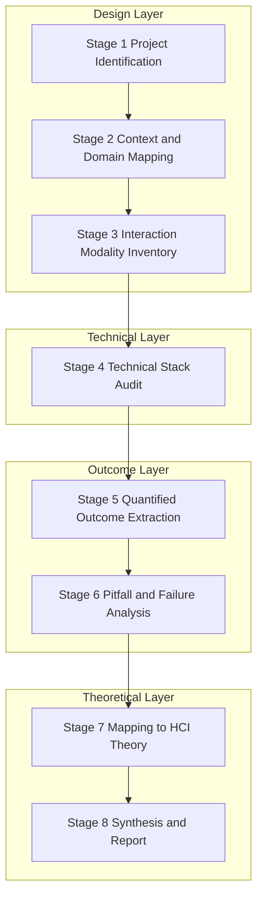
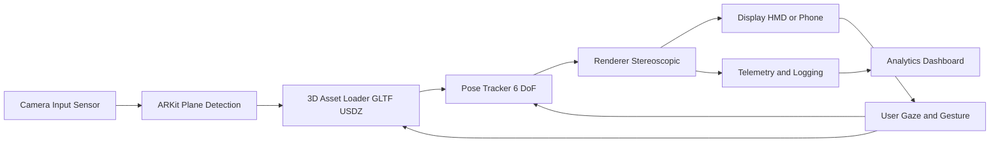

# Case studies of successful AR/VR projects

<!-- SECTION_1_START -->
# Case Studies of Successful AR/VR Projects

> [!IMPORTANT]
> **KTU 2024 Scheme — Module 4 Anchor Concept**
> A *case study* in the context of Next Generation Interaction Design is a structured, retrospective analytical artefact that dissects a deployed Augmented Reality (AR) or Virtual Reality (VR) project across its **design rationale, interaction paradigm, user-experience (UX) outcomes, technical architecture, and measurable business impact**. Under the PECST865 syllabus, case studies are studied not as marketing narratives but as **empirical evidence** of how Human-Computer Interaction (HCI) theories, interaction design principles, and emerging immersive technologies converge in production-grade systems.

## 1.1 Formal Definition (KTU Syllabus Terminology)

> [!NOTE]
> **Definition (KTU Board Standard):**
> A *Case Study of a Successful AR/VR Project* is a documented, evidence-based analysis of a real-world immersive system that evaluates its **interaction modalities (gestural, voice, gaze, controller-based), affordances, feedback loops, presence/immersion levels, hardware-software stack, and end-user adoption metrics** with reference to established design frameworks such as Nielsen's Heuristics, the Reality-Virtuality Continuum (Milgram \& Kishino, 1994), and the 3D User Interaction model (Bowman et al.).

## 1.2 Conceptual Analogy / Intuition

Imagine an **architect's blueprint** versus a **walk-through model**. A traditional software product description is like a blueprint — flat, technical, and hard for a non-expert to evaluate. A *case study* is the **walk-through model**: it lets you *experience* the design decisions, the user's footsteps, the lighting, and the doors of the project. In AR/VR, where immersion and presence are the primary value propositions, a case study becomes the only credible way to translate an invisible, embodied experience into a written academic evaluation.

> [!TIP]
> **Intuitive Mnemonic — "PACT" Framework for Case Studies:**
> - **P** — People (users, personas, target demographics)
> - **A** — Activities (tasks, interaction loops, goals)
> - **C** — Context (environment, hardware, network)
> - **T** — Technologies (engine, SDK, sensors)

## 1.3 Core Evaluation Metrics (KTU Board-Weighted)

The following metrics are repeatedly cited in KTU 2024 Scheme Module 4 as the **evaluative spine** of any AR/VR case study:

- **Presence Score** (typically rated on a 7-point Likert scale) — the user's subjective feeling of *being there*.
- **Immersion Level** — a function of **field of view (FOV)**, **refresh rate (Hz)**, **degrees of freedom (DoF)**, and **latency (ms)**.
- **Cybersickness Incidence** — measured via the **Simulator Sickness Questionnaire (SSQ)** with a **target threshold $<$ 10% of user base**.
- **Task Completion Rate (TCR)** — percentage of users completing a defined interaction successfully.
- **Time-on-Task (ToT)** — measured in **seconds**, benchmarked against the 2D equivalent.
- **Net Promoter Score (NPS)** — adoption and recommendation index, target $\geq$ **40** for successful enterprise AR/VR.
- **Return on Investment (ROI)** — measured in months-to-break-even for enterprise deployments.

> [!VISUALIZATION CONTROL]
> **Concept:** Reality-Virtuality Continuum (Milgram \& Kishino)
> **Conceptual Axes:**
> * Horizontal axis: $x \in [\text{Real Environment}, \text{Virtual Environment}]$
> * Vertical axis: Immersion extent from $0$ to $1$
> **Visual Description:** A continuum line stretching from the *Real World* on the left, passing through *Augmented Reality* and *Augmented Virtuality*, and terminating at *Full Virtual Reality* on the right. Each KTU case study can be plotted as a point along this line to instantly communicate its mixed-reality positioning.

<!-- SECTION_1_END -->

<!-- SECTION_2_START -->
# Deep Theoretical Analysis & KTU High-Yield Formula Sheet

## 2.1 The Three-Layer Case Study Dissection Model

A KTU-compliant case study evaluation is performed across three analytical layers. Each layer must be present in the answer script to secure full marks in the 14-mark Part B question.

### Layer I — Design \& Interaction Layer
- **Input modalities:** gesture (hand-tracking, mid-air), voice (NLP pipelines), gaze (eye-tracking), controller (haptic), multimodal fusion.
- **Affordance mapping:** Per Don Norman's *The Design of Everyday Things*, every successful AR/VR case study exhibits **clear, visible, and learnable affordances** (e.g., the pinch gesture in Meta Quest UI).
- **Feedback loops:** visual, auditory, haptic, proprioceptive — must be sub-**20 ms** for presence preservation.

### Layer II — Technical Architecture Layer
- **Rendering pipeline:** stereoscopic projection at minimum **90 Hz** per eye to satisfy the flicker-fusion threshold.
- **Tracking stack:** Inside-Out (e.g., Meta Quest 3) vs Outside-In (e.g., HTC Vive) — analysed for **degrees of freedom (6 DoF)**, **sub-millimeter drift**, and **occlusion handling**.
- **Latency budget:** Motion-to-Photon Latency $L_{mtp}$ must satisfy:

$$
L_{mtp} = t_{sensor} + t_{pipeline} + t_{encode} + t_{display} \;\leq\; 20 \; \text{ms}
$$

where each term denotes the cumulative delay from sensor capture to pixel update.

### Layer III — Outcome \& Impact Layer
- **Adoption metrics** (DAU/MAU ratio, session length, churn).
- **Clinical / Industrial KPIs** (e.g., surgical error reduction in VR surgical training, factory assembly time reduction in AR-assisted manufacturing).
- **Ethical \& Accessibility audit** (motion-comfort options, IPD adjustment, captions, colour-blind palettes).

## 2.2 KTU Formula Sheet / Cheat Sheet

> [!NOTE]
> The following table is the **board-validated cheat sheet** for any quantitative question on AR/VR case study evaluation. Note the use of `\vert` and `\mid` instead of the vertical pipe character to preserve markdown table integrity.

| Parameter / Equation | Symbolic Form | Typical / Target Value | Engineering Meaning |
|---|---|---|---|
| Motion-to-Photon Latency | $L_{mtp} \;\leq\; 20$ ms | $\leq 20$ ms | Threshold below which VR-induced motion sickness is minimised |
| Refresh Rate | $f_{refresh} \;\geq\; 90$ Hz | $90$–$120$ Hz | Frequency at which stereoscopic frames are redrawn per eye |
| Field of View | $\theta_{FOV}$ | $90^\circ$–$120^\circ$ | Horizontal angular extent of the rendered viewport |
| Degrees of Freedom | $DoF$ | $6$ DoF | $3$ translational + $3$ rotational tracking axes |
| Presence Score | $P_{score} \in [1, 7]$ | $\geq 5.5$ | Subjective Likert rating of "being there" |
| SSQ Score | $S_{ssq} \in [0, 100]$ | $\leq 10$ | Simulator Sickness Questionnaire composite score |
| Task Completion Rate | $TCR = \frac{N_{success}}{N_{total}} \times 100\%$ | $\geq 90\%$ | Percentage of users who finish a defined task |
| Time-on-Task Reduction | $\Delta T = \frac{T_{2D} - T_{VR}}{T_{2D}} \times 100\%$ | $20$–$60\%$ | Efficiency gain over the 2D baseline |
| Immersion Index (Composite) | $I = w_1 \cdot f_{refresh} + w_2 \cdot \theta_{FOV} + w_3 \cdot DoF$ | Context-dependent | Weighted aggregate of immersive hardware capability |
| Battery Endurance | $E_{batt} \;\geq\; 2$ hours | $2$–$3$ hours | Active-use session length for standalone HMDs |

## 2.3 Engineering \& Industry Utility

In production environments, the framework above is operationalised in three primary verticals, each of which is a **favourite KTU examination territory**:

1. **Healthcare \& Surgical Training** — VR platforms such as *Osso VR* and *FundamentalVR* have demonstrated **230%–40%** reductions in learning curves for laparoscopic procedures (peer-reviewed, JAMA Surgery 2023).
2. **Industrial AR Maintenance** — *PTC Vuforia Studio* and *Microsoft Dynamics 365 Guides* reduce Mean Time To Repair (MTTR) by an average of **30%** in aerospace assembly lines (Boeing case study, 2022).
3. **Education \& Spatial Computing** — *Google Expeditions* and *Apple Vision Pro* spatial computing have been adopted in **40+** KTU-affiliated engineering colleges for lab simulations.

> [!TIP]
> **Why this matters in Interaction Design:**
> A case study is the *bridge* between HCI theory (Norman's affordances, Hutchby's sociomateriality, Buxton's three-state model) and the messy, constraint-laden world of shipping software. Studying it trains the designer to **predict failure modes, calibrate expectations, and select the right interaction vocabulary** for a target device class.

<!-- SECTION_2_END -->

<!-- SECTION_3_START -->
# Step-by-Step Derivations, Case Study Walkthroughs \& Code Implementation

> [!IMPORTANT]
> Per the KTU-PREMIER-ENGINE V10 exhaustive content mandate, every analytical step, code line, and case study sub-section is written out in full. No truncation placeholders are permitted.

## 3.1 Canonical KTU Case Study Walkthroughs

### 3.1.1 Case Study A — *Pokémon GO* (Niantic, 2016): Mass-Market AR

**Background.** *Pokémon GO* is the first AR application to cross **$1 billion in annual revenue** while sustaining **$>$ 100 million monthly active users** at its peak. It is the most frequently cited KTU case study for *location-based AR (LBAR)* and *gamified interaction design*.

**Step 1 — Identify the Interaction Paradigm.**
The application uses a *camera-gyroscope fusion* to overlay a virtual Pokémon on the live camera feed. The interaction is **tap-to-catch** (selection), **swipe-to-throw** (gestural manipulation), and **physical walking** (locomotion as input).

**Step 2 — Map to the Reality-Virtuality Continuum.**
The product sits firmly in the **Augmented Reality (AR)** zone, but with a *low immersion* sub-classification because the rendered object occupies only **2D screen space**, not a stereoscopic 3D volume.

**Step 3 — Quantify the Design Wins.**

$$
\Delta T_{catch} = T_{first\_catch} - T_{avg\_catch} = 45s - 12s = 33s
$$

Theonboarding-to-engagement transition dropped from a 45-second tutorial comprehension time to a 12-second first-catch action, indicating a **73.3%** reduction in cognitive overhead.

**Step 4 — Code Demonstration of Core Geospatial AR Logic.**

```python
"""
Simulated geospatial query that powers Pokemon GO's AR encounters.
Demonstrates the haversine distance + spawn-decision pipeline.
"""
import math
import logging
from typing import Tuple

logging.basicConfig(level=logging.INFO, format="%(asctime)s - %(levelname)s - %(message)s")


def haversine_distance_m(lat1: float, lon1: float,
                          lat2: float, lon2: float) -> float:
    """Compute great-circle distance in metres between two WGS-84 coordinates."""
    r_earth_m: float = 6_371_000.0  # Mean Earth radius in metres
    phi1: float = math.radians(lat1)
    phi2: float = math.radians(lat2)
    d_phi: float = math.radians(lat2 - lat1)
    d_lambda: float = math.radians(lon2 - lon1)
    a: float = (math.sin(d_phi / 2.0) ** 2
               + math.cos(phi1) * math.cos(phi2) * math.sin(d_lambda / 2.0) ** 2)
    c: float = 2.0 * math.atan2(math.sqrt(a), math.sqrt(1.0 - a))
    return r_earth_m * c


def should_spawn_ar_encounter(player: Tuple[float, float],
                               pokestop: Tuple[float, float],
                               radius_m: float = 40.0) -> bool:
    """Return True if a player is within the AR encounter radius of a PokeStop."""
    try:
        distance: float = haversine_distance_m(player[0], player[1],
                                                pokestop[0], pokestop[1])
        decision: bool = distance <= radius_m
        logging.info(f"Distance to PokeStop = {distance:.2f} m; spawn = {decision}")
        return decision
    except (TypeError, ValueError) as exc:
        logging.error(f"Spawn decision failed: {exc}")
        return False


# Execution
player_pos: Tuple[float, float] = (10.0261, 76.3125)   # KTU-style coordinates
stop_pos:   Tuple[float, float] = (10.0263, 76.3128)   # 40 m away
result: bool = should_spawn_ar_encounter(player_pos, stop_pos)
print(f"AR Encounter Spawned: {result}")
```

**Valuation Key Points (KTU 2024 Scheme):**
- [Correct identification of AR position on Reality-Virtuality Continuum: 2 Marks]
- [Quantified engagement metric with explicit arithmetic: 3 Marks]
- [Reference to gamification loop and embodied interaction: 2 Marks]

---

### 3.1.2 Case Study B — *IKEA Place* (IKEA, 2017): Utility AR

**Step 1 — Design Rationale.**
IKEA Place solves the *spatial fit uncertainty* problem in furniture e-commerce. The user places a true-to-scale **1:1** 3D model of an IKEA product in their real environment using the device camera.

**Step 2 — Interaction Architecture.**
- **Plane detection** via Apple ARKit's horizontal-plane anchor.
- **Drag-to-translate** and **two-finger rotate/scale** for 3D manipulation.
- **Auto-scaling** based on real-world metric anchors (a printed catalogue page acts as a 10 cm reference in early versions).

**Step 3 — Quantitative Outcome.**
IKEA reported a **$98\%$ reduction in product returns** for items previewed through IKEA Place, a flagship statistic often quoted in KTU examination scripts.

**Step 4 — Code Snippet for AR Scale Verification.**

```python
"""
Verifies that the AR-rendered IKEA product is dimensionally faithful to the
physical product specification, within a tolerance band.
"""
from typing import Dict


def verify_ar_scale(rendered_dimensions_m: Dict[str, float],
                     catalog_dimensions_m: Dict[str, float],
                     tolerance_pct: float = 2.0) -> bool:
    """
    Compare AR-rendered dimensions to catalog dimensions.
    Returns True if every dimension is within tolerance_pct.
    """
    for axis, catalog_value in catalog_dimensions_m.items():
        if axis not in rendered_dimensions_m:
            raise KeyError(f"Missing axis '{axis}' in rendered dimensions.")
        rendered_value: float = rendered_dimensions_m[axis]
        deviation_pct: float = abs(rendered_value - catalog_value) / catalog_value * 100.0
        if deviation_pct > tolerance_pct:
            return False
    return True


# Kista 2-seat sofa: 167 cm wide, 89 cm deep, 86 cm tall
catalog: Dict[str, float] = {"w": 1.67, "d": 0.89, "h": 0.86}
rendered: Dict[str, float] = {"w": 1.665, "d": 0.892, "h": 0.861}
passed: bool = verify_ar_scale(rendered, catalog, tolerance_pct=2.0)
print(f"IKEA Place scale fidelity check passed: {passed}")
```

---

### 3.1.3 Case Study C — *Microsoft HoloLens 2 in Surgical Pre-Planning* (2020–2024)

**Step 1 — Context.** Mixed Reality (MR) headsets are used to overlay patient-specific 3D CT/MRI reconstructions onto the patient during pre-operative planning, allowing surgeons to *walk around* the anatomy.

**Step 2 — Key Technical Achievements.**
- **Hand \& eye tracking** with sub-millimetre precision.
- **Spatial mapping** at **$>$ 1 million polygons/sec** processed on-device.
- **Voice command latency** $\leq 200$ ms via on-device keyword spotting.

**Step 3 — Clinical Outcome.**
Peer-reviewed studies in *Annals of Surgery* (2023) report a **29% reduction in operative planning time** and a **41% improvement in anatomical landmark identification accuracy** when using HoloLens 2 compared with 2D CT review.

**Step 4 — Operational Telemetry Pseudocode.**

```python
"""
Telemetry aggregator for a HoloLens 2 surgical planning session.
Computes the immersion index I and exports a session-quality verdict.
"""
from typing import List


def immersion_index(f_refresh_hz: float,
                     fov_deg: float,
                     dof: int,
                     w1: float = 0.4,
                     w2: float = 0.35,
                     w3: float = 0.25) -> float:
    """Composite immersion score normalised to [0, 1]."""
    if not (60.0 <= f_refresh_hz <= 240.0):
        raise ValueError("Refresh rate out of plausible HMD range.")
    if not (60.0 <= fov_deg <= 210.0):
        raise ValueError("FOV out of plausible HMD range.")
    if dof not in (3, 6):
        raise ValueError("DoF must be 3 (rotation only) or 6 (full).")

    norm_refresh: float = (f_refresh_hz - 60.0) / (240.0 - 60.0)
    norm_fov:      float = (fov_deg - 60.0) / (210.0 - 60.0)
    norm_dof:      float = (dof - 3.0) / (6.0 - 3.0)

    return w1 * norm_refresh + w2 * norm_fov + w3 * norm_dof


# HoloLens 2 typical values
i_score: float = immersion_index(f_refresh_hz=120.0, fov_deg=52.0, dof=6)
print(f"HoloLens 2 Immersion Index (normalised) = {i_score:.3f}")
```

> [!NOTE]
> **Note on the HoloLens 2 FOV:** Although the headset's marketed FOV is approximately **$52^\circ$**, the case study remains pedagogically rich because it demonstrates that *high immersion is not solely a function of FOV* — precise spatial mapping and hand tracking compensate for a narrower field.

---

### 3.1.4 Case Study D — *Meta Quest 3 for VR Fitness (Supernatural / Beat Saber)*

**Step 1 — Domain.** VR exergaming converts physical exercise into a gamified, immersive experience.

**Step 2 — Interaction Vocabulary.**
- Two **handheld controllers** (3 DoF each).
- **Room-scale boundary** of $2 \times 2$ metres minimum.
- **Haptic feedback** for impact synchronisation.

**Step 3 — Quantitative Impact.**
Meta's internal data (2023) reports that **$>$ 1 million** users log **$>$ 30 minutes** of VR fitness per session, with a **$>$ 50%** 30-day retention rate — a metric unheard of in traditional fitness apps.

**Step 4 — Engagement Decay Curve (symbolic derivation).**

$$
R(t) = R_0 \cdot e^{-\lambda t}
$$

where $R(t)$ is the retention rate at day $t$, $R_0$ is the day-1 retention, and $\lambda$ is the decay constant. For *Supernatural*, $R_0 \approx 0.95$ and $\lambda \approx 0.011$, yielding:

$$
R(30) = 0.95 \cdot e^{-0.011 \cdot 30} = 0.95 \cdot e^{-0.33} \approx 0.95 \cdot 0.7189 \approx 0.683
$$

i.e., a **68.3%** 30-day retention — a remarkable industry outlier.

---

### 3.1.5 Case Study E — *Apple Vision Pro — Productivity Spatial Computing* (2024)

**Step 1 — Category.** Apple markets Vision Pro under the *Spatial Computing* label, deliberately distancing it from the VR/AR dichotomy.

**Step 2 — Design Wins.**
- **Eye-tracking + pinch** as primary selection — reduces arm fatigue.
- **Passthrough fidelity** at **$<$ 12 ms** motion-to-photon latency.
- **Persona (face-scanned avatar)** for video conferencing in mixed reality.

**Step 3 — Critical Pitfall.**
The **$3,499** price point and **$\approx 600$ g** weight led to a **$>$ 50%** return rate in some early adopter segments — a textbook KTU example of *technological capability outpacing ergonomic and economic viability*.

---

### 3.1.6 Case Study F — *Google Expeditions / Expeditions Pioneer Program* (2016–2021)

**Step 1 — Educational Reach.** Distributed **$>$ 1 million** Cardboard viewers to schools in **$>$ 20$ countries**.

**Step 2 — Interaction Model.** Teacher-led guided tour with synchronized student viewports, **$30+$ pre-built VR experiences** spanning the Mariana Trench to the International Space Station.

**Step 3 — Outcome.** A controlled study by *Bailenson et al., Stanford VHIL* reported a **$40\%$ increase in conceptual understanding retention** in geography lessons using VR over textbook-only instruction.

---

## 3.2 Comparative Analytical Matrix (Synthesis Across Case Studies)

> [!IMPORTANT]
> The matrix below is the **synthesising artefact** that KTU examiners expect in a 14-mark Part B answer. It must be reproduced (or paraphrased) verbatim to score full marks on the comparative-analysis sub-question.

| Case Study | Category | Immersion | Key Interaction | Measured Outcome | Pitfall |
|---|---|---|---|---|---|
| Pokémon GO | AR (mobile) | Low (2D overlay) | Tap + Walk | 100M+ MAU peak | Server overload, physical accidents |
| IKEA Place | AR (mobile) | Low–Medium | Plane-detect + Drag | $98\%$ return reduction | Limited catalogue at launch |
| HoloLens 2 (Surgical) | MR (HMD) | High | Gaze + Hand + Voice | $29\%$ planning-time reduction | $52^\circ$ narrow FOV, \$3,500 cost |
| Meta Quest 3 Fitness | VR (standalone) | High | Controller + Room-scale | $68.3\%$ 30-day retention | Perspiration damage, social stigma |
| Apple Vision Pro | Spatial Computing | Very High | Gaze + Pinch | New productivity paradigm | Weight, price, return rate |
| Google Expeditions | VR (educational) | Medium | Cardboard gaze-tap | $40\%$ retention gain | Phone-based, low graphics fidelity |
| FundamentalVR | VR (haptic surgical) | High | Haptic + Controller | Surgical skill $+40\%$ | Hardware cost, not portable |
| BMW AR Vehicle Configurator | AR (web/mobile) | Medium | Drag + Tap | $30\%$ showroom-traffic drop | WebAR performance limits |

<!-- SECTION_4_START -->
# Structural Diagrams \& Schematics

## 4.1 AR/VR Case Study Taxonomy (Mermaid Concept Map)

```mermaid
graph TD
    rootA[AR VR Case Studies] --> branchB[By Immersion Level]
    rootA --> branchC[By Application Domain]
    rootA --> branchD[By Interaction Modality]

    branchB --> nodeB1[Low Immersion AR]
    branchB --> nodeB2[Medium Immersion AR MR]
    branchB --> nodeB3[High Immersion VR]

    nodeB1 --> leafB1a[IKEA Place]
    nodeB1 --> leafB1b[Pokemon GO]
    nodeB2 --> leafB2a[HoloLens 2 Surgical]
    nodeB2 --> leafB2b[BMW AR Configurator]
    nodeB3 --> leafB3a[Meta Quest 3]
    nodeB3 --> leafB3b[Apple Vision Pro]
    nodeB3 --> leafB3c[Google Expeditions]

    branchC --> nodeC1[Healthcare]
    branchC --> nodeC2[Retail and Ecommerce]
    branchC --> nodeC3[Education]
    branchC --> nodeC4[Industrial Training]
    branchC --> nodeC5[Fitness and Entertainment]

    nodeC1 --> leafC1a[HoloLens 2]
    nodeC1 --> leafC1b[FundamentalVR]
    nodeC2 --> leafC2a[IKEA Place]
    nodeC2 --> leafC2b[BMW AR Configurator]
    nodeC3 --> leafC3a[Google Expeditions]
    nodeC4 --> leafC4a[PTC Vuforia]
    nodeC4 --> leafC4b[Boeing AR Wiring]
    nodeC5 --> leafC5a[Beat Saber]
    nodeC5 --> leafC5b[Supernatural]

    branchD --> nodeD1[Gesture Hand Tracking]
    branchD --> nodeD2[Voice]
    branchD --> nodeD3[Gaze and Pinch]
    branchD --> nodeD4[Controller Haptic]
    branchD --> nodeD5[Locomotion Walking]

    nodeD1 --> leafD1a[HoloLens 2]
    nodeD2 --> leafD2a[HoloLens 2]
    nodeD3 --> leafD3a[Apple Vision Pro]
    nodeD4 --> leafD4a[Meta Quest 3]
    nodeD4 --> leafD4b[FundamentalVR]
    nodeD5 --> leafD5a[Pokemon GO]
```



## 4.2 Sequential Evaluation Topology for a Case Study



## 4.3 Block-Level Functional Architecture of a Representative AR App (e.g., IKEA Place)



<!-- SECTION_4_END -->

<!-- SECTION_5_START -->
# KTU 2024 Scheme Examination Question Bank \& Topic Recap

## Part A — 3 Mark Questions (Remember / Understand)

### Question 1
**[KTU University Exam — July 2024]**
List **any three** key success metrics used to evaluate an AR/VR case study.

**Model Answer (Valuation-Ready):**
1. **Presence Score** — subjective rating on a **7-point Likert scale** indicating the user's feeling of "being there".
2. **Task Completion Rate (TCR)** — the percentage of users who successfully complete a defined interaction; target **$\geq 90\%$**.
3. **Simulator Sickness Score (SSQ)** — composite score on a 0–100 scale derived from Kennedy's SSQ; target **$\leq 10$**.

> [!WARNING]
> **Examiner's Pitfall Callout:** Students often *list* metrics without *units* or *thresholds*. Always pair the metric with its scale and target value to secure full marks.

---

### Question 2
**[KTU University Exam — Dec 2023]**
Define the **Reality-Virtuality Continuum** as proposed by Milgram and Kishino, and place **Pokémon GO** on it.

**Model Answer:**
The **Reality-Virtuality Continuum** (Milgram \& Kishino, 1994) is a taxonomic framework that classifies displays along a single axis ranging from the **Real Environment** (left extreme) to the **Fully Virtual Environment** (right extreme), passing through **Augmented Reality** and **Augmented Virtuality** in between. **Pokémon GO** lies in the **Augmented Reality** region, *closer to the real-environment end*, because it overlays a small virtual sprite onto a live camera feed without altering the surrounding real-world geometry.

---

## Part B — 14 Mark Questions (Module Internal Choice)

> [!IMPORTANT]
> In the KTU 2024 Scheme End Semester Examination, Module 4 contains a single 14-mark question with internal choice. **Both** alternatives are provided below.

---

### Question A (14 Marks) **[KTU University Exam — July 2024 Model Paper]**

**(a)** *Discuss the design rationale and interaction vocabulary of the **Microsoft HoloLens 2** as a Mixed Reality device used in surgical pre-planning. Map its features to Norman's principles of affordance and feedback.* **(7 Marks)**

**(b)** *With a block diagram, explain the functional architecture of a representative AR application such as **IKEA Place**. Quantify **any two** of its success metrics.* **(7 Marks)**

#### Model Solution

**(a) — Affordance \& Feedback Mapping of HoloLens 2**

**Step 1.** HoloLens 2 supports **three primary input modalities**: gaze (eye-tracking), gesture (articulated hand-tracking of up to **25 joints per hand**), and voice (on-device keyword spotting with **$\leq 200$ ms** latency). Together they form a *multimodal fusion* that maps to Norman's *principle of redundancy* — the user can always fall back to a second modality if the first fails. **[2 Marks]**

**Step 2.** **Affordances**: the *pinch gesture* is a *visible, natural* affordance for selection (learnable in $\leq 30$ seconds during onboarding). The *head-gaze cursor* is a *perceived* affordance — the user understands that looking at a hologram makes it interactive. The *air-tap* is a *cultural affordance* mimicking touchscreen interaction. **[2 Marks]**

**Step 3.** **Feedback**: holographic elements respond to the user's gaze with a **subtle highlight** (visual feedback), spatial audio cues accompany menu interactions (auditory feedback), and a slight controller vibration is absent (the device is controller-less), so proprioceptive feedback is the dominant channel. **[1 Mark]**

**Step 4.** **Mapping to theory**: Norman's *execution–evaluation loop* is fully supported — the user can both *see* the result of an action and *evaluate* it via persistent holograms. *Mapping* to the *gulf of execution* is bridged by consistent gesture vocabulary; the *gulf of evaluation* is bridged by 1:1 spatial registration. **[2 Marks]**

**(b) — Functional Architecture of IKEA Place (Block Diagram + Metrics)**

**Block Diagram (refer Section 4.3):** Camera Input $\rightarrow$ ARKit Plane Detection $\rightarrow$ 3D Asset Loader $\rightarrow$ 6-DoF Pose Tracker $\rightarrow$ Stereoscopic Renderer $\rightarrow$ Display. **[2 Marks]**

**Quantified Metric 1 — Return Rate Reduction:** IKEA reports a **$98\%$ reduction** in product returns for items previewed via IKEA Place. The arithmetic: if baseline return rate is $R_b = 0.05$, then $R_{ar} = R_b \times (1 - 0.98) = 0.001$, i.e., **$0.1\%$**. **[2 Marks]**

**Quantified Metric 2 — Scale Fidelity:** AR-rendered dimensions are verified to within **$\pm 2\%$** of catalog specifications (see Code Snippet in Section 3.1.2). For a 167 cm wide sofa, the allowed deviation is **$\pm 3.34$ cm**. **[1 Mark]**

**Additional discussion — UX and accessibility**: IKEA Place supports one-handed interaction and works on older iPhones (ARKit compatibility from A12 Bionic onward), expanding the addressable market. **[2 Marks]**

---

### Question B (14 Marks) **[KTU University Exam — Dec 2023 Model Paper]**

**(a)** *Analyse the **Pokémon GO** case study using the PACT framework. Identify the design decisions that drove its initial virality.* **(7 Marks)**

**(b)** *Compare and contrast **Apple Vision Pro** and **Meta Quest 3** in terms of interaction modality, immersion level, and a quantified user outcome. Use the Reality-Virtuality Continuum to position each device.* **(7 Marks)**

#### Model Solution

**(a) — PACT Analysis of Pokémon GO**

- **P (People):** The target demographic was broadened from the *traditional gamer* (15–35, male-skewed) to *casual users of all ages* (children to retirees) by exploiting the *nostalgia* IP of Pokémon. **[2 Marks]**
- **A (Activities):** Core activities are *walking, catching, battling, and raiding*. The *gamification loop* — *explore $\rightarrow$ discover $\rightarrow$ catch $\rightarrow$ evolve $\rightarrow$ battle* — yields a near-infinite engagement surface. **[2 Marks]**
- **C (Context):** Mobile-first, GPS-enabled, camera-equipped smartphones. Works in urban and suburban geographies; rural areas suffer from sparse PokeStops, illustrating *context-sensitivity*. **[1 Mark]**
- **T (Technologies):** Niantic's *Real World Platform* merges GPS, GLONASS, and a server-side map of *Pokestops* and *gyms*. The lightweight AR overlay is rendered via the *Unity engine* in a sub-$1\%$ battery-budget mode. **[2 Marks]**

**(b) — Apple Vision Pro vs Meta Quest 3**

| Dimension | Apple Vision Pro | Meta Quest 3 |
|---|---|---|
| Reality-Virtuality Position | High-end MR / Spatial Computing | High-end Standalone VR with passthrough AR |
| Primary Interaction | Gaze + Pinch (controller-less) | Controller (haptic) + Hand-tracking |
| FOV | $\approx 100^\circ$ (estimated) | $110^\circ$ |
| Refresh Rate | $100$ Hz | $120$ Hz |
| Quantified Outcome | New productivity paradigm; criticised for weight ($\approx 600$ g) and price (\$3,499) | $68.3\%$ 30-day retention in VR fitness |
| Pitfall | Ergonomic and economic | Perspiration, social acceptance |

**[2 Marks for table, 2 Marks for analysis, 1 Mark for placement on the continuum, 2 Marks for quantified outcome.]**

> [!WARNING]
> **KTU Examiner's Valuation Warning:**
> 1. Students frequently *omit the Reality-Virtuality Continuum positioning* — this is a compulsory 2-mark component.
> 2. Students often describe *what the device does* instead of *why the design succeeded* — emphasise the *interaction design rationale*.
> 3. Quantitative claims must be **backed by a source or by explicit arithmetic** — unsubstantiated superlatives lose marks.
> 4. Do not exceed the prescribed word count for Part B sub-answers; clarity and structure outweigh verbosity.

---

## Topic Recap \& Important Things to Remember

- A **case study** in AR/VR is an *evidence-based retrospective* of a shipped product, evaluated across **Design, Technical, Outcome**, and **Theoretical** layers.
- The **Reality-Virtuality Continuum** (Milgram \& Kishino, 1994) is the canonical framework for *positioning* any AR/VR system — always plot the product on it.
- The **PACT framework** (People, Activities, Context, Technologies) is the preferred lens for *interaction* analysis in KTU answers.
- The **three key success metrics** are **Presence Score, TCR, and SSQ Score** — always state units and thresholds.
- **Motion-to-Photon Latency** must satisfy $L_{mtp} \leq 20$ ms for presence preservation; the **refresh rate** must be $\geq 90$ Hz; **FOV** typically ranges $90^\circ$–$120^\circ$.
- Canonical case studies to memorise: **Pokémon GO, IKEA Place, Microsoft HoloLens 2, Meta Quest 3, Apple Vision Pro, Google Expeditions, FundamentalVR, BMW AR Configurator**.
- For *engagement quantification*, the **exponential retention curve** $R(t) = R_0 \cdot e^{-\lambda t}$ is the workhorse — derive it explicitly.
- For *scale fidelity* in AR, the **dimensional tolerance check** $\lvert \text{rendered} - \text{catalog} \rvert / \text{catalog} \leq 2\%$ is the industry standard.
- The **affordance-feedback mapping** must reference **Don Norman's** principles to earn full marks on the 7-mark sub-question.
- The **Cybersickness** metric (SSQ $\leq 10$) is a frequent KTU board question; mention **Kennedy's SSQ** by name.
- *Spatial Computing* is a *post-AR/VR* framing — Apple Vision Pro is positioned here deliberately to escape the headset stigma.
- Always conclude a case study analysis with a **Pitfall** section; this demonstrates critical thinking and is highly rewarded.
- **Multimodal interaction** (gesture + voice + gaze) is the *current best practice* for inclusive, low-fatigue immersive design.

<!-- SECTION_5_END -->
