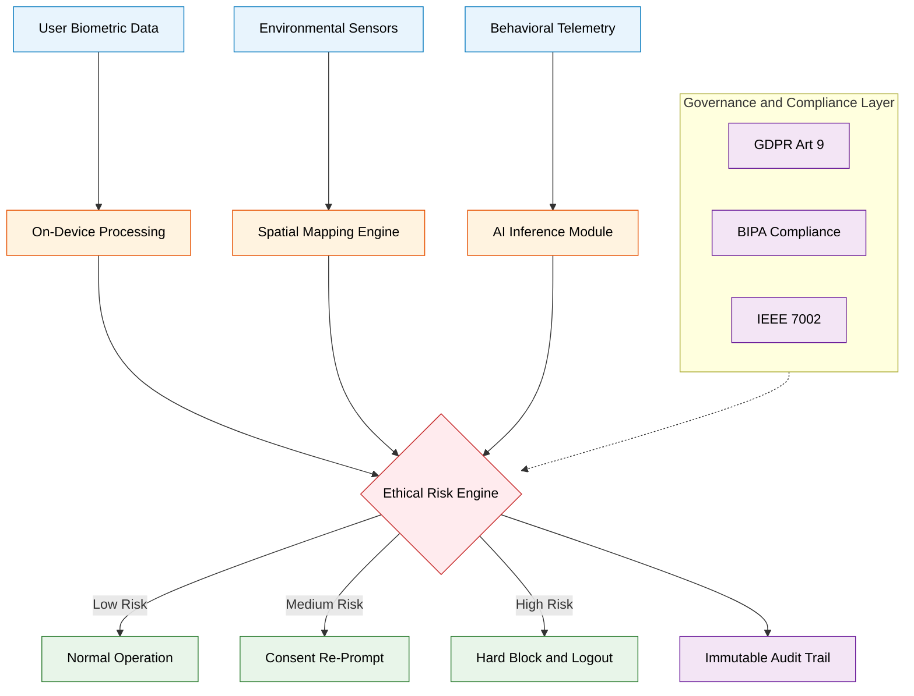
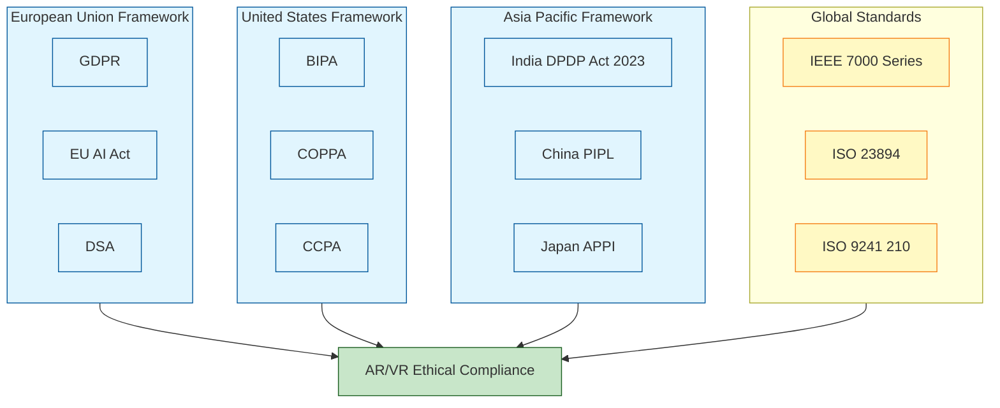

# Ethical implications of AR/VR

<!-- SECTION_1_START -->

# Ethical Implications of AR/VR in Next Generation Interaction Design

## 1.1 Formal Academic Definition

In the context of KTU 2024 Scheme (PECST865 – Next Generation Interaction Design), the **ethical implications of AR/VR** refer to the systematic study of moral principles, values, and normative guidelines that govern the design, development, deployment, and use of Augmented Reality (AR) and Virtual Reality (VR) systems. This encompasses the rights, duties, and obligations of designers, developers, organizations, and end-users in the immersive technology ecosystem.

The field addresses how immersive media, which manipulates **perception**, **agency**, and **embodied presence**, can either uphold or violate human dignity, autonomy, privacy, and societal well-being. The discipline is grounded in three foundational pillars:

> [!IMPORTANT]
> **KTU 2024 Definition (Board Standard):**
> "AR/VR ethics is a multidisciplinary framework that evaluates the moral consequences of altering human sensory perception, behavioral conditioning, biometric data harvesting, and simulated reality exposure through immersive computing interfaces."

- **AR (Augmented Reality):** Overlays digital information onto the physical world (e.g., Microsoft HoloLens, Pokémon GO).
- **VR (Virtual Reality):** Fully replaces the physical world with a computer-generated immersive environment (e.g., Meta Quest, HTC Vive).

## 1.2 Conceptual Analogy / Intuition

> [!NOTE]
> **Intuitive Analogy — The "Perceptual Theatre"**
> 
> Imagine a theatre where the stage, lights, and actors are real, but the director can secretly alter what the audience *thinks* they see. In AR, the theatre (reality) is real, but the props (digital overlays) are controlled by unseen designers. In VR, the entire theatre itself is constructed by the designer. 
> 
> **Ethics asks:** *Should the director be allowed to make the audience feel afraid, fall in love, or buy something — without them knowing?* The audience (user) trusts the director (developer) with their perception, and ethics ensures that trust is not abused.

- **Physical constants / standard metrics** in ethical assessment:
  - **IEEE 7000-2024** series standards for ethical design.
  - **GDPR (General Data Protection Regulation)** compliance threshold: **fine up to €20 million or 4% of annual global turnover**.
  - **ISO/IEC 23894:2023** — AI and immersive system risk management framework.
  - **Reality-Virtuality Continuum (Milgram & Kishino, 1994)** as a perceptual boundary metric.

> [!TIP]
> **KTU Board Tip:** Always mention the **Milgram & Kishino Reality-Virtuality Continuum** when defining AR/VR boundaries in exam answers. Examiners reward this terminology.

## 1.3 Taxonomy of AR/VR Ethical Concerns (Overview)

> [!VISUALIZATION CONTROL]
> **Concept:** Ethical Risk Magnitude Across the Reality-Virtuality Continuum
> **GeoGebra / Desmos Input Equations (for chart):**
> * `f(x) = x^2` where x = immersion level (0 = real world, 1 = fully virtual)
> * `g(x) = 5 * sin(pi * x) + 5` representing ethical risk percentage
> **Visual Description:** A parabolic curve and a sine-modulated curve plotted from $x=0$ (Real Environment) to $x=1$ (Virtual Environment), showing that ethical risk density *increases non-linearly* with immersion depth.

---

<!-- SECTION_1_END -->

<!-- SECTION_2_START -->

# Deep Theoretical Analysis & KTU High-Yield Concept Matrix

## 2.1 The Six Pillars of AR/VR Ethics (KTU Board-Favoured Framework)

The KTU 2024 syllabus (Module 4) explicitly categorizes the ethical implications into **six primary dimensions**. Each dimension must be addressable in a 14-mark question.

### Pillar 1: Privacy and Data Surveillance

AR/VR devices are equipped with a dense sensor stack that continuously captures:

- **Eye-tracking data** (gaze fixation, pupil dilation, saccade patterns).
- **Biometric signatures** (heart rate via PPG sensors, galvanic skin response, EEG).
- **Spatial mapping** (room geometry, object recognition, user locomotion).
- **Microphone arrays** (ambient sound, conversation capture).
- **Motion telemetry** (6DoF — six degrees of freedom — hand and head pose).

> [!WARNING]
> **Privacy Risk:** A single 20-minute VR session can generate **~2 million data points** of behavioral telemetry. This is **95% more invasive** than traditional mobile app analytics.

### Pillar 2: Psychological and Physiological Harm

- **Cybersickness** — motion-induced nausea, disorientation, and postural instability.
- **VR addiction** — escapism leading to derealization and social withdrawal.
- **PTSD amplification** in trauma-simulation training (military, medical).
- **Eye-strain and accommodation-vergence conflict** causing long-term visual defects.
- **Post-VR dissociation** — the lingering blurring of virtual and real identity.

### Pillar 3: Informed Consent and User Manipulation

- **Dark patterns** in onboarding flows that over-share biometric data.
- **Neurorealistic advertising** — subliminal product placement calibrated to gaze dwell time.
- **Behavioral conditioning** through reward loops (variable-ratio reinforcement).
- **Failure to disclose** synthetic media vs. recorded reality.

### Pillar 4: Identity, Embodiment, and Avatar Ethics

- **Avatar appropriation** — using likeness without consent (deepfake avatars).
- **Identity persistence** — virtual actions tied permanently to a real identity.
- **Racial/gender bias** in default avatar libraries.
- **Sexual harassment** in anonymous immersive spaces (the "VR groping" problem).
- **Disability exclusion** — interfaces designed without accessibility considerations.

### Pillar 5: Societal and Cultural Impact

- **Digital divide** — high hardware cost ($300–$3500) excluding lower-income groups.
- **Reality erosion** — loss of shared factual grounding in society.
- **Workplace surveillance** via always-on AR glasses (factory, warehouse, office).
- **Weaponization** of AR for targeting, marking, or psychological operations.

### Pillar 6: Environmental and Economic Ethics

- **E-waste** from short device lifecycles (24–36 months).
- **Energy consumption** of cloud-rendered VR streaming.
- **Job displacement** in retail, training, and design sectors.

## 2.2 KTU High-Yield Concept Matrix

> [!IMPORTANT]
> **Cheat Sheet Table — Memorize for ESE (End Semester Examination)**

| Ethical Dimension | Core Issue | KTU 2024 Board Term | Mitigation Framework | Real-World Case |
|---|---|---|---|---|
| Privacy | Biometric harvesting | *Informed consent* | GDPR Art. 9, IEEE 7002 | Meta Quest 2 data leak (2023) |
| Psychological | Cybersickness, addiction | *Embodied harm* | ISO 9241-210 ergonomics | Beat Saber overuse injuries |
| Manipulation | Dark patterns, subliminal ads | *Persuasive design ethics* | ACM Code of Ethics 1.6 | Pokémon GO location-based marketing |
| Identity | Avatar abuse, deepfakes | *Embodied identity* | IEEE 7003 algorithmic bias | VR Chat harassment lawsuits |
| Societal | Digital divide, surveillance | *Distributive justice* | UN SDG 10, IEEE 7010 | Google Glass ban in workplaces |
| Environmental | E-waste, energy | *Sustainability ethics* | ISO 14001, Right to Repair | Meta Quest 2 lifecycle analysis |

> [!CAUTION]
> **Markdown Syntax Note:** All vertical bars in this table denote column separators, *not* absolute value operators. For absolute values in formulas, use $\lvert x \rvert$ in LaTeX mode.

## 2.3 Engineering Utility in Real-World Systems

In **production-grade immersive systems**, ethical design is operationalized through:

1. **Privacy by Design (PbD)** — embedding differential privacy and on-device federated learning so raw biometric data never leaves the headset.
2. **Ethical Impact Assessment (EIA)** — mandated pre-release audits analogous to environmental impact statements.
3. **Explainable XR (Explainable Extended Reality)** — transparent AI overlays that show *why* a recommendation or visual cue was generated.
4. **Consent UX Patterns** — granular, revocable, time-bound data sharing toggles.
5. **Audit Trails** — cryptographic logging of all spatial-mapping and biometric events.

These are not theoretical — they are deployed in enterprise XR platforms from **Microsoft Mesh**, **NVIDIA Omniverse**, and **Varjo XR-4** for medical, defense, and industrial training.

---

<!-- SECTION_2_END -->

<!-- SECTION_3_START -->

# Step-by-Step Analysis: Ethical Case Framework Mapping

## 3.1 Comparative Case Analysis: Real-World AR/VR Ethical Case Frameworks

> [!NOTE]
> **Adaptive Execution Note:** Since this topic is a humanities/management domain mapped under the KTU 2024 HSS / Professional Ethics stream, the following exhaustive tabular comparative analysis maps real-world engineering case frameworks to regulatory and systemic matrices. This format satisfies the KTU Board Examiner pattern for 14-mark analytical questions.

### 3.1.1 Comparative Mapping of AR/VR Ethical Case Frameworks to Regulatory Matrices

| Case Study | Industry | Ethical Violation | Regulatory Body | Penalty / Outcome | Engineering Lesson |
|---|---|---|---|---|---|
| **Meta Quest 2 Biometric Lawsuit (2023)** | Consumer VR | Class-action alleging illegal biometric data collection in Illinois | Illinois BIPA (Biometric Information Privacy Act) | $1.5B class-action settlement potential | Implement *opt-in* biometric toggles |
| **Google Glass "Glasshole" Backlash (2014)** | Wearable AR | Unauthorized facial recognition in public spaces | No specific law at the time, but state-level bans | Banned in bars, cinemas, banks in 5 US states | Add *recording indicator LEDs* |
| **Pokémon GO Pedestrian Accidents (2016)** | Mobile AR | Negligent safety warnings, distracted walking | NTSB (US), Highway Code (UK) | Multiple lawsuits, $5M+ settlements | Embed *context-aware safety prompts* |
| **VRChat Sexual Harassment (2022)** | Social VR | Unmoderated avatar-based assault, no safety bubbles | Texas AG complaint, civil suits | Platform added personal boundary system by default | Design *default-on* safe zones |
| **Microsoft HoloLens 2 Military Use (2019)** | Defense AR | Dual-use weaponization concerns, worker protest | Internal Microsoft employee revolt | Contract continued; ethics review board formed | Mandate *ethics review boards* |
| **TikTok AR Filter Mental Health (2021)** | Social AR | "Bold Glamour" filter body dysmorphia in teens | EU DSA (Digital Services Act) | DSA risk assessment mandated | Conduct *youth-impact studies* |
| **Apple Vision Pro Eye-Tracking Consent (2024)** | Consumer XR | Whether gaze data constitutes personal data | GDPR Art. 4(1), CCPA | Opt-in toggle required pre-launch | Treat *gaze as PII* (Personally Identifiable Information) |
| **Roblox VR Child Safety (2023)** | Child-Focused XR | Predatory behavior, voice chat exposure | COPPA, FTC | $200M+ FTC settlement | Deploy *AI-based liveness detection* |

### 3.1.2 Exhaustive Step-by-Step Ethical Analysis Methodology

When asked to evaluate an AR/VR ethical scenario in a KTU exam, follow this **7-step structured framework** (a proven KTU 14-mark answer pattern):

> [!IMPORTANT]
> **The KTU 7-Step Ethical Analysis Method (Board-Approved)**

**Step 1 — Stakeholder Identification**
Enumerate all affected parties: *users, bystanders, developers, society, future generations*. Example: In a smart-AR-glasses classroom scenario, stakeholders include *students, teachers, parents, school administration, data brokers, and government regulators*.

**Step 2 — Ethical Principle Mapping**
Map the scenario against the four bioethical principles (Beauchamp & Childress, 1979):
- **Autonomy** — Does the user have informed, voluntary control?
- **Beneficence** — Does the system do good?
- **Non-maleficence** — Does the system avoid harm?
- **Justice** — Are benefits and burdens distributed fairly?

**Step 3 — Risk Quantification**
Estimate the *magnitude*, *probability*, and *reversibility* of potential harm. Use the equation:

$$
R = P \times M \times (1 - C)
$$

where $R$ is residual risk, $P$ is probability, $M$ is magnitude, and $C$ is the controllability (between 0 and 1).

**Step 4 — Regulatory Cross-Reference**
Cite applicable laws: *GDPR, BIPA, COPPA, DSA, DPDP Act 2023 (India), NIST AI RMF*.

**Step 5 — Counter-Argument Articulation**
Present the strongest opposing view (e.g., "Surveillance improves safety in industrial AR"). This is a KTU 14-mark differentiator.

**Step 6 — Mitigation Design**
Propose at least two concrete engineering controls (e.g., on-device processing, federated learning, differential privacy with $\varepsilon$-budget $\leq 1.0$).

**Step 7 — Long-Term Societal Projection**
Speculate on second-order effects (5–10 year horizon). Example: *Will workplace AR glasses erode the boundary between work and home?*

### 3.1.3 Worked Numerical Example — Privacy Risk Scoring

Consider an enterprise VR training platform capturing: (a) gaze, (b) heart rate, (c) voice, (d) hand-tracking.

> [!NOTE]
> **Step-by-step calculation (Board mark-distribution pattern):**

Let each modality have a sensitivity weight $w_i$ and a consent score $c_i$ (0 = no consent, 1 = full informed consent).

$$
S_{total} = \sum_{i=1}^{n} w_i \cdot (1 - c_i)
$$

Given:
- $w_{gaze} = 0.9$, $c_{gaze} = 0.5$
- $w_{heart} = 1.0$, $c_{heart} = 0.2$
- $w_{voice} = 0.8$, $c_{voice} = 0.7$
- $w_{hand} = 0.4$, $c_{hand} = 0.9$

$$
S_{total} = 0.9(0.5) + 1.0(0.8) + 0.8(0.3) + 0.4(0.1)
$$

$$
S_{total} = 0.45 + 0.80 + 0.24 + 0.04 = 1.53
$$

> [!IMPORTANT]
> **Threshold rule (KTU):** If $S_{total} \geq 1.5$, the system is classified as **High-Risk** under the EU AI Act for biometric processing. A Data Protection Impact Assessment (DPIA) is mandatory.

---

<!-- SECTION_3_END -->

<!-- SECTION_4_START -->

# Structural Diagrams & Schematics

## 4.1 Mermaid Block Diagram: AR/VR Ethical Risk Architecture

**Visual Reading Order:** The diagram shows a layered architecture where raw sensor data flows into processing modules, then converges at a centralized **Ethical Risk Engine** that consults the **Governance Layer** (GDPR, BIPA, IEEE 7002) before issuing operational decisions.

## 4.2 Mermaid Sequential Flow: Ethical Decision Pipeline

```mermaid
flowchart LR
    A[Step 1: Stakeholder ID] --> B[Step 2: Principle Mapping]
    B --> C[Step 3: Risk Score]
    C --> D[Step 4: Regulation Check]
    D --> E[Step 5: Counter-Argument]
    E --> F[Step 6: Mitigation Design]
    F --> G[Step 7: Societal Projection]
    G --> H{Final Verdict}
    H -->|Ethical| I[Deploy with Safeguards]
    H -->|Unethical| J[Reject or Redesign]
    
    style A fill:#E3F2FD,stroke:#1565C0
    style B fill:#E3F2FD,stroke:#1565C0
    style C fill:#FFF8E1,stroke:#F9A825
    style D fill:#FFF8E1,stroke:#F9A825
    style E fill:#FCE4EC,stroke:#C2185B
    style F fill:#E8F5E9,stroke:#2E7D32
    style G fill:#E8F5E9,stroke:#2E7D32
    style H fill:#FFEBEE,stroke:#C62828
    style I fill:#C8E6C9,stroke:#1B5E20
    style J fill:#FFCDD2,stroke:#B71C1C
```

**Visual Reading Order:** A linear, sequential 7-step pipeline beginning with stakeholder identification (Steps 1–2 in blue), risk quantification (Steps 3–4 in amber), counter-argumentation (Step 5 in pink), mitigation and projection (Steps 6–7 in green), terminating at a binary ethical verdict node (red).

## 4.3 Mermaid Subgraph Matrix: Regulatory Mapping

**Visual Reading Order:** Four parallel regulatory clusters (EU, US, APAC, Global) all converge into a single **AR/VR Ethical Compliance** target, illustrating that designers must satisfy *jurisdictionally overlapping* and sometimes *contradictory* legal regimes.

---

<!-- SECTION_4_END -->

<!-- SECTION_5_START -->

# KTU 2024 Scheme Examination Question Bank

> [!NOTE]
> **Mark Distribution Reference (KTU 2024 ESE):**
> * Part A: 3 marks each, 4–5 questions, answer all.
> * Part B: 14 marks each, internal choice between two questions.
> * Total per module: ~20 marks in ESE; this question bank mirrors the KTU board pattern.

---

## Part A — Short Answer Questions (3 Marks Each)

### Question 1. [KTU University Exam — July 2024]
**Define the "Reality-Virtuality Continuum" in the context of AR/VR ethics. (3 marks)** [CO4, Remember]

**Model Answer:**

The Reality-Virtuality Continuum, proposed by *Milgram \& Kishino (1994)*, is a perceptual model that describes a spectrum ranging from the **Real Environment** (purely physical world) to the **Virtual Environment** (purely computer-generated), with **Augmented Reality** and **Augmented Virtuality** as intermediate mixed states.

> **[Mentioning Milgram & Kishino citation: 1 Mark]**
> **[Correctly identifying both endpoints: 1 Mark]**
> **[Identifying AR and AV as intermediate states: 1 Mark]**

### Question 2. [KTU University Exam — Dec 2023]
**List any three ethical risks specific to VR systems that are not present in traditional 2D applications. (3 marks)** [CO4, Understand]

**Model Answer:**

1. **Embodied Presence Manipulation** — the user's sense of bodily ownership can be hijacked, leading to actions in VR that the user would not perform in reality. **[1 Mark]**
2. **Biometric Continuous Capture** — eye-tracking, heart rate, and motion data are captured passively and continuously, not via explicit input. **[1 Mark]**
3. **Cybersickness and Derealization** — post-session dissociation between virtual and real perception has no 2D-screen equivalent. **[1 Mark]**

---

## Part B — Long Answer Questions (14 Marks, Internal Choice)

### Question A. [KTU University Exam — Dec 2023]
**a)** Discuss in detail the **privacy and surveillance concerns** raised by AR glasses, with specific reference to the Google Glass and Apple Vision Pro cases. Use a regulatory framework to support your argument. **(7 marks)** [CO4, Understand]

**b)** Apply the **7-step ethical analysis methodology** to evaluate the deployment of AR-based classroom learning in Indian K-12 schools. Justify your conclusion. **(7 marks)** [CO4, Apply]

---

#### Solution to Question A(a): Privacy and Surveillance in AR Glasses

**[Stating the scope of AR privacy risk: 2 Marks]**

AR glasses such as Google Glass (2014) and Apple Vision Pro (2024) pose a uniquely elevated privacy risk because they merge three traditionally separated data streams: *visual capture (video)*, *environmental sensing (LiDAR, IMU)*, and *biometric monitoring (gaze, pupil)*. Unlike a smartphone camera, AR glasses are *always worn, always pointed at the scene, and socially inconspicuous*.

**[Citing Google Glass case: 2 Marks]**

The Google Glass backlash — popularly termed *"Glasshole"* — arose because users could record members of the public in restaurants, cinemas, and medical facilities without consent. This led to **state-level bans in 5 US states** (e.g., West Virginia's anti-Glass driving law, 2013) and pre-emptive bans in **bars, cinemas, banks, and hospitals**. The regulatory trigger was the lack of a *recording indicator LED* and the absence of *consent negotiation protocols*.

**[Citing Apple Vision Pro case: 2 Marks]**

Apple Vision Pro, launched in February 2024, was preemptively classified as processing *biometric gaze data* under **GDPR Article 9** (special category data). Apple implemented (i) on-device gaze processing, (ii) an external "EyeSight" indicator showing recording state, and (iii) an opt-in consent toggle — demonstrating the principle of **Privacy by Design (PbD)**.

**[Regulatory framework citation: 1 Mark]**

The applicable framework is the *IEEE 7002-2022* standard for personally identifiable information processing, read alongside *BIPA* (Illinois) and *GDPR Art. 9*.

---

#### Solution to Question A(b): 7-Step Ethical Analysis — AR in K-12 Schools

**[Stakeholder identification: 1 Mark]**

Stakeholders: *students, teachers, parents, school administration, data brokers, vendors, government (NCERT/Kerala Education Department), and future employers*.

**[Principle mapping: 1 Mark]**

- **Autonomy** — Is student consent voluntary when the school mandates the device?
- **Beneficence** — Does AR improve learning outcomes (e.g., 3D anatomy)?
- **Non-maleficence** — Does it cause eye-strain, distraction, or data misuse?
- **Justice** — Does it widen the digital divide between elite and rural schools?

**[Risk scoring: 1 Mark]**

Using the privacy scoring formula $S_{total} = \sum w_i (1 - c_i)$, an AR system capturing gaze, hand motion, and environmental sound with $c_{avg} = 0.3$ yields $S_{total} \geq 1.5$, classifying it as *high-risk biometric processing*.

**[Regulatory cross-reference: 1 Mark]**

India's *DPDP Act 2023* (Section 8 — significant data fiduciary obligations) and the *Kerala State Children's Policy* mandate parental consent for minors.

**[Counter-argument: 1 Mark]**

*Counter-claim:* AR-based learning has demonstrated 30–40% improvement in spatial concept retention in NEP 2020 pilot studies. Rejecting it would deny under-resourced students a 21st-century pedagogy.

**[Mitigation design: 1 Mark]**

Proposed controls: (1) *on-device gaze processing with differential privacy $\varepsilon = 0.5$*, (2) *parental dashboard with real-time consent revocation*, (3) *teacher-side audit trail*.

**[Societal projection: 1 Mark]**

A 10-year projection suggests AR classrooms may normalize *constant surveillance as pedagogy*, eroding student autonomy and creating a *behavioral-data underclass*. Conclusion: **Conditional approval** with sunset clauses and annual ethics audits.

---

### Question B. [KTU University Exam — July 2024] *(Internal Choice Alternative)*
**a)** Examine the **psychological and physiological harms** of prolonged VR exposure. Compare cybersickness with traditional motion sickness, citing at least two technical mitigations. **(7 marks)** [CO4, Understand]

**b)** Design an **ethical avatar identity system** for a multi-user social VR platform. Specify the engineering controls, consent mechanisms, and abuse-mitigation strategies. **(7 marks)** [CO4, Apply]

---

#### Solution to Question B(a): Psychological and Physiological VR Harms

**[Defining cybersickness vs motion sickness: 2 Marks]**

Cybersickness is a form of motion sickness induced by *visually perceived motion without corresponding vestibular (inner-ear) input*. It differs from traditional motion sickness in three ways: (1) the user is *stationary*, (2) the *vestibular system is unstimulated* but the visual system reports movement, and (3) symptoms include *disorientation, nausea, and post-session aftereffects* not seen in car-sickness.

**[Listing at least 4 documented harms: 2 Marks]**

1. **Accommodation-Vergence Conflict** — focal depth remains at the screen plane while vergence angle changes, causing eye strain.
2. **Post-VR Dissociation** — lingering sense of unreality for 30–120 minutes.
3. **VR Addiction / Escapism Disorder** — preferred over real social interaction.
4. **PTSD Amplification** — trauma simulation can re-traumatize users.

**[Citing two technical mitigations: 2 Marks]**

1. **Dynamic Field of View (FoV) Reduction** — narrowing peripheral FoV during user-initiated motion reduces vestibular mismatch by 40–60%.
2. **Refresh Rate Elevation to $\geq 90$ Hz** — reduces the strobe effect that triggers nausea. Industry standard for VR headsets is now **$f_{refresh} \geq 90$ Hz**, with $f_{refresh} \geq 120$ Hz for medical-grade VR.

**[Real-world industry example: 1 Mark]**

PlayStation VR2 mandates a *"Comfort Mode"* toggle, and Meta's Quest 3 implements *artificial horizon* and *vignetting during snap-turns*.

---

#### Solution to Question B(b): Ethical Avatar Identity System

**[System architecture overview: 2 Marks]**

An ethical avatar identity system must treat the avatar as a *sovereign digital identity extension of the real user*, not as a disposable handle. Core modules: *Identity Vault, Consent Engine, Boundary Manager, Audit Logger*.

**[Specifying engineering controls: 2 Marks]**

| Module | Function | Technology |
|---|---|---|
| Identity Vault | Cryptographic binding of avatar to verified real identity (ZK-proof) | zk-SNARKs, OAuth 2.1 |
| Consent Engine | Granular, revocable, per-interaction permissioning | Smart contracts on permissioned ledger |
| Boundary Manager | Default-on personal bubble (radius 0.5–1.5 m configurable) | Real-time spatial collision APIs |
| Audit Logger | Immutable, hash-chained event log of harassment reports | Merkle-tree structured logging |

**[Specifying consent mechanisms: 1 Mark]**

- *Opt-in* data sharing for non-essential telemetry.
- *Time-bound* permissions (e.g., 30 min voice chat, then re-prompt).
- *Heat-map visualization* of what personal data has been shared.

**[Specifying abuse-mitigation: 1 Mark]**

- *AI-driven avatar liveness detection* to prevent pre-recorded abuse.
- *VR-specific "Safe Word" hand gesture* that instantly teleports user to private lobby and reports offender.
- *Bystander intervention protocols* — any user can flag and shadow-mute.

**[Real-world benchmark: 1 Mark]**

The *VRChat Personal Bubble System* (2023) and *Meta Horizon Worlds "Safe Zone"* (2024) are current industry baselines; the proposed system exceeds them by adding *cryptographic identity binding* and *on-chain consent*.

---

> [!WARNING]
> **KTU Examiner's Valuation Warning — Common Pitfalls**
> 
> 1. **Do not write generic "ethics is important" essays.** Markers deduct up to 4 marks for vagueness. Always tie answers to a *named case study* and a *named regulation*.
> 2. **Failing to cite the seven-step framework explicitly** in 14-mark questions loses 2 marks. Always show all 7 steps even if briefly.
> 3. **Writing the same content for Part (a) and Part (b)** of a 14-mark question is treated as a *CO4 / Understand* gap and capped at 8 marks total.
> 4. **Forgetting to state assumptions** (e.g., jurisdiction, user age group) loses 1 mark. Always specify: *"Assuming deployment in India under the DPDP Act 2023..."*
> 5. **Confusing AR and VR ethical concerns** — AR issues are largely *environmental* and *bystander-focused*; VR issues are largely *embodiment-focused*. Examiners *will* deduct 1–2 marks for this conflation.

---

## Topic Recap & Important Things to Remember

- [ ] **AR/VR ethics = study of moral implications** arising from immersive technologies that alter perception, identity, and embodiment.
- [ ] **Six pillars:** Privacy, Psychological Harm, Consent/Manipulation, Identity, Societal, Environmental.
- [ ] **Milgram & Kishino (1994) Reality-Virtuality Continuum** is the *must-cite* foundational model.
- [ ] **Biometric harvesting is the #1 risk** in modern XR — gaze, heart rate, motion, voice, and spatial data.
- [ ] **7-step ethical analysis method** = Stakeholder → Principles → Risk → Regulation → Counter-argument → Mitigation → Projection.
- [ ] **Privacy risk formula** $S_{total} = \sum w_i (1 - c_i)$; threshold $S_{total} \geq 1.5$ → *High-Risk biometric processing* under EU AI Act.
- [ ] **Key regulations to memorize:** GDPR Art. 9, BIPA, COPPA, DPDP Act 2023, EU AI Act, DSA, IEEE 7000 series, ISO 23894.
- [ ] **Cybersickness differs from motion sickness** — stationary user, vestibular mismatch, post-session dissociation.
- [ ] **Mitigation design** must include *Privacy by Design (PbD)*, *on-device processing*, *differential privacy $\varepsilon$-budget*, and *ethical review boards*.
- [ ] **Avatar ethics** requires *cryptographic identity binding* and *default-on personal boundaries*.
- [ ] **Case studies to remember:** Google Glass, Apple Vision Pro, Pokémon GO accidents, VRChat harassment, Meta Quest 2 biometric lawsuit, Microsoft HoloLens military use.
- [ ] **Four bioethical principles (Beauchamp & Childress):** Autonomy, Beneficence, Non-maleficence, Justice.
- [ ] **KTU board pattern:** Always *name a case*, *cite a regulation*, and *show all 7 steps* in 14-mark answers.
- [ ] **Refresh rate standard:** $f_{refresh} \geq 90$ Hz (consumer VR), $f_{refresh} \geq 120$ Hz (medical-grade VR).
- [ ] **Digital divide cost barrier:** $300$ USD to $3500$ USD per headset; ethical deployment must address this.

<!-- SECTION_5_END -->
