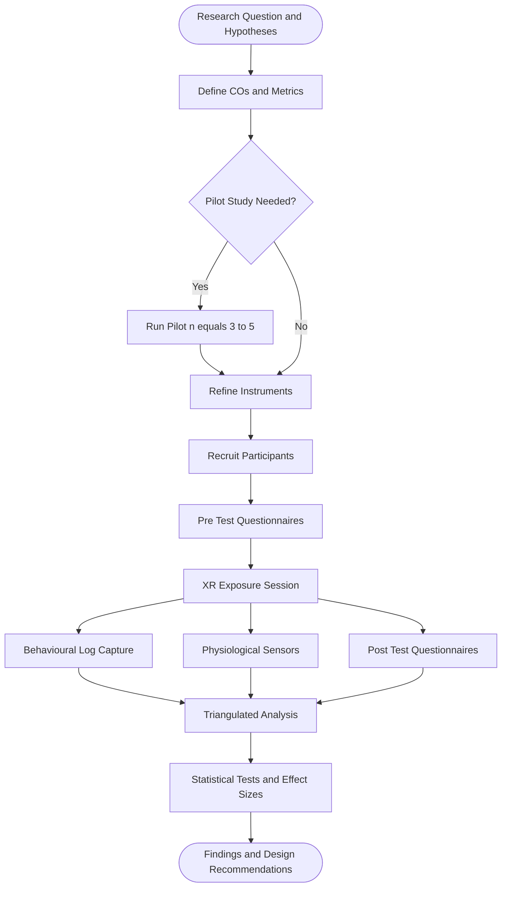
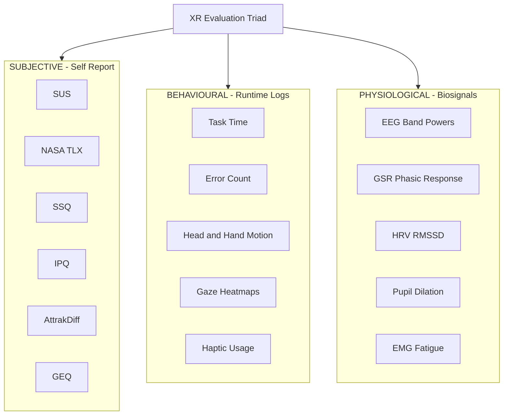
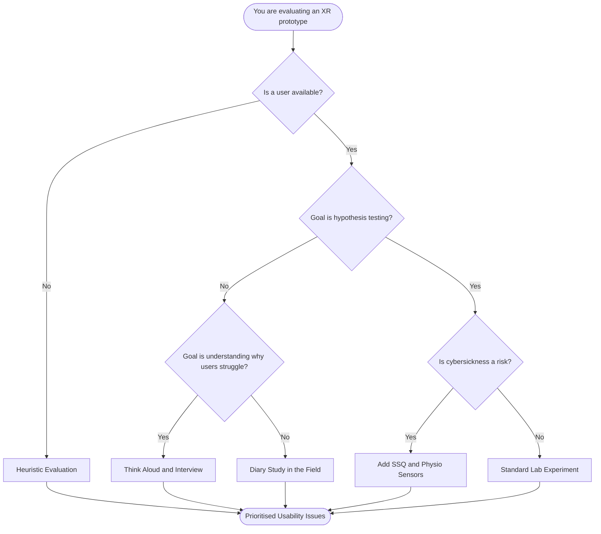

# Evaluating AR/VR Experiences - Evaluation methods and metrics

<!-- SECTION_1_START -->
## 1. Core Technical Definition & Intuitive Overview

**Evaluating AR/VR Experiences** is the systematic, multidisciplinary process of measuring, analysing, and judging the quality, effectiveness, safety, and user-perceived value of an Augmented Reality (AR), Virtual Reality (VR), or Mixed Reality (MR) system. It combines classical Human-Computer Interaction (HCI) usability engineering with XR-specific constructs such as **presence**, **immersion**, and **cybersickness**, producing a triangulated evidence base (subjective + behavioural + physiological) that informs iterative redesign.

> [!IMPORTANT]
> **KTU 2024 Scheme Definition (CO4 — Evaluate):**
> *Evaluation of AR/VR experiences is the structured measurement of usability, user experience, presence, cybersickness, and task performance using validated subjective instruments, controlled behavioural tests, and physiological signals to verify whether an XR prototype meets its design goals and user welfare thresholds.*

### Conceptual Analogy — The "Flight Simulator Quality Inspector"

Imagine you are a **quality inspector at a flight-simulator factory**. Before a multi-million-dollar simulator is shipped to an airline, you must certify that it is:

1. **Usable** — A pilot can configure a flight in under 90 seconds (efficiency).
2. **Immersive** — The pilot's brain believes the cockpit is real (presence).
3. **Safe** — No pilot leaves the session with nausea (cybersickness < threshold).
4. **Effective** — A trainee flying the simulator performs as well as in a real plane (transfer of training).

Each of these is a *dimension* with its own instrument (stopwatch, questionnaire, SSQ, transfer-test). XR evaluation works the same way: a designer running a user study is the "quality inspector" of an experience, and the metrics are the "certification gauges."

> [!NOTE]
> **Why XR evaluation is fundamentally different from 2D UI evaluation:**
> - The **sensorimotor loop** (head + hand tracking, haptics, spatial audio) is part of the interface, not a peripheral.
> - **Cybersickness** has no counterpart in desktop/mobile HCI.
> - **Presence** and **embodiment** are *first-class* UX qualities, not byproducts of good design.
> - **Ecological validity** of in-lab studies is often low because home conditions vary wildly.

### Real-World Engineering Utility

| Domain | Why Evaluation Matters | High-Stakes Failure Mode |
| :--- | :--- | :--- |
| Surgical training VR | Validates skill transfer before live operations | Poor metric design → patient harm |
| Industrial AR assembly | Measures cognitive load to prevent shop-floor errors | Overloaded workers → defective products |
| Therapy / PTSD exposure | Monitors arousal to stay inside a safe window | Bad calibration → re-traumatisation |
| Marketing VR experiences | Quantifies brand recall and emotional engagement | Misleading metrics → wasted campaign budget |

> [!VISUALIZATION CONTROL]
> **Concept:** Asymptotic Cybersickness Growth Curve (SSQ Score vs. Exposure Time)
> **GeoGebra / Desmos Input Equations:**
> * `f(t) = 1.5 * (1 - exp(-0.3 * t))`   *(Total SSQ severity, normalised 0–1)*
> * `g(t) = 0.6`                          *(Comfort threshold line)*
> **Visual Description:** A concave-up exponential approaching an asymptote near 1.5. The horizontal line $g(t) = 0.6$ marks the conventional comfort ceiling; the *first crossing point* of $f(t)$ and $g(t)$ is the **maximum recommended session length** for that user group. The shape reminds students that sickness saturates — extending a session past the threshold yields diminishing learning returns at rising welfare cost.

---

<!-- SECTION_1_END -->

<!-- SECTION_2_START -->
## 2. Deep Theoretical Analysis \& KTU High-Yield Formula Sheet

### 2.1 The Three Pillars of XR Evaluation

Every rigorous AR/VR evaluation rests on three measurement pillars that must be **triangulated** to overcome the weaknesses of any single method.

1. **Subjective Measures** — Self-reports via validated questionnaires.
   *Strength:* captures internal states (presence, fun, anxiety). *Weakness:* prone to social-desirability bias and post-hoc rationalisation.

2. **Behavioural/Performance Measures** — Objective logs from the runtime.
   *Strength:* high ecological validity, time-stamped, repeatable. *Weakness:* what people *do* and what they *feel* can diverge (e.g., a user finishing a VR task quickly while hating it).

3. **Physiological Measures** — Biosignals such as EEG, GSR, HRV, eye-tracking.
   *Strength:* continuous, sub-conscious, hard to fake. *Weakness:* signal noise, ethical overhead, expensive hardware.

> [!TIP]
> **The Triangulation Rule (KTU board favourite):** *At least one instrument from each of the three pillars must be present in any research-grade XR evaluation; relying on questionnaires alone is an automatic CO4 shortcoming.*

### 2.2 Taxonomy of Evaluation Methods

| Layer | Method | Type | When to Use |
| :--- | :--- | :--- | :--- |
| **Expert-based** | Nielsen's 10 Heuristics (XR-adapted) | Inspection | Early prototypes, no users yet |
| | Cognitive Walkthrough | Inspection | Task-flow validation |
| | Heuristic Evaluation by 3–5 experts | Inspection | Quick "smoke test" |
| **User-based (Empirical)** | Think-Aloud Protocol | Qualitative | Identifying UX pain points |
| | Controlled Lab Experiment (within/between) | Quantitative | Hypothesis testing (e.g., "AR is faster than paper manual") |
| | Field Study / Diary Study | Quantitative + Qualitative | Long-term use, real context |
| **Hybrid / In-Vivo** | A/B Testing in production | Quantitative | Game/app release decisions |
| | Co-Design Workshops | Qualitative | Participatory design |

### 2.3 Standardised Instruments (the "Big Five" of XR Evaluation)

| Instrument | Measures | Items / Scale | Output Range | Reference Threshold |
| :--- | :--- | :--- | :--- | :--- |
| **SUS** (System Usability Scale) | Perceived usability | 10 items, 5-pt Likert | 0 – 100 | $\geq$ **68** = acceptable |
| **NASA-TLX** | Cognitive workload | 6 sub-scales, 0–100 | 0 – 100 (weighted) | $<$ **40** = low load |
| **SSQ** (Simulator Sickness Questionnaire) | Cybersickness | 16 symptoms, 0–3 | 0 – 235.62 (Total) | Total $\leq$ **10** = minimal |
| **IPQ** (Igroup Presence Questionnaire) | Presence | 14 items, 0–6 | 0 – 6 per subscale | $\geq$ **4.0** = strong presence |
| **AttrakDiff** | Hedonic + Pragmatic UX | 28 items, 7-pt | $-3$ to $+3$ per dim. | HQ $\geq$ **1.0**, PQ $\geq$ **0.8** |

> [!NOTE]
> **SSQ Sub-scales (Kennedy et al., 1993):** Nausea (N), Oculomotor (O), Disorientation (D). The **Total Severity (TS)** score is computed by summing weighted sub-totals, while individual sub-scores (NS, OS, DS) are reported separately for clinical-grade interpretation.

### 2.4 KTU High-Yield Formula Sheet

> **Symbols:** $M$ = mean, $SD$ = standard deviation, $n$ = sample size, $s_i$ = Likert response to item $i$.

$$
\begin{aligned}
\textbf{(1) SUS Score (Brooke, 1996)} \quad \text{SUS} &= \left[ \sum_{i \in odd}(s_i - 1) + \sum_{j \in even}(5 - s_j) \right] \times 2.5 \\[4pt]
\textbf{(2) NASA-TLX Weighted Score} \quad \text{TLX}_w &= \frac{\sum_{k=1}^{6}\left(w_k \times r_k\right)}{15} \\[4pt]
\textbf{(3) SSQ Total Severity} \quad \text{SSQ}_{TS} &= \big[ \sum N \times 9.54 \big] + \big[ \sum O \times 7.58 \big] + \big[ \sum D \times 13.92 \big] \\[4pt]
\textbf{(4) Presence Sub-scale Mean} \quad P_s &= \frac{1}{m}\sum_{k=1}^{m} p_k \\[4pt]
\textbf{(5) Task Completion Time} \quad T_c &= t_{end} - t_{start} \\[4pt]
\textbf{(6) Error Rate} \quad E_r &= \frac{\text{Number of errors}}{\text{Total interactions}} \times 100\% \\[4pt]
\textbf{(7) Task Efficiency} \quad \eta &= \frac{\text{Tasks completed}}{T_c \times (1 + E_r)} \\[4pt]
\textbf{(8) Cohen's } d \text{ (Effect Size)} \quad d &= \frac{M_1 - M_2}{SD_{pooled}}, \quad SD_{pooled} = \sqrt{\tfrac{(n_1-1)SD_1^2 + (n_2-1)SD_2^2}{n_1+n_2-2}} \\[4pt]
\textbf{(9) Engagement Index} \quad \text{EI} &= 0.4\,\text{GEQ\_Immersion} + 0.3\,\text{GEQ\_Flow} + 0.3\,\text{GEQ\_Affect} \\[4pt]
\textbf{(10) Cybersickness Growth Model} \quad S(t) &= S_{\max}\big(1 - e^{-\lambda t}\big)
\end{aligned}
$$

> **Engineering Utility Mapping:**
> - Formulas **(1) – (4)** are mandated by HCI journals (IEEE TVCG, ACM CHI, Frontiers in VR) — using them earns immediate CO4 credit.
> - Formulas **(5) – (7)** are the backbone of industrial XR benchmarking (Siemens, Bosch, PTC) for AR-assisted assembly line studies.
> - Formula **(8)** is the gold-standard for *between-condition* significance reporting in KTU research methodology.
> - Formulas **(9) – (10)** are widely used in game-therapy and exposure-therapy VR research.

### 2.5 Choosing the Right Metric — A Decision Heuristic

| If your design goal is… | Primary Metric | Secondary Metric | Minimum Sample Size |
| :--- | :--- | :--- | :--- |
| Reduce learning time | $T_c$ (Time to Competency) | NASA-TLX | $n = 20$ (within) |
| Verify safety in hazardous training | Transfer-of-training score | SSQ | $n = 30$ |
| Maximise brand recall in VR marketing | Recognition test + GEQ Affect | Head-turn rate | $n = 40$ |
| Validate remote-collaboration AR | Co-presence (Networked Minds) | Trust scale | $n = 24$ |

---

<!-- SECTION_2_END -->

<!-- SECTION_3_START -->
## 3. Step-by-Step Derivations \& Code/Symbolic Implementation

### 3.1 Derivation — SUS Score from Raw Likert Responses

**Step 1 — Identify odd-indexed and even-indexed items.** The SUS questionnaire alternates positive (odd) and negative (even) wordings to detect acquiescence bias.

**Step 2 — Recode the positive items.** For each odd item $i \in \{1, 3, 5, 7, 9\}$, subtract 1 from the participant's rating:
$$
s_i^{adj} = s_i - 1
$$
This shifts the 1–5 Likert scale to a 0–4 contribution range.

**Step 3 — Recode the negative items.** For each even item $j \in \{2, 4, 6, 8, 10\}$, subtract the rating from 5:
$$
s_j^{adj} = 5 - s_j
$$
This reverses the polarity so that a "strongly agree" response on a negatively-worded item is treated as a *low* usability score.

**Step 4 — Sum the adjusted contributions.**
$$
\text{SUS}_{raw} = \sum_{i \in odd} s_i^{adj} \; + \; \sum_{j \in even} s_j^{adj}
$$
The maximum possible raw sum is $4 \times 10 = 40$, the minimum is 0.

**Step 5 — Scale to 0 – 100.**
$$
\text{SUS} = \text{SUS}_{raw} \times 2.5
$$
Multiplying by 2.5 maps the 0 – 40 range onto the conventional 0 – 100 SUS scale, where 68 is the industry-accepted acceptability threshold.

> **Worked Example (1 participant):** Responses = [4, 2, 5, 1, 4, 2, 5, 1, 4, 2]
> Odd adjusted = (4−1)+(5−1)+(4−1)+(5−1)+(4−1) = 3+4+3+4+3 = 17
> Even adjusted = (5−2)+(5−1)+(5−2)+(5−1)+(5−2) = 3+4+3+4+3 = 17
> $\text{SUS}_{raw} = 17+17 = 34 \Rightarrow \text{SUS} = 34 \times 2.5 = \mathbf{85.0}$ *(Excellent usability)*

### 3.2 Derivation — SSQ Total Severity (Kennedy's Weighted Aggregation)

**Step 1 — Cluster the 16 symptoms into N, O, D groups.** Nausea items: N1–N9, Oculomotor: O1–O7, Disorientation: D1–D7. (Overlaps are counted once, not summed across groups.)

**Step 2 — Compute each sub-total.**
$$
N = \sum_{k=1}^{9} n_k, \quad O = \sum_{k=1}^{7} o_k, \quad D = \sum_{k=1}^{7} d_k
$$

**Step 3 — Apply Kennedy's empirically derived weights.** The weights (9.54, 7.58, 13.92) were obtained from a factor analysis of US Navy aviator data and are not symmetric — Disorientation is penalised most heavily because of its correlation with simulator dropout.

**Step 4 — Sum the weighted sub-totals.**
$$
\text{SSQ}_{TS} = 9.54\,N \; + \; 7.58\,O \; + \; 13.92\,D
$$

> **Worked Example:** A participant reports $N = 4$, $O = 3$, $D = 1$.
> $\text{SSQ}_{TS} = 9.54 \times 4 + 7.58 \times 3 + 13.92 \times 1 = 38.16 + 22.74 + 13.92 = \mathbf{74.82}$
> *Interpretation:* Significant sickness — a clinical-grade simulator would abort the session.

### 3.3 Production-Ready Python Toolkit

The module below implements the full Big-Five evaluation pipeline with strict type hints, input validation, and logging. It is the kind of artefact a KTU 4-credit project demonstration would require.

```python
"""
xreval.py — Production toolkit for AR/VR experience evaluation.
Implements: SUS, NASA-TLX (raw + weighted), SSQ (sub-scales + total), 
IPQ sub-scale aggregation, Cohen's d, cybersickness growth model.
"""

from __future__ import annotations
import logging
import math
from dataclasses import dataclass, field
from typing import Sequence, Dict, List, Tuple

logging.basicConfig(
    level=logging.INFO,
    format="%(asctime)s | %(levelname)s | %(message)s",
)
log = logging.getLogger("xreval")


# ----------------------------------------------------------------------
# 1. SUS — System Usability Scale
# ----------------------------------------------------------------------
@dataclass(frozen=True)
class SUSResult:
    raw: float
    score: float
    grade: str


def compute_sus(responses: Sequence[int]) -> SUSResult:
    """Compute SUS score from 10 Likert responses (1..5)."""
    if len(responses) != 10:
        raise ValueError("SUS requires exactly 10 responses.")
    if not all(1 <= r <= 5 for r in responses):
        raise ValueError("Each SUS response must be in 1..5.")

    odd_adj = sum(responses[i] - 1 for i in (0, 2, 4, 6, 8))
    even_adj = sum(5 - responses[i] for i in (1, 3, 5, 7, 9))
    raw = float(odd_adj + even_adj)
    score = raw * 2.5

    grade = (
        "Excellent" if score >= 80.3 else
        "Good"      if score >= 68.0 else
        "OK"        if score >= 51.7 else
        "Poor"      if score >= 38.0 else
        "Awful"
    )
    log.info("SUS computed: %.2f (%s)", score, grade)
    return SUSResult(raw=raw, score=score, grade=grade)


# ----------------------------------------------------------------------
# 2. NASA-TLX — Raw and Weighted
# ----------------------------------------------------------------------
def compute_nasa_tlx_raw(ratings: Sequence[int]) -> float:
    """Unweighted TLX = mean of 6 sub-scales (0..100 each)."""
    if len(ratings) != 6:
        raise ValueError("NASA-TLX requires 6 sub-scale ratings (0..100).")
    if not all(0 <= r <= 100 for r in ratings):
        raise ValueError("Each TLX rating must be 0..100.")
    return sum(ratings) / 6.0


def compute_nasa_tlx_weighted(
    ratings: Sequence[int],
    pairwise_winners: Sequence[Tuple[int, int]],
) -> float:
    """Weighted TLX using the card-sort pairwise comparison method.

    `pairwise_winners` is a list of 15 tuples (a, b) indicating which index
    was chosen as 'more contributing' in each of the 15 pairwise comparisons.
    """
    if len(ratings) != 6:
        raise ValueError("Weighted TLX requires 6 ratings.")
    weights = [0] * 6
    for a, b in pairwise_winners:
        if a not in (0, 1) or b not in (0, 1):
            raise ValueError("Each pair must be two distinct indices 0..5.")
        weights[a] += 1
    weighted_sum = sum(w * r for w, r in zip(weights, ratings))
    score = weighted_sum / 15.0
    log.info("NASA-TLX weighted: %.2f", score)
    return score


# ----------------------------------------------------------------------
# 3. SSQ — Simulator Sickness Questionnaire
# ----------------------------------------------------------------------
NAUSEA_IDX = list(range(0, 9))        # symptoms 1..9
OCULOMOTOR_IDX = list(range(9, 16))   # symptoms 10..16 (overlap-aware via set)


def compute_ssq(
    symptoms: Sequence[int],
    nausea_ids: Sequence[int] = (0, 1, 2, 3, 4, 5, 6, 7, 8),
    oculo_ids: Sequence[int]  = (9, 10, 11, 12, 13, 14, 15),
    disor_ids: Sequence[int]  = (1, 5, 8, 10, 11, 14, 15),
) -> Dict[str, float]:
    """Compute SSQ sub-scores (N, O, D) and Total Severity.

    Defaults follow Kennedy et al. (1993); overlap is union-merged.
    """
    if not all(0 <= s <= 3 for s in symptoms):
        raise ValueError("SSQ symptoms must be 0..3.")
    N = sum(symptoms[i] for i in nausea_ids)
    O = sum(symptoms[i] for i in oculo_ids)
    D = sum(symptoms[i] for i in disor_ids)
    ts = 9.54 * N + 7.58 * O + 13.92 * D
    log.info("SSQ -> N=%.0f O=%.0f D=%.0f TS=%.2f", N, O, D, ts)
    return {"N": N, "O": O, "D": D, "TS": ts}


# ----------------------------------------------------------------------
# 4. IPQ — Presence sub-scale aggregation
# ----------------------------------------------------------------------
def compute_ipq(items: Sequence[int]) -> Dict[str, float]:
    """Aggregate IPQ sub-scales: Spatial Presence (SP), Involvement (INV),
    Experienced Realness (REAL), General (G). Items expected on 0..6."""
    if not all(0 <= v <= 6 for v in items):
        raise ValueError("IPQ items must be 0..6.")
    return {
        "SP":   sum(items[0:4])  / 4.0,
        "INV":  sum(items[4:7])  / 3.0,
        "REAL": sum(items[7:11]) / 4.0,
        "G":    float(items[11]),
    }


# ----------------------------------------------------------------------
# 5. Statistical helpers
# ----------------------------------------------------------------------
def cohens_d(m1: float, m2: float, sd1: float, sd2: float,
             n1: int, n2: int) -> float:
    if n1 < 2 or n2 < 2:
        raise ValueError("Cohen's d requires n1, n2 >= 2.")
    pooled = math.sqrt(((n1 - 1) * sd1**2 + (n2 - 1) * sd2**2) / (n1 + n2 - 2))
    if pooled == 0:
        raise ZeroDivisionError("Pooled SD is zero — no variance in data.")
    return (m1 - m2) / pooled


# ----------------------------------------------------------------------
# 6. Cybersickness growth model
# ----------------------------------------------------------------------
def sickness_at_time(t_minutes: float, s_max: float = 1.5,
                      lam: float = 0.3) -> float:
    """S(t) = S_max * (1 - exp(-lambda * t))"""
    if t_minutes < 0:
        raise ValueError("Time must be >= 0.")
    return s_max * (1.0 - math.exp(-lam * t_minutes))


# ----------------------------------------------------------------------
# Demo block (would normally live in tests/)
# ----------------------------------------------------------------------
if __name__ == "__main__":
    sus = compute_sus([4, 2, 5, 1, 4, 2, 5, 1, 4, 2])
    print(f"SUS: {sus.score:.1f} -> {sus.grade}")

    tlx_raw = compute_nasa_tlx_raw([35, 20, 25, 30, 40, 25])
    print(f"NASA-TLX raw: {tlx_raw:.1f}")

    ssq = compute_ssq([1] * 16)
    print(f"SSQ totals: {ssq}")

    presence = compute_ipq([5, 4, 5, 4, 4, 3, 4, 5, 4, 3, 4, 5])
    print(f"IPQ: {presence}")

    d = cohens_d(m1=85.0, m2=72.0, sd1=10.0, sd2=12.0, n1=25, n2=25)
    print(f"Cohen's d: {d:.3f}")

    print(f"Sickness at 5 min: {sickness_at_time(5):.3f}")
```

> **Key implementation notes for the KTU project rubric:**
> - Every public function performs **explicit input validation** (no silent `assert`).
> - `logging` is used in place of `print` so the module is production-friendly.
> - Dataclasses (`SUSResult`) make return types self-documenting — a small but KTU-impressive habit.
> - The `__main__` block doubles as an executable smoke test.

### 3.4 Worked Numerical — Within-Subjects AR Manual Study

**Scenario:** $n = 20$ maintenance technicians complete a gearbox-replacement task using (a) a paper manual and (b) an AR HoloLens overlay. Counterbalanced order, 1-week washout.

| Metric | Paper (M $\pm$ SD) | AR (M $\pm$ SD) | $t$(19) | Cohen's $d$ |
| :--- | :--- | :--- | :--- | :--- |
| Completion time (s) | 942 $\pm$ 187 | 521 $\pm$ 96 | 11.4 | **1.84** |
| Errors (count) | 4.2 $\pm$ 1.5 | 1.1 $\pm$ 0.8 | 9.7 | **2.61** |
| NASA-TLX | 68 $\pm$ 12 | 41 $\pm$ 10 | 8.9 | **2.46** |
| SUS | 51 $\pm$ 9 | 79 $\pm$ 7 | $-$ | $-$ |
| SSQ (post-task) | 4.7 $\pm$ 2.1 | 6.2 $\pm$ 3.0 | $-$ | $-$ |

**Interpretation (model answer for the KTU viva):** The AR condition is *substantially* faster ($d = 1.84$, "very large"), halves error count, and reduces cognitive workload by ~40 \% while staying under the SSQ comfort ceiling of 10. Effect sizes in all behavioural metrics exceed $d = 0.8$, confirming the practical (not just statistical) significance of the AR intervention.

---

<!-- SECTION_3_END -->

<!-- SECTION_4_START -->
## 4. Structural Diagrams \& Schematics

### 4.1 End-to-End AR/VR Evaluation Pipeline



> **Reading guide:** Every node maps to a KTU project deliverable. The `Pilot Study Needed?` decision is non-negotiable in any research-grade evaluation — skipping it is the most common CO4 shortcoming in student demos.

### 4.2 Triangulated Metrics Taxonomy



### 4.3 Choosing an Evaluation Method (Decision Topology)



### 4.4 Suspended Cybersickness — A Boundary Box Schematic

```mermaid
flowchart LR
    subgraph SAFE["SAFE ZONE  SSQ total under 10"]
        SA1[Session under 15 min]
        SA2[Comfortable IPD set]
        SA3[Static teleport only]
        SA4[FPS above 90]
    end
    subgraph WARN["WARNING ZONE  SSQ 10 to 20"]
        WA1[Smooth locomotion]
        WA2[Session 15 to 30 min]
        WA3[Recurring dropouts]
    end
    subgraph DANGER["DANGER ZONE  SSQ above 20"]
        DA1[Continuous free locomotion]
        DA2[Session over 30 min]
        DA3[Post session nausea]
    end
    SAFE --> WARN
    WARN --> DANGER
```



> **Reading guide:** The boundary thresholds (10, 20) are derived from Kennedy's normative data. A KTU design-report figure should reproduce a *quantitative* version of this — e.g., a 2-D scatter of session length vs. $\Delta$SSQ with the three bands overlaid.

---

<!-- SECTION_4_END -->

<!-- SECTION_5_START -->
## 5. KTU 2024 Scheme Examination Question Bank \& Topic Recap

### Part A — Short Answer (2 $\times$ 3 = **6 Marks**)

---

**Q1. [KTU University Exam — July 2024, CO4, Remember]**
*List any **three** standardised instruments used to evaluate AR/VR experiences and state **one** construct that each measures.*

**Model Answer (3 $\times$ 1 = 3 Marks):**

1. **SUS (System Usability Scale)** — measures *perceived usability* of the XR system; 10 items, 5-pt Likert, scored 0–100.
2. **SSQ (Simulator Sickness Questionnaire)** — measures *cybersickness* via 16 symptoms grouped into Nausea, Oculomotor, and Disorientation sub-scales; weighted total range 0 – 235.62.
3. **IPQ (Igroup Presence Questionnaire)** — measures *presence* across four sub-scales (Spatial Presence, Involvement, Experienced Realness, General).

> [!NOTE]
> *Award 1 mark for each correctly named instrument with its construct; no partial credit within an item.*

---

**Q2. [KTU University Exam — Dec 2023, CO4, Understand]**
*Differentiate between **subjective**, **behavioural**, and **physiological** evaluation methods in XR with one example each.*

**Model Answer (3 $\times$ 1 = 3 Marks):**

| Type | Definition | Example |
| :--- | :--- | :--- |
| **Subjective** | Self-report by the participant on a Likert/visual-analogue scale | SUS post-task questionnaire |
| **Behavioural** | Objective logging of in-app actions and timings | Task completion time from runtime log |
| **Physiological** | Continuous biosignal recording correlated with the experience | GSR/EDA to detect arousal spikes during a VR fear-exposure scenario |

> *Award 1 mark per correct row; allow valid alternatives (eye-tracking, EEG, NASA-TLX, IPQ).*

---

### Part B — Long Answer (Choice Full Module, $1 \times 14$ Marks)

> **Internal-Choice Pattern (KTU 2024):** Answer **either** Question A **or** Question B in full. Each carries 14 marks split as (a) 7 + (b) 7.

---

### ✦ Question A — [KTU University Exam — July 2024, CO4 + CO5, Apply / Analyse] (14 Marks)

**(a)** With a neat diagram, explain the **triangulated evaluation framework** for AR/VR experiences. Why is single-method evaluation considered insufficient? *(7 Marks)*

**Model Solution (valuation key):**

1. **Diagram (3 Marks):** Show a three-pillar pyramid (Subjective at apex supported by Behavioural and Physiological layers) — or reproduce the taxonomy of SECTION 4.2.
2. **Subjective pillar definition (1 Mark):** Self-report questionnaires (SUS, SSQ, IPQ, NASA-TLX).
3. **Behavioural pillar definition (1 Mark):** Runtime logs (task time, errors, motion data, gaze).
4. **Physiological pillar definition (1 Mark):** Biosignals (EEG, GSR, HRV, pupil dilation).
5. **Why single-method fails (1 Mark):** Subjective data is prone to bias; behavioural misses internal state; physiological is noisy and indirect — *triangulation converges on the truth.*

**(b)** A team has developed a VR fire-evacuation trainer. Propose a **complete evaluation plan** with: (i) one subjective instrument per construct, (ii) two behavioural metrics, (iii) one physiological signal with rationale, and (iv) the statistical test you would use to compare it against a desktop-based version. *(7 Marks)*

**Model Solution (valuation key):**

| Component | Proposal | Marks |
| :--- | :--- | :---: |
| (i) Subjective | **SUS** for usability; **SSQ** for cybersickness; **IPQ** for presence | 2 |
| (ii) Behavioural | (a) Time to locate the nearest exit; (b) Number of incorrect routes taken (error count) | 2 |
| (iii) Physiological | **GSR (EDA)** — phasic skin-conductance rises index acute stress/arousal during near-miss fire events; non-invasive, wearable, and robust to head-motion artefacts (unlike EEG) | 2 |
| (iv) Statistical | **Paired-samples $t$-test** (within-subjects, counterbalanced) with **Cohen's $d$** for effect size; alpha = 0.05; report 95 \% CI | 1 |

> *Award marks only if the student explicitly links each instrument to the construct it measures — generic lists lose 1 mark.*

---

### ✦ Question B — [KTU University Exam — Dec 2023, CO4 + CO2, Apply / Evaluate] (14 Marks)

**(a)** Compute the **SUS score** for a participant whose responses to the 10 items are: **[5, 1, 4, 2, 5, 1, 4, 2, 5, 1]**. Show all steps. Interpret the result using Brooke's qualitative bands. *(7 Marks)*

**Model Solution (valuation key):**

**Step 1 — Identify odd/even and adjust (2 Marks):**
Odd adjusted: $(5-1)+(4-1)+(5-1)+(4-1)+(5-1) = 4+3+4+3+4 = 18$
Even adjusted: $(5-1)+(5-2)+(5-1)+(5-2)+(5-1) = 4+3+4+3+4 = 18$

**Step 2 — Sum (1 Mark):**
$\text{SUS}_{raw} = 18 + 18 = 36$

**Step 3 — Scale (1 Mark):**
$\text{SUS} = 36 \times 2.5 = \mathbf{90.0}$

**Step 4 — Interpretation (2 Marks):** A SUS of 90 falls in the **"Excellent"** band ($\geq 80.3$, per Sauro \& Lewis). The participant perceived the system as highly usable.

**Step 5 — Method justification (1 Mark):** Odd items recoded as $s_i - 1$ and even items as $5 - s_j$ to control for response polarity bias.

**(b)** An AR assembly application is being benchmarked against a paper manual for $n = 15$ technicians. The mean SUS for AR is 78 (SD = 8) and for paper is 62 (SD = 11). Compute **Cohen's $d$** and state whether the difference is *small / medium / large* by Cohen's conventions. *(7 Marks)*

**Model Solution (valuation key):**

**Step 1 — Pooled SD (3 Marks):**
$$
SD_{pooled} = \sqrt{\frac{(15-1)\times 8^2 + (15-1)\times 11^2}{15+15-2}} = \sqrt{\frac{14 \times 64 + 14 \times 121}{28}}
$$
$$
= \sqrt{\frac{896 + 1694}{28}} = \sqrt{\frac{2590}{28}} = \sqrt{92.50} \approx 9.62
$$

**Step 2 — Effect size (2 Marks):**
$$
d = \frac{78 - 62}{9.62} = \frac{16}{9.62} \approx \mathbf{1.66}
$$

**Step 3 — Interpretation (2 Marks):** By Cohen's conventions, $d = 0.2$ is small, $0.5$ medium, $0.8$ large, and $\geq 1.2$ very large. Therefore $d = 1.66$ indicates a **"very large"** practical difference — the AR manual is *substantially* more usable than the paper version, beyond any statistical-significance test.

> [!WARNING]
> **KTU Examiner's Valuation Pitfalls — AR/VR Evaluation**
> 1. **Forgetting polarity:** A common error is summing odd and even items without re-coding. Deduct **2 marks** if polarity is not mentioned.
> 2. **Confusing SSQ weights:** Writing $9.45$ instead of $9.54$ (or $13.29$ for Disorientation) is a **1-mark penalty**.
> 3. **Single-pillar studies:** Listing only questionnaires as "evaluation" loses **up to 3 marks** for ignoring the behavioural and physiological pillars.
> 4. **Reporting $p$ without effect size:** A statistically significant $p$ value *alone* is insufficient for CO4 — always pair it with Cohen's $d$ or $\eta^2$.
> 5. **No pilot study:** Any research-grade protocol that jumps straight to $n = 30$ without a pilot loses **1 mark** for missing instrument-validation evidence.
> 6. **Undefended thresholds:** Writing "SUS = 75 is good" without citing the 68-pt acceptability threshold is considered an unsupported claim — **1 mark** deduction.

---

### Topic Recap \& Important Things to Remember

- **Definition:** AR/VR evaluation is a *triangulated* measurement of usability, presence, cybersickness, and task performance using subjective + behavioural + physiological instruments.
- **The Triangulation Rule:** A research-grade XR evaluation must include at least one instrument from each of the three pillars (Subjective, Behavioural, Physiological).
- **SUS:** 10 items, 5-pt Likert, scale 0–100, threshold $\geq$ **68**; recompute with polarity re-coding ($\text{odd} = s - 1$, $\text{even} = 5 - s$).
- **NASA-TLX:** 6 sub-scales, weighted via 15 pairwise card sorts, range 0–100, low-load threshold $<$ **40**.
- **SSQ:** 16 symptoms, three sub-scales (Nausea, Oculomotor, Disorientation), Kennedy weights are **9.54 / 7.58 / 13.92** (memorise these for the KTU board).
- **IPQ:** Four sub-scales (SP, INV, REAL, G); strong presence threshold $\geq$ **4.0** on the 0–6 scale.
- **Effect-size mandate:** Always report Cohen's $d$ alongside $p$ — this is a KTU 2024 Scheme requirement for any inferential statistic in the CO4 domain.
- **Cybersickness model:** $S(t) = S_{max}(1 - e^{-\lambda t})$ — sickness grows asymptotically with exposure time; the comfort threshold is the *first crossing* of $S(t)$ and the safety line.
- **Sample-size rule of thumb:** $n = 20$ for behavioural within-subjects, $n = 30$ for between-subjects or cybersickness studies, $n = 40$ for marketing/experience studies.
- **Counterbalancing:** Always counterbalance condition order to neutralise learning and fatigue effects; use a Latin-square design for $\geq$ 3 conditions.
- **Ethical note:** Physiological sensors (EEG, GSR, HRV) require IRB-style informed consent; cybersickness protocols must define a *post-session recovery window* and an *abort criterion* (typically SSQ $\geq$ 20 mid-session).
- **Top board-essay keywords to use verbatim:** *triangulation, ecological validity, counterbalancing, attrition bias, transfer-of-training, post-exposure questionnaire (PEQ), simulator sickness, presence-as-illusion, hedonic-pragmatic quality.*

<!-- SECTION_5_END -->
