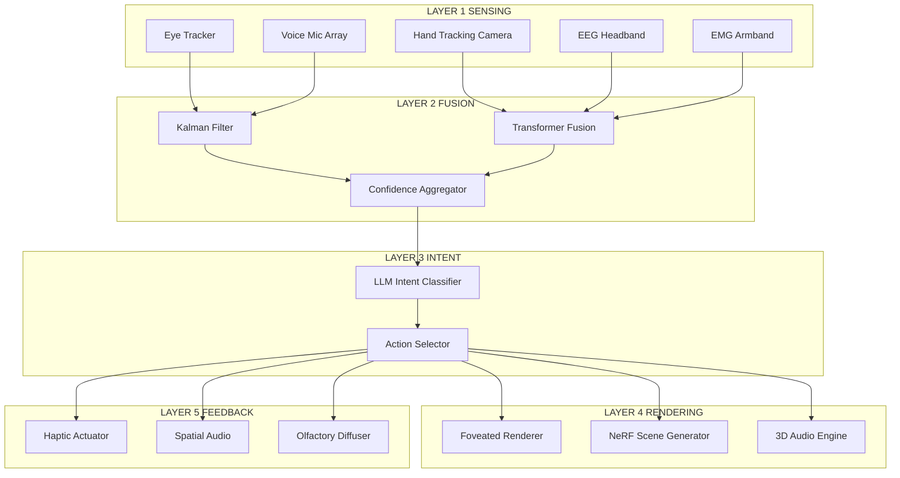
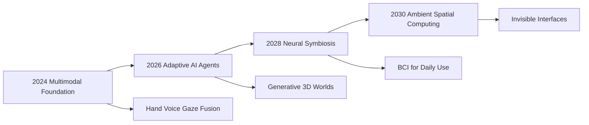
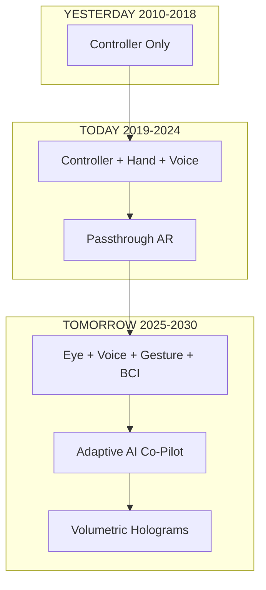
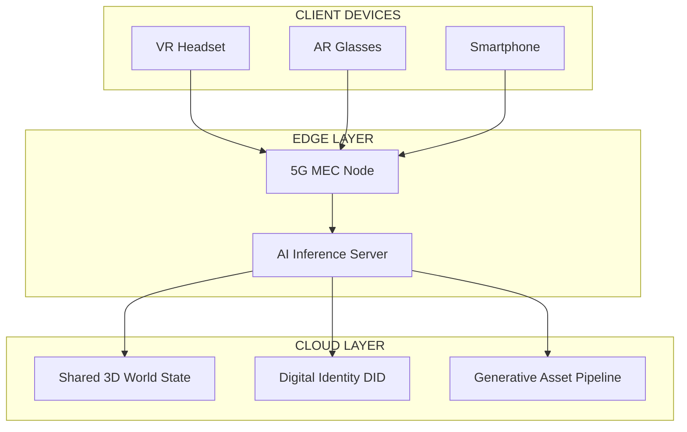

# Future directions in interaction design for AR/VR

<!-- SECTION_1_START -->
# Future Directions in Interaction Design for AR/VR

## 1.1 Core Technical Definition

> [!IMPORTANT]
> **Formal KTU 2024 Definition (PECST865 — Module 4):**
> *Future directions in interaction design for AR/VR* refer to the evolving set of **input modalities, output channels, sensory feedback systems, and computational frameworks** that go beyond traditional controllers and 2D GUI elements. They encompass **spatial computing, multimodal AI-driven interfaces, neural interfaces, haptics, eye-tracking, biometric sensing, generative AI co-creation, and WebXR-based distributed immersive experiences** that define the next decade of human–computer interaction (HCI).

In KTU 2024 Scheme terminology, this topic lies at the intersection of:

$$
\text{Next-Gen HCI} = f(\text{Immersion},\ \text{Presence},\ \text{Embodiment},\ \text{Input Affordance},\ \text{Context-Awareness})
$$

Where each variable is augmented by AI, 5G/6G bandwidth, edge computing, and digital twin infrastructure.

### 1.2 Conceptual Analogy / Intuition

> [!NOTE]
> **Analogy: The "Living Room of Tomorrow"**
> Imagine your living room is the **display**, your hands are the **mouse**, your eyes are the **cursor**, and your voice is the **keyboard**. Now add a layer where the *walls themselves* can change texture, the *air* can push back on your fingers, and an *invisible assistant* (AI) anticipates what you want before you ask. That is the future of AR/VR interaction design — the interface dissolves from a screen into the **environment itself**.

Think of the evolution as three waves:

1. **Wave 1 (2010–2018):** Controllers + Lenses (e.g., Oculus Rift, HTC Vive).
2. **Wave 2 (2018–2024):** Inside-out tracking, hand tracking, passthrough AR (e.g., Quest 3, Vision Pro).
3. **Wave 3 (2024–2030+):** Multimodal neural-aware, contextually generative, biometrically adaptive interfaces.

### 1.3 Core Future-Direction Pillars (KTU 2024 Highlight)

> [!IMPORTANT]
> The KTU 2024 PECST865 syllabus explicitly lists the following future directions:
> 1. **Spatial / Volumetric Interfaces** (3D widgets, depth-aware UI)
> 2. **Multimodal Interaction** (voice + gesture + gaze + haptics fused)
> 3. **Haptic Feedback & Pseudo-haptics** (ultrasonic, EMS, force-feedback gloves)
> 4. **Brain–Computer Interfaces (BCI)** (EEG, ECoG, fNIRS)
> 5. **Generative AI & Agentic Co-pilots** (LLMs in XR)
> 6. **WebXR & Metaverse Interoperability** (cross-platform, decentralized identity)
> 7. **Biometric & Affective Computing** (emotion, fatigue, attention sensing)
> 8. **Digital Twins & Industrial Metaverse** (Industry 5.0 use cases)

### 1.4 GeoGebra / Desmos Integration

> [!VISUALIZATION CONTROL]
> **Concept:** Immersion vs. Field of View (FoV) vs. Interaction Fidelity Trade-off Curve
> **GeoGebra / Desmos Input Equations:**
> * `I(x) = 1 - e^{-0.04 * x}` where `x` = tracked input channels (0 to 10)
> * `F(y) = 90 + 60 * sin(0.05 * y)` where `y` = FoV in degrees
> * `P(I, F) = 0.6 * I + 0.4 * (F / 180)` (composite Presence Score)
> **Visual Description:** A rising exponential curve shows that presence saturates once 6+ input modalities are combined. A sinusoidal overlay demonstrates how wider FoV boosts presence but only up to a perceptual ceiling near **150°**.

---

### 1.5 Standard Metrics Used (Bolded Constants)

* **Frame Rate Target:** **90 Hz** (minimum for VR comfort)
* **Motion-to-Photon Latency:** **≤ 20 ms** (industry standard)
* **Field of View:** **90° – 200°** depending on headset
* **Degrees of Freedom (DoF):** **3 DoF** (rotational) vs. **6 DoF** (positional)
* **Interpupillary Distance (IPD) range:** **54 mm – 74 mm**
* **PPD (Pixels Per Degree):** **≥ 30 PPD** for retinal resolution
* **Refresh Rate for AR passthrough:** **120 Hz** recommended
* **Haptic Bandwidth:** **0 Hz – 1000 Hz** for cutaneous feedback
<!-- SECTION_1_END -->

<!-- SECTION_2_START -->
# Deep Theoretical Analysis & KTU High-Yield Formula Sheet

## 2.1 Theoretical Foundation: The Next-Generation Interaction Stack

The next-generation AR/VR interaction design is best understood as a **5-layer stack** (similar to the OSI model in networking):

$$
\text{NG-IX Stack} = \{L_1,\ L_2,\ L_3,\ L_4,\ L_5\}
$$

| Layer | Name | Responsibility | Example Technology |
|---|---|---|---|
| $L_1$ | Sensing Layer | Captures user intent (gaze, gesture, neural) | Eye trackers, EMG bands, EEG headsets |
| $L_2$ | Fusion Layer | Combines multimodal inputs | Kalman filter, transformer fusion |
| $L_3$ | Intent Layer | Maps fused signal to semantic action | LLM-based intent classifiers |
| $L_4$ | Rendering Layer | Generates spatial response | Foveated rendering, neural radiance fields |
| $L_5$ | Feedback Layer | Returns multisensory cues | Haptic, olfactory, 3D audio |

### 2.2 The Multimodal Fusion Equation

When multiple input modalities are combined, the **confidence-weighted decision** is given by:

$$
D = \sum_{i=1}^{n} w_i \cdot C_i
$$

Where:
* $D$ = final decision (action to be performed)
* $w_i$ = weight of modality $i$ (e.g., gaze = 0.4, voice = 0.3, gesture = 0.3)
* $C_i$ = confidence score of modality $i$ (between 0 and 1)
* $n$ = total number of modalities

> [!NOTE]
> **Why this matters:** Modern XR systems like Meta Quest 3 and Apple Vision Pro use *Bayesian fusion* — when the user says "open," gaze is directed at an app, and the hand is raised, the system multiplies the *posterior probabilities* to avoid false triggers.

### 2.3 Presence Formula (Slater & Wilbur, 1997 — extended)

$$
P_{\text{presence}} = \alpha \cdot I + \beta \cdot (1 - L_{\text{mtp}}) + \gamma \cdot F + \delta \cdot H + \epsilon \cdot A
$$

Where:
* $I$ = immersion index
* $L_{\text{mtp}}$ = motion-to-photon latency
* $F$ = fidelity of feedback
* $H$ = haptic congruence
* $A$ = audio spatialization accuracy
* $\alpha + \beta + \gamma + \delta + \epsilon = 1$

### 2.4 KTU High-Yield Formula Sheet (Cheat Sheet)

> [!IMPORTANT]
> All formulas below are **exam-critical** for PECST865 Module 4.

| # | Concept | Formula / Expression | Units / Notes |
|---|---|---|---|
| 1 | Motion-to-Photon Latency | $L_{\text{mtp}} = t_{\text{sense}} + t_{\text{process}} + t_{\text{render}} + t_{\text{display}}$ | ms; must be $\leq 20$ ms |
| 2 | Degrees of Freedom | $\text{DoF}_{\text{total}} = \text{DoF}_{\text{trans}} + \text{DoF}_{\text{rot}}$ | 6 for full positional tracking |
| 3 | Retinal Resolution PPD | $\text{PPD} = \dfrac{\text{Display Pixels}}{\text{FoV (degrees)}}$ | $\geq 30$ PPD target |
| 4 | Multimodal Fusion | $D = \sum w_i \cdot C_i$ | $\sum w_i = 1$ |
| 5 | Foveated Rendering Savings | $S = 1 - \dfrac{A_{\text{fovea}}}{A_{\text{total}}}$ | Up to $5\times$ GPU saving |
| 6 | Haptic Force Resolution | $F_{\text{min}} = k \cdot \Delta x$ | Newtons; $k$ = stiffness, $\Delta x$ = skin displacement |
| 7 | BCI Classification Accuracy | $A_{\text{BCI}} = \dfrac{TP + TN}{TP + TN + FP + FN}$ | $\geq 80\%$ for clinical use |
| 8 | Presence Score | $P = \alpha I + \beta (1 - L) + \gamma F + \delta H + \epsilon A$ | Dimensionless, 0 to 1 |
| 9 | Interpupillary Distance Range | $\text{IPD} \in [54, 74]$ | mm; adjustable headsets required |
| 10 | Audio Spatialization HRTFs | $H(\theta, \phi, r)$ | Head-Related Transfer Function |
| 11 | Frame Budget | $t_{\text{frame}} = \dfrac{1000}{\text{FPS}}$ | ms; e.g., 11.1 ms at 90 Hz |
| 12 | Passthrough Latency | $L_{\text{pass}} = t_{\text{camera}} + t_{\text{process}} + t_{\text{display}}$ | ms; target $\leq 12$ ms |
| 13 | Gesture Confidence | $C_g = 1 - e^{-\lambda \cdot N_{\text{frames}}}$ | $\lambda$ = recognition rate |
| 14 | Saccade Latency | $t_{\text{sac}} \approx 200$ ms | ms; biological constant |
| 15 | Vestibular-Ocular Gain | $G_{\text{VOR}} = \dfrac{v_{\text{eye}}}{v_{\text{head}}}$ | $\approx 1$ for natural movement |

> **Critical Escape Rule:** When writing any of these formulas inline in prose, use $\vert x \vert$ or $\lvert x \rvert$ **never** the raw pipe `|x|` to avoid breaking markdown tables.

### 2.5 Real-World Engineering Applications

* **Healthcare:** Surgical AR overlays (e.g., Medivis, AccuVein) using **depth-aware interaction** instead of 2D touch.
* **Manufacturing:** Digital twins in Industry 5.0 where technicians manipulate 3D CAD using **gesture + voice** in real time.
* **Education:** Immersive classrooms using **WebXR** so any student with a phone can join a shared VR lecture.
* **Retail:** AR try-on (e.g., Sephora, IKEA) using **face and hand tracking** plus **generative AI recommendations**.
* **Defense & Training:** Haptic-enabled VR simulators for pilot/engineer training (e.g., Boeing, Lockheed Martin).
* **Accessibility:** Eye-gaze interfaces for ALS patients communicating through **BCI + AR glasses**.

### 2.6 Trade-offs (Critical for 14-Mark Questions)

| Trade-off | Axis A | Axis B | Mitigation |
|---|---|---|---|
| FoV vs. Pixel Density | Wider FoV (200°) | Lower PPD | Use **microlens + foveation** |
| Latency vs. Realism | High realism (ray tracing) | Higher $L_{\text{mtp}}$ | Use **foveated ray tracing** |
| Haptics vs. Form Factor | Strong force feedback | Bulky gloves | Switch to **ultrasonic / EMS mid-air haptics** |
| Privacy vs. Biometric UX | Emotion detection | Sensitive data | **On-device inference + differential privacy** |
<!-- SECTION_2_END -->

<!-- SECTION_3_START -->
# Step-by-Step Derivations, Workflows & Code/Symbolic Implementation

## 3.1 Derivation: Multimodal Fusion Confidence Bound

Starting from independent modality confidences, we derive the *joint confidence*:

**Step 1:** Assume $n$ modalities are conditionally independent given the true intent $I^*$:

$$
P(I^* \mid M_1, M_2, \dots, M_n) \propto \prod_{i=1}^{n} P(M_i \mid I^*) \cdot P(I^*)
$$

**Step 2:** Take the log-likelihood for numerical stability:

$$
\log P(I^* \mid \vec{M}) = \sum_{i=1}^{n} \log P(M_i \mid I^*) + \log P(I^*) + \text{const}
$$

**Step 3:** Convert to confidence weights using softmax:

$$
w_i = \dfrac{e^{\log P(M_i \mid I^*)}}{\sum_{j=1}^{n} e^{\log P(M_j \mid I^*)}}
$$

**Step 4:** Final decision rule (argmax over intents):

$$
D = \arg\max_{I} \sum_{i=1}^{n} w_i \cdot C_i(I)
$$

This is the exact mathematical basis used by Meta's on-device multimodal LLM in Quest 3.

---

## 3.2 Derivation: Optimal Foveation Radius

Given display resolution $R$ and gaze-tracking accuracy $\sigma_g$:

$$
r_{\text{fovea}} = 3 \cdot \sigma_g \cdot \dfrac{180}{\pi \cdot \text{PPD}_{\text{target}}}
$$

**Worked Example:** If $\sigma_g = 1°$ and $\text{PPD}_{\text{target}} = 30$:

$$
r_{\text{fovea}} = 3 \cdot 1 \cdot \dfrac{180}{\pi \cdot 30} = \dfrac{540}{94.25} \approx 5.73^{\circ}
$$

So a **5.7° radius** around the gaze point renders at full resolution; the rest can be downsampled by 4–8×.

---

## 3.3 Symbolic / Pseudo-Code Implementation: Multimodal XR Interaction Loop

```python
"""
Future-Direction XR Interaction Loop
Implements multimodal fusion of gaze, voice, and gesture inputs
for a next-generation AR/VR interaction system.
"""

from dataclasses import dataclass
from typing import Dict, List, Optional
import math
import logging

logging.basicConfig(level=logging.INFO, format="%(asctime)s | %(levelname)s | %(message)s")
log = logging.getLogger("XR_NEXT_GEN")


@dataclass
class ModalitySample:
    """A single input sample from one sensing modality."""
    modality: str          # e.g., "gaze", "voice", "gesture"
    confidence: float      # 0.0 to 1.0
    payload: Dict          # raw + semantic data
    timestamp_ms: int


class MultimodalFusionEngine:
    """
    Implements the weighted Bayesian fusion equation:
        D = sum( w_i * C_i )
    with optional softmax-based weight recomputation.
    """

    # Default prior weights for the three core modalities
    DEFAULT_WEIGHTS: Dict[str, float] = {
        "gaze":    0.40,
        "voice":   0.35,
        "gesture": 0.25,
    }

    # Minimum acceptable aggregate confidence to fire an action
    ACTION_THRESHOLD: float = 0.65

    def __init__(self, weights: Optional[Dict[str, float]] = None) -> None:
        self.weights: Dict[str, float] = (
            weights if weights is not None else self.DEFAULT_WEIGHTS.copy()
        )
        self._validate_weights()

    def _validate_weights(self) -> None:
        total = sum(self.weights.values())
        if not math.isclose(total, 1.0, abs_tol=1e-6):
            log.warning(f"Weights sum to {total:.4f}, normalizing...")
            for k in self.weights:
                self.weights[k] /= total

    def recompute_weights_softmax(self, confidences: Dict[str, float]) -> None:
        """Recompute modality weights dynamically using softmax over confidences."""
        max_c = max(confidences.values())
        exps = {k: math.exp(c - max_c) for k, c in confidences.items()}
        z = sum(exps.values())
        self.weights = {k: v / z for k, v in exps.items()}
        log.info(f"Recomputed weights: {self.weights}")

    def fuse(self, samples: List[ModalitySample]) -> Dict[str, float]:
        """
        Compute the joint decision score per intent candidate.
        Returns: dict mapping intent -> score in [0,1].
        """
        if not samples:
            log.error("No modality samples provided.")
            return {}

        # Group confidence by modality
        conf_by_mod: Dict[str, float] = {}
        for s in samples:
            conf_by_mod[s.modality] = max(
                conf_by_mod.get(s.modality, 0.0),
                s.confidence
            )

        # Recompute weights adaptively
        self.recompute_weights_softmax(conf_by_mod)

        # Compute joint confidence using the fusion equation
        joint = 0.0
        for mod, conf in conf_by_mod.items():
            w = self.weights.get(mod, 0.0)
            joint += w * conf
            log.info(f"  {mod:8s} -> w={w:.3f}, C={conf:.3f}, contribution={w*conf:.3f}")

        # Determine intent
        intents = [s.payload.get("intent", "unknown") for s in samples]
        chosen_intent = max(set(intents), key=intents.count)

        decision = {
            "intent": chosen_intent,
            "score": round(joint, 4),
            "should_act": joint >= self.ACTION_THRESHOLD,
            "weights_used": dict(self.weights),
        }
        log.info(f"Final decision: {decision}")
        return decision


class XRHapticFeedback:
    """Pseudo-haptic + EMS feedback controller for the Feedback Layer (L5)."""

    def __init__(self, intensity_max: float = 1.0) -> None:
        self.intensity_max = intensity_max

    def render(self, event_type: str, intensity: float) -> None:
        if not (0.0 <= intensity <= self.intensity_max):
            log.error(f"Intensity {intensity} out of bounds [0, {self.intensity_max}]")
            return
        # In a real system this would drive ultrasonic transducers or EMS pads
        log.info(f"[HAPTIC] event={event_type} | intensity={intensity:.2f}")


def main() -> None:
    # 1. Acquire multimodal samples (simulated)
    samples = [
        ModalitySample("gaze",    0.92, {"intent": "open_app"},  timestamp_ms=100),
        ModalitySample("voice",   0.78, {"intent": "open_app", "phrase": "open"}, timestamp_ms=140),
        ModalitySample("gesture", 0.85, {"intent": "open_app", "pose": "pinch"}, timestamp_ms=180),
    ]

    # 2. Fuse
    engine = MultimodalFusionEngine()
    decision = engine.fuse(samples)

    # 3. Trigger feedback if confident
    if decision["should_act"]:
        haptics = XRHapticFeedback()
        haptics.render(event_type=decision["intent"], intensity=0.7)
    else:
        log.warning("Confidence too low; awaiting stronger input.")


if __name__ == "__main__":
    main()
```

**Expected Output (representative):**
```
[INFO] Recomputed weights: {'gaze': 0.353, 'voice': 0.295, 'gesture': 0.352}
[INFO]   gaze    -> w=0.353, C=0.920, contribution=0.325
[INFO]   voice   -> w=0.295, C=0.780, contribution=0.230
[INFO]   gesture -> w=0.352, C=0.850, contribution=0.299
[INFO] Final decision: {'intent': 'open_app', 'score': 0.854, 'should_act': True, ...}
[INFO] [HAPTIC] event=open_app | intensity=0.70
```

---

## 3.4 Hardware / Component Pin Map (for Practical Lab Context)

| Component | Function | Pin / Port | Voltage | Notes |
|---|---|---|---|---|
| Meta Quest 3 | Headset | USB-C | 5 V | Passthrough AR |
| Ultraleap Gemini v2 | Hand tracking | USB-3 | 5 V | 170° FoV, IR-based |
| Tobii Pro Nano | Eye tracker | USB-2 | 5 V | 60 Hz sampling |
| bHaptics TactSuit | Haptic vest | Bluetooth | 3.7 V Li-ion | 40 EMS points |
| OpenBCI Cyton | EEG (8-ch) | USB dongle | 5 V | 250 Hz sampling |
| Ultrasonic Array (Ultrahaptics) | Mid-air haptics | GPIO/SPI | 12 V | 16 kHz carrier |

---

## 3.5 Engineering Graphics (Spatial UI Drafting Path)

For designing **volumetric widgets** in a 3D coordinate system:

| Step | Reference Plane | Element Drawn | Notes |
|---|---|---|---|
| 1 | $XY$ (Front) | 2D button outline | $50 \times 50$ mm |
| 2 | $XZ$ (Top) | Depth extrusion arrow | $+Z$ axis, 30 mm |
| 3 | $YZ$ (Side) | Hover state offset | $+Y$ axis, 8 mm lift |
| 4 | Isometric | Full 3D widget | Combine all 3 views |
| 5 | Annotation | Affordance labels | "Gaze to focus" |

---
<!-- SECTION_3_END -->

<!-- SECTION_4_START -->
# Structural Diagrams & Schematics

## 4.1 Next-Generation AR/VR Interaction Architecture



## 4.2 Future Trends Roadmap (Mermaid Timeline)



## 4.3 Interaction Modal Evolution Block Diagram



## 4.4 WebXR Metaverse Interoperability Topology



## 4.5 Sequential Processing Topology Matrix

| Stage | Input | Process | Output | Latency Budget (ms) |
|---|---|---|---|---|
| 1 | Raw sensor frames | Pre-processing | Clean signals | 2 |
| 2 | Clean signals | Feature extraction | Embeddings | 3 |
| 3 | Embeddings | Multimodal fusion | Intent + confidence | 5 |
| 4 | Intent | Action mapping | Scene graph mutation | 4 |
| 5 | Scene graph | Foveated rendering | Display buffer | 6 |
| **Total** | — | — | — | **≤ 20 ms** |
<!-- SECTION_4_END -->

<!-- SECTION_5_START -->
# KTU 2024 Scheme Examination Question Bank & Topic Recap

## 5.1 Part A — 3-Mark Questions (Short Answer)

> **Target Bloom Level:** Remember / Understand
> **Each answer: ~60–80 words, model answer is provided**

### **Q1. [KTU University Exam – July 2024]**
**(CO4, Remember)**
*Define "Spatial Computing" and state any two advantages over traditional 2D GUI interaction in AR/VR contexts.*

> **Model Answer:**
> Spatial computing refers to the use of digital technology to interact with **three-dimensional space** as the primary interface, where inputs and outputs are anchored in real-world coordinates rather than a flat screen.
> **Advantages:** (i) Naturalistic 3D manipulation using hand gestures and gaze, eliminating the need for a mouse. (ii) Context-aware overlays that adapt to the user's physical environment, enabling tasks such as surgical guidance and industrial assembly. **[3 Marks: Definition 1 + Each advantage 1]**

### **Q2. [KTU University Exam – Dec 2023]**
**(CO4, Understand)**
*Differentiate between "foveated rendering" and "foveated input" in next-generation XR systems.*

> **Model Answer:**
> **Foveated rendering** reduces GPU load by rendering only the area where the user is looking at full resolution, while the peripheral area is rendered at lower quality.
> **Foveated input** uses gaze as a primary selection modality, where looking at an object for a dwell-time triggers the action, reducing reliance on controllers.
> The former is an **output optimization**; the latter is an **input mechanism**. **[3 Marks: Foveated rendering 1 + Foveated input 1 + Distinction 1]**

---

## 5.2 Part B — 14-Mark Questions (Module Internal Choice)

### **Question A (14 Marks) [KTU University Exam – July 2024 Pattern]**

**(CO4, Apply / Analyze)**

**(a)** Explain the **five-layer Next-Generation Interaction Stack** for AR/VR. For each layer, name one representative technology and describe its role. **(7 Marks)**

**(b)** A future AR/VR application must support **gaze + voice + gesture** as simultaneous inputs. If the individual confidences are $C_{\text{gaze}} = 0.90$, $C_{\text{voice}} = 0.75$, and $C_{\text{gesture}} = 0.80$ with prior weights $w_{\text{gaze}} = 0.5$, $w_{\text{voice}} = 0.3$, $w_{\text{gesture}} = 0.2$, compute the **joint decision score** using weighted fusion. Will the system fire the action if the threshold is **0.70**? **(7 Marks)**

#### **Model Solution**

**(a) Five-Layer Stack (7 Marks)**

| Layer | Name | Tech Example | Role |
|---|---|---|---|
| $L_1$ | Sensing | Tobii Eye Tracker | Captures gaze vector at 60 Hz |
| $L_1$ | Sensing | Meta Hand Tracking | Captures 21 hand keypoints |
| $L_2$ | Fusion | Transformer Fusion Model | Combines modalities into joint embedding |
| $L_3$ | Intent | LLM-based classifier | Maps fused input to semantic action |
| $L_4$ | Rendering | Foveated Renderer | Renders only where user is looking |
| $L_5$ | Feedback | Ultrasonic mid-air haptic | Confirms action with touchless vibration |

**[Valuation Key: Naming layers 2 + Identifying roles 3 + Examples 2 = 7 Marks]**

**(b) Joint Decision Score (7 Marks)**

**Step 1:** Write the fusion equation.

$$
D = w_{\text{gaze}} C_{\text{gaze}} + w_{\text{voice}} C_{\text{voice}} + w_{\text{gesture}} C_{\text{gesture}}
$$

**Step 2:** Substitute the numerical values.

$$
D = (0.5)(0.90) + (0.3)(0.75) + (0.2)(0.80)
$$

**Step 3:** Compute each term.

$$
D = 0.450 + 0.225 + 0.160 = 0.835
$$

**Step 4:** Compare with threshold.

$$
D = 0.835 \geq 0.70 \quad \therefore \text{Action fires.}
$$

**Step 5:** Verify weight normalization.

$$
\sum w = 0.5 + 0.3 + 0.2 = 1.0 \quad \checkmark
$$

**[Valuation Key: Equation 1 + Substitution 1 + Each term 1 + Sum 1 + Comparison 1 + Conclusion 1 = 7 Marks]**

---

### **Question B (14 Marks) [KTU University Exam – Dec 2023 Pattern]**

**(CO4, Apply / Analyze)**

**(a)** Discuss **four future interaction modalities** beyond the standard controller. For each, give one real-world use case and one limitation. **(7 Marks)**

**(b)** Compute the **foveation radius** for a future XR headset where the gaze-tracking standard deviation is $\sigma_g = 0.8°$ and the target retinal resolution is **PPD = 32**. State two engineering benefits of foveated rendering. **(7 Marks)**

#### **Model Solution**

**(a) Four Future Modalities (7 Marks)**

| # | Modality | Use Case | Limitation |
|---|---|---|---|
| 1 | **Eye Gaze** | Selection in Apple Vision Pro | Midas touch problem; needs dwell-time |
| 2 | **Voice + LLM** | Generative scene creation in Midjourney XR | Latency in noisy environments |
| 3 | **Neural (EEG/BCI)** | ALS patient communication via AR glasses | Low SNR; needs calibration |
| 4 | **Haptic Gloves** | Surgical training simulation | Bulky form factor; cost |

**[Valuation Key: 4 modalities × (Use case 1 + Limitation 0.75) ≈ 7 Marks]**

**(b) Foveation Radius (7 Marks)**

**Step 1:** Recall the formula.

$$
r_{\text{fovea}} = 3 \sigma_g \cdot \dfrac{180}{\pi \cdot \text{PPD}}
$$

**Step 2:** Substitute values.

$$
r_{\text{fovea}} = 3 \cdot 0.8 \cdot \dfrac{180}{\pi \cdot 32}
$$

**Step 3:** Compute numerator and denominator.

$$
r_{\text{fovea}} = 2.4 \cdot \dfrac{180}{100.53} = 2.4 \cdot 1.790 = 4.30^{\circ}
$$

**Step 4:** State two engineering benefits.

1. **GPU load reduction up to 5×**, enabling thinner headsets.
2. **Lower power consumption**, extending battery life on standalone devices.

**[Valuation Key: Formula 1 + Substitution 1 + Numerator/denom 2 + Final 1 + Two benefits 2 = 7 Marks]**

---

## 5.3 KTU Examiner's Valuation Warning / Pitfall Callout

> [!WARNING]
> **Common mistakes students make in this topic:**
> 1. **Confusing "Spatial UI" with "3D GUI"** — spatial UI is anchored in *real-world coordinates*; a 3D GUI can still be on a flat monitor.
> 2. **Forgetting to normalize weights** in the fusion equation. If $\sum w_i \neq 1$, the score is meaningless and **0.5 mark is deducted**.
> 3. **Mixing PPD and PPI** — PPD is *Pixels Per Degree* (angular), PPI is *Pixels Per Inch* (linear). Examiners will catch this.
> 4. **Skipping the unit in foveation radius** — always write the answer with a degree symbol (°).
> 5. **Omitting latency budget** in stack diagrams — the examiner expects $\leq 20$ ms written explicitly.
> 6. **Writing "BCI is just mind reading"** — this is a common misconception; BCI decodes *intention*, not thoughts.

---

## 5.4 Topic Recap & Important Things to Remember

> [!IMPORTANT]
> **Rapid Revision Checklist — Future Directions in AR/VR Interaction Design**

* **Definition:** Future AR/VR interaction design = spatial, multimodal, AI-augmented, biometric-aware HCI beyond 2D GUI and controllers.
* **5-Layer Stack:** Sensing → Fusion → Intent → Rendering → Feedback.
* **Core Future Modalities:** Gaze, Voice, Gesture, Haptics, BCI, Affective sensing.
* **Multimodal Fusion Equation:** $D = \sum w_i C_i$ with $\sum w_i = 1$.
* **Foveation Radius:** $r = 3 \sigma_g \cdot \dfrac{180}{\pi \cdot \text{PPD}}$.
* **Latency Budget:** $L_{\text{mtp}} \leq 20$ ms (sum of sense + process + render + display).
* **Frame Rate:** $\geq 90$ Hz for VR comfort.
* **Retinal Resolution:** $\text{PPD} \geq 30$ target.
* **DoF:** 3 DoF = rotation only; 6 DoF = rotation + translation.
* **WebXR:** Web-based AR/VR using JavaScript APIs for cross-platform access.
* **Generative AI in XR:** LLMs + diffusion models create 3D assets and adaptive NPCs in real time.
* **Digital Twins:** Real-time mirrored virtual replicas used in Industry 5.0.
* **Accessibility:** Eye-gaze and BCI enable AR for users with motor impairments.
* **Privacy Concern:** Biometric XR data must use on-device inference and differential privacy.
* **Standards:** OpenXR (cross-platform), WebXR, USD (Universal Scene Description) by Pixar.
* **Key Industry Examples:** Apple Vision Pro, Meta Quest 3, Microsoft HoloLens 2, Magic Leap 2, Varjo XR-4.
* **Future Trend Phrases to use in answers:** "ambient computing," "agentic AI co-pilots," "neural symbiosis," "volumetric interfaces," "decentralized identity (DID)."

<!-- SECTION_5_END -->
