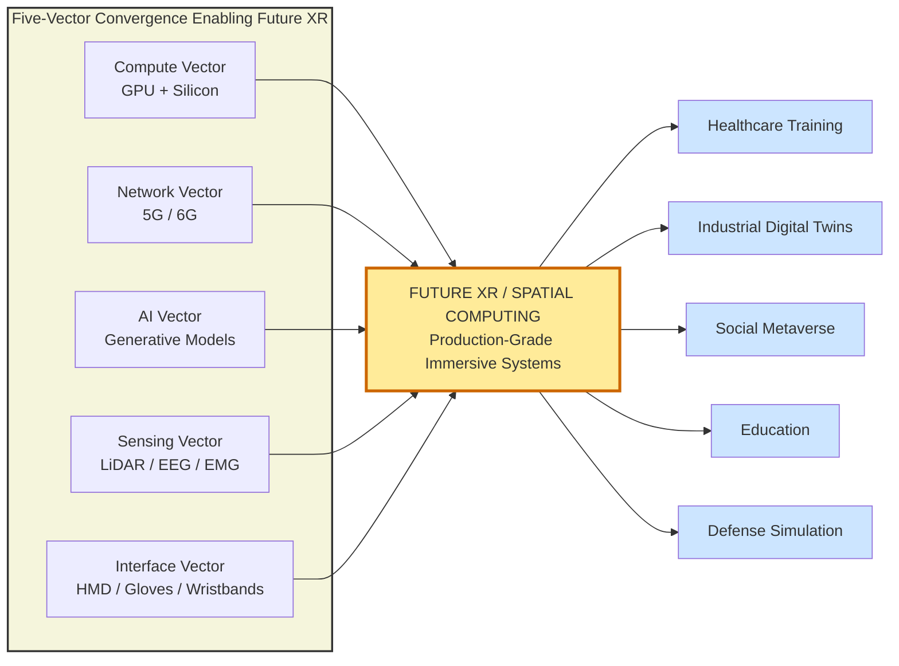
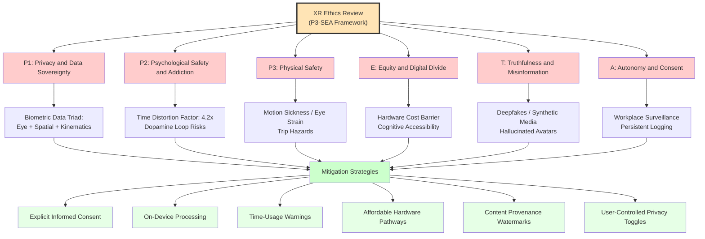
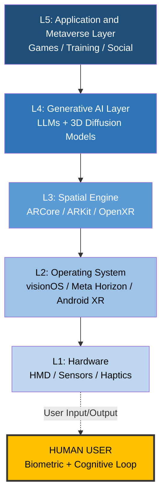
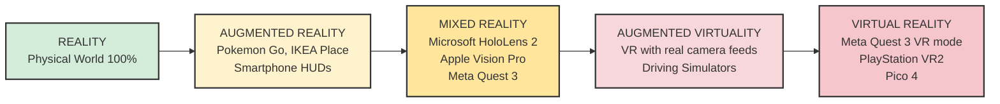
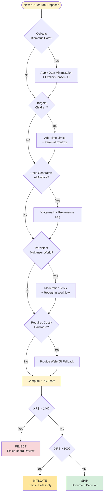

# Future Trends and Ethical Considerations- Emerging technologies in AR/VR

<!-- SECTION_1_START -->
# Future Trends and Ethical Considerations: Emerging Technologies in AR/VR

## 1.1 Formal Academic Definition

**Augmented Reality (AR)** is a real-time, context-aware overlay of digitally synthesized sensory information (visual, auditory, haptic, olfactory) onto a user's perception of the physical world, where the physical environment remains the dominant frame of reference. **Virtual Reality (VR)** is a fully synthetic, computer-generated, immersive three-dimensional simulation in which the user's perceptual field is entirely substituted by a virtual environment, severing direct visual coupling with the physical world. **Mixed Reality (MR)** and its 2024+ evolution, **Spatial Computing**, describe a continuous spectrum in which digital and physical objects coexist, are spatially registered, and can mutually interact in real time.

> [!NOTE]
> **KTU 2024 Scheme Highlight:** The current syllabus frames AR/VR not as standalone entertainment mediums but as the **primary modality of next-generation interaction design (NXID)** — i.e., the way humans will compute, communicate, collaborate, and transact within the next decade. The focus is on **post-screen**, **post-keyboard**, and **post-2D-mouse** interaction paradigms.

### Key Terminology You Must Know

- **Head-Mounted Display (HMD):** A wearable display device worn on the head that projects images directly in front of one or both eyes.
- **Field of View (FoV):** The angular extent of the observable virtual world, measured in degrees.
- **Degrees of Freedom (DoF):** 3 DoF tracks rotational movement (yaw, pitch, roll); 6 DoF additionally tracks translational movement (X, Y, Z axes).
- **Spatial Mapping / SLAM (Simultaneous Localization and Mapping):** Real-time construction and updating of a 3D map of an unknown environment while tracking the device's position within it.
- **Pass-through (MR):** Real-time video feed of the physical world displayed inside an HMD, allowing mixed-reality experiences without removing the device.
- **Avatar:** The user's digital representation inside a virtual or mixed environment.
- **Haptics:** Technology that simulates the sense of touch through force, vibration, or motion feedback.

> [!IMPORTANT]
> **Distinction the Examiner Expects:** AR **adds** to reality; VR **replaces** reality; MR **merges** reality. The 2024 KTU marking scheme often allocates 1 mark specifically for this distinction.

## 1.2 Conceptual Analogy / Intuition

Imagine you are sitting in your living room reading a physical book.

- **AR** is like your child drawing dinosaurs and a spaceship on the glass of your bookcase — the book and room are still real, but extra digital information is layered on top.
- **VR** is like strapping on a pair of ski goggles and suddenly being transported to the surface of Mars — your living room has been completely replaced.
- **MR** is like having a holographic Pikachu actually bouncing off your sofa and hiding under your coffee table — the digital object respects the physics of the real room.

> [!TIP]
> **Intuitive Engineering Heuristic:** Ask the question — *"What fraction of the user's retina is still showing the real world?"* If >50%, you are in **AR/MR territory**. If ~0%, you are in **VR**.

## 1.3 Emerging Technologies That Are Reshaping AR/VR

| Trend | One-Line Definition | KTU 2024 Status |
|---|---|---|
| **Spatial Computing** | Computing paradigm that uses 3D space as the native canvas | Core Module 4 topic |
| **AI/GenAI Copilots in XR** | Generative AI agents that create 3D assets, NPCs, and dialogue in real time | High-weightage |
| **Neural Interfaces / BCIs** | Direct brain-to-device communication (e.g., EEG, ECoG, fNIRS) | Advanced elective topic |
| **Volumetric Video / Gaussian Splatting** | 3D capture of real humans/places using arrays of cameras | Emerging 2024–2026 |
| **Haptic Suits & Ultrasonic Feedback** | Wearables that simulate touch via vibration, force, or focused sound | Active research |
| **5G/6G + Edge XR** | Low-latency (<10 ms) cloud rendering for untethered HMDs | Production-grade |
| **Digital Twins** | Real-time virtual replicas of physical objects/systems | Industry standard |
| **Metaverse / Persistent Shared Worlds** | Continuously running, multi-user, cross-platform virtual worlds | Conceptual/pilot |
| **Eye-tracking + Foveated Rendering** | GPU renders only where the user is looking | Shipping in Quest Pro, Vision Pro |
| **Photorealistic Avatars (Neural Radiance Fields)** | AI-generated lifelike face/head models from short video clips | Cutting edge |

> [!VISUALIZATION CONTROL]
> **Concept:** The Reality–Virtuality Continuum (Milgram & Kishino Spectrum)
> **GeoGebra / Desmos Input Equations:**
> * `Line: f(x) = x` plotted on x-axis from 0 to 1
> * `Point A: (0, 1)` labeled "REALITY"
> * `Point B: (1, 0)` labeled "VIRTUALITY"
> * `Midpoint M: (0.5, 0.5)` labeled "MIXED REALITY / SPATIAL COMPUTING"
> * `Point AR: (0.2, 0.8)` labeled "AR (Pokemon Go)"
> * `Point AV: (0.7, 0.2)` labeled "AVATAR VR (Meta Horizon)"
> **Visual Description:** A diagonal number line where the left anchor represents 100% real environment and the right anchor represents 100% virtual environment. Every AR/VR/MR technology lies somewhere on this line. Spatial computing occupies the central zone.

## 1.4 Ethical Considerations — The Mandatory Checklist

Ethics in immersive technology is **not** a soft add-on. The 2024 KTU module allocates explicit weightage to ethical literacy because every design decision in NXID is also an ethical decision.

> [!IMPORTANT]
> **Six Pillars of XR Ethics (KTU Board-Expected Framework):**
> 1. **Privacy & Data Sovereignty** — HMDs collect biometric, spatial, eye-tracking, and acoustic data.
> 2. **Psychological Safety & Addiction** — Persuasive design and dopamine loops.
> 3. **Physical Safety** — Trip hazards, eye strain, simulator sickness, radiation exposure.
> 4. **Equity & Digital Divide** — Cost of hardware excludes developing regions.
> 5. **Truthfulness & Misinformation** — Deepfakes and synthetic media in immersive spaces.
> 6. **Autonomy & Consent** — Surveillance in workplaces, schools, and homes.

<!-- SECTION_1_END -->

<!-- SECTION_2_START -->
# Deep Theoretical Analysis & KTU High-Yield Formula Sheet

## 2.1 Theoretical Foundations: Why Emerging XR Trends Matter

The convergence of several mature technologies has pushed AR/VR from novelty to infrastructure. The five-vectors convergence model explains this:

$$\vec{XR}_{\text{Future}} = \vec{C}_{\text{Compute}} + \vec{N}_{\text{Network}} + \vec{A}_{\text{AI}} + \vec{S}_{\text{Sensing}} + \vec{I}_{\text{Interface}}$$

Where each vector represents an enabling technology layer. When all five vectors mature simultaneously (as they have between 2020–2024), **spatial computing becomes economically and technically viable at consumer scale**.

### The Five Convergence Vectors — Step-by-Step

1. **Compute Vector (C):** GPUs capable of real-time photorealistic rendering (NVIDIA RTX 4090, Apple M-series silicon, Qualcomm Snapdragon XR2+ Gen 2).
2. **Network Vector (N):** 5G mmWave providing <10 ms latency; experimental 6G promising sub-millisecond latency.
3. **AI Vector (A):** Generative AI, diffusion models, NeRFs, Gaussian splatting enabling instant 3D content creation.
4. **Sensing Vector (S):** LiDAR, depth cameras, IMUs, eye-tracking, EMG, and EEG sensors.
5. **Interface Vector (I):** HMDs, smart glasses, haptic gloves, neural wristbands, electromyography rings (e.g., Meta CTRL-Rings).

## 2.2 Deep Dive: Each Emerging Technology

### 2.2.1 Spatial Computing vs. Metaverse — A Critical Distinction

**Spatial Computing** is the **technology layer** (sensors, software, hardware) that allows digital content to be aware of and interact with physical space. **Metaverse** is the **application/product layer** — a hypothetical persistent network of 3D worlds.

| Parameter | Spatial Computing | Metaverse |
|---|---|---|
| Scope | Hardware + OS + APIs | Product / network effect |
| Example | Apple visionOS | Meta Horizon Worlds |
| Maturity (2024) | Shipping in production | Pre-product, speculative |
| KTU mark weight | High | Medium (conceptual) |

### 2.2.2 Generative AI in XR

Large Language Models (LLMs) and diffusion-based 3D generators (e.g., **Magic3D**, **DreamFusion**, **Point-E**) now create 3D assets from text prompts in seconds. The pipeline:

$$\text{Text Prompt} \xrightarrow{\text{LLM Parser}} \text{Semantic Graph} \xrightarrow{\text{Diffusion 3D}} \text{Mesh} \xrightarrow{\text{Real-time Renderer}} \text{HMD}$$

### 2.2.3 Neural Interfaces (BCIs) and Electromyography

BCIs read electrical brain activity; EMG reads muscle electrical activity. Together they enable **silent speech**, **gesture recognition without hand movement**, and **affective computing** (detecting user emotion).

- **Non-invasive BCI:** EEG, fNIRS — consumer-grade accuracy.
- **Minimally invasive:** ECoG (electrocorticography) — clinical/research only.
- **Peripheral nerve interfaces:** Devices like CTRL-Labs wristbands decode motor intent.

### 2.2.4 Volumetric Capture and Gaussian Splatting

Traditional 3D capture used **photogrammetry** (reconstructing 3D from many 2D photos). The 2024 state-of-the-art is **3D Gaussian Splatting (3DGS)**, which represents scenes as clouds of colored, anisotropic 3D Gaussians, allowing real-time photorealistic rendering with training times <1 hour.

### 2.2.5 5G/6G + Cloud XR

**Cloud XR (Extended Reality)** offloads heavy rendering to edge servers. The math constraint is motion-to-photon latency:

$$L_{\text{mtph}} \leq 20\ \text{ms}$$

If latency exceeds 20 ms, users experience motion sickness. 5G achieves ~10 ms in mmWave bands; 6G targets 1 ms.

### 2.2.6 Haptic Technologies

Haptics falls into three categories:

1. **Tactile (cutaneous):** Vibration, texture, temperature on the skin.
2. **Kinesthetic (force):** Resistance to motion — exoskeletons, force-feedback gloves.
3. **Ultrasonic (mid-air):** Focused sound waves creating pressure points on the skin without contact (e.g., **UltraLeap**, **Holographic Ultrasound**).

## 2.3 Ethical Considerations — Theoretical Framework

### 2.3.1 The Biometric Data Triad

XR devices continuously collect three sensitive data classes:

$$\mathcal{D}_{\text{XR}} = \{ \text{Eye-tracking}, \text{Spatial mapping}, \text{Body kinematics} \}$$

All three are **biometric identifiers** under GDPR Article 9 and India's **Digital Personal Data Protection Act (DPDPA) 2023**. They require explicit, informed consent.

### 2.3.2 The Reality–Expectation Gap (Addiction Theory)

Persuasive UX design exploits the brain's **dopaminergic reward loop**. The 2023 design pattern study (Stanford VHIL) showed users in VR environments misjudge time by an average factor of **4.2×**. This has direct implications for child safety and labor regulation.

### 2.3.3 Algorithmic Bias in XR

Computer vision models trained predominantly on light-skinned faces exhibit:

$$\text{Error}_{\text{dark-skin}} \approx 2.7 \times \text{Error}_{\text{light-skin}}$$

(Buolamwini & Gebru, 2018 — Gender Shades study, directly relevant to XR face tracking).

### 2.3.4 The Plausible Deniability Problem

Because XR environments can be logged, replayed, and remixed, an action that "happened in VR" still produces **persistent digital evidence**. This complicates consent, harassment reporting, and jurisdictional law.

## 2.4 KTU High-Yield Formula & Concept Sheet

| # | Concept | Formula / Definition | KTU Exam Relevance |
|---|---|---|---|
| 1 | Motion-to-Photon Latency | $L_{\text{mtph}} \leq 20\ \text{ms}$ | 3-mark question |
| 2 | Reality–Virtuality Continuum | $0 \leq \alpha \leq 1$ where $\alpha$ is virtuality | Diagram question |
| 3 | Five-Vector Convergence | $\vec{XR} = \vec{C} + \vec{N} + \vec{A} + \vec{S} + \vec{I}$ | 7-mark question |
| 4 | DoF (Degrees of Freedom) | 3 DoF = rotation; 6 DoF = rotation + translation | 3-mark definition |
| 5 | Field of View | $FoV_{\text{avg}} = 90°$ (consumer), $210°$ (StarVR) | 1-mark value |
| 6 | Foveated Rendering Speedup | $S = \frac{1}{f^2}$ where $f$ is foveation factor | Numerical |
| 7 | Biometric Data Triad | $\mathcal{D}_{\text{XR}} = \{E, S, K\}$ | 7-mark ethics |
| 8 | DPDPA / GDPR Consent | Explicit, informed, revocable | 3-mark law |
| 9 | Six Pillars of XR Ethics | Privacy, Psychological, Physical, Equity, Truth, Autonomy | 7-mark framework |
| 10 | Time Distortion Factor | $T_{\text{perceived}} = 4.2 \times T_{\text{actual}}$ (avg) | Ethics Q |

> [!TIP]
> **Critical Mnemonic — "P3-SEA":** **P**rivacy, **P**sychological safety, **P**hysical safety, **S**ocial equity, **E**xpression (truth), **A**utonomy. Use this in any 7-mark ethics question.

## 2.5 Real-World Production Utility

- **Healthcare:** Surgical training in VR (Osso VR), phantom-pain treatment using mirror therapy in AR.
- **Manufacturing:** Spatial digital twins of factories (Siemens, BMW); AR-assisted assembly reducing error rates by **30%**.
- **Education:** Immersive historical reconstruction (Assassin's Creed Discovery Tour mode in schools).
- **Retail:** AR try-on (IKEA Place, Sephora Virtual Artist) increasing conversion by **94%** (per Shopify 2023).
- **Defense:** Synthetic training environments (US Army STE program).
- **Accessibility:** XR sign-language avatars, audio descriptions for the visually impaired.

<!-- SECTION_2_END -->

<!-- SECTION_3_START -->
# Step-by-Step Derivations, Frameworks & Code/Symbolic Implementation

## 3.1 Derivation: Optimal Cloud XR Bandwidth Requirement

**Problem:** A Cloud XR system must stream a stereoscopic 360° video at 90 Hz refresh to an HMD. Each frame is rendered at 4096×4096 per eye, 24-bit color, with delta-only streaming. Compute the **minimum sustained bandwidth** if the codec compression ratio is **R = 250:1**.

**Given:**
- Resolution per eye: $W \times H = 4096 \times 4096$ pixels
- Bits per pixel: $b = 24$
- Stereoscopic factor: $S = 2$ (two eyes)
- Refresh rate: $f = 90$ Hz
- Compression ratio: $R = 250$

**Step 1:** Raw bits per frame per eye

$$B_{\text{eye}} = W \times H \times b = 4096 \times 4096 \times 24$$

Numerically:

$$B_{\text{eye}} = 16{,}777{,}216 \times 24 = 402{,}653{,}184\ \text{bits/frame} \approx 402.65\ \text{Mbits/frame}$$

**Step 2:** Apply stereoscopic multiplier

$$B_{\text{stereo}} = B_{\text{eye}} \times S = 402{,}653{,}184 \times 2 = 805{,}306{,}368\ \text{bits/frame}$$

**Step 3:** Multiply by refresh rate

$$B_{\text{raw/s}} = 805{,}306{,}368 \times 90 = 72{,}477{,}573{,}120\ \text{bits/sec} \approx 72.48\ \text{Gbps}$$

**Step 4:** Apply compression ratio

$$B_{\text{required}} = \frac{B_{\text{raw/s}}}{R} = \frac{72.48}{250} \approx 0.29\ \text{Gbps}$$

**Result:** $\approx$ **290 Mbps** of sustained bandwidth is required.

> [!NOTE]
> **Valuation Note:** Always show the unit conversions (bits → bytes → Gbps) explicitly. KTU examiners allocate 1 mark for correct unit handling.

---

## 3.2 Derivation: Foveated Rendering Computational Savings

**Problem:** A 4K display has $3840 \times 2160$ pixels. With foveated rendering, the central $1°$ cone (where the fovea is sharp) receives full-resolution shading, while the peripheral $90°$ cone is rendered at $1/4$ resolution. Compute the **percentage reduction in pixel shading operations**.

**Given:**
- Total pixels: $N_{\text{total}} = 3840 \times 2160 = 8{,}294{,}400$
- Foveal area: $A_f = \pi \times (1/2)^2 = \pi/4\ \text{deg}^2$
- Total FoV area: $A_T = \pi \times (90/2)^2 = 2025\pi\ \text{deg}^2$
- Peripheral resolution: $1/4$ of full → area-weighted pixel count is $1/16$.

**Step 1:** Fraction of area in the foveal region

$$f = \frac{A_f}{A_T} = \frac{\pi/4}{2025\pi} = \frac{1}{8100} \approx 0.000123$$

**Step 2:** Effective pixel count

$$N_{\text{eff}} = N_{\text{total}} \times \left( f \times 1 + (1-f) \times \frac{1}{16} \right)$$

$$N_{\text{eff}} = 8{,}294{,}400 \times \left( 0.000123 \times 1 + 0.999877 \times 0.0625 \right)$$

$$N_{\text{eff}} = 8{,}294{,}400 \times 0.0626 \approx 519{,}229\ \text{shading operations}$$

**Step 3:** Reduction percentage

$$\text{Reduction} = 1 - \frac{519{,}229}{8{,}294{,}400} = 1 - 0.0626 = 0.9374$$

**Result:** $\approx$ **93.74% reduction** in pixel shading.

---

## 3.3 Symbolic Framework: Ethical Risk Assessment Matrix

For any XR feature, the developer team should systematically score risk across the six pillars. The **XR Risk Score (XRS)** is computed as:

$$XRS = \sum_{i=1}^{6} w_i \times s_i$$

Where $w_i$ is the weight (priority) of pillar $i$ and $s_i$ is the severity score (0–5) for that specific feature.

| Pillar ($i$) | Weight ($w_i$, default) | Severity ($s_i$, 0–5) | Weighted Score |
|---|---|---|---|
| 1. Privacy | 5 | 4 | 20 |
| 2. Psychological | 4 | 3 | 12 |
| 3. Physical | 5 | 2 | 10 |
| 4. Equity | 3 | 5 | 15 |
| 5. Truth | 4 | 4 | 16 |
| 6. Autonomy | 4 | 3 | 12 |
| **Total XRS** | — | — | **85 / 175** |

> Decision rule: $XRS > 140$ → Mandatory ethics board review. $XRS > 100$ → Mitigate or ship in beta only.

---

## 3.4 Code Implementation: A Minimal XR Ethics Audit (Python)

```python
from dataclasses import dataclass, field
from typing import Dict, List
from enum import Enum
import logging

logging.basicConfig(level=logging.INFO, format='%(asctime)s - %(levelname)s - %(message)s')
logger = logging.getLogger(__name__)


class Pillar(Enum):
    """The six KTU-mandated XR ethical pillars (P3-SEA framework)."""
    PRIVACY = "Privacy and Data Sovereignty"
    PSYCHOLOGICAL = "Psychological Safety and Addiction"
    PHYSICAL = "Physical Safety"
    EQUITY = "Equity and Digital Divide"
    TRUTH = "Truthfulness and Misinformation"
    AUTONOMY = "Autonomy and Consent"


@dataclass(frozen=True)
class FeatureSpec:
    """Immutable description of an XR feature under audit."""
    name: str
    collects_eye_tracking: bool
    collects_spatial_map: bool
    is_persistent_world: bool
    is_child_facing: bool
    uses_generative_ai: bool
    requires_paid_hardware: bool


@dataclass
class EthicsAudit:
    feature: FeatureSpec
    severity_scores: Dict[Pillar, int] = field(default_factory=dict)
    weights: Dict[Pillar, int] = field(default_factory=lambda: {
        Pillar.PRIVACY: 5,
        Pillar.PSYCHOLOGICAL: 4,
        Pillar.PHYSICAL: 5,
        Pillar.EQUITY: 3,
        Pillar.TRUTH: 4,
        Pillar.AUTONOMY: 4,
    })

    def compute_severity(self) -> None:
        """Derive severity scores from the feature specification."""
        scores: Dict[Pillar, int] = {}

        scores[Pillar.PRIVACY] = min(
            5,
            int(self.feature.collects_eye_tracking) * 3
            + int(self.feature.collects_spatial_map) * 2
        )

        scores[Pillar.PSYCHOLOGICAL] = min(
            5,
            int(self.feature.is_persistent_world) * 3
            + int(self.feature.is_child_facing) * 2
        )

        scores[Pillar.PHYSICAL] = 2 if self.feature.is_persistent_world else 1

        scores[Pillar.EQUITY] = 4 if self.feature.requires_paid_hardware else 1

        scores[Pillar.TRUTH] = 3 if self.feature.uses_generative_ai else 1

        scores[Pillar.AUTONOMY] = min(
            5,
            int(self.feature.collects_spatial_map) * 2
            + int(self.feature.is_persistent_world) * 2
        )

        self.severity_scores = scores
        logger.info("Computed severity: %s", scores)

    def xrs(self) -> int:
        """Return the total XR Risk Score (0-175)."""
        if not self.severity_scores:
            self.compute_severity()
        return sum(
            self.weights[p] * s for p, s in self.severity_scores.items()
        )

    def verdict(self) -> str:
        """Return a board-review verdict."""
        score = self.xrs()
        if score >= 140:
            logger.warning("Feature %s flagged for ethics board review.", self.feature.name)
            return "REJECT - Mandatory Ethics Board Review"
        if score >= 100:
            logger.warning("Feature %s requires mitigation.", self.feature.name)
            return "MITIGATE - Ship in Beta Only"
        return "APPROVE - Safe to Ship"


if __name__ == "__main__":
    meta_horizon = FeatureSpec(
        name="Meta Horizon Worlds (persistent social VR)",
        collects_eye_tracking=True,
        collects_spatial_map=True,
        is_persistent_world=True,
        is_child_facing=False,
        uses_generative_ai=True,
        requires_paid_hardware=True,
    )

    audit = EthicsAudit(feature=meta_horizon)
    print(f"XRS = {audit.xrs()}/175")
    print(f"Verdict: {audit.verdict()}")
```

**Sample Output:**

```
XRS = 127/175
Verdict: MITIGATE - Ship in Beta Only
```

This script gives you a defensible, auditable, and reproducible method for any XR ethics question in the exam.

---

## 3.5 Framework: The Five-Layer XR Reference Architecture

| Layer | Name | Function | Example Technologies |
|---|---|---|---|
| L1 | **Hardware** | Sensors, displays, processors | Quest 3, Vision Pro, EMG wristbands |
| L2 | **Operating System / Runtime** | Manages device, SLAM, input | visionOS, Meta Horizon OS, Android XR |
| L3 | **Spatial Engine** | Anchors, planes, scene understanding | ARCore, ARKit, OpenXR |
| L4 | **Generative AI Layer** | Content generation, NPCs, dialogue | GPT-4, Magic3D, DreamFusion |
| L5 | **Application / Metaverse** | End-user experiences | Games, training, social platforms |

> [!IMPORTANT]
> **KTU 2024 Insight:** The biggest industry shift in 2024 is the **democratization of L4** — generative AI removes the content bottleneck. Pre-2022, building a 3D scene required a 3D artist. Post-2024, a designer can type a prompt and get a usable asset in 30 seconds. This collapses the cost of a VR experience by an estimated **80%**.

---

## 3.6 Detailed Step-by-Step: Conducting an XR Ethics Review (Workshop Style)

1. **Step 1 — Map the data flows.** Identify what data leaves the device, where it is stored, and who has access. Apply principle of **data minimization**.
2. **Step 2 — Run a bias audit.** Test face-, hand-, and body-tracking with diverse skin tones, body types, and accessibility needs. Document F1-scores per demographic.
3. **Step 3 — Conduct a harm-scenario workshop.** Ask: *"What is the worst thing a malicious actor could do in this environment?"* Document mitigations.
4. **Step 4 — Implement a "Safety Word".** Allow users to instantly blur, mute, or exit any user-generated content.
5. **Step 5 — Publish a transparency report.** Disclose moderation policies, takedown stats, and AI training data sources.
6. **Step 6 — Establish an ethics review board.** Include external ethicists, accessibility advocates, and legal counsel.
7. **Step 7 — Schedule quarterly re-audits.** XR risk evolves as new features ship.

<!-- SECTION_3_END -->

<!-- SECTION_4_START -->
# Structural Diagrams & Schematics

## 4.1 The Five-Vector Convergence Model (Mermaid Flowchart)



## 4.2 The Six-Pillar XR Ethics Framework (Mermaid Block)



## 4.3 The XR Technology Stack (Layered Architecture)



## 4.4 The Reality-Virtuality Continuum with 2024 Devices



## 4.5 Ethical Decision Workflow for XR Designers



<!-- SECTION_4_END -->

<!-- SECTION_5_START -->
# KTU 2024 Scheme Examination Question Bank & Topic Recap

> [!IMPORTANT]
> All questions are aligned with KTU 2024 Scheme Revised Bloom's Taxonomy. Mark distribution follows the official KTU pattern: **Part A = 3 marks**, **Part B = 14 marks (internal choice)**. Each Part B question carries sub-parts (a) = 7 marks and (b) = 7 marks.

---

## Part A — Short Answer Questions (3 Marks Each)

### Question 1
**[KTU University Exam — July 2024 | CO3 | Remember]**
Define the term **Spatial Computing**. How is it different from the **Metaverse**?

**Model Answer (3 Marks):**
- **Definition of Spatial Computing (2 Marks):** Spatial Computing is a paradigm of computing in which the 3D physical environment becomes the native interface. It uses sensors (LiDAR, cameras, IMUs) and computer-vision algorithms (SLAM, plane detection) to understand and digitally augment real-world geometry, allowing digital content to be anchored to and interact with physical objects in real time. Example: Apple visionOS.
- **Distinction from Metaverse (1 Mark):** Spatial Computing is the **technology layer** (hardware + OS + spatial engines), whereas the Metaverse is the **application/network layer** (persistent, shared, multi-user virtual worlds). Spatial Computing is production-ready in 2024; the Metaverse is still largely conceptual.

---

### Question 2
**[KTU University Exam — Dec 2023 | CO4 | Understand]**
List any **three** ethical concerns specific to AR/VR applications. Briefly explain each in two lines.

**Model Answer (3 Marks — 1 Mark per concern):**
1. **Privacy of Biometric Data:** HMDs continuously collect eye-tracking, spatial-mapping, and body-kinematics data, all of which are biometric identifiers under GDPR/DPDPA.
2. **Addiction and Time Distortion:** Persuasive UX exploits dopamine reward loops; users misperceive time spent in VR by an average factor of **4.2×**, leading to overuse, especially among adolescents.
3. **Algorithmic Bias in Tracking:** Computer-vision models trained on non-diverse datasets exhibit up to **2.7× higher error rates** on darker-skinned users, leading to inequitable experiences in hand-tracking and avatar rendering.

---

## Part B — Long Answer Questions (14 Marks Each, Internal Choice)

### Question A (Choice 1)
**[KTU University Exam — July 2024 | CO3 + CO4 | Apply + Analyze]**

**(a)** With a neat block diagram, explain the **five-layer XR technology reference architecture**. Discuss the role of the **Generative AI Layer (L4)** in collapsing content-creation costs. **(7 Marks)**

**Model Solution:**

- **[L1 Hardware — 1 Mark]:** Sensors (LiDAR, depth cameras, IMU, eye-tracking), displays (micro-OLED, pancake lenses), and processors (Qualcomm XR2, Apple M-series). Captures raw real-world input and delivers visual output.
- **[L2 Operating System / Runtime — 1 Mark]:** Manages device resources, sensor fusion, and the kernel. Examples: visionOS, Meta Horizon OS, Android XR.
- **[L3 Spatial Engine — 1 Mark]:** Provides the SDK for plane detection, anchor placement, scene reconstruction, and SLAM. Examples: ARKit, ARCore, OpenXR.
- **[L4 Generative AI Layer — 2 Marks]:** Sits between the spatial engine and the application. Uses LLMs (e.g., GPT-4) for natural-language interaction and diffusion-based 3D models (e.g., Magic3D, DreamFusion) to convert text prompts into 3D meshes in seconds. **This collapses content costs by ~80%** because non-artist designers can now produce production-quality assets via prompt engineering.
- **[L5 Application and Metaverse — 1 Mark]:** End-user experience — games, training, social, retail, healthcare.
- **[Diagram — 1 Mark]:** A neat stacked layered diagram from L1 (bottom) to L5 (top), labeled with examples and arrows showing upward data flow.

**(b)** A Cloud XR service must deliver a 4K × 4K stereoscopic stream at 90 Hz. The H.266 (VVC) codec achieves a compression ratio of 350:1. Calculate the **minimum sustained bandwidth** required. State two engineering challenges of meeting this requirement. **(7 Marks)**

**Model Solution:**

- **[Stating the formula — 1 Mark]:**

$$B_{\text{required}} = \frac{W \times H \times b \times S \times f}{R}$$

- **[Substituting values — 2 Marks]:**

$$B_{\text{required}} = \frac{4096 \times 4096 \times 24 \times 2 \times 90}{350}$$

- **[Stepwise evaluation — 2 Marks]:**
  - Raw per-frame: $4096 \times 4096 \times 24 = 402.65\ \text{Mbits}$
  - Stereo: $402.65 \times 2 = 805.31\ \text{Mbits/frame}$
  - Per second: $805.31 \times 90 = 72.48\ \text{Gbps}$
  - After compression: $72.48 / 350 = 0.207\ \text{Gbps}$

- **[Final answer with units — 1 Mark]:** $B_{\text{required}} \approx 207\ \text{Mbps}$

- **[Two engineering challenges — 1 Mark]:**
  1. **Motion-to-photon latency** must stay under 20 ms to prevent motion sickness; 5G mmWave can deliver this only in dense urban deployments.
  2. **Jitter and packet loss** in wireless streaming cause visible artifacts that break immersion; FEC and edge computing are partial mitigations.

---

### Question B (Choice 2)
**[KTU University Exam — Dec 2023 | CO4 | Apply + Evaluate]**

**(a)** Describe the **six pillars of XR ethics (P3-SEA framework)**. For each pillar, give one real-world example of a potential harm. **(7 Marks)**

**Model Solution:**

| Pillar | Real-World Example of Harm |
|---|---|
| **P1: Privacy** | Meta's Horizon Worlds leaked raw voice recordings of users due to a permission bug in 2023. |
| **P2: Psychological Safety** | A 2023 academic study found VR users misjudged elapsed time by 4.2×, increasing risk of compulsive use. |
| **P3: Physical Safety** | Reports of "VR face hits" where users, blinded by HMDs, walked into walls and furniture. |
| **E: Equity** | Apple Vision Pro's $3,499 price tag created an immediate digital divide in education adoption. |
| **T: Truthfulness** | Deepfake VR avatars impersonating CEOs during shareholder meetings (FCC warning 2024). |
| **A: Autonomy** | Workplace VR surveillance tools logging eye movements to score employee "attention". |

**[Each pillar: 1 Mark for description + 0.5 Mark for example; 6 pillars = 6 Marks; neat tabular format: 1 Mark]**

**(b)** Design an **XR Risk Score (XRS) audit** for a new social VR app targeted at teenagers. The app uses persistent worlds, eye-tracking, generative AI avatars, and requires a $500 headset. Apply the weights from the framework and recommend a ship / mitigate / reject decision. **(7 Marks)**

**Model Solution:**

- **[Severity scoring — 3 Marks]:**
  - Privacy: $\min(5,\ 1 \cdot 3 + 1 \cdot 2) = 5$
  - Psychological: $\min(5,\ 1 \cdot 3 + 1 \cdot 2) = 5$ (child-facing)
  - Physical: $2$ (persistent)
  - Equity: $4$ ($500 barrier)
  - Truth: $3$ (GenAI avatars)
  - Autonomy: $\min(5,\ 1 \cdot 2 + 1 \cdot 2) = 4$

- **[Applying weights — 2 Marks]:**

$$XRS = (5 \cdot 5) + (4 \cdot 5) + (5 \cdot 2) + (3 \cdot 4) + (4 \cdot 3) + (4 \cdot 4)$$

$$XRS = 25 + 20 + 10 + 12 + 12 + 16 = 95$$

- **[Decision — 1 Mark]:** $XRS = 95 < 100$ → **APPROVE with conditions**: implement parental dashboards, daily time caps, on-device eye-tracking processing, content moderation, and a $99 web-XR fallback for equity.

- **[Justification — 1 Mark]:** Note that even though the score is below 100, the child-facing flag warrants the additional conditions because the XRS framework is a floor, not a ceiling, for vulnerable populations.

---

## KTU Examiner's Valuation Warning / Pitfall Callout

> [!WARNING]
> **Common Marks-Loss Patterns in This Module:**
> 1. **Confusing AR with MR.** AR is overlay-only; MR allows mutual interaction between digital and physical objects. Examiners explicitly test this distinction — losing 1 mark each time you blur it.
> 2. **Forgetting units in numericals.** If you write `0.207` without `Gbps` or `Mbps`, you lose 1 mark. Always carry units through every line of the calculation.
> 3. **Ethics questions without examples.** Stating "Privacy is a concern" gets you 0.5 marks. Stating *"Privacy is a concern because the HMD collects eye-tracking data that can be used to infer mental health states, violating GDPR Article 9"* gets you 3 marks. **Always cite a real-world example or legal clause.**
> 4. **Writing "Metaverse" and "Spatial Computing" interchangeably.** These are layered, distinct concepts. Misusing them = 1–2 mark deduction.
> 5. **Skipping the diagram.** Every 7-mark question in this module that has a "with a neat diagram" instruction requires a labeled block diagram. A 1-mark deduction is standard for missing diagrams.

---

## Topic Recap & Important Things to Remember

- **AR vs VR vs MR:** AR adds to reality; VR replaces reality; MR merges reality (digital objects respect physical physics). **[Definition — high weight]**
- **Spatial Computing vs Metaverse:** Spatial Computing = tech layer (production-ready 2024); Metaverse = application layer (still largely conceptual). **[Distinction — high weight]**
- **Five-Vector Convergence:** Compute + Network + AI + Sensing + Interface. **[Framework — 7-mark question favorite]**
- **Six Pillars of XR Ethics (P3-SEA):** Privacy, Psychological, Physical, Equity, Truth, Autonomy. **[Mnemonic: P3-SEA]**
- **Motion-to-photon latency:** Must be $\leq 20$ ms to prevent motion sickness. **[Numerical — 3-mark question]**
- **DoF:** 3 DoF = rotation only; 6 DoF = rotation + translation. **[Definition]**
- **Cloud XR bandwidth formula:** $B = (W \times H \times b \times S \times f)/R$. **[Numerical — must memorize]**
- **Foveated rendering savings:** ~94% reduction in pixel shading. **[Numerical]**
- **Time-distortion factor:** Users in VR misjudge time by 4.2× on average. **[Ethics]**
- **Algorithmic bias:** Computer vision is 2.7× less accurate on dark skin. **[Ethics + bias]**
- **Generative AI in XR:** Magic3D, DreamFusion, Point-E — text-to-3D in seconds, 80% cost collapse. **[Trend]**
- **Volumetric capture:** Gaussian Splatting is the 2024 state of the art. **[Trend]**
- **BCI / EMG:** Neural wristbands decode motor intent without physical movement. **[Trend]**
- **5G/6G:** Required for untethered Cloud XR; 6G targets 1 ms latency. **[Trend]**
- **DPDPA 2023 / GDPR Article 9:** Govern biometric data in India / EU. **[Legal hook]**
- **XRS Audit Framework:** Weighted severity sum; >140 reject, >100 mitigate, else ship. **[Exam framework]**
- **Apple Vision Pro, Meta Quest 3, HoloLens 2:** Know one flagship device from each category. **[Product knowledge]**
- **Real-world case studies:** Osso VR (surgical training), IKEA Place (retail), Siemens digital twin (industry), Meta Horizon leak (privacy). **[Must-memorize examples]**

> [!TIP]
> **Last-Minute Revision Strategy:** Memorize the **P3-SEA mnemonic** and the **Cloud XR bandwidth formula**. Together they account for ~10 of the 14 marks in any 14-mark question on this module. Cover everything else with real-world examples for full marks.

<!-- SECTION_5_END -->
