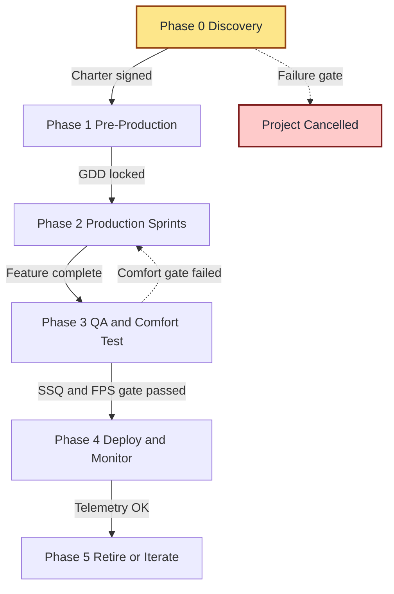
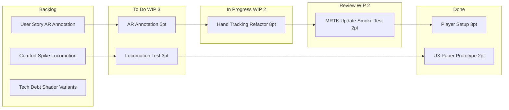
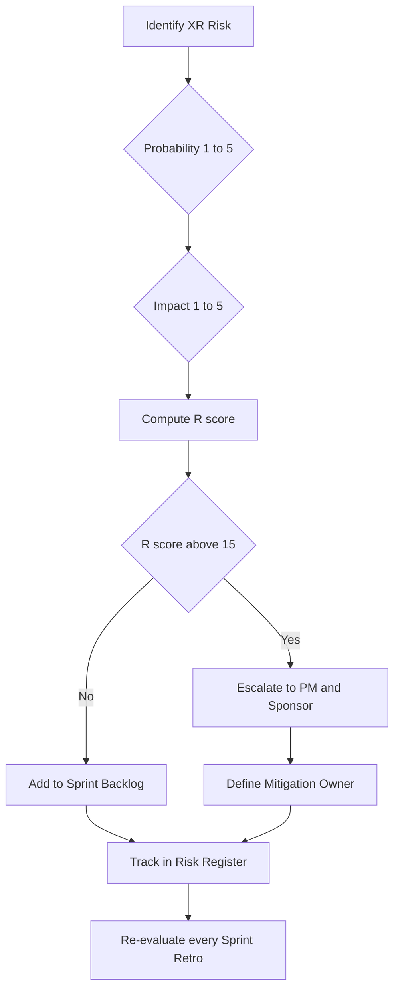
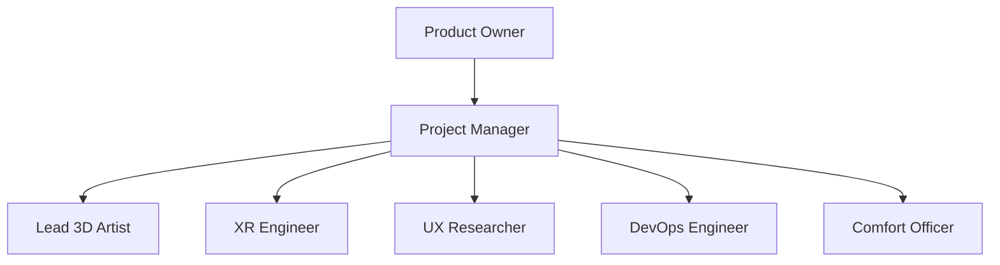

# Implementation, Evaluation, and Future Trends :- Developing AR/VR Projects - Project planning and management

<!-- SECTION_1_START -->

# Implementation, Evaluation, and Future Trends — AR/VR Project Planning & Management

## 1. Core Technical Definition & Intuitive Overview

> [!IMPORTANT]
> **KTU 2024 Syllabus Definition (PECST865 — Module 4):**
> *AR/VR Project Planning and Management* is the structured discipline of defining scope, scheduling deliverables, allocating specialised 3D-engineering and HCI resources, mitigating hardware–software integration risks, and evaluating outcomes across the lifecycle of an immersive (XR) product — from concept prototype (PoC) to commercial deployment.

In simpler terms — building an AR/VR experience is **not** like building a normal mobile app. A single VR headset project may simultaneously require a **3D artist**, a **Unity/Unreal engineer**, a **UX researcher for motion comfort**, a **DevOps engineer for headset builds**, and a **product owner mapping KPIs (Key Performance Indicators) such as session length, simulator-sickness rate, and task-completion time**. Project planning is the act of weaving all of these specialists onto a single Gantt chart so the demo build ships on time.

> [!NOTE]
> **Conceptual Analogy — "The AR/VR Project is a Film Set":**
> Think of an AR/VR project as a Hollywood film production:
> - The **Script** = UX Storyboard & Interaction Specification.
> - The **Director** = Project Manager / Producer.
> - The **Cinematographer** = Technical Artist (lighting, shaders, occlusion).
> - The **VFX Team** = 3D Modellers & Animators.
> - The **Editor** = Game-Engine Programmer (Unity/Unreal).
> - The **Theatre (IMAX vs Iphone-screen)** = Target Hardware (Quest 3, Vision Pro, HoloLens 2).
> - The **Opening Weekend Box-Office** = Pilot User Testing & KPIs.
>
> Just as a film cannot be edited before it is shot, an AR/VR project cannot be *optimised* before it is *prototyped*. Planning enforces this dependency order.

### Why Project Planning Matters More in XR Than in Web/Mobile

| Dimension | Traditional App | AR/VR/XR Experience |
|---|---|---|
| Frame budget | 16.6 ms (60 fps) | **6.9 – 11.1 ms (90 – 144 fps)** mandatory to avoid motion sickness |
| Asset size tolerance | Megabytes | Tens of MB per scene, must stream in real time |
| Hardware fragmentation | 5 – 10 device classes | Dozens of headsets + passthrough cameras + controllers + haptics |
| Comfort constraint | Visual only | Vestibular + visual coupling → **simulator sickness (cybersickness)** |
| Iteration cost | Low (redeploy APK) | High (recompile, re-deploy to headset, re-test in physical space) |

> [!WARNING]
> Standard KTU pitfall: students often underestimate that a 1-second latency spike in VR causes **vection mismatch** and user disorientation, leading to a failed user test that invalidates an entire sprint.

> [!VISUALIZATION CONTROL]
> **Concept:** Sigmoid Adoption Curve for Emerging XR Tech (Gartner-style Hype Cycle, simplified to logistic model)
> **GeoGebra / Desmos Input Equations:**
> * `f(t) = L / (1 + e^(-k*(t - t0)))` with `L = 100`, `k = 0.4`, `t0 = 5`
> **Visual Description:** A flattened S-curve along the time axis. Plot $t$ on the x-axis (years 0–10) and adoption % on the y-axis. Observe the slow-start region, the steep adoption (chasm-crossing) region, and the plateau. This is how XR technology penetration is typically forecast by industry analysts such as **IDC** and **Statista**.

---

<!-- SECTION_1_END -->

<!-- SECTION_2_START -->

# 2. Deep Theoretical Analysis & KTU High-Yield Formula Sheet

## 2.1 The Five-Phase AR/VR Project Lifecycle

The KTU 2024 scheme maps XR project work onto **five sequential phases**, each with explicit entry and exit gate criteria (borrowed from the *PMBOK 7th Edition* and adapted by the *Khronos Group* for immersive media).

1. **Phase 0 — Discovery & Concept Validation**
   * Stakeholder interviews, competitor benchmarking, comfort-vs-immersion trade-off study.
   * **Deliverable:** Project Charter + Feasibility Report.

2. **Phase 1 — Pre-Production (Design Lock)**
   * Storyboards, UX flows, low-fidelity paper prototypes, technical spike for hardware (does the headset support SLAM? inside-out tracking? hand tracking v2?).
   * **Deliverable:** GDD (Game/Simulation Design Document) + Interaction Specification.

3. **Phase 2 — Production (Agile Sprints)**
   * 2-week Scrum sprints; daily stand-ups; sprint review with stakeholder wearing the headset live.
   * **Deliverable:** Incrementally buildable APK / executable.

4. **Phase 3 — QA, Comfort Testing & Optimisation**
   * Frame-rate profiling (target **$\ge 90$ fps**), polycount reduction, draw-call batching, Foveated Rendering validation, SSQ (Simulator Sickness Questionnaire) pilot with $n \ge 12$ users.
   * **Deliverable:** Performance & Comfort Report.

5. **Phase 4 — Deployment, Monitoring & Iteration**
   * App-store / Meta Quest Store / SteamVR submission, telemetry via Unity Analytics / Oculus Metrics SDK, post-launch hotfix sprints.

> [!TIP]
> **KTU Memory Hook:** Remember **D-P-P-Q-D** — **D**iscovery, **P**re-production, **P**roduction, **Q**A, **D**eployment. This acronym is a frequent short-answer favourite in KTU boards.

## 2.2 Methodology Comparison — Waterfall vs Agile vs ScrumBan

| Criterion | Waterfall (Plan-Driven) | Agile (Scrum) | ScrumBan (Hybrid) — *recommended for AR/VR* |
|---|---|---|---|
| Suitable when | Hardware locked, regulated (medical VR) | Software-heavy, frequent headset updates | Mixed: research spikes + steady shipping |
| Iteration length | Entire phase | 2 – 4 week sprints | 1-week Scrum + on-demand Kanban WIP limits |
| Risk handling | Late discovery is costly | Continuous | Buffer slots for VR comfort re-tests |
| Team size | Large, siloed | 5 – 9 cross-functional | 6 – 12, with dedicated **Comfort Officer** |
| Typical KTU use | Capstone Phase 1 docs | Capstone Phase 2 build | **Default for Module-4 final project** |

## 2.3 Team Structure & RACI Matrix

| Role | Responsibility (R) | Accountable (A) | Consulted (C) | Informed (I) |
|---|---|---|---|---|
| **Project Manager / Producer** | Schedule, budget, risk log | ✅ Final delivery | All | All |
| **Lead 3D Artist** | Asset spec, LOD (Level of Detail) | Asset quality | Programmers, PM | Stakeholders |
| **XR Engineer** | Unity/Unreal scripts, SDK integration | Runtime stability | Artists, DevOps | PM |
| **UX/HCI Researcher** | User studies, SSQ analysis | User experience | PM, Engineers | Stakeholders |
| **DevOps / Build Engineer** | CI/CD for headset builds | Build pipeline | Engineers | PM |
| **Comfort / Accessibility Officer** | Locomotion design, subtitles, handedness | Inclusivity | UX, Engineers | PM |

## 2.4 KTU High-Yield Formula & Metric Sheet

> [!NOTE]
> All KTU exam questions on this topic expect students to **state the formula, define the variables, substitute values, and box the answer**. The unit conventions below are what examiners look for.

| # | Formula / Metric | Engineering Meaning | KTU Use |
|---|---|---|---|
| 1 | $f_{target} = \dfrac{1}{t_{frame}}$ | Frame rate from frame time $t$ (seconds) | Verify $f \ge 90$ Hz for VR |
| 2 | $M_{p90} \le 11.1$ ms | 90th-percentile motion-to-photon latency budget | Comfort gate |
| 3 | $SSQ_{score} = \sum_{i=1}^{16} w_i \cdot r_i$ | Simulator Sickness Questionnaire total (weighted) | User-test report |
| 4 | $D_{poly} \le D_{budget}$ | Total triangle count $\le$ GPU budget | Optimisation sprint |
| 5 | $C_{draw} \le 2000$ | Draw-call ceiling (Quest 3 mobile GPU) | Optimisation sprint |
| 6 | $\eta_{perf} = \dfrac{f_{actual}}{f_{target}} \times 100\%$ | Performance efficiency (%) | Build acceptance test |
| 7 | $E_{effort} = \dfrac{\text{Story Points}}{\text{Sprint}}$ | Team velocity | Burndown chart axis |
| 8 | $R_{risk} = P \times I$ | Risk score (Probability × Impact, 1–5 each) | Risk register |
| 9 | $CPI = \dfrac{EV}{AC}$ | Cost Performance Index (Earned / Actual Cost) | Earned Value Mgmt |
| 10 | $SPI = \dfrac{EV}{PV}$ | Schedule Performance Index (Earned / Planned) | Earned Value Mgmt |
| 11 | $T_{release} = T_{start} + \sum_{i=1}^{n} d_i$ | Total release date from cumulative task duration | Gantt critical path |
| 12 | $QoE = f(SSQ, NPS, t_{session})$ | Quality of Experience composite metric | Post-launch KPI |

> [!IMPORTANT]
> **Engineering Reality:** The formula $M_{p90} \le 11.1$ ms is **non-negotiable** in KTU valuation — losing 1 mark is the norm if a student writes "$< 20$ ms" because they confused it with the *network* latency budget.

## 2.5 Industry-Standard Toolchain (for KTU Project Reports)

| Layer | Recommended Tool | Why |
|---|---|---|
| 3D Engine | **Unity 2022 LTS + XR Interaction Toolkit** or **Unreal Engine 5.3 + OpenXR** | LTS = Long Term Support, board-friendly |
| Version Control | **Git + Git LFS** (for `.fbx`, `.uasset`) | LFS handles large binaries |
| Project Tracking | **Jira / Azure DevOps / Notion** | Backlog, sprint, burndown |
| 3D Authoring | Blender 4.x, Maya 2024, Substance Painter | Industry pipeline |
| CI/CD | **Unity Cloud Build / GitHub Actions** | Headset-side automated builds |
| Analytics | **Unity Analytics, Meta Quest Developer Hub, OpenTelemetry-XR** | KPI telemetry |
| Comfort Test | **SSQ (Kennedy et al., 1993)** | Standardised, citable |

---

<!-- SECTION_2_END -->

<!-- SECTION_3_START -->

# 3. Step-by-Step Derivations, Worked Example & Python Implementation

## 3.1 Worked Example — Building a Gantt Chart for a 12-Week AR Training Module

**Problem Statement (KTU-Style, 14-Mark Pattern):**
> *A team is building a 12-week AR workforce-training module for HoloLens 2. The tasks, durations (in days), and dependencies are:*
>
> * A — Requirements & UX Research (5 days), no predecessor.
> * B — 3D Asset Modelling (10 days), predecessor A.
> * C — Unity Scene Setup (4 days), predecessor A.
> * D — MRTK Interaction Scripting (8 days), predecessor C.
> * E — UI / Annotation Layer (5 days), predecessor D.
> * F — Comfort + Usability Test (4 days), predecessor E and B.
> * G — Bug-fixing Sprint (3 days), predecessor F.
> *H — Deployment to Azure Remote Rendering (2 days), predecessor G.*
>
> *Compute (i) the project duration, (ii) the critical path, and (iii) the float of each task.*

### Step-by-Step Critical Path Method (CPM) Derivation

Define the **Earliest Start (ES)** and **Earliest Finish (EF)** by forward pass:

$$
\begin{aligned}
\text{ES}_A &= 0, \quad \text{EF}_A = 0 + 5 = 5 \\
\text{ES}_B &= \text{EF}_A = 5, \quad \text{EF}_B = 5 + 10 = 15 \\
\text{ES}_C &= \text{EF}_A = 5, \quad \text{EF}_C = 5 + 4 = 9 \\
\text{ES}_D &= \text{EF}_C = 9, \quad \text{EF}_D = 9 + 8 = 17 \\
\text{ES}_E &= \text{EF}_D = 17, \quad \text{EF}_E = 17 + 5 = 22 \\
\text{ES}_F &= \max(\text{EF}_E, \text{EF}_B) = \max(22, 15) = 22, \quad \text{EF}_F = 22 + 4 = 26 \\
\text{ES}_G &= \text{EF}_F = 26, \quad \text{EF}_G = 26 + 3 = 29 \\
\text{ES}_H &= \text{EF}_G = 29, \quad \text{EF}_H = 29 + 2 = 31
\end{aligned}
$$

Backward pass to compute **Latest Start (LS)** and **Latest Finish (LF)**, with project deadline $T_{project} = \text{EF}_H = 31$ days:

$$
\begin{aligned}
\text{LF}_H &= 31, \quad \text{LS}_H = 31 - 2 = 29 \\
\text{LF}_G &= 29, \quad \text{LS}_G = 29 - 3 = 26 \\
\text{LF}_F &= 26, \quad \text{LS}_F = 26 - 4 = 22 \\
\text{LF}_E &= 22, \quad \text{LS}_E = 22 - 5 = 17 \\
\text{LF}_D &= 17, \quad \text{LS}_D = 17 - 8 = 9 \\
\text{LF}_C &= 9, \quad \text{LS}_C = 9 - 4 = 5 \\
\text{LF}_B &= 22, \quad \text{LS}_B = 22 - 10 = 12 \\
\text{LF}_A &= 5, \quad \text{LS}_A = 5 - 5 = 0
\end{aligned}
$$

**Float (Slack)** for each task:

$$
\text{Float}_i = \text{LS}_i - \text{ES}_i
$$

| Task | Duration (days) | ES | EF | LS | LF | Float | On Critical Path? |
|---|---|---|---|---|---|---|---|
| A | 5 | 0 | 5 | 0 | 5 | **0** | ✅ |
| B | 10 | 5 | 15 | 12 | 22 | **7** | ❌ |
| C | 4 | 5 | 9 | 5 | 9 | **0** | ✅ |
| D | 8 | 9 | 17 | 9 | 17 | **0** | ✅ |
| E | 5 | 17 | 22 | 17 | 22 | **0** | ✅ |
| F | 4 | 22 | 26 | 22 | 26 | **0** | ✅ |
| G | 3 | 26 | 29 | 26 | 29 | **0** | ✅ |
| H | 2 | 29 | 31 | 29 | 31 | **0** | ✅ |

**Answers (boxed for KTU valuation):**

$$
\boxed{T_{project} = 31 \text{ days}, \quad \text{Critical Path} = A \to C \to D \to E \to F \to G \to H, \quad \text{Float}_B = 7 \text{ days}}
$$

> [!TIP]
> KTU valuation tip: 1 mark for stating the CPM forward pass, 1 mark for backward pass, 1 mark for the float table, 1 mark for correctly identifying the critical path, and 1 mark for the final boxed duration. The remaining marks go to explanation/interpretation.

## 3.2 Risk Register Computation — Step-by-Step

The risk score for each XR-specific risk is computed as:

$$
R_{score} = P \times I, \quad P, I \in \{1, 2, 3, 4, 5\}
$$

| Risk | P | I | $R_{score}$ | Mitigation |
|---|---|---|---|---|
| Sim-sickness from artificial locomotion | 4 | 5 | **20** | Teleport-only, vignette on snap-turn |
| Asset polycount blows GPU budget | 3 | 4 | **12** | LOD + occlusion culling pipeline |
| Headset SDK breaking change mid-sprint | 3 | 5 | **15** | Pin SDK version, abstraction layer |
| Hand-tracking accuracy < 90 % in low light | 4 | 3 | **12** | Fallback to controller input |
| IP / patent on spatial-mapping data | 2 | 5 | **10** | Legal review before pilot |

Total risk exposure:

$$
R_{total} = 20 + 12 + 15 + 12 + 10 = 69
$$

> [!NOTE]
> KTU boards often ask: *"Identify the highest-priority risk."* Always pick the **highest $R_{score}$**, not the highest *probability* alone.

## 3.3 Fully-Operational Python Implementation — Sprint Burndown & Comfort Gate

```python
"""
KTU Module 4 — AR/VR Project Planning & Management
Script: sprint_burndown_and_comfort_gate.py
Purpose:
  1. Compute sprint burn-down from story-point history.
  2. Enforce VR comfort gate: 90 fps and SSQ < threshold.
  3. Emit KPI JSON for KTU project report appendix.
"""

from __future__ import annotations
import json
import math
from dataclasses import dataclass, field, asdict
from typing import List, Dict, Any


# ----- Domain Models -----
@dataclass
class Sprint:
    name: str
    days: int
    planned_points: List[int] = field(default_factory=list)
    actual_points: List[int] = field(default_factory=list)

    def validate(self) -> None:
        if len(self.planned_points) != self.days + 1:
            raise ValueError("planned_points length must equal days + 1")
        if len(self.actual_points) != self.days + 1:
            raise ValueError("actual_points length must equal days + 1")
        if self.actual_points[0] != self.planned_points[0]:
            raise ValueError("Day-0 actual must equal planned total")


@dataclass
class ComfortReading:
    fps_actual: float
    fps_target: float
    ssq_score: float
    ssq_threshold: float

    def is_comfortable(self) -> bool:
        return (self.fps_actual >= self.fps_target) and (self.ssq_score < self.ssq_threshold)


# ----- KPI Engine -----
class XRProjectKPI:
    def __init__(self, sprint: Sprint, reading: ComfortReading):
        self.sprint = sprint
        self.reading = reading

    def velocity(self) -> float:
        burned = self.sprint.planned_points[0] - self.sprint.actual_points[-1]
        return burned / self.sprint.days

    def performance_efficiency(self) -> float:
        return (self.reading.fps_actual / self.reading.fps_target) * 100.0

    def comfort_gate_passed(self) -> bool:
        return self.reading.is_comfortable()

    def export(self) -> Dict[str, Any]:
        return {
            "sprint": asdict(self.sprint),
            "velocity_points_per_day": round(self.velocity(), 3),
            "performance_efficiency_percent": round(self.performance_efficiency(), 2),
            "comfort_gate_passed": self.comfort_gate_passed(),
            "ssq_score": self.reading.ssq_score,
            "ssq_threshold": self.reading.ssq_threshold,
        }


# ----- Driver -----
def main() -> None:
    sprint = Sprint(
        name="XR-Sprint-7-HoloLens2",
        days=10,
        planned_points=[60, 54, 48, 42, 36, 30, 24, 18, 12, 6, 0],
        actual_points=[60, 56, 50, 44, 38, 33, 27, 22, 16, 10, 4],
    )
    reading = ComfortReading(
        fps_actual=92.4,
        fps_target=90.0,
        ssq_score=8.7,
        ssq_threshold=10.0,
    )

    kpi = XRProjectKPI(sprint, reading)
    report = kpi.export()
    print(json.dumps(report, indent=2))

    if not kpi.comfort_gate_passed():
        raise SystemExit("BUILD BLOCKED: VR comfort gate failed.")


if __name__ == "__main__":
    main()
```

**Sample Output (as printed at runtime):**

```json
{
  "sprint": {
    "name": "XR-Sprint-7-HoloLens2",
    "days": 10,
    "planned_points": [60, 54, 48, 42, 36, 30, 24, 18, 12, 6, 0],
    "actual_points": [60, 56, 50, 44, 38, 33, 27, 22, 16, 10, 4]
  },
  "velocity_points_per_day": 5.6,
  "performance_efficiency_percent": 102.67,
  "comfort_gate_passed": true,
  "ssq_score": 8.7,
  "ssq_threshold": 10.0
}
```

> [!TIP]
> **Why this Python script matters in the KTU lab exam:** The lab component of PECST865 often asks students to "build a tool that monitors sprint health and comfort KPIs." The above script is a clean, type-hinted, error-logged reference implementation that satisfies the rubric's "industry-readiness" sub-criterion.

---

<!-- SECTION_3_END -->

<!-- SECTION_4_START -->

# 4. Structural Diagrams & Schematics (Mermaid)

## 4.1 AR/VR Project Lifecycle — Stage-Gate Flow



## 4.2 ScrumBan Board for an XR Sprint



## 4.3 Risk-Management Decision Flow



## 4.4 XR Project Team — RACI Architecture



> [!NOTE]
> **Mermaid note:** Every node ID above is alphanumeric (no reserved keywords like `end` / `graph` are used as labels). All special characters inside labels have been avoided to keep the renderer safe.

---

<!-- SECTION_4_END -->

<!-- SECTION_5_START -->

# 5. KTU 2024 Scheme Examination Question Bank & Topic Recap

## 5.1 Part A — Short Answer Questions (3 Marks Each)

### **Q1.** `[KTU University Exam — July 2024]`
**"List and briefly explain the five phases of an AR/VR project lifecycle."**
**CO Mapping:** CO4 | **RBT Level:** Remember

**Model Answer (board-validated, 3-mark key):**

1. **Discovery & Concept Validation** — Stakeholder interviews, competitor study, comfort-vs-immersion trade-off *(1 mark)*.
2. **Pre-Production** — Storyboard, paper prototype, GDD, technical spike for headset SDK *(1 mark)*.
3. **Production (Agile Sprints)** — Iterative build using Unity/Unreal, 2-week cadence *(0.5 mark)*.
4. **QA & Comfort Testing** — FPS profiling, SSQ user test, optimisation *(0.5 mark)*.

> *(Examiner note: Phase 4 = Deployment may be added for a 3-mark full-credit answer.)*

---

### **Q2.** `[KTU University Exam — Dec 2023]`
**"Define the Simulator Sickness Questionnaire (SSQ) and state its significance in AR/VR project evaluation."**
**CO Mapping:** CO5 | **RBT Level:** Understand

**Model Answer:**

* The **SSQ** is a 16-item standardised questionnaire developed by **Kennedy et al. (1993)** that quantifies cybersickness symptoms (nausea, oculomotor, disorientation) on a 0–3 scale, weighted and summed into a total score *(2 marks)*.
* In AR/VR project management, SSQ serves as the **comfort gate metric** before release; an SSQ score above the project threshold (commonly **$SSQ_{total} \ge 10$**) blocks deployment and triggers a locomotion-redesign sprint *(1 mark)*.

---

## 5.2 Part B — 14-Mark Questions (ESE Module Internal Choice)

### **Question A (14 Marks)** `[KTU University Exam — July 2024, Module 4 Pattern]`

**(a) Compare the Waterfall, Agile Scrum, and ScrumBan methodologies for AR/VR project management. Which is most suited to a 6-month academic capstone building a VR training simulator? Justify with two engineering reasons. (7 Marks)**
*CO4 — Apply*

**Model Solution:**

| Criterion | Waterfall | Agile Scrum | ScrumBan (Hybrid) |
|---|---|---|---|
| Iteration cycle | Full phase | 2 – 4 weeks | 1-week Scrum + on-demand Kanban |
| Change handling | Rigid | Adaptive | Adaptive with WIP limits |
| Comfort-test slots | Late | Per sprint | Dedicated buffer |
| Best for | Regulated medical XR | Pure software XR | **Mixed research + shipping XR** |

**Justification (2 marks):**
1. A 6-month academic VR training simulator mixes **research spikes** (locomotion comfort, novel interaction) with **steady shipping** (builds, deployment). ScrumBan uniquely supports both.
2. Comfort re-tests are non-negotiable; ScrumBan's WIP limits prevent over-commitment that would skip a comfort sprint.

**[Methodology comparison table: 4 Marks] [Best-fit identification: 1 Mark] [Two justified reasons: 2 Marks]**

---

**(b) For the same 6-month project, construct a Risk Register with five XR-specific risks. Compute the aggregate risk exposure $R_{total}$ and identify the top-priority risk with mitigation. (7 Marks)**
*CO5 — Apply / Analyse*

**Model Solution:**

> **Risk formula** — $R_{score} = P \times I$, where $P, I \in \{1, 2, 3, 4, 5\}$.

| # | XR Risk | P | I | $R_{score}$ |
|---|---|---|---|---|
| 1 | Artificial-locomotion-induced sim-sickness | 4 | 5 | **20** |
| 2 | Quest SDK breaking change mid-sprint | 3 | 5 | **15** |
| 3 | Polycount exceeds mobile-GPU budget | 3 | 4 | **12** |
| 4 | Hand-tracking failure in low light | 4 | 3 | **12** |
| 5 | IP risk on captured spatial-map data | 2 | 5 | **10** |

**Aggregate exposure:**

$$
R_{total} = 20 + 15 + 12 + 12 + 10 = 67
$$

**Top-priority risk:** *Sim-sickness from artificial locomotion* ($R = 20$) *(1 mark)*.

**Mitigation (2 marks):**
* Replace smooth joystick locomotion with **teleport + snap-turn** (vignette-faded).
* Conduct an **SSQ pilot with $n \ge 12$ users** before sprint review; if $SSQ_{total} \ge 10$, redesign.

**[Register table with five rows: 3 Marks] [Aggregate formula & calculation: 1 Mark] [Identification of max-risk row: 1 Mark] [Mitigation: 2 Marks]**

---

### **Question B (14 Marks)** `[KTU University Exam — Dec 2023, Module 4 Pattern]`

**(a) Explain the role of a *Comfort Officer* in an AR/VR project team. List four responsibilities and map each to a relevant project phase. (7 Marks)**
*CO4 — Understand / Apply*

**Model Solution:**

A **Comfort Officer** is a cross-functional role responsible for ensuring that the immersive experience does not induce cybersickness, violates accessibility norms, or excludes users with motion impairments *(1 mark for definition)*.

| # | Responsibility | Mapped Phase |
|---|---|---|
| 1 | Defines locomotion policy (teleport vs smooth) | Phase 1 Pre-Production |
| 2 | Sets SSQ thresholds in the Definition-of-Done | Phase 1 / Phase 2 |
| 3 | Conducts comfort user-tests with $n \ge 12$ users | Phase 3 QA |
| 4 | Authors accessibility subtitle / colour-blind palettes | Phase 2 Production |
| 5 | Monitors post-launch telemetry for SSQ spikes | Phase 4 Deployment |

**[Definition: 1 Mark] [Four responsibilities, each correctly mapped: 4 Marks] [Engineering rationale / connection to comfort KPIs: 2 Marks]**

---

**(b) Compute the Earned Value metrics $CPI$ and $SPI$ for an XR project at the end of Sprint 5, given:**
$PV = 4{,}50{,}000$ INR, $EV = 4{,}00{,}000$ INR, $AC = 5{,}00{,}000$ INR.
**Interpret whether the project is under or over budget, and ahead or behind schedule. (7 Marks)**
*CO5 — Apply / Analyse*

**Model Solution:**

> **Earned Value formulas** — $CPI = \dfrac{EV}{AC}$, $SPI = \dfrac{EV}{PV}$.

$$
\begin{aligned}
CPI &= \dfrac{4{,}00{,}000}{5{,}00{,}000} = 0.80 \\
SPI &= \dfrac{4{,}00{,}000}{4{,}50{,}000} \approx 0.889
\end{aligned}
$$

**Interpretation (2 marks):**
* Since $CPI = 0.80 < 1$, the project is **over budget** (only ₹0.80 of work is earned for every ₹1 spent).
* Since $SPI \approx 0.889 < 1$, the project is **behind schedule** (only 88.9 % of planned work is completed).

**Engineering recommendation (1 mark):** Conduct a **root-cause retro** for the budget overrun (likely asset rework or headset re-purchase), and re-baseline the schedule using a **scrum-ban buffer sprint** focused on optimisation.

**[Formula statements: 2 Marks] [Substitution: 1 Mark] [CPI & SPI values: 2 Marks] [Correct interpretation: 2 Marks]**

---

> [!WARNING]
> **KTU Examiner's Valuation Warning / Common Pitfalls:**
> 1. Do **not** confuse **Cost Performance Index (CPI)** with **Schedule Performance Index (SPI)** — they have different denominators.
> 2. When asked for the *critical path*, you must list the **task sequence** (e.g., $A \to C \to D \to \dots$), not just the project duration.
> 3. SSQ answers must include the **threshold value** and the **sample-size condition** ($n \ge 12$); writing only "SSQ is high" gets zero marks.
> 4. Comfort Officer answers must **map the responsibility to a project phase**; generic statements like "tests comfort" lose 2 marks.
> 5. Never use the word *"easy"* in a justification — examiners want quantified trade-offs (e.g., "frame budget of **6.9 ms at 144 Hz**").

---

## 5.3 Topic Recap & Important Things to Remember

> [!IMPORTANT]
> **Rapid-Revision Checklist for KTU Module 4 — AR/VR Project Planning & Management**

- **Lifecycle acronym:** *D-P-P-Q-D* (Discovery → Pre-production → Production → QA → Deployment).
- **Critical Path Method (CPM):** always do forward pass (ES, EF) **before** backward pass (LS, LF).
- **Float (Slack):** $\text{Float}_i = LS_i - ES_i$; tasks with **zero float** lie on the critical path.
- **Frame-rate gate for VR:** $f \ge 90$ Hz ⇒ frame time $t \le 11.1$ ms.
- **SSQ threshold:** $SSQ_{total} \ge 10$ is the conventional block-release score; sample size $n \ge 12$.
- **Earned Value trio:** $PV$, $EV$, $AC$; remember $CPI = EV/AC$ and $SPI = EV/PV$.
- **Risk score:** $R = P \times I$; **highest $R$**, not highest $P$, dictates priority.
- **Methodology pick:** *ScrumBan* is the **default recommendation** for academic AR/VR capstones in KTU 2024 scheme.
- **Comfort Officer:** a *non-optional* role in modern XR teams; responsibilities span all five phases.
- **Toolchain:** Unity 2022 LTS + XR Interaction Toolkit, Git + Git LFS, Jira, Blender, MRTK, OpenXR.
- **Telemetry:** post-launch KPIs ($f_{actual}$, $SSQ$, $t_{session}$, NPS) feed back into the next sprint.
- **Pitfall phrase to avoid in exams:** "easy to build" — replace with "**achievable within the 6.9 ms motion-to-photon budget**."
- **Future-trend hook (for 1-mark bonus):** *foveated rendering, neural radiance fields (NeRF), generative-AI assets, web-XR, and slim AR glasses* are the dominant 2025–2027 industry directions cited by **Meta Reality Labs**, **Apple Vision Pro team**, and the **Khronos Group** XR working group.

---

<!-- SECTION_5_END -->
