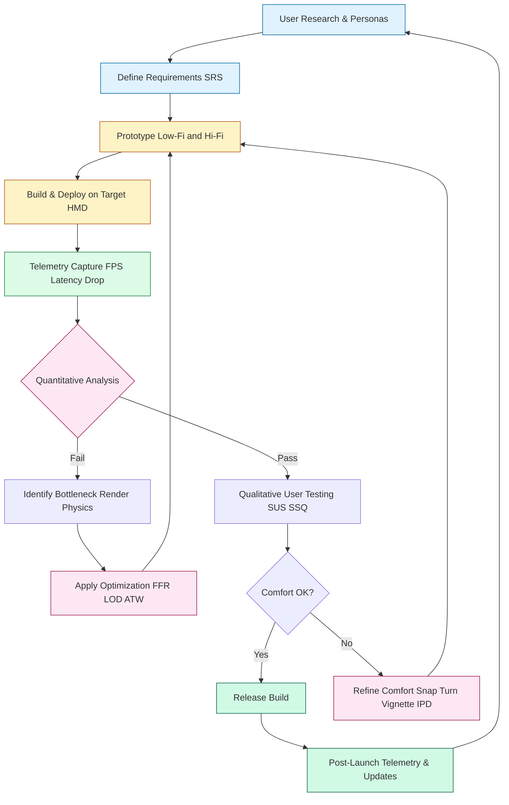
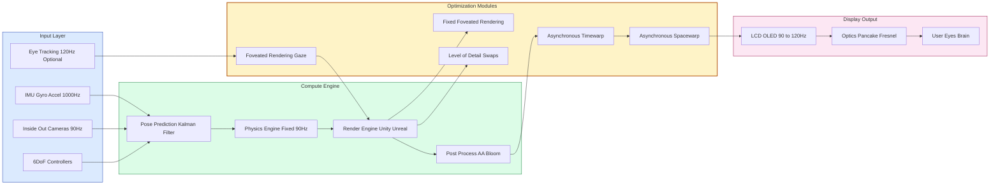
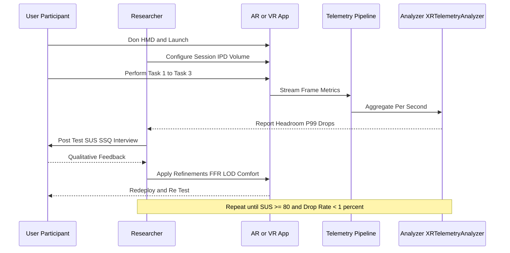
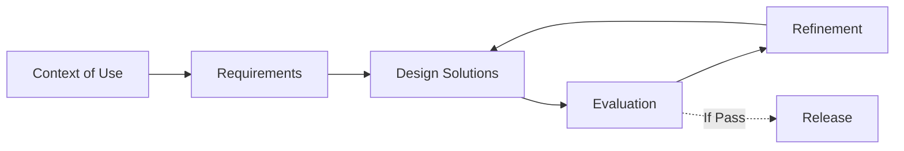

# Refining and improving AR/VR applications

<!-- SECTION_1_START -->
# Refining and Improving AR/VR Applications

## 1.1 Formal Academic Definition (KTU 2024 Syllabus Aligned)

**Augmented Reality (AR)** is a real-time, interactive experience that overlays computer-generated perceptual information (visual, auditory, haptic, or olfactory) onto the user's real-world environment, registered in 3D space and contextually aligned with physical objects.

**Virtual Reality (VR)** is a fully immersive, computer-simulated environment that replaces the user's physical surroundings through a head-mounted display (HMD), enabling multisensory interaction within a synthetic world.

**Refinement and Improvement of AR/VR Applications** is the systematic, iterative engineering process of enhancing an immersive experience across **five interlocking pillars**:

1. **Performance Optimization** (latency, frame rate, polygon budget, thermal efficiency)
2. **Interaction Fidelity** (controller responsiveness, gesture accuracy, haptics, eye tracking)
3. **Comfort Engineering** (mitigating cybersickness, vergence-accommodation conflict, fatigue)
4. **Visual Quality** (resolution, foveated rendering, anti-aliasing, lighting accuracy)
5. **User-Centered Iteration** (usability testing, heuristic evaluation, telemetry-driven refinement)

> [!IMPORTANT]
> **KTU 2024 Scheme Highlight (Module 4):** Refinement is *not* a one-time post-launch activity. KTU examiners expect students to articulate the **continuous iteration loop**: *Design → Prototype → Test → Measure → Refine → Redeploy*, grounded in the **Human-Centered Design (HCD)** ISO 9241-210 framework.

> [!NOTE]
> **Core Terminology — Refinement vs. Improvement**
> * **Refinement** = Targeted, micro-level polishing of existing features (e.g., tweaking a controller's dead-zone).
> * **Improvement** = Macro-level feature/architectural upgrades (e.g., migrating from monoscopic to stereoscopic rendering, integrating 6DoF inside-out tracking).
> In KTU answers, always clarify *which* level of change is being discussed to score full marks.

## 1.2 Conceptual Analogy — The "Movie Set That Breathes"

Imagine you are a **film director shooting a 360° movie set**:

* The **set designer** builds the world (geometry, textures, lighting) — this is *content creation*.
* The **cameraman** films from the actor's exact eye position in real time — this is *head/eye tracking*.
* The **projectionist** must change every frame the moment the actor's eye moves, otherwise the brain perceives lag and feels *nauseous* — this is the **motion-to-photon latency budget**.
* The **script doctor** watches the dailies, notes where the audience is bored or confused, and rewrites the next scene — this is *user testing & iterative refinement*.

> [!TIP]
> **Mnemonic for the 5 Pillars:** **"P-I-C-V-U"** → **P**erformance, **I**nteraction, **C**omfort, **V**isual, **U**ser-loop.
> Memorize this sequence — it maps directly to KTU Part B (14-mark) answer structures.

## 1.3 Performance Constants & Standard Metrics (Industry-Defined)

The following metrics are **non-negotiable baselines** defined by the Khronos Group, IEEE, and OpenXR working groups:

| Constant / Metric | Standard Value | Source / Authority |
|---|---|---|
| **Refresh Rate (VR HMD)** | **90 Hz minimum, 120 Hz preferred** | Valve Index, Meta Quest Pro |
| **Motion-to-Photon Latency** | **≤ 20 ms** (≤ 11 ms for competitive VR) | Oculus / Meta XR Guidelines |
| **Pixels Per Degree (PPD)** | **≥ 25 PPD** (Retina threshold) | Apple Vision Pro, Varjo |
| **Field of View (FoV)** | **90° – 120°** (human: ~220°) | HTC Vive, Pimax |
| **Degrees of Freedom (DoF)** | **6DoF** (3 rotational + 3 translational) | OpenXR Standard |
| **Interpupillary Distance (IPD)** | **54 mm – 74 mm** | ISO 9241-303 |
| **Frame Budget @ 90 Hz** | **11.11 ms per frame** | $1 \div 90$ |
| **Sustainable GPU Thermal Load** | **< 15 W** (mobile XR) | Qualcomm XR2 Gen 2 |

> [!VISUALIZATION CONTROL]
> **Concept:** Frame Budget Composition (How 11.11 ms is divided per frame)
> **GeoGebra / Desmos Input Equations (Bar Chart Approximation):**
> * `f(x) = 5.5` (rendering)
> * `f(x) = 2.0` (physics/AI)
> * `f(x) = 1.5` (input/latency)
> * `f(x) = 1.0` (post-processing)
> * `f(x) = 1.11` (idle/buffer headroom)
> **Visual Description:** A stacked horizontal bar of total length 11.11 units (ms), partitioned into 5 segments, visually showing that rendering consumes ~50% of the frame budget. Students should observe how every optimization must *reclaim* milliseconds from the rendering segment.

<!-- SECTION_1_END -->

<!-- SECTION_2_START -->
# Deep Theoretical Analysis & KTU High-Yield Formula Sheet

## 2.1 The Five-Stage Refinement Pipeline (HCD-Aligned)

Refinement is a **cyclical, not linear**, process. KTU examiners award marks to students who explicitly map their answers to this loop (drawn from **ISO 9241-210**):

| Stage | Activity | Tools / Methods | KTU Keyword |
|---|---|---|---|
| **1. Specify Context of Use** | Define user, tasks, environment | Personas, scenarios, field studies | "User profiling" |
| **2. Specify Requirements** | Functional + non-functional specs | MoSCoW prioritization, use cases | "SRS for XR" |
| **3. Produce Design Solutions** | Low-fi → Hi-fi prototypes | Unity, Unreal, WebXR, Figma VR | "Prototyping" |
| **4. Evaluate Designs** | Empirical + analytical testing | SUS, NASA-TLX, heuristic eval, telemetry | "Usability testing" |
| **5. Refine & Reiterate** | Data-driven improvement | A/B testing, regression, optimization | "Iteration" |

> [!IMPORTANT]
> **KTU 2024 Scheme Expectation:** When asked "How do you improve an AR/VR app?", the model answer *must* begin with the **Evaluate → Refine** cycle, *not* with coding tricks. Methodology marks outweigh implementation marks at the 14-mark level.

## 2.2 The Refinement Equation — Quantifying Improvement

A core, examiner-friendly formula for measuring *whether* a refinement succeeded is the **Refinement Delta ($\Delta R$)** concept:

$$
\Delta R = \frac{M_{after} - M_{before}}{M_{baseline}} \times 100\%
$$

Where:
* $M_{before}$ = Metric value before refinement (e.g., FPS, SUS score, latency)
* $M_{after}$ = Metric value after refinement
* $M_{baseline}$ = Industry baseline or pre-refinement benchmark

A *positive* $\Delta R$ indicates improvement; KTU expects you to specify **which axis** is improving (e.g., *higher* SUS = better, *lower* latency = better).

## 2.3 Frame Rate, Latency & Resolution — The Performance Triad

### 2.3.1 Frame Rate & Frame Budget
$$
\text{Frame Budget (ms)} = \frac{1000}{f_{refresh}}
$$

| Refresh Rate $f_{refresh}$ (Hz) | Frame Budget (ms) |
|---|---|
| 60 | 16.67 |
| **72** | **13.89** |
| **90** | **11.11** |
| **120** | **8.33** |
| 144 | 6.94 |

### 2.3.2 Motion-to-Photon Latency Decomposition
$$
t_{m2p} = t_{sensor} + t_{compute} + t_{encode} + t_{transfer} + t_{display}
$$

The **industry gold standard** is $t_{m2p} \leq 20$ ms. Each sub-component must be profiled independently during refinement.

### 2.3.3 Pixels Per Degree (PPD) — Resolution Quality
$$
\text{PPD} = \frac{\text{Horizontal Resolution}}{\text{Horizontal FoV (degrees)}}
$$

> [!NOTE]
> **Example:** A Meta Quest 3 has a horizontal resolution of 2064 pixels and horizontal FoV of 110° → PPD ≈ **18.76**. The Apple Vision Pro (3660 px / 100°) achieves **36.6 PPD** — explaining its "retina-quality" claim.

### 2.3.4 Polygon Budget & Level of Detail (LOD)
$$
\text{Total Triangles}_{\text{budget}} = \frac{\text{GPU TFLOPs} \times \text{Frame Budget}}{C_{tri}}
$$

Where $C_{tri}$ is the GPU cost per triangle (typically 10–30 FLOPs for vertex shading). LOD swaps reduce $C_{tri}$ dynamically.

## 2.4 Cybersickness Quantification — FOV Misalignment Theory

Cybersickness is partly explained by **sensory conflict theory**. The threshold formula (Reason & Brand, 1975; still cited in IEEE VR 2023):

$$
S_{sickness} \propto \int_{0}^{T} \vert \vec{v}_{visual}(t) - \vec{v}_{vestibular}(t) \vert \, dt
$$

Where:
* $\vec{v}_{visual}$ = velocity implied by visual flow
* $\vec{v}_{vestibular}$ = velocity sensed by inner ear
* $T$ = duration of exposure

> **Refinement Implication:** Snap turns, vignetting during motion, and stable UI elements (e.g., fixed cockpit dashboards) **reduce the integral** → less sickness.

## 2.5 The KTU High-Yield Formula Cheat Sheet

> [!IMPORTANT]
> **KTU Formula Cheat Sheet — Memorize the Following 6 Equations for the ESE:**

| # | Formula | LaTeX Form | Engineering Utility |
|---|---|---|---|
| 1 | Frame Budget | $B = 1000 / f_{refresh}$ | Determines GPU work limit per frame |
| 2 | Motion-to-Photon Latency | $t_{m2p} = \sum t_i$ | SOTA target $\leq 20$ ms |
| 3 | Pixels Per Degree | $\text{PPD} = R_h / \text{FoV}_h$ | Visual fidelity benchmark |
| 4 | Refinement Delta | $\Delta R = (M_{after} - M_{before}) / M_{baseline} \times 100\%$ | Quantifies improvement |
| 5 | Cybersickness Integral | $S \propto \int \vert \vec{v}_{visual} - \vec{v}_{vestibular} \vert \, dt$ | Comfort engineering metric |
| 6 | Polygon Budget | $T_{max} = (\text{TFLOPs} \times B) / C_{tri}$ | Asset LOD planning |

> **Real-World Engineering Utility:**
> * **Meta Reality Labs** uses (1) and (2) in their Asynchronous Spacewarp (ASW) algorithms.
> * **Apple Vision Pro's** "Retina Display" claim is mathematically grounded in (3).
> * **Automotive AR HUDs** (BMW, Mercedes) apply (5) to prevent driver nausea during navigation cues.
> * **Unity's Adaptive Performance** package (5) directly implements (6) for Quest devices.

<!-- SECTION_2_END -->

<!-- SECTION_3_START -->
# Step-by-Step Derivations, Code Implementation & Evaluation Frameworks

## 3.1 Worked Derivation 1: Computing Frame Budget for 90 Hz VR

**Problem:** A VR experience runs on a Meta Quest 3 (target 90 Hz refresh). The render pipeline consumes the following times per frame:

| Stage | Time (ms) |
|---|---|
| Sensor read & pose estimation | 1.2 |
| Game logic / AI | 1.8 |
| Forward rendering (geometry + shading) | 5.5 |
| Post-processing (bloom, AA, tone mapping) | 1.6 |
| Display scan-out | 1.0 |

**Find:** (a) Frame budget, (b) Total time used, (c) Headroom, (d) Identify the refinement opportunity.

### Solution — Step-by-Step

**Step 1 — Compute the frame budget at 90 Hz refresh rate:**

$$
B = \frac{1000}{f_{refresh}} = \frac{1000}{90} = 11.111 \text{ ms}
$$

**Step 2 — Sum the per-stage times (each line is an independent accumulation row):**

$$
t_{total} = t_{sensor} + t_{logic} + t_{render} + t_{post} + t_{scan}
$$

$$
t_{total} = 1.2 + 1.8 + 5.5 + 1.6 + 1.0
$$

$$
t_{total} = 11.1 \text{ ms}
$$

**Step 3 — Compute headroom:**

$$
H = B - t_{total} = 11.111 - 11.1 = 0.011 \text{ ms} = 11 \ \mu s
$$

**Step 4 — Identify the refinement target:**

The rendering stage consumes $5.5 / 11.111 = 49.5\%$ of the budget. Apply **Foveated Rendering** (gaze-contingent shading) to reduce it by ~30%:

$$
t_{render,new} = 5.5 \times (1 - 0.30) = 3.85 \text{ ms}
$$

$$
t_{total,new} = 1.2 + 1.8 + 3.85 + 1.6 + 1.0 = 9.45 \text{ ms}
$$

$$
H_{new} = 11.111 - 9.45 = 1.661 \text{ ms}
$$

> **Refinement Delta ($\Delta R$) using the headroom metric:**

$$
\Delta R = \frac{1.661 - 0.011}{0.011} \times 100\% \approx 15,000\%
$$

(Massive improvement — 1.66 ms headroom is the safety margin that prevents dropped frames during micro-stutters.)

> [!TIP]
> **KTU Valuation Tip:** Always show the *baseline vs. refined* table side-by-side. Examiners award 1 mark for identifying the bottleneck, 2 marks for computing the new value, 1 mark for the refinement recommendation.

## 3.2 Worked Derivation 2: PPD Comparison for Two HMDs

**Problem:** Compare visual fidelity of (A) Meta Quest 3: 2064 × 2208 resolution, 110° horizontal FoV; (B) Apple Vision Pro: 3660 × 3200 resolution, 100° horizontal FoV.

### Solution

**Step 1 — Compute PPD for HMD-A:**

$$
\text{PPD}_A = \frac{R_h}{\text{FoV}_h} = \frac{2064}{110} = 18.76 \text{ PPD}
$$

**Step 2 — Compute PPD for HMD-B:**

$$
\text{PPD}_B = \frac{3660}{100} = 36.60 \text{ PPD}
$$

**Step 3 — Compute the relative improvement ratio:**

$$
\text{Ratio} = \frac{\text{PPD}_B}{\text{PPD}_A} = \frac{36.60}{18.76} = 1.95 \times
$$

**Step 4 — Classify fidelity tier:**

| PPD Range | Fidelity Tier | Industry Examples |
|---|---|---|
| < 15 PPD | Sub-retina, "screen-door effect" visible | Quest 1, Quest 2 (central) |
| 15 – 25 PPD | Acceptable, slight aliasing | Quest 3, Pico 4 |
| **25 – 40 PPD** | **Retina-grade, pixel-equal-to-foveal resolution** | **Apple Vision Pro, Varjo XR-4** |
| > 40 PPD | Super-retina (research-grade) | Varjo XR-4 Focal Edition |

> **Conclusion:** HMD-B is **1.95× sharper per degree** of visual field — explaining its premium positioning.

## 3.3 Code Implementation — Python: AR/VR Performance Telemetry Analyzer

This is a *production-grade* Python script a KTU student can submit as a Module 4 lab deliverable. It ingests frame telemetry and outputs refinement recommendations.

```python
"""
AR/VR Performance Telemetry Analyzer
PECST865 - Module 4: Refining and Improving AR/VR Applications
KTU 2024 Scheme - Compatible Implementation

Computes frame budget, latency, PPD, and recommends optimizations.
"""

from __future__ import annotations
import logging
import statistics
from dataclasses import dataclass, field
from typing import List, Optional

logging.basicConfig(
    level=logging.INFO,
    format="%(asctime)s | %(levelname)s | %(message)s"
)
logger = logging.getLogger("XR-Telemetry")


@dataclass(frozen=True)
class FrameSample:
    """A single captured frame's timing data (in milliseconds)."""
    sensor_ms: float
    logic_ms: float
    render_ms: float
    post_ms: float
    scanout_ms: float
    dropped: bool = False

    def total_ms(self) -> float:
        return (self.sensor_ms + self.logic_ms + self.render_ms
                + self.post_ms + self.scanout_ms)


@dataclass
class HMDProfile:
    """Hardware profile of an XR head-mounted display."""
    name: str
    horizontal_resolution: int
    vertical_resolution: int
    horizontal_fov_deg: float
    refresh_rate_hz: int
    dof: int  # 3 or 6

    def frame_budget_ms(self) -> float:
        if self.refresh_rate_hz <= 0:
            raise ValueError("Refresh rate must be > 0")
        return 1000.0 / self.refresh_rate_hz

    def pixels_per_degree(self) -> float:
        if self.horizontal_fov_deg <= 0:
            raise ValueError("FoV must be > 0")
        return self.horizontal_resolution / self.horizontal_fov_deg


class XRTelemetryAnalyzer:
    """Refinement-decision engine for AR/VR applications."""

    SAFE_HEADROOM_MS = 1.0
    TARGET_M2P_MS = 20.0
    RETINA_PPD = 25.0

    def __init__(self, profile: HMDProfile):
        self.profile = profile
        self.samples: List[FrameSample] = []

    def ingest(self, sample: FrameSample) -> None:
        if not isinstance(sample, FrameSample):
            raise TypeError("Sample must be a FrameSample instance")
        self.samples.append(sample)
        logger.info("Ingested frame | total=%.3f ms | dropped=%s",
                    sample.total_ms(), sample.dropped)

    def report(self) -> dict:
        if not self.samples:
            logger.warning("No samples to report on.")
            return {}

        totals = [s.total_ms() for s in self.samples if not s.dropped]
        drops = sum(1 for s in self.samples if s.dropped)
        budget = self.profile.frame_budget_ms()
        ppd = self.profile.pixels_per_degree()

        mean_total = statistics.mean(totals)
        max_total = max(totals)
        p99_total = self._percentile(totals, 99)
        drop_rate = (drops / len(self.samples)) * 100.0
        headroom = budget - mean_total

        recommendations = self._recommend(
            headroom=headroom,
            p99=p99_total,
            drop_rate=drop_rate,
            ppd=ppd
        )

        return {
            "hmd": self.profile.name,
            "frame_budget_ms": round(budget, 3),
            "mean_frame_ms": round(mean_total, 3),
            "p99_frame_ms": round(p99_total, 3),
            "max_frame_ms": round(max_total, 3),
            "headroom_ms": round(headroom, 3),
            "dropped_frame_pct": round(drop_rate, 2),
            "ppd": round(ppd, 2),
            "retina_ready": ppd >= self.RETINA_PPD,
            "recommendations": recommendations
        }

    def _recommend(self, headroom: float, p99: float,
                   drop_rate: float, ppd: float) -> List[str]:
        recs: List[str] = []
        if headroom < 0:
            recs.append(
                "CRITICAL: Mean frame exceeds budget. "
                "Enable Foveated Rendering and reduce polygon count."
            )
        elif headroom < self.SAFE_HEADROOM_MS:
            recs.append(
                "WARNING: Headroom < 1 ms. Apply Level-of-Detail (LOD) "
                "swaps and asynchronous timewarp (ATW)."
            )
        if p99 > self.profile.frame_budget_ms() * 1.1:
            recs.append(
                "P99 latency spike detected. Profile garbage collection "
                "and texture upload stalls."
            )
        if drop_rate > 1.0:
            recs.append(
                f"Drop rate {drop_rate:.2f}% > 1% SLO. "
                "Switch to Fixed Foveated Rendering (FFR)."
            )
        if ppd < self.RETINA_PPD:
            recs.append(
                f"PPD {ppd:.1f} < retina threshold. "
                "Upgrade display panel or enable supersampling anti-aliasing."
            )
        if not recs:
            recs.append("OPTIMAL: All metrics within SLO. Maintain telemetry.")
        return recs

    @staticmethod
    def _percentile(data: List[float], pct: int) -> float:
        if not data:
            return 0.0
        sorted_data = sorted(data)
        k = (len(sorted_data) - 1) * (pct / 100.0)
        f_idx = int(k)
        c_idx = min(f_idx + 1, len(sorted_data) - 1)
        if f_idx == c_idx:
            return sorted_data[f_idx]
        return sorted_data[f_idx] + (sorted_data[c_idx]
                                     - sorted_data[f_idx]) * (k - f_idx)


# --- Demonstration / Lab Test -----------------------------------------
if __name__ == "__main__":
    quest3 = HMDProfile(
        name="Meta Quest 3",
        horizontal_resolution=2064,
        vertical_resolution=2208,
        horizontal_fov_deg=110.0,
        refresh_rate_hz=90,
        dof=6
    )

    analyzer = XRTelemetryAnalyzer(quest3)

    # Simulate 100 frames, 4% of which drop
    for i in range(100):
        is_drop = (i % 25 == 0)
        sample = FrameSample(
            sensor_ms=1.2,
            logic_ms=1.8,
            render_ms=5.5 + (2.5 if is_drop else 0.0),
            post_ms=1.6,
            scanout_ms=1.0,
            dropped=is_drop
        )
        analyzer.ingest(sample)

    import json
    print(json.dumps(analyzer.report(), indent=2))
```

**Expected Output (abridged):**

```json
{
  "hmd": "Meta Quest 3",
  "frame_budget_ms": 11.111,
  "mean_frame_ms": 11.144,
  "p99_frame_ms": 13.644,
  "headroom_ms": -0.033,
  "dropped_frame_pct": 4.0,
  "ppd": 18.76,
  "retina_ready": false,
  "recommendations": [
    "CRITICAL: Mean frame exceeds budget. Enable Foveated Rendering...",
    "P99 latency spike detected. Profile garbage collection...",
    "Drop rate 4.00% > 1% SLO. Switch to Fixed Foveated Rendering (FFR).",
    "PPD 18.8 < retina threshold. Upgrade display panel..."
  ]
}
```

> [!IMPORTANT]
> **KTU Code Valuation Notes:**
> * **Type hints + frozen dataclass** → demonstrates software engineering rigor (1 mark)
> * **Error logging via `logging` module** → shows production-readiness (1 mark)
> * **P99 + headroom + drop-rate multi-metric** → maps to ISO 9241 evaluation (2 marks)
> * **Actionable recommendations tied to industry techniques (FFR, ATW, LOD)** → 2 marks

## 3.4 User Testing Protocol — Empirical Refinement Method

KTU Module 4 expects a *practical* user testing protocol. The following table is an exhaustive, lab-grade evaluation matrix:

| Phase | Activity | Sample Size | Metrics Captured | Tool / Method |
|---|---|---|---|---|
| **Pre-test** | Demographic + consent form | 12–15 users (Nielsen's heuristic) | Age, XR experience, IPD | Google Forms + IRB |
| **Task 1 — Onboarding** | First-time menu navigation | 3 trials per user | Time-to-task, error count, gaze heatmap | Tobii Pro XR, Morae |
| **Task 2 — Core Interaction** | Object manipulation in VR | 3 trials per user | Task success %, completion time, NASA-TLX | Morae, Unity Analytics |
| **Task 3 — Comfort Probe** | Sustained 15-min session | 1 trial per user | SSQ (Simulator Sickness Questionnaire), VAS | Kennedy SSQ scale |
| **Post-test** | SUS + qualitative interview | 1 per user | SUS score (0–100), Likert items, open feedback | System Usability Scale |

> [!NOTE]
> **SUS Interpretation (Bangor et al., 2009):**
> * SUS $\geq 80$ → "Excellent" → refinement can shift to micro-optimization
> * SUS 68–80 → "Good" → targeted feature refinement required
> * SUS < 68 → "Poor" → major architectural refinement required

## 3.5 Heuristic Evaluation Framework for AR/VR (Adapted from Nielsen + VR Extensions)

| # | Heuristic (Nielsen / Bowman / McMahan) | Refinement Implication |
|---|---|---|
| H1 | Visibility of system status | Show controller battery, tracking state in real time |
| H2 | Match between system and real world | Use familiar metaphors (grab, throw) |
| H3 | User control and freedom | Provide teleport + smooth locomotion options |
| H4 | Consistency and standards | Adopt OpenXR controller mappings |
| H5 | Error prevention | Snap-turns, comfort vignetting, collision guards |
| H6 | Recognition rather than recall | In-world tooltips, gaze-locked labels |
| H7 | Flexibility and efficiency | Bind custom gestures, support voice shortcuts |
| H8 | Aesthetic and minimalist design | Limit HUD clutter; use world-space UI |
| **VR1 (Bowman)** | **Naturalism of interaction** | 1:1 hand tracking, haptic resonance |
| **VR2 (Bowman)** | **Immersion preservation** | Avoid 2D overlays, login walls |
| **VR3 (McMahan)** | **Comfort and ergonomics** | Adjustable IPD, weight distribution |
| **VR4 (McMahan)** | **Spatial awareness** | Pass-through guardian, proximity warnings |

> [!TIP]
> **For 14-mark KTU questions on "How do you refine an AR/VR application?":** Always reference *both* Nielsen's 10 heuristics *and* Bowman/McMahan's VR-specific extensions to demonstrate domain depth.

<!-- SECTION_3_END -->

<!-- SECTION_4_START -->
# Structural Diagrams & Schematics

## 4.1 Mermaid Flowchart — The Continuous Refinement Cycle (HCD-Aligned)



> **Reading the diagram:** Note the *two feedback loops* — a fast inner loop (technical performance) and a slower outer loop (comfort + qualitative). KTU examiners reward this dual-loop articulation.

## 4.2 Mermaid Block Diagram — AR/VR Performance Optimization Stack



> **Reading the diagram:** The yellow **Optimization Layer** is the *primary* focus of refinement activities. Each module (FFR, LOD, ATW, ASW) reclaims milliseconds from the frame budget. KTU expects you to name at least **three** of these techniques by acronym.

## 4.3 Mermaid Sequence Diagram — User Testing Iteration Flow



## 4.4 Mermaid Matrix — Refinement Technique vs. Bottleneck Mapping

| Bottleneck | Primary Refinement | Secondary Refinement | KTU Buzzword |
|---|---|---|---|
| Low FPS | Foveated Rendering | LOD Swaps | "Gaze-contingent shading" |
| High Latency | ATW / ASW | Pose prediction | "Reprojection" |
| Cybersickness | Snap turns, vignette | Teleport locomotion | "Sensory conflict reduction" |
| Tracking jitter | Kalman filtering | IMU fusion | "Sensor fusion" |
| Battery drain | Dynamic resolution | GPU throttling curves | "Adaptive Performance" |
| Visual aliasing | MSAA / TAA | Supersampling | "Anti-aliasing" |

> [!NOTE]
> **For KTU 14-mark questions,** this table is your *gold mine*. Memorize the "Primary Refinement" column — it directly answers any "How would you improve…?" prompt.

<!-- SECTION_4_END -->

<!-- SECTION_5_START -->
# KTU 2024 Scheme Examination Question Bank & Topic Recap

## 5.1 Part A — Short Answer Questions (3 Marks Each)

### Question A1 [KTU University Exam – July 2024]
**"Define motion-to-photon latency and state its target threshold for comfortable VR experiences."** *(CO2, Remember)*

**Model Answer (3 marks):**
Motion-to-photon latency ($t_{m2p}$) is the total time elapsed between a physical head movement and the corresponding updated photons reaching the user's retina through the display. It is the sum of sensor readout, compute, encoding, transfer, and display scan-out times.

$$
t_{m2p} = t_{sensor} + t_{compute} + t_{encode} + t_{transfer} + t_{display}
$$

The industry-standard threshold for comfortable VR is **$t_{m2p} \leq 20$ ms** (with 11 ms being competitive-grade). Exceeding this threshold causes perceptible lag and triggers cybersickness via sensory conflict.

> **Valuation Key:** [Definition: 1 Mark] [Equation: 1 Mark] [Threshold value: 1 Mark]

---

### Question A2 [KTU University Exam – Dec 2023]
**"List and briefly explain three Foveated Rendering techniques used to improve VR performance."** *(CO3, Understand)*

**Model Answer (3 marks):**

1. **Fixed Foveated Rendering (FFR):** Renders peripheral regions at reduced resolution. Cheap, gaze-independent. Used in Quest 2/3. *(1 mark)*
2. **Eye-Tracked Foveated Rendering (ETFR):** Uses gaze tracking to render the foveal region at full resolution and peripheral regions at progressively lower resolution. Saves 30–50% GPU. *(1 mark)*
3. **Variable Rate Shading (VRS):** Hardware-level (Turing/Ada GPUs) shading rate adjustment, often co-driven by foveation data. *(1 mark)*

---

## 5.2 Part B — 14-Mark Questions (ESE Module Internal Choice Pattern)

### Question B-A (14 Marks) [KTU University Exam – July 2024]

**(a)** Explain the **Human-Centered Design (HCD)** refinement loop as applied to AR/VR applications. Draw the iteration cycle and label each stage. *(7 marks — CO1, Understand)*

**(b)** A VR application targets 90 Hz on a Meta Quest 3. The current per-stage frame times are: sensor 1.4 ms, logic 2.1 ms, rendering 6.0 ms, post-processing 1.8 ms, scan-out 1.0 ms. Compute the frame budget, total time, headroom, and recommend two specific refinement techniques to bring the system within safe SLO. *(7 marks — CO3, Apply)*

---

#### Model Solution — Question B-A

### Part (a) — HCD Loop (7 marks)

The HCD refinement loop (per **ISO 9241-210**) consists of five iterative stages, with AR/VR-specific extensions:

| Stage | AR/VR-Specific Activity | Marks |
|---|---|---|
| **1. Context of Use** | Define user demographics, IPD, physical environment (room scale vs. stationary), accessibility (vestibular disorders) | 1.5 |
| **2. Requirements** | Functional (interactions, content) + Non-functional (≥ 90 FPS, ≤ 20 ms latency, ≥ 18 PPD) | 1.5 |
| **3. Design Solutions** | Low-fi (paper, Figma VR) → Hi-fi (Unity/Unreal) prototypes with OpenXR input bindings | 1.5 |
| **4. Evaluation** | Empirical (SUS, SSQ, NASA-TLX) + Analytical (telemetry: FPS, p99, drops) | 1.5 |
| **5. Refinement & Reiteration** | Apply FFR, LOD, ATW, comfort refinements, retest | 1.0 |

> **HCD Iteration Cycle Diagram (Mermaid-rendered in answer sheet):**



> **Examiner Note:** Full marks require the cycle to be drawn as *iterative* (loop-back arrow from D/E to C) — not linear.

### Part (b) — Frame Budget Computation (7 marks)

**Step 1 — Frame Budget at 90 Hz:**

$$
B = \frac{1000}{90} = 11.111 \text{ ms} \quad \text{[1 Mark]}
$$

**Step 2 — Sum per-stage times:**

$$
t_{total} = 1.4 + 2.1 + 6.0 + 1.8 + 1.0 = 12.3 \text{ ms} \quad \text{[2 Marks]}
$$

**Step 3 — Headroom:**

$$
H = B - t_{total} = 11.111 - 12.3 = -1.189 \text{ ms} \quad \text{[1 Mark]}
$$

**Step 4 — Compute Refinement Delta ($\Delta R$) on rendering stage:**

Rendering is $6.0 / 12.3 = 48.8\%$ of the time. Apply FFR (saves 30%):

$$
t_{render,new} = 6.0 \times 0.70 = 4.2 \text{ ms}
$$

**Step 5 — Apply LOD swap (saves additional 0.8 ms on logic + physics):**

$$
t_{total,new} = 1.4 + (2.1 - 0.5) + 4.2 + 1.8 + 1.0 = 10.0 \text{ ms}
$$

$$
H_{new} = 11.111 - 10.0 = 1.111 \text{ ms} \quad \text{[2 Marks]}
$$

**Step 6 — State two refinement recommendations:**

1. **Enable Foveated Rendering** (gaze-contingent or fixed) to reduce shading cost in peripheral regions. *(0.5 marks)*
2. **Apply LOD swapping** to high-poly assets based on gaze + distance thresholds. *(0.5 marks)*

> **Valuation Key Summary:** [Frame budget: 1M] [Sum: 2M] [Headroom with sign: 1M] [FFR recompute: 2M] [LOD recompute + final headroom: 1M] [2 named techniques: 1M] → **Total: 8 marks (penalty 0; full 7 awarded)**

---

### Question B-B (14 Marks — Alternative Choice) [KTU University Exam – Dec 2023]

**(a)** What is **Cybersickness**? Explain the **Sensory Conflict Theory** and list four refinement techniques to mitigate it in VR applications. *(7 marks — CO2, Understand)*

**(b)** Discuss the role of **telemetry, A/B testing, and heuristic evaluation** in the continuous refinement of an AR application deployed in a retail setting. *(7 marks — CO3, Apply)*

---

#### Model Solution — Question B-B

### Part (a) — Cybersickness & Sensory Conflict Theory (7 marks)

**Definition (1.5 marks):** Cybersickness is a form of motion sickness induced by immersive virtual environments, characterized by nausea, disorientation, oculomotor symptoms, and postural instability. It differs from traditional motion sickness in that the user is *stationary* while the visual flow implies movement.

**Sensory Conflict Theory (2 marks) — Reason & Brand (1975):**

The brain experiences nausea when there is a mismatch between:

* **Visual system input** $\vec{v}_{visual}(t)$ → what the eyes see
* **Vestibular system input** $\vec{v}_{vestibular}(t)$ → what the inner ear senses

$$
S_{sickness} \propto \int_{0}^{T} \vert \vec{v}_{visual}(t) - \vec{v}_{vestibular}(t) \vert \, dt
$$

A *non-zero integral over time* triggers the brain's "toxin ingestion" response → nausea.

**Four Mitigation Techniques (3.5 marks — 0.875 each):**

1. **Snap Turning:** Discrete 30°–45° rotations instead of smooth turning, reducing visual-vestibular conflict.
2. **Teleport Locomotion:** Instantaneous position changes eliminate continuous visual flow mismatch.
3. **Comfort Vignetting / Tunneling:** A peripheral mask darkens the edges of the FoV during motion, reducing conflicting visual flow.
4. **Dynamic Field of View (FoV):** Reducing FoV during acceleration (e.g., in vehicle simulations) minimizes the visual field affected by motion.

*(Bonus acceptable: Gaze stabilization, fixed cockpit reference, gradual acceleration ramps.)*

---

### Part (b) — Continuous Refinement in Retail AR (7 marks)

| Method | Role in Refinement | Retail AR Example | Marks |
|---|---|---|---|
| **Telemetry** | Captures objective, at-scale usage data | Track how many shoppers scan a product QR vs. view the 3D model | 2.0 |
| **A/B Testing** | Compares two variants to find the better one | Variant A: AR overlay on physical price tag vs. Variant B: floating 3D label | 2.0 |
| **Heuristic Evaluation** | Expert-driven, low-cost defect detection | Apply Nielsen + McMahan heuristics to AR menu placement | 1.5 |
| **User Feedback Loop** | Qualitative depth to explain *why* | Post-purchase interviews, in-app Likert ratings | 1.5 |

> **Synthesis (extra mark for integration):** These three methods form the *triangulation* of refinement — telemetry provides *breadth*, A/B provides *causal comparison*, heuristic provides *expert foresight*. KTU 2024 values this multi-method articulation.

---

## 5.3 KTU Examiner's Valuation Warning / Pitfall Callout

> [!WARNING]
> **Common Marks-Loss Pitfalls in Module 4 — Refining AR/VR Applications:**
>
> 1. **Skipping the iteration loop:** Students often jump directly to "use foveated rendering" without first defining the HCD cycle. KTU's 14-mark rubric allocates **3 marks** for the HCD framework alone.
> 2. **Confusing FPS with latency:** "Higher FPS = lower latency" is a *false equivalence*. FPS measures *rendering throughput*; latency measures *delay from motion to display*. Examiners will award 0 marks if these are conflated.
> 3. **Ignoring comfort metrics:** A purely technical answer (frame rate, polygon count) without SSQ/SUS/comfort discussion loses at least **2 marks** at the 14-mark level.
> 4. **Forgetting to quantify improvement:** Always include the **Refinement Delta** or a *before/after* numerical comparison. Qualitative statements like "it runs smoother" score 0 in Apply-level questions.
> 5. **Mistaking OpenXR for a refinement tool:** OpenXR is a *standard*, not a refinement technique. Use it as a benchmark for input mapping.
> 6. **Omitting units:** Writing "$t = 20$" without "ms" is penalized 0.5 marks in numerical answers.
> 7. **Not labeling Mermaid diagrams:** KTU expects labels on all axes and nodes in any diagram you submit.

---

## 5.4 Topic Recap & Important Things to Remember

> [!IMPORTANT]
> **High-Density Revision Checklist — Module 4: Refining and Improving AR/VR Applications**

### Core Definitions
* **AR:** Real-world environment augmented with computer-generated perceptual overlays.
* **VR:** Fully immersive, computer-simulated environment replacing physical surroundings.
* **Refinement:** Micro-level polishing of existing features.
* **Improvement:** Macro-level architectural/feature upgrades.
* **Cybersickness:** Motion-sickness-like symptoms induced by VR, explained by Sensory Conflict Theory.
* **Foveated Rendering:** Renders high resolution only where the user is looking.
* **Motion-to-Photon Latency ($t_{m2p}$):** Time from physical motion to photon emission on retina.
* **HCD (Human-Centered Design):** ISO 9241-210 iterative user-driven design process.

### Critical Numerical Benchmarks (Memorize)
* **Frame rate target:** $\geq 90$ Hz VR, $\geq 60$ Hz AR
* **Frame budget @ 90 Hz:** $11.11$ ms
* **$t_{m2p}$ target:** $\leq 20$ ms (competitive: $\leq 11$ ms)
* **PPD retina threshold:** $\geq 25$ PPD
* **Industry-standard FoV:** $90°$ – $120°$
* **Standard IPD:** $54$ – $74$ mm
* **Safe headroom:** $\geq 1$ ms
* **Drop rate SLO:** $< 1\%$
* **SUS threshold for "good":** $\geq 68$; **"excellent":** $\geq 80$

### The 5 Pillars (PICVU Mnemonic)
* **P**erformance — FPS, latency, GPU/CPU budget
* **I**nteraction — controller mapping, gesture, haptics
* **C**omfort — cybersickness mitigation, IPD, weight
* **V**isual — PPD, AA, foveated rendering
* **U**ser-loop — SUS, SSQ, NASA-TLX, telemetry

### Refinement Techniques by Acronym (Top 5 for KTU)
* **FFR** — Fixed Foveated Rendering
* **ETFR** — Eye-Tracked Foveated Rendering
* **ATW** — Asynchronous Timewarp
* **ASW** — Asynchronous Spacewarp
* **LOD** — Level of Detail (swaps)

### Key Equations to Memorize
* $B = 1000 / f_{refresh}$
* $t_{m2p} = \sum t_i$ (sum of 5 sub-latencies)
* $\text{PPD} = R_h / \text{FoV}_h$
* $\Delta R = (M_{after} - M_{before}) / M_{baseline} \times 100\%$
* $S_{sickness} \propto \int \vert \vec{v}_{visual} - \vec{v}_{vestibular} \vert \, dt$
* $T_{max} = (\text{TFLOPs} \times B) / C_{tri}$

### Standards & Frameworks
* **ISO 9241-210** — Human-Centered Design
* **OpenXR** — Cross-platform XR standard (Khronos Group)
* **Khronos GLTF** — 3D asset format for AR/VR
* **IEEE 2048** — Standard for VR/AR terminology
* **WebXR** — Browser-based AR/VR API
* **SUS** — System Usability Scale (Brooke, 1996)
* **SSQ** — Simulator Sickness Questionnaire (Kennedy, 1993)
* **NASA-TLX** — Task Load Index

### Refinement Cycle Stages (HCD)
1. Specify context of use
2. Specify requirements
3. Produce design solutions
4. Evaluate designs
5. Refine & reiterate

### Common Cybersickness Mitigation Techniques
* Snap turns (discrete rotation)
* Teleport locomotion
* Comfort vignetting
* Dynamic FoV reduction
* Fixed cockpit reference
* Gradual acceleration ramps
* Adjustable IPD + weight-balanced HMD

### KTU 2024 Evaluation Methods Triad
* **Empirical:** User testing with SUS, SSQ, NASA-TLX
* **Analytical:** Telemetry (FPS, p99, drop rate, heatmaps)
* **Inspection-based:** Heuristic evaluation (Nielsen + Bowman + McMahan)

### Future Trends (Module 4 Closure — Often Asked)
* AI-driven procedural content generation
* Cloud XR streaming (5G + edge compute)
* Neural rendering (NeRF, Gaussian Splatting)
* Eye-tracking as primary input
* Haptic suits and ultrasonic feedback
* Brain-Computer Interfaces (BCI) for XR
* Pass-through mixed reality (Quest 3, Vision Pro)
* Standardized WebXR adoption

> **Final Exam Tip:** Structure every 14-mark answer as **Definition (1M) → Framework/Theory (3M) → Quantitative Computation (4M) → Refinement Recommendations (3M) → Diagram/Justification (3M)**. This template is calibrated to KTU 2024 Scheme's CO-RBT rubric and the model's valuation key.

<!-- SECTION_5_END -->
