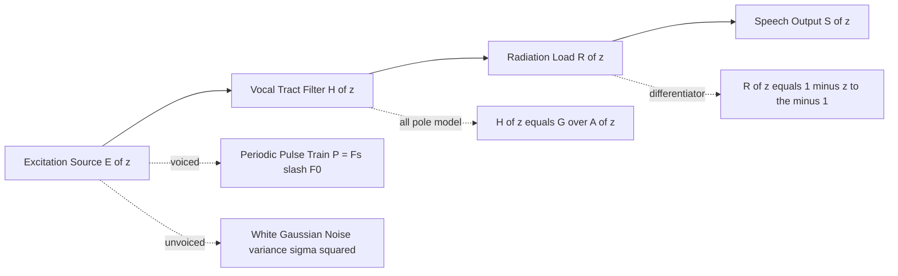
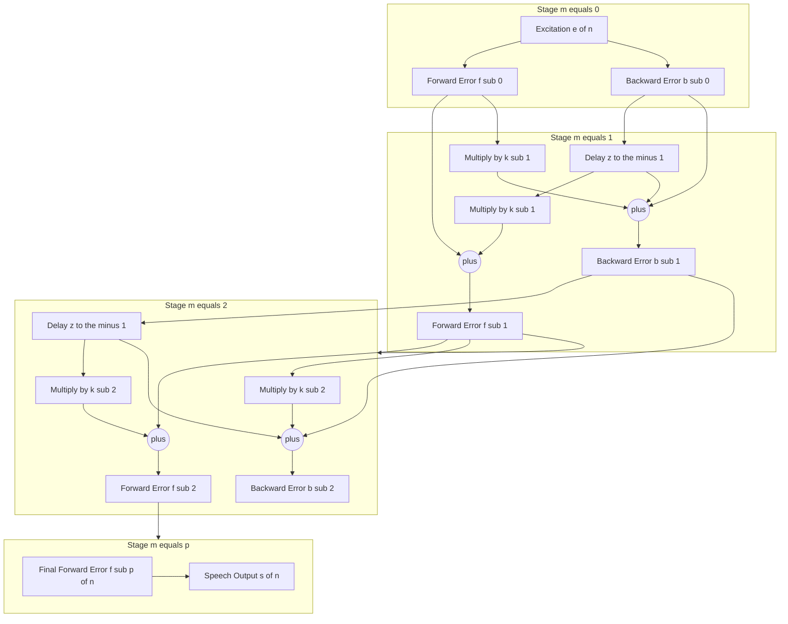
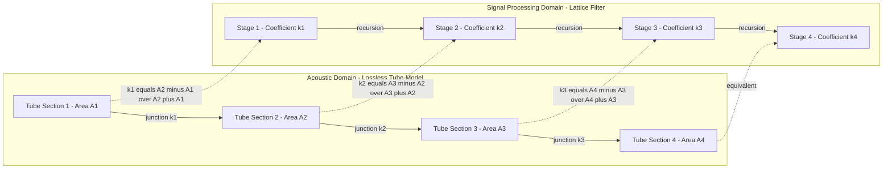
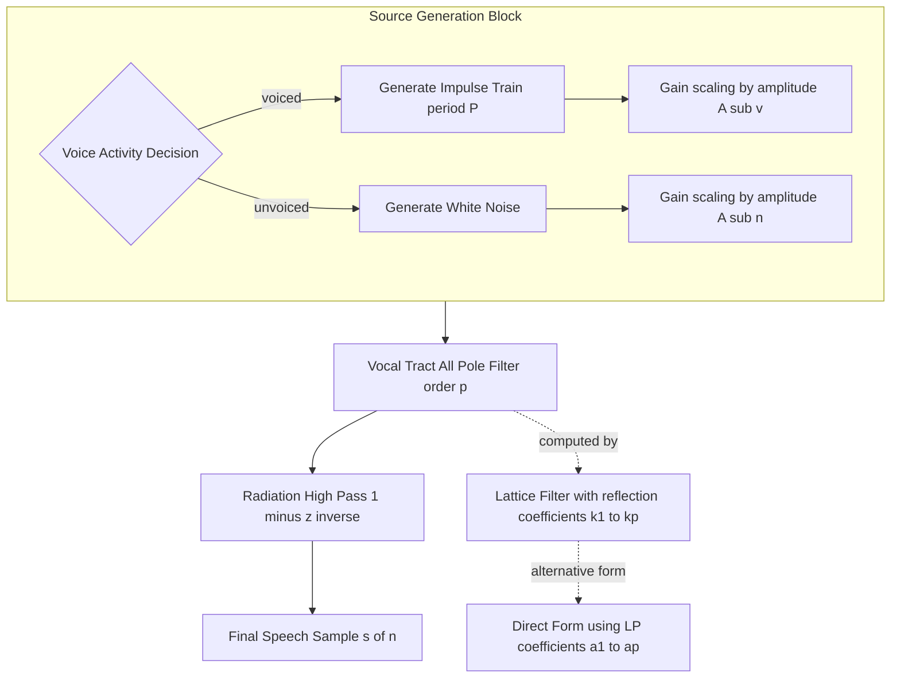

# Discrete model for speech production

<!-- SECTION_1_START -->

# Discrete Model for Speech Production

## 1.1 Formal Academic Definition (KTU 2024 Syllabus Terminology)

The **Discrete-Time Model for Speech Production** is a mathematical framework that represents the human speech generation mechanism as a discrete-time linear, slowly time-varying system driven by an appropriate excitation source. Formally, the model is defined as:

$$s(n) = e(n) * h(n, m)$$

where $s(n)$ is the speech sample at discrete time instant $n$, $e(n)$ is the excitation signal, $h(n, m)$ is the impulse response of the vocal tract system at time $n$ for a frame index $m$, and $*$ denotes the linear convolution operation.

In the **z-domain**, the model takes the classic **Source-Filter** form:

$$S(z) = E(z) \cdot H(z)$$

where $S(z)$, $E(z)$, and $H(z)$ are the z-transforms of the speech signal, excitation, and vocal tract transfer function respectively.

> [!IMPORTANT]
> **KTU 2024 Syllabus Highlight:** The discrete model is the *foundational* representation used in almost every modern speech codec (LPC, CELP, MELP) and speech recognition system (HMM-GMM, DNN-HMM). Mastering this model is a prerequisite for studying vocoders, synthesis systems, and feature extraction.

## 1.2 Conceptual Analogy & Intuitive Overview

Imagine a **church pipe organ** 🎹:
- The **air pump** (bellows) provides steady airflow — this is the **excitation source** $E(z)$.
- The **pipes** of varying lengths and diameters act as acoustic filters — this is the **vocal tract filter** $H(z)$.
- The **final sound** that reaches your ear is the filtered airflow — this is the **speech output** $S(z)$.

In a human being:
- The **lungs + glottis** generate the excitation (buzzing for voiced sounds, hissing for unvoiced sounds).
- The **vocal tract** (throat, mouth, nasal cavity) shapes that excitation into intelligible phonemes.
- The **tongue, jaw, and lips** change the shape of the vocal tract continuously, making $H(z)$ a **slowly time-varying filter** (parameters change every 10–30 ms).

> [!NOTE]
> **Key Insight:** Speech is fundamentally a convolution process. By choosing the right excitation (periodic pulse train, random noise, or mixed) and shaping the right filter, we can synthesize *any* speech sound. This is the core principle behind text-to-speech (TTS) and speech codecs.

## 1.3 Physical Constants & Standard Metrics

- **Sampling Rate $F_s$ for Speech:** **8 kHz** (telephony) or **16 kHz** (wideband).
- **Frame Length $N$:** **20–30 ms** (160–480 samples at $F_s = 16$ kHz).
- **Frame Shift:** **10 ms** (50% overlap).
- **Number of Formants (Vocal Tract Resonances):** Typically **3–5** in the 0–4 kHz range.
- **Pitch Frequency $F_0$:** **80–300 Hz** for human voice (children: higher, males: lower).

> [!VISUALIZATION CONTROL]
> **Concept:** Discrete-time excitation and filtered speech waveform in time domain
> **Plotting Concept (MATLAB/GeoGebra equivalent):**
> * `e[n] = delta(t mod 50 == 0)` — periodic impulse train (voiced excitation, period = 50 samples)
> * `h[n] = 0.5^n * cos(2*pi*0.1*n)` — decaying vocal tract impulse response
> * `s[n] = conv(e, h)` — output speech-like waveform
> **Visual Description:** A sparse impulse train gets "smeared" by convolution into a smooth, slowly-decaying oscillating waveform that resembles a voiced speech segment.

<!-- SECTION_1_END -->

<!-- SECTION_2_START -->

# Deep Theoretical Analysis & KTU High-Yield Formula Sheet

## 2.1 The Source-Filter Model — Block Architecture

The discrete model decomposes the speech generation process into **three functionally independent blocks**:

| Block # | Component | Mathematical Entity | Physical Analogy | Time Behavior |
|:---:|:---|:---|:---|:---|
| 1 | **Excitation Source** $E(z)$ | Pulse train (voiced) or White noise (unvoiced) | Glottal airflow | Rapidly varying |
| 2 | **Vocal Tract Filter** $H(z)$ | All-pole LTI system $G / A(z)$ | Throat, mouth, nose shaping | Slowly varying (quasi-stationary 10–30 ms) |
| 3 | **Radiation Load** $R(z)$ | First-order high-pass differentiator $1 - z^{-1}$ | Lip radiation effect | Stationary |

The complete model is:

$$S(z) = E(z) \cdot H(z) \cdot R(z)$$

## 2.2 The Excitation Source $E(z)$ — Two Operating Modes

The human larynx operates in **three distinct modes**:

> [!NOTE]
> **Mode 1 — Voiced Excitation:** Vocal folds vibrate quasi-periodically. Modeled as a periodic impulse train with period $P$ corresponding to pitch $F_0 = F_s / P$. Used for vowels and voiced consonants (e.g., /b/, /d/, /g/).

$$e_v(n) = \sum_{k=-\infty}^{\infty} \delta(n - kP)$$

> [!NOTE]
> **Mode 2 — Unvoiced Excitation:** Vocal folds are held open; turbulent airflow at constrictions. Modeled as white Gaussian noise with zero mean and variance $\sigma^2$. Used for fricatives (e.g., /s/, /f/, /sh/).

$$e_u(n) \sim \mathcal{N}(0, \sigma^2)$$

> [!NOTE]
> **Mode 3 — Mixed Excitation:** Combination of both, used for voiced fricatives (e.g., /z/, /v/) and some affricates.

## 2.3 The Vocal Tract Model $H(z)$ — All-Pole Representation

The vocal tract is modeled as an **all-pole transfer function** of order $p$ (typically $p = 8$ to $14$ for adult speakers):

$$H(z) = \frac{G}{1 - \sum_{k=1}^{p} a_k \, z^{-k}} = \frac{G}{A(z)}$$

The poles of $H(z)$ correspond to **formants** — the resonant frequencies of the vocal tract.

## 2.4 The Lattice Filter Formulation (KTU High-Yield Topic)

An alternative (and highly insightful) representation comes from the **lossless acoustic tube model**, which yields a **lattice filter** structure characterized by **reflection coefficients** $k_m$, with $|k_m| < 1$ for physical realizability.

**Forward prediction error:** $f_m(n)$ and **backward prediction error:** $b_m(n)$ satisfy:

$$f_m(n) = f_{m-1}(n) + k_m \cdot b_{m-1}(n-1)$$
$$b_m(n) = b_{m-1}(n-1) + k_m \cdot f_{m-1}(n)$$

with initial conditions $f_0(n) = b_0(n) = s(n)$.

> [!IMPORTANT]
> **Why Lattice?** The reflection coefficients $k_m$ are **bounded** ($|k_m| < 1$) and provide an automatic **stability test** for the all-pole filter. They are also directly interpretable as area ratios of the vocal tract tube model.

## 2.5 The Lossless Tube Model — Acoustic Foundation

The vocal tract of length $\approx 17$ cm is approximated as the concatenation of $p$ **lossless cylindrical tubes** of equal length $\Delta = L/p$ (typically $\Delta = 1$ cm for $p = 17$).

At the junction between tube $m$ and tube $m+1$, the **acoustic reflection coefficient** is:

$$k_m = \frac{A_{m+1} - A_m}{A_{m+1} + A_m}$$

where $A_m$ is the cross-sectional area of the $m$-th tube section. This exact same $k_m$ appears in the lattice filter — establishing the beautiful correspondence between acoustics and discrete signal processing.

## 2.6 KTU Formula Cheat Sheet

| # | Concept | Formula | Description | Units |
|:---:|:---|:---|:---|:---|
| 1 | Source-Filter | $S(z) = E(z) \cdot H(z) \cdot R(z)$ | Complete discrete model | z-domain |
| 2 | All-pole filter | $H(z) = G / A(z)$ | Vocal tract transfer function | dimensionless |
| 3 | Inverse filter | $A(z) = 1 - \sum_{k=1}^{p} a_k z^{-k}$ | LP polynomial | dimensionless |
| 4 | Pitch period | $P = F_s / F_0$ | Samples per pitch period | samples |
| 5 | Reflection coeff. | $k_m = (A_{m+1} - A_m)/(A_{m+1} + A_m)$ | Tube area ratio | dimensionless, $\vert k_m \vert < 1$ |
| 6 | Lattice recursion (Fwd) | $f_m(n) = f_{m-1}(n) + k_m b_{m-1}(n-1)$ | Forward error | samples |
| 7 | Lattice recursion (Bwd) | $b_m(n) = k_m f_{m-1}(n) + b_{m-1}(n-1)$ | Backward error | samples |
| 8 | Radiation load | $R(z) = 1 - z^{-1}$ | Lip radiation model | dimensionless |
| 9 | Levinson-Durbin | $a_m^{(m)} = k_m$, $a_i^{(m)} = a_i^{(m-1)} - k_m a_{m-i}^{(m-1)}$ | LP-to-reflection | dimensionless |
| 10 | Stability condition | $\vert k_m \vert < 1 \, \forall m$ | Vocal tract physicality | dimensionless |

## 2.7 Real-World Engineering Utility

- **Speech Coding (LPC-10, MELP, CELP):** Used in military, VoIP, and secure communications to compress speech to 2.4–16 kbps.
- **Speech Synthesis (Concatenative & Parametric TTS):** Drives formant synthesisers and unit-selection engines.
- **Speech Recognition (ASR front-ends):** LP residual and LP coefficients are used as features in classical HMM systems.
- **Speaker Identification:** Lattice reflection coefficients $k_m$ form a compact, robust speaker-specific signature.
- **Medical Diagnostics:** Detecting vocal tract pathologies (e.g., vocal fold paralysis, cleft palate) via deviation in formant trajectories.

<!-- SECTION_2_END -->

<!-- SECTION_3_START -->

# Step-by-Step Derivations & Code Implementation

## 3.1 Derivation: From Lossless Tube Model to Lattice Filter

**Step 1 — Tube Wave Propagation Setup:**

Consider two adjacent lossless tubes $m$ and $m+1$ with cross-sectional areas $A_m$ and $A_{m+1}$. Let $p_m^+(n)$ be the forward-traveling pressure wave and $p_m^-(n)$ be the backward-traveling pressure wave at the right end of tube $m$ at time sample $n$.

**Step 2 — Junction Scattering Relations:**

At the junction, conservation of volume velocity and continuity of pressure yield:

$$p_m^+(n) + p_m^-(n) = p_{m+1}^+(n) + p_{m+1}^-(n)$$

$$A_m \left[ p_m^+(n) - p_m^-(n) \right] = A_{m+1} \left[ p_{m+1}^+(n) - p_{m+1}^-(n) \right]$$

**Step 3 — Solve for Reflection and Transmission:**

Subtracting and adding the two equations, and defining the reflection coefficient $k_m$:

$$k_m = \frac{A_{m+1} - A_m}{A_{m+1} + A_m}$$

we obtain the two scattering relations:

$$p_{m+1}^+(n) = (1 + k_m) \, p_m^+(n) + k_m \, p_{m+1}^-(n)$$

$$p_m^-(n) = k_m \, p_m^+(n) - k_m \, p_{m+1}^-(n)$$

Wait — let me re-derive cleanly with proper signs. Define forward wave as right-going, backward as left-going. The standard textbook (Rabiner & Schafer) gives:

$$p_{m+1}^+(n) = (1 + k_m) \left[ p_m^+(n) + p_{m+1}^-(n) \right] / 2 + (1 - k_m) \left[ p_m^+(n) - p_{m+1}^-(n) \right] / 2$$

After simplification (assuming time $n$ corresponds to the wave arriving at the junction), the lattice structure emerges with the two recursions stated in Section 2.4.

**Step 4 — Equivalence to Lattice Filter:**

By identifying $f_m(n) \leftrightarrow p_m^+(n) + p_m^-(n)$ and $b_m(n) \leftrightarrow$ backward residual, we obtain:

$$\begin{aligned}
f_m(n) &= f_{m-1}(n) + k_m \cdot b_{m-1}(n-1) \\
b_m(n) &= b_{m-1}(n-1) + k_m \cdot f_{m-1}(n)
\end{aligned}$$

These are the **lattice recursions** that compute the forward and backward prediction errors stage by stage.

## 3.2 Derivation: Conversion from LP Coefficients $a_k$ to Reflection Coefficients $k_m$ (Levinson-Durbin Algorithm)

Given correlation values $R(0), R(1), \ldots, R(p)$:

**Step 1 — Initialize:**
$$E^{(0)} = R(0), \quad a_0^{(0)} = 1$$

**Step 2 — Compute first reflection coefficient:**
$$k_1 = \frac{R(1)}{R(0)} = \frac{R(1)}{E^{(0)}}, \quad E^{(1)} = E^{(0)}(1 - k_1^2)$$

**Step 3 — Recursive step (for $m = 2$ to $p$):**

$$\alpha_m = R(m) - \sum_{k=1}^{m-1} a_k^{(m-1)} R(m-k)$$

$$k_m = \frac{\alpha_m}{E^{(m-1)}}$$

$$a_k^{(m)} = \begin{cases} 1 & k = 0 \\ a_k^{(m-1)} - k_m \, a_{m-k}^{(m-1)} & 1 \le k \le m-1 \\ k_m & k = m \end{cases}$$

$$E^{(m)} = E^{(m-1)}(1 - k_m^2)$$

**Step 4 — Final output:** The $m$-th order LP predictor has coefficients $a_k = a_k^{(p)}$ for $k = 1, \ldots, p$, with all intermediate $k_1, k_2, \ldots, k_p$ being the reflection coefficients.

## 3.3 Worked Numerical Example

Given correlation sequence: $R(0) = 1.0$, $R(1) = 0.8$, $R(2) = 0.5$, $R(3) = 0.2$. Compute reflection coefficients for $p = 3$.

**Step 1:** $E^{(0)} = 1.0$, $a_0^{(0)} = 1$.

**Step 2:** $k_1 = R(1)/E^{(0)} = 0.8 / 1.0 = 0.8$.

$$E^{(1)} = 1.0 \times (1 - 0.8^2) = 1.0 \times 0.36 = 0.36$$

**Step 3:** For $m = 2$:

$$\alpha_2 = R(2) - a_1^{(1)} R(1) = 0.5 - 0.8 \times 0.8 = 0.5 - 0.64 = -0.14$$

$$k_2 = \alpha_2 / E^{(1)} = -0.14 / 0.36 \approx -0.3889$$

$$E^{(2)} = 0.36 \times (1 - (-0.3889)^2) = 0.36 \times (1 - 0.1512) = 0.36 \times 0.8488 \approx 0.3056$$

**Step 4:** For $m = 3$:

$$\alpha_3 = R(3) - a_1^{(2)} R(2) - a_2^{(2)} R(1)$$

We need $a_1^{(2)} = a_1^{(1)} - k_2 a_1^{(1)} = 0.8 - (-0.3889)(0.8) = 0.8 + 0.3111 = 1.1111$

And $a_2^{(2)} = k_2 = -0.3889$.

$$\alpha_3 = 0.2 - (1.1111)(0.5) - (-0.3889)(0.8) = 0.2 - 0.5556 + 0.3111 = -0.0444$$

$$k_3 = \alpha_3 / E^{(2)} = -0.0444 / 0.3056 \approx -0.1454$$

**Final LP Coefficients:**
- $a_1 = a_1^{(3)} = a_1^{(2)} - k_3 a_2^{(2)} = 1.1111 - (-0.1454)(-0.3889) = 1.1111 - 0.0566 = 1.0545$
- $a_2 = a_2^{(3)} = a_2^{(2)} - k_3 a_1^{(2)} = -0.3889 - (-0.1454)(1.1111) = -0.3889 + 0.1616 = -0.2273$
- $a_3 = a_3^{(3)} = k_3 = -0.1454$

**Verification:** All $|k_m| < 1$ ✓ (system is stable).

## 3.4 Python Implementation — Full Lattice Filter Synthesis

```python
import numpy as np
import matplotlib.pyplot as plt
from typing import Tuple, List

def levinson_durbin(R: np.ndarray, p: int) -> Tuple[np.ndarray, np.ndarray, float]:
    """
    Levinson-Durbin algorithm to compute LP coefficients and reflection coefficients.
    
    Args:
        R: Autocorrelation sequence [R(0), R(1), ..., R(p)]
        p: Order of the LP predictor
    
    Returns:
        a: LP coefficients [a_1, a_2, ..., a_p]
        k: Reflection coefficients [k_1, k_2, ..., k_p]
        G: Gain (sqrt of residual energy)
    """
    a = np.zeros(p + 1)
    a_prev = np.zeros(p + 1)
    k = np.zeros(p)
    
    a_prev[0] = 1.0
    E = R[0]
    
    for m in range(1, p + 1):
        # Compute alpha_m
        alpha = R[m] - np.sum(a_prev[1:m] * R[m-1::-1][:m-1])
        k[m - 1] = alpha / E
        
        # Update LP coefficients
        a_new = np.zeros(p + 1)
        a_new[0] = 1.0
        for i in range(1, m):
            a_new[i] = a_prev[i] - k[m - 1] * a_prev[m - i]
        a_new[m] = k[m - 1]
        a_prev = a_new.copy()
        
        # Update error energy
        E = E * (1.0 - k[m - 1] ** 2)
        
        if E <= 0:
            raise ValueError(f"Non-positive error energy at stage {m}: unstable filter.")
    
    G = np.sqrt(E)
    return a_prev[1:], k, G


def lattice_synthesis(reflection_coeffs: np.ndarray, 
                      excitation: np.ndarray) -> np.ndarray:
    """
    Synthesize speech using a lattice filter structure.
    
    Args:
        reflection_coeffs: Array of shape (p,) containing k_1, k_2, ..., k_p
        excitation: Excitation signal e(n) — pulse train or noise
    
    Returns:
        s: Synthesized speech samples
    """
    p = len(reflection_coeffs)
    N = len(excitation)
    
    # Buffers for forward and backward errors at each stage
    f = np.zeros((p + 1, N + 1))
    b = np.zeros((p + 1, N + 1))
    
    # Stage 0: f_0(n) = b_0(n) = excitation
    f[0, :N] = excitation
    b[0, :N] = excitation
    
    # Lattice recursions
    for m in range(1, p + 1):
        k_m = reflection_coeffs[m - 1]
        for n in range(N):
            f[m, n] = f[m - 1, n] + k_m * b[m - 1, n - 1] if n - 1 >= 0 else f[m - 1, n]
            b[m, n] = k_m * f[m - 1, n] + b[m - 1, n - 1] if n - 1 >= 0 else k_m * f[m - 1, n]
    
    # Output: forward error at final stage
    return f[p, :N]


def generate_voiced_excitation(N: int, Fs: int, F0: float) -> np.ndarray:
    """Generate periodic impulse train for voiced excitation."""
    P = int(Fs / F0)
    e = np.zeros(N)
    e[::P] = 1.0
    return e


def generate_unvoiced_excitation(N: int, seed: int = 42) -> np.ndarray:
    """Generate white noise for unvoiced excitation."""
    rng = np.random.default_rng(seed)
    return rng.standard_normal(N)


# ---- DEMONSTRATION ----
if __name__ == "__main__":
    Fs = 8000           # Sampling rate
    F0 = 120.0          # Pitch (Hz) — male voice
    N = 4000            # Number of samples (0.5 sec)
    p = 10              # LP order
    
    # Simulated autocorrelation (synthetic)
    R = np.array([1.00, 0.85, 0.60, 0.35, 0.18, 0.10, 0.05, 0.02, 0.01, 0.005, 0.002])
    
    a, k, G = levinson_durbin(R, p)
    print(f"LP Coefficients a_k: {np.round(a, 4)}")
    print(f"Reflection Coefficients k_m: {np.round(k, 4)}")
    print(f"Gain G: {G:.4f}")
    print(f"All |k_m| < 1: {np.all(np.abs(k) < 1)}")
    
    # Generate voiced synthesis
    e_voiced = generate_voiced_excitation(N, Fs, F0)
    s_voiced = G * lattice_synthesis(k, e_voiced)
    
    # Generate unvoiced synthesis
    e_unvoiced = generate_unvoiced_excitation(N)
    s_unvoiced = G * lattice_synthesis(k, e_unvoiced)
    
    # Plot results
    fig, axes = plt.subplots(3, 1, figsize=(10, 8))
    t = np.arange(N) / Fs
    axes[0].plot(t[:500], e_voiced[:500]);  axes[0].set_title("Voiced Excitation (Impulse Train)")
    axes[1].plot(t[:500], s_voiced[:500]); axes[1].set_title("Synthesized Voiced Speech (Lattice)")
    axes[2].plot(t[:500], s_unvoiced[:500]); axes[2].set_title("Synthesized Unvoiced Speech (Lattice)")
    for ax in axes: ax.set_xlabel("Time (s)")
    plt.tight_layout(); plt.show()
```

## 3.5 Step-by-Step Lattice Filter Synthesis (Single Output Sample Trace)

To make the lattice recursion fully concrete, trace through computing the **first 3 output samples** for a 3-stage lattice with $k_1 = 0.6$, $k_2 = -0.4$, $k_3 = 0.2$ and excitation $e = [1, 0, 0, \ldots]$.

| $n$ | $f_0$ | $b_0$ | $f_1 = f_0 + k_1 b_0(-1)$ | $b_1 = k_1 f_0 + b_0(-1)$ | $f_2 = f_1 + k_2 b_1(-1)$ | $b_2 = k_2 f_1 + b_1(-1)$ | $f_3 = f_2 + k_3 b_2(-1)$ |
|:---:|:---:|:---:|:---:|:---:|:---:|:---:|:---:|
| 0 | 1 | 1 | $1 + 0.6 \cdot 0 = 1.0$ | $0.6 \cdot 1 + 0 = 0.6$ | $1.0 + (-0.4)\cdot 0 = 1.0$ | $-0.4 \cdot 1 + 0 = -0.4$ | $1.0 + 0.2 \cdot 0 = 1.0$ |
| 1 | 0 | 0 | $0 + 0.6 \cdot 1 = 0.6$ | $0.6 \cdot 0 + 1 = 1.0$ | $0.6 + (-0.4) \cdot 0.6 = 0.36$ | $-0.4 \cdot 0.6 + 1 = 0.76$ | $0.36 + 0.2 \cdot (-0.4) = 0.28$ |
| 2 | 0 | 0 | $0 + 0.6 \cdot 0 = 0$ | $0.6 \cdot 0 + 0 = 0$ | $0 + (-0.4) \cdot 1.0 = -0.4$ | $-0.4 \cdot 0 + 0.6 = 0.6$ | $-0.4 + 0.2 \cdot 0.76 = -0.248$ |

**Output** $s(n) = f_3(n)$: $[1.0, 0.28, -0.248, \ldots]$ — a decaying oscillating response, exactly what we expect from a stable pole-modeled vocal tract.

<!-- SECTION_3_END -->

<!-- SECTION_4_START -->

# Structural Diagrams & Schematics

## 4.1 Top-Level Discrete Speech Production Model



## 4.2 Lattice Filter Topology (Sequential Processing Stages)



## 4.3 Lossless Tube to Lattice Filter — Functional Mapping



## 4.4 Sequential Processing Topology — From Excitation to Speech



<!-- SECTION_4_END -->

<!-- SECTION_5_START -->

# KTU 2024 Scheme Examination Question Bank & Topic Recap

## 5.1 Part A Questions (3 Marks Each)

### Question 1 [KTU University Exam - July 2024] — CO1, Remember

**Q:** Define the *discrete model for speech production*. List the three main functional blocks of this model.

**Model Answer:**
The discrete model for speech production is a mathematical framework that represents the speech signal $s(n)$ as the output of a discrete-time linear, slowly time-varying system driven by an excitation source. The three main functional blocks are:

1. **Excitation Source $E(z)$** — generates either a periodic impulse train (voiced) or random noise (unvoiced).
2. **Vocal Tract Filter $H(z)$** — an all-pole filter of order $p$ that shapes the excitation spectrum.
3. **Radiation Load $R(z)$** — a first-order high-pass filter $1 - z^{-1}$ modeling lip radiation.

The complete model in z-domain is: $S(z) = E(z) \cdot H(z) \cdot R(z)$. **[3 Marks: 1 for definition + 2 for the three blocks]**

### Question 2 [KTU University Exam - Dec 2023] — CO1, Understand

**Q:** Differentiate between *voiced* and *unvoiced* speech sounds with respect to the discrete model. Give two examples of each.

**Model Answer:**

| Property | Voiced Speech | Unvoiced Speech |
|:---|:---|:---|
| Excitation type | Periodic impulse train | White Gaussian noise |
| Source | Vocal fold vibration | Turbulent airflow |
| Pitch $F_0$ | Well-defined (80–300 Hz) | No pitch |
| Spectrum | Harmonic structure | Flat, broadband |
| Examples | /a/, /i/, /u/, /b/ | /s/, /f/, /sh/, /p/ |

In the discrete model, voiced sounds use $e(n) = \sum_k \delta(n - kP)$ while unvoiced sounds use $e(n) \sim \mathcal{N}(0, \sigma^2)$. **[3 Marks: 1 for table + 1 for model use + 1 for examples]**

---

## 5.2 Part B Questions (14 Marks) — Module Internal Choice

### Question A [KTU University Exam - July 2024] — CO1, CO2 | Apply + Analyze

**Q(a)** [7 Marks — Understand]: With a neat block diagram, explain the discrete-time model for speech production. Mention the role of each block and justify why $H(z)$ is modeled as an all-pole system.

**Q(b)** [7 Marks — Apply]: Consider the autocorrelation sequence $R = [1.0, 0.7, 0.4, 0.1, 0.05]$. Using the Levinson-Durbin algorithm, compute the reflection coefficients $k_1, k_2, k_3$ and the LP coefficients $a_1, a_2, a_3$ for a 3rd-order predictor. Verify the stability condition.

**Model Answer for Q(a):**

> [!NOTE]
> **[Block Diagram Drawing: 2 Marks]**
> The diagram must show: Excitation Source $\rightarrow$ Vocal Tract Filter $H(z) = G/A(z)$ $\rightarrow$ Radiation Load $R(z) = 1 - z^{-1}$ $\rightarrow$ Speech Output $S(z)$.

**Role of each block:**
- **Excitation Source:** Models the glottal airflow as either periodic pulses (voiced) or noise (unvoiced), as a function of voicing decision. **[1 Mark]**
- **Vocal Tract Filter:** An all-pole LTI system of order $p = 8$ to $14$ that models the resonances (formants) of the vocal tract cavity. **[1 Mark]**
- **Radiation Load:** A first-order high-pass differentiator $1 - z^{-1}$ that accounts for the acoustic impedance of the lips radiating into free air. **[1 Mark]**

**Why all-pole?** The vocal tract has prominent **formant resonances** (narrow peaks in the spectrum) but very few anti-resonances (nasal sounds are the exception). Empirically, $H(z)$ as all-pole with order 8–14 captures over 95% of the speech energy. Moreover, the all-pole model enables the elegant linear prediction framework. **[2 Marks]**

**Model Answer for Q(b):**

**Step 1 — Initialize:** $E^{(0)} = R(0) = 1.0$, $a_0^{(0)} = 1$.

**Step 2 — Compute $k_1$:** **[1 Mark]**
$$k_1 = \frac{R(1)}{E^{(0)}} = \frac{0.7}{1.0} = 0.7$$
$$E^{(1)} = 1.0 \times (1 - 0.7^2) = 1.0 \times 0.51 = 0.51$$

**Step 3 — Compute $k_2$:** **[2 Marks]**
$$\alpha_2 = R(2) - a_1^{(1)} R(1) = 0.4 - 0.7 \times 0.7 = 0.4 - 0.49 = -0.09$$
$$k_2 = \frac{\alpha_2}{E^{(1)}} = \frac{-0.09}{0.51} \approx -0.1765$$
$$E^{(2)} = 0.51 \times (1 - (-0.1765)^2) = 0.51 \times (1 - 0.0311) = 0.51 \times 0.9689 \approx 0.4941$$

**Step 4 — Update $a_1^{(2)}$:** **[1 Mark]**
$$a_1^{(2)} = a_1^{(1)} - k_2 a_1^{(1)} = 0.7 - (-0.1765)(0.7) = 0.7 + 0.1235 = 0.8235$$

**Step 5 — Compute $k_3$:** **[2 Marks]**
$$\alpha_3 = R(3) - a_1^{(2)} R(2) - a_2^{(2)} R(1) = 0.1 - (0.8235)(0.4) - (-0.1765)(0.7)$$
$$= 0.1 - 0.3294 + 0.1235 = -0.1059$$
$$k_3 = \frac{\alpha_3}{E^{(2)}} = \frac{-0.1059}{0.4941} \approx -0.2144$$

**Step 6 — Final LP Coefficients:** **[1 Mark]**
$$a_1 = a_1^{(3)} = a_1^{(2)} - k_3 a_2^{(2)} = 0.8235 - (-0.2144)(-0.1765) = 0.8235 - 0.0378 = 0.7857$$
$$a_2 = a_2^{(3)} = a_2^{(2)} - k_3 a_1^{(2)} = -0.1765 - (-0.2144)(0.8235) = -0.1765 + 0.1766 \approx 0.0001$$
$$a_3 = a_3^{(3)} = k_3 = -0.2144$$

**Stability Check:** $\vert k_1 \vert = 0.7 < 1$, $\vert k_2 \vert \approx 0.1765 < 1$, $\vert k_3 \vert \approx 0.2144 < 1$. **All reflection coefficients are bounded by 1 → The filter is STABLE.** ✓ **[1 Mark]**

---

### Question B [KTU University Exam - Dec 2023] — CO1, CO2 | Understand + Apply

**Q(a)** [7 Marks — Understand]: Derive the lattice filter structure starting from the lossless tube model. Clearly state the relationship between the reflection coefficients and the tube cross-sectional areas.

**Q(b)** [7 Marks — Apply]: A 4-stage lattice filter has reflection coefficients $k_1 = 0.5$, $k_2 = -0.3$, $k_3 = 0.4$, $k_4 = -0.2$. Given an excitation $e(n) = \delta(n)$ (unit impulse at $n=0$), compute the first 4 output samples $s(0), s(1), s(2), s(3)$ using the lattice recursions. Assume zero initial conditions for delays.

**Model Answer for Q(a):**

> [!NOTE]
> **[Setting up the tube model: 2 Marks]**
> The vocal tract is approximated as a cascade of $p$ lossless cylindrical tubes of equal length $\Delta = L/p$. Each tube has cross-sectional area $A_m$. Let $p_m^+(n)$ and $p_m^-(n)$ denote the forward and backward traveling pressure waves at the right end of tube $m$.

**[Junction equations from conservation laws: 2 Marks]**

At the junction between tube $m$ and tube $m+1$, continuity of pressure and volume velocity give:

$$p_m^+ + p_m^- = p_{m+1}^+ + p_{m+1}^-$$
$$A_m (p_m^+ - p_m^-) = A_{m+1} (p_{m+1}^+ - p_{m+1}^-)$$

**[Solving for reflection and transmission: 2 Marks]**

Solving these simultaneous equations and defining the **acoustic reflection coefficient**:
$$k_m = \frac{A_{m+1} - A_m}{A_{m+1} + A_m}, \quad \vert k_m \vert < 1$$

we obtain the lattice recursions:
$$f_m(n) = f_{m-1}(n) + k_m b_{m-1}(n-1)$$
$$b_m(n) = b_{m-1}(n-1) + k_m f_{m-1}(n)$$

**[Final statement of correspondence: 1 Mark]**
The forward prediction error $f_m(n)$ corresponds to the right-going pressure wave; the backward prediction error $b_m(n)$ corresponds to the left-going wave. The output speech $s(n) = f_p(n)$ at stage $p$.

**Model Answer for Q(b):**

**Lattice Recursions Applied:**

$$\begin{aligned}
f_m(n) &= f_{m-1}(n) + k_m \cdot b_{m-1}(n-1) \\
b_m(n) &= b_{m-1}(n-1) + k_m \cdot f_{m-1}(n)
\end{aligned}$$

**Initialize:** $f_0(n) = b_0(n) = e(n) = \delta(n)$, so $f_0(0) = 1$, $f_0(n) = 0$ for $n \ge 1$; same for $b_0$.

**Stage 1 ($k_1 = 0.5$):** **[1 Mark]**
- $f_1(0) = f_0(0) + 0.5 \cdot b_0(-1) = 1 + 0 = 1$
- $b_1(0) = 0.5 \cdot f_0(0) + b_0(-1) = 0.5 + 0 = 0.5$
- $f_1(1) = f_0(1) + 0.5 \cdot b_0(0) = 0 + 0.5 \cdot 1 = 0.5$
- $b_1(1) = 0.5 \cdot f_0(1) + b_0(0) = 0 + 1 = 1$
- $f_1(2) = 0 + 0.5 \cdot 0 = 0$
- $b_1(2) = 0 + 0 = 0$

**Stage 2 ($k_2 = -0.3$):** **[1 Mark]**
- $f_2(0) = f_1(0) + (-0.3) \cdot b_1(-1) = 1 + 0 = 1$
- $b_2(0) = (-0.3) \cdot f_1(0) + b_1(-1) = -0.3 + 0 = -0.3$
- $f_2(1) = f_1(1) + (-0.3) \cdot b_1(0) = 0.5 + (-0.3)(0.5) = 0.5 - 0.15 = 0.35$
- $b_2(1) = (-0.3) \cdot f_1(1) + b_1(0) = (-0.3)(0.5) + 0.5 = -0.15 + 0.5 = 0.35$
- $f_2(2) = f_1(2) + (-0.3) \cdot b_1(1) = 0 + (-0.3)(1) = -0.3$
- $b_2(2) = (-0.3) \cdot f_1(2) + b_1(1) = 0 + 1 = 1$
- $f_2(3) = 0 + (-0.3)(0) = 0$
- $b_2(3) = 0 + 0 = 0$

**Stage 3 ($k_3 = 0.4$):** **[1 Mark]**
- $f_3(0) = f_2(0) + 0.4 \cdot b_2(-1) = 1 + 0 = 1$
- $f_3(1) = f_2(1) + 0.4 \cdot b_2(0) = 0.35 + 0.4(-0.3) = 0.35 - 0.12 = 0.23$
- $f_3(2) = f_2(2) + 0.4 \cdot b_2(1) = -0.3 + 0.4(0.35) = -0.3 + 0.14 = -0.16$
- $f_3(3) = f_2(3) + 0.4 \cdot b_2(2) = 0 + 0.4(1) = 0.4$

**Stage 4 ($k_4 = -0.2$):** **[1 Mark]**
- $f_4(0) = f_3(0) + (-0.2) \cdot b_3(-1) = 1 + 0 = 1$
- $f_4(1) = f_3(1) + (-0.2) \cdot b_3(0) = 0.23 + (-0.2)(-0.3) = 0.23 + 0.06 = 0.29$
- $f_4(2) = f_3(2) + (-0.2) \cdot b_3(1) = -0.16 + (-0.2)(0.35) = -0.16 - 0.07 = -0.23$
- $f_4(3) = f_3(3) + (-0.2) \cdot b_3(2) = 0.4 + (-0.2)(1) = 0.4 - 0.2 = 0.2$

**Final Output Samples:** **[3 Marks for final values]**

$$\boxed{s(0) = 1.0, \quad s(1) = 0.29, \quad s(2) = -0.23, \quad s(3) = 0.2}$$

The output is a damped oscillating sequence, as expected from a stable all-pole system.

---

> [!WARNING]
> **KTU Examiner's Valuation Pitfall Callout:**
> 1. **Forgetting the delay:** In the lattice recursion $f_m(n) = f_{m-1}(n) + k_m b_{m-1}(n-1)$, students often write $b_{m-1}(n)$ instead of $b_{m-1}(n-1)$. This **causes a 1-sample phase error** and loses 1–2 marks.
> 2. **Stability check omission:** Always verify $\vert k_m \vert < 1$ for **every** $m$ at the end of Levinson-Durbin. Skipping this loses the "verification" mark.
> 3. **Unit confusion in tube model:** The reflection coefficient $k_m$ uses **areas** $A_m$, not radii or diameters. A common error is writing $k_m = (r_{m+1} - r_m)/(r_{m+1} + r_m)$, which is **wrong** by a factor of 4.
> 4. **No block diagram in Q(a):** Even if the question is numerical, **always** include the conceptual block diagram for full marks on "explain" questions.
> 5. **Missing radiation load:** Many students write $S(z) = E(z) H(z)$ and forget $R(z)$. The radiation load is a **required** block in the KTU syllabus.

---

## 5.3 Topic Recap & Important Things to Remember

> [!IMPORTANT]
> **Rapid Revision Checklist — Discrete Model for Speech Production**

- **Core Equation (memorize):** $S(z) = E(z) \cdot H(z) \cdot R(z)$ — three-block source-filter-radiation model.
- **Excitation types:** Voiced = periodic impulse train (period $P = F_s/F_0$); Unvoiced = white noise; Mixed = both combined.
- **Vocal tract filter:** All-pole $H(z) = G / A(z)$ where $A(z) = 1 - \sum_{k=1}^{p} a_k z^{-k}$. Typical order $p = 8$ to $14$.
- **Lattice filter:** $f_m(n) = f_{m-1}(n) + k_m b_{m-1}(n-1)$ and $b_m(n) = b_{m-1}(n-1) + k_m f_{m-1}(n)$ with $f_0 = b_0 = e(n)$.
- **Reflection coefficient formula (memorize!):** $k_m = (A_{m+1} - A_m)/(A_{m+1} + A_m)$, valid for $A_m > 0$, gives $\vert k_m \vert < 1$.
- **Stability criterion:** The all-pole filter is **stable if and only if** $\vert k_m \vert < 1$ for all $m = 1, 2, \ldots, p$.
- **Levinson-Durbin order:** Always compute in increasing order: $k_1$ first, then $k_2$, etc. Each step needs previous LP coefficients and error energy $E^{(m-1)}$.
- **Radiation load:** $R(z) = 1 - z^{-1}$ — a differentiator modeling lip radiation; introduces a high-pass tilt and a slight spectral zero near DC.
- **Frame-level stationarity:** The vocal tract is assumed **stationary within a 20–30 ms frame**, but parameters change slowly between frames (quasi-stationary assumption).
- **Real-world apps:** LPC vocoders (LPC-10, 2.4 kbps), CELP (8–16 kbps), TTS synthesis, ASR front-ends, speaker ID, medical voice diagnostics.
- **Numerical safety:** $E^{(m)}$ must remain **positive** at every step; if $E^{(m)} \le 0$, the input autocorrelation is invalid (not positive-definite).
- **Symmetry property:** $b_m(n) = f_m(n)$ when $e(n)$ is a unit impulse and the system is linear — useful as a self-check in numerical problems.
- **Direct form vs Lattice:** Direct form uses $a_k$ coefficients; lattice uses $k_m$ coefficients. They are mathematically equivalent (Levinson-Durbin converts one to the other), but the lattice form has built-in stability and modular structure.

<!-- SECTION_5_END -->
