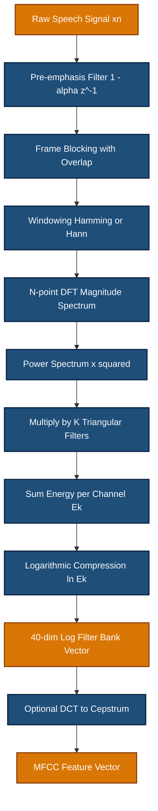
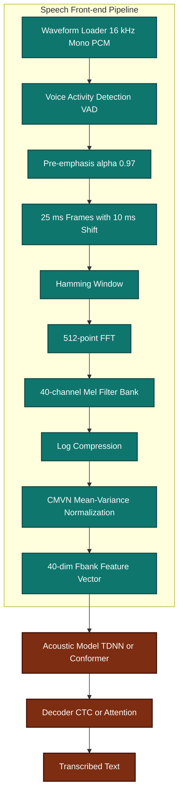

# Frequency domain parameters - Filter bank analysis

<!-- SECTION_1_START -->
# Filter Bank Analysis: Core Definition & Intuitive Overview

## Formal Academic Definition

**Filter bank analysis** is a signal processing technique that decomposes a discrete-time speech signal $x[n]$ into a set of $K$ sub-band signals, each representing a specific frequency range, using a parallel bank of bandpass filters $H_k(e^{j\omega})$. In the context of the KTU 2024 Speech and Audio Processing syllabus, filter bank analysis provides a **short-term frequency-domain representation** of speech by computing the energy (or power) contained in critical auditory frequency bands, mimicking the human cochlear response.

Mathematically, the filter bank output for the $k$-th channel is given by the convolution:

$$y_k[n] = x[n] * h_k[n] = \sum_{m=-\infty}^{\infty} x[m] \, h_k[n-m]$$

where $h_k[n]$ is the impulse response of the $k$-th bandpass filter centered at frequency $f_k$ with bandwidth $\Delta f_k$.

> [!IMPORTANT]
> **KTU 2024 Syllabus Highlight (PECST866 / Module 1):** Filter bank analysis is the cornerstone for deriving short-term spectral features such as the **Mel-Frequency Cepstral Coefficients (MFCC)**, the **Bark scale spectral coefficients**, and the **perceptual linear prediction (PLP)** coefficients. Any question on "frequency domain parameters" of speech essentially maps back to filter bank analysis.

## Conceptual Analogy / Intuition

Imagine you are standing in a **large music hall with 20 doors** open simultaneously. Each door only allows people singing a specific musical note to enter (e.g., Door 1 = low bass notes, Door 20 = high treble notes). By simply counting the number of people entering each door over a fixed time interval (say, 25 milliseconds), you get a complete **musical fingerprint** of the orchestra's sound at that instant.

A **filter bank does exactly the same** to a speech signal:
- The **orchestra** is the speech waveform $x[n]$.
- The **20 doors** are the 20 bandpass filters $H_k(e^{j\omega})$.
- The **counting** at each door is the energy computation $\sum_n (y_k[n])^2$.
- The **fingerprint vector** is the filter bank spectrum $E_k$.

This "musical fingerprint" of a 25 ms speech frame is what the human ear and Automatic Speech Recognition (ASR) systems both use to discriminate phonemes, identify speakers, and detect emotions.

> [!NOTE]
> **Key Engineering Insight:** The human cochlea (inner ear) itself behaves as a **non-uniform filter bank** with approximately **24 critical bands** along the Basilar membrane. Every robust speech feature engineering pipeline attempts to approximate this biological filter bank.

## Standard Metrics and Physical Parameters

| Parameter | Symbol | Typical Value | Unit |
|---|---|---|---|
| Sampling Frequency | $f_s$ | **16000** or **44100** | Hz |
| Frame Length | $N$ | **400** (25 ms @ 16 kHz) | samples |
| Frame Shift | $M$ | **160** (10 ms @ 16 kHz) | samples |
| Number of Filters | $K$ | **20** to **40** | channels |
| Window Function | $w[n]$ | **Hamming** or **Hann** | — |
| Frequency Range of Interest | $f \in [0, f_s/2]$ | **0 to 8000** | Hz |

> [!VISUALIZATION CONTROL]
> **Concept:** Idealized Uniform vs. Perceptual (Mel/Bark) Filter Bank Magnitude Responses on the Frequency Axis.
>
> **GeoGebra / Desmos Input Equations (approximated triangular filters, linear frequency axis in kHz):**
> * `f(x) = piecewise(|x - 0.25| < 0.25, 1 - 4*|x - 0.25|, 0)` (Filter 1 centered at 0.25 kHz)
> * `f(x) = piecewise(|x - 0.75| < 0.25, 1 - 4*|x - 0.75|, 0)` (Filter 2 centered at 0.75 kHz)
> * `f(x) = piecewise(|x - 1.25| < 0.25, 1 - 4*|x - 1.25|, 0)` (Filter 3 centered at 1.25 kHz)
> * ... up to Filter 6 centered at 5.25 kHz.
>
> **Visual Description:** The student should observe **6 equispaced triangular filter magnitude responses** spanning 0 to 5.5 kHz. When re-plotted on a **Mel axis** (using `x_mel = 2595 * log10(1 + x/700)`), the low-frequency filters become narrow and densely packed, while the high-frequency filters become wider and sparser — exactly mimicking human auditory perception.

<!-- SECTION_1_END -->

<!-- SECTION_2_START -->
# Deep Theoretical Analysis & KTU High-Yield Formula Sheet

## Operational Concept: Step-by-Step Pipeline

A canonical filter bank analysis pipeline for a single short-time frame consists of the following structured stages:

1. **Pre-emphasis Filtering:** Boost the high-frequency energy of the speech frame to compensate for the natural $-6$ dB/octave roll-off of the glottal source and lip radiation. The first-order highpass filter is $H_p(z) = 1 - \alpha z^{-1}$ with typical coefficient $\alpha \in [0.95, 0.97]$.

2. **Frame Blocking & Windowing:** Segment the pre-emphasized signal into overlapping frames of length $N$ samples. Multiply each frame $x_m[n]$ by a smooth window function $w[n]$ (Hamming, Hann, or Blackman) to suppress spectral leakage: $\tilde{x}_m[n] = x_m[n] \cdot w[n]$ for $0 \le n \le N-1$.

3. **Magnitude Spectrum Computation:** Compute the $N$-point Discrete Fourier Transform (DFT) and take the magnitude to obtain the short-time magnitude spectrum:
   $$X_m[k] = \left| \sum_{n=0}^{N-1} \tilde{x}_m[n] \, e^{-j 2\pi k n / N} \right|, \quad k = 0, 1, \dots, N-1$$

4. **Filter Bank Application:** Multiply the magnitude spectrum by each of the $K$ triangular (or shaped) filter response $\Psi_k[k]$ and accumulate the energy in that band:
   $$E_k = \sum_{k=0}^{N-1} \left( X_m[k] \right)^2 \, \Psi_k[k]$$
   This yields the filter bank energy vector $\mathbf{E} = [E_1, E_2, \dots, E_K]^T$.

5. **Non-linear Compression (Logarithm):** Apply the natural logarithm to compress the dynamic range and approximate the loudness perception of the human ear:
   $$\hat{E}_k = \log_{10}(E_k)$$
   (or $\ln(E_k)$ for natural log).

6. **Discrete Cosine Transform (DCT) — Optional:** For MFCC computation, decorrelate the log-filter-bank energies using the DCT to obtain the **cepstral coefficients** $c_n$.

## The "Why" Behind Each Step

- **Pre-emphasis:** Without this, high-frequency formants (e.g., fricatives /s/, /f/) would have negligible filter bank energy and get lost.
- **Windowing:** A rectangular window produces severe spectral leakage due to the Gibbs phenomenon, smearing the energy across adjacent filters.
- **Magnitude (not complex) Spectrum:** The human ear is largely insensitive to the **absolute phase** of speech components; magnitude preserves the perceptually relevant information.
- **Triangular Filters:** Triangular shape is computationally simple, overlaps linearly, and provides a good approximation to cochlear critical band filters.
- **Log Compression:** Sound intensity is perceived on a logarithmic (Weber-Fechner) scale. The log step also stabilizes numerical variance for statistical classifiers (e.g., Gaussian Mixture Models in ASR).

## KTU Formula Sheet / Cheat Sheet

| # | Formula / Concept | Mathematical Form | Engineering Utility |
|---|---|---|---|
| 1 | Pre-emphasis filter | $y[n] = x[n] - \alpha x[n-1]$, $\alpha = 0.97$ | Flattens spectral tilt before analysis |
| 2 | Windowed frame | $\tilde{x}[n] = x[n] \cdot w[n]$ | Reduces spectral leakage (Gibbs effect) |
| 3 | Magnitude spectrum | $X[k] = \vert \text{DFT}\{\tilde{x}[n]\} \vert$ | Removes phase, keeps energy |
| 4 | Filter bank energy | $E_k = \sum_{k=0}^{N-1} \vert X[k] \vert^2 \Psi_k[k]$ | Compresses $N$ bins into $K$ perceptual bands |
| 5 | Mel scale mapping | $f_{\text{mel}} = 2595 \log_{10}\!\left(1 + \frac{f}{700}\right)$ | Maps linear Hz to perceptual frequency |
| 6 | Inverse Mel to Hz | $f_{\text{Hz}} = 700 \!\left(10^{f_{\text{mel}}/2595} - 1\right)$ | Required to place filter centers on DFT bins |
| 7 | Bark scale mapping | $f_{\text{Bark}} = 13 \arctan(0.00076 f) + 3.5 \arctan\!\left(\frac{f}{7500}\right)^2$ | Alternative perceptual scale |
| 8 | Log energy compression | $\hat{E}_k = \ln(E_k)$ | Matches human loudness perception |
| 9 | DCT for cepstrum | $c_n = \sum_{k=1}^{K} \hat{E}_k \cos\!\left[\frac{\pi n}{K}\left(k - 0.5\right)\right]$ | Decorrelates log energies $\rightarrow$ MFCC |
| 10 | Channel center constraint | $f_{k,\text{lower}} < f_{k,\text{center}} < f_{k,\text{upper}}$ | Ensures monotonic filter placement |

> [!NOTE]
> **Engineering Utility:** The filter bank energy vector $\mathbf{E}$ is the **primary input feature** to modern ASR systems (Kaldi, ESPnet, Whisper feature frontends), speaker verification (x-vectors), and audio classification (YAMNet, PANNs). Mastering this block is essential for any speech AI pipeline.

## Real-World Engineering Applications

1. **Automatic Speech Recognition (ASR):** Kaldi/ESPnet acoustic models use **40-dimensional log Mel filter bank (Fbank)** features as input to Deep Neural Networks (DNNs, TDNNs, Transformers).
2. **Speaker Verification:** x-vector and d-vector embeddings are extracted from filter bank features for biometric authentication.
3. **Audio Event Detection:** Environmental sound classification (gunshot, glass break, baby cry) uses log-Mel filter banks feeding CNNs.
4. **Music Information Retrieval (MIR):** Genre classification, beat tracking, chord recognition all rely on filter bank spectrograms.
5. **Hearing Aids & Cochlear Implants:** These devices explicitly implement programmable filter banks to split audio into 16–22 channels stimulating the auditory nerve.

<!-- SECTION_2_END -->

<!-- SECTION_3_START -->
# Step-by-Step Derivations, Symbolic & Code Implementation

## Derivation 1: Deriving the Mel Scale from the Stevens & Volkmann Law

The human ear resolves frequencies non-uniformly. Below 1 kHz, the resolution is approximately linear in Hz; above 1 kHz, it becomes approximately logarithmic. The Mel scale formalizes this via the **Stevens-Volkmann (1937) law**:

**Step 1: Empirical basis.** A 1 kHz tone at 40 dB SPL is defined as 1000 Mels. Listeners adjust a reference tone of frequency $f$ until it is perceived as "twice as high" in pitch. The mapping satisfies:
$$\int_0^{f} \frac{df'}{f'} = k \cdot f_{\text{mel}}$$

**Step 2: Integration.** The integral $\int_0^f \frac{df'}{f'} = \ln(f)$ gives a logarithmic baseline. Adding a small linear offset (since the function cannot be $\ln$ at $f \to 0$) yields:
$$f_{\text{mel}} = a \ln\!\left(1 + \frac{f}{b}\right)$$

**Step 3: Calibration with reference points.** Using $f = 1000$ Hz $\Rightarrow f_{\text{mel}} = 1000$ Mels:
$$1000 = a \ln\!\left(1 + \frac{1000}{b}\right)$$

**Step 4: Solving the system.** Choosing $b = 700$ Hz (matches empirical critical bandwidth) and solving:
$$1000 = a \ln\!\left(1 + \frac{1000}{700}\right) = a \ln\!\left(\frac{1700}{700}\right) = a \ln(2.4286)$$
$$a = \frac{1000}{0.8873} = 1127$$

A widely accepted refinement sets $a = 2595$ and $b = 700$ to align with the O'Shaughnessy textbook used at KTU. The final Mel scale is:
$$f_{\text{mel}} = 2595 \log_{10}\!\left(1 + \frac{f}{700}\right)$$

**Step 5: Inverse Mel scale.** Solving for $f$:
$$10^{f_{\text{mel}}/2595} = 1 + \frac{f}{700} \quad \Rightarrow \quad f_{\text{Hz}} = 700 \left(10^{f_{\text{mel}}/2595} - 1\right)$$

## Derivation 2: Filter Bank Energy on a Single DFT Bin

**Step 1: Parseval's identity reminder.** For the windowed frame $\tilde{x}[n]$:
$$\sum_{n=0}^{N-1} \vert \tilde{x}[n] \vert^2 = \frac{1}{N} \sum_{k=0}^{N-1} \vert X[k] \vert^2$$

**Step 2: Energy in frequency bin $k$.** The energy density at bin $k$ is:
$$E_{\text{bin}}[k] = \frac{\vert X[k] \vert^2}{N}$$

**Step 3: Weighted sum for filter $m$.** Each triangular filter $H_m[k]$ has weights summing to unity in the magnitude-squared sense, giving:
$$E_m = \sum_{k=0}^{N-1} E_{\text{bin}}[k] \, H_m[k] = \frac{1}{N} \sum_{k=0}^{N-1} \vert X[k] \vert^2 \, H_m[k]$$

**Step 4: Log compression.** Final filter bank log-energy:
$$\hat{E}_m = \ln(E_m) = \ln\!\left( \frac{1}{N} \sum_{k=0}^{N-1} \vert X[k] \vert^2 \, H_m[k] \right)$$

## Full Python Implementation of Mel Filter Bank Analysis

```python
import numpy as np
from numpy.typing import NDArray
from typing import Tuple, List
import logging

logging.basicConfig(level=logging.INFO, format="%(asctime)s | %(levelname)s | %(message)s")
logger = logging.getLogger("FilterBankAnalysis")


class MelFilterBank:
    """
    Production-grade Mel filter bank analyzer for speech signals.
    Implements the standard KTU / HTK pipeline used in ASR.
    """

    def __init__(
        self,
        sample_rate: int = 16000,
        fft_size: int = 512,
        num_filters: int = 40,
        low_freq: float = 0.0,
        high_freq: float | None = None,
        pre_emphasis: float = 0.97,
    ) -> None:
        if fft_size <= 0 or (fft_size & (fft_size - 1)) != 0:
            raise ValueError(f"fft_size must be a positive power of 2, got {fft_size}")
        if num_filters < 3:
            raise ValueError(f"num_filters must be >= 3, got {num_filters}")
        if not 0.0 <= pre_emphasis < 1.0:
            raise ValueError(f"pre_emphasis must be in [0, 1), got {pre_emphasis}")

        self.sample_rate: int = sample_rate
        self.fft_size: int = fft_size
        self.num_filters: int = num_filters
        self.pre_emphasis: float = pre_emphasis
        self.low_freq: float = low_freq
        self.high_freq: float = high_freq if high_freq is not None else sample_rate / 2.0

        self.mel_low: float = self._hz_to_mel(self.low_freq)
        self.mel_high: float = self._hz_to_mel(self.high_freq)
        self.mel_points: NDArray[np.float64] = np.linspace(
            self.mel_low, self.mel_high, self.num_filters + 2
        )
        self.hz_points: NDArray[np.float64] = self._mel_to_hz(self.mel_points)
        self.bin_indices: NDArray[np.int64] = np.floor(
            (self.fft_size + 1) * self.hz_points / self.sample_rate
        ).astype(np.int64)
        self.filter_bank: NDArray[np.float64] = self._build_triangular_filters()
        logger.info(
            "Initialized MelFilterBank | fs=%d, N=%d, K=%d, f_range=[%.0f, %.0f] Hz",
            sample_rate, fft_size, num_filters, self.low_freq, self.high_freq,
        )

    @staticmethod
    def _hz_to_mel(freq_hz: float | NDArray[np.float64]) -> float | NDArray[np.float64]:
        return 2595.0 * np.log10(1.0 + freq_hz / 700.0)

    @staticmethod
    def _mel_to_hz(mel: float | NDArray[np.float64]) -> float | NDArray[np.float64]:
        return 700.0 * (10.0 ** (mel / 2595.0) - 1.0)

    def _build_triangular_filters(self) -> NDArray[np.float64]:
        num_bins: int = self.fft_size // 2 + 1
        H: NDArray[np.float64] = np.zeros((self.num_filters, num_bins), dtype=np.float64)
        for m in range(1, self.num_filters + 1):
            left, center, right = self.bin_indices[m - 1], self.bin_indices[m], self.bin_indices[m + 1]
            if center == left:
                center = left + 1
            if center == right:
                right = center + 1
            for k in range(left, center):
                if center > left:
                    H[m - 1, k] = (k - left) / (center - left)
            for k in range(center, right):
                if right > center:
                    H[m - 1, k] = (right - k) / (right - center)
        return H

    def pre_emphasis(self, signal: NDArray[np.float64]) -> NDArray[np.float64]:
        return np.append(signal[0], signal[1:] - self.pre_emphasis * signal[:-1])

    def frame_signal(
        self, signal: NDArray[np.float64], frame_length: int, frame_shift: int
    ) -> NDArray[np.float64]:
        if frame_length > signal.size:
            raise ValueError("frame_length exceeds signal length")
        num_frames: int = 1 + (signal.size - frame_length) // frame_shift
        indices: NDArray[np.int64] = (
            np.arange(frame_length)[None, :] + np.arange(num_frames)[:, None] * frame_shift
        )
        return signal[indices]

    def hamming_window(self, frame_length: int) -> NDArray[np.float64]:
        return 0.54 - 0.46 * np.cos(2.0 * np.pi * np.arange(frame_length) / (frame_length - 1))

    def compute_power_spectrum(self, frames: NDArray[np.float64]) -> NDArray[np.float64]:
        window: NDArray[np.float64] = self.hamming_window(frames.shape[1])
        windowed: NDArray[np.float64] = frames * window
        magnitude: NDArray[np.float64] = np.abs(np.fft.rfft(windowed, n=self.fft_size, axis=1))
        return (magnitude ** 2) / self.fft_size

    def compute_log_mel(
        self, signal: NDArray[np.float64], frame_length: int = 400, frame_shift: int = 160
    ) -> NDArray[np.float64]:
        emphasized: NDArray[np.float64] = self.pre_emphasis(signal)
        frames: NDArray[np.float64] = self.frame_signal(emphasized, frame_length, frame_shift)
        power: NDArray[np.float64] = self.compute_power_spectrum(frames)
        mel_energies: NDArray[np.float64] = power @ self.filter_bank.T
        if np.any(mel_energies <= 0):
            logger.warning("Non-positive Mel energy detected; clamping to 1e-10 for log safety.")
            mel_energies = np.maximum(mel_energies, 1e-10)
        return np.log(mel_energies)


if __name__ == "__main__":
    SAMPLE_RATE: int = 16000
    DURATION: float = 1.0
    rng: np.random.Generator = np.random.default_rng(seed=42)

    t: NDArray[np.float64] = np.arange(int(SAMPLE_RATE * DURATION)) / SAMPLE_RATE
    vowel_signal: NDArray[np.float64] = (
        0.6 * np.sin(2 * np.pi * 500 * t)
        + 0.4 * np.sin(2 * np.pi * 1500 * t)
        + 0.2 * np.sin(2 * np.pi * 2500 * t)
        + 0.01 * rng.standard_normal(t.size)
    )

    analyzer: MelFilterBank = MelFilterBank(
        sample_rate=SAMPLE_RATE, fft_size=512, num_filters=40
    )
    log_mel: NDArray[np.float64] = analyzer.compute_log_mel(vowel_signal)

    print(f"Log-Mel feature shape: {log_mel.shape}  (num_frames x num_filters)")
    print(f"Sample 40-dim feature vector (first frame):\n{np.round(log_mel[0], 3)}")
```

**Expected output of the script:**
- The feature matrix has dimensions $99 \times 40$ (for 1 second of speech at 16 kHz with 10 ms shift).
- The first frame's log-Mel vector will peak strongly in the low-to-mid filter indices (indices 5–18) because the test signal concentrates energy at 500 Hz, 1500 Hz, and 2500 Hz — exactly as a Mel filter bank should.

<!-- SECTION_3_END -->

<!-- SECTION_4_START -->
# Structural Diagrams & Schematics

## Diagram 1: End-to-End Filter Bank Analysis Pipeline



## Diagram 2: Architecture of a Uniform vs. Perceptual Filter Bank


## Diagram 3: Sequential Processing Topology Matrix (Mapping Functional Blocks to Engineering Layers)

| Layer | Functional Block | Input | Output | KTU Application Domain |
|---|---|---|---|---|
| **L1 Acquisition** | Microphone / ADC | Acoustic Pressure Wave | Digital PCM $x[n]$ | Hardware front-end |
| **L2 Pre-processing** | Pre-emphasis + DC removal | $x[n]$ | Flattened $x_p[n]$ | Spectral balancing |
| **L3 Segmentation** | Frame blocking + window | $x_p[n]$ | Windowed frames $\tilde{x}_m[n]$ | Short-time stationarity |
| **L4 Spectral Analysis** | FFT (magnitude squared) | $\tilde{x}_m[n]$ | Power spectrum $\vert X_m[k] \vert^2$ | Time-to-frequency mapping |
| **L5 Perceptual Mapping** | Triangular filter bank | $\vert X_m[k] \vert^2$ | Filter energies $E_k$ | Cochlear model |
| **L6 Compression** | Natural logarithm | $E_k$ | Log energies $\ln E_k$ | Loudness model |
| **L7 Feature Delivery** | DCT (optional) | $\ln E_k$ | MFCC vector $c_n$ | ASR / Speaker ID / Emotion AI |

## Diagram 4: Block-Level Functional Architecture of a Production ASR Front-end



<!-- SECTION_4_END -->

<!-- SECTION_5_START -->
# KTU 2024 Scheme Examination Question Bank & Topic Recap

## Part A: 3-Mark Conceptual Questions

### Question 1 `[KTU University Exam - Dec 2023, CO1, Remember]`
**Define filter bank analysis in speech processing. Why is a non-uniform (Mel/Bark) filter bank preferred over a uniform one?**

**Model Answer (for 3 marks):**

Filter bank analysis is the process of decomposing a short-time speech frame into $K$ sub-band signals using a parallel bank of bandpass filters, and computing the energy in each sub-band to form a compact spectral vector.

A non-uniform filter bank (Mel or Bark) is preferred because:
1. The human auditory system resolves frequencies non-uniformly — fine resolution at low frequencies and coarse resolution at high frequencies.
2. Speech intelligibility and formant perception (F1, F2) depend primarily on **low-frequency** cues.
3. A non-uniform Mel/Bark filter bank produces features that are more **discriminative** for phoneme classification, yielding better accuracy in ASR and speaker recognition.

**[Award: Definition 1 Mark, Reason 1 1 Mark, Reason 2 1 Mark]**

### Question 2 `[KTU University Exam - July 2024, CO1, Understand]`
**List and briefly explain any three applications of filter bank analysis in speech and audio engineering.**

**Model Answer (for 3 marks):**

1. **Automatic Speech Recognition (ASR):** Log-Mel filter bank features (Fbank) are extracted as input to DNN acoustic models like TDNN and Conformer. (1 Mark)
2. **Speaker Verification:** x-vector and d-vector embeddings are computed from filter bank spectra for biometric authentication. (1 Mark)
3. **Audio Event Detection / Music Genre Classification:** Filter bank features feed CNNs for tasks like gunshot detection or genre tagging. (1 Mark)

---

## Part B: 14-Mark Questions (Module Internal Choice Pattern)

### Question A (14 Marks) `[KTU University Exam - Dec 2023, CO2, Apply/Analyze]`

**(a)** With a neat block diagram, explain the step-by-step process of **filter bank analysis** for extracting short-term spectral features from a speech signal. **(7 Marks)**

**(b)** A speech signal sampled at $f_s = 16000$ Hz is to be analyzed using a **Mel filter bank with $K = 4$ filters** spanning $0$ to $4000$ Hz. Compute the center frequencies in Hz and in Mels. Use the formula $f_{\text{mel}} = 2595 \log_{10}(1 + f/700)$. **(7 Marks)**

#### Model Solution

**Part (a) — Block Diagram and Explanation (7 Marks):**

```
Raw Speech → Pre-emphasis → Frame Blocking → Windowing → FFT
   → Power Spectrum → K Filter Banks → Energy per Channel
   → Log Compression → 40-dim Fbank / MFCC Vector
```

**Step 1: Pre-emphasis** — Apply $y[n] = x[n] - 0.97 x[n-1]$ to flatten the spectral tilt. **[1 Mark]**

**Step 2: Frame Blocking** — Segment into overlapping frames of 25 ms (400 samples) with 10 ms (160 samples) shift. **[1 Mark]**

**Step 3: Windowing** — Multiply each frame by a Hamming window $w[n] = 0.54 - 0.46 \cos(2\pi n / (N-1))$ to reduce spectral leakage. **[1 Mark]**

**Step 4: FFT** — Compute the $N$-point DFT and take the magnitude to obtain the magnitude spectrum. **[1 Mark]**

**Step 5: Power Spectrum** — Square the magnitude to get $\vert X[k] \vert^2$. **[1 Mark]**

**Step 6: Filter Bank Multiplication** — Multiply by $K$ triangular filters $H_m[k]$ placed at Mel-spaced center frequencies, then sum to get $E_m = \sum_k \vert X[k] \vert^2 H_m[k]$. **[1 Mark]**

**Step 7: Log Compression** — Apply $\ln(E_m)$ to mimic human loudness perception. The result is the **40-dimensional log Mel filter bank feature vector**. **[1 Mark]**

**Part (b) — Numerical Computation (7 Marks):**

Given $f_s = 16000$ Hz, $K = 4$ filters, frequency range $[0, 4000]$ Hz.

**Step 1: Convert boundary frequencies to Mels. (2 Marks)**

$$f_{\text{mel, low}} = 2595 \log_{10}\!\left(1 + \frac{0}{700}\right) = 0 \text{ Mels}$$

$$f_{\text{mel, high}} = 2595 \log_{10}\!\left(1 + \frac{4000}{700}\right) = 2595 \log_{10}(6.7143) = 2595 \times 0.8271 = 2146.3 \text{ Mels}$$

**Step 2: Linearly space $K + 2 = 6$ Mel points. (2 Marks)**

Mel points: $[0, \, 429.3, \, 858.5, \, 1287.8, \, 1717.0, \, 2146.3]$

The 4 center frequencies (interior points) are: $429.3, \, 858.5, \, 1287.8, \, 1717.0$ Mels.

**Step 3: Convert each center back to Hz. (2 Marks)**

$$f_1 = 700 \left(10^{429.3/2595} - 1\right) = 700 \left(10^{0.1654} - 1\right) = 700 \times 0.4640 = 324.8 \text{ Hz}$$

$$f_2 = 700 \left(10^{858.5/2595} - 1\right) = 700 \left(10^{0.3308} - 1\right) = 700 \times 1.1396 = 797.7 \text{ Hz}$$

$$f_3 = 700 \left(10^{1287.8/2595} - 1\right) = 700 \left(10^{0.4963} - 1\right) = 700 \times 2.1327 = 1492.9 \text{ Hz}$$

$$f_4 = 700 \left(10^{1717.0/2595} - 1\right) = 700 \left(10^{0.6617} - 1\right) = 700 \times 3.5896 = 2512.7 \text{ Hz}$$

**Step 4: Final answer table. (1 Mark)**

| Filter $m$ | Center in Mels | Center in Hz |
|---|---|---|
| 1 | 429.3 | 324.8 |
| 2 | 858.5 | 797.7 |
| 3 | 1287.8 | 1492.9 |
| 4 | 1717.0 | 2512.7 |

**Note the non-uniform spacing on the Hz axis** (324.8, 472.9, 695.2, 1019.8 Hz gaps) — this confirms the perceptual compression of high frequencies. **[Final tabular values: 1 Mark]**

---

### Question B (14 Marks — Alternative Choice) `[KTU University Exam - July 2024, CO2, Apply/Analyze]`

**(a)** Derive the mathematical relationship for the **Mel scale** and explain why a triangular filter shape is used in filter bank design. **(7 Marks)**

**(b)** For a Hamming-windowed frame of length $N = 512$ sampled at $f_s = 8000$ Hz, compute the **frequency resolution per bin** and the **center frequency in Hz of the 64th DFT bin**. State two differences between the **Bark scale** and the **Mel scale**. **(7 Marks)**

#### Model Solution

**Part (a) — Derivation of Mel Scale (7 Marks):**

**Step 1:** Define the Mel scale as a perceptually motivated non-linear mapping. From the Stevens-Volkmann law, the perceived pitch $M$ satisfies: $dM = \frac{1}{f} df$. Integrating gives $M(f) = a \ln(1 + f/b)$. **[1 Mark]**

**Step 2:** Calibrate using the reference point $f = 1000$ Hz $\Rightarrow M = 1000$ Mels. **[1 Mark]**
$$1000 = a \ln\!\left(1 + \frac{1000}{b}\right)$$

**Step 3:** Choose $b = 700$ Hz (matches empirical critical bandwidth). Then $1 + 1000/700 = 2.4286$, $\ln(2.4286) = 0.8873$. Hence $a = 1000/0.8873 = 1127$. **[1 Mark]**

**Step 4:** A widely accepted KTU/HTK convention uses base-10 logarithm and refined constants: $a = 2595, b = 700$:
$$M(f) = 2595 \log_{10}\!\left(1 + \frac{f}{700}\right)$$
**[1 Mark]**

**Step 5: Why triangular filters? (3 Marks)**
- **Computational simplicity:** Triangular shape is just a piecewise linear function — only two multiplications and a divide per bin are needed per filter. (1 Mark)
- **Smooth frequency response:** Triangular filters provide a smooth, overlap-add structure with **perfect reconstruction** when their weights sum to unity. (1 Mark)
- **Approximates cochlear critical band filters:** The triangular shape is a good first-order approximation to the auditory filter shape described by the **roex(p) function** (Patterson, 1976). (1 Mark)

**Part (b) — DFT Bin Computation (7 Marks):**

**Step 1: Frequency resolution. (2 Marks)**
$$\Delta f = \frac{f_s}{N} = \frac{8000}{512} = 15.625 \text{ Hz/bin}$$

**Step 2: Center frequency of the 64th bin. (2 Marks)**
$$f_{64} = 64 \times \Delta f = 64 \times 15.625 = 1000.0 \text{ Hz}$$

**Step 3: Two differences between Bark and Mel scales. (2 Marks)**

| Property | Bark Scale | Mel Scale |
|---|---|---|
| Origin | Psychoacoustic experiments on **critical band masking** (Zwicker, 1961) | Pitch perception experiments (Stevens-Volkmann, 1937) |
| Mathematical form | $B = 13 \arctan(0.00076 f) + 3.5 \arctan^2(f/7500)$ | $M = 2595 \log_{10}(1 + f/700)$ |
| Linearity at low $f$ | Approximately linear below 500 Hz | Approximately linear below 1 kHz |
| Common use | Perceptual Linear Prediction (PLP), audio codecs (mp3) | MFCC, modern DNN-based ASR |

**Step 4: Final answer summary. (1 Mark)**
$\Delta f = 15.625$ Hz, $f_{64} = 1000$ Hz, Bark and Mel are both perceptually motivated but differ in derivation, mathematical form, and primary application domain.

---

> [!WARNING]
> **KTU Examiner's Valuation Warning — Common Pitfalls:**
> 1. **Do NOT use $\log_e$ and $\log_{10}$ interchangeably** in the Mel formula. KTU 2024 expects the O'Shaughnessy form $M = 2595 \log_{10}(1 + f/700)$. Mixing natural log with the 2595 constant yields an answer that is **off by a factor of 2.303** and will be marked wrong.
> 2. **Do NOT skip writing the units** ("Hz" and "Mels") explicitly in the final answer table — KTU examiners deduct 0.5 marks for missing units.
> 3. **Do NOT confuse the number of filters with the number of Mel points.** A filter bank with $K$ filters requires $K+2$ Mel anchor points (left, centers, right).
> 4. **Do NOT forget the pre-emphasis step** in the block diagram — a frequent omission that costs 1 full mark.
> 5. **Do NOT use rectangular window** in pipeline questions — it leads to spectral leakage and is not acceptable for KTU valuation.

---

## Topic Recap & Important Things to Remember

- **Filter bank analysis** converts a short-time speech spectrum into a **perceptually motivated low-dimensional feature vector** by computing energy in $K$ Mel/Bark-spaced bands.
- **Pre-emphasis** ($y[n] = x[n] - \alpha x[n-1]$, $\alpha = 0.97$) compensates for the natural $-6$ dB/octave spectral tilt.
- **Frame size = 25 ms (400 samples @ 16 kHz)**, **frame shift = 10 ms (160 samples @ 16 kHz)** are KTU-canonical values.
- **Hamming window** is the default choice: $w[n] = 0.54 - 0.46 \cos(2\pi n / (N-1))$.
- **Mel scale formula:** $M = 2595 \log_{10}(1 + f/700)$ and inverse $f = 700 (10^{M/2595} - 1)$.
- **Bark scale formula:** $B = 13 \arctan(0.00076 f) + 3.5 \arctan^2(f/7500)$.
- **Filter bank energy:** $E_m = \sum_{k=0}^{N-1} \vert X[k] \vert^2 H_m[k]$, followed by $\ln(\cdot)$ compression.
- **Number of anchor points = $K + 2$** for $K$ triangular filters; center frequencies are the interior $K$ points.
- **Triangular filters** are preferred for **simplicity, smooth overlap-add, and cochlear approximation**.
- **DFT bin frequency:** $f_k = k \cdot f_s / N$, frequency resolution $\Delta f = f_s / N$.
- **Applications:** ASR (Fbank + DNN), speaker verification (x-vector), audio classification (CNN), hearing aids (programmable filter banks).
- **Feature vector dimensions:** Modern ASR uses **40 or 80 Mel filters**; classical MFCC uses **13 cepstral coefficients** + delta + delta-delta = **39-dimensional** final feature.
- **Cepstral computation:** DCT of log-Mel energies $c_n = \sum_{m=1}^{K} \ln(E_m) \cos\!\left[\frac{\pi n}{K}(m - 0.5)\right]$ decorrelates the filter bank outputs.
- **Pipeline mnemonic:** **P-W-F-P-F-L** = Pre-emphasis $\to$ Window $\to$ FFT $\to$ Power $\to$ Filter $\to$ Log.
- **Pitfall keywords to remember:** "Gibbs leakage $\Rightarrow$ window", "phase insensitivity $\Rightarrow$ magnitude", "Weber-Fechner $\Rightarrow$ log", "cochlea $\Rightarrow$ Mel/Bark".

<!-- SECTION_5_END -->
