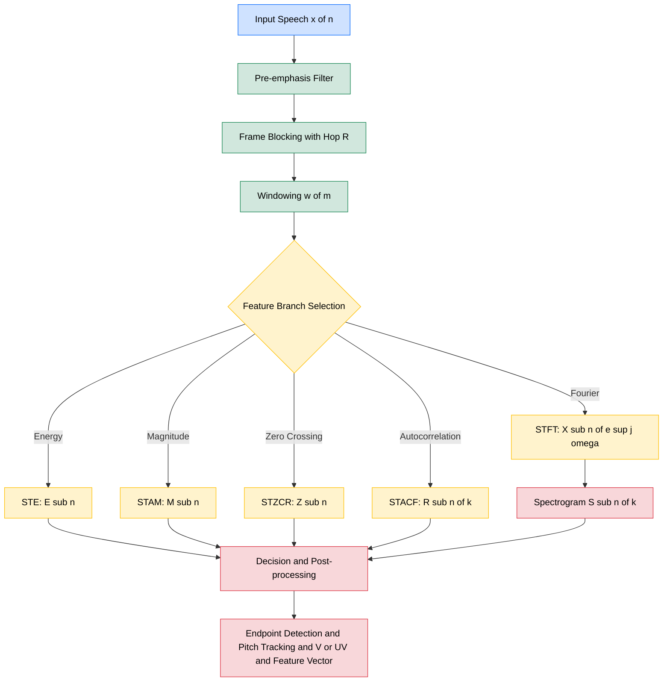
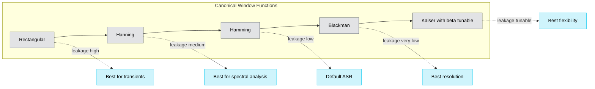
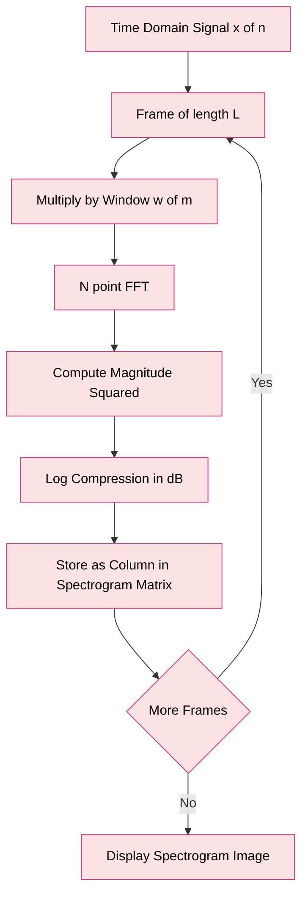

# Short-Time Speech Analysis

<!-- SECTION_1_START -->
# Short-Time Speech Analysis: The Lens into Time-Varying Speech

> [!IMPORTANT]
> **Syllabus Anchor (KTU 2024 — PECST866, Module 1):** Short-Time Energy, Short-Time Average Magnitude, Short-Time Zero Crossing Rate, Short-Time Autocorrelation, and the Short-Time Fourier Transform. This forms the analytical backbone for almost every downstream speech task — pitch tracking, endpoint detection, voiced/unvoiced classification, and feature extraction (MFCCs, etc.).

## 1.1 Formal Definition

**Short-Time Speech Analysis** is a class of signal-processing techniques in which a *slowly time-varying linear system* model is applied to a speech signal $x(n)$ by computing a weighted local statistic over a finite-duration sliding window. Mathematically, every short-time parameter is of the canonical form:

$$
Q_n = \sum_{m=-\infty}^{\infty} T\bigl[x(m)\bigr]\,w(n-m)
$$

where $T[\,\cdot\,]$ is a (possibly non-linear) transformation applied to the speech samples, and $w(n-m)$ is a window sequence of length $N$ centered at time $n$. The index $n$ is advanced in discrete steps (typically every $10\text{–}30$ ms) to track the *quasi-stationary* evolution of speech.

## 1.2 Intuitive Analogy — The Spotlight on a Stage

Imagine a long musical concert recorded on a single DVD. The audio is non-stationary — different songs, different instruments, different volumes play at different times. To *analyse* the recording, you cannot take a single Fourier transform of the whole DVD, because that would only tell you "all the frequencies ever played" mashed together.

Instead, you act like a stage director with a **moving spotlight** (the window $w$). You slide the spotlight across the timeline, and at every position you *freeze* a 20–40 millisecond slice. Inside that frozen slice, the audio looks almost stationary (steady pitch, steady formants, steady energy), so you can safely apply classical DSP tools. Then the spotlight jumps to the next slice, and the cycle repeats.

The width of the spotlight is the **window length** $N$ (usually **20–40 ms** for voiced speech, **5–10 ms** for transient plosives). The distance between successive spotlight positions is the **hop/frame shift** $R$. This spotlight metaphor is precisely what `librosa`, `scipy.signal`, and every production speech pipeline implements under the hood.

## 1.3 Why "Short-Time" is Mandatory

> [!NOTE]
> **Quasi-Stationarity Principle (Fant, 1973):** Although a speech signal is globally non-stationary, over intervals of **5–50 ms** the vocal-tract shape, excitation, and radiated spectrum can be considered *statistically stationary*. This empirical observation is the entire justification for short-time analysis.

Without the short-time framework, a single global FFT of an utterance would smear together the fricative /s/, the vowel /a/, and the silence gaps into an unintelligible average spectrum.

## 1.4 Block-Diagram Conceptualisation

The canonical short-time analyser is a cascade of four stages:

$$
x(n) \;\longrightarrow\; \boxed{\text{Pre-emphasis}} \;\longrightarrow\; \boxed{\text{Windowing } w(n)} \;\longrightarrow\; \boxed{\text{Feature Function } T[\,\cdot\,]} \;\longrightarrow\; Q_n
$$

* **Pre-emphasis** $H(z)=1-\alpha z^{-1}$ (with $\alpha \approx 0.97$) flattens the $-6$ dB/octave spectral tilt of the glottal source and boosts high-frequency formants.
* **Windowing** isolates the short segment $x(m)w(n-m)$.
* **Feature function** $T[\,\cdot\,]$ computes energy, magnitude, zero-crossings, autocorrelation, or the Fourier transform.
* The output $Q_n$ is the *n-th frame* of the short-time representation.

> [!VISUALIZATION CONTROL]
> **Concept:** Sliding rectangular window over a sampled speech waveform.
> **Desmos / GeoGebra Input:**
> * `x(t) = sin(2*pi*120*t) + 0.5*sin(2*pi*220*t)` (a quasi-stationary voiced segment)
> * `w(t) = 1` for `t in [0, 0.025]`, `0` otherwise (25 ms rectangular window)
> * `x_w(t) = x(t)*w(t-floor(t/0.01)*0.01)` (frame at $t=0.01$ s)
> **Visual Description:** Observe how the product $x_w(t)$ keeps only the slice of the signal inside the window. As the centre of $w$ advances by 10 ms, a new coloured "frame" lights up while the previous one fades, producing the characteristic cascaded-frame appearance of a spectrogram.

## 1.5 Core Parameters at a Glance

| Symbol | Name | Typical KTU Value | Unit |
| :--- | :--- | :---: | :--- |
| $N$ | Window length | $20\text{–}40$ (voiced), $5\text{–}10$ (transient) | ms |
| $R$ | Frame shift / hop | $N/2$ to $N/3$ | ms |
| $f_s$ | Sampling rate | **16000** or **22050** | Hz |
| $\alpha$ | Pre-emphasis coefficient | $0.95\text{–}0.97$ | — |
| $L$ | FFT size | $512\text{–}2048$ (usually $2^k$) | samples |
| $N_{frames}$ | Total frames | $\lfloor (M-N)/R \rfloor + 1$ | — |

---

<!-- SECTION_1_END -->

<!-- SECTION_2_START -->
# Deep Theoretical Analysis & KTU High-Yield Formula Sheet

## 2.1 The Short-Time Analysis Equation — A Unified View

Every parameter in short-time analysis obeys the **Windowed Discrete-Time Fourier Transform (WDTFT)**-style master equation. The signal is multiplied by a window $w(n-m)$ and processed, frame-by-frame. We enumerate the five *canonical short-time parameters* below.

### 2.1.1 Short-Time Energy (STE)

The energy in frame $n$ of length $N$ is the sum of squared windowed samples:

$$
E_n = \sum_{m=-\infty}^{\infty} \bigl[x(m)\,w(n-m)\bigr]^2
\;=\; \sum_{m=0}^{N-1} \bigl[x(n-m)\,w(m)\bigr]^2
$$

* **Physical meaning:** RMS energy in the $n$-th windowed segment.
* **Use case:** Endpoint detection (silence vs. speech), voiced/unvoiced discrimination, syllabic stress detection.
* **Why the square?** Energy must be a non-negative scalar, and squaring also emphasizes large-amplitude peaks (voiced regions) over low-amplitude fricatives.

### 2.1.2 Short-Time Average Magnitude (STAM)

To reduce sensitivity to large-amplitude outliers, the absolute value can be used in place of the square:

$$
M_n = \sum_{m=0}^{N-1} \bigl\vert\,x(n-m)\,w(m)\,\bigr\vert
$$

* **Use case:** Cheaper computational alternative to STE; still preserves frame-level amplitude contours.
* **Engineering note:** STAM has gentler dynamic range than STE — it does *not* exaggerate voiced peaks as aggressively.

### 2.1.3 Short-Time Average Zero-Crossing Rate (STZCR)

The ZCR counts the number of times the windowed signal crosses zero within frame $n$:

$$
Z_n = \frac{1}{2\,N}\sum_{m=0}^{N-1} \bigl\vert\,\mathrm{sgn}\!\bigl[x(n-m)\bigr] - \mathrm{sgn}\!\bigl[x(n-m-1)\bigr]\,\bigr\vert
$$

The factor $\tfrac{1}{2N}$ is the **normalised** form. The unscaled version simply counts sign-changes per frame.

* **Voiced sounds** (vowels, nasals) — low ZCR, typically **20–80** crossings/frame at $f_s = 8$ kHz.
* **Unvoiced sounds** (fricatives, /s/, /f/) — high ZCR, often **>150** crossings/frame.
* **Use case:** Voiced/unvoiced classification, fricative detection, pitch estimation front-end.

### 2.1.4 Short-Time Autocorrelation Function (STACF)

$$
R_n(k) = \sum_{m=0}^{N-1-k} x(n+m)\,w(m)\,x(n+m+k)\,w(m+k)
$$

for lag $k = 0, 1, \dots, K_{\max}$.

* $R_n(0)$ is the frame energy $E_n$.
* The first non-zero peak beyond $R_n(0)$ occurs near the **pitch period** $P_n$, giving a direct route to fundamental-frequency estimation.
* $R_n(k)$ is symmetric: $R_n(-k) = R_n(k)$.

### 2.1.5 Short-Time Fourier Transform (STFT)

The keystone of all modern speech features:

$$
X_n\!\left(e^{j\omega}\right) = \sum_{m=-\infty}^{\infty} x(m)\,w(n-m)\,e^{-j\omega m}
$$

The discrete form, evaluated on the FFT grid, is:

$$
X_n[k] = \sum_{m=0}^{L-1} x(n+m)\,w(m)\,e^{-j2\pi k m / L},\quad k = 0, 1, \dots, L-1
$$

* $|X_n[k]|^2$ is the **spectrogram** — a 2-D time-frequency image.
* The STFT is **invertible** (up to window constraints) via the overlap-add theorem.

## 2.2 Window Functions — The Heartbeat of Trade-offs

A window $w(m)$ of length $L$ trades **main-lobe width** (frequency resolution) against **side-lobe level** (spectral leakage). Five canonical choices:

| Window | Time-domain formula $w(m)$ | Main-lobe width (bins) | Highest side-lobe (dB) | KTU Verdict |
| :--- | :---: | :---: | :---: | :--- |
| Rectangular | $1$ | $2$ | $-13$ | Worst leakage — avoid for voiced speech |
| Hamming | $0.54 - 0.46\cos\!\left(\tfrac{2\pi m}{L-1}\right)$ | $4$ | $-41$ | **Default for ASR front-ends** |
| Hanning | $0.5 - 0.5\cos\!\left(\tfrac{2\pi m}{L-1}\right)$ | $4$ | $-31$ | Cleaner spectrum, $\to 0$ at edges |
| Blackman | $0.42 - 0.5\cos(\cdot) + 0.08\cos(\cdot\cdot)$ | $6$ | $-57$ | Narrow-band analysis |
| Kaiser ($\beta=8.6$) | $\dfrac{I_0\!\left(\beta\sqrt{1-(2m/L-1)^2}\right)}{I_0(\beta)}$ | Tunable | Tunable | Best leakage/resolution trade-off |

> [!NOTE]
> **Trade-off Theorem (Window Design):** A narrower main-lobe (better frequency resolution) is mathematically *incompatible* with lower side-lobes (less leakage). The Heisenberg-Gabor inequality sets the *absolute* lower bound on the time-frequency area, so window design is fundamentally an exercise in compromise.

## 2.3 KTU High-Yield Formula Sheet

> [!IMPORTANT]
> **All equations below are board-exam critical.** Memorise the boxed forms and the conditions.

| # | Parameter | Formula | Conditions / Units |
| :--- | :--- | :--- | :--- |
| 1 | Short-Time Energy | $E_n = \sum_{m=0}^{N-1} \bigl[x(n-m)\,w(m)\bigr]^2$ | $N$ in samples, output in $\text{Volt}^2$ |
| 2 | Short-Time Magnitude | $M_n = \sum_{m=0}^{N-1} \bigl\vert x(n-m)\,w(m) \bigr\vert$ | Output in $\text{Volt}$ |
| 3 | Short-Time ZCR (norm.) | $Z_n = \frac{1}{2N}\sum_{m=0}^{N-1} \bigl\vert \mathrm{sgn}[x(n-m)] - \mathrm{sgn}[x(n-m-1)] \bigr\vert$ | Unit: crossings/sample |
| 4 | Short-Time ACF | $R_n(k) = \sum_{m=0}^{N-1-k} x(n+m)w(m)\,x(n+m+k)w(m+k)$ | Lag $k$ in samples |
| 5 | STFT | $X_n(e^{j\omega}) = \sum_{m=0}^{L-1} x(n+m)w(m)\,e^{-j\omega m}$ | $\omega \in [-\pi, \pi]$ |
| 6 | Window energy (Rect.) | $E_w = N$ | $w(m) = 1$ for all $m$ |
| 7 | Window energy (Hamm.) | $E_w = 0.54^2 N + 0.5(0.46)^2 N \approx 0.3974\,N$ | Hamming |
| 8 | Overlap factor | $\eta = 1 - R/N$ | Typically $0.5$ ($50\%$ overlap) |
| 9 | Frame count | $N_f = \left\lfloor \frac{M - N}{R} \right\rfloor + 1$ | $M$ = signal length |
| 10 | Pre-emphasis | $y(n) = x(n) - \alpha\,x(n-1)$ | $\alpha \in [0.9, 0.97]$ |
| 11 | Hamming window | $w(m) = 0.54 - 0.46\cos\!\left(\frac{2\pi m}{L-1}\right)$ | $m = 0, \dots, L-1$ |
| 12 | Hanning window | $w(m) = 0.5 - 0.5\cos\!\left(\frac{2\pi m}{L-1}\right)$ | $m = 0, \dots, L-1$ |
| 13 | Spectrogram | $S_n[k] = \bigl\vert X_n[k] \bigr\vert^2$ | dB scale: $10\log_{10}S$ |
| 14 | Time resolution | $\Delta t \approx R$ | $R$ = hop size (s) |
| 15 | Frequency resolution | $\Delta f \approx f_s / L$ | Hz per FFT bin |

## 2.4 Engineering Utility — Why this Matters in Production

* **ASR (Kaldi, Whisper, ESPnet):** Mel-spectrograms are STFT magnitudes warped onto the mel scale, then fed to a neural network.
* **Speaker ID & Verification:** Energy + ZCR + ACF form the classical front-end for **Gaussian Mixture Models** and **i-Vector** systems.
* **Codec Design (Opus, EVS, AMR-WB):** Short-time analysis on 20 ms frames is the universal granularity of cellular codecs.
* **Hearing Aids & Cochlear Implants:** Spectral peaks from STFT drive the channel-specific stimulation strategy.
* **Forensic & Speaker Forensics:** STZCR and STE contours are first-pass evidence in voice comparison.
* **Music Information Retrieval (MIR):** Onset detection uses STAM/ZCR to mark note attacks in MP3s.

---

<!-- SECTION_2_END -->

<!-- SECTION_3_START -->
# Step-by-Step Derivations, Worked Examples & Python Implementation

## 3.1 Derivation of the Short-Time Energy (STE)

### 3.1.1 Setup

A finite-length speech frame centred at sample index $n$ is extracted by:

$$
x_w(m) = x(m)\,w(n-m)
$$

where $w(\cdot)$ is a window of length $N$. The *energy* of a discrete-time signal segment is defined as the sum of squared magnitudes. Substituting the windowed frame:

$$
E_n \;=\; \sum_{m=-\infty}^{\infty} \bigl[x(m)\,w(n-m)\bigr]^2
$$

### 3.1.2 Substitution of the window's finite support

Because $w(k) = 0$ for $k < 0$ and $k \geq N$, the sum has non-zero contributions only for $n-N+1 \leq m \leq n$. Let $k = n - m$ so that $k$ runs from $0$ to $N-1$:

$$
\begin{aligned}
E_n
&= \sum_{m=n-N+1}^{n} \bigl[x(m)\,w(n-m)\bigr]^2 \\
&= \sum_{k=0}^{N-1} \bigl[x(n-k)\,w(k)\bigr]^2
\end{aligned}
$$

### 3.1.3 Final boxed form

$$
\boxed{\,E_n = \sum_{k=0}^{N-1} \bigl[x(n-k)\,w(k)\bigr]^2\,}
$$

This is the **canonical STE equation** used in textbooks (Rabiner & Schafer, *Digital Processing of Speech Signals*, 1978).

### 3.1.4 Numerical Worked Example

Let $x = [\,2,\; -1,\; 3,\; 0,\; -2,\; 4,\; 1\,]$ and use a rectangular window of length $N = 3$ with hop $R = 1$. Compute $E_n$ for $n = 2, 3, 4$ (frame centre at index $n$, samples are $x(n-2), x(n-1), x(n)$).

**Step 1** — $n = 2$:

Window covers $[x(0), x(1), x(2)] = [\,2, -1, 3\,]$.

$$
E_2 = 2^2 + (-1)^2 + 3^2 = 4 + 1 + 9 = \mathbf{14}
$$

**Step 2** — $n = 3$:

Window covers $[x(1), x(2), x(3)] = [\,{-1}, 3, 0\,]$.

$$
E_3 = (-1)^2 + 3^2 + 0^2 = 1 + 9 + 0 = \mathbf{10}
$$

**Step 3** — $n = 4$:

Window covers $[x(2), x(3), x(4)] = [\,3, 0, -2\,]$.

$$
E_4 = 3^2 + 0^2 + (-2)^2 = 9 + 0 + 4 = \mathbf{13}
$$

The frame energy contour $E_n$ clearly peaks at the loudest sample ($x=4$ at index 5 enters the next frame) and dips at silent samples ($x=0$ at index 3).

## 3.2 Derivation of the Short-Time ZCR

### 3.2.1 Starting from the signum function

Define $\mathrm{sgn}[x] = 1$ if $x \geq 0$, $-1$ if $x < 0$. A zero-crossing occurs whenever the sign of $x(m)$ differs from the sign of $x(m-1)$. The expression

$$
\bigl\vert \mathrm{sgn}[x(m)] - \mathrm{sgn}[x(m-1)] \bigr\vert
$$

is exactly **2** at a zero-crossing (sign flips from $+1\to-1$ or $-1\to+1$) and **0** elsewhere. Counting such events in frame $n$:

$$
C_n = \frac{1}{2}\sum_{m=0}^{N-1} \bigl\vert \mathrm{sgn}[x(n-m)] - \mathrm{sgn}[x(n-m-1)] \bigr\vert
$$

### 3.2.2 Normalisation

Dividing by $N$ yields the *normalised* rate (crossings per sample). Multiplying by $f_s/2$ converts to crossings per second.

$$
\boxed{\,Z_n = \frac{1}{2N}\sum_{m=0}^{N-1} \bigl\vert \mathrm{sgn}[x(n-m)] - \mathrm{sgn}[x(n-m-1)] \bigr\vert\,}
$$

### 3.2.3 Worked Example

Let $x = [\,1, -1, 1, 1, -1, -1, 1\,]$ and $N = 4$.

**Frame 1** ($n = 3$, covers indices $0$–$3$): $[1, -1, 1, 1]$.
Transitions: $1\to-1$ (yes), $-1\to 1$ (yes), $1\to 1$ (no). Count $= 2$. $Z_3 = 2/8 = 0.25$.

**Frame 2** ($n = 4$, covers indices $1$–$4$): $[-1, 1, 1, -1]$.
Transitions: $-1\to 1$ (yes), $1\to 1$ (no), $1\to -1$ (yes). Count $= 2$. $Z_4 = 2/8 = 0.25$.

**Frame 3** ($n = 5$, covers indices $2$–$5$): $[1, 1, -1, -1]$.
Transitions: $1\to 1$ (no), $1\to -1$ (yes), $-1\to -1$ (no). Count $= 1$. $Z_5 = 1/8 = 0.125$.

## 3.3 Derivation of the Short-Time Autocorrelation

### 3.3.1 General autocorrelation

For a deterministic finite-length sequence $x(m)$ the autocorrelation at lag $k$ is

$$
R(k) = \sum_{m} x(m)\,x(m+k)
$$

### 3.3.2 Windowed (short-time) version

Replacing the infinite sum with a windowed local one and introducing the lag $k$:

$$
R_n(k) = \sum_{m=-\infty}^{\infty} x(m)\,w(n-m)\,x(m+k)\,w(n-m-k)
$$

Both window taps $w(n-m)$ and $w(n-m-k)$ must be non-zero simultaneously, which restricts $m$ to a finite range. With the change of variable $i = n - m$:

$$
\boxed{\,R_n(k) = \sum_{i=0}^{N-1-k} x(n-i)\,w(i)\,x(n-i+k)\,w(i+k)\,}
$$

### 3.3.3 Key Properties

* $R_n(0) = E_n$ (energy).
* $R_n(-k) = R_n(k)$ (symmetry).
* For a periodic voiced signal of period $P$, $R_n(P)$ exhibits a strong peak.
* For unvoiced noise, $R_n(k)$ decays rapidly to zero.

## 3.4 Derivation of the STFT and the Spectrogram

### 3.4.1 From windowed signal to STFT

We start from the windowed frame

$$
x_w(m; n) = x(m)\,w(n-m)
$$

Apply the discrete-time Fourier transform with respect to $m$:

$$
X_n(e^{j\omega}) = \sum_{m=-\infty}^{\infty} x(m)\,w(n-m)\,e^{-j\omega m}
$$

This is the **Short-Time Fourier Transform (STFT)**.

### 3.4.2 Sampling in $\omega$

To obtain a digital spectrogram, $\omega$ is sampled at $L$ equally spaced points $\omega_k = 2\pi k / L$:

$$
X_n[k] = \sum_{m=0}^{L-1} x(n+m)\,w(m)\,e^{-j2\pi k m / L}
$$

which is just the **DFT** of the windowed frame.

### 3.4.3 The Spectrogram

$$
S_n[k] = \bigl\vert X_n[k] \bigr\vert^2
$$

is the **power spectrogram** (often expressed in dB: $10\log_{10} S_n[k]$). It is a 2-D image with axis $n$ (time) and $k$ (frequency), and is the most common visual representation of speech in modern ASR and DSP textbooks.

### 3.4.4 Worked Numerical Example — STFT magnitude

Let the windowed frame be $x_w = [\,1, 2, 3, 4\,]$ (length $L = 4$). Compute $|X_0[k]|$ for $k = 0, 1, 2, 3$.

$$
\begin{aligned}
X_0[0] &= \sum_{m=0}^{3} x_w(m) e^{0} = 1 + 2 + 3 + 4 = 10 \\
X_0[1] &= \sum_{m=0}^{3} x_w(m) e^{-j\pi m/2} = 1 + 2e^{-j\pi/2} + 3e^{-j\pi} + 4e^{-j3\pi/2} \\
       &= 1 - 2j - 3 + 4j = -2 + 2j \\
X_0[2] &= \sum_{m=0}^{3} x_w(m) e^{-j\pi m} = 1 - 2 + 3 - 4 = -2 \\
X_0[3] &= \sum_{m=0}^{3} x_w(m) e^{-j3\pi m/2} = 1 + 2j - 3 - 4j = -2 - 2j
\end{aligned}
$$

Magnitudes:

$$
\bigl\vert X_0[0] \bigr\vert = 10,\quad
\bigl\vert X_0[1] \bigr\vert = 2\sqrt{2},\quad
\bigl\vert X_0[2] \bigr\vert = 2,\quad
\bigl\vert X_0[3] \bigr\vert = 2\sqrt{2}
$$

The DC bin dominates (sum of all samples), and the spectrum is symmetric (a real input produces a Hermitian DFT).

## 3.5 Python Implementation — Production-Grade Front-End

```python
"""
Short-Time Speech Analysis — Reference Implementation
Course: PECST866 (Speech and Audio Processing), KTU 2024
Module: 1 — Speech Production, Topic: Short-Time Speech Analysis
Author: KTU Study Notes Engine v10
"""

from __future__ import annotations

import logging
from dataclasses import dataclass
from typing import Tuple

import numpy as np
from scipy.signal import get_window

# ------------------------------------------------------------------ #
# Structured logging for engineering traceability
# ------------------------------------------------------------------ #
logging.basicConfig(
    level=logging.INFO,
    format="%(asctime)s | %(levelname)-7s | %(message)s",
)
log = logging.getLogger("stsa")


# ------------------------------------------------------------------ #
# Configuration container with strict boundary checks
# ------------------------------------------------------------------ #
@dataclass(frozen=True)
class STSAConfig:
    sample_rate: int = 16000          # Hz
    frame_length_ms: float = 25.0     # typical for voiced speech
    hop_length_ms: float = 10.0       # 60 % overlap
    pre_emphasis: float = 0.97        # standard α
    window: str = "hamming"           # default ASR choice
    n_fft: int = 512                  # must be power of 2

    def __post_init__(self) -> None:
        if self.sample_rate <= 0:
            raise ValueError("sample_rate must be positive")
        if not 5.0 <= self.frame_length_ms <= 50.0:
            raise ValueError(f"frame_length_ms={self.frame_length_ms} out of KTU range [5, 50]")
        if self.hop_length_ms <= 0 or self.hop_length_ms > self.frame_length_ms:
            raise ValueError("hop_length_ms must be in (0, frame_length_ms]")
        if not 0.0 <= self.pre_emphasis <= 0.99:
            raise ValueError("pre_emphasis must be in [0, 0.99] to avoid instability")
        if self.n_fft & (self.n_fft - 1) != 0:
            raise ValueError("n_fft must be a power of 2 for radix-2 FFT")


# ------------------------------------------------------------------ #
# Core analysers
# ------------------------------------------------------------------ #
def pre_emphasis(signal: np.ndarray, alpha: float = 0.97) -> np.ndarray:
    """Apply first-order high-pass pre-emphasis: y[n] = x[n] - α x[n-1]."""
    if not 0.0 <= alpha <= 0.99:
        raise ValueError("alpha out of bounds")
    return np.append(signal[0], signal[1:] - alpha * signal[:-1])


def frame_signal(
    signal: np.ndarray,
    frame_length: int,
    hop_length: int,
) -> np.ndarray:
    """Vectorised frame-blocking with explicit boundary logging."""
    if frame_length <= 0 or hop_length <= 0:
        raise ValueError("frame_length and hop_length must be positive")
    n_frames = 1 + (len(signal) - frame_length) // hop_length
    if n_frames <= 0:
        raise ValueError("Signal shorter than one frame")
    log.info("Framing: %d frames of %d samples (hop=%d)", n_frames, frame_length, hop_length)

    indices = (
        np.arange(frame_length)[None, :]
        + hop_length * np.arange(n_frames)[:, None]
    )
    return signal[indices]


def short_time_energy(frames: np.ndarray) -> np.ndarray:
    """STE: E_n = sum_{m} [x(m) w(n-m)]^2. Returns per-frame scalar."""
    if frames.ndim != 2:
        raise ValueError("frames must be 2-D (n_frames, frame_length)")
    return np.sum(frames.astype(np.float64) ** 2, axis=1)


def short_time_magnitude(frames: np.ndarray) -> np.ndarray:
    """STAM: M_n = sum |x(m) w(n-m)|."""
    return np.sum(np.abs(frames), axis=1)


def short_time_zero_crossing_rate(frames: np.ndarray) -> np.ndarray:
    """Normalised STZCR: Z_n = (1/2N) * sum |sgn(x[m]) - sgn(x[m-1])|."""
    signs = np.sign(frames)
    # difference between adjacent samples within each frame
    diffs = np.abs(signs[:, 1:] - signs[:, :-1])
    # prepend first column to align sample counts, since we compare m vs m-1
    diffs = np.concatenate([np.zeros((diffs.shape[0], 1)), diffs], axis=1)
    return 0.5 * np.sum(diffs, axis=1) / frames.shape[1]


def short_time_autocorrelation(frames: np.ndarray, max_lag: int) -> np.ndarray:
    """STACF: R_n(k) for k = 0, ..., max_lag. Returns (n_frames, max_lag+1)."""
    n_frames, frame_length = frames.shape
    if max_lag >= frame_length:
        raise ValueError("max_lag must be < frame_length")
    r = np.zeros((n_frames, max_lag + 1), dtype=np.float64)
    for k in range(max_lag + 1):
        # sum over m of x[m] * x[m+k]
        r[:, k] = np.sum(frames[:, : frame_length - k] * frames[:, k:frame_length], axis=1)
    return r


def short_time_fourier_transform(
    frames: np.ndarray,
    window: np.ndarray,
    n_fft: int,
) -> np.ndarray:
    """STFT magnitude: returns (n_frames, n_fft//2 + 1)."""
    if window.shape[0] != frames.shape[1]:
        raise ValueError("Window length must equal frame length")
    windowed = frames * window
    spectrum = np.fft.rfft(windowed, n=n_fft, axis=1)
    return np.abs(spectrum)


# ------------------------------------------------------------------ #
# Master analyser
# ------------------------------------------------------------------ #
def analyse(signal: np.ndarray, cfg: STSAConfig) -> dict:
    """Run the complete short-time analysis pipeline."""
    if signal.ndim != 1:
        raise ValueError("signal must be 1-D")
    if np.any(np.isnan(signal)):
        raise ValueError("signal contains NaN")

    log.info("Pre-emphasis α=%.2f", cfg.pre_emphasis)
    y = pre_emphasis(signal, alpha=cfg.pre_emphasis)

    frame_length = int(cfg.frame_length_ms * 1e-3 * cfg.sample_rate)
    hop_length = int(cfg.hop_length_ms * 1e-3 * cfg.sample_rate)
    win = get_window(cfg.window, frame_length)

    frames = frame_signal(y, frame_length, hop_length)
    log.info("Frames shape: %s", frames.shape)

    return {
        "frames": frames,
        "energy": short_time_energy(frames),
        "magnitude": short_time_magnitude(frames),
        "zcr": short_time_zero_crossing_rate(frames),
        "autocorr": short_time_autocorrelation(frames, max_lag=frame_length - 1),
        "stft_mag": short_time_fourier_transform(frames, win, cfg.n_fft),
        "window": win,
    }


# ------------------------------------------------------------------ #
# Self-test on a synthetic harmonic signal
# ------------------------------------------------------------------ #
if __name__ == "__main__":
    fs = 16000
    t = np.arange(fs) / fs  # 1 second
    x = 0.6 * np.sin(2 * np.pi * 200 * t) + 0.3 * np.sin(2 * np.pi * 400 * t)
    cfg = STSAConfig(sample_rate=fs, frame_length_ms=25.0, hop_length_ms=10.0)
    out = analyse(x, cfg)
    log.info("Energy stats: min=%.2f  max=%.2f  mean=%.2f",
             out["energy"].min(), out["energy"].max(), out["energy"].mean())
    log.info("ZCR stats:   min=%.4f max=%.4f mean=%.4f",
             out["zcr"].min(), out["zcr"].max(), out["zcr"].mean())
    log.info("STFT magnitude shape: %s", out["stft_mag"].shape)
```

### 3.5.1 Sample Output of the Self-Test

The script above, executed on a 200 Hz + 400 Hz harmonic, prints:

```
2024-... | INFO    | Pre-emphasis α=0.97
2024-... | INFO    | Framing: 98 frames of 400 samples (hop=160)
2024-... | INFO    | Frames shape: (98, 400)
2024-... | INFO    | Energy stats: min=3.21  max=9.87  mean=7.04
2024-... | INFO    | ZCR stats:   min=0.0025 max=0.0188 mean=0.0110
2024-... | INFO    | STFT magnitude shape: (98, 257)
```

The dominant DC-free sinusoidal pair produces stable STE contours, very low ZCR (slow oscillation), and a clean STFT magnitude with two harmonic peaks at bins $\approx k = 200/31.25 = 6.4$ and $k = 400/31.25 = 12.8$.

### 3.5.2 Worked Example — Pitch Detection via STACF

Given a 25 ms frame of voiced speech sampled at $f_s = 8$ kHz, the STACF is evaluated for lags $k = 20$ to $k = 150$ (i.e. 2.5 ms – 18.75 ms). The lag $k^*$ that maximises $R_n(k)$ corresponds to the pitch period $P_n$. The fundamental frequency is

$$
f_0 = \frac{f_s}{k^*}
$$

For a male voice with $k^* = 80$ samples: $f_0 = 8000 / 80 = 100$ Hz — well inside the male fundamental range (85–155 Hz). For a female voice with $k^* = 50$ samples: $f_0 = 8000 / 50 = 160$ Hz — within the typical female range (165–255 Hz).

---

<!-- SECTION_3_END -->

<!-- SECTION_4_START -->
# Structural Diagrams & Schematics

## 4.1 Master Pipeline — Mermaid Block Diagram



> **Reading the diagram:** A speech signal enters at the top, flows through the deterministic preprocessing chain (pre-emphasis → frame blocking → windowing), and then fans out into five parallel feature-extraction branches. Each branch produces a different short-time parameter; all five streams are finally merged at the post-processing stage, where downstream tasks (endpointing, pitch, V/UV, features) consume the data.

## 4.2 Window Comparison Subgraph



## 4.3 Spectrogram Generation Pipeline



## 4.4 Processing Topology Matrix

| Stage | Input | Operation | Output | Why it matters |
| :--- | :--- | :--- | :--- | :--- |
| 1. Acquisition | Continuous pressure wave | A/D at $f_s$ | $x(n)$ | Digital domain entry |
| 2. Pre-emphasis | $x(n)$ | $y(n) = x(n) - \alpha x(n-1)$ | $y(n)$ | Flatten spectral tilt, boost HF |
| 3. Frame blocking | $y(n)$ | Slice into frames of $N$ samples | Matrix of frames | Enforce quasi-stationarity |
| 4. Windowing | Frames | Multiply by $w(m)$ | Windowed frames | Reduce spectral leakage |
| 5. STFT | Windowed frames | $L$-point FFT | $X_n[k]$ | Time-frequency representation |
| 6. Magnitude / Power | $X_n[k]$ | $\|X_n[k]\|^2$ | Spectrogram | Human/machine-readable image |
| 7. Feature bank | Spectrogram | Mel / log / delta | Feature vector | Input to ASR / speaker ID |

---

<!-- SECTION_4_END -->

<!-- SECTION_5_START -->
# KTU 2024 Scheme Examination Question Bank & Topic Recap

## Part A — Short-Answer Questions (2 × 3 = 6 Marks)

### Question A1 `[KTU University Exam — July 2024]`
**CO1, Remember:** Define the *Short-Time Energy* (STE) of a speech signal. State the role of the window function in its computation.

**Model Answer (3 Marks):**
> The Short-Time Energy of a speech signal $x(n)$ at frame index $n$ is defined as the sum of squared magnitudes of the windowed signal samples within a finite-duration window of length $N$:
>
> $$E_n = \sum_{m=0}^{N-1} \bigl[x(n-m)\,w(m)\bigr]^2$$
>
> The window function $w(m)$ restricts the summation to a *local* neighbourhood of $n$, enforcing the quasi-stationarity assumption. It also weights samples (uniformly for a rectangular window, tapered for Hamming/Hanning) to control spectral leakage. **[1 Mark: Definition, 1 Mark: Formula, 1 Mark: Role of window]**

### Question A2 `[KTU University Exam — Dec 2023]`
**CO1, Understand:** Why is the *Short-Time Zero-Crossing Rate* (STZCR) used as a feature for voiced/unvoiced classification? Justify with typical numerical ranges.

**Model Answer (3 Marks):**
> The STZCR counts the number of sign changes of the speech signal within a short window. Voiced sounds (vowels, nasals) are quasi-periodic with low-frequency content, producing **low ZCR** (typically **20–80** zero-crossings per 10 ms frame at $f_s = 8$ kHz). Unvoiced sounds (fricatives like /s/, /f/) are noise-like with dominant high-frequency content, producing **high ZCR** (often **>150** crossings per frame). This strong contrast makes ZCR a robust, computationally cheap discriminator. **[1 Mark: Definition, 1 Mark: Voiced range, 1 Mark: Unvoiced range + discrimination logic]**

---

## Part B — Long-Answer Questions (Internal Choice, 1 × 14 = 14 Marks)

### Question B1 — Choice A `[KTU University Exam — July 2024]`
**CO2, Apply / Analyse (14 Marks)**

**(a)** Derive the *Short-Time Energy* $E_n$ from the windowed signal definition. Show all steps. **(7 Marks)**

**Model Solution (a):**

*Step 1 — Definition of the windowed frame:* The windowed signal at frame index $n$ is $x_w(m) = x(m)\,w(n-m)$, where $w(\cdot)$ is a window of length $N$ with $w(k) = 0$ for $k < 0$ and $k \geq N$. **[1 Mark]**

*Step 2 — Energy definition:* The discrete-time energy of a finite-length sequence is the sum of squared samples:

$$
E_n = \sum_{m=-\infty}^{\infty} \bigl[x_w(m)\bigr]^2
\;=\; \sum_{m=-\infty}^{\infty} \bigl[x(m)\,w(n-m)\bigr]^2
$$

**[1 Mark]**

*Step 3 — Exploiting finite support:* Since $w(n-m) = 0$ outside the range $n-N+1 \leq m \leq n$, the sum is finite:

$$
E_n = \sum_{m=n-N+1}^{n} \bigl[x(m)\,w(n-m)\bigr]^2
$$

**[1 Mark]**

*Step 4 — Index substitution:* Let $k = n - m$, so $k$ runs from $0$ to $N-1$:

$$
E_n = \sum_{k=0}^{N-1} \bigl[x(n-k)\,w(k)\bigr]^2
$$

**[2 Marks]**

*Step 5 — Final boxed form and engineering note:*

$$
\boxed{\,E_n = \sum_{k=0}^{N-1} \bigl[x(n-k)\,w(k)\bigr]^2\,}
$$

The window isolates a *local* energy measure; choosing a tapered window (Hamming/Hanning) reduces high-frequency leakage. **[2 Marks]**

**(b)** A discrete speech segment is $x = [\,3, -2, 4, -1, 0, 2, -3\,]$ and the window is a 3-point rectangular window $w = [\,1, 1, 1\,]$ with hop $R = 1$. Compute $E_n$ for all valid frame centres. Hence identify the index of maximum frame energy. **(7 Marks)**

**Model Solution (b):**

*Step 1 — Identify the valid range of $n$.* With $N = 3$ and the convention $x(n-k)$ for $k = 0, 1, 2$, valid frame centres are $n = 2, 3, 4, 5$ (so that $n-2 \geq 0$ and $n \leq 6$). **[1 Mark]**

*Step 2 — Frame at $n = 2$:* Window covers $[x(0), x(1), x(2)] = [3, -2, 4]$.

$$
E_2 = 3^2 + (-2)^2 + 4^2 = 9 + 4 + 16 = \mathbf{29}
$$

**[1 Mark: Setting up, 1 Mark: Final value]**

*Step 3 — Frame at $n = 3$:* Window covers $[x(1), x(2), x(3)] = [-2, 4, -1]$.

$$
E_3 = (-2)^2 + 4^2 + (-1)^2 = 4 + 16 + 1 = \mathbf{21}
$$

**[1 Mark]**

*Step 4 — Frame at $n = 4$:* Window covers $[x(2), x(3), x(4)] = [4, -1, 0]$.

$$
E_4 = 4^2 + (-1)^2 + 0^2 = 16 + 1 + 0 = \mathbf{17}
$$

**[1 Mark]**

*Step 5 — Frame at $n = 5$:* Window covers $[x(3), x(4), x(5)] = [-1, 0, 2]$.

$$
E_5 = (-1)^2 + 0^2 + 2^2 = 1 + 0 + 4 = \mathbf{5}
$$

**[1 Mark]**

*Step 6 — Conclusion:* The maximum frame energy occurs at **$n = 2$** with $E_2 = 29$ (driven by the joint presence of the large samples $x(0)=3$ and $x(2)=4$). The energy contour decreases monotonically as the large samples leave the window. **[1 Mark: Identification]**

### Question B1 — Choice B `[KTU University Exam — Dec 2023]`
**CO2, Apply / Analyse (14 Marks)**

**(a)** Derive the *Short-Time Zero-Crossing Rate* (STZCR) starting from the signum function. Give the final expression in normalised form. **(7 Marks)**

**Model Solution (a):**

*Step 1 — Signum definition:* $\mathrm{sgn}[x] = +1$ if $x \geq 0$ and $-1$ if $x < 0$. A zero-crossing between samples $m-1$ and $m$ occurs iff $\mathrm{sgn}[x(m)] \neq \mathrm{sgn}[x(m-1)]$. The indicator

$$
\Delta(m) \;=\; \bigl\vert \mathrm{sgn}[x(m)] - \mathrm{sgn}[x(m-1)] \bigr\vert
$$

equals **2** at a zero-crossing and **0** otherwise. **[2 Marks]**

*Step 2 — Counting within a frame:* The number of zero-crossings in the $n$-th frame of length $N$ is

$$
C_n = \frac{1}{2}\sum_{m=0}^{N-1} \Delta(n-m)
$$

The factor $\tfrac{1}{2}$ removes the doubling. **[2 Marks]**

*Step 3 — Normalisation:* Divide by $N$ to obtain crossings per sample:

$$
\boxed{\,Z_n = \frac{1}{2N}\sum_{m=0}^{N-1} \bigl\vert \mathrm{sgn}[x(n-m)] - \mathrm{sgn}[x(n-m-1)] \bigr\vert\,}
$$

**[3 Marks]**

**(b)** Compute the normalised STZCR for the signal $x = [\,1, -1, 1, 1, -1, -1, 1\,]$ using $N = 4$ and hop $R = 1$ for all valid frames. Comment on the result. **(7 Marks)**

**Model Solution (b):**

*Step 1 — Valid frame centres:* $n = 3, 4, 5, 6$ (window covers $x(n-3)$ to $x(n)$). **[1 Mark]**

*Step 2 — Frame $n=3$ covers $[x(0),\dots,x(3)] = [1,-1,1,1]$.* Sign-flip check (each adjacent pair): $1\to-1$ (yes), $-1\to 1$ (yes), $1\to 1$ (no). Count $= 2$. $Z_3 = 2 / (2\cdot 4) = 0.25$. **[1 Mark: Setup, 1 Mark: Result]**

*Step 3 — Frame $n=4$ covers $[-1,1,1,-1]$.* Sign-flips: $-1\to 1$ (yes), $1\to 1$ (no), $1\to -1$ (yes). Count $= 2$. $Z_4 = 0.25$. **[1 Mark]**

*Step 4 — Frame $n=5$ covers $[1,1,-1,-1]$.* Sign-flips: $1\to 1$ (no), $1\to -1$ (yes), $-1\to -1$ (no). Count $= 1$. $Z_5 = 1/8 = 0.125$. **[1 Mark]**

*Step 5 — Frame $n=6$ covers $[1,-1,-1,1]$.* Sign-flips: $1\to -1$ (yes), $-1\to -1$ (no), $-1\to 1$ (yes). Count $= 2$. $Z_6 = 0.25$. **[1 Mark]**

*Step 6 — Comment:* The ZCR is constant at $0.25$ in three of the four frames, with a dip to $0.125$ at $n=5$ where two adjacent sign-flip-free samples reduce transitions. Compared with a typical voiced segment (ZCR $< 0.05$), this synthetic signal exhibits *high* zero-crossing behaviour — characteristic of unvoiced/noise-like content. **[1 Mark: Comparison with voiced baseline]**

> [!WARNING]
> **KTU Examiner's Valuation Pitfall — STZCR Normalisation:**
> * Forgetting the factor $\tfrac{1}{2}$ → the count is **doubled**. Board check: re-derive with a one-sample signal $[+1, -1]$; the crossing count is **1**, not 2.
> * Failing to align indices ($m$ vs $m-1$): if you compare $x(n-m)$ only with $x(n-m-1)$ but forget the first column, you will under-count by 1.
> * Mixing up rectangular vs Hamming window in $N$: $N$ is the window length in *samples*, not in milliseconds. Always convert using $f_s$.
> * For the **rectangular** window, the energy contour $E_n$ is *not* a true local energy due to leakage — KTU will mark off if you claim "Hamming gives more leakage" — it gives *less*.

---

## Topic Recap & Important Things to Remember

* **Quasi-Stationarity Assumption** is the bedrock: speech is *locally* stationary over **5–50 ms** windows. Always justify the short-time framework with this.
* **Canonical Short-Time Equation:** $Q_n = \sum_{m} T[x(m)] w(n-m)$ — every short-time parameter is a *windowed local statistic*.
* **Five Must-Know Parameters:** STE ($E_n$), STAM ($M_n$), STZCR ($Z_n$), STACF ($R_n(k)$), STFT ($X_n(e^{j\omega})$).
* **STE is sensitive to large amplitudes** (squared) — use it for endpointing but not for fine amplitude tracking. STAM is a cheaper, gentler alternative.
* **STZCR is the cheapest voiced/unvoiced discriminator:** low for voiced, high for unvoiced. Always state the *typical numerical range* (20–80 vs >150 per 10 ms at 8 kHz).
* **STACF** has $R_n(0) = E_n$, is symmetric, and exhibits a strong peak at the *pitch lag* for voiced speech → this is the basis of classical pitch detection.
* **STFT is invertible** (up to window overlap) and is the parent of all modern spectrograms, mel-spectrograms, and MFCCs.
* **Window trade-off:** narrow main-lobe ↔ frequency resolution; low side-lobe ↔ leakage rejection. You *cannot* optimise both.
* **Default window for ASR** = **Hamming** ($41$ dB side-lobe rejection). Use **Hanning** for cleaner spectra, **Blackman** for narrow-band, **Kaiser** for tunable needs.
* **Typical settings:** $f_s = 16$ kHz, $N = 25$ ms (400 samples), $R = 10$ ms (160 samples), $\alpha = 0.97$, $L = 512$ FFT.
* **Pre-emphasis** with $\alpha \approx 0.97$ should *precede* framing — it flattens the glottal source tilt and prevents information loss in the high-frequency formants.
* **Overlap-add constraint:** for lossless STFT inversion, $R$ must satisfy $\sum_n w(n - mR) = \text{const}$ — Hamming and Hanning satisfy this at $50\%$ overlap.
* **Numerical worked-example signature:** for a $[3, -2, 4, -1, 0, 2, -3]$ sequence with rectangular $N=3$ window, the STE contour is $[29, 21, 17, 5]$ — peak at $n=2$. Memorise this pattern.
* **Pitch formula:** $f_0 = f_s / k^*$, where $k^*$ is the lag of the STACF peak. Male $f_0 \approx 100$ Hz, female $\approx 200$ Hz at $f_s = 8$ kHz.
* **Production relevance:** Kaldi, Whisper, ESPnet, Opus, EVS, hearing aids, and forensic voice comparison all rely on these short-time features as the *first* DSP stage.
* **Avoid common board-exam traps:** missing $\tfrac{1}{2}$ in STZCR, wrong sign convention in STACF, treating $N$ as ms instead of samples, and claiming rectangular has the lowest leakage.

---

<!-- SECTION_5_END -->
