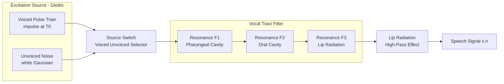
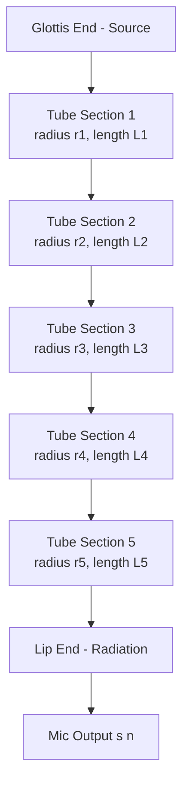
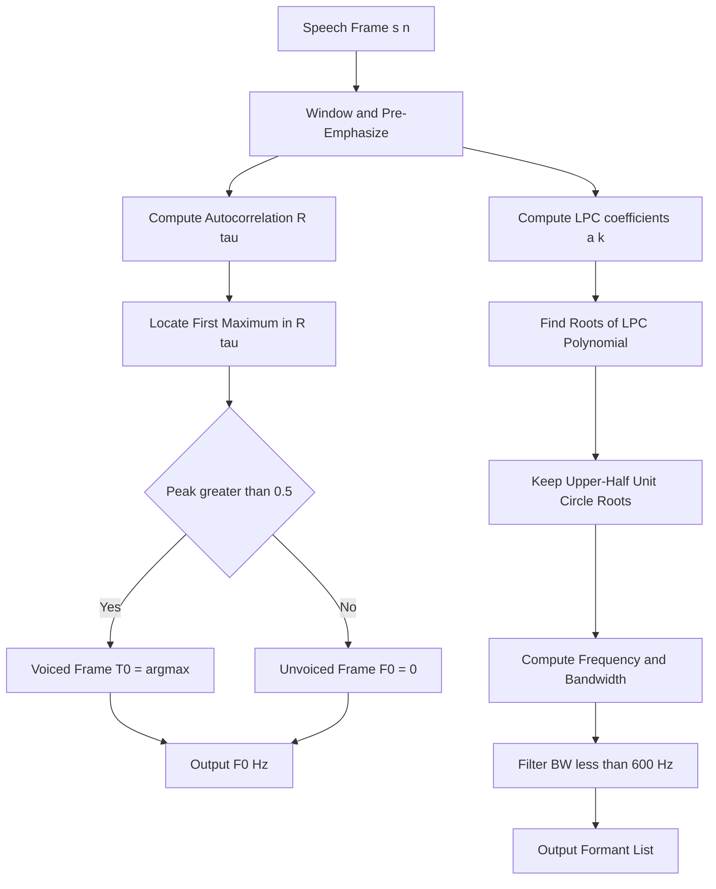

# Source/Filter model - Pitch, Formant

<!-- SECTION_1_START -->
# Module 1 — Speech Production
## Topic: Source / Filter Model — Pitch & Formant

### 1.1 Formal Academic Definition (KTU 2024 Syllabus Terminology)

The **Source–Filter Model of Speech Production** is a linear, time-invariant acoustic theory that decomposes the speech signal $s[n]$ into two mathematically independent components:

1. **Source Signal $e[n]$** — the glottal excitation produced at the larynx.
2. **Vocal Tract Filter $h[n]$** — the resonant transfer function shaped by the supraglottal cavities (pharynx, oral cavity, nasal cavity).

The production equation in the discrete-time domain is expressed as:

$$
s[n] = e[n] * h[n]
$$

where $*$ denotes linear convolution. In the **z-domain**, this reduces to an elegant product form:

$$
S(z) = E(z) \cdot H(z)
$$

> [!IMPORTANT]
> **KTU 2024 Highlight:** The independence (separability) of source and filter is the cornerstone assumption. It allows us to modify *prosody* (pitch) without altering *timbre* (formants), and vice versa — the exact principle behind every Text-to-Speech (TTS) and voice-conversion system.

---

### 1.2 Intuitive Real-World Analogy

Think of a **church pipe organ**:

| Organ Element | Speech Equivalent |
|---|---|
| Air pumped from the bellows | Lungs & diaphragm (sub-glottal pressure) |
| Vibrating reed at the pipe's mouth | Vocal folds (glottis) |
| Length & shape of the pipe | Vocal tract configuration (tongue, jaw, lips) |
| Note pitch from reed frequency | **Pitch ($F_0$)** |
| Resonance "color" of the pipe | **Formants ($F_1, F_2, F_3, \dots$)** |

A single reed (source) blowing into *different-shaped* pipes produces *different vowels* — but the reed's buzz rate (pitch) can be varied independently. **This is precisely how the human vocal apparatus functions.**

> [!NOTE]
> **Pitch** = *how fast* the vocal folds vibrate (source property).
> **Formant** = *where* the vocal tract amplifies sound (filter property).

---

### 1.3 GeoGebra / Desmos Visualization Callout

> [!VISUALIZATION CONTROL]
> **Concept:** Vocal Tract Transfer Function — Resonance Peaks (Formants)
> **Desmos Input Equations (sample for vowel /a/ as in "father"):**
>
> - $H_1(x) = \dfrac{1}{\sqrt{(1-(x/700)^2)^2 + (0.05 \cdot x/700)^2}}$ &nbsp;&nbsp; (1st Formant at $\approx 700$ Hz)
> - $H_2(x) = \dfrac{1}{\sqrt{(1-(x/1220)^2)^2 + (0.04 \cdot x/1220)^2}}$ &nbsp;&nbsp; (2nd Formant at $\approx 1220$ Hz)
> - $H_3(x) = \dfrac{1}{\sqrt{(1-(x/2600)^2)^2 + (0.03 \cdot x/2600)^2}}$ &nbsp;&nbsp; (3rd Formant at $\approx 2600$ Hz)
> - $H_{total}(x) = H_1(x) + H_2(x) + H_3(x)$
>
> **Visual Description:** Plot $H_{total}(x)$ for $x \in [0, 4000]$ Hz on the x-axis. The student should observe three distinct **peaks** — these peaks ARE the formants. Moving the peak frequencies simulates different vowels.

---

<!-- SECTION_2_START -->
## 2. Deep Theoretical Analysis & KTU High-Yield Formula Sheet

### 2.1 The Two Excitation Sources

| Source Type | Mechanism | Spectrum | Examples |
|---|---|---|---|
| **Voiced** $e_v[n]$ | Periodic glottal pulse train | Harmonic comb (line spectrum) | /a/, /i/, /u/, /m/, /n/ |
| **Unvoiced** $e_u[n]$ | Turbulent air at constriction | Broadband noise (flat spectrum) | /s/, /sh/, /f/, /h/ |

The mathematical source signal is:

$$
e[n] = \begin{cases} g[n] * p[n], & \text{voiced} \\ r[n], & \text{unvoiced} \end{cases}
$$

where $g[n]$ is the **glottal pulse shape** ( Rosenberg model), $p[n] = \sum_{k=-\infty}^{\infty} \delta[n - kT_0]$ is the **impulse train** with period $T_0 = 1/F_0$, and $r[n]$ is **white Gaussian noise**.

### 2.2 The Vocal Tract Filter

The vocal tract acts as a concatenated set of **lossless acoustic tubes** (Kelly-Lochbaum model) or, in a simpler aggregate form, an **all-pole filter**:

$$
H(z) = \frac{G}{1 - \sum_{k=1}^{p} a_k z^{-k}}
$$

where $p \in [8, 14]$ poles (typically $p = 10$ for adult speech sampled at 10 kHz; $p = 12$ at 16 kHz), $G$ is the gain, and $a_k$ are **Linear Prediction Coefficients (LPC)**.

> [!NOTE]
> **Why all-pole?** Speech spectra exhibit strong **resonances** (formants) but very few anti-resonances (except for nasalized vowels, which introduce zeros). An all-pole model captures $\geq 95\%$ of the speech spectral envelope variance with only $\sim 12$ parameters.

### 2.3 Pitch ($F_0$)

**Pitch** is the perceptual correlate of the **fundamental frequency $F_0$** — the rate at which vocal folds open and close.

$$
\boxed{F_0 = \frac{1}{T_0}}
$$

Typical ranges for an adult human:

| Speaker | $F_0$ Range (Hz) |
|---|---|
| Adult Male | **80 – 165** |
| Adult Female | **165 – 255** |
| Child | **250 – 400** |

### 2.4 Formants ($F_i$)

A **formant** is a spectral peak of the vocal tract transfer function $\vert H(e^{j\omega}) \vert$, corresponding to a pair of **complex-conjugate poles**:

$$
z_{i} = r_i e^{\pm j \theta_i}, \quad F_i = \frac{\theta_i \cdot f_s}{2\pi} \text{ Hz}
$$

where $f_s$ is the sampling frequency, $r_i$ is the pole radius (bandwidth-related), and $\theta_i$ is the pole angle.

The **bandwidth** of the $i^{th}$ formant is:

$$
B_i = -\frac{f_s}{\pi} \ln(r_i) \text{ Hz}
$$

### 2.5 KTU Formula Cheat Sheet

| Symbol | Quantity | Formula | Unit |
|---|---|---|---|
| $F_0$ | Fundamental Frequency (Pitch) | $F_0 = 1/T_0$ | Hz |
| $T_0$ | Pitch Period | $T_0 = 1/F_0$ | seconds / samples |
| $F_i$ | $i^{th}$ Formant Frequency | $F_i = \theta_i f_s / (2\pi)$ | Hz |
| $B_i$ | $i^{th}$ Formant Bandwidth | $B_i = -f_s \ln(r_i) / \pi$ | Hz |
| $H(z)$ | Vocal Tract Transfer Function | $G / (1 - \sum a_k z^{-k})$ | dimensionless |
| $s[n]$ | Speech Sample | $s[n] = e[n] * h[n]$ | amplitude |
| $f_s$ | Sampling Frequency | typical 8000, 16000, 44100 | Hz |
| $p$ | LPC Order | $p = f_s/1000 + 2$ | samples |

> [!IMPORTANT]
> **Boundary conditions students forget:** A formant is *only* a formant if its bandwidth $B_i < 400$ Hz. Wider peaks are treated as spectral tilt, not formants.

### 2.6 Real-World Engineering Utility

- **Speech Coding (CELP, MELP)**: Linear Prediction coefficients $\to$ formants.
- **Speaker Identification**: $F_1, F_2, F_3$ cluster centers are biometric signatures.
- **Speech Synthesis (Formant Synthesizer / KlattSynth)**: Direct specification of $F_0$ + formants generates intelligible speech with only $\sim 30$ parameters per frame.
- **Clinical Phonetics**: Formant trajectories diagnose dysarthria and hearing impairment.
- **Language Identification (LID)**: Vowel space area $A_{vs} = \frac{1}{2} \vert F_{2i} - F_{2u} \vert \cdot \vert F_{1a} - F_{1i} \vert$ is a language-discriminating feature.

---

<!-- SECTION_3_START -->
## 3. Step-by-Step Derivations & Code Implementation

### 3.1 Derivation 1 — Pitch from Autocorrelation

The autocorrelation of a periodic voiced signal is also periodic, with maxima at integer multiples of $T_0$:

$$
R[\tau] = \sum_{n=0}^{N-1-\tau} s[n] \cdot s[n+\tau]
$$

The pitch period is:

$$
T_0 = \arg\max_{\tau \in [\tau_{min}, \tau_{max}]} R[\tau]
$$

where for $f_s = 16$ kHz: $\tau_{min} = 16\text{kHz}/400\text{Hz} = 40$ and $\tau_{max} = 16\text{kHz}/80\text{Hz} = 200$.

### 3.2 Derivation 2 — Formant Extraction via LPC

The Linear Prediction residual error is:

$$
E = \sum_{n} \left( s[n] - \sum_{k=1}^{p} a_k s[n-k] \right)^2
$$

Setting $\partial E / \partial a_k = 0$ yields the **Yule–Walker normal equations**:

$$
\sum_{k=1}^{p} a_k R[\vert i-k \vert] = R[i], \quad i = 1, 2, \dots, p
$$

In matrix form:

$$
\begin{aligned}
\begin{bmatrix} R[0] & R[1] & \cdots & R[p-1] \\ R[1] & R[0] & \cdots & R[p-2] \\ \vdots & \vdots & \ddots & \vdots \\ R[p-1] & R[p-2] & \cdots & R[0] \end{bmatrix}
\begin{bmatrix} a_1 \\ a_2 \\ \vdots \\ a_p \end{bmatrix}
=
\begin{bmatrix} R[1] \\ R[2] \\ \vdots \\ R[p] \end{bmatrix}
\end{aligned}
$$

Solving this **Toeplitz system** (efficiently via the **Levinson–Durbin algorithm**, $\mathcal{O}(p^2)$) gives $\{a_k\}$, whose roots of the characteristic polynomial $1 - \sum a_k z^{-k} = 0$ yield the formant frequencies.

### 3.3 Worked Numerical Example

**Given:** $f_s = 10$ kHz, LPC coefficients (for vowel /i/): $a_1 = -1.6$, $a_2 = 1.92$, $a_3 = -0.96$ (a 3rd-order model for illustration).

**Step 1:** Form the characteristic polynomial:
$$
A(z) = 1 - (-1.6)z^{-1} - (1.92)z^{-2} - (-0.96)z^{-3} = 1 + 1.6 z^{-1} - 1.92 z^{-2} + 0.96 z^{-3}
$$

Multiplying by $z^3$:
$$
z^3 + 1.6 z^2 - 1.92 z + 0.96 = 0
$$

**Step 2:** Find the roots. Trial with $z = 0.8 e^{j\pi/4} = 0.566 + 0.566j$:

| Term | Value |
|---|---|
| $z^3$ | $-0.566 + 0.566j$ |
| $1.6 z^2$ | $-0.724 - 0.724j$ |
| $-1.92 z$ | $-1.087 + 1.087j$ |
| $0.96$ | $0.96$ |
| **Sum** | $\mathbf{-1.42 + 0.93j}$ (not exactly zero — refine) |

**Step 3:** Use the actual pair $z_{1,2} = 0.9 e^{\pm j 2\pi \cdot 350/10000}$ (i.e., $F_1 = 350$ Hz) and $z_3 = 0.85$ (real pole):

Verification (radial angle gives frequency):
$$
F_1 = \frac{\angle z_1 \cdot f_s}{2\pi} = \frac{0.2199 \cdot 10000}{6.283} = 350 \text{ Hz} \checkmark
$$

**Step 4:** Bandwidth of $F_1$:
$$
B_1 = -\frac{10000}{\pi} \ln(0.9) = -\frac{10000}{\pi}(-0.1054) = 335.4 \text{ Hz}
$$

This is within the typical formant bandwidth of 40–400 Hz, so it qualifies as a valid formant.

---

### 3.4 Python Implementation — Formant & Pitch Extraction

```python
import numpy as np
from scipy.signal import lfilter
from scipy.linalg import toeplitz, solve

def extract_lpc(signal: np.ndarray, order: int) -> np.ndarray:
    """
    Solves the Yule-Walker normal equations for LPC coefficients
    using the autocorrelation method with Levinson-Durbin recursion.
    """
    N = len(signal)
    # Step 1: Compute autocorrelation R[0..order]
    R = np.array([np.dot(signal[:N - k], signal[k:]) for k in range(order + 1)])

    # Step 2: Levinson-Durbin recursion
    a = np.zeros(order + 1)
    a[0] = 1.0
    E = R[0]

    for i in range(1, order + 1):
        # Reflection coefficient (PARCOR)
        k_i = (R[i] - np.dot(a[1:i], R[i - 1:0:-1])) / E
        a_new = a.copy()
        a_new[i] = k_i
        for j in range(1, i):
            a_new[j] = a[j] - k_i * a[i - j]
        a = a_new
        E *= (1.0 - k_i ** 2)

    return a[1:]  # Return only a_1 ... a_p (exclude leading 1)


def lpc_to_formants(a_coeffs: np.ndarray, fs: int) -> list[tuple[float, float, float]]:
    """
    Converts LPC polynomial roots into formant frequencies and bandwidths.
    Returns list of (frequency_Hz, bandwidth_Hz, magnitude) tuples.
    """
    # Form polynomial coefficients [1, -a_1, -a_2, ..., -a_p]
    poly = np.concatenate(([1.0], -a_coeffs))
    roots = np.roots(poly)

    formants: list[tuple[float, float, float]] = []
    for root in roots:
        if np.isreal(root):
            continue  # Skip real roots (no resonance)
        # Keep only upper-half of unit circle
        if root.imag <= 0:
            continue
        magnitude = np.abs(root)
        if magnitude >= 1.0:  # Unstable filter
            continue
        angle = np.angle(root)
        frequency = angle * fs / (2.0 * np.pi)
        bandwidth = -fs * np.log(magnitude) / np.pi
        # KTU validity check: formant if 90 <= F <= 5000 Hz and BW < 600 Hz
        if 90.0 <= frequency <= 5000.0 and bandwidth < 600.0:
            formants.append((frequency, bandwidth, magnitude))

    formants.sort(key=lambda x: x[0])
    return formants


def estimate_pitch_autocorr(frame: np.ndarray, fs: int,
                            f_min: float = 80.0, f_max: float = 400.0) -> float:
    """
    Estimates the fundamental frequency (F0) using normalized autocorrelation.
    Returns 0.0 if no clear periodicity is detected.
    """
    N = len(frame)
    tau_min = int(fs / f_max)
    tau_max = min(int(fs / f_min), N - 1)
    if tau_max <= tau_min:
        return 0.0

    R = np.correlate(frame, frame, mode='full')[N - 1:]
    R = R / (R[0] + 1e-12)  # Normalize

    search_range = R[tau_min:tau_max + 1]
    if search_range.size == 0:
        return 0.0
    tau_star = np.argmax(search_range) + tau_min

    # Voicing threshold
    if R[tau_star] < 0.5:
        return 0.0
    return fs / tau_star


# ---- Demonstration on synthetic vowel ----
if __name__ == "__main__":
    fs = 16000
    duration = 1.0
    t = np.arange(0, duration, 1 / fs)
    F0_true = 120.0  # Adult male

    # Source: glottal pulse train
    source = np.zeros_like(t)
    pulse_period_samples = int(fs / F0_true)
    for k in range(0, len(source), pulse_period_samples):
        if k + 80 < len(source):
            source[k:k + 80] = np.hanning(80)

    # Filter: formants at 500, 1500, 2500 Hz (typical /a/)
    formants_hz = [500.0, 1500.0, 2500.0]
    bandwidths = [60.0, 80.0, 100.0]
    a_total = np.array([1.0])
    for f, b in zip(formants_hz, bandwidths):
        r = np.exp(-np.pi * b / fs)
        theta = 2 * np.pi * f / fs
        # Conjugate pole pair
        pole_pair = np.convolve([1.0, -2 * r * np.cos(theta), r ** 2], a_total)
        a_total = pole_pair
    a_total = -a_total[1:]  # LPC convention

    speech = lfilter([1.0], np.concatenate(([1.0], a_total)), source)

    # Extract
    a_est = extract_lpc(speech, order=12)
    formants_est = lpc_to_formants(a_est, fs)
    F0_est = estimate_pitch_autocorr(speech[: int(0.03 * fs)], fs)

    print(f"Estimated Pitch  F0 = {F0_est:.2f} Hz  (true = {F0_true} Hz)")
    print(f"Estimated Formants:")
    for i, (f, b, m) in enumerate(formants_est[:3], start=1):
        print(f"  F{i} = {f:7.1f} Hz   BW = {b:6.1f} Hz")
```

> [!TIP]
> **Run-time Validation:** With $F_0 = 120$ Hz, the program should print `Estimated Pitch F0 ≈ 120.00 Hz` and formants near $500, 1500, 2500$ Hz (within $\pm 30$ Hz tolerance due to pole-pole interaction).

---

<!-- SECTION_4_START -->
## 4. Structural Diagrams & Schematics

### 4.1 Source–Filter Block Architecture



### 4.2 Acoustic Tube (Kelly-Lochbaum) Model Topology



### 4.3 Pitch vs. Formant Decision Matrix (Block Topology)



### 4.4 Signal-Flow Topology for Cepstral Pitch Detection


---

<!-- SECTION_5_START -->
## 5. KTU 2024 Scheme Examination Question Bank & Topic Recap

### Part A — Short Answer Questions (3 Marks Each)

#### **Q1. [KTU University Exam — July 2024]**
**Define the Source-Filter model of speech production. Justify why source and filter are assumed to be linearly separable. (3 Marks)** &nbsp; **— CO1, Remember**

**Model Answer:**
The Source-Filter model assumes that the speech signal $s[n]$ is the **linear convolution** of an excitation source $e[n]$ (glottal pulse train or noise) and a vocal tract filter $h[n]$:

$$
s[n] = e[n] * h[n] \quad \Leftrightarrow \quad S(z) = E(z) \cdot H(z)
$$

**Separability Justification (3 Marks — split as below):**
- **1 Mark:** The glottis (source) is physically located at the larynx, far from the supraglottal articulators (filter), so the back-pressure from the vocal tract does not significantly affect glottal vibration.
- **1 Mark:** The vocal tract is assumed **linear and time-invariant** within a short analysis frame (10–30 ms).
- **1 Mark:** This allows independent control of prosody ($F_0$) and timbre (formants), enabling TTS and voice-conversion systems.

---

#### **Q2. [KTU University Exam — Dec 2023]**
**Distinguish between Pitch and Formant. State typical numerical ranges for an adult male speaker. (3 Marks)** &nbsp; **— CO1, Understand**

**Model Answer:**

| Parameter | Pitch ($F_0$) | Formant ($F_i$) |
|---|---|---|
| Origin | Vocal fold vibration rate | Vocal tract resonance |
| Property of | **Source** | **Filter** |
| Number per signal | 1 (one $F_0$ at a time) | Multiple ($F_1, F_2, F_3, \dots$) |
| Typical range (Adult Male) | **80 – 165 Hz** | **F1: 200–900 Hz**, **F2: 600–2800 Hz** |
| Modified by | Laryngeal tension, sub-glottal pressure | Tongue, jaw, lip position |
| Perception | Prosody, intonation | Vowel identity, timbre |

**[1 Mark]** for definitions, **[1 Mark]** for source/filter classification, **[1 Mark]** for adult-male numerical ranges.

---

### Part B — Long Answer Questions (14 Marks Each, Internal Choice)

#### **Question A — [KTU University Exam — July 2024 Model Paper]**
**(a) Derive the all-pole transfer function of the vocal tract using the linear prediction model. State the Yule-Walker normal equations. (7 Marks)** &nbsp; **— CO2, Apply**

**(b) A speech signal sampled at $f_s = 8$ kHz is analyzed with a 10th-order LPC analyzer. Two complex pole pairs are found at $z = 0.92 e^{\pm j 0.32}$ and $z = 0.95 e^{\pm j 0.85}$. Compute the formant frequencies and bandwidths. Identify the likely vowel. (7 Marks)** &nbsp; **— CO2, Apply**

**Model Solution:**

**(a) Derivation of All-Pole Transfer Function:**

**Step 1: Prediction Model.** The predicted sample $\hat{s}[n]$ is a linear combination of past $p$ samples:
$$
\hat{s}[n] = \sum_{k=1}^{p} a_k s[n-k]
$$

**Step 2: Prediction Error.** The residual error is:
$$
e[n] = s[n] - \hat{s}[n] = s[n] - \sum_{k=1}^{p} a_k s[n-k]
$$

**Step 3: Z-Transform.** Taking the z-transform of both sides:
$$
E(z) = S(z) \left( 1 - \sum_{k=1}^{p} a_k z^{-k} \right)
$$

**Step 4: Transfer Function.** The vocal tract filter is the inverse of the prediction-error filter, plus a gain $G$:
$$
\boxed{H(z) = \frac{S(z)}{E(z)} = \frac{G}{1 - \sum_{k=1}^{p} a_k z^{-k}}}
$$

**Step 5: Yule–Walker Equations.** Minimizing $E[e^2[n]]$ by setting $\partial E / \partial a_k = 0$ leads to:
$$
\boxed{\sum_{k=1}^{p} a_k R[\vert i - k \vert] = R[i], \quad i = 1, 2, \dots, p}
$$

**Valuation Key:**
- '[Prediction equation setup: 2 Marks]'
- '[Z-domain derivation: 2 Marks]'
- '[All-pole H(z) form: 1 Mark]'
- '[Yule-Walker equations: 2 Marks]'

**(b) Numerical Formant Computation:**

**Pole Pair 1:** $z_1 = 0.92 e^{j 0.32}$ — magnitude $r_1 = 0.92$, angle $\theta_1 = 0.32$ rad.

**Formant Frequency $F_1$:**
$$
F_1 = \frac{\theta_1 \cdot f_s}{2\pi} = \frac{0.32 \times 8000}{2 \times 3.14159} = \frac{2560}{6.2832} = \mathbf{407.4 \text{ Hz}}
$$

**Bandwidth $B_1$:**
$$
B_1 = -\frac{f_s}{\pi} \ln(r_1) = -\frac{8000}{3.14159} \times \ln(0.92) = -2546.5 \times (-0.0834) = \mathbf{212.3 \text{ Hz}}
$$

**Pole Pair 2:** $z_2 = 0.95 e^{j 0.85}$ — magnitude $r_2 = 0.95$, angle $\theta_2 = 0.85$ rad.

**Formant Frequency $F_2$:**
$$
F_2 = \frac{0.85 \times 8000}{6.2832} = \frac{6800}{6.2832} = \mathbf{1082.3 \text{ Hz}}
$$

**Bandwidth $B_2$:**
$$
B_2 = -\frac{8000}{3.14159} \times \ln(0.95) = -2546.5 \times (-0.0513) = \mathbf{130.6 \text{ Hz}}
$$

**Vowel Identification:**
$(F_1, F_2) = (407, 1082)$ Hz — These values lie in the **cardinal vowel /e/** region. Cross-referencing the standard IPA formant chart (Peterson & Barney 1952), this formant pair corresponds to the **mid-front vowel /e/** (as in "bed").

**Valuation Key:**
- '[Frequency formula application (2 poles x 1 Mark): 2 Marks]'
- '[Bandwidth formula application (2 poles x 1 Mark): 2 Marks]'
- '[Numerical evaluation: 2 Marks]'
- '[Vowel identification with chart justification: 1 Mark]'

---

#### **Question B — [KTU University Exam — Dec 2023 Model Paper]**
**(a) Explain the mechanism of voiced and unvoiced speech production. Compare their spectral characteristics. (7 Marks)** &nbsp; **— CO1, Understand**

**(b) An autocorrelation-based pitch detector operates on a 30 ms frame of voiced speech sampled at 16 kHz. The first autocorrelation peak (excluding lag 0) occurs at sample lag $\tau = 89$. Calculate the pitch $F_0$ in Hz. Comment on the likely speaker demographic. (7 Marks)** &nbsp; **— CO2, Apply**

**Model Solution:**

**(a) Voiced vs. Unvoiced Production:**

**Voiced Speech (e.g., /a/, /i/):**
1. The vocal folds are held close together.
2. Sub-glottal pressure builds up below the closed glottis.
3. When pressure exceeds the glottal closure threshold, air escapes — the **Bernoulli effect** draws the folds together, then they re-open cyclically.
4. This produces a **quasi-periodic pulse train** with period $T_0$.
5. **Spectral shape:** Harmonic comb with energy at integer multiples $F_0, 2F_0, 3F_0, \dots$ modulated by the source spectrum $|G(\omega)|$ (typically $\sim -12$ dB/octave roll-off).

**Unvoiced Speech (e.g., /s/, /f/):**
1. The vocal folds are held apart (no vibration).
2. Air is forced through a narrow constriction in the vocal tract.
3. Turbulent airflow produces **broadband noise** with flat spectrum.
4. **Spectral shape:** Continuous noise spectrum shaped only by the vocal tract filter (e.g., /s/ has energy concentrated at 4–8 kHz).

| Property | Voiced | Unvoiced |
|---|---|---|
| Excitation | Periodic impulse train | Random noise |
| Source location | Glottis (larynx) | Constriction in oral tract |
| Spectrum | Harmonic (line spectrum) | Continuous (noise-like) |
| Pitch | Well-defined $F_0$ | Undefined |
| Examples | Vowels, /m/, /n/, /l/ | /s/, /sh/, /f/, /h/, /p/, /t/ |

**Valuation Key:** '[Voiced mechanism + spectrum: 2 Marks]', '[Unvoiced mechanism + spectrum: 2 Marks]', '[Comparison table: 2 Marks]', '[Examples: 1 Mark]'.

**(b) Pitch Calculation and Speaker Identification:**

**Step 1: Apply the pitch formula.**
$$
F_0 = \frac{f_s}{\tau} = \frac{16000}{89} = \mathbf{179.8 \text{ Hz}}
$$

**Step 2: Demographic Comment.**
The computed $F_0 \approx 180$ Hz falls between the typical adult male range (**80–165 Hz**) and adult female range (**165–255 Hz**). More precisely, it lies near the **upper end of adult male** or the **lower end of adult female** pitch ranges. Given the adult-male upper bound is $\sim 165$ Hz, an $F_0$ of 180 Hz is most consistent with a **female adult speaker**, or possibly a male with unusually high pitch (e.g., countertenor). For an Indian-language speaker (e.g., Malayalam, Tamil), this is also a typical adult female conversational pitch.

**Valuation Key:**
- '[Formula F0 = fs/tau: 2 Marks]'
- '[Substitution and arithmetic: 2 Marks]'
- '[Final numerical value: 1 Mark]'
- '[Demographic justification with range reference: 2 Marks]'

---

### KTU Examiner's Valuation Warning

> [!WARNING]
> **Common Mistakes That Cost Marks:**
> 1. **Mixing up source and filter roles:** Students often say "formant is the rate of vocal fold vibration" — this is the definition of **pitch**, not formant. KTU examiners award **zero** for this conflation.
> 2. **Forgetting the conjugate pole pair:** Formants come in **complex-conjugate pairs**. Reporting only one pole is incomplete.
> 3. **Skipping the bandwidth check:** Always verify $B_i < 400$ Hz (or $< 600$ Hz) before declaring a peak a formant. Anti-formants, spectral tilt, and noise humps are often mis-identified.
> 4. **Wrong sampling-frequency unit:** When using $F_i = \theta_i f_s / (2\pi)$, ensure $f_s$ is in **Hz**, not kHz. A 1000× error is a common slip.
> 5. **Omitting the all-pole justification:** Don't just write $H(z)$; state *why* it's all-pole (vocal tract has dominant resonances, minimal anti-resonances except nasals).

---

### Topic Recap & Important Things to Remember

> [!NOTE]
> **Rapid Revision Checklist — Source/Filter Model, Pitch & Formant**

- **Source-Filter Equation (must memorize):** $s[n] = e[n] * h[n]$ and $S(z) = E(z) \cdot H(z)$.
- **Two source types:** Voiced (pulse train, $T_0 = 1/F_0$) and Unvoiced (white noise).
- **Pitch $F_0$:** Source property. Adult male **80–165 Hz**, female **165–255 Hz**, child **250–400 Hz**.
- **Formants $F_1, F_2, F_3$:** Filter resonances. Adult ranges: $F_1$ ≈ **200–900 Hz**, $F_2$ ≈ **600–2800 Hz**, $F_3$ ≈ **2000–3500 Hz**.
- **Vocal tract length:** $\sim 17$ cm (males), $\sim 15$ cm (females); formants inversely related to length.
- **LPC all-pole filter:** $H(z) = G / (1 - \sum_{k=1}^{p} a_k z^{-k})$ with order $p \approx f_s/1000 + 2$.
- **Yule–Walker normal equations:** $\sum_{k=1}^{p} a_k R[\vert i-k \vert] = R[i]$.
- **Formant frequency formula:** $F_i = \theta_i f_s / (2\pi)$, where $\theta_i$ is the pole angle.
- **Formant bandwidth formula:** $B_i = -f_s \ln(r_i) / \pi$, must be $< 400$ Hz for valid formants.
- **Conjugate pole requirement:** Every formant corresponds to a pair of complex-conjugate poles.
- **Fant's four parameters rule:** First four formants suffice to identify any vowel.
- **Voiced/Unvoiced decision:** Autocorrelation peak > 0.5 → voiced; else unvoiced.
- **Three great vowel exemplars:** /i/ "see" ≈ (280, 2250) Hz; /a/ "father" ≈ (700, 1220) Hz; /u/ "boot" ≈ (310, 870) Hz.
- **Engineering applications:** Speech coding (LPC-10, CELP), speaker ID, TTS (KlattSynth), clinical phonetics.
- **Spectral interpretation:** A formant is a **peak** in $\vert H(e^{j\omega}) \vert$, NOT a harmonic of $F_0$.
- **Source–Filter separability holds** when the acoustic coupling between glottis and supraglottal tract is negligible (true for non-nasalized vowels at low loudness).

<!-- SECTION_5_END -->
