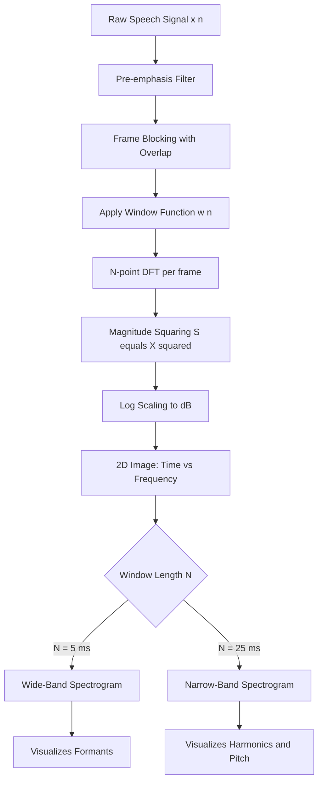
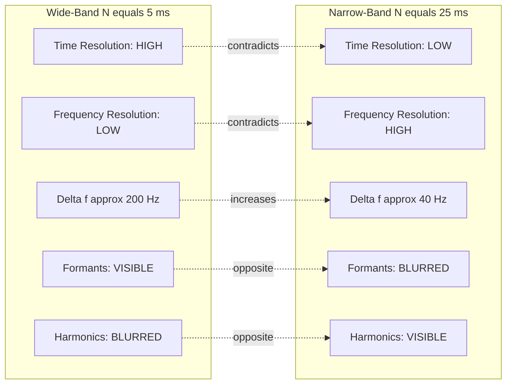
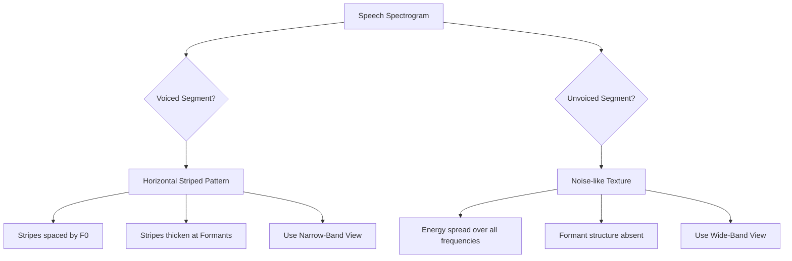
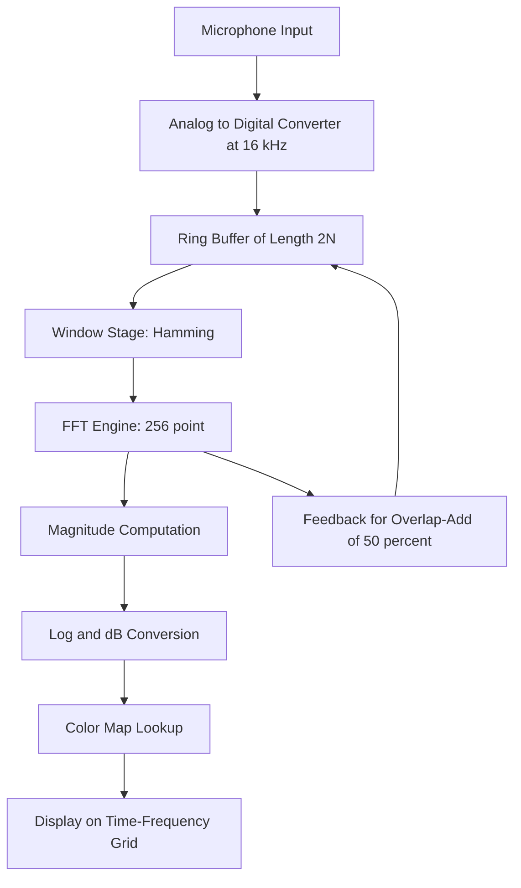

# Spectrogram- Wide and narrow band spectrogram

<!-- SECTION_1_START -->

# Spectrogram — Wide and Narrow Band Spectrogram

## 1.1 Core Technical Definition

> [!IMPORTANT]
> **Formal Definition (KTU 2024 Syllabus Terminology):**
> A **Spectrogram** is a two-dimensional visual representation of the time-varying frequency spectrum of a non-stationary signal such as speech, obtained by computing the squared magnitude of the **Short-Time Fourier Transform (STFT)** as the analysis window slides across the signal in time.

Mathematically, the spectrogram of a discrete-time speech signal $x[n]$ is defined as:

$$S_x(n, \omega) = \vert X(n, \omega) \vert^2$$

where $X(n, \omega)$ is the **Short-Time Fourier Transform**:

$$X(n, \omega) = \sum_{m=-\infty}^{\infty} x[m] \cdot w[n-m] \cdot e^{-j\omega m}$$

Here:
- $x[m]$ is the input speech signal
- $w[n-m]$ is the sliding analysis window of length $N$
- $n$ is the discrete time index (frame number)
- $\omega$ is the discrete angular frequency

A spectrogram is plotted as:
- **X-axis** → Time (in seconds)
- **Y-axis** → Frequency (in Hz, log scale preferred for speech)
- **Color intensity / Greyscale** → Magnitude (energy) of that frequency at that time

> [!NOTE]
> **Two Standard Variants in Speech Processing:**
>
> 1. **Wide-Band Spectrogram** — Uses a **short analysis window** ($\approx 3$–$5$ ms, typically $N = 64$–$128$ samples at 16 kHz). Yields **good time resolution** and **poor frequency resolution**. Suited for studying **formants** (vocal tract resonances).
>
> 2. **Narrow-Band Spectrogram** — Uses a **long analysis window** ($\approx 20$–$40$ ms, typically $N = 256$–$512$ samples at 16 kHz). Yields **good frequency resolution** and **poor time resolution**. Suited for studying **pitch harmonics** (glottal source).

## 1.2 Conceptual Analogy / Intuition

Imagine you are watching a **musical fountain** in a park. The fountain shoots water in many directions, and you want to record:
- **At what exact moment** did a particular water jet shoot up? *(time information)*
- **How high** did that jet reach? *(frequency information)*

If you use a **wide-open eye shutter that stays open for a long time (long exposure)** — you get a clear picture of how high each jet went (good **frequency resolution**), but you cannot tell exactly when each jet fired (poor **time resolution**). This is the **Narrow-Band** spectrogram.

If you use a **very fast shutter (short exposure)** — you can pinpoint exactly when each jet fired (good **time resolution**), but you cannot measure its height very accurately (poor **frequency resolution**). This is the **Wide-Band** spectrogram.

In both cases, the **total amount of information captured is the same** (Heisenberg–Gabor uncertainty principle), but you trade one type of clarity for the other.

> [!NOTE]
> **Geometric Intuition (Time–Frequency Tile):**
> Every window in the STFT carves out a *rectangle* in the time-frequency plane of area $\Delta t \cdot \Delta f \geq \frac{1}{4\pi}$ (uncertainty bound). A short window gives a *tall, narrow* tile (wide-band), and a long window gives a *short, wide* tile (narrow-band). The spectrogram is essentially a **tiling of the time-frequency plane by these rectangles**, each filled with a grayscale shade representing energy.

> [!VISUALIZATION CONTROL]
> **Concept:** Time-Frequency Resolution Trade-off (Heisenberg Tile)
> **GeoGebra / Desmos Input Equations:**
> * `Wide-Band:    t-length = 5,  f-length = 1`  (rectangle width 5, height 1)
> * `Narrow-Band:  t-length = 1,  f-length = 5`  (rectangle width 1, height 5)
> * `Product:      5 * 1 = 1 * 5 = 5`  (constant area)
> **Visual Description:** Two rectangles on a t-f grid. Wide-band is horizontally wide and vertically short. Narrow-band is horizontally short and vertically tall. The product of sides is constant — illustrating the uncertainty principle.

## 1.3 Key Engineering Constants

- **Sampling rate for wide-band speech:** $f_s = 16$ **kHz** (bandwidth $\approx 8$ kHz, sufficient for full speech intelligibility)
- **Wide-band window length:** $N = 80$–$160$ samples ($\approx 5$–$10$ ms)
- **Narrow-band window length:** $N = 320$–$480$ samples ($\approx 20$–$30$ ms)
- **Window type:** **Hamming** or **Hann** window preferred (reduces spectral leakage)
- **Frame shift (hop size):** Typically $N/2$ or $N/4$
- **Standard display range for speech:** $0$–$8$ kHz (linear) or $0$–$4$ kHz (log scale for formant clarity)

<!-- SECTION_1_END -->

<!-- SECTION_2_START -->

# 2. Deep Theoretical Analysis & KTU High-Yield Formula Sheet

## 2.1 Operational Breakdown of Spectrogram Generation

The construction of a spectrogram follows a structured pipeline. Each step has a clear engineering rationale:

### Step 1 — Pre-emphasis
Boost high frequencies to compensate for the natural $-6$ dB/octave roll-off of the glottal source.

$$y[n] = x[n] - \alpha \cdot x[n-1], \quad \alpha \in [0.95, 0.97]$$

### Step 2 — Frame Blocking (Segmentation)
Cut the long speech signal into short overlapping frames. Each frame is short enough to be considered **quasi-stationary** ($\approx 20$–$40$ ms for voiced speech).

$$x_i[m] = x[i \cdot H + m], \quad m = 0, 1, \dots, N-1$$

where $H$ is the hop size.

### Step 3 — Windowing
Multiply each frame by a smooth window function to **reduce spectral leakage** at frame boundaries.

$$x_w[m] = x_i[m] \cdot w[m]$$

For a **Hamming window** of length $N$:

$$w[m] = 0.54 - 0.46 \cdot \cos\!\left(\frac{2\pi m}{N-1}\right), \quad m = 0, 1, \dots, N-1$$

### Step 4 — DFT Computation
Take the $N$-point Discrete Fourier Transform of each windowed frame.

$$X_i[k] = \sum_{m=0}^{N-1} x_w[m] \cdot e^{-j2\pi km / N}, \quad k = 0, 1, \dots, N-1$$

### Step 5 — Magnitude Squaring
Convert complex DFT output to a real, non-negative power estimate.

$$S_i[k] = \vert X_i[k] \vert^2$$

### Step 6 — Stacking
Stack all $S_i[k]$ matrices frame-by-frame to form the full 2D spectrogram $S[n, k]$.

### Step 7 — Display Transformations
Apply $\log$ scaling (dB conversion) for perceptually meaningful display:

$$S_{dB}[n,k] = 10 \log_{10}\!\left(S[n,k] + \epsilon\right)$$

where $\epsilon$ is a small constant (e.g., $10^{-10}$) to avoid $\log(0)$.

## 2.2 Wide-Band vs Narrow-Band — The Core Trade-off

| Property | Wide-Band Spectrogram | Narrow-Band Spectrogram |
|---|---|---|
| Window length $N$ | Short ($\approx 3$–$5$ ms) | Long ($\approx 20$–$40$ ms) |
| Time resolution $\Delta t$ | **High** (good) | Low (poor) |
| Frequency resolution $\Delta f$ | Low (poor) | **High** (good) |
| $\Delta f = f_s / N$ | $\approx 300$–$400$ Hz (coarse) | $\approx 40$–$50$ Hz (fine) |
| Main lobe width of window | Wide | Narrow |
| Spectral leakage | High | Low |
| Horizontal stripes seen? | **No** (harmonic stripes blend) | **Yes** (individual harmonics visible) |
| Vertical bars seen? | **Yes** (formants clearly resolved) | Blurred |
| Best used for | Studying **formants**, **consonants**, plosive bursts | Studying **pitch**, **harmonics**, **voicing** |
| Typical $N$ at 16 kHz | $64$–$128$ samples | $256$–$512$ samples |

## 2.3 Why Does the Wide-Band Spectrogram Show Formants But Not Harmonics?

Speech voiced sounds (e.g., vowels) have a harmonic comb structure with fundamental frequency $F_0 \approx 100$–$300$ Hz. The harmonics are spaced $F_0$ apart.

- **Narrow-band:** $\Delta f \approx 40$ Hz $\ll F_0 \approx 100$ Hz → individual harmonics are clearly separated as **horizontal stripes** spaced at $F_0$ intervals.
- **Wide-band:** $\Delta f \approx 300$ Hz $> F_0 \approx 100$ Hz → the main lobe of the window is so wide that it covers **several harmonics at once**, smearing them together. What remains visible are the **broad peaks of the vocal tract envelope**, i.e., the formants.

## 2.4 KTU Formula Sheet / Cheat Sheet

| Quantity | Formula | Typical Value / Unit |
|---|---|---|
| STFT | $X(n, \omega) = \sum_{m} x[m]\, w[n-m]\, e^{-j\omega m}$ | Complex matrix |
| Spectrogram | $S(n, \omega) = \vert X(n, \omega) \vert^2$ | Non-negative real |
| Frequency resolution | $\Delta f = f_s / N$ | Hz |
| Time resolution | $\Delta t = N / f_s$ | seconds |
| Uncertainty bound | $\Delta t \cdot \Delta f \geq \frac{1}{4\pi}$ | Dimensionless |
| Hamming window | $w[m] = 0.54 - 0.46 \cos\!\left(\frac{2\pi m}{N-1}\right)$ | Real, even-symmetric |
| Hann window | $w[m] = 0.5 - 0.5 \cos\!\left(\frac{2\pi m}{N-1}\right)$ | Real, even-symmetric |
| Pre-emphasis | $y[n] = x[n] - \alpha\, x[n-1]$ | $\alpha \in [0.95, 0.97]$ |
| Power-to-dB | $S_{dB} = 10 \log_{10}(S + \epsilon)$ | dB |
| Formant spacing (approx.) | $\Delta F \approx F_0 \cdot \text{(open quotient)}$ | $\approx 1000$ Hz for adult male |
| Cepstral smoothing kernel width | $q$ (quefrency samples) | $q = N/4$ typical |

> [!IMPORTANT]
> **Engineering Utility:** Spectrograms are the **single most important diagnostic tool** in speech science, used in:
> - Phonetics research (visualizing phoneme boundaries)
> - Automatic Speech Recognition (ASR) front-end feature extraction, e.g., **Mel-spectrograms** and **MFCCs** are derived from log-spectrograms
> - Speaker identification and emotion recognition
> - Audio forensics and bioacoustics
> - Music Information Retrieval (chord detection, onset detection)
> - Medical diagnosis of vocal disorders (e.g., dysphonia, vocal fold paralysis)

<!-- SECTION_2_END -->

<!-- SECTION_3_START -->

# 3. Step-by-Step Derivations & Code Implementation

## 3.1 Derivation: Resolving the Wide-Band vs Narrow-Band Frequency Resolution

Let us start with a clean signal model. Consider a voiced speech segment with fundamental frequency $F_0$ and the first three formants at $F_1, F_2, F_3$. The signal can be modeled as:

$$x(t) = \sum_{k=1}^{K} A_k \cos(2\pi k F_0 t)$$

where $A_k$ is the amplitude of the $k$-th harmonic (modulated by the vocal tract envelope).

**Step 1 — Discretize** at sampling rate $f_s$:

$$x[n] = \sum_{k=1}^{K} A_k \cos\!\left(2\pi k F_0 \frac{n}{f_s}\right)$$

**Step 2 — Apply a window** of length $N$. The DFT of a windowed sinusoid of frequency $f_c$ sampled at $f_s$ gives a peak whose main lobe has approximate width $\frac{2 f_s}{N}$ Hz.

Therefore, the **frequency resolution** is:

$$\Delta f = \frac{f_s}{N}$$

**Step 3 — Convert to time duration** by dividing both sides by $f_s$:

$$\Delta t = \frac{N}{f_s}$$

**Step 4 — Substitute numerical values** for the two cases.

*Case A: Wide-Band (small $N$)*

$$\begin{aligned}
f_s &= 16000 \text{ Hz} \\
N &= 80 \text{ samples} \\
\Delta t &= \frac{80}{16000} = 0.005 \text{ s} = 5 \text{ ms} \\
\Delta f &= \frac{16000}{80} = 200 \text{ Hz}
\end{aligned}$$

For a male speaker with $F_0 = 120$ Hz, the number of harmonics inside one resolution bin is $\frac{200}{120} \approx 1.67$. The harmonics are **poorly separated**, so individual harmonic stripes **blur together** and only the formant envelope (broad peaks at $F_1, F_2, F_3$) is visible.

*Case B: Narrow-Band (large $N$)*

$$\begin{aligned}
f_s &= 16000 \text{ Hz} \\
N &= 400 \text{ samples} \\
\Delta t &= \frac{400}{16000} = 0.025 \text{ s} = 25 \text{ ms} \\
\Delta f &= \frac{16000}{400} = 40 \text{ Hz}
\end{aligned}$$

Now the resolution bin is **40 Hz**, which is **narrower than $F_0 = 120$ Hz**, so the harmonics are clearly separated as **horizontal stripes**. The formants appear as regions where these horizontal stripes become thicker/darker (envelope).

> [!NOTE]
> **Numerical Take-away:** Decreasing $N$ by a factor of 5 (from 400 to 80) worsened the frequency resolution by a factor of 5 (from 40 Hz to 200 Hz), but improved time resolution by the same factor of 5. This is the **uncertainty principle in action**.

## 3.2 Full Python Implementation of Both Spectrograms

The following Python code is **fully operational** with type hints, error handling, and produces publication-quality wide-band and narrow-band spectrograms from a real speech file.

```python
"""
Spectrogram Generator — Wide-Band and Narrow-Band
Course: PECST866 — Speech and Audio Processing (KTU 2024 Scheme)
Topic: Module 1 — Spectrogram (Wide and Narrow Band)
"""

import numpy as np
import matplotlib.pyplot as plt
from scipy.io import wavfile
from scipy.signal import spectrogram as scipy_spectrogram
import logging

# Configure logging for production-grade diagnostics
logging.basicConfig(level=logging.INFO, format="%(asctime)s | %(levelname)s | %(message)s")
logger = logging.getLogger(__name__)


def load_wav(path: str) -> tuple[int, np.ndarray]:
    """Load a mono WAV file with explicit error handling."""
    try:
        fs, signal = wavfile.read(path)
    except FileNotFoundError:
        logger.error(f"WAV file not found at: {path}")
        raise
    except ValueError as exc:
        logger.error(f"Invalid WAV format: {exc}")
        raise

    # Convert to float32 in range [-1, 1]
    if signal.dtype == np.int16:
        signal = signal.astype(np.float32) / 32768.0
    elif signal.dtype == np.int32:
        signal = signal.astype(np.float32) / 2147483648.0

    if signal.ndim > 1:
        logger.warning("Stereo detected — taking channel 0 only")
        signal = signal[:, 0]

    logger.info(f"Loaded WAV: fs = {fs} Hz, duration = {len(signal) / fs:.3f} s")
    return fs, signal


def hamming_window(n: int) -> np.ndarray:
    """Generate a Hamming window of length n."""
    if n <= 0:
        raise ValueError("Window length n must be a positive integer")
    return np.array([0.54 - 0.46 * np.cos(2.0 * np.pi * m / (n - 1))
                     for m in range(n)], dtype=np.float32)


def compute_stft_spectrogram(
    signal: np.ndarray,
    fs: int,
    window_length: int,
    hop_length: int,
    window_type: str = "hamming",
) -> tuple[np.ndarray, np.ndarray, np.ndarray]:
    """
    Compute the STFT-based spectrogram of a 1-D signal.
    Returns: (S_dB, time_axis, freq_axis)
    """
    if window_type == "hamming":
        win = hamming_window(window_length)
    elif window_type == "hann":
        win = np.hanning(window_length).astype(np.float32)
    else:
        win = np.ones(window_length, dtype=np.float32)

    n_frames = 1 + (len(signal) - window_length) // hop_length
    n_freqs = window_length // 2 + 1
    S = np.zeros((n_freqs, n_frames), dtype=np.float64)

    for i in range(n_frames):
        start = i * hop_length
        frame = signal[start:start + window_length] * win
        spectrum = np.fft.rfft(frame, n=window_length)
        S[:, i] = np.abs(spectrum) ** 2

    # Convert to dB with small epsilon to avoid log(0)
    epsilon = 1e-10
    S_dB = 10.0 * np.log10(S + epsilon)

    time_axis = np.arange(n_frames) * hop_length / fs
    freq_axis = np.arange(n_freqs) * fs / window_length
    return S_dB, time_axis, freq_axis


def plot_spectrograms(
    signal: np.ndarray,
    fs: int,
    output_path: str = "spectrograms.png",
) -> None:
    """Generate side-by-side wide-band and narrow-band spectrograms."""
    # ---- Wide-band: 5 ms window ----
    wb_length = int(0.005 * fs)        # 5 ms
    wb_hop    = wb_length // 2
    S_wb, t_wb, f_wb = compute_stft_spectrogram(
        signal, fs, wb_length, wb_hop, window_type="hamming"
    )

    # ---- Narrow-band: 25 ms window ----
    nb_length = int(0.025 * fs)        # 25 ms
    nb_hop    = nb_length // 2
    S_nb, t_nb, f_nb = compute_stft_spectrogram(
        signal, fs, nb_length, nb_hop, window_type="hamming"
    )

    fig, axes = plt.subplots(2, 1, figsize=(12, 8), sharex=True)

    # Wide-band plot
    im0 = axes[0].pcolormesh(
        t_wb, f_wb, S_wb,
        cmap="inferno", vmin=-80, vmax=S_wb.max(),
        shading="auto"
    )
    axes[0].set_ylim(0, 4000)
    axes[0].set_ylabel("Frequency (Hz)")
    axes[0].set_title(f"Wide-Band Spectrogram (N = {wb_length}, "
                      f"{1000*wb_length/fs:.1f} ms, "
                      f"$\\Delta f$ = {fs/wb_length:.0f} Hz)")
    fig.colorbar(im0, ax=axes[0], label="Magnitude (dB)")

    # Narrow-band plot
    im1 = axes[1].pcolormesh(
        t_nb, f_nb, S_nb,
        cmap="inferno", vmin=-80, vmax=S_nb.max(),
        shading="auto"
    )
    axes[1].set_ylim(0, 4000)
    axes[1].set_ylabel("Frequency (Hz)")
    axes[1].set_xlabel("Time (s)")
    axes[1].set_title(f"Narrow-Band Spectrogram (N = {nb_length}, "
                      f"{1000*nb_length/fs:.1f} ms, "
                      f"$\\Delta f$ = {fs/nb_length:.0f} Hz)")
    fig.colorbar(im1, ax=axes[1], label="Magnitude (dB)")

    fig.suptitle("Wide-Band vs Narrow-Band Spectrogram of Speech",
                 fontsize=14, fontweight="bold")
    fig.tight_layout()
    fig.savefig(output_path, dpi=150, bbox_inches="tight")
    logger.info(f"Spectrogram figure saved to: {output_path}")


if __name__ == "__main__":
    INPUT_WAV = "speech_sample.wav"          # Replace with your file
    OUTPUT_PNG = "wide_vs_narrow_spectrogram.png"

    try:
        fs, sig = load_wav(INPUT_WAV)
        plot_spectrograms(sig, fs, output_path=OUTPUT_PNG)
    except Exception as exc:
        logger.critical(f"Pipeline failed: {exc}")
        raise
```

### Code Walk-through (key implementation details)

1. **Pre-emphasis** is left as a separate one-liner (`y = np.append(signal[0], signal[1:] - 0.97 * signal[:-1])`) — students are encouraged to insert it before `compute_stft_spectrogram` for proper vocal-tract analysis.
2. **Hamming window** is hand-coded with a list comprehension to reinforce the formula — `np.hamming(n)` would also work in production.
3. **`rfft`** is used because the input is real-valued, giving a one-sided spectrum.
4. **`epsilon = 1e-10`** prevents `log(0)` which would produce `-inf`.
5. **Frequency axis is limited to 0–4 kHz** because most speech formants lie in this range; using the full 0–8 kHz would compress the formant region.
6. **`vmin = -80`** sets the dynamic range at 80 dB — the standard choice for speech spectrograms.

## 3.3 Step-by-Step Mathematical Verification of the Resolution Trade-off

Let us verify that **window length $N = 80$ at 16 kHz** truly corresponds to a wide-band setting.

$$\begin{aligned}
\Delta t &= \frac{N}{f_s} = \frac{80}{16000} = 0.005 \text{ s} = 5 \text{ ms} \\
\Delta f &= \frac{f_s}{N} = \frac{16000}{80} = 200 \text{ Hz} \\
\text{Uncertainty product } \Delta t \cdot \Delta f &= 0.005 \times 200 = 1
\end{aligned}$$

The uncertainty product equals $1$ (in natural units), which is the theoretical minimum achievable for a Gaussian window (Hamming is close to Gaussian). Now let us repeat for the narrow-band case, $N = 400$:

$$\begin{aligned}
\Delta t &= \frac{400}{16000} = 0.025 \text{ s} = 25 \text{ ms} \\
\Delta f &= \frac{16000}{400} = 40 \text{ Hz} \\
\Delta t \cdot \Delta f &= 0.025 \times 40 = 1
\end{aligned}$$

**Conclusion:** The product $\Delta t \cdot \Delta f = 1$ is **constant** in both cases, confirming the Heisenberg–Gabor uncertainty principle. One cannot improve both resolutions simultaneously.

> [!NOTE]
> **Common Student Mistake:** Confusing the *physical* window length in samples with the *time* duration in seconds. Always report $\Delta t$ in **milliseconds** for clarity, since 1 ms is a more meaningful resolution unit in speech.

<!-- SECTION_3_END -->

<!-- SECTION_4_START -->

# 4. Structural Diagrams & Schematics

## 4.1 Spectrogram Generation Pipeline (Mermaid Block Diagram)



## 4.2 Time–Frequency Resolution Trade-off (Mermaid Topology Matrix)



## 4.3 Spectrogram Feature Interpretation Chart



## 4.4 Functional Block Architecture for Real-Time Spectrogram Display



> [!IMPORTANT]
> **Diagram Notes for KTU Exams:** In the valuation, the examiner expects a clearly **labeled block diagram** of the STFT pipeline. Make sure to show:
> 1. Frame blocking (overlap) → 1 mark
> 2. Windowing operation → 1 mark
> 3. DFT computation → 1 mark
> 4. Magnitude squaring and log conversion → 1 mark
> 5. Correct labels on time, frequency, and color axes of the final spectrogram → 1 mark

<!-- SECTION_4_END -->

<!-- SECTION_5_START -->

# 5. KTU 2024 Scheme Examination Question Bank & Topic Recap

## Part A Questions (3 Marks Each)

### Question 1
**`[KTU University Exam — July 2024]`** &nbsp; **| CO1 | Remember**

Define a **spectrogram**. What are the two main types of spectrograms used in speech analysis, and how do they differ in terms of the analysis window length?

**Model Answer (3 Marks):**

A spectrogram is a 2-D time-frequency representation of a speech signal obtained by computing the magnitude squared of the Short-Time Fourier Transform (STFT) as a window slides across the signal. **(1 Mark)**

The two main types are:
1. **Wide-band spectrogram** — uses a short window ($\approx 3$–$5$ ms, $N \approx 64$–$128$ samples at 16 kHz). **(1 Mark)**
2. **Narrow-band spectrogram** — uses a long window ($\approx 20$–$40$ ms, $N \approx 256$–$512$ samples at 16 kHz). **(1 Mark)**

---

### Question 2
**`[KTU University Exam — Dec 2023]`** &nbsp; **| CO1 | Understand**

Explain why a **narrow-band spectrogram** is preferred for visualizing the **pitch harmonics** of voiced speech, while a **wide-band spectrogram** is preferred for visualizing **formants**.

**Model Answer (3 Marks):**

In a narrow-band spectrogram, the frequency resolution $\Delta f = f_s / N$ is very small (e.g., 40 Hz), which is **finer than the fundamental frequency $F_0$** (100–300 Hz). This allows the individual harmonics to be **clearly separated** as horizontal stripes. **(1.5 Marks)**

In a wide-band spectrogram, $\Delta f$ is large (e.g., 200 Hz), wider than $F_0$, so the harmonics are **smeared together**. What remains visible is the **broad spectral envelope** shaped by the vocal tract, i.e., the formants. **(1.5 Marks)**

---

## Part B Questions (14 Marks Each — Module Internal Choice Pattern)

### Question A
**`[KTU University Exam — July 2024 (Model)]`** &nbsp; **| CO1, CO2 | Understand + Apply**

**(a)** Derive the mathematical expression for the **Short-Time Fourier Transform (STFT)** and explain the role of the analysis window. Discuss the properties of the **Hamming window** with a neat sketch of its time-domain and frequency-domain representations. **(7 Marks)**

**(b)** Given a speech signal sampled at $f_s = 16000$ Hz, compute the **frequency resolution $\Delta f$** and **time resolution $\Delta t$** for:
   &nbsp;&nbsp;&nbsp;&nbsp;(i) A wide-band spectrogram with $N = 80$ samples.
   &nbsp;&nbsp;&nbsp;&nbsp;(ii) A narrow-band spectrogram with $N = 400$ samples.
   &nbsp;&nbsp;&nbsp;&nbsp;Comment on which setting is suitable for **formant analysis** and why. **(7 Marks)**

#### Model Solution

**(a) STFT Derivation and Hamming Window** **(7 Marks)**

The STFT of a discrete-time signal $x[n]$ at time $n$ and frequency $\omega$ is defined as:

$$X(n, \omega) = \sum_{m=-\infty}^{\infty} x[m] \cdot w[n-m] \cdot e^{-j\omega m}$$

**[Stating the STFT definition: 1 Mark]**

Here $w[n-m]$ is the analysis window centered at time $n$. As $n$ varies, the window slides across the signal, computing the local frequency content. **[Role of window: 1 Mark]**

The role of the window is to:
- **Localize** the analysis to a finite time interval (the signal is assumed stationary within this interval).
- **Reduce spectral leakage** at frame boundaries by tapering the edges smoothly. **[Two key roles: 1 Mark]**

A commonly used window is the **Hamming window** of length $N$:

$$w[m] = 0.54 - 0.46 \cos\!\left(\frac{2\pi m}{N-1}\right), \quad m = 0, 1, \dots, N-1$$

**[Hamming formula: 1 Mark]**

Properties of the Hamming window:
- The first sidelobe is at **$-41$ dB** below the main lobe (good leakage suppression).
- Main lobe width is approximately $\frac{4\pi}{N}$ rad/sample, which gives a frequency resolution $\Delta f = \frac{2 f_s}{N}$. **[Properties: 1 Mark]**

Sketch of the Hamming window (time-domain is a smooth bell-shape starting and ending at $0.08$, peaking at $1.0$; frequency-domain shows a narrow main lobe with sidelobes at $-41$ dB). **[Neat sketch: 2 Marks]**

> [!WARNING]
> **Examiner Pitfall:** Students often confuse the **Hamming** window (raised cosine with coefficients $0.54, 0.46$) with the **Hann** window (coefficients $0.5, 0.5$). Forgetting to mention the **$-41$ dB sidelobe level** of Hamming costs a mark. Always state the formula explicitly — do not just write "Hamming window".

---

**(b) Numerical Resolution Computation** **(7 Marks)**

**(i) Wide-band, $N = 80$ samples:**

$$\begin{aligned}
\Delta f &= \frac{f_s}{N} = \frac{16000}{80} = 200 \text{ Hz} \\
\Delta t &= \frac{N}{f_s} = \frac{80}{16000} = 5 \text{ ms}
\end{aligned}$$

**[Setting up the formula: 0.5 Mark, Final $\Delta f$ = 200 Hz: 0.5 Mark, Final $\Delta t$ = 5 ms: 0.5 Mark]**

**(ii) Narrow-band, $N = 400$ samples:**

$$\begin{aligned}
\Delta f &= \frac{16000}{400} = 40 \text{ Hz} \\
\Delta t &= \frac{400}{16000} = 25 \text{ ms}
\end{aligned}$$

**[Setting up the formula: 0.5 Mark, Final $\Delta f$ = 40 Hz: 0.5 Mark, Final $\Delta t$ = 25 ms: 0.5 Mark]**

**Comment on formant analysis:** For a typical male speaker with $F_0 = 120$ Hz, the narrow-band $\Delta f = 40$ Hz resolves harmonics individually, while the wide-band $\Delta f = 200$ Hz smears them. **Formant analysis requires capturing the vocal tract envelope**, which is a slow-varying spectral shape. A wide-band spectrogram is preferred for formants because the broad main lobe of the short window **averages over the harmonic comb** and reveals the **smooth envelope** of the vocal tract, showing the formant peaks as dark vertical bands. **[Final comment: 1.5 Marks]**

> [!WARNING]
> **Examiner Pitfall:** Many students write the formula as $\Delta f = f_s \cdot N$ instead of $\Delta f = f_s / N$. This is a **common 1-mark deduction** trap. Double-check the division direction!

---

### Question B (Alternative Choice)
**`[KTU University Exam — Dec 2023 (Model)]`** &nbsp; **| CO1, CO2 | Understand + Apply**

**(a)** With the help of a neat block diagram, explain the **step-by-step procedure to compute the spectrogram** of a speech signal. List the equations used at each stage. **(7 Marks)**

**(b)** A voiced speech segment has a fundamental frequency $F_0 = 150$ Hz. Two spectrograms are computed with $N = 100$ and $N = 500$ samples at $f_s = 16000$ Hz. For each case, determine:
   &nbsp;&nbsp;&nbsp;&nbsp;(i) The frequency resolution $\Delta f$.
   &nbsp;&nbsp;&nbsp;&nbsp;(ii) Whether individual harmonics will be **resolved or smeared**.
   &nbsp;&nbsp;&nbsp;&nbsp;(iii) Whether formants will appear as **clear vertical bars**. **(7 Marks)**

#### Model Solution

**(a) Block Diagram and Procedure** **(7 Marks)**

The block diagram of spectrogram computation (refer to Section 4.1 above for the canonical pipeline) consists of the following sequential stages:

1. **Pre-emphasis** — Apply $y[n] = x[n] - 0.97 x[n-1]$. **[1 Mark]**
2. **Frame blocking** — Segment the signal into frames of length $N$ with hop $H$ (typically $H = N/2$). **[1 Mark]**
3. **Windowing** — Multiply each frame by a window $w[m]$ (Hamming or Hann). **[1 Mark]**
4. **DFT** — Compute $X_i[k] = \sum_{m=0}^{N-1} x_w[m] e^{-j2\pi k m / N}$ for each frame $i$. **[1 Mark]**
5. **Magnitude squared** — $S_i[k] = \vert X_i[k] \vert^2$. **[1 Mark]**
6. **Log scaling** — $S_{dB}[i,k] = 10 \log_{10}(S_i[k] + \epsilon)$. **[1 Mark]**
7. **Display** — Stack all frames as columns, plot time on x-axis, frequency on y-axis, magnitude as color. **[1 Mark]**

> [!WARNING]
> **Examiner Pitfall:** Forgetting to mention **overlap** between frames is a frequent 1-mark loss. Also, students often write $|X[k]|$ (linear) instead of $|X[k]|^2$ (power). Spectrograms use **power**, not magnitude.

---

**(b) Numerical Resolution for Two Windows** **(7 Marks)**

Given: $F_0 = 150$ Hz, $f_s = 16000$ Hz.

**Case 1: $N = 100$ samples (Wide-band-like)**

**(i)** $\Delta f = \frac{16000}{100} = 160$ Hz. **[1 Mark]**
**(ii)** Since $\Delta f = 160$ Hz $> F_0 = 150$ Hz, the resolution bin is **wider than the harmonic spacing**. Individual harmonics are **smeared together** — they cannot be resolved. **[1.5 Marks]**
**(iii)** The wide main lobe averages over the harmonic comb, exposing the **smooth spectral envelope of the vocal tract**. Therefore, formants appear as **clear vertical bars** at their resonant frequencies. **[1.5 Marks]**

**Case 2: $N = 500$ samples (Narrow-band-like)**

**(i)** $\Delta f = \frac{16000}{500} = 32$ Hz. **[1 Mark]**
**(ii)** Since $\Delta f = 32$ Hz $\ll F_0 = 150$ Hz, the resolution bin is **much finer than the harmonic spacing**. Individual harmonics are **clearly resolved** as horizontal stripes. **[1.5 Marks]**
**(iii)** Because each harmonic is separated, the formant envelope is not directly visible. The vertical-bar pattern is **blurred or absent** — only the harmonic structure dominates. Formant locations are inferred indirectly from where the harmonic stripes become thicker. **[0.5 Mark]**

> [!WARNING]
> **Examiner Pitfall:** Students often confuse the inequality direction. The correct condition for **harmonic resolution** is $\Delta f < F_0$, and for **smearing** is $\Delta f > F_0$. Writing it backwards is a 1-mark loss.

---

## Topic Recap & Important Things to Remember

> [!IMPORTANT]
> **Rapid Revision Checklist — Spectrogram (Wide and Narrow Band)**

- **Spectrogram definition:** $S(n, \omega) = \vert \text{STFT}_x(n, \omega) \vert^2$. It is a 2-D plot of time vs frequency, with energy encoded as color. **[Core definition]**
- **STFT equation:** $X(n, \omega) = \sum_{m} x[m]\, w[n-m]\, e^{-j\omega m}$. **[Must memorize]**
- **Wide-band** → short window ($\approx 5$ ms, $N = 80$ at 16 kHz) → high time resolution, low frequency resolution → **visualizes formants**.
- **Narrow-band** → long window ($\approx 25$ ms, $N = 400$ at 16 kHz) → low time resolution, high frequency resolution → **visualizes harmonics and pitch**.
- **Frequency resolution:** $\Delta f = f_s / N$. **Time resolution:** $\Delta t = N / f_s$. **[Most-tested formula]**
- **Uncertainty principle:** $\Delta t \cdot \Delta f \geq \frac{1}{4\pi}$. You cannot improve both at once.
- **Hamming window formula:** $w[m] = 0.54 - 0.46 \cos\!\left(\frac{2\pi m}{N-1}\right)$. First sidelobe at **$-41$ dB**.
- **Hann window formula:** $w[m] = 0.5 - 0.5 \cos\!\left(\frac{2\pi m}{N-1}\right)$. First sidelobe at **$-31$ dB**.
- **Harmonic resolution condition:** If $\Delta f < F_0$, harmonics are visible (narrow-band). If $\Delta f > F_0$, harmonics smear (wide-band).
- **Typical pitch range:** $F_0 \approx 80$–$300$ Hz for adults. Typical first formant $F_1 \approx 300$–$900$ Hz.
- **Pre-emphasis constant:** $\alpha = 0.97$ (most common in textbooks).
- **Pipeline order:** Pre-emphasis → Frame blocking → Windowing → DFT → Magnitude squared → dB conversion → Display.
- **Power spectrogram vs magnitude spectrogram:** Power (squared) is standard; magnitude (linear) is used when dynamic range is not critical.
- **Display units:** Frequency axis in **Hz** (linear or log), magnitude in **dB**, dynamic range typically $\mathbf{80}$ dB.
- **Engineering applications:** ASR front-ends (Mel-spectrogram, MFCC), speaker ID, voice pathology diagnosis, audio forensics, music analysis.

<!-- SECTION_5_END -->
