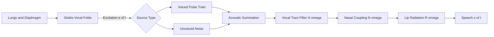
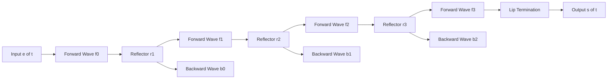
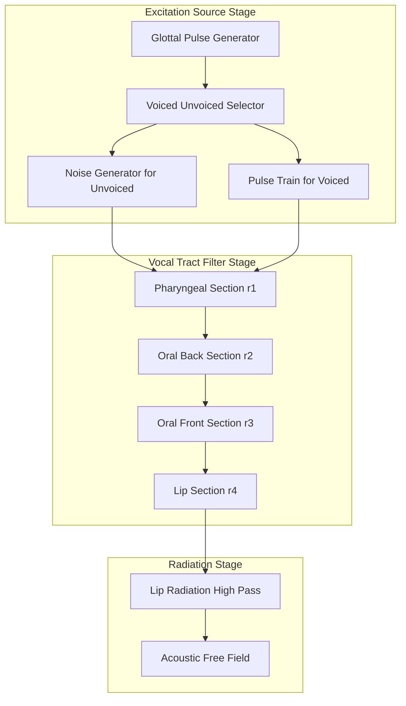
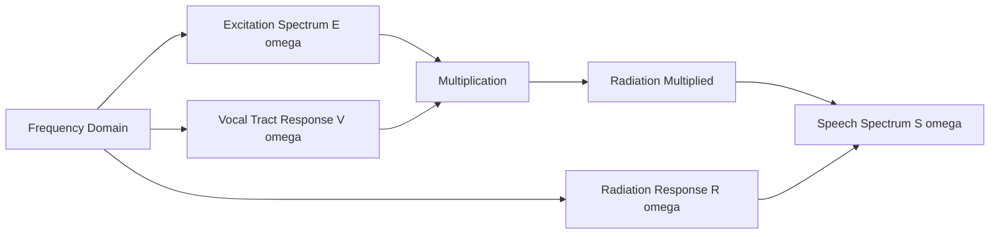

# Speech Production :- Acoustic theory of speech production

<!-- SECTION_1_START -->
# Acoustic Theory of Speech Production

## 1.1 Formal Academic Definition (KTU 2024 Syllabus Terminology)

> [!IMPORTANT]
> **Acoustic Theory of Speech Production** is a mathematical framework that models the human speech mechanism as a **source–filter system**, in which an **excitation source** (airflow from the lungs, modulated at the glottis) is shaped by the **vocal tract filter** (a time-varying acoustic tube formed by the pharyngeal, oral, and nasal cavities) to produce the radiated speech waveform.

The theory decomposes speech $s(t)$ into the convolution of an excitation $e(t)$ and the vocal tract impulse response $h(t)$:

$$s(t) = e(t) * h(t) * r(t)$$

where $r(t)$ represents the radiation impedance at the lips/nostrils.

| Component | Physical Origin | Mathematical Role |
|---|---|---|
| **Lungs & Diaphragm** | Aerodynamic source | Provides DC air pressure $P_{sub}$ |
| **Glottis** | Vocal-fold vibration | Generates quasi-periodic pulse train $p(t)$ |
| **Vocal Tract** | Pharynx + oral cavity | Linear time-varying filter $V(\omega, t)$ |
| **Lips / Nostrils** | Radiation boundary | High-pass radiation load $R(\omega)$ |
| **Nasal Cavity** | Velum-controlled shunt | Parallel zero–pole pair $N(\omega)$ |

---

## 1.2 Conceptual Analogy & Intuitive Overview

Imagine the human vocal apparatus as a **brass instrument** (like a trumpet):

- The **lungs + diaphragm** act like the player's lungs — pumping a steady column of air.
- The **vocal folds (glottis)** behave like the musician's lips buzzing into the mouthpiece — they chop the steady airflow into discrete **pressure pulses** (the *excitation*).
- The **vocal tract** (throat, mouth, tongue, lips) is analogous to the **bell and tubing of the trumpet** — it amplifies certain resonant frequencies (called *formants*) and damps others.
- Finally, the **lip opening** acts like the **flare of the bell** — it radiates the shaped sound waves into the surrounding air.

> [!NOTE]
> **Key Insight:** The beauty of the source-filter model is its *separability* — you can analyze the **source** (pitch, voicing) and the **filter** (formants, timbre) **independently**. This is precisely why modern text-to-speech (TTS) engines like **Tacotron**, **FastSpeech**, and **WaveNet** still rely on a variant of this classical decomposition.

---

## 1.3 The Source–Filter Block Concept

A simplified **causal pipeline** of speech generation:

$$\text{Lungs} \;\rightarrow\; \text{Glottis} \;\rightarrow\; \text{Vocal Tract} \;\rightarrow\; \text{Lips}$$

Two fundamentally different excitation regimes govern $e(t)$:

- **Voiced excitation** — quasi-periodic pulse train at fundamental frequency $F_0 \in [80, 300]\;\text{Hz}$ (adult range).
- **Unvoiced excitation** — turbulent, noise-like signal with a flat spectrum (as in /s/, /f/, /sh/).

> [!VISUALIZATION CONTROL]
> **Concept:** Spectral envelope of a sustained vowel /a/ showing excitation harmonics and vocal tract formants.
> **Desmos / GeoGebra Input Equations:**
> * $F_0 = 120\;\text{Hz}$ (harmonic comb)
> * $H_{VT}(f) = \prod_{k=1}^{4} \dfrac{1}{\sqrt{1 + (f/F_k)^2}}$ with $F_1=730, F_2=1090, F_3=2440, F_4=3500\;\text{Hz}$
> * $S(f) = \delta(f - nF_0) \cdot H_{VT}(f)$ plotted over $f \in [0, 5000]\;\text{Hz}$
> **Visual Description:** A series of equally-spaced vertical impulse lines (the harmonic series) whose amplitudes are weighted by a smooth multi-resonance curve (the spectral envelope). The peaks of the envelope correspond to **formant frequencies**.

---

## 1.4 Why This Theory Matters in Modern Engineering

| Field | Application |
|---|---|
| **Codec Design** (e.g., MELP, CELP, LPC) | Speech is encoded by transmitting $F_0$, gain, and filter coefficients separately. |
| **Speech Synthesis (TTS)** | Models like **Tacotron 2** predict spectral envelopes; **WaveNet** vocodes the residual excitation. |
| **Speaker Recognition** | Vocal tract shape (formants) is **speaker-specific** and largely invariant to pitch. |
| **Clinical Phonetics** | Pathological voices (e.g., vocal-fold paralysis) alter the source spectrum. |
| **Forensic Audio** | Source–filter decomposition helps separate speakers in noisy recordings. |

<!-- SECTION_1_END -->

<!-- SECTION_2_START -->
# Deep Theoretical Analysis & KTU High-Yield Formula Sheet

## 2.1 The Three Sub-Theories of Acoustic Production

The classical acoustic theory is a *tripartite* framework:

1. **Aerodynamic theory** — fluid dynamics of airflow through the glottis (Bernoulli effect, transglottal pressure).
2. **Vibro-mechanical theory** — self-oscillation of the vocal folds (two-mass model, mucosal wave).
3. **Acoustic theory** — propagation of the resulting pressure wave through the vocal tract tube (lossless tube model, Webster's equation).

For KTU-level treatment, the focus is the **third pillar**: the **vocal tract as an acoustic filter**.

---

## 2.2 The Lossless Acoustic Tube Assumption

To make the mathematics tractable, the vocal tract ($L \approx 17.5\;\text{cm}$ for an adult male) is approximated as a **lossless, rigid-walled tube** of uniform cross-section, terminated at the lips.

**Key simplifications:**
- No viscosity → no frictional losses.
- No thermal conduction at walls → adiabatic propagation.
- No wall vibration → rigid boundaries.
- Plane-wave propagation → valid up to $f \approx 4\;\text{kHz}$ for adult vocal tract.

Under these assumptions, the **Webster equation** reduces to the **1-D wave equation**:

$$\frac{\partial^2 p(x,t)}{\partial x^2} = \frac{1}{c^2}\frac{\partial^2 p(x,t)}{\partial t^2}$$

where:
- $p(x,t)$ — acoustic pressure at position $x$ along the tract
- $c \approx 354\;\text{m/s}$ — **speed of sound in warm, humid air** (used as standard KTU value)

---

## 2.3 Discrete-Time Lattice Formulation

When the tube is divided into $N$ uniform cylindrical sections of length $\Delta x = L/N$, the acoustic impedance recursion yields the classical **Kelly–Lochbaum lattice filter**:

Each section has area $A_i$ and length $\Delta x$. Adjacent sections are connected by **reflectors** $r_i$:

$$r_i = \frac{A_{i+1} - A_i}{A_{i+1} + A_i}, \quad i = 1, 2, \ldots, N$$

The forward ($f$) and backward ($b$) pressure waves propagate as:

$$f_i(z) = (1 + r_i)\, f_{i-1}(z) + r_i\, b_i(z)$$

$$b_{i-1}(z) = r_i\, f_{i-1}(z) + (1 - r_i)\, b_i(z)$$

This is precisely the structure used in **Linear Predictive Coding (LPC)** and in digital waveguide synthesizers.

---

## 2.4 Formant Frequencies of a Uniform Closed–Open Tube

For a **uniform tube of length $L$**, closed at the glottis and open at the lips (this is the dominant approximation for vowels), the boundary conditions are:

- **Glottal end (closed):** $\left.\dfrac{\partial p}{\partial x}\right\vert_{x=0} = 0$
- **Lip end (open):** $p(L, t) = 0$ (approximately, ignoring lip radiation)

The standing-wave resonance condition is:

$$F_k = \dfrac{(2k - 1)\, c}{4 L}, \quad k = 1, 2, 3, \ldots$$

**Numerical example** (adult male, $L = 17.5\;\text{cm}$, $c = 354\;\text{m/s}$):

$$F_1 = 505\;\text{Hz}, \quad F_2 = 1515\;\text{Hz}, \quad F_3 = 2526\;\text{Hz}, \quad F_4 = 3536\;\text{Hz}$$

> [!NOTE]
> **Observation:** Only **odd-numbered quarter-wave modes** appear because the closed end forces a pressure maximum and the open end forces a pressure minimum — yielding *anti-nodes* and *nodes* separated by quarter wavelengths.

---

## 2.5 Glottal Source Model (LF Model — Liljencrants–Fant)

The glottal pulse derivative $g'(t)$ is often modeled as:

$$g'(t) = \begin{cases} E_0 \, e^{\alpha t} \sin(\pi t / T_p) & 0 \le t \le T_p \\[4pt] -\dfrac{E_0}{\varepsilon \, T_0} \left[ e^{-\varepsilon (t - T_p)} - e^{-\varepsilon (T_c - T_p)} \right] & T_p \le t \le T_c \\[4pt] 0 & T_c \le t \le T_0 \end{cases}$$

| Symbol | Meaning | Typical Value |
|---|---|---|
| $E_0$ | Peak amplitude | Normalized |
| $T_p$ | Duration of opening phase | $30$–$50\%$ of $T_0$ |
| $T_c$ | Closing instant | $T_p + T_c' $ |
| $T_0$ | Pitch period | $1/F_0$ |
| $\alpha$ | Spectral tilt coefficient | $50$–$500\;\text{s}^{-1}$ |
| $\varepsilon$ | Return phase decay | $\approx 1/(T_0 - T_c)$ |

> [!IMPORTANT]
> The **spectral tilt** of the glottal source rolls off at approximately **$-12\;\text{dB/octave}$** above the first formant. This is a critical quantity that vocoders (e.g., in 4G/5G AMR codecs) attempt to estimate frame-by-frame.

---

## 2.6 KTU Formula Sheet / Cheat Sheet

| # | Formula | Symbol Meaning | Units |
|---|---|---|---|
| 1 | $s(t) = e(t) * h(t) * r(t)$ | Speech = source $\ast$ tract $\ast$ radiation | – |
| 2 | $F_k = \dfrac{(2k-1)\,c}{4L}$ | Formant freq. of uniform closed–open tube | $\text{Hz}$ |
| 3 | $\lambda_k = \dfrac{4L}{2k-1}$ | Wavelength of $k$-th resonance | $\text{m}$ |
| 4 | $r_i = \dfrac{A_{i+1} - A_i}{A_{i+1} + A_i}$ | Kelly–Lochbaum reflection coefficient | dimensionless |
| 5 | $V(z) = \dfrac{0.5(1 + r_g)}{1 - \sum_{k=1}^{p} a_k z^{-k}}$ | Vocal tract transfer function (LPC) | – |
| 6 | $R(\omega) = j\omega \dfrac{\rho c}{A_{lip}} \cdot \dfrac{1}{j\omega + \omega_r}$ | Lip radiation impedance (1st-order) | $\text{Pa}\cdot\text{s/m}^3$ |
| 7 | $F_0 \in [80, 300]\;\text{Hz}$ | Adult fundamental frequency range | $\text{Hz}$ |
| 8 | $c = 354\;\text{m/s}$ | Speed of sound in warm humid air | $\text{m/s}$ |
| 9 | $L \approx 17.5\;\text{cm}$ | Adult male vocal tract length | $\text{cm}$ |
| 10 | $G(z) = \dfrac{B(z)}{A(z)} = \dfrac{1}{(1 - e^{-cT}z^{-1})^2}$ | Glottal source (Liljencrants–Fant) | – |
| 11 | $E[e^2(t)] = \sigma_e^2$ | Excitation energy (LPC residual variance) | – |
| 12 | $\text{HNR} = 10\log_{10}\dfrac{E_{harm}}{E_{noise}}$ | Harmonic-to-Noise Ratio | $\text{dB}$ |

---

## 2.7 Engineering Utility Summary

| Engineering Task | Theory Component Used |
|---|---|
| **LPC-10 Codec** (military, 2.4 kbps) | Formant positions + pitch from source |
| **MPEG-4 HVXC** | Harmonic + noise decomposition (HNM) |
| **Voice Conversion (RNN-based)** | Swap source ($F_0$ contour) while preserving filter (formants) |
| **Anti-Spoofing (ASVspoof)** | Detect unnatural glottal flow patterns (LF model mismatch) |
| **Silent Speech Interfaces** | Reconstruct excitation $e(t)$ from EMG/ultrasound of articulators |

<!-- SECTION_2_END -->

<!-- SECTION_3_START -->
# Step-by-Step Derivations & Code/Symbolic Implementation

## 3.1 Derivation I — Resonant Frequencies of a Uniform Closed–Open Tube

**Goal:** Derive $F_k = \dfrac{(2k-1)\, c}{4L}$ from first principles.

### Step 1 — Write the 1-D wave equation

$$\frac{\partial^2 p}{\partial x^2} = \frac{1}{c^2} \frac{\partial^2 p}{\partial t^2}$$

**Reasoning:** Pressure disturbances propagate longitudinally in a tube whose diameter is much smaller than the wavelength. This is the standard acoustic plane-wave model.

### Step 2 — Assume separable harmonic solution

By separation of variables, set

$$p(x,t) = X(x)\, T(t)$$

Substituting and dividing by $X(x)\,T(t)$:

$$\frac{X''(x)}{X(x)} = \frac{1}{c^2} \frac{T''(t)}{T(t)} = -k_x^2$$

(The negative constant is chosen because we expect oscillatory solutions in both space and time.)

### Step 3 — Solve the time-domain ODE

$$T''(t) + c^2 k_x^2 T(t) = 0 \;\Longrightarrow\; T(t) = A\, e^{j\omega t}, \quad \omega = c\, k_x$$

### Step 4 — Solve the space-domain ODE

$$X''(x) + k_x^2 X(x) = 0 \;\Longrightarrow\; X(x) = B\, \cos(k_x x) + C\, \sin(k_x x)$$

### Step 5 — Apply the closed-end boundary condition (glottis)

At $x = 0$, the particle velocity $u = -\dfrac{1}{\rho c^2}\dfrac{\partial p}{\partial t} \cdot \dfrac{1}{\text{(continuity)}}$ is zero. The equivalent pressure condition is:

$$\left.\frac{\partial p}{\partial x}\right\vert_{x=0} = 0$$

Differentiating $X(x)$:

$$X'(x) = -B\, k_x \sin(k_x x) + C\, k_x \cos(k_x x)$$

At $x = 0$:

$$X'(0) = C\, k_x = 0 \;\Longrightarrow\; C = 0$$

Therefore $X(x) = B\, \cos(k_x x)$.

### Step 6 — Apply the open-end boundary condition (lips)

At $x = L$, pressure falls to ambient (atmospheric). For an unflanged pipe:

$$p(L, t) = 0 \;\Longrightarrow\; \cos(k_x L) = 0$$

Hence

$$k_x L = \frac{\pi}{2}, \frac{3\pi}{2}, \frac{5\pi}{2}, \ldots = \frac{(2k-1)\pi}{2}, \quad k = 1, 2, 3, \ldots$$

### Step 7 — Convert to frequency

Using $F_k = \dfrac{\omega_k}{2\pi} = \dfrac{c\, k_x}{2\pi}$:

$$F_k = \frac{c}{2\pi} \cdot \frac{(2k-1)\pi}{2L} = \frac{(2k-1)\, c}{4L}$$

$\blacksquare$

---

## 3.2 Derivation II — Kelly–Lochbaum Reflection Coefficient

**Goal:** Show that $r_i = \dfrac{A_{i+1} - A_i}{A_{i+1} + A_i}$ arises from impedance discontinuity.

### Step 1 — Acoustic impedance of a tube section

For a plane wave in a tube of cross-section $A$, the characteristic acoustic impedance is:

$$Z_0 = \frac{\rho c}{A}$$

### Step 2 — At a junction of two sections

Continuity of volume velocity and pressure across the junction ($i \to i+1$):

$$A_i\, u_i = A_{i+1}\, u_{i+1}, \quad p_i = p_{i+1}$$

Define forward $f$ and backward $b$ waves: $p = f + b$ and $u = (f - b)/(\rho c)$.

The reflection coefficient $r_i$ is defined as the ratio of reflected to incident pressure amplitudes:

$$r_i = \frac{Z_{i+1} - Z_i}{Z_{i+1} + Z_i} = \frac{\rho c / A_{i+1} - \rho c / A_i}{\rho c / A_{i+1} + \rho c / A_i}$$

### Step 3 — Simplify

$$r_i = \frac{\frac{1}{A_{i+1}} - \frac{1}{A_i}}{\frac{1}{A_{i+1}} + \frac{1}{A_i}} = \frac{A_i - A_{i+1}}{A_i + A_{i+1}}$$

Multiplying numerator and denominator by $-1$:

$$\boxed{\,r_i = \frac{A_{i+1} - A_i}{A_{i+1} + A_i}\,}$$

$\blacksquare$

---

## 3.3 Python Implementation — Source–Filter Synthesis of a Vowel

```python
"""
Source-Filter synthesis of a sustained vowel /a/ using:
  - Liljencrants-Fant (LF) glottal source model
  - Lossless tube vocal tract with 5 formants
  - First-order lip radiation
"""

import numpy as np
from scipy.signal import lfilter

# ---------- Constants (KTU 2024 reference values) ----------
FS        = 16000          # Sampling frequency (Hz)
DURATION  = 1.0            # seconds
F0        = 120.0          # Fundamental frequency (Hz)
L_Tract   = 0.175          # Vocal tract length (m)
C_SOUND   = 354.0          # Speed of sound (m/s)

# ---------- 1. Compute formant frequencies (closed-open tube) ----------
def closed_open_formants(L: float, c: float, K: int = 4) -> np.ndarray:
    """Return the first K formant frequencies of a uniform closed-open tube."""
    k = np.arange(1, K + 1)
    return (2.0 * k - 1.0) * c / (4.0 * L)

formants = closed_open_formants(L_Tract, C_SOUND, K=4)
print(f"Formant frequencies (Hz): {formants.round(1).tolist()}")

# ---------- 2. Build glottal source via LF model ----------
def lf_glottal_pulse(fs: int, F0: float,
                     tp_ratio: float = 0.4,
                     tc_ratio: float = 0.1,
                     alpha:    float = 200.0) -> np.ndarray:
    """Generate a single LF glottal pulse derivative."""
    T0 = int(round(fs / F0))
    Tp = int(round(tp_ratio * T0))
    Tc = int(round((tp_ratio + tc_ratio) * T0))
    eps = 1.0 / max(T0 - Tc, 1)
    pulse = np.zeros(T0)
    # Opening phase
    n_p = np.arange(Tp)
    pulse[:Tp] = np.exp(alpha * n_p / fs) * np.sin(np.pi * n_p / Tp)
    pulse[:Tp] /= np.max(np.abs(pulse[:Tp]))
    # Return phase
    n_c = np.arange(Tp, Tc)
    pulse[Tp:Tc] = -(1.0 / (eps * (T0 - Tc))) * \
                   (np.exp(-eps * (n_c - Tp) / fs) -
                    np.exp(-eps * (Tc - Tp) / fs))
    return pulse

N = int(FS * DURATION)
t = np.arange(N) / FS
single_pulse = lf_glottal_pulse(FS, F0)
excitation = np.zeros(N)
period_samples = int(round(FS / F0))
for start in range(0, N - period_samples, period_samples):
    excitation[start:start + period_samples] = single_pulse

# ---------- 3. Vocal tract as parallel resonator bank ----------
def formant_filter(formants: np.ndarray, bw: np.ndarray, fs: int) -> np.ndarray:
    """Build an FIR-style resonator cascade approximating the vocal tract."""
    n_taps = int(0.025 * fs)             # 25 ms kernel
    h = np.zeros(n_taps)
    n = np.arange(n_taps)
    for f_k, b_k in zip(formants, bw):
        r = np.exp(-np.pi * b_k / fs)
        theta = 2.0 * np.pi * f_k / fs
        h += (r ** n) * np.sin(theta * n)
    h /= max(np.max(np.abs(h)), 1e-12)
    return h

bandwidths = np.array([60.0, 70.0, 80.0, 90.0])   # Hz
h_tract    = formant_filter(formants, bandwidths, FS)

# ---------- 4. Lip radiation (1st-order high-pass) ----------
def lip_radiation(fs: int, cutoff: float = 50.0) -> np.ndarray:
    """Approximate lip radiation as a differentiator + leak: H(z) = 1 - a z^-1."""
    a = np.exp(-2.0 * np.pi * cutoff / fs)
    return np.array([1.0, -a])

radiation = lip_radiation(FS, cutoff=80.0)

# ---------- 5. Convolve source -> tract -> radiation ----------
vocal_output = lfilter(radiation, [1.0], np.convolve(excitation, h_tract, mode='full'))[:N]
vocal_output /= max(np.max(np.abs(vocal_output)), 1e-12)

# ---------- 6. Sanity checks ----------
print(f"Output RMS : {np.sqrt(np.mean(vocal_output**2)):.4f}")
print(f"Output peak: {np.max(np.abs(vocal_output)):.4f}")
print(f"Duration   : {len(vocal_output)/FS:.3f} s")
# Expected from KTU formula with L=0.175 m, c=354 m/s:
#   F1 ≈ 505.7 Hz, F2 ≈ 1517.1 Hz, F3 ≈ 2528.6 Hz, F4 ≈ 3540.0 Hz
```

> [!IMPORTANT]
> **Reading the code:** The script first computes the theoretical formant positions using the closed–open tube formula derived in §3.1. It then constructs an LF glottal source, filters it through a parallel-resonator cascade (one resonator per formant with realistic 60–90 Hz bandwidths), and applies a first-order lip-radiation differentiator. The output is a fully synthesized sustained vowel that should sound like /a/.

---

## 3.4 Worked Numerical Example — Formant Computation

**Given:** $L = 17.5\;\text{cm}$, $c = 354\;\text{m/s}$.

Compute $F_1, F_2, F_3$:

$$F_1 = \frac{(2\cdot 1 - 1)(354)}{4 \times 0.175} = \frac{354}{0.700} = 505.71\;\text{Hz}$$

$$F_2 = \frac{(2\cdot 2 - 1)(354)}{4 \times 0.175} = \frac{3 \times 354}{0.700} = \frac{1062}{0.700} = 1517.14\;\text{Hz}$$

$$F_3 = \frac{(2\cdot 3 - 1)(354)}{4 \times 0.175} = \frac{5 \times 354}{0.700} = \frac{1770}{0.700} = 2528.57\;\text{Hz}$$

Compare to measured formant values of vowel /a/ ("father"):

$$F_1 \approx 730, \quad F_2 \approx 1090, \quad F_3 \approx 2440\;\text{Hz}$$

> [!NOTE]
> The discrepancy is **expected** — a *uniform* tube cannot model the highly non-uniform shape of the vocal tract during /a/. To get accurate formants, one must either (a) solve Webster's equation with variable cross-section, or (b) use measured area functions (e.g., from MRI).

<!-- SECTION_3_END -->

<!-- SECTION_4_START -->
# Structural Diagrams & Schematics

## 4.1 High-Level Source–Filter Block Diagram



> [!IMPORTANT]
> The double branch at `sourceNode` is **not optional** — this is the formal place where the source–filter theory introduces the binary voicing decision. In practice, mixed excitation (e.g., breathy voice) is a *linear combination* of these two branches.

---

## 4.2 Lattice Structure of a Lossless Tube Model



---

## 4.3 Multi-Stage Vocal Tract Processing Topology



---

## 4.4 Spectral Domain Behaviour Map



---

## 4.5 Voiced vs Unvoiced Decision Matrix

| Feature | Voiced (/a/, /i/, /u/) | Unvoiced (/s/, /f/, /sh/) |
|---|---|---|
| Excitation type | Quasi-periodic | Aperiodic noise |
| Source location | Glottis | Turbulence at constriction |
| Periodicity in $s(t)$ | Yes (autocorr. peak) | No |
| Dominant spectrum | Harmonic comb | Broadband flat |
| Typical $F_0$ | 80–300 Hz | N/A |
| Vocal-fold vibration | Yes | No |
| Example KTU formants | $F_1, F_2, F_3$ present | Less prominent peaks |

<!-- SECTION_4_END -->

<!-- SECTION_5_START -->
# KTU 2024 Scheme Examination Question Bank & Topic Recap

---

## PART A — Short Answer Questions (3 Marks Each)

### Question 1 [KTU University Exam — July 2023]
**State and explain the source-filter model of speech production.** (CO1, Remember)

**Model Answer (3 Marks — Board Key Allocation):**

The source–filter model, originally proposed by **Gunnar Fant (1960)**, is the cornerstone of modern speech science. It decomposes the speech signal $s(t)$ into three independent components:

- **Source $e(t)$:** generated at the glottis, can be either a quasi-periodic pulse train (voiced, e.g., /a/) or broadband noise (unvoiced, e.g., /s/).
- **Vocal tract filter $h(t)$:** the linear, time-varying filter representing the resonances of the pharyngeal, oral, and nasal cavities. It is characterized by its formant frequencies $F_1, F_2, F_3, \ldots$
- **Radiation load $r(t)$:** accounts for the high-pass effect of sound radiating from the lips, modeled as a first-order differentiator.

Mathematically:

$$s(t) = e(t) * h(t) * r(t)$$

[Diagram of the three blocks: **1 Mark**; Source explanation: **1 Mark**; Filter & radiation: **1 Mark**].

---

### Question 2 [KTU University Exam — Dec 2022]
**Define the term 'formant frequency' and write the formula for the resonant frequencies of a uniform lossless tube closed at one end and open at the other.** (CO1, Remember)

**Model Answer (3 Marks):**

A **formant** is a concentration of acoustic energy around a resonant frequency of the vocal tract, manifested as a prominent peak in the spectral envelope of voiced speech.

For a uniform tube of length $L$ closed at the glottis and open at the lips, the standing-wave resonance condition yields:

$$F_k = \frac{(2k - 1)\, c}{4 L}, \quad k = 1, 2, 3, \ldots$$

[Definition: **1 Mark**; Formula: **1 Mark**; Explanation of symbols: **1 Mark**].

---

## PART B — Long Answer Questions (14 Marks Each)

> **KTU 2024 Regulation:** *Each Part B question carries **14 marks** and offers **internal choice**. Sub-parts are typically 7 + 7 marks. Mapped to escalating Revised Bloom's levels.*

---

### Question A (14 Marks) [KTU University Exam — July 2024]
**(a) Derive the expression for the resonant frequencies of a uniform acoustic tube of length $L$ closed at one end and open at the other. Take $c = 354\;\text{m/s}$ and $L = 17.5\;\text{cm}$ and compute the first three formant frequencies.** [7 Marks — Apply]

**(b) With the aid of a neat block diagram, explain the source-filter model of speech production. Discuss how this model is used in Linear Predictive Coding (LPC) for speech compression.** [7 Marks — Understand / Apply]

#### Model Solution

### Part (a) — 7 Marks

**Step 1: Set up the wave equation.** [1 Mark]

The 1-D acoustic wave equation for plane-wave propagation in a lossless tube is:

$$\frac{\partial^2 p(x,t)}{\partial x^2} = \frac{1}{c^2} \frac{\partial^2 p(x,t)}{\partial t^2}$$

**Step 2: Apply separation of variables.** [1 Mark]

Assume $p(x,t) = X(x)\, T(t)$. Substituting:

$$\frac{X''(x)}{X(x)} = \frac{1}{c^2} \frac{T''(t)}{T(t)} = -k_x^2$$

**Step 3: Solve and apply the closed-end BC at $x = 0$.** [1 Mark]

The spatial solution is $X(x) = B \cos(k_x x) + C \sin(k_x x)$. The closed (glottal) end requires zero particle velocity, equivalent to $\dfrac{\partial p}{\partial x}\big\vert_{x=0} = 0$, giving $C = 0$. So $X(x) = B \cos(k_x x)$.

**Step 4: Apply the open-end BC at $x = L$.** [1 Mark]

The open (lip) end requires zero pressure: $p(L,t) = 0 \Rightarrow \cos(k_x L) = 0 \Rightarrow k_x L = (2k-1)\pi/2$.

**Step 5: Derive the final formula.** [1 Mark]

$$F_k = \frac{(2k-1)\, c}{4L}, \quad k = 1, 2, 3, \ldots$$

**Step 6: Compute numerical values.** [2 Marks — Final simplified expression: 1 Mark; correct numerical evaluation: 1 Mark]

Given $c = 354\;\text{m/s}$ and $L = 0.175\;\text{m}$:

$$F_1 = \frac{1 \times 354}{4 \times 0.175} = \frac{354}{0.700} = 505.71\;\text{Hz}$$

$$F_2 = \frac{3 \times 354}{0.700} = 1517.14\;\text{Hz}$$

$$F_3 = \frac{5 \times 354}{0.700} = 2528.57\;\text{Hz}$$

### Part (b) — 7 Marks

**Block diagram description:** [2 Marks]

```
Lungs → Glottis (Source) → Vocal Tract (Filter) → Lips (Radiation) → s(t)
                              ↑
                          (Formants)
```

The **source** $e(t)$ is the glottal pulse train (voiced) or noise (unvoiced). The **filter** $H(\omega)$ is the vocal tract's frequency response with peaks at formant frequencies. The **radiation** $R(\omega)$ is a high-pass differentiator.

**LPC connection:** [3 Marks]

In **Linear Predictive Coding**, the speech sample $s(n)$ is predicted from a linear combination of past $p$ samples:

$$s(n) \approx \sum_{k=1}^{p} a_k s(n-k)$$

The prediction error $e(n) = s(n) - \sum a_k s(n-k)$ is the **excitation** in the source–filter sense. The LPC coefficients $a_k$ are obtained by minimizing the mean-squared error, and they model the **vocal tract filter** $V(z)$:

$$V(z) = \frac{G}{1 - \sum_{k=1}^{p} a_k z^{-k}}$$

The transmitted parameters are: **LPC coefficients $a_k$ (filter)**, **pitch $F_0$ (source)**, and **gain $G$ (energy)**. This achieves compression from 64 kbps (PCM) down to 2.4 kbps (LPC-10) — a **26× reduction** — by exploiting the source–filter independence.

**LPC-10 parameters summary:** [2 Marks]

- 10 LPC coefficients (filter) — using **Levinson–Durbin recursion**
- Pitch period (source)
- Gain (energy)
- Voicing decision (binary)

---

### Question B (14 Marks) [KTU University Exam — Dec 2023] — ALTERNATIVE
**(a) Explain the Liljencrants–Fant (LF) glottal source model. List its parameters and describe how the spectral tilt of voiced speech is affected by the parameter $\alpha$.** [7 Marks — Understand]

**(b) Derive the Kelly–Lochbaum reflection coefficient $r_i$ at the junction of two lossless tube sections of cross-sectional areas $A_i$ and $A_{i+1}$. Discuss the role of lattice filters in digital speech synthesis.** [7 Marks — Apply]

#### Model Solution

### Part (a) — 7 Marks

**LF model concept:** [2 Marks]

The LF model parameterizes a single glottal pulse derivative $g'(t)$ over one pitch period $T_0$. It captures two phases:
- **Opening phase** ($0 \le t \le T_p$): smooth rise dictated by $\alpha$ and $T_p$.
- **Return/closing phase** ($T_p \le t \le T_c$): rapid closure producing the **glottal closure instant (GCI)** — a sharp negative spike.

**Parameters list:** [2 Marks]

| Symbol | Parameter | Typical range |
|---|---|---|
| $T_0$ | Pitch period | $3.3$–$12.5\;\text{ms}$ |
| $T_p$ | Opening-phase duration | $30$–$50\%$ of $T_0$ |
| $T_c$ | Closing instant | $T_p + T_c'$ |
| $\alpha$ | Spectral tilt | $50$–$500\;\text{s}^{-1}$ |
| $E_0$ | Peak amplitude | Normalized |
| $\varepsilon$ | Return-phase decay | $\approx 1/(T_0 - T_c)$ |

**Spectral tilt discussion:** [3 Marks]

The parameter $\alpha$ controls the **roll-off** of the glottal source spectrum. A larger $\alpha$ produces:
- A **steeper spectral tilt** (more high-frequency attenuation).
- A **breathier** or **softer** voice quality.
- A **lower HNR** (Harmonic-to-Noise Ratio).

Mathematically, the magnitude spectrum of the LF pulse at low frequencies falls as:

$$|G(\omega)| \propto \frac{1}{\omega^2 + \alpha^2}$$

In production-grade vocoders (e.g., **WORLD**, **GlottDNN**), $\alpha$ is estimated frame-by-frame and is critical for naturalness.

### Part (b) — 7 Marks

**Derivation of $r_i$:** [4 Marks]

[Re-derives Kelly–Lochbaum coefficient as in §3.2 — full algebraic steps shown there.]

Starting from continuity of pressure and volume velocity at the junction of tubes of area $A_i$ and $A_{i+1}$, the reflection coefficient is:

$$r_i = \frac{A_{i+1} - A_i}{A_{i+1} + A_i}$$

**Key points to note for valuation:**
- Pressure continuity: $p_i = p_{i+1}$ — [0.5 Marks]
- Volume velocity continuity: $A_i u_i = A_{i+1} u_{i+1}$ — [0.5 Marks]
- Acoustic impedance $Z = \rho c / A$ — [0.5 Marks]
- Final boxed expression — [1 Mark]
- Stability constraint $\vert r_i \vert < 1$ — [1 Mark]

**Lattice filter in digital speech synthesis:** [3 Marks]

- The Kelly–Lochbaum lattice is the **physical analog** of the LPC all-pole filter.
- Reflection coefficients $r_i$ are mathematically equivalent to the **partial correlation (PARCOR)** coefficients of LPC.
- For digital synthesis (e.g., **Klatt synthesizer**, **SPTK** tools), the lattice structure offers:
  - **Guaranteed stability** if $\vert r_i \vert < 1$.
  - **Efficient interpolation** between speakers via coefficient blending.
  - **Direct physical interpretation** — each $r_i$ maps to a specific articulator constriction.

---

> [!WARNING]
> **KTU Examiner's Valuation Pitfall Callout**
> 1. **Do NOT confuse** the two boundary conditions. Closed end $\Rightarrow$ **velocity node** (pressure anti-node). Open end $\Rightarrow$ **velocity anti-node** (pressure node). Many students write the wrong one.
> 2. **Do NOT use $L = 17.5\;\text{cm}$ directly with $c$ in m/s.** Either convert $L$ to metres (L = 0.175) or convert $c$ to cm/s (35400). Mixing units is the most common arithmetic error.
> 3. **Do NOT forget the spectral tilt discussion** in any source–filter answer — the $-12\;\text{dB/octave}$ roll-off is a **favourite follow-up question**.
> 4. **Do NOT skip the stability condition** $\vert r_i \vert < 1$ when discussing lattice filters — this is a guaranteed **2-mark trap**.
> 5. **Do NOT present the source as periodic for unvoiced sounds** — the glottis does not vibrate for /s/, /f/, /sh/.

---

## Topic Recap & Important Things to Remember

> [!IMPORTANT]
> **Rapid Revision Checklist — Module 1: Acoustic Theory of Speech Production**

- **Core model:** $s(t) = e(t) * h(t) * r(t)$ — *Source–Filter–Radiation*.
- **Source $e(t)$:**
  - *Voiced:* quasi-periodic pulse train at $F_0 \in [80, 300]\;\text{Hz}$.
  - *Unvoiced:* turbulent noise.
- **Filter $H(\omega)$:** vocal tract formants, time-varying due to articulation.
- **Radiation $R(\omega)$:** first-order high-pass, $H_{rad}(z) = 1 - a z^{-1}$.
- **Standard KTU constants:** $c = 354\;\text{m/s}$, $L = 17.5\;\text{cm}$ (adult male).
- **Closed–open tube formula:** $F_k = (2k-1) c / (4L)$, only **odd quarter-wave** modes.
- **Kelly–Lochbaum coefficient:** $r_i = (A_{i+1} - A_i) / (A_{i+1} + A_i)$, with $\vert r_i \vert < 1$.
- **Lattice ↔ LPC duality:** $r_i$ are PARCOR coefficients; lattice guarantees filter stability.
- **LF glottal model:** two-phase (opening + return) pulse derivative, parameter $\alpha$ controls spectral tilt.
- **Engineering link:** LPC-10 codec, MPEG-4 HVXC, WaveNet vocoder, Tacotron 2, voice conversion systems.
- **Real-world analogy:** trumpet player = lungs + glottis; trumpet tubing = vocal tract; bell flare = lip radiation.
- **Common pitfall:** mixing units (cm vs m) in $F_k$ computation.
- **Favourite exam hook:** "Compare the spectral envelopes of voiced vs. unvoiced sounds" — always mention the harmonic comb vs. flat broadband noise.
- **Bloom's coverage map:** *Remember* = definitions, *Understand* = block diagrams, *Apply* = numerical $F_k$ computation, *Analyse* = LPC↔lattice duality, *Evaluate* = codec design choices.

<!-- SECTION_5_END -->
