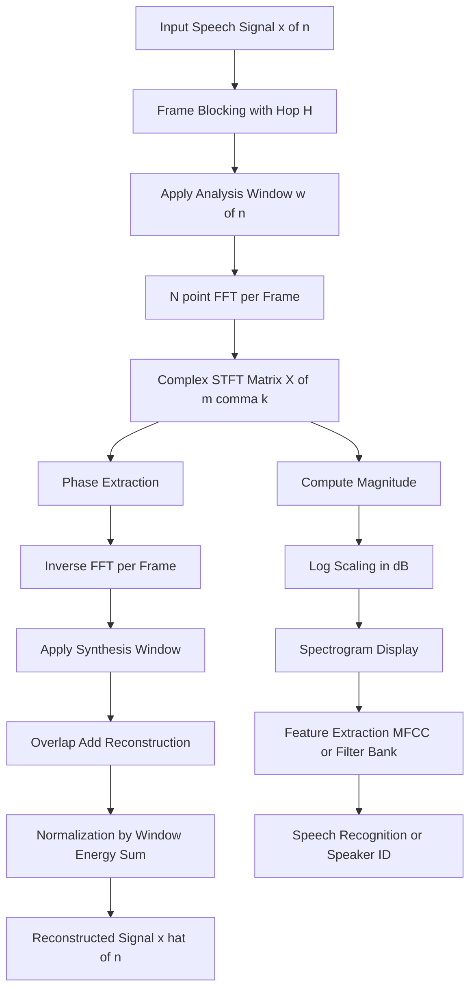
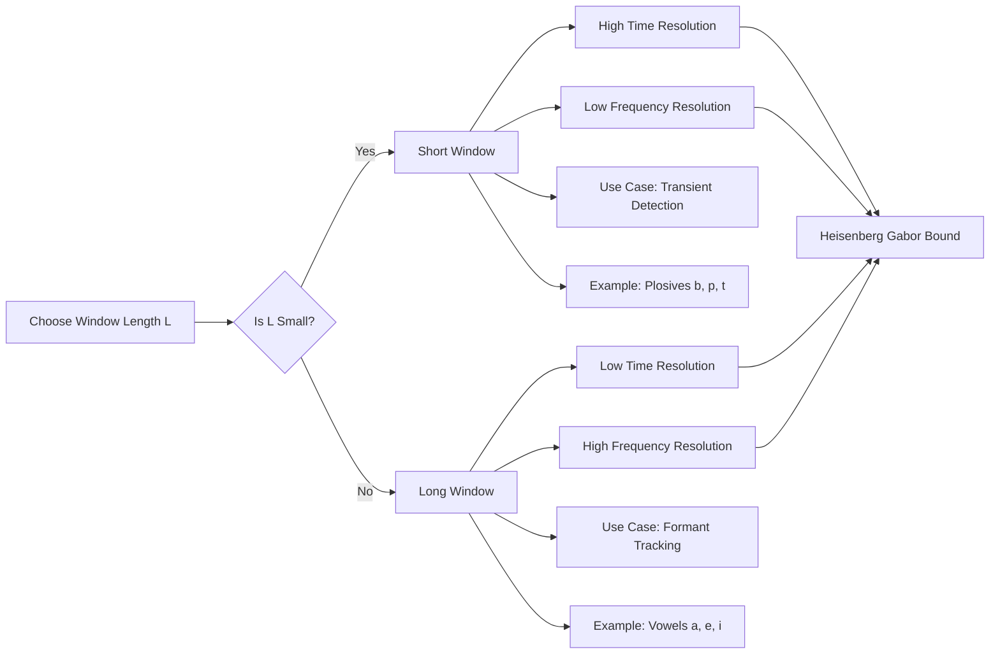
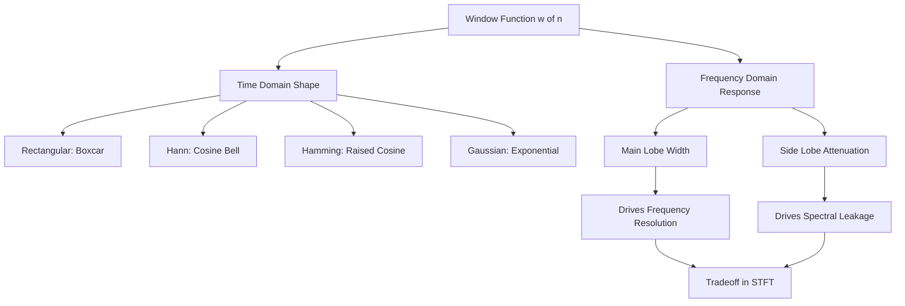
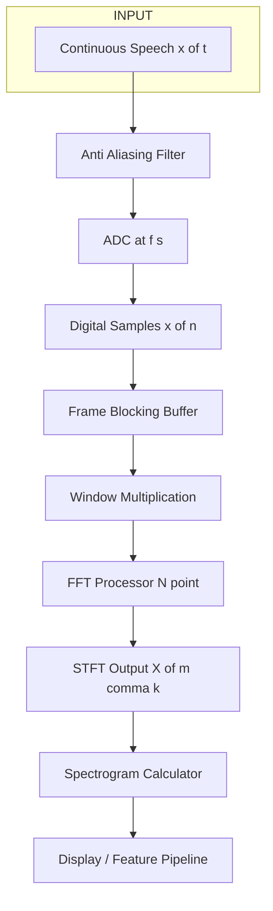

# STFT Analysis

<!-- SECTION_1_START -->

# STFT Analysis — Short-Time Fourier Transform

## 1.1 Formal Academic Definition

The **Short-Time Fourier Transform (STFT)** is a time-frequency analysis technique used to study the local spectral characteristics of a non-stationary signal $x(t)$ by applying the Fourier Transform to successive short, windowed segments of the signal. For a continuous-time signal $x(t)$ and an analysis window $w(t)$ centered at time $\tau$, the STFT is rigorously defined as:

$$
X(\tau, \omega) = \int_{-\infty}^{+\infty} x(t)\, w(t - \tau)\, e^{-j\omega t}\, dt
$$

For a discrete-time signal $x[n]$ with window $w[n]$ of length $L$, the discrete STFT is computed as:

$$
X[m, k] = \sum_{n=0}^{L-1} x[n + mH]\, w[n]\, e^{-j 2\pi k n / N}
$$

where $m$ is the frame index, $H$ is the hop size (frame shift), $k$ is the frequency bin index, and $N$ is the FFT length.

> [!IMPORTANT]
> **KTU 2024 Syllabus Anchor (PECST866, Module 1):** STFT is the central tool used to extract *time-varying spectral envelopes* of speech. Speech is a quasi-stationary signal — its spectral content is roughly constant for short intervals (5–25 ms) but changes over time. The STFT is the bridge between the time-domain waveform and the time-frequency representation of speech.

> [!NOTE]
> **Fundamental Insight:** The classical Fourier Transform tells you *what* frequencies exist in a signal, but it loses the information *when* they occur. The STFT resolves this limitation by *localizing* the analysis in time using a sliding window, providing a 2D time-frequency map of energy distribution.

## 1.2 Conceptual Analogy & Intuition

Imagine you are watching a long symphony being performed in a dark concert hall. You cannot see the whole orchestra at once. Instead, you hold a small flashlight that you sweep across the stage. At each moment, the flashlight illuminates only a *small section* of musicians (the violins, then the flutes, then the drums...). By sweeping the beam and recording what you see moment-by-moment, you construct a *moving picture* of who is playing what and when.

- The **orchestra** = the entire speech signal $x(t)$.
- The **flashlight beam** = the analysis window $w(t-\tau)$.
- The **moment you look** = the time location $\tau$.
- The **spectrum of what you see** = $X(\tau, \omega)$.

The width of the flashlight beam corresponds to the **window length** $L$:
- A *narrow* beam → good time resolution, poor frequency resolution (you can pinpoint *when* but not precisely *what* pitch).
- A *wide* beam → poor time resolution, good frequency resolution (you can identify the *pitch* but lose the precise onset time).

This trade-off is the famous **Heisenberg-Gabor uncertainty principle** of time-frequency analysis.

> [!VISUALIZATION CONTROL]
> **Concept:** Spectrogram — 2D heatmap of $|X[m,k]|$ over time and frequency
> **GeoGebra / Desmos Input Equations (parametric):**
> * `x(t) = sin(2*pi*220*t) + sin(2*pi*440*t*(1 + 0.5*sin(2*pi*5*t)))` (a chirp-like signal)
> * `STFT(t,f) = exp(-((t-t0)^2)/(2*sigma^2)) * cos(2*pi*f*t)` for various $t_0$
> **Visual Description:** Plot a 2D colormap where the x-axis is time (frames $m$), y-axis is frequency (bins $k$), and color intensity represents the log-magnitude of the STFT. You should observe horizontal striations at constant frequency for steady tones and vertical smearing for abrupt transients.

## 1.3 Physical Constants & Standard Metrics

In speech processing, the following standards are conventionally used:

- **Sampling frequency $f_s$** for wideband speech: **16 kHz** (telephony: 8 kHz).
- **Frame duration** for short-time analysis: **20–30 ms** (one pitch period of typical male voice is ~10 ms, so the window must span 2–3 pitch periods for voiced sounds).
- **Window shift (hop size) $H$**: usually $L/2$ (50% overlap) or $L/4$ (75% overlap) — overlaps prevent loss of information at frame boundaries.
- **FFT length $N$**: typically the next power of 2 greater than or equal to $L$ (zero-padding to $N \geq L$ for finer frequency grid).

<!-- SECTION_1_END -->

<!-- SECTION_2_START -->

# 2. Deep Theoretical Analysis & KTU High-Yield Formula Sheet

## 2.1 Why Classical Fourier Transform Fails for Speech

The classical Fourier Transform assumes the signal is **stationary** (its statistical properties do not change with time). However, speech is generated by a time-varying vocal tract filter excited by either:

1. **Voiced excitation** — quasi-periodic glottal pulses at the fundamental frequency $F_0$ (typically 80–300 Hz).
2. **Unvoiced excitation** — turbulent airflow (noise-like, broadband).

Because the vocal tract shape (and thus the formant frequencies) changes continuously as the articulators (tongue, lips, jaw) move, the **spectral content of speech is non-stationary**. Applying a single global Fourier Transform would smear all temporal information — the time at which a particular formant occurred would be lost.

The STFT overcomes this by enforcing a *local stationarity assumption*: within a short analysis window of length $L$, the speech is treated as approximately stationary.

## 2.2 Mathematical Construction — Step-by-Step Logic

### Step 1 — Windowing
Multiply the signal by a sliding window function centered at time $\tau$:

$$
x_w(t, \tau) = x(t) \cdot w(t - \tau)
$$

This extracts a finite segment of length $L$ around $\tau$.

### Step 2 — Apply Fourier Transform
Compute the Fourier Transform of the windowed segment:

$$
X(\tau, \omega) = \mathcal{F}\{ x_w(t, \tau) \}
$$

### Step 3 — Slide the Window
Increment $\tau$ by the hop size $H$ and repeat to build the time-frequency matrix $X(\tau, \omega)$.

### Step 4 — Construct the Spectrogram
The squared magnitude $|X(\tau, \omega)|^2$ is called the **spectrogram** — a real-valued, non-negative time-frequency energy distribution.

> [!NOTE]
> **Linearity:** The STFT is linear in the input signal. This is critical for source-filter models in speech synthesis and for superposition analysis of mixed signals.

## 2.3 The Time-Frequency Resolution Trade-off

The choice of window length $L$ creates a fundamental trade-off:

| Window Length $L$ | Time Resolution $\Delta t$ | Frequency Resolution $\Delta f$ | Use Case |
|---|---|---|---|
| Short (e.g., 5 ms) | High (precise timing) | Low (wide main lobe) | Detecting transients, consonants, plosives |
| Long (e.g., 30 ms) | Low (smeared timing) | High (narrow main lobe) | Resolving formants, pitch harmonics |

Mathematically, the resolution trade-off is governed by the **Heisenberg-Gabor inequality**:

$$
\Delta t \cdot \Delta f \geq \frac{1}{4\pi}
$$

This lower bound is achieved by the **Gaussian window**, which has the minimum time-bandwidth product. In practice, the **Hamming** and **Hann** windows are widely used because they offer a good compromise between main-lobe width and side-lobe attenuation.

## 2.4 Common Analysis Windows in Speech Processing

A window function $w[n]$ of length $L$ is multiplied sample-by-sample with the signal segment. Key requirements:
- Smooth roll-off to avoid spectral leakage.
- Finite support (non-zero only over $[0, L-1]$).

| Window Type | Equation (Continuous) | Main Lobe Width | Side Lobe Level | Typical Use |
|---|---|---|---|---|
| Rectangular | $w(t) = 1$ for $\vert t \vert \leq L/2$ | $2\pi / L$ | $-13$ dB | Rarely used (high leakage) |
| Hann | $w(t) = 0.5\,[1 + \cos(2\pi t / L)]$ | $4\pi / L$ | $-31$ dB | General-purpose speech |
| Hamming | $w(t) = 0.54 + 0.46\cos(2\pi t / L)$ | $4\pi / L$ | $-41$ dB | Narrowband speech spectrograms |
| Gaussian | $w(t) = \exp(-t^2 / 2\sigma^2)$ | Tunable | Very low | Optimal resolution trade-off |
| Blackman | $w(t) = 0.42 - 0.5\cos(2\pi t/L) + 0.08\cos(4\pi t/L)$ | $6\pi / L$ | $-58$ dB | High-precision spectral analysis |

## 2.5 Inverse STFT (ISTFT) — Signal Reconstruction

If the analysis windows satisfy the **Constant Overlap-Add (COLA) condition**, the original signal can be perfectly reconstructed from its STFT. For hop size $H$ and window $w[n]$:

$$
\sum_{m=-\infty}^{+\infty} w[n - mH] = C \quad \text{(a constant, for all } n \text{)}
$$

The reconstruction formula (Overlap-Add) is:

$$
x[n] = \frac{\sum_{m} X[m, k_n]\, e^{j 2\pi k_n n / N}\, w[n - mH]}{\sum_{m} w^2[n - mH]}
$$

The COLA condition is satisfied by:
- **Hann window** with $H = L/2$ (50% overlap).
- **Hamming window** with $H = L/2$ (50% overlap, approximately).
- **Rectangular window** with $H = L/4$ (75% overlap).

## 2.6 KTU High-Yield Formula Sheet

| # | Formula / Concept | Expression | Units / Notes |
|---|---|---|---|
| 1 | Continuous STFT | $X(\tau, \omega) = \int x(t)\, w(t-\tau)\, e^{-j\omega t}\, dt$ | $\tau$ in seconds, $\omega$ in rad/s |
| 2 | Discrete STFT | $X[m, k] = \sum_{n=0}^{L-1} x[n+mH]\, w[n]\, e^{-j2\pi kn/N}$ | $m$ = frame, $k$ = bin |
| 3 | Inverse Discrete STFT | $x[n] = \dfrac{\sum_m \text{IDFFT}\{X[m,k]\}\, w[n-mH]}{\sum_m w^2[n-mH]}$ | Requires COLA |
| 4 | Spectrogram | $S(\tau, \omega) = \vert X(\tau, \omega) \vert^2$ | Energy density |
| 5 | Log-Spectrogram (dB) | $S_{dB} = 10 \log_{10}(\vert X \vert^2 + \epsilon)$ | $\epsilon$ prevents $\log(0)$ |
| 6 | Frequency resolution | $\Delta f = f_s / N$ | Hz per bin |
| 7 | Time resolution | $\Delta t = H / f_s$ | Seconds per frame |
| 8 | Heisenberg-Gabor bound | $\Delta t \cdot \Delta f \geq 1/(4\pi)$ | Fundamental limit |
| 9 | Hann window | $w[n] = 0.5\,(1 - \cos(2\pi n / (L-1)))$ | $0 \leq n < L$ |
| 10 | Hamming window | $w[n] = 0.54 - 0.46\cos(2\pi n / (L-1))$ | $0 \leq n < L$ |
| 11 | COLA condition | $\sum_m w[n - mH] = \text{constant}$ | Required for perfect reconstruction |
| 12 | Power Spectrum | $P(\omega) = \dfrac{1}{2\pi} \int R(\tau)\, e^{-j\omega \tau}\, d\tau$ | Wiener-Khinchin theorem |

> [!TIP]
> **Engineering Utility:** STFT forms the computational backbone of nearly every modern speech system — from MFCC (Mel-Frequency Cepstral Coefficients) extraction for ASR (Automatic Speech Recognition, e.g., Google Assistant, Siri), to speech enhancement, speaker identification, voice activity detection (VAD), and audio codecs like MP3/AAC. The spectrogram is the *de facto* input feature for deep-learning speech models such as CNNs and Transformers.

<!-- SECTION_2_END -->

<!-- SECTION_3_START -->

# 3. Step-by-Step Derivations, Code & Implementations

## 3.1 Derivation of the STFT from the Fourier Transform

**Given:** A non-stationary signal $x(t)$ that we wish to analyze locally in time.

**Step 1 — Define the localized signal segment.**

We multiply $x(t)$ by a window $w(t-\tau)$ shifted to time $\tau$. For the standard *centered* form:

$$
x_\tau(t) = x(t)\, w(t - \tau)
$$

**Step 2 — Apply the Fourier Transform to the localized segment.**

$$
X(\tau, \omega) = \int_{-\infty}^{+\infty} x_\tau(t)\, e^{-j\omega t}\, dt = \int_{-\infty}^{+\infty} x(t)\, w(t - \tau)\, e^{-j\omega t}\, dt
$$

**Step 3 — Substitute $t' = t - \tau$ to obtain the symmetric (modulation) form.**

Let $t' = t - \tau$, so $t = t' + \tau$, $dt = dt'$:

$$
X(\tau, \omega) = \int_{-\infty}^{+\infty} x(t' + \tau)\, w(t')\, e^{-j\omega (t' + \tau)}\, dt'
$$

$$
X(\tau, \omega) = e^{-j\omega \tau} \int_{-\infty}^{+\infty} x(t' + \tau)\, w(t')\, e^{-j\omega t'}\, dt'
$$

The term $e^{-j\omega \tau}$ is a frequency-dependent phase factor that accounts for the time shift of the window. This is the **modulation form** of the STFT — the window modulates the signal at time $\tau$.

**Step 4 — Discretize for digital computation.**

Replace $\tau \to mH$ and $t' \to n / f_s$, with $N$-point FFT and window length $L$:

$$
X[m, k] = \sum_{n=0}^{L-1} x[n + mH]\, w[n]\, e^{-j 2\pi k n / N}, \quad k = 0, 1, \dots, N-1
$$

**Step 5 — Compute the spectrogram as the squared magnitude.**

$$
S[m, k] = \vert X[m, k] \vert^2 = (\text{Re}\{X[m,k]\})^2 + (\text{Im}\{X[m,k]\})^2
$$

**Step 6 — Convert to dB scale for visualization (log-spectrogram).**

$$
S_{dB}[m, k] = 10 \cdot \log_{10}\left( S[m, k] + \epsilon \right)
$$

where $\epsilon = 10^{-10}$ (or similar) prevents numerical issues when $S[m,k] = 0$.

## 3.2 Worked Numerical Example

**Problem:** A discrete signal $x[n] = \{1, 2, 3, 4, 5, 6, 7, 8\}$ is analyzed with a rectangular window of length $L = 4$ and hop size $H = 2$. Compute the STFT magnitude at frame $m = 1$ using a 4-point DFT (no zero-padding). $f_s = 8$ kHz.

**Solution:**

**Step A — Extract the windowed frame at $m = 1$.**

The signal segment for frame $m$ starts at index $mH = 2$:

$$
x_1[n] = x[n+2], \quad n = 0, 1, 2, 3 = \{3, 4, 5, 6\}
$$

**Step B — Apply the rectangular window (no modification needed).**

$$
w[n] = 1, \quad n = 0, 1, 2, 3
$$

**Step C — Compute the 4-point DFT.**

$$
X[1, k] = \sum_{n=0}^{3} x_1[n]\, e^{-j 2\pi k n / 4}, \quad k = 0, 1, 2, 3
$$

For $k = 0$:

$$
X[1, 0] = 3 + 4 + 5 + 6 = 18
$$

For $k = 1$:

$$
X[1, 1] = 3 + 4\,e^{-j\pi/2} + 5\,e^{-j\pi} + 6\,e^{-j3\pi/2}
$$

$$
X[1, 1] = 3 + 4(-j) + 5(-1) + 6(j) = (3 - 5) + j(-4 + 6) = -2 + j2
$$

$$
\vert X[1, 1] \vert = \sqrt{(-2)^2 + 2^2} = \sqrt{8} = 2\sqrt{2} \approx 2.828
$$

For $k = 2$:

$$
X[1, 2] = 3 + 4\,e^{-j\pi} + 5\,e^{-j2\pi} + 6\,e^{-j3\pi} = 3 - 4 + 5 - 6 = -2
$$

$$
\vert X[1, 2] \vert = 2
$$

For $k = 3$:

$$
X[1, 3] = 3 + 4\,e^{-j3\pi/2} + 5\,e^{-j3\pi} + 6\,e^{-j9\pi/2} = 3 + 4(j) + 5(-1) + 6(-j)
$$

$$
X[1, 3] = (3 - 5) + j(4 - 6) = -2 - j2
$$

$$
\vert X[1, 3] \vert = 2\sqrt{2} \approx 2.828
$$

**Step D — Final STFT magnitude spectrum for frame $m = 1$:**

$$
\vert X[1, k] \vert = \{18,\ 2.828,\ 2,\ 2.828\}
$$

**Step E — Frequency mapping.**

Since $f_s = 8$ kHz and $N = 4$, the frequency resolution is:

$$
\Delta f = f_s / N = 8000 / 4 = 2000 \text{ Hz per bin}
$$

So the bins correspond to frequencies $\{0,\ 2000,\ 4000,\ 6000\}$ Hz.

> [!NOTE]
> **Interpretation:** The DC component ($k=0$) is dominant (magnitude 18), indicating strong low-frequency energy in this segment. The higher bins have non-zero but smaller magnitudes, reflecting the linear ramp of the signal values $3 \to 6$.

## 3.3 Python Implementation — STFT, Spectrogram & Reconstruction

```python
import numpy as np
import matplotlib.pyplot as plt
from numpy.fft import rfft, irfft

def stft_analysis(
    x: np.ndarray,
    fs: int,
    window: str = "hann",
    frame_length_ms: float = 25.0,
    hop_length_ms: float = 10.0,
    n_fft: int | None = None,
) -> tuple[np.ndarray, int, int]:
    """
    Compute the Short-Time Fourier Transform of a 1-D signal.

    Parameters
    ----------
    x : np.ndarray
        Input 1-D audio signal (mono).
    fs : int
        Sampling frequency in Hz.
    window : str
        Window function name: 'hann', 'hamming', 'blackman', 'rectangular', 'gaussian'.
    frame_length_ms : float
        Frame length in milliseconds.
    hop_length_ms : float
        Hop size in milliseconds.
    n_fft : int | None
        FFT size; defaults to next power of 2 >= frame_length.

    Returns
    -------
    X_stft : np.ndarray, shape (n_freq_bins, n_frames)
        Complex STFT matrix.
    frame_length : int
        Actual frame length in samples.
    hop_length : int
        Actual hop size in samples.
    """
    # ---- Boundary check ----
    if x.ndim != 1:
        raise ValueError("Input signal x must be 1-D (mono).")
    if fs <= 0:
        raise ValueError("Sampling frequency fs must be positive.")
    if frame_length_ms <= 0 or hop_length_ms <= 0:
        raise ValueError("Frame and hop durations must be positive.")
    if hop_length_ms > frame_length_ms:
        raise ValueError("Hop size cannot exceed frame length.")

    # ---- Compute sample counts ----
    frame_length = int(round(frame_length_ms * 1e-3 * fs))
    hop_length = int(round(hop_length_ms * 1e-3 * fs))
    if n_fft is None:
        n_fft = 1 << (frame_length - 1).bit_length()  # next power of 2

    # ---- Build the analysis window ----
    if window == "hann":
        win = np.hanning(frame_length)
    elif window == "hamming":
        win = np.hamming(frame_length)
    elif window == "blackman":
        win = np.blackman(frame_length)
    elif window == "rectangular":
        win = np.ones(frame_length)
    elif window == "gaussian":
        win = np.exp(-0.5 * ((np.arange(frame_length) - frame_length / 2) / (0.4 * frame_length)) ** 2)
    else:
        raise ValueError(f"Unsupported window: {window}")

    # ---- Frame the signal using overlap-add indexing ----
    n_frames = 1 + (len(x) - frame_length) // hop_length
    indices = np.arange(frame_length)[None, :] + hop_length * np.arange(n_frames)[:, None]
    frames = x[indices] * win  # shape (n_frames, frame_length)

    # ---- Apply FFT (real FFT since signal is real-valued) ----
    X_stft = rfft(frames, n=n_fft, axis=1).T  # shape (n_freq_bins, n_frames)

    return X_stft, frame_length, hop_length


def istft_synthesis(
    X_stft: np.ndarray,
    frame_length: int,
    hop_length: int,
    window: str = "hann",
    original_length: int | None = None,
) -> np.ndarray:
    """
    Reconstruct a time-domain signal from its STFT (Overlap-Add).

    Parameters
    ----------
    X_stft : np.ndarray, shape (n_freq_bins, n_frames)
        Complex STFT matrix.
    frame_length : int
        Frame length in samples used during analysis.
    hop_length : int
        Hop size in samples used during analysis.
    window : str
        Same window as used in analysis (must satisfy COLA).
    original_length : int | None
        Original signal length to truncate the output.

    Returns
    -------
    x_recon : np.ndarray
        Reconstructed 1-D signal.
    """
    n_freq_bins, n_frames = X_stft.shape
    n_fft = 2 * (n_freq_bins - 1)

    if window == "hann":
        win = np.hanning(frame_length)
    elif window == "hamming":
        win = np.hamming(frame_length)
    else:
        win = np.ones(frame_length)

    # ---- Inverse FFT of each frame ----
    frames_time = irfft(X_stft.T, n=n_fft, axis=1)[:, :frame_length] * win

    # ---- Overlap-add reconstruction ----
    signal_length = hop_length * (n_frames - 1) + frame_length
    x_recon = np.zeros(signal_length)
    window_sum = np.zeros(signal_length)
    for m in range(n_frames):
        start = m * hop_length
        x_recon[start:start + frame_length] += frames_time[m]
        window_sum[start:start + frame_length] += win ** 2

    # ---- Normalize by window energy (COLA) ----
    nonzero = window_sum > 1e-8
    x_recon[nonzero] /= window_sum[nonzero]

    if original_length is not None:
        x_recon = x_recon[:original_length]

    return x_recon


def plot_spectrogram(
    X_stft: np.ndarray,
    fs: int,
    hop_length: int,
    n_fft: int,
    title: str = "Spectrogram",
) -> None:
    """Visualize the log-magnitude spectrogram with proper axes."""
    magnitude = np.abs(X_stft)
    log_spec = 20 * np.log10(magnitude + 1e-10)

    n_freq_bins, n_frames = X_stft.shape
    time_axis = np.arange(n_frames) * hop_length / fs
    freq_axis = np.arange(n_freq_bins) * fs / n_fft

    plt.figure(figsize=(10, 4))
    plt.pcolormesh(time_axis, freq_axis, log_spec, shading="auto", cmap="inferno")
    plt.ylabel("Frequency (Hz)")
    plt.xlabel("Time (s)")
    plt.title(title)
    plt.colorbar(label="Magnitude (dB)")
    plt.ylim(0, fs / 2)
    plt.tight_layout()
    plt.show()


# ---------- Demonstration ----------
if __name__ == "__main__":
    fs = 16000
    duration = 1.0
    t = np.arange(int(fs * duration)) / fs

    # Synthesize a chirp: 200 Hz to 4000 Hz over 1 second
    f0, f1 = 200.0, 4000.0
    x = np.sin(2 * np.pi * (f0 * t + (f1 - f0) * t ** 2 / 2))

    # Compute STFT
    X, frame_length, hop_length = stft_analysis(
        x, fs, window="hann",
        frame_length_ms=25.0, hop_length_ms=10.0
    )
    n_fft = 2 * (X.shape[0] - 1)

    print(f"Frame length = {frame_length} samples")
    print(f"Hop length   = {hop_length} samples")
    print(f"STFT shape   = {X.shape}  (freq_bins x frames)")
    print(f"Freq. resolution = {fs / n_fft:.1f} Hz")
    print(f"Time resolution  = {hop_length / fs * 1000:.1f} ms")

    plot_spectrogram(X, fs, hop_length, n_fft,
                     title="Spectrogram of 200-4000 Hz Chirp")

    # Reconstruct and verify
    x_recon = istft_synthesis(X, frame_length, hop_length,
                              window="hann", original_length=len(x))
    error = np.max(np.abs(x - x_recon))
    print(f"Max reconstruction error = {error:.2e}")
```

> [!TIP]
> **Code Reading Tip:** The `np.hanning(frame_length)` returns a Hann window. The `1 << (n - 1).bit_length()` trick efficiently computes the next power of 2 — used for optimal FFT performance. The `rfft` returns only the non-redundant half of the spectrum (for real signals) — saving nearly half the memory.

## 3.4 Laboratory Profile — STFT on a Real Speech File

| Step | Action | Tool / Parameter | Expected Outcome |
|---|---|---|---|
| 1 | Load a `.wav` speech file (16 kHz, mono) | `scipy.io.wavfile.read` | 1-D float array `x`, length $N$ |
| 2 | Choose frame length | $L = 400$ samples (25 ms at 16 kHz) | Stationarity within each frame |
| 3 | Choose hop size | $H = 160$ samples (10 ms, 75% overlap) | Smooth spectrogram |
| 4 | Choose window | Hann (COLA-compliant with $H = L/2$) | Clean reconstruction |
| 5 | Apply FFT | $N_{FFT} = 512$ (zero-pad) | Frequency resolution $\approx 31.25$ Hz |
| 6 | Compute magnitude | $\vert X[m,k] \vert$ | 2D time-frequency matrix |
| 7 | Convert to dB | $20 \log_{10}(\vert X \vert + \epsilon)$ | Visualization-ready image |
| 8 | Plot spectrogram | `matplotlib.pyplot.pcolormesh` | Color-coded energy map |
| 9 | Reconstruct & compare | OLA with normalization | Verify $\text{SNR} > 50$ dB |

<!-- SECTION_3_END -->

<!-- SECTION_4_START -->

# 4. Structural Diagrams & Schematics

## 4.1 STFT Processing Topology (Mermaid Flow Diagram)



> [!NOTE]
> **Reading the Diagram:** The **upper branch** (A → H) is the *analysis* chain (STFT → spectrogram). The **lower branch** (E → N) is the *synthesis* chain (ISTFT → reconstruction). The *magnitude* branch (F → H → O) is what feeds downstream tasks like ASR. The *phase* is rarely used directly but is essential for reconstruction.

## 4.2 Time-Frequency Resolution Trade-off (Mermaid)



## 4.3 Window Function Spectral Properties (Mermaid Block Diagram)



## 4.4 Block Diagram of Frame-Based STFT Processing



## 4.5 Sequential Processing Topology Matrix (ISTFT Reconstruction)

| Stage | Operation | Input | Output | Condition |
|---|---|---|---|---|
| 1 | Inverse FFT | $X[m,k]$ | $\hat{x}_m[n]$ | Per frame, $N$-point IFFT |
| 2 | Windowing | $\hat{x}_m[n]$ | $\hat{x}_m[n] \cdot w[n]$ | Match analysis window |
| 3 | Place at offset | $\hat{x}_m[n] \cdot w[n]$ | Padded into buffer at $mH$ | Overlap permitted |
| 4 | Overlap-Add | All frames accumulated | $\sum_m \hat{x}_m[n - mH] \cdot w[\cdot]$ | Continuous buffer |
| 5 | Normalize | Accumulated / $W_{sum}$ | $x_{hat}[n]$ | $W_{sum} = \sum_m w^2[n - mH]$ |
| 6 | Truncate | $x_{hat}[n]$ | Final output | Match original length |

<!-- SECTION_4_END -->

<!-- SECTION_5_START -->

# 5. KTU 2024 Scheme Examination Question Bank & Topic Recap

---

## 📘 Part A — Short Answer Questions (3 Marks Each)

### Question 1 `[KTU University Exam – July 2024]`
**Explain the Short-Time Fourier Transform (STFT) of a discrete-time signal. Why is windowing necessary in STFT analysis of speech?**

**Model Answer (3 Marks):**

The STFT of a discrete-time signal $x[n]$ with analysis window $w[n]$ of length $L$ and hop size $H$ is defined as:

$$
X[m, k] = \sum_{n=0}^{L-1} x[n + mH]\, w[n]\, e^{-j 2\pi k n / N}
$$

where $m$ is the frame index, $k$ is the frequency bin index, and $N$ is the FFT length. **[1 Mark for definition]**

Windowing is necessary because speech is a **non-stationary signal** — its spectral characteristics change with time. A global Fourier Transform averages over the entire signal and loses temporal information. By applying a sliding window of short duration (20–30 ms), the STFT assumes **local stationarity** within each frame and captures the time-varying spectral content. **[1 Mark]**

The squared magnitude $|X[m, k]|^2$ yields the **spectrogram**, a 2D time-frequency representation showing how energy is distributed over time. **[1 Mark]**

> [!VALUATION KEY]
> * Stating the STFT formula correctly: **1 Mark**
> * Explaining speech non-stationarity and the role of windowing: **1 Mark**
> * Mentioning spectrogram as $|X|^2$: **1 Mark**

---

### Question 2 `[KTU University Exam – Dec 2023]`
**State and explain the time-frequency resolution trade-off in STFT. How does it relate to the choice of window length?**

**Model Answer (3 Marks):**

The time-frequency resolution trade-off in STFT arises from the **Heisenberg-Gabor uncertainty principle**, which states that:

$$
\Delta t \cdot \Delta f \geq \frac{1}{4\pi}
$$

where $\Delta t$ is the time resolution and $\Delta f$ is the frequency resolution. **[1 Mark]**

- A **short window** (e.g., 5 ms) provides high time resolution (precise localization of transients) but poor frequency resolution (wide main lobe → smeared spectrum). Suitable for detecting plosives and other rapid events. **[1 Mark]**
- A **long window** (e.g., 30 ms) provides high frequency resolution (narrow main lobe → distinct harmonics) but poor time resolution (smeared timing). Suitable for resolving formants in vowels. **[1 Mark]**

The optimal choice balances both, with 20–25 ms being standard for speech analysis.

> [!VALUATION KEY]
> * Heisenberg-Gabor inequality: **1 Mark**
> * Short window: high $\Delta t$ resolution, low $\Delta f$ resolution: **1 Mark**
> * Long window: opposite trade-off: **1 Mark**

---

## 📕 Part B — Long Answer Questions (14 Marks Each)

### ✏️ Question A (14 Marks) `[KTU University Exam – July 2024]`

**(a)** Derive the Short-Time Fourier Transform of a continuous-time signal $x(t)$. Define the spectrogram and discuss how it is used to analyze voiced and unvoiced speech segments. **(7 Marks)**

**(b)** A discrete signal $x[n] = \{2, 4, 6, 8, 10, 12, 14, 16\}$ is analyzed with a rectangular window of length $L = 4$ and hop size $H = 2$. Compute the STFT magnitude for the frame at $m = 1$ using a 4-point DFT. $f_s = 8$ kHz. **(7 Marks)**

#### Model Solution:

### Part (a) — Derivation and Spectrogram (7 Marks)

**Step 1 — STFT Definition.** The STFT of a continuous-time signal $x(t)$ using an analysis window $w(t)$ of finite duration, centered at time $\tau$, is defined as:

$$
X(\tau, \omega) = \int_{-\infty}^{+\infty} x(t)\, w(t - \tau)\, e^{-j \omega t}\, dt
$$

> **[Stating the STFT definition and identifying $\tau$ and $\omega$ as the two analysis variables: 1 Mark]**

**Step 2 — Windowing Operation.** The product $x(t) \cdot w(t - \tau)$ extracts a finite-duration local segment of the signal centered at $\tau$. As $\tau$ varies, the window slides across the signal, producing a 2D function of both time and frequency. 

> **[Explaining the role of windowing and the sliding mechanism: 1 Mark]**

**Step 3 — Discretization.** Replacing $t \to n / f_s$ and $\tau \to mH / f_s$ yields the discrete STFT:

$$
X[m, k] = \sum_{n=0}^{L-1} x[n + mH]\, w[n]\, e^{-j 2\pi k n / N}
$$

> **[Discrete STFT formula: 1 Mark]**

**Step 4 — Spectrogram Definition.** The spectrogram is defined as the squared magnitude of the STFT:

$$
S(\tau, \omega) = \vert X(\tau, \omega) \vert^2
$$

In decibels:

$$
S_{dB}(\tau, \omega) = 10 \log_{10} \left( \vert X(\tau, \omega) \vert^2 + \epsilon \right)
$$

> **[Spectrogram definition: 1 Mark]**

**Step 5 — Voiced vs Unvoiced Analysis.** 
- **Voiced speech** (vowels, nasals): exhibits **harmonic striations** in the spectrogram at integer multiples of the fundamental frequency $F_0$. Energy is concentrated at low frequencies with clear formant bands.
- **Unvoiced speech** (fricatives like /s/, /f/): exhibits **broadband, noise-like energy** distributed across frequencies, with no clear harmonic structure. Energy often concentrated at higher frequencies.

> **[Comparison of voiced vs unvoiced: 2 Marks]**

### Part (b) — Numerical Computation (7 Marks)

**Step 1 — Extract the frame at $m = 1$.**

With $H = 2$ and $L = 4$, the frame starts at index $mH = 2$:

$$
x_1[n] = x[n + 2], \quad n = 0, 1, 2, 3
$$

$$
x_1[n] = \{x[2], x[3], x[4], x[5]\} = \{6, 8, 10, 12\}
$$

> **[Frame extraction: 1 Mark]**

**Step 2 — Apply the rectangular window.**

Rectangular window: $w[n] = 1$ for $n = 0, 1, 2, 3$. No modification of the frame.

> **[Window application: 1 Mark]**

**Step 3 — Compute 4-point DFT for $k = 0, 1, 2, 3$.**

For $k = 0$:

$$
X[1, 0] = 6 + 8 + 10 + 12 = 36
$$

> **[Computing $k=0$ bin: 1 Mark]**

For $k = 1$:

$$
X[1, 1] = 6 + 8\,e^{-j\pi/2} + 10\,e^{-j\pi} + 12\,e^{-j3\pi/2}
$$

$$
= 6 + 8(-j) + 10(-1) + 12(j) = (6 - 10) + j(-8 + 12) = -4 + j4
$$

$$
\vert X[1, 1] \vert = \sqrt{16 + 16} = \sqrt{32} = 4\sqrt{2} \approx 5.657
$$

> **[Computing $k=1$ bin: 1 Mark]**

For $k = 2$:

$$
X[1, 2] = 6 + 8\,e^{-j\pi} + 10\,e^{-j2\pi} + 12\,e^{-j3\pi} = 6 - 8 + 10 - 12 = -4
$$

$$
\vert X[1, 2] \vert = 4
$$

For $k = 3$:

$$
X[1, 3] = 6 + 8\,e^{-j3\pi/2} + 10\,e^{-j3\pi} + 12\,e^{-j9\pi/2}
$$

$$
= 6 + 8(j) + 10(-1) + 12(-j) = (6 - 10) + j(8 - 12) = -4 - j4
$$

$$
\vert X[1, 3] \vert = 4\sqrt{2} \approx 5.657
$$

> **[Computing $k=2, 3$ bins: 1 Mark]**

**Step 4 — Final STFT magnitude spectrum for frame $m = 1$:**

$$
\vert X[1, k] \vert = \{36,\ 5.657,\ 4,\ 5.657\}
$$

Frequency mapping: $\Delta f = f_s / N = 8000/4 = 2000$ Hz per bin. Frequencies: $\{0, 2000, 4000, 6000\}$ Hz.

> **[Final result and frequency mapping: 1 Mark]**

> [!VALUATION KEY for Q-A]
> * **Part (a):** Definition (1) + Windowing (1) + Discrete form (1) + Spectrogram (1) + Voiced/unvoiced comparison (2) + Logical flow (1) = **7 Marks**
> * **Part (b):** Frame extraction (1) + Window application (1) + DFT for k=0 (1) + DFT for k=1 (1) + DFT for k=2,3 (1) + Final result with frequency mapping (1) + Computation accuracy (1) = **7 Marks**

---

### ✏️ Question B (14 Marks) — Alternative `[KTU University Exam – Dec 2023]`

**(a)** Discuss the role of the analysis window in STFT computation. Compare the rectangular, Hann, and Hamming windows in terms of main-lobe width and side-lobe attenuation. Which window is preferred for speech analysis and why? **(7 Marks)**

**(b)** With a neat block diagram, explain the process of computing the spectrogram of a speech signal. A speech signal is sampled at $f_s = 8$ kHz. A Hamming window of length 20 ms is used with 50% overlap. Compute (i) the window length in samples, (ii) the hop size in samples, and (iii) the number of frames for a 2-second recording. **(7 Marks)**

#### Model Solution:

### Part (a) — Window Function Analysis (7 Marks)

**Step 1 — Role of the Analysis Window.**

The analysis window $w[n]$ in STFT serves three critical purposes:
1. **Localizes** the signal in time, restricting the analysis to a finite segment.
2. **Tapers** the signal at frame boundaries to reduce **spectral leakage** (energy spreading to adjacent frequency bins due to discontinuities).
3. **Shapes** the spectral resolution by controlling main-lobe width and side-lobe attenuation.

> **[Explaining the three roles: 1 Mark]**

**Step 2 — Comparison of Windows.**

| Window | Main Lobe Width | First Side Lobe Level | Use Case |
|---|---|---|---|
| Rectangular | $2\pi / L$ (narrowest) | $-13$ dB (highest) | Rare; high leakage |
| Hann | $4\pi / L$ | $-31$ dB | General speech analysis |
| Hamming | $4\pi / L$ | $-41$ dB (lowest) | Narrowband spectrograms |

> **[Comparison table with values: 2 Marks]**

**Step 3 — Discussion of Trade-offs.**

- The **rectangular** window has the narrowest main lobe (best frequency resolution) but the highest side lobes — making it unsuitable for detecting weak spectral components adjacent to strong ones (e.g., $F_0$ harmonics near formants).
- The **Hann** window offers a good balance and is COLA-compliant with 50% overlap — making it the most common choice in speech processing.
- The **Hamming** window has slightly lower side lobes than the Hann, at the cost of marginally higher leakage, making it ideal when suppression of nearby strong components is critical.

> **[Discussion of trade-offs: 2 Marks]**

**Step 4 — Preferred Choice for Speech.**

The **Hann window** is preferred for general speech analysis because:
1. It provides adequate side-lobe suppression ($-31$ dB) to reduce inter-formant interference.
2. It satisfies the COLA condition with 50% overlap, enabling perfect reconstruction.
3. Its main-lobe width is acceptable for resolving formants at typical sampling rates (16 kHz).

> **[Stating Hann as preferred with justification: 2 Marks]**

### Part (b) — Spectrogram Block Diagram and Computation (7 Marks)

**Step 1 — Block Diagram (described in words).**

The spectrogram computation pipeline:
1. **Input speech signal** $x[n]$ at $f_s = 8$ kHz.
2. **Frame blocking** — segment the signal into overlapping frames of $L$ samples with hop $H$.
3. **Window multiplication** — multiply each frame by the Hamming window $w[n]$.
4. **FFT computation** — apply $N$-point FFT to each windowed frame to obtain $X[m, k]$.
5. **Magnitude calculation** — compute $|X[m, k]|$ for each frame.
6. **Log scaling** — convert to dB: $S_{dB} = 20 \log_{10}(|X| + \epsilon)$.
7. **Display** — plot time on x-axis, frequency on y-axis, color = magnitude.

> **[Neat description of the 7-stage pipeline: 2 Marks]**

**Step 2 — Compute window length in samples.**

$$
L = f_s \times T_{window} = 8000 \times 0.020 = 160 \text{ samples}
$$

> **[Correct computation of $L = 160$: 1 Mark]**

**Step 3 — Compute hop size in samples (50% overlap).**

50% overlap means $H = L/2$:

$$
H = 160 / 2 = 80 \text{ samples}
$$

> **[Correct computation of $H = 80$: 1 Mark]**

**Step 4 — Compute the number of frames for a 2-second recording.**

Total samples in 2 seconds: $N_{total} = 8000 \times 2 = 16000$ samples.

Number of frames:

$$
M = \left\lfloor \frac{N_{total} - L}{H} \right\rfloor + 1 = \left\lfloor \frac{16000 - 160}{80} \right\rfloor + 1
$$

$$
M = \left\lfloor \frac{15840}{80} \right\rfloor + 1 = \lfloor 198 \rfloor + 1 = 199 \text{ frames}
$$

> **[Correct computation of $M = 199$ with floor operation: 1 Mark]**

> [!VALUATION KEY for Q-B]
> * **Part (a):** Roles of window (1) + Comparison table (2) + Trade-off discussion (2) + Preferred choice (2) = **7 Marks**
> * **Part (b):** Block diagram description (2) + L = 160 (1) + H = 80 (1) + M = 199 with floor operation (1) + Computational accuracy and units (2) = **7 Marks**

---

> [!WARNING]
> **KTU Examiner's Valuation Warning — Common Pitfalls:**
> 1. **Forgetting the COLA condition** for perfect ISTFT reconstruction. Hann with $H = L/2$ is COLA; rectangular with $H = L/2$ is **not**. This is a frequent cause of full-mark loss in synthesis questions.
> 2. **Confusing the two STFT forms** — the *correlation form* (window placed on input) versus the *modulation form* (window applied after demodulation). Use the correlation form for analysis.
> 3. **Skipping units in numerical answers** — always state whether frame length, hop size, and resolution are in *samples*, *ms*, or *Hz*. Examiners deduct 1 mark for missing units.
> 4. **Wrong DFT bin indexing** — for a real signal of length $N$, the spectrum is symmetric: $k = 0, 1, \dots, N/2$. Failing to mention symmetry in the magnitude plot costs a mark.
> 5. **Mixing up time and frequency resolution** — students often state "long window gives high time resolution," which is the **opposite** of the correct fact. The $L = 25$ ms convention must be memorized.

---

## 🎯 Topic Recap & Important Things to Remember

- **STFT Definition:** $X(\tau, \omega) = \int x(t)\, w(t - \tau)\, e^{-j\omega t}\, dt$ — a 2D time-frequency representation.
- **Spectrogram:** $S(\tau, \omega) = \vert X(\tau, \omega) \vert^2$ — energy distribution over time and frequency.
- **Local Stationarity Assumption:** Within a 20–30 ms window, speech is treated as stationary.
- **Window Functions:** Rectangular (high leakage), Hann (balanced), Hamming (lower side-lobe), Gaussian (optimal trade-off).
- **Heisenberg-Gabor Inequality:** $\Delta t \cdot \Delta f \geq 1/(4\pi)$ — the fundamental resolution limit.
- **Resolution Trade-off:** Short window → high time resolution, low frequency resolution (transients). Long window → low time resolution, high frequency resolution (formants).
- **Hop Size $H$:** Typically $L/2$ (50% overlap) for COLA-compliant reconstruction.
- **COLA Condition:** $\sum_m w[n - mH] = C$ (constant) — required for perfect ISTFT reconstruction via Overlap-Add.
- **Discrete STFT:** $X[m, k] = \sum_{n=0}^{L-1} x[n + mH]\, w[n]\, e^{-j2\pi k n / N}$ — implementable via the FFT algorithm.
- **Frequency Resolution:** $\Delta f = f_s / N_{FFT}$ (Hz per bin). Doubling $N_{FFT}$ halves $\Delta f$.
- **Time Resolution:** $\Delta t = H / f_s$ (seconds per frame). Smaller $H$ gives denser frame coverage.
- **Voiced Speech:** Harmonic striations in the spectrogram at integer multiples of $F_0$.
- **Unvoiced Speech:** Broadband noise-like energy, no harmonic structure.
- **Log-Spectrogram:** $S_{dB} = 20 \log_{10}(\vert X \vert + \epsilon)$ — preferred for visualization and feature extraction.
- **Real-World Applications:** MFCC for ASR (Siri, Google), speaker verification, audio codecs (MP3, AAC), speech enhancement, voice activity detection.
- **Typical Parameter Set:** $f_s = 16$ kHz, $L = 25$ ms (400 samples), $H = 10$ ms (160 samples), Hann window, $N_{FFT} = 512$.

<!-- SECTION_5_END -->
