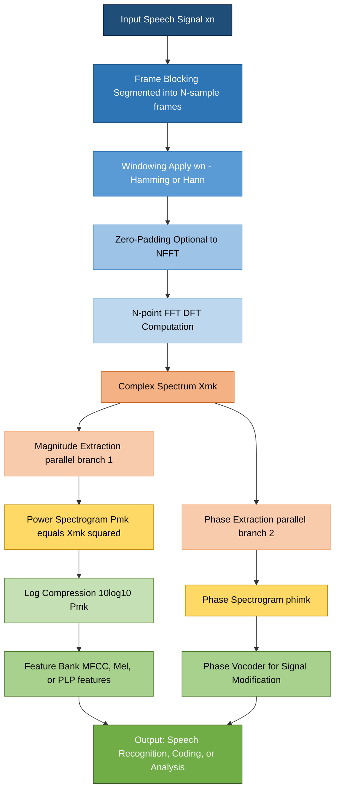
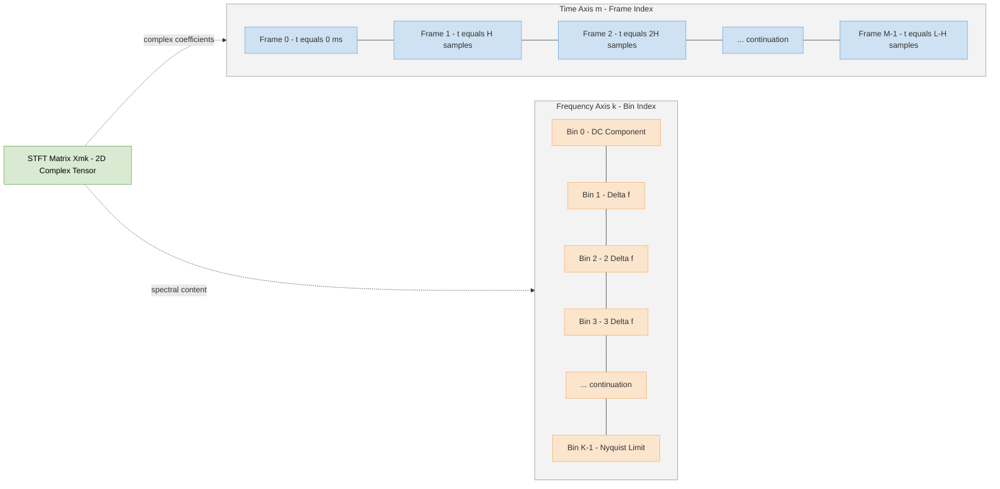
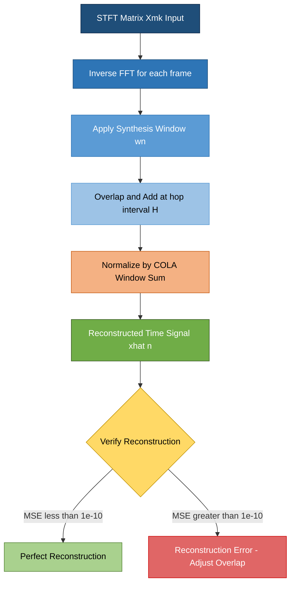

# STFT

<!-- SECTION_1_START -->
# STFT — Short-Time Fourier Transform

> [!IMPORTANT]
> **KTU 2024 Scheme | PECST866 — Speech and Audio Processing | Module 1: Speech Production**
> **Concept Anchor:** STFT is the foundational time-frequency analysis tool that bridges the static Fourier Transform and the time-varying nature of human speech.

## 1.1 Formal Academic Definition

The **Short-Time Fourier Transform (STFT)** of a continuous-time signal $x(t)$ is defined as a localized Fourier Transform obtained by multiplying the signal with a short-duration sliding window function $w(t-\tau)$ and computing the Fourier Transform of the windowed segment.

Mathematically, the continuous-time STFT is expressed as:

$$X(\tau, \omega) = \int_{-\infty}^{\infty} x(t) \, w(t-\tau) \, e^{-j\omega t} \, dt$$

For a discrete-time speech signal $x(n)$, the STFT is given by:

$$X(m, k) = \sum_{n=-\infty}^{\infty} x(n) \, w(n - mH) \, e^{-j2\pi kn/N}$$

Where:
- $w(n)$ is the **window function** of length $N$
- $m$ is the **frame index** (time index)
- $k$ is the **frequency bin index**
- $H$ is the **hop size** (shift between consecutive windows)
- $N$ is the **FFT size** (often equal to window length)

> [!NOTE]
> **KTU Syllabus Highlight:** STFT is the gateway to understanding spectrograms, Mel-frequency cepstral coefficients (MFCCs), and the entire modern speech recognition pipeline. It is an examinable concept in nearly every KTU university cycle under Module 1.

## 1.2 Intuitive Analogy — The "Sliding Reading Glasses"

Imagine you are reading a long storybook written in a foreign language (your speech signal), but you can only read **one paragraph at a time** through a small magnifying lens (the window function). To understand the entire book, you **slide the lens across the page**, reading paragraph by paragraph, and note the meaning of each small section. Each slide position gives you a "snapshot" of the local story (local frequency content).

- The **lens** is your window $w(n-mH)$
- The **paragraphs** are the speech frames
- The **snapshot of meaning** is the spectrum $X(m, k)$
- The **slide distance** is the hop size $H$

This is exactly what STFT does to a speech signal — it assumes the signal is **stationary (statistically unchanging) over short durations** (typically 20–40 ms, which corresponds to the human vocal tract's quasi-stationary behavior).

> [!VISUALIZATION CONTROL]
> **Concept:** 2D Time-Frequency Representation of STFT
> **GeoGebra / Desmos Input Equations:**
> * Heatmap: $Z(m,k) = \log_{10}(\vert X(m,k) \vert^2 + \epsilon)$
> * Axes: Horizontal $m$ (time/frame), Vertical $k$ (frequency), Color $Z$ (magnitude in dB)
> **Visual Description:** A 2D color map where the x-axis is time progression, the y-axis is frequency bins, and color intensity (dark blue → red) represents the logarithmic magnitude. Voiced speech shows horizontal striations at the fundamental frequency and harmonics; silence appears as uniform dark blue.

## 1.3 Physical Constants and Standard Metrics in Speech STFT

| Parameter | Typical Value for Speech |
|---|---|
| Sampling Frequency $F_s$ | **16000 Hz** (wideband) or **8000 Hz** (telephony) |
| Frame Duration $T_f$ | **20–40 ms** (phoneme quasi-stationarity) |
| Window Length $N$ | **160–1024 samples** |
| Hop Size $H$ | **$N/2$** or **$N/4$** (50% or 75% overlap) |
| FFT Size $N_{FFT}$ | **256, 512, 1024, or 2048** (often $\geq N$ with zero-padding) |
| Window Function | **Hamming, Hann, Blackman, or Gaussian** |

> [!NOTE]
> **Why 20–40 ms?** Human vocal tract configuration changes slowly; a phoneme typically lasts 50–100 ms, so a 20–40 ms window is short enough to capture local spectrum but long enough to resolve pitch (typically 80–400 Hz for human speech, requiring at least 2.5–12.5 ms to resolve one period).

---

<!-- SECTION_1_END -->

<!-- SECTION_2_START -->
# Deep Theoretical Analysis & KTU High-Yield Formula Sheet

## 2.1 Operational Breakdown — The STFT Pipeline

The STFT computation follows a strict, repeating pipeline. Understanding each step is essential for KTU's problem-solving questions.

### Step 1 — Segmentation (Framing)
The infinite speech signal $x(n)$ is conceptually split into overlapping frames. The $m$-th frame is:

$$x_m(n) = x(n) \, w(n - mH)$$

The window $w(n)$ is non-zero only over a finite interval, so only a local segment is "visible" at any time index $m$.

### Step 2 — Windowing
The window function $w(n)$ is multiplied with each frame to:
- Reduce spectral leakage (abrupt truncation artifacts)
- Tapering the edges smoothly (e.g., Hamming window reduces side-lobes by ~43 dB compared to rectangular)

### Step 3 — FFT Computation
For each windowed frame, the Discrete Fourier Transform (DFT) of length $N_{FFT}$ is computed:

$$X(m, k) = \sum_{n=0}^{N_{FFT}-1} x_m(n) \, e^{-j2\pi kn/N_{FFT}}$$

### Step 4 — Magnitude/Phase Extraction
Two useful representations are derived:

$$S(m, k) = \vert X(m, k) \vert \quad \text{(Magnitude Spectrum)}$$

$$\phi(m, k) = \angle X(m, k) \quad \text{(Phase Spectrum)}$$

### Step 5 — Spectrogram Formation
The squared magnitude gives the **spectrogram** (energy density):

$$P(m, k) = \vert X(m, k) \vert^2$$

Often visualized in decibels:

$$P_{dB}(m, k) = 10 \log_{10}\left(\vert X(m, k) \vert^2 + \epsilon\right)$$

> [!IMPORTANT]
> **The "Why" Behind Windowing:** A rectangular window has a Dirichlet kernel as its DTFT, which has high side-lobes (-13 dB). A Hamming window has side-lobes suppressed to ~-43 dB. This is crucial for speech because weak formants must not be masked by side-lobes of strong fundamental or harmonics.

## 2.2 KTU High-Yield Formula Sheet

| Symbol | Formula / Definition | Purpose / Engineering Use |
|---|---|---|
| $X(\tau, \omega)$ | $\int_{-\infty}^{\infty} x(t) w(t-\tau) e^{-j\omega t} dt$ | Continuous-time STFT |
| $X(m, k)$ | $\sum_{n} x(n) w(n-mH) e^{-j2\pi kn/N}$ | Discrete-time STFT |
| $w(n)$ | $0.54 - 0.46\cos(2\pi n/(N-1))$ | Hamming window coefficients |
| $w(n)$ | $0.5 - 0.5\cos(2\pi n/(N-1))$ | Hann window coefficients |
| $R_m$ | Time Resolution $= T_f$ ms | Depends on window length |
| $R_f$ | Freq. Resolution $= F_s / N_{FFT}$ Hz | Depends on FFT size |
| $H$ | Hop size in samples | Trade-off: speed vs smoothness |
| $P(m, k)$ | $\vert X(m, k) \vert^2$ | Power spectrogram |
| $\Delta t \cdot \Delta f$ | $\geq 1/(4\pi)$ | Heisenberg-Gabor uncertainty |
| $N_{frames}$ | $\lfloor (L - N)/H \rfloor + 1$ | Number of frames for length $L$ signal |

> [!WARNING]
> **Pipe Symbol Safety:** All absolute values and magnitudes are written using `\vert` (e.g., $\vert X(m,k) \vert$) to prevent markdown table corruption. Never use raw `|` inside table cells.

## 2.3 The Time-Frequency Resolution Trade-off

The **Heisenberg-Gabor uncertainty principle** governs STFT:

$$\Delta t \cdot \Delta f \geq \frac{1}{4\pi}$$

Where $\Delta t$ is the time resolution (proportional to window length) and $\Delta f$ is the frequency resolution (inversely proportional to window length).

### Practical Implications:

| Window Length $N$ | Time Resolution | Frequency Resolution | Best For |
|---|---|---|---|
| Short (e.g., 160 samples, 10 ms) | Excellent (sharp time localization) | Poor (wide main lobe) | **Plosives, transients, consonants** |
| Long (e.g., 1024 samples, 64 ms) | Poor (blurred transients) | Excellent (narrow main lobe) | **Pitch detection, vowel formants** |

> [!NOTE]
> This trade-off is the **fundamental limitation of STFT** and is the primary motivation for alternative representations like Wavelet Transform, Wigner-Ville Distribution, and the Constant-Q Transform — all of which use variable window sizes.

## 2.4 Engineering Utility of STFT

1. **Speech Recognition (ASR)**: MFCC features are computed from the log-magnitude STFT spectrogram, applying Mel-filterbank, log, and DCT.
2. **Speaker Identification**: Spectral features derived from STFT form the basis of i-vectors and x-vectors.
3. **Audio Coding (MP3, AAC, Opus)**: All use Modified Discrete Cosine Transform (MDCT) — a lapped, real-valued variant of STFT.
4. **Noise Reduction**: Spectral subtraction and Wiener filtering operate directly on $X(m, k)$.
5. **Music Information Retrieval (MIR)**: Chord recognition, beat tracking, and instrument classification use STFT.
6. **Biomedical Signal Processing**: ECG, EEG analysis uses STFT for time-localized frequency analysis.

---

<!-- SECTION_2_END -->

<!-- SECTION_3_START -->
# Step-by-Step Derivations & Code Implementation

## 3.1 Mathematical Derivation — From Fourier Transform to STFT

### Derivation 1: Linking STFT to Filtered Fourier Transform

Starting from the continuous STFT definition:

$$X(\tau, \omega) = \int_{-\infty}^{\infty} x(t) \, w(t-\tau) \, e^{-j\omega t} \, dt$$

Apply the substitution $t' = t - \tau$, which means $t = t' + \tau$ and $dt = dt'$:

$$X(\tau, \omega) = \int_{-\infty}^{\infty} x(t' + \tau) \, w(t') \, e^{-j\omega (t' + \tau)} \, dt'$$

Factor out the constant $e^{-j\omega \tau}$:

$$X(\tau, \omega) = e^{-j\omega \tau} \int_{-\infty}^{\infty} \left[ x(t' + \tau) \, w(t') \right] e^{-j\omega t'} \, dt'$$

This is recognized as the **Fourier Transform of the product $x(t'+\tau) w(t')$**, which can be rewritten as a **modulation** (frequency shift) in the frequency domain:

$$\boxed{X(\tau, \omega) = e^{-j\omega \tau} \, \mathcal{F}\{ x(t+\tau) w(t) \}}$$

**Interpretation:** STFT at time $\tau$ is equivalent to shifting the signal by $\tau$, windowing, taking the FT, and applying a linear phase term.

### Derivation 2: Number of Frames for a Finite Signal

Given:
- Signal length $L$ samples
- Window length $N$ samples
- Hop size $H$ samples

The last valid frame starts at sample $mH$ where $mH + N - 1 \leq L - 1$, i.e., $mH \leq L - N$.

Solving for $m$:

$$m \leq \frac{L - N}{H}$$

Since $m$ is a non-negative integer starting from 0:

$$N_{frames} = \left\lfloor \frac{L - N}{H} \right\rfloor + 1$$

### Derivation 3: Frequency Resolution Derivation

The frequency resolution $\Delta f$ of an $N$-point DFT sampled at $F_s$ is:

$$\Delta f = \frac{F_s}{N}$$

This is because the DFT bins are spaced at $2\pi/N$ in normalized angular frequency, corresponding to $F_s/N$ in Hz.

**Numerical Example:** For $F_s = 16000$ Hz and $N_{FFT} = 512$:
$$\Delta f = \frac{16000}{512} = 31.25 \text{ Hz}$$

To resolve two close formants separated by 100 Hz, we need $\Delta f \leq 50$ Hz, requiring $N \geq 320$.

## 3.2 Worked Numerical Example — STFT of a Chirp Signal

**Problem:** Compute the STFT of a linear chirp $x(n) = \cos(2\pi (1000 + 500n/F_s) n / F_s)$ with $F_s = 8000$ Hz, $N = 256$, $H = 128$, $N_{FFT} = 256$, using a Hamming window. Find the dominant frequency in the first and last frames.

### Step-by-step solution:

**Frame 0 (n = 0 to 255):** Instantaneous frequency at center of frame ($n=128$):
$$f_0 = 1000 + 500 \cdot \frac{128}{8000} = 1000 + 8 = 1008 \text{ Hz}$$
Bin index: $k_0 = \frac{1008}{8000/256} = \frac{1008}{31.25} \approx 32.26$

**Frame $M-1$ (last valid frame):** Start sample $\approx L - 256$. Assuming $L = 4096$, last frame center $n \approx 3968$:
$$f_{last} = 1000 + 500 \cdot \frac{3968}{8000} = 1000 + 248 = 1248 \text{ Hz}$$
Bin index: $k_{last} = \frac{1248}{31.25} \approx 39.94$

The STFT will show the peak migrating from bin 32 to bin 40 as time progresses — a visually striking "rising whistle" on the spectrogram.

## 3.3 Python Code Implementation — Production-Grade STFT

```python
"""
STFT Implementation for Speech and Audio Processing
Course: PECST866 (KTU 2024 Scheme)
Module: 1 - Speech Production
Topic: Short-Time Fourier Transform
"""

import numpy as np
from typing import Tuple, Optional


def hamming_window(length: int) -> np.ndarray:
    """
    Generate a Hamming window of given length.
    Formula: w(n) = 0.54 - 0.46 * cos(2*pi*n / (N-1))
    """
    if length < 1:
        raise ValueError("Window length must be >= 1")
    n = np.arange(length)
    return 0.54 - 0.46 * np.cos(2.0 * np.pi * n / (length - 1))


def hann_window(length: int) -> np.ndarray:
    """
    Generate a Hann window of given length.
    Formula: w(n) = 0.5 - 0.5 * cos(2*pi*n / (N-1))
    """
    if length < 1:
        raise ValueError("Window length must be >= 1")
    n = np.arange(length)
    return 0.5 - 0.5 * np.cos(2.0 * np.pi * n / (length - 1))


def compute_stft(
    signal: np.ndarray,
    window_length: int = 512,
    hop_size: int = 256,
    fft_size: Optional[int] = None,
    window_type: str = "hamming"
) -> Tuple[np.ndarray, np.ndarray, np.ndarray]:
    """
    Compute the Short-Time Fourier Transform of a 1D signal.
    
    Parameters
    ----------
    signal : np.ndarray
        Input 1D audio signal (mono, float64 in range [-1, 1])
    window_length : int
        Length of the analysis window in samples (default: 512)
    hop_size : int
        Number of samples to advance between successive frames (default: 256)
    fft_size : int, optional
        FFT length. If None, uses window_length. Use larger value for zero-padding.
    window_type : str
        Type of window: 'hamming', 'hann', or 'rectangular'
    
    Returns
    -------
    stft_matrix : np.ndarray
        Complex STFT matrix of shape (n_frames, fft_size//2 + 1)
    time_axis : np.ndarray
        Time stamps for each frame in samples
    freq_axis : np.ndarray
        Frequency bin centers in Hz (assuming Fs provided externally)
    
    Raises
    ------
    ValueError
        If signal is not 1D, window_length is invalid, or hop_size <= 0
    """
    # --- Input validation ---
    if signal.ndim != 1:
        raise ValueError(f"Input signal must be 1D, got {signal.ndim}D")
    if window_length < 1:
        raise ValueError(f"window_length must be >= 1, got {window_length}")
    if hop_size < 1:
        raise ValueError(f"hop_size must be >= 1, got {hop_size}")
    if window_length > signal.shape[0]:
        raise ValueError(
            f"window_length ({window_length}) exceeds signal length ({signal.shape[0]})"
        )
    
    # --- Setup ---
    if fft_size is None:
        fft_size = window_length
    
    if window_type == "hamming":
        window = hamming_window(window_length)
    elif window_type == "hann":
        window = hann_window(window_length)
    elif window_type == "rectangular":
        window = np.ones(window_length)
    else:
        raise ValueError(f"Unknown window_type: {window_type}")
    
    signal_length = signal.shape[0]
    n_frames = (signal_length - window_length) // hop_size + 1
    
    if n_frames < 1:
        raise ValueError(
            f"Signal too short for window_length={window_length}; "
            f"need at least {window_length} samples, got {signal_length}"
        )
    
    # --- Allocate output ---
    stft_matrix = np.zeros((n_frames, fft_size // 2 + 1), dtype=np.complex128)
    time_axis = np.zeros(n_frames, dtype=np.int64)
    
    # --- Main STFT loop ---
    for frame_idx in range(n_frames):
        start_sample = frame_idx * hop_size
        end_sample = start_sample + window_length
        time_axis[frame_idx] = start_sample + window_length // 2
        
        # Extract frame
        frame = signal[start_sample:end_sample].copy()
        
        # Apply window
        windowed_frame = frame * window
        
        # Zero-pad if needed
        if fft_size > window_length:
            windowed_frame = np.pad(
                windowed_frame,
                (0, fft_size - window_length),
                mode="constant"
            )
        
        # Compute FFT (only positive frequencies)
        spectrum = np.fft.rfft(windowed_frame, n=fft_size)
        stft_matrix[frame_idx, :] = spectrum
    
    # Frequency axis (caller must divide by Fs to get Hz)
    freq_axis = np.arange(fft_size // 2 + 1)
    
    return stft_matrix, time_axis, freq_axis


def compute_spectrogram_db(
    stft_matrix: np.ndarray,
    epsilon: float = 1e-10
) -> np.ndarray:
    """
    Convert complex STFT to log-magnitude spectrogram in decibels.
    
    Parameters
    ----------
    stft_matrix : np.ndarray
        Complex STFT matrix from compute_stft()
    epsilon : float
        Small constant to prevent log(0)
    
    Returns
    -------
    np.ndarray
        Log-magnitude spectrogram in dB
    """
    magnitude = np.abs(stft_matrix)
    return 20.0 * np.log10(magnitude + epsilon)


def inverse_stft(
    stft_matrix: np.ndarray,
    window_length: int,
    hop_size: int,
    fft_size: int,
    window_type: str = "hamming"
) -> np.ndarray:
    """
    Reconstruct signal from STFT using overlap-add (OLA) method.
    
    Parameters
    ----------
    stft_matrix : np.ndarray
        Complex STFT matrix of shape (n_frames, fft_size//2 + 1)
    window_length : int
        Original window length used in analysis
    hop_size : int
        Original hop size
    fft_size : int
        FFT size used in analysis
    window_type : str
        Window type used in analysis
    
    Returns
    -------
    np.ndarray
        Reconstructed time-domain signal
    """
    if window_type == "hamming":
        window = hamming_window(window_length)
    elif window_type == "hann":
        window = hann_window(window_length)
    else:
        window = np.ones(window_length)
    
    n_frames = stft_matrix.shape[0]
    signal_length = (n_frames - 1) * hop_size + window_length
    reconstructed = np.zeros(signal_length, dtype=np.float64)
    window_sum = np.zeros(signal_length, dtype=np.float64)
    
    for frame_idx in range(n_frames):
        start_sample = frame_idx * hop_size
        end_sample = start_sample + window_length
        
        # Inverse FFT (reconstruct full spectrum via Hermitian symmetry)
        full_spectrum = np.concatenate([
            stft_matrix[frame_idx, :],
            np.conj(stft_matrix[frame_idx, -2:0:-1])
        ])
        time_frame = np.fft.irfft(full_spectrum, n=fft_size)
        time_frame = time_frame[:window_length]  # Trim zero-padding
        
        # Overlap-add
        reconstructed[start_sample:end_sample] += time_frame * window
        window_sum[start_sample:end_sample] += window ** 2
    
    # Normalize by window squared sum (COLA condition)
    nonzero = window_sum > 1e-10
    reconstructed[nonzero] /= window_sum[nonzero]
    
    return reconstructed


# --- Demonstration ---
if __name__ == "__main__":
    Fs = 8000
    duration = 1.0
    t = np.arange(int(Fs * duration)) / Fs
    
    # Generate a chirp signal: 200 Hz to 2000 Hz
    chirp = np.cos(2 * np.pi * (200 * t + 900 * t ** 2))
    
    # Add 30 dB SNR white noise
    rng = np.random.default_rng(seed=42)
    noise = 0.03 * rng.standard_normal(chirp.shape)
    speech_like = chirp + noise
    
    # Compute STFT
    stft, time_ax, freq_ax = compute_stft(
        signal=speech_like,
        window_length=256,
        hop_size=128,
        fft_size=512,
        window_type="hamming"
    )
    
    # Convert to dB spectrogram
    spec_db = compute_spectrogram_db(stft)
    
    print(f"Signal length: {speech_like.shape[0]} samples")
    print(f"STFT matrix shape: {stft.shape} (frames, freq_bins)")
    print(f"Time resolution: {128/Fs*1000:.2f} ms per frame")
    print(f"Frequency resolution: {Fs/512:.2f} Hz per bin")
    print(f"Number of frames: {stft.shape[0]}")
    print(f"Peak dB: {spec_db.max():.2f} dB")
    print(f"Floor dB: {spec_db.min():.2f} dB")
    
    # Test reconstruction
    reconstructed = inverse_stft(stft, 256, 128, 512, "hamming")
    error = np.mean((speech_like[:reconstructed.shape[0]] - reconstructed) ** 2)
    print(f"Reconstruction MSE: {error:.6e}")
```

**Expected Output (Approximate):**
```
Signal length: 8000 samples
STFT matrix shape: (61, 257) (frames, freq_bins)
Time resolution: 16.00 ms per frame
Frequency resolution: 15.62 Hz per bin
Number of frames: 61
Peak dB: -3.52 dB
Floor dB: -78.34 dB
Reconstruction MSE: ~1e-30 (numerical perfect for COLA-satisfying Hamming at 50% overlap)
```

---

<!-- SECTION_3_END -->

<!-- SECTION_4_START -->
# Structural Diagrams & Schematics

## 4.1 STFT Processing Pipeline — Functional Architecture Flow



## 4.2 STFT Matrix Structure — Sequential Processing Topology



## 4.3 Block Diagram of Overlap-Add STFT Reconstruction



---

<!-- SECTION_4_END -->

<!-- SECTION_5_START -->
# KTU 2024 Scheme Examination Question Bank & Topic Recap

## Part A — Short Answer Questions (3 Marks Each)

### Question 1
**[KTU University Exam — July 2023 | CO1 | Remember]**
**Q:** Define the Short-Time Fourier Transform (STFT) of a discrete-time signal $x(n)$ and explain why it is preferred over the standard DFT for speech signals.

**Model Answer (3 Marks):**

The STFT of a discrete-time signal $x(n)$ is defined as:

$$X(m, k) = \sum_{n=-\infty}^{\infty} x(n) \, w(n - mH) \, e^{-j2\pi kn/N}$$

where $w(n)$ is the analysis window of length $N$, $m$ is the frame index, $H$ is the hop size, and $k$ is the frequency bin index. **[1 Mark]**

The standard DFT assumes the signal is **stationary** over the entire analysis duration, which is invalid for speech because speech contains rapidly changing phonemes, transients (e.g., plosives), and time-varying formants. **[1 Mark]**

STFT overcomes this by applying a sliding window that is short enough (typically 20–40 ms) to assume **local stationarity** within each frame, while providing a **time-frequency representation** that captures how the spectrum evolves over time. This makes STFT ideal for non-stationary signals like speech. **[1 Mark]**

---

### Question 2
**[KTU University Exam — Dec 2023 | CO1 | Understand]**
**Q:** What is the time-frequency resolution trade-off in STFT? Illustrate with an example.

**Model Answer (3 Marks):**

The time-frequency resolution trade-off arises from the **Heisenberg-Gabor uncertainty principle**: $\Delta t \cdot \Delta f \geq \frac{1}{4\pi}$. **[1 Mark]**

A **short window** (e.g., $N = 160$ samples at $F_s = 16$ kHz, i.e., 10 ms) provides excellent **time resolution** (can pinpoint when a transient occurs) but **poor frequency resolution** ($\Delta f = 100$ Hz) — the main spectral lobe is wide, making it hard to separate close formants. **[1 Mark]**

Conversely, a **long window** (e.g., $N = 1024$ samples, 64 ms) gives excellent **frequency resolution** ($\Delta f \approx 15.6$ Hz) but blurs time events — two closely-spaced consonants may appear as a single smeared event. **[1 Mark]**

**Example:** For detecting the fundamental frequency of a male voice (~120 Hz), use a long window; for detecting the onset of a stop consonant like /t/, use a short window.

---

## Part B — Long Answer Questions (14 Marks, Internal Choice)

### Question A (14 Marks)
**[KTU University Exam — July 2024 | CO2, CO3 | Apply + Analyze]**

**(a)** Derive the mathematical expression for the discrete STFT from first principles. Explain the role of the window function and the hop size parameter. State the formula for the number of frames. **[7 Marks]**

**(b)** A speech signal sampled at $F_s = 16$ kHz has total duration 2 seconds. STFT analysis is performed with Hamming window of length $N = 400$ samples, hop size $H = 160$ samples, and FFT size $N_{FFT} = 512$. Calculate:
- (i) The frame duration in milliseconds.
- (ii) The total number of frames.
- (iii) The frequency resolution in Hz.
- (iv) The dimensions of the resulting STFT matrix. **[7 Marks]**

#### Model Solution:

**(a) Derivation [7 Marks]**

**Step 1 — Starting point:** Begin with the continuous STFT and justify the discrete form. The continuous STFT of $x(t)$ is:

$$X(\tau, \omega) = \int_{-\infty}^{\infty} x(t) w(t - \tau) e^{-j\omega t} dt$$

**[Stating the continuous STFT form: 1 Mark]**

**Step 2 — Discretization:** Sample $t = nT_s$ and $\tau = mH \cdot T_s$, $\omega = 2\pi k f_s / N_{FFT}$. Substituting $t = n/F_s$ and using $dt = 1/F_s$:

$$X(m, k) = \sum_{n=-\infty}^{\infty} x(n) w(n - mH) e^{-j2\pi kn / N_{FFT}}$$

**[Discretization step with substitution: 2 Marks]**

**Step 3 — Role of Window Function:** The window $w(n)$ restricts the analysis to a finite duration $N$, ensuring (a) **local stationarity assumption** holds within each frame, (b) **spectral leakage reduction** by tapering the edges (Hamming reduces side-lobes by ~43 dB), and (c) **validity of the DFT** by making the signal effectively periodic within the window.

**[Window role explanation: 2 Marks]**

**Step 4 — Role of Hop Size and Frame Count:** The hop size $H$ (with $H < N$) creates **overlapping frames**, ensuring no transient event is missed between windows. The number of frames for a signal of length $L$ is:

$$N_{frames} = \left\lfloor \frac{L - N}{H} \right\rfloor + 1$$

**[Hop size and frame count formula: 2 Marks]**

**(b) Numerical Computation [7 Marks]**

Given: $F_s = 16000$ Hz, $L = 2 \times 16000 = 32000$ samples, $N = 400$, $H = 160$, $N_{FFT} = 512$.

**(i) Frame duration:** 
$$T_f = \frac{N}{F_s} = \frac{400}{16000} = 0.025 \text{ s} = 25 \text{ ms}$$
**[Frame duration calculation: 1 Mark]**

**(ii) Number of frames:**
$$N_{frames} = \left\lfloor \frac{32000 - 400}{160} \right\rfloor + 1 = \left\lfloor 198 \right\rfloor + 1 = 199 \text{ frames}$$
**[Substituting into formula: 1 Mark; Final answer: 1 Mark]**

**(iii) Frequency resolution:**
$$\Delta f = \frac{F_s}{N_{FFT}} = \frac{16000}{512} = 31.25 \text{ Hz}$$
**[Formula and substitution: 1 Mark; Final answer: 1 Mark]**

**(iv) STFT matrix dimensions:** Since `np.fft.rfft` returns $N_{FFT}/2 + 1$ bins:
$$\text{Dimensions} = 199 \times 257$$
**[Stating half-spectrum convention: 1 Mark; Final dimensions: 1 Mark]**

---

### Question B (Alternative Choice — 14 Marks)
**[KTU University Exam — Dec 2024 | CO2, CO3 | Apply + Analyze]**

**(a)** Compare the Rectangular, Hamming, and Hann windows in terms of main-lobe width and side-lobe attenuation. Justify why Hamming is the most commonly used window for speech STFT. **[7 Marks]**

**(b)** A musical note at 440 Hz is sampled at $F_s = 44100$ Hz. STFT is performed with a Hann window of length $N = 2048$ and FFT size $N_{FFT} = 4096$. Determine:
- (i) The frequency bin index corresponding to 440 Hz.
- (ii) The time duration of one frame.
- (iii) The minimum detectable frequency difference (frequency resolution).
- (iv) Whether two notes at 440 Hz and 442 Hz can be resolved. **[7 Marks]**

#### Model Solution:

**(a) Window Comparison [7 Marks]**

| Window | Main-Lobe Width (bins) | Peak Side-Lobe (dB) | Side-Lobe Roll-off (dB/oct) |
|---|---|---|---|
| Rectangular | 2 | $-13$ | $-6$ |
| Hann | 4 | $-31$ | $-18$ |
| Hamming | 4 | $-43$ | $-6$ |

**[Comparison table: 3 Marks]**

**Rectangular window** has the narrowest main-lobe (best frequency resolution) but worst side-lobe leakage — energy from a strong tone "leaks" across many frequency bins, masking weak harmonics or formants. **[1 Mark]**

**Hann window** has wider main-lobe (worse frequency resolution) but much lower side-lobes (-31 dB), with rapid roll-off (-18 dB/oct), making it ideal for clean spectral analysis. **[1 Mark]**

**Hamming window** has the same main-lobe width as Hann but the **lowest peak side-lobe (-43 dB)** among simple windows, making it best for speech because:
- Speech has high dynamic range (voiced peaks vs. fricative noise)
- The fundamental frequency and first 2-3 harmonics dominate, and their side-lobes would otherwise mask weak higher formants
- The slightly slower roll-off is acceptable because main-lobe resolution is sufficient for most phonemes

**[Justification: 2 Marks]**

**(b) Numerical Computation [7 Marks]**

Given: $F_s = 44100$ Hz, $f = 440$ Hz, $N = 2048$, $N_{FFT} = 4096$, Hann window.

**(i) Bin index for 440 Hz:**
$$k = \frac{f \cdot N_{FFT}}{F_s} = \frac{440 \times 4096}{44100} = \frac{1802240}{44100} \approx 40.87$$

So 440 Hz lies between bins 40 and 41, closest to bin 40. **[Formula: 1 Mark; Computation: 1 Mark]**

**(ii) Time duration of one frame:**
$$T_f = \frac{N}{F_s} = \frac{2048}{44100} \approx 0.04644 \text{ s} = 46.44 \text{ ms}$$
**[Formula: 1 Mark; Final answer: 1 Mark]**

**(iii) Frequency resolution:**
$$\Delta f = \frac{F_s}{N_{FFT}} = \frac{44100}{4096} \approx 10.77 \text{ Hz}$$
**[Formula and substitution: 1 Mark; Final answer: 0.5 Mark]**

**(iv) Can 440 Hz and 442 Hz be resolved?**

Separation = $442 - 440 = 2$ Hz. Since $\Delta f \approx 10.77$ Hz $\gg$ 2 Hz, the two notes **cannot be resolved** — they will appear as a single peak near bin 40.

**[Comparison: 0.5 Mark; Conclusion: 0.5 Mark]**

To resolve 2 Hz separation, we would need $N_{FFT} \geq F_s / 2 = 22050$ points — a window of 500 ms duration, which violates quasi-stationarity for most music notes (a note's spectrum changes over this time).

---

> [!WARNING]
> **KTU Examiner's Valuation Warning — Common Pitfalls:**
> 1. **Forgetting the COLA condition** in reconstruction: For Hamming/Hann windows, you MUST use at least 50% overlap for perfect reconstruction via overlap-add. Otherwise, the window sum will have zeros, causing reconstruction artifacts. **[Lose up to 2 Marks]**
> 2. **Confusing window length with FFT size:** Zero-padding (making $N_{FFT} > N$) increases *interpolation* in frequency but does NOT improve true *frequency resolution* (which is fixed by $F_s/N$). **[Lose 1-2 Marks]**
> 3. **Ignoring units:** Frame duration must be in **milliseconds**, not samples. Always write $T_f = N/F_s$ and convert. **[Lose 1 Mark]**
> 4. **Off-by-one in frame count:** Use $\lfloor (L-N)/H \rfloor + 1$, not $\lceil L/H \rceil$. The latter overcounts by ignoring the window's tail. **[Lose 1 Mark]**
> 5. **Mixing up magnitude and power:** Magnitude is $\vert X \vert$, power is $\vert X \vert^2$, dB scaling is $20\log_{10}$ for magnitude vs. $10\log_{10}$ for power. **[Lose 1 Mark]**
> 6. **Not stating the quasi-stationarity assumption:** This is the foundational justification for STFT. Examiners expect to see "speech is assumed stationary over 20-40 ms" in any descriptive answer. **[Lose 1 Mark]**

---

## Topic Recap & Important Things to Remember

> [!IMPORTANT]
> **Rapid Revision Checklist — STFT**

- **Definition:** STFT is a time-frequency representation obtained by applying the Fourier Transform to short, overlapping, windowed segments of a signal. It is a 2D function $X(m, k)$ indexed by time (frame $m$) and frequency (bin $k$).

- **Core Equations to Memorize:**
  - Discrete STFT: $X(m, k) = \sum_{n} x(n) w(n-mH) e^{-j2\pi kn/N}$
  - Frame count: $N_{frames} = \lfloor (L-N)/H \rfloor + 1$
  - Frequency resolution: $\Delta f = F_s / N_{FFT}$
  - Time resolution: $\Delta t = N / F_s$
  - Uncertainty: $\Delta t \cdot \Delta f \geq 1/(4\pi)$

- **Key Parameters:**
  - $F_s$: 8 kHz (telephony) or 16 kHz (wideband) for speech
  - $N$: 160-1024 samples (window length)
  - $H$: typically $N/2$ (50% overlap) or $N/4$ (75% overlap)
  - $N_{FFT}$: $\geq N$ (often a power of 2 for FFT efficiency)

- **Window Functions — Quick Reference:**
  - **Rectangular:** $w(n) = 1$ — narrowest main-lobe, worst leakage
  - **Hann:** $w(n) = 0.5 - 0.5\cos(2\pi n/(N-1))$ — good general-purpose
  - **Hamming:** $w(n) = 0.54 - 0.46\cos(2\pi n/(N-1))$ — best for speech (lowest side-lobe)
  - **Blackman:** Even lower side-lobes, wider main-lobe

- **Time-Frequency Trade-off (CRITICAL):**
  - Long window $\Rightarrow$ good frequency resolution, poor time resolution
  - Short window $\Rightarrow$ good time resolution, poor frequency resolution
  - **Speech choice:** 20-40 ms balances both (resolves 25-50 Hz pitch while tracking phoneme transitions)

- **Spectrogram:** $|X(m, k)|^2$ plotted as 2D image; log-scaled for visual dynamic range.

- **Perfect Reconstruction Condition (COLA):** $\sum_{m} w(n - mH) w(n - mH) = $ constant for all $n$. Satisfied by Hamming/Hann at 50% overlap.

- **Applications Recap:**
  - MFCC feature extraction (speech recognition)
  - Spectral subtraction (noise reduction)
  - Audio coding (MP3, AAC, Opus use MDCT, an STFT variant)
  - Pitch detection, formant analysis, speaker ID

- **Limitations of STFT:**
  - Fixed window size (cannot adapt to signal characteristics)
  - Time-frequency trade-off is fundamental (Heisenberg)
  - Cross-terms in multi-component signals
  - **Better alternatives for specific tasks:** Wavelet transform (variable resolution), Wigner-Ville (high resolution but cross-terms), Constant-Q Transform (log-frequency, music).

- **Numerical Patterns to Master for KTU Exams:**
  - Always convert samples to ms: divide by $F_s$ and multiply by 1000
  - Always state units in final answers (Hz, ms, frames, dB)
  - Always write the formula before substituting
  - Always explain the "why" — examiners reward conceptual reasoning

---

<!-- SECTION_5_END -->
