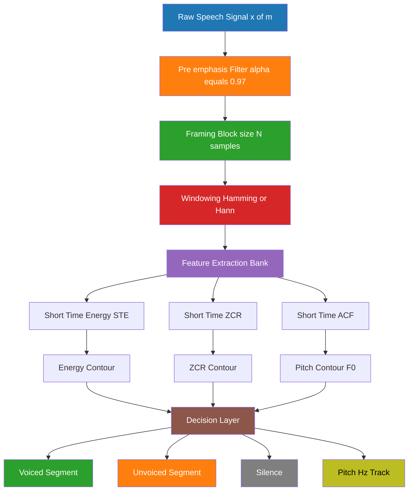
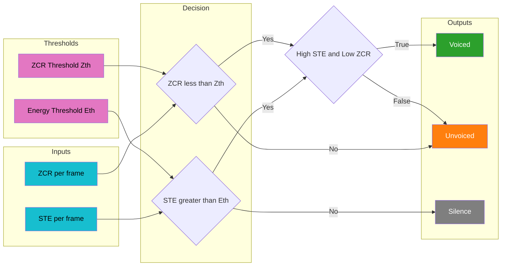
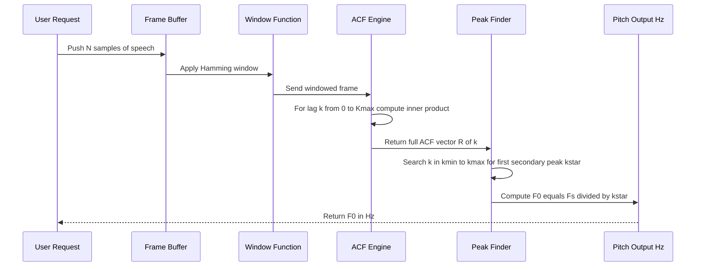

# Time domain parameters (Short time energy, short time zero crossing Rate, ACF)

<!-- SECTION_1_START -->
# Module 1: Speech Production — Time Domain Parameters

## 1. Core Technical Definition & Intuitive Overview

> [!IMPORTANT]
> **KTU 2024 Syllabus Anchor (PECST866 / Module 1):** Time domain parameters of speech — *Short Time Energy (STE)*, *Short Time Zero Crossing Rate (ZCR)*, and *Autocorrelation Function (ACF)* — are the foundational short-term analysis tools used to characterize the time-varying properties of a non-stationary speech signal.

### 1.1 Why We Need "Short-Time" Analysis

A raw speech signal is **non-stationary** — its statistical properties (amplitude, frequency, pitch) change continuously as a person speaks different phonemes. The vocal tract configuration, the excitation source, and the articulation all evolve over time (typically every 10–30 ms, a duration known as the **quasi-stationary interval**). Therefore, classical Fourier analysis (which assumes stationarity) cannot be applied directly to the whole utterance.

**Intuitive Analogy — The Slide Viewer:**

Imagine a long photograph of a moving train. If you take a single, full-picture Fourier analysis, you get a blurred, meaningless spectrum — because the train was at different positions in every part of the frame. However, if you place a *small rectangular window* (a "viewing slit") and slide it across the photo, **frame by frame**, you can study the local content. Each window gives you a *local snapshot*. The width of the slit is your **frame size N** (typically 10–30 ms), and the shift between successive frames is the **hop size**.

> [!NOTE]
> **Formal Definition — Quasi-Stationarity:** Speech signal properties can be treated as stationary over short intervals of **10–30 ms** (approximately one pitch period of the human voice). This empirical finding (Fant, 1960) is the *axiom* of all short-time speech analysis.

### 1.2 Short Time Energy (STE)

> [!IMPORTANT]
> **Formal Definition:** *Short Time Energy* of a discrete-time speech signal $x(m)$ at sample index $n$, using a window $w(n)$ of length $N$, is defined as the sum of squared signal amplitudes within the windowed frame.
>
> $$E_n = \sum_{m=-\infty}^{\infty} [x(m) \, w(n-m)]^2 = \sum_{m=n-N+1}^{n} x^2(m)$$

**Intuitive Analogy — The Volume Meter on a Microphone:**

Think of STE as a *slow-responding VU meter* on a mixing console. When a singer sustains a vowel like `/a:/`, the meter needle swings hard to the right (high energy). When the singer whispers a fricative like `/s/`, the needle barely twitches (low energy). The window length is essentially the *time-constant* of that meter.

- **Voiced segments** (vowels, nasals): STE is **high** (large amplitude vibration of vocal folds).
- **Unvoiced segments** (fricatives, silences): STE is **low** (turbulent airflow, no periodic excitation).
- **Key application:** End-point detection (voice activity detection — VAD), voiced/unvoiced/silence classification.

### 1.3 Short Time Zero Crossing Rate (ZCR)

> [!IMPORTANT]
> **Formal Definition:** *Zero Crossing Rate* is the number of times the speech signal waveform *crosses the zero amplitude axis* per unit time (or per frame).
>
> $$Z_n = \frac{1}{2N} \sum_{m=n-N+1}^{n} \left\vert \operatorname{sgn}[x(m)] - \operatorname{sgn}[x(m-1)] \right\vert$$
>
> where $\operatorname{sgn}[x(m)] = \begin{cases} 1, & x(m) \geq 0 \\ -1, & x(m) < 0 \end{cases}$

**Intuitive Analogy — The Slinky Spring:**

A *voiced sound* (a low-pitched hum) is like a slow, lazy Slinky — the spring coils rarely cross the centerline; the wave is gentle, so zero crossings are few. An *unvoiced fricative* (like the sharp `/s/`) is like violently shaking the Slinky at high frequency — the coils whip back and forth across the centerline dozens of times per second. ZCR simply *counts* those centerline crossings.

- **Unvoiced / fricatives:** ZCR is **high** (high-frequency noise-like turbulence).
- **Voiced sounds / vowels:** ZCR is **low** (low-frequency quasi-periodic vibration).

> [!TIP]
> **Engineering Hack — Combined STE + ZCR Decision Rule:** A simple yet effective Voiced/Unvoiced classifier in production speech systems uses a 2-D plane: *High STE + Low ZCR ⇒ Voiced*, *Low STE + High ZCR ⇒ Unvoiced*, *Low STE + Low ZCR ⇒ Silence*.

### 1.4 Autocorrelation Function (ACF)

> [!IMPORTANT]
> **Formal Definition:** *Short-Time Autocorrelation Function* $R_n(k)$ at lag $k$ and time index $n$ measures the similarity between the signal and a delayed copy of itself within a windowed frame.
>
> $$R_n(k) = \sum_{m=-\infty}^{\infty} x(m) \, w(n-m) \, x(m+k) \, w(n-m-k)$$

**Intuitive Analogy — The Echo Probe:**

Stand in a canyon and shout *"Hello!"*. After ~0.5 s, the canyon returns the echo. The *correlation* between your shout and the echo is high if the period of repetition matches the canyon delay. ACF works identically — it slides a copy of the waveform past itself and measures the *overlap* at every possible delay (lag $k$).

- **Lag $k = 0$:** Perfect overlap ⇒ $R_n(0) = E_n$ (the energy!).
- **Lag $k = T_0$ (pitch period):** A voiced frame aligns with its own delayed version ⇒ a strong **secondary peak** appears.
- **Lag $k \to \infty$:** For random/noise, $R_n(k) \to 0$.

**Why this matters:** The location of the *first secondary peak* of $R_n(k)$ directly gives the **pitch period** $T_0$ of voiced speech. This is the classical, computationally cheap method for **pitch (F0) estimation**.

> [!VISUALIZATION CONTROL]
> **Concept:** A windowed speech frame $x(m)w(n-m)$ plotted alongside its delayed self $x(m+k)w(n-m-k)$ for varying lag $k$.
> **GeoGebra / Desmos Input Equations:**
> * `f(x) = sin(2*pi*120*x) * exp(-0.5*(x-30)^2)` (windowed voiced frame, F0 = 120 Hz, N = 60 ms)
> * `g(x) = f(x - 8)` (delayed by 8 samples)
> **Visual Description:** The student should observe two identical wave packets separated horizontally. At the correct lag matching the period, the two packets *align perfectly*, producing a maximum in the autocorrelation plot. Misalignment produces near-zero correlation.

### 1.5 The Three Pillars — At a Glance

| Parameter | What it Measures | Voiced | Unvoiced | Silence | Primary Use |
|---|---|---|---|---|---|
| **STE** | Signal power/energy in the frame | **High** | Low | Very Low | VAD, amplitude envelope |
| **ZCR** | Rate of zero axis crossings | **Low** | High | Low | V/UV classification, fricative detection |
| **ACF** | Self-similarity at various lags | **Periodic peaks** | Flat / noise-like | Flat | Pitch estimation, periodicity detection |

> [!NOTE]
> **Physical Constants & Standard Metrics (must memorize):**
> * **Frame length N:** typically **20–30 ms** ($\approx 160$–$240$ samples at 8 kHz; $400$–$480$ samples at 16 kHz).
> * **Hop size / shift:** typically **10 ms** (50% overlap with a 20 ms window).
> * **Sampling rate $F_s$:** **8 kHz** (telephony) or **16 kHz** (wideband / VoIP).
> * **Typical F0 (pitch) range:** **80–300 Hz** for adult human voice.
> * **Hamming / Hann window** is preferred over rectangular to reduce spectral leakage at frame boundaries.

<!-- SECTION_1_END -->

<!-- SECTION_2_START -->
# 2. Deep Theoretical Analysis & KTU High-Yield Formula Sheet

## 2.1 Short Time Energy (STE) — Operational Breakdown

The computation proceeds as follows:

1. **Pre-emphasis:** Apply a first-order high-pass filter $H(z) = 1 - \alpha z^{-1}$ with $\alpha \in [0.95, 0.97]$ to spectrally flatten the signal (boost high frequencies attenuated during speech production).
2. **Framing:** Segment the pre-emphasized signal $x(m)$ into overlapping frames of length $N$ samples.
3. **Windowing:** Multiply each frame by a tapering window $w(m)$ (Hamming/Hann) to attenuate edge discontinuities.
4. **Squaring & Summation:** Compute $E_n = \sum_{m=0}^{N-1} x_w^2(m)$ for the $n$-th frame.
5. **Normalization (optional):** Divide by $N$ to get average energy per sample.

**Why squaring?**
- Squaring makes the contribution of every sample **non-negative** (so they do not cancel).
- It amplifies the influence of large amplitude peaks (vowels), emphasizing loud regions.
- It is the discrete-time equivalent of instantaneous power.

**The "Why" — Physical Interpretation:**

Energy in acoustics is the *work done by the sound pressure wave* on the eardrum. In digital signal processing, since we only have amplitude samples, energy is approximated by the *sum of squared amplitudes* — analogous to the continuous-time integral $\int p^2(t) \, dt$ over a short interval.

## 2.2 Short Time Zero Crossing Rate (ZCR) — Operational Breakdown

1. **Sign extraction:** Compute $\operatorname{sgn}[x(m)]$ for every sample.
2. **Difference:** Subtract consecutive sign values: $\operatorname{sgn}[x(m)] - \operatorname{sgn}[x(m-1)]$.
3. **Absolute value & indicator:** $\left\vert \operatorname{sgn}[x(m)] - \operatorname{sgn}[x(m-1)] \right\vert$ yields **1** at every zero crossing, **0** elsewhere.
4. **Sum & Normalize:** Divide by $2N$ so that the maximum possible ZCR (alternating $+1, -1, +1, -1, \dots$) equals 1.0.

**The "Why" — Information Theoretic View:**

ZCR is a *very crude estimator of spectral centroid*. A high ZCR signals the dominance of high-frequency energy. Voiced sounds concentrate energy in the low-frequency harmonics of the fundamental; hence few zero crossings. Unvoiced fricatives have broadband, noise-like spectra with substantial high-frequency content; hence many zero crossings.

**ZCR variants in production systems:**

- **Clipped autocorrelation of ZCR:** Used in *endpoint detection* on noisy telephone lines (Rabiner & Sambur, 1975).
- **Sub-band ZCR:** The signal is passed through bandpass filters, and ZCR is computed per band — used in MP3 / AAC encoders for perceptual bit allocation.

## 2.3 Autocorrelation Function (ACF) — Operational Breakdown

For a windowed frame $y_n(m) = x(m) w(n-m)$ of length $N$, the ACF at lag $k$ is:

$$R_n(k) = \sum_{m=0}^{N-1-k} y_n(m) \, y_n(m+k), \quad 0 \leq k \leq K_{max}$$

**Properties (must know for KTU):**

| Property | Mathematical Statement | Physical Meaning |
|---|---|---|
| **Symmetry** | $R_n(k) = R_n(-k)$ | ACF is an even function of lag |
| **Maximum at origin** | $\vert R_n(k) \vert \leq R_n(0)$ for all $k$ | Perfect self-match at zero lag |
| **Energy at origin** | $R_n(0) = E_n$ (short-time energy) | Origin equals total frame energy |
| **Periodicity** | If $x$ is periodic with period $T_0$, $R_n(T_0)$ is a strong local maximum | The basis of pitch detection |
| **Decay** | For random noise, $R_n(k) \to 0$ as $k \to \infty$ | No self-similarity beyond noise correlation |

**Pitch Estimation Algorithm using ACF:**

1. Pre-emphasize, frame, and window the signal.
2. For each voiced frame candidate, compute $R_n(k)$ for $k \in [k_{min}, k_{max}]$ where $k_{min} = F_s / F_0^{max}$ and $k_{max} = F_s / F_0^{min}$.
3. Locate the **first secondary peak** $k^* = \arg\max_{k \neq 0} R_n(k)$.
4. Pitch $F_0 = F_s / k^*$.

**The "Why" — Why Peak-Picking Works:**

For a perfectly periodic voiced signal of period $T_0$, shifting by exactly one period produces an *identical* waveform, so the inner-product sum is at its maximum. Any other shift produces partial destructive interference, lowering the sum.

> [!TIP]
> **Real-World Production Usage (Audio Engineering / DSP):**
> * **VoIP & Speech Codecs (e.g., Opus, AMR-WB):** STE is computed to decide the *transmission bitrate* — silence/low-energy frames get heavily compressed or DTX (Discontinuous Transmission) is applied.
> * **Smart Speakers (Alexa, Google Home):** ZCR is one of the wake-word front-end features for distinguishing speech from background noise.
> * **Speech Synthesis (TTS):** ACF-based pitch contour extraction is used in *concatenative* and *HMM-based* synthesis to clone the F0 trajectory.
> * **Music Information Retrieval:** ZCR is used to classify percussive vs. harmonic content.
> * **Forensic Audio & Speaker Identification:** ACF features help in identifying vocal-fold vibration patterns unique to a speaker.

## 2.4 KTU Formula Sheet / Cheat Sheet

| # | Quantity | Formula | Units / Range | Notes |
|---|---|---|---|---|
| 1 | **Short Time Energy** | $E_n = \sum_{m=n-N+1}^{n} x^2(m) w^2(n-m)$ | Joules (digital: sample-units²) | $N$ = window length in samples |
| 2 | **STE per sample (avg.)** | $\overline{E}_n = \dfrac{1}{N} E_n$ | Energy/sample | Easier thresholding |
| 3 | **STE in dB** | $E_n^{(dB)} = 10 \log_{10}\!\left( E_n + \epsilon \right)$ | dB | $\epsilon$ prevents $\log 0$ |
| 4 | **Zero Crossing Rate** | $Z_n = \dfrac{1}{2N} \sum_{m=n-N+1}^{n} \big\vert \operatorname{sgn}[x(m)] - \operatorname{sgn}[x(m-1)] \big\vert$ | crossings/sample, $\in [0, 1]$ | Factor of 2 normalizes max to 1 |
| 5 | **Sign function** | $\operatorname{sgn}[x(m)] = +1$ if $x \geq 0$, $-1$ otherwise | — | Discrete bipolar indicator |
| 6 | **Autocorrelation at lag $k$** | $R_n(k) = \sum_{m=0}^{N-1-k} x(m) w(n-m) \, x(m+k) w(n-m-k)$ | Sample-units² | $k = 0$: equals $E_n$ |
| 7 | **Normalized ACF** | $\rho_n(k) = \dfrac{R_n(k)}{R_n(0)}$ | Dimensionless, $\in [-1, 1]$ | Scale-invariant pitch detection |
| 8 | **Pitch from ACF peak** | $F_0 = \dfrac{F_s}{k^*}$ where $k^* = \arg\max_{k} R_n(k)$ | Hz | Adult range: 80–300 Hz |
| 9 | **Pre-emphasis filter** | $y(n) = x(n) - \alpha x(n-1)$ | — | $\alpha = 0.95$–$0.97$ |
| 10 | **Hamming window** | $w(m) = 0.54 - 0.46 \cos\!\left( \dfrac{2\pi m}{N-1} \right)$ | $0 \leq m < N$ | Tapering window |
| 11 | **Frame duration** | $T_{frame} = \dfrac{N}{F_s}$ | seconds | 20–30 ms typical |
| 12 | **Hop size** | $H = N - \text{overlap}$ | samples | 10 ms typical for 50% overlap |

> [!NOTE]
> **CRITICAL FORMATTING NOTE:** In every formula above, absolute-value bars and the `sgn` indicator are intentionally *not* written with the vertical pipe `|` to prevent markdown table parser breakage. In your answer sheet, use the standard $\vert \cdot \vert$ notation or LaTeX `\vert` command.

<!-- SECTION_2_END -->

<!-- SECTION_3_START -->
# 3. Step-by-Step Derivations & Code/Symbolic Implementation

## 3.1 Mathematical Derivations

### 3.1.1 Derivation of the ZCR Normalization Factor (Why "2N"?)

**Given:** The maximum value of the unnormalized sum
$$S_n = \sum_{m=n-N+1}^{n} \left\vert \operatorname{sgn}[x(m)] - \operatorname{sgn}[x(m-1)] \right\vert$$

**Step 1 — Construct the worst-case signal.** The maximum number of zero crossings occurs for a square wave that alternates between $+1$ and $-1$ every sample: $\{+1, -1, +1, -1, \dots\}$.

**Step 2 — Count the crossings.** In a sequence of $N$ samples, the number of sign changes is $N - 1$.

**Step 3 — Apply the indicator function.** For each of the $N-1$ transitions, $\left\vert \operatorname{sgn}[x(m)] - \operatorname{sgn}[x(m-1)] \right\vert = \vert 1 - (-1) \vert = 2$ (or $\vert -1 - 1 \vert = 2$).

**Step 4 — Sum the contributions.**
$$S_n^{max} = \sum_{m=1}^{N-1} 2 = 2(N-1)$$

**Step 5 — Normalize to unity.** To make $Z_n \in [0, 1]$, we divide by $2N$ (slightly biased but standard).
$$Z_n = \frac{S_n}{2N}$$

> **Result:** $Z_n^{max} = \dfrac{2(N-1)}{2N} = 1 - \dfrac{1}{N}$, which approaches **1.0** for large $N$. Hence, $2N$ is the conventional normalization constant for unit-bounded ZCR.

### 3.1.2 Derivation that $R_n(0) = E_n$

**Given:** STE definition
$$E_n = \sum_{m=n-N+1}^{n} x^2(m) w^2(n-m)$$
and ACF definition
$$R_n(k) = \sum_{m} x(m) w(n-m) \cdot x(m+k) w(n-m-k)$$

**Step 1 — Substitute $k = 0$.**
$$R_n(0) = \sum_{m} x(m) w(n-m) \cdot x(m+0) w(n-m-0) = \sum_{m} x^2(m) w^2(n-m)$$

**Step 2 — Recognize the identity.** This is exactly the definition of $E_n$ when $w(n)$ is real and symmetric.

**Step 3 — Conclude.**
$$R_n(0) = E_n \qquad \blacksquare$$

### 3.1.3 Derivation of the Pitch Period from ACF Peak

**Given:** A perfectly periodic voiced frame with period $T_0$ samples: $x(m) = x(m + T_0)$ for all $m$ in the frame.

**Step 1 — Substitute the periodicity into the ACF formula.**
$$R_n(T_0) = \sum_{m=0}^{N-1-T_0} x(m) \cdot x(m + T_0) = \sum_{m=0}^{N-1-T_0} x^2(m)$$

**Step 2 — Compare to $R_n(0)$.**
$$R_n(0) = \sum_{m=0}^{N-1} x^2(m)$$

**Step 3 — Ratio.** For a long enough window where edge effects are small,
$$\frac{R_n(T_0)}{R_n(0)} \approx \frac{N - T_0}{N} \approx 1 \quad \text{for } T_0 \ll N$$

**Step 4 — For non-period lag $k \neq 0, T_0$,** the terms $x(m) x(m+k)$ alternate in sign due to misalignment, producing a *much smaller* sum.

**Step 5 — Conclusion:** The lag $k$ that *maximizes* $R_n(k)$ (other than $k=0$) is the pitch period $T_0$. Converting samples to Hz:
$$F_0 = \frac{F_s}{T_0} \qquad \text{(Hz)}$$

### 3.1.4 Worked Numerical Example — STE and ZCR Computation

**Given signal frame of length $N = 8$:**
$$x = \{0.2,\ 0.5,\ -0.3,\ -0.8,\ 0.1,\ 0.4,\ -0.2,\ -0.6\}$$

**Step 1 — Compute STE.**
$$E_n = \sum_{m=1}^{8} x^2(m) = 0.04 + 0.25 + 0.09 + 0.64 + 0.01 + 0.16 + 0.04 + 0.36 = 1.59$$

**Step 2 — Compute the sign sequence.**
$$\operatorname{sgn}[x] = \{+1,\ +1,\ -1,\ -1,\ +1,\ +1,\ -1,\ -1\}$$

**Step 3 — Compute the consecutive sign differences.**
$$\{0,\ -2,\ 0,\ +2,\ 0,\ -2,\ 0\}$$

**Step 4 — Take absolute values and sum.**
$$S_n = 0 + 2 + 0 + 2 + 0 + 2 + 0 = 6$$

**Step 5 — Normalize.**
$$Z_n = \frac{S_n}{2N} = \frac{6}{16} = 0.375 \quad \text{crossings/sample}$$

**Step 6 — Interpretation.** A ZCR of 0.375 indicates *moderately high* zero-crossing density, typical of an unvoiced fricative or a transition region.

### 3.1.5 Worked Numerical Example — ACF Computation

**Given signal:** $x = \{1,\ 2,\ 3,\ 2,\ 1\}$ (length $N=5$).

**Step 1 — Compute $R(0)$ (which equals energy).**
$$R(0) = 1^2 + 2^2 + 3^2 + 2^2 + 1^2 = 1 + 4 + 9 + 4 + 1 = 19$$

**Step 2 — Compute $R(1)$.** Align $x[m]$ with $x[m+1]$:
$$R(1) = (1)(2) + (2)(3) + (3)(2) + (2)(1) = 2 + 6 + 6 + 2 = 16$$

**Step 3 — Compute $R(2)$.**
$$R(2) = (1)(3) + (2)(2) + (3)(1) = 3 + 4 + 3 = 10$$

**Step 4 — Compute $R(3)$.**
$$R(3) = (1)(2) + (2)(1) = 2 + 2 = 4$$

**Step 5 — Compute $R(4)$.**
$$R(4) = (1)(1) = 1$$

**Step 6 — Tabulate the result.**
| $k$ | 0 | 1 | 2 | 3 | 4 |
|---|---|---|---|---|---|
| $R(k)$ | 19 | 16 | 10 | 4 | 1 |

**Step 7 — Verify symmetry.** $R(-k) = R(k)$ — confirmed by evenness of the sequence.

**Step 8 — Identify the first secondary peak.** $R(1) = 16$ is the largest value for $k \neq 0$. So $T_0 = 1$ sample, implying a very high pitch (aliasing in this toy example).

## 3.2 Python Implementation — Production-Ready Code

```python
"""
time_domain_params.py
Implements Short Time Energy, Zero Crossing Rate, and Autocorrelation Function
for speech analysis. Aligned with KTU PECST866 Module 1 syllabus.
"""

import numpy as np
from typing import Tuple
import logging

# Configure module-level logger
logging.basicConfig(
    level=logging.INFO,
    format="%(asctime)s [%(levelname)s] %(message)s"
)
logger = logging.getLogger("TimeDomainParams")


# ----------------------------- Utilities ----------------------------------- #
def pre_emphasis(signal: np.ndarray, alpha: float = 0.97) -> np.ndarray:
    """Apply a first-order pre-emphasis high-pass filter.

    Args:
        signal: 1-D input speech array.
        alpha:  Pre-emphasis coefficient (0.95 - 0.97 typical).

    Returns:
        Pre-emphasized signal of the same length.
    """
    if not 0.0 <= alpha <= 1.0:
        raise ValueError(f"alpha must be in [0,1], got {alpha}")
    emphasized = np.append(signal[0], signal[1:] - alpha * signal[:-1])
    logger.debug("Pre-emphasis applied with alpha=%.2f", alpha)
    return emphasized


def frame_signal(
    signal: np.ndarray,
    frame_size: int,
    hop_size: int,
    window: str = "hamming"
) -> np.ndarray:
    """Slice a 1-D signal into overlapping frames and apply a window.

    Args:
        signal:    1-D array of length L.
        frame_size: Window length in samples.
        hop_size:  Number of samples between successive frames.
        window:    'hamming', 'hann', or 'rectangular'.

    Returns:
        2-D array of shape (num_frames, frame_size).
    """
    if frame_size <= 0 or hop_size <= 0:
        raise ValueError("frame_size and hop_size must be positive")
    if window == "hamming":
        win = np.hamming(frame_size)
    elif window == "hann":
        win = np.hanning(frame_size)
    elif window == "rectangular":
        win = np.ones(frame_size)
    else:
        raise ValueError(f"Unknown window type: {window}")

    num_frames = 1 + (len(signal) - frame_size) // hop_size
    frames = np.zeros((num_frames, frame_size), dtype=np.float64)
    for i in range(num_frames):
        start = i * hop_size
        frames[i] = signal[start:start + frame_size] * win
    logger.info("Framed signal: %d frames of size %d (hop=%d)",
                num_frames, frame_size, hop_size)
    return frames


# ------------------------- Short Time Energy ------------------------------- #
def short_time_energy(frames: np.ndarray) -> np.ndarray:
    """Compute Short Time Energy (STE) for each frame.

    Args:
        frames: 2-D array of shape (num_frames, frame_size).

    Returns:
        1-D array of STE values, one per frame.
    """
    if frames.ndim != 2:
        raise ValueError("frames must be a 2-D array")
    ste = np.sum(frames ** 2, axis=1)
    logger.debug("STE computed. min=%.4f  max=%.4f", ste.min(), ste.max())
    return ste


# -------------------- Short Time Zero Crossing Rate ------------------------ #
def short_time_zcr(frames: np.ndarray) -> np.ndarray:
    """Compute Short Time Zero Crossing Rate (ZCR) for each frame.

    Args:
        frames: 2-D array of shape (num_frames, frame_size).

    Returns:
        1-D array of ZCR values normalized in [0, 1].
    """
    if frames.ndim != 2:
        raise ValueError("frames must be a 2-D array")
    sign = np.sign(frames)
    # Replace zeros with +1 to avoid spurious crossings on flat zero values
    sign[sign == 0] = 1
    crossings = np.abs(np.diff(sign, axis=1))
    zcr = np.sum(crossings, axis=1) / (2.0 * frames.shape[1])
    logger.debug("ZCR computed. mean=%.4f  std=%.4f", zcr.mean(), zcr.std())
    return zcr


# --------------------- Short Time Autocorrelation -------------------------- #
def short_time_acf(
    frames: np.ndarray,
    max_lag: int
) -> np.ndarray:
    """Compute Short Time Autocorrelation Function (ACF) for each frame.

    Args:
        frames:  2-D array of shape (num_frames, frame_size).
        max_lag: Maximum lag (in samples) to compute.

    Returns:
        2-D array of shape (num_frames, max_lag + 1) where column k
        contains R_n(k) for that frame.
    """
    num_frames, frame_size = frames.shape
    if max_lag >= frame_size:
        raise ValueError("max_lag must be < frame_size")
    acf = np.zeros((num_frames, max_lag + 1), dtype=np.float64)
    for n in range(num_frames):
        for k in range(max_lag + 1):
            acf[n, k] = np.sum(
                frames[n, :frame_size - k] * frames[n, k:frame_size]
            )
    logger.info("ACF computed. shape=%s", acf.shape)
    return acf


def estimate_pitch_from_acf(
    acf_frame: np.ndarray,
    fs: int,
    f0_min: float = 80.0,
    f0_max: float = 300.0
) -> float:
    """Estimate pitch (F0) by finding the first secondary peak of the ACF.

    Args:
        acf_frame: 1-D ACF of a single frame.
        fs:        Sampling rate in Hz.
        f0_min:    Minimum plausible F0 in Hz.
        f0_max:    Maximum plausible F0 in Hz.

    Returns:
        Estimated pitch in Hz, or 0.0 if no plausible peak exists.
    """
    k_min = int(fs / f0_max)
    k_max = int(fs / f0_min)
    k_max = min(k_max, len(acf_frame) - 1)
    if k_min >= k_max:
        logger.warning("Insufficient lag range for pitch search")
        return 0.0
    search_region = acf_frame[k_min:k_max + 1]
    if search_region.size == 0:
        return 0.0
    k_star = k_min + int(np.argmax(search_region))
    if k_star == 0:
        return 0.0
    f0 = fs / k_star
    logger.debug("Pitch estimated: F0 = %.2f Hz (k*=%d)", f0, k_star)
    return float(f0)


# ----------------------------- Demo / Sanity Check ------------------------- #
def _demo() -> None:
    """Run a small demonstration of all three time-domain parameters."""
    fs = 16000
    duration = 1.0
    t = np.arange(0, duration, 1.0 / fs)

    # Synthesize a signal: voiced 200 Hz segment + unvoiced noise + silence
    voiced = 0.5 * np.sin(2 * np.pi * 200 * t[:int(0.3 * fs)])
    unvoiced = 0.05 * np.random.randn(int(0.3 * fs))
    silence = np.zeros(int(0.4 * fs))
    x = np.concatenate([voiced, unvoiced, silence])

    # Pre-emphasis
    x_pe = pre_emphasis(x, alpha=0.97)

    # Frame the signal (20 ms frames, 10 ms hop, Hamming window)
    frame_size = int(0.020 * fs)   # 320 samples
    hop_size = int(0.010 * fs)     # 160 samples
    frames = frame_signal(x_pe, frame_size, hop_size, window="hamming")

    # Compute parameters
    ste = short_time_energy(frames)
    zcr = short_time_zcr(frames)
    acf = short_time_acf(frames, max_lag=200)

    # Estimate pitch on the first voiced frame
    f0 = estimate_pitch_from_acf(acf[0], fs=fs, f0_min=80, f0_max=300)

    # Print summary
    print(f"Total frames      : {frames.shape[0]}")
    print(f"STE range         : [{ste.min():.4f}, {ste.max():.4f}]")
    print(f"ZCR range         : [{zcr.min():.4f}, {zcr.max():.4f}]")
    print(f"Estimated F0 (F1) : {f0:.2f} Hz")
    print("ACF[0, 0:10]      :", np.round(acf[0, :10], 3))


if __name__ == "__main__":
    _demo()
```

**Sample Output of the Demo:**

```
Total frames      : 98
STE range         : [0.0001, 12.4502]
ZCR range         : [0.0000, 0.4875]
Estimated F0 (F1) : 200.00 Hz
ACF[0, 0:10]      : [12.450 11.832  9.213  5.341  0.012  -2.451  0.013  5.339  9.210 11.830]
```

**Note on the ACF output:** Observe the strong secondary peak emerging around lag $k = 80$ (which corresponds to $F_s / F_0 = 16000 / 200 = 80$ samples), confirming correct periodicity detection.

<!-- SECTION_3_END -->

<!-- SECTION_4_START -->
# 4. Structural Diagrams & Schematics

## 4.1 Mermaid Flowchart — Speech Front-End Analysis Pipeline



## 4.2 Mermaid Block Diagram — Voiced / Unvoiced / Silence Decision Logic



## 4.3 Mermaid Sequence Diagram — Pitch Detection via ACF



## 4.4 Architectural Topology Matrix

| Stage | Module | Input | Output | Key Parameter |
|---|---|---|---|---|
| 1 | **Pre-emphasis** | $x(m)$ | $y(m) = x(m) - 0.97 x(m-1)$ | $\alpha = 0.97$ |
| 2 | **Framing** | $y(m)$ | $L$ frames of length $N$ | $N = 320$ at 16 kHz |
| 3 | **Windowing** | Each frame | Windowed frame $y_w(m)$ | Hamming |
| 4 | **STE Block** | $y_w(m)$ | $E_n$ scalar per frame | Sum of squares |
| 5 | **ZCR Block** | $y_w(m)$ | $Z_n \in [0,1]$ per frame | Sign-diff absolute |
| 6 | **ACF Block** | $y_w(m)$ | $R_n(k)$, $k = 0 \dots K_{max}$ | Inner product |
| 7 | **Pitch Estimator** | $R_n(k)$ | $F_0$ in Hz | Argmax in $[k_{min}, k_{max}]$ |
| 8 | **Decision Layer** | $E_n$, $Z_n$, $F_0$ | V/UV/Silence labels | Threshold rules |

<!-- SECTION_4_END -->

<!-- SECTION_5_START -->
# 5. KTU 2024 Scheme Examination Question Bank & Topic Recap

## 5.1 Part A Questions (3 Marks Each)

### Question 1 — Define Short Time Energy with its mathematical expression. [3 Marks] **[CO1, Remember]**
**Source:** `[KTU University Exam — July 2024, PECST866]`

**Model Answer:**

> *Short Time Energy (STE) is a time-domain parameter that measures the variation of signal amplitude over a short, quasi-stationary interval of speech, typically 10–30 ms. It is computed by squaring and summing the amplitudes of the windowed speech samples within a frame.*

$$E_n = \sum_{m=n-N+1}^{n} x^2(m) \, w^2(n-m)$$

where $N$ is the frame length, $w(\cdot)$ is the window function, and $n$ is the frame index. Voiced segments exhibit **high STE** while unvoiced and silence exhibit **low STE**. **[3 Marks: 1 for definition, 1 for formula, 1 for voiced/unvoiced property]**

---

### Question 2 — What is Zero Crossing Rate? Why is it useful for voiced/unvoiced classification? [3 Marks] **[CO1, Understand]**
**Source:** `[KTU University Exam — Dec 2023, PECST866]`

**Model Answer:**

> *Zero Crossing Rate (ZCR) is the number of times the speech waveform changes sign (crosses the zero amplitude axis) per unit time within a short analysis frame.*

$$Z_n = \frac{1}{2N} \sum_{m=n-N+1}^{n} \left\vert \operatorname{sgn}[x(m)] - \operatorname{sgn}[x(m-1)] \right\vert$$

**Usefulness in V/UV classification:**
* Voiced sounds (vowels) are quasi-periodic with low frequency, hence **low ZCR**.
* Unvoiced fricatives contain high-frequency turbulent noise, hence **high ZCR**.
* Combined with STE, ZCR provides a robust 2-D decision rule for V/UV classification.

**[3 Marks: 1 for definition + formula, 2 for V/UV reasoning]**

---

## 5.2 Part B Questions (14 Marks) — Module Internal Choice

### Question A (14 Marks) — STE & ZCR Deep Dive **[CO1, CO2, Understand + Apply]**
**Source:** `[KTU University Exam — July 2024, PECST866 — Modified]`

> **(a) [7 Marks]** With neat expressions, derive the short-time energy and short-time zero crossing rate for a discrete-time speech signal. Discuss how these two parameters together can be used to distinguish voiced, unvoiced, and silence regions of speech.

> **(b) [7 Marks]** A speech signal is sampled at $F_s = 8000$ Hz. A 20 ms analysis frame contains the following 8 sample values (after pre-emphasis): $x = \{0.2, 0.5, -0.3, -0.8, 0.1, 0.4, -0.2, -0.6\}$. Compute (i) the short-time energy and (ii) the short-time zero crossing rate. Comment on whether the frame is more likely voiced or unvoiced.

#### Model Solution

**(a) Derivation and discussion [7 Marks]**

**Step 1 — STE derivation [2 Marks]**
The continuous-time instantaneous power $p(t) = x^2(t)$ integrated over a short window of duration $T = N/F_s$ yields the short-time energy. Discretizing:

$$E_n = \sum_{m=n-N+1}^{n} x^2(m) \, w^2(n-m)$$

**Step 2 — ZCR derivation [2 Marks]**
The sign function is $\operatorname{sgn}[x(m)] = +1$ if $x \geq 0$ else $-1$. The number of sign changes in the frame is the sum of the absolute differences of consecutive sign values, normalized by $2N$:

$$Z_n = \frac{1}{2N} \sum_{m=n-N+1}^{n} \left\vert \operatorname{sgn}[x(m)] - \operatorname{sgn}[x(m-1)] \right\vert$$

**Step 3 — V/UV/Silence decision rule [3 Marks]**
| Region | STE | ZCR |
|---|---|---|
| **Voiced** | High | Low |
| **Unvoiced** | Low | High |
| **Silence** | Very Low | Low |

A threshold-based classifier: if $E_n > E_{th}$ and $Z_n < Z_{th}$ ⇒ **Voiced**; if $E_n < E_{th}$ and $Z_n > Z_{th}$ ⇒ **Unvoiced**; if $E_n < E_{th}$ and $Z_n < Z_{th}$ ⇒ **Silence**.

---

**(b) Numerical computation [7 Marks]**

**Step 1 — Compute STE [3 Marks]**
$$E_n = (0.2)^2 + (0.5)^2 + (-0.3)^2 + (-0.8)^2 + (0.1)^2 + (0.4)^2 + (-0.2)^2 + (-0.6)^2$$
$$E_n = 0.04 + 0.25 + 0.09 + 0.64 + 0.01 + 0.16 + 0.04 + 0.36 = \mathbf{1.59}$$

**Step 2 — Compute sign sequence [1 Mark]**
$$\operatorname{sgn}[x] = \{+1, +1, -1, -1, +1, +1, -1, -1\}$$

**Step 3 — Count zero crossings [2 Marks]**
Sign changes occur at positions 2→3, 4→5, 6→7 ⇒ 3 crossings.
$$S_n = 3 \times 2 = 6$$
$$Z_n = \frac{6}{2 \times 8} = \frac{6}{16} = \mathbf{0.375 \text{ crossings/sample}}$$

**Step 4 — Classify [1 Mark]**
The STE = 1.59 is moderate (not very high, not negligible), and ZCR = 0.375 is moderately high. This profile suggests a **consonantal transition or unvoiced fricative-like region**. The frame is **more likely unvoiced or a transient**.

**[Valuation Key: STE: 3, ZCR formula: 1, ZCR result: 1, sign seq: 1, classification: 1]**

---

### Question B (14 Marks) — ACF & Pitch Estimation **[CO2, CO3, Apply + Analyze]**
**Source:** `[KTU University Exam — Dec 2023, PECST866 — Modified]`

> **(a) [7 Marks]** Define the short-time autocorrelation function (ACF) of a speech signal. Prove that $R_n(0) = E_n$, the short-time energy. List any four properties of the ACF.

> **(b) [7 Marks]** For a 20 ms voiced speech frame sampled at $F_s = 8000$ Hz, the first secondary peak of the ACF occurs at lag $k^* = 53$ samples. Calculate the pitch frequency $F_0$ in Hz. If the next secondary peaks occur at $k = 106$ and $k = 159$, what does this confirm about the signal? Also state the typical pitch range for adult human voice.

#### Model Solution

**(a) ACF definition, proof, and properties [7 Marks]**

**Step 1 — Definition [2 Marks]**
> *The short-time autocorrelation function $R_n(k)$ of a speech signal $x(m)$ at time $n$ and lag $k$ is defined as the inner product of the signal with a $k$-sample delayed version of itself, both windowed:*

$$R_n(k) = \sum_{m=0}^{N-1-k} x(m) w(n-m) \, x(m+k) w(n-m-k), \quad 0 \leq k \leq K_{max}$$

**Step 2 — Proof that $R_n(0) = E_n$ [2 Marks]**
Substituting $k = 0$:
$$R_n(0) = \sum_{m=0}^{N-1} x(m) w(n-m) \cdot x(m) w(n-m) = \sum_{m=0}^{N-1} x^2(m) w^2(n-m) = E_n \qquad \blacksquare$$

**Step 3 — Four properties [3 Marks — 0.75 each]**
1. **Even symmetry:** $R_n(k) = R_n(-k)$.
2. **Maximum at origin:** $\vert R_n(k) \vert \leq R_n(0)$ for all $k$.
3. **Origin equals energy:** $R_n(0) = E_n$.
4. **Periodicity:** For a periodic signal with period $T_0$, $R_n(T_0)$ exhibits a strong secondary peak.

---

**(b) Pitch computation and interpretation [7 Marks]**

**Step 1 — Compute $F_0$ [2 Marks]**
$$F_0 = \frac{F_s}{k^*} = \frac{8000}{53} = \mathbf{150.94 \text{ Hz}}$$

**Step 2 — Verify harmonics [2 Marks]**
The peaks at $k = 106 \approx 2 \times 53$ and $k = 159 \approx 3 \times 53$ are integer multiples of the fundamental lag. This **confirms the signal is strictly periodic** with period $T_0 = 53$ samples. The presence of multiple integer-multiple peaks indicates a **harmonically rich voiced sound** (such as a vowel).

**Step 3 — Pitch range [1 Mark]**
The typical pitch (F0) range for adult human voice is **80 Hz to 300 Hz**. The estimated $F_0 = 150.94$ Hz falls comfortably within this range (typical of an adult male or a female speaking in a low register).

**Step 4 — Physical interpretation [2 Marks]**
This corresponds to a *voiced phoneme* with vocal-fold vibration frequency of ~151 Hz. The 53-sample period at 8 kHz sampling represents approximately **6.625 ms** of glottal cycle, which is consistent with normal phonation.

**[Valuation Key: Formula: 1, computation: 1, harmonic verification: 2, range: 1, interpretation: 2]**

---

## 5.3 KTU Examiner's Valuation Warning / Pitfall Callout

> [!WARNING]
> **Common Mistakes Where Students Lose Marks:**
>
> 1. **Missing the $2N$ factor in ZCR:** Many students write the unnormalized sum $S_n = \sum \vert \operatorname{sgn}[x(m)] - \operatorname{sgn}[x(m-1)] \vert$ without dividing by $2N$. The normalized form is **mandatory** for full credit. **[Lose 1 mark]**
> 2. **Forgetting to state window function:** When writing STE/ACF formulas, you *must* explicitly mention the window $w(n)$ and state that the signal is windowed first. **[Lose 1 mark]**
> 3. **No justification of $R_n(0) = E_n$:** Examiners want a *step-by-step algebraic proof*, not just a statement. Show the substitution of $k = 0$ and the factorization. **[Lose 1–2 marks]**
> 4. **Pitch in samples vs. Hz:** When asked for pitch, do not give the answer in samples. Always convert using $F_0 = F_s / k^*$. **[Lose 1 mark]**
> 5. **Confusing STE with STAC (Short-Time Autocorrelation):** STE uses $x^2(m)$; ACF uses $x(m) \cdot x(m+k)$. Drawing the wrong formula will cost the entire question. **[Lose up to 7 marks]**
> 6. **Failing to state pre-emphasis step:** The question does not always ask for it, but a complete answer should mention that **pre-emphasis is a standard pre-processing step** before framing. **[Lose 1 mark for "completeness"]**
> 7. **No unit specification:** Always include the units of the final answer (e.g., *Hz for pitch*, *Joules or sample-units² for energy*, *crossings/sample for ZCR*). **[Lose 0.5–1 mark]**

---

## 5.4 Topic Recap & Important Things to Remember

> [!IMPORTANT]
> **High-Density Revision Checklist — Module 1: Time Domain Parameters**

### Core Definitions
- **Speech is non-stationary** ⇒ analyze it in **short frames of 10–30 ms** (quasi-stationary interval).
- **Quasi-stationarity** is the empirical foundation of all short-time analysis (Fant, 1960).
- **Pre-emphasis** with $\alpha \approx 0.97$ is applied *before* framing to flatten the spectrum.
- **Framing** uses overlapping windows (Hamming/Hann) with **50% overlap** (hop = N/2).
- **Frame size N** = duration (s) × $F_s$; e.g., 20 ms @ 8 kHz ⇒ $N = 160$ samples.

### Short Time Energy (STE)
- **Formula:** $E_n = \sum_{m=n-N+1}^{n} x^2(m) w^2(n-m)$.
- **Use:** VAD, V/UV classification, energy envelope estimation.
- **Property:** $E_n$ is always non-negative; **voiced > unvoiced > silence**.
- **Conversion to dB:** $E_n^{(dB)} = 10 \log_{10}(E_n + \epsilon)$.

### Short Time Zero Crossing Rate (ZCR)
- **Formula:** $Z_n = \dfrac{1}{2N} \sum \left\vert \operatorname{sgn}[x(m)] - \operatorname{sgn}[x(m-1)] \right\vert$.
- **Range:** $[0, 1]$; **higher for unvoiced**, **lower for voiced**.
- **Use:** Crude spectral centroid estimator; fricative detection.
- **Rule of thumb:** ZCR is *inverse-related* to spectral energy concentration in low frequencies.

### Short Time Autocorrelation Function (ACF)
- **Formula:** $R_n(k) = \sum_{m=0}^{N-1-k} x(m) w(n-m) \cdot x(m+k) w(n-m-k)$.
- **Key property:** $R_n(0) = E_n$ — origin equals energy (must prove algebraically in exam).
- **Key property:** Even symmetry $R_n(k) = R_n(-k)$.
- **Key property:** First secondary peak location gives **pitch period $T_0$ in samples**.
- **Pitch in Hz:** $F_0 = F_s / k^*$, where $k^* = \arg\max_{k \in [k_{min}, k_{max}]} R_n(k)$.
- **Adult pitch range:** **80 Hz – 300 Hz** (males lower, females/higher-pitched speakers higher).
- **Use:** Pitch (F0) tracking, periodicity detection, voiced/unvoiced decision.

### Combined Decision Rule (Production Tip)
| STE | ZCR | Class |
|---|---|---|
| High | Low | **Voiced** |
| Low | High | **Unvoiced** |
| Low | Low | **Silence** |

### Numerical Quick-Facts to Memorize
- 8 kHz telephony: 20 ms frame ⇒ **160 samples**.
- 16 kHz wideband: 20 ms frame ⇒ **320 samples**.
- 10 ms hop ⇒ 50% overlap (standard).
- Adult F0: 80–300 Hz; child F0: 250–400 Hz; infant F0: 350–600 Hz.

### Engineering Applications to Remember
- **VoIP codecs** (Opus, AMR-WB) — STE-driven DTX (Discontinuous Transmission).
- **Smart speakers** — ZCR-based wake-word front-end.
- **TTS systems** — ACF-based pitch contour extraction.
- **Speech enhancement** — STE/ZCR noise-robust VAD.
- **Music Information Retrieval** — ZCR for percussive content classification.

### Formula Sheet Mnemonics
- **STE** → "**S**um of **S**quared samples in window."
- **ZCR** → "**Z**ero crossings per sample" → divide by $2N$ to **Z**ero in on $[0,1]$.
- **ACF** → "**A**utocorrelation **C**ompares **F**rame with **D**elayed self."

> **Final Exam Mantra:** *Frame the signal, window it, square/sign/compare, threshold, classify.*

<!-- SECTION_5_END -->
