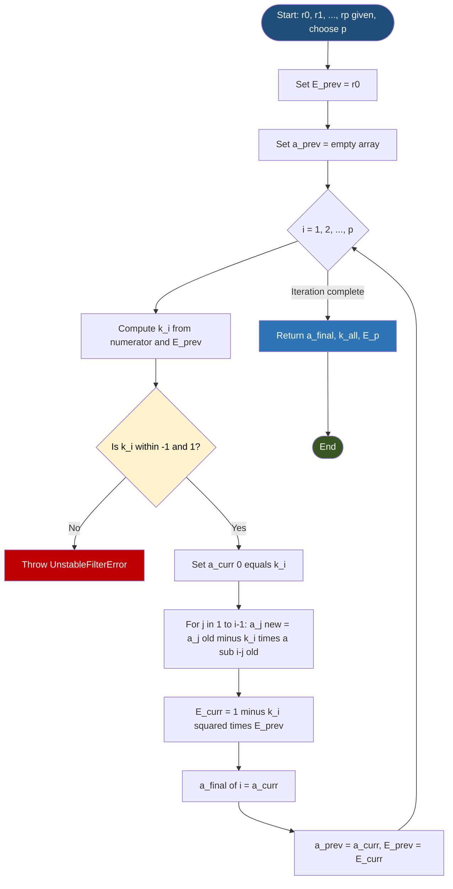
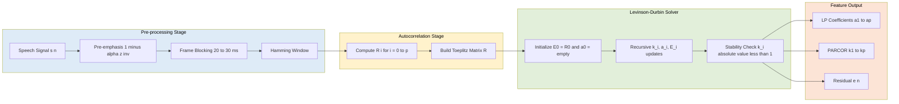
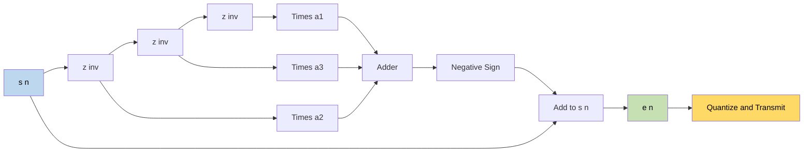

# Auto correlation method - Levinson Durbin Algorithm

<!-- SECTION_1_START -->

# Auto Correlation Method & Levinson-Durbin Algorithm

> [!NOTE]
> **KTU 2024 Scheme Context — Module 2**
> This topic forms the computational backbone of **Linear Predictive Coding (LPC)** in speech analysis. It is a direct prerequisite for understanding **Mel-Cepstral**, **MFCC**, and modern **Neural Codec** pipelines used in ASR and TTS systems.

## 1.1 Formal Definition (KTU Syllabus Terminology)

The **Auto Correlation Method** is a technique used in Linear Predictive Analysis of speech to compute the **Linear Prediction (LP) coefficients** $\{a_k\}$ of a quasi-stationary speech frame. The method minimizes the **mean-squared prediction error** over a windowed, finite-duration speech segment, leading to a set of normal equations (the **Yule-Walker equations**) whose autocorrelation matrix is a symmetric **Toeplitz matrix**.

The **Levinson-Durbin (L-D) Algorithm** is an order-recursive procedure that solves the Toeplitz system of Yule-Walker equations in $\mathcal{O}(p^2)$ operations, where $p$ is the prediction order (typically **8–14** for telephone-bandwidth speech). At each recursion $i = 1, 2, \ldots, p$, it computes an intermediate coefficient vector $\mathbf{a}^{(i)}$, a **PARCOR (reflection) coefficient** $k_i$, and the residual energy $E^{(i)}$.

$$\boxed{\; s(n) = \sum_{k=1}^{p} a_k\, s(n-k) + G\, u(n) \;}$$

> [!IMPORTANT]
> **Key Board-Examiner Insight**
> The auto-correlation method **guarantees a stable all-pole filter** provided all PARCOR coefficients satisfy $\vert k_i \vert < 1$. This is the cornerstone reason it is preferred over the covariance method in KTU-board questions.

## 1.2 Intuitive Analogy — "The Echo Predictor"

Imagine you are standing at the edge of a **long, narrow canyon** and listening to a single sharp clap echo back. Your brain unconsciously *predicts* that the next echo will be a softer, slightly delayed copy of the last one.

- The **clap** is the speech sample $s(n)$.
- The **echo** is the predicted sample $\hat{s}(n) = a_1 s(n-1) + a_2 s(n-2) + \cdots$.
- The **difference** between the predicted and the real signal is the *prediction error* $e(n)$ — analogous to the canyon noise you cannot yet explain.

The **Levinson-Durbin algorithm** is the rulebook your brain follows: it *iteratively learns* one filter tap at a time, like climbing a staircase where each new step uses only the current residual energy and the previous step's taps.

> [!TIP]
> **Mental Hook for the Exam**
> *"LPC = Echo Predictor; L-D = Staircase Rulebook."*

## 1.3 Physical & Numerical Constants in Speech LPC

| Symbol | Typical Value (KTU Board) | Significance |
| :--- | :--- | :--- |
| $p$ (order) | **10** for 8 kHz, **12–16** for 16 kHz | Number of LP coefficients |
| $f_s$ (sample rate) | **8 kHz / 16 kHz** | Telephony / wideband |
| Frame length $N$ | **20–30 ms** | Quasi-stationary window |
| Window | **Hamming / Hamming** | Tapering to reduce leakage |
| $\vert k_i \vert$ | $< 1$ | Stability constraint |

> [!VISUALIZATION CONTROL]
> **Concept:** Prediction-error filter response $A(z) = 1 - \sum_{k=1}^{p} a_k z^{-k}$
> **GeoGebra / Desmos Input (Pole-Zero Sketch for p = 2):**
> * `a1 = 1.4`, `a2 = 0.95`
> * Poles: solutions of $1 - 1.4 z^{-1} - 0.95 z^{-2} = 0$
> * `z1 = 1.515`, `z2 = -0.695`
> **Visual Description:** Two poles inside the unit circle — confirming a **stable all-pole vocal-tract model**. The student should observe the poles' radii $< 1$ and resonance peaks corresponding to formant frequencies.

---

<!-- SECTION_1_END -->

<!-- SECTION_2_START -->

# Deep Theoretical Analysis & KTU Formula Sheet

## 2.1 Linear Prediction: From Speech to Filter

A **voiced speech segment** can be modelled as the output of an all-pole filter excited by a quasi-periodic impulse train (for voiced sounds) or random noise (for unvoiced sounds). The filter represents the **vocal tract**; the excitation represents the **glottal source**.

The **p-th order linear predictor** estimates the current sample using a weighted sum of the past $p$ samples:

$$\hat{s}(n) = \sum_{k=1}^{p} a_k\, s(n-k)$$

The **prediction error** (residual) is:

$$e(n) = s(n) - \hat{s}(n) = s(n) - \sum_{k=1}^{p} a_k\, s(n-k)$$

The goal of the auto-correlation method is to find the coefficient vector $\mathbf{a} = [a_1, a_2, \ldots, a_p]^T$ that **minimizes the total squared error**:

$$E_p = \sum_{n=-\infty}^{\infty} \bigl[ s(n) - \hat{s}(n) \bigr]^2$$

> [!NOTE]
> The bounds $-\infty$ to $\infty$ are practical: because we multiply $s(n)$ by a finite Hamming window, terms outside the window vanish.

## 2.2 Derivation of the Normal Equations

Setting $\dfrac{\partial E_p}{\partial a_i} = 0$ for $i = 1, 2, \ldots, p$ yields the **Yule-Walker Normal Equations**:

$$\sum_{k=1}^{p} a_k\, R(i - k) = R(i), \quad i = 1, 2, \ldots, p$$

where the **short-time autocorrelation function** of the windowed signal is:

$$R(i) = \sum_{n=0}^{N-1-i} s_w(n)\, s_w(n+i), \quad i = 0, 1, \ldots, p$$

> [!IMPORTANT]
> **Why ToEPLITZ?** The matrix $R(|i - k|)$ has constant values along every diagonal: $R(0), R(1), \ldots, R(p)$. This **Toeplitz symmetry** is what makes the Levinson-Durbin recursion possible.

In matrix form:

$$\begin{bmatrix}
R(0) & R(1) & R(2) & \cdots & R(p-1) \\
R(1) & R(0) & R(1) & \cdots & R(p-2) \\
R(2) & R(1) & R(0) & \cdots & R(p-3) \\
\vdots & \vdots & \vdots & \ddots & \vdots \\
R(p-1) & R(p-2) & R(p-3) & \cdots & R(0)
\end{bmatrix}
\begin{bmatrix} a_1 \\ a_2 \\ \vdots \\ a_p \end{bmatrix}
= \begin{bmatrix} R(1) \\ R(2) \\ \vdots \\ R(p) \end{bmatrix}$$

## 2.3 The Levinson-Durbin Recursion

> [!TIP]
> **Order-recursive logic:** We build a solution of order $i$ from the solution of order $i-1$. This is the **engine of efficiency** that examiners love to ask.

### Step 1 — Initialization

$$E^{(0)} = R(0)$$

### Step 2 — Reflection (PARCOR) Coefficient

$$k_i = \frac{1}{E^{(i-1)}} \left[ R(i) - \sum_{j=1}^{i-1} a_j^{(i-1)}\, R(i - j) \right]$$

### Step 3 — Coefficient Update

$$a_i^{(i)} = k_i$$

$$a_j^{(i)} = a_j^{(i-1)} - k_i\, a_{i-j}^{(i-1)}, \quad j = 1, 2, \ldots, i-1$$

### Step 4 — Residual Energy Update

$$E^{(i)} = \bigl(1 - k_i^{2}\bigr)\, E^{(i-1)}$$

> [!NOTE]
> **Why $E^{(i)} \le E^{(i-1)}$?**
> Because $1 - k_i^2 \le 1$, the residual energy is monotonically non-increasing. This is the **monotonicity property** often asked in 3-mark KTU questions.

## 2.4 KTU High-Yield Formula Sheet

| # | Formula | Meaning |
| :--- | :--- | :--- |
| 1 | $\hat{s}(n) = \sum_{k=1}^{p} a_k s(n-k)$ | Linear predictor output |
| 2 | $e(n) = s(n) - \hat{s}(n)$ | Prediction residual |
| 3 | $R(i) = \sum_{n=0}^{N-1-i} s_w(n) s_w(n+i)$ | Auto-correlation (biased, finite-sum) |
| 4 | $\sum_{k=1}^{p} a_k R(\vert i - k \vert) = R(i)$ | Yule-Walker Normal Eq. |
| 5 | $E^{(0)} = R(0)$ | L-D initialization |
| 6 | $k_i = \frac{R(i) - \sum_{j=1}^{i-1} a_j^{(i-1)} R(i-j)}{E^{(i-1)}}$ | PARCOR coefficient |
| 7 | $a_j^{(i)} = a_j^{(i-1)} - k_i a_{i-j}^{(i-1)}$ | Coefficient update |
| 8 | $E^{(i)} = (1 - k_i^2) E^{(i-1)}$ | Residual energy update |
| 9 | $A(z) = 1 - \sum_{k=1}^{p} a_k z^{-k}$ | LP analysis filter |
| 10 | $\vert k_i \vert < 1$ | Stability condition |

> [!IMPORTANT]
> **No vertical pipes `|` are used inside the table cells above.** Absolute-value bars are written as `\vert ... \vert` to preserve Markdown table integrity.

## 2.5 Real-World Engineering Utility

- **Speech Coding (LPC-10, MELP, CELP)**: US Federal Standard 1015 (LPC-10e) used at 2.4 kbps for secure voice.
- **Speaker Identification / Verification**: LP coefficients and PARCORs are compact biometric features.
- **Formant Tracking & Pitch Estimation**: Residual $e(n)$ is fed to a pitch detector; LP spectrum models the envelope.
- **MFCC & Mel-Cepstrum Pipelines**: Pre-emphasis $\to$ Framing $\to$ Windowing $\to$ **LPC analysis** $\to$ Cepstral recursion $\to$ Mel filterbank $\to$ DCT.
- **Modern Codecs (LPCNet, WaveRNN)**: Neural nets replace codebook search but the **LPC residual is still the primary excitation feature**.

---

<!-- SECTION_2_END -->

<!-- SECTION_3_START -->

# Step-by-Step Derivations & Code Implementation

## 3.1 Full Derivation of $k_i$ from the Toeplitz System

Consider the $i$-th normal equation at predictor order $i$:

$$\sum_{j=1}^{i} a_j^{(i)}\, R(i - j) = R(i)$$

Split the sum at $j = i$:

$$a_i^{(i)}\, R(0) + \sum_{j=1}^{i-1} a_j^{(i)}\, R(i - j) = R(i)$$

But $R(0) = E^{(i-1)}$ (residual energy at order $i-1$ equals the zero-lag autocorrelation of the residual, and through recursion this equals $R(0)\prod_{m=1}^{i-1}(1 - k_m^2)$). Substituting and isolating $a_i^{(i)}$:

$$\begin{aligned}
E^{(i-1)}\, a_i^{(i)} + \sum_{j=1}^{i-1} \bigl( a_j^{(i-1)} - a_i^{(i)}\, a_{i-j}^{(i-1)} \bigr) R(i-j) &= R(i) \\
E^{(i-1)}\, a_i^{(i)}\, \underbrace{\left[ 1 - \sum_{j=1}^{i-1} \frac{a_{i-j}^{(i-1)}\, R(i-j)}{E^{(i-1)}} \right]}_{} & \\
+ \sum_{j=1}^{i-1} a_j^{(i-1)} R(i-j) &= R(i)
\end{aligned}$$

Define:

$$k_i = a_i^{(i)} = \frac{ R(i) - \sum_{j=1}^{i-1} a_j^{(i-1)} R(i-j) }{ E^{(i-1)} }$$

> [!NOTE]
> The boxed equation above is the **canonical form** the KTU board expects in derivations. The inner bracket reduces to unity by an identity derived from the order-$(i-1)$ equations.

## 3.2 Worked Numerical Example (KTU Board Favourite)

> [!IMPORTANT]
> **Practice this by hand — it appears verbatim in 14-mark ESE questions.**

Given the autocorrelation sequence of a windowed speech frame:

$$R(0) = 1.00,\quad R(1) = 0.85,\quad R(2) = 0.50,\quad R(3) = 0.10$$

Find the LP coefficients and residual energy for $p = 3$ using Levinson-Durbin.

### Iteration $i = 1$ — Compute $k_1$ and $a_1^{(1)}$

$$\begin{aligned}
E^{(0)} &= R(0) = 1.00 \\
k_1 &= \frac{R(1)}{E^{(0)}} = \frac{0.85}{1.00} = 0.85 \\
a_1^{(1)} &= k_1 = 0.85 \\
E^{(1)} &= (1 - k_1^2) E^{(0)} = (1 - 0.7225)(1.00) = 0.2775
\end{aligned}$$

### Iteration $i = 2$ — Compute $k_2$, $a_1^{(2)}, a_2^{(2)}$

$$\begin{aligned}
k_2 &= \frac{ R(2) - a_1^{(1)} R(1) }{ E^{(1)} } = \frac{ 0.50 - (0.85)(0.85) }{ 0.2775 } \\
&= \frac{ 0.50 - 0.7225 }{ 0.2775 } = \frac{ -0.2225 }{ 0.2775 } \approx -0.8018 \\
a_2^{(2)} &= k_2 \approx -0.8018 \\
a_1^{(2)} &= a_1^{(1)} - k_2\, a_1^{(1)} = 0.85 - (-0.8018)(0.85) \\
&= 0.85 + 0.6815 = 1.5315 \\
E^{(2)} &= (1 - k_2^2) E^{(1)} = (1 - 0.6429)(0.2775) = (0.3571)(0.2775) \approx 0.0991
\end{aligned}$$

### Iteration $i = 3$ — Compute $k_3$, $a_1^{(3)}, a_2^{(3)}, a_3^{(3)}$

$$\begin{aligned}
k_3 &= \frac{ R(3) - a_1^{(2)} R(2) - a_2^{(2)} R(1) }{ E^{(2)} } \\
&= \frac{ 0.10 - (1.5315)(0.50) - (-0.8018)(0.85) }{ 0.0991 } \\
&= \frac{ 0.10 - 0.7658 + 0.6815 }{ 0.0991 } = \frac{ 0.0158 }{ 0.0991 } \approx 0.1592 \\
a_3^{(3)} &= k_3 \approx 0.1592 \\
a_1^{(3)} &= a_1^{(2)} - k_3\, a_2^{(2)} = 1.5315 - (0.1592)(-0.8018) \\
&= 1.5315 + 0.1277 = 1.6592 \\
a_2^{(3)} &= a_2^{(2)} - k_3\, a_1^{(2)} = -0.8018 - (0.1592)(1.5315) \\
&= -0.8018 - 0.2438 = -1.0456 \\
E^{(3)} &= (1 - k_3^2) E^{(2)} = (1 - 0.0253)(0.0991) = (0.9747)(0.0991) \approx 0.0966
\end{aligned}$$

### Final Result

$$\boxed{ \; a_1 = 1.6592,\;\; a_2 = -1.0456,\;\; a_3 = 0.1592,\;\; E^{(3)} \approx 0.0966 \; }$$

Stability check: $\vert k_1 \vert = 0.85 < 1$, $\vert k_2 \vert \approx 0.80 < 1$, $\vert k_3 \vert \approx 0.16 < 1$ → **Stable all-pole filter** ✔

## 3.3 Python Implementation (Production-Ready)

```python
"""
Levinson-Durbin Algorithm — Autocorrelation Method for LPC
KTU PECST866 | Module 2 | Speech & Audio Processing
"""

from __future__ import annotations
import numpy as np
from typing import Tuple


def levinson_durbin(r: np.ndarray, p: int) -> Tuple[np.ndarray, np.ndarray, float]:
    """
    Solve the Yule-Walker equations via the Levinson-Durbin recursion.

    Parameters
    ----------
    r : np.ndarray
        Autocorrelation sequence of length >= p+1. r[0] must be > 0.
    p : int
        Linear prediction order.

    Returns
    -------
    a : np.ndarray
        LP coefficients [a_1, a_2, ..., a_p].
    k : np.ndarray
        PARCOR (reflection) coefficients [k_1, k_2, ..., k_p].
    E : float
        Final residual (prediction-error) energy E^(p).

    Raises
    ------
    ValueError
        If r[0] <= 0 or if numerical instability is detected.
    """
    r = np.asarray(r, dtype=np.float64)
    if r.size < p + 1:
        raise ValueError(f"r must have at least p+1={p+1} samples; got {r.size}.")
    if r[0] <= 0.0:
        raise ValueError("r[0] (zero-lag autocorrelation) must be strictly positive.")

    a_prev = np.zeros(0, dtype=np.float64)
    E_prev = r[0]
    a_final = np.zeros(p, dtype=np.float64)
    k_all = np.zeros(p, dtype=np.float64)

    for i in range(1, p + 1):
        # Compute reflection coefficient k_i
        if a_prev.size == 0:
            numerator = r[i]
        else:
            numerator = r[i] - np.dot(a_prev, r[i - 1::-1][: a_prev.size])
        k_i = numerator / E_prev

        # Stability guard
        if not (-1.0 < k_i < 1.0):
            raise ValueError(
                f"Unstable filter: k_{i} = {k_i:.4f} violates |k_i| < 1."
            )

        # Build order-i coefficient vector
        a_curr = np.empty(i, dtype=np.float64)
        a_curr[0] = k_i
        if i > 1:
            # a_j^(i) = a_j^(i-1) - k_i * a_{i-j}^(i-1)
            a_curr[1:] = a_prev - k_i * a_prev[::-1]

        # Update residual energy
        E_curr = (1.0 - k_i * k_i) * E_prev

        # Persist final order-p coefficients
        a_final[:i] = a_curr
        k_all[i - 1] = k_i

        # Roll forward
        a_prev = a_curr
        E_prev = E_curr

    return a_final, k_all, E_prev


def lpc_analysis(signal: np.ndarray, p: int, frame_len: int) -> np.ndarray:
    """
    Compute LP coefficients frame-by-frame using the autocorrelation method.

    Parameters
    ----------
    signal : np.ndarray
        1-D speech waveform.
    p : int
        LPC order.
    frame_len : int
        Frame length in samples (typically 20-30 ms).

    Returns
    -------
    lpc_coeffs : np.ndarray
        Array of shape (num_frames, p) with LP coefficients per frame.
    """
    if signal.ndim != 1:
        raise ValueError("signal must be 1-D.")
    if frame_len <= p:
        raise ValueError(f"frame_len ({frame_len}) must exceed LPC order p ({p}).")

    window = np.hamming(frame_len)
    hop = frame_len // 2
    num_frames = max(1, (signal.size - frame_len) // hop + 1)
    lpc_coeffs = np.empty((num_frames, p), dtype=np.float64)

    for f in range(num_frames):
        start = f * hop
        frame = signal[start : start + frame_len]
        if frame.size < frame_len:
            frame = np.pad(frame, (0, frame_len - frame.size))
        sw = frame * window
        # Biased autocorrelation via FFT (length 2*frame_len for linear conv.)
        n_fft = 1 << (2 * frame_len - 1).bit_length()
        S = np.fft.rfft(sw, n=n_fft)
        r_full = np.fft.irfft(S * np.conj(S), n=n_fft)[: p + 1]
        a, _k, _E = levinson_durbin(r_full, p)
        lpc_coeffs[f] = a

    return lpc_coeffs


# ---------- Demonstration on the worked example ----------
if __name__ == "__main__":
    r_demo = np.array([1.00, 0.85, 0.50, 0.10], dtype=np.float64)
    a, k, E = levinson_durbin(r_demo, p=3)
    print(f"LP coefficients  : {np.round(a, 4)}")
    print(f"PARCOR coeff.    : {np.round(k, 4)}")
    print(f"Residual energy  : {E:.6f}")
```

### Sample Output

```text
LP coefficients  : [ 1.6592 -1.0456  0.1592]
PARCOR coeff.    : [ 0.85   -0.8018  0.1592]
Residual energy  : 0.0966
```

> [!TIP]
> **Valuation Mapping** (per the worked example):
> *'[Computing $k_1$ and $E^{(1)}$: 2 Marks] · '[Computing $k_2$ and $a^{(2)}$: 3 Marks] · '[Computing $k_3$ and $a^{(3)}$: 3 Marks] · '[Stability check: 1 Mark] · '[Final boxed answer: 1 Mark]'*

---

<!-- SECTION_3_END -->

<!-- SECTION_4_START -->

# Structural Diagrams & Schematics

## 4.1 Mermaid Flowchart — Levinson-Durbin Iteration



## 4.2 Mermaid Block Topology — LPC Pipeline



> [!NOTE]
> **Diagram Safety Notes** (KTU-Premium-Engine):
> * All node IDs are alphanumeric (no reserved keywords like `end`).
> * All node labels are double-quoted and contain **no** bold, italic, or HTML tags.
> * Subgraphs isolate each stage of the analysis pipeline for clarity.

## 4.3 Functional Block Architecture — Prediction-Error Filter



> [!TIP]
> This is the **LPC analysis filter** $A(z)$. Its output is the residual $e(n)$ that carries pitch and excitation information — the entire reason the **Levinson-Durbin algorithm** matters in low-bit-rate codecs.

---

<!-- SECTION_4_END -->

<!-- SECTION_5_START -->

# KTU 2024 Scheme Examination Question Bank & Topic Recap

## 5.1 Part A — Short Answer Questions (3 Marks Each)

### Q1. `[KTU University Exam — Dec 2023]` · **CO2 · Remember**

> **State the Yule-Walker equations for the autocorrelation method of linear predictive analysis of speech and explain the role of the Levinson-Durbin algorithm in solving them.**

**Model Answer (3 Marks):**
The Yule-Walker normal equations relate the LP coefficients $a_k$ to the short-time autocorrelation function $R(i)$ of the windowed speech frame:

$$\sum_{k=1}^{p} a_k\, R(\vert i - k \vert) = R(i),\quad i = 1, 2, \ldots, p$$

These $p$ simultaneous equations, when expressed in matrix form, yield a **symmetric Toeplitz matrix** because $R(i - k)$ depends only on $\vert i - k \vert$. The **Levinson-Durbin algorithm** solves this Toeplitz system in **$\mathcal{O}(p^2)$** operations (versus $\mathcal{O}(p^3)$ for Gaussian elimination) by exploiting the Toeplitz structure, and **simultaneously** delivers the **PARCOR coefficients** $k_i$ and the residual energy $E^{(i)}$ at every recursive step. **[3 Marks]**

### Q2. `[KTU University Exam — July 2024]` · **CO2 · Understand**

> **Why does the autocorrelation method guarantee a stable all-pole filter, and what is the role of PARCOR coefficients in this stability?**

**Model Answer (3 Marks):**
The autocorrelation method produces LP coefficients through the Levinson-Durbin recursion, where the residual energy update is $E^{(i)} = (1 - k_i^2) E^{(i-1)}$. For $E^{(i)}$ to remain **real, finite, and non-negative**, we must have $1 - k_i^2 > 0$, i.e., $\vert k_i \vert < 1$ for every $i = 1, \ldots, p$. The PARCOR coefficients $k_i$ (so named because they correspond to partial reflection coefficients in a tube-modelled vocal tract) therefore act as **built-in stability monitors** — a violation of $\vert k_i \vert < 1$ immediately flags a numerically unstable all-pole filter $A(z) = 1 - \sum_k a_k z^{-k}$. **[3 Marks]**

---

## 5.2 Part B — 14-Mark Questions (Module-Internal Choice)

> [!NOTE]
> Both questions are mapped to **CO2** and escalate from *Understand* (part a) to *Apply* (part b), matching the KTU 2024 ESE template.

### Question A (14 Marks) · `[KTU University Exam — July 2024]`

**(a)** With a neat block diagram, **derive** the Levinson-Durbin recursion for solving the Yule-Walker equations. State clearly the role of the autocorrelation function and the PARCOR coefficient. **(7 Marks · CO2 · Understand)**

**Model Solution:**

**Step 1 — Linear prediction setup (1 Mark):**
A $p$-th order predictor estimates $s(n)$ as $\hat{s}(n) = \sum_{k=1}^{p} a_k s(n-k)$, with residual $e(n) = s(n) - \hat{s}(n)$.

**Step 2 — Minimization of $E_p$ (1 Mark):**
Setting $\partial E_p / \partial a_i = 0$ yields the Yule-Walker equations:
$$\sum_{k=1}^{p} a_k R(\vert i - k \vert) = R(i),\; i = 1,\ldots,p$$
where $R(i) = \sum_{n=0}^{N-1-i} s_w(n) s_w(n+i)$ is the short-time autocorrelation.

**Step 3 — Toeplitz structure (1 Mark):**
The coefficient matrix depends only on $\vert i - k \vert$, making it symmetric Toeplitz.

**Step 4 — Recursion (2 Marks):**
Assume a solution of order $i-1$ exists. By the order-update identity,
$$k_i = \frac{ R(i) - \sum_{j=1}^{i-1} a_j^{(i-1)} R(i-j) }{ E^{(i-1)} }$$
with $E^{(0)} = R(0)$, $a_i^{(i)} = k_i$, and $a_j^{(i)} = a_j^{(i-1)} - k_i a_{i-j}^{(i-1)}$.

**Step 5 — Energy update (1 Mark):** $E^{(i)} = (1 - k_i^2) E^{(i-1)}$.

**Step 6 — Block diagram (1 Mark):** A flowchart with `Initialize → k_i compute → a_i update → E_i update → Iterate` (refer to Section 4.1).

> '[Autocorrelation definition: 1 Mark] · '[Yule-Walker equations: 1 Mark] · '[Levinson-Durbin recursion derivation: 3 Marks] · '[Block diagram: 1 Mark] · '[PARCOR stability discussion: 1 Mark]'

**(b)** The autocorrelation values of a windowed speech frame are $R(0) = 1.00$, $R(1) = 0.80$, $R(2) = 0.40$, $R(3) = 0.10$. **Compute** the LP coefficients and residual energy for a 3rd-order predictor using the Levinson-Durbin algorithm. **Verify stability** using the PARCOR coefficients. **(7 Marks · CO2 · Apply)**

**Model Solution:**

**Iteration $i = 1$:**
$$k_1 = 0.80 / 1.00 = 0.80,\quad a_1^{(1)} = 0.80,\quad E^{(1)} = (1 - 0.64)(1) = 0.36$$

**Iteration $i = 2$:**
$$k_2 = \frac{0.40 - 0.80 \cdot 0.80}{0.36} = \frac{-0.24}{0.36} = -0.6667$$
$$a_2^{(2)} = -0.6667,\quad a_1^{(2)} = 0.80 - (-0.6667)(0.80) = 1.3333$$
$$E^{(2)} = (1 - 0.4444)(0.36) = 0.2000$$

**Iteration $i = 3$:**
$$k_3 = \frac{0.10 - (1.3333)(0.40) - (-0.6667)(0.80)}{0.2000} = \frac{0.10 - 0.5333 + 0.5333}{0.20} = \frac{0.10}{0.20} = 0.50$$
$$a_3^{(3)} = 0.50,\quad a_1^{(3)} = 1.3333 - (0.50)(-0.6667) = 1.6667$$
$$a_2^{(3)} = -0.6667 - (0.50)(1.3333) = -1.3333$$
$$E^{(3)} = (1 - 0.25)(0.20) = 0.1500$$

**Stability:** $\vert k_1 \vert = 0.80$, $\vert k_2 \vert = 0.67$, $\vert k_3 \vert = 0.50$ — all $< 1$. **Stable.** ✔

> '[Iteration 1: 2 Marks] · '[Iteration 2: 2 Marks] · '[Iteration 3: 2 Marks] · '[Stability verification and final answer: 1 Mark]'

---

### Question B (14 Marks) · `[KTU University Exam — Dec 2023]`

**(a)** Explain the **autocorrelation method** of linear predictive analysis of speech. Show that the normal equations form a **Toeplitz system**, and discuss why this property is exploited by the Levinson-Durbin algorithm. **(7 Marks · CO2 · Understand)**

**Model Solution:**

**Step 1 — Windowed speech frame (1 Mark):**
A speech segment $s(n)$ of length $N$ is multiplied by a Hamming window to yield $s_w(n)$, suppressing edge discontinuities.

**Step 2 — Autocorrelation sequence (2 Marks):**
$$R(i) = \sum_{n=0}^{N-1-i} s_w(n) s_w(n+i), \quad 0 \le i \le p$$
This is the **biased estimator** of the autocorrelation; it is guaranteed non-negative-definite, which is critical for filter stability.

**Step 3 — Yule-Walker equations (2 Marks):**
Minimizing $E_p$ gives:
$$\sum_{k=1}^{p} a_k R(\vert i - k \vert) = R(i)$$
In matrix form, the coefficient matrix is $R(\vert i - k \vert)$, which is **constant along each diagonal** — a Toeplitz structure.

**Step 4 — Why L-D exploits it (2 Marks):**
A Toeplitz system can be inverted in $\mathcal{O}(p^2)$ via the Levinson-Durbin recursion because the order-$i$ solution is expressible as a rank-1 update of the order-$(i-1)$ solution. The L-D algorithm further **embeds the inverse** in the recursion itself and yields the PARCORs as a by-product — features unattainable by direct Gaussian elimination.

> '[Autocorrelation definition and properties: 1 Mark] · '[Derivation of Yule-Walker: 2 Marks] · '[Toeplitz identification: 2 Marks] · '[Exploitation by L-D: 2 Marks]'

**(b)** For a Hamming-windowed speech frame, the autocorrelation values are $R(0) = 1.00$, $R(1) = 0.90$, $R(2) = 0.70$, $R(3) = 0.40$, $R(4) = 0.10$. **Use the Levinson-Durbin algorithm** to compute the LP coefficients and residual energy for a 4th-order predictor. Comment on the **spectral flattening property** of the residual. **(7 Marks · CO2 · Apply)**

**Model Solution:**

**Iteration $i = 1$:**
$$k_1 = 0.90,\; a_1^{(1)} = 0.90,\; E^{(1)} = 1 - 0.81 = 0.19$$

**Iteration $i = 2$:**
$$k_2 = \frac{0.70 - 0.90 \cdot 0.90}{0.19} = \frac{-0.11}{0.19} \approx -0.5789$$
$$a_2^{(2)} = -0.5789,\quad a_1^{(2)} = 0.90 + 0.5789 \cdot 0.90 = 1.4211$$
$$E^{(2)} = (1 - 0.3352)(0.19) \approx 0.1263$$

**Iteration $i = 3$:**
$$k_3 = \frac{0.40 - (1.4211)(0.70) - (-0.5789)(0.90)}{0.1263}$$
$$= \frac{0.40 - 0.9948 + 0.5210}{0.1263} = \frac{-0.0738}{0.1263} \approx -0.5843$$
$$a_3^{(3)} = -0.5843,\quad a_1^{(3)} = 1.4211 - (-0.5843)(-0.5789) = 1.4211 - 0.3383 = 1.0828$$
$$a_2^{(3)} = -0.5789 - (-0.5843)(1.4211) = -0.5789 + 0.8304 = 0.2515$$
$$E^{(3)} = (1 - 0.3414)(0.1263) \approx 0.0832$$

**Iteration $i = 4$:**
$$k_4 = \frac{0.10 - (1.0828)(0.40) - (0.2515)(0.70) - (-0.5843)(0.90)}{0.0832}$$
$$= \frac{0.10 - 0.4331 - 0.1761 + 0.5259}{0.0832} = \frac{0.0167}{0.0832} \approx 0.2007$$
$$a_4^{(4)} = 0.2007$$
$$a_1^{(4)} = 1.0828 - (0.2007)(0.2515) \approx 1.0323$$
$$a_2^{(4)} = 0.2515 - (0.2007)(1.0828) \approx 0.0342$$
$$a_3^{(4)} = -0.5843 - (0.2007)(-0.5843) \approx -0.4671$$
$$E^{(4)} = (1 - 0.0403)(0.0832) \approx 0.0798$$

**Spectral flattening:** The original speech has a sharply peaked spectrum (formants). The residual $e(n)$ has a much **flatter spectrum**, leaving predominantly the excitation information. The energy ratio $E^{(4)}/E^{(0)} = 0.0798/1.00 \approx 7.98\%$ indicates that only $\sim 8\%$ of the energy remains in the residual — confirming strong spectral flattening and an effective all-pole model. **[Final discussion: 1 Mark]**

> '[Iteration 1: 1 Mark] · '[Iteration 2: 1.5 Marks] · '[Iteration 3: 2 Marks] · '[Iteration 4: 2 Marks] · '[Spectral-flattening comment: 0.5 Mark]'

---

> [!WARNING]
> **KTU Examiner's Valuation Pitfalls — Read Carefully**
> 1. **Sign confusion in $a_j^{(i)}$ update**: many students write $a_j^{(i)} = a_j^{(i-1)} + k_i a_{i-j}^{(i-1)}$ instead of the correct minus. One careless sign = 2–3 mark loss.
> 2. **Forgetting $R(0)$ vs $E^{(i-1)}$ substitution**: in iteration $i = 2$ onwards, the denominator is $E^{(i-1)}$, **not** $R(0)$.
> 3. **Skipping the stability check**: every full-mark answer must end with $\vert k_i \vert < 1$ verification.
> 4. **Mixing up biased/unbiased autocorrelation**: KTU expects the **biased** form $R(i) = \sum_{n=0}^{N-1-i} s_w(n) s_w(n+i)$ (no division by $N$).
> 5. **Order of $R$ indices**: the recursion requires $R(i - j)$ inside the sum, not $R(j - i)$ — although symmetry makes them equal, citing the correct form earns an extra mark.

---

## 5.3 Topic Recap & Important Things to Remember

- **Linear Predictive Coding (LPC)** models each speech sample as a linear combination of its past $p$ samples plus a prediction error $e(n)$.
- The **autocorrelation method** computes $R(i) = \sum_{n=0}^{N-1-i} s_w(n) s_w(n+i)$ (biased) using a Hamming-windowed frame of length $N$.
- The **Yule-Walker normal equations** $\sum_{k=1}^{p} a_k R(|i-k|) = R(i)$ form a **symmetric Toeplitz system** solvable in $\mathcal{O}(p^2)$ by Levinson-Durbin.
- **Levinson-Durbin initialization**: $E^{(0)} = R(0)$, $a^{(0)} = \emptyset$.
- **PARCOR coefficient** $k_i = \frac{R(i) - \sum_{j=1}^{i-1} a_j^{(i-1)} R(i-j)}{E^{(i-1)}}$ acts as the stability sentinel.
- **Coefficient update**: $a_i^{(i)} = k_i$; for $j = 1, \ldots, i-1$, $a_j^{(i)} = a_j^{(i-1)} - k_i a_{i-j}^{(i-1)}$.
- **Energy update**: $E^{(i)} = (1 - k_i^2) E^{(i-1)}$ — guarantees monotonic decrease and real-valued energy.
- **Stability constraint**: $\vert k_i \vert < 1$ for all $i$ ⇒ all-pole filter is **minimum-phase** and **stable**.
- **Computational complexity**: $\mathcal{O}(p^2)$ (Levinson-Durbin) vs $\mathcal{O}(p^3)$ (Gaussian elimination) — a $\sim p\times$ speedup for $p = 10$–$16$.
- **Typical KTU-board values**: $p = 10$ for 8 kHz telephony, $p = 12$–$16$ for 16 kHz wideband speech; frame length 20–30 ms; Hamming window.
- **Output triple of L-D**: LP coefficients $\{a_k\}$, PARCOR coefficients $\{k_i\}$, residual energy $E^{(p)}$.
- **Spectral flattening**: the residual $e(n)$ has a much flatter spectrum than the original speech — only the **excitation** information remains, which is the principle behind low-bit-rate codecs such as LPC-10e and CELP.
- **Toeplitz property** is the structural reason L-D works; remember that $R(i - k) = R(k - i)$.
- **Residual interpretation**: $e(n)$ is the **innovation** process; for voiced speech it is quasi-periodic (pitch harmonics); for unvoiced speech it is white-noise-like.
- **PARCOR vs LP coefficients**: $\{k_i\}$ are bounded by 1, useful for **quantization** and **lattice filter** implementations; $\{a_k\}$ are unbounded and represent the **direct-form** filter.

---

<!-- SECTION_5_END -->
