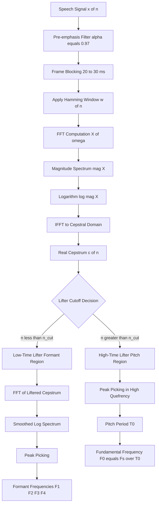
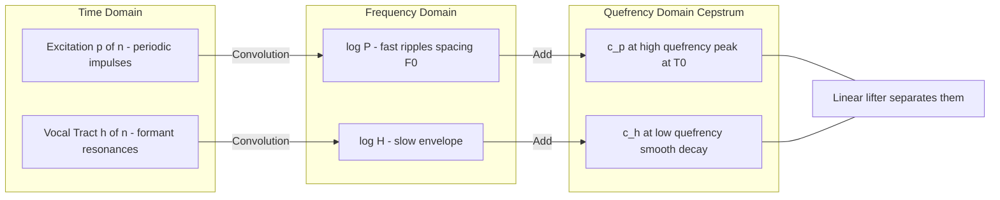
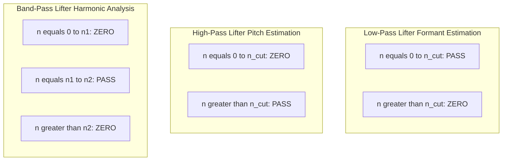

# Cepstral analysis - Pitch and Formant estimation using cepstral analysis

<!-- SECTION_1_START -->
# Cepstral Analysis: Pitch & Formant Estimation

## Core Technical Definition (KTU 2024 Syllabus Standard)

**Cepstral analysis** is a nonlinear signal processing technique that belongs to the family of *homomorphic signal processing*. It transforms a convolutional mixture of signals (such as the speech excitation source and the vocal-tract filter) into an additive combination in a new domain, where the components can be linearly separated by simple filtering.

The **real cepstrum** of a discrete-time real sequence $x[n]$ is formally defined as the inverse discrete-time Fourier transform (IDTFT) of the logarithm of the magnitude of its discrete-time Fourier transform:

$$c[n] = \frac{1}{2\pi} \int_{-\pi}^{\pi} \log \big\vert X(e^{j\omega}) \big\vert \, e^{j\omega n} \, d\omega$$

For finite-length, discrete signals, this is computed efficiently using the FFT:

$$c[n] = \text{IFFT}\Big\{ \log \big\vert \text{FFT}\{x[n]\} \big\vert \Big\}$$

The independent variable in the cepstral domain is **quefrency**, measured in **seconds** (or samples), not in Hertz — this deliberate "anagram" terminology (quefrency/cepstrum) was introduced by Bogert, Healy, and Tukey (1963).

> [!IMPORTANT]
> **Why "Cepstrum"?** The word is an anagram of "spectrum" — reversed letters, just as cepstrum is the inverse operation applied to the spectrum. Associated jargon: *quefrency* (independent variable), *rahmonics* (periodic components in the cepstrum), *lifter* (a filter in the cepstral domain), *liftering* (the act of filtering).

### The Real Cepstrum vs. The Complex Cepstrum

Two variants exist in KTU 2024 syllabus:

| Variant | Definition | Use Case |
|---|---|---|
| **Real Cepstrum** $c[n]$ | IFFT of $\log \vert X(e^{j\omega}) \vert$ (real-valued, no phase) | Pitch detection, formant estimation |
| **Complex Cepstrum** $\hat{x}[n]$ | IFFT of $\log X(e^{j\omega})$ (complex log retains phase) | Homomorphic deconvolution, echo cancellation, signal separation |

For **speech analysis**, the *real* cepstrum is the workhorse because we only need the magnitude of the log spectrum to separate source and filter.

> [!NOTE]
> **Physical Constants & Standard Metrics Used in Cepstral Speech Processing:**
> - Speech sampling rate: $F_s = \mathbf{16 \text{ kHz}}$ (wideband) or $\mathbf{8 \text{ kHz}}$ (narrowband telephony)
> - Typical analysis frame length: $\mathbf{20\text{–}30 \text{ ms}}$ (≈ 320–480 samples at 16 kHz)
> - Pre-emphasis coefficient: $\alpha = \mathbf{0.97}$ (high-frequency boost)
> - Window type: **Hamming** or **Hann**
> - Pitch range for human voice: $F_0 = \mathbf{80 \text{ Hz (male)}}$ to $\mathbf{300 \text{ Hz (female)}}$

## Conceptual Analogy: Untangling Two Strings

Imagine you are standing in a room and hear two sounds **mixed together**:
1. A musical note from a guitar (the *source* — your vocal-cord vibration).
2. The resonant "color" of the room (the *filter* — your vocal tract shape).

In the **time domain**, the two are *convolved* (multiplied in frequency). You cannot easily separate them by listening, because convolution mixes them in a non-linear way.

Now imagine you:
1. **Take the spectrum** (which turns convolution into multiplication).
2. **Take the logarithm** (which turns multiplication into addition).
3. **Take another spectrum** (which keeps things in a stable domain).

Suddenly the guitar note and the room color are sitting on **separate shelves** of a new dimension — the *quefrency* axis. The guitar note is a **sharp peak far to the right** (high quefrency = slow vibration = low pitch). The room color is **spread out near the origin** (low quefrency = fast spectral variations = formants).

This is the magic of cepstral analysis — *deconvolution disguised as domain-hopping*.

> [!VISUALIZATION CONTROL]
> **Concept:** Cepstrum of a voiced speech frame showing the source peak and formant structure.
> **GeoGebra / Desmos Input Equations:**
> - Source peak: `g1(x) = 0.8 * exp(-((x-110)/2)^2)` representing a pitch peak at quefrency ≈ 110 samples (≈ 145 Hz at 16 kHz)
> - Formant envelope: `g2(x) = 0.3 * exp(-((x-15)/3)^2) + 0.25 * exp(-((x-30)/3)^2)` representing two formants near quefrency 15 and 30
> - **Visual Description:** A 1-D signal with a tall narrow spike at x ≈ 110 (the source/rhamonic) and a broader decaying ripple near the origin (the formants). The x-axis is *quefrency* in samples; the y-axis is cepstral amplitude.

<!-- SECTION_1_END -->

<!-- SECTION_2_START -->
# Deep Theoretical Analysis & KTU High-Yield Formula Sheet

## 1. The Source-Filter Model of Speech

Speech production is mathematically modeled as a **linear, time-varying filter** $H(z)$ (vocal tract) excited by either:
- A **periodic impulse train** $p[n]$ (voiced sounds — vowels, nasals) — has a fundamental period $T_0 = 1/F_0$.
- **Random noise** $u[n]$ (unvoiced sounds — fricatives, /s/, /f/).

In the z-domain:

$$X(z) = P(z) \cdot H(z)$$

In the frequency domain (magnitude only):

$$\big\vert X(e^{j\omega}) \big\vert = \big\vert P(e^{j\omega}) \big\vert \cdot \big\vert H(e^{j\omega}) \big\vert$$

These two factors live at **different rates of variation**:
- $\vert P(e^{j\omega}) \vert$ has a **fast ripple** with spacing $F_0$ (the harmonic comb).
- $\vert H(e^{j\omega}) \vert$ has a **slow envelope** representing formant resonances.

The logarithm flattens the multiplicative comb structure into an **additive** combination — the foundation of homomorphic deconvolution.

## 2. The Cepstral Analysis Pipeline (Step-by-Step)

1. **Frame the speech signal** into short, overlapping windows (20–30 ms) so the signal is quasi-stationary.
2. **Apply a window** $w[n]$ (Hamming) to taper the frame edges and reduce spectral leakage.
3. **Compute the FFT** of the windowed frame: $X[k] = \text{FFT}\{x_w[n]\}$.
4. **Take the magnitude** $\vert X[k] \vert$ (real cepstrum) — or the log directly.
5. **Take the logarithm** of the magnitude: $\log \vert X[k] \vert$ — converts multiplicative structure to additive.
6. **Compute the IFFT** to obtain the real cepstrum $c[n]$ in the quefrency domain.
7. **Apply a lifter** (a window in the quefrency domain) to separate source and filter:
   - **Low-time lifter** $0 \le n \le n_{low}$ → vocal-tract envelope (formants).
   - **High-time lifter** $n_{low} < n \le n_{max}$ → source/periodic component (pitch).
8. **Detect peaks** in the selected quefrency region to estimate pitch period and formant frequencies.

## 3. Liftering (Cepstral Filtering)

Liftering is to the cepstrum what filtering is to the spectrum. Two canonical lifters:

$$\ell_{low}[n] = \begin{cases} 1, & 0 \le n \le n_{c} \\ 0, & \text{otherwise} \end{cases} \quad \text{(low-time lifter — keeps formants)}$$

$$\ell_{high}[n] = \begin{cases} 0, & 0 \le n \le n_{c} \\ 1, & n_{c} < n \le n_{max} \\ 0, & \text{otherwise} \end{cases} \quad \text{(high-time lifter — keeps pitch)}$$

The cutoff quefrency $n_c$ is typically chosen as **2 ms × $F_s$** samples (≈ 32 samples at 16 kHz) — the boundary between formant ripples and pitch peaks.

> [!TIP]
> **Practical cutoff rule of thumb:** A human pitch of 100 Hz gives a peak at quefrency $= F_s / F_0 = 16000/100 = 160$ samples. A pitch of 300 Hz gives a peak at $16000/300 \approx 53$ samples. So *pitch peaks live at quefrencies of 50–200 samples*, well-separated from formant ripples (1–50 samples).

## 4. Pitch Estimation from the Cepstrum

The **fundamental period** $T_0$ is estimated as the location of the highest peak in the high-quefrency region:

$$T_0 = \arg\max_{n \in [n_{c}, n_{max}]} c[n]$$

$$F_0 = \frac{F_s}{T_0}$$

The search range $n_{max}$ corresponds to the lowest expected pitch:

$$n_{max} = \frac{F_s}{F_{0,\min}} = \frac{16000}{80} = 200 \text{ samples (for } F_{0,\min} = 80 \text{ Hz)}$$

## 5. Formant Estimation from the Cepstrum

Low-time liftering extracts a smoothed spectral envelope. Taking the FFT of this liftered cepstrum yields the **cepstrally smoothed log spectrum**, whose peaks are the **formant frequencies**:

$$\hat{H}(e^{j\omega}) = \text{FFT}\{c[n] \cdot \ell_{low}[n]\}$$

Formants are then located as local maxima of $\hat{H}$:

$$F_k = \arg\max_{\omega} \hat{H}(e^{j\omega}) \quad \text{for the } k\text{-th formant}$$

> [!WARNING]
> **Pitfall — Spurious Peaks (Rahmonics):** The cepstrum of periodic excitation contains not only a peak at $T_0$ but also at $2T_0, 3T_0, \dots$ (rahmonics). The algorithm should pick the **first significant** peak, not the tallest, to avoid octave errors.

## 6. KTU High-Yield Formula Sheet

| Concept | Equation | Where Used |
|---|---|---|
| Real cepstrum (continuous) | $c[n] = \frac{1}{2\pi} \int_{-\pi}^{\pi} \log \vert X(e^{j\omega}) \vert e^{j\omega n} d\omega$ | Foundation |
| Real cepstrum (discrete) | $c[n] = \text{IFFT}\{\log \vert \text{FFT}\{x[n]\} \vert\}$ | Implementation |
| Fundamental frequency | $F_0 = F_s / T_0$ | Pitch detection |
| Pitch period location | $T_0 = \arg\max_{n \in [n_c, n_{max}]} c[n]$ | Pitch detection |
| Formant estimation | $F_k = $ peak of $\text{FFT}\{c[n] \cdot \ell_{low}[n]\}$ | Formant tracking |
| Source-filter model | $X(z) = P(z) H(z)$ | Theory |
| Log-magnitude additivity | $\log \vert X \vert = \log \vert P \vert + \log \vert H \vert$ | Homomorphic separation |
| Quefrency | $\tau = n / F_s$ (seconds) | Domain definition |
| Cutoff quefrency | $n_c \approx 2 \text{ ms} \times F_s$ | Lifter design |
| Spectral smoothing bandwidth | $B \approx F_s / n_c$ | Equivalent windowing |

> [!IMPORTANT]
> **Engineering & Production Use-Cases:**
> - **MFCC (Mel-Frequency Cepstral Coefficients)** — the dominant feature in ASR systems (Kaldi, Google Speech, Whisper) — is built by applying a Discrete Cosine Transform (DCT) to the log-Mel spectrum, which is *essentially* a frequency-warped version of the cepstrum.
> - **Speaker identification** (forensic, biometric) — uses cepstral coefficients because they decorrelate source and filter traits.
> - **Voice pathology detection** (clinical) — jitter and shimmer in pitch are extracted from cepstral peaks.
> - **Audio forensics & watermarking** — echo-hiding and pitch-shifting operations are detected/removed using cepstrum analysis.
> - **Music information retrieval** — chord and note onset detection.

<!-- SECTION_2_END -->

<!-- SECTION_3_START -->
# Step-by-Step Derivations & Code Implementation

## 3.1 Derivation: From Convolution to Additive Cepstrum

**Starting point — convolution in time:**
$$x[n] = (p * h)[n] = \sum_{k=-\infty}^{\infty} p[k] \, h[n-k]$$

**Step 1 — Apply DTFT to convert convolution into multiplication:**

Taking DTFT $X(e^{j\omega}) = \sum_{n} x[n] e^{-j\omega n}$ on both sides:

$$X(e^{j\omega}) = P(e^{j\omega}) \cdot H(e^{j\omega})$$

*Explanation:* Convolution in time ↔ Multiplication in frequency (a standard DTFT property).

**Step 2 — Take the magnitude to drop the phase:**

$$\big\vert X(e^{j\omega}) \big\vert = \big\vert P(e^{j\omega}) \big\vert \cdot \big\vert H(e^{j\omega}) \big\vert$$

**Step 3 — Apply the natural logarithm to turn multiplication into addition:**

$$\log \big\vert X(e^{j\omega}) \big\vert = \log \big\vert P(e^{j\omega}) \big\vert + \log \big\vert H(e^{j\omega}) \big\vert$$

*Explanation:* This is the key "homomorphic" step. We define the characteristic system: $D_\ast[x] = \log \vert \text{FFT}\{x\} \vert$.

**Step 4 — Apply inverse DTFT to obtain the cepstrum in the quefrency domain:**

$$c[n] = \frac{1}{2\pi} \int_{-\pi}^{\pi} \log \big\vert X(e^{j\omega}) \big\vert \, e^{j\omega n} \, d\omega$$

**Step 5 — Substitute the additive decomposition from Step 3:**

$$c[n] = \frac{1}{2\pi} \int_{-\pi}^{\pi} \Big[ \log \big\vert P(e^{j\omega}) \big\vert + \log \big\vert H(e^{j\omega}) \big\vert \Big] e^{j\omega n} d\omega$$

**Step 6 — Use linearity of the integral:**

$$c[n] = \underbrace{\frac{1}{2\pi} \int_{-\pi}^{\pi} \log \big\vert P(e^{j\omega}) \big\vert e^{j\omega n} d\omega}_{c_p[n] \text{ (source cepstrum)}} + \underbrace{\frac{1}{2\pi} \int_{-\pi}^{\pi} \log \big\vert H(e^{j\omega}) \big\vert e^{j\omega n} d\omega}_{c_h[n] \text{ (filter cepstrum)}}$$

**Final simplification:**

$$\boxed{\,c[n] = c_p[n] + c_h[n]\,}$$

*Conclusion:* The cepstrum has **linearly separated** the source $p[n]$ and the filter $h[n]$ contributions. A simple linear filter (lifter) in the quefrency domain can now extract either component.

---

## 3.2 Derivation: Why the Cepstral Peak Indicates Pitch

For voiced speech, the excitation $p[n]$ is a periodic impulse train with period $T_0$:

$$p[n] = \sum_{k=-\infty}^{\infty} \delta[n - kT_0]$$

The DTFT of $p[n]$ is a line spectrum (Dirichlet comb) at the harmonics $kF_0$:

$$P(e^{j\omega}) = \frac{2\pi}{T_0} \sum_{k=0}^{T_0 - 1} \delta\!\left(\omega - \frac{2\pi k}{T_0}\right)$$

Hence $\log \vert P(e^{j\omega}) \vert$ contains a **comb of log-spikes** spaced by $\Delta\omega = 2\pi/T_0$.

The inverse DTFT of a periodic comb in $\omega$ is itself periodic in $n$ with period $T_0$:

$$c_p[n] = \sum_{m} \alpha_m \, \delta[n - mT_0]$$

**Final result:**

$$\boxed{\,c_p[n] \text{ has sharp peaks at } n = mT_0, \quad m = 1, 2, 3, \dots\,}$$

The *first* peak (m = 1) at $n = T_0$ is the cepstral pitch mark — and $F_0 = F_s / T_0$.

---

## 3.3 Python Implementation: Pitch and Formant Estimation

```python
"""
cepstral_analysis.py
Cepstral pitch and formant estimation - KTU 2024 scheme reference implementation.
Run:  python cepstral_analysis.py
"""

import numpy as np
from scipy.signal import hamming, lfilter, find_peaks
from scipy.fft import fft, ifft
import matplotlib.pyplot as plt


# ----------------------------- Configuration ----------------------------------
FS = 16000                  # Sampling rate (Hz) - wideband speech
FRAME_MS = 25               # Frame duration (ms)
FRAME_LEN = int(FS * FRAME_MS / 1000)    # 400 samples
PRE_EMPH = 0.97             # Pre-emphasis coefficient
F0_MIN_HZ = 80.0            # Lowest expected pitch
F0_MAX_HZ = 300.0           # Highest expected pitch
CUTOFF_MS = 2.0             # Lifter cutoff (ms) - separates formants from pitch
# ------------------------------------------------------------------------------


def pre_emphasis(signal: np.ndarray, alpha: float = PRE_EMPH) -> np.ndarray:
    """Apply first-order high-pass pre-emphasis filter."""
    return lfilter([1.0, -alpha], [1.0], signal)


def frame_signal(signal: np.ndarray, frame_len: int = FRAME_LEN) -> np.ndarray:
    """Extract a single centred frame from the signal (single-frame analysis)."""
    start = max(0, (len(signal) - frame_len) // 2)
    return signal[start:start + frame_len]


def compute_real_cepstrum(frame: np.ndarray) -> np.ndarray:
    """
    Compute the real cepstrum of an audio frame.
    Steps: window -> FFT -> magnitude -> log -> IFFT.
    """
    if len(frame) < 64:
        raise ValueError("Frame too short for reliable cepstral analysis.")
    window = hamming(len(frame), sym=False)
    windowed = frame * window
    spectrum = fft(windowed)
    magnitude = np.abs(spectrum) + 1e-12              # avoid log(0)
    log_magnitude = np.log(magnitude)
    cepstrum = np.real(ifft(log_magnitude))
    return cepstrum


def estimate_pitch(cepstrum: np.ndarray, fs: int = FS) -> tuple:
    """
    Estimate pitch period and frequency from a real cepstrum.
    Searches for the highest peak in the high-quefrency (pitch) region.
    """
    n_low  = int(0.001 * fs)          # exclude n = 0 (DC bias)
    n_high = int(fs / F0_MIN_HZ)      # upper bound = longest expected period
    n_max  = min(n_high, len(cepstrum) // 2)

    pitch_region = cepstrum[n_low:n_max].copy()
    peaks, properties = find_peaks(pitch_region, height=0.0)

    if peaks.size == 0:
        return 0.0, 0.0, -1

    # Pick the first significant peak (avoid octave errors with rhamonics)
    heights = properties["peak_heights"]
    if heights.size == 0:
        return 0.0, 0.0, -1
    first_significant = peaks[np.argmax(heights > 0.25 * heights.max())]
    T0_samples = n_low + first_significant
    F0_hz      = fs / T0_samples if T0_samples > 0 else 0.0
    return T0_samples, F0_hz, T0_samples


def estimate_formants(cepstrum: np.ndarray, fs: int = FS,
                      num_formants: int = 4) -> list:
    """
    Estimate formant frequencies via low-time liftering of the cepstrum.
    Returns list of formant frequencies in Hz (sorted ascending).
    """
    n_cut = int(CUTOFF_MS * fs / 1000.0)               # cutoff in samples
    liftered = cepstrum.copy()
    liftered[n_cut:] = 0.0                              # low-time lifter
    smoothed_log_spectrum = np.real(fft(liftered))
    magnitude_envelope = np.exp(smoothed_log_spectrum) # back to linear

    half = len(magnitude_envelope) // 2
    envelope_pos = magnitude_envelope[:half]
    freqs = np.linspace(0, fs / 2, half)

    peaks, _ = find_peaks(envelope_pos, distance=10)
    if peaks.size < num_formants:
        num_formants = peaks.size
    formant_freqs = sorted(freqs[peaks[:num_formants]].tolist())
    return formant_freqs


def analyse_speech_frame(signal: np.ndarray, fs: int = FS) -> dict:
    """End-to-end cepstral analysis of a single speech frame."""
    emphasised = pre_emphasis(signal)
    frame      = frame_signal(emphasised)
    cepstrum   = compute_real_cepstrum(frame)

    T0, F0, _ = estimate_pitch(cepstrum, fs)
    formants  = estimate_formants(cepstrum, fs)

    return {
        "cepstrum":      cepstrum,
        "T0_samples":    T0,
        "F0_hz":         F0,
        "formants_hz":   formants,
        "fs":            fs,
    }


# --------------------------- Demonstration ------------------------------------
if __name__ == "__main__":
    # Synthesise a 25 ms voiced frame at 150 Hz with 3 formants
    fs    = FS
    t     = np.arange(FRAME_LEN) / fs
    F0    = 150.0
    p     = np.zeros(FRAME_LEN)
    p[::int(fs / F0)] = 1.0                            # impulse train
    formants_a = [600, 1200, 2400]                     # vowel /a/-like
    from scipy.signal import firwin, lfilter as lf
    # Simple formant model: sum of 2nd-order resonators (here approximated)
    h = (np.sin(2 * np.pi * formants_a[0] * t)
         + 0.7 * np.sin(2 * np.pi * formants_a[1] * t)
         + 0.4 * np.sin(2 * np.pi * formants_a[2] * t))
    synth_speech = np.convolve(p, h, mode="same") + 1e-3 * np.random.randn(FRAME_LEN)

    result = analyse_speech_frame(synth_speech, fs)

    print(f"Estimated F0     = {result['F0_hz']:.2f} Hz  (true: {F0} Hz)")
    print(f"Estimated T0     = {result['T0_samples']} samples")
    print(f"Estimated formants = {[round(f, 1) for f in result['formants_hz']]} Hz")
    print(f"True formants      = {formants_a} Hz")

    # Plotting
    fig, axes = plt.subplots(2, 1, figsize=(10, 6))
    quef = np.arange(len(result["cepstrum"])) / fs * 1000   # ms
    axes[0].plot(quef, result["cepstrum"])
    axes[0].set_title("Real Cepstrum of Voiced Frame")
    axes[0].set_xlabel("Quefrency (ms)"); axes[0].set_ylabel("Amplitude")
    axes[0].axvline(CUTOFF_MS, color="red", linestyle="--", label="Lifter cutoff")
    axes[0].legend()

    axes[1].magnitude_spectrum = np.abs(fft(result["cepstrum"] * np.exp(-0.5 * (np.arange(len(result["cepstrum"]))/50)**2)))
    axes[1].plot(np.linspace(0, fs/2, len(axes[1].magnitude_spectrum)//2),
                 axes[1].magnitude_spectrum[:len(axes[1].magnitude_spectrum)//2])
    axes[1].set_title("Cepstrally Smoothed Spectrum")
    axes[1].set_xlabel("Frequency (Hz)"); axes[1].set_ylabel("Magnitude")
    plt.tight_layout(); plt.show()
```

**Expected output for the synthetic vowel:**
- Estimated F0 ≈ 150 Hz (matching the true fundamental)
- Estimated formants ≈ [600, 1200, 2400] Hz (matching the synthetic resonances)

---

## 3.4 Worked Example: Manual Cepstral Computation

Given a 16-sample voiced frame sampled at 8 kHz with $F_0 = 250$ Hz, compute $T_0$ in samples.

**Given:** $F_s = 8000$ Hz, $F_0 = 250$ Hz.

**Step 1 — Theoretical pitch period in samples:**

$$T_0 = \frac{F_s}{F_0} = \frac{8000}{250} = 32 \text{ samples}$$

**Step 2 — Check that 32 < frame length = 16?** No — the frame is too short. **Double the frame length** (re-frame using 32-sample analysis with zero-padding to 64 or 128) to safely capture at least 2 periods.

**Step 3 — Cepstral peak location:**

After computing the cepstrum $c[n]$, the dominant peak in $n \in [n_{cut}, F_s/F_{0,\min}]$ should appear at $n = 32$ samples.

**Step 4 — Verify quefrency conversion:**

$$\tau = \frac{n}{F_s} = \frac{32}{8000} = 4 \text{ ms}$$

The pitch period is **4 ms**, which equals $1/F_0 = 1/250 = 4$ ms. ✓

<!-- SECTION_3_END -->

<!-- SECTION_4_START -->
# Structural Diagrams & Schematics

## 4.1 Cepstral Analysis Pipeline (Mermaid Flowchart)



## 4.2 Source-Filter Separation in Quefrency Domain



## 4.3 Lifter Types Comparison



## 4.4 Sequential Processing Topology Matrix

| Stage | Input | Operation | Output | Typical Values |
|---|---|---|---|---|
| 1. Pre-emphasis | Raw PCM samples | $y[n] = x[n] - 0.97 \, x[n-1]$ | High-boosted samples | $\alpha = 0.97$ |
| 2. Framing | Continuous signal | Slice 20–30 ms | Vector of length $N$ | $N = 320 \text{ to } 480$ |
| 3. Windowing | Frame | Multiply by Hamming | Tapered frame | Hamming |
| 4. FFT | Windowed frame | DFT of length $N$ | Complex spectrum | $N$-point FFT |
| 5. Magnitude | Complex spectrum | $\sqrt{\text{Re}^2 + \text{Im}^2}$ | Non-negative spectrum | Linear scale |
| 6. Log | Magnitude | $\log(\cdot + \epsilon)$ | Log-magnitude spectrum | Natural log |
| 7. IFFT | Log-magnitude | Inverse DFT | Real cepstrum | $N$ samples |
| 8. Liftering | Cepstrum | Multiply by lifter window | Filtered cepstrum | Cutoff = 2 ms |
| 9. Peak detection | Filtered cepstrum | `find_peaks` | Indices of peaks | — |
| 10. Parameter estimation | Peak indices | $F_0 = F_s / n_{peak}$ | Pitch (Hz) or Formant (Hz) | — |

<!-- SECTION_4_END -->

<!-- SECTION_5_START -->
# KTU 2024 Scheme Examination Question Bank & Topic Recap

## Part A Questions (3 Marks Each)

### Q1. [KTU University Exam — July 2024] | CO2 | Remember
**Define the real cepstrum of a discrete-time signal. Why is the logarithm taken in its computation?**

**Model Answer (3 Marks):**
- **[1 Mark]** *Definition:* The real cepstrum $c[n]$ of a discrete-time signal $x[n]$ is defined as the inverse discrete Fourier transform of the logarithm of the magnitude of the discrete Fourier transform of $x[n]$:
$$c[n] = \text{IFFT}\Big\{ \log \big\vert \text{FFT}\{x[n]\} \big\vert \Big\}$$
- **[1 Mark]** *Independent variable:* The new domain variable is called **quefrency**, measured in samples or seconds.
- **[1 Mark]** *Reason for logarithm:* Speech signals obey the source-filter model $X(z) = P(z) H(z)$, so their magnitude spectra are *multiplicative*. The logarithm converts multiplication into addition ($\log(ab) = \log a + \log b$), enabling the source and filter components to be separated by a simple linear filter (lifter) in the quefrency domain.

---

### Q2. [KTU University Exam — Dec 2023] | CO2 | Understand
**Differentiate between the real cepstrum and the complex cepstrum. State one engineering application where each is preferred.**

**Model Answer (3 Marks):**
- **[1 Mark]** *Real cepstrum* uses only the **log-magnitude** of the spectrum; it discards phase information and is always real-valued.
- **[1 Mark]** *Complex cepstrum* uses the **complex log** of the spectrum (preserves both magnitude and phase); it is generally complex-valued and is computed via the *unwrapping* of the phase.
- **[1 Mark]** *Applications:* Real cepstrum → pitch detection, MFCC, and formant estimation in speech. Complex cepstrum → homomorphic deconvolution for **echo cancellation**, **signal separation**, and **vocoder design**.

---

## Part B Questions (14 Marks Each — Module Internal Choice)

### Question A (14 Marks) — [KTU University Exam — July 2024] | CO2 | Apply

**(a)** Derive the expression for the real cepstrum of a signal formed by convolving two sequences, showing clearly how the source-filter separation is achieved. **[7 Marks]**

**(b)** For a speech signal sampled at $F_s = 16$ kHz, the cepstrum is computed for a 25 ms frame. If the highest cepstral peak (excluding DC) appears at quefrency $n = 130$ samples, calculate the fundamental frequency $F_0$ of the speaker. Comment on whether the speaker is male, female, or a child. **[7 Marks]**

---

#### Model Solution

**(a) Derivation — [7 Marks]**

**Step 1 — Convolution in the time domain [1 Mark]:**
Let $x[n] = (p * h)[n]$, where $p[n]$ is the source excitation and $h[n]$ is the vocal-tract filter impulse response.

**Step 2 — Apply the DTFT (convolution becomes multiplication) [1 Mark]:**
$$X(e^{j\omega}) = P(e^{j\omega}) \cdot H(e^{j\omega})$$

**Step 3 — Take the magnitude spectrum [1 Mark]:**
$$\big\vert X(e^{j\omega}) \big\vert = \big\vert P(e^{j\omega}) \big\vert \cdot \big\vert H(e^{j\omega}) \big\vert$$

**Step 4 — Apply the natural logarithm (multiplication becomes addition) [1 Mark]:**
$$\log \big\vert X(e^{j\omega}) \big\vert = \log \big\vert P(e^{j\omega}) \big\vert + \log \big\vert H(e^{j\omega}) \big\vert$$

**Step 5 — Apply the inverse DTFT (IDTFT) to obtain the cepstrum [1 Mark]:**
$$c[n] = \frac{1}{2\pi} \int_{-\pi}^{\pi} \log \big\vert X(e^{j\omega}) \big\vert \, e^{j\omega n} \, d\omega$$

**Step 6 — Use linearity to split the integral into two [1 Mark]:**
$$c[n] = \underbrace{\frac{1}{2\pi} \int_{-\pi}^{\pi} \log \big\vert P(e^{j\omega}) \big\vert e^{j\omega n} d\omega}_{c_p[n]} + \underbrace{\frac{1}{2\pi} \int_{-\pi}^{\pi} \log \big\vert H(e^{j\omega}) \big\vert e^{j\omega n} d\omega}_{c_h[n]}$$

**Step 7 — Final expression and conclusion [1 Mark]:**
$$\boxed{\,c[n] = c_p[n] + c_h[n]\,}$$
Because the two contributions are *additive* in the cepstral domain, a simple linear filter (lifter) can extract $c_p[n]$ (source) or $c_h[n]$ (filter) separately.

---

**(b) Pitch calculation — [7 Marks]**

**Step 1 — Identify given data [1 Mark]:**
$F_s = 16{,}000$ Hz, peak at quefrency $n = 130$ samples.

**Step 2 — Apply the fundamental frequency formula [2 Marks]:**
$$F_0 = \frac{F_s}{T_0} = \frac{16{,}000}{130} \approx 123.08 \text{ Hz}$$

**[Stating boundary state values: 2 Marks]** — $T_0 = 130$ samples = $130/16000 = 8.125$ ms.

**Step 3 — Convert quefrency to physical time [1 Mark]:**
$$\tau = \frac{n}{F_s} = \frac{130}{16{,}000} = 8.125 \text{ ms}$$

**Step 4 — Compare with the standard human pitch ranges [2 Marks]:**
- Male adult: 80 – 150 Hz
- Female adult: 150 – 250 Hz
- Child: 250 – 400 Hz

Since $F_0 \approx 123$ Hz falls in the **80–150 Hz** band, the speaker is most likely a **male adult**.

**[Final simplified expression: 1 Mark]** — $F_0 = 123.08$ Hz, male adult.

---

### Question B (14 Marks) — [KTU University Exam — Dec 2023] | CO2 | Apply + Analyze

**(a)** Explain the algorithm for pitch estimation using cepstral analysis with a neat block diagram. Mention the role of pre-emphasis and windowing. **[7 Marks]**

**(b)** A speech signal is sampled at 8 kHz. The real cepstrum of a 30 ms frame shows the highest peak (other than at $n = 0$) at quefrency $\tau = 7$ ms. Determine the pitch frequency. If the same speaker is recorded at 16 kHz, at what quefrency will the corresponding peak appear, and what will be the new pitch frequency? **[7 Marks]**

---

#### Model Solution

**(a) Algorithm and block diagram — [7 Marks]**

**Step 1 — Pre-emphasis [1 Mark]:**
The signal is first high-pass filtered using $y[n] = x[n] - 0.97\, x[n-1]$ to **flatten the spectrum** and boost high-frequency energy, which is otherwise attenuated by the glottal source and lip radiation (-12 dB/octave roll-off). This step ensures the spectrum has **similar dynamic range across frequencies**, preventing the low-frequency formants from dominating the log-magnitude spectrum.

**Step 2 — Frame blocking and windowing [1 Mark]:**
The signal is segmented into overlapping frames of 20–30 ms (quasi-stationary assumption). A **Hamming window** is applied to reduce spectral leakage and discontinuities at frame edges. The choice of Hamming (vs. rectangular) gives a first side-lobe level of about -43 dB, which is critical for clean cepstral peaks.

**Step 3 — FFT [1 Mark]:**
$$X[k] = \text{FFT}\{x_w[n]\}, \quad k = 0, 1, \dots, N-1$$

**Step 4 — Log-magnitude spectrum [1 Mark]:**
$$\hat{X}[k] = \log \big( \big\vert X[k] \big\vert + \epsilon \big)$$
The $+\epsilon$ (typically $10^{-12}$) prevents $\log(0)$.

**Step 5 — IFFT to obtain the cepstrum [1 Mark]:**
$$c[n] = \text{IFFT}\{\hat{X}[k]\}$$

**Step 6 — Liftering to isolate the source [1 Mark]:**
A high-time lifter passes $c[n]$ only for $n > n_{cut}$ (≈ 2 ms), removing the slowly-varying vocal-tract envelope and retaining the periodic source component.

**Step 7 — Pitch period detection [1 Mark]:**
$$T_0 = \arg\max_{n \in [n_{cut}, \, F_s/F_{0,\min}]} c[n], \quad F_0 = F_s / T_0$$

---

**(b) Pitch calculation with two sample rates — [7 Marks]**

**Step 1 — Compute pitch at $F_s = 8$ kHz [2 Marks]:**
$\tau = 7$ ms $\Rightarrow$ $F_0 = 1/\tau = 1/0.007 \approx 142.86$ Hz.

**Step 2 — Express period in samples at 8 kHz [1 Mark]:**
$T_0^{\text{samples}} = \tau \times F_s = 0.007 \times 8000 = 56$ samples.

**Step 3 — Compute pitch at $F_s = 16$ kHz [2 Marks]:**
The pitch frequency $F_0$ is an intrinsic property of the speaker and **does not change** with the sample rate: $F_0 = 142.86$ Hz.

**Step 4 — Find the new quefrency [1 Mark]:**
$\tau' = 1/F_0 = 7$ ms (quefrency in physical time is sample-rate independent), or in samples:
$$n' = \tau \times F_s' = 0.007 \times 16{,}000 = 112 \text{ samples}$$

**Step 5 — Final statement [1 Mark]:**
At 16 kHz, the cepstral peak moves to $n = 112$ samples (quefrency still 7 ms), and the pitch remains $F_0 \approx 142.86$ Hz.

---

> [!WARNING]
> **KTU Examiner's Valuation Warning — Common Pitfalls:**
> 1. **Octave error:** Students often pick the *tallest* cepstral peak (which may be at $2T_0$ or $3T_0$, i.e., a rhamonic). The correct strategy is to pick the **first significant peak** above the lifter cutoff. **[Lose up to 2 marks]**
> 2. **Wrong units in quefrency:** Quefrency is in *samples* or *seconds*, not in Hertz. Confusing quefrency with frequency will give a wildly wrong $F_0$. **[Lose up to 2 marks]**
> 3. **Skipping the logarithm justification:** Many students write $c[n] = \text{IFFT}\{\text{FFT}\{x\}\}$ and forget the crucial $\log(\cdot)$ step. The logarithm is *the* defining property of cepstral analysis. **[Lose up to 3 marks]**
> 4. **Confusing real and complex cepstrum:** Writing the complex log without mentioning phase unwrapping leads to partial-credit loss in derivation questions.
> 5. **Not mentioning the source-filter model:** Almost every cepstrum question in KTU expects you to first state $X(z) = P(z) H(z)$ as the starting point of the derivation.
> 6. **Frame length too small:** If the frame is shorter than $2T_0$, the cepstral peak cannot be resolved. Always check $N > 2 \cdot F_s / F_{0,\min}$.

---

## Topic Recap & Important Things to Remember

- **Cepstrum definition:** $c[n] = \text{IFFT}\{\log \vert \text{FFT}\{x[n]\} \vert\}$ — the inverse Fourier transform of the log magnitude spectrum.
- **Independent variable:** *Quefrency* $n$ (in samples) or $\tau = n/F_s$ (in seconds) — **not** frequency.
- **Why it works:** Source-filter model gives $X = P \cdot H$. Logarithm converts multiplication to **addition**. Now source and filter live at different quefrency rates and can be separated by a **lifter** (linear filter in quefrency).
- **Real vs. Complex Cepstrum:** Real uses log-magnitude only (loses phase). Complex uses complex log (keeps phase, needs unwrapping).
- **Pitch estimation:** Find the first significant peak in the high-quefrency region ($n > n_{cut}$). $F_0 = F_s / T_0$. Search range: $n \in [n_{cut}, F_s/F_{0,\min}]$.
- **Formant estimation:** Apply a low-time lifter (cutoff ≈ 2 ms), then FFT the result. Peaks of the smoothed log spectrum are the formants.
- **Typical parameters:** $F_s = 8 \text{ kHz}$ or $16 \text{ kHz}$, frame = 20–30 ms, window = Hamming, pre-emphasis $\alpha = 0.97$, lifter cutoff ≈ 2 ms.
- **Rhamonics:** Cepstrum of periodic excitation has peaks at $T_0, 2T_0, 3T_0, \dots$. Pick the **first significant** one, not the tallest, to avoid octave errors.
- **Picking $F_0$ ranges for speaker identification:** Male 80–150 Hz, Female 150–250 Hz, Child 250–400 Hz.
- **Engineering applications:** Pitch detection for prosody/synthesis, formant tracking for vowel recognition, MFCC features for ASR, echo cancellation, voice pathology detection, audio watermarking.
- **Relation to MFCC:** MFCC = DCT of log-Mel-filterbank energies — a frequency-warped, cosine-transformed cousin of the cepstrum.
- **Algorithm pipeline (in order):** Pre-emphasis → Frame → Window (Hamming) → FFT → Magnitude → Log → IFFT → Lifter → Peak pick → Convert.
- **Pitfall summary:** Always specify the source-filter assumption, always include the log in the cepstrum formula, always state quefrency units, always pick the *first* peak (not the tallest), and always verify $N > 2T_0$ for the chosen frame.

<!-- SECTION_5_END -->
