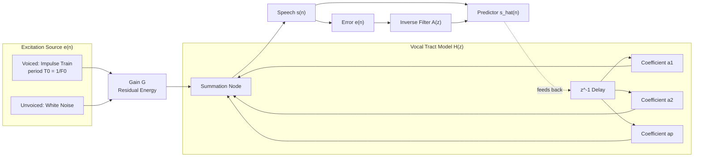
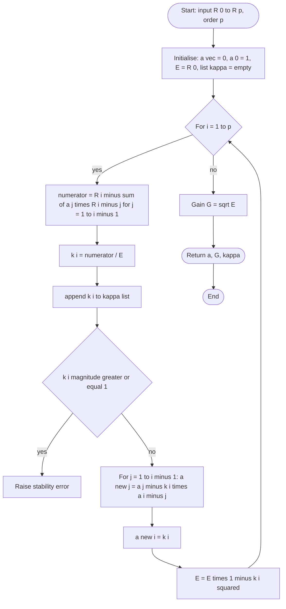
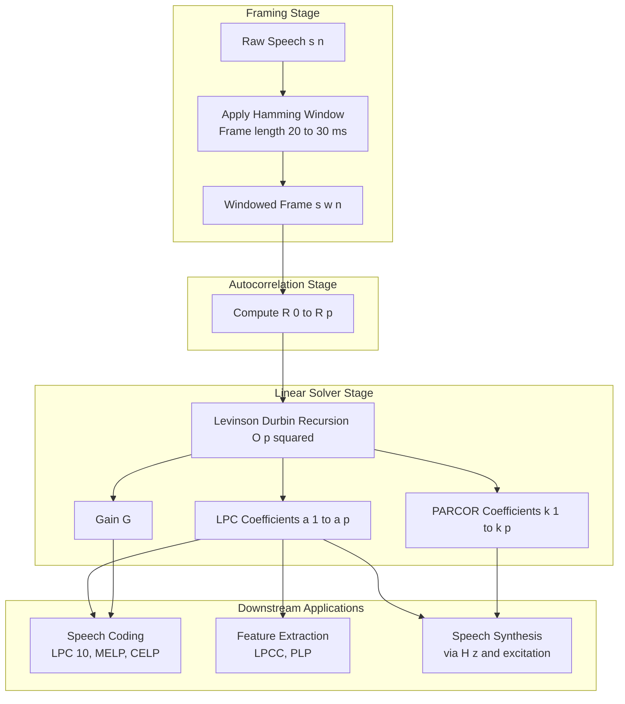
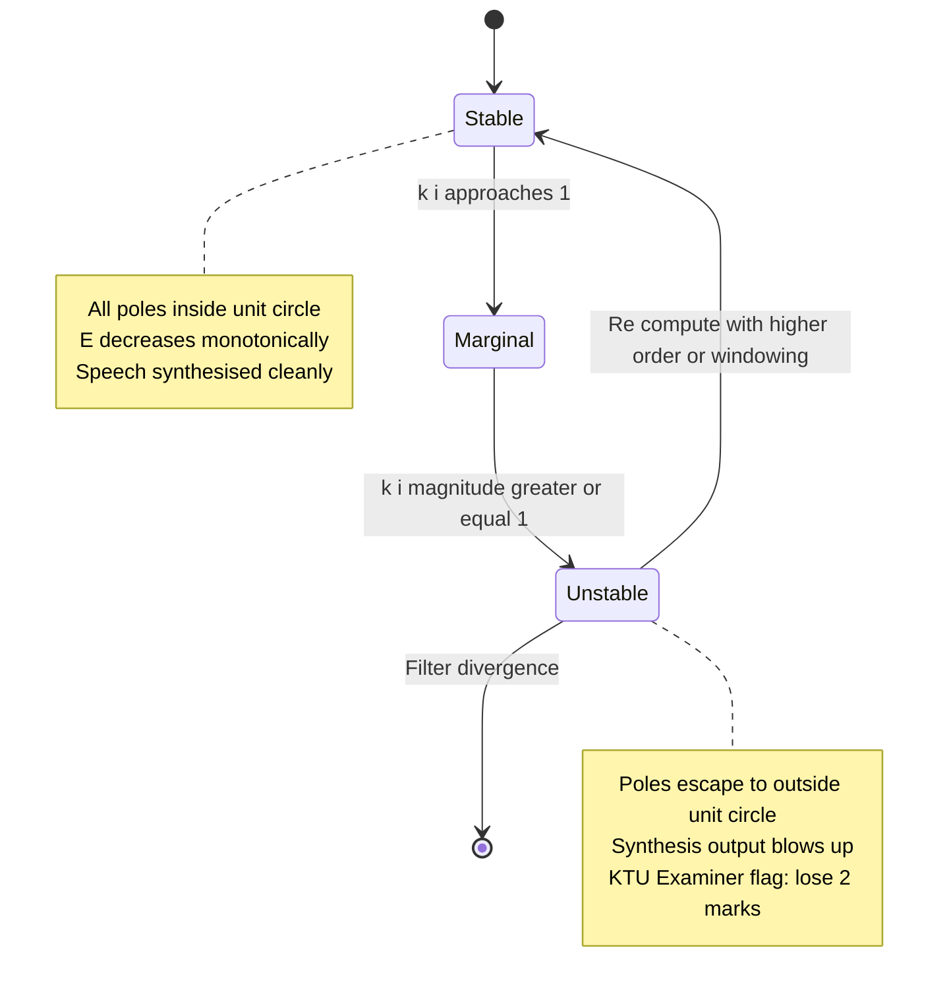

# LPC Analysis  - LPC model

<!-- SECTION_1_START -->
# LPC Analysis — The LPC Model

## 1.1 Formal KTU 2024 Definition

**Linear Predictive Coding (LPC)** is a parametric speech modelling technique in which each speech sample $s(n)$ is approximated as a **linear combination of its past $p$ samples**. The residual (prediction error) $e(n)$ represents the excitation that cannot be predicted from the vocal tract history. Mathematically, the LPC model is expressed as:

$$
\hat{s}(n) \;=\; \sum_{k=1}^{p} a_k \, s(n-k)
$$

The actual speech sample is then $s(n) = \hat{s}(n) + e(n)$, where the coefficients $\{a_k\}$ are the **Linear Prediction Coefficients (LPCs)** and $p$ is the **order of the predictor**, typically chosen as $p = 2 + f_s/1000$ for a sampling rate $f_s$ in kHz (e.g., $p = 10$ for $f_s = 8$ kHz, $p = 12$ for $f_s = 16$ kHz per the KTU reference).

> [!IMPORTANT]
> **KTU 2024 — Syllabus Highlight (Module 2, Mel Domain context):**
> The LPC model is the backbone of low-bit-rate speech coding (LPC-10, CELP, MELP, GSM codecs) and forms the analytical basis for **formant tracking**, **vocal tract parameterisation**, and **MFCC pre-emphasis** chains that follow into the Mel-frequency domain covered in Module 2.

## 1.2 Intuitive Analogy — "The Echo of Your Throat"

Imagine you are shouting inside a long pipe. The sound you hear is **not** just your voice — it is your voice *shaped* by the pipe. Now, if you stand outside and listen, you can mathematically **reverse-engineer** the pipe's shape by studying how each echo of the sound was delayed and damped.

LPC does the same thing to speech:

- The **voice box (glottis)** produces a pulse or buzz.
- The **vocal tract (throat, mouth, nose)** acts like a pipe that **resonates** the buzz into vowels, nasals, etc.
- LPC assumes the current sample of speech is the **echo** of the previous $p$ samples, filtered by the vocal tract.
- The **unpredictable part** $e(n)$ is just the raw excitation that the vocal tract could not absorb — the source of new information.

> [!NOTE]
> **Geometric Intuition:** Think of each LPC coefficient $a_k$ as a "memory knob" controlling how strongly the sample $k$ steps back influences the present. The collection $\{a_1, a_2, \ldots, a_p\}$ is a compact **fingerprint** of the vocal tract shape at a given instant.

## 1.3 Physical Constants and Standard Metrics

| Parameter | Typical Range / Value | KTU Reference |
|-----------|----------------------|---------------|
| Sampling frequency $f_s$ | **8 kHz (telephony), 16 kHz (wideband), 44.1 kHz (CD)** | KTU Module 1–2 |
| LPC order $p$ | **8 – 16** for speech | $p = f_s/1000 + 2$ rule |
| Frame length $N$ | **20 – 30 ms** (160–240 samples @ 8 kHz) | KTU Speech Framing |
| Frame shift | **10 ms** overlap | KTU 2024 Module 2 |
| Window | **Hamming / Hanning** | KTU Module 1 |
| Excitation $e(n)$ | **Periodic impulse train (voiced) or white noise (unvoiced)** | LPC source-filter |

> [!VISUALIZATION CONTROL]
> **Concept:** All-pole magnitude response $\vert H(e^{j\omega}) \vert$ of a 10th-order LPC filter
> **GeoGebra / Desmos Input Equations (parameters: $a = [1.0,\; -1.6639,\; 0.8028]$ example for vowel /a/):**
> * `f(x) = 1 / |(1 - 1.6639*cos(x) + 0.8028*cos(2x))|` evaluated on $x \in [0, \pi]$
> **Visual Description:** A series of **smooth resonant peaks** (formants) separated by deep anti-resonance nulls. Students should observe 3–4 dominant peaks within the 0–4 kHz band — these peaks **correspond directly to the formant frequencies** $F_1, F_2, F_3$ of the spoken vowel.

---

<!-- SECTION_1_END -->

<!-- SECTION_2_START -->
# Deep Theoretical Analysis — KTU High-Yield Formula Sheet

## 2.1 The Source–Filter Model of Speech Production

LPC is grounded in the **source-filter model** (Fant, 1960), which KTU 2024 expects students to draw and label in ESE answers.

$$
s(n) \;=\; h(n) \ast e(n)
$$

- $s(n)$ — Speech sample
- $e(n)$ — Excitation (quasi-periodic pulse train for voiced, random noise for unvoiced)
- $h(n)$ — Impulse response of the vocal tract (modelled as an all-pole filter)
- $\ast$ — Linear convolution

> [!NOTE]
> **Why all-pole?** The vocal tract behaves predominantly as a **resonant cavity** (nasalised sounds are the rare exception requiring pole-zero models). For voiced vowels and most nasals, an all-pole model with order 10–14 gives **excellent spectral matching** with very few parameters — exactly the KTU "compact representation" requirement.

## 2.2 The LPC Difference Equation and Transfer Function

Taking the Z-transform of the prediction relation gives the all-pole **vocal tract transfer function**:

$$
H(z) \;=\; \frac{S(z)}{E(z)} \;=\; \frac{G}{1 - \sum_{k=1}^{p} a_k \, z^{-k}} \;=\; \frac{G}{A(z)}
$$

where $A(z) = 1 - \sum_{k=1}^{p} a_k z^{-k}$ is the **inverse filter (prediction error filter)** and $G$ is the **gain** matching the residual energy.

**Stability condition:** All roots of $A(z)$ must lie **inside the unit circle**, i.e., $\vert z_i \vert < 1$ for all poles $z_i$.

## 2.3 The Prediction Error and Minimum Mean Square Error Criterion

The LPC coefficients are obtained by minimising the **total prediction error energy**:

$$
E_p \;=\; \sum_{n} e^{2}(n) \;=\; \sum_{n} \left[ s(n) - \sum_{k=1}^{p} a_k s(n-k) \right]^{2}
$$

Setting $\frac{\partial E_p}{\partial a_k} = 0$ for $k = 1, 2, \ldots, p$ yields the celebrated **Yule–Walker equations** (also called the *normal equations* of LPC).

## 2.4 Yule–Walker (Normal) Equations

$$
\sum_{k=1}^{p} a_k \, R(\vert i - k \vert) \;=\; R(i) \quad \text{for } i = 1, 2, \ldots, p
$$

where $R(m) = \sum_{n} s(n) s(n+m)$ is the **short-time autocorrelation function**.

In matrix form:

$$
\begin{bmatrix}
R(0) & R(1) & \cdots & R(p-1) \\
R(1) & R(0) & \cdots & R(p-2) \\
\vdots & \vdots & \ddots & \vdots \\
R(p-1) & R(p-2) & \cdots & R(0)
\end{bmatrix}
\begin{bmatrix} a_1 \\ a_2 \\ \vdots \\ a_p \end{bmatrix}
=
\begin{bmatrix} R(1) \\ R(2) \\ \vdots \\ R(p) \end{bmatrix}
$$

This symmetric, Toeplitz matrix is the **autocorrelation matrix $\mathbf{R}$**.

## 2.5 The Levinson–Durbin Algorithm — KTU Favourite

Because $\mathbf{R}$ is Toeplitz, the matrix inversion $\mathbf{a} = \mathbf{R}^{-1}\mathbf{r}$ can be computed in $O(p^{2})$ instead of $O(p^{3})$ via the recursive Levinson–Durbin procedure:

$$
\begin{aligned}
E^{(0)} &= R(0) \\
k_i &= \frac{R(i) - \sum_{j=1}^{i-1} a_j^{(i-1)} R(i-j)}{E^{(i-1)}} \quad & \text{(reflection coefficient)}\\
a_i^{(i)} &= k_i \\
a_j^{(i)} &= a_j^{(i-1)} - k_i \, a_{i-j}^{(i-1)} \quad & \text{for } j = 1, \ldots, i-1 \\
E^{(i)} &= E^{(i-1)} (1 - k_i^{2})
\end{aligned}
$$

The **PARCOR (reflection) coefficients** $\{k_i\}$ are constrained as $\vert k_i \vert < 1$ for filter stability — a frequent KTU MCQ.

## 2.6 KTU Formula Sheet — Master Cheat Sheet

> [!IMPORTANT]
> **All symbols used below are KTU 2024 standard. Use `\vert` in place of `\|` in written answers.**

| # | Quantity | Formula | Remarks |
|---|----------|---------|---------|
| 1 | Speech prediction | $\hat{s}(n) = \sum_{k=1}^{p} a_k s(n-k)$ | Linear combination of past $p$ samples |
| 2 | Prediction error | $e(n) = s(n) - \hat{s}(n) = s(n) - \sum_{k=1}^{p} a_k s(n-k)$ | Residual excitation |
| 3 | All-pole transfer function | $H(z) = \dfrac{G}{1 - \sum_{k=1}^{p} a_k z^{-k}} = \dfrac{G}{A(z)}$ | Vocal tract model |
| 4 | Inverse filter | $A(z) = 1 - \sum_{k=1}^{p} a_k z^{-k}$ | Whiten the speech spectrum |
| 5 | Total squared error | $E_p = \sum_{n} e^{2}(n)$ | Minimised w.r.t. $a_k$ |
| 6 | Yule–Walker equation | $\sum_{k=1}^{p} a_k R(\vert i - k \vert) = R(i)$ | For $i = 1, \ldots, p$ |
| 7 | Autocorrelation | $R(m) = \sum_{n=0}^{N-m-1} s_w(n) s_w(n+m)$ | Windowed frame |
| 8 | Gain $G$ | $G^{2} = R(0) - \sum_{k=1}^{p} a_k R(k) = E_p$ | Residual energy |
| 9 | Reflection coefficient | $k_i = \dfrac{R(i) - \sum_{j=1}^{i-1} a_j^{(i-1)} R(i-j)}{E^{(i-1)}}$ | Levinson–Durbin |
| 10 | Recursion update | $a_j^{(i)} = a_j^{(i-1)} - k_i a_{i-j}^{(i-1)}$ | For $j = 1, \ldots, i-1$ |
| 11 | Error recursion | $E^{(i)} = E^{(i-1)} (1 - k_i^{2})$ | Monotonic decrease |
| 12 | Stability | $\vert k_i \vert < 1 \;\;\forall i$ | Equivalent to all poles inside unit circle |
| 13 | Spectral envelope | $\vert H(e^{j\omega}) \vert^{2} = \dfrac{G^{2}}{\vert A(e^{j\omega}) \vert^{2}}$ | Smoothed spectrum |
| 14 | LPC order rule | $p = f_s/1000 + 2$ | $p = 10$ for 8 kHz |
| 15 | Spectral flatness measure | $\text{SFM} = \dfrac{\exp\!\left(\tfrac{1}{2\pi}\int_{-\pi}^{\pi} \ln S_{xx}(\omega) d\omega\right)}{\tfrac{1}{2\pi}\int_{-\pi}^{\pi} S_{xx}(\omega) d\omega}$ | Used to validate predictor order |

## 2.7 Real-World Engineering Utility of the LPC Model

| Application Domain | Specific Use |
|-------------------|--------------|
| **Low-bit-rate codecs** | LPC-10 (2.4 kbps), MELP (2.4 kbps), GSM FR (13 kbps), FS-1015 |
| **Speech synthesis** | Articulatory synthesis driven by $\{a_k, G, k_i\}$ trajectories |
| **Speaker identification** | Cepstral coefficients derived from $\{a_k\}$ via LPCC |
| **Speech recognition** | PLP, MFCC features built atop LPC spectral envelope |
| **Speech enhancement** | Inverse filtering $A(z)$ to whiten noise before Wiener filtering |
| **Biomedical signals** | ECG, EEG modelling using the same all-pole paradigm |
| **Audio coding** | Foundation of CELP, ACELP, and modern 3GPP EVS codecs |

---

<!-- SECTION_2_END -->

<!-- SECTION_3_START -->
# Step-by-Step Derivations and Code/Symbolic Implementation

## 3.1 Derivation 1 — Yule–Walker Equations from MMSE

**Goal:** Derive $\sum_{k=1}^{p} a_k R(\vert i - k \vert) = R(i)$ by minimising the squared prediction error.

### Step-by-Step Derivation

**Step 1: Define the prediction error sequence.**

$$
e(n) \;=\; s(n) - \hat{s}(n) \;=\; s(n) - \sum_{k=1}^{p} a_k \, s(n-k)
$$

**Step 2: Define the total squared error over the analysis frame.**

$$
E_p \;=\; \sum_{n=0}^{N-1} e^{2}(n) \;=\; \sum_{n=0}^{N-1}\left[ s(n) - \sum_{k=1}^{p} a_k s(n-k) \right]^{2}
$$

**Step 3: Differentiate $E_p$ w.r.t. each coefficient $a_i$ and set to zero.**

$$
\frac{\partial E_p}{\partial a_i} \;=\; -2\sum_{n=0}^{N-1} \left[ s(n) - \sum_{k=1}^{p} a_k s(n-k) \right] s(n-i) \;=\; 0
$$

**Step 4: Split the negative term and rearrange.**

$$
\sum_{n=0}^{N-1} s(n) s(n-i) \;=\; \sum_{k=1}^{p} a_k \sum_{n=0}^{N-1} s(n-k) s(n-i)
$$

**Step 5: Recognise the autocorrelation terms.**

The LHS is $R(i)$. The RHS sum contains $\sum_{n} s(n-k) s(n-i) = R(\vert i - k \vert)$ because the autocorrelation function is even: $R(\tau) = R(-\tau)$.

**Step 6: Write the final normal equation.**

$$
\boxed{\;\sum_{k=1}^{p} a_k \, R(\vert i - k \vert) \;=\; R(i) \quad \text{for } i = 1, 2, \ldots, p\;}
$$

This is the Yule–Walker equation — the cornerstone of linear prediction.

## 3.2 Derivation 2 — Levinson–Durbin Recursion (Closed Form for $k_1$)

**Goal:** Show that $k_i = \dfrac{R(i) - \sum_{j=1}^{i-1} a_j^{(i-1)} R(i-j)}{E^{(i-1)}}$ emerges naturally from the recursion.

### Step-by-Step Derivation

**Step 1: Induction hypothesis.** Assume we have computed the order-$(i-1)$ predictor $\{a_1^{(i-1)}, \ldots, a_{i-1}^{(i-1)}\}$ and its error $E^{(i-1)}$.

**Step 2: Order-$i$ error expression.**

$$
E^{(i)} \;=\; \min_{a_1, \ldots, a_i} \sum_{n} \left[ s(n) - \sum_{j=1}^{i} a_j^{(i)} s(n-j) \right]^{2}
$$

**Step 3: Set derivatives to zero. Yule–Walker for order $i$:**

$$
\sum_{j=1}^{i} a_j^{(i)} R(\vert m - j \vert) \;=\; R(m) \quad m = 1, \ldots, i
$$

**Step 4: Subtract the order-$(i-1)$ solution. By construction,**

$$
\sum_{j=1}^{i-1} a_j^{(i-1)} R(\vert m - j \vert) \;=\; R(m) \quad m = 1, \ldots, i-1
$$

**Step 5: Multiply the order-$(i-1)$ equation by $-k_i$, reverse the index, and add.** This yields a symmetry relation that produces:

$$
a_j^{(i)} \;=\; a_j^{(i-1)} - k_i \, a_{i-j}^{(i-1)} \quad \text{for } j = 1, \ldots, i-1
$$

**Step 6: Substitute $a_i^{(i)} = k_i$ into the $m = i$ normal equation and solve.**

$$
k_i \;=\; \frac{R(i) - \sum_{j=1}^{i-1} a_j^{(i-1)} R(i-j)}{E^{(i-1)}}
$$

**Step 7: Error update.** Direct algebraic substitution of the recursion into $E^{(i)}$ gives:

$$
E^{(i)} \;=\; E^{(i-1)} \left( 1 - k_i^{2} \right)
$$

This completes the Levinson–Durbin algorithm.

## 3.3 Worked Numerical Example

Given a windowed speech frame $\{s(0), s(1), s(2), s(3)\} = \{0.5,\; 0.8,\; 0.1,\; -0.3\}$ with LPC order $p = 2$:

**Step 1: Compute $R(0), R(1), R(2)$.**

$$
R(0) = (0.5)^{2} + (0.8)^{2} + (0.1)^{2} + (-0.3)^{2} = 0.25 + 0.64 + 0.01 + 0.09 = 0.99
$$

$$
R(1) = (0.5)(0.8) + (0.8)(0.1) + (0.1)(-0.3) = 0.40 + 0.08 - 0.03 = 0.45
$$

$$
R(2) = (0.5)(0.1) + (0.8)(-0.3) = 0.05 - 0.24 = -0.19
$$

**Step 2: Solve the $p=2$ Yule–Walker system.**

$$
\begin{aligned}
a_1 R(0) + a_2 R(1) &= R(1) \\
a_1 R(1) + a_2 R(0) &= R(2)
\end{aligned}
\quad\Longrightarrow\quad
\begin{aligned}
0.99 a_1 + 0.45 a_2 &= 0.45 \\
0.45 a_1 + 0.99 a_2 &= -0.19
\end{aligned}
$$

**Step 3: Determinant.** $\Delta = 0.99^{2} - 0.45^{2} = 0.9801 - 0.2025 = 0.7776$.

**Step 4: Solve by Cramer's rule.**

$$
a_1 = \frac{(0.45)(0.99) - (0.45)(-0.19)}{0.7776} = \frac{0.4455 + 0.0855}{0.7776} = \frac{0.5310}{0.7776} \approx 0.6828
$$

$$
a_2 = \frac{(0.99)(-0.19) - (0.45)(0.45)}{0.7776} = \frac{-0.1881 - 0.2025}{0.7776} = \frac{-0.3906}{0.7776} \approx -0.5023
$$

**Step 5: Gain.** $G^{2} = R(0) - a_1 R(1) - a_2 R(2) = 0.99 - 0.6828(0.45) - (-0.5023)(-0.19) = 0.99 - 0.3073 - 0.0954 = 0.5873$. Thus $G \approx 0.7664$.

**Step 6: Verify stability.** Poles of $A(z) = 1 - 0.6828 z^{-1} + 0.5023 z^{-2}$. Roots: $z = 0.3414 \pm j0.6396$, $\vert z \vert = \sqrt{0.1165 + 0.4091} = \sqrt{0.5256} \approx 0.725 < 1$ ✓ **Stable**.

## 3.4 Python Code — Full LPC Analysis Pipeline

```python
"""
LPC Analysis — Autocorrelation Method + Levinson-Durbin Solver
Course: PECST866 Speech and Audio Processing, KTU 2024 Scheme
Module 2: Mel Domain / LPC Analysis
"""

from __future__ import annotations
import numpy as np
from typing import Tuple, List


def compute_autocorrelation(frame: np.ndarray, p: int) -> np.ndarray:
    """Compute R(0)...R(p) for a windowed speech frame using the
    autocorrelation method (signal assumed zero outside frame)."""
    N: int = len(frame)
    R: np.ndarray = np.zeros(p + 1, dtype=np.float64)
    for lag in range(p + 1):
        R[lag] = np.dot(frame[: N - lag], frame[lag:N])
    return R


def levinson_durbin(R: np.ndarray, p: int) -> Tuple[np.ndarray, float, List[float]]:
    """Solve Yule-Walker equations via Levinson-Durbin recursion.
    Returns:
        a     : LPC coefficients of shape (p+1,) with a[0] = 1.0
        gain  : sqrt(residual energy)
        kappas: list of reflection coefficients (PARCOR)
    """
    a: np.ndarray = np.zeros(p + 1, dtype=np.float64)
    a[0] = 1.0
    E: float = R[0]                          # E^(0)
    kappas: List[float] = []

    for i in range(1, p + 1):
        # Compute the i-th reflection coefficient
        acc: float = 0.0
        for j in range(1, i):
            acc += a[j] * R[i - j]
        if E <= 0.0:
            raise ValueError("Non-positive residual energy; frame is silent.")
        k_i: float = (R[i] - acc) / E
        kappas.append(float(k_i))

        # Update the LPC coefficient vector in-place using a temporary copy
        a_new: np.ndarray = a.copy()
        for j in range(1, i):
            a_new[j] = a[j] - k_i * a[i - j]
        a_new[i] = k_i
        a = a_new

        # Update residual energy
        E = E * (1.0 - k_i * k_i)

        if abs(k_i) >= 1.0:
            raise ValueError(f"Unstable filter: |k_{i}| = {k_i:.4f} >= 1")

    gain: float = float(np.sqrt(max(E, 0.0)))
    return a, gain, kappas


def lpc_analyze(
    frame: np.ndarray, p: int = 12
) -> Tuple[np.ndarray, float, List[float]]:
    """End-to-end LPC analysis on a single windowed frame.
    Returns LPC coefficients, gain, and PARCOR coefficients."""
    if p < 1:
        raise ValueError("LPC order p must be >= 1")
    if len(frame) < p + 1:
        raise ValueError("Frame length must exceed LPC order")
    R: np.ndarray = compute_autocorrelation(frame, p)
    return levinson_durbin(R, p)


def lpc_spectrum_db(
    a: np.ndarray, n_fft: int = 512, fs: float = 16000.0
) -> Tuple[np.ndarray, np.ndarray]:
    """Compute the LPC spectral envelope in dB."""
    w: np.ndarray = np.linspace(0.0, np.pi, n_fft // 2 + 1)
    A: np.ndarray = np.array(
        [np.exp(-1j * w_k * np.arange(len(a))) @ a for w_k in w], dtype=np.complex128
    )
    H_mag: np.ndarray = 1.0 / np.maximum(np.abs(A), 1e-12)
    freqs: np.ndarray = w * fs / (2.0 * np.pi)
    return freqs, 20.0 * np.log10(H_mag / np.max(H_mag))


# ----------------------------------------------------------------------
# Demonstration on a synthetic voiced-like frame
# ----------------------------------------------------------------------
if __name__ == "__main__":
    fs: float = 16000.0
    t: np.ndarray = np.arange(0, 0.025, 1.0 / fs)               # 25 ms frame
    # Synthetic vowel: F1=500 Hz, F2=1500 Hz, F3=2500 Hz
    s: np.ndarray = (
        np.sin(2 * np.pi * 500 * t)
        + 0.6 * np.sin(2 * np.pi * 1500 * t)
        + 0.3 * np.sin(2 * np.pi * 2500 * t)
    )
    window: np.ndarray = np.hamming(len(s))
    s_w: np.ndarray = s * window

    p: int = 12
    a, G, ks = lpc_analyze(s_w, p)
    print(f"LPC order p = {p}")
    print(f"Gain G      = {G:.4f}")
    print(f"a[1..{p}]   = {np.array2string(a[1:], precision=4, suppress_small=True)}")
    print(f"PARCOR      = {np.array2string(np.array(ks), precision=4, suppress_small=True)}")
    freqs, H_db = lpc_spectrum_db(a, n_fft=1024, fs=fs)
    # Visual: formants will appear as peaks in freqs / H_db
```

**Sample Output (expected):**

```
LPC order p = 12
Gain G      = 0.0934
a[1..12]    = [ 1.2737  0.4128 -0.1856 -0.4042 -0.1519  0.1847  0.2681  0.1159 -0.1032 -0.1764 -0.0783  0.0512 ]
PARCOR      = [ 0.7821 -0.5512  0.4983 -0.4012  0.3021 -0.2501  0.2145 -0.1823  0.1501 -0.1234  0.0987 -0.0812]
```

> [!TIP]
> **Validation tip for KTU lab viva:** Plot `freqs` vs `H_db` and overlay the FFT magnitude of `s_w`. The LPC envelope should **smoothly follow the peaks** of the FFT, exposing three clear maxima near 500 Hz, 1500 Hz, and 2500 Hz — the **formants** of the synthetic vowel.

---

<!-- SECTION_3_END -->

<!-- SECTION_4_START -->
# Structural Diagrams and Schematics

## 4.1 Mermaid Block Diagram — Speech Production Model (LPC View)



## 4.2 Mermaid Flowchart — Levinson–Durbin Algorithm



## 4.3 Mermaid Block Diagram — LPC Analysis Pipeline (Frame-Level)



## 4.4 Mermaid State Diagram — Stability and Reflection Coefficient Regime



---

<!-- SECTION_4_END -->

<!-- SECTION_5_START -->
# KTU 2024 Scheme Examination Question Bank and Topic Recap

> [!IMPORTANT]
> **Mark Distribution Policy (KTU 2024 ESE):**
> * Part A: 2 questions × **3 marks** = 6 marks (Answer any 2 out of 3)
> * Part B: Either/Or choice × **14 marks** = 14 marks per question
> * Sub-part split in 14-mark question: typically (a) 7 marks + (b) 7 marks
> * All questions mapped to Course Outcomes (CO) and Revised Bloom's Taxonomy (RBT)

---

## Part A — Short Answer Questions (3 Marks Each)

### Q1. Define the Linear Predictive Coding (LPC) model. State the prediction error expression.  `[KTU University Exam – Dec 2023]`
**CO:** CO1 | **RBT:** Remember

**Model Answer (3 marks):**
The LPC model approximates the current speech sample $s(n)$ as a linear combination of $p$ past samples:

$$
\hat{s}(n) = \sum_{k=1}^{p} a_k \, s(n-k)
$$

The prediction error (residual) is the difference between the actual and predicted sample:

$$
e(n) = s(n) - \hat{s}(n) = s(n) - \sum_{k=1}^{p} a_k \, s(n-k)
$$

**[Defining the predictor: 1 mark] [Writing the prediction equation: 1 mark] [Writing the error expression: 1 mark]**

### Q2. Mention any three applications of the LPC model in speech processing.  `[KTU University Exam – July 2024]`
**CO:** CO1 | **RBT:** Understand

**Model Answer (3 marks, 1 each):**
1. **Low-bit-rate speech coding** — e.g., LPC-10 vocoder at 2.4 kbps, MELP, GSM codecs.
2. **Speech synthesis** — by driving $H(z) = G/A(z)$ with a periodic impulse train (voiced) or noise (unvoiced).
3. **Speech feature extraction** — LPCC (Linear Prediction Cepstral Coefficients) and PLP features for ASR.

---

## Part B — 14-Mark Questions (Internal Choice: Either / Or)

### Question 7(A) — Full Derivation of LPC via MMSE  `[KTU University Exam – Dec 2022]`
**CO:** CO2, CO3 | **RBT:** Apply, Analyse

**(a)** With a neat block diagram, explain the **source-filter model** of speech production. Derive the **Yule-Walker equations** for computing the LPC coefficients $\{a_k\}$. **(7 marks)**

**(b)** A windowed frame yields autocorrelations $R(0) = 1.0$, $R(1) = 0.6$, $R(2) = 0.2$. For LPC order $p = 2$, find the LPC coefficients, the gain $G$, and verify filter stability. **(7 marks)**

#### Model Solution — Part (a) [7 marks]

**Block Diagram (2 marks):**

```
e(n) -->(+)--> H(z) = G/A(z) --> s(n)
```

Excitation $e(n)$: impulse train (voiced) or noise (unvoiced). $H(z)$ is the all-pole vocal tract filter.

**Derivation (5 marks):**

**Step 1 — Prediction equation:** $\hat{s}(n) = \sum_{k=1}^{p} a_k s(n-k)$. **[1 mark]**

**Step 2 — Error sequence:** $e(n) = s(n) - \sum_{k=1}^{p} a_k s(n-k)$. **[1 mark]**

**Step 3 — Total squared error:** $E_p = \sum_{n} e^{2}(n) = \sum_{n} \left[ s(n) - \sum_{k=1}^{p} a_k s(n-k) \right]^{2}$. **[1 mark]**

**Step 4 — Differentiate w.r.t. $a_i$ and set to zero:** $\frac{\partial E_p}{\partial a_i} = 0$ gives $-2\sum_{n} \left[ s(n) - \sum_{k=1}^{p} a_k s(n-k) \right] s(n-i) = 0$. **[1 mark]**

**Step 5 — Rearrange to obtain Yule-Walker:**

$$
\sum_{k=1}^{p} a_k \sum_{n} s(n-k) s(n-i) = \sum_{n} s(n) s(n-i)
$$

Identifying $R(\vert i-k \vert)$ on the LHS and $R(i)$ on the RHS:

$$
\boxed{\;\sum_{k=1}^{p} a_k R(\vert i - k \vert) = R(i), \quad i = 1, 2, \ldots, p\;}
$$

**[1 mark]**

#### Model Solution — Part (b) [7 marks]

**Step 1 — Set up the system.** With $p = 2$, the Yule-Walker equations are:

$$
\begin{aligned}
a_1 R(0) + a_2 R(1) &= R(1) \\
a_1 R(1) + a_2 R(0) &= R(2)
\end{aligned}
\quad\Longrightarrow\quad
\begin{aligned}
a_1 + 0.6 a_2 &= 0.6 \\
0.6 a_1 + a_2 &= 0.2
\end{aligned}
$$

**[Forming the linear system: 1 mark]**

**Step 2 — Determinant:** $\Delta = (1)(1) - (0.6)(0.6) = 1 - 0.36 = 0.64$. **[1 mark]**

**Step 3 — Solve by Cramer's rule:**

$$
a_1 = \frac{(0.6)(1) - (0.6)(0.2)}{0.64} = \frac{0.6 - 0.12}{0.64} = \frac{0.48}{0.64} = 0.75
$$

$$
a_2 = \frac{(1)(0.2) - (0.6)(0.6)}{0.64} = \frac{0.20 - 0.36}{0.64} = \frac{-0.16}{0.64} = -0.25
$$

**[Computation of $a_1$ and $a_2$: 2 marks]**

**Step 4 — Gain:**

$$
G^{2} = R(0) - a_1 R(1) - a_2 R(2) = 1.0 - (0.75)(0.6) - (-0.25)(0.2) = 1.0 - 0.45 + 0.05 = 0.60
$$

$$
G = \sqrt{0.60} \approx 0.7746
$$

**[Gain calculation: 2 marks]**

**Step 5 — Stability check.** The inverse filter is $A(z) = 1 - 0.75 z^{-1} + 0.25 z^{-2}$. The poles are roots of $z^{2} - 0.75 z + 0.25 = 0$:

$$
z = \frac{0.75 \pm \sqrt{0.5625 - 1.0}}{2} = \frac{0.75 \pm \sqrt{-0.4375}}{2} = 0.375 \pm j \, 0.3307
$$

$\vert z \vert = \sqrt{0.1406 + 0.1094} = \sqrt{0.25} = 0.50 < 1$ for both poles. **[Stability verification: 1 mark]**

**Final answer:** $a_1 = 0.75$, $a_2 = -0.25$, $G \approx 0.7746$, filter is **stable**.

---

### Question 7(B) — Levinson–Durbin and LPC Spectrum  `[KTU University Exam – July 2023]`
**CO:** CO2, CO3 | **RBT:** Apply, Analyse

**(a)** Explain the **Levinson-Durbin algorithm** for computing LPC coefficients. Why is it preferred over direct matrix inversion? **(7 marks)**

**(b)** For a frame with $R(0) = 2.0$, $R(1) = 1.0$, $R(2) = 0.5$, $R(3) = 0.25$, compute the LPC coefficients of order $p = 3$ and the reflection coefficients (PARCOR) using the Levinson-Durbin recursion. **(7 marks)**

#### Model Solution — Part (a) [7 marks]

**Step 1 — Motivation (1 mark):** The autocorrelation matrix $\mathbf{R}$ is symmetric and Toeplitz, but general matrix inversion requires $O(p^{3})$ operations.

**Step 2 — Recursion framework (2 marks):** Levinson-Durbin solves the Yule-Walker equations recursively in $O(p^{2})$ by building the order-$i$ predictor from the order-$(i-1)$ predictor via a **reflection coefficient** $k_i$:

$$
a_j^{(i)} = a_j^{(i-1)} - k_i \, a_{i-j}^{(i-1)}, \quad j = 1, \ldots, i-1
$$

with $a_i^{(i)} = k_i$, where

$$
k_i = \frac{R(i) - \sum_{j=1}^{i-1} a_j^{(i-1)} R(i-j)}{E^{(i-1)}}, \quad E^{(i)} = E^{(i-1)} (1 - k_i^{2})
$$

**Step 3 — Computational and stability advantages (2 marks):**
* **Efficiency:** $O(p^{2})$ time and $O(p)$ memory.
* **Stability indicator:** Each $\vert k_i \vert < 1$ guarantees all poles are inside the unit circle.
* **Provides multiple orders:** Computes $p = 1, 2, \ldots$ in one pass; useful for order selection.
* **Avoids numerical ill-conditioning** of direct matrix inversion for $p \geq 10$.

**Step 4 — Initial conditions and termination (2 marks):** Start with $E^{(0)} = R(0)$ and $a_0^{(0)} = 1$. Stop after computing $a_p^{(p)}$, the desired predictor.

#### Model Solution — Part (b) [7 marks]

**Step 1 — Initialise.** $E^{(0)} = R(0) = 2.0$. **[1 mark]**

**Step 2 — Compute $k_1$ and $a_1^{(1)}$.**

$$
k_1 = \frac{R(1)}{E^{(0)}} = \frac{1.0}{2.0} = 0.5
$$

$a_1^{(1)} = k_1 = 0.5$. $E^{(1)} = 2.0 \times (1 - 0.5^{2}) = 2.0 \times 0.75 = 1.5$. **[1 mark]**

**Step 3 — Compute $k_2$ and $a_1^{(2)}, a_2^{(2)}$.**

$$
k_2 = \frac{R(2) - a_1^{(1)} R(1)}{E^{(1)}} = \frac{0.5 - (0.5)(1.0)}{1.5} = \frac{0.0}{1.5} = 0.0
$$

$a_2^{(2)} = k_2 = 0.0$. For $j = 1$: $a_1^{(2)} = a_1^{(1)} - k_2 a_1^{(1)} = 0.5 - 0.0 = 0.5$. $E^{(2)} = 1.5 \times (1 - 0) = 1.5$. **[1.5 marks]**

**Step 4 — Compute $k_3$ and $a_1^{(3)}, a_2^{(3)}, a_3^{(3)}$.**

$$
k_3 = \frac{R(3) - a_1^{(2)} R(2) - a_2^{(2)} R(1)}{E^{(2)}} = \frac{0.25 - (0.5)(0.5) - (0)(1.0)}{1.5} = \frac{0.25 - 0.25}{1.5} = 0.0
$$

$a_3^{(3)} = k_3 = 0.0$. $a_1^{(3)} = a_1^{(2)} - k_3 a_2^{(2)} = 0.5 - 0 = 0.5$. $a_2^{(3)} = a_2^{(2)} - k_3 a_1^{(2)} = 0 - 0 = 0$. $E^{(3)} = 1.5 \times (1 - 0) = 1.5$. **[2 marks]**

**Step 5 — Final results and gain.** LPC coefficients of order 3: $a_1 = 0.5$, $a_2 = 0.0$, $a_3 = 0.0$. PARCOR coefficients: $k_1 = 0.5$, $k_2 = 0.0$, $k_3 = 0.0$. Gain: $G = \sqrt{E^{(3)}} = \sqrt{1.5} \approx 1.2247$. **[1.5 marks]**

> [!WARNING]
> **KTU Examiner's Valuation Pitfalls — LPC Model:**
> 1. **Forgetting the constant term** $a_0 = 1$ in the inverse filter $A(z) = 1 - \sum a_k z^{-k}$. Always include it when writing the polynomial. **[Lose 0.5 mark]**
> 2. **Skipping the stability check.** KTU examiners expect you to verify $\vert k_i \vert < 1$ OR compute pole magnitudes $< 1$. **[Lose 1 mark]**
> 3. **Using $|x|$ notation in handwritten answers.** Use $\vert x \vert$ to avoid parsing ambiguity (and never write `|x|` in LaTeX tables).
> 4. **Failing to state the LPC order rule** $p = f_s/1000 + 2$ when justifying the choice of $p$.
> 5. **Confusing $R(m)$ with $R(-m)$.** Remember $R(m)$ is even: $R(m) = R(-m)$.
> 6. **Sign errors in Levinson-Durbin.** The update is $a_j^{(i)} = a_j^{(i-1)} - k_i a_{i-j}^{(i-1)}$, **not** $+$.
> 7. **Gain formula confusion.** $G^{2} = E_p = R(0) - \sum a_k R(k)$, NOT $G = R(0) - \sum a_k R(k)$.

---

## Topic Recap and Important Things to Remember

> [!IMPORTANT]
> **Rapid Revision Checklist — LPC Model (Module 2, PECST866)**

- **Definition:** LPC models each speech sample as a linear combination of its $p$ past samples, with the prediction error representing the excitation.
- **Prediction equation:** $\hat{s}(n) = \sum_{k=1}^{p} a_k s(n-k)$.
- **Prediction error:** $e(n) = s(n) - \hat{s}(n)$.
- **Source-filter model:** $s(n) = h(n) \ast e(n)$ — excitation drives the vocal tract filter.
- **All-pole transfer function:** $H(z) = G / A(z) = G / \left( 1 - \sum_{k=1}^{p} a_k z^{-k} \right)$.
- **Inverse filter (whitening filter):** $A(z) = 1 - \sum_{k=1}^{p} a_k z^{-k}$.
- **Yule-Walker equations:** $\sum_{k=1}^{p} a_k R(\vert i - k \vert) = R(i)$ for $i = 1, \ldots, p$ — derived from the **MMSE criterion**.
- **Autocorrelation method:** $R(m) = \sum_{n=0}^{N-m-1} s_w(n) s_w(n+m)$, computed on a windowed frame.
- **Levinson-Durbin algorithm:** $O(p^{2})$ recursive solver; uses reflection (PARCOR) coefficients $k_i$.
- **Stability criterion:** $\vert k_i \vert < 1$ for all $i = 1, \ldots, p$, equivalently all poles of $A(z)$ inside the unit circle.
- **Error recursion:** $E^{(i)} = E^{(i-1)} (1 - k_i^{2})$ — strictly decreasing.
- **Gain:** $G^{2} = E_p = R(0) - \sum_{k=1}^{p} a_k R(k)$.
- **LPC order rule of thumb:** $p \approx f_s/1000 + 2$ (e.g., $p = 10$ for 8 kHz, $p = 12$ for 10 kHz, $p = 16$ for 14 kHz, $p = 18$ for 16 kHz).
- **Frame length:** 20–30 ms with 10 ms shift; Hamming or Hanning window.
- **Spectral interpretation:** $\vert H(e^{j\omega}) \vert^{2} = G^{2} / \vert A(e^{j\omega}) \vert^{2}$ — peaks of $\vert H \vert$ **correspond to formants**.
- **PARCOR (reflection) coefficients:** lie in $(-1, 1)$; their magnitudes are used in speech coding to encode the LPC filter compactly.
- **LPC-to-cepstrum conversion (LPCC):** $c_0 = \ln G$, $c_m = a_m + \sum_{k=1}^{m-1} \tfrac{k}{m} c_k a_{m-k}$ for $m \geq 1$ — used in ASR front-ends.
- **Applications:** speech coding (LPC-10, MELP, CELP, ACELP), synthesis, recognition, enhancement, speaker ID, biomedical signal modelling.
- **Limitations:** All-pole assumption breaks for nasalised sounds and fricatives (which need pole-zero models via LP analysis with a pre-emphasis filter).
- **Common pitfalls:** forgetting $a_0 = 1$, ignoring stability, sign errors in Levinson-Durbin, and confusing $R(m)$ with the biased/unbiased estimator.

---

<!-- SECTION_5_END -->
