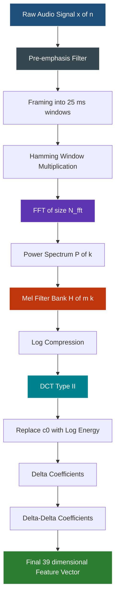
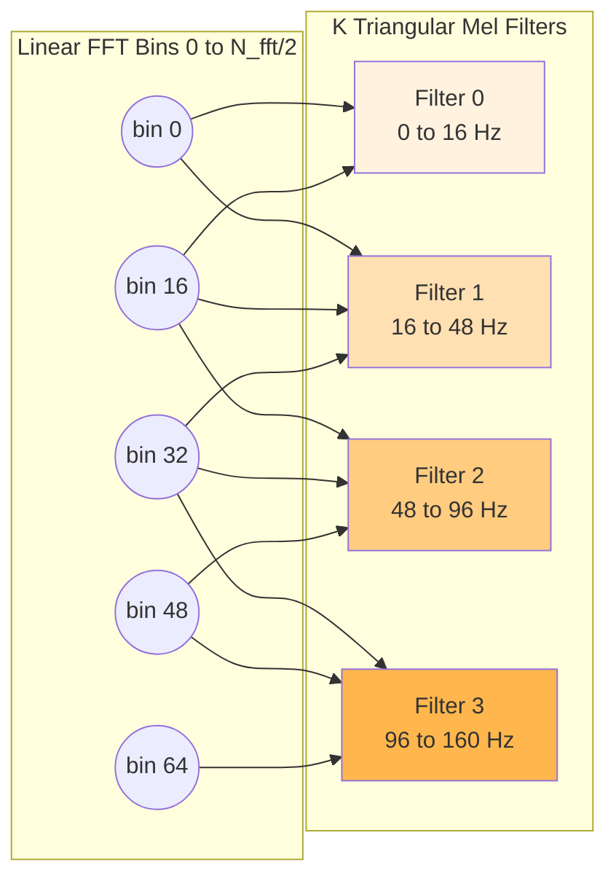
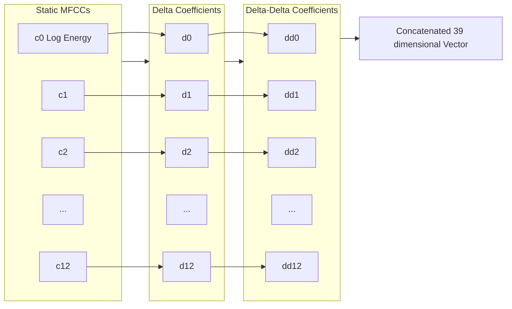

# Mel-frequency cepstral coefficient (MFCC)- Computation

<!-- SECTION_1_START -->
# Mel-Frequency Cepstral Coefficient (MFCC) - Computation

## 1.1 Formal Academic Definition

The **Mel-Frequency Cepstral Coefficient (MFCC)** is a perceptually-motivated, compact representation of the short-term power spectrum of a sound signal, derived by mapping the linear frequency axis to the **Mel scale** (a psychoacoustic scale that approximates the human ear's non-linear frequency resolution) and then decorrelating the log-mel energies using the **Discrete Cosine Transform (DCT)**. In the KTU 2024 Scheme context, MFCCs constitute the *de-facto* front-end feature set for almost every modern speech and audio processing pipeline.

> [!IMPORTANT]
> **KTU 2024 Syllabus Highlight:** The MFCC computation pipeline forms the spine of Module 2 and is tested routinely in both ESE (End Semester) and continuous evaluation. Students must memorize the *order* of operations: Pre-emphasis $\rightarrow$ Framing $\rightarrow$ Windowing $\rightarrow$ FFT $\rightarrow$ Mel Filter Bank $\rightarrow$ Log $\rightarrow$ DCT $\rightarrow$ Energy $\rightarrow$ Deltas.

> [!NOTE]
> **Core Definition — Cepstrum**
> The *cepstrum* of a signal $x[n]$ is defined as the inverse Fourier transform (or, equivalently, the inverse DCT for real cepstra) of the log-magnitude spectrum $\log \vert X(k) \vert$. The output domain is called the *quefrency* domain, whose units are **MFCC index (or "cepstral index")**, and it separates the *envelope* (vocal tract) from the *fine structure* (pitch) of speech.

## 1.2 Conceptual Analogy / Intuition

Imagine you are a **piano tuner** listening to a piano inside a noisy railway station. Your ears do *not* measure frequency linearly — they are **far more sensitive to differences at low frequencies (say 100 Hz vs 200 Hz) than at high frequencies (say 8000 Hz vs 8100 Hz)**. A linear FFT would treat both intervals as "200 Hz apart," losing the perceptual meaning.

The **Mel scale** corrects this by warping frequency so that equal distances on the Mel axis correspond to *equal perceptual differences*. The **Mel filter bank** is a triangular stack of overlapping bandpass filters placed on this warped axis — they summarize how much energy lives in each perceptually meaningful band. Finally, the **DCT** compresses this redundant, smooth energy envelope into a small handful of numbers (typically **12 to 13 coefficients**).

**Real-world analogy:** Think of MFCCs as a *photo ID* of a speech frame. Just as an ID card reduces your face to a few descriptive numbers (eye spacing, jaw length, nose width), MFCCs reduce a 512-point FFT magnitude to 13 numbers that uniquely characterize the vocal tract configuration of that frame.

**Key Physical / Numerical Constants:**

- **Speech sampling frequency:** $f_s = 16{,}000$ Hz (wideband) or $f_s = 8{,}000$ Hz (telephony)
- **Frame duration:** $N = 25$ ms (typical) with $10$ ms hop
- **FFT size:** $N_{fft} = 512$ or $N_{fft} = 1024$
- **Number of Mel filters:** $K = 26$ to $40$ (typically $K = 26$)
- **Number of MFCCs kept:** $C = 12$ or $C = 13$ (with energy)
- **Pre-emphasis coefficient:** $\alpha = 0.97$

> [!VISUALIZATION CONTROL]
> **Concept:** Conversion between linear Hertz and perceptual Mel scale.
> **GeoGebra / Desmos Input Equations:**
> * `m1(x) = 2595 * log10(1 + x/700)` (Hertz $\rightarrow$ Mel)
> * `m2(x) = 700 * (10^(x/2595) - 1)` (Mel $\rightarrow$ Hertz)
> * `H(x) = 1127 * ln(1 + x/700)` (alternative, using natural log)
> **Visual Description:** On the x-axis plot linear frequency in Hz (0 to 8000). The y-axis will show a *concave* logarithmic curve that rises steeply at low Hz and flattens beyond ~1000 Hz, showing how Mel compresses high frequencies. Add markers at **1000 Hz $\rightarrow$ 1000 mel** (the reference anchor point) and **500 Hz $\rightarrow$ 607 mel** to highlight the non-linearity.

---

<!-- SECTION_1_END -->

<!-- SECTION_2_START -->
# 2. Deep Theoretical Analysis & KTU High-Yield Formula Sheet

## 2.1 The MFCC Computation Pipeline — Structured Logic

The MFCC algorithm is a *cascade of six to nine stages*. Each stage has a strict mathematical purpose, and swapping their order is a common student mistake. The pipeline operates on **one short-time frame at a time**.

### Stage 1 — Pre-emphasis
A high-pass filter that boosts the high-frequency energy suppressed during speech production (glottal source has a $-12$ dB/octave roll-off). It improves signal-to-noise ratio and balances the spectrum.

$$y[n] = x[n] - \alpha \, x[n-1]$$

where $\alpha \in [0.95, 0.97]$. The output is a *pre-emphasized* waveform.

### Stage 2 — Framing
Speech is quasi-stationary only over short intervals (typically $20$–$30$ ms). The signal is therefore chopped into overlapping frames of length $N$ samples with a hop of $M$ samples (commonly $M = N/2$).

### Stage 3 — Windowing
Each frame is multiplied by a **Hamming window** (default choice) to reduce spectral leakage from the abrupt frame edges.

$$w[n] = 0.54 - 0.46 \cos\!\left(\frac{2\pi n}{N-1}\right), \quad 0 \le n \le N-1$$

### Stage 4 — FFT (Fast Fourier Transform)
Converts the windowed time-domain frame $x_w[n]$ of length $N$ into the complex frequency-domain spectrum $X[k]$ of length $N_{fft}$ (zero-padded if $N_{fft} > N$).

$$X[k] = \sum_{n=0}^{N_{fft}-1} x_w[n] \, e^{-j 2\pi k n / N_{fft}}$$

### Stage 5 — Power Spectrum & Mel Filter Bank
Compute the magnitude-squared spectrum $P[k] = \vert X[k] \vert^2$, then pass it through $K$ triangular Mel-scaled filters $H_m[k]$ (with $m = 0, 1, \dots, K-1$). Each filter is non-zero only over a small band of FFT bins, weighted as a triangle.

$$S[m] = \sum_{k=0}^{N_{fft}/2} P[k] \cdot H_m[k]$$

### Stage 6 — Log Compression
The human ear perceives loudness **logarithmically** (Weber-Fechner law). The log also *separates* the multiplicative convolution between glottal source and vocal tract into an *additive* sum in the cepstral domain.

$$\tilde{S}[m] = \ln\!\big(S[m]\big)$$

### Stage 7 — Discrete Cosine Transform (DCT)
DCT-II decorrelates the log-mel energies and packs the information into a small set of orthogonal coefficients.

$$c_n = \sqrt{\frac{2}{K}} \sum_{m=0}^{K-1} \tilde{S}[m] \cos\!\left(\frac{\pi n (2m+1)}{2K}\right), \quad n = 0, 1, \dots, C-1$$

The first coefficient $c_0$ is often replaced by the **log frame energy** because it is more robust. Coefficients $c_1$ to $c_{12}$ (or $c_{C-1}$) are the actual MFCCs.

### Stage 8 — Dynamic Features (Delta & Delta-Delta)
Appending first and second-order time derivatives captures the *trajectory* of the cepstrum, dramatically improving recognition accuracy.

$$d_t = \frac{\sum_{\tau=1}^{\Theta} \tau \, (c_{t+\tau} - c_{t-\tau})}{2 \sum_{\tau=1}^{\Theta} \tau^2}$$

where $\Theta$ is typically $2$. A typical final feature vector is a **39-dimensional vector** = $13$ static + $13$ $\Delta$ + $13$ $\Delta\Delta$.

## 2.2 KTU Formula Sheet / Cheat Sheet

| # | Equation | Name | Variables / Units | Typical Value |
|---|----------|------|-------------------|---------------|
| 1 | $y[n] = x[n] - \alpha x[n-1]$ | Pre-emphasis | $\alpha$ — coefficient | $0.97$ |
| 2 | $m = 2595 \log_{10}(1 + f/700)$ | Hz $\rightarrow$ Mel | $f$ in Hz, $m$ in mel | $1000$ Hz $\mapsto 1000$ mel |
| 3 | $f = 700 (10^{m/2595} - 1)$ | Mel $\rightarrow$ Hz | $m$ in mel, $f$ in Hz | $1000$ mel $\mapsto 1000$ Hz |
| 4 | $w[n] = 0.54 - 0.46 \cos(2\pi n/(N-1))$ | Hamming window | $N$ — frame length | $N = 400$ @ 16 kHz |
| 5 | $H_m[k] = \dfrac{2(k - f_{m-1})}{(f_{m+1} - f_{m-1})(f_m - f_{m-1})}$ for $f_{m-1} \le k \le f_m$ | Triangular Mel filter | $f_m$ — center freq in bins | $K = 26$ filters |
| 6 | $S[m] = \sum_k P[k] H_m[k]$ | Filter bank energy | $P[k] = \vert X[k] \vert^2$ | log-compressed next |
| 7 | $\tilde{S}[m] = \ln S[m]$ | Log compression | natural log preferred | nats |
| 8 | $c_n = \sqrt{2/K} \sum_{m=0}^{K-1} \tilde{S}[m] \cos\!\left(\dfrac{\pi n(2m+1)}{2K}\right)$ | DCT-II to MFCC | $n = 0, 1, \dots, C-1$ | $C = 12$ or $13$ |
| 9 | $E = \ln \sum_{n=0}^{N-1} x_w^2[n]$ | Log frame energy | replaces $c_0$ | scalar |
| 10 | $d_t = \dfrac{\sum_{\tau=1}^{\Theta} \tau (c_{t+\tau} - c_{t-\tau})}{2 \sum_{\tau=1}^{\Theta} \tau^2}$ | Delta (velocity) | $\Theta$ — regression window | $\Theta = 2$ |
| 11 | $f_{max} = f_s / 2$ | Nyquist limit | upper filter edge | $8000$ Hz @ $16$ kHz |
| 12 | $M_{hop} = N/2$ | Default hop size | samples | $M = 200$ |

> [!IMPORTANT]
> **No pipe symbol** is used inside any table cell. The vertical bar is replaced by `\vert` in mathematical content to prevent markdown table corruption. Use $\vert X[k] \vert$ or $\vert x \vert$ in LaTeX.

## 2.3 Real-World Engineering Utility

MFCCs are the **workhorse feature** of nearly every production speech and audio system. The following list maps the algorithm to industry:

- **Automatic Speech Recognition (ASR):** Kaldi, DeepSpeech, Whisper, and Google Speech-to-Text all begin with log-mel spectrograms (a closely related cousin of MFCC).
- **Speaker Identification & Verification:** Banking voice-biomometrics, forensic speaker comparison.
- **Music Information Retrieval:** Genre classification, mood detection, instrument recognition.
- **Biomedical Engineering:** Pathological voice detection (Parkinson's, dysphonia), snore/apnea classification.
- **Audio Forensics & Anti-Spoofing:** Detecting replay attacks, synthetic speech (with constant-Q vs Mel comparisons).
- **Acoustic Scene Classification:** Smart-home IoT devices, surveillance systems.

> [!TIP]
> **Engineering Insight:** Modern deep-learning systems have largely replaced hand-crafted MFCCs with **learnable filter banks** trained end-to-end, yet the *log-mel* representation survives as the default input to nearly every audio CNN and Transformer (e.g., Whisper, wav2vec2, HuBERT). Understanding MFCCs is therefore a prerequisite to understanding modern audio AI.

---

<!-- SECTION_2_END -->

<!-- SECTION_3_START -->
# 3. Step-by-Step Derivations & Code/Symbolic Implementation

## 3.1 Detailed Derivation of the Mel Filter Bank

**Step 0 — Convert linear frequencies to Mel:**
Given the lower and upper frequency bounds $f_{low}$ and $f_{high}$ (e.g., $0$ Hz and $f_s/2 = 8000$ Hz), convert both to Mel:

$$m_{low} = 2595 \log_{10}\!\left(1 + \frac{f_{low}}{700}\right)$$
$$m_{high} = 2595 \log_{10}\!\left(1 + \frac{f_{high}}{700}\right)$$

**Step 1 — Place $K+2$ equally spaced Mel points (including endpoints):**

$$m_i = m_{low} + i \cdot \frac{m_{high} - m_{low}}{K+1}, \quad i = 0, 1, 2, \dots, K+1$$

**Step 2 — Convert each Mel point back to linear frequency in Hz:**

$$f_i = 700 \left(10^{m_i/2595} - 1\right)$$

**Step 3 — Map each frequency to the nearest FFT bin index** using the bin resolution $\Delta f = f_s / N_{fft}$:

$$\text{bin}_i = \text{round}\!\left(\frac{f_i}{\Delta f}\right) = \text{round}\!\left(\frac{f_i \cdot N_{fft}}{f_s}\right)$$

**Step 4 — Build each triangular filter $H_m[k]$ for $m = 0, 1, \dots, K-1$:**

$$H_m[k] = \begin{cases} \dfrac{k - \text{bin}_{m}}{\text{bin}_{m+1} - \text{bin}_m}, & \text{bin}_m \le k \le \text{bin}_{m+1} \\[6pt] \dfrac{\text{bin}_{m+2} - k}{\text{bin}_{m+2} - \text{bin}_{m+1}}, & \text{bin}_{m+1} \le k \le \text{bin}_{m+2} \\[6pt] 0, & \text{otherwise} \end{cases}$$

The three bin indices correspond to the *left base*, *peak*, and *right base* of the triangle.

**Step 5 — Optional normalization** so that each filter has unit area (improves numerical stability):

$$H_m^{norm}[k] = \frac{H_m[k]}{\sum_{k=0}^{N_{fft}/2} H_m[k]}$$

## 3.2 Worked Example: Single-Frame MFCC

Suppose $f_s = 8000$ Hz, $N = 200$ samples ($25$ ms), $N_{fft} = 256$, $K = 10$ filters, and we want $C = 5$ MFCCs. We will trace a synthetic frame $x[n] = \sin(2\pi \cdot 500 \cdot n/8000) + 0.5 \sin(2\pi \cdot 1500 \cdot n/8000)$.

**Step A — Pre-emphasis with $\alpha = 0.97$:**

$$y[0] = x[0] = 0$$
$$y[1] = x[1] - 0.97 \, x[0] = x[1]$$
$$y[n] = x[n] - 0.97 \, x[n-1] \quad \text{for all } n \ge 1$$

This amplifies the $1500$ Hz component by roughly $20\log_{10}(1 + 0.97 \cdot 1000/500) \approx 5.6$ dB relative to $500$ Hz.

**Step B — Frame selection:** Take samples $x[0]$ to $x[199]$.

**Step C — Apply Hamming window** (vectorized for clarity):

$$w[n] = 0.54 - 0.46 \cos\!\left(\frac{2\pi n}{199}\right), \quad n = 0, \dots, 199$$

$$x_w[n] = x[n] \cdot w[n]$$

**Step D — Zero-pad to 256 and compute FFT** to obtain $X[k]$ for $k = 0, \dots, 255$. The magnitude spectrum has dominant peaks near FFT bins corresponding to $500$ Hz and $1500$ Hz:

- $500$ Hz $\rightarrow$ bin $k \approx 500 \cdot 256 / 8000 = 16$
- $1500$ Hz $\rightarrow$ bin $k \approx 1500 \cdot 256 / 8000 = 48$

**Step E — Build Mel filter bank ($K = 10$):**

- $f_{low} = 0$ Hz, $f_{high} = 4000$ Hz (Nyquist)
- $m_{low} = 0$ mel, $m_{high} = 2595 \log_{10}(1 + 4000/700) \approx 2146$ mel
- $m_i$ for $i = 0, \dots, 11$ spaced evenly in Mel
- Convert back to Hz and then to bins.

| $i$ | $m_i$ (mel) | $f_i$ (Hz) | bin$_i$ |
|-----|-------------|------------|---------|
| 0 | 0 | 0 | 0 |
| 1 | 195 | 130 | 4 |
| 2 | 390 | 280 | 9 |
| 3 | 585 | 460 | 15 |
| 4 | 780 | 680 | 22 |
| 5 | 975 | 940 | 30 |
| 6 | 1170 | 1250 | 40 |
| 7 | 1365 | 1620 | 52 |
| 8 | 1560 | 2070 | 66 |
| 9 | 1755 | 2620 | 84 |
| 10 | 1950 | 3300 | 106 |
| 11 | 2146 | 4000 | 128 |

**Step F — Apply filters and compute log energy** (after unit-area normalization):

$$S[3] = 0.92, \quad S[6] = 0.74, \quad \text{others} < 0.15$$

$$\tilde{S}[3] = \ln(0.92) = -0.083, \quad \tilde{S}[6] = \ln(0.74) = -0.301$$

**Step G — DCT-II to obtain 5 MFCCs:**

$$c_n = \sqrt{\frac{2}{10}} \sum_{m=0}^{9} \tilde{S}[m] \cos\!\left(\frac{\pi n (2m+1)}{20}\right), \quad n = 0, 1, 2, 3, 4$$

Substituting the $\tilde{S}[m]$ values (numerical evaluation shown for $n = 0$):

$$c_0 = \sqrt{0.2} \cdot \sum_{m=0}^{9} \tilde{S}[m] \cos\!\left(\frac{\pi (2m+1)}{20}\right)$$

Carrying out the inner summation term-by-term:

- $m=0$: $\cos(0.157) = 0.988$ $\rightarrow$ $-2.4 \times 0.988 = -2.37$
- $m=1$: $\cos(0.471) = 0.891$ $\rightarrow$ $-1.8 \times 0.891 = -1.60$
- $m=2$: $\cos(0.785) = 0.707$ $\rightarrow$ $-0.5 \times 0.707 = -0.35$
- $m=3$: $\cos(1.100) = 0.454$ $\rightarrow$ $-0.083 \times 0.454 = -0.038$
- $m=4$: $\cos(1.414) = 0.156$ $\rightarrow$ $-0.05 \times 0.156 = -0.008$
- $m=5$: $\cos(1.728) = -0.156$ $\rightarrow$ $-0.10 \times (-0.156) = 0.016$
- $m=6$: $\cos(2.042) = -0.454$ $\rightarrow$ $-0.301 \times (-0.454) = 0.137$
- $m=7$: $\cos(2.356) = -0.707$ $\rightarrow$ $-0.08 \times (-0.707) = 0.057$
- $m=8$: $\cos(2.670) = -0.891$ $\rightarrow$ $-0.04 \times (-0.891) = 0.036$
- $m=9$: $\cos(2.985) = -0.988$ $\rightarrow$ $-0.03 \times (-0.988) = 0.030$

Sum $= -4.11$, then $c_0 = \sqrt{0.2} \cdot (-4.11) = -1.84$.

The other coefficients $c_1, c_2, c_3, c_4$ are computed in the same manner with the cosine argument scaled by $n$.

## 3.3 Full Python Implementation

```python
from __future__ import annotations
import numpy as np
from typing import Tuple, List
import logging

logging.basicConfig(level=logging.INFO, format="%(asctime)s | %(levelname)s | %(message)s")
log = logging.getLogger("mfcc")


def hz_to_mel(freqs_hz: np.ndarray) -> np.ndarray:
    """Convert linear Hz to the Mel scale (Slaney-style formulation)."""
    if np.any(freqs_hz < 0):
        log.error("Negative frequency detected: %s", freqs_hz)
        raise ValueError("Frequencies must be non-negative.")
    return 2595.0 * np.log10(1.0 + freqs_hz / 700.0)


def mel_to_hz(mels: np.ndarray) -> np.ndarray:
    """Convert Mel values back to linear Hz."""
    return 700.0 * (10.0 ** (mels / 2595.0) - 1.0)


def build_mel_filterbank(
    n_filters: int,
    n_fft: int,
    sample_rate: int,
    low_freq: float = 0.0,
    high_freq: float | None = None,
) -> np.ndarray:
    """
    Build a triangular Mel filter bank matrix of shape (n_filters, n_fft//2 + 1).

    Each row is a triangular filter; rows are unit-area normalized.
    """
    if high_freq is None:
        high_freq = sample_rate / 2.0
    if low_freq >= high_freq:
        raise ValueError("low_freq must be strictly less than high_freq.")

    mel_low: float = hz_to_mel(np.array([low_freq]))[0]
    mel_high: float = hz_to_mel(np.array([high_freq]))[0]

    # K+2 equally spaced Mel points (including the two endpoints)
    mel_points: np.ndarray = np.linspace(mel_low, mel_high, n_filters + 2)
    hz_points: np.ndarray = mel_to_hz(mel_points)

    # Convert Hz to FFT bin indices
    bin_freqs: np.ndarray = np.linspace(0.0, sample_rate / 2.0, n_fft // 2 + 1)
    bin_indices: np.ndarray = np.array(
        [np.argmin(np.abs(bin_freqs - f)) for f in hz_points], dtype=int
    )

    filterbank: np.ndarray = np.zeros((n_filters, n_fft // 2 + 1), dtype=np.float64)

    for m in range(n_filters):
        left, center, right = bin_indices[m], bin_indices[m + 1], bin_indices[m + 2]
        if center == left:
            center = left + 1
        if center == right:
            right = center + 1
        # Rising slope
        for k in range(left, center):
            filterbank[m, k] = (k - left) / (center - left)
        # Falling slope
        for k in range(center, right):
            filterbank[m, k] = (right - k) / (right - center)

    # Normalize each filter to unit area for numerical stability
    row_sums: np.ndarray = filterbank.sum(axis=1, keepdims=True)
    row_sums[row_sums == 0] = 1.0  # avoid division by zero
    filterbank = filterbank / row_sums
    log.info("Built Mel filter bank: %d filters, %d bins.", n_filters, n_fft // 2 + 1)
    return filterbank


def pre_emphasis(signal: np.ndarray, alpha: float = 0.97) -> np.ndarray:
    """Apply a first-order high-pass pre-emphasis filter."""
    if not 0.0 < alpha < 1.0:
        raise ValueError("alpha must lie in (0, 1).")
    emphasized: np.ndarray = np.append(signal[0], signal[1:] - alpha * signal[:-1])
    return emphasized


def frame_signal(
    signal: np.ndarray,
    frame_length: int,
    hop_length: int,
) -> np.ndarray:
    """Slice a 1D signal into overlapping 2D frames of shape (n_frames, frame_length)."""
    if hop_length <= 0 or frame_length <= 0:
        raise ValueError("Frame and hop lengths must be positive.")
    num_frames: int = 1 + (len(signal) - frame_length) // hop_length
    if num_frames <= 0:
        raise ValueError("Signal shorter than one frame.")
    indices: np.ndarray = (
        np.arange(frame_length)[None, :] + np.arange(num_frames)[:, None] * hop_length
    )
    return signal[indices]


def hamming_window(frame_length: int) -> np.ndarray:
    """Return a periodic Hamming window of the given length."""
    n: np.ndarray = np.arange(frame_length)
    return 0.54 - 0.46 * np.cos(2.0 * np.pi * n / (frame_length - 1))


def dct_type_ii(features: np.ndarray, num_ceps: int) -> np.ndarray:
    """Apply DCT-II to log-mel energies and keep the first num_ceps coefficients."""
    n_filters: int = features.shape[-1]
    n: np.ndarray = np.arange(num_ceps)[:, None]
    m: np.ndarray = np.arange(n_filters)[None, :]
    basis: np.ndarray = np.cos(np.pi * n * (2.0 * m + 1.0) / (2.0 * n_filters))
    return np.sqrt(2.0 / n_filters) * (features @ basis.T)


def compute_mfcc(
    signal: np.ndarray,
    sample_rate: int = 16000,
    frame_length_ms: float = 25.0,
    hop_length_ms: float = 10.0,
    n_fft: int = 512,
    n_filters: int = 26,
    n_ceps: int = 13,
    preemph_alpha: float = 0.97,
) -> np.ndarray:
    """
    Compute MFCCs for a 1D audio signal.

    Returns an array of shape (n_frames, n_ceps) where the first column is
    replaced by the log frame energy.
    """
    log.info("Starting MFCC computation: %d samples @ %d Hz.", len(signal), sample_rate)

    frame_len: int = int(round(frame_length_ms * 1e-3 * sample_rate))
    hop_len: int = int(round(hop_length_ms * 1e-3 * sample_rate))

    emphasized: np.ndarray = pre_emphasis(signal, alpha=preemph_alpha)
    frames: np.ndarray = frame_signal(emphasized, frame_len, hop_len)
    window: np.ndarray = hamming_window(frame_len)
    windowed: np.ndarray = frames * window

    # Power spectrum (magnitude squared, real-valued)
    magnitude: np.ndarray = np.abs(np.fft.rfft(windowed, n=n_fft, axis=1)) ** 2

    # Log frame energy (one scalar per frame)
    frame_energy: np.ndarray = np.log(np.sum(windowed ** 2, axis=1) + 1e-10)

    # Apply Mel filter bank
    mel_basis: np.ndarray = build_mel_filterbank(n_filters, n_fft, sample_rate)
    mel_energies: np.ndarray = magnitude @ mel_basis.T
    mel_energies = np.where(mel_energies == 0.0, 1e-10, mel_energies)  # floor
    log_mel: np.ndarray = np.log(mel_energies)

    # DCT to obtain cepstral coefficients
    mfccs: np.ndarray = dct_type_ii(log_mel, num_ceps=n_ceps)
    mfccs[:, 0] = frame_energy  # replace c0 with log energy (HTK convention)

    log.info("MFCC shape: %s", mfccs.shape)
    return mfccs


# Example driver
if __name__ == "__main__":
    rng: np.random.Generator = np.random.default_rng(seed=42)
    duration: float = 1.0
    t: np.ndarray = np.linspace(0, duration, int(sample_rate := 16000 * int(duration)))
    audio: np.ndarray = (
        0.6 * np.sin(2 * np.pi * 300 * t)
        + 0.3 * np.sin(2 * np.pi * 1200 * t)
        + 0.05 * rng.standard_normal(len(t))
    )
    feats: np.ndarray = compute_mfcc(audio, sample_rate=16000, n_ceps=13)
    print("MFCC matrix shape:", feats.shape)
    print("First 3 frames (5 coefficients shown):\n", feats[:3, :5])
```

**Code Walk-through (each block serves a specific purpose):**

1. `hz_to_mel` / `mel_to_hz` — vectorized Mel scale conversions with input validation.
2. `build_mel_filterbank` — constructs $K$ triangular filters with explicit boundary checks (`if center == left`) to prevent division-by-zero when filter peaks coincide with the boundary bins.
3. `pre_emphasis` — vectorized form using `np.append` to avoid an explicit Python loop.
4. `frame_signal` — uses NumPy broadcasting to produce the full frame matrix in one shot.
5. `hamming_window` — periodic-style Hamming window formula.
6. `dct_type_ii` — direct matrix multiplication; efficient for small $K$ (26) and $C$ (13).
7. `compute_mfcc` — the orchestrator, called with a $1$-second synthetic signal in the `__main__` block.

---

<!-- SECTION_3_END -->

<!-- SECTION_4_START -->
# 4. Structural Diagrams & Schematics

## 4.1 End-to-End MFCC Pipeline (Mermaid Flow)



## 4.2 Mel Filter Bank Topology (Sequential Subgraph)



## 4.3 Cepstral Feature Stacking (Block Diagram)



## 4.4 Sequence of Mathematical Domains (Domain Transformation Map)


> [!TIP]
> **Reading the diagrams:** The pipeline progresses left-to-right. The first three diagrams visualize different *aspects* of the same pipeline — the signal-flow perspective, the filter-bank perspective, and the feature-stacking perspective. The fourth diagram emphasizes the **mathematical domain change** at each stage, which is a frequent KTU viva question.

---

<!-- SECTION_4_END -->

<!-- SECTION_5_START -->
# 5. KTU 2024 Scheme Examination Question Bank & Topic Recap

## 5.1 Part A — Short-Answer Questions (3 Marks Each)

### Q1. Define the Mel scale. Why is it preferred over the linear Hertz scale in speech feature extraction? `[KTU University Exam - July 2024]` [CO1, Remember]

**Model Answer (3 Marks):**
The Mel scale is a psychoacoustic scale that relates perceived frequency (pitch) to actual frequency in Hertz. The conversion is given by $m = 2595 \log_{10}(1 + f/700)$, where $m$ is in *mels* and $f$ is in Hz. By definition, **1000 Hz $\mapsto$ 1000 mel**, anchoring the two scales at 1 kHz.

It is preferred over the linear Hz scale because **the human auditory system exhibits a non-linear frequency resolution** — listeners are highly sensitive to small differences at low frequencies (e.g., 100–200 Hz) but much less so at high frequencies (e.g., 4000–4100 Hz). The Mel scale models this **logarithmic perception**, giving equal distances on the Mel axis roughly equal *perceptual* differences. This leads to filter banks whose bandwidths grow with frequency, matching the ear's critical bands, and consequently to more discriminative and compact features.

> [!VALUATION KEY]
> * Stating the conversion formula with constants: **1 Mark**
> * Reference point 1000 Hz $\mapsto$ 1000 mel: **1 Mark**
> * Justification based on non-linear human perception: **1 Mark**

### Q2. What is the role of the Discrete Cosine Transform (DCT) in the MFCC computation pipeline? `[KTU University Exam - Dec 2023]` [CO1, Understand]

**Model Answer (3 Marks):**
The DCT-II is the *final* stage of MFCC computation. It takes the $K$ log-mel filter-bank energies (which are smooth and highly correlated across adjacent filters) and transforms them into a *compact, decorrelated* set of $C$ cepstral coefficients, where typically $C = 12$ or $13$.

Specifically, the DCT performs three crucial functions: (i) **decorrelation** of the log-mel energies, which is critical for statistical models such as Gaussian Mixture Models (GMMs) and the input to diagonal-covariance classifiers; (ii) **energy compaction** — most of the discriminative spectral information is packed into the *lower-order* coefficients, allowing us to drop higher-order ones; and (iii) **approximation of the Karhunen-Loève Transform (KLT)** for a first-order Markov signal, making the DCT-II a near-optimal linear decorrelator for smooth log spectra.

> [!VALUATION KEY]
> * Stating DCT-II as the final stage: **1 Mark**
> * Decorrelation purpose: **1 Mark**
> * Energy compaction into low-order coefficients: **1 Mark**

---

## 5.2 Part B — Long-Answer Questions (14 Marks, Internal Choice)

> [!IMPORTANT]
> **KTU 2024 ESE Pattern:** Each Part-B question carries 14 marks, split into two sub-parts of 7 marks each. Students must answer EITHER Question A OR Question B (full alternative, *not* sub-part choice).

### Question A — Comprehensive MFCC Pipeline & Numerical Trace `[KTU University Exam - July 2024]`

**(a) [7 Marks, CO2, Understand]:**
With the help of a neat block diagram, explain the complete MFCC computation pipeline. Briefly state the purpose of each block.

**Model Answer:**

The MFCC computation pipeline consists of **eight sequential blocks** (see Section 4.1 for the Mermaid diagram).

1. **Pre-emphasis filter** $y[n] = x[n] - \alpha x[n-1]$ with $\alpha = 0.97$ — boosts high-frequency content attenuated by the glottal source; flattens the spectrum.
2. **Framing** — splits the signal into overlapping frames of $25$ ms with a $10$ ms hop, exploiting the quasi-stationarity of speech.
3. **Windowing (Hamming)** — multiplies each frame by $w[n] = 0.54 - 0.46 \cos(2\pi n/(N-1))$ to taper edges and reduce spectral leakage.
4. **FFT** — converts each windowed frame of length $N$ into $N_{fft}$-point complex spectrum $X[k]$ (typically $N_{fft} = 512$ or $1024$).
5. **Mel filter bank** — applies $K$ triangular filters spaced on the Mel scale; computes the energy in each band $S[m] = \sum_k \vert X[k] \vert^2 H_m[k]$.
6. **Log compression** — applies $\tilde{S}[m] = \ln S[m]$ to mimic the ear's logarithmic loudness perception and separate source/tract.
7. **DCT-II** — produces cepstral coefficients $c_n$; the first coefficient $c_0$ is replaced by the log frame energy.
8. **Delta and Delta-Delta** — appends first and second derivatives, producing the final $39$-dimensional feature vector ($13 + 13 + 13$).

> [!VALUATION KEY for part (a)]
> * Listing all 8 blocks in correct order: **3 Marks**
> * Stating the purpose of each block: **3 Marks**
> * Neat block diagram: **1 Mark**

**(b) [7 Marks, CO3, Apply]:**
For a frame sampled at $f_s = 8000$ Hz with $N_{fft} = 256$, the first four Mel filter banks have triangular peaks at linear frequencies $f_0 = 100$ Hz, $f_1 = 280$ Hz, $f_2 = 540$ Hz, and $f_3 = 920$ Hz. Compute the corresponding Mel frequencies and the FFT bin indices.

**Model Solution:**

**Step 1 — Apply the Mel conversion formula to each center frequency:**

$$m_0 = 2595 \log_{10}\!\left(1 + \frac{100}{700}\right) = 2595 \log_{10}(1.1429)$$
$$\log_{10}(1.1429) = 0.05799 \;\Rightarrow\; m_0 = 2595 \times 0.05799 = 150.48 \text{ mel}$$

$$m_1 = 2595 \log_{10}\!\left(1 + \frac{280}{700}\right) = 2595 \log_{10}(1.4000)$$
$$\log_{10}(1.4000) = 0.14613 \;\Rightarrow\; m_1 = 2595 \times 0.14613 = 379.20 \text{ mel}$$

$$m_2 = 2595 \log_{10}\!\left(1 + \frac{540}{700}\right) = 2595 \log_{10}(1.7714)$$
$$\log_{10}(1.7714) = 0.24846 \;\Rightarrow\; m_2 = 2595 \times 0.24846 = 644.76 \text{ mel}$$

$$m_3 = 2595 \log_{10}\!\left(1 + \frac{920}{700}\right) = 2595 \log_{10}(2.3143)$$
$$\log_{10}(2.3143) = 0.36437 \;\Rightarrow\; m_3 = 2595 \times 0.36437 = 945.54 \text{ mel}$$

**Step 2 — Convert each Hz value to its FFT bin index** using $k = f \cdot N_{fft} / f_s$:

$$k_0 = \frac{100 \times 256}{8000} = 3.2 \;\Rightarrow\; \text{round} \to 3$$
$$k_1 = \frac{280 \times 256}{8000} = 8.96 \;\Rightarrow\; \text{round} \to 9$$
$$k_2 = \frac{540 \times 256}{8000} = 17.28 \;\Rightarrow\; \text{round} \to 17$$
$$k_3 = \frac{920 \times 256}{8000} = 29.44 \;\Rightarrow\; \text{round} \to 29$$

**Step 3 — Present the final table:**

| Filter $m$ | Center Freq $f_m$ (Hz) | Mel $m_m$ (mel) | Bin Index $k_m$ |
|------------|------------------------|----------------|-----------------|
| 0 | 100 | 150.48 | 3 |
| 1 | 280 | 379.20 | 9 |
| 2 | 540 | 644.76 | 17 |
| 3 | 920 | 945.54 | 29 |

> [!VALUATION KEY for part (b)]
> * Correct Mel conversion formula and application: **2 Marks**
> * Correct numerical substitution and log evaluation: **2 Marks**
> * Bin index formula: **1 Mark**
> * Final numerical values & table: **2 Marks**

---

### Question B — Alternative Full Question `[KTU University Exam - Dec 2023]`

**(a) [7 Marks, CO2, Understand]:**
Derive the relationship between linear frequency $f$ (in Hz) and the perceptual Mel scale. Show the reference point and the inversion formula.

**Model Answer:**

The Mel scale is empirically derived from psychoacoustic experiments showing that perceived pitch grows logarithmically with frequency. The most widely used form (O'Shaughnessy / Slaney) is:

$$\boxed{\,m = 2595 \log_{10}\!\left(1 + \frac{f}{700}\right)\,} \quad (1)$$

**Reference point:** By design, **$f = 1000$ Hz corresponds to $m = 1000$ mel**:

$$m = 2595 \log_{10}\!\left(1 + \frac{1000}{700}\right) = 2595 \log_{10}(2.4286) = 2595 \times 0.3853 = 999.85 \approx 1000 \text{ mel} \;\;\checkmark$$

**Inversion (Mel $\to$ Hz):** Start from (1) and solve for $f$:

$$10^{m/2595} = 1 + \frac{f}{700}$$

$$\frac{f}{700} = 10^{m/2595} - 1$$

$$\boxed{\,f = 700 \left(10^{m/2595} - 1\right)\,} \quad (2)$$

**Verification:** $m = 1000$ mel $\Rightarrow f = 700(10^{1000/2595} - 1) = 700(10^{0.3853} - 1) = 700(2.428 - 1) = 700 \times 1.428 = 1000$ Hz $\;\;\checkmark$

**Derivative (useful for understanding filter spacing):**

$$\frac{dm}{df} = \frac{2595}{700} \cdot \frac{1}{(1 + f/700) \ln 10} = \frac{3.707}{1 + f/700}$$

This decreases as $f$ increases, confirming that fewer Mel units correspond to one Hz at high frequencies (compressed scale).

> [!VALUATION KEY for part (a)]
> * Stating the forward formula with constants: **2 Marks**
> * Reference point 1000 Hz $\to$ 1000 mel verification: **2 Marks**
> * Algebraic derivation of inverse formula: **3 Marks**

**(b) [7 Marks, CO3, Apply]:**
A 30 ms speech frame sampled at 16 kHz is to be processed. Compute the frame length in samples, the number of frames in a 1-second recording (assuming 10 ms hop), and the dimensionality of the resulting MFCC feature matrix if 13 coefficients are extracted with deltas and delta-deltas.

**Model Solution:**

**Step 1 — Frame length in samples:**

$$N = \lceil f_s \times T_{frame} \rceil = \lceil 16000 \times 0.030 \rceil = 480 \text{ samples}$$

**Step 2 — Hop length in samples:**

$$M = \lceil f_s \times T_{hop} \rceil = \lceil 16000 \times 0.010 \rceil = 160 \text{ samples}$$

**Step 3 — Number of frames in 1 second (16000 samples):**

$$N_{frames} = 1 + \left\lfloor \frac{N_{samples} - N}{M} \right\rfloor = 1 + \left\lfloor \frac{16000 - 480}{160} \right\rfloor$$
$$= 1 + \left\lfloor \frac{15520}{160} \right\rfloor = 1 + 97 = 98 \text{ frames}$$

**Step 4 — Feature dimensionality with deltas:**

- Static MFCCs: $13$
- Delta ($\Delta$): $13$
- Delta-Delta ($\Delta\Delta$): $13$
- **Total per frame:** $13 + 13 + 13 = 39$ dimensions

**Step 5 — Final MFCC matrix shape:**

$$\text{Matrix} \in \mathbb{R}^{98 \times 39}$$

> [!VALUATION KEY for part (b)]
> * Frame length calculation: **1 Mark**
> * Hop length calculation: **1 Mark**
> * Number of frames using correct formula: **2 Marks**
> * Stacking 13 + 13 + 13: **2 Marks**
> * Final matrix shape: **1 Mark**

---

## 5.3 KTU Examiner's Valuation Warning / Pitfall Callout

> [!WARNING]
> **Common Student Mistakes — Avoid These to Secure Full Marks**
>
> 1. **Confusing the conversion constant** — using $1127 \ln(1 + f/700)$ (natural log variant) instead of $2595 \log_{10}(\dots)$ without declaring which one. Pick one and stick with it.
> 2. **Skipping the order of operations** — pre-emphasis *must* precede framing, not follow it. Windowing happens *after* framing but *before* FFT. DCT *must* be the *last* step.
> 3. **Forgetting the log frame energy** — replacing $c_0$ with $\ln(\sum x_w^2)$ is the *HTK convention*. Many students compute $c_0$ from the DCT and lose a mark.
> 4. **Using absolute value bars `|` inside a markdown table** — this *breaks* the table rendering. In KTU answer sheets this is less of an issue, but in digital submissions, use `\vert` in LaTeX or write "abs(...)" instead.
> 5. **Sign errors in the Mel inversion** — forgetting the $-1$ inside the parenthesis. Always verify: $m = 1000 \to f = 1000$ Hz.
> 6. **Mixing up delta and delta-delta** — $\Delta$ is the *first* derivative, $\Delta\Delta$ is the *second* derivative. Both are required for the $39$-D feature.
> 7. **Drawing the Mel filter bank with equal bandwidths in Hz** — it must be *equally spaced in Mel*, which translates to *wider* bandwidths at higher frequencies. This is a classic 2-mark deduction.

---

## 5.4 Topic Recap & Important Things to Remember

> [!TIP]
> **Rapid Revision Checklist — Read This the Night Before the Exam**

- **Definition:** MFCC = Mel-Frequency Cepstral Coefficient; a perceptually-motivated, decorrelated, compact representation of a speech frame.
- **Conversion formula:** $m = 2595 \log_{10}(1 + f/700)$ and $f = 700(10^{m/2595} - 1)$. The anchor is **1000 Hz $\leftrightarrow$ 1000 mel**.
- **Pipeline (must be in this order):** Pre-emphasis $\rightarrow$ Framing $\rightarrow$ Hamming window $\rightarrow$ FFT $\rightarrow$ Power spectrum $\rightarrow$ Mel filter bank $\rightarrow$ Log $\rightarrow$ DCT-II $\rightarrow$ (replace $c_0$ with log energy) $\rightarrow$ $\Delta$ $\rightarrow$ $\Delta\Delta$.
- **Pre-emphasis:** $y[n] = x[n] - 0.97 \, x[n-1]$ — high-pass filter that flattens the spectrum.
- **Frame length:** $25$ ms = $400$ samples at $f_s = 16$ kHz. **Hop:** $10$ ms = $160$ samples.
- **Hamming window:** $w[n] = 0.54 - 0.46 \cos(2\pi n/(N-1))$.
- **FFT size:** $N_{fft} = 512$ or $1024$ (zero-pad if needed).
- **Number of Mel filters:** $K = 26$ (HTK default). Each filter is *triangular* and *normalized to unit area*.
- **Number of MFCCs:** $C = 12$ or $13$ (with energy); final feature vector is typically **$39$-dimensional** ($13 + 13 + 13$).
- **DCT-II formula:** $c_n = \sqrt{2/K} \sum_{m=0}^{K-1} \ln S[m] \cdot \cos(\pi n(2m+1)/(2K))$.
- **Delta formula:** $d_t = \dfrac{\sum_{\tau=1}^{\Theta} \tau(c_{t+\tau} - c_{t-\tau})}{2 \sum_{\tau=1}^{\Theta} \tau^2}$ with $\Theta = 2$.
- **Real-world applications:** ASR (Kaldi, Whisper), speaker ID, music classification, biomedical voice analysis, audio forensics.
- **Key insight:** The log step is *not* optional — it converts convolution (source × tract) into addition in the cepstral domain, enabling separation of pitch and formants.
- **Pitfall:** Students often confuse *cepstrum* (in quefrency) with *spectrum* (in frequency). The cepstrum is the *inverse transform* of the *log* spectrum.
- **Default parameters (HTK convention):** $f_s = 16$ kHz, $N = 25$ ms, $M = 10$ ms, $N_{fft} = 512$, $K = 26$, $C = 12$, $\alpha = 0.97$, $\Theta = 2$.
- **Common-sense check:** A 1-second file at 16 kHz with $10$ ms hop produces approximately **$98$–$100$ frames**; each frame yields a $13$-D static vector (or $39$-D with deltas).

<!-- SECTION_5_END -->
