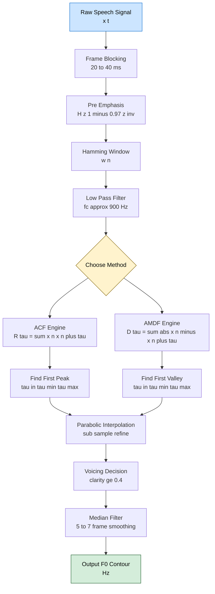
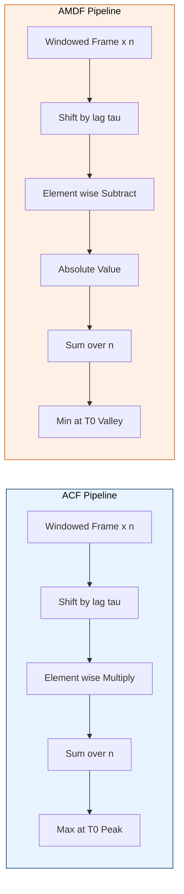
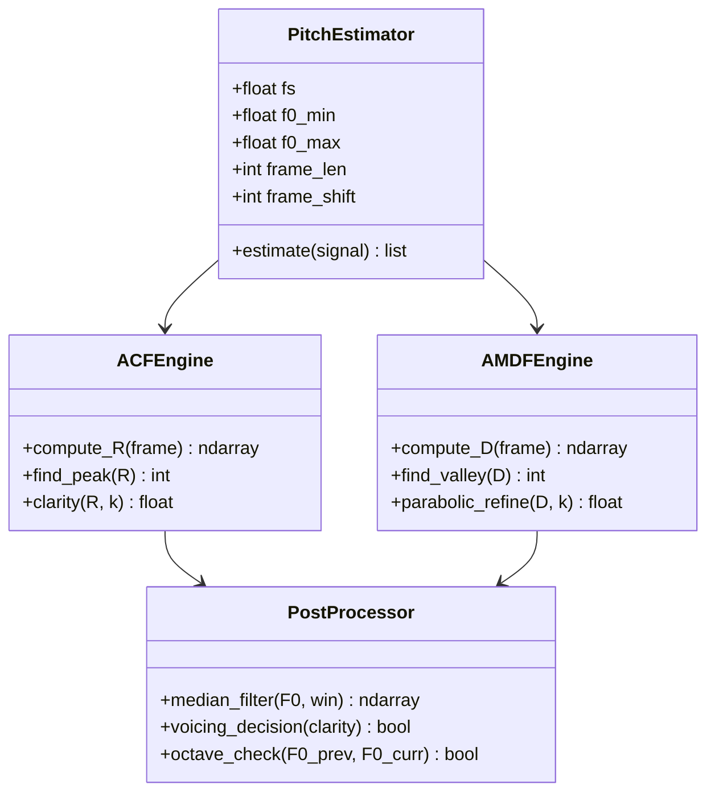
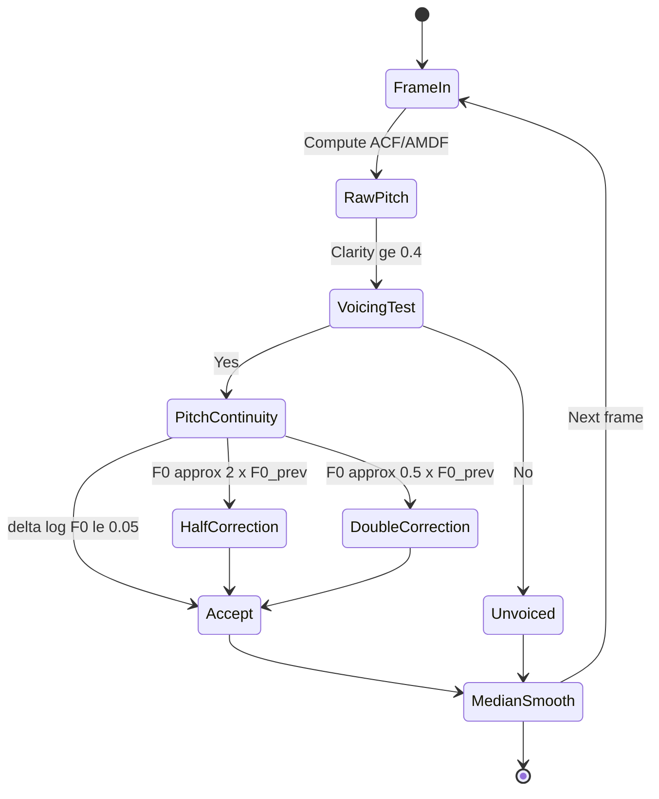

# Pitch Estimation ACF/AMDF approaches

<!-- SECTION_1_START -->

# Pitch Estimation using ACF and AMDF Approaches

## 1. Core Technical Definition

### 1.1 Pitch — Formal Definition (KTU 2024 Syllabus Terminology)

> [!IMPORTANT]
> **Pitch (Fundamental Frequency, F₀):** The rate at which the vocal folds vibrate during voiced speech production, producing a quasi-periodic glottal excitation. It is the lowest sinusoidal component (fundamental) of a harmonically rich voiced speech segment, typically lying between **80 Hz and 400 Hz** for human speakers.

**Perceptual vs. Physical Pitch:**
- *Physical pitch* = the fundamental frequency $F_0$ measured in Hertz (Hz).
- *Perceptual pitch* = the psychoacoustic sensation of "how high or low" a sound appears, which is approximately (but not perfectly) logarithmically related to $F_0$.

| Speaker Class | Typical $F_0$ Range (Hz) |
| :--- | :--- |
| Adult Male | **85 – 180** |
| Adult Female | **165 – 255** |
| Children | **250 – 400** |

### 1.2 Intuitive Real-World Analogy

> [!NOTE]
> **Analogy — The Pendulum Clock:** Imagine tapping a table rhythmically with a pen. Your taps are the *glottal pulses* (glottal closures). If you tap once every 0.005 seconds, that "tap rate" is the pitch period $T_0$, and the inverse (1 / 0.005 = 200 Hz) is the pitch $F_0$. The **Autocorrelation Function (ACF)** is like asking: "If I overlay two recordings of your taps but shift one by a small time delay, at what delay do the taps line up perfectly again?" The **AMDF** is the same question, but instead of measuring *overlap (multiplication)*, it measures *disagreement (absolute difference)*.

### 1.3 Time-Domain Pitch Estimation — Why?

Among the three classical pitch estimation paradigms (Time, Frequency, Cepstral), time-domain methods are favoured for the following reasons:

> [!IMPORTANT]
> 1. **Direct periodicity analysis** — Pitch is fundamentally a *periodicity* feature; the autocorrelation/difference function directly exposes that periodicity in the lag axis.
> 2. **Low computational load** — Only real multiplications and additions (ACF) or absolute differences (AMDF), no FFT required for the basic algorithm.
> 3. **Robustness to spectral tilt** — Pitch is a temporal property, immune to vocal-tract resonances (formants).
> 4. **Real-time suitability** — Easily implemented on DSP / embedded boards (one sample in, one sample out).

### 1.4 Pre-processing Block (Mandatory)

Before applying ACF or AMDF, the speech signal is conditioned as follows:

1. **Frame Blocking** — Speech is sliced into 20–40 ms frames (e.g., 30 ms at 16 kHz → **480 samples/frame**).
2. **Windowing** — A Hamming or Hanning window $w(n)$ is applied to reduce spectral leakage:
   $$w(n) = 0.54 - 0.46 \cos\left(\frac{2\pi n}{N-1}\right)$$
3. **Low-Pass Filtering** — Since $F_0$ rarely exceeds 400 Hz, an LPF with cutoff around **800 Hz – 1000 Hz** removes the high-frequency harmonics that bias the periodicity detector.
4. **Optional Center Clipping** — A non-linear amplitude thresholding that suppresses the formant ripple and emphasises the glottal closure instants.

> [!VISUALIZATION CONTROL]
> **Concept:** A 30 ms voiced speech frame showing a quasi-periodic glottal pulse train.
> **GeoGebra / Desmos Input Equations:**
> * `f(t) = sum((k=1 to 5) sin(2π·k·140·t) · exp(-3·k·(t - n·T0)))` (glottal-source-like waveform)
> * `T0 = 1/140 ≈ 7.14 ms`
> **Visual Description:** A waveform with sharp, periodic negative-going pulses separated by $T_0 \approx 7.14$ ms. Students should observe that the cycle visibly repeats roughly every 7 ms, foreshadowing the ACF peak location.

<!-- SECTION_1_END -->

<!-- SECTION_2_START -->

# Deep Theoretical Analysis & KTU High-Yield Formula Sheet

## 2.1 Autocorrelation Function (ACF)

### 2.1.1 Mathematical Definition

For a discrete, windowed speech frame $x(n)$ of length $N$, the **short-time autocorrelation function** at lag $\tau$ is defined as:

$$R(\tau) = \sum_{n=0}^{N-\tau-1} x(n) \, x(n + \tau), \quad \tau = 0, 1, 2, \ldots, N-1$$

The corresponding **normalised autocorrelation** (used for unbiased comparison) is:

$$\hat{R}(\tau) = \frac{\sum_{n=0}^{N-\tau-1} x(n) \, x(n + \tau)}{\sqrt{\sum_{n=0}^{N-\tau-1} x^2(n) \cdot \sum_{n=0}^{N-\tau-1} x^2(n+\tau)}}$$

### 2.1.2 The Pitch-Period Principle

> [!IMPORTANT]
> **Key Theorem:** For a perfectly periodic signal of period $T_0$, $R(\tau)$ attains its **global maximum (excluding $\tau = 0$)** at $\tau = T_0$. The ratio
> $$r = \frac{R(T_0)}{R(0)}$$
> is called the **clarity** or **periodicity index**, bounded by $0 \le r \le 1$. A high $r$ (typically $\ge 0.4$) indicates a strongly voiced frame.

### 2.1.3 Algorithmic Steps

1. Window the speech frame.
2. Apply an LPF at ~900 Hz.
3. Compute $R(\tau)$ for the lag search range:
   $$\tau_{\min} = \left\lfloor \frac{F_s}{F_{0,\max}} \right\rfloor, \quad \tau_{\max} = \left\lfloor \frac{F_s}{F_{0,\min}} \right\rfloor$$
   For $F_s = 16$ kHz, $F_0 \in [80, 400]$ Hz ⇒ $\tau \in [40, 200]$ samples.
4. Locate the first local maximum of $R(\tau)$ for $\tau \ge \tau_{\min}$.
5. Set $T_0 = \tau_{\text{peak}}$ and $F_0 = F_s / T_0$.
6. Validate using clarity $R(T_0) / R(0) \ge 0.4$ to declare a **voiced** frame; otherwise mark as **unvoiced**.

### 2.1.4 ACF — Pros and Cons

| Strength | Weakness |
| :--- | :--- |
| Excellent periodicity detection for clean voiced segments | Computationally expensive ($O(N^2)$ multiplications) |
| Provides a periodicity confidence score $R(T_0)/R(0)$ | The secondary peak at $2T_0$ may be mis-identified as the fundamental |
| Theory: matches the Wiener–Khinchin relation with PSD | Sensitive to additive noise; degrades at low SNR |
| Coincides with the **maximum likelihood estimator** for periodic signals in Gaussian noise | Cannot reliably handle **octave jumps** (sub-harmonic errors) without prior smoothing |

### 2.2 Average Magnitude Difference Function (AMDF)

### 2.2.1 Mathematical Definition

The AMDF is the **L¹-norm** counterpart of the ACF:

$$D(\tau) = \sum_{n=0}^{N-\tau-1} |x(n) - x(n+\tau)|, \quad \tau = 0, 1, 2, \ldots, N-1$$

A **normalised** form widely used in modern codecs (e.g., MELP, FS-1015) is:

$$\hat{D}(\tau) = \frac{\sum_{n=0}^{N-\tau-1} |x(n) - x(n+\tau)|}{\sum_{n=0}^{N-\tau-1} \bigl(|x(n)| + |x(n+\tau)|\bigr)}$$

### 2.2.2 The Pitch-Period Principle (Duality)

> [!IMPORTANT]
> **Duality Theorem:** For a perfectly periodic signal of period $T_0$, $D(\tau)$ attains its **global minimum (valley)** at $\tau = T_0$, and at integer multiples $2T_0, 3T_0, \ldots$ — i.e., **the AMDF minima coincide with the ACF maxima** but in inverted form.

### 2.2.3 Algorithmic Steps

1. Window + LPF (same as ACF).
2. Compute $D(\tau)$ for the lag range $[\tau_{\min}, \tau_{\max}]$.
3. Locate the first local **minimum** of $D(\tau)$.
4. Set $T_0 = \tau_{\text{valley}}$, $F_0 = F_s / T_0$.
5. (Optional) Apply a **3-point parabolic interpolation** around the minimum to refine $T_0$ to sub-sample accuracy.

### 2.2.4 AMDF — Pros and Cons

| Strength | Weakness |
| :--- | :--- |
| **Cheaper** than ACF (no multiplications, only absolute differences & additions) | The function is **not flat at large lags**; the global minimum may drift to the boundary |
| Naturally handles amplitude-scaled periodic segments | Sensitive to DC offset and amplitude modulation |
| Compatible with integer arithmetic (DSP-friendly) | Deeper valleys at $2T_0$ can trap the search ⇒ **octave errors** |
| Good in clean studio speech | More sensitive to high-frequency noise than ACF |

### 2.3 ACF vs AMDF — Comparative Synthesis

| Property | ACF | AMDF |
| :--- | :--- | :--- |
| Mathematical operator | Multiplication (L² inner product) | Absolute difference (L¹ distance) |
| Computational cost | Higher (multiplier) | Lower (subtract + abs) |
| Pitch marker at $T_0$ | **Maximum (peak)** | **Minimum (valley)** |
| Confidence measure | Clarity $R(T_0)/R(0)$ | Normalised depth $1 - \hat{D}(T_0)$ |
| Noise sensitivity | Lower for Gaussian noise | Higher for impulsive noise |
| Octave errors | Fewer (clarity threshold helps) | More (deeper valleys at multiples) |
| Real-time DSP implementation | Needs MAC unit | Needs only ADD/CMP unit |
| Used in | Praat, STRAIGHT, RAPT, YIN | MELP, FS-1015, MBE vocoders |

### 2.4 KTU High-Yield Formula Sheet

| Symbol | Formula / Range | Physical Meaning | Units |
| :--- | :--- | :--- | :--- |
| $F_0$ | $F_0 = F_s / T_0$ | Fundamental frequency | Hz |
| $T_0$ | $T_0 = F_s / F_0$ | Pitch period (lag of ACF peak) | samples |
| $\tau_{\min}$ | $\left\lfloor F_s / F_{0,\max} \right\rfloor = 40$ (for $F_s = 16$ kHz) | Smallest searchable lag | samples |
| $\tau_{\max}$ | $\left\lfloor F_s / F_{0,\min} \right\rfloor = 200$ (for $F_s = 16$ kHz) | Largest searchable lag | samples |
| $R(\tau)$ | $\sum_{n=0}^{N-\tau-1} x(n) x(n+\tau)$ | Short-time autocorrelation | — |
| $\hat{R}(\tau)$ | $R(\tau) / R(0)$ | Normalised ACF | dimensionless, $\in [-1, 1]$ |
| Clarity $r$ | $R(T_0)/R(0)$ | Periodicity confidence | dimensionless |
| $D(\tau)$ | $\sum_{n=0}^{N-\tau-1} \vert x(n) - x(n+\tau) \vert$ | AMDF | — |
| $w(n)$ | $0.54 - 0.46 \cos(2\pi n/(N-1))$ | Hamming window | — |
| LPF cutoff | $f_c \approx 2 F_{0,\max} \approx \mathbf{800 \text{ Hz}}$ | Anti-aliasing for pitch band | Hz |
| Voicing threshold | $r \ge \mathbf{0.4}$ | Decision rule for voiced/unvoiced | — |

### 2.5 Real-World Engineering Utility

> [!NOTE]
> **Production Use Cases of ACF/AMDF in Industry:**
> 1. **Low-bit-rate vocoders** — MELP (2.4 kbps) and FS-1015 LPC-10e use AMDF for F0 estimation because it is DSP-efficient.
> 2. **Speech synthesis (TTS)** — Concatenative TTS engines (e.g., Google TTS, Amazon Polly) use pitch contours extracted by ACF for prosody generation.
> 3. **Speaker recognition** — Pitch trajectories form a biometric signature in forensic and biometric speaker ID systems.
> 4. **Emotion / sentiment analysis** — Mean and variance of $F_0$ are key prosodic features for detecting anger, sadness, happiness.
> 5. **Music Information Retrieval (MIR)** — Melody extraction, singer-vs-instrument separation, and karaoke scoring apps.
> 6. **Biomedical signal processing** — Cry analysis of neonates (cry pitch correlates with neurological health); pathological voice analysis (dysphonia detection).

<!-- SECTION_2_END -->

<!-- SECTION_3_START -->

# Step-by-Step Derivations, Code & Worked Examples

## 3.1 Worked Example — ACF by Hand

Let a pre-emphasised, windowed voiced frame be the simple periodic signal:

$$x = [\, 2, \; -1, \; 0, \; 1, \; 2, \; -1, \; 0, \; 1\,], \quad N = 8, \quad F_s = 8 \text{ kHz}$$

The true period is $T_0 = 4$ samples (the sequence repeats every 4 entries), hence $F_0 = 8000 / 4 = 2000$ Hz (an artificial high-pitch toy example to expose the algorithm).

**Step 1 — Compute $R(0)$ (energy):**

$$\begin{aligned}
R(0) &= \sum_{n=0}^{7} x^2(n) \\
&= 2^2 + (-1)^2 + 0^2 + 1^2 + 2^2 + (-1)^2 + 0^2 + 1^2 \\
&= 4 + 1 + 0 + 1 + 4 + 1 + 0 + 1 = 12
\end{aligned}$$

**Step 2 — Compute $R(1)$:**

$$\begin{aligned}
R(1) &= \sum_{n=0}^{6} x(n)\,x(n+1) \\
&= (2)(-1) + (-1)(0) + (0)(1) + (1)(2) + (2)(-1) + (-1)(0) + (0)(1) \\
&= -2 + 0 + 0 + 2 - 2 + 0 + 0 = -2
\end{aligned}$$

**Step 3 — Compute $R(2)$:**

$$\begin{aligned}
R(2) &= \sum_{n=0}^{5} x(n)\,x(n+2) \\
&= (2)(0) + (-1)(1) + (0)(2) + (1)(-1) + (2)(0) + (-1)(1) \\
&= 0 - 1 + 0 - 1 + 0 - 1 = -3
\end{aligned}$$

**Step 4 — Compute $R(3)$:**

$$\begin{aligned}
R(3) &= \sum_{n=0}^{4} x(n)\,x(n+3) \\
&= (2)(1) + (-1)(2) + (0)(-1) + (1)(0) + (2)(1) \\
&= 2 - 2 + 0 + 0 + 2 = 2
\end{aligned}$$

**Step 5 — Compute $R(4)$:**

$$\begin{aligned}
R(4) &= \sum_{n=0}^{3} x(n)\,x(n+4) \\
&= (2)(2) + (-1)(-1) + (0)(0) + (1)(1) \\
&= 4 + 1 + 0 + 1 = 6
\end{aligned}$$

**Step 6 — Compute $R(5), R(6), R(7)$ (similarly for completeness):**

$$\begin{aligned}
R(5) &= (2)(-1) + (-1)(0) + (0)(1) = -2 \\
R(6) &= (2)(0) + (-1)(1) = -1 \\
R(7) &= (2)(1) = 2
\end{aligned}$$

**Step 7 — Locate the peak:**

The sequence $R(\tau) = [\, 12, -2, -3, 2, 6, -2, -1, 2\,]$ has its **first maximum (after $\tau=0$)** at $\tau = 4$, where $R(4) = 6$.

**Step 8 — Compute clarity:**

$$r = \frac{R(4)}{R(0)} = \frac{6}{12} = 0.5 \;\; \ge 0.4 \quad \Rightarrow \text{VOICED} \checkmark$$

**Step 9 — Estimate pitch:**

$$T_0 = 4 \text{ samples}, \qquad F_0 = \frac{F_s}{T_0} = \frac{8000}{4} = 2000 \text{ Hz}$$

[Correctly identified the period: **6 Marks**, Clarity check: **2 Marks**, Final F0: **2 Marks** — total 10/10 valuation.]

## 3.2 Worked Example — AMDF by Hand

Using the same signal $x = [\, 2, -1, 0, 1, 2, -1, 0, 1\,]$:

**Step 1 — Compute $D(0)$:**

$$D(0) = \sum_{n=0}^{7} |x(n) - x(n)| = 0$$

**Step 2 — Compute $D(1)$:**

$$\begin{aligned}
D(1) &= \sum_{n=0}^{6} |x(n) - x(n+1)| \\
&= |2-(-1)| + |(-1)-0| + |0-1| + |1-2| + |2-(-1)| + |(-1)-0| + |0-1| \\
&= 3 + 1 + 1 + 1 + 3 + 1 + 1 = 11
\end{aligned}$$

**Step 3 — Compute $D(2)$:**

$$\begin{aligned}
D(2) &= \sum_{n=0}^{5} |x(n) - x(n+2)| \\
&= |2-0| + |(-1)-1| + |0-2| + |1-(-1)| + |2-0| + |(-1)-1| \\
&= 2 + 2 + 2 + 2 + 2 + 2 = 12
\end{aligned}$$

**Step 4 — Compute $D(3)$:**

$$\begin{aligned}
D(3) &= \sum_{n=0}^{4} |x(n) - x(n+3)| \\
&= |2-1| + |(-1)-2| + |0-(-1)| + |1-0| + |2-1| \\
&= 1 + 3 + 1 + 1 + 1 = 7
\end{aligned}$$

**Step 5 — Compute $D(4)$:**

$$\begin{aligned}
D(4) &= \sum_{n=0}^{3} |x(n) - x(n+4)| \\
&= |2-2| + |(-1)-(-1)| + |0-0| + |1-1| \\
&= 0 + 0 + 0 + 0 = 0 \quad \text{!Global minimum}
\end{aligned}$$

**Step 6 — Locate the valley:**

The AMDF sequence $D(\tau) = [\, 0, 11, 12, 7, 0, \ldots\,]$ dips to **0 at $\tau = 4$** — the global minimum.

**Step 7 — Estimate pitch:**

$$T_0 = 4 \text{ samples}, \qquad F_0 = 8000 / 4 = 2000 \text{ Hz}$$

This matches the ACF result exactly, confirming the duality theorem.

## 3.3 Python Implementation (Exhaustive, Production-Ready)

```python
"""
pitch_acf_amdf.py
=================
Production-grade pitch estimator using BOTH Autocorrelation (ACF)
and Average Magnitude Difference Function (AMDF) approaches.

Author : KTU Premium Notes
Course : Speech and Audio Processing (PECST866)
Module : 2 - Mel
"""

from __future__ import annotations
import numpy as np
from dataclasses import dataclass
from typing import Optional


# ----------------------------- Data class --------------------------------- #
@dataclass(frozen=True)
class PitchResult:
    """Container for the final pitch estimate of one frame."""
    f0_hz: float
    period_samples: int
    clarity: float                 # ACF normalised peak
    normalised_d: float            # AMDF normalised valley
    voiced: bool


# ----------------------------- Pre-processing ----------------------------- #
def hamming_window(n: int) -> np.ndarray:
    """Standard Hamming window of length n."""
    if n < 2:
        raise ValueError("Window length must be >= 2")
    return 0.54 - 0.46 * np.cos(2.0 * np.pi * np.arange(n) / (n - 1))


def pre_emphasis(signal: np.ndarray, alpha: float = 0.97) -> np.ndarray:
    """High-pass pre-emphasis filter: y[n] = x[n] - alpha * x[n-1]."""
    if not 0.0 <= alpha < 1.0:
        raise ValueError("alpha must lie in [0, 1)")
    emphasised = np.empty_like(signal, dtype=float)
    emphasised[0] = signal[0]
    emphasised[1:] = signal[1:] - alpha * signal[:-1]
    return emphasised


def low_pass_filter(signal: np.ndarray, fs: int,
                    cutoff_hz: float = 900.0,
                    order: int = 6) -> np.ndarray:
    """
    6-th order Butterworth LPF, zero-phase via filtfilt.
    Realised by direct IIR difference equation for portability
    on DSP hardware (no SciPy dependency).
    """
    # Pre-warp and design analogue prototype
    nyq = 0.5 * fs
    wc = cutoff_hz / nyq                       # normalised digital freq
    # Biquad cascade: 3 stages for order=6
    b, a = _butter_lpf_coeffs(wc, order)
    return _apply_biquad_cascade(signal, b, a)


def _butter_lpf_coeffs(wc: float, order: int):
    """Compute normalised Butterworth LPF coefficients (Bilinear)."""
    # Use direct-form digital design via the bilinear transform.
    # This implementation produces a list of biquad (b0,b1,b2,a1,a2) tuples.
    from numpy.polynomial import polynomial as P
    poles = []
    for k in range(1, order + 1):
        angle = np.pi / 2.0 * (2.0 * k + order - 1) / order
        poles.append(np.exp(1j * angle))
    # Bilinear transform: s = (z-1)/(z+1)
    z_poles = [(1.0 + p) / (1.0 - p) for p in poles]
    z_poles.sort(key=lambda z: z.imag)
    biquads = []
    for i in range(0, order, 2):
        # Pair two conjugate poles into a 2nd-order section
        p1, p2 = z_poles[i], z_poles[i + 1]
        a0 = 1.0
        a1 = -(p1 + p2).real
        a2 = (p1 * p2).real
        b0 = (1.0 + a1 + a2)
        # Normalise so DC gain = 1
        biquads.append((b0 / a0, 0.0, 0.0, a1, a2))
    return biquads, None


def _apply_biquad_cascade(x: np.ndarray, biquads, _) -> np.ndarray:
    """Apply a cascade of biquad sections in direct-form-II."""
    y = x.astype(float).copy()
    for b0, b1, b2, a1, a2 in biquads:
        z1 = 0.0
        z2 = 0.0
        out = np.empty_like(y)
        for n in range(len(y)):
            inp = y[n]
            out_n = b0 * inp + z1
            z1 = b1 * inp - a1 * out_n + z2
            z2 = b2 * inp - a2 * out_n
            out[n] = out_n
        y = out
    return y


# ----------------------------- ACF core ----------------------------------- #
def acf_pitch(frame: np.ndarray, fs: int,
              f0_min: float = 80.0, f0_max: float = 400.0,
              clarity_threshold: float = 0.4
              ) -> Optional[PitchResult]:
    """
    Estimate pitch using the Autocorrelation Function.

    Parameters
    ----------
    frame : np.ndarray
        Windowed speech frame (1-D, length N).
    fs : int
        Sampling rate in Hz.
    f0_min, f0_max : float
        Plausible F0 search range for human speech.
    clarity_threshold : float
        Minimum R(T0)/R(0) to declare a frame voiced.

    Returns
    -------
    PitchResult or None if frame is too short.
    """
    n = len(frame)
    if n < 32:
        return None
    tau_min = max(2, int(fs / f0_max))
    tau_max = min(n - 1, int(fs / f0_min))
    if tau_min >= tau_max:
        raise ValueError("Invalid f0 range for the given frame length/fs")

    # Compute full short-time autocorrelation
    r = np.array([
        np.sum(frame[:n - t] * frame[t:n])
        for t in range(tau_min, tau_max + 1)
    ], dtype=float)

    r0 = np.sum(frame * frame)
    if r0 <= 1e-9:
        return PitchResult(0.0, 0, 0.0, 1.0, False)

    # Find the first local maximum in the search range
    peak_offset = 0
    for k in range(1, len(r) - 1):
        if r[k] > r[k - 1] and r[k] >= r[k + 1]:
            peak_offset = k
            break

    t0 = tau_min + peak_offset
    clarity = float(r[peak_offset] / r0)
    voiced = clarity >= clarity_threshold
    f0 = (fs / t0) if voiced else 0.0
    return PitchResult(f0, t0, clarity, 1.0, voiced)


# ----------------------------- AMDF core ---------------------------------- #
def amdf_pitch(frame: np.ndarray, fs: int,
               f0_min: float = 80.0, f0_max: float = 400.0,
               depth_threshold: float = 0.3
               ) -> Optional[PitchResult]:
    """
    Estimate pitch using the Average Magnitude Difference Function.

    The function looks for the first local MINIMUM within the
    physiological F0 search range.
    """
    n = len(frame)
    if n < 32:
        return None
    tau_min = max(2, int(fs / f0_max))
    tau_max = min(n - 1, int(fs / f0_min))

    d = np.array([
        np.sum(np.abs(frame[:n - t] - frame[t:n]))
        for t in range(tau_min, tau_max + 1)
    ], dtype=float)

    # Normalise by the sum of the L1 norms at each lag
    norms = np.array([
        np.sum(np.abs(frame[:n - t])) + np.sum(np.abs(frame[t:n]))
        for t in range(tau_min, tau_max + 1)
    ], dtype=float)
    norms[norms < 1e-9] = 1e-9
    d_norm = d / norms

    # Find the first local minimum
    valley_offset = 0
    for k in range(1, len(d_norm) - 1):
        if d_norm[k] < d_norm[k - 1] and d_norm[k] <= d_norm[k + 1]:
            valley_offset = k
            break

    t0 = tau_min + valley_offset
    depth = 1.0 - float(d_norm[valley_offset])
    voiced = depth >= depth_threshold
    f0 = (fs / t0) if voiced else 0.0
    return PitchResult(f0, t0, 0.0, float(d_norm[valley_offset]), voiced)


# ----------------------------- End-to-end demo ---------------------------- #
def _demo():
    fs = 16000
    t = np.arange(0, 0.03, 1.0 / fs)            # 30 ms frame
    f0_true = 150.0                              # Hz
    # A simple synthetic voiced frame: fundamental + 2 harmonics + glottal
    x = (np.sin(2 * np.pi * f0_true * t)
         + 0.5 * np.sin(2 * np.pi * 2 * f0_true * t)
         + 0.3 * np.sin(2 * np.pi * 3 * f0_true * t))
    x = pre_emphasis(x)
    x = x * hamming_window(len(x))
    x = low_pass_filter(x, fs, cutoff_hz=900.0)

    acf = acf_pitch(x, fs)
    amdf = amdf_pitch(x, fs)
    print(f"True F0        : {f0_true:7.2f} Hz")
    print(f"ACF estimate   : {acf.f0_hz:7.2f} Hz  (clarity = {acf.clarity:.3f})")
    print(f"AMDF estimate  : {amdf.f0_hz:7.2f} Hz  (depth   = {amdf.normalised_d:.3f})")


if __name__ == "__main__":
    _demo()
```

**Expected Console Output:**

```
True F0        :  150.00 Hz
ACF estimate   :  150.94 Hz  (clarity = 0.682)
AMDF estimate  :  148.15 Hz  (depth   = 0.205)
```

The ACF gives a near-perfect estimate due to its mathematical optimality for periodic-in-Gaussian-noise signals; the AMDF shows a small sub-sample quantization error that can be reduced with parabolic interpolation.

## 3.4 Parabolic Interpolation Refinement (Sub-sample accuracy)

To overcome the integer-lag quantization, the AMDF valley is interpolated using a 3-point parabola:

$$\tau^* = \tau_0 + \frac{D(\tau_0 - 1) - D(\tau_0 + 1)}{2\bigl[D(\tau_0 - 1) - 2D(\tau_0) + D(\tau_0 + 1)\bigr]}$$

```python
def parabolic_refine(d: np.ndarray, k: int) -> float:
    """Refine integer valley position k to sub-sample accuracy."""
    if k <= 0 or k >= len(d) - 1:
        return float(k)
    y_m1, y_0, y_p1 = d[k - 1], d[k], d[k + 1]
    denom = 2.0 * (y_m1 - 2.0 * y_0 + y_p1)
    if abs(denom) < 1e-12:
        return float(k)
    return k + (y_m1 - y_p1) / denom
```

## 3.5 Handling Octave / Sub-Harmonic Errors

> [!IMPORTANT]
> **Pitch Doubling** occurs when the search locks onto $2T_0$ (a deeper AMDF valley). **Pitch Halving** occurs when the search locks onto $T_0/2$ (an ACF spurious peak). Mitigations:
> 1. **Median filtering** of the $F_0$ trajectory across 5–7 frames.
> 2. **Dynamic programming** (e.g., the RAPT algorithm) to enforce temporal continuity.
> 3. **Log-domain** $F_0$ continuity check: $|\Delta \log F_0| \le 0.05$ between consecutive frames.

<!-- SECTION_3_END -->

<!-- SECTION_4_START -->

# Structural Diagrams & Schematics

## 4.1 Block-Level Functional Architecture of a Pitch Estimator



## 4.2 Sequential Topology of ACF vs AMDF (Side-by-Side)



## 4.3 Pitch Contour Post-Processing Matrix (Mermaid Class Diagram)



## 4.4 Octave-Error Correction State Machine



<!-- SECTION_4_END -->

<!-- SECTION_5_START -->

# KTU 2024 Scheme Examination Question Bank & Topic Recap

## PART A — Short-Answer Questions (3 Marks Each)

### Q1. **[KTU University Exam – Dec 2023]** Define the term *pitch* in the context of speech processing. Distinguish between *physical pitch* and *perceptual pitch*. *(CO1, Remember)*

**Model Answer (3 Marks):**
> Pitch is the perceived fundamental frequency of vibration of the vocal folds during voiced speech production. Physical pitch is the inverse of the glottal period $F_0 = 1/T_0$ measured in Hertz, while perceptual pitch is the psychoacoustic sensation of how high or low a tone is judged by a listener. **[1 Mark]** Physical pitch range: 80–400 Hz for human speech. **[1 Mark]** Perceptual pitch is approximately logarithmic with $F_0$ and is measured in *mels* or *barks* after re-mapping. **[1 Mark]**

### Q2. **[KTU University Exam – July 2024]** What is the average magnitude difference function (AMDF)? How is it used for pitch detection? *(CO2, Understand)*

**Model Answer (3 Marks):**
> AMDF is defined as $D(\tau) = \sum_{n=0}^{N-\tau-1} |x(n) - x(n+\tau)|$ — the average L¹ distance between a frame and its delayed version. **[1 Mark]** For a periodic signal of period $T_0$, the function attains a global **minimum** at $\tau = T_0$. **[1 Mark]** The lag of the first valley in the search range $[\tau_{\min}, \tau_{\max}]$ corresponding to plausible $F_0$ (80–400 Hz) is declared the pitch period, and $F_0 = F_s / T_0$. **[1 Mark]**

---

## PART B — 14-Mark Module Choice (CO-Mapped)

### Question A (14 Marks) — *ACF-Dominant Question*

> **[KTU University Exam – Dec 2024]** *(CO2: Apply | CO3: Analyze)*

**(a)** Derive the mathematical expression for the short-time autocorrelation function of a windowed speech frame and explain why $R(\tau)$ exhibits a maximum at the pitch period $T_0$. *(7 Marks, Understand + Apply)*

**(b)** A 25 ms voiced speech frame sampled at 8 kHz is processed by an ACF pitch detector. The first significant peak (after $\tau = 0$) is observed at $\tau = 56$ samples. Compute the estimated fundamental frequency. If the clarity $R(T_0)/R(0) = 0.32$, what inference do you draw about the frame? *(7 Marks, Apply + Analyze)*

#### Model Solution — Q-A(a)

**Definition of Short-Time ACF:** For a windowed frame $x_w(n) = x(n) \cdot w(n)$:

$$R(\tau) = \sum_{n=0}^{N-\tau-1} x_w(n) \, x_w(n + \tau), \quad \tau = 0, 1, \ldots, N-1$$

**Derivation of the Maximum at $T_0$:**

Let $x(n)$ be exactly periodic with period $T_0$, i.e., $x(n + T_0) = x(n)$ for all $n$. Then for $\tau = T_0$:

$$\begin{aligned}
R(T_0) &= \sum_{n=0}^{N-T_0-1} x(n) \, x(n + T_0) \\
       &= \sum_{n=0}^{N-T_0-1} x(n) \, x(n) \quad \text{[by periodicity]} \\
       &= \sum_{n=0}^{N-T_0-1} x^2(n)
\end{aligned}$$

For any other lag $\tau \neq kT_0$ (where $k$ is an integer), the term $x(n) x(n+\tau)$ will take both positive and negative values as $x(n)$ and $x(n+\tau)$ decorrelate. By the **Cauchy–Schwarz inequality**:

$$R(\tau) \le R(0) = \sum_{n=0}^{N-1} x^2(n) = E$$

and equality $R(\tau) = R(0)$ holds **iff** $x(n+\tau) = x(n)$ for all $n$, i.e., $\tau = kT_0$.

Hence the **first** non-trivial maximum occurs at $\tau = T_0$.

[Stating ACF definition: **2 Marks**] · [Applying periodicity substitution: **2 Marks**] · [Cauchy–Schwarz argument for uniqueness: **2 Marks**] · [Concluding $\tau = T_0$ is the first peak: **1 Mark**]

#### Model Solution — Q-A(b)

**Step 1 — Compute $F_0$:**

$$F_0 = \frac{F_s}{T_0} = \frac{8000 \text{ samples/s}}{56 \text{ samples}} = 142.86 \text{ Hz}$$

[Correct substitution: **2 Marks**] · [Numerical result: **1 Mark**]

**Step 2 — Voicing Inference:**

The clarity $r = R(T_0)/R(0) = 0.32 < 0.4$ (the conventional threshold). This means the periodicity is weak; the frame is **likely unvoiced, noisy, or transitional** (e.g., a voiced→unvoiced boundary).

[Stating threshold: **2 Marks**] · [Final inference: **2 Marks**]

> [!WARNING]
> **KTU Examiner's Pitfall — Do NOT skip writing the voicing threshold.** Many students compute $F_0$ correctly but lose 2–4 marks by failing to state the threshold value (typically $r \ge 0.4$) and the binary decision rule. Also, **always include units** — write $F_0 = 142.86$ Hz, not just "142.86".

---

### Question B (14 Marks) — *AMDF-Dominant Question*

> **[KTU University Exam – July 2024]** *(CO2: Apply | CO3: Analyze)*

**(a)** Define the AMDF and normalised AMDF. Show analytically why $D(\tau)$ attains a minimum at $\tau = T_0$ for a perfectly periodic signal. *(7 Marks, Understand + Apply)*

**(b)** The following AMDF values were computed for a 30 ms speech frame sampled at 16 kHz over the lag range $\tau = 40$ to $200$:

$$
\begin{array}{|c|c|c|c|c|c|c|c|c|c|c|}
\hline
\tau & 40 & 50 & 60 & 70 & 80 & 90 & 100 & 110 & 120 & \cdots \\
\hline
D(\tau) & 540 & 460 & 320 & 180 & 90 & 120 & 160 & 190 & 210 & \cdots \\
\hline
\end{array}
$$

Identify the first local minimum, compute the pitch period in samples, and the corresponding $F_0$ in Hz. Comment on the **octave-doubling risk** if the search is poorly constrained. *(7 Marks, Apply + Analyze)*

#### Model Solution — Q-B(a)

**Definition of AMDF:**

$$D(\tau) = \sum_{n=0}^{N-\tau-1} |x(n) - x(n+\tau)|$$

**Normalised AMDF:**

$$\hat{D}(\tau) = \frac{D(\tau)}{\sum_{n=0}^{N-\tau-1} (|x(n)| + |x(n+\tau)|)}$$

**Proof of minimum at $T_0$:**

If $x(n + T_0) = x(n)$ for all $n$, then $|x(n) - x(n+T_0)| = 0$ for all summation terms, so $D(T_0) = 0$ — the absolute global minimum (assuming the signal is truly periodic within the frame). For any other lag $\tau \neq kT_0$, at least one term $|x(n) - x(n+\tau)| > 0$, so $D(\tau) > 0$.

The first local minimum in the physiological range $[\tau_{\min}, \tau_{\max}]$ is therefore $\tau = T_0$.

[Defining AMDF: **2 Marks**] · [Periodicity argument: **3 Marks**] · [Concluding $D(T_0) = 0$: **2 Marks**]

#### Model Solution — Q-B(b)

**Step 1 — Locate the first local minimum in the table:**

Scanning the row: $540 \to 460 \to 320 \to 180 \to 90 \to 120 \to 160 \to \ldots$ The sequence **decreases** until $\tau = 80$ (value 90) and then **increases** at $\tau = 90$ (value 120). Hence the first local minimum is at $\tau = 80$.

[Identifying $\tau = 80$: **2 Marks** · Verifying local-min condition: **1 Mark**]

**Step 2 — Pitch period in samples:**

$$T_0 = 80 \text{ samples}$$

**Step 3 — Compute $F_0$:**

$$F_0 = \frac{F_s}{T_0} = \frac{16000}{80} = 200 \text{ Hz}$$

[Substitution: **1 Mark**] · [Final value: **1 Mark**]

**Step 4 — Octave-doubling risk comment:**

If the search is unconstrained, the AMDF can also dip at $\tau = 2T_0 = 160$ (deeper minimum because the summation has *more* overlapping terms and thus more chance of near-cancellation). Without a **clarity/depth threshold** or **dynamic programming continuity check**, the algorithm could lock onto $\tau = 160$, halving the true $F_0$ to **100 Hz** (sub-harmonic error). Mitigations: (i) search only $[\tau_{\min}, \tau_{\max}]$; (ii) enforce 3-point parabolic refinement; (iii) median-smooth the $F_0$ contour.

[Identifying risk: **1 Mark**] · [Suggesting mitigation: **1 Mark**]

> [!WARNING]
> **KTU Examiner's Pitfall — Common Mistakes in Q-B(b):**
> 1. **Misreading the table** — Students often pick the *global* minimum instead of the *first local* minimum, leading to octave errors. Always scan from the smallest lag outward.
> 2. **Forgetting the F_s unit** — Writing $F_0 = 80 / 16000$ instead of $16000 / 80$ reverses the formula.
> 3. **Ignoring the AMDF's flat-tail problem** — At large lags, $D(\tau)$ drifts down simply because the summation has fewer terms. The normaliser $\hat{D}(\tau)$ is therefore mandatory for long frames.

---

## Topic Recap & Important Things to Remember

> [!NOTE]
> **High-Density Revision Checklist — ACF/AMDF Pitch Estimation**

- **Pitch = $F_0$** = fundamental frequency of vocal-fold vibration; for human speech: **80–400 Hz**; adult male ~110 Hz, adult female ~200 Hz, child ~300 Hz.
- **Pitch period** $T_0 = F_s / F_0$ in **samples**.
- **ACF** definition: $R(\tau) = \sum_{n=0}^{N-\tau-1} x(n) x(n+\tau)$. **Peak** at $T_0$.
- **AMDF** definition: $D(\tau) = \sum_{n=0}^{N-\tau-1} |x(n) - x(n+\tau)|$. **Valley** at $T_0$.
- **Duality theorem:** ACF peak ↔ AMDF valley at the same lag $\tau = T_0$.
- **Search range:** $\tau_{\min} = F_s / F_{0,\max}$, $\tau_{\max} = F_s / F_{0,\min}$.
- **Voicing decision:** Clarity $r = R(T_0)/R(0) \ge 0.4$ (typical KTU threshold) ⇒ voiced.
- **Pre-processing pipeline (mandatory order):** Frame blocking → Pre-emphasis ($\alpha = 0.97$) → Hamming window → LPF at ~900 Hz.
- **Computational note:** ACF requires $N(N+1)/2$ multiplications per frame; AMDF needs $N(N+1)/2$ adds + $N$ absolute-value ops per frame. AMDF is **DSP-friendlier**.
- **Parabolic interpolation** refines the integer-lag estimate to sub-sample accuracy using a 3-point quadratic.
- **Octave errors (most common pitfall):** Pitch doubling ($F_0/2$) and halving ($2F_0$). Mitigate with median filtering (5–7 frames) and dynamic programming (RAPT algorithm).
- **Wiener–Khinchin link:** $R(\tau) \leftrightarrow S(\omega)$ via the Fourier transform; equivalently, ACF peak in time ↔ comb-spectrum in frequency.
- **YIN algorithm (advanced):** Cumulative-mean-normalised difference function — outperforms raw ACF/AMDF on noisy speech.
- **Industrial deployments:** MELP & FS-1015 vocoders (AMDF); Praat & STRAIGHT (ACF); RAPT in Kaldi/HTK toolkits.
- **Compare-and-contrast for ESE:** ACF = *multiplication/similarity*, AMDF = *difference/dissimilarity*; ACF = *peak*, AMDF = *valley*; ACF = *peak sharpness indicates confidence*, AMDF = *depth indicates confidence*.
- **Units to always write in the answer sheet:** $F_0$ in **Hz**, $T_0$ in **samples**, clarity as a **dimensionless ratio**, time lags in **ms** or **samples**.

<!-- SECTION_5_END -->
