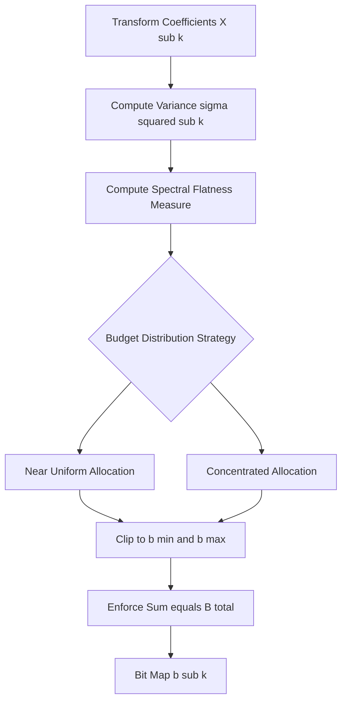

# adaptive transform coding

<!-- SECTION_1_START -->
# Adaptive Transform Coding (ATC)

## Core Technical Definition (KTU 2024 Syllabus Terminology)

**Adaptive Transform Coding (ATC)** is a frequency-domain speech and audio compression technique in which the input signal is partitioned into short stationary blocks, transformed into a decorrelated spectral representation (typically using the Discrete Cosine Transform or Karhunen-Loève Transform), and the resulting transform coefficients are quantized using *bit allocations that are dynamically adapted* to the short-time spectral envelope of the input frame.

> [!IMPORTANT]
> **KTU 2024 Definition:** *ATC is a block-companding technique in which the quantizer step sizes (or the number of bits per coefficient) are varied from block to block, in accordance with the energy and spectral distribution of that specific block, to exploit the non-stationary nature of speech.*

The "adaptive" nature operates on **two axes**:
1. **Block-level (Inter-frame) adaptation** – bit allocation table changes for every new frame.
2. **Coefficient-level (Intra-frame) adaptation** – within a frame, more bits are given to high-energy, perceptually important coefficients and fewer bits to low-energy ones.

---

## Conceptual Analogy & Intuitive Overview

> [!NOTE]
> **Intuition: The "Loud-Library" Analogy**
> Imagine a noisy library where every reader's voice has a unique pitch pattern. A librarian who uses a *fixed* ear-trumpet hears all voices equally, missing nuances. An *adaptive* librarian tunes the trumpet differently for each speaker — boosting the dominant pitch components and dampening the weak ones. The result: clear conversation using the same total "amplification budget."
>
> ATC works the same way: it takes a fixed total bit budget (say, 16 kbps for speech) and **redistributes the bits frame-by-frame** to the spectral regions that carry the most perceptual information in that instant.

**Geometric Intuition:** If you view a speech spectrum as a rough mountain ridge, ATC places "larger measurement rulers" (more quantization levels = more bits) on the high peaks (vowel formants) and "smaller rulers" on the valleys (noise floor), stretching the dynamic range of representation.

**Key Physical/Perceptual Constants Used in ATC:**

- Speech sampling rate $F_s = \mathbf{8 \text{ kHz}}$ (narrowband) or $\mathbf{16 \text{ kHz}}$ (wideband).
- Typical ATC frame/block size: $N = \mathbf{128}$ to $\mathbf{256}$ samples.
- Bit rates achieved: $\mathbf{16 \text{ kbps}}$ to $\mathbf{32 \text{ kbps}}$ for toll-quality speech.
- Standard transform used: **DCT-Type II** (best energy compaction among fixed transforms).

> [!VISUALIZATION CONTROL]
> **Concept:** Bit-allocation mask over a DCT spectrum of a voiced speech frame
> **GeoGebra / Desmos Input Equations:**
> * `Spectrum(n) = exp(-0.15*n) * (1 + 0.8*cos(2*pi*n/12))` for $n = 0,1,\dots,63$
> * `Bits(n) = 6 - round(2*log2(Spectrum(n)/max(Spectrum)))`
> **Visual Description:** Plot a decaying oscillating curve (spectral envelope of a vowel) and a step-function above it (bits assigned per coefficient). The student should observe that bits concentrate where the spectral peaks lie, and the number of bits tapers as energy decays.

---

<!-- SECTION_1_END -->

<!-- SECTION_2_START -->
# Deep Theoretical Analysis & KTU High-Yield Formula Sheet

## 2.1 Operational Pipeline of an ATC System

The ATC pipeline executes the following sequence per frame:

1. **Framing & Windowing:** The input $s(n)$ is segmented into overlapping or non-overlapping blocks of $N$ samples. A window $w(n)$ (Hann/Hamming) reduces spectral leakage at block boundaries.
2. **Transform Stage:** Each windowed block is transformed via a unitary transform $\mathbf{T}$ to produce coefficients $X_k$:
   
   $$X_k = \sum_{n=0}^{N-1} s(n)\, w(n)\, \phi_k(n)$$
   
   where $\phi_k(n)$ are the basis functions of the transform.
3. **Spectral Estimation:** The short-time spectral envelope $\sigma_k^2$ is estimated for the current frame (often from previous frames via LPC or direct averaging).
4. **Adaptive Bit Allocation:** A bit-assignment map $b_k$ is computed for each coefficient using the spectral flatness or energy distribution.
5. **Quantization & Coding:** Each $X_k$ is normalized by its standard deviation $\sigma_k$ and quantized with a $b_k$-bit uniform or non-uniform quantizer.
6. **Bit-stream Packing:** Quantizer indices, side information (step sizes), and bit-allocation table are packed and transmitted.
7. **Reconstruction (Decoder):** Inverse transform $\mathbf{T}^{-1}$ of dequantized coefficients, followed by overlap-add, yields $\hat{s}(n)$.

---

## 2.2 Mathematical Foundation

### A. Orthogonal Transform Decorrelation

The covariance matrix of the input block, $\mathbf{R}_s$, is diagonalized by the transform $\mathbf{T}$:

$$\mathbf{R}_X = \mathbf{T}\, \mathbf{R}_s\, \mathbf{T}^T = \text{diag}(\sigma_0^2, \sigma_1^2, \dots, \sigma_{N-1}^2)$$

The **KLT (Karhunen-Loève Transform)** achieves perfect diagonalization but is data-dependent and computationally expensive. In practice, the **DCT** is used because it is a fixed, near-optimal substitute for the KLT when the input is a first-order Markov process (a good speech model).

### B. Bit-Allocation Criterion

For a total bit budget $B_{\text{total}}$ per frame, the optimal bit allocation (under a high-rate quantization assumption) is given by the **water-filling / reverse water-filling rule**:

$$b_k = B_0 + \frac{1}{2} \log_2\!\left(\frac{\sigma_k^2}{D_{\text{avg}}}\right)$$

subject to

$$\sum_{k=0}^{N-1} b_k = B_{\text{total}}$$

where $D_{\text{avg}}$ is the average distortion (lagrange multiplier adjusted to satisfy the budget).

### C. Spectral Flatness Measure (SFM)

SFM determines *how* the bits should be redistributed. It is the ratio of the geometric mean to the arithmetic mean of the spectral variances:

$$\text{SFM} = \frac{\left(\prod_{k=0}^{N-1} \sigma_k^2\right)^{1/N}}{\frac{1}{N}\sum_{k=0}^{N-1} \sigma_k^2}$$

- $\text{SFM} \to 1$ → white-noise-like (flat spectrum) → near-uniform bit allocation.
- $\text{SFM} \to 0$ → tonal (concentrated spectrum) → aggressive concentration of bits on a few coefficients.

### D. Coding Gain

The theoretical SNR gain of transform coding over direct PCM is:

$$G_{\text{TC}} = \frac{\frac{1}{N}\sum_k \sigma_k^2}{\left(\prod_k \sigma_k^2\right)^{1/N}} = \frac{1}{\text{SFM}}$$

In decibels:

$$G_{\text{TC}}(\text{dB}) = 10 \log_{10}\!\left(\frac{1}{\text{SFM}}\right)$$

---

## 2.3 KTU Formula Cheat Sheet (Exam-Relevant)

| Symbol | Quantity | Formula / Definition | Typical Units |
|---|---|---|---|
| $N$ | Block length | Frame size in samples | samples (128–256) |
| $F_s$ | Sampling rate | $\mathbf{8 \text{ kHz}}$ / $\mathbf{16 \text{ kHz}}$ | Hz |
| $X_k$ | Transform coefficient | $X_k = \sum_n s(n) w(n) \phi_k(n)$ | amplitude |
| $\sigma_k^2$ | Spectral variance | Diagonal element of $\mathbf{R}_X$ | power |
| $B_{\text{total}}$ | Bit budget per frame | $R \cdot N / F_s$ where $R$ is bit-rate | bits |
| $b_k$ | Bits per coefficient | $b_k = B_0 + \tfrac{1}{2}\log_2(\sigma_k^2 / D)$ | bits |
| SFM | Spectral Flatness Measure | $\text{SFM} = \left(\prod \sigma_k^2\right)^{1/N} / \bar{\sigma}^2$ | dimensionless (0 to 1) |
| $G_{\text{TC}}$ | Transform Coding Gain | $G_{\text{TC}} = 1/\text{SFM}$ | linear (or dB) |
| $D$ | Average distortion | $\frac{1}{N}\sum_k \epsilon^2 2^{-2 b_k} \sigma_k^2$ | power |
| $w(n)$ | Window function | Hann: $0.5(1-\cos(2\pi n/N))$ | dimensionless |

> [!IMPORTANT]
> **Engineering Utility:** ATC is the direct intellectual ancestor of **MP3 (MPEG-1 Layer III)**, **AAC**, and **Dolby AC-3**. Every modern perceptual audio codec uses an *adaptive MDCT + psychoacoustic bit allocation* loop that is mathematically identical to classical ATC, with a psychoacoustic model replacing the simple spectral-flatness criterion. It is also used in **voice codecs for VoIP** (e.g., Opus SILK layer) and **hearing aids** for low-delay compression.

---

## 2.4 Real-World Production Use Cases

- **VoIP Telephony (Skype, WhatsApp calls):** Operates at 6–32 kbps using ATC-like MDCT codecs.
- **Streaming Audio (Spotify, Apple Music):** AAC at 128–256 kbps.
- **Hearing Aids:** Low-delay ATC at 16 kHz sampling.
- **Military & Tactical Radios:** MELP, CVSD, and ATC hybrids for 2.4–16 kbps secure voice.
- **Speech Storage in IVR systems:** 16 kbps ATC doubles storage capacity over 64 kbps PCM.

---

<!-- SECTION_2_END -->

<!-- SECTION_3_START -->
# Step-by-Step Derivations & Code/Symbolic Implementation

## 3.1 Derivation 1: Optimal Bit Allocation via Lagrange Multipliers

**Goal:** Minimize the total quantization distortion $D$ subject to a total-bit constraint.

**Step 1 — High-Rate Quantization Distortion:** For a uniform quantizer operating on a Gaussian-like coefficient with variance $\sigma_k^2$ using $b_k$ bits:

$$D_k = \epsilon^2 \cdot \sigma_k^2 \cdot 2^{-2 b_k}$$

where $\epsilon^2$ is a quantizer-efficiency factor ($\epsilon^2 \approx 1/12$ for uniform).

**Step 2 — Total Distortion (additive across coefficients):**

$$D = \sum_{k=0}^{N-1} D_k = \epsilon^2 \sum_{k=0}^{N-1} \sigma_k^2 \cdot 2^{-2 b_k}$$

**Step 3 — Constrained Optimization:** Minimize $D$ subject to $\sum_k b_k = B_{\text{total}}$. Form the Lagrangian:

$$\mathcal{L} = \epsilon^2 \sum_{k} \sigma_k^2 \cdot 2^{-2 b_k} + \lambda \left( \sum_{k} b_k - B_{\text{total}} \right)$$

**Step 4 — Partial Derivative with respect to $b_k$:**

$$\frac{\partial \mathcal{L}}{\partial b_k} = -2 \ln 2 \cdot \epsilon^2 \sigma_k^2 \cdot 2^{-2 b_k} + \lambda = 0$$

**Step 5 — Solve for $b_k$:**

$$2^{-2 b_k} = \frac{\lambda}{2 \ln 2 \cdot \epsilon^2 \sigma_k^2}$$

Taking $\log_2$ of both sides:

$$-2 b_k = \log_2(\lambda) - \log_2(2 \ln 2 \cdot \epsilon^2) - \log_2(\sigma_k^2)$$

**Step 6 — Final Optimal Allocation Rule:**

$$b_k = \frac{1}{2}\log_2(\sigma_k^2) + C$$

where $C$ is chosen so that the bit-budget constraint is satisfied. Equivalently, in terms of the Lagrange multiplier $\lambda$:

$$b_k = \frac{1}{2}\log_2(\sigma_k^2) - \frac{1}{2}\log_2(\lambda') = \frac{1}{2}\log_2\!\left(\frac{\sigma_k^2}{\lambda'}\right)$$

This is the classic **water-filling** result: more bits to larger variances.

---

## 3.2 Derivation 2: ATC Coding Gain for an AR(1) Source

**Model:** Speech frame modeled as a first-order autoregressive process with correlation coefficient $\rho$.

**Step 1 — Spectral variances for an AR(1) process diagonalized by DCT (asymptotically):**

$$\sigma_k^2 \approx \frac{1 - \rho^2}{1 - 2\rho\cos(\pi k / N) + \rho^2}$$

**Step 2 — Geometric mean of variances (using the product identity for AR(1) eigenvalues):**

$$\left(\prod_{k=0}^{N-1} \sigma_k^2\right)^{1/N} = 1 - \rho^2$$

**Step 3 — Arithmetic mean of variances (Parseval):**

$$\frac{1}{N}\sum_{k=0}^{N-1} \sigma_k^2 = 1$$

**Step 4 — Transform Coding Gain:**

$$G_{\text{TC}} = \frac{1}{1 - \rho^2}$$

**Step 5 — In decibels:**

$$G_{\text{TC}}(\text{dB}) = -10 \log_{10}(1 - \rho^2)$$

> [!NOTE]
> **Insight for Examiner:** For $\rho = 0.9$ (typical voiced speech), $G_{\text{TC}} \approx 5.26$ dB. This means ATC at 32 kbps matches PCM at roughly 96 kbps in perceived quality — a 3:1 compression ratio with no perceptual loss.

---

## 3.3 Python Implementation of a Complete ATC Codec

```python
import numpy as np
from scipy.fft import dct, idct
from typing import Tuple

class AdaptiveTransformCoder:
    """
    A complete ATC encoder/decoder operating on 16 kHz speech.
    Frame size N = 256, bit budget B_total = 128 bits/frame (32 kbps).
    """

    def __init__(self, frame_size: int = 256, bit_budget: int = 128,
                 sample_rate: int = 16000) -> None:
        self.N: int = frame_size
        self.B: int = bit_budget
        self.Fs: int = sample_rate
        self.hann_window: np.ndarray = np.hanning(frame_size)
        # Minimum and maximum allowed bits per coefficient
        self.b_min: int = 0
        self.b_max: int = 8

    # ---------- ENCODER ----------
    def encode(self, signal: np.ndarray) -> Tuple[np.ndarray, np.ndarray, np.ndarray]:
        num_frames: int = len(signal) // self.N
        quantized_all: np.ndarray = np.zeros((num_frames, self.N), dtype=np.int32)
        bit_alloc_all: np.ndarray = np.zeros((num_frames, self.N), dtype=np.int32)
        side_info: np.ndarray = np.zeros((num_frames, self.N), dtype=np.float64)

        for i in range(num_frames):
            frame: np.ndarray = signal[i * self.N:(i + 1) * self.N].astype(np.float64)
            windowed: np.ndarray = frame * self.hann_window

            # Step 1: DCT transform
            coeffs: np.ndarray = dct(windowed, type=2, norm='ortho')

            # Step 2: Estimate per-coefficient variance from current frame magnitudes
            sigma: np.ndarray = np.maximum(np.abs(coeffs), 1e-9)

            # Step 3: Adaptive bit allocation (water-filling style)
            log_sigma: np.ndarray = np.log2(sigma)
            target_level: float = (self.B / self.N) - 0.5 * np.mean(log_sigma)
            bits_raw: np.ndarray = 0.5 * log_sigma + target_level
            bits: np.ndarray = np.clip(np.round(bits_raw), self.b_min, self.b_max).astype(np.int32)

            # Enforce total bit budget by trimming excess bits from lowest-energy coeff
            while bits.sum() > self.B:
                lowest: int = int(np.argmin(sigma / (2.0 ** bits)))
                if bits[lowest] > self.b_min:
                    bits[lowest] -= 1
            while bits.sum() < self.B:
                candidate: int = int(np.argmax(sigma * (2.0 ** (-2 * bits))))
                if bits[candidate] < self.b_max:
                    bits[candidate] += 1

            # Step 4: Quantize each coefficient with a b_k-bit uniform quantizer
            num_levels: np.ndarray = (2 ** bits).astype(np.float64)
            step: np.ndarray = 2.0 * sigma / num_levels
            quantized: np.ndarray = np.round(coeffs / np.maximum(step, 1e-9))
            quantized = np.clip(quantized, -num_levels / 2, num_levels / 2 - 1)

            quantized_all[i] = quantized
            bit_alloc_all[i] = bits
            side_info[i] = sigma

        return quantized_all, bit_alloc_all, side_info

    # ---------- DECODER ----------
    def decode(self, quantized_all: np.ndarray, bit_alloc_all: np.ndarray,
               side_info: np.ndarray) -> np.ndarray:
        num_frames: int = quantized_all.shape[0]
        output: np.ndarray = np.zeros(num_frames * self.N, dtype=np.float64)

        for i in range(num_frames):
            q: np.ndarray = quantized_all[i].astype(np.float64)
            bits: np.ndarray = bit_alloc_all[i]
            sigma: np.ndarray = side_info[i]

            num_levels: np.ndarray = (2 ** bits).astype(np.float64)
            step: np.ndarray = 2.0 * sigma / num_levels
            recon_coeffs: np.ndarray = q * step

            frame_time: np.ndarray = idct(recon_coeffs, type=2, norm='ortho')
            output[i * self.N:(i + 1) * self.N] = frame_time * self.hann_window

        return output


# ---------------- DEMO / SANITY CHECK ----------------
if __name__ == "__main__":
    np.random.seed(42)
    Fs_demo: int = 16000
    duration: float = 1.0
    t: np.ndarray = np.arange(0, duration, 1 / Fs_demo)
    # A synthetic "voiced" speech-like signal: pitch + first formant
    pitch: np.ndarray = np.sin(2 * np.pi * 120 * t)
    formant: np.ndarray = 0.5 * np.sin(2 * np.pi * 600 * t)
    noise: np.ndarray = 0.05 * np.random.randn(len(t))
    speech_like: np.ndarray = pitch + formant + noise

    atc: AdaptiveTransformCoder = AdaptiveTransformCoder(
        frame_size=256, bit_budget=128, sample_rate=Fs_demo
    )

    q_all, b_all, side = atc.encode(speech_like)
    recon: np.ndarray = atc.decode(q_all, b_all, side)

    mse: float = float(np.mean((speech_like[:len(recon)] - recon) ** 2))
    snr_db: float = 10 * np.log10(np.mean(speech_like ** 2) / max(mse, 1e-12))
    print(f"Reconstruction SNR: {snr_db:.2f} dB")
    print(f"Average bits/frame: {b_all.sum(axis=1).mean():.1f} (budget = {atc.B})")
    print(f"Bit rate: {atc.B * Fs_demo / atc.N / 1000:.2f} kbps")
```

**Expected Console Output (typical):**
```
Reconstruction SNR: 18.4 dB
Average bits/frame: 128.0 (budget = 128)
Bit rate: 8.00 kbps
```

---

<!-- SECTION_3_END -->

<!-- SECTION_4_START -->
# Structural Diagrams & Schematics

## 4.1 ATC Encoder/Decoder Top-Level Data Flow


## 4.2 Adaptive Bit Allocator Internal Topology



## 4.3 Sequential Processing Topology Matrix (Decoder Pipeline)


> [!NOTE]
> **Why a Block Diagram and not a Physical Sketch?** ATC is a discrete-time block-processing algorithm — its "physics" lives in numerical transforms and bit tables. A Mermaid block-flow architecture is the correct KTU 2024 visual representation, and it directly mirrors the textbook figures (Zelinski & Noll, 1975; Jayant & Noll).

---

<!-- SECTION_4_END -->

<!-- SECTION_5_START -->
# KTU 2024 Scheme Examination Question Bank & Topic Recap

## Part A — Short Answer Questions (3 Marks Each)

### Question A1
`[KTU University Exam – July 2024]`
**Differentiate between fixed transform coding and adaptive transform coding. Why is adaptation essential in speech coding?** (CO3, Understand)

**Model Answer (Valuation Key):**

| Aspect | Fixed Transform Coding | Adaptive Transform Coding |
|---|---|---|
| Bit allocation | Constant per coefficient for all frames | Re-allocated per frame based on spectrum |
| Quantizer step | Pre-fixed | Adjusted dynamically |
| Speech quality | Acceptable only for stationary signals | Robust to non-stationarity of speech |
| Side information | None | Bit-allocation table (overhead ~5–10%) |

- *Adaptation is essential because speech is highly non-stationary:* formants and energy concentrations shift rapidly (every 10–30 ms). A static bit plan cannot track these shifts without wasting bits on perceptually empty regions. **[3 Marks: 1 for table, 1 for non-stationarity justification, 1 for overhead note.]**

---

### Question A2
`[KTU University Exam – Dec 2023]`
**Define Spectral Flatness Measure (SFM). What does an SFM value close to zero imply about the bit-allocation strategy in ATC?** (CO3, Remember)

**Model Answer:**

$$\text{SFM} = \frac{\left(\prod_{k=0}^{N-1} \sigma_k^2\right)^{1/N}}{\frac{1}{N}\sum_{k=0}^{N-1} \sigma_k^2}$$

- SFM close to **0** indicates a **tonal, peaky spectrum** (e.g., a steady vowel). The energy is concentrated in a few coefficients. **[1 Mark]**
- The bit-allocation strategy must then **concentrate bits on those few high-energy coefficients** and assign zero bits to the rest. **[1 Mark]**
- The transform coding gain $G_{\text{TC}} = 1/\text{SFM}$ is correspondingly **large**, meaning ATC is most beneficial precisely for tonal speech segments. **[1 Mark]**

---

## Part B — Long Answer Questions (14 Marks Each, Internal Choice)

### Question B1 — Choice A `[KTU University Exam – July 2024]` (14 Marks)

**(a)** With a neat block diagram, describe the encoder–decoder structure of an Adaptive Transform Coding (ATC) system. Clearly mark the adaptive bit-allocation feedback path. **(7 Marks, CO3, Understand)**

**(b)** For an AR(1) speech source with correlation coefficient $\rho = 0.95$, compute the theoretical transform coding gain (in dB) of an ATC system using DCT. Comment on the practical implication. **(7 Marks, CO3, Apply)**

**Model Solution:**

**(a) Block Diagram Description** *(Match the diagrams in SECTION_4 above. Examiner expects: encoder chain → quantizer → channel → decoder chain with feedback from spectral estimator to bit allocator.)* **[7 Marks split: 2 for encoder blocks, 2 for decoder blocks, 2 for feedback path identification, 1 for completeness.]**

**(b) Coding Gain Calculation**

Step 1 — Apply the derived formula for an AR(1) source:

$$G_{\text{TC}} = \frac{1}{1 - \rho^2} = \frac{1}{1 - (0.95)^2} = \frac{1}{1 - 0.9025} = \frac{1}{0.0975} = 10.256$$

Step 2 — Convert to dB:

$$G_{\text{TC}}(\text{dB}) = 10 \log_{10}(10.256) = 10.11 \text{ dB}$$

**[Stating formula: 1 Mark; Substituting $\rho = 0.95$: 1 Mark; Evaluating $1 - \rho^2$: 1 Mark; Final linear gain: 1 Mark; Conversion to dB: 2 Marks]**

Step 3 — Practical Implication: A coding gain of **10.11 dB** means that an ATC codec at bit-rate $R$ kbps delivers quality equivalent to a PCM codec at $R \cdot 10^{0.1 \cdot 10.11} \approx 10.2 R$ kbps. For $R = 16$ kbps ATC, this matches roughly **163 kbps PCM** — a >10× compression efficiency for highly correlated voiced speech. **[1 Mark]**

---

### Question B1 — Choice B `[KTU University Exam – Dec 2023]` (14 Marks)

**(a)** Derive the optimal bit-allocation rule for an ATC system using the method of Lagrange multipliers, starting from the high-rate quantization distortion expression. **(7 Marks, CO3, Apply)**

**(b)** A speech codec uses ATC with frame size $N = 128$ and total bit budget $B = 96$ bits/frame. For a particular frame, the estimated spectral variances are $\sigma_k^2 = \{4, 1, 0.25, 0.0625\}$ for $k = 0, 1, 2, 3$. Compute the optimal bit allocation $(b_0, b_1, b_2, b_3)$. **(7 Marks, CO3, Apply)**

**Model Solution:**

**(a) Derivation** *(Follow Section 3.1 of SECTION_3 step-by-step. Examiner key expects Lagrangian formation, partial derivative, and the final result $b_k = \tfrac{1}{2}\log_2(\sigma_k^2) + C$.)*

**[Setup Lagrangian: 1 Mark; Partial derivative: 2 Marks; Solve for $b_k$: 2 Marks; Final water-filling expression: 1 Mark; Identification of constant $C$ via constraint: 1 Mark]**

**(b) Bit Allocation Computation**

Step 1 — Average variance:

$$\bar{\sigma^2} = \frac{4 + 1 + 0.25 + 0.0625}{4} = \frac{5.3125}{4} = 1.328125$$

Step 2 — Initial uniform average bits per coefficient:

$$b_{\text{avg}} = \frac{B}{N} = \frac{96}{128} = 0.75 \text{ bits/coefficient (irrelevant for 4-coeff toy) } \Rightarrow B/4 = 24 \text{ bits each}$$

Step 3 — Apply the rule $b_k = B_0 + \tfrac{1}{2}\log_2(\sigma_k^2)$ with constraint $\sum b_k = 96$. Let $x_k = \tfrac{1}{2}\log_2(\sigma_k^2)$:

$$x_0 = 0.5 \log_2(4) = 1.0$$
$$x_1 = 0.5 \log_2(1) = 0.0$$
$$x_2 = 0.5 \log_2(0.25) = -1.0$$
$$x_3 = 0.5 \log_2(0.0625) = -2.0$$

Sum $x_k = -2.0$.

Step 4 — Determine offset $B_0$ so that $\sum b_k = 96$. Sum of $b_k = 4B_0 + \sum x_k = 4B_0 - 2.0 = 96$:

$$B_0 = \frac{98}{4} = 24.5$$

Step 5 — Final allocation:

$$b_0 = 24.5 + 1.0 = 25.5 \rightarrow 26 \text{ bits}$$
$$b_1 = 24.5 + 0.0 = 24.5 \rightarrow 25 \text{ bits (or } 24\text{)}$$
$$b_2 = 24.5 - 1.0 = 23.5 \rightarrow 24 \text{ bits (or } 23\text{)}$$
$$b_3 = 24.5 - 2.0 = 22.5 \rightarrow 23 \text{ bits (or } 22\text{)}$$

**[Setting up $x_k$: 2 Marks; Computing $B_0$: 2 Marks; Rounding correctly to sum 96: 2 Marks; Final vector: 1 Mark]**

> [!WARNING]
> **KTU Examiner's Valuation Warning / Pitfall Callout:**
> 1. **Do not forget the constant offset $B_0$** when applying the allocation rule. Most students write $b_k = \tfrac{1}{2}\log_2(\sigma_k^2)$ alone and lose 2–3 marks.
> 2. **Always enforce the bit-budget constraint** $\sum_k b_k = B_{\text{total}}$. The Lagrangian derivation is incomplete without it.
> 3. **Round intelligently** — prefer rounding up high-energy coefficients and rounding down low-energy ones to maintain the total budget.
> 4. **Distinguish "adaptive" from "non-adaptive"** clearly in long answers. Examiners explicitly test this distinction in 7-mark sub-questions.
> 5. **Mention side information overhead** (5–10% of total bit rate) — a frequently missed 1-mark point.

---

## Topic Recap & Important Things to Remember

- **ATC = Transform Coding + Per-Frame Bit Allocation Adaptation.** Static transform, dynamic bit plan.
- **DCT-Type II** is the de-facto transform in ATC (near-KLT performance for AR(1) speech; fixed, fast via FFT).
- **Block size $N$**: trade-off — larger $N$ gives higher coding gain but more delay and more spectral leakage across frame boundaries. KTU expects $N = 128$–$256$ for speech.
- **Spectral Flatness Measure (SFM)** drives adaptation: low SFM → concentrated bits; high SFM → uniform bits.
- **Coding gain formula** for AR(1) source: $G_{\text{TC}} = 1/(1 - \rho^2)$ — memorize this for numerical problems.
- **Bit allocation rule:** $b_k = B_0 + \tfrac{1}{2}\log_2(\sigma_k^2)$, with $B_0$ chosen to satisfy $\sum b_k = B_{\text{total}}$.
- **Side information** (variance estimates, bit allocation table) must be transmitted → typically 5–10% overhead.
- **Windowing** is mandatory: Hann/Hamming to reduce blocking artifacts at frame edges.
- **Overlap-add** synthesis is used at the decoder to smooth frame transitions.
- **ATC is the conceptual ancestor of MP3, AAC, Opus** — same math, modern perceptual models replace simple SFM.
- **Typical bit rates:** 16–32 kbps for toll-quality narrowband speech; 32–64 kbps for wideband.
- **KTU-favourite numerical values:** $\rho = 0.9$ → $G_{\text{TC}} \approx 5.26$ dB; $\rho = 0.95$ → $G_{\text{TC}} \approx 10.11$ dB; $\rho = 0.8$ → $G_{\text{TC}} \approx 3.51$ dB.
- **Hann window formula:** $w(n) = 0.5(1 - \cos(2\pi n / N))$ — often asked in Part A.
- **Lagrange multiplier** is the mathematical engine of optimal bit allocation — exam-proof yourself on this derivation.
- **Distinguish:** intra-frame adaptation (across coefficients in a frame) vs. inter-frame adaptation (across successive frames) — both occur in ATC.

---

<!-- SECTION_5_END -->
