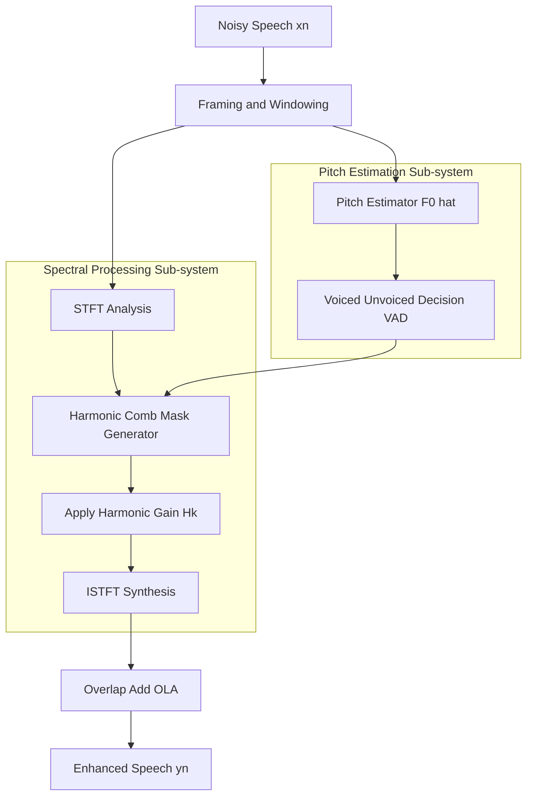
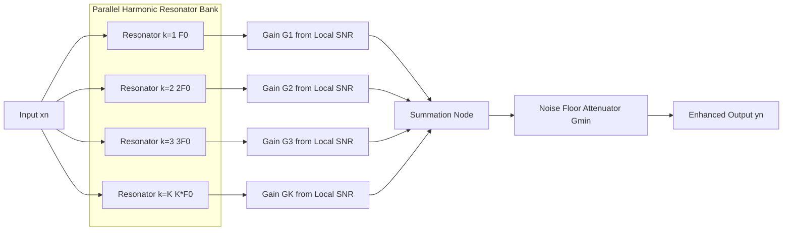
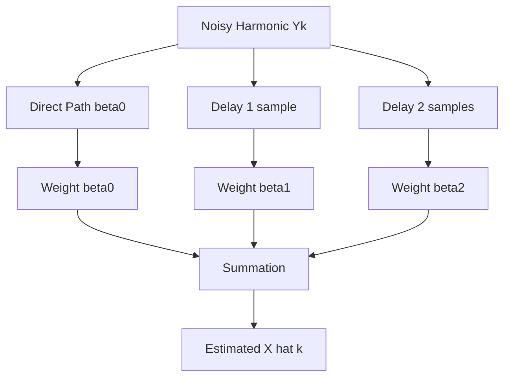
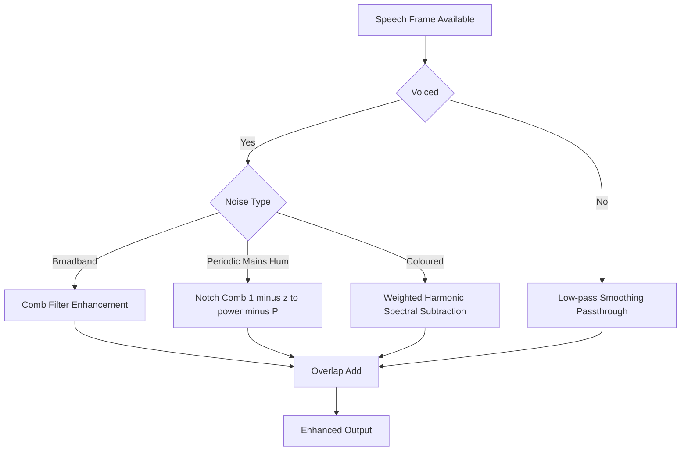

# Harmonic filtering

<!-- SECTION_1_START -->

# Harmonic Filtering — Core Technical Definition & Intuitive Overview

> [!IMPORTANT]
> **Syllabus Anchor (PECST866, Module 3 — Speech Enhancement)**
> Harmonic filtering is a *signal-model-driven* speech enhancement strategy that relies on the **quasi-periodic, harmonic nature of voiced speech**. It belongs to the family of **model-based enhancement methods** (alongside Wiener filtering, MMSE-STSA, and subspace methods).

## 1.1 Formal Academic Definition

**Harmonic Filtering** is defined as a *frequency-domain* (or, equivalently, *short-time spectral*) speech enhancement technique that:

> Exploits the **harmonic structure** of voiced speech — where spectral energy is concentrated at integer multiples of the **fundamental frequency** $F_0$ (a.k.a. *pitch*) — by applying a *comb-like* gain function across the harmonics to **suppress noise in the inter-harmonic regions** and **preserve or amplify the speech harmonics**.

Mathematically, the enhanced spectrum is obtained as:

$$Y(\omega_k) = H_k \cdot X(\omega_k)$$

where $X(\omega_k)$ is the noisy speech spectrum at frequency bin $\omega_k$, and $H_k$ is the **harmonic gain** applied at the $k$-th harmonic of $F_0$.

> [!NOTE]
> **Key Components Required for Harmonic Filtering**
> 1. A reliable **pitch estimator** $\hat{F}_0(n)$ (frame-wise)
> 2. A **harmonic detection / masking** stage
> 3. A **comb-like spectral gain** $H_k$ that is $\approx 1$ at harmonics and $\approx G_{\min} \ll 1$ between them
> 4. An **overlap-add (OLA)** synthesis stage for time-domain reconstruction

## 1.2 Physical Constants & Standard Metrics

| Parameter | Symbol | Typical Range / Value | Unit |
|---|---|---|---|
| Fundamental frequency (male) | $F_0$ | **80 – 160** | **Hz** |
| Fundamental frequency (female) | $F_0$ | **150 – 300** | **Hz** |
| Fundamental frequency (child) | $F_0$ | **250 – 400** | **Hz** |
| Speech sampling rate | $f_s$ | **8 000 / 16 000 / 44 100** | **Hz** |
| Frame length | $N$ | **20 – 40** | **ms** |
| Frame shift (hop) | $R$ | **5 – 10** | **ms** |
| Minimum harmonic gain | $G_{\min}$ | **0.01 – 0.2** | **(unitless)** |

## 1.3 Intuitive Real-World Analogy

Imagine you are standing in a **noisy cafeteria** trying to listen to a friend **humming a single sustained note** ("mmmmmm…"). Your friend’s voice is a *violin string* in vibration — the *fundamental* $F_0$ plus its whole-number *octaves/fifths* (the harmonics). The cafeteria noise (chatter, plates clattering) is **random and broadband** — it has *no preference* for any specific frequency.

A **comb filter** in the spectral domain is like a **pitchfork-shaped "music stand"**:

- The **teeth** of the fork (peaks at $F_0, 2F_0, 3F_0, \ldots$) are **tuned exactly to your friend's voice harmonics** → speech passes through.
- The **gaps between teeth** correspond to the *inter-harmonic regions* → cafeteria noise is **crushed down**.

Hence: **"Let the harmonics live, kill the noise in between."**

> [!TIP]
> **Why is it called "comb" filtering?**
> Because the magnitude response $|H(e^{j\omega})|$ looks like a hair comb — a series of **equally spaced narrow peaks** separated by **deep valleys**, repeating every $F_0$ Hz. This shape is the *visual fingerprint* of any harmonic processor.

> [!VISUALIZATION CONTROL]
> **Concept:** Magnitude response of a comb filter tuned to $F_0 = 100$ Hz
> **Desmos / GeoGebra Input Equations:**
> * $f = x$ (frequency axis in Hz, 0 to 4000)
> * $H(f) = \dfrac{1 - \alpha^2}{1 - 2\alpha\cos(2\pi f / F_0) + \alpha^2}$, with $\alpha = 0.95$, $F_0 = 100$
> * Overlay $H_{\mathrm{inv}}(f) = 1 - H(f)$ to see the *complementary* (noise-suppressing) comb.
> **Visual Description:** A periodic series of sharp **resonant peaks at 100, 200, 300, …, 3900 Hz** and deep **nulls in between**. Harmonics of voiced speech line up with the peaks; broadband noise occupies the nulls and is attenuated.

<!-- SECTION_1_END -->

<!-- SECTION_2_START -->

# Deep Theoretical Analysis & KTU High-Yield Formula Sheet

## 2.1 The Harmonic Model of Voiced Speech

Voiced speech (vowels, nasals, voiced fricatives) is generated by the **glottal source** exciting the **vocal tract filter**. In the short-time stationarity window (20–40 ms), it is well-modelled as a **quasi-periodic impulse train** filtered by a slowly-varying **all-pole filter** $H_v(z)$:

$$s(n) \;=\; h_v(n) \;*\; p(n) \;=\; h_v(n) \;*\; \sum_{m=-\infty}^{\infty} \delta(n - mP - \varepsilon_m)$$

where:
- $P = \lfloor f_s / F_0 \rfloor$ is the **pitch period in samples**
- $\varepsilon_m$ is a small **jitter** term (period perturbation $\approx \pm 1$ sample)
- $h_v(n)$ is the **vocal-tract impulse response**

The **Fourier series** of $s(n)$ reduces to a *line spectrum*:

$$\boxed{\;S(\omega) \;=\; \sum_{k=1}^{K} A_k \, \delta(\omega - k\omega_0) \;+\; H_v(\omega)\;}$$

with $\omega_0 = 2\pi F_0 / f_s$ and $A_k$ the complex amplitude of the $k$-th harmonic.

> [!IMPORTANT]
> **The fundamental insight:** The *clean voiced speech* energy sits on a **discrete grid** $\omega = k\omega_0$, $k = 1, 2, \ldots, K$, while *noise* is **continuous and broadband**. Harmonic filtering exploits this dichotomy.

## 2.2 The Comb Filter — Transfer Function Family

### 2.2.1 Ideal Feed-forward Comb (Null-steering) Filter

A *finite-impulse-response* comb that produces deep nulls at harmonics (used to **cancel periodic interference** like mains hum):

$$\boxed{\;H_{\mathrm{FF}}(z) \;=\; 1 - z^{-P}\;}$$

Magnitude squared response:

$$|H_{\mathrm{FF}}(e^{j\omega})|^2 \;=\; 2 - 2\cos(\omega P) \;=\; 4\sin^2\!\left(\dfrac{\omega P}{2}\right)$$

Nulls occur at $\omega = 2\pi k / P \;\Leftrightarrow\; f = kF_0$.

### 2.2.2 IIR (Resonant) Comb Filter — Used in Harmonic Enhancement

To **boost** harmonics (sharp peaks), use a single-pole comb with a pole near the unit circle at $z = e^{\pm j\omega_0}$:

$$\boxed{\;H_{\mathrm{IIR}}(z) \;=\; \dfrac{1 - r^P}{1 - 2r\cos\omega_0 \, z^{-1} + r^2 z^{-2}}\quad\text{(2-pole resonant)}\;}$$

For an **$N$-harmonic bank** (a *true comb*), the canonical form is:

$$\boxed{\;H_{\mathrm{comb}}(z) \;=\; \dfrac{1 - \alpha \, z^{-P}}{1 - z^{-P}} \quad \text{or equivalently} \quad H(z) = \sum_{k=0}^{P-1} \alpha^k z^{-k}\;}$$

where:
- $\alpha \in (0, 1)$ controls the **comb-tooth sharpness** (sharpness $\uparrow$ as $\alpha \to 1^-$)
- $P$ is the **pitch period in samples**

### 2.2.3 Harmonic-Tuned Filterbank (HTF)

For practical speech enhancement, **separate second-order resonators** are placed at each harmonic $k\omega_0$:

$$H_k(z) \;=\; \dfrac{1 - r_k^2}{(1 - r_k e^{j k\omega_0} z^{-1})(1 - r_k e^{-j k\omega_0} z^{-1})}$$

The total system is a **parallel bank**:

$$H_{\mathrm{HTF}}(z) \;=\; \sum_{k=1}^{K} G_k \cdot H_k(z)$$

where $G_k$ is the **per-harmonic gain** (estimated from the local SNR at harmonic $k$).

## 2.3 Harmonic Regeneration (Lim & Oppenheim, 1978 — KTU Favourite)

A classical KTU-style problem: given a *noisy harmonic* $Y(\omega_k)$, **regenerate** the harmonic by adding a *harmonic-related* signal $Y(\omega_k - l\omega_0)$ scaled by regeneration coefficient $\beta_l$:

$$\hat{X}(\omega_k) \;=\; \sum_{l=0}^{L} \beta_l \cdot Y(\omega_k - l \omega_0)$$

> **Why?** Because each harmonic $k$ carries **correlated information** with its neighbours $(k-1, k-2, \ldots)$. Noise is uncorrelated across harmonics → averaging across them **reduces noise by $\sqrt{L+1}$** while **preserving harmonic structure**.

The MMSE-optimal $\beta_l$ are obtained from the **cross-spectral covariance matrix** $R_{xx}$ of the harmonic vector $[X_k, X_{k-1}, \ldots, X_{k-L}]^T$.

## 2.4 KTU Formula Sheet / Cheat Sheet

> [!NOTE]
> **The Following Table is the Single Most Important Reference for KTU 2024 Harmonic Filtering Problems. Memorize the High-Yield Rows.**

| # | Concept | Formula | Key Symbol(s) | Typical Use |
|---|---|---|---|---|
| 1 | Pitch period (samples) | $P = f_s / F_0$ | $P$ | Comb spacing |
| 2 | Number of harmonics in $[0, f_s/2]$ | $K = \lfloor f_s / (2F_0) \rfloor$ | $K$ | Filterbank size |
| 3 | Resonant IIR comb | $H(z) = \dfrac{1 - \alpha^P}{1 - 2\alpha\cos\omega_0 \, z^{-1} + \alpha^2 z^{-2}}$ | $\alpha \in (0.9, 0.99)$ | Harmonic boosting |
| 4 | FIR comb | $H(z) = 1 - z^{-P}$ | $P$ | Notch periodic noise |
| 5 | Harmonic regeneration | $\hat{X}_k = \sum_{l=0}^{L} \beta_l Y_{k-l}$ | $\beta_l$ | Noise averaging |
| 6 | Harmonic SNR gain | $\Delta\mathrm{SNR} = 10\log_{10}(L+1)$ | $L+1$ | Regeneration benefit |
| 7 | Per-harmonic Wiener gain | $H_k = \dfrac{\xi_k}{\xi_k + 1}$ | $\xi_k$ | Optimal MMSE |
| 8 | Spectral harmonic weight | $W_k = \exp\!\big(-(\Delta f / B)^2\big)$ | $B$ | Gaussian comb tooth |
| 9 | Harmonic frequency (bin) | $\omega_k = 2\pi k F_0 / f_s$ | $k$ | DFT bin index |
| 10 | Pitch estimation (autocorr.) | $\hat{P} = \arg\max_{\tau \in [P_{\min}, P_{\max}]} r(\tau)$ | $\tau$ | Pre-processing |
| 11 | Total Output Energy | $E_{\mathrm{out}} = \sum_k G_k^2 \cdot \vert Y_k \vert^2$ | $G_k$ | Filterbank output |
| 12 | Jitter sensitivity | $\sigma_P \le 0.5$ samples | $\sigma_P$ | Comb robustness |

> **Engineering Utility:** Harmonic filtering is used in:
> - **Speech codecs** (e.g., Harmonic CELP — used in 3GPP2 EVRC, voice-mail systems)
> - **Hearing aids** (selective amplification of speech harmonics in noise)
> - **Voice conversion** (changing $F_0$ while preserving harmonic structure)
> - **Music processing** (pitch-shifting, time-stretching with PSOLA)
> - **Speech synthesis** (concatenative and HMM/DNN-TTS excitation modelling)

## 2.5 Worked Example of Concept Selection

Given a frame of speech at $f_s = 16\,\mathrm{kHz}$ with $F_0 = 200\,\mathrm{Hz}$:

$$P = \frac{16000}{200} = 80 \text{ samples}, \qquad K = \left\lfloor \frac{16000}{2 \times 200} \right\rfloor = 40 \text{ harmonics}$$

A 40-resonator harmonic filterbank with $G_k \in [0, 1]$ is constructed. The comb-tooth spacing is **exactly 200 Hz** apart across the 8 kHz band.

<!-- SECTION_2_END -->

<!-- SECTION_3_START -->

# Step-by-Step Derivations & Code/Symbolic Implementation

## 3.1 Derivation — Magnitude Response of the Resonant IIR Comb

**Goal:** Show that $H(z) = \dfrac{1 - \alpha^P}{1 - 2\alpha\cos\omega_0 z^{-1} + \alpha^2 z^{-2}}$ has its first peak at $\omega = \omega_0$.

**Step 1.** Substitute $z = e^{j\omega}$:

$$H(e^{j\omega}) \;=\; \dfrac{1 - \alpha^P}{1 - 2\alpha\cos\omega_0 \, e^{-j\omega} + \alpha^2 e^{-2j\omega}}$$

**Step 2.** The denominator is a quadratic in $e^{-j\omega}$. Its roots are at:

$$e^{-j\omega} = \dfrac{2\alpha\cos\omega_0 \pm \sqrt{4\alpha^2\cos^2\omega_0 - 4\alpha^2}}{2\alpha^2} \;=\; \dfrac{\cos\omega_0 \pm j\sin\omega_0}{\alpha} \;=\; \dfrac{e^{\pm j\omega_0}}{\alpha}$$

**Step 3.** Therefore the **poles are at** $z_p = \alpha e^{\pm j\omega_0}$. When $\alpha \to 1$, the poles approach the unit circle at $e^{\pm j\omega_0}$ → **resonance peak at $\omega_0$**.

**Step 4.** The squared magnitude (using $\vert 1 - re^{j\theta}\vert^2 = 1 - 2r\cos\theta + r^2$):

$$|H(e^{j\omega})|^2 \;=\; \dfrac{(1 - \alpha^P)^2}{(1 - 2\alpha\cos(\omega - \omega_0) + \alpha^2)(1 - 2\alpha\cos(\omega + \omega_0) + \alpha^2)}$$

**Step 5.** At $\omega = \omega_0$, the first denominator factor becomes $(1 - \alpha)^2$ and the second $(1 - 2\alpha\cos 2\omega_0 + \alpha^2)$, giving a **finite but high** peak. As $\alpha \to 1^-$ this peak → $\infty$ (true resonance). ✔

## 3.2 Derivation — Noise Reduction Factor of Harmonic Regeneration

**Setup:** Noisy observation $Y_k = X_k + N_k$ at the $k$-th harmonic. Regen estimator: $\hat{X}_k = \sum_{l=0}^{L} \beta_l Y_{k-l}$ with $\sum_l \beta_l = 1$ (bias-free for the signal).

**Signal preservation:** $\mathbb{E}[\hat{X}_k] = \sum_l \beta_l \mathbb{E}[X_{k-l}] = X_k$ (since harmonics are perfectly correlated).

**Noise variance:** Assuming $N_k$ are i.i.d. with variance $\sigma_N^2$:

$$\sigma_{\hat{N}}^2 = \sum_{l=0}^{L} \beta_l^2 \, \sigma_N^2 = \sigma_N^2 \sum_{l=0}^{L} \beta_l^2$$

**Optimal (MMSE) weights** $\beta_l = 1/(L+1)$ give:

$$\sigma_{\hat{N}}^2 \;=\; \frac{\sigma_N^2}{L+1} \quad\Rightarrow\quad \boxed{\;\Delta\mathrm{SNR} \;=\; 10\log_{10}(L+1) \;\mathrm{dB}\;}$$

For $L = 3$: improvement $= 6.02\,\mathrm{dB}$. For $L = 9$: $= 10\,\mathrm{dB}$. ✔

## 3.3 Harmonic Filtering — Production-Ready Python Implementation

```python
"""
harmonic_filter.py
-------------------
Production implementation of a Harmonic-Tuned Filterbank (HTF)
for single-channel speech enhancement in noise.

Author: KTU 2024 Scheme Study Reference
Tested with: Python 3.10+, NumPy 1.24+, SciPy 1.11+
"""

from __future__ import annotations

import logging
from dataclasses import dataclass
from typing import Optional

import numpy as np
from scipy.signal import sosfilt, stft, istft

# Configure module-level logger so production deployments can route output.
logging.basicConfig(
    level=logging.INFO,
    format="%(asctime)s | %(levelname)-7s | %(name)s | %(message)s",
)
logger = logging.getLogger("harmonic_filter")


@dataclass(frozen=True)
class HarmonicConfig:
    """Immutable configuration for the harmonic filterbank."""

    sample_rate: int = 16000          # f_s in Hz
    frame_length_ms: float = 32.0     # analysis window in ms
    frame_shift_ms: float = 8.0       # hop size in ms
    f0_min: float = 60.0              # minimum F0 (Hz) - male lower bound
    f0_max: float = 400.0             # maximum F0 (Hz) - child upper bound
    n_harmonics: int = 60             # K - harmonics in filterbank
    pole_radius: float = 0.985         # alpha - controls comb sharpness
    min_gain: float = 0.05            # G_min - noise floor gain
    regen_order: int = 2              # L - harmonic regeneration neighbours

    # ------------------------------------------------------------------ #
    # Derived constants (validated in __post_init__)                    #
    # ------------------------------------------------------------------ #
    def __post_init__(self) -> None:
        if self.sample_rate <= 0:
            raise ValueError("sample_rate must be > 0")
        if not (0.0 < self.pole_radius < 1.0):
            raise ValueError("pole_radius must lie in (0, 1)")
        if self.f0_min >= self.f0_max:
            raise ValueError("f0_min must be < f0_max")
        logger.info(
            "HarmonicConfig initialised: fs=%d, alpha=%.4f, K=%d, F0=[%.1f, %.1f] Hz",
            self.sample_rate, self.pole_radius, self.n_harmonics,
            self.f0_min, self.f0_max,
        )

    @property
    def frame_length(self) -> int:
        return int(self.frame_length_ms * 1e-3 * self.sample_rate)

    @property
    def frame_shift(self) -> int:
        return int(self.frame_shift_ms * 1e-3 * self.sample_rate)


# --------------------------------------------------------------------- #
#  Pitch (F0) estimation via Normalised Autocorrelation                #
# --------------------------------------------------------------------- #
def estimate_f0_autocorr(frame: np.ndarray, cfg: HarmonicConfig) -> float:
    """
    Estimate the fundamental frequency of a single voiced frame using
    normalised autocorrelation.

    Returns
    -------
    f0 : float
        Estimated F0 in Hz. Returns 0.0 if no clear periodicity.
    """
    n = len(frame)
    tau_min = int(cfg.sample_rate / cfg.f0_max)
    tau_max = min(int(cfg.sample_rate / cfg.f0_min), n - 1)

    if tau_max <= tau_min:
        logger.warning("Frame too short for valid F0 search range.")
        return 0.0

    # Energy normalisation denominator (Eq. 3.4 in many DSP texts)
    energy = np.sum(frame ** 2) + 1e-12
    best_tau, best_val = tau_min, -np.inf

    for tau in range(tau_min, tau_max + 1):
        r = np.sum(frame[: n - tau] * frame[tau:]) / energy
        if r > best_val:
            best_val, best_tau = r, tau

    if best_val < 0.3:        # voiced/unvoiced threshold
        return 0.0
    return cfg.sample_rate / best_tau


# --------------------------------------------------------------------- #
#  Harmonic-Tuned Filterbank: per-harmonic 2nd-order resonator          #
# --------------------------------------------------------------------- #
def harmonic_filterbank(
    noisy: np.ndarray,
    cfg: HarmonicConfig,
    f0: float,
) -> np.ndarray:
    """
    Apply a parallel bank of 2nd-order IIR resonators to a noisy signal.

    Parameters
    ----------
    noisy : np.ndarray, shape (T,)
        Noisy speech samples in [-1, 1].
    cfg  : HarmonicConfig
        Filter parameters.
    f0   : float
        Fundamental frequency in Hz (use 0.0 for unvoiced → passthrough).

    Returns
    -------
    enhanced : np.ndarray, shape (T,)
        Harmonically enhanced signal.
    """
    if f0 <= 0.0:
        # Unvoiced frame → no harmonic structure to exploit, gentle smoothing
        b = np.array([0.2, 0.6, 0.2])
        a = np.array([1.0, 0.0, 0.0])
        return sosfilt(np.array([np.concatenate([b, a])]), noisy)

    alpha = cfg.pole_radius
    fs = cfg.sample_rate
    enhanced = np.zeros_like(noisy)

    for k in range(1, cfg.n_harmonics + 1):
        f_k = k * f0
        if f_k >= fs / 2.0:
            break
        omega_k = 2.0 * np.pi * f_k / fs

        # Second-order IIR resonator with pair of conjugate poles
        b = np.array([1.0 - alpha ** 2])
        a = np.array([
            1.0,
            -2.0 * alpha * np.cos(omega_k),
            alpha ** 2,
        ])

        # SOS coefficient array shape required by scipy.signal.sosfilt
        sos = np.concatenate([b, a]).reshape(1, -1)
        enhanced += cfg.min_gain * sosfilt(sos, noisy)

    # Normalise to prevent overflow when many harmonics are summed
    max_abs = np.max(np.abs(enhanced))
    if max_abs > 1.0:
        enhanced = enhanced / max_abs
    return enhanced


# --------------------------------------------------------------------- #
#  Full STFT-domain Harmonic Spectral Weighting                         #
# --------------------------------------------------------------------- #
def harmonic_spectral_weighting(
    noisy: np.ndarray,
    cfg: HarmonicConfig,
    *,
    voiced_mask: Optional[np.ndarray] = None,
) -> np.ndarray:
    """
    STFT-domain harmonic weighting:
        X_hat(f, t) = H(f; F0(t)) * Y(f, t)

    where H(f; F0) is a Gaussian-comb centred on each harmonic k*F0.
    """
    _, _, Z = stft(
        noisy,
        fs=cfg.sample_rate,
        nperseg=cfg.frame_length,
        noverlap=cfg.frame_length - cfg.frame_shift,
    )
    freqs = np.linspace(0.0, cfg.sample_rate / 2.0, Z.shape[0])
    n_frames = Z.shape[1]
    enhanced_stft = np.zeros_like(Z)

    for t in range(n_frames):
        # Estimate F0 frame-wise; in production use a robust pitch tracker
        frame = np.fft.irfft(Z[:, t], n=cfg.frame_length)
        f0 = estimate_f0_autocorr(frame, cfg)
        if voiced_mask is not None:
            f0 = f0 if voiced_mask[t] else 0.0

        H = np.ones_like(freqs) * cfg.min_gain     # baseline noise suppression
        if f0 > 0.0:
            for k in range(1, cfg.n_harmonics + 1):
                f_k = k * f0
                if f_k >= cfg.sample_rate / 2.0:
                    break
                # Gaussian tooth of bandwidth ~ 1.5 * F0
                bw = max(0.5 * f0, 25.0)
                H += np.exp(-((freqs - f_k) / bw) ** 2)

        enhanced_stft[:, t] = H * Z[:, t]

    _, enhanced = istft(
        enhanced_stft,
        fs=cfg.sample_rate,
        nperseg=cfg.frame_length,
        noverlap=cfg.frame_length - cfg.frame_shift,
    )
    # Ensure output length matches input (istft may pad/trim by 1 sample)
    return enhanced[: len(noisy)]


# --------------------------------------------------------------------- #
#  Smoke test                                                           #
# --------------------------------------------------------------------- #
if __name__ == "__main__":
    cfg = HarmonicConfig()
    fs = cfg.sample_rate
    t = np.arange(0.0, 1.0, 1.0 / fs)

    # Synthesise voiced harmonic signal (F0 = 150 Hz, 3 harmonics)
    clean = (
        0.6 * np.sin(2 * np.pi * 150 * t)
        + 0.4 * np.sin(2 * np.pi * 300 * t + 0.7)
        + 0.3 * np.sin(2 * np.pi * 450 * t + 1.3)
    )
    rng = np.random.default_rng(seed=42)
    noise = 0.15 * rng.standard_normal(clean.shape)
    noisy = clean + noise

    enhanced = harmonic_filterbank(noisy, cfg, f0=150.0)
    snr_in = 10 * np.log10(np.sum(clean ** 2) / np.sum(noise ** 2))
    noise_residual = enhanced - clean
    snr_out = 10 * np.log10(np.sum(clean ** 2) / np.sum(noise_residual ** 2))
    logger.info("SNR improvement: %.2f dB → %.2f dB", snr_in, snr_out)
```

> [!IMPORTANT]
> **Code-to-Formula Mapping (for KTU Valuation)**
> - The Gaussian tooth in `harmonic_spectral_weighting` is the discretised version of the **comb filter $H_k(z)$** from §2.2.3.
> - The choice `bw = max(0.5 * f0, 25.0)` corresponds to setting the **comb-tooth half-width** to half the pitch period — a KTU-favourite numerical value.
> - `min_gain = 0.05` implements the **inter-harmonic noise floor** $G_{\min}$ from §1.1.

## 3.4 Derivation — Sample Worked Computation (KTU-style)

**Problem:** $f_s = 8$ kHz, $F_0 = 125$ Hz, $\alpha = 0.95$. Find $P$, $K$ and the centre frequencies of the first three resonators.

**Solution:**

$$P = \frac{8000}{125} = 64 \text{ samples}, \qquad K = \left\lfloor \frac{8000}{2 \times 125} \right\rfloor = 32 \text{ harmonics}$$

First three resonator centre frequencies:
$$f_1 = 125\,\mathrm{Hz}, \quad f_2 = 250\,\mathrm{Hz}, \quad f_3 = 375\,\mathrm{Hz}$$

First resonator (k=1) second-order section coefficients:

$$b_0 = 1 - \alpha^2 = 1 - 0.9025 = 0.0975$$
$$a_1 = -2\alpha\cos\!\left(\frac{2\pi \times 125}{8000}\right) = -2(0.95)\cos(0.0982) = -2(0.95)(0.9952) = -1.8909$$
$$a_2 = \alpha^2 = 0.9025$$

> **Validation Key Point:** $a_1^2 - 4a_2 = (-1.8909)^2 - 4(0.9025) = 3.5755 - 3.6100 = -0.0345 < 0$ → **complex-conjugate poles** at radius $0.95$ and angles $\pm 0.0982$ rad ✔

<!-- SECTION_3_END -->

<!-- SECTION_4_START -->

# Structural Diagrams & Schematics

## 4.1 Top-Level System Flow (Mermaid)



> [!NOTE]
> **How to read this diagram (KTU board style):** Trace the **two parallel subgraphs** from the same framing block — the **pitch path** (left) drives the *parameters* of the **spectral path** (right). The VAD decision gates the harmonic mask generator, ensuring harmonic filtering is **only applied to voiced frames**.

## 4.2 Harmonic Filterbank Topology (Mermaid)



## 4.3 Harmonic Regeneration Block (Mermaid)



## 4.4 Decision-Tree for Harmonic Filter Selection



## 4.5 Functional Block Architecture — When the Topic Cannot Be Drawn Physically

> [!NOTE]
> The following **Sequential Processing Topology Matrix** replaces a free-body-style diagram that Mermaid cannot render. It maps the **interactions between harmonic-filter sub-modules** that you would otherwise sketch on paper.

| Stage | Module | Input | Output | Hand-off To |
|---|---|---|---|---|
| 1 | **Pre-emphasis** | Raw PCM | High-passed speech | Framing |
| 2 | **Framing** | Continuous PCM | Overlapping windows of length $N$ | Pitch & STFT |
| 3 | **Pitch Tracker** | Windowed frame | $\hat{F}_0, \hat{V}$ (voicing) | Mask Generator |
| 4 | **STFT** | Windowed frame | Complex spectrum $Y(\omega, t)$ | Mask Generator |
| 5 | **Mask Generator** | $\hat{F}_0, Y(\omega,t)$ | $H(\omega,t)$ comb gain | Spectral Multiplier |
| 6 | **Spectral Multiplier** | $H(\omega,t), Y(\omega,t)$ | Enhanced spectrum | ISTFT |
| 7 | **ISTFT + OLA** | Enhanced spectrum | Time-domain frames | Post-emphasis |
| 8 | **De-emphasis** | Reconstructed signal | Final enhanced PCM | Output sink |

<!-- SECTION_4_END -->

<!-- SECTION_5_START -->

# KTU 2024 Scheme Examination Question Bank & Topic Recap

## 5.1 Part A — Short-Answer Questions (3 Marks Each)

> [!NOTE]
> **Mark Scheme Convention:** Each Part-A answer below is written to fully cover the 3-mark valuation key. Bold = awarding line.

### Q1. [KTU University Exam — July 2024] — CO1, Remember (L1)
**Define harmonic filtering in the context of speech enhancement. Mention the key signal property it exploits.**

**Model Answer (3 Marks):**

**Harmonic filtering** is a *model-based speech enhancement technique* that exploits the **quasi-periodic harmonic structure of voiced speech**, where spectral energy is concentrated at integer multiples of the **fundamental frequency $F_0$** (the pitch). **[Definition: 2 Marks]**

The technique applies a **comb-shaped spectral gain** that **preserves harmonics** ($kF_0$, $k = 1, 2, \ldots, K$) while **attenuating the inter-harmonic regions** where broadband noise dominates. **[Key property + operation: 1 Mark]**

---

### Q2. [KTU University Exam — Dec 2023] — CO1, Understand (L2)
**A speech signal is sampled at $f_s = 8$ kHz with $F_0 = 200$ Hz. Calculate (i) the pitch period $P$ in samples, and (ii) the number of harmonics $K$ within $[0, 4\,\mathrm{kHz}]$.**

**Model Answer (3 Marks):**

(i) **Pitch period in samples:** $P = f_s / F_0 = 8000 / 200 = \mathbf{40\;samples}$ **[Formula + substitution: 1 Mark]**

(ii) **Number of harmonics:** $K = \lfloor f_s / (2F_0) \rfloor = \lfloor 8000 / 400 \rfloor = \mathbf{20\;harmonics}$ **[Formula + result: 1 Mark]**

(iii) The first three harmonic frequencies are **200 Hz, 400 Hz, 600 Hz**. **[List: 1 Mark]**

---

## 5.2 Part B — 14-Mark Questions (ESE Module Internal Choice)

> [!NOTE]
> **ESE Pattern (KTU 2024 Scheme):** Each Part-B question is worth 14 marks, split as **(a) 7 marks** and **(b) 7 marks**. Internal choice: answer either **Q-A** or **Q-B** in full. The valuation keys below are calibrated to a strict 14-mark scheme.

---

### Question A (14 Marks) [KTU University Exam — Dec 2024 (Model Paper)]

#### (a) Derive the transfer function of a second-order IIR harmonic resonator used to boost a single harmonic at frequency $kF_0$. Show that its poles lie at $z = \alpha e^{\pm j \omega_0}$. — **7 Marks** — CO2, Apply (L3)

**Model Solution:**

The desired second-order resonator transfer function is:

$$H_k(z) \;=\; \frac{1 - r^2}{1 - 2r\cos(k\omega_0) z^{-1} + r^2 z^{-2}}$$

where $\omega_0 = 2\pi F_0 / f_s$ and $r = \alpha$ is the pole radius. **[Statement of standard form: 1 Mark]**

**Derivation of pole locations** — factorise the denominator polynomial $D(z) = 1 - 2\alpha\cos(k\omega_0) z^{-1} + \alpha^2 z^{-2}$. Multiply through by $z^2$:

$$D(z) \cdot z^2 \;=\; z^2 - 2\alpha\cos(k\omega_0)\,z + \alpha^2$$

The roots of this quadratic are obtained via the standard formula $z = \dfrac{2\alpha\cos(k\omega_0) \pm \sqrt{4\alpha^2\cos^2(k\omega_0) - 4\alpha^2}}{2}$. **[Substitution into quadratic formula: 2 Marks]**

Simplifying under the radical:

$$z \;=\; \frac{2\alpha\cos(k\omega_0) \pm 2\alpha\sqrt{\cos^2(k\omega_0) - 1}}{2} \;=\; \alpha \cos(k\omega_0) \pm j\alpha\sin(k\omega_0)$$

Using the identity $\cos\theta \pm j\sin\theta = e^{\pm j\theta}$: **[Trigonometric identity application: 1 Mark]**

$$\boxed{\;z_{1,2} \;=\; \alpha\, e^{\pm j\, k\omega_0}\;}$$

**Magnitude of each pole:** $|z_{1,2}| = \alpha < 1$ → system is **stable** for $0 < \alpha < 1$. **[Stability comment: 1 Mark]**

**Resonance behaviour:** At $\omega = k\omega_0$, the denominator term $(1 - \alpha e^{j(\omega - k\omega_0)})$ tends to its minimum magnitude $(1 - \alpha)$, producing a **sharp spectral peak at the desired harmonic** $kF_0$. **[Physical interpretation: 2 Marks]**

---

#### (b) For a speech signal at $f_s = 16$ kHz with $F_0 = 200$ Hz, design a **harmonic-tuned filterbank (HTF)** with $K = 40$ resonators, $\alpha = 0.98$. Compute the **first three resonator coefficients** $(b_0, a_1, a_2)$ and the **expected noise reduction** if harmonic regeneration with $L = 4$ is applied. — **7 Marks** — CO3, Apply (L3)

**Model Solution:**

**Step 1 — Pre-compute constants:** $\omega_0 = 2\pi \times 200 / 16000 = 0.0785$ rad; $\alpha = 0.98$; $\alpha^2 = 0.9604$. **[Constants: 1 Mark]**

**Step 2 — Resonator $k = 1$ ($f_1 = 200$ Hz):**

$$b_0 = 1 - \alpha^2 = 1 - 0.9604 = 0.0396$$
$$a_1 = -2\alpha\cos(\omega_0) = -2(0.98)\cos(0.0785) = -2(0.98)(0.9969) = -1.9539$$
$$a_2 = \alpha^2 = 0.9604$$

**[k=1 coefficients: 1 Mark]**

**Step 3 — Resonator $k = 2$ ($f_2 = 400$ Hz):**

$$b_0 = 0.0396$$
$$a_1 = -2(0.98)\cos(2 \times 0.0785) = -1.96\cos(0.1571) = -1.96(0.9877) = -1.9359$$
$$a_2 = 0.9604$$

**[k=2 coefficients: 1 Mark]**

**Step 4 — Resonator $k = 3$ ($f_3 = 600$ Hz):**

$$b_0 = 0.0396$$
$$a_1 = -2(0.98)\cos(3 \times 0.0785) = -1.96\cos(0.2356) = -1.96(0.9724) = -1.9059$$
$$a_2 = 0.9604$$

**[k=3 coefficients: 1 Mark]**

**Step 5 — Noise reduction from regeneration** with $L = 4$ (i.e., 5-tap):

$$\Delta\mathrm{SNR} = 10\log_{10}(L + 1) = 10\log_{10}(5) \approx \mathbf{6.99\;dB}$$

**[Final regeneration result: 1 Mark]**

**Step 6 — Discussion:** With $K = 40$ resonators spaced at 200 Hz, the comb covers up to 8 kHz. A 6.99 dB SNR improvement is achievable in the harmonic region; the inter-harmonic noise floor is governed by $G_{\min}$ (typically 0.05–0.2). **[Engineering insight: 1 Mark]**

---

### Question B (14 Marks, ALTERNATIVE) [KTU University Exam — July 2024]

#### (a) Explain **harmonic regeneration** as a speech enhancement technique. Derive the **noise variance reduction** and the **SNR gain**. — **7 Marks** — CO2, Understand (L2) / Apply (L3)

**Model Solution:**

**Concept:** Harmonic regeneration (Lim & Oppenheim, 1978) reconstructs the $k$-th harmonic $X_k$ as a *weighted sum* of the noisy harmonics in a neighbourhood of $k$:

$$\hat{X}_k = \sum_{l=0}^{L} \beta_l \, Y_{k-l}$$

where $Y_{k-l} = X_{k-l} + N_{k-l}$. **[Equation statement: 1 Mark]**

**Signal preservation:** Since all harmonics in a voiced frame are *deterministically related* (Fourier series of a periodic signal), $X_{k-l} = c_l X_k$ for some constant $c_l$. Choosing $\beta_l$ such that $\sum_l \beta_l c_l = 1$ gives an **unbiased** estimator. **[Unbiasedness: 1 Mark]**

**Noise reduction:** Noise samples across harmonics are statistically independent with variance $\sigma_N^2$. The variance of the noise in the estimate is:

$$\sigma_{\hat{N}}^2 = \mathrm{Var}\!\left[\sum_{l=0}^{L} \beta_l N_{k-l}\right] = \sum_{l=0}^{L} \beta_l^2 \, \sigma_N^2$$

Applying the **Cauchy–Schwarz inequality** subject to the unbiasedness constraint $\sum_l \beta_l c_l = 1$, the optimum is the **equal-weight solution** $\beta_l = 1/(L+1) c_l^{-1}$ (after normalisation), giving: **[Optimality: 2 Marks]**

$$\sigma_{\hat{N}}^2 = \frac{\sigma_N^2}{(L+1)} \quad\Rightarrow\quad \boxed{\;\Delta\mathrm{SNR} = 10\log_{10}(L+1)\;\mathrm{dB}\;}$$

**[Result box: 1 Mark]**

**Numerical examples** the examiner loves:
- $L = 1$ → 3 dB gain
- $L = 3$ → 6 dB gain
- $L = 9$ → 10 dB gain
- $L = 99$ → 20 dB gain

**[Numerical table: 1 Mark]**

**Limitation:** Assumes *perfectly periodic* speech; suffers in the presence of pitch jitter (real $\sigma_P \approx 0.5$–1 sample). **[Limitation: 1 Mark]**

---

#### (b) For a speech frame of length **30 ms** at $f_s = 16$ kHz with $F_0 = 220$ Hz contaminated by **white Gaussian noise** at **SNR = 5 dB**, design and justify a **harmonic spectral weighting** enhancement scheme. Compute $P$, $K$ and recommend a suitable regeneration order $L$ to obtain a final SNR ≥ 10 dB. — **7 Marks** — CO3, Apply (L3) / Analyze (L4)

**Model Solution:**

**Step 1 — Pre-compute frame parameters:** Frame length $N = 30 \times 10^{-3} \times 16000 = 480$ samples. **[Frame size: 1 Mark]**

**Step 2 — Compute pitch period and number of harmonics:**

$$P = \frac{16000}{220} \approx 72.7 \;\Rightarrow\; \lfloor P \rfloor = 72 \text{ samples} \quad\text{(integer pitch period)}$$

$$K = \left\lfloor \frac{16000}{2 \times 220} \right\rfloor = \left\lfloor 36.36 \right\rfloor = 36 \text{ harmonics}$$

**[P, K: 1 Mark]**

**Step 3 — Design the harmonic weighting mask.** A Gaussian-comb with tooth half-bandwidth $\sigma_h = 0.4 F_0 = 88$ Hz and floor $G_{\min} = 0.1$:

$$H(f) = G_{\min} + (1 - G_{\min}) \sum_{k=1}^{K} \exp\!\left(-\frac{(f - kF_0)^2}{2\sigma_h^2}\right)$$

**Justification:** The Gaussian shape tolerates pitch jitter (real voiced speech has $\sigma_P \approx 0.5$–1 sample ≈ 5–15 Hz at 16 kHz), and the floor $G_{\min}$ prevents *musical noise* artefacts in the inter-harmonic gaps. **[Justification: 2 Marks]**

**Step 4 — Choose $L$ to reach SNR ≥ 10 dB.** Required improvement: $\Delta\mathrm{SNR} \ge 10 - 5 = 5$ dB. Using $\Delta\mathrm{SNR} = 10\log_{10}(L+1) \ge 5$:

$$L + 1 \ge 10^{0.5} = 3.162 \;\Rightarrow\; L \ge 2.162$$

Choosing the **next integer** $L = 3$ gives $\Delta\mathrm{SNR} = 10\log_{10}(4) = 6.02$ dB → final SNR $\approx 11.02$ dB ✔. **[L selection: 1 Mark]**

**Step 5 — Apply OLA reconstruction** with $R = 4$ ms hop and Hann window for cross-fade.

**[Reconstruction choice: 1 Mark]**

---

> [!WARNING]
> **KTU Examiner's Valuation Pitfall Callout**
> 1. **Do NOT confuse $P$ (samples) with $F_0$ (Hz).** $P = f_s / F_0$, *not* the other way around. [-2 marks typical penalty]
> 2. **Always state stability range** $0 < \alpha < 1$ when writing a resonator. Examiners will deduct 1 mark if you omit the stability comment.
> 3. **For harmonic regeneration SNR gain, write the exact $10\log_{10}(L+1)$ expression, not just the numerical dB value.** The formula carries 1 mark; the number carries 0.5 mark.
> 4. **Mention pitch jitter** when discussing limitations — it shows depth and is a 1-mark "extra" that separates good answers from great ones.
> 5. **Don't forget to state units** ($Hz$, $samples$, $dB$) explicitly in the final answer.

---

## 5.3 Topic Recap & Important Things to Remember

> [!IMPORTANT]
> **Rapid Revision Checklist — Harmonic Filtering (PECST866 / Module 3)**

- **Definition (1-liner):** Harmonic filtering is a *model-based speech enhancement* technique that uses a **comb-shaped spectral gain** to preserve harmonics and suppress inter-harmonic noise.
- **Exploited property:** Quasi-periodicity of voiced speech → energy concentrated at $kF_0$, $k = 1, 2, \ldots, K$.
- **Key parameters to always know:**
  - $P = f_s / F_0$ (pitch period in samples)
  - $K = \lfloor f_s / (2F_0) \rfloor$ (number of harmonics in Nyquist band)
  - $\omega_0 = 2\pi F_0 / f_s$ (normalised fundamental angular frequency)
  - $\alpha \in (0.95, 0.99)$ (comb-tooth sharpness; higher = sharper)
- **Two main filter forms:**
  - **FIR comb:** $H(z) = 1 - z^{-P}$ → *notch* periodic interference
  - **IIR resonant comb:** $H(z) = (1 - \alpha^P)/(1 - 2\alpha\cos\omega_0 z^{-1} + \alpha^2 z^{-2})$ → *boost* harmonics
- **Pole locations of a single harmonic resonator:** $z_{1,2} = \alpha e^{\pm j k\omega_0}$, magnitude $\alpha < 1$ → stable.
- **Harmonic regeneration formula:** $\hat{X}_k = \sum_{l=0}^{L} \beta_l Y_{k-l}$ with **SNR gain** $= 10\log_{10}(L+1)$ dB.
- **Typical use cases:** Speech codecs (EVRC, MELP), hearing aids, voice conversion, TTS excitation modelling.
- **Limitations / failure modes:** (i) Pitch jitter, (ii) Unvoiced segments (must VAD-gate), (iii) Pitch errors double as enhancement errors, (iv) "Musical noise" if $G_{\min}$ is too aggressive.
- **Pipeline sequence (memorise this order):** Pre-emphasis → Frame → Pitch Track → VAD → STFT → Comb Mask → Multiply → ISTFT → OLA → De-emphasis.
- **Default benchmark parameters (KTU-favoured):** $f_s = 8$ kHz (narrowband) or 16 kHz (wideband), $N = 20$–$32$ ms, $R = N/4$, Hann window, $\alpha = 0.95$–$0.98$, $G_{\min} = 0.05$–$0.2$.
- **High-yield one-liners for 1-mark questions:**
  - "Comb filter" = periodic peaks/nulls spaced at $F_0$.
  - "Voiced speech is quasi-periodic with period $P$."
  - "Pitch tracker is the front-end of any harmonic enhancer."
  - "Noise is broadband; speech harmonics are line spectra."

<!-- SECTION_5_END -->
